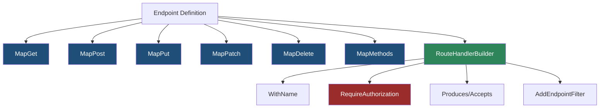
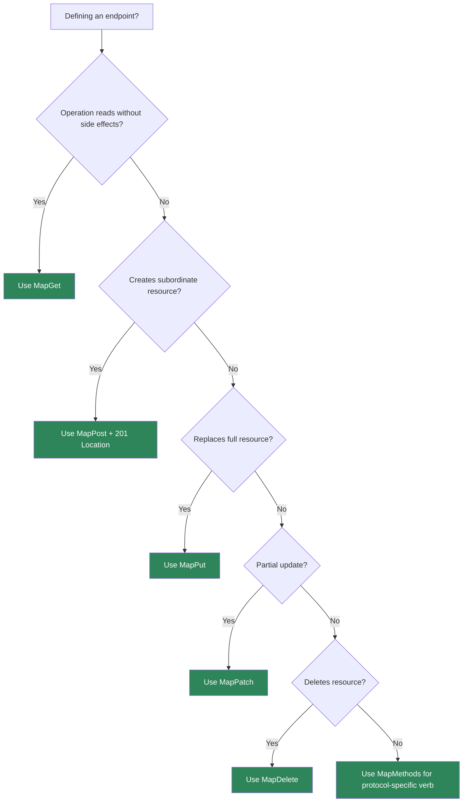

> [!success] Mastery Check
> - [ ] **Studied Well**
> - [ ] **Can explain the concept without notes**
> - [ ] **Can answer interview questions confidently**
> - [ ] **Can implement it in a real project**


# 4.079 - Defining Endpoints: MapGet, MapPost, MapPut, MapDelete, MapPatch

---

## PART 0 - Navigation & Context

### Where This Topic Lives

```
ASP.NET Core Mastery
├── Routing
│   ├── 4.064  Endpoint Routing
│   └── 4.065  Route Templates
└── Minimal APIs
    ├── 4.078  Why Minimal APIs Exist
    ├── 4.079  YOU ARE HERE - defining endpoints
    ├── 4.080  Route Parameter Binding
    └── 4.082  IResult and TypedResults
```

### What You Need Before This

- **[[4.078 - Minimal APIs: Why They Exist and When to Use Them]]** - `Map*` methods are the primary Minimal API surface.
- **[[4.064 - Endpoint Routing: The Modern Routing Architecture]]** - mapping creates endpoints for routing.
- **HTTP verb semantics** - `GET`, `POST`, `PUT`, `PATCH`, and `DELETE` carry API contract meaning.

### What This Unlocks After

- **[[4.080 - Route Parameter Binding in Minimal APIs]]** - endpoint handlers need bound values.
- **[[4.082 - IResult and TypedResults: Shaping HTTP Responses in Minimal APIs]]** - handlers need explicit response behavior.
- **[[4.084 - Route Groups in Minimal APIs: Shared Prefix and Authorization]]** - endpoint definitions scale through groups.

### Why This Matters at Scale

Endpoint definitions are your public HTTP contract; a wrong verb, missing route name, vague template, or implicit `200` changes how clients retry, cache, authorize, and observe your API.

---

## PART 1 - The Core Mental Model

### The Fundamental Rule

> **`MapGet`, `MapPost`, and the other `Map*` methods register route endpoints with HTTP method metadata; the practical consequence is that routing can return `404`, `405`, or execute your handler before any business logic runs.**

### The Plain-Language Analogy

An endpoint definition is a labeled service window. The route is the window location, the HTTP method is the kind of transaction allowed there, and the handler is the clerk behind it. If the client comes to the right window with the wrong transaction type, the system says "method not allowed" instead of pretending the window does not exist. If the client goes to a nonexistent window, it is a route miss.

### The Taxonomy Diagram



---

## PART 2 - Deep Mechanics

### 2.1 `MapGet` Registers an Endpoint, It Does Not Run the Handler

```
Startup:
app.MapGet("/api/orders/{id:int}", handler)
  -> RouteEndpointBuilder
  -> EndpointDataSource

Request:
Routing -> selected endpoint -> generated RequestDelegate -> handler
```

```csharp
app.MapGet("/api/orders/{orderId:int}", (int orderId) =>
    TypedResults.Ok(new { orderId }));
```

```http
// HTTP wire format:
GET /api/orders/42 HTTP/1.1
HTTP/1.1 200 OK
Content-Type: application/json
```

ASP.NET Core internally: `RequestDelegateFactory` analyzes the handler signature and builds a delegate that binds parameters and executes the handler.

**Runtime cost:** startup analysis plus per-request generated delegate invocation.

**Edge case:** Code after `app.Run()` is not endpoint registration for normal startup. Register endpoints before starting the app.

### 2.2 HTTP Method Metadata Produces 405

```
---> Routing
     path matches /api/orders/42
     method policy allows GET only
     request method POST rejected
---> 405 Method Not Allowed
```

```csharp
app.MapGet("/api/orders/{orderId:int}", (int orderId) => Results.Ok());
```

```http
// HTTP wire format:
POST /api/orders/42 HTTP/1.1

HTTP/1.1 405 Method Not Allowed
Allow: GET
```

ASP.NET Core source behavior: endpoint routing method policies filter candidate endpoints by HTTP method after path matching.

**Runtime cost:** one method policy pass over path candidates.

**Edge case:** `POST /missing` is 404 if no path matches; `POST /existing-get-route` is 405.

### 2.3 `RouteHandlerBuilder` Adds Metadata

```
MapPost(...)
  .WithName(...)
  .Accepts(...)
  .Produces(...)
  .RequireAuthorization(...)
      |
      metadata read by OpenAPI/auth/link generation
```

```csharp
app.MapPost("/api/orders", (CreateOrder request) =>
{
    var orderId = 123;
    return TypedResults.Created($"/api/orders/{orderId}", new { orderId });
})
.WithName("Orders.Create")
.Accepts<CreateOrder>("application/json")
.Produces<CreateOrderResponse>(StatusCodes.Status201Created)
.RequireAuthorization("Orders.Write");

public sealed record CreateOrder(string Sku, int Quantity);
public sealed record CreateOrderResponse(int OrderId);
```

**Runtime cost:** metadata is build-time; auth policy may add per-request cost.

**Edge case:** Metadata is declarative. Missing middleware means missing enforcement.

### 2.4 Route Groups Compose Endpoint Definitions

```
Group /api/orders
  metadata: auth, tags
  endpoints:
    GET /{id}
    POST /
```

```csharp
var orders = app.MapGroup("/api/orders")
    .WithTags("Orders")
    .RequireAuthorization("Orders");

orders.MapGet("/{orderId:int}", (int orderId) => Results.Ok(new { orderId }));
orders.MapPost("/", (CreateOrder request) => Results.Created("/api/orders/123", request));
```

**Runtime cost:** group prefix/metadata are composed at build time.

**Edge case:** Conventions on route groups often apply to all child endpoints regardless of call order; use separate groups for separate policy boundaries.

---

## PART 3 - Production Code Patterns

### Pattern 1: The CRUD Verb Contract

```csharp
// Domain scenario: inventory service.
var items = app.MapGroup("/api/items").WithTags("Items");

items.MapGet("/{sku}", (string sku) => Results.Ok(new { sku })).WithName("Items.Get");
items.MapPost("/", (CreateItem request) => Results.Created($"/api/items/{request.Sku}", request));
items.MapPut("/{sku}", (string sku, UpdateItem request) => Results.NoContent());
items.MapDelete("/{sku}", (string sku) => Results.NoContent());

public sealed record CreateItem(string Sku, string Name);
public sealed record UpdateItem(string Name);
```

```http
// HTTP wire format:
DELETE /api/items/ABC123 HTTP/1.1
HTTP/1.1 204 No Content
```

### Pattern 2: The Idempotent PUT

```csharp
// Domain scenario: customer profile API.
app.MapPut("/api/customers/{customerId:guid}/profile",
    (Guid customerId, UpdateProfile request) => Results.NoContent())
   .WithName("Customers.UpdateProfile");

public sealed record UpdateProfile(string DisplayName);
```

### Pattern 3: The Command POST With Location

```csharp
// Domain scenario: order creation.
app.MapPost("/api/orders", (CreateOrder request) =>
{
    var orderId = 123;
    return Results.CreatedAtRoute("Orders.GetById", new { orderId }, new { orderId });
})
.WithName("Orders.Create");

app.MapGet("/api/orders/{orderId:int}", (int orderId) => Results.Ok(new { orderId }))
   .WithName("Orders.GetById");
```

### Pattern 4: The Custom Method Endpoint

```csharp
// Domain scenario: WebDAV-like document lock API.
app.MapMethods("/api/documents/{documentId:guid}/lock", new[] { "LOCK" },
    (Guid documentId) => Results.Ok(new { documentId, locked = true }));
```

### Pattern 5: The Cancellation-Aware Handler

```csharp
// Domain scenario: reporting API.
app.MapGet("/api/reports/{reportId:int}", async (int reportId, CancellationToken ct) =>
{
    await Task.Delay(TimeSpan.FromMilliseconds(20), ct);
    return Results.Ok(new { reportId });
});
```

**Cost label:** cancellation token binding is zero business I/O by itself and prevents wasted work after client disconnect.

---

## PART 4 - Gotchas & Anti-Patterns

### Gotcha 1: Using POST for Every Operation

HTTP verbs are part of the contract.

```csharp
// ⚠️ WRONG CODE
app.MapPost("/api/orders/get", (GetOrder request) => Results.Ok());

// HTTP consequence (wrong path):
// Clients cannot cache or reason about safe reads.

// ✅ CORRECT CODE
app.MapGet("/api/orders/{orderId:int}", (int orderId) => Results.Ok());

// HTTP consequence (correct path):
// Safe read uses GET and route identity.

// WHY: method metadata communicates semantics to clients and middleware.
```

### Gotcha 2: Forgetting `201 Created` Location

Resource creation should give clients the canonical URL.

```csharp
// ⚠️ WRONG CODE
app.MapPost("/api/orders", (CreateOrder request) => Results.Ok(request));

// HTTP consequence (wrong path):
// Client receives 200 without canonical resource location.

// ✅ CORRECT CODE
app.MapPost("/api/orders", (CreateOrder request) =>
    Results.CreatedAtRoute("Orders.GetById", new { orderId = 123 }, new { orderId = 123 }));

// HTTP consequence (correct path):
// 201 Created with Location header.

// WHY: POST creation changes server state and should identify the created resource.
```

### Gotcha 3: Missing Method-Mismatch Tests

Wrong verbs should not look like route misses.

```csharp
// ⚠️ WRONG CODE
app.MapGet("/api/payments/{id:guid}", (Guid id) => Results.Ok());

// HTTP consequence (wrong path):
// POST /api/payments/{id} returns 405, which tests may ignore.

// ✅ CORRECT CODE
// Add integration test asserting 405 and Allow header.

// HTTP consequence (correct path):
// Method contract is verified.

// WHY: HTTP method policy runs during endpoint selection.
```

### Gotcha 4: Registering Endpoints After Startup

Endpoint mapping is startup configuration.

```csharp
// ⚠️ WRONG CODE
app.Run();
app.MapGet("/api/late", () => "never registered");

// HTTP consequence (wrong path):
// /api/late does not exist during normal startup.

// ✅ CORRECT CODE
app.MapGet("/api/late", () => "registered");
app.Run();

// HTTP consequence (correct path):
// /api/late can be matched.

// WHY: `Run` starts the host and blocks until shutdown.
```

### Gotcha 5: Treating `RouteHandlerBuilder` as Optional Polish

Metadata is operational behavior.

```csharp
// ⚠️ WRONG CODE
app.MapPost("/api/refunds", (RefundRequest request) => Results.Accepted());

// HTTP consequence (wrong path):
// No auth, docs, name, or response metadata.

// ✅ CORRECT CODE
app.MapPost("/api/refunds", (RefundRequest request) => Results.Accepted())
   .RequireAuthorization("Refunds.Create")
   .WithName("Refunds.Create")
   .Produces(StatusCodes.Status202Accepted);

// HTTP consequence (correct path):
// Auth and contract metadata are attached.

// WHY: endpoint builder metadata is how middleware and tools understand the endpoint.
```

---

## PART 5 - Performance Implications

### Request Pipeline Characteristics Table

| Scenario | Pipeline Depth | Allocations Per Request | Approx Latency Impact | Recommendation |
|---|---:|---:|---:|---|
| Simple `MapGet` | Routing + endpoint | low | Very low | Good hot path |
| `MapPost` JSON body | Routing + body bind | JSON allocations | Medium | Validate explicitly |
| Method mismatch | Routing policy | small | Low | Test 405 |
| Route group metadata | Build time | none per request | Low | Prefer for shared concerns |
| Many endpoints | Matcher | low per request | Low-medium | Partition by literals |
| Custom method | Method policy | low | Low | Use sparingly |
| Endpoint filter chain | Endpoint | filter dependent | Medium | Keep filters cheap |
| Cancellation token | Binding | ~0 | Saves work | Include for async I/O |

### BenchmarkDotNet Code

```csharp
using BenchmarkDotNet.Attributes;
using Microsoft.AspNetCore.Http;

[MemoryDiagnoser]
public sealed class EndpointHandlerShapeBenchmarks
{
    private readonly DefaultHttpContext _ctx = new();

    [Benchmark]
    public Task NaiveRawString() => Results.Text("ok").ExecuteAsync(_ctx);

    [Benchmark]
    public Task JsonObject() => Results.Json(new { Status = "ok" }).ExecuteAsync(_ctx);

    [Benchmark]
    public Task NoContent() => Results.NoContent().ExecuteAsync(_ctx);
}

// Expected output (approximate, .NET 8, x64, local):
// NoContent/Text are cheaper than JSON.
// In real APIs, network, auth, and database costs often dominate.
```

### When This Costs You

Very high-throughput endpoints, JSON-heavy POST bodies, many endpoint filters, and endpoints with expensive metadata-driven auth.

### When This Doesn't Matter

Internal admin endpoints, low-traffic APIs, and handlers dominated by database or external service calls.

---

## PART 6 - Interview Arsenal

### A. The Question Bank

**Question:** "What does `MapGet` do internally?"

**Average Answer:** "It creates a GET endpoint."

**Why That's Insufficient:** It needs the delegate and metadata path.

> **Great Answer:** "`MapGet` registers a route endpoint with GET method metadata and a handler delegate. At startup ASP.NET Core builds a `RequestDelegate` for that handler using `RequestDelegateFactory`. At request time routing selects the endpoint, method policy verifies GET, then endpoint middleware invokes the generated delegate."

**Question:** "Why does POST to a GET route return 405?"

**Average Answer:** "Because the method is wrong."

**Why That's Insufficient:** It misses path vs method matching.

> **Great Answer:** "If the path matches an endpoint but the HTTP method does not, the method matcher policy can reject the candidate and produce `405 Method Not Allowed` with an `Allow` header. If the path itself does not match any endpoint, then it is a 404. That distinction tells clients whether the resource path exists."

**Question:** "What does `RouteHandlerBuilder` buy you?"

**Average Answer:** "It lets you chain options."

**Why That's Insufficient:** It is how endpoints become operationally visible.

> **Great Answer:** "It attaches metadata and conventions to the endpoint: route names for link generation, authorization metadata for middleware, OpenAPI metadata for docs, endpoint filters for cross-cutting behavior. In production I treat those as part of the endpoint contract, not decoration."

### B. The Trick Questions

| Question | Trap | Correct Answer |
|---|---|---|
| Does `MapGet` execute at request time? | Registration/execution confusion | Registration runs at startup; handler runs per request. |
| Is wrong method a 404? | Path-only thinking | Often 405 if path matches. |
| Does `WithName` change matching? | Name as route | No, it helps link generation/metadata. |
| Is `MapPost` enough for creation? | Status code omission | Return 201 and Location for created resources. |

### C. Red Flags to Avoid

- "HTTP verbs are just naming." - wrong API contract.
- "Map methods run handlers immediately." - false.
- "405 does not matter." - it matters to clients.
- "Metadata is optional polish." - middleware/tools depend on it.
- "POST should return 200 by default." - poor creation contract.

---

## PART 7 - Decision Framework



---

## PART 8 - Self-Check

### A. Conceptual Questions

1. What happens to the HTTP request when the path matches but the method does not?
2. What is the difference between endpoint registration and endpoint execution?
3. Why should POST creation return `201 Created`?
4. What metadata can `RouteHandlerBuilder` attach?
5. Why do route groups reduce endpoint definition duplication?
6. When should you use `MapMethods`?
7. What does `WithName` affect?
8. Why is cancellation token binding useful in endpoint handlers?

### B. Code Puzzles

```csharp
app.MapGet("/api/orders/{id:int}", (int id) => Results.Ok(id));
```

<details><summary>Answer</summary>
`POST /api/orders/42` usually returns 405 because the path matches but the method does not.
</details>

```csharp
app.Run();
app.MapGet("/api/health", () => "ok");
```

<details><summary>Answer</summary>
The endpoint is registered after the app starts/blocking call, so it will not be available during normal startup.
</details>

```csharp
app.MapPost("/api/orders", (CreateOrder request) => Results.Ok(request));
```

<details><summary>Answer</summary>
The creation response is weak: it returns 200 and no canonical resource URL. Prefer 201 Created with Location.
</details>

```csharp
app.MapGet("/api/orders/{id:int}", (int id) => Results.Ok()).WithName("Orders.Get");
```

<details><summary>Answer</summary>
`WithName` does not change inbound matching. It provides an endpoint address for link generation and metadata.
</details>

---

## PART 9 - Connections & Resources

### A. Related Topics Table

| Topic | Why It Connects |
|---|---|
| [[4.078 - Minimal APIs: Why They Exist and When to Use Them]] | Defines why this endpoint model exists. |
| [[4.080 - Route Parameter Binding in Minimal APIs]] | Handler parameters are populated after endpoint selection. |
| [[4.082 - IResult and TypedResults: Shaping HTTP Responses in Minimal APIs]] | Handler return types shape HTTP responses. |
| [[4.084 - Route Groups in Minimal APIs: Shared Prefix and Authorization]] | Groups compose endpoint definitions at scale. |
| [[4.283 - REST API Design Conventions in ASP.NET Core]] | Verb choice and status codes are REST API contract decisions. |

### B. Books

| Book | Chapters | Why These Chapters |
|---|---|---|
| *ASP.NET Core in Action* | Minimal APIs | Explains endpoint mapping and route handlers. |
| *Pro ASP.NET Core* | Minimal API chapters | Good CRUD mapping examples. |

### C. Essential Articles & Docs

- [Microsoft Docs - Minimal API route handlers](https://learn.microsoft.com/aspnet/core/fundamentals/minimal-apis/route-handlers)
- [Microsoft Docs - Minimal APIs quick reference](https://learn.microsoft.com/aspnet/core/fundamentals/minimal-apis)
- [Microsoft Docs - Routing in ASP.NET Core](https://learn.microsoft.com/aspnet/core/fundamentals/routing)
- [ASP.NET Core source - RequestDelegateFactory](https://github.com/dotnet/aspnetcore/tree/main/src/Http/Http.Extensions)

### D. Template Meta-Note

> [!NOTE]
> **Part 0** orients the topic. **Part 1** gives the mental model. **Part 2** shows framework mechanics. **Part 3** gives production patterns. **Part 4** names gotchas. **Part 5** covers performance. **Part 6** prepares interviews. **Part 7** gives decisions. **Part 8** checks understanding. **Part 9** connects resources.
