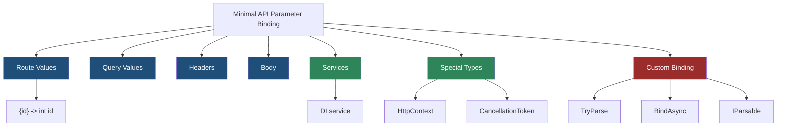
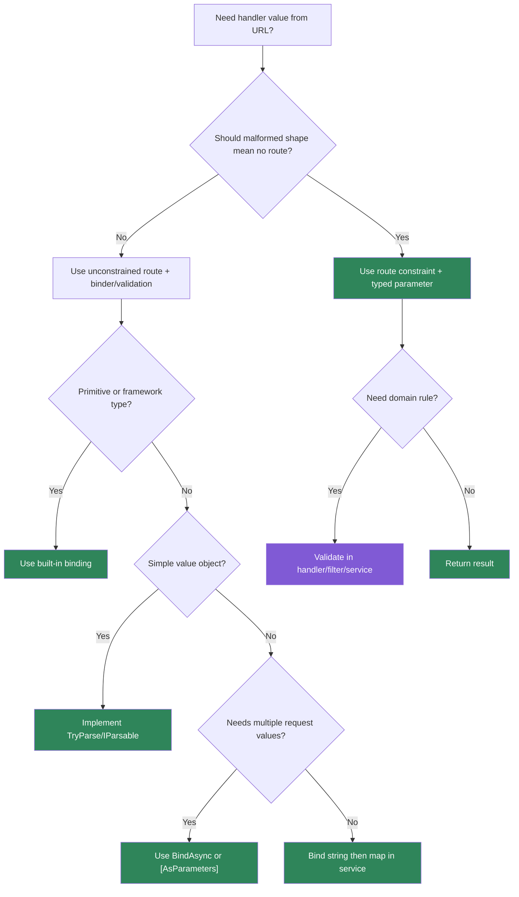

> [!success] Mastery Check
> - [ ] **Studied Well**
> - [ ] **Can explain the concept without notes**
> - [ ] **Can answer interview questions confidently**
> - [ ] **Can implement it in a real project**


# 4.080 - Route Parameter Binding in Minimal APIs

---

## PART 0 - Navigation & Context

### Where This Topic Lives

```
ASP.NET Core Mastery
├── Routing
│   ├── 4.065  Route Templates
│   ├── 4.066  Route Constraints
│   └── 4.068  Route Precedence
└── Minimal APIs
    ├── 4.079  Defining Endpoints
    ├── 4.080  YOU ARE HERE - route parameter binding
    ├── 4.081  Query String Binding
    └── 4.086  Validation in Minimal APIs
```

### What You Need Before This

- **[[4.079 - Defining Endpoints: MapGet, MapPost, MapPut, MapDelete]]** - handler parameters belong to mapped endpoints.
- **[[4.065 - Route Templates: Syntax, Literals, Parameters, and Wildcards]]** - route parameters originate in the template.
- **[[4.066 - Route Constraints: Type Constraints, Regex, and Custom Constraints]]** - constraints run before binding and can produce 404.

### What This Unlocks After

- **[[4.081 - Query String Binding and [FromQuery] in Minimal APIs]]** - query binding fills values not in the route.
- **[[4.086 - Validation in Minimal APIs: IValidator<T> and Manual Validation]]** - binding is not domain validation.
- **[[4.095 - IEndpointMetadataProvider: Pushing Metadata from Parameter Types]]** - parameter types can influence endpoint metadata.

### Why This Matters at Scale

Route parameter binding is where URL text becomes typed data; misunderstanding whether failure happens in routing or binding leads to wrong `404` vs `400` contracts and confusing production diagnostics.

---

## PART 1 - The Core Mental Model

### The Fundamental Rule

> **Minimal API route binding happens after endpoint routing selects a route; the practical consequence is that constraint failure is `404`, while selected-endpoint parse failure is usually `400`.**

### The Plain-Language Analogy

Routing is the receptionist deciding which desk should handle the visitor. Binding is the desk clerk copying the visitor's form into typed fields. If the receptionist says "there is no desk for this kind of visitor," the result is no route. If the desk exists but the visitor wrote letters in the "integer id" box, the desk rejects the form as a bad request.

### The Taxonomy Diagram



---

## PART 2 - Deep Mechanics

### 2.1 Route Values Are Created by Routing

```
---> Routing
     template /api/orders/{orderId}
     path /api/orders/42
     route value orderId = "42"
---> Endpoint delegate
     bind "42" -> int orderId
```

```csharp
app.MapGet("/api/orders/{orderId}", (int orderId) =>
    Results.Ok(new { orderId }));
```

```http
// HTTP wire format:
GET /api/orders/42 HTTP/1.1
HTTP/1.1 200 OK
Content-Type: application/json
```

ASP.NET Core internally: `EndpointRoutingMiddleware` populates `RouteValues`; `RequestDelegateFactory` generated code reads the value and parses it for the handler parameter.

**Runtime cost:** route value lookup plus parse; simple primitives are cheap.

**Edge case:** Parameter name matters. `{orderId}` binds to `orderId`, not `id`, unless an attribute specifies a name.

### 2.2 Constraint Failure vs Binding Failure

```
Constrained route:
/orders/{id:int} + /orders/abc
  -> no endpoint selected -> 404

Unconstrained route:
/orders/{id} + handler int id + /orders/abc
  -> endpoint selected -> binding fails -> 400
```

```csharp
app.MapGet("/api/a/{id:int}", (int id) => Results.Ok(id));
app.MapGet("/api/b/{id}", (int id) => Results.Ok(id));
```

```http
// HTTP wire format:
GET /api/a/abc HTTP/1.1
HTTP/1.1 404 Not Found

GET /api/b/abc HTTP/1.1
HTTP/1.1 400 Bad Request
```

ASP.NET Core source behavior: constraints are route candidate policies; binding is generated request delegate code after selection.

**Runtime cost:** constraint check or parse failure; failure path writes small error response.

**Edge case:** Choose constraints when invalid shape means "no such URL"; choose binding/validation when invalid value means "bad request."

### 2.3 Binding Sources Are Inferred

```
Handler signature:
(int orderId, string? status, OrdersDb db, CancellationToken ct)

Sources:
orderId -> route if template contains {orderId}
status  -> query if no route value exists
db      -> DI service
ct      -> request abort token
```

```csharp
app.MapGet("/api/orders/{orderId:int}",
    async (int orderId, string? status, OrdersDb db, CancellationToken ct) =>
    {
        var order = await db.Orders.FindAsync([orderId], ct);
        return order is null ? Results.NotFound() : Results.Ok(order);
    });
```

**Runtime cost:** route/query lookups, DI resolution for scoped service, cancellation token access.

**Edge case:** If a parameter name appears in both route and query, route wins for route-bound simple parameters.

### 2.4 Custom Route Types Use `TryParse` or `BindAsync`

```
Route value "ORD-2026-0001"
---> static TryParse(string?, out OrderNumber)
---> handler receives OrderNumber
```

```csharp
public readonly record struct OrderNumber(string Value)
{
    public static bool TryParse(string? value, out OrderNumber orderNumber)
    {
        if (!string.IsNullOrWhiteSpace(value) && value.StartsWith("ORD-", StringComparison.Ordinal))
        {
            orderNumber = new OrderNumber(value);
            return true;
        }

        orderNumber = default;
        return false;
    }
}

app.MapGet("/api/orders/{orderNumber}", (OrderNumber orderNumber) =>
    Results.Ok(new { orderNumber.Value }));
```

**Runtime cost:** one custom parse call.

**Edge case:** `TryParse` failure after endpoint selection produces 400. If you want 404 for shape mismatch, add a route constraint.

---

## PART 3 - Production Code Patterns

### Pattern 1: The Constraint-and-Bind Contract

```csharp
// Domain scenario: order management service.
app.MapGet("/api/orders/{orderId:int}", (int orderId) =>
    Results.Ok(new { orderId }));
```

```http
// HTTP wire format:
GET /api/orders/abc HTTP/1.1
HTTP/1.1 404 Not Found
```

### Pattern 2: The Bad Request Parse Contract

```csharp
// Domain scenario: support ticket API where malformed route id should be explained.
app.MapGet("/api/tickets/{ticketId}", (int ticketId) =>
    Results.Ok(new { ticketId }));
```

```http
// HTTP wire format:
GET /api/tickets/abc HTTP/1.1
HTTP/1.1 400 Bad Request
```

### Pattern 3: The Explicit Route Name Binding

```csharp
// Domain scenario: payment API.
app.MapGet("/api/payments/{id:guid}", ([FromRoute(Name = "id")] Guid paymentId) =>
    Results.Ok(new { paymentId }));
```

### Pattern 4: The Domain Value Object Binder

```csharp
// Domain scenario: logistics shipment tracking.
public readonly record struct TrackingNumber(string Value)
{
    public static bool TryParse(string? value, out TrackingNumber number)
    {
        if (!string.IsNullOrWhiteSpace(value) && value.Length is >= 10 and <= 32)
        {
            number = new TrackingNumber(value.ToUpperInvariant());
            return true;
        }

        number = default;
        return false;
    }
}

app.MapGet("/api/shipments/{trackingNumber}", (TrackingNumber trackingNumber) =>
    Results.Ok(new { trackingNumber.Value }));
```

### Pattern 5: The Route Plus Service Boundary

```csharp
// Domain scenario: inventory lookup.
app.MapGet("/api/inventory/{sku}", async (string sku, InventoryService service, CancellationToken ct) =>
{
    var item = await service.FindBySkuAsync(sku, ct);
    return item is null ? Results.NotFound() : Results.Ok(item);
});
```

**Cost label:** route binding is cheap; the service call dominates latency and must honor cancellation.

---

## PART 4 - Gotchas & Anti-Patterns

### Gotcha 1: Expecting Constraint Failure to Return 400

Routing failure is not binding failure.

```csharp
// ⚠️ WRONG CODE
app.MapGet("/api/orders/{id:int}", (int id) => Results.Ok(id));

// HTTP consequence (wrong path):
// GET /api/orders/abc -> 404, not 400.

// ✅ CORRECT CODE
app.MapGet("/api/orders/{id}", (int id) => Results.Ok(id));

// HTTP consequence (correct path):
// GET /api/orders/abc -> 400 if endpoint selected but int binding fails.

// WHY: constraints run before endpoint selection; binding runs inside the selected endpoint delegate.
```

### Gotcha 2: Parameter Name Mismatch

The route value name and handler parameter name must line up.

```csharp
// ⚠️ WRONG CODE
app.MapGet("/api/orders/{orderId:int}", (int id) => Results.Ok(id));

// HTTP consequence (wrong path):
// Binding may fail because route value `id` is missing.

// ✅ CORRECT CODE
app.MapGet("/api/orders/{orderId:int}", (int orderId) => Results.Ok(orderId));

// HTTP consequence (correct path):
// Route value binds to handler parameter.

// WHY: Minimal API binding uses names unless attributes override them.
```

### Gotcha 3: Treating Binding as Domain Validation

Binding answers "can this be typed?", not "is this allowed?"

```csharp
// ⚠️ WRONG CODE
app.MapGet("/api/orders/{quantity:int}", (int quantity) => Results.Ok(quantity));

// HTTP consequence (wrong path):
// /api/orders/-10 binds successfully even if negative quantity is invalid.

// ✅ CORRECT CODE
app.MapGet("/api/orders/{quantity:int}", (int quantity) =>
    quantity <= 0 ? Results.BadRequest(new { error = "Quantity must be positive." }) : Results.Ok(quantity));

// HTTP consequence (correct path):
// Negative quantity -> 400 with domain reason.

// WHY: route constraints and binding do not replace business validation.
```

### Gotcha 4: Accidentally Binding From Query

If no route value exists, simple parameters can come from query.

```csharp
// ⚠️ WRONG CODE
app.MapGet("/api/orders/{orderId:int}", (int id) => Results.Ok(id));

// HTTP consequence (wrong path):
// Handler may look for `id` elsewhere instead of route `orderId`.

// ✅ CORRECT CODE
app.MapGet("/api/orders/{orderId:int}", ([FromRoute] int orderId) => Results.Ok(orderId));

// HTTP consequence (correct path):
// Binding source is explicit and aligned with template.

// WHY: explicit binding attributes remove source ambiguity.
```

### Gotcha 5: Custom `TryParse` With Exceptions

Parsing failures should be false, not exceptions.

```csharp
// ⚠️ WRONG CODE
public static bool TryParse(string? value, out OrderNumber n)
{
    n = new OrderNumber(value!);
    if (!value!.StartsWith("ORD-")) throw new FormatException();
    return true;
}

// HTTP consequence (wrong path):
// Malformed route can become 500 if exception escapes.

// ✅ CORRECT CODE
public static bool TryParse(string? value, out OrderNumber n)
{
    if (value is not null && value.StartsWith("ORD-", StringComparison.Ordinal))
    {
        n = new OrderNumber(value);
        return true;
    }
    n = default;
    return false;
}

// HTTP consequence (correct path):
// Malformed value -> 400 binding failure.

// WHY: Minimal API binder treats false as failed binding; exceptions are failures of your code.
```

---

## PART 5 - Performance Implications

### Request Pipeline Characteristics Table

| Scenario | Pipeline Depth | Allocations Per Request | Approx Latency Impact | Recommendation |
|---|---:|---:|---:|---|
| `int` route bind | Endpoint delegate | ~0 | Very low | Use normally |
| `Guid` route bind | Endpoint delegate | ~0 | Very low | Use normally |
| Constraint miss | Routing | ~0 | Very low | Returns 404 |
| Binding failure | Endpoint delegate | error write | Low | Returns 400 |
| Custom `TryParse` | Endpoint delegate | implementation dependent | Low | Keep pure |
| `BindAsync` | Endpoint delegate | async dependent | Medium | Avoid I/O unless necessary |
| DI service parameter | Endpoint delegate | scoped lookup | Low | Fine |
| CancellationToken | Endpoint delegate | ~0 | None | Use for async work |

### BenchmarkDotNet Code

```csharp
using BenchmarkDotNet.Attributes;

[MemoryDiagnoser]
public sealed class RouteParseBenchmarks
{
    private const string IntValue = "12345";
    private const string GuidValue = "11111111-1111-1111-1111-111111111111";
    private const string OrderValue = "ORD-2026-0001";

    [Benchmark] public bool ParseInt() => int.TryParse(IntValue, out _);
    [Benchmark] public bool ParseGuid() => Guid.TryParse(GuidValue, out _);
    [Benchmark] public bool ParseOrderNumber() => OrderNumber.TryParse(OrderValue, out _);
}

public readonly record struct OrderNumber(string Value)
{
    public static bool TryParse(string? value, out OrderNumber number)
    {
        number = value is not null ? new OrderNumber(value) : default;
        return value?.StartsWith("ORD-", StringComparison.Ordinal) == true;
    }
}

// Expected output (approximate, .NET 8, x64, local):
// Primitive parsing is nanosecond-scale.
// Custom parsing cost depends entirely on your implementation.
```

### When This Costs You

Custom binders with allocation, `BindAsync` methods doing I/O, huge route value objects, and endpoints where malformed values cause exception-heavy paths.

### When This Doesn't Matter

Primitive route parameters, GUID IDs, simple value-object `TryParse`, and endpoints dominated by database or serialization work.

---

## PART 6 - Interview Arsenal

### A. The Question Bank

**Question:** "What is the difference between route constraints and Minimal API binding?"

**Average Answer:** "Both validate route parameters."

**Why That's Insufficient:** They happen at different pipeline stages.

> **Great Answer:** "A route constraint runs during endpoint selection. If `{id:int}` receives `abc`, no endpoint is selected and the client usually sees 404. Binding runs after an endpoint is selected; if the template is `{id}` and the handler parameter is `int id`, `abc` reaches the binder and the client usually sees 400. I choose between those based on whether malformed input means no such URL or bad request."

**Question:** "How does Minimal API decide where a parameter comes from?"

**Average Answer:** "From the route or query."

**Why That's Insufficient:** It misses DI, special types, and inference.

> **Great Answer:** "The generated delegate looks at route values first when the template has a matching name, then other sources such as query, headers, body, services, and special types like `HttpContext` or `CancellationToken`. In production I use explicit attributes when ambiguity would hurt readability."

**Question:** "How do you bind a domain-specific ID type?"

**Average Answer:** "Use a string and parse it."

**Why That's Insufficient:** It loses type-safety.

> **Great Answer:** "For simple value objects I add a static `TryParse` or implement a supported parsing pattern so Minimal API binding can create the type. I keep parsing pure and cheap, return false on malformed values, and then do domain existence checks in the handler or service."

### B. The Trick Questions

| Question | Trap | Correct Answer |
|---|---|---|
| `{id:int}` with `abc` returns 400? | Constraint vs binding | No, usually 404. |
| `{id}` with `(int id)` and `abc` returns 404? | Binding vs routing | No, route selected then binding fails, usually 400. |
| Does binding validate business rules? | Type vs domain | No, add validation. |
| Can services appear as handler parameters? | Route-only thinking | Yes, DI services can be injected. |

### C. Red Flags to Avoid

- "Route constraints and binding are the same." - wrong pipeline stage.
- "All bad IDs should be 400." - depends on route design.
- "Parameter names do not matter." - they do.
- "Binding handles domain validation." - false.
- "Custom parsers can throw." - bad failure path.

---

## PART 7 - Decision Framework



---

## PART 8 - Self-Check

### A. Conceptual Questions

1. What happens to the HTTP request if `{id:int}` receives `abc`?
2. What happens to the HTTP request if `{id}` maps to `(int id)` and receives `abc`?
3. Why do route parameter names matter?
4. When should `[FromRoute]` be used in Minimal APIs?
5. How is binding different from validation?
6. Why should custom `TryParse` avoid exceptions?
7. What sources can Minimal API parameters come from?
8. What is the runtime cost of primitive route binding?
9. When would `BindAsync` be appropriate?

### B. Code Puzzles

```csharp
app.MapGet("/orders/{id:int}", (int id) => Results.Ok(id));
```

<details><summary>Answer</summary>
`GET /orders/abc` returns 404 because the route constraint rejects the candidate before binding.
</details>

```csharp
app.MapGet("/orders/{id}", (int id) => Results.Ok(id));
```

<details><summary>Answer</summary>
`GET /orders/abc` selects the endpoint, then `int` binding fails, usually producing 400 Bad Request.
</details>

```csharp
app.MapGet("/orders/{orderId:int}", (int id) => Results.Ok(id));
```

<details><summary>Answer</summary>
The route value is named `orderId`, but the handler parameter is `id`. Use matching names or `[FromRoute(Name = "orderId")]`.
</details>

```csharp
app.MapGet("/orders/{quantity:int}", (int quantity) => Results.Ok(quantity));
```

<details><summary>Answer</summary>
`GET /orders/-5` can bind successfully. The `int` constraint and binder do not enforce positive business rules.
</details>

```csharp
public static bool TryParse(string? value, out OrderId id)
{
    if (value is null) throw new FormatException();
    id = new OrderId(value);
    return true;
}
```

<details><summary>Answer</summary>
The parser throws instead of returning false. Malformed input can become a 500-style code failure instead of a clean 400 binding failure.
</details>

---

## PART 9 - Connections & Resources

### A. Related Topics Table

| Topic | Why It Connects |
|---|---|
| [[4.079 - Defining Endpoints: MapGet, MapPost, MapPut, MapDelete]] | Endpoint handlers declare the parameters that need binding. |
| [[4.065 - Route Templates: Syntax, Literals, Parameters, and Wildcards]] | Route templates create route values for binding. |
| [[4.066 - Route Constraints: Type Constraints, Regex, and Custom Constraints]] | Constraints run before Minimal API binding. |
| [[4.081 - Query String Binding and [FromQuery] in Minimal APIs]] | Query binding is the next source after route values for many simple parameters. |
| [[4.086 - Validation in Minimal APIs: IValidator<T> and Manual Validation]] | Binding creates typed values; validation enforces domain rules. |

### B. Books

| Book | Chapters | Why These Chapters |
|---|---|---|
| *ASP.NET Core in Action* | Minimal APIs and routing | Explains route handler binding and failure modes. |
| *Pro ASP.NET Core* | Minimal APIs | Provides practical binding examples. |

### C. Essential Articles & Docs

- [Microsoft Docs - Minimal APIs quick reference](https://learn.microsoft.com/aspnet/core/fundamentals/minimal-apis)
- [Microsoft Docs - Minimal API route handlers](https://learn.microsoft.com/aspnet/core/fundamentals/minimal-apis/route-handlers)
- [Microsoft Docs - Routing in ASP.NET Core](https://learn.microsoft.com/aspnet/core/fundamentals/routing)
- [ASP.NET Core source - RequestDelegateFactory](https://github.com/dotnet/aspnetcore/tree/main/src/Http/Http.Extensions)

### D. Template Meta-Note

> [!NOTE]
> **Part 0** orients the topic. **Part 1** gives the mental model. **Part 2** shows framework mechanics. **Part 3** gives production patterns. **Part 4** names gotchas. **Part 5** covers performance. **Part 6** prepares interviews. **Part 7** gives decisions. **Part 8** checks understanding. **Part 9** connects resources.
