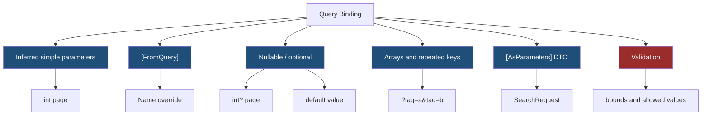
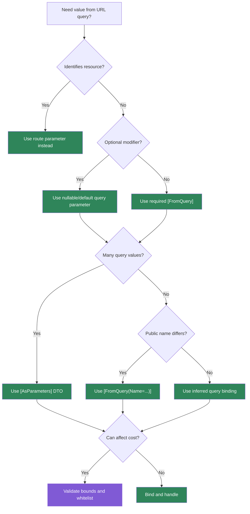

> [!success] Mastery Check
> - [ ] **Studied Well**
> - [ ] **Can explain the concept without notes**
> - [ ] **Can answer interview questions confidently**
> - [ ] **Can implement it in a real project**


# 4.081 - Query String Binding and [FromQuery] in Minimal APIs

---

## PART 0 - Navigation & Context

### Where This Topic Lives

```
ASP.NET Core Mastery
├── Routing
│   └── 4.080  Route Parameter Binding
└── Minimal APIs
    ├── 4.081  YOU ARE HERE - query binding
    ├── 4.086  Validation in Minimal APIs
    └── 4.092  Minimal API vs MVC Controller
```

### What You Need Before This

- **[[4.079 - Defining Endpoints: MapGet, MapPost, MapPut, MapDelete]]** - query parameters are bound into endpoint handler parameters.
- **[[4.080 - Route Parameter Binding in Minimal APIs]]** - route values are checked before query values for matching names.
- **HTTP query string basics** - query strings are part of the URL, not the body.

### What This Unlocks After

- **[[4.086 - Validation in Minimal APIs: IValidator<T> and Manual Validation]]** - binding succeeds before domain validation.
- **[[4.285 - Pagination in REST APIs: Keyset and Offset with Link Headers]]** - pagination is usually query-bound.
- **[[4.103 - Content Type Negotiation: Produces, Consumes, and Accept Headers]]** - query and header binding often work together for API contracts.

### Why This Matters at Scale

Query binding controls filters, paging, sorting, and search; wrong defaults or ambiguous binding can turn harmless-looking read endpoints into expensive unbounded database queries.

---

## PART 1 - The Core Mental Model

### The Fundamental Rule

> **Minimal API query binding reads URL query values after route selection and before handler execution; the practical consequence is that parse failures usually produce `400`, while missing optional values become `null` or defaults.**

### The Plain-Language Analogy

The route path chooses the service desk, and the query string is the checklist handed to that desk. `/orders` says which desk; `?status=pending&page=2` says how to search. If the checklist says `page=abc`, the desk exists but the form is malformed. If the checklist omits `page`, the desk can use a default.

### The Taxonomy Diagram



---

## PART 2 - Deep Mechanics

### 2.1 Query Binding Happens Inside the Generated Endpoint Delegate

```
---> Routing[select /api/orders] ---> Auth ---> Endpoint delegate
                                      reads Request.Query["page"]
                                      parses int
                                      calls handler
```

```csharp
app.MapGet("/api/orders", (int page = 1, int pageSize = 50) =>
    Results.Ok(new { page, pageSize }));
```

```http
// HTTP wire format:
GET /api/orders?page=2&pageSize=25 HTTP/1.1

HTTP/1.1 200 OK
Content-Type: application/json
```

ASP.NET Core internally: `RequestDelegateFactory` generates binding code that reads `HttpRequest.Query`, parses simple types, and calls the handler.

**Runtime cost:** query collection lookup plus parse per bound value; cheap unless used to trigger expensive unbounded queries.

**Edge case:** Missing non-nullable values without defaults can fail binding and produce `400`.

### 2.2 `[FromQuery]` Removes Source Ambiguity

```
Handler parameter:
[FromQuery(Name = "p")] int page
      |
Request.Query["p"]
```

```csharp
app.MapGet("/api/products",
    ([FromQuery(Name = "q")] string? search,
     [FromQuery(Name = "p")] int page = 1) =>
        Results.Ok(new { search, page }));
```

```http
// HTTP wire format:
GET /api/products?q=laptop&p=3 HTTP/1.1

HTTP/1.1 200 OK
```

Framework source behavior: explicit binding attributes from `Microsoft.AspNetCore.Mvc` tell the generated delegate which request source and key name to use.

**Runtime cost:** same query lookup; clarity is the win.

**Edge case:** `[FromQuery]` is useful when route and query names conflict or when public query names differ from C# parameter names.

### 2.3 Repeated Query Keys Bind to Collections

```
/api/search?tag=fragile&tag=priority
      |
string[] tag = ["fragile", "priority"]
```

```csharp
app.MapGet("/api/shipments/search", ([FromQuery] string[] tag) =>
    Results.Ok(new { Tags = tag }));
```

**Runtime cost:** array allocation for repeated values.

**Edge case:** Query strings are client-controlled and can be huge. Validate maximum count and length before querying storage.

### 2.4 `[AsParameters]` Groups Query Inputs

```csharp
public sealed record OrderSearch(
    [property: FromQuery] string? Status,
    [property: FromQuery] int Page = 1,
    [property: FromQuery] int PageSize = 50);

app.MapGet("/api/orders/search", ([AsParameters] OrderSearch search) =>
    Results.Ok(search));
```

ASP.NET Core internally: `[AsParameters]` expands properties into individual bindable parameters.

**Runtime cost:** request DTO construction plus property binding.

**Edge case:** `[AsParameters]` is not validation. Bounds like `PageSize <= 100` still need code or a filter.

---

## PART 3 - Production Code Patterns

### Pattern 1: The Bounded Pagination Query

```csharp
// Domain scenario: order management service.
app.MapGet("/api/orders", ([FromQuery] int page = 1, [FromQuery] int pageSize = 50) =>
{
    if (page < 1 || pageSize is < 1 or > 100)
    {
        return Results.BadRequest(new { error = "Invalid paging range." });
    }

    return Results.Ok(new { page, pageSize });
});
```

```http
// HTTP wire format:
GET /api/orders?page=1&pageSize=5000 HTTP/1.1
HTTP/1.1 400 Bad Request
```

### Pattern 2: The Public Query Name Alias

```csharp
// Domain scenario: product search.
app.MapGet("/api/products/search",
    ([FromQuery(Name = "q")] string? searchText,
     [FromQuery(Name = "sort")] string? sortKey) =>
        Results.Ok(new { searchText, sortKey }));
```

### Pattern 3: The Search DTO

```csharp
// Domain scenario: logistics shipment search.
public sealed record ShipmentSearch(
    [property: FromQuery] string? Status,
    [property: FromQuery] DateOnly? From,
    [property: FromQuery] DateOnly? To,
    [property: FromQuery] int Page = 1);

app.MapGet("/api/shipments", ([AsParameters] ShipmentSearch search) =>
    Results.Ok(search));
```

### Pattern 4: The Repeated Tags Guard

```csharp
// Domain scenario: inventory catalog.
app.MapGet("/api/catalog", ([FromQuery] string[] tags) =>
{
    if (tags.Length > 10)
    {
        return Results.BadRequest(new { error = "At most 10 tags are allowed." });
    }

    return Results.Ok(new { tags });
});
```

### Pattern 5: The Route-Query Separation

```csharp
// Domain scenario: payment API.
app.MapGet("/api/customers/{customerId:guid}/payments",
    (Guid customerId, [FromQuery] string? status) =>
        Results.Ok(new { customerId, status }));
```

---

## PART 4 - Gotchas & Anti-Patterns

### Gotcha 1: Unbounded Page Size

Experienced teams forget that query parameters are public cost controls.

```csharp
// WRONG CODE
app.MapGet("/api/orders", ([FromQuery] int pageSize = 1000) => Results.Ok());

// HTTP consequence (wrong path):
// GET /api/orders?pageSize=100000 can trigger huge DB reads.

// CORRECT CODE
app.MapGet("/api/orders", ([FromQuery] int pageSize = 50) =>
    pageSize is >= 1 and <= 100 ? Results.Ok() : Results.BadRequest());

// HTTP consequence (correct path):
// Oversized pageSize -> 400 Bad Request.

// WHY: binding parses values; validation protects resources.
```

### Gotcha 2: Assuming Missing Query Equals Empty String

Null and empty are different client signals.

```csharp
// WRONG CODE
app.MapGet("/api/products", ([FromQuery] string search) => Results.Ok(search.Length));

// HTTP consequence (wrong path):
// Missing search can fail binding or behave unexpectedly.

// CORRECT CODE
app.MapGet("/api/products", ([FromQuery] string? search) =>
    Results.Ok(new { search = string.IsNullOrWhiteSpace(search) ? null : search }));

// HTTP consequence (correct path):
// Missing search is accepted intentionally.

// WHY: nullable annotations communicate optional query semantics.
```

### Gotcha 3: Route and Query Name Collision

Ambiguous names make handlers hard to reason about.

```csharp
// WRONG CODE
app.MapGet("/api/orders/{id:int}", (int id, [FromQuery] int? id2) => Results.Ok());

// HTTP consequence (wrong path):
// Clients and maintainers cannot tell which id controls identity.

// CORRECT CODE
app.MapGet("/api/orders/{orderId:int}", (int orderId, [FromQuery] string? include) =>
    Results.Ok(new { orderId, include }));

// HTTP consequence (correct path):
// Route identity and query modifiers are separate.

// WHY: route values identify resources; query values modify representation or search.
```

### Gotcha 4: Treating Query Binding as Authorization

Tenant query parameters are not trusted identity.

```csharp
// WRONG CODE
app.MapGet("/api/orders", ([FromQuery] Guid tenantId) => Results.Ok());

// HTTP consequence (wrong path):
// Client can choose another tenant id.

// CORRECT CODE
app.MapGet("/api/orders", (ClaimsPrincipal user) => Results.Ok())
   .RequireAuthorization("TenantMember");

// HTTP consequence (correct path):
// Tenant access is enforced by auth, not query text.

// WHY: query values are untrusted request input.
```

### Gotcha 5: Query Arrays Without Limits

Repeated keys are useful and abusable.

```csharp
// WRONG CODE
app.MapGet("/api/search", ([FromQuery] string[] tag) => Results.Ok(tag));

// HTTP consequence (wrong path):
// Thousands of tags can allocate and build huge SQL predicates.

// CORRECT CODE
app.MapGet("/api/search", ([FromQuery] string[] tag) =>
    tag.Length <= 20 ? Results.Ok(tag) : Results.BadRequest());

// HTTP consequence (correct path):
// Excess tag count -> 400 Bad Request.

// WHY: binding allocates collection values before your query layer runs.
```

---

## PART 5 - Performance Implications

### Request Pipeline Characteristics Table

| Scenario | Pipeline Depth | Allocations Per Request | Approx Latency Impact | Recommendation |
|---|---:|---:|---:|---|
| Single int query | Endpoint delegate | ~0 | Very low | Fine |
| Optional string query | Endpoint delegate | string ref | Very low | Use nullable |
| Repeated query values | Endpoint delegate | array allocation | Low-medium | Limit count |
| `[AsParameters]` DTO | Endpoint delegate | DTO allocation | Low | Good for many parameters |
| Date parsing | Endpoint delegate | parse cost | Low | Prefer ISO format |
| Invalid parse | Endpoint delegate | error response | Low | Test 400 |
| Unbounded page size | Handler/DB | huge downstream cost | Critical | Validate |
| Query-driven sorting | Handler/DB | query plan cost | Medium-high | Whitelist keys |

### BenchmarkDotNet Code

```csharp
using BenchmarkDotNet.Attributes;

[MemoryDiagnoser]
public sealed class QueryParseBenchmarks
{
    private const string Page = "42";
    private const string From = "2026-06-08";

    [Benchmark] public bool ParseIntPage() => int.TryParse(Page, out _);
    [Benchmark] public bool ParseDateOnly() => DateOnly.TryParse(From, out _);
    [Benchmark] public string[] RepeatedTags() => new[] { "fragile", "priority", "cold-chain" };
}

// Expected output (approximate, .NET 8, x64, local):
// Primitive parsing is tiny; collection allocation and downstream database work matter more.
```

### When This Costs You

Search APIs, reporting endpoints, large collection endpoints, repeated query arrays, and query parameters that influence database sorting or filtering.

### When This Doesn't Matter

Small internal endpoints and simple optional flags where handler work dominates binding cost.

---

## PART 6 - Interview Arsenal

### A. The Question Bank

**Question:** "How does Minimal API bind query string values?"

**Average Answer:** "It binds parameters from the query."

**Why That's Insufficient:** It misses routing order and failure behavior.

> **Great Answer:** "Routing selects the endpoint first. Then the generated Minimal API delegate reads query values, parses them into handler parameter types, and calls the handler. If parsing a selected endpoint's query value fails, the client usually gets 400; that is different from route constraint failure, which is usually 404."

**Question:** "When do you use `[FromQuery]`?"

**Average Answer:** "When I want a query parameter."

**Why That's Insufficient:** It should explain ambiguity and public names.

> **Great Answer:** "I use it when I want the binding source to be explicit, when the public query key differs from the C# parameter name, or when route/query names could be confused. It also makes API contracts easier to read in code reviews."

**Question:** "What is the production risk of query parameters?"

**Average Answer:** "Bad user input."

**Why That's Insufficient:** It misses resource exhaustion.

> **Great Answer:** "Query parameters often control cost: page size, filters, sort keys, and date ranges. I validate bounds before hitting the database, whitelist sort keys, and make optional parameters nullable so the behavior is intentional."

### B. The Trick Questions

| Question | Trap | Correct Answer |
|---|---|---|
| Does query binding run before routing? | Pipeline confusion | No, endpoint routing selects first. |
| Is missing `string` the same as empty string? | Null handling | No, model it explicitly. |
| Are query values trusted tenant identity? | Security bug | No, use auth claims/policies. |
| Are repeated query keys safe by default? | Allocation blindness | Bindable, but validate count and length. |

### C. Red Flags to Avoid

- "Query binding validates business rules." - it only parses.
- "Page size can be whatever the client sends." - resource exhaustion.
- "Tenant id in query is authorization." - security bug.
- "Parameter names do not matter." - public contract confusion.
- "Arrays are free." - repeated values allocate and amplify DB cost.

---

## PART 7 - Decision Framework



---

## PART 8 - Self-Check

### A. Conceptual Questions

1. What happens to the HTTP request if query `page=abc` binds to `int page`?
2. Why should `pageSize` have an upper bound?
3. When should `[FromQuery(Name = "q")]` be used?
4. What is the difference between route identity and query modifiers?
5. Why are repeated query keys risky at scale?
6. What happens if a non-nullable required query parameter is missing?
7. Why is query binding not authorization?
8. How does `[AsParameters]` improve endpoint readability?

### B. Code Puzzles

```csharp
app.MapGet("/orders", (int page) => Results.Ok(page));
```

<details><summary>Answer</summary>
`GET /orders?page=abc` selects the endpoint, then query binding fails and usually returns 400.
</details>

```csharp
app.MapGet("/orders", ([FromQuery] int pageSize = 10000) => Results.Ok());
```

<details><summary>Answer</summary>
The bug is an unbounded default. The HTTP request succeeds but can trigger expensive downstream reads.
</details>

```csharp
app.MapGet("/products", ([FromQuery(Name = "q")] string? searchText) => Results.Ok(searchText));
```

<details><summary>Answer</summary>
`GET /products?q=laptop` binds `searchText = "laptop"`. The public query key and C# name are intentionally different.
</details>

```csharp
app.MapGet("/search", ([FromQuery] string[] tag) => Results.Ok(tag));
```

<details><summary>Answer</summary>
`GET /search?tag=a&tag=b` binds two values. Add max-count and max-length validation for production.
</details>

---

## PART 9 - Connections & Resources

### A. Related Topics Table

| Topic | Why It Connects |
|---|---|
| [[4.080 - Route Parameter Binding in Minimal APIs]] | Route binding explains why query binding runs after endpoint selection. |
| [[4.086 - Validation in Minimal APIs: IValidator<T> and Manual Validation]] | Query values need domain and resource-cost validation. |
| [[4.285 - Pagination in REST APIs: Keyset and Offset with Link Headers]] | Pagination inputs are usually query-bound. |
| [[4.283 - REST API Design Conventions in ASP.NET Core]] | Query parameters modify collection resources. |
| [[2.030 - Nullable Reference Types]] | Nullable annotations communicate optional query values. |

### B. Books

| Book | Chapters | Why These Chapters |
|---|---|---|
| *ASP.NET Core in Action* | Minimal APIs, routing | Explains Minimal API binding and endpoint handlers. |
| *Pro ASP.NET Core* | Minimal APIs | Good practical query binding examples. |

### C. Essential Articles & Docs

- [Microsoft Docs - Parameter binding in Minimal API apps](https://learn.microsoft.com/en-us/aspnet/core/fundamentals/minimal-apis/parameter-binding)
- [Microsoft Docs - Minimal API route handlers](https://learn.microsoft.com/en-us/aspnet/core/fundamentals/minimal-apis/route-handlers)
- [Microsoft Docs - Routing in ASP.NET Core](https://learn.microsoft.com/en-us/aspnet/core/fundamentals/routing)
- [ASP.NET Core source - RequestDelegateFactory](https://github.com/dotnet/aspnetcore/tree/main/src/Http/Http.Extensions)

### D. Template Meta-Note

> [!NOTE]
> **Part 0** orients the topic. **Part 1** gives the mental model. **Part 2** shows framework mechanics. **Part 3** gives production patterns. **Part 4** names gotchas. **Part 5** covers performance. **Part 6** prepares interviews. **Part 7** gives decisions. **Part 8** checks understanding. **Part 9** connects resources.
