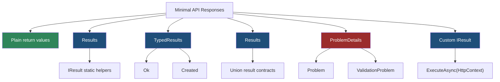
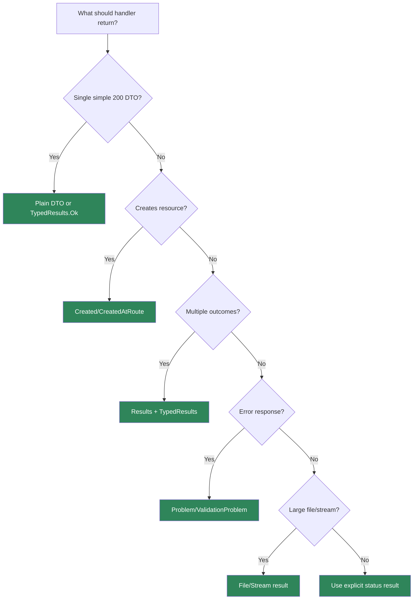

> [!success] Mastery Check
> - [ ] **Studied Well**
> - [ ] **Can explain the concept without notes**
> - [ ] **Can answer interview questions confidently**
> - [ ] **Can implement it in a real project**


# 4.082 - IResult and TypedResults: Shaping HTTP Responses in Minimal APIs

---

## PART 0 - Navigation & Context

### Where This Topic Lives

```
ASP.NET Core Mastery
└── Minimal APIs
    ├── 4.079  Defining Endpoints
    ├── 4.082  YOU ARE HERE - response shaping
    ├── 4.085  OpenAPI Integration
    └── 4.096  Custom IResult
```

### What You Need Before This

- **[[4.079 - Defining Endpoints: MapGet, MapPost, MapPut, MapDelete]]** - handlers return values that become HTTP responses.
- **[[4.071 - Link Generation: IUrlHelper, LinkGenerator, and Named Routes]]** - `CreatedAtRoute` depends on route names.
- **HTTP status code semantics** - results are how Minimal APIs express status, headers, and bodies.

### What This Unlocks After

- **[[4.085 - OpenAPI Integration: WithOpenApi(), Tags, and Summaries]]** - typed results improve response metadata.
- **[[4.096 - Custom IResult: IResult and INestedHttpResult for Reusable Responses]]** - reusable response objects build on this.
- **[[4.179 - Problem Details: RFC 7807 IProblemDetailsService]]** - `Results.Problem` and `ValidationProblem` shape error bodies.

### Why This Matters at Scale

Minimal API return types are the final contract between your code and the HTTP client; vague `object` returns hide status codes, headers, body shape, and OpenAPI metadata.

---

## PART 1 - The Core Mental Model

### The Fundamental Rule

> **`IResult` writes to `HttpContext.Response`, while `TypedResults` returns concrete result types with metadata; the practical consequence is identical wire output can have very different compile-time and OpenAPI behavior.**

### The Plain-Language Analogy

A plain object return is handing the framework an item and saying "ship this somehow." `Results.Ok` is a shipping label that says status `200`, JSON body. `TypedResults.Ok<T>` is the same label plus a typed manifest the documentation system can read. A custom `IResult` is your own shipping station that writes status, headers, and body directly.

### The Taxonomy Diagram



---

## PART 2 - Deep Mechanics

### 2.1 `IResult.ExecuteAsync` Writes the Response

```
---> Endpoint delegate
     handler returns IResult
     result.ExecuteAsync(HttpContext)
     sets status, headers, body
---> Response leaves pipeline
```

```csharp
app.MapGet("/api/orders/{orderId:int}", (int orderId) =>
    Results.Ok(new { orderId }));
```

```http
// HTTP wire format:
GET /api/orders/42 HTTP/1.1

HTTP/1.1 200 OK
Content-Type: application/json
```

ASP.NET Core internally: the generated request delegate checks the returned value; if it implements `IResult`, it calls `ExecuteAsync`.

**Runtime cost:** result object creation plus response serialization.

**Edge case:** Headers must be set before the response body starts. A result that streams data cannot later change status safely.

### 2.2 `Results` vs `TypedResults`

```csharp
app.MapGet("/api/a", () => Results.Ok(new OrderDto(1)));
app.MapGet("/api/b", () => TypedResults.Ok(new OrderDto(1)));

public sealed record OrderDto(int Id);
```

Both can write the same HTTP response. The difference is compile-time type information and metadata. `Results.Ok` returns `IResult`; `TypedResults.Ok` returns a concrete `Ok<T>` type from `Microsoft.AspNetCore.Http.HttpResults`.

**Runtime cost:** usually similar; metadata/type-safety is the main difference.

**Edge case:** `TypedResults` can make OpenAPI response metadata more precise without `.Produces<T>()`.

### 2.3 Union Results Make Alternate Responses Explicit

```csharp
app.MapGet("/api/orders/{orderId:int}",
    Results<Ok<OrderDto>, NotFound> (int orderId) =>
        orderId == 42
            ? TypedResults.Ok(new OrderDto(orderId))
            : TypedResults.NotFound());
```

```http
// HTTP wire format:
GET /api/orders/99 HTTP/1.1

HTTP/1.1 404 Not Found
```

ASP.NET Core internally: union result types preserve known possible result implementations for metadata and compile-time checking.

**Runtime cost:** same response execution path; compile-time safety improves.

**Edge case:** Returning many possible result types can become noisy. Use a small set of meaningful HTTP outcomes.

### 2.4 Problem Results Standardize Errors

```csharp
app.MapPost("/api/payments", (CreatePayment request) =>
{
    if (request.Amount <= 0)
    {
        return Results.ValidationProblem(new Dictionary<string, string[]>
        {
            ["amount"] = ["Amount must be positive."]
        });
    }

    return Results.Created("/api/payments/123", new { paymentId = 123 });
});

public sealed record CreatePayment(decimal Amount);
```

```http
// HTTP wire format:
HTTP/1.1 400 Bad Request
Content-Type: application/problem+json
```

**Runtime cost:** dictionary and JSON serialization for error body.

**Edge case:** Consistent error shape matters more than which helper you use. Avoid mixing random anonymous error bodies with ProblemDetails.

---

## PART 3 - Production Code Patterns

### Pattern 1: The Explicit Read Result

```csharp
// Domain scenario: order management service.
app.MapGet("/api/orders/{orderId:int}",
    Results<Ok<OrderDto>, NotFound> (int orderId) =>
        orderId == 42
            ? TypedResults.Ok(new OrderDto(orderId, "created"))
            : TypedResults.NotFound());

public sealed record OrderDto(int Id, string Status);
```

### Pattern 2: The Created Resource Result

```csharp
// Domain scenario: inventory API.
app.MapPost("/api/items", (CreateItem request) =>
{
    var sku = request.Sku;
    return TypedResults.Created($"/api/items/{sku}", new ItemDto(sku, request.Name));
});

public sealed record CreateItem(string Sku, string Name);
public sealed record ItemDto(string Sku, string Name);
```

### Pattern 3: The Conflict Result

```csharp
// Domain scenario: payment capture.
app.MapPost("/api/payments/{paymentId:guid}/capture",
    Results<Accepted, Conflict> (Guid paymentId) =>
        paymentId == Guid.Empty ? TypedResults.Conflict() : TypedResults.Accepted());
```

### Pattern 4: The Validation Problem

```csharp
// Domain scenario: shipment creation.
app.MapPost("/api/shipments", (CreateShipment request) =>
{
    if (string.IsNullOrWhiteSpace(request.PostalCode))
    {
        return Results.ValidationProblem(new Dictionary<string, string[]>
        {
            ["postalCode"] = ["Postal code is required."]
        });
    }

    return Results.Accepted();
});

public sealed record CreateShipment(string PostalCode);
```

### Pattern 5: The File Result

```csharp
// Domain scenario: invoice download.
app.MapGet("/api/invoices/{invoiceId:int}/pdf", (int invoiceId) =>
{
    var bytes = Array.Empty<byte>();
    return Results.File(bytes, "application/pdf", $"invoice-{invoiceId}.pdf");
});
```

---

## PART 4 - Gotchas & Anti-Patterns

### Gotcha 1: Returning Plain Objects for Every Outcome

Plain objects hide status code intent.

```csharp
// WRONG CODE
app.MapGet("/api/orders/{id:int}", (int id) => new { id });

// HTTP consequence (wrong path):
// Always 200 for the object path; no alternate status contract.

// CORRECT CODE
app.MapGet("/api/orders/{id:int}",
    Results<Ok<OrderDto>, NotFound> (int id) =>
        id == 42 ? TypedResults.Ok(new OrderDto(id, "created")) : TypedResults.NotFound());

// HTTP consequence (correct path):
// Missing order -> 404.

// WHY: explicit results document and enforce HTTP outcomes.
```

### Gotcha 2: Using `Results.Ok` for Created Resources

Creation is not a generic success.

```csharp
// WRONG CODE
app.MapPost("/api/orders", () => Results.Ok(new { id = 123 }));

// HTTP consequence (wrong path):
// 200 OK with no Location header.

// CORRECT CODE
app.MapPost("/api/orders", () =>
    Results.CreatedAtRoute("Orders.GetById", new { orderId = 123 }, new { orderId = 123 }));

// HTTP consequence (correct path):
// 201 Created with Location.

// WHY: clients need the canonical URL of the created resource.
```

### Gotcha 3: Mixing Error Body Shapes

Clients hate surprise schemas.

```csharp
// WRONG CODE
return Results.BadRequest(new { message = "Bad amount" });

// HTTP consequence (wrong path):
// Error body does not match ProblemDetails used elsewhere.

// CORRECT CODE
return Results.Problem(title: "Bad amount", statusCode: StatusCodes.Status400BadRequest);

// HTTP consequence (correct path):
// application/problem+json body.

// WHY: ProblemDetails gives clients a predictable error contract.
```

### Gotcha 4: Assuming TypedResults Change Wire Format

They mostly change static type metadata.

```csharp
// WRONG CODE
app.MapGet("/api/a", () => TypedResults.Ok(new { id = 1 }));

// HTTP consequence (wrong path):
// Expecting different JSON than Results.Ok.

// CORRECT CODE
app.MapGet("/api/a", () => Results.Ok(new { id = 1 }));
app.MapGet("/api/b", () => TypedResults.Ok(new { id = 1 }));

// HTTP consequence (correct path):
// Both can write 200 JSON; TypedResults carries better compile-time metadata.

// WHY: response helper choice affects metadata/type safety more than wire bytes.
```

### Gotcha 5: Changing Headers After Body Starts

Streaming results commit the response early.

```csharp
// WRONG CODE
app.MapGet("/api/export", async (HttpContext ctx) =>
{
    await ctx.Response.WriteAsync("first bytes");
    ctx.Response.StatusCode = 500;
});

// HTTP consequence (wrong path):
// Status may already be 200; later status changes fail or do nothing.

// CORRECT CODE
app.MapGet("/api/export", () => Results.Text("first bytes"));

// HTTP consequence (correct path):
// Status and headers are set before body write.

// WHY: HTTP response headers are committed when the body starts.
```

---

## PART 5 - Performance Implications

### Request Pipeline Characteristics Table

| Scenario | Pipeline Depth | Allocations Per Request | Approx Latency Impact | Recommendation |
|---|---:|---:|---:|---|
| `NoContent` | Endpoint result | low | Very low | Use for deletes/updates |
| `Ok<T>` JSON | Endpoint result | serialization allocations | Medium | Normal API path |
| `CreatedAtRoute` | Link generation + result | route values/string | Low-medium | Use for creation |
| `ValidationProblem` | result + dictionary | medium | Medium | Standardize errors |
| `File(byte[])` | result | byte array already held | Medium | Avoid huge memory buffers |
| Stream result | result + stream | low memory | Medium | Best for large output |
| Union results | compile-time only | similar | Low | Prefer for explicit contracts |
| Plain object | generated writer | similar JSON | Low | Use sparingly |

### BenchmarkDotNet Code

```csharp
using BenchmarkDotNet.Attributes;
using Microsoft.AspNetCore.Http;

[MemoryDiagnoser]
public sealed class ResultExecutionBenchmarks
{
    private readonly DefaultHttpContext _context = new();
    private static readonly OrderDto Order = new(42, "created");

    [Benchmark] public Task OkResult() => Results.Ok(Order).ExecuteAsync(_context);
    [Benchmark] public Task TypedOkResult() => TypedResults.Ok(Order).ExecuteAsync(_context);
    [Benchmark] public Task NoContentResult() => TypedResults.NoContent().ExecuteAsync(_context);
}

public sealed record OrderDto(int Id, string Status);

// Expected output (approximate, .NET 8, x64, local):
// NoContent is cheapest.
// Ok/TypedOk are dominated by JSON serialization, not helper choice.
```

### When This Costs You

Large JSON responses, file downloads, streaming endpoints, and endpoints generating many links or ProblemDetails bodies.

### When This Doesn't Matter

Small DTO responses, simple health checks, and endpoints dominated by database or outbound HTTP latency.

---

## PART 6 - Interview Arsenal

### A. The Question Bank

**Question:** "What is `IResult`?"

**Average Answer:** "It is a return type for Minimal APIs."

**Why That's Insufficient:** It misses the response-writing contract.

> **Great Answer:** "`IResult` is an object that knows how to write an HTTP response through `ExecuteAsync(HttpContext)`. It sets status code, headers, content type, and body. In Minimal APIs I use it when the handler needs explicit HTTP behavior instead of just returning a plain object."

**Question:** "Why use `TypedResults`?"

**Average Answer:** "It is newer and typed."

**Why That's Insufficient:** It needs the OpenAPI and union-result consequence.

> **Great Answer:** "`TypedResults` usually writes the same HTTP response as `Results`, but returns concrete result types like `Ok<T>` or `NotFound`. That gives the compiler and OpenAPI generator better information, especially when I use `Results<Ok<Order>, NotFound>` to declare all possible outcomes."

**Question:** "How should a create endpoint respond?"

**Average Answer:** "Return the created object."

**Why That's Insufficient:** It misses HTTP semantics.

> **Great Answer:** "For resource creation I return `201 Created`, usually with `CreatedAtRoute`, so the client gets a `Location` header pointing at the canonical resource URL. A plain `200 OK` works mechanically but loses the HTTP contract clients expect."

### B. The Trick Questions

| Question | Trap | Correct Answer |
|---|---|---|
| Do `Results.Ok` and `TypedResults.Ok` write different JSON? | Wire-format assumption | Usually no; the difference is static type metadata. |
| Can you change status after streaming starts? | Late mutation | No, headers are committed. |
| Is plain object return always bad? | Overcorrection | No, but explicit results are better for contracts. |
| Does `CreatedAtRoute` need route names? | Link generation | Yes, route values must match the named route. |

### C. Red Flags to Avoid

- "IResult is just a DTO." - it writes the response.
- "TypedResults changes the wire format." - usually false.
- "POST create can just return 200." - weak HTTP contract.
- "Error shapes can vary endpoint by endpoint." - bad client experience.
- "Headers can be changed anytime." - false after response starts.

---

## PART 7 - Decision Framework



---

## PART 8 - Self-Check

### A. Conceptual Questions

1. What method does `IResult` expose to write the response?
2. What is the wire-format difference between `Results.Ok` and `TypedResults.Ok`?
3. Why does `TypedResults` help OpenAPI?
4. What should a successful POST create return?
5. What happens if an endpoint writes the response body before setting status?
6. Why are union result types useful?
7. When should you use `ValidationProblem`?
8. Why are plain object returns risky in production APIs?

### B. Code Puzzles

```csharp
app.MapPost("/orders", () => Results.Ok(new { id = 123 }));
```

<details><summary>Answer</summary>
The endpoint returns 200 OK. For resource creation, prefer 201 Created with a Location header.
</details>

```csharp
app.MapGet("/orders/{id:int}", Results<Ok<OrderDto>, NotFound> (int id) =>
    id == 1 ? TypedResults.Ok(new OrderDto(id)) : TypedResults.NotFound());
```

<details><summary>Answer</summary>
The endpoint has explicit possible outcomes: 200 with `OrderDto` or 404. OpenAPI can infer this better.
</details>

```csharp
await context.Response.WriteAsync("hello");
context.Response.StatusCode = 500;
```

<details><summary>Answer</summary>
The response may already have started; status/header changes can fail or be ignored.
</details>

```csharp
return Results.ValidationProblem(new Dictionary<string, string[]> { ["sku"] = ["Required."] });
```

<details><summary>Answer</summary>
The client receives a validation problem response, typically 400 with `application/problem+json`.
</details>

---

## PART 9 - Connections & Resources

### A. Related Topics Table

| Topic | Why It Connects |
|---|---|
| [[4.079 - Defining Endpoints: MapGet, MapPost, MapPut, MapDelete]] | Endpoint handlers need response return types. |
| [[4.085 - OpenAPI Integration: WithOpenApi(), Tags, and Summaries]] | Typed results improve OpenAPI response descriptions. |
| [[4.096 - Custom IResult: IResult and INestedHttpResult for Reusable Responses]] | Custom results extend the response-writing model. |
| [[4.118 - Problem Details in MVC: ProblemDetails and ValidationProblemDetails]] | ProblemDetails is the standard API error response shape. |
| [[4.283 - REST API Design Conventions in ASP.NET Core]] | Status code choice is API design, not syntax. |

### B. Books

| Book | Chapters | Why These Chapters |
|---|---|---|
| *ASP.NET Core in Action* | Minimal APIs, action results | Explains result execution and response helpers. |
| *Pro ASP.NET Core* | Minimal APIs | Practical examples of response results. |

### C. Essential Articles & Docs

- [Microsoft Docs - Create responses in Minimal API applications](https://learn.microsoft.com/en-us/aspnet/core/fundamentals/minimal-apis/responses)
- [Microsoft Docs - Minimal API route handlers](https://learn.microsoft.com/en-us/aspnet/core/fundamentals/minimal-apis/route-handlers)
- [Microsoft Docs - Problem details in ASP.NET Core](https://learn.microsoft.com/en-us/aspnet/core/fundamentals/error-handling)
- [ASP.NET Core source - HttpResults](https://github.com/dotnet/aspnetcore/tree/main/src/Http/Http.Results)

### D. Template Meta-Note

> [!NOTE]
> **Part 0** orients the topic. **Part 1** gives the mental model. **Part 2** shows framework mechanics. **Part 3** gives production patterns. **Part 4** names gotchas. **Part 5** covers performance. **Part 6** prepares interviews. **Part 7** gives decisions. **Part 8** checks understanding. **Part 9** connects resources.
