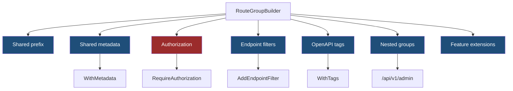
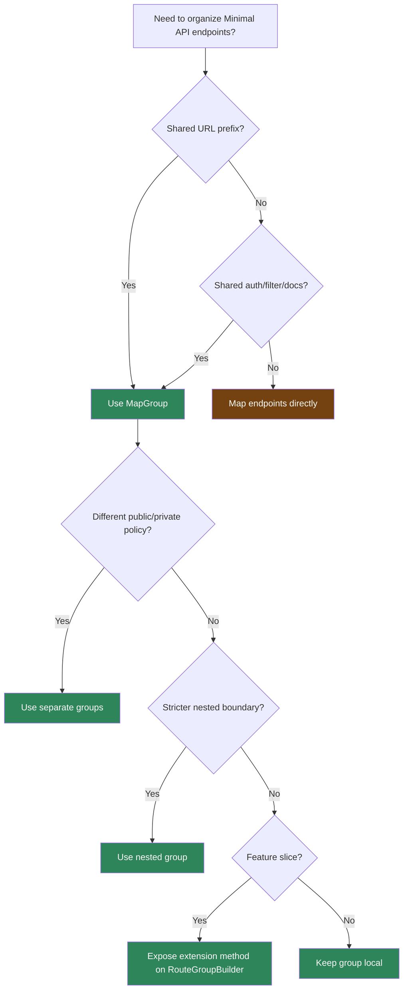

> [!success] Mastery Check
> - [ ] **Studied Well**
> - [ ] **Can explain the concept without notes**
> - [ ] **Can answer interview questions confidently**
> - [ ] **Can implement it in a real project**


# 4.084 - Route Groups in Minimal APIs: Shared Prefix and Authorization

---

## PART 0 - Navigation & Context

### Where This Topic Lives

```
ASP.NET Core Mastery
├── Routing
│   └── 4.070  Route Groups
└── Minimal APIs
    ├── 4.083  Endpoint Filters
    ├── 4.084  YOU ARE HERE - Minimal API groups
    ├── 4.085  OpenAPI Integration
    └── 4.089  Authorization on Endpoints
```

### What You Need Before This

- **[[4.070 - Route Groups: Prefix, Filters, Metadata, and Shared Middleware]]** - the routing-level model of route groups.
- **[[4.079 - Defining Endpoints: MapGet, MapPost, MapPut, MapDelete]]** - groups contain endpoint definitions.
- **[[4.074 - Endpoint Metadata: Decorating Endpoints with Custom Attributes]]** - group conventions attach metadata to endpoints.

### What This Unlocks After

- **[[4.089 - Authorization on Endpoints: RequireAuthorization and WithMetadata]]** - group auth is the common production pattern.
- **[[4.093 - Organizing Minimal APIs: Feature Slices and Extension Methods]]** - route groups are the feature-slice building block.
- **[[4.085 - OpenAPI Integration: WithOpenApi(), Tags, and Summaries]]** - group tags organize generated docs.

### Why This Matters at Scale

Route groups let you define one API boundary for prefix, auth, filters, tags, versioning, and rate limiting, instead of relying on every endpoint author to remember every convention.

---

## PART 1 - The Core Mental Model

### The Fundamental Rule

> **A Minimal API route group composes route prefix and endpoint metadata for all child endpoints; the practical consequence is that security and operational policy can be applied once at the resource boundary.**

### The Plain-Language Analogy

A route group is a wing in a building. Every room in that wing inherits the wing sign, security checkpoint, and department label. A nested wing can add a stricter checkpoint. Individual rooms can add their own rules, but they should not quietly undo the building's main security plan.

### The Taxonomy Diagram



---

## PART 2 - Deep Mechanics

### 2.1 Group Prefixes Are Combined at Endpoint Build Time

```
MapGroup("/api/orders")
  MapGet("/{id:int}")
      |
combined endpoint pattern:
/api/orders/{id:int}
```

```csharp
var orders = app.MapGroup("/api/orders");
orders.MapGet("/{orderId:int}", (int orderId) => Results.Ok(new { orderId }));
```

```http
// HTTP wire format:
GET /api/orders/42 HTTP/1.1
HTTP/1.1 200 OK
```

ASP.NET Core internally: group prefix and child route patterns are combined into final route endpoints in endpoint data sources.

**Runtime cost:** prefix composition is build-time; per-request matching sees the final route pattern.

**Edge case:** Leading/trailing slashes can make routes look odd in code, but ASP.NET Core normalizes common cases. Keep a consistent style anyway.

### 2.2 Group Metadata Accumulates

```
Group: RequireAuthorization("Orders")
Child: WithName("Orders.GetById")
Final endpoint metadata:
  auth policy + endpoint name + tags + filters
```

```csharp
var orders = app.MapGroup("/api/orders")
    .RequireAuthorization("Orders")
    .WithTags("Orders");

orders.MapGet("/{orderId:int}", (int orderId) => Results.Ok(new { orderId }))
    .WithName("Orders.GetById");
```

**Runtime cost:** metadata list is built once; policy middleware reads it per request.

**Edge case:** Metadata usually accumulates. Do not assume endpoint calls override group calls unless the specific metadata type says so.

### 2.3 Authorization Runs Before Filters

```
---> Routing ---> Authentication ---> Authorization[reads group metadata] ---> Endpoint filters ---> Handler
                 fail: 401/403, filters do not run
```

```csharp
var payments = app.MapGroup("/api/payments")
    .RequireAuthorization("Payments.Read");

payments.MapGet("/{paymentId:guid}", (Guid paymentId) => Results.Ok(new { paymentId }));
```

```http
// HTTP wire format:
GET /api/payments/11111111-1111-1111-1111-111111111111 HTTP/1.1

HTTP/1.1 401 Unauthorized
WWW-Authenticate: Bearer
```

**Runtime cost:** auth policy evaluation per request; filters are skipped on auth failure.

**Edge case:** Adding `RequireAuthorization` is not enough if auth middleware is missing.

### 2.4 Nested Groups Are Policy Boundaries

```csharp
var api = app.MapGroup("/api").RequireAuthorization();
var admin = api.MapGroup("/admin").RequireAuthorization("AdminOnly");

admin.MapDelete("/users/{userId:guid}", (Guid userId) => Results.NoContent());
```

**Runtime cost:** nested metadata is flattened into endpoint metadata at build time.

**Edge case:** Use nested groups for stricter policy, not registration order tricks.

---

## PART 3 - Production Code Patterns

### Pattern 1: The Resource Boundary Group

```csharp
// Domain scenario: order management service.
var orders = app.MapGroup("/api/orders")
    .WithTags("Orders")
    .RequireAuthorization("Orders")
    .AddEndpointFilter<OrderValidationFilter>();

orders.MapGet("/{orderId:int}", (int orderId) => Results.Ok(new { orderId }));
orders.MapPost("/", (CreateOrder request) => Results.Created("/api/orders/123", request));

public sealed record CreateOrder(string Sku, int Quantity);
```

### Pattern 2: The Nested Admin Boundary

```csharp
// Domain scenario: healthcare patient portal.
var patients = app.MapGroup("/api/patients").RequireAuthorization("ClinicalStaff");
var patientAdmin = patients.MapGroup("/admin").RequireAuthorization("PatientAdmin");

patientAdmin.MapDelete("/{patientId:guid}", (Guid patientId) => Results.NoContent());
```

### Pattern 3: The Version Group

```csharp
// Domain scenario: payment API versioning.
var v1 = app.MapGroup("/api/v1/payments").WithTags("Payments v1");
var v2 = app.MapGroup("/api/v2/payments").WithTags("Payments v2");

v1.MapGet("/{id:guid}", (Guid id) => Results.Ok(new { id, version = 1 }));
v2.MapGet("/{id:guid}", (Guid id) => Results.Ok(new { id, version = 2 }));
```

### Pattern 4: The Feature Extension Method

```csharp
// Domain scenario: inventory service.
public static class InventoryEndpoints
{
    public static RouteGroupBuilder MapInventory(this RouteGroupBuilder group)
    {
        group.MapGet("/{sku}", (string sku) => Results.Ok(new { sku }));
        group.MapPost("/", (CreateItem item) => Results.Created($"/api/inventory/{item.Sku}", item));
        return group;
    }
}

public sealed record CreateItem(string Sku);
```

### Pattern 5: The Public Endpoint Outside Private Group

```csharp
// Domain scenario: logistics tracking.
app.MapGet("/track/{trackingNumber}", (string trackingNumber) => Results.Ok(new { trackingNumber }));

var internalApi = app.MapGroup("/api/shipments").RequireAuthorization("ShipmentOps");
internalApi.MapGet("/{shipmentId:guid}", (Guid shipmentId) => Results.Ok(new { shipmentId }));
```

---

## PART 4 - Gotchas & Anti-Patterns

### Gotcha 1: Assuming Registration Order Limits Group Metadata

Group conventions are applied to endpoints, not "future lines" in the way many expect.

```csharp
// WRONG CODE
var api = app.MapGroup("/api");
api.MapGet("/public", () => "public");
api.RequireAuthorization();

// HTTP consequence (wrong path):
// /api/public may receive auth metadata too.

// CORRECT CODE
var publicApi = app.MapGroup("/api/public");
var privateApi = app.MapGroup("/api").RequireAuthorization();
publicApi.MapGet("/", () => "public");
privateApi.MapGet("/orders", () => "orders");

// HTTP consequence (correct path):
// Public and private boundaries are explicit.

// WHY: group conventions are composed during endpoint building.
```

### Gotcha 2: Duplicating Auth on Every Endpoint

Duplication invites drift.

```csharp
// WRONG CODE
app.MapGet("/api/orders", () => Results.Ok()).RequireAuthorization("Orders");
app.MapPost("/api/orders", () => Results.Ok()).RequireAuthorization("Orders");

// HTTP consequence (wrong path):
// One endpoint eventually misses the policy.

// CORRECT CODE
var orders = app.MapGroup("/api/orders").RequireAuthorization("Orders");
orders.MapGet("/", () => Results.Ok());
orders.MapPost("/", () => Results.Ok());

// HTTP consequence (correct path):
// Shared policy is attached consistently.

// WHY: resource boundary policy belongs on the group.
```

### Gotcha 3: Treating Groups as Middleware

Groups attach endpoint conventions; they are not request middleware.

```csharp
// WRONG CODE
var api = app.MapGroup("/api");
// expecting group to run code before every request without a filter/middleware

// HTTP consequence (wrong path):
// No runtime behavior happens unless metadata/filter/middleware uses it.

// CORRECT CODE
api.AddEndpointFilter(async (ctx, next) =>
{
    return await next(ctx);
});

// HTTP consequence (correct path):
// Filter runs inside endpoint execution.

// WHY: route groups are endpoint builders, not middleware branches.
```

### Gotcha 4: Confusing Group Prefix With Tenant Authorization

URL prefix is not access control.

```csharp
// WRONG CODE
var tenant = app.MapGroup("/api/tenants/{tenantId:guid}");
tenant.MapGet("/orders", () => Results.Ok());

// HTTP consequence (wrong path):
// Client can choose another tenant id.

// CORRECT CODE
tenant.RequireAuthorization("TenantAccess");

// HTTP consequence (correct path):
// Unauthorized tenant access -> 403.

// WHY: route values are untrusted until authorization validates them.
```

### Gotcha 5: Over-Nesting Groups

Too many groups hide the final route and metadata.

```csharp
// WRONG CODE
app.MapGroup("/api").MapGroup("/v1").MapGroup("/internal").MapGroup("/orders");

// HTTP consequence (wrong path):
// Hard to audit final URL and policy.

// CORRECT CODE
var orders = app.MapGroup("/api/v1/internal/orders")
    .RequireAuthorization("InternalOrders");

// HTTP consequence (correct path):
// URL and policy boundary are visible.

// WHY: nesting is useful for real boundaries, not for ceremony.
```

---

## PART 5 - Performance Implications

### Request Pipeline Characteristics Table

| Scenario | Pipeline Depth | Allocations Per Request | Approx Latency Impact | Recommendation |
|---|---:|---:|---:|---|
| Group prefix | Routing | none extra | None | Use freely |
| Group auth metadata | Auth window | policy dependent | Medium | Prefer over duplication |
| Group filter | Endpoint filters | filter dependent | Low-medium | Keep filters cheap |
| Nested groups | Build time | none extra | Low | Use for real boundaries |
| Group tags | OpenAPI/startup | none in request | None | Use for docs |
| Many feature groups | Startup | endpoint metadata | Low | Good organization |
| DB in group filter | Endpoint filter | query cost | High | Avoid/carefully cache |
| Missing auth middleware | Correctness failure | n/a | Critical | Verify pipeline |

### BenchmarkDotNet Code

```csharp
using BenchmarkDotNet.Attributes;

[MemoryDiagnoser]
public sealed class GroupMetadataBenchmarks
{
    private readonly string[] _metadata = ["Orders", "Auth", "OpenApi", "Filter"];

    [Benchmark] public int MetadataCount() => _metadata.Length;
    [Benchmark] public string BuildCombinedPattern() => "/api/orders" + "/{orderId:int}";
}

// Expected output (approximate, .NET 8, x64, local):
// Prefix and metadata composition are trivial compared with auth, validation, and handler I/O.
```

### When This Costs You

Group-level filters that perform I/O, authorization policies that query per request, and confusing group nesting that causes operational mistakes.

### When This Doesn't Matter

Shared prefixes, OpenAPI tags, route names, and small metadata markers.

---

## PART 6 - Interview Arsenal

### A. The Question Bank

**Question:** "What does a Minimal API route group do?"

**Average Answer:** "It groups routes under a prefix."

**Why That's Insufficient:** It misses metadata and policy composition.

> **Great Answer:** "A route group combines a route prefix with endpoint conventions and metadata. That means I can apply auth, tags, filters, rate limiting, and version prefixes once at a resource boundary. At request time routing sees the final endpoint, and middleware reads the accumulated metadata."

**Question:** "Is `MapGroup` middleware?"

**Average Answer:** "Kind of."

**Why That's Insufficient:** It confuses build-time endpoint configuration with request-time middleware.

> **Great Answer:** "No. `MapGroup` is endpoint configuration. It builds endpoint patterns and metadata. If I need runtime code around the handler, I use endpoint filters or middleware. If I need auth, I attach metadata with `RequireAuthorization` and ensure authorization middleware is in the pipeline."

**Question:** "How do groups affect authorization?"

**Average Answer:** "You can call `RequireAuthorization` on them."

**Why That's Insufficient:** It should mention middleware and metadata.

> **Great Answer:** "Calling `RequireAuthorization` on a group attaches authorization metadata to every endpoint in that group. After routing selects one of those endpoints, authorization middleware reads the metadata and can return 401 or 403 before endpoint filters or handlers run."

### B. The Trick Questions

| Question | Trap | Correct Answer |
|---|---|---|
| Do groups execute per request? | Middleware confusion | No, filters/middleware execute; groups configure endpoints. |
| Does group auth enforce without middleware? | Metadata confusion | No, authorization middleware enforces. |
| Does call order limit group conventions? | Registration assumption | Not reliably; use separate groups. |
| Can nested groups add stricter policies? | Either/or thinking | Yes, metadata can accumulate. |

### C. Red Flags to Avoid

- "Groups are just URL prefixes." - incomplete.
- "Groups are middleware." - wrong abstraction.
- "RequireAuthorization is enough without middleware." - security bug.
- "Registration order controls group policy." - fragile.
- "Route prefix validates tenant access." - false.

---

## PART 7 - Decision Framework



---

## PART 8 - Self-Check

### A. Conceptual Questions

1. What happens to a route group prefix at endpoint build time?
2. Why is `MapGroup` not middleware?
3. What happens to the HTTP request if group authorization fails?
4. Why should public and private endpoints usually be separate groups?
5. How do group filters differ from middleware?
6. Why can group metadata accumulation surprise engineers?
7. What is the per-request cost of a group prefix?
8. How do route groups support feature-slice organization?

### B. Code Puzzles

```csharp
var api = app.MapGroup("/api");
api.MapGet("/public", () => "public");
api.RequireAuthorization();
```

<details><summary>Answer</summary>
Do not assume `/api/public` stays public. Group conventions can apply to endpoints in the group during endpoint building. Use separate groups.
</details>

```csharp
var api = app.MapGroup("/api").RequireAuthorization();
api.MapGet("/orders", () => "orders");
```

<details><summary>Answer</summary>
Auth metadata is attached. It is enforced only if authentication/authorization middleware is configured.
</details>

```csharp
app.MapGroup("/api").MapGroup("/v1").MapGet("/health", () => "ok");
```

<details><summary>Answer</summary>
The final route is `/api/v1/health`. Prefixes are combined into endpoint route patterns.
</details>

```csharp
var tenant = app.MapGroup("/api/tenants/{tenantId:guid}");
tenant.MapGet("/orders", () => Results.Ok());
```

<details><summary>Answer</summary>
The route captures tenantId but does not authorize access. Add a tenant authorization policy.
</details>

---

## PART 9 - Connections & Resources

### A. Related Topics Table

| Topic | Why It Connects |
|---|---|
| [[4.070 - Route Groups: Prefix, Filters, Metadata, and Shared Middleware]] | This note specializes route groups for Minimal API organization. |
| [[4.083 - Minimal API Filters: IEndpointFilter Pipeline]] | Group filters are a primary production use of route groups. |
| [[4.089 - Authorization on Endpoints: RequireAuthorization and WithMetadata]] | Group authorization attaches endpoint metadata read by middleware. |
| [[4.085 - OpenAPI Integration: WithOpenApi(), Tags, and Summaries]] | Group tags structure OpenAPI output. |
| [[4.093 - Organizing Minimal APIs: Feature Slices and Extension Methods]] | Feature slices commonly return `RouteGroupBuilder`. |

### B. Books

| Book | Chapters | Why These Chapters |
|---|---|---|
| *ASP.NET Core in Action* | Minimal APIs, route groups | Practical organization patterns. |
| *Pro ASP.NET Core* | Minimal APIs | Shows groups with authorization and tags. |

### C. Essential Articles & Docs

- [Microsoft Docs - Minimal API route handlers](https://learn.microsoft.com/en-us/aspnet/core/fundamentals/minimal-apis/route-handlers)
- [Microsoft Docs - Filters in Minimal API apps](https://learn.microsoft.com/en-us/aspnet/core/fundamentals/minimal-apis/min-api-filters)
- [Microsoft Docs - Authentication and authorization in Minimal APIs](https://learn.microsoft.com/en-us/aspnet/core/fundamentals/minimal-apis/security)
- [ASP.NET Core source - Routing](https://github.com/dotnet/aspnetcore/tree/main/src/Http/Routing)

### D. Template Meta-Note

> [!NOTE]
> **Part 0** orients the topic. **Part 1** gives the mental model. **Part 2** shows framework mechanics. **Part 3** gives production patterns. **Part 4** names gotchas. **Part 5** covers performance. **Part 6** prepares interviews. **Part 7** gives decisions. **Part 8** checks understanding. **Part 9** connects resources.
