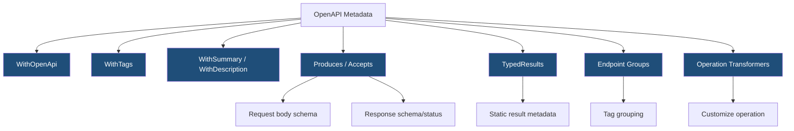
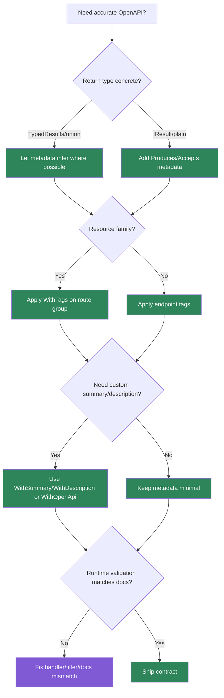

> [!success] Mastery Check
> - [ ] **Studied Well**
> - [ ] **Can explain the concept without notes**
> - [ ] **Can answer interview questions confidently**
> - [ ] **Can implement it in a real project**


# 4.085 - OpenAPI Integration: WithOpenApi(), Tags, and Summaries

---

## PART 0 - Navigation & Context

### Where This Topic Lives

```
ASP.NET Core Mastery
├── Minimal APIs
│   ├── 4.082  IResult and TypedResults
│   ├── 4.084  Route Groups
│   └── 4.085  YOU ARE HERE - OpenAPI metadata
└── API Design
    ├── 4.279  Swagger/OpenAPI
    └── 4.280  OpenAPI in .NET 9
```

### What You Need Before This

- **[[4.074 - Endpoint Metadata: Decorating Endpoints with Custom Attributes]]** - OpenAPI is generated from endpoint metadata.
- **[[4.082 - IResult and TypedResults: Shaping HTTP Responses in Minimal APIs]]** - response types drive OpenAPI schemas.
- **[[4.084 - Route Groups in Minimal APIs: Shared Prefix and Authorization]]** - group tags and metadata organize documents.

### What This Unlocks After

- **[[4.279 - Swagger - OpenAPI Integration]]** - full Swagger UI and document generation.
- **[[4.280 - OpenAPI in .NET 9: Microsoft.AspNetCore.OpenApi Built-In]]** - newer built-in OpenAPI generation direction.
- **[[4.287 - API Deprecation: Sunset Headers and Version Lifecycle Management]]** - OpenAPI communicates lifecycle contracts.

### Why This Matters at Scale

OpenAPI metadata is the machine-readable API contract clients, SDK generators, QA tools, and security scanners use; wrong metadata is a production integration bug even when the endpoint code works.

---

## PART 1 - The Core Mental Model

### The Fundamental Rule

> **Minimal API OpenAPI integration reads endpoint metadata produced by route handlers, result types, and conventions; the practical consequence is that your docs are only as accurate as the metadata attached to each endpoint.**

### The Plain-Language Analogy

The API is the factory floor, and OpenAPI is the shipping catalog. `WithTags`, `Produces`, `Accepts`, summaries, and typed results are catalog labels. If the factory makes a product but the catalog says the wrong size or return policy, customers integrate against the wrong contract. The catalog does not enforce behavior; it describes what behavior should be.

### The Taxonomy Diagram



---

## PART 2 - Deep Mechanics

### 2.1 OpenAPI Metadata Is Built at Startup/Document Generation

```
MapPost(...)
  .Accepts<CreateOrder>("application/json")
  .Produces<OrderDto>(201)
  .WithTags("Orders")
      |
OpenAPI generator reads endpoint metadata
```

```csharp
app.MapPost("/api/orders", (CreateOrder request) =>
    TypedResults.Created("/api/orders/123", new OrderDto(123)))
   .Accepts<CreateOrder>("application/json")
   .Produces<OrderDto>(StatusCodes.Status201Created)
   .WithTags("Orders")
   .WithSummary("Create an order");

public sealed record CreateOrder(string Sku, int Quantity);
public sealed record OrderDto(int Id);
```

**Runtime cost:** no normal request cost; document generation uses endpoint metadata.

**Edge case:** OpenAPI metadata does not validate requests. Runtime validation still needs filters/handlers.

### 2.2 Typed Results Improve Response Discovery

```csharp
app.MapGet("/api/orders/{orderId:int}",
    Results<Ok<OrderDto>, NotFound> (int orderId) =>
        orderId == 42 ? TypedResults.Ok(new OrderDto(orderId)) : TypedResults.NotFound());
```

ASP.NET Core internally: concrete result types implement metadata provider interfaces so OpenAPI can infer status codes and schemas more accurately.

**Runtime cost:** similar response execution; documentation metadata is the win.

**Edge case:** If you use `Results.Ok` returning `IResult`, add `.Produces<T>()` for accurate docs.

### 2.3 Tags and Groups Shape the Document

```csharp
var orders = app.MapGroup("/api/orders")
    .WithTags("Orders");

orders.MapGet("/{orderId:int}", (int orderId) => Results.Ok(new { orderId }))
    .WithSummary("Get order by id");
```

**Runtime cost:** group tag metadata is build-time.

**Edge case:** Tags are not authorization scopes. They are documentation grouping.

### 2.4 `WithOpenApi` Customizes Operations

```csharp
app.MapGet("/api/reports/{reportId:int}", (int reportId) => Results.Ok())
   .WithOpenApi(operation =>
   {
       operation.Summary = "Get a reporting snapshot";
       operation.Description = "Returns the latest generated snapshot for the requested report.";
       return operation;
   });
```

**Runtime cost:** none during normal requests.

**Edge case:** Keep customization close to the endpoint or in conventions; scattered operation mutation becomes documentation drift.

---

## PART 3 - Production Code Patterns

### Pattern 1: The Complete Create Contract

```csharp
// Domain scenario: order management service.
app.MapPost("/api/orders", (CreateOrder request) =>
    TypedResults.Created("/api/orders/123", new OrderDto(123)))
   .WithName("Orders.Create")
   .WithTags("Orders")
   .WithSummary("Create an order")
   .Accepts<CreateOrder>("application/json")
   .Produces<OrderDto>(StatusCodes.Status201Created)
   .ProducesProblem(StatusCodes.Status400BadRequest);
```

### Pattern 2: The Group Tag Contract

```csharp
// Domain scenario: inventory API.
var inventory = app.MapGroup("/api/inventory")
    .WithTags("Inventory");

inventory.MapGet("/{sku}", (string sku) => Results.Ok(new { sku }))
    .WithSummary("Get inventory item by SKU");
```

### Pattern 3: The Typed Union Contract

```csharp
// Domain scenario: payment API.
app.MapGet("/api/payments/{paymentId:guid}",
    Results<Ok<PaymentDto>, NotFound> (Guid paymentId) =>
        paymentId == Guid.Empty
            ? TypedResults.NotFound()
            : TypedResults.Ok(new PaymentDto(paymentId)))
   .WithTags("Payments");

public sealed record PaymentDto(Guid Id);
```

### Pattern 4: The Explicit Error Contract

```csharp
// Domain scenario: shipment API.
app.MapPost("/api/shipments", (CreateShipment request) => Results.Accepted())
   .Produces(StatusCodes.Status202Accepted)
   .ProducesValidationProblem()
   .ProducesProblem(StatusCodes.Status500InternalServerError);
```

### Pattern 5: The Operation Customizer

```csharp
// Domain scenario: reporting API.
app.MapGet("/api/reports/{reportId:int}/export", (int reportId) => Results.File(Array.Empty<byte>()))
   .WithOpenApi(operation =>
   {
       operation.Summary = "Export report";
       operation.Description = "Streams a generated report file for a completed report.";
       return operation;
   });
```

---

## PART 4 - Gotchas & Anti-Patterns

### Gotcha 1: Assuming OpenAPI Enforces Runtime Behavior

Metadata is documentation, not validation.

```csharp
// WRONG CODE
app.MapPost("/api/orders", (CreateOrder request) => Results.Ok())
   .Accepts<CreateOrder>("application/json");

// HTTP consequence (wrong path):
// Invalid domain values can still reach the handler.

// CORRECT CODE
app.MapPost("/api/orders", (CreateOrder request) =>
    request.Quantity <= 0 ? Results.ValidationProblem(new()) : Results.Ok())
   .Accepts<CreateOrder>("application/json")
   .ProducesValidationProblem();

// HTTP consequence (correct path):
// Invalid input -> 400 validation problem.

// WHY: OpenAPI metadata describes; handlers/filters enforce.
```

### Gotcha 2: Returning `IResult` Without Response Metadata

Docs become vague.

```csharp
// WRONG CODE
app.MapGet("/api/orders/{id:int}", (int id) => Results.Ok(new OrderDto(id)));

// HTTP consequence (wrong path):
// Runtime 200 works, but generated docs may lack precise schema/status.

// CORRECT CODE
app.MapGet("/api/orders/{id:int}", (int id) => TypedResults.Ok(new OrderDto(id)));

// HTTP consequence (correct path):
// Same 200 JSON; better metadata.

// WHY: concrete result types can expose response metadata.
```

### Gotcha 3: Tags as Security Boundaries

Tags are visual grouping, not policy.

```csharp
// WRONG CODE
app.MapGet("/api/admin/audit", () => Results.Ok()).WithTags("Admin");

// HTTP consequence (wrong path):
// Endpoint is public unless auth metadata exists.

// CORRECT CODE
app.MapGet("/api/admin/audit", () => Results.Ok())
   .WithTags("Admin")
   .RequireAuthorization("AdminOnly");

// HTTP consequence (correct path):
// Anonymous request -> 401/403.

// WHY: OpenAPI metadata does not enforce authorization.
```

### Gotcha 4: Hiding Breaking Changes From OpenAPI

Docs must change when wire contracts change.

```csharp
// WRONG CODE
app.MapPost("/api/payments", (NewPayment request) => Results.NoContent())
   .Produces<OldPaymentResponse>(StatusCodes.Status201Created);

// HTTP consequence (wrong path):
// Clients generate SDKs for a response the API does not send.

// CORRECT CODE
app.MapPost("/api/payments", (NewPayment request) => Results.NoContent())
   .Produces(StatusCodes.Status204NoContent);

// HTTP consequence (correct path):
// Docs match wire response.

// WHY: OpenAPI is a client contract, not decoration.
```

### Gotcha 5: Overusing `WithOpenApi` Lambdas

One-off lambdas become scattered documentation logic.

```csharp
// WRONG CODE
app.MapGet("/api/a", () => Results.Ok()).WithOpenApi(o => { o.Summary = "A"; return o; });

// HTTP consequence (wrong path):
// No runtime bug, but documentation conventions drift.

// CORRECT CODE
var api = app.MapGroup("/api").WithTags("Core");

// HTTP consequence (correct path):
// Shared metadata is consistent.

// WHY: use endpoint-local customization for true exceptions, not every endpoint.
```

---

## PART 5 - Performance Implications

### Request Pipeline Characteristics Table

| Scenario | Pipeline Depth | Allocations Per Request | Approx Latency Impact | Recommendation |
|---|---:|---:|---:|---|
| `WithTags` | Startup/docs | none per request | None | Use freely |
| `WithSummary` | Startup/docs | none per request | None | Use freely |
| `Produces<T>` | Startup/docs | none per request | None | Add when needed |
| `TypedResults` | Endpoint | similar to Results | Low | Prefer for docs |
| OpenAPI generation | Tooling/docs endpoint | schema allocations | Medium | Cache in prod if exposed |
| Huge schemas | Docs generation | high | Medium | Split docs/version |
| Runtime validation | Endpoint/filter | validator dependent | Medium | Required separately |
| SDK generation from bad docs | Client side | n/a | Critical | Keep docs accurate |

### BenchmarkDotNet Code

```csharp
using BenchmarkDotNet.Attributes;

[MemoryDiagnoser]
public sealed class OpenApiMetadataShapeBenchmarks
{
    private readonly string[] _tags = ["Orders", "Payments", "Inventory"];

    [Benchmark] public int CountTags() => _tags.Length;
    [Benchmark] public string Summary() => "Create an order";
}

// Expected output (approximate, .NET 8, x64, local):
// Endpoint metadata access is trivial; schema generation and serialization are the real doc costs.
```

### When This Costs You

Large OpenAPI documents, many generic schemas, live docs endpoints under high traffic, and generated clients relying on incorrect metadata.

### When This Doesn't Matter

Normal endpoint metadata during request handling; it is effectively startup/documentation cost.

---

## PART 6 - Interview Arsenal

### A. The Question Bank

**Question:** "How does Minimal API OpenAPI generation know response types?"

**Average Answer:** "From the endpoint return type."

**Why That's Insufficient:** It must mention metadata and typed results.

> **Great Answer:** "It reads endpoint metadata. `TypedResults` and union result types can contribute response metadata automatically; otherwise I add `.Produces<T>()`, `.Accepts<T>()`, and related metadata. Runtime behavior and OpenAPI metadata should agree, but OpenAPI does not enforce the runtime behavior."

**Question:** "What is `WithOpenApi()` for?"

**Average Answer:** "To enable Swagger."

**Why That's Insufficient:** It customizes the operation, not simply enables docs.

> **Great Answer:** "`WithOpenApi` lets me customize the generated OpenAPI operation for a specific endpoint, for example summary, description, or operation details. I use it for endpoint-specific exceptions, while tags and produces metadata cover the common contract."

**Question:** "Why do tags matter?"

**Average Answer:** "They group endpoints."

**Why That's Insufficient:** It misses route group conventions and client docs.

> **Great Answer:** "Tags organize operations in the generated document and UI, and route groups let me apply them consistently to a resource family. They do not secure endpoints; auth still depends on endpoint authorization metadata and middleware."

### B. The Trick Questions

| Question | Trap | Correct Answer |
|---|---|---|
| Does OpenAPI metadata validate requests? | Docs as runtime | No, use validation/filter/handler. |
| Do tags imply authorization? | UI grouping | No, add auth metadata. |
| Does `Results.Ok` always document schema? | Type erasure | Not as well as `TypedResults` or `.Produces<T>()`. |
| Is wrong OpenAPI harmless? | Docs as optional | No, clients and scanners consume it. |

### C. Red Flags to Avoid

- "Swagger docs are decoration." - they are integration contracts.
- "OpenAPI enforces validation." - false.
- "Tags are permissions." - false.
- "Runtime response and docs can differ." - dangerous.
- "TypedResults is only style." - it affects metadata.

---

## PART 7 - Decision Framework



---

## PART 8 - Self-Check

### A. Conceptual Questions

1. What endpoint data does OpenAPI generation read?
2. Why do `TypedResults` help generated docs?
3. What happens if OpenAPI says `201` but runtime returns `204`?
4. Why are tags not security?
5. When should you use `.Produces<T>()`?
6. What does `WithOpenApi` customize?
7. Why should OpenAPI errors include ProblemDetails metadata?
8. What is the per-request cost of `WithTags`?

### B. Code Puzzles

```csharp
app.MapGet("/orders/{id:int}", (int id) => Results.Ok(new OrderDto(id)));
```

<details><summary>Answer</summary>
Runtime 200 works, but OpenAPI may not infer as precise a schema as with `TypedResults.Ok` or `.Produces<OrderDto>()`.
</details>

```csharp
app.MapGet("/admin/audit", () => Results.Ok()).WithTags("Admin");
```

<details><summary>Answer</summary>
The endpoint is only tagged for docs. It is not secured unless authorization metadata/middleware exists.
</details>

```csharp
app.MapPost("/payments", () => Results.NoContent()).Produces<PaymentDto>(201);
```

<details><summary>Answer</summary>
Docs and runtime disagree: OpenAPI says 201 with body, runtime sends 204 no content.
</details>

```csharp
app.MapPost("/orders", (CreateOrder r) => Results.Ok()).Accepts<CreateOrder>("application/json");
```

<details><summary>Answer</summary>
`Accepts` documents request body content; it does not perform domain validation.
</details>

---

## PART 9 - Connections & Resources

### A. Related Topics Table

| Topic | Why It Connects |
|---|---|
| [[4.082 - IResult and TypedResults: Shaping HTTP Responses in Minimal APIs]] | Result types contribute response metadata. |
| [[4.084 - Route Groups in Minimal APIs: Shared Prefix and Authorization]] | Groups apply tags and metadata consistently. |
| [[4.279 - Swagger - OpenAPI Integration]] | Broader OpenAPI tooling setup. |
| [[4.280 - OpenAPI in .NET 9: Microsoft.AspNetCore.OpenApi Built-In]] | Newer built-in OpenAPI direction. |
| [[4.287 - API Deprecation: Sunset Headers and Version Lifecycle Management]] | OpenAPI communicates version and lifecycle metadata. |

### B. Books

| Book | Chapters | Why These Chapters |
|---|---|---|
| *ASP.NET Core in Action* | Minimal APIs, OpenAPI | Practical metadata and Swagger patterns. |
| *Designing Web APIs* | API description and client contracts | Explains why docs are part of the product. |

### C. Essential Articles & Docs

- [Microsoft Docs - OpenAPI support in Minimal APIs](https://learn.microsoft.com/en-us/aspnet/core/fundamentals/openapi/aspnetcore-openapi)
- [Microsoft Docs - Create responses in Minimal API applications](https://learn.microsoft.com/en-us/aspnet/core/fundamentals/minimal-apis/responses)
- [Microsoft Docs - Minimal API route handlers](https://learn.microsoft.com/en-us/aspnet/core/fundamentals/minimal-apis/route-handlers)
- [ASP.NET Core source - OpenAPI](https://github.com/dotnet/aspnetcore/tree/main/src/OpenApi)

### D. Template Meta-Note

> [!NOTE]
> **Part 0** orients the topic. **Part 1** gives the mental model. **Part 2** shows framework mechanics. **Part 3** gives production patterns. **Part 4** names gotchas. **Part 5** covers performance. **Part 6** prepares interviews. **Part 7** gives decisions. **Part 8** checks understanding. **Part 9** connects resources.
