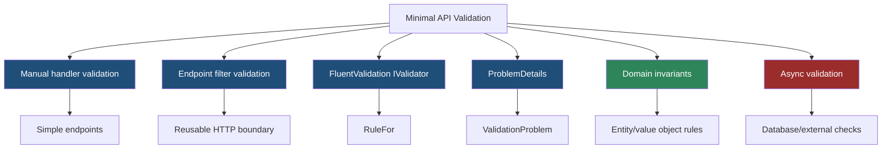
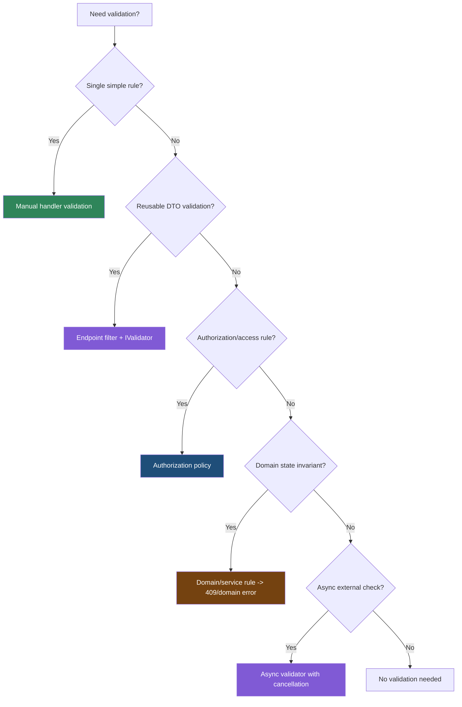

> [!success] Mastery Check
> - [ ] **Studied Well**
> - [ ] **Can explain the concept without notes**
> - [ ] **Can answer interview questions confidently**
> - [ ] **Can implement it in a real project**


# 4.086 - Validation in Minimal APIs: IValidator<T> and Manual Validation

---

## PART 0 - Navigation & Context

### Where This Topic Lives

```
ASP.NET Core Mastery
├── Minimal APIs
│   ├── 4.080  Parameter Binding
│   ├── 4.083  Endpoint Filters
│   └── 4.086  YOU ARE HERE - validation
└── Validation
    ├── 4.170  FluentValidation
    └── 4.175  Validation Across Layers
```

### What You Need Before This

- **[[4.080 - Route Parameter Binding in Minimal APIs]]** - binding creates typed values before validation.
- **[[4.083 - Minimal API Filters: IEndpointFilter Pipeline]]** - filters are the common validation interception point.
- **[[4.082 - IResult and TypedResults]]** - validation returns HTTP error responses.

### What This Unlocks After

- **[[4.170 - FluentValidation Validators RuleFor and ASP.NET Core Integration]]** - reusable validators.
- **[[4.174 - Global Validation: SuppressModelStateInvalidFilter and Custom Factory]]** - MVC contrast.
- **[[4.179 - Problem Details: RFC 7807 IProblemDetailsService]]** - consistent error bodies.

### Why This Matters at Scale

Minimal APIs do not give you MVC `[ApiController]` automatic model validation by default; if you do not build a validation boundary, bad input reaches business services and inconsistent error shapes leak to clients.

---

## PART 1 - The Core Mental Model

### The Fundamental Rule

> **Minimal API binding only creates values; validation must be performed explicitly in handlers, endpoint filters, or services, and invalid HTTP input should become a consistent `400` validation response.**

### The Plain-Language Analogy

Binding is a clerk transcribing a form. Validation is the supervisor checking whether the form makes sense. A number can be transcribed successfully and still be invalid because it is negative, too large, or not allowed for the tenant. Minimal APIs give you the clerk; you decide where the supervisor stands.

### The Taxonomy Diagram



---

## PART 2 - Deep Mechanics

### 2.1 Validation Runs After Binding

```
---> Routing ---> Auth ---> Endpoint delegate
                         bind body/query/route
                         endpoint filters
                         handler
```

```csharp
app.MapPost("/api/orders", (CreateOrder request) =>
{
    if (request.Quantity <= 0)
    {
        return Results.ValidationProblem(new Dictionary<string, string[]>
        {
            ["quantity"] = ["Quantity must be positive."]
        });
    }

    return Results.Created("/api/orders/123", request);
});

public sealed record CreateOrder(string Sku, int Quantity);
```

```http
// HTTP wire format:
POST /api/orders HTTP/1.1
Content-Type: application/json

HTTP/1.1 400 Bad Request
Content-Type: application/problem+json
```

**Runtime cost:** binding/JSON deserialization happens first; validation cost depends on rules.

**Edge case:** If JSON binding itself fails, handler validation does not run; binding returns a bad request path.

### 2.2 Endpoint Filters Centralize Validation

```csharp
public sealed class ValidationFilter<T>(IValidator<T> validator) : IEndpointFilter
{
    public async ValueTask<object?> InvokeAsync(
        EndpointFilterInvocationContext context,
        EndpointFilterDelegate next)
    {
        var argument = context.Arguments.OfType<T>().FirstOrDefault();
        if (argument is null)
        {
            return await next(context);
        }

        var result = await validator.ValidateAsync(argument, context.HttpContext.RequestAborted);
        if (result.IsValid)
        {
            return await next(context);
        }

        return Results.ValidationProblem(result.Errors
            .GroupBy(e => e.PropertyName)
            .ToDictionary(g => g.Key, g => g.Select(e => e.ErrorMessage).ToArray()));
    }
}
```

ASP.NET Core internally: endpoint filters run after binding and before the handler; returning a result short-circuits handler execution.

**Runtime cost:** one filter invocation plus validator work per request.

**Edge case:** Filter argument indexing can be brittle; prefer typed lookup or generated/filter-factory patterns for large codebases.

### 2.3 FluentValidation Separates HTTP DTO Rules

```csharp
public sealed class CreatePaymentValidator : AbstractValidator<CreatePayment>
{
    public CreatePaymentValidator()
    {
        RuleFor(x => x.Amount).GreaterThan(0);
        RuleFor(x => x.Currency).Length(3);
    }
}

public sealed record CreatePayment(decimal Amount, string Currency);
```

**Runtime cost:** synchronous rules are cheap; async rules may add I/O.

**Edge case:** Do not put authorization in validators. A valid request body can still be forbidden.

### 2.4 Domain Validation Is Not the Same Layer

```
HTTP validation:
  missing/invalid request fields -> 400

Domain invariant:
  cannot capture canceled payment -> 409 or domain exception

Authorization:
  user cannot access payment -> 403
```

**Runtime cost:** domain validation often occurs after database lookup.

**Edge case:** Not every invalid business operation is `400`; conflict with current resource state is often `409`.

---

## PART 3 - Production Code Patterns

### Pattern 1: The Manual Small Endpoint Guard

```csharp
// Domain scenario: inventory API.
app.MapPost("/api/items", (CreateItem request) =>
{
    if (string.IsNullOrWhiteSpace(request.Sku))
    {
        return Results.ValidationProblem(new Dictionary<string, string[]>
        {
            ["sku"] = ["SKU is required."]
        });
    }

    return Results.Created($"/api/items/{request.Sku}", request);
});

public sealed record CreateItem(string Sku);
```

### Pattern 2: The FluentValidation Filter

```csharp
// Domain scenario: payment API.
builder.Services.AddScoped<IValidator<CreatePayment>, CreatePaymentValidator>();

app.MapPost("/api/payments", (CreatePayment request) => Results.Accepted())
   .AddEndpointFilter<ValidationFilter<CreatePayment>>();
```

### Pattern 3: The Group-Level Validation Boundary

```csharp
// Domain scenario: order service.
var orders = app.MapGroup("/api/orders")
    .RequireAuthorization("Orders")
    .AddEndpointFilter<ValidationFilter<CreateOrder>>();

orders.MapPost("/", (CreateOrder request) => Results.Created("/api/orders/123", request));
```

### Pattern 4: The Async Uniqueness Check

```csharp
// Domain scenario: user registration.
public sealed class RegisterUserValidator(UserDirectory directory) : AbstractValidator<RegisterUser>
{
    public RegisterUserValidator()
    {
        RuleFor(x => x.Email).EmailAddress();
        RuleFor(x => x.Email).MustAsync(async (email, ct) =>
            !await directory.ExistsAsync(email, ct));
    }
}

public sealed record RegisterUser(string Email);
```

### Pattern 5: The Conflict Response for Domain State

```csharp
// Domain scenario: payment capture.
app.MapPost("/api/payments/{id:guid}/capture", (Guid id) =>
{
    var alreadyCaptured = true;
    return alreadyCaptured
        ? Results.Conflict(new { error = "Payment already captured." })
        : Results.Accepted();
});
```

---

## PART 4 - Gotchas & Anti-Patterns

### Gotcha 1: Expecting MVC Automatic Validation

Minimal APIs need explicit validation.

```csharp
// WRONG CODE
app.MapPost("/api/orders", (CreateOrder request) => Results.Created("/", request));

// HTTP consequence (wrong path):
// Invalid domain values can reach handler.

// CORRECT CODE
app.MapPost("/api/orders", (CreateOrder request) =>
    request.Quantity <= 0 ? Results.ValidationProblem(new()) : Results.Created("/", request));

// HTTP consequence (correct path):
// Invalid quantity -> 400.

// WHY: Minimal APIs do not automatically run MVC ModelState validation.
```

### Gotcha 2: Returning 500 for Validation Failure

Bad input is not an internal server error.

```csharp
// WRONG CODE
if (request.Amount <= 0) throw new InvalidOperationException("Bad amount");

// HTTP consequence (wrong path):
// 500 Internal Server Error for client input.

// CORRECT CODE
if (request.Amount <= 0) return Results.ValidationProblem(new());

// HTTP consequence (correct path):
// 400 Bad Request.

// WHY: HTTP boundary validation should return client-error status codes.
```

### Gotcha 3: Doing Authorization in Validators

Validators check input shape/rules, not user rights.

```csharp
// WRONG CODE
RuleFor(x => x.TenantId).Must(id => currentUser.CanAccess(id));

// HTTP consequence (wrong path):
// Access denial may be reported as 400 instead of 403.

// CORRECT CODE
app.MapPost("/api/tenants/{tenantId:guid}/orders", Handler)
   .RequireAuthorization("TenantAccess");

// HTTP consequence (correct path):
// Unauthorized tenant -> 403.

// WHY: authorization middleware/policies own access control semantics.
```

### Gotcha 4: Async Validation Without Cancellation

Request aborts should stop validation I/O.

```csharp
// WRONG CODE
await validator.ValidateAsync(request);

// HTTP consequence (wrong path):
// Work continues after client disconnect.

// CORRECT CODE
await validator.ValidateAsync(request, context.HttpContext.RequestAborted);

// HTTP consequence (correct path):
// Validation honors request cancellation.

// WHY: endpoint filters have access to `HttpContext.RequestAborted`.
```

### Gotcha 5: Treating All Domain Failures as 400

State conflicts are not malformed request bodies.

```csharp
// WRONG CODE
return Results.BadRequest(new { error = "Payment already captured." });

// HTTP consequence (wrong path):
// Client sees input error, not resource state conflict.

// CORRECT CODE
return Results.Conflict(new { error = "Payment already captured." });

// HTTP consequence (correct path):
// 409 Conflict.

// WHY: validation and domain state transitions are separate failure categories.
```

---

## PART 5 - Performance Implications

### Request Pipeline Characteristics Table

| Scenario | Pipeline Depth | Allocations Per Request | Approx Latency Impact | Recommendation |
|---|---:|---:|---:|---|
| Manual simple rule | Handler | low | Very low | Good for tiny endpoints |
| Endpoint validation filter | Filter | one filter hop | Low | Use for reusable validation |
| FluentValidation sync rules | Filter/handler | rule allocations | Low | Fine |
| FluentValidation async DB rule | Filter/handler | DB call | High | Cache or rethink |
| ValidationProblem body | Result | dictionary/JSON | Medium | Standard error contract |
| No validation | Handler | none | Correctness risk | Avoid |
| Domain invariant check | Service | data dependent | Medium | Return 409/422 as needed |
| Authorization in validator | Validator | wrong semantics | Critical | Move to auth |

### BenchmarkDotNet Code

```csharp
using BenchmarkDotNet.Attributes;

[MemoryDiagnoser]
public sealed class ValidationShapeBenchmarks
{
    private static readonly CreateOrder Valid = new("ABC", 1);
    private static readonly CreateOrder Invalid = new("", 0);

    [Benchmark] public bool ManualValid() => !string.IsNullOrWhiteSpace(Valid.Sku) && Valid.Quantity > 0;
    [Benchmark] public bool ManualInvalid() => !string.IsNullOrWhiteSpace(Invalid.Sku) && Invalid.Quantity > 0;
    [Benchmark] public Dictionary<string, string[]> BuildProblem() =>
        new() { ["sku"] = ["SKU is required."] };
}

public sealed record CreateOrder(string Sku, int Quantity);

// Expected output (approximate, .NET 8, x64, local):
// Simple validation is tiny; error body allocation and async rules dominate.
```

### When This Costs You

Async validators hitting databases, validation on high-throughput endpoints, large object graphs, and repeated validators in nested filters.

### When This Doesn't Matter

Simple value checks, small DTOs, and endpoints dominated by persistence or external service calls.

---

## PART 6 - Interview Arsenal

### A. The Question Bank

**Question:** "How does validation work in Minimal APIs?"

**Average Answer:** "Use FluentValidation."

**Why That's Insufficient:** It misses that validation is not automatic.

> **Great Answer:** "Minimal API binding creates typed values, but it does not automatically run MVC-style model validation. I either validate manually for tiny endpoints or use endpoint filters with `IValidator<T>` for reusable HTTP-boundary validation. Invalid request input should return a consistent 400 validation problem before the handler's business workflow runs."

**Question:** "Where should validation live?"

**Average Answer:** "In the endpoint."

**Why That's Insufficient:** There are multiple layers.

> **Great Answer:** "I split it by meaning. HTTP DTO validation checks request shape and returns 400. Authorization checks user access and returns 401/403. Domain invariants live in the domain/service layer and may return 409 or throw domain exceptions mapped by error handling."

**Question:** "What is the validation filter pipeline position?"

**Average Answer:** "Before the endpoint."

**Why That's Insufficient:** It should include binding and auth.

> **Great Answer:** "Routing selects the endpoint, auth middleware can reject the request, binding creates the handler arguments, then endpoint filters run before the handler. That means filters can inspect already-bound DTOs and short-circuit with `ValidationProblem`."

### B. The Trick Questions

| Question | Trap | Correct Answer |
|---|---|---|
| Does Minimal API run DataAnnotations automatically like MVC? | MVC assumption | Not by default. |
| Should validators return 403? | Layer confusion | No, auth policies should. |
| Is binding validation? | Parse vs domain | No, binding only creates typed values. |
| Should async validation honor cancellation? | Wasted work | Yes, pass request-abort token. |

### C. Red Flags to Avoid

- "Minimal APIs validate automatically." - false.
- "Throw exceptions for bad input." - wrong status path.
- "Authorization belongs in validators." - wrong layer.
- "All business failures are 400." - incorrect HTTP semantics.
- "Validation filters run before binding." - false.

---

## PART 7 - Decision Framework



---

## PART 8 - Self-Check

### A. Conceptual Questions

1. What happens before a Minimal API validation filter runs?
2. Why is binding not domain validation?
3. What status code should malformed request body data usually produce?
4. Why should authorization not live in validators?
5. When is manual validation acceptable?
6. When is an endpoint filter better?
7. Why should async validators use cancellation tokens?
8. What is the difference between 400 and 409 in validation-like failures?

### B. Code Puzzles

```csharp
app.MapPost("/orders", (CreateOrder r) => Results.Created("/", r));
```

<details><summary>Answer</summary>
No validation runs automatically. Invalid `CreateOrder` values can reach the handler.
</details>

```csharp
if (request.Amount <= 0) throw new InvalidOperationException();
```

<details><summary>Answer</summary>
Bad client input may become a 500. Return a validation problem instead.
</details>

```csharp
RuleFor(x => x.TenantId).Must(id => user.CanAccess(id));
```

<details><summary>Answer</summary>
This mixes authorization into validation. Access failures should be 401/403 via authorization policies.
</details>

```csharp
return Results.Conflict(new { error = "Payment already captured." });
```

<details><summary>Answer</summary>
This is appropriate for a resource state conflict. It is not necessarily a malformed request body.
</details>

---

## PART 9 - Connections & Resources

### A. Related Topics Table

| Topic | Why It Connects |
|---|---|
| [[4.083 - Minimal API Filters: IEndpointFilter Pipeline]] | Filters are the reusable validation interception point. |
| [[4.170 - FluentValidation Validators RuleFor and ASP.NET Core Integration]] | FluentValidation supplies reusable validators. |
| [[4.175 - Validation Across Layers: Where Validation Lives (HTTP vs Domain)]] | Separates HTTP DTO validation from domain invariants. |
| [[4.179 - Problem Details: RFC 7807 IProblemDetailsService]] | Validation errors should use consistent problem details. |
| [[3.050 - EF Core Query Performance]] | Async validation that hits the database must consider query cost. |

### B. Books

| Book | Chapters | Why These Chapters |
|---|---|---|
| *ASP.NET Core in Action* | Minimal API filters, validation | Practical filter-based validation patterns. |
| *FluentValidation Documentation* | Rule definitions and async validation | Direct validator implementation guidance. |

### C. Essential Articles & Docs

- [Microsoft Docs - Filters in Minimal API apps](https://learn.microsoft.com/en-us/aspnet/core/fundamentals/minimal-apis/min-api-filters)
- [Microsoft Docs - Parameter binding in Minimal API apps](https://learn.microsoft.com/en-us/aspnet/core/fundamentals/minimal-apis/parameter-binding)
- [Microsoft Docs - Error handling in ASP.NET Core](https://learn.microsoft.com/en-us/aspnet/core/fundamentals/error-handling)
- [FluentValidation Docs - ASP.NET Core](https://docs.fluentvalidation.net/en/latest/aspnet.html)

### D. Template Meta-Note

> [!NOTE]
> **Part 0** orients the topic. **Part 1** gives the mental model. **Part 2** shows framework mechanics. **Part 3** gives production patterns. **Part 4** names gotchas. **Part 5** covers performance. **Part 6** prepares interviews. **Part 7** gives decisions. **Part 8** checks understanding. **Part 9** connects resources.
