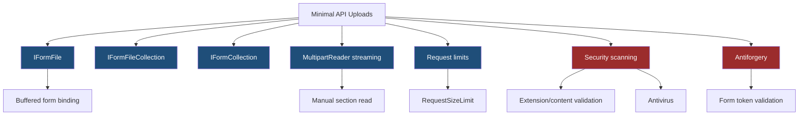
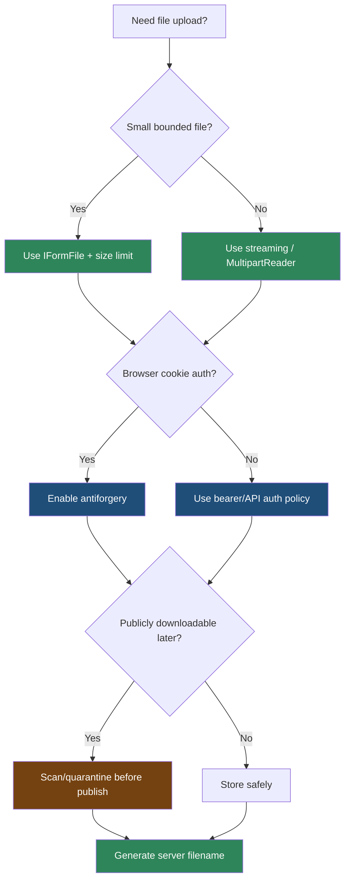

> [!success] Mastery Check
> - [ ] **Studied Well**
> - [ ] **Can explain the concept without notes**
> - [ ] **Can answer interview questions confidently**
> - [ ] **Can implement it in a real project**


# 4.087 - File Upload in Minimal APIs: IFormFile and Large File Streaming

---

## PART 0 - Navigation & Context

### Where This Topic Lives

```
ASP.NET Core Mastery
├── Minimal APIs
│   ├── 4.087  YOU ARE HERE - file upload
│   ├── 4.090  Antiforgery in Minimal APIs
│   └── 4.091  Form Binding in Minimal APIs
└── File Handling
    ├── 4.317  File Upload
    └── 4.322  File Security
```

### What You Need Before This

- **[[4.080 - Route Parameter Binding in Minimal APIs]]** - `IFormFile` is a bound handler parameter.
- **[[4.090 - Antiforgery in Minimal APIs (.NET 8)]]** - form/file uploads can require antiforgery validation.
- **HTTP multipart basics** - uploads normally arrive as `multipart/form-data`.

### What This Unlocks After

- **[[4.091 - Form Binding in Minimal APIs (.NET 8): [FromForm] and IFormCollection]]** - broader form binding rules.
- **[[4.317 - File Upload: IFormFile, Streaming Large Files, and Antivirus Hooks]]** - full production file pipeline.
- **[[4.322 - File Security: Path Traversal Prevention and Content Type Validation]]** - secure storage and file validation.

### Why This Matters at Scale

File uploads are where request-body buffering, limits, security scanning, antiforgery, and storage I/O collide; a naive `IFormFile` endpoint can exhaust memory or accept dangerous content before business code notices.

---

## PART 1 - The Core Mental Model

### The Fundamental Rule

> **`IFormFile` binding reads multipart form sections before the handler runs, while large-file streaming reads the body manually; the practical consequence is that upload strategy determines memory use, security checks, and failure status codes.**

### The Plain-Language Analogy

`IFormFile` is like letting the mailroom receive the package, label it, and put it on your desk. Streaming is meeting the delivery truck at the loading dock and moving boxes directly to storage. The desk method is easy for small packages. The loading dock method is required when packages are huge, dangerous, or need inspection while moving.

### The Taxonomy Diagram



---

## PART 2 - Deep Mechanics

### 2.1 `IFormFile` Binding Parses Multipart Before Handler

```
---> Routing ---> Auth ---> Antiforgery/form binding ---> Endpoint handler
                              multipart parsed
                              IFormFile created
```

```csharp
app.MapPost("/api/receipts", async (IFormFile file) =>
{
    await using var stream = File.Create(Path.GetTempFileName());
    await file.CopyToAsync(stream);
    return Results.Accepted();
});
```

```http
// HTTP wire format:
POST /api/receipts HTTP/1.1
Content-Type: multipart/form-data; boundary=abc

HTTP/1.1 202 Accepted
```

ASP.NET Core internally: form binding reads multipart sections using the form reader, buffers according to configured limits, and supplies `IFormFile`.

**Runtime cost:** multipart parsing plus buffering; small files are convenient, large files can be expensive.

**Edge case:** In .NET 8 Minimal APIs, form/file parameters can participate in antiforgery validation. Configure antiforgery deliberately.

### 2.2 Request Size Limits Fail Before Business Logic

```csharp
app.MapPost("/api/images", (IFormFile image) => Results.Accepted())
   .DisableAntiforgery()
   .WithMetadata(new RequestSizeLimitAttribute(10_000_000));
```

```http
// HTTP wire format:
POST /api/images HTTP/1.1
Content-Length: 50000000

HTTP/1.1 413 Payload Too Large
```

**Runtime cost:** limit checks are cheap; rejected large bodies avoid storage work.

**Edge case:** Kestrel, reverse proxy, multipart body length, and endpoint limits can all differ. Align them.

### 2.3 Large Files Should Stream

```
---> Middleware limits/auth
---> Handler reads Request.Body section by section
---> Writes to storage
---> Scans/validates
```

```csharp
app.MapPost("/api/videos/upload", async (HttpRequest request, CancellationToken ct) =>
{
    if (!request.HasFormContentType)
    {
        return Results.BadRequest(new { error = "multipart/form-data required." });
    }

    await using var output = File.Create(Path.GetTempFileName());
    await request.Body.CopyToAsync(output, ct);
    return Results.Accepted();
});
```

**Runtime cost:** streaming avoids holding the full file in memory; still performs network and disk I/O.

**Edge case:** Raw `Body.CopyToAsync` is not a full multipart parser. Use `MultipartReader` when you need file sections and fields.

### 2.4 File Metadata Is Untrusted

```csharp
app.MapPost("/api/invoices/upload", async (IFormFile file) =>
{
    var extension = Path.GetExtension(file.FileName);
    if (!string.Equals(extension, ".pdf", StringComparison.OrdinalIgnoreCase))
    {
        return Results.BadRequest(new { error = "Only PDF files are accepted." });
    }

    var safeName = $"{Guid.NewGuid():N}.pdf";
    await using var output = File.Create(Path.Combine("uploads", safeName));
    await file.CopyToAsync(output);
    return Results.Created($"/api/invoices/files/{safeName}", new { safeName });
});
```

**Runtime cost:** extension check is cheap; content sniffing and antivirus scanning add CPU/I/O.

**Edge case:** Never trust `FileName` for storage paths. Generate your own names.

---

## PART 3 - Production Code Patterns

### Pattern 1: The Small Receipt Upload

```csharp
// Domain scenario: payment API receipt upload.
app.MapPost("/api/payments/{paymentId:guid}/receipt", async (Guid paymentId, IFormFile file) =>
{
    if (file.Length is 0 or > 5_000_000)
    {
        return Results.BadRequest(new { error = "Receipt must be 1 byte to 5 MB." });
    }

    var safeName = $"{paymentId:N}-{Guid.NewGuid():N}.pdf";
    await using var output = File.Create(Path.Combine("uploads", safeName));
    await file.CopyToAsync(output);
    return Results.Accepted();
}).RequireAuthorization("Payments.Write");
```

### Pattern 2: The Explicit Limit Endpoint

```csharp
// Domain scenario: inventory image upload.
app.MapPost("/api/items/{sku}/image", (string sku, IFormFile image) => Results.Accepted())
   .WithMetadata(new RequestSizeLimitAttribute(10_000_000))
   .RequireAuthorization("Inventory.Write");
```

### Pattern 3: The No-Client-Filename Rule

```csharp
// Domain scenario: patient document upload.
static string CreateStorageName(string extension) =>
    $"{DateTimeOffset.UtcNow:yyyyMMdd}/{Guid.NewGuid():N}{extension.ToLowerInvariant()}";
```

### Pattern 4: The Streaming Upload Boundary

```csharp
// Domain scenario: training video upload.
app.MapPost("/api/training/videos", async (HttpRequest request, CancellationToken ct) =>
{
    var tempPath = Path.GetTempFileName();
    await using var output = File.Create(tempPath);
    await request.Body.CopyToAsync(output, ct);
    return Results.Accepted(new { tempPath });
}).RequireAuthorization("Training.Upload");
```

### Pattern 5: The Scan-Before-Publish Rule

```csharp
// Domain scenario: logistics customs document.
app.MapPost("/api/customs/documents", async (IFormFile file, MalwareScanner scanner) =>
{
    await using var stream = file.OpenReadStream();
    var clean = await scanner.IsCleanAsync(stream);
    return clean ? Results.Accepted() : Results.BadRequest(new { error = "File rejected." });
});
```

---

## PART 4 - Gotchas & Anti-Patterns

### Gotcha 1: Trusting `file.FileName`

The client controls it.

```csharp
// WRONG CODE
await file.CopyToAsync(File.Create(Path.Combine("uploads", file.FileName)));

// HTTP consequence (wrong path):
// Malicious filenames can attempt traversal or overwrite.

// CORRECT CODE
var safeName = $"{Guid.NewGuid():N}{Path.GetExtension(file.FileName)}";
await file.CopyToAsync(File.Create(Path.Combine("uploads", safeName)));

// HTTP consequence (correct path):
// Storage path is server-generated.

// WHY: multipart metadata is untrusted input.
```

### Gotcha 2: No Upload Size Limit

The body can exhaust memory/disk.

```csharp
// WRONG CODE
app.MapPost("/api/upload", (IFormFile file) => Results.Ok());

// HTTP consequence (wrong path):
// Huge request may consume buffers/storage before handler rejects it.

// CORRECT CODE
app.MapPost("/api/upload", (IFormFile file) => Results.Ok())
   .WithMetadata(new RequestSizeLimitAttribute(5_000_000));

// HTTP consequence (correct path):
// Oversized upload -> 413 Payload Too Large.

// WHY: limits should reject before expensive processing.
```

### Gotcha 3: Loading Large Files Into Memory

Byte arrays are not streaming.

```csharp
// WRONG CODE
using var ms = new MemoryStream();
await file.CopyToAsync(ms);
var bytes = ms.ToArray();

// HTTP consequence (wrong path):
// Large uploads create high memory pressure.

// CORRECT CODE
await using var output = File.Create(tempPath);
await file.CopyToAsync(output);

// HTTP consequence (correct path):
// Upload streams to disk/storage.

// WHY: memory buffering scales poorly with concurrent uploads.
```

### Gotcha 4: Ignoring Antiforgery for Browser Forms

Cookie-auth browser uploads need CSRF protection.

```csharp
// WRONG CODE
app.MapPost("/profile/avatar", (IFormFile avatar) => Results.Ok());

// HTTP consequence (wrong path):
// Cross-site form POST can target the upload endpoint if cookie auth is used.

// CORRECT CODE
builder.Services.AddAntiforgery();
app.MapPost("/profile/avatar", (IFormFile avatar) => Results.Ok());

// HTTP consequence (correct path):
// Missing/invalid token -> antiforgery rejection before handler.

// WHY: browser forms automatically send cookies across requests.
```

### Gotcha 5: Trusting Content-Type

Clients can lie about MIME type.

```csharp
// WRONG CODE
if (file.ContentType == "image/png") return Results.Ok();

// HTTP consequence (wrong path):
// Non-PNG content can claim image/png.

// CORRECT CODE
// Check extension, content signature, size, and scan before publishing.

// HTTP consequence (correct path):
// Suspicious content -> 400 or quarantine.

// WHY: content type is request metadata, not proof.
```

---

## PART 5 - Performance Implications

### Request Pipeline Characteristics Table

| Scenario | Pipeline Depth | Allocations Per Request | Approx Latency Impact | Recommendation |
|---|---:|---:|---:|---|
| Small `IFormFile` | Form binding | buffering | Medium | Convenient |
| Large `IFormFile` | Form binding | high disk/memory | High | Prefer streaming |
| Raw body streaming | Handler | low memory | Medium | Use for large uploads |
| MultipartReader | Handler | section buffers | Medium | Use for fields + files |
| Size limit reject | Early pipeline | low | Low | Always configure |
| Antivirus scan | Handler/service | CPU/I/O | High | Async quarantine |
| File extension check | Handler | low | Low | Not sufficient alone |
| Client filename storage | Handler | n/a | Security risk | Never trust |

### BenchmarkDotNet Code

```csharp
using BenchmarkDotNet.Attributes;

[MemoryDiagnoser]
public sealed class UploadBufferBenchmarks
{
    private readonly byte[] _buffer = new byte[1024 * 1024];

    [Benchmark] public byte[] CopyToMemory() => _buffer.ToArray();

    [Benchmark] public string GenerateSafeName() =>
        $"{Guid.NewGuid():N}.bin";
}

// Expected output (approximate, .NET 8, x64, local):
// Copying file-sized buffers allocates heavily; safe name generation is tiny.
```

### When This Costs You

Concurrent uploads, large video/document ingestion, antivirus scanning, cloud storage writes, and upload endpoints behind slow clients.

### When This Doesn't Matter

Small internal uploads under strict limits, low concurrency, and endpoints that immediately forward files to managed storage.

---

## PART 6 - Interview Arsenal

### A. The Question Bank

**Question:** "When is `IFormFile` appropriate?"

**Average Answer:** "For file uploads."

**Why That's Insufficient:** It misses buffering and limits.

> **Great Answer:** "`IFormFile` is fine for small, bounded multipart uploads where buffering is acceptable. For large or high-concurrency uploads, I stream the body or multipart sections to storage and validate along the way. I always set size limits, generate server-side filenames, and treat content type and filename as untrusted."

**Question:** "What happens before an upload handler gets `IFormFile`?"

**Average Answer:** "ASP.NET Core binds it."

**Why That's Insufficient:** It should mention form parsing and antiforgery.

> **Great Answer:** "The endpoint is selected, auth and antiforgery policy can run, and form binding parses the multipart body into form files before the handler receives `IFormFile`. If size limits or antiforgery fail, the handler does not run."

**Question:** "How do you secure browser-based upload endpoints?"

**Average Answer:** "Check file extension."

**Why That's Insufficient:** Security is layered.

> **Great Answer:** "I combine authentication, authorization, antiforgery for cookie-based browser forms, size limits, generated storage names, content validation, malware scanning, and quarantine before publish. The HTTP failure can be 401/403, 400, 413, or an antiforgery failure depending on which layer rejects."

### B. The Trick Questions

| Question | Trap | Correct Answer |
|---|---|---|
| Is `file.FileName` safe? | Trusting metadata | No, generate storage names. |
| Does `ContentType` prove file type? | MIME trust | No, validate content. |
| Is `IFormFile` zero-copy? | Convenience myth | No, form parsing/buffering is involved. |
| Do browser uploads need CSRF protection? | Auth-only thinking | Cookie-auth forms do. |

### C. Red Flags to Avoid

- "Just save `file.FileName`." - path/security bug.
- "No size limits needed." - resource exhaustion.
- "Content-Type is enough." - spoofable.
- "All uploads should use MemoryStream." - memory pressure.
- "Antiforgery does not matter for uploads." - wrong for cookie forms.

---

## PART 7 - Decision Framework



---

## PART 8 - Self-Check

### A. Conceptual Questions

1. What happens before an `IFormFile` parameter reaches the handler?
2. Why should large uploads stream instead of using `MemoryStream`?
3. What HTTP status should an oversized request produce?
4. Why is `file.FileName` unsafe?
5. Why is `ContentType` insufficient?
6. How does antiforgery relate to browser uploads?
7. What is the difference between `IFormFile` and raw body streaming?
8. Why align Kestrel/proxy/endpoint size limits?

### B. Code Puzzles

```csharp
await file.CopyToAsync(File.Create(Path.Combine("uploads", file.FileName)));
```

<details><summary>Answer</summary>
The bug is trusting client-supplied filename. Generate a server filename and validate paths.
</details>

```csharp
using var ms = new MemoryStream();
await file.CopyToAsync(ms);
```

<details><summary>Answer</summary>
This buffers the whole file in memory. Dangerous for large/concurrent uploads.
</details>

```csharp
app.MapPost("/upload", (IFormFile file) => Results.Ok());
```

<details><summary>Answer</summary>
Missing explicit size/security policy. Add request limits, auth, antiforgery as appropriate, and content validation.
</details>

```csharp
if (file.ContentType == "application/pdf") return Results.Ok();
```

<details><summary>Answer</summary>
Content-Type is client supplied. It should not be the only validation.
</details>

---

## PART 9 - Connections & Resources

### A. Related Topics Table

| Topic | Why It Connects |
|---|---|
| [[4.090 - Antiforgery in Minimal APIs (.NET 8)]] | Form/file uploads can require antiforgery validation. |
| [[4.091 - Form Binding in Minimal APIs (.NET 8): [FromForm] and IFormCollection]] | File binding is part of form binding. |
| [[4.317 - File Upload: IFormFile, Streaming Large Files, and Antivirus Hooks]] | Full upload processing pipeline. |
| [[4.322 - File Security: Path Traversal Prevention and Content Type Validation]] | Uploaded file metadata is untrusted. |
| [[4.199 - Request Timeouts (.NET 8): IHttpRequestTimeoutFeature]] | Slow uploads need timeout policy. |

### B. Books

| Book | Chapters | Why These Chapters |
|---|---|---|
| *ASP.NET Core in Action* | File uploads, Minimal APIs | Practical upload binding and request limits. |
| *Pro ASP.NET Core* | Forms and files | Detailed multipart handling examples. |

### C. Essential Articles & Docs

- [Microsoft Docs - File uploads in ASP.NET Core](https://learn.microsoft.com/en-us/aspnet/core/mvc/models/file-uploads)
- [Microsoft Docs - Parameter binding in Minimal API apps](https://learn.microsoft.com/en-us/aspnet/core/fundamentals/minimal-apis/parameter-binding)
- [Microsoft Docs - Antiforgery in ASP.NET Core](https://learn.microsoft.com/en-us/aspnet/core/security/anti-request-forgery)
- [Microsoft Docs - ASP.NET Core performance best practices](https://learn.microsoft.com/en-us/aspnet/core/performance/performance-best-practices)

### D. Template Meta-Note

> [!NOTE]
> **Part 0** orients the topic. **Part 1** gives the mental model. **Part 2** shows framework mechanics. **Part 3** gives production patterns. **Part 4** names gotchas. **Part 5** covers performance. **Part 6** prepares interviews. **Part 7** gives decisions. **Part 8** checks understanding. **Part 9** connects resources.
