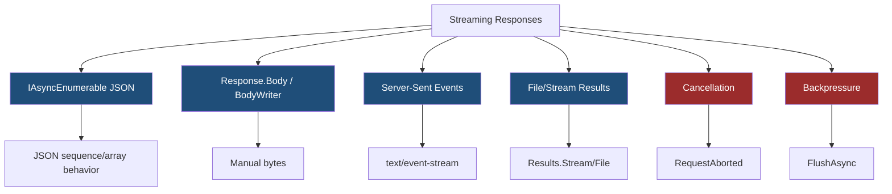
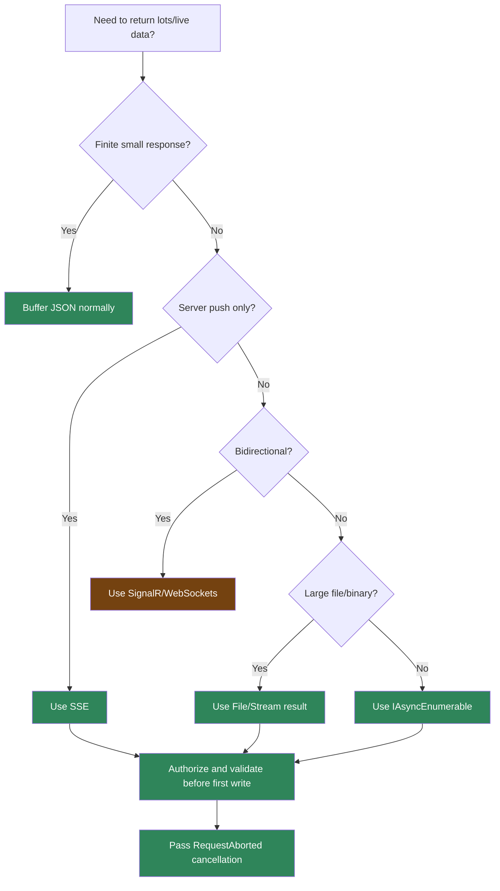

> [!success] Mastery Check
> - [ ] **Studied Well**
> - [ ] **Can explain the concept without notes**
> - [ ] **Can answer interview questions confidently**
> - [ ] **Can implement it in a real project**


# 4.088 - Streaming Responses: IAsyncEnumerable<T> and Server-Sent Events

---

## PART 0 - Navigation & Context

### Where This Topic Lives

```
ASP.NET Core Mastery
├── Minimal APIs
│   └── 4.088  YOU ARE HERE - streaming responses
├── HTTP Fundamentals
│   └── 4.125  HttpResponse writing and streaming
└── Real-Time
    └── 4.229  Server-Sent Events
```

### What You Need Before This

- **[[4.082 - IResult and TypedResults]]** - results write HTTP responses.
- **[[4.056 - Response Buffering vs Streaming in Middleware]]** - streaming changes when headers are committed.
- **C# `IAsyncEnumerable<T>`** - streaming JSON arrays can enumerate async sequences.

### What This Unlocks After

- **[[4.229 - Server-Sent Events with IAsyncEnumerable<T>: Push Without SignalR]]** - SSE as a real-time pattern.
- **[[4.230 - Long Polling: Correct Implementation When WebSockets Are Unavailable]]** - alternatives to streaming.
- **[[4.221 - SignalR Transports: WebSockets, SSE, and Long Polling Negotiation]]** - protocol comparison.

### Why This Matters at Scale

Streaming reduces memory and time-to-first-byte for large or live responses, but it commits HTTP headers early and makes error handling, cancellation, and client backpressure much more important.

---

## PART 1 - The Core Mental Model

### The Fundamental Rule

> **A streaming response writes bytes while the handler is still producing data; the practical consequence is that once the body starts, status and headers are effectively committed.**

### The Plain-Language Analogy

A buffered response is packing the whole shipment before opening the warehouse door. A streaming response is handing boxes to the customer as they arrive. The customer sees the first box faster and you need less storage, but if box 20 is broken you cannot pretend boxes 1-19 were never delivered. You need cancellation and error strategy before opening the door.

### The Taxonomy Diagram



---

## PART 2 - Deep Mechanics

### 2.1 `IAsyncEnumerable<T>` Streams Values From the Handler

```
---> Endpoint handler returns IAsyncEnumerable<T>
     serializer enumerates asynchronously
     writes chunks to response
     observes cancellation
```

```csharp
app.MapGet("/api/orders/export", async IAsyncEnumerable<OrderDto> () =>
{
    for (var i = 1; i <= 3; i++)
    {
        await Task.Delay(100);
        yield return new OrderDto(i);
    }
});

public sealed record OrderDto(int Id);
```

```http
// HTTP wire format (approximate):
HTTP/1.1 200 OK
Content-Type: application/json
Transfer-Encoding: chunked
```

**Runtime cost:** one async enumeration state machine plus serialization per item; lower memory than buffering all items.

**Edge case:** Serializer behavior and JSON shape matter. Clients may not process items until valid JSON is available.

### 2.2 Manual Streaming Commits Headers

```csharp
app.MapGet("/api/reports/live", async (HttpContext context, CancellationToken ct) =>
{
    context.Response.ContentType = "text/plain";
    await context.Response.WriteAsync("starting\n", ct);
    await context.Response.Body.FlushAsync(ct);
    await Task.Delay(100, ct);
    await context.Response.WriteAsync("done\n", ct);
});
```

**Runtime cost:** direct writes avoid a large buffer but create flush/syscall overhead.

**Edge case:** After `WriteAsync`, changing `StatusCode` is too late.

### 2.3 SSE Uses `text/event-stream`

```csharp
app.MapGet("/api/shipments/events", async (HttpContext context, CancellationToken ct) =>
{
    context.Response.Headers.CacheControl = "no-cache";
    context.Response.ContentType = "text/event-stream";

    for (var i = 0; i < 3 && !ct.IsCancellationRequested; i++)
    {
        await context.Response.WriteAsync($"event: shipment\ndata: {{\"sequence\":{i}}}\n\n", ct);
        await context.Response.Body.FlushAsync(ct);
        await Task.Delay(1000, ct);
    }
});
```

```http
// HTTP wire format:
HTTP/1.1 200 OK
Content-Type: text/event-stream
Cache-Control: no-cache

event: shipment
data: {"sequence":0}
```

**Runtime cost:** one open connection per client; cheap per message, expensive at high concurrency.

**Edge case:** SSE is one-way server-to-client over HTTP. Use SignalR/WebSockets for bidirectional communication.

### 2.4 Cancellation Is Mandatory

```
Client disconnects
---> RequestAborted canceled
---> enumeration/write should stop
---> downstream DB/queue read canceled
```

**Runtime cost:** token checks are cheap; saved work can be huge.

**Edge case:** Ignoring cancellation creates zombie exports and live streams after clients leave.

---

## PART 3 - Production Code Patterns

### Pattern 1: The Cancellable Export Stream

```csharp
// Domain scenario: order export.
app.MapGet("/api/orders/export", (OrdersDb db, CancellationToken ct) =>
    db.Orders.AsNoTracking().Select(o => new OrderDto(o.Id)).AsAsyncEnumerable());
```

### Pattern 2: The Manual Text Stream

```csharp
// Domain scenario: report generation logs.
app.MapGet("/api/reports/{reportId:int}/log", async (int reportId, HttpContext ctx, CancellationToken ct) =>
{
    ctx.Response.ContentType = "text/plain";
    await ctx.Response.WriteAsync($"report {reportId} started\n", ct);
    await ctx.Response.Body.FlushAsync(ct);
});
```

### Pattern 3: The Shipment SSE Feed

```csharp
// Domain scenario: logistics tracker.
app.MapGet("/api/shipments/{shipmentId:guid}/events", async (Guid shipmentId, HttpContext ctx, CancellationToken ct) =>
{
    ctx.Response.ContentType = "text/event-stream";
    await ctx.Response.WriteAsync($"data: {{\"shipmentId\":\"{shipmentId}\"}}\n\n", ct);
    await ctx.Response.Body.FlushAsync(ct);
});
```

### Pattern 4: The Preflight Validation Before Streaming

```csharp
// Domain scenario: invoice export.
app.MapGet("/api/invoices/{invoiceId:int}/stream", async (int invoiceId, HttpContext ctx) =>
{
    if (invoiceId <= 0)
    {
        return Results.BadRequest(new { error = "Invalid invoice id." });
    }

    return Results.Stream(stream => stream.WriteAsync(ReadOnlyMemory<byte>.Empty).AsTask(), "application/pdf");
});
```

### Pattern 5: The Heartbeat

```csharp
// Domain scenario: operations event stream.
static Task WriteHeartbeat(HttpResponse response, CancellationToken ct) =>
    response.WriteAsync("event: heartbeat\ndata: {}\n\n", ct);
```

---

## PART 4 - Gotchas & Anti-Patterns

### Gotcha 1: Throwing After Body Starts

You cannot rewrite the response into a clean JSON error.

```csharp
// WRONG CODE
await ctx.Response.WriteAsync("first chunk");
throw new InvalidOperationException();

// HTTP consequence (wrong path):
// Client receives partial 200 response or broken stream.

// CORRECT CODE
if (!CanStream()) return Results.Problem(statusCode: 500);
await ctx.Response.WriteAsync("first chunk");

// HTTP consequence (correct path):
// Errors before streaming become normal problem responses.

// WHY: headers/status are committed once body starts.
```

### Gotcha 2: Ignoring Cancellation

Disconnected clients still cost resources.

```csharp
// WRONG CODE
while (true) await response.WriteAsync("data: {}\n\n");

// HTTP consequence (wrong path):
// Work continues after disconnect.

// CORRECT CODE
while (!ct.IsCancellationRequested)
{
    await response.WriteAsync("data: {}\n\n", ct);
}

// HTTP consequence (correct path):
// Stream stops when client disconnects.

// WHY: `RequestAborted` is the request lifetime signal.
```

### Gotcha 3: Flushing Every Tiny JSON Item

Too many flushes can hurt throughput.

```csharp
// WRONG CODE
await response.WriteAsync(item);
await response.Body.FlushAsync();

// HTTP consequence (wrong path):
// Excessive small chunks and syscalls.

// CORRECT CODE
// Batch or let serializer/server buffering decide unless low latency is required.

// HTTP consequence (correct path):
// Better throughput.

// WHY: flush frequency is a latency/throughput trade-off.
```

### Gotcha 4: Using SSE for Bidirectional Work

SSE cannot receive client messages on the same stream.

```csharp
// WRONG CODE
// Expecting EventSource to send client commands over SSE.

// HTTP consequence (wrong path):
// Client can only receive events.

// CORRECT CODE
// Use SignalR/WebSockets for bidirectional communication.

// HTTP consequence (correct path):
// Protocol matches interaction pattern.

// WHY: SSE is server-to-client only.
```

### Gotcha 5: Streaming Without Auth Revalidation Strategy

Long-lived streams outlive normal short request assumptions.

```csharp
// WRONG CODE
app.MapGet("/api/admin/events", StreamEvents);

// HTTP consequence (wrong path):
// Public or stale long-lived stream.

// CORRECT CODE
app.MapGet("/api/admin/events", StreamEvents)
   .RequireAuthorization("AdminEvents");

// HTTP consequence (correct path):
// Unauthorized users receive 401/403 before stream starts.

// WHY: authorization must happen before headers/body are committed.
```

---

## PART 5 - Performance Implications

### Request Pipeline Characteristics Table

| Scenario | Pipeline Depth | Allocations Per Request | Approx Latency Impact | Recommendation |
|---|---:|---:|---:|---|
| Buffered JSON list | Handler + serialization | full list | High memory | Avoid for huge data |
| `IAsyncEnumerable<T>` | Handler + serializer | per item | Lower memory | Good for large reads |
| Manual stream | Handler | low | Depends on flush | Use carefully |
| SSE | Long request | per connection | Concurrency cost | Limit clients |
| Frequent flush | Handler/socket | low allocation | High syscall cost | Batch if possible |
| Ignored cancellation | Downstream | wasted work | Critical | Pass token |
| Exception mid-stream | Failure path | broken response | High | Validate before write |
| File stream | Result | low memory | I/O bound | Good for files |

### BenchmarkDotNet Code

```csharp
using BenchmarkDotNet.Attributes;

[MemoryDiagnoser]
public sealed class StreamingShapeBenchmarks
{
    [Benchmark] public List<int> BufferAll() => Enumerable.Range(1, 10_000).ToList();

    [Benchmark] public async Task<int> EnumerateAsync()
    {
        var count = 0;
        await foreach (var item in Generate())
        {
            count += item;
        }
        return count;
    }

    private static async IAsyncEnumerable<int> Generate()
    {
        for (var i = 0; i < 10_000; i++)
        {
            yield return i;
            await Task.Yield();
        }
    }
}

// Expected output (approximate, .NET 8, x64, local):
// BufferAll allocates the list; async streaming adds state-machine overhead but avoids full buffering.
```

### When This Costs You

High-concurrency SSE, frequent flushes, slow clients, large database streams, and streams that ignore cancellation.

### When This Doesn't Matter

Small responses, short exports, and endpoints where buffering the whole result is cheap and simpler.

---

## PART 6 - Interview Arsenal

### A. The Question Bank

**Question:** "What changes when an endpoint streams a response?"

**Average Answer:** "It sends data gradually."

**Why That's Insufficient:** It misses header commitment and error handling.

> **Great Answer:** "The response body starts before all data is available, so status and headers are committed early. That improves time-to-first-byte and memory use, but if something fails mid-stream I cannot turn it into a normal JSON problem response. I validate and authorize before the first write and pass cancellation through every async operation."

**Question:** "When would you use SSE instead of SignalR?"

**Average Answer:** "For real-time events."

**Why That's Insufficient:** SSE is one-way.

> **Great Answer:** "I use SSE when the server only needs to push events to the browser over simple HTTP, like status updates or notifications. If the client must send commands on the same connection, or I need richer transport negotiation, I use SignalR/WebSockets."

**Question:** "How do you handle client disconnects?"

**Average Answer:** "Catch exceptions."

**Why That's Insufficient:** Cancellation should be proactive.

> **Great Answer:** "I accept a `CancellationToken` or use `HttpContext.RequestAborted`, pass it to database reads, queue reads, delays, and response writes, and stop enumeration when it is canceled. That prevents zombie exports and long-lived streams."

### B. The Trick Questions

| Question | Trap | Correct Answer |
|---|---|---|
| Can you change status after first write? | Late error handling | No, headers are committed. |
| Is SSE bidirectional? | WebSocket confusion | No, server-to-client only. |
| Does streaming always improve performance? | Blanket optimization | It trades memory for complexity and connection cost. |
| Should every item be flushed? | Latency obsession | Only when low latency matters; batching improves throughput. |

### C. Red Flags to Avoid

- "Just throw if streaming fails." - broken partial response.
- "Cancellation is optional." - wasted resources.
- "SSE is WebSockets." - false.
- "Streaming always faster." - context-dependent.
- "Auth can happen after streaming starts." - too late.

---

## PART 7 - Decision Framework



---

## PART 8 - Self-Check

### A. Conceptual Questions

1. What happens to headers after the first response body write?
2. Why is cancellation critical for streaming endpoints?
3. When is `IAsyncEnumerable<T>` better than buffering a list?
4. What wire content type does SSE use?
5. Why should auth run before streaming starts?
6. What is the latency/throughput trade-off of `FlushAsync`?
7. What happens if an exception occurs mid-stream?
8. When should SignalR be preferred over SSE?

### B. Code Puzzles

```csharp
await ctx.Response.WriteAsync("hello");
ctx.Response.StatusCode = 500;
```

<details><summary>Answer</summary>
The status change is too late if the response has started. The client may receive a partial 200 response.
</details>

```csharp
while (true)
{
    await response.WriteAsync("data: {}\n\n");
}
```

<details><summary>Answer</summary>
The stream ignores cancellation and can continue work after disconnect. Use `RequestAborted`.
</details>

```csharp
ctx.Response.ContentType = "text/event-stream";
await ctx.Response.WriteAsync("data: {}\n\n");
```

<details><summary>Answer</summary>
This is an SSE event frame. It is one-way server-to-client.
</details>

```csharp
app.MapGet("/admin/events", StreamEvents);
```

<details><summary>Answer</summary>
Missing authorization. Long-lived sensitive streams must be protected before the body starts.
</details>

---

## PART 9 - Connections & Resources

### A. Related Topics Table

| Topic | Why It Connects |
|---|---|
| [[4.056 - Response Buffering vs Streaming in Middleware]] | Streaming changes response commitment and memory behavior. |
| [[4.125 - HttpResponse: Writing Status, Headers, Cookies, and Streaming Body]] | Manual streaming writes directly to the response. |
| [[4.229 - Server-Sent Events with IAsyncEnumerable<T>: Push Without SignalR]] | SSE is a dedicated streaming pattern. |
| [[4.221 - SignalR Transports: WebSockets, SSE, and Long Polling Negotiation]] | Helps choose between SSE, WebSockets, and SignalR. |
| [[2.080 - Async Streams: IAsyncEnumerable<T>]] | C# async streams power many streaming endpoints. |

### B. Books

| Book | Chapters | Why These Chapters |
|---|---|---|
| *ASP.NET Core in Action* | Response handling and Minimal APIs | Practical response streaming context. |
| *C# in Depth* | Async streams | Explains `IAsyncEnumerable<T>` mechanics. |

### C. Essential Articles & Docs

- [Microsoft Docs - Minimal API responses](https://learn.microsoft.com/en-us/aspnet/core/fundamentals/minimal-apis/responses)
- [Microsoft Docs - Response caching and streaming considerations](https://learn.microsoft.com/en-us/aspnet/core/performance/response-compression)
- [Microsoft Docs - Server-Sent Events examples in ASP.NET Core](https://learn.microsoft.com/en-us/aspnet/core/fundamentals/minimal-apis/responses)
- [ASP.NET Core source - HttpResponse writing](https://github.com/dotnet/aspnetcore/tree/main/src/Http)

### D. Template Meta-Note

> [!NOTE]
> **Part 0** orients the topic. **Part 1** gives the mental model. **Part 2** shows framework mechanics. **Part 3** gives production patterns. **Part 4** names gotchas. **Part 5** covers performance. **Part 6** prepares interviews. **Part 7** gives decisions. **Part 8** checks understanding. **Part 9** connects resources.
