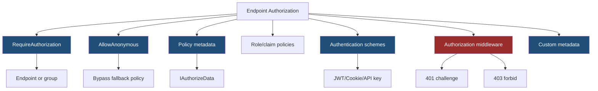
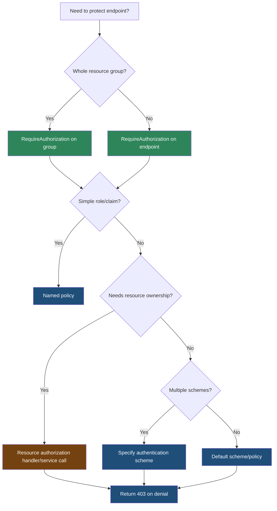

> [!success] Mastery Check
> - [ ] **Studied Well**
> - [ ] **Can explain the concept without notes**
> - [ ] **Can answer interview questions confidently**
> - [ ] **Can implement it in a real project**


# 4.089 - Authorization on Endpoints: RequireAuthorization and WithMetadata

---

## PART 0 - Navigation & Context

### Where This Topic Lives

```
ASP.NET Core Mastery
├── Minimal APIs
│   ├── 4.084  Route Groups
│   └── 4.089  YOU ARE HERE - endpoint authorization
├── Authentication
│   └── 4.134  Authentication Architecture
└── Authorization
    └── 4.154  Authorization Architecture
```

### What You Need Before This

- **[[4.074 - Endpoint Metadata: Decorating Endpoints with Custom Attributes]]** - authorization is metadata-driven.
- **[[4.134 - Authentication Architecture: Schemes and Middleware]]** - authentication creates `ClaimsPrincipal`.
- **[[4.154 - Authorization Architecture]]** - authorization evaluates policies after authentication.

### What This Unlocks After

- **[[4.156 - Policy-Based Authorization: AddPolicy and IAuthorizationRequirement]]** - custom policy definitions.
- **[[4.163 - Authorization in Minimal APIs: RequireAuthorization and Metadata]]** - deeper auth patterns.
- **[[4.207 - Rate Limiting Layered with Auth: Per-Tenant API Quotas]]** - policy and quota composition.

### Why This Matters at Scale

Endpoint authorization is the guardrail that keeps Minimal APIs from becoming public route handlers; a missing middleware call or misplaced metadata can turn a correct handler into an exposed production endpoint.

---

## PART 1 - The Core Mental Model

### The Fundamental Rule

> **`RequireAuthorization` attaches authorization metadata to an endpoint; `UseAuthorization` reads that metadata after routing and before endpoint execution, producing `401` or `403` before filters and handlers run.**

### The Plain-Language Analogy

Routing gives the request a badge saying which room it wants. Authentication checks the visitor's ID. Authorization reads the room badge and the ID together and decides whether the visitor can enter. `RequireAuthorization` prints the room rule on the badge; it is not the guard itself.

### The Taxonomy Diagram



---

## PART 2 - Deep Mechanics

### 2.1 Authorization Metadata Is Attached at Endpoint Build Time

```csharp
app.MapGet("/api/orders/{orderId:int}", (int orderId) => Results.Ok(new { orderId }))
   .RequireAuthorization("Orders.Read");
```

**Runtime cost:** metadata is build-time; per request authorization evaluates policy requirements.

**Edge case:** Metadata attached with `WithMetadata(new AuthorizeAttribute(...))` can work, but `RequireAuthorization` is clearer for Minimal APIs.

### 2.2 Middleware Order Determines Enforcement

```
---> Routing[select endpoint]
---> Authentication[sets HttpContext.User]
---> Authorization[reads endpoint metadata]
     unauthenticated -> 401 Challenge
     authenticated but denied -> 403 Forbid
---> Endpoint filters
---> Handler
```

```csharp
app.UseAuthentication();
app.UseAuthorization();

app.MapGet("/api/admin/audit", () => Results.Ok())
   .RequireAuthorization("AdminOnly");
```

```http
// HTTP wire format:
GET /api/admin/audit HTTP/1.1

HTTP/1.1 401 Unauthorized
WWW-Authenticate: Bearer
```

ASP.NET Core internally: `AuthorizationMiddleware` calls `IAuthorizationService` with the selected endpoint metadata and user principal.

**Runtime cost:** authentication validation plus policy evaluation; can be expensive if handlers hit storage.

**Edge case:** If authorization runs before routing, endpoint-specific metadata is unavailable.

### 2.3 Group Authorization Is the Production Default

```csharp
var payments = app.MapGroup("/api/payments")
    .RequireAuthorization("Payments");

payments.MapGet("/{paymentId:guid}", (Guid paymentId) => Results.Ok(new { paymentId }));
payments.MapPost("/{paymentId:guid}/capture", (Guid paymentId) => Results.Accepted());
```

**Runtime cost:** same policy evaluation; less configuration drift.

**Edge case:** Use separate public/private groups rather than relying on call order or trying to undo group authorization.

### 2.4 Custom Metadata Complements Authorization

```csharp
public sealed record AuditScopeMetadata(string Scope);

app.MapDelete("/api/users/{userId:guid}", (Guid userId) => Results.NoContent())
   .RequireAuthorization("UserAdmin")
   .WithMetadata(new AuditScopeMetadata("user.delete"));
```

**Runtime cost:** custom metadata lookup is cheap; auditing itself may cost I/O.

**Edge case:** Custom metadata does not authorize by itself unless policy/middleware reads it.

---

## PART 3 - Production Code Patterns

### Pattern 1: The Route Group Auth Boundary

```csharp
// Domain scenario: payment API.
var payments = app.MapGroup("/api/payments")
    .RequireAuthorization("Payments");

payments.MapGet("/{paymentId:guid}", (Guid paymentId) => Results.Ok(new { paymentId }));
payments.MapPost("/{paymentId:guid}/capture", (Guid paymentId) => Results.Accepted());
```

### Pattern 2: The Public Health Endpoint

```csharp
// Domain scenario: Kubernetes probes.
app.MapGet("/health/live", () => Results.Ok("live")).AllowAnonymous();

app.MapGet("/health/ready", () => Results.Ok("ready"))
   .RequireAuthorization("OpsOnly");
```

### Pattern 3: The Scheme-Specific Endpoint

```csharp
// Domain scenario: mobile JWT API.
app.MapGet("/api/mobile/profile", (ClaimsPrincipal user) => Results.Ok(new { user.Identity?.Name }))
   .RequireAuthorization(new AuthorizeAttribute
   {
       AuthenticationSchemes = JwtBearerDefaults.AuthenticationScheme
   });
```

### Pattern 4: The Resource Authorization Handler Call

```csharp
// Domain scenario: order ownership check.
app.MapGet("/api/orders/{orderId:int}", async (int orderId, IAuthorizationService auth, ClaimsPrincipal user) =>
{
    var allowed = await auth.AuthorizeAsync(user, orderId, "OrderOwner");
    return allowed.Succeeded ? Results.Ok(new { orderId }) : Results.Forbid();
}).RequireAuthorization();
```

### Pattern 5: The Audit Metadata Pair

```csharp
// Domain scenario: admin audit service.
app.MapDelete("/api/admin/users/{userId:guid}", (Guid userId) => Results.NoContent())
   .RequireAuthorization("AdminOnly")
   .WithMetadata(new AuditScopeMetadata("admin.user.delete"));
```

---

## PART 4 - Gotchas & Anti-Patterns

### Gotcha 1: `RequireAuthorization` Without Middleware

Metadata is not a guard.

```csharp
// WRONG CODE
app.MapGet("/api/admin", () => "secret").RequireAuthorization();

// HTTP consequence (wrong path):
// Without authorization middleware, endpoint metadata is not enforced.

// CORRECT CODE
app.UseAuthentication();
app.UseAuthorization();
app.MapGet("/api/admin", () => "secret").RequireAuthorization();

// HTTP consequence (correct path):
// Anonymous request -> 401/403.

// WHY: middleware reads endpoint metadata after routing.
```

### Gotcha 2: Wrong Middleware Order

Auth needs routing metadata and an authenticated user.

```csharp
// WRONG CODE
app.UseAuthorization();
app.UseAuthentication();

// HTTP consequence (wrong path):
// Authorization sees unauthenticated user or no endpoint metadata.

// CORRECT CODE
app.UseAuthentication();
app.UseAuthorization();

// HTTP consequence (correct path):
// Authentication sets user before authorization evaluates policy.

// WHY: authentication and authorization are separate middleware.
```

### Gotcha 3: Public Endpoint Inside Private Group

Undoing group auth can be confusing.

```csharp
// WRONG CODE
var api = app.MapGroup("/api").RequireAuthorization();
api.MapGet("/public", () => "public").AllowAnonymous();

// HTTP consequence (wrong path):
// Works but is easy to miss in audits.

// CORRECT CODE
app.MapGet("/api/public", () => "public").AllowAnonymous();
var privateApi = app.MapGroup("/api").RequireAuthorization();

// HTTP consequence (correct path):
// Public/private boundaries are visible.

// WHY: grouping should match security boundaries.
```

### Gotcha 4: Query Tenant Instead of Auth Resource

Request input is not permission.

```csharp
// WRONG CODE
app.MapGet("/api/orders", ([FromQuery] Guid tenantId) => Results.Ok());

// HTTP consequence (wrong path):
// Client can request another tenant.

// CORRECT CODE
app.MapGet("/api/tenants/{tenantId:guid}/orders", Handler)
   .RequireAuthorization("TenantAccess");

// HTTP consequence (correct path):
// Unauthorized tenant -> 403.

// WHY: resource authorization must validate route/resource against user.
```

### Gotcha 5: Using Filters for Authorization

Filters run after authorization middleware.

```csharp
// WRONG CODE
app.MapGet("/api/admin", () => "secret")
   .AddEndpointFilter(new AdminCheckFilter());

// HTTP consequence (wrong path):
// Auth behavior is custom, late, and inconsistent.

// CORRECT CODE
app.MapGet("/api/admin", () => "secret")
   .RequireAuthorization("AdminOnly");

// HTTP consequence (correct path):
// Auth middleware handles challenge/forbid consistently.

// WHY: authorization belongs in the authorization system, not endpoint filters.
```

---

## PART 5 - Performance Implications

### Request Pipeline Characteristics Table

| Scenario | Pipeline Depth | Allocations Per Request | Approx Latency Impact | Recommendation |
|---|---:|---:|---:|---|
| No auth endpoint | Routing + endpoint | low | Low | Use only for public |
| JWT auth | Auth middleware | token validation | Medium | Cache keys/config |
| Cookie auth | Auth middleware | ticket validation | Medium | Secure cookies |
| Simple role policy | Auth middleware | low | Low | Fine |
| DB-backed policy | Auth handler | DB query | High | Cache/avoid per request |
| Group auth | Auth middleware | same as endpoint | Low drift | Prefer for resources |
| Resource auth in handler | Handler/service | data dependent | Medium-high | Use for ownership |
| Missing middleware | Correctness failure | n/a | Critical | Test protected endpoints |

### BenchmarkDotNet Code

```csharp
using BenchmarkDotNet.Attributes;
using System.Security.Claims;

[MemoryDiagnoser]
public sealed class AuthorizationShapeBenchmarks
{
    private readonly ClaimsPrincipal _user = new(new ClaimsIdentity(
        [new Claim(ClaimTypes.Role, "Admin")],
        "Test"));

    [Benchmark] public bool HasRoleAdmin() => _user.IsInRole("Admin");
    [Benchmark] public bool HasMissingRole() => _user.IsInRole("Auditor");
}

// Expected output (approximate, .NET 8, x64, local):
// Simple claim checks are cheap; token validation and database-backed handlers cost much more.
```

### When This Costs You

High-throughput APIs with JWT validation, dynamic policies hitting a database, resource authorization that loads entities, and multi-scheme endpoints.

### When This Doesn't Matter

Simple role/claim checks and low-traffic admin endpoints where correctness is more important than micro-cost.

---

## PART 6 - Interview Arsenal

### A. The Question Bank

**Question:** "What does `RequireAuthorization` actually do?"

**Average Answer:** "It protects the endpoint."

**Why That's Insufficient:** It should identify metadata and middleware.

> **Great Answer:** "`RequireAuthorization` attaches authorization metadata to the endpoint or route group. After routing selects the endpoint, `UseAuthorization` reads that metadata and evaluates policies against `HttpContext.User`. If the user is not authenticated it challenges with 401; if authenticated but denied, it forbids with 403."

**Question:** "Why must authentication run before authorization?"

**Average Answer:** "Because auth comes first."

**Why That's Insufficient:** It should explain the principal.

> **Great Answer:** "Authentication reads credentials and populates `HttpContext.User`. Authorization evaluates requirements against that principal and endpoint metadata. If authorization runs first, it evaluates an empty or wrong principal and produces incorrect 401/403 behavior."

**Question:** "Where do endpoint filters fit relative to authorization?"

**Average Answer:** "Before the handler."

**Why That's Insufficient:** It must mention auth before filters.

> **Great Answer:** "Endpoint filters run inside endpoint execution after routing, binding, and authorization middleware. If authorization fails, the filter never runs. That is why I do authentication and authorization in middleware/policies, not endpoint filters."

### B. The Trick Questions

| Question | Trap | Correct Answer |
|---|---|---|
| Does `RequireAuthorization` work without `UseAuthorization`? | Metadata as behavior | No. |
| Does `AllowAnonymous` delete group metadata? | Override assumption | It marks endpoint anonymous for auth handling. |
| Should endpoint filters authorize users? | Wrong layer | Prefer policies/handlers. |
| Is 401 same as 403? | Status confusion | 401 unauthenticated, 403 authenticated but denied. |

### C. Red Flags to Avoid

- "RequireAuthorization is middleware." - it attaches metadata.
- "Filters are fine for auth." - wrong abstraction.
- "401 and 403 are interchangeable." - false.
- "Tenant query parameter proves access." - security bug.
- "Middleware order does not matter." - critical bug.

---

## PART 7 - Decision Framework



---

## PART 8 - Self-Check

### A. Conceptual Questions

1. What does `RequireAuthorization` attach to an endpoint?
2. What middleware reads authorization metadata?
3. What happens if authorization fails before endpoint filters?
4. What is the difference between 401 and 403?
5. Why should auth not live in endpoint filters?
6. How does group authorization reduce drift?
7. Why is route/query tenant id untrusted?
8. How can custom endpoint metadata complement authorization?

### B. Code Puzzles

```csharp
app.MapGet("/admin", () => "secret").RequireAuthorization();
```

<details><summary>Answer</summary>
If `UseAuthorization` is missing, the metadata is not enforced.
</details>

```csharp
app.UseAuthorization();
app.UseAuthentication();
```

<details><summary>Answer</summary>
Wrong order. Authorization runs before authentication sets `HttpContext.User`.
</details>

```csharp
app.MapGet("/admin", () => "secret").AddEndpointFilter(new AdminFilter());
```

<details><summary>Answer</summary>
This is the wrong layer for authorization. Use `RequireAuthorization` and policies.
</details>

```csharp
return Results.Forbid();
```

<details><summary>Answer</summary>
This represents authenticated but unauthorized. Unauthenticated access should challenge, usually 401.
</details>

---

## PART 9 - Connections & Resources

### A. Related Topics Table

| Topic | Why It Connects |
|---|---|
| [[4.074 - Endpoint Metadata: Decorating Endpoints with Custom Attributes]] | Authorization metadata is endpoint metadata. |
| [[4.084 - Route Groups in Minimal APIs: Shared Prefix and Authorization]] | Group auth applies policies consistently. |
| [[4.134 - Authentication Architecture: Schemes and Middleware]] | Authentication creates the principal authorization reads. |
| [[4.154 - Authorization Architecture]] | Policy evaluation explains `RequireAuthorization`. |
| [[4.156 - Policy-Based Authorization: AddPolicy and IAuthorizationRequirement]] | Named policies are the main endpoint auth unit. |

### B. Books

| Book | Chapters | Why These Chapters |
|---|---|---|
| *ASP.NET Core in Action* | Authentication and authorization | Clear pipeline and endpoint metadata explanation. |
| *ASP.NET Core Security* | Authorization | Deeper production security context. |

### C. Essential Articles & Docs

- [Microsoft Docs - Authentication and authorization in Minimal APIs](https://learn.microsoft.com/en-us/aspnet/core/fundamentals/minimal-apis/security)
- [Microsoft Docs - Authorization in ASP.NET Core](https://learn.microsoft.com/en-us/aspnet/core/security/authorization/introduction)
- [Microsoft Docs - Policy-based authorization](https://learn.microsoft.com/en-us/aspnet/core/security/authorization/policies)
- [ASP.NET Core source - Authorization](https://github.com/dotnet/aspnetcore/tree/main/src/Security/Authorization)

### D. Template Meta-Note

> [!NOTE]
> **Part 0** orients the topic. **Part 1** gives the mental model. **Part 2** shows framework mechanics. **Part 3** gives production patterns. **Part 4** names gotchas. **Part 5** covers performance. **Part 6** prepares interviews. **Part 7** gives decisions. **Part 8** checks understanding. **Part 9** connects resources.
