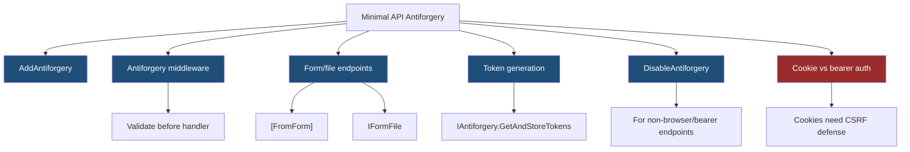
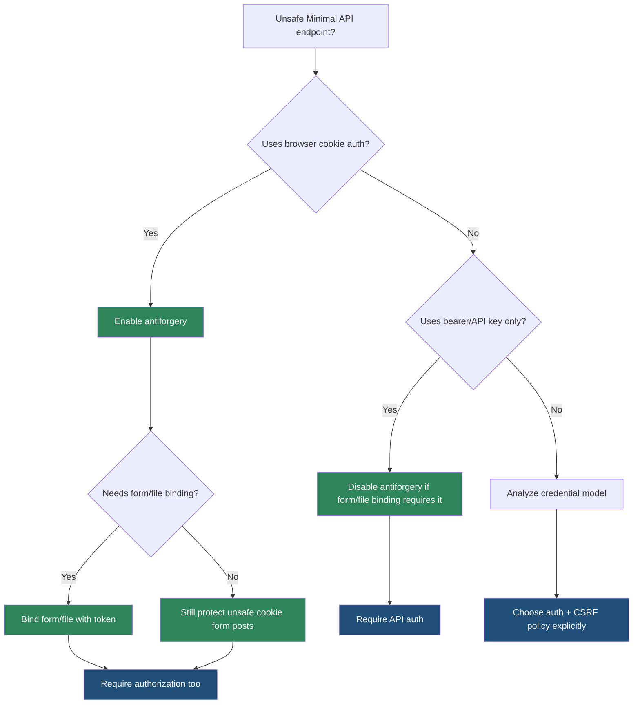

> [!success] Mastery Check
> - [ ] **Studied Well**
> - [ ] **Can explain the concept without notes**
> - [ ] **Can answer interview questions confidently**
> - [ ] **Can implement it in a real project**


# 4.090 - Antiforgery in Minimal APIs (.NET 8)

---

## PART 0 - Navigation & Context

### Where This Topic Lives

```
ASP.NET Core Mastery
├── Minimal APIs
│   ├── 4.087  File Upload
│   ├── 4.090  YOU ARE HERE - antiforgery
│   └── 4.091  Form Binding
└── Security
    └── 4.210  CSRF / Antiforgery
```

### What You Need Before This

- **[[4.089 - Authorization on Endpoints: RequireAuthorization and WithMetadata]]** - antiforgery is not authentication or authorization.
- **[[4.087 - File Upload in Minimal APIs: IFormFile and Large File Streaming]]** - file/form endpoints can trigger antiforgery validation.
- **CSRF basics** - browser cookies are sent automatically, which creates cross-site request risk.

### What This Unlocks After

- **[[4.091 - Form Binding in Minimal APIs (.NET 8): [FromForm] and IFormCollection]]** - form binding and antiforgery are linked in .NET 8.
- **[[4.210 - CSRF - Antiforgery: IAntiforgery and ValidateAntiforgeryToken]]** - deeper token generation and validation.
- **[[4.150 - Token Storage Security: HttpOnly Cookies vs Authorization Header]]** - token storage affects CSRF risk.

### Why This Matters at Scale

Antiforgery is the difference between "user intentionally submitted this cookie-authenticated form" and "another site caused the browser to submit it"; Minimal API form endpoints need this protection just as MVC forms do.

---

## PART 1 - The Core Mental Model

### The Fundamental Rule

> **Antiforgery validates that a browser form request includes a server-issued token, not just an authentication cookie; the practical consequence is that cookie-authenticated unsafe requests without a valid token are rejected before handler code runs.**

### The Plain-Language Analogy

A cookie is a building badge the browser automatically carries everywhere. Antiforgery is a one-time form slip handed out inside the building. An attacker can trick the browser into carrying the badge to the door, but cannot read the form slip from your site. The guard requires both for unsafe form actions.

### The Taxonomy Diagram



---

## PART 2 - Deep Mechanics

### 2.1 Antiforgery Runs Before Handler Execution

```
---> Routing ---> Auth ---> Antiforgery validation ---> Endpoint filters ---> Handler
                 missing/invalid token: reject, handler does not run
```

```csharp
builder.Services.AddAntiforgery();

app.MapPost("/profile/avatar", (IFormFile avatar) =>
    Results.Accepted());
```

```http
// HTTP wire format:
POST /profile/avatar HTTP/1.1
Cookie: .AspNetCore.Cookies=...
Content-Type: multipart/form-data

HTTP/1.1 400 Bad Request
```

ASP.NET Core .NET 8 behavior: Minimal API endpoints that bind form/file data can require antiforgery token validation when antiforgery services are registered.

**Runtime cost:** token cookie/form/header read plus cryptographic validation; cheap compared with upload handling.

**Edge case:** If antiforgery services are not registered, endpoints that require antiforgery can fail at startup/runtime depending configuration.

### 2.2 Token Generation Is Usually a GET Page/Bootstrap Concern

```csharp
app.MapGet("/antiforgery/token", (IAntiforgery antiforgery, HttpContext context) =>
{
    var tokens = antiforgery.GetAndStoreTokens(context);
    return Results.Ok(new { token = tokens.RequestToken });
});
```

**Runtime cost:** token generation/protection plus cookie write.

**Edge case:** Do not expose tokens cross-origin casually. Tokens are meant for same-site browser flows.

### 2.3 Bearer/API Clients Often Disable Antiforgery

```csharp
app.MapPost("/api/mobile/profile/avatar", (IFormFile avatar) => Results.Accepted())
   .RequireAuthorization("MobileUser")
   .DisableAntiforgery();
```

**Runtime cost:** avoids token validation; authentication still applies.

**Edge case:** Disable antiforgery only when CSRF does not apply, such as bearer-token APIs that do not rely on ambient browser cookies.

### 2.4 Antiforgery Is Not Authorization

```
Valid antiforgery token:
  proves request came from your form/page

Authorization:
  proves user can perform this operation
```

**Runtime cost:** both checks are needed for cookie-auth unsafe operations.

**Edge case:** A valid token from a low-privilege user does not authorize admin actions.

---

## PART 3 - Production Code Patterns

### Pattern 1: The Cookie-Auth Form Upload

```csharp
// Domain scenario: user profile avatar upload.
builder.Services.AddAntiforgery();

app.MapPost("/profile/avatar", (IFormFile avatar) => Results.Accepted())
   .RequireAuthorization();
```

### Pattern 2: The Token Bootstrap Endpoint

```csharp
// Domain scenario: SPA served from same origin.
app.MapGet("/csrf-token", (IAntiforgery antiforgery, HttpContext context) =>
{
    var tokens = antiforgery.GetAndStoreTokens(context);
    return Results.Ok(new { token = tokens.RequestToken });
}).RequireAuthorization();
```

### Pattern 3: The Bearer Upload Exception

```csharp
// Domain scenario: mobile receipt upload with Authorization header.
app.MapPost("/api/mobile/receipts", (IFormFile receipt) => Results.Accepted())
   .RequireAuthorization("MobileBearer")
   .DisableAntiforgery();
```

### Pattern 4: The Auth Plus Antiforgery Pair

```csharp
// Domain scenario: admin CSV import.
app.MapPost("/admin/import/customers", (IFormFile csv) => Results.Accepted())
   .RequireAuthorization("AdminOnly");
```

### Pattern 5: The Explicit Unsafe Method Rule

```csharp
// Domain scenario: settings form.
app.MapPost("/settings/email", ([FromForm] ChangeEmail form) => Results.NoContent())
   .RequireAuthorization();

public sealed record ChangeEmail(string Email);
```

---

## PART 4 - Gotchas & Anti-Patterns

### Gotcha 1: Thinking Authentication Prevents CSRF

Cookies are sent automatically.

```csharp
// WRONG CODE
app.MapPost("/settings/email", ([FromForm] ChangeEmail form) => Results.NoContent())
   .RequireAuthorization();

// HTTP consequence (wrong path):
// Without antiforgery, another site can cause the browser to submit cookies.

// CORRECT CODE
builder.Services.AddAntiforgery();
app.MapPost("/settings/email", ([FromForm] ChangeEmail form) => Results.NoContent())
   .RequireAuthorization();

// HTTP consequence (correct path):
// Missing token -> rejected before handler.

// WHY: authentication says who; antiforgery says this form submission came from your site.
```

### Gotcha 2: Disabling Antiforgery on Browser Forms

`DisableAntiforgery` is not a convenience switch.

```csharp
// WRONG CODE
app.MapPost("/profile/avatar", (IFormFile file) => Results.Ok())
   .DisableAntiforgery();

// HTTP consequence (wrong path):
// Cookie-auth upload endpoint is CSRF-prone.

// CORRECT CODE
app.MapPost("/profile/avatar", (IFormFile file) => Results.Ok());

// HTTP consequence (correct path):
// Token required when antiforgery is configured.

// WHY: browser unsafe form actions need CSRF protection.
```

### Gotcha 3: Using Antiforgery for Bearer APIs

CSRF depends on ambient credentials.

```csharp
// WRONG CODE
app.MapPost("/api/mobile/upload", (IFormFile file) => Results.Ok());

// HTTP consequence (wrong path):
// Bearer clients fail because they do not have form tokens.

// CORRECT CODE
app.MapPost("/api/mobile/upload", (IFormFile file) => Results.Ok())
   .RequireAuthorization("Bearer")
   .DisableAntiforgery();

// HTTP consequence (correct path):
// Bearer auth controls access without CSRF token requirement.

// WHY: Authorization headers are not automatically sent by browsers cross-site like cookies.
```

### Gotcha 4: Token Endpoint Cross-Origin Exposure

Tokens are not public API keys.

```csharp
// WRONG CODE
app.MapGet("/csrf-token", (IAntiforgery a, HttpContext c) => Results.Ok(a.GetAndStoreTokens(c).RequestToken))
   .AllowAnonymous();

// HTTP consequence (wrong path):
// Token issuance policy is too loose.

// CORRECT CODE
app.MapGet("/csrf-token", (IAntiforgery a, HttpContext c) => Results.Ok(a.GetAndStoreTokens(c).RequestToken))
   .RequireAuthorization();

// HTTP consequence (correct path):
// Token issued only in the intended authenticated flow.

// WHY: token issuance belongs to the same-site UI workflow.
```

### Gotcha 5: Treating Antiforgery as Permission

Valid token does not mean allowed action.

```csharp
// WRONG CODE
app.MapPost("/admin/delete-user", ([FromForm] DeleteUser form) => Results.NoContent());

// HTTP consequence (wrong path):
// Valid token but no admin authorization.

// CORRECT CODE
app.MapPost("/admin/delete-user", ([FromForm] DeleteUser form) => Results.NoContent())
   .RequireAuthorization("AdminOnly");

// HTTP consequence (correct path):
// Non-admin user -> 403 even with a valid token.

// WHY: antiforgery and authorization solve different problems.
```

---

## PART 5 - Performance Implications

### Request Pipeline Characteristics Table

| Scenario | Pipeline Depth | Allocations Per Request | Approx Latency Impact | Recommendation |
|---|---:|---:|---:|---|
| Token validation | Before handler | small crypto/cookie | Low | Enable for cookie forms |
| Token generation | GET/bootstrap | cookie write | Low | Same-origin UI only |
| Missing token reject | Before handler | error response | Low | Expected failure |
| File upload with token | Before form handler | token + upload | Medium | Required for browser forms |
| Bearer API disabled | Auth only | no token cost | Low | Disable when CSRF not applicable |
| No antiforgery on cookies | Correctness failure | n/a | Critical | Avoid |
| Token endpoint public | Security risk | n/a | Critical | Protect flow |
| Huge upload rejected by token | Before upload work | saves upload processing | High win | Validate early |

### BenchmarkDotNet Code

```csharp
using BenchmarkDotNet.Attributes;

[MemoryDiagnoser]
public sealed class AntiforgeryDecisionBenchmarks
{
    private const string Header = "Authorization";

    [Benchmark] public bool IsBearerHeader() =>
        Header.Equals("Authorization", StringComparison.OrdinalIgnoreCase);

    [Benchmark] public string TokenFieldName() => "__RequestVerificationToken";
}

// Expected output (approximate, .NET 8, x64, local):
// The decision logic is tiny; crypto validation and upload I/O dominate real requests.
```

### When This Costs You

High-volume browser form posts, file uploads, and token endpoints under frequent refresh.

### When This Doesn't Matter

Bearer-token APIs, API-key service-to-service calls, and read-only GET endpoints that do not use ambient cookie credentials for unsafe actions.

---

## PART 6 - Interview Arsenal

### A. The Question Bank

**Question:** "What does antiforgery protect against?"

**Average Answer:** "CSRF attacks."

**Why That's Insufficient:** It should explain ambient cookies.

> **Great Answer:** "It protects unsafe browser requests that use ambient credentials like cookies. The browser will send cookies even if another site caused the form post, so the server requires a token that the attacker cannot read from the legitimate site. If the token is missing or invalid, the request is rejected before the handler runs."

**Question:** "Do bearer-token APIs need antiforgery?"

**Average Answer:** "Security is good, so yes."

**Why That's Insufficient:** It misses CSRF's credential model.

> **Great Answer:** "Usually no, if the API uses an Authorization header and does not rely on browser-sent cookies. CSRF depends on credentials automatically sent cross-site. For bearer mobile/API clients, I normally require auth and disable antiforgery for form/file endpoints so clients are not forced into browser token flows."

**Question:** "Is antiforgery authorization?"

**Average Answer:** "It authorizes the form."

**Why That's Insufficient:** It confuses two checks.

> **Great Answer:** "No. Antiforgery proves the unsafe request came through a legitimate same-site form flow. Authorization proves the authenticated user can perform the action. I need both for cookie-auth admin forms: missing token gets rejected, valid token but wrong role gets 403."

### B. The Trick Questions

| Question | Trap | Correct Answer |
|---|---|---|
| Does authentication stop CSRF? | Cookie misunderstanding | No, cookies are ambient. |
| Should `DisableAntiforgery` be used to fix browser upload errors? | Convenience | Not for cookie forms. |
| Does valid antiforgery token mean admin? | Token vs permission | No, still require authorization. |
| Are GET endpoints normally antiforgery protected? | Unsafe method confusion | Antiforgery targets unsafe state-changing requests. |

### C. Red Flags to Avoid

- "Cookies plus auth are enough for forms." - CSRF risk.
- "Antiforgery is authorization." - wrong model.
- "DisableAntiforgery everywhere." - dangerous.
- "Bearer APIs always need CSRF tokens." - usually wrong.
- "Token endpoints can be public cross-origin." - unsafe.

---

## PART 7 - Decision Framework



---

## PART 8 - Self-Check

### A. Conceptual Questions

1. What does antiforgery prove that authentication does not?
2. Why are browser cookie forms vulnerable to CSRF?
3. What happens to the HTTP request if the antiforgery token is missing?
4. Why might bearer APIs disable antiforgery?
5. Why must authorization still run on antiforgery-protected endpoints?
6. How does .NET 8 Minimal API form binding relate to antiforgery?
7. Where should token generation happen?
8. Why is `DisableAntiforgery` dangerous on browser forms?

### B. Code Puzzles

```csharp
app.MapPost("/profile/avatar", (IFormFile avatar) => Results.Ok())
   .DisableAntiforgery();
```

<details><summary>Answer</summary>
If this is a cookie-auth browser form, disabling antiforgery creates CSRF risk.
</details>

```csharp
app.MapPost("/admin/delete-user", ([FromForm] DeleteUser form) => Results.NoContent());
```

<details><summary>Answer</summary>
Even with antiforgery, this lacks authorization. A valid token does not mean admin permission.
</details>

```csharp
app.MapPost("/api/mobile/upload", (IFormFile file) => Results.Ok())
   .RequireAuthorization("Bearer")
   .DisableAntiforgery();
```

<details><summary>Answer</summary>
This can be appropriate for bearer-token clients where CSRF does not apply because credentials are not ambient browser cookies.
</details>

```csharp
builder.Services.AddAntiforgery();
app.MapPost("/settings/email", ([FromForm] ChangeEmail form) => Results.NoContent());
```

<details><summary>Answer</summary>
The endpoint participates in antiforgery validation for form binding. Missing/invalid token is rejected before handler execution.
</details>

---

## PART 9 - Connections & Resources

### A. Related Topics Table

| Topic | Why It Connects |
|---|---|
| [[4.087 - File Upload in Minimal APIs: IFormFile and Large File Streaming]] | Form/file endpoints are a major antiforgery use case. |
| [[4.091 - Form Binding in Minimal APIs (.NET 8): [FromForm] and IFormCollection]] | .NET 8 form binding and antiforgery are linked. |
| [[4.210 - CSRF - Antiforgery: IAntiforgery and ValidateAntiforgeryToken]] | Full CSRF and token API mechanics. |
| [[4.150 - Token Storage Security: HttpOnly Cookies vs Authorization Header]] | Credential storage determines CSRF risk. |
| [[4.089 - Authorization on Endpoints: RequireAuthorization and WithMetadata]] | Antiforgery is paired with authorization, not a replacement. |

### B. Books

| Book | Chapters | Why These Chapters |
|---|---|---|
| *ASP.NET Core Security* | CSRF and cookies | Deep explanation of CSRF threat model. |
| *ASP.NET Core in Action* | Security and forms | Practical antiforgery setup. |

### C. Essential Articles & Docs

- [Microsoft Docs - Prevent Cross-Site Request Forgery attacks in ASP.NET Core](https://learn.microsoft.com/en-us/aspnet/core/security/anti-request-forgery)
- [Microsoft Docs - What's new in ASP.NET Core in .NET 8](https://learn.microsoft.com/en-us/aspnet/core/release-notes/aspnetcore-8.0)
- [Microsoft Docs - IFormFile parameters require anti-forgery checks](https://learn.microsoft.com/en-us/aspnet/core/breaking-changes/8/antiforgery-checks)
- [Microsoft Docs - Parameter binding in Minimal API apps](https://learn.microsoft.com/en-us/aspnet/core/fundamentals/minimal-apis/parameter-binding)

### D. Template Meta-Note

> [!NOTE]
> **Part 0** orients the topic. **Part 1** gives the mental model. **Part 2** shows framework mechanics. **Part 3** gives production patterns. **Part 4** names gotchas. **Part 5** covers performance. **Part 6** prepares interviews. **Part 7** gives decisions. **Part 8** checks understanding. **Part 9** connects resources.
