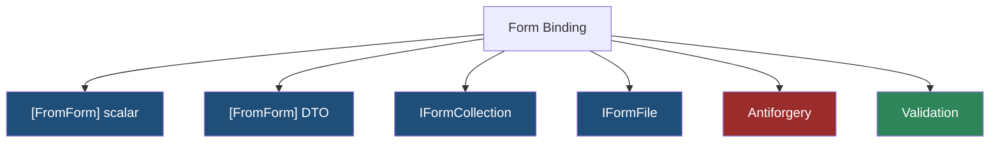
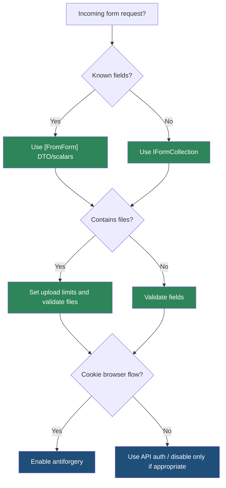

> [!success] Mastery Check
> - [ ] **Studied Well**
> - [ ] **Can explain the concept without notes**
> - [ ] **Can answer interview questions confidently**
> - [ ] **Can implement it in a real project**


# 4.091 - Form Binding in Minimal APIs (.NET 8): [FromForm] and IFormCollection

---

## PART 0 - Navigation & Context

### Where This Topic Lives

```
ASP.NET Core Mastery
└── Minimal APIs
    ├── 4.087  File Upload
    ├── 4.090  Antiforgery
    └── 4.091  YOU ARE HERE - form binding
```

### What You Need Before This

- **[[4.080 - Route Parameter Binding in Minimal APIs]]** - form values bind after endpoint selection.
- **[[4.087 - File Upload in Minimal APIs: IFormFile and Large File Streaming]]** - file parameters are form-bound.
- **[[4.090 - Antiforgery in Minimal APIs (.NET 8)]]** - unsafe browser forms need token validation.

### What This Unlocks After

- **[[4.100 - Model Binding: Sources, Order, and the Binding Algorithm]]** - MVC's broader binding system.
- **[[4.109 - Binding Source Attributes: [FromBody], [FromRoute], [FromQuery], [FromHeader]]]** - source selection across endpoint types.
- **[[4.210 - CSRF - Antiforgery: IAntiforgery and ValidateAntiforgeryToken]]** - deeper CSRF handling.

### Why This Matters at Scale

Form binding is the boundary where browser-submitted fields, files, cookies, and antiforgery all meet; treating it like JSON binding causes broken clients or CSRF exposure.

---

## PART 1 - The Core Mental Model

### The Fundamental Rule

> **Minimal API form binding reads `application/x-www-form-urlencoded` or `multipart/form-data` values after routing and before the handler; the practical consequence is that form endpoints need explicit size, antiforgery, and validation policy.**

### The Plain-Language Analogy

JSON is a sealed envelope with one structured letter. A form post is a clipboard with named fields, and multipart is a clipboard with attached packages. The clerk can copy the fields into parameters, but security still checks whether the form came from your site and whether the packages are safe.

### The Taxonomy Diagram



---

## PART 2 - Deep Mechanics

### 2.1 Form Binding Runs Inside Endpoint Binding

```
---> Routing ---> Auth ---> Antiforgery/form binding ---> Endpoint filters ---> Handler
```

```csharp
app.MapPost("/login", ([FromForm] LoginForm form) =>
    Results.Ok(new { form.Email }));

public sealed record LoginForm(string Email, string Password);
```

```http
// HTTP wire format:
POST /login HTTP/1.1
Content-Type: application/x-www-form-urlencoded

email=a@example.com&password=secret
```

ASP.NET Core internally: .NET 8 Minimal API binding can infer form data for `[FromForm]` parameters and read `Request.Form`.

**Runtime cost:** form parsing plus DTO construction; multipart adds buffering.

**Edge case:** JSON clients should use `[FromBody]` or inferred body binding, not `[FromForm]`.

### 2.2 `IFormCollection` Gives Raw Access

```csharp
app.MapPost("/webhooks/form", (IFormCollection form) =>
{
    var eventType = form["event_type"].ToString();
    return Results.Ok(new { eventType });
});
```

**Runtime cost:** parses the entire form collection.

**Edge case:** Raw form collections are useful for dynamic third-party payloads, but typed DTOs are safer for first-party forms.

### 2.3 Files and Forms Share Multipart

```csharp
app.MapPost("/profile", ([FromForm] string displayName, IFormFile avatar) =>
    Results.Ok(new { displayName, avatar.FileName }));
```

**Runtime cost:** multipart parser reads fields and file sections.

**Edge case:** `avatar.FileName` is untrusted; generate server-side storage names.

### 2.4 Antiforgery Is Part of Browser Form Safety

```
Cookie-auth browser POST
---> token valid? yes -> handler
---> token missing? reject before handler
```

**Runtime cost:** token validation is cheap compared with form/file processing.

**Edge case:** Use `.DisableAntiforgery()` only for non-browser API clients where CSRF does not apply.

---

## PART 3 - Production Code Patterns

### Pattern 1: The Cookie Login Form

```csharp
// Domain scenario: user authentication flow.
app.MapPost("/account/login", ([FromForm] LoginForm form) =>
{
    if (string.IsNullOrWhiteSpace(form.Email))
    {
        return Results.ValidationProblem(new Dictionary<string, string[]>
        {
            ["email"] = ["Email is required."]
        });
    }

    return Results.Ok();
});
```

### Pattern 2: The Dynamic Provider Form

```csharp
// Domain scenario: payment provider callback.
app.MapPost("/callbacks/payment-form", (IFormCollection form) =>
{
    var providerEventId = form["event_id"].ToString();
    return Results.Accepted(new { providerEventId });
}).DisableAntiforgery();
```

### Pattern 3: The Form Plus File Upload

```csharp
// Domain scenario: patient profile update.
app.MapPost("/patients/profile", ([FromForm] string displayName, IFormFile document) =>
    Results.Accepted(new { displayName }));
```

### Pattern 4: The Explicit Form DTO

```csharp
// Domain scenario: support ticket form.
public sealed record SupportTicketForm(string Subject, string Description);

app.MapPost("/support/tickets", ([FromForm] SupportTicketForm form) =>
    Results.Created("/support/tickets/123", form));
```

### Pattern 5: The Bearer API Exception

```csharp
// Domain scenario: mobile app avatar upload.
app.MapPost("/api/mobile/avatar", (IFormFile avatar) => Results.Accepted())
   .RequireAuthorization("MobileBearer")
   .DisableAntiforgery();
```

---

## PART 4 - Gotchas & Anti-Patterns

### Gotcha 1: Using `[FromForm]` for JSON Clients

```csharp
// WRONG CODE
app.MapPost("/api/orders", ([FromForm] CreateOrder order) => Results.Ok());

// HTTP consequence (wrong path):
// application/json clients fail to bind as expected.

// CORRECT CODE
app.MapPost("/api/orders", (CreateOrder order) => Results.Ok());

// HTTP consequence (correct path):
// JSON body binds to the DTO.

// WHY: `[FromForm]` selects form fields, not JSON body deserialization.
```

### Gotcha 2: Disabling Antiforgery on Cookie Forms

```csharp
// WRONG CODE
app.MapPost("/settings", ([FromForm] SettingsForm form) => Results.NoContent())
   .DisableAntiforgery();

// HTTP consequence (wrong path):
// Cookie-auth form is vulnerable to CSRF.

// CORRECT CODE
app.MapPost("/settings", ([FromForm] SettingsForm form) => Results.NoContent());

// HTTP consequence (correct path):
// Missing token is rejected when antiforgery is configured.

// WHY: browser cookies are ambient credentials.
```

### Gotcha 3: Trusting Raw Form Values

```csharp
// WRONG CODE
var amount = decimal.Parse(form["amount"]);

// HTTP consequence (wrong path):
// Bad input can throw and become 500.

// CORRECT CODE
if (!decimal.TryParse(form["amount"], out var amount)) return Results.BadRequest();

// HTTP consequence (correct path):
// Bad form value -> 400.

// WHY: raw form access bypasses typed binding safety.
```

### Gotcha 4: No Multipart Size Limit

```csharp
// WRONG CODE
app.MapPost("/upload", (IFormCollection form) => Results.Ok());

// HTTP consequence (wrong path):
// Large multipart bodies can consume resources.

// CORRECT CODE
app.MapPost("/upload", (IFormCollection form) => Results.Ok())
   .WithMetadata(new RequestSizeLimitAttribute(5_000_000));

// HTTP consequence (correct path):
// Oversized upload -> 413.

// WHY: size limits should run before expensive processing.
```

### Gotcha 5: Treating Form Validation as Domain Authorization

```csharp
// WRONG CODE
app.MapPost("/tenants/change", ([FromForm] Guid tenantId) => Results.NoContent());

// HTTP consequence (wrong path):
// User can submit another tenant id.

// CORRECT CODE
app.MapPost("/tenants/{tenantId:guid}/change", ([FromRoute] Guid tenantId) => Results.NoContent())
   .RequireAuthorization("TenantAdmin");

// HTTP consequence (correct path):
// Unauthorized tenant -> 403.

// WHY: form fields are untrusted input, not access control.
```

---

## PART 5 - Performance Implications

### Request Pipeline Characteristics Table

| Scenario | Pipeline Depth | Allocations Per Request | Approx Latency Impact | Recommendation |
|---|---:|---:|---:|---|
| Small urlencoded form | Binding | form collection | Low | Fine |
| Multipart form | Binding | buffers/sections | Medium | Limit size |
| `IFormCollection` raw | Binding | full collection | Medium | Use for dynamic forms |
| Typed `[FromForm]` DTO | Binding | DTO | Low | Prefer for known forms |
| Form file | Binding | file buffers | Medium-high | Validate and limit |
| Antiforgery check | Before handler | small crypto | Low | Use for cookie forms |
| Raw parsing exceptions | Failure | exception | High | Use TryParse |
| No size limits | Pipeline | unbounded | Critical | Configure limits |

### BenchmarkDotNet Code

```csharp
using BenchmarkDotNet.Attributes;

[MemoryDiagnoser]
public sealed class FormValueBenchmarks
{
    private const string Amount = "123.45";

    [Benchmark] public bool TryParseDecimal() => decimal.TryParse(Amount, out _);
    [Benchmark] public LoginForm CreateDto() => new("a@example.com", "secret");
}

public sealed record LoginForm(string Email, string Password);

// Expected output (approximate, .NET 8, x64, local):
// Value parsing is cheap; form parsing and upload buffering dominate.
```

### When This Costs You

Multipart uploads, raw form collection binding on large forms, and high-volume browser form posts.

### When This Doesn't Matter

Small first-party forms with antiforgery and explicit validation.

---

## PART 6 - Interview Arsenal

### A. The Question Bank

**Question:** "How is form binding different from JSON body binding?"

**Average Answer:** "It reads form fields."

**Why That's Insufficient:** It needs content type and security.

> **Great Answer:** "Form binding reads urlencoded or multipart form fields, often from browser posts. JSON body binding deserializes one structured request body. Form endpoints, especially cookie-auth browser forms and file uploads, need antiforgery, size limits, and validation before handler logic is trusted."

**Question:** "When would you use `IFormCollection`?"

**Average Answer:** "When I need all form data."

**Why That's Insufficient:** It misses typed DTO preference.

> **Great Answer:** "I use `IFormCollection` for dynamic third-party form posts where fields are not known at compile time. For first-party forms, I prefer typed `[FromForm]` DTOs because they make the contract visible and easier to validate."

**Question:** "Does form binding authorize a tenant or user?"

**Average Answer:** "No."

**Why That's Insufficient:** It should explain status consequence.

> **Great Answer:** "No. Form fields are client input. Authorization should come from policies and resource checks. If a user submits another tenant id, the correct result is often 403 from authorization, not a validation success because the form parsed."

### B. The Trick Questions

| Question | Trap | Correct Answer |
|---|---|---|
| Does `[FromForm]` read JSON? | Source confusion | No. |
| Is `IFormCollection` cheaper than DTOs? | Raw access myth | It parses the full form. |
| Can a bearer API disable antiforgery? | Overgeneralized CSRF | Often yes if no ambient cookies. |
| Is a form field trusted after binding? | Binding as trust | No. |

### C. Red Flags to Avoid

- "Form binding is just JSON binding with different syntax." - false.
- "DisableAntiforgery fixes form issues." - dangerous for cookie forms.
- "Raw form parse exceptions are fine." - bad 500 path.
- "Form tenant id proves access." - security bug.
- "Multipart size limits are optional." - resource exhaustion.

---

## PART 7 - Decision Framework



---

## PART 8 - Self-Check

### A. Conceptual Questions

1. What content types does form binding target?
2. Why does `[FromForm]` fail for JSON clients?
3. What happens if antiforgery rejects a form request?
4. When is `IFormCollection` appropriate?
5. Why are form values still untrusted after binding?
6. Why are multipart size limits important?
7. How do form binding and file upload relate?
8. When can `.DisableAntiforgery()` be appropriate?

### B. Code Puzzles

```csharp
app.MapPost("/api/orders", ([FromForm] CreateOrder order) => Results.Ok());
```

<details><summary>Answer</summary>
JSON clients will not bind as intended. `[FromForm]` expects form fields.
</details>

```csharp
app.MapPost("/settings", ([FromForm] SettingsForm form) => Results.NoContent())
   .DisableAntiforgery();
```

<details><summary>Answer</summary>
Dangerous for cookie-auth browser forms because it disables CSRF protection.
</details>

```csharp
var amount = decimal.Parse(form["amount"]);
```

<details><summary>Answer</summary>
Bad input can throw. Use `TryParse` and return 400.
</details>

```csharp
app.MapPost("/upload", (IFormCollection form) => Results.Ok());
```

<details><summary>Answer</summary>
Missing size limits and validation for potentially large multipart forms.
</details>

---

## PART 9 - Connections & Resources

### A. Related Topics Table

| Topic | Why It Connects |
|---|---|
| [[4.087 - File Upload in Minimal APIs: IFormFile and Large File Streaming]] | File upload is multipart form binding. |
| [[4.090 - Antiforgery in Minimal APIs (.NET 8)]] | Browser form posts need CSRF protection. |
| [[4.100 - Model Binding: Sources, Order, and the Binding Algorithm]] | MVC model binding generalizes form binding behavior. |
| [[4.109 - Binding Source Attributes: [FromBody], [FromRoute], [FromQuery], [FromHeader]]] | `[FromForm]` is one binding source attribute. |
| [[4.210 - CSRF - Antiforgery: IAntiforgery and ValidateAntiforgeryToken]] | Full antiforgery token mechanics. |

### B. Books

| Book | Chapters | Why These Chapters |
|---|---|---|
| *ASP.NET Core in Action* | Forms, Minimal APIs | Practical form binding and security. |
| *Pro ASP.NET Core* | Forms and model binding | Detailed binding examples. |

### C. Essential Articles & Docs

- [Microsoft Docs - Parameter binding in Minimal API apps](https://learn.microsoft.com/en-us/aspnet/core/fundamentals/minimal-apis/parameter-binding)
- [Microsoft Docs - Prevent Cross-Site Request Forgery attacks](https://learn.microsoft.com/en-us/aspnet/core/security/anti-request-forgery)
- [Microsoft Docs - File uploads in ASP.NET Core](https://learn.microsoft.com/en-us/aspnet/core/mvc/models/file-uploads)
- [ASP.NET Core source - RequestDelegateFactory](https://github.com/dotnet/aspnetcore/tree/main/src/Http/Http.Extensions)

### D. Template Meta-Note

> [!NOTE]
> **Part 0** orients the topic. **Part 1** gives the mental model. **Part 2** shows framework mechanics. **Part 3** gives production patterns. **Part 4** names gotchas. **Part 5** covers performance. **Part 6** prepares interviews. **Part 7** gives decisions. **Part 8** checks understanding. **Part 9** connects resources.
