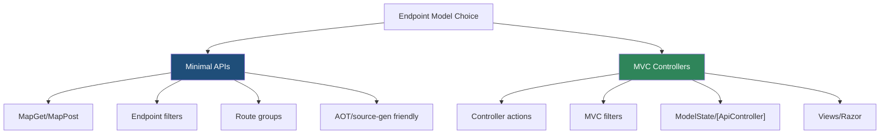
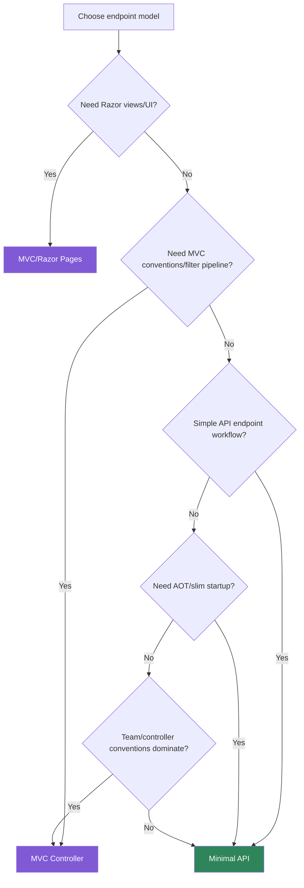

> [!success] Mastery Check
> - [ ] **Studied Well**
> - [ ] **Can explain the concept without notes**
> - [ ] **Can answer interview questions confidently**
> - [ ] **Can implement it in a real project**


# 4.092 - Minimal API vs MVC Controller: The Decision Framework

---

## PART 0 - Navigation & Context

### Where This Topic Lives

```
ASP.NET Core Mastery
├── Minimal APIs
│   └── 4.092  YOU ARE HERE - endpoint model decision
└── MVC & Controllers
    ├── 4.098  ControllerBase vs Controller
    └── 4.110  MVC Filter Pipeline
```

### What You Need Before This

- **[[4.078 - Minimal APIs: Why They Exist and When to Use Them]]** - Minimal APIs are endpoint routing plus generated delegates.
- **[[4.098 - ControllerBase vs Controller: API vs MVC Controllers]]** - controllers bring an action model and MVC services.
- **[[4.083 - Minimal API Filters: IEndpointFilter Pipeline]]** - Minimal APIs have a simpler cross-cutting model.

### What This Unlocks After

- **[[4.093 - Organizing Minimal APIs: Feature Slices and Extension Methods]]** - how to scale Minimal APIs.
- **[[4.100 - Model Binding: Sources, Order, and the Binding Algorithm]]** - MVC's richer binding model.
- **[[4.110 - MVC Filter Pipeline: Six Filter Types and Execution Order]]** - when MVC filters are worth it.

### Why This Matters at Scale

Choosing Minimal APIs or MVC is an architecture decision about pipeline shape, conventions, team workflow, testability, OpenAPI accuracy, and long-term maintainability.

---

## PART 1 - The Core Mental Model

### The Fundamental Rule

> **Minimal APIs optimize for direct endpoint delegates; MVC controllers optimize for a rich action model and conventions. The practical consequence is that you choose by workflow complexity, not by "small vs large project" slogans.**

### The Plain-Language Analogy

Minimal APIs are a focused workbench: tools are close, explicit, and fast to arrange. MVC is a full workshop with labeled stations, shared procedures, and supervisors. A workbench is not less professional, and a workshop is not automatically better. The right choice depends on whether the job needs direct handling or a coordinated process.

### The Taxonomy Diagram



---

## PART 2 - Deep Mechanics

### 2.1 Both Are Endpoint Routing

```
---> Routing
     Minimal API endpoint -> generated RequestDelegate
     MVC endpoint         -> MVC action invoker
---> Auth ---> Endpoint execution
```

```csharp
app.MapGet("/api/health", () => Results.Ok("ok"));
app.MapControllers();
```

```http
// HTTP wire format:
GET /api/health HTTP/1.1
HTTP/1.1 200 OK
```

**Runtime cost:** Minimal API avoids controller/action invoker layers for simple endpoints; MVC adds useful infrastructure.

**Edge case:** Mixing both is normal. The decision can be per feature.

### 2.2 MVC Adds an Action Model

```csharp
[ApiController]
[Route("api/orders")]
public sealed class OrdersController : ControllerBase
{
    [HttpGet("{orderId:int}")]
    public IActionResult Get(int orderId) => Ok(new { orderId });
}
```

**Runtime cost:** controller activation, model binding, filters, action result execution.

**Edge case:** MVC's `[ApiController]` automatic 400 can be valuable in teams that rely on consistent DTO validation.

### 2.3 Minimal APIs Need Explicit Structure

```csharp
var orders = app.MapGroup("/api/orders")
    .WithTags("Orders")
    .RequireAuthorization("Orders");

orders.MapGet("/{orderId:int}", (int orderId) => Results.Ok(new { orderId }));
```

**Runtime cost:** route group metadata is build-time; no controller activation.

**Edge case:** Without feature-slice organization, Minimal API `Program.cs` becomes a junk drawer.

### 2.4 Views Decide Quickly

If the feature renders Razor views, uses `ViewBag`, `TempData`, view components, or server-side UI conventions, MVC/Razor Pages are usually the better fit.

**Runtime cost:** view rendering dominates endpoint model overhead.

**Edge case:** Minimal APIs are excellent for JSON APIs but not a replacement for MVC views.

---

## PART 3 - Production Code Patterns

### Pattern 1: The Minimal Health Endpoint

```csharp
// Domain scenario: Kubernetes probe.
app.MapGet("/health/live", () => Results.Ok("live")).AllowAnonymous();
```

### Pattern 2: The Minimal Resource Group

```csharp
// Domain scenario: inventory microservice.
var inventory = app.MapGroup("/api/inventory").RequireAuthorization("Inventory");
inventory.MapGet("/{sku}", (string sku) => Results.Ok(new { sku }));
```

### Pattern 3: The MVC API Controller

```csharp
// Domain scenario: customer management API with MVC conventions.
[ApiController]
[Route("api/customers")]
public sealed class CustomersController : ControllerBase
{
    [HttpPost]
    public IActionResult Create(CreateCustomer request) => Created("/api/customers/123", request);
}
```

### Pattern 4: The MVC View Controller

```csharp
// Domain scenario: admin dashboard.
public sealed class DashboardController : Controller
{
    public IActionResult Index() => View();
}
```

### Pattern 5: The Mixed App

```csharp
builder.Services.AddControllersWithViews();
app.MapGet("/api/health", () => Results.Ok());
app.MapControllers();
app.MapDefaultControllerRoute();
```

---

## PART 4 - Gotchas & Anti-Patterns

### Gotcha 1: "Minimal APIs Are Only For Small Apps"

```csharp
// WRONG CODE
// Reject Minimal APIs only because the service is important.

// HTTP consequence (wrong path):
// More MVC infrastructure than the endpoint workflow needs.

// CORRECT CODE
// Choose based on conventions, filters, validation, views, AOT, and team workflow.

// HTTP consequence (correct path):
// Endpoint model matches operational needs.

// WHY: project size is not the decisive criterion.
```

### Gotcha 2: "MVC Is Obsolete"

```csharp
// WRONG CODE
app.MapGet("/dashboard", () => Results.Text("hand-built html"));

// HTTP consequence (wrong path):
// Reimplements view infrastructure badly.

// CORRECT CODE
app.MapControllerRoute("default", "{controller=Dashboard}/{action=Index}/{id?}");

// HTTP consequence (correct path):
// MVC handles server-side UI workflow.

// WHY: MVC remains the right abstraction for views and rich conventions.
```

### Gotcha 3: Ignoring Validation Differences

```csharp
// WRONG CODE
app.MapPost("/api/orders", (CreateOrder request) => Results.Ok(request));

// HTTP consequence (wrong path):
// No automatic MVC ModelState validation.

// CORRECT CODE
// Add endpoint validation filters or use MVC [ApiController].

// HTTP consequence (correct path):
// Invalid DTO -> 400.

// WHY: Minimal APIs and MVC have different default validation behavior.
```

### Gotcha 4: Cramming Business Logic Into Handlers

```csharp
// WRONG CODE
app.MapPost("/payments", async (PaymentRequest r) => { /* 100 lines */ });

// HTTP consequence (wrong path):
// Hard-to-test HTTP boundary.

// CORRECT CODE
app.MapPost("/payments", async (PaymentRequest r, PaymentService s) =>
    Results.Created("/", await s.CreateAsync(r)));

// HTTP consequence (correct path):
// Handler stays an adapter.

// WHY: endpoint model does not replace service/domain design.
```

### Gotcha 5: Choosing For Performance Without Measuring

```csharp
// WRONG CODE
// Rewrite controllers to Minimal APIs because "faster".

// HTTP consequence (wrong path):
// Latency unchanged if database/auth dominates.

// CORRECT CODE
// Profile first, then choose the endpoint model.

// HTTP consequence (correct path):
// Optimization targets the real bottleneck.

// WHY: endpoint overhead is often not the P99 limiter.
```

---

## PART 5 - Performance Implications

### Request Pipeline Characteristics Table

| Scenario | Pipeline Depth | Allocations Per Request | Approx Latency Impact | Recommendation |
|---|---:|---:|---:|---|
| Simple Minimal API | Low | low | Very low | Good for microservices |
| MVC API controller | Medium | controller/model/filter | Low-medium | Good for conventions |
| MVC with views | High | view rendering | Higher | Use for UI |
| Minimal with filters | Medium | filter dependent | Low-medium | Good for reusable validation |
| MVC complex filters | High | filter dependent | Medium | Use when needed |
| AOT service | Low | lower startup | Startup win | Prefer Minimal |
| DB-heavy endpoint | Any | DB dominates | High | Model choice secondary |
| Mixed app | Both | both stacks | Depends | Valid per feature |

### BenchmarkDotNet Code

```csharp
using BenchmarkDotNet.Attributes;

[MemoryDiagnoser]
public sealed class EndpointModelDecisionBenchmarks
{
    [Benchmark] public string MinimalShape() => "MapGet -> RequestDelegate";
    [Benchmark] public string MvcShape() => "Controller -> ActionInvoker";
    [Benchmark] public string DominatedByDatabase() => "SQL dominates endpoint overhead";
}

// Expected output (approximate, .NET 8, x64, local):
// This benchmark is illustrative; use real HTTP benchmarks for actual choice.
```

### When This Costs You

Cold-start-sensitive services, Native AOT, thousands of endpoints, or controller filters/conventions that run per request.

### When This Doesn't Matter

Endpoints dominated by SQL, external APIs, file I/O, or view rendering.

---

## PART 6 - Interview Arsenal

### A. The Question Bank

**Question:** "When would you choose Minimal APIs over controllers?"

**Average Answer:** "For small APIs."

**Why That's Insufficient:** It misses workflow.

> **Great Answer:** "I choose Minimal APIs when the endpoint workflow is direct: route, bind, validate, call service, return result. They reduce MVC action-model overhead and work well with route groups, endpoint filters, source generation, and AOT. I choose controllers when I need MVC conventions, rich filters, automatic ModelState behavior, or views."

**Question:** "Can you mix both?"

**Average Answer:** "Yes."

**Why That's Insufficient:** It should mention endpoint routing.

> **Great Answer:** "Yes, both are endpoint routing endpoints. I often use Minimal APIs for health checks or service endpoints and MVC for controller-heavy API areas or server-rendered UI. Middleware like auth and exception handling still wraps both based on pipeline order."

**Question:** "Are Minimal APIs faster?"

**Average Answer:** "Yes."

**Why That's Insufficient:** It is too broad.

> **Great Answer:** "They generally have less framework overhead for simple endpoints, but real performance depends on binding, auth, serialization, database, and network calls. I treat performance as a reason to consider them, not a reason to rewrite without profiling."

### B. The Trick Questions

| Question | Trap | Correct Answer |
|---|---|---|
| Are Minimal APIs only demos? | Slogan | No. |
| Is MVC obsolete? | Overcorrection | No. |
| Do Minimal APIs get `[ApiController]` automatic 400? | MVC assumption | No. |
| Does endpoint model change middleware? | Pipeline confusion | No, both use middleware pipeline. |

### C. Red Flags to Avoid

- "Minimal is for small apps only." - shallow.
- "MVC is dead." - false.
- "Performance always decides." - measure.
- "Validation is identical." - false defaults.
- "Controllers cannot coexist with Minimal APIs." - false.

---

## PART 7 - Decision Framework



---

## PART 8 - Self-Check

### A. Conceptual Questions

1. What do Minimal APIs and MVC controllers share in the pipeline?
2. When is MVC better than Minimal APIs?
3. Why is project size not the real decision factor?
4. What validation difference matters most?
5. Why can both models coexist?
6. When does AOT influence the choice?
7. Why should handlers/controllers stay thin?
8. What should you measure before rewriting endpoint models?

### B. Code Puzzles

```csharp
app.MapGet("/api/health", () => Results.Ok());
app.MapControllers();
```

<details><summary>Answer</summary>
Both endpoint models can coexist. Routing selects whichever endpoint matches.
</details>

```csharp
app.MapPost("/api/orders", (CreateOrder r) => Results.Ok(r));
```

<details><summary>Answer</summary>
Minimal API does not automatically run MVC `[ApiController]` validation. Add filters/manual validation.
</details>

```csharp
public sealed class DashboardController : Controller
{
    public IActionResult Index() => View();
}
```

<details><summary>Answer</summary>
MVC is the right fit for server-rendered views because `Controller` provides view infrastructure.
</details>

```csharp
app.MapPost("/payments", async (PaymentRequest r) => { /* lots of domain workflow */ });
```

<details><summary>Answer</summary>
The handler is too fat. Move workflow into services/domain code and keep HTTP mapping thin.
</details>

---

## PART 9 - Connections & Resources

### A. Related Topics Table

| Topic | Why It Connects |
|---|---|
| [[4.078 - Minimal APIs: Why They Exist and When to Use Them]] | Explains Minimal API motivation. |
| [[4.098 - ControllerBase vs Controller: API vs MVC Controllers]] | Explains controller base type choices. |
| [[4.083 - Minimal API Filters: IEndpointFilter Pipeline]] | Minimal APIs use endpoint filters instead of MVC filters. |
| [[4.110 - MVC Filter Pipeline: Six Filter Types and Execution Order]] | MVC filters are a major reason to choose controllers. |
| [[4.094 - Minimal API Source Generators: RequestDelegateGenerator]] | Source generation and AOT affect the decision. |

### B. Books

| Book | Chapters | Why These Chapters |
|---|---|---|
| *ASP.NET Core in Action* | Minimal APIs and MVC | Best practical comparison. |
| *Pro ASP.NET Core* | Controllers and Minimal APIs | Broad examples across both models. |

### C. Essential Articles & Docs

- [Microsoft Docs - Minimal APIs overview](https://learn.microsoft.com/en-us/aspnet/core/fundamentals/minimal-apis/overview)
- [Microsoft Docs - Controllers in ASP.NET Core](https://learn.microsoft.com/en-us/aspnet/core/mvc/controllers/actions)
- [Microsoft Docs - Routing in ASP.NET Core](https://learn.microsoft.com/en-us/aspnet/core/fundamentals/routing)
- [Microsoft Docs - Native AOT with ASP.NET Core](https://learn.microsoft.com/en-us/aspnet/core/fundamentals/native-aot)

### D. Template Meta-Note

> [!NOTE]
> **Part 0** orients the topic. **Part 1** gives the mental model. **Part 2** shows framework mechanics. **Part 3** gives production patterns. **Part 4** names gotchas. **Part 5** covers performance. **Part 6** prepares interviews. **Part 7** gives decisions. **Part 8** checks understanding. **Part 9** connects resources.
