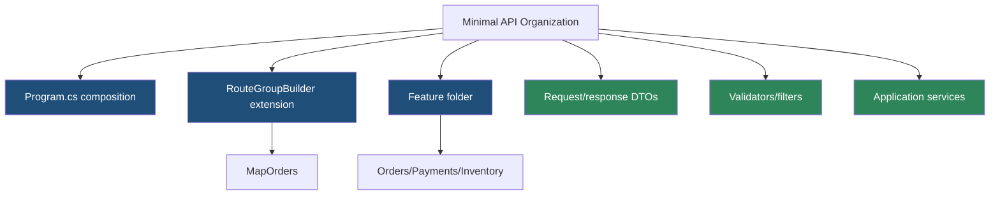
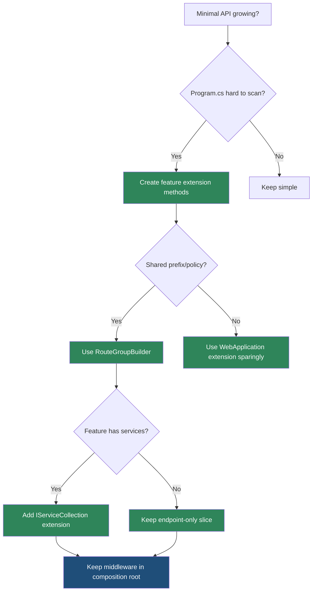

> [!success] Mastery Check
> - [ ] **Studied Well**
> - [ ] **Can explain the concept without notes**
> - [ ] **Can answer interview questions confidently**
> - [ ] **Can implement it in a real project**


# 4.093 - Organizing Minimal APIs: Feature Slices and Extension Methods

---

## PART 0 - Navigation & Context

### Where This Topic Lives

```
ASP.NET Core Mastery
└── Minimal APIs
    ├── 4.084  Route Groups
    ├── 4.092  Minimal API vs MVC
    └── 4.093  YOU ARE HERE - organization
```

### What You Need Before This

- **[[4.084 - Route Groups in Minimal APIs: Shared Prefix and Authorization]]** - feature slices usually expose a route group.
- **[[4.079 - Defining Endpoints: MapGet, MapPost, MapPut, MapDelete]]** - slices register endpoints.
- **[[4.041 - IServiceCollection Extension Methods: Builder Pattern for Libraries]]** - service and endpoint extension methods follow the same design style.

### What This Unlocks After

- **[[4.094 - Minimal API Source Generators: RequestDelegateGenerator]]** - organization can help source-gen-friendly signatures.
- **[[4.095 - IEndpointMetadataProvider: Pushing Metadata from Parameter Types]]** - parameter types can add metadata in feature slices.
- **[[4.096 - Custom IResult: IResult and INestedHttpResult for Reusable Responses]]** - reusable responses keep slices clean.

### Why This Matters at Scale

Minimal APIs fail when `Program.cs` becomes the whole application; feature slices keep routing, request DTOs, handlers, validation, and tests close without losing endpoint routing's simplicity.

---

## PART 1 - The Core Mental Model

### The Fundamental Rule

> **A feature slice groups endpoint registration and feature-specific types around a business capability; the practical consequence is that `Program.cs` stays composition-only while each slice owns its HTTP contract.**

### The Plain-Language Analogy

`Program.cs` should be the building directory, not every room's furniture plan. A feature slice is one department's floor plan: orders, payments, inventory, support. The directory points visitors to the department, and the department owns its desks, forms, rules, and signs.

### The Taxonomy Diagram



---

## PART 2 - Deep Mechanics

### 2.1 `Program.cs` Composes Slices

```csharp
var api = app.MapGroup("/api")
    .RequireAuthorization();

api.MapOrders();
api.MapInventory();
```

**Runtime cost:** none beyond normal endpoint registration; extension methods run at startup.

**Edge case:** Do not hide global middleware in feature endpoint extensions. Middleware belongs in pipeline composition.

### 2.2 Slice Extensions Return the Builder

```csharp
public static class OrdersEndpoints
{
    public static RouteGroupBuilder MapOrders(this RouteGroupBuilder api)
    {
        var orders = api.MapGroup("/orders").WithTags("Orders");

        orders.MapGet("/{orderId:int}", GetOrder)
            .WithName("Orders.GetById");

        return orders;
    }

    private static IResult GetOrder(int orderId) =>
        Results.Ok(new OrderDto(orderId));
}

public sealed record OrderDto(int Id);
```

**Runtime cost:** endpoint delegates are built normally.

**Edge case:** Returning `RouteGroupBuilder` lets callers add policy, but do not make callers patch missing required security.

### 2.3 Feature-Local DTOs Keep Contracts Close

```csharp
public sealed record CreateOrderRequest(string Sku, int Quantity);
public sealed record CreateOrderResponse(int OrderId);
```

**Runtime cost:** no special cost.

**Edge case:** Reusing EF entities as request DTOs leaks persistence shape into HTTP contracts.

### 2.4 Tests Target Slices

Feature slices are easy to integration-test by URL and unit-test by service.

**Runtime cost:** none in production.

**Edge case:** If a slice cannot be tested without booting unrelated features, the organization is still too coupled.

---

## PART 3 - Production Code Patterns

### Pattern 1: The Composition Root

```csharp
// Domain scenario: commerce API.
var api = app.MapGroup("/api").RequireAuthorization();
api.MapOrders();
api.MapPayments();
api.MapInventory();
```

### Pattern 2: The Feature Extension

```csharp
public static class PaymentsEndpoints
{
    public static RouteGroupBuilder MapPayments(this RouteGroupBuilder api)
    {
        var payments = api.MapGroup("/payments").WithTags("Payments");
        payments.MapPost("/", CreatePayment).WithName("Payments.Create");
        return payments;
    }

    private static IResult CreatePayment(CreatePaymentRequest request) =>
        Results.Accepted();
}

public sealed record CreatePaymentRequest(decimal Amount);
```

### Pattern 3: The Slice Service Registration

```csharp
public static class OrdersServices
{
    public static IServiceCollection AddOrdersFeature(this IServiceCollection services)
    {
        services.AddScoped<OrderService>();
        return services;
    }
}
```

### Pattern 4: The Slice-Level Validation Filter

```csharp
public static RouteGroupBuilder MapInventory(this RouteGroupBuilder api)
{
    var inventory = api.MapGroup("/inventory")
        .WithTags("Inventory")
        .AddEndpointFilter<InventoryValidationFilter>();

    inventory.MapPost("/", (CreateItem request) => Results.Created("/", request));
    return inventory;
}
```

### Pattern 5: The Public and Private Slice Split

```csharp
app.MapGroup("/public").MapPublicCatalog();
app.MapGroup("/api").RequireAuthorization().MapInternalCatalog();
```

---

## PART 4 - Gotchas & Anti-Patterns

### Gotcha 1: Giant `Program.cs`

```csharp
// WRONG CODE
// Hundreds of app.MapGet/MapPost calls in Program.cs.

// HTTP consequence (wrong path):
// Easy to miss auth, tags, validation, and route names.

// CORRECT CODE
app.MapGroup("/api").MapOrders().MapInventory();

// HTTP consequence (correct path):
// Feature contracts are organized and auditable.

// WHY: composition root should compose, not contain every feature detail.
```

### Gotcha 2: Hiding Middleware in Slice Extensions

```csharp
// WRONG CODE
public static void MapOrders(this WebApplication app)
{
    app.UseAuthentication();
    app.MapGet("/orders", () => Results.Ok());
}

// HTTP consequence (wrong path):
// Pipeline order becomes feature-dependent and fragile.

// CORRECT CODE
app.UseAuthentication();
app.UseAuthorization();
app.MapGroup("/api").MapOrders();

// HTTP consequence (correct path):
// Middleware order remains globally visible.

// WHY: endpoint registration and middleware registration are different layers.
```

### Gotcha 3: Generic Names Across Slices

```csharp
// WRONG CODE
public sealed record Request(string Name);

// HTTP consequence (wrong path):
// Contracts are unclear and collide mentally.

// CORRECT CODE
public sealed record CreateOrderRequest(string Sku, int Quantity);

// HTTP consequence (correct path):
// Request type names expose business intent.

// WHY: feature slices should improve readability, not hide meaning.
```

### Gotcha 4: Sharing DTOs Across Unrelated Features

```csharp
// WRONG CODE
public sealed record CustomerDto(string Name, string InternalRiskFlag);

// HTTP consequence (wrong path):
// One endpoint leaks fields needed by another feature.

// CORRECT CODE
public sealed record PublicCustomerDto(string Name);

// HTTP consequence (correct path):
// HTTP shape matches endpoint contract.

// WHY: DTOs are API contracts, not global data bags.
```

### Gotcha 5: Returning `void` From Map Extensions

```csharp
// WRONG CODE
public static void MapOrders(this RouteGroupBuilder api) { }

// HTTP consequence (wrong path):
// Callers cannot add conventions fluently.

// CORRECT CODE
public static RouteGroupBuilder MapOrders(this RouteGroupBuilder api) => api;

// HTTP consequence (correct path):
// Registration stays composable.

// WHY: builder-returning APIs match ASP.NET Core conventions.
```

---

## PART 5 - Performance Implications

### Request Pipeline Characteristics Table

| Scenario | Pipeline Depth | Allocations Per Request | Approx Latency Impact | Recommendation |
|---|---:|---:|---:|---|
| Extension method registration | Startup | none per request | None | Use freely |
| Feature route group | Routing | none extra | None | Use for organization |
| Local DTOs | Serialization | normal | Low | Prefer clarity |
| Slice filters | Endpoint | filter dependent | Medium | Keep cheap |
| Hidden middleware | Pipeline | order risk | Critical | Avoid |
| Too many assemblies | Startup | scan cost | Medium | Keep explicit |
| Service registration extensions | Startup | descriptors | Low | Good pattern |
| Fat handlers | Handler | app dependent | High | Move to services |

### BenchmarkDotNet Code

```csharp
using BenchmarkDotNet.Attributes;

[MemoryDiagnoser]
public sealed class FeatureSliceShapeBenchmarks
{
    [Benchmark] public string CompositionRoot() => "api.MapOrders().MapInventory()";
    [Benchmark] public string GiantProgram() => "hundreds of inline endpoints";
}

// Expected output (approximate, .NET 8, x64, local):
// Organization does not matter per request; it matters for correctness and maintenance.
```

### When This Costs You

Hidden middleware, reflection-heavy auto-discovery, and slice filters that perform expensive work on every request.

### When This Doesn't Matter

Plain extension methods and route groups; they are startup organization tools.

---

## PART 6 - Interview Arsenal

### A. The Question Bank

**Question:** "How do you keep Minimal APIs organized in a large service?"

**Average Answer:** "Use route groups."

**Why That's Insufficient:** It needs feature ownership.

> **Great Answer:** "I keep `Program.cs` as the composition root and move endpoint registration into feature-slice extension methods, usually on `RouteGroupBuilder`. Each slice owns its routes, DTOs, validators, filters, and service calls. Shared middleware stays in the main pipeline so order remains obvious."

**Question:** "Should endpoint extension methods register middleware?"

**Average Answer:** "Maybe if the feature needs it."

**Why That's Insufficient:** It confuses endpoint registration with pipeline construction.

> **Great Answer:** "Generally no. Middleware order is global and should be visible in the composition root. Feature extensions should register endpoints and endpoint-level metadata/filters, not secretly alter the pipeline."

**Question:** "How do slices affect testing?"

**Average Answer:** "They make tests easier."

**Why That's Insufficient:** It should explain seams.

> **Great Answer:** "Feature slices let me integration-test the feature's routes and unit-test the service/handler logic without navigating a giant `Program.cs`. If a slice requires unrelated features to boot, I know the design is still too coupled."

### B. The Trick Questions

| Question | Trap | Correct Answer |
|---|---|---|
| Is Program.cs a good place for all endpoints? | Small app habit | Not at scale. |
| Should slices hide middleware? | Encapsulation overreach | No. |
| Are shared DTOs always good? | DRY misuse | No, contracts can diverge. |
| Should map extensions return builders? | Fluent convention | Usually yes. |

### C. Red Flags to Avoid

- "Just keep everything in Program.cs." - scale problem.
- "Hide UseAuthorization in a feature." - pipeline bug.
- "Reuse one DTO everywhere." - contract leak.
- "Minimal APIs cannot be organized." - false.
- "Feature slices replace domain services." - false.

---

## PART 7 - Decision Framework



---

## PART 8 - Self-Check

### A. Conceptual Questions

1. What should stay in `Program.cs`?
2. Why should feature endpoint extensions avoid middleware?
3. Why return `RouteGroupBuilder` from map extensions?
4. How do feature-local DTOs help contracts?
5. When is auto-discovery risky?
6. How do route groups support feature slices?
7. Why is DTO reuse sometimes harmful?
8. What is the runtime cost of organization via extension methods?

### B. Code Puzzles

```csharp
public static void MapOrders(this WebApplication app)
{
    app.UseAuthorization();
    app.MapGet("/orders", () => Results.Ok());
}
```

<details><summary>Answer</summary>
This hides middleware order inside a feature. Keep middleware in `Program.cs` and endpoint registration in feature methods.
</details>

```csharp
app.MapGet("/orders", ...);
app.MapGet("/payments", ...);
// 300 more lines
```

<details><summary>Answer</summary>
This is a giant composition root. Move endpoints into feature-slice extension methods.
</details>

```csharp
public sealed record Response(object Data);
```

<details><summary>Answer</summary>
Generic response contracts hide feature meaning. Prefer named request/response DTOs.
</details>

```csharp
public static RouteGroupBuilder MapOrders(this RouteGroupBuilder group)
{
    group.MapGet("/", () => Results.Ok());
    return group;
}
```

<details><summary>Answer</summary>
Good shape: endpoint registration stays composable and local to the feature.
</details>

---

## PART 9 - Connections & Resources

### A. Related Topics Table

| Topic | Why It Connects |
|---|---|
| [[4.084 - Route Groups in Minimal APIs: Shared Prefix and Authorization]] | Feature slices usually build on route groups. |
| [[4.092 - Minimal API vs MVC Controller: The Decision Framework]] | Organization helps decide if Minimal APIs remain a good fit. |
| [[4.041 - IServiceCollection Extension Methods: Builder Pattern for Libraries]] | Service registration uses the same extension pattern. |
| [[4.083 - Minimal API Filters: IEndpointFilter Pipeline]] | Slice-level filters attach cross-cutting behavior. |
| [[2.060 - Extension Methods in C#]] | Extension methods enable fluent endpoint registration. |

### B. Books

| Book | Chapters | Why These Chapters |
|---|---|---|
| *ASP.NET Core in Action* | Organizing Minimal APIs | Practical route group and extension patterns. |
| *Clean Architecture* | Use cases and boundaries | Helps avoid endpoint-first domain design. |

### C. Essential Articles & Docs

- [Microsoft Docs - Minimal API route handlers](https://learn.microsoft.com/en-us/aspnet/core/fundamentals/minimal-apis/route-handlers)
- [Microsoft Docs - Filters in Minimal API apps](https://learn.microsoft.com/en-us/aspnet/core/fundamentals/minimal-apis/min-api-filters)
- [Microsoft Docs - Dependency injection in ASP.NET Core](https://learn.microsoft.com/en-us/aspnet/core/fundamentals/dependency-injection)
- [ASP.NET Core source - Routing](https://github.com/dotnet/aspnetcore/tree/main/src/Http/Routing)

### D. Template Meta-Note

> [!NOTE]
> **Part 0** orients the topic. **Part 1** gives the mental model. **Part 2** shows framework mechanics. **Part 3** gives production patterns. **Part 4** names gotchas. **Part 5** covers performance. **Part 6** prepares interviews. **Part 7** gives decisions. **Part 8** checks understanding. **Part 9** connects resources.
