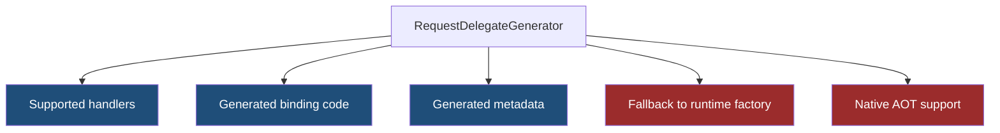
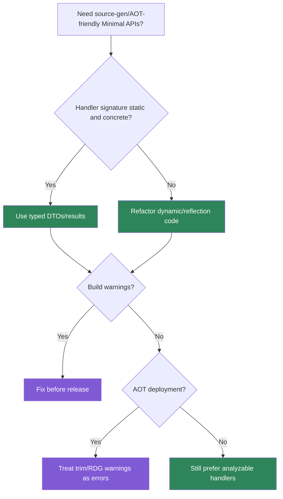

> [!success] Mastery Check
> - [ ] **Studied Well**
> - [ ] **Can explain the concept without notes**
> - [ ] **Can answer interview questions confidently**
> - [ ] **Can implement it in a real project**


# 4.094 - Minimal API Source Generators: RequestDelegateGenerator

---

## PART 0 - Navigation & Context

### Where This Topic Lives

```
ASP.NET Core Mastery
└── Minimal APIs
    ├── 4.094  YOU ARE HERE - source-generated handlers
    ├── 4.097  AOT compatibility
    └── 4.341  RequestDelegateFactory internals
```

### What You Need Before This

- **[[4.079 - Defining Endpoints: MapGet, MapPost, MapPut, MapDelete]]** - generators target Minimal API route handlers.
- **[[4.080 - Route Parameter Binding in Minimal APIs]]** - generated delegates perform binding.
- **[[2.090 - C# Source Generators]]** - source generators produce compile-time code.

### What This Unlocks After

- **[[4.097 - Minimal API AOT Compatibility: Trim-Safe and Source-Gen Patterns]]** - source generation supports AOT.
- **[[4.340 - Request Delegate Compilation: How MapGet Becomes a RequestDelegate]]** - runtime delegate creation details.
- **[[4.339 - Native AOT (.NET 8): ASP.NET Core Requirements, Limitations, and Trims]]** - broader AOT constraints.

### Why This Matters at Scale

Source-generated request delegates reduce runtime reflection and improve trim/AOT friendliness, but only when handler signatures stay within supported patterns.

---

## PART 1 - The Core Mental Model

### The Fundamental Rule

> **RequestDelegateGenerator tries to turn Minimal API handler binding into compile-time generated code; the practical consequence is faster startup and better AOT safety when your endpoints use supported binding patterns.**

### The Plain-Language Analogy

Runtime delegate generation is a chef reading the recipe when the restaurant opens. Source generation is printing the prep sheet before the chef arrives. Service is faster and less dependent on reflection, but only if the recipe uses ingredients the printer understands.

### The Taxonomy Diagram



---

## PART 2 - Deep Mechanics

### 2.1 The Generator Runs at Build Time

```
Build:
MapGet(...) syntax
---> source generator analyzes handler signature
---> emits RequestDelegate code

Request:
Routing ---> generated delegate ---> handler
```

```csharp
app.MapGet("/api/orders/{orderId:int}", (int orderId) =>
    TypedResults.Ok(new { orderId }));
```

**Runtime cost:** less startup/runtime reflection when generated path is used.

**Edge case:** Unsupported signatures can fall back to runtime `RequestDelegateFactory`, reducing AOT benefits.

### 2.2 Generated Code Performs Binding

The generated delegate reads route/query/body/services just like the runtime factory would, but code is available at compile time.

**Runtime cost:** binding still costs route/query lookups, parsing, body deserialization, and service resolution.

**Edge case:** Source generation does not make body deserialization free.

### 2.3 Diagnostics Matter

Compiler diagnostics can tell you when a handler cannot be source generated.

**Runtime cost:** diagnostics are build-time only.

**Edge case:** Treat generator warnings as production-readiness signals in AOT services.

### 2.4 Metadata Is Also Generated

OpenAPI and endpoint metadata can be emitted by supported result/parameter types.

**Runtime cost:** metadata generation is build/startup work.

**Edge case:** Custom metadata providers must be trim-safe if used in AOT.

---

## PART 3 - Production Code Patterns

### Pattern 1: The Simple Supported Handler

```csharp
// Domain scenario: order lookup.
app.MapGet("/api/orders/{orderId:int}",
    (int orderId, OrderService service) =>
        TypedResults.Ok(service.Get(orderId)));
```

### Pattern 2: The Static Handler Method

```csharp
// Domain scenario: inventory API.
app.MapGet("/api/items/{sku}", InventoryHandlers.GetBySku);

static class InventoryHandlers
{
    public static Ok<object> GetBySku(string sku) =>
        TypedResults.Ok<object>(new { sku });
}
```

### Pattern 3: The Typed Result Contract

```csharp
app.MapGet("/api/payments/{id:guid}",
    Results<Ok<PaymentDto>, NotFound> (Guid id) =>
        id == Guid.Empty ? TypedResults.NotFound() : TypedResults.Ok(new PaymentDto(id)));

public sealed record PaymentDto(Guid Id);
```

### Pattern 4: The Avoid-Dynamic Rule

```csharp
// Domain scenario: report API.
// Prefer explicit DTOs over object/dynamic for generation and OpenAPI.
public sealed record ReportDto(int Id, string Name);
```

### Pattern 5: The Build Warning Gate

```xml
<PropertyGroup>
  <WarningsAsErrors>$(WarningsAsErrors);RDG*</WarningsAsErrors>
</PropertyGroup>
```

---

## PART 4 - Gotchas & Anti-Patterns

### Gotcha 1: Assuming Every Handler Is Generated

```csharp
// WRONG CODE
app.MapGet("/api/data", (dynamic value) => Results.Ok(value));

// HTTP consequence (wrong path):
// Endpoint may fall back to runtime generation or lose metadata.

// CORRECT CODE
app.MapGet("/api/data", () => TypedResults.Ok(new DataDto("ok")));

// HTTP consequence (correct path):
// Static handler shape is generator-friendly.

// WHY: source generators need analyzable compile-time signatures.
```

### Gotcha 2: Ignoring Generator Warnings

```csharp
// WRONG CODE
// Build warnings ignored in AOT service.

// HTTP consequence (wrong path):
// Runtime failures or missing bindings after trimming.

// CORRECT CODE
// Treat generator/trim warnings as release blockers.

// HTTP consequence (correct path):
// Unsupported endpoints are fixed before deployment.

// WHY: warnings identify code the generator/trimmer cannot prove safe.
```

### Gotcha 3: Thinking Source Generation Speeds SQL

```csharp
// WRONG CODE
// Rewrite handler signatures while P99 is caused by database calls.

// HTTP consequence (wrong path):
// Latency remains high.

// CORRECT CODE
// Profile startup, allocations, and request I/O separately.

// HTTP consequence (correct path):
// Optimization targets actual bottleneck.

// WHY: generated delegates optimize framework glue, not downstream work.
```

### Gotcha 4: Unclear Result Types

```csharp
// WRONG CODE
app.MapGet("/api/orders/{id:int}", (int id) => id == 1 ? Results.Ok() : Results.NotFound());

// HTTP consequence (wrong path):
// Metadata can be less precise.

// CORRECT CODE
app.MapGet("/api/orders/{id:int}",
    Results<Ok, NotFound> (int id) => id == 1 ? TypedResults.Ok() : TypedResults.NotFound());

// HTTP consequence (correct path):
// Same wire behavior, clearer metadata.

// WHY: concrete result types are easier to analyze.
```

### Gotcha 5: Reflection-Heavy Custom Binders

```csharp
// WRONG CODE
// Custom BindAsync uses reflection over arbitrary types.

// HTTP consequence (wrong path):
// Trim/AOT risks and runtime overhead.

// CORRECT CODE
// Use explicit TryParse/BindAsync with known members.

// HTTP consequence (correct path):
// Binding remains analyzable.

// WHY: AOT and source generation reward static shapes.
```

---

## PART 5 - Performance Implications

### Request Pipeline Characteristics Table

| Scenario | Pipeline Depth | Allocations Per Request | Approx Latency Impact | Recommendation |
|---|---:|---:|---:|---|
| Generated simple handler | Endpoint | low | Low | Preferred |
| Runtime factory fallback | Startup/runtime | more reflection | Startup cost | Fix warnings |
| Typed results | Endpoint/docs | low | Low | Prefer |
| Dynamic/object handler | Endpoint/docs | unclear | Medium | Avoid |
| Body JSON | Endpoint | serialization | Medium | Source-gen JSON separately |
| DI service resolution | Endpoint | scoped lookup | Low | Normal |
| DB call | Handler | high | High | Profile separately |
| AOT service | Startup | trim-sensitive | Critical | Use supported patterns |

### BenchmarkDotNet Code

```csharp
using BenchmarkDotNet.Attributes;

[MemoryDiagnoser]
public sealed class HandlerShapeBenchmarks
{
    [Benchmark] public int StaticShape() => 42;
    [Benchmark] public object ObjectShape() => new { Id = 42 };
    [Benchmark] public string DynamicLike() => "avoid dynamic in handlers";
}

// Expected output (approximate, .NET 8, x64, local):
// This illustrates shape; real RDG benefits show in startup/AOT diagnostics.
```

### When This Costs You

Cold starts, serverless/container startup, Native AOT, and services with many Minimal API endpoints.

### When This Doesn't Matter

Database-heavy endpoints where runtime delegate generation is not the bottleneck and AOT is not a goal.

---

## PART 6 - Interview Arsenal

### A. The Question Bank

**Question:** "What is RequestDelegateGenerator?"

**Average Answer:** "A source generator for Minimal APIs."

**Why That's Insufficient:** It needs pipeline purpose.

> **Great Answer:** "It analyzes Minimal API route handlers at build time and emits request delegate code for binding, metadata, and response execution when possible. That reduces runtime reflection/startup work and improves Native AOT compatibility, but only for supported static handler shapes."

**Question:** "Does source generation change HTTP behavior?"

**Average Answer:** "It makes it faster."

**Why That's Insufficient:** Wire behavior should be the same.

> **Great Answer:** "The intended HTTP behavior is the same: same route, same binding, same status codes. The difference is how the framework glue is produced. I still test the wire behavior because unsupported signatures can fall back or behave differently under trimming."

**Question:** "How do you design generator-friendly handlers?"

**Average Answer:** "Keep them simple."

**Why That's Insufficient:** It should be concrete.

> **Great Answer:** "I use explicit static handler methods or simple lambdas, concrete request/response DTOs, typed results, supported binding sources, and avoid dynamic/reflection-heavy binders. I treat RDG and trim warnings as build failures in AOT-targeted services."

### B. The Trick Questions

| Question | Trap | Correct Answer |
|---|---|---|
| Does RDG remove JSON serialization cost? | Overclaim | No. |
| Does every handler get generated? | Assumption | No, unsupported patterns can fall back. |
| Is wire behavior different? | Implementation confusion | It should be equivalent. |
| Are warnings optional in AOT? | Risk blindness | Treat them seriously. |

### C. Red Flags to Avoid

- "Source generation makes everything fast." - overclaim.
- "Warnings can be ignored." - AOT risk.
- "Dynamic handlers are fine for AOT." - risky.
- "RDG replaces tests." - false.
- "It changes HTTP semantics." - wrong goal.

---

## PART 7 - Decision Framework



---

## PART 8 - Self-Check

### A. Conceptual Questions

1. When does RequestDelegateGenerator run?
2. What part of the pipeline does generated code replace?
3. Why do typed results help generation and metadata?
4. What happens if a handler uses unsupported patterns?
5. Why are RDG warnings important for AOT?
6. Does RDG change response status codes?
7. Why should dynamic handlers be avoided?
8. What costs remain after source generation?

### B. Code Puzzles

```csharp
app.MapGet("/data", (dynamic x) => Results.Ok(x));
```

<details><summary>Answer</summary>
Dynamic handler shape is not generator-friendly and can lose metadata/AOT safety.
</details>

```csharp
app.MapGet("/orders/{id:int}", Results<Ok, NotFound> (int id) =>
    id == 1 ? TypedResults.Ok() : TypedResults.NotFound());
```

<details><summary>Answer</summary>
This is a generator-friendly, metadata-friendly shape.
</details>

```xml
<WarningsAsErrors>RDG*</WarningsAsErrors>
```

<details><summary>Answer</summary>
Good for AOT services; generator diagnostics become build blockers.
</details>

```csharp
await db.Orders.ToListAsync();
```

<details><summary>Answer</summary>
RDG does not optimize database I/O. Profile downstream work separately.
</details>

---

## PART 9 - Connections & Resources

### A. Related Topics Table

| Topic | Why It Connects |
|---|---|
| [[4.340 - Request Delegate Compilation: How MapGet Becomes a RequestDelegate]] | Runtime delegate creation is what RDG optimizes. |
| [[4.341 - Minimal API Source Generation: RequestDelegateFactory Internals]] | Deep internals of generated delegates. |
| [[4.097 - Minimal API AOT Compatibility: Trim-Safe and Source-Gen Patterns]] | AOT benefits depend on source generation. |
| [[4.082 - IResult and TypedResults]] | Typed results improve analyzable metadata. |
| [[2.090 - C# Source Generators]] | Language-level generator mechanics. |

### B. Books

| Book | Chapters | Why These Chapters |
|---|---|---|
| *ASP.NET Core in Action* | Minimal APIs and AOT | Practical context for generated delegates. |
| *C# in Depth* | Source generation and modern C# | Helps understand compile-time generation. |

### C. Essential Articles & Docs

- [Microsoft Docs - Native AOT support in ASP.NET Core](https://learn.microsoft.com/en-us/aspnet/core/fundamentals/native-aot)
- [Microsoft Docs - Minimal APIs overview](https://learn.microsoft.com/en-us/aspnet/core/fundamentals/minimal-apis/overview)
- [ASP.NET Core source - RequestDelegateGenerator](https://github.com/dotnet/aspnetcore/tree/main/src/Http/Http.Extensions/gen)
- [ASP.NET Core source - RequestDelegateFactory](https://github.com/dotnet/aspnetcore/tree/main/src/Http/Http.Extensions)

### D. Template Meta-Note

> [!NOTE]
> **Part 0** orients the topic. **Part 1** gives the mental model. **Part 2** shows framework mechanics. **Part 3** gives production patterns. **Part 4** names gotchas. **Part 5** covers performance. **Part 6** prepares interviews. **Part 7** gives decisions. **Part 8** checks understanding. **Part 9** connects resources.
