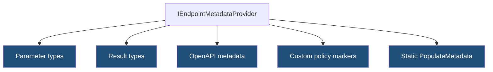
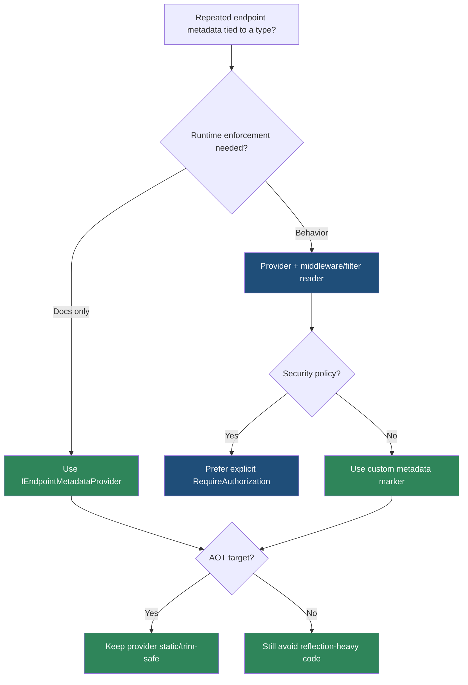

> [!success] Mastery Check
> - [ ] **Studied Well**
> - [ ] **Can explain the concept without notes**
> - [ ] **Can answer interview questions confidently**
> - [ ] **Can implement it in a real project**


# 4.095 - IEndpointMetadataProvider: Pushing Metadata from Parameter Types

---

## PART 0 - Navigation & Context

### Where This Topic Lives

```
ASP.NET Core Mastery
└── Minimal APIs
    ├── 4.074  Endpoint Metadata
    ├── 4.080  Parameter Binding
    └── 4.095  YOU ARE HERE - parameter-provided metadata
```

### What You Need Before This

- **[[4.074 - Endpoint Metadata: Decorating Endpoints with Custom Attributes]]** - endpoint metadata is the mechanism being added.
- **[[4.080 - Route Parameter Binding in Minimal APIs]]** - parameter types can affect binding and metadata.
- **[[4.085 - OpenAPI Integration: WithOpenApi(), Tags, and Summaries]]** - OpenAPI consumes endpoint metadata.

### What This Unlocks After

- **[[4.096 - Custom IResult: IResult and INestedHttpResult for Reusable Responses]]** - result types can also provide metadata.
- **[[4.097 - Minimal API AOT Compatibility: Trim-Safe and Source-Gen Patterns]]** - metadata providers should be trim-safe.
- **[[4.350 - IEndpointMetadataProvider: Pushing Metadata from Parameter Binding]]** - deeper internals.

### Why This Matters at Scale

Metadata providers let reusable parameter and result types carry their HTTP contract with them, reducing duplicated `.Accepts`, `.Produces`, and custom metadata calls across many endpoints.

---

## PART 1 - The Core Mental Model

### The Fundamental Rule

> **`IEndpointMetadataProvider` lets a type add endpoint metadata at startup; the practical consequence is that a parameter or result type can document or influence endpoint behavior without every route repeating metadata calls.**

### The Plain-Language Analogy

Instead of each endpoint manually writing labels on a package, the package type arrives with its own label template. Every endpoint accepting that package gets the same declared size, content type, or policy note. It is still only a label unless middleware or tooling reads it.

### The Taxonomy Diagram



---

## PART 2 - Deep Mechanics

### 2.1 Metadata Is Populated During Endpoint Creation

```
Startup:
MapPost(..., (UploadImageRequest request) => ...)
---> RequestDelegateFactory inspects parameter type
---> PopulateMetadata adds endpoint metadata
```

```csharp
public sealed class UploadImageRequest : IEndpointMetadataProvider
{
    public static void PopulateMetadata(MethodInfo method, EndpointBuilder builder)
    {
        builder.Metadata.Add(new AcceptsMetadata(["multipart/form-data"], typeof(UploadImageRequest)));
    }
}
```

**Runtime cost:** startup metadata population only.

**Edge case:** This is not request validation; it is metadata declaration.

### 2.2 Tooling Reads the Metadata

OpenAPI generators, authorization middleware, custom middleware, and filters can inspect metadata after routing selects the endpoint.

**Runtime cost:** metadata lookup is cheap.

**Edge case:** Adding custom metadata has no effect until something reads it.

### 2.3 Keep Providers Static and Trim-Safe

`PopulateMetadata` is static. Avoid reflection-heavy or runtime-service-dependent metadata generation.

**Runtime cost:** none per request.

**Edge case:** Do not resolve scoped services in metadata providers; there is no request scope.

### 2.4 Prefer Metadata Providers for Repeated Contract Rules

Use this when a type always means the same HTTP contract, such as a multipart upload parameter or reusable error result.

**Runtime cost:** removes repeated route builder calls.

**Edge case:** Do not hide surprising security requirements in obscure parameter types.

---

## PART 3 - Production Code Patterns

### Pattern 1: The Multipart Request Metadata

```csharp
// Domain scenario: inventory image upload.
public sealed class ImageUploadRequest : IEndpointMetadataProvider
{
    public IFormFile File { get; init; } = default!;

    public static void PopulateMetadata(MethodInfo method, EndpointBuilder builder)
    {
        builder.Metadata.Add(new AcceptsMetadata(["multipart/form-data"], typeof(ImageUploadRequest)));
    }
}
```

### Pattern 2: The Audit Marker Type

```csharp
public sealed record RequiresAudit(string Scope) : IEndpointMetadataProvider
{
    public static void PopulateMetadata(MethodInfo method, EndpointBuilder builder)
    {
        builder.Metadata.Add(new AuditScopeMetadata(method.Name));
    }
}

public sealed record AuditScopeMetadata(string Scope);
```

### Pattern 3: The Consistent Problem Result Metadata

```csharp
public sealed class ValidationProblemResult : IEndpointMetadataProvider
{
    public static void PopulateMetadata(MethodInfo method, EndpointBuilder builder)
    {
        builder.Metadata.Add(new ProducesResponseTypeMetadata(StatusCodes.Status400BadRequest, typeof(HttpValidationProblemDetails)));
    }
}
```

### Pattern 4: The Endpoint Using Provider Type

```csharp
app.MapPost("/api/images", (ImageUploadRequest request) => Results.Accepted());
```

### Pattern 5: The Custom Metadata Middleware Reader

```csharp
app.Use(async (ctx, next) =>
{
    var audit = ctx.GetEndpoint()?.Metadata.GetMetadata<AuditScopeMetadata>();
    if (audit is not null) ctx.Items["audit"] = audit.Scope;
    await next();
});
```

---

## PART 4 - Gotchas & Anti-Patterns

### Gotcha 1: Expecting Metadata to Validate

```csharp
// WRONG CODE
// AcceptsMetadata added, but no runtime size/content validation.

// HTTP consequence (wrong path):
// Invalid body can still reach handler.

// CORRECT CODE
// Add metadata for docs and filters/handler for validation.

// HTTP consequence (correct path):
// Bad input -> 400.

// WHY: metadata describes unless runtime code enforces it.
```

### Gotcha 2: Hiding Security in a Parameter Type

```csharp
// WRONG CODE
// Parameter type silently adds auth metadata nobody sees.

// HTTP consequence (wrong path):
// Security policy is hard to audit.

// CORRECT CODE
app.MapPost("/api/admin/import", Handler).RequireAuthorization("AdminOnly");

// HTTP consequence (correct path):
// Security boundary is visible at endpoint/group.

// WHY: authorization should be explicit and reviewable.
```

### Gotcha 3: Resolving Scoped Services in Metadata

```csharp
// WRONG CODE
// PopulateMetadata tries to use DbContext.

// HTTP consequence (wrong path):
// Startup/lifetime failure.

// CORRECT CODE
// Store static metadata and use request services in middleware/filter.

// HTTP consequence (correct path):
// Request-scoped work runs during request.

// WHY: metadata population runs outside request scope.
```

### Gotcha 4: Reflection-Heavy Metadata in AOT

```csharp
// WRONG CODE
// Broad reflection over all properties without trim annotations.

// HTTP consequence (wrong path):
// AOT trimming can remove members.

// CORRECT CODE
// Use known static metadata shapes.

// HTTP consequence (correct path):
// Trim-safe metadata.

// WHY: AOT requires analyzable code.
```

### Gotcha 5: Duplicating Metadata Anyway

```csharp
// WRONG CODE
app.MapPost("/a", (ImageUploadRequest r) => Results.Ok()).Accepts<ImageUploadRequest>("multipart/form-data");

// HTTP consequence (wrong path):
// Metadata duplication can drift.

// CORRECT CODE
app.MapPost("/a", (ImageUploadRequest r) => Results.Ok());

// HTTP consequence (correct path):
// Type owns repeated metadata.

// WHY: provider types remove repetition.
```

---

## PART 5 - Performance Implications

### Request Pipeline Characteristics Table

| Scenario | Pipeline Depth | Allocations Per Request | Approx Latency Impact | Recommendation |
|---|---:|---:|---:|---|
| Static metadata provider | Startup | none per request | None | Use for repeated metadata |
| Metadata lookup | After routing | ~0 | Very low | Fine |
| Custom middleware reader | Middleware | low | Low | Keep cheap |
| Reflection-heavy provider | Startup/AOT | high/risky | Medium | Avoid |
| Hidden auth metadata | Auth | policy cost | Correctness risk | Keep explicit |
| Provider + validation filter | Filter | validator cost | Medium | Good boundary |
| Duplicate metadata | Startup | minor | Drift risk | Avoid |
| AOT provider | Startup | trim-sensitive | Critical | Keep static |

### BenchmarkDotNet Code

```csharp
using BenchmarkDotNet.Attributes;

[MemoryDiagnoser]
public sealed class MetadataProviderBenchmarks
{
    [Benchmark] public AuditScopeMetadata CreateMetadata() => new("orders.create");
    [Benchmark] public string StaticScope() => "orders.create";
}

public sealed record AuditScopeMetadata(string Scope);
```

### When This Costs You

Reflection-heavy providers, dynamic metadata generation, and custom middleware that performs expensive work after metadata lookup.

### When This Doesn't Matter

Static metadata declarations and OpenAPI metadata.

---

## PART 6 - Interview Arsenal

### A. The Question Bank

**Question:** "What is `IEndpointMetadataProvider` for?"

**Average Answer:** "Adding metadata to endpoints."

**Why That's Insufficient:** It needs the type-driven angle.

> **Great Answer:** "It lets a parameter or result type add endpoint metadata during endpoint creation. That is useful when the type always implies the same HTTP contract, like a multipart upload request or reusable error result. Middleware and tools can then read that metadata after routing."

**Question:** "Does metadata enforce behavior?"

**Average Answer:** "Sometimes."

**Why That's Insufficient:** It depends on readers.

> **Great Answer:** "Metadata itself is declarative. It affects behavior only when middleware, filters, or tooling read it. For example, OpenAPI reads response metadata for docs, and authorization middleware reads auth metadata for 401/403 behavior."

**Question:** "What is the AOT concern?"

**Average Answer:** "Avoid reflection."

**Why That's Insufficient:** It should explain why.

> **Great Answer:** "Metadata providers run at build/startup and should be statically analyzable. Reflection-heavy providers can break under trimming because members may be removed. I keep metadata shapes explicit and avoid request services."

### B. The Trick Questions

| Question | Trap | Correct Answer |
|---|---|---|
| Can metadata provider use scoped services? | Lifetime confusion | No. |
| Does metadata validate request body? | Docs vs runtime | No. |
| Should auth be hidden in parameter metadata? | Cleverness | Usually no. |
| Does it cost per request? | Runtime assumption | Mostly startup. |

### C. Red Flags to Avoid

- "Metadata is behavior by itself." - false.
- "Use DbContext in PopulateMetadata." - lifetime bug.
- "Hide security in obscure metadata." - audit risk.
- "Reflection is fine for AOT." - risky.
- "Duplicate metadata everywhere." - drift.

---

## PART 7 - Decision Framework



---

## PART 8 - Self-Check

### A. Conceptual Questions

1. When does `PopulateMetadata` run?
2. What reads endpoint metadata?
3. Why is metadata not validation?
4. Why should security stay explicit?
5. What lifetime problem appears with scoped services?
6. How does this help OpenAPI?
7. Why is trim safety important?
8. What is the per-request cost of static metadata?

### B. Code Puzzles

```csharp
public static void PopulateMetadata(MethodInfo m, EndpointBuilder b)
{
    b.Metadata.Add(new AcceptsMetadata(["multipart/form-data"], typeof(UploadRequest)));
}
```

<details><summary>Answer</summary>
This adds startup metadata for docs/tools. It does not validate uploaded content.
</details>

```csharp
// PopulateMetadata resolves DbContext
```

<details><summary>Answer</summary>
Bug: metadata population is not request-scoped. Use request services in middleware/filter/handler.
</details>

```csharp
app.MapPost("/admin", (SecretRequest r) => Results.Ok());
```

<details><summary>Answer</summary>
If `SecretRequest` hides authorization metadata, the endpoint is hard to audit. Prefer visible `RequireAuthorization`.
</details>

```csharp
ctx.GetEndpoint()?.Metadata.GetMetadata<AuditScopeMetadata>();
```

<details><summary>Answer</summary>
This works only after routing has selected an endpoint.
</details>

---

## PART 9 - Connections & Resources

### A. Related Topics Table

| Topic | Why It Connects |
|---|---|
| [[4.074 - Endpoint Metadata: Decorating Endpoints with Custom Attributes]] | Provider types add endpoint metadata. |
| [[4.085 - OpenAPI Integration: WithOpenApi(), Tags, and Summaries]] | OpenAPI reads metadata from providers. |
| [[4.096 - Custom IResult: IResult and INestedHttpResult for Reusable Responses]] | Custom results can provide metadata too. |
| [[4.097 - Minimal API AOT Compatibility: Trim-Safe and Source-Gen Patterns]] | Providers should be trim-safe. |
| [[4.350 - IEndpointMetadataProvider: Pushing Metadata from Parameter Binding]] | Deeper internal treatment. |

### B. Books

| Book | Chapters | Why These Chapters |
|---|---|---|
| *ASP.NET Core in Action* | Minimal APIs metadata | Explains endpoint metadata ecosystem. |
| *Pro ASP.NET Core* | Minimal APIs/OpenAPI | Practical metadata examples. |

### C. Essential Articles & Docs

- [Microsoft Docs - Minimal API route handlers](https://learn.microsoft.com/en-us/aspnet/core/fundamentals/minimal-apis/route-handlers)
- [Microsoft Docs - OpenAPI support in ASP.NET Core](https://learn.microsoft.com/en-us/aspnet/core/fundamentals/openapi/aspnetcore-openapi)
- [ASP.NET Core source - Http.Abstractions](https://github.com/dotnet/aspnetcore/tree/main/src/Http/Http.Abstractions)
- [ASP.NET Core source - RequestDelegateFactory](https://github.com/dotnet/aspnetcore/tree/main/src/Http/Http.Extensions)

### D. Template Meta-Note

> [!NOTE]
> **Part 0** orients the topic. **Part 1** gives the mental model. **Part 2** shows framework mechanics. **Part 3** gives production patterns. **Part 4** names gotchas. **Part 5** covers performance. **Part 6** prepares interviews. **Part 7** gives decisions. **Part 8** checks understanding. **Part 9** connects resources.
