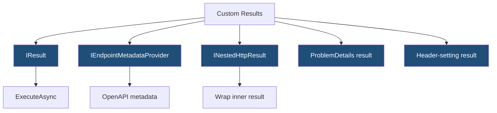
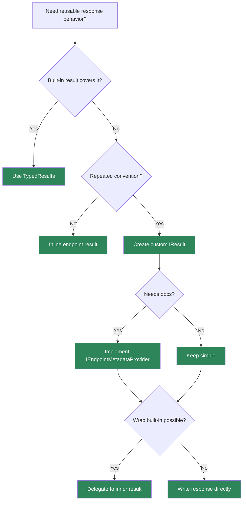

> [!success] Mastery Check
> - [ ] **Studied Well**
> - [ ] **Can explain the concept without notes**
> - [ ] **Can answer interview questions confidently**
> - [ ] **Can implement it in a real project**


# 4.096 - Custom IResult: IResult and INestedHttpResult for Reusable Responses

---

## PART 0 - Navigation & Context

### Where This Topic Lives

```
ASP.NET Core Mastery
└── Minimal APIs
    ├── 4.082  IResult and TypedResults
    ├── 4.095  Metadata Providers
    └── 4.096  YOU ARE HERE - custom results
```

### What You Need Before This

- **[[4.082 - IResult and TypedResults: Shaping HTTP Responses in Minimal APIs]]** - custom results implement the response-writing contract.
- **[[4.074 - Endpoint Metadata: Decorating Endpoints with Custom Attributes]]** - reusable results can provide metadata.
- **[[4.179 - Problem Details: RFC 7807 IProblemDetailsService]]** - error results should use consistent problem details.

### What This Unlocks After

- **[[4.283 - REST API Design Conventions in ASP.NET Core]]** - reusable results encode API conventions.
- **[[4.096 - Custom IResult: IResult and INestedHttpResult for Reusable Responses]]** - this note itself is the custom result foundation.
- **[[4.340 - Request Delegate Compilation: How MapGet Becomes a RequestDelegate]]** - handlers execute result objects.

### Why This Matters at Scale

Custom results turn repeated response conventions into one tested object, preventing every endpoint from manually recreating headers, status codes, ProblemDetails, and OpenAPI metadata.

---

## PART 1 - The Core Mental Model

### The Fundamental Rule

> **A custom `IResult` owns how an HTTP response is written; the practical consequence is that reusable response behavior can be centralized, tested, and documented.**

### The Plain-Language Analogy

Instead of every clerk writing a refund receipt by hand, you build a receipt printer. The printer always uses the right paper, status stamp, and tracking number. If the receipt wraps another receipt, `INestedHttpResult` lets tooling see what is inside.

### The Taxonomy Diagram



---

## PART 2 - Deep Mechanics

### 2.1 `ExecuteAsync` Writes the Response

```csharp
public sealed class AcceptedWithRequestIdResult(object value) : IResult
{
    public async Task ExecuteAsync(HttpContext httpContext)
    {
        httpContext.Response.StatusCode = StatusCodes.Status202Accepted;
        httpContext.Response.Headers["X-Request-Id"] = httpContext.TraceIdentifier;
        await httpContext.Response.WriteAsJsonAsync(value);
    }
}
```

```http
// HTTP wire format:
HTTP/1.1 202 Accepted
X-Request-Id: ...
Content-Type: application/json
```

**Runtime cost:** one result object plus JSON serialization.

**Edge case:** Set headers before writing the body.

### 2.2 Metadata Makes Custom Results Visible

```csharp
public sealed class AcceptedWithRequestIdResult<T>(T value) : IResult, IEndpointMetadataProvider
{
    public static void PopulateMetadata(MethodInfo method, EndpointBuilder builder)
    {
        builder.Metadata.Add(new ProducesResponseTypeMetadata(StatusCodes.Status202Accepted, typeof(T)));
    }

    public Task ExecuteAsync(HttpContext context)
    {
        context.Response.StatusCode = StatusCodes.Status202Accepted;
        return context.Response.WriteAsJsonAsync(value);
    }
}
```

**Runtime cost:** metadata population at startup; execution per request.

**Edge case:** Without metadata, OpenAPI may not understand your custom result.

### 2.3 Nested Results Wrap Framework Results

A custom result can delegate to an inner `IResult`, preserving behavior and reducing mistakes.

**Runtime cost:** one additional call.

**Edge case:** `INestedHttpResult` helps tooling inspect wrapped results when available.

### 2.4 Prefer Custom Results for Real Conventions

Use them for consistent headers, domain-specific status shapes, and reusable error bodies.

**Runtime cost:** negligible compared with duplicated, inconsistent endpoint code.

**Edge case:** Do not create a custom result for every trivial response; `TypedResults` already covers common cases.

---

## PART 3 - Production Code Patterns

### Pattern 1: The Accepted Command Result

```csharp
// Domain scenario: payment command API.
public sealed record CommandAccepted(string OperationId);

public sealed class CommandAcceptedResult(string operationId)
    : IResult, IEndpointMetadataProvider
{
    public static void PopulateMetadata(MethodInfo method, EndpointBuilder builder) =>
        builder.Metadata.Add(new ProducesResponseTypeMetadata(StatusCodes.Status202Accepted, typeof(CommandAccepted)));

    public Task ExecuteAsync(HttpContext context)
    {
        context.Response.StatusCode = StatusCodes.Status202Accepted;
        return context.Response.WriteAsJsonAsync(new CommandAccepted(operationId));
    }
}
```

### Pattern 2: The Correlated Problem Result

```csharp
public sealed class CorrelatedProblemResult(string title, int statusCode) : IResult
{
    public Task ExecuteAsync(HttpContext context)
    {
        return Results.Problem(
            title: title,
            statusCode: statusCode,
            extensions: new Dictionary<string, object?> { ["traceId"] = context.TraceIdentifier })
            .ExecuteAsync(context);
    }
}
```

### Pattern 3: The Header Wrapper

```csharp
public sealed class WithTenantHeaderResult(IResult inner, string tenantId) : IResult
{
    public Task ExecuteAsync(HttpContext context)
    {
        context.Response.Headers["X-Tenant-Id"] = tenantId;
        return inner.ExecuteAsync(context);
    }
}
```

### Pattern 4: The Results Extension

```csharp
public static class CommerceResults
{
    public static IResult CommandAccepted(string operationId) =>
        new CommandAcceptedResult(operationId);
}
```

### Pattern 5: The Endpoint Usage

```csharp
app.MapPost("/api/payments/{id:guid}/capture", (Guid id) =>
    CommerceResults.CommandAccepted($"capture-{id:N}"));
```

---

## PART 4 - Gotchas & Anti-Patterns

### Gotcha 1: Writing Body Before Headers

```csharp
// WRONG CODE
await context.Response.WriteAsJsonAsync(value);
context.Response.Headers["X-Request-Id"] = "x";

// HTTP consequence (wrong path):
// Header may be missing because response started.

// CORRECT CODE
context.Response.Headers["X-Request-Id"] = "x";
await context.Response.WriteAsJsonAsync(value);

// HTTP consequence (correct path):
// Header is included.

// WHY: headers commit when body starts.
```

### Gotcha 2: No OpenAPI Metadata

```csharp
// WRONG CODE
public sealed class MyResult : IResult { }

// HTTP consequence (wrong path):
// Runtime works but docs are vague.

// CORRECT CODE
public sealed class MyResult : IResult, IEndpointMetadataProvider { }

// HTTP consequence (correct path):
// Docs can describe status/body.

// WHY: custom result behavior is invisible unless metadata is supplied.
```

### Gotcha 3: Replacing Built-In Results Unnecessarily

```csharp
// WRONG CODE
new CustomOkResult(value);

// HTTP consequence (wrong path):
// Reimplements `TypedResults.Ok`.

// CORRECT CODE
TypedResults.Ok(value);

// HTTP consequence (correct path):
// Uses framework-tested result.

// WHY: custom results are for conventions, not novelty.
```

### Gotcha 4: Blocking I/O in ExecuteAsync

```csharp
// WRONG CODE
File.ReadAllBytes(path);

// HTTP consequence (wrong path):
// Thread pool starvation under load.

// CORRECT CODE
return Results.File(path).ExecuteAsync(context);

// HTTP consequence (correct path):
// Framework streams file appropriately.

// WHY: response execution must remain async-friendly.
```

### Gotcha 5: Throwing for Normal Client Errors

```csharp
// WRONG CODE
throw new InvalidOperationException("Bad request");

// HTTP consequence (wrong path):
// 500 path for client error.

// CORRECT CODE
return new CorrelatedProblemResult("Bad request", StatusCodes.Status400BadRequest);

// HTTP consequence (correct path):
// 400 problem response.

// WHY: result objects should intentionally shape HTTP failures.
```

---

## PART 5 - Performance Implications

### Request Pipeline Characteristics Table

| Scenario | Pipeline Depth | Allocations Per Request | Approx Latency Impact | Recommendation |
|---|---:|---:|---:|---|
| Built-in `TypedResults.Ok` | Result | low | Low | Prefer |
| Simple custom result | Result | one object | Low | Fine |
| Custom JSON result | Result | JSON serialization | Medium | Normal |
| Nested result wrapper | Result | wrapper | Low | Good for headers |
| Metadata provider | Startup | none per request | None | Add for docs |
| Blocking I/O result | Result | thread blocking | High | Avoid |
| Problem result | Result | dictionary/JSON | Medium | Standardize |
| Too many custom results | Maintenance | n/a | Drift | Keep focused |

### BenchmarkDotNet Code

```csharp
using BenchmarkDotNet.Attributes;

[MemoryDiagnoser]
public sealed class CustomResultShapeBenchmarks
{
    [Benchmark] public CommandAcceptedResult CreateCustom() => new("op-1");
    [Benchmark] public IResult BuiltInAccepted() => TypedResults.Accepted();
}
```

### When This Costs You

Custom results doing file I/O, heavy serialization, or per-request service calls.

### When This Doesn't Matter

Small wrapper results that set headers/status and delegate to built-ins.

---

## PART 6 - Interview Arsenal

### A. The Question Bank

**Question:** "When would you write a custom `IResult`?"

**Average Answer:** "When built-ins do not fit."

**Why That's Insufficient:** It needs convention and metadata.

> **Great Answer:** "I write one when a response convention is repeated: a standard ProblemDetails shape, correlation headers, command accepted body, or domain-specific status mapping. I also add endpoint metadata so OpenAPI and tooling know what the result writes."

**Question:** "What does `ExecuteAsync` do?"

**Average Answer:** "Runs the result."

**Why That's Insufficient:** It should mention HTTP response writes.

> **Great Answer:** "`ExecuteAsync` receives `HttpContext` and writes the status code, headers, content type, and body. The order matters: headers before body, async I/O, and no normal client errors as exceptions."

**Question:** "Why use nested results?"

**Average Answer:** "To wrap another result."

**Why That's Insufficient:** It should mention reuse/tooling.

> **Great Answer:** "Wrapping lets me add a header or convention while delegating actual response writing to a tested built-in result. If the type exposes nested result metadata, tooling can still understand the inner response shape."

### B. The Trick Questions

| Question | Trap | Correct Answer |
|---|---|---|
| Can headers be added after JSON write? | Late header | Usually no. |
| Do custom results document themselves? | Runtime vs docs | Not unless metadata is supplied. |
| Should every response be custom? | Overengineering | No. |
| Can `ExecuteAsync` block on file I/O? | Sync-over-async | Avoid. |

### C. Red Flags to Avoid

- "Custom result is just a DTO." - it writes HTTP.
- "OpenAPI will infer everything." - not for arbitrary custom results.
- "Headers can be set anytime." - false.
- "Throw for bad request." - wrong failure path.
- "Reimplement all built-ins." - wasteful.

---

## PART 7 - Decision Framework



---

## PART 8 - Self-Check

### A. Conceptual Questions

1. What does `IResult.ExecuteAsync` receive?
2. Why should custom results add metadata?
3. When should you avoid custom results?
4. Why do headers need to be set before body writes?
5. What is the advantage of wrapping built-in results?
6. Why avoid blocking I/O in result execution?
7. How can custom results standardize ProblemDetails?
8. What is the per-request cost of a small custom result?

### B. Code Puzzles

```csharp
await context.Response.WriteAsJsonAsync(value);
context.Response.Headers["X-Correlation-Id"] = "abc";
```

<details><summary>Answer</summary>
Header may be too late because the body write can start the response.
</details>

```csharp
public sealed class AcceptedResult : IResult { }
```

<details><summary>Answer</summary>
Runtime behavior may work if implemented, but OpenAPI lacks metadata unless provided.
</details>

```csharp
return TypedResults.Ok(value);
```

<details><summary>Answer</summary>
Use this instead of custom `Ok` unless you have a real repeated convention.
</details>

```csharp
File.ReadAllBytes(path);
```

<details><summary>Answer</summary>
Synchronous file I/O in response execution can block request threads. Use stream/file results.
</details>

---

## PART 9 - Connections & Resources

### A. Related Topics Table

| Topic | Why It Connects |
|---|---|
| [[4.082 - IResult and TypedResults: Shaping HTTP Responses in Minimal APIs]] | Custom results extend the result model. |
| [[4.095 - IEndpointMetadataProvider: Pushing Metadata from Parameter Types]] | Custom results often provide metadata. |
| [[4.179 - Problem Details: RFC 7807 IProblemDetailsService]] | Error custom results should align with ProblemDetails. |
| [[4.125 - HttpResponse: Writing Status, Headers, Cookies, and Streaming Body]] | Custom results write directly to HttpResponse. |
| [[4.283 - REST API Design Conventions in ASP.NET Core]] | Reusable results encode response conventions. |

### B. Books

| Book | Chapters | Why These Chapters |
|---|---|---|
| *ASP.NET Core in Action* | Minimal API results | Practical response result patterns. |
| *Pro ASP.NET Core* | Results and responses | Detailed response execution examples. |

### C. Essential Articles & Docs

- [Microsoft Docs - Minimal API responses](https://learn.microsoft.com/en-us/aspnet/core/fundamentals/minimal-apis/responses)
- [Microsoft Docs - OpenAPI support in ASP.NET Core](https://learn.microsoft.com/en-us/aspnet/core/fundamentals/openapi/aspnetcore-openapi)
- [ASP.NET Core source - HttpResults](https://github.com/dotnet/aspnetcore/tree/main/src/Http/Http.Results)
- [ASP.NET Core source - Http.Abstractions](https://github.com/dotnet/aspnetcore/tree/main/src/Http/Http.Abstractions)

### D. Template Meta-Note

> [!NOTE]
> **Part 0** orients the topic. **Part 1** gives the mental model. **Part 2** shows framework mechanics. **Part 3** gives production patterns. **Part 4** names gotchas. **Part 5** covers performance. **Part 6** prepares interviews. **Part 7** gives decisions. **Part 8** checks understanding. **Part 9** connects resources.
