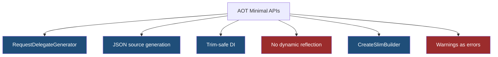
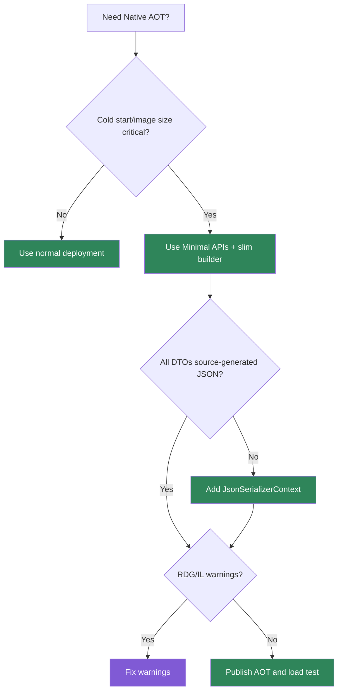

> [!success] Mastery Check
> - [ ] **Studied Well**
> - [ ] **Can explain the concept without notes**
> - [ ] **Can answer interview questions confidently**
> - [ ] **Can implement it in a real project**


# 4.097 - Minimal API AOT Compatibility: Trim-Safe and Source-Gen Patterns

---

## PART 0 - Navigation & Context

### Where This Topic Lives

```
ASP.NET Core Mastery
├── Minimal APIs
│   ├── 4.094  RequestDelegateGenerator
│   └── 4.097  YOU ARE HERE - AOT compatibility
└── Deployment
    └── 4.339  Native AOT
```

### What You Need Before This

- **[[4.094 - Minimal API Source Generators: RequestDelegateGenerator]]** - source-generated delegates support AOT.
- **[[4.082 - IResult and TypedResults]]** - concrete results improve metadata and trim safety.
- **[[4.271 - JSON Source Generation: [JsonSerializable] and Zero-Reflection Serialization]]** - JSON source generation is central to AOT APIs.

### What This Unlocks After

- **[[4.339 - Native AOT (.NET 8): ASP.NET Core Requirements, Limitations, and Trims]]** - broader deployment constraints.
- **[[4.330 - Docker Containerizing ASP.NET Core Applications]]** - AOT changes image shape and startup.
- **[[4.341 - Minimal API Source Generation: RequestDelegateFactory Internals]]** - deeper generator mechanics.

### Why This Matters at Scale

AOT-compatible Minimal APIs can start faster and ship smaller binaries, but reflection-heavy binding, JSON, DI, and dynamic code can break after trimming.

---

## PART 1 - The Core Mental Model

### The Fundamental Rule

> **AOT-compatible Minimal APIs use static, analyzable endpoint shapes and source-generated serialization; the practical consequence is that code which works under JIT can fail when trimmed unless the compiler can see what you need.**

### The Plain-Language Analogy

Trimming is packing for a trip by throwing away anything not on the checklist. AOT is sealing the suitcase before you leave. If your code later says "I need that thing I only referenced by reflection," it may be gone. Source generation writes the checklist explicitly.

### The Taxonomy Diagram



---

## PART 2 - Deep Mechanics

### 2.1 AOT Removes Runtime Code Generation Assumptions

```csharp
var builder = WebApplication.CreateSlimBuilder(args);
var app = builder.Build();

app.MapGet("/api/health", () => TypedResults.Ok("ok"));
```

**Runtime cost:** lower startup and memory; fewer runtime features are available.

**Edge case:** MVC-heavy features and reflection-heavy libraries may not be AOT friendly.

### 2.2 JSON Source Generation Preserves DTOs

```csharp
[JsonSerializable(typeof(OrderDto))]
public partial class AppJsonContext : JsonSerializerContext { }

builder.Services.ConfigureHttpJsonOptions(options =>
{
    options.SerializerOptions.TypeInfoResolverChain.Insert(0, AppJsonContext.Default);
});

public sealed record OrderDto(int Id);
```

**Runtime cost:** less reflection; better trim safety.

**Edge case:** Forgetting DTOs in the context can produce runtime serialization failures.

### 2.3 Static Handler Shapes Help RDG

```csharp
app.MapGet("/api/orders/{id:int}",
    Results<Ok<OrderDto>, NotFound> (int id) =>
        id == 1 ? TypedResults.Ok(new OrderDto(id)) : TypedResults.NotFound());
```

**Runtime cost:** generated binding path.

**Edge case:** Dynamic objects, reflection binders, and unsupported parameter types weaken AOT safety.

### 2.4 Treat Trim Warnings as Bugs

**Runtime cost:** none; build-time safety.

**Edge case:** A warning is often the only signal before production AOT failure.

---

## PART 3 - Production Code Patterns

### Pattern 1: The Slim API Startup

```csharp
// Domain scenario: high-churn health microservice.
var builder = WebApplication.CreateSlimBuilder(args);
builder.Services.ConfigureHttpJsonOptions(o =>
    o.SerializerOptions.TypeInfoResolverChain.Insert(0, AppJsonContext.Default));

var app = builder.Build();
app.MapGet("/health", () => TypedResults.Ok(new HealthDto("ok")));
app.Run();
```

### Pattern 2: The JSON Context

```csharp
[JsonSerializable(typeof(HealthDto))]
[JsonSerializable(typeof(OrderDto))]
public partial class AppJsonContext : JsonSerializerContext { }

public sealed record HealthDto(string Status);
public sealed record OrderDto(int Id);
```

### Pattern 3: The Warnings Gate

```xml
<PropertyGroup>
  <PublishAot>true</PublishAot>
  <WarningsAsErrors>$(WarningsAsErrors);IL*;RDG*</WarningsAsErrors>
</PropertyGroup>
```

### Pattern 4: The No-Dynamic Handler Rule

```csharp
// Domain scenario: payment API.
app.MapGet("/api/payments/{id:guid}",
    (Guid id) => TypedResults.Ok(new PaymentDto(id)));

public sealed record PaymentDto(Guid Id);
```

### Pattern 5: The Library Compatibility Check

```csharp
// Prefer libraries that declare trim/AOT compatibility for auth, JSON, logging, and persistence paths.
```

---

## PART 4 - Gotchas & Anti-Patterns

### Gotcha 1: Reflection-Based Serialization

```csharp
// WRONG CODE
return Results.Json(new UnknownRuntimeShape());

// HTTP consequence (wrong path):
// AOT/trimming can remove needed members.

// CORRECT CODE
return TypedResults.Ok(new OrderDto(1));

// HTTP consequence (correct path):
// DTO is included in source-generated JSON context.

// WHY: AOT needs static type knowledge.
```

### Gotcha 2: Ignoring IL/RDG Warnings

```csharp
// WRONG CODE
// PublishAot with warnings ignored.

// HTTP consequence (wrong path):
// Runtime failure in trimmed binary.

// CORRECT CODE
// Treat IL*/RDG* warnings as errors.

// HTTP consequence (correct path):
// Unsafe patterns fail at build time.

// WHY: warnings are the compiler telling you it cannot preserve behavior.
```

### Gotcha 3: Assuming MVC Is Fully AOT-Free

```csharp
// WRONG CODE
builder.Services.AddControllersWithViews();

// HTTP consequence (wrong path):
// Pulls in features that may be trim-hostile for a tiny service.

// CORRECT CODE
var builder = WebApplication.CreateSlimBuilder(args);

// HTTP consequence (correct path):
// Minimal stack fits AOT goal.

// WHY: AOT favors smaller, analyzable feature sets.
```

### Gotcha 4: Dynamic Service Resolution

```csharp
// WRONG CODE
sp.GetRequiredService(Type.GetType(typeName)!);

// HTTP consequence (wrong path):
// Trimmer may not preserve dynamically named service types.

// CORRECT CODE
app.MapGet("/api/orders", (OrderService service) => Results.Ok());

// HTTP consequence (correct path):
// DI dependency is visible.

// WHY: static references are trim-friendly.
```

### Gotcha 5: Assuming AOT Improves Runtime I/O

```csharp
// WRONG CODE
// Expect AOT to fix slow SQL.

// HTTP consequence (wrong path):
// P99 remains database-bound.

// CORRECT CODE
// Use AOT for startup/size goals; optimize SQL separately.

// HTTP consequence (correct path):
// Correct performance target.

// WHY: AOT changes code generation, not external latency.
```

---

## PART 5 - Performance Implications

### Request Pipeline Characteristics Table

| Scenario | Pipeline Depth | Allocations Per Request | Approx Latency Impact | Recommendation |
|---|---:|---:|---:|---|
| AOT Minimal API | Low | low | Startup win | Use for small services |
| JSON source-gen | Serialization | lower reflection | Low-medium | Required for AOT |
| Reflection JSON | Serialization | risky | Runtime failure risk | Avoid |
| Dynamic DI | DI | risky | Runtime failure risk | Avoid |
| MVC views | MVC/UI | high | Trim risk | Avoid for AOT microservice |
| DB-heavy endpoint | Handler | DB dominates | High | Optimize separately |
| RDG handler | Endpoint | low | Startup win | Prefer |
| Warnings ignored | Build/runtime | n/a | Critical | Fail build |

### BenchmarkDotNet Code

```csharp
using BenchmarkDotNet.Attributes;

[MemoryDiagnoser]
public sealed class AotShapeBenchmarks
{
    [Benchmark] public OrderDto StaticDto() => new(1);
    [Benchmark] public object AnonymousObject() => new { Id = 1 };
}

public sealed record OrderDto(int Id);
```

### When This Costs You

Serverless cold starts, small container images, high scale-out services, and runtime failures from trim-unsafe code.

### When This Doesn't Matter

Long-running monoliths, MVC view apps, and endpoints dominated by database/network latency where AOT complexity is not worth it.

---

## PART 6 - Interview Arsenal

### A. The Question Bank

**Question:** "What makes a Minimal API AOT-friendly?"

**Average Answer:** "Using Minimal APIs."

**Why That's Insufficient:** Minimal alone is not enough.

> **Great Answer:** "I use static handler signatures, typed DTOs, typed results, RequestDelegateGenerator-supported binding, JSON source generation, and avoid dynamic reflection. I also treat trim and RDG warnings as build failures because code that works under JIT can fail once trimmed."

**Question:** "What does AOT improve?"

**Average Answer:** "Performance."

**Why That's Insufficient:** It needs precision.

> **Great Answer:** "Mostly startup time, memory, and deployment size for suitable apps. It does not make SQL queries or network calls faster. I use it when cold start and image size matter, not as a blanket request-latency fix."

**Question:** "Why is JSON source generation important?"

**Average Answer:** "It is faster."

**Why That's Insufficient:** AOT preservation matters.

> **Great Answer:** "It gives the serializer compile-time metadata about the DTOs it must preserve and serialize. Without it, reflection-based serialization can break under trimming or require extra annotations."

### B. The Trick Questions

| Question | Trap | Correct Answer |
|---|---|---|
| Does Minimal API automatically mean AOT safe? | Overgeneralization | No. |
| Does AOT fix DB latency? | Wrong bottleneck | No. |
| Can trim warnings be ignored? | Risk | No. |
| Are anonymous/dynamic shapes ideal? | Convenience | No, use DTOs. |

### C. Red Flags to Avoid

- "AOT makes every request faster." - imprecise.
- "Warnings are noise." - dangerous.
- "Reflection is fine under trimming." - risky.
- "JSON context is optional for AOT." - often false.
- "MVC and Minimal are identical for AOT." - false.

---

## PART 7 - Decision Framework



---

## PART 8 - Self-Check

### A. Conceptual Questions

1. What does trimming remove?
2. Why are dynamic handlers risky under AOT?
3. What does JSON source generation preserve?
4. What warnings should be treated seriously?
5. What performance problem does AOT not solve?
6. Why use `CreateSlimBuilder`?
7. Why do typed DTOs help AOT?
8. When is AOT not worth the complexity?

### B. Code Puzzles

```csharp
return Results.Json(new { Id = id });
```

<details><summary>Answer</summary>
Anonymous shapes can be less AOT-friendly than explicit DTOs included in JSON source-generation context.
</details>

```xml
<PublishAot>true</PublishAot>
```

<details><summary>Answer</summary>
Good start, but you must also handle trim/RDG warnings and source-generate JSON metadata.
</details>

```csharp
sp.GetRequiredService(Type.GetType(typeName)!);
```

<details><summary>Answer</summary>
Dynamic service resolution is trim-risky because the trimmer cannot know which types to preserve.
</details>

```csharp
await db.Orders.ToListAsync();
```

<details><summary>Answer</summary>
AOT will not make the database query fast. Optimize data access separately.
</details>

---

## PART 9 - Connections & Resources

### A. Related Topics Table

| Topic | Why It Connects |
|---|---|
| [[4.094 - Minimal API Source Generators: RequestDelegateGenerator]] | RDG is core to AOT-friendly Minimal APIs. |
| [[4.339 - Native AOT (.NET 8): ASP.NET Core Requirements, Limitations, and Trims]] | Broader AOT deployment constraints. |
| [[4.271 - JSON Source Generation: [JsonSerializable] and Zero-Reflection Serialization]] | JSON source-gen is required for trim-safe serialization. |
| [[4.082 - IResult and TypedResults]] | Typed results help metadata and static analysis. |
| [[2.090 - C# Source Generators]] | Source generation mechanics underpin AOT patterns. |

### B. Books

| Book | Chapters | Why These Chapters |
|---|---|---|
| *ASP.NET Core in Action* | Minimal APIs and deployment | Practical AOT context. |
| *.NET Performance* | Startup and deployment | Broader runtime performance model. |

### C. Essential Articles & Docs

- [Microsoft Docs - Native AOT support in ASP.NET Core](https://learn.microsoft.com/en-us/aspnet/core/fundamentals/native-aot)
- [Microsoft Docs - System.Text.Json source generation](https://learn.microsoft.com/en-us/dotnet/standard/serialization/system-text-json/source-generation)
- [Microsoft Docs - Minimal APIs overview](https://learn.microsoft.com/en-us/aspnet/core/fundamentals/minimal-apis/overview)
- [ASP.NET Core source - RequestDelegateGenerator](https://github.com/dotnet/aspnetcore/tree/main/src/Http/Http.Extensions/gen)

### D. Template Meta-Note

> [!NOTE]
> **Part 0** orients the topic. **Part 1** gives the mental model. **Part 2** shows framework mechanics. **Part 3** gives production patterns. **Part 4** names gotchas. **Part 5** covers performance. **Part 6** prepares interviews. **Part 7** gives decisions. **Part 8** checks understanding. **Part 9** connects resources.
