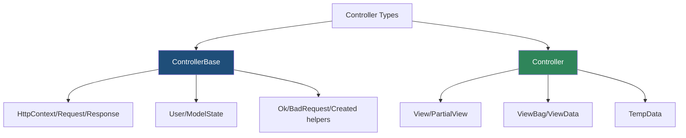
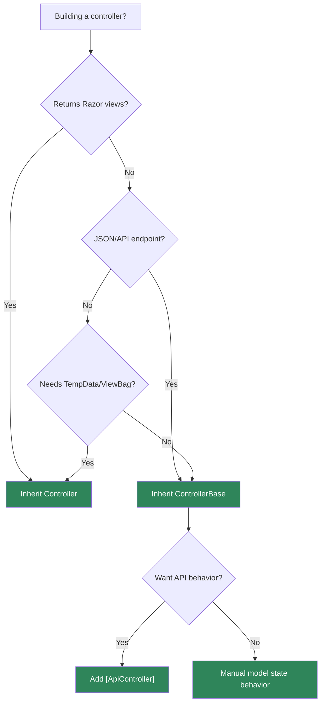

> [!success] Mastery Check
> - [ ] **Studied Well**
> - [ ] **Can explain the concept without notes**
> - [ ] **Can answer interview questions confidently**
> - [ ] **Can implement it in a real project**


# 4.098 - ControllerBase vs Controller: API vs MVC Controllers

---

## PART 0 - Navigation & Context

### Where This Topic Lives

```
ASP.NET Core Mastery
├── Minimal APIs
│   └── 4.092  Minimal API vs MVC
└── MVC & Controllers
    ├── 4.098  YOU ARE HERE - controller base types
    ├── 4.099  Action Results
    └── 4.101  ApiController
```

### What You Need Before This

- **[[4.064 - Endpoint Routing: The Modern Routing Architecture]]** - controller actions are endpoints.
- **[[4.092 - Minimal API vs MVC Controller: The Decision Framework]]** - choose controller model for the right reasons.
- **Basic MVC action concepts** - actions return HTTP results.

### What This Unlocks After

- **[[4.099 - Action Results: IActionResult and ActionResult<T>]]** - both base types use action results.
- **[[4.101 - ApiController Attribute: Automatic 400 and Binding Source Inference]]** - API behavior is attribute-driven, not base-class-only.
- **[[4.104 - Razor Pages: PageModel, Handlers, and When to Use vs MVC]]** - broader server-rendered UI choices.

### Why This Matters at Scale

Choosing `ControllerBase` for APIs and `Controller` for views keeps dependencies, conventions, and mental models clean; using `Controller` for JSON APIs drags view infrastructure into places it does not belong.

---

## PART 1 - The Core Mental Model

### The Fundamental Rule

> **`ControllerBase` is the API controller base; `Controller` adds view-rendering features. The practical consequence is that JSON APIs should inherit `ControllerBase`, while server-rendered MVC controllers inherit `Controller`.**

### The Plain-Language Analogy

`ControllerBase` is the API workbench: request, response, user, model state, and result helpers. `Controller` is the same workbench plus a rendering studio with views, view data, temp data, and UI helpers. If you are shipping JSON, you do not need the studio lights.

### The Taxonomy Diagram



---

## PART 2 - Deep Mechanics

### 2.1 Controller Actions Execute After Endpoint Routing

```
---> Routing[select controller action endpoint] ---> Auth ---> MVC action invoker ---> action result
```

```csharp
[ApiController]
[Route("api/orders")]
public sealed class OrdersController : ControllerBase
{
    [HttpGet("{orderId:int}")]
    public IActionResult Get(int orderId) => Ok(new { orderId });
}
```

```http
// HTTP wire format:
GET /api/orders/42 HTTP/1.1
HTTP/1.1 200 OK
Content-Type: application/json
```

**Runtime cost:** controller activation plus MVC action invoker; base type choice does not dominate request cost.

**Edge case:** `[ApiController]` is separate from inheriting `ControllerBase`.

### 2.2 `ControllerBase` Has API Helpers

It includes `Ok`, `Created`, `BadRequest`, `NotFound`, `Problem`, `ValidationProblem`, `File`, `User`, `ModelState`, and access to `HttpContext`.

**Runtime cost:** helper creates an `IActionResult`.

**Edge case:** You do not need `Controller` to return JSON.

### 2.3 `Controller` Adds View Features

```csharp
public sealed class DashboardController : Controller
{
    public IActionResult Index() => View();
}
```

**Runtime cost:** view rendering cost dominates.

**Edge case:** If a controller never returns views, inheriting `Controller` is a smell.

### 2.4 API Behavior Comes From Attributes and Services

`[ApiController]`, routing attributes, MVC options, filters, formatters, and model validation shape API behavior.

**Runtime cost:** filters/formatters/model binding may matter more than base class.

**Edge case:** `ControllerBase` without `[ApiController]` does not get automatic 400 behavior.

---

## PART 3 - Production Code Patterns

### Pattern 1: The API Controller

```csharp
// Domain scenario: order management API.
[ApiController]
[Route("api/orders")]
public sealed class OrdersController : ControllerBase
{
    [HttpGet("{orderId:int}")]
    public ActionResult<OrderDto> Get(int orderId) => Ok(new OrderDto(orderId));
}

public sealed record OrderDto(int Id);
```

### Pattern 2: The View Controller

```csharp
// Domain scenario: admin dashboard.
public sealed class DashboardController : Controller
{
    public IActionResult Index() => View();
}
```

### Pattern 3: The API Controller With Problem

```csharp
// Domain scenario: payment API.
[ApiController]
[Route("api/payments")]
public sealed class PaymentsController : ControllerBase
{
    [HttpGet("{paymentId:guid}")]
    public IActionResult Get(Guid paymentId) =>
        paymentId == Guid.Empty ? BadRequest() : Ok(new { paymentId });
}
```

### Pattern 4: The Avoid-View-In-API Rule

```csharp
// Domain scenario: inventory JSON API.
public sealed class InventoryController : ControllerBase
{
    [HttpGet("/api/inventory/{sku}")]
    public IActionResult Get(string sku) => Ok(new { sku });
}
```

### Pattern 5: The Mixed App Registration

```csharp
builder.Services.AddControllersWithViews();
app.MapControllers();
app.MapDefaultControllerRoute();
```

---

## PART 4 - Gotchas & Anti-Patterns

### Gotcha 1: Inheriting `Controller` for JSON APIs

```csharp
// WRONG CODE
public sealed class OrdersController : Controller { }

// HTTP consequence (wrong path):
// API controller carries unused view features.

// CORRECT CODE
public sealed class OrdersController : ControllerBase { }

// HTTP consequence (correct path):
// API base type matches response model.

// WHY: `Controller` is for MVC views.
```

### Gotcha 2: Thinking `ControllerBase` Enables Automatic 400

```csharp
// WRONG CODE
public sealed class OrdersController : ControllerBase { }

// HTTP consequence (wrong path):
// Invalid ModelState is not automatically rejected.

// CORRECT CODE
[ApiController]
public sealed class OrdersController : ControllerBase { }

// HTTP consequence (correct path):
// Invalid model state -> automatic 400.

// WHY: `[ApiController]` controls API-specific behavior.
```

### Gotcha 3: Returning Views From API Controllers

```csharp
// WRONG CODE
public IActionResult Details() => View();

// HTTP consequence (wrong path):
// API route returns HTML unexpectedly.

// CORRECT CODE
public IActionResult Details() => Ok(new { id = 1 });

// HTTP consequence (correct path):
// API returns JSON.

// WHY: API and UI controllers have different contracts.
```

### Gotcha 4: Injecting HttpContext Into Services

```csharp
// WRONG CODE
public sealed class OrderService(ControllerBase controller) { }

// HTTP consequence (wrong path):
// Service depends on MVC boundary.

// CORRECT CODE
public sealed class OrderService { }

// HTTP consequence (correct path):
// Controller adapts HTTP to service call.

// WHY: controllers are adapters, not domain dependencies.
```

### Gotcha 5: Confusing `Controller` With MVC Registration

```csharp
// WRONG CODE
builder.Services.AddControllers();
// expecting views to work

// HTTP consequence (wrong path):
// View results can fail because view services are not registered.

// CORRECT CODE
builder.Services.AddControllersWithViews();

// HTTP consequence (correct path):
// MVC view services are available.

// WHY: service registration controls MVC feature set.
```

---

## PART 5 - Performance Implications

### Request Pipeline Characteristics Table

| Scenario | Pipeline Depth | Allocations Per Request | Approx Latency Impact | Recommendation |
|---|---:|---:|---:|---|
| `ControllerBase` API | MVC action | controller + result | Low-medium | Use for APIs |
| `Controller` API | MVC + unused view features | similar | Low | Avoid for JSON APIs |
| View controller | MVC + view engine | higher | Medium-high | Use for UI |
| `[ApiController]` validation | MVC filters/model state | validation cost | Medium | Good for APIs |
| Minimal API equivalent | endpoint delegate | lower | Low | Use when MVC not needed |
| File result | MVC result | stream/I/O | Medium | Base type secondary |
| Problem result | MVC result | JSON | Low-medium | Standard errors |
| DB-heavy action | Handler/service | DB dominates | High | Optimize data |

### BenchmarkDotNet Code

```csharp
using BenchmarkDotNet.Attributes;

[MemoryDiagnoser]
public sealed class ControllerBaseChoiceBenchmarks
{
    [Benchmark] public string ApiBase() => nameof(ControllerBase);
    [Benchmark] public string ViewBase() => nameof(Controller);
}
```

### When This Costs You

View rendering, filters, model binding, and service work dominate more than the base class.

### When This Doesn't Matter

Simple actions where SQL or JSON serialization dominates.

---

## PART 6 - Interview Arsenal

### A. The Question Bank

**Question:** "What is the difference between `ControllerBase` and `Controller`?"

**Average Answer:** "`Controller` has views."

**Why That's Insufficient:** It should connect to API design.

> **Great Answer:** "`ControllerBase` is the base for API controllers: request, response, user, model state, and result helpers. `Controller` inherits from it and adds view rendering features like `View`, `ViewBag`, `TempData`, and view data. For JSON APIs I use `ControllerBase`; for server-rendered MVC UI I use `Controller`."

**Question:** "Does inheriting `ControllerBase` make automatic validation happen?"

**Average Answer:** "Yes."

**Why That's Insufficient:** The attribute is separate.

> **Great Answer:** "No. Automatic 400 behavior comes from `[ApiController]` and MVC options, not the base class by itself. `ControllerBase` gives the API helper surface; `[ApiController]` changes binding and validation behavior."

**Question:** "Can controllers and Minimal APIs coexist?"

**Average Answer:** "Yes."

**Why That's Insufficient:** It should mention endpoint routing.

> **Great Answer:** "Yes, both register endpoint routing endpoints. Middleware like auth and exception handling applies to both based on order, and routing selects the matching endpoint."

### B. The Trick Questions

| Question | Trap | Correct Answer |
|---|---|---|
| Does `ControllerBase` include `View()`? | API/UI confusion | No. |
| Does `[ApiController]` come from base type? | Attribute confusion | No. |
| Can `Controller` return JSON? | Capability vs fit | Yes, but not ideal for APIs. |
| Does `AddControllers` register views? | Service confusion | No, use `AddControllersWithViews`. |

### C. Red Flags to Avoid

- "Use Controller everywhere." - sloppy.
- "ControllerBase has views." - false.
- "Automatic 400 is base-class behavior." - false.
- "Controllers cannot be endpoints." - false.
- "Services should depend on controllers." - boundary leak.

---

## PART 7 - Decision Framework



---

## PART 8 - Self-Check

### A. Conceptual Questions

1. Which base type should JSON APIs use?
2. What does `Controller` add?
3. What enables automatic 400 responses?
4. Why is `Controller` unnecessary for API controllers?
5. Which service registration is needed for views?
6. How do controllers participate in endpoint routing?
7. Why should services not depend on controllers?
8. When can Minimal APIs be a better fit?

### B. Code Puzzles

```csharp
public sealed class ApiController : Controller
{
    public IActionResult Get() => Ok();
}
```

<details><summary>Answer</summary>
Works, but for JSON APIs prefer `ControllerBase`; `Controller` adds view features.
</details>

```csharp
public sealed class OrdersController : ControllerBase { }
```

<details><summary>Answer</summary>
No automatic 400 unless `[ApiController]` is applied.
</details>

```csharp
builder.Services.AddControllers();
public IActionResult Index() => View();
```

<details><summary>Answer</summary>
View services may be missing. Use `AddControllersWithViews` for MVC views.
</details>

```csharp
public sealed class OrderService(ControllerBase controller) { }
```

<details><summary>Answer</summary>
Boundary leak. Services should not depend on controllers.
</details>

---

## PART 9 - Connections & Resources

### A. Related Topics Table

| Topic | Why It Connects |
|---|---|
| [[4.099 - Action Results: IActionResult and ActionResult<T>]] | Both base types return action results. |
| [[4.101 - ApiController Attribute: Automatic 400 and Binding Source Inference]] | API behavior is attribute-driven. |
| [[4.092 - Minimal API vs MVC Controller: The Decision Framework]] | Base type choice follows endpoint model choice. |
| [[4.104 - Razor Pages: PageModel, Handlers, and When to Use vs MVC]] | Server-rendered UI alternatives. |
| [[4.110 - MVC Filter Pipeline: Six Filter Types and Execution Order]] | Filters apply to controller actions. |

### B. Books

| Book | Chapters | Why These Chapters |
|---|---|---|
| *ASP.NET Core in Action* | Controllers and actions | Clear controller base type guidance. |
| *Pro ASP.NET Core* | MVC controllers | Practical controller examples. |

### C. Essential Articles & Docs

- [Microsoft Docs - Controller action return types in ASP.NET Core](https://learn.microsoft.com/en-us/aspnet/core/web-api/action-return-types)
- [Microsoft Docs - Handle requests with controllers](https://learn.microsoft.com/en-us/aspnet/core/mvc/controllers/actions)
- [Microsoft Docs - Create web APIs with ASP.NET Core](https://learn.microsoft.com/en-us/aspnet/core/web-api/)
- [ASP.NET Core source - MVC ControllerBase](https://github.com/dotnet/aspnetcore/tree/main/src/Mvc/Mvc.Core)

### D. Template Meta-Note

> [!NOTE]
> **Part 0** orients the topic. **Part 1** gives the mental model. **Part 2** shows framework mechanics. **Part 3** gives production patterns. **Part 4** names gotchas. **Part 5** covers performance. **Part 6** prepares interviews. **Part 7** gives decisions. **Part 8** checks understanding. **Part 9** connects resources.
