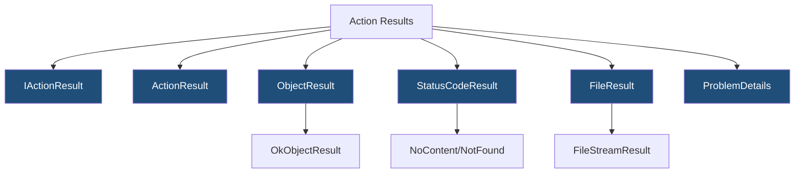
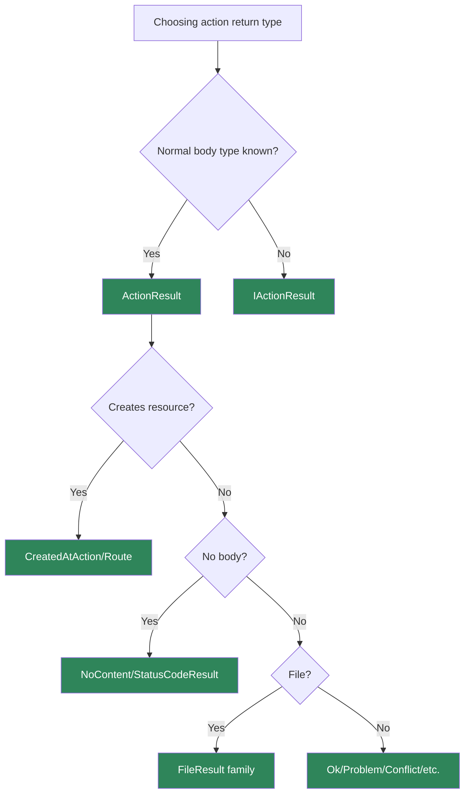

> [!success] Mastery Check
> - [ ] **Studied Well**
> - [ ] **Can explain the concept without notes**
> - [ ] **Can answer interview questions confidently**
> - [ ] **Can implement it in a real project**


# 4.099 - Action Results: IActionResult, ActionResult<T>, and TypedResults

---

## PART 0 - Navigation & Context

### Where This Topic Lives

```
ASP.NET Core Mastery
├── Minimal APIs
│   └── 4.082  IResult and TypedResults
└── MVC & Controllers
    ├── 4.098  ControllerBase vs Controller
    └── 4.099  YOU ARE HERE - action results
```

### What You Need Before This

- **[[4.098 - ControllerBase vs Controller: API vs MVC Controllers]]** - controllers return action results.
- **HTTP status codes** - action results shape status, headers, and body.
- **[[4.107 - Output Formatters: JSON, XML, and Custom Formatter Registration]]** - object results use formatters.

### What This Unlocks After

- **[[4.118 - Problem Details in MVC: ProblemDetails and ValidationProblemDetails]]** - standardized error action results.
- **[[4.121 - File Download: FileStreamResult, FileContentResult, PhysicalFileResult]]** - file action result family.
- **[[4.122 - Content Negotiation Deep Dive: Accept Header Algorithm]]** - formatter selection for object results.

### Why This Matters at Scale

Action result type choice controls whether your controller's HTTP contract is explicit, negotiable, documented, and testable.

---

## PART 1 - The Core Mental Model

### The Fundamental Rule

> **An MVC action result is an object the MVC action invoker executes to write the HTTP response; the practical consequence is that return type determines status code, headers, formatter behavior, and OpenAPI clarity.**

### The Plain-Language Analogy

The controller action decides what kind of receipt to hand back. `Ok()` is a standard receipt, `CreatedAtAction()` includes a pickup location, `File()` streams a package, and `Problem()` prints a standardized complaint form. `ActionResult<T>` says the normal receipt contains a specific product, but exceptional receipts are still possible.

### The Taxonomy Diagram



---

## PART 2 - Deep Mechanics

### 2.1 MVC Invokes Results After the Action Returns

```
---> Routing ---> MVC action invoker ---> action method ---> result execution ---> response
```

```csharp
[HttpGet("{orderId:int}")]
public IActionResult Get(int orderId) => Ok(new OrderDto(orderId));
```

```http
// HTTP wire format:
GET /api/orders/42 HTTP/1.1
HTTP/1.1 200 OK
Content-Type: application/json
```

**Runtime cost:** result allocation plus formatter serialization.

**Edge case:** Returning a plain object can still produce an `ObjectResult`, but status intent is less explicit.

### 2.2 `ActionResult<T>` Documents the Normal Body

```csharp
[HttpGet("{orderId:int}")]
public ActionResult<OrderDto> Get(int orderId)
{
    return orderId == 42 ? new OrderDto(orderId) : NotFound();
}
```

**Runtime cost:** similar result execution.

**Edge case:** Returning `T` directly implies 200; return result helpers for alternate statuses.

### 2.3 Object Results Use Output Formatters

`Ok(dto)` returns an object result that content negotiation can serialize as JSON, XML, or another configured formatter.

**Runtime cost:** formatter selection plus serialization.

**Edge case:** `Accept` header can affect output when multiple formatters are configured.

### 2.4 File Results Stream Differently

`FileStreamResult`, `FileContentResult`, and `PhysicalFileResult` write binary content and headers rather than JSON.

**Runtime cost:** I/O-bound; file content vs stream choice matters.

**Edge case:** Do not load huge files into byte arrays just to return `FileContentResult`.

---

## PART 3 - Production Code Patterns

### Pattern 1: The Typed Read Action

```csharp
[HttpGet("{orderId:int}")]
public ActionResult<OrderDto> Get(int orderId) =>
    orderId == 42 ? Ok(new OrderDto(orderId)) : NotFound();
```

### Pattern 2: The Created Resource Action

```csharp
[HttpPost]
public ActionResult<OrderDto> Create(CreateOrder request)
{
    var dto = new OrderDto(123);
    return CreatedAtAction(nameof(Get), new { orderId = dto.Id }, dto);
}
```

### Pattern 3: The NoContent Update

```csharp
[HttpPut("{orderId:int}")]
public IActionResult Update(int orderId, UpdateOrder request) => NoContent();
```

### Pattern 4: The Problem Result

```csharp
[HttpPost("capture")]
public IActionResult Capture(CapturePayment request) =>
    request.Amount <= 0
        ? ValidationProblem(new Dictionary<string, string[]> { ["amount"] = ["Must be positive."] })
        : Accepted();
```

### Pattern 5: The File Download

```csharp
[HttpGet("{invoiceId:int}/pdf")]
public IActionResult DownloadInvoice(int invoiceId) =>
    File(Array.Empty<byte>(), "application/pdf", $"invoice-{invoiceId}.pdf");
```

public sealed record OrderDto(int Id);
public sealed record CreateOrder(string Sku);
public sealed record UpdateOrder(string Sku);
public sealed record CapturePayment(decimal Amount);

---

## PART 4 - Gotchas & Anti-Patterns

### Gotcha 1: Returning `Ok` for Creation

```csharp
// WRONG CODE
return Ok(dto);

// HTTP consequence (wrong path):
// 200 OK with no Location header.

// CORRECT CODE
return CreatedAtAction(nameof(Get), new { orderId = dto.Id }, dto);

// HTTP consequence (correct path):
// 201 Created with Location.

// WHY: creation should identify the new resource.
```

### Gotcha 2: Using `IActionResult` Everywhere

```csharp
// WRONG CODE
public IActionResult Get() => Ok(new OrderDto(1));

// HTTP consequence (wrong path):
// OpenAPI/type info is less precise.

// CORRECT CODE
public ActionResult<OrderDto> Get() => Ok(new OrderDto(1));

// HTTP consequence (correct path):
// Normal response body type is visible.

// WHY: `ActionResult<T>` communicates the happy-path schema.
```

### Gotcha 3: Returning Domain Exceptions as 500

```csharp
// WRONG CODE
throw new InvalidOperationException("Payment already captured");

// HTTP consequence (wrong path):
// 500 for a resource state conflict.

// CORRECT CODE
return Conflict(new { error = "Payment already captured." });

// HTTP consequence (correct path):
// 409 Conflict.

// WHY: action results map domain outcomes to HTTP intentionally.
```

### Gotcha 4: Byte Array for Large Files

```csharp
// WRONG CODE
return File(System.IO.File.ReadAllBytes(path), "application/pdf");

// HTTP consequence (wrong path):
// Large allocation before response.

// CORRECT CODE
return PhysicalFile(path, "application/pdf");

// HTTP consequence (correct path):
// Framework streams from file.

// WHY: file result choice affects memory behavior.
```

### Gotcha 5: Anonymous Error Shapes

```csharp
// WRONG CODE
return BadRequest(new { message = "Invalid" });

// HTTP consequence (wrong path):
// Error schema drifts.

// CORRECT CODE
return ValidationProblem();

// HTTP consequence (correct path):
// Standard validation problem shape.

// WHY: clients need consistent error contracts.
```

---

## PART 5 - Performance Implications

### Request Pipeline Characteristics Table

| Scenario | Pipeline Depth | Allocations Per Request | Approx Latency Impact | Recommendation |
|---|---:|---:|---:|---|
| `Ok(dto)` | MVC result | object result + JSON | Medium | Normal |
| `NoContent()` | MVC result | low | Very low | Use for updates |
| `CreatedAtAction` | Link generation + JSON | route values | Medium | Use for creation |
| `ActionResult<T>` | MVC result | similar | Low | Prefer for APIs |
| `PhysicalFile` | File result | low memory | I/O-bound | Large files |
| `FileContentResult` | File result | byte[] memory | High for large | Small files only |
| `Problem` | JSON | dictionary/details | Medium | Standard errors |
| Content negotiation | Formatter | selection + serialization | Medium | Configure intentionally |

### BenchmarkDotNet Code

```csharp
using BenchmarkDotNet.Attributes;

[MemoryDiagnoser]
public sealed class ActionResultShapeBenchmarks
{
    [Benchmark] public OrderDto Dto() => new(1);
    [Benchmark] public byte[] SmallFileBytes() => new byte[1024];
}

public sealed record OrderDto(int Id);
```

### When This Costs You

Large object serialization, file downloads, link generation for many resources, and formatter-heavy content negotiation.

### When This Doesn't Matter

Small responses and actions dominated by database work.

---

## PART 6 - Interview Arsenal

### A. The Question Bank

**Question:** "When do you use `ActionResult<T>`?"

**Average Answer:** "When returning a type."

**Why That's Insufficient:** It should mention alternate results.

> **Great Answer:** "I use `ActionResult<T>` when the normal response body is `T` but the action can still return alternate HTTP results like 404 or 400. It improves readability and OpenAPI while keeping status code control."

**Question:** "What executes an `IActionResult`?"

**Average Answer:** "ASP.NET Core."

**Why That's Insufficient:** It needs MVC action invoker.

> **Great Answer:** "The MVC action invoker calls the action, then executes the returned result. Object results go through output formatters, file results stream content, and status-code results set status and headers."

**Question:** "What should POST create return?"

**Average Answer:** "The created object."

**Why That's Insufficient:** It misses status and location.

> **Great Answer:** "Usually `201 Created` with `CreatedAtAction` or `CreatedAtRoute`, including a `Location` header pointing to the canonical resource. That is the HTTP contract clients expect."

### B. The Trick Questions

| Question | Trap | Correct Answer |
|---|---|---|
| Does `ActionResult<T>` always return 200? | Type confusion | No, can return other results. |
| Does `Ok(object)` skip formatters? | Serialization confusion | No, object result uses formatters. |
| Is `IActionResult` bad? | Overcorrection | No, but less specific. |
| Should large files use byte arrays? | Convenience | No, stream/physical file. |

### C. Red Flags to Avoid

- "All actions return IActionResult." - vague contracts.
- "POST create returns Ok." - weak REST semantics.
- "FileContentResult for huge files." - memory risk.
- "Errors can be anonymous." - inconsistent clients.
- "Formatters do not matter." - content negotiation matters.

---

## PART 7 - Decision Framework



---

## PART 8 - Self-Check

### A. Conceptual Questions

1. What executes an action result?
2. Why use `ActionResult<T>`?
3. What result should create actions return?
4. How do object results choose output format?
5. Why avoid byte arrays for large files?
6. What is the difference between 400 and 409?
7. When is `IActionResult` appropriate?
8. Why should error shapes be standardized?

### B. Code Puzzles

```csharp
public IActionResult Create() => Ok(new { id = 1 });
```

<details><summary>Answer</summary>
Creation returns 200. Prefer `CreatedAtAction` or `CreatedAtRoute` with Location.
</details>

```csharp
public ActionResult<OrderDto> Get(int id) => id == 1 ? new OrderDto(id) : NotFound();
```

<details><summary>Answer</summary>
Valid: direct `T` implies 200; `NotFound()` gives 404 alternate result.
</details>

```csharp
return File(File.ReadAllBytes(path), "application/pdf");
```

<details><summary>Answer</summary>
Loads whole file in memory. Use `PhysicalFile` or stream for large files.
</details>

```csharp
return BadRequest(new { message = "Invalid" });
```

<details><summary>Answer</summary>
Works but can drift from ProblemDetails/ValidationProblemDetails conventions.
</details>

---

## PART 9 - Connections & Resources

### A. Related Topics Table

| Topic | Why It Connects |
|---|---|
| [[4.098 - ControllerBase vs Controller: API vs MVC Controllers]] | Controller base types expose result helpers. |
| [[4.082 - IResult and TypedResults: Shaping HTTP Responses in Minimal APIs]] | Minimal API results are the sibling abstraction. |
| [[4.107 - Output Formatters: JSON, XML, and Custom Formatter Registration]] | Object results use output formatters. |
| [[4.118 - Problem Details in MVC: ProblemDetails and ValidationProblemDetails]] | Error action results should use ProblemDetails. |
| [[4.121 - File Download: FileStreamResult, FileContentResult, PhysicalFileResult]] | File results are a dedicated result family. |

### B. Books

| Book | Chapters | Why These Chapters |
|---|---|---|
| *ASP.NET Core in Action* | Controllers and action results | Practical action result guidance. |
| *Pro ASP.NET Core* | Action results | Detailed result examples. |

### C. Essential Articles & Docs

- [Microsoft Docs - Controller action return types in ASP.NET Core web API](https://learn.microsoft.com/en-us/aspnet/core/web-api/action-return-types)
- [Microsoft Docs - Format response data in ASP.NET Core Web API](https://learn.microsoft.com/en-us/aspnet/core/web-api/advanced/formatting)
- [Microsoft Docs - File uploads and downloads](https://learn.microsoft.com/en-us/aspnet/core/mvc/models/file-uploads)
- [ASP.NET Core source - MVC action results](https://github.com/dotnet/aspnetcore/tree/main/src/Mvc/Mvc.Core/src)

### D. Template Meta-Note

> [!NOTE]
> **Part 0** orients the topic. **Part 1** gives the mental model. **Part 2** shows framework mechanics. **Part 3** gives production patterns. **Part 4** names gotchas. **Part 5** covers performance. **Part 6** prepares interviews. **Part 7** gives decisions. **Part 8** checks understanding. **Part 9** connects resources.
