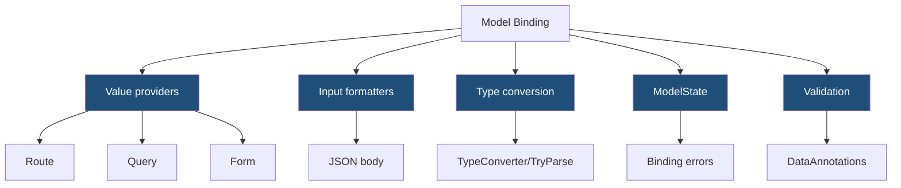
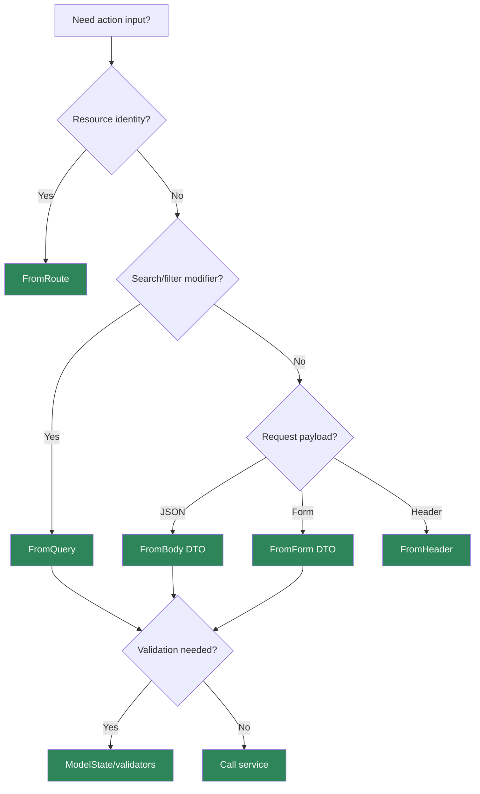

> [!success] Mastery Check
> - [ ] **Studied Well**
> - [ ] **Can explain the concept without notes**
> - [ ] **Can answer interview questions confidently**
> - [ ] **Can implement it in a real project**


# 4.100 - Model Binding: Sources, Order, and the Binding Algorithm

---

## PART 0 - Navigation & Context

### Where This Topic Lives

```
ASP.NET Core Mastery
└── MVC & Controllers
    ├── 4.100  YOU ARE HERE - model binding
    ├── 4.101  ApiController
    ├── 4.102  Model Validation
    └── 4.109  Binding Source Attributes
```

### What You Need Before This

- **[[4.067 - Attribute Routing on Controllers]]** - route values are a binding source.
- **[[4.098 - ControllerBase vs Controller]]** - controller actions receive bound parameters.
- **HTTP request anatomy** - values can come from route, query, headers, body, form, and services.

### What This Unlocks After

- **[[4.101 - ApiController Attribute: Automatic 400 and Binding Source Inference]]** - `[ApiController]` changes binding inference.
- **[[4.102 - Model Validation: DataAnnotations and ModelState]]** - validation runs after binding.
- **[[4.108 - Model Binding: Custom IModelBinder for Domain Types]]** - custom binders extend the algorithm.

### Why This Matters at Scale

Model binding is the point where untrusted HTTP text becomes typed controller input; misunderstanding binding sources leads to wrong 400s, over-posting, broken content negotiation, and security bugs.

---

## PART 1 - The Core Mental Model

### The Fundamental Rule

> **MVC model binding reads configured request sources, converts values to action parameters or models, records failures in `ModelState`, and then validation runs; the practical consequence is that binding failure and validation failure are different pipeline events.**

### The Plain-Language Analogy

Binding is the clerk filling a form from different envelopes: route card, query note, header slip, body letter, and form clipboard. ModelState is the clerk's error log. Validation is the supervisor checking the completed form after the clerk is done.

### The Taxonomy Diagram



---

## PART 2 - Deep Mechanics

### 2.1 Binding Runs Inside MVC Action Invocation

```
---> Routing ---> Auth ---> MVC action invoker
                         model binding
                         validation
                         action
                         result execution
```

```csharp
[HttpGet("orders/{orderId:int}")]
public IActionResult Get(int orderId, [FromQuery] bool includeLines) =>
    Ok(new { orderId, includeLines });
```

```http
// HTTP wire format:
GET /orders/42?includeLines=true HTTP/1.1
HTTP/1.1 200 OK
```

**Runtime cost:** value provider lookup and conversion per parameter.

**Edge case:** Route constraint failure happens before MVC binding and usually returns 404.

### 2.2 Body Binding Uses Input Formatters

```csharp
[HttpPost("orders")]
public IActionResult Create([FromBody] CreateOrder request) => Ok(request);
```

**Runtime cost:** body read plus JSON deserialization.

**Edge case:** Request body is generally readable once unless buffering is enabled.

### 2.3 ModelState Records Binding Errors

```csharp
[HttpGet("orders/{orderId}")]
public IActionResult Get(int orderId)
{
    if (!ModelState.IsValid) return ValidationProblem(ModelState);
    return Ok(orderId);
}
```

**Runtime cost:** error recording only on failure.

**Edge case:** With `[ApiController]`, invalid ModelState returns 400 before the action.

### 2.4 Validation Runs After Binding

Binding can successfully create an object that validation later rejects.

**Runtime cost:** validator dependent.

**Edge case:** `int quantity = -1` binds successfully; `[Range]` or domain validation decides if it is valid.

---

## PART 3 - Production Code Patterns

### Pattern 1: The Explicit Source API

```csharp
[HttpGet("customers/{customerId:guid}/orders")]
public IActionResult List(
    [FromRoute] Guid customerId,
    [FromQuery] string? status,
    [FromHeader(Name = "X-Correlation-Id")] string? correlationId)
{
    return Ok(new { customerId, status, correlationId });
}
```

### Pattern 2: The Body DTO

```csharp
[HttpPost("orders")]
public IActionResult Create([FromBody] CreateOrder request) =>
    CreatedAtAction(nameof(Get), new { orderId = 123 }, request);
```

### Pattern 3: The ModelState Guard Without ApiController

```csharp
[HttpPost("payments")]
public IActionResult Pay([FromBody] CreatePayment request)
{
    if (!ModelState.IsValid) return ValidationProblem(ModelState);
    return Accepted();
}
```

### Pattern 4: The Over-Posting Safe DTO

```csharp
public sealed record UpdateUserProfile(string DisplayName);

[HttpPut("profile")]
public IActionResult UpdateProfile([FromBody] UpdateUserProfile request) => NoContent();
```

### Pattern 5: The Route Constraint Boundary

```csharp
[HttpGet("orders/{orderId:int}")]
public IActionResult Get(int orderId) => Ok(new { orderId });
```

---

## PART 4 - Gotchas & Anti-Patterns

### Gotcha 1: Binding Entities Directly

```csharp
// WRONG CODE
public IActionResult Update(User entity) => Ok();

// HTTP consequence (wrong path):
// Client can over-post fields like IsAdmin.

// CORRECT CODE
public IActionResult Update(UpdateUserProfile request) => Ok();

// HTTP consequence (correct path):
// Only intended fields bind.

// WHY: DTOs define the HTTP contract.
```

### Gotcha 2: Expecting Binding to Validate Business Rules

```csharp
// WRONG CODE
public IActionResult Create(int quantity) => Ok();

// HTTP consequence (wrong path):
// quantity=-5 binds successfully.

// CORRECT CODE
public IActionResult Create([Range(1, 100)] int quantity) => Ok();

// HTTP consequence (correct path):
// Invalid quantity enters ModelState.

// WHY: binding converts; validation evaluates rules.
```

### Gotcha 3: Multiple Body Parameters

```csharp
// WRONG CODE
public IActionResult Create(Order order, Customer customer) => Ok();

// HTTP consequence (wrong path):
// Body binding is ambiguous/invalid.

// CORRECT CODE
public IActionResult Create(CreateOrderRequest request) => Ok();

// HTTP consequence (correct path):
// One request body DTO.

// WHY: request body is a single stream.
```

### Gotcha 4: Ignoring ModelState Without ApiController

```csharp
// WRONG CODE
public IActionResult Create(CreateOrder request) => Ok();

// HTTP consequence (wrong path):
// Binding/validation errors can reach action logic.

// CORRECT CODE
if (!ModelState.IsValid) return ValidationProblem(ModelState);

// HTTP consequence (correct path):
// Invalid input -> 400.

// WHY: automatic 400 requires `[ApiController]`.
```

### Gotcha 5: Confusing 404 and 400

```csharp
// WRONG CODE
[HttpGet("orders/{id:int}")]
// expecting /orders/abc -> 400

// HTTP consequence (wrong path):
// Constraint miss -> 404.

// CORRECT CODE
[HttpGet("orders/{id}")]
public IActionResult Get(int id) => Ok(id);

// HTTP consequence (correct path):
// /orders/abc can bind-fail -> 400.

// WHY: constraints run before MVC model binding.
```

---

## PART 5 - Performance Implications

### Request Pipeline Characteristics Table

| Scenario | Pipeline Depth | Allocations Per Request | Approx Latency Impact | Recommendation |
|---|---:|---:|---:|---|
| Route int bind | MVC binding | low | Very low | Fine |
| Query bind | MVC binding | low | Low | Fine |
| JSON body bind | Input formatter | JSON allocations | Medium | DTOs |
| Form bind | Value providers | form collection | Medium | Limit size |
| ModelState error | Binding | error entries | Low | Standard 400 |
| Validation attributes | Validation | attribute cost | Low | Good simple rules |
| Entity binding | Binding | over-post risk | Critical | Avoid |
| Custom binder | Binding | binder dependent | Medium | Use selectively |

### BenchmarkDotNet Code

```csharp
using BenchmarkDotNet.Attributes;

[MemoryDiagnoser]
public sealed class ModelBindingShapeBenchmarks
{
    [Benchmark] public bool ParseInt() => int.TryParse("42", out _);
    [Benchmark] public CreateOrder CreateDto() => new("ABC", 1);
}

public sealed record CreateOrder(string Sku, int Quantity);
```

### When This Costs You

Large JSON bodies, form binding, custom binders, and complex validation.

### When This Doesn't Matter

Simple route/query primitives and endpoints dominated by database work.

---

## PART 6 - Interview Arsenal

### A. The Question Bank

**Question:** "What is model binding?"

**Average Answer:** "It maps request data to parameters."

**Why That's Insufficient:** It misses sources and ModelState.

> **Great Answer:** "MVC model binding reads values from route, query, form, headers, and body formatters, converts them into action parameters/models, and records binding failures in ModelState. Validation then runs after binding, and `[ApiController]` can automatically turn invalid ModelState into a 400 response."

**Question:** "What is the difference between binding and validation?"

**Average Answer:** "Binding creates the object; validation checks it."

**Why That's Insufficient:** It should mention HTTP outcomes.

> **Great Answer:** "Binding asks whether HTTP text can become the requested type. Validation asks whether the typed value satisfies rules. `/orders/abc` against `{id:int}` may be a routing 404, while a selected action binding `abc` to `int` can produce a 400 binding error."

**Question:** "Why not bind EF entities directly?"

**Average Answer:** "Security."

**Why That's Insufficient:** It should name over-posting.

> **Great Answer:** "It creates over-posting risk because the client can send properties that should not be set from HTTP, like roles, balances, or flags. I bind request DTOs and map intentionally to domain/entity types."

### B. The Trick Questions

| Question | Trap | Correct Answer |
|---|---|---|
| Does route constraint failure enter ModelState? | Pipeline confusion | No, route miss. |
| Does binding enforce domain rules? | Validation confusion | No. |
| Can you bind multiple body DTOs? | Stream confusion | Avoid; body is one stream. |
| Does `ControllerBase` auto-400? | Attribute confusion | No, `[ApiController]` does. |

### C. Red Flags to Avoid

- "Binding and validation are the same." - false.
- "Bind entities directly." - over-post risk.
- "ModelState always auto-returns 400." - only with `[ApiController]`.
- "Route constraints are validation." - false.
- "Body can be read many times freely." - false.

---

## PART 7 - Decision Framework



---

## PART 8 - Self-Check

### A. Conceptual Questions

1. What sources can MVC model binding read?
2. What is stored in ModelState?
3. What happens after binding and before action execution?
4. Why should APIs use request DTOs?
5. What happens when a route constraint fails?
6. Why is the request body special?
7. How does `[ApiController]` change invalid ModelState behavior?
8. When should you write a custom binder?

### B. Code Puzzles

```csharp
[HttpGet("orders/{id:int}")]
public IActionResult Get(int id) => Ok(id);
```

<details><summary>Answer</summary>
`GET /orders/abc` does not bind; the route constraint fails first, usually returning 404.
</details>

```csharp
public IActionResult Update(User entity) => Ok();
```

<details><summary>Answer</summary>
Over-posting risk. Bind a DTO instead.
</details>

```csharp
public IActionResult Create(Order order, Customer customer) => Ok();
```

<details><summary>Answer</summary>
Multiple complex body-bound parameters are ambiguous/problematic. Use one request DTO.
</details>

```csharp
public IActionResult Create(CreateOrder request)
{
    return Ok();
}
```

<details><summary>Answer</summary>
Without `[ApiController]`, invalid ModelState is not automatically returned as 400. Check it or add `[ApiController]`.
</details>

---

## PART 9 - Connections & Resources

### A. Related Topics Table

| Topic | Why It Connects |
|---|---|
| [[4.101 - ApiController Attribute: Automatic 400 and Binding Source Inference]] | `[ApiController]` changes binding and validation behavior. |
| [[4.102 - Model Validation: DataAnnotations and ModelState]] | Validation runs after binding. |
| [[4.108 - Model Binding: Custom IModelBinder for Domain Types]] | Custom binders extend model binding. |
| [[4.109 - Binding Source Attributes: [FromBody], [FromRoute], [FromQuery], [FromHeader]]] | Binding source attributes control where values come from. |
| [[4.112 - Input Formatters: Deserializing Non-JSON Request Bodies]] | Body binding uses input formatters. |

### B. Books

| Book | Chapters | Why These Chapters |
|---|---|---|
| *ASP.NET Core in Action* | Model binding and validation | Clear pipeline explanation. |
| *Pro ASP.NET Core* | MVC model binding | Practical binding scenarios. |

### C. Essential Articles & Docs

- [Microsoft Docs - Model binding in ASP.NET Core](https://learn.microsoft.com/en-us/aspnet/core/mvc/models/model-binding)
- [Microsoft Docs - Create web APIs with ASP.NET Core](https://learn.microsoft.com/en-us/aspnet/core/web-api/)
- [Microsoft Docs - Format response data in ASP.NET Core Web API](https://learn.microsoft.com/en-us/aspnet/core/web-api/advanced/formatting)
- [ASP.NET Core source - Model binding](https://github.com/dotnet/aspnetcore/tree/main/src/Mvc/Mvc.Core/src/ModelBinding)

### D. Template Meta-Note

> [!NOTE]
> **Part 0** orients the topic. **Part 1** gives the mental model. **Part 2** shows framework mechanics. **Part 3** gives production patterns. **Part 4** names gotchas. **Part 5** covers performance. **Part 6** prepares interviews. **Part 7** gives decisions. **Part 8** checks understanding. **Part 9** connects resources.
