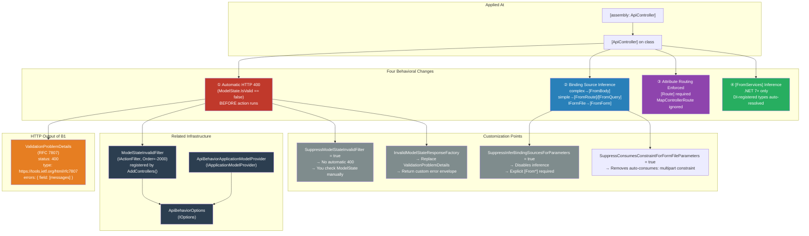
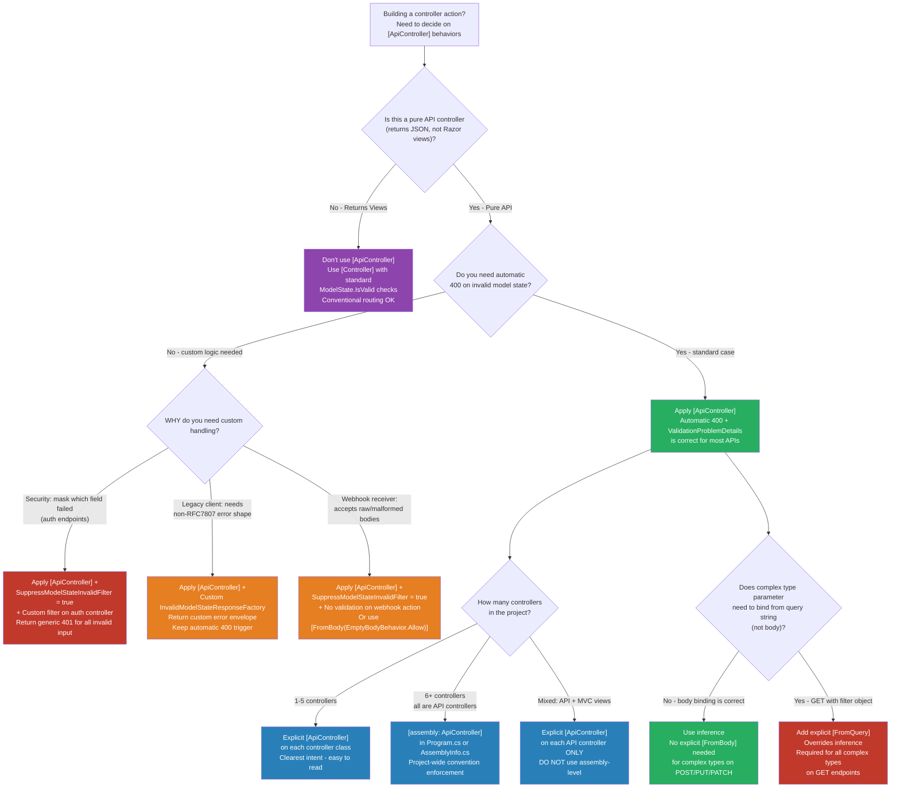

> [!success] Mastery Check
> - [ ] **Studied Well**
> - [ ] **Can explain the concept without notes**
> - [ ] **Can answer interview questions confidently**
> - [ ] **Can implement it in a real project**


# 4.101 — `[ApiController]` Attribute: Automatic 400, Binding Source Inference, and Problem Details

---

## Part 0 — Navigation & Context

### Where This Topic Sits in the ASP.NET Core Hierarchy

```
ASP.NET Core Domain
├── Host & Lifecycle
├── Configuration
├── Logging
├── Dependency Injection
├── Middleware Pipeline
├── Routing
│   └── Attribute Routing ← [ApiController] requires this
├── MVC & Controllers                        ← YOU ARE HERE
│   ├── ControllerBase vs Controller
│   ├── Model Binding (sources, order)
│   ├── [ApiController] Attribute            ← THIS TOPIC
│   │   ├── Automatic HTTP 400 / ModelState filter
│   │   ├── Binding Source Inference
│   │   ├── Problem Details (RFC 7807)
│   │   ├── [FromServices] auto-inference (.NET 7+)
│   │   └── Assembly-level application
│   ├── Model Validation & DataAnnotations
│   └── Action Filters & Result Filters
├── Minimal APIs
├── Authentication & Authorization
├── Validation
├── Error Handling
│   └── Problem Details RFC 7807
├── Caching
├── Security
└── ...
```

### What You Need Before This

| Prerequisite | Why It Matters Here |
|---|---|
| [[4.098 — ControllerBase vs Controller]] | `[ApiController]` is applied to `ControllerBase` subclasses; understanding the class hierarchy clarifies what behaviors are added vs. inherited |
| [[4.100 — Model Binding: Sources, Order, and How It Works]] | `[ApiController]` overrides the default binding source resolution order; you must understand what the defaults are to understand what is being changed |
| [[4.067 — Attribute Routing]] | `[ApiController]` enforces attribute routing as a hard requirement; conventional route mapping is silently skipped |
| [[4.102 — Model Validation: DataAnnotations and ModelState]] | The automatic 400 behavior depends on `ModelState.IsValid`; you must understand how model state is populated before you can understand when it fires |

### What This Unlocks After

| Next Topic | Why It Builds on This |
|---|---|
| [[4.179 — Problem Details RFC 7807: IProblemDetailsService]] | The 400 response produced by `[ApiController]` is `ValidationProblemDetails` — a specific implementation of the Problem Details standard |
| [[4.174 — Global Validation Responses: SuppressModelStateInvalidFilter]] | Disabling the automatic 400 to replace it with a custom error envelope requires understanding what the filter is and how to suppress it |
| [[4.102 — Model Validation: DataAnnotations and ModelState]] | Once you know that `[ApiController]` handles the 400 automatically, you focus validation logic entirely on the annotation layer |
| [[4.100 — Model Binding: Sources, Order, and How It Works]] | After learning inference rules, you can surgically add explicit `[From*]` attributes only where inference gets it wrong |

### Why This Matters to a Production Engineer

> **`[ApiController]` is not decoration — it is a behavioral contract that governs how your API surface handles malformed inputs, routes parameters, and reports errors to clients. Misconfiguring it at scale means silent data loss from incorrect binding inference, 500s instead of 400s when validation fails without it, and inconsistent error shapes across a multi-team microservices platform.**

---

## Part 1 — The Core Mental Model

### The Fundamental Rule

> **`[ApiController]` is an opinionated API-mode switch: when applied to a `ControllerBase` subclass, it activates four framework-enforced behavioral changes — automatic HTTP 400 on invalid model state, binding source inference from parameter type, attribute routing enforcement, and (in .NET 7+) `[FromServices]` inference — all executing as framework infrastructure before your action method body is ever entered.**

### The Plain-Language Analogy

Think of `[ApiController]` as a security checkpoint at a bank branch entrance. Without it, every visitor (HTTP request) walks in unchecked — the teller (action method) has to manually ask for ID and validate everything themselves. With it, a dedicated checkpoint team (the framework's MVC infrastructure) intercepts every visitor *before* they reach the teller: they check ID validity automatically (model state), they know which pocket to look in for different documents (binding source inference — body vs. route vs. query vs. form), and they issue a standardized rejection form (Problem Details RFC 7807 with `ValidationProblemDetails`) to anyone who doesn't have the right paperwork. The teller (your action method code) only ever sees visitors who have already passed the checkpoint.

This analogy holds for the edge cases too: if you need to let someone through with incomplete paperwork for a specific counter (suppress the automatic 400 for one controller), the checkpoint team can be told to stand down for that counter only — but you are now responsible for validating them yourself (`SuppressModelStateInvalidFilter`). If you add a new security rule (custom `InvalidModelStateResponseFactory`), it applies at the checkpoint level and you change the standardized rejection form once, not in every teller's workflow.

### The Taxonomy Diagram



---

## Part 2 — Deep Mechanics

### 2.1 — Behavior ①: Automatic HTTP 400 via `ModelStateInvalidFilter`

#### Pipeline Position

```
Incoming HTTP Request
         │
         ▼
┌─────────────────────┐
│  ExceptionHandler   │
└─────────┬───────────┘
          │
┌─────────▼───────────┐
│   HSTS / HTTPS      │
└─────────┬───────────┘
          │
┌─────────▼───────────┐
│   StaticFiles       │
└─────────┬───────────┘
          │
┌─────────▼───────────┐
│   Routing           │  ← endpoint selected, route values extracted
└─────────┬───────────┘
          │
┌─────────▼───────────┐
│   Authentication    │
└─────────┬───────────┘
          │
┌─────────▼───────────┐
│   Authorization     │
└─────────┬───────────┘
          │
┌─────────▼───────────┐
│   Endpoint          │  ← MVC endpoint begins
│  ┌───────────────┐  │
│  │ Action Filters│  │  ← ModelStateInvalidFilter runs here (Order = -2000)
│  │ (OnActionExec)│  │    SHORT-CIRCUITS if ModelState.IsValid == false
│  └───────┬───────┘  │    ↳ returns 400 ValidationProblemDetails
│          │           │    ↳ action method body is NEVER entered
│  ┌───────▼───────┐  │
│  │ Model Binding │  │  ← happens before filters; populates ModelState
│  └───────┬───────┘  │
│          │           │
│  ┌───────▼───────┐  │
│  │ Action Method │  │  ← only reached if ModelState.IsValid == true
│  └───────────────┘  │
└─────────────────────┘
```

> [!IMPORTANT]
> The execution order is: **Model Binding → Validation → `ModelStateInvalidFilter` (Order=-2000) → Action method**. The filter runs *after* binding and validation populate `ModelState`, but *before* your action code. This means your action body has a 100% guarantee that `ModelState.IsValid == true` when `[ApiController]` is in effect.

#### HTTP Wire Format — Valid Request

```http
// HTTP request (valid - passes model state filter):
POST /api/payments/charge HTTP/1.1
Host: api.payments.acme.com
Content-Type: application/json
Authorization: Bearer eyJhbGci...

{
  "amount": 150.00,
  "currency": "USD",
  "cardToken": "tok_visa_4242"
}

// HTTP response (200 OK - action ran):
HTTP/1.1 200 OK
Content-Type: application/json; charset=utf-8

{
  "transactionId": "txn_8f3a91bc",
  "status": "approved"
}
```

#### HTTP Wire Format — Invalid Request (ModelStateInvalidFilter fires)

```http
// HTTP request (invalid - missing required field):
POST /api/payments/charge HTTP/1.1
Host: api.payments.acme.com
Content-Type: application/json
Authorization: Bearer eyJhbGci...

{
  "amount": -50.00,
  "currency": "USD"
}

// HTTP response (400 - ModelStateInvalidFilter short-circuited):
HTTP/1.1 400 Bad Request
Content-Type: application/problem+json; charset=utf-8

{
  "type": "https://tools.ietf.org/html/rfc7807",
  "title": "One or more validation errors occurred.",
  "status": 400,
  "traceId": "00-4bf92f3577b34da6a3ce929d0e0e4736-00f067aa0ba902b7-01",
  "errors": {
    "amount": ["The field Amount must be between 0.01 and 1000000."],
    "cardToken": ["The CardToken field is required."]
  }
}
```

#### Framework Source Behavior (ASP.NET Core Internals)

```csharp
// ASP.NET Core internally (approximate) — ModelStateInvalidFilter source:
// src/Mvc/Mvc.Core/src/Infrastructure/ModelStateInvalidFilter.cs

public class ModelStateInvalidFilter : IActionFilter, IOrderedFilter
{
    // Order = -2000 → runs before any user-defined action filters (default Order = 0)
    public int Order => -2000;

    private readonly ApiBehaviorOptions _apiBehaviorOptions;

    public ModelStateInvalidFilter(ApiBehaviorOptions apiBehaviorOptions, ILogger logger)
    {
        _apiBehaviorOptions = apiBehaviorOptions;
        _logger = logger;
    }

    public void OnActionExecuting(ActionExecutingContext context)
    {
        // Only fires for controllers decorated with [ApiController]
        // (checked via ApiControllerAttribute on the action descriptor)
        if (context.ActionDescriptor is ControllerActionDescriptor descriptor &&
            descriptor.ControllerTypeInfo.GetCustomAttribute<ApiControllerAttribute>() != null)
        {
            if (!context.ModelState.IsValid)
            {
                // Calls the factory — which by default produces ValidationProblemDetails
                context.Result = _apiBehaviorOptions.InvalidModelStateResponseFactory(context);
                // Setting context.Result short-circuits: action method is NOT called
            }
        }
    }

    public void OnActionExecuted(ActionExecutedContext context) { }
}

// Default factory registered in AddControllers() / AddMvc():
// src/Mvc/Mvc.Core/src/DependencyInjection/MvcCoreServiceCollectionExtensions.cs
options.InvalidModelStateResponseFactory = context =>
{
    var problemDetailsFactory = context.HttpContext.RequestServices
        .GetRequiredService<ProblemDetailsFactory>();

    // Produces ValidationProblemDetails with the errors dictionary
    var problemDetails = problemDetailsFactory.CreateValidationProblemDetails(
        context.HttpContext,
        context.ModelState);

    problemDetails.Status = StatusCodes.Status400BadRequest;

    return new BadRequestObjectResult(problemDetails)
    {
        ContentTypes = { "application/problem+json" }
    };
};
```

> [!NOTE]
> `ModelStateInvalidFilter` is registered with **Order = -2000**, which is lower (runs first) than the default filter order of 0. This means it runs before your `[ServiceFilter]`, `[TypeFilter]`, or custom `IActionFilter` implementations. If you have an action filter that also checks `ModelState`, it will only run after `ModelStateInvalidFilter` has already short-circuited with a 400.

**Runtime Cost**: `~1 allocation` for the `ValidationProblemDetails` object on the failure path. Zero allocation on the happy path (filter runs, checks `ModelState.IsValid == true`, and returns without allocating). The `ModelStateInvalidFilter` itself is a **singleton** (registered once, shared across all requests).

**Edge Case That Bites Engineers**: The filter checks `ApiControllerAttribute` on the controller *type*, not on individual actions. If you have a mixed controller (base with `[ApiController]`, derived without it — which is unusual but possible via assembly-level attribute and selective opt-out), the behavior applies to the declared type, not the inheritance chain. More importantly: if you use `[ApiController]` at the assembly level and one controller class should NOT have automatic 400s, you cannot remove `[ApiController]` from just that class — you must suppress `ModelStateInvalidFilter` per-controller via `SuppressModelStateInvalidFilter` on `ApiBehaviorOptions` (which is global) or via a custom filter attribute with negative order.

---

### 2.2 — Behavior ②: Binding Source Inference

#### The Inference Algorithm

When `[ApiController]` is active, ASP.NET Core's `ApiBehaviorApplicationModelProvider` runs at application startup and rewrites action parameter metadata to add implicit `[From*]` attributes where none are specified. The rules are applied in order:

```
For each action parameter with no [From*] attribute:
│
├── Is parameter type IFormFile or IFormFileCollection?
│   └── YES → apply [FromForm]
│
├── Is parameter type registered in the DI container? (.NET 7+)
│   └── YES → apply [FromServices]  (only if SuppressInferBindingSourcesForParameters = false)
│
├── Is parameter type a "simple type"?
│   (string, int, Guid, DateTime, bool, decimal, enum, and Nullable<T> of those)
│   └── YES → Is there a route template parameter with the same name?
│       ├── YES → apply [FromRoute]
│       └── NO  → apply [FromQuery]
│
└── Is parameter type a "complex type"?
    (class, record, struct — anything not "simple")
    └── YES → apply [FromBody]
              (also sets [Consumes("application/json")] implicitly for swagger)
```

> [!WARNING]
> The "complex type → `[FromBody]`" inference is the most dangerous default. If you have a complex type that you intend to receive from a query string (e.g., a filter object with multiple fields as `?status=active&page=2`), the inference will apply `[FromBody]` and the binding will fail silently if no body is provided, or worse, will try to read the body when the client sends query params. You must explicitly add `[FromQuery]` in these cases.

#### Pipeline Position for Inference (Application Startup, Not Per-Request)

```
Application Startup:
─────────────────────────────────────────────────────────────────────
services.AddControllers()
    │
    └── Registers ApiBehaviorApplicationModelProvider
            │
            └── Runs during IApplicationModelProvider.OnProvidersExecuted()
                    │
                    └── Iterates every controller/action in the assembly
                            │
                            └── For each parameter without [From*]:
                                    └── Applies inference rules → modifies BindingInfo
─────────────────────────────────────────────────────────────────────

Per-Request (inference result already baked in):
Request → ModelBinder → reads BindingInfo from cached ActionDescriptor
                                                  ↑
                                    (already has [FromBody] / [FromRoute] etc.
                                     injected at startup — zero overhead per request)
```

**Runtime Cost**: The inference runs **once at application startup** (`~O(N)` where N = number of action parameters across all controllers). **Zero cost per request** — the result is cached in the `ActionDescriptor`. This is an important point: `[ApiController]` binding inference is not a per-request cost.

#### HTTP Wire Format Examples — Inference in Action

```http
// Scenario A: Complex type → inferred [FromBody]
POST /api/orders HTTP/1.1
Content-Type: application/json

{ "customerId": "cust-001", "items": [...] }

// Without [ApiController]: would try route+query binding → empty object
// With [ApiController]:    reads from JSON body → correct binding
```

```http
// Scenario B: Simple type (Guid) with matching route template → inferred [FromRoute]
GET /api/orders/f47ac10b-58cc-4372-a567-0e02b2c3d479 HTTP/1.1

// Route template: [Route("api/orders/{orderId}")]
// Parameter: (Guid orderId) → inferred [FromRoute] automatically
// No route param match: same Guid param → inferred [FromQuery]
// → GET /api/orders?orderId=f47ac10b-...
```

```http
// Scenario C: IFormFile → inferred [FromForm] (multipart enforcement)
POST /api/inventory/documents HTTP/1.1
Content-Type: multipart/form-data; boundary=--boundary123

----boundary123
Content-Disposition: form-data; name="file"; filename="manifest.pdf"
Content-Type: application/pdf

<binary data>
----boundary123--

// [ApiController] also adds Consumes("multipart/form-data") constraint automatically
// so non-multipart requests get a 415 Unsupported Media Type before hitting your action
```

#### Framework Source for Inference

```csharp
// ASP.NET Core internally (approximate):
// src/Mvc/Mvc.Core/src/ApplicationModels/ApiBehaviorApplicationModelProvider.cs

private void InferParameterBindingSources(ActionModel action)
{
    foreach (var parameter in action.Parameters)
    {
        // Already has explicit [From*] → skip
        if (parameter.BindingInfo?.BindingSource != null)
            continue;

        var parameterType = parameter.ParameterInfo.ParameterType;

        // IFormFile → [FromForm]
        if (IsFormFileType(parameterType))
        {
            parameter.BindingInfo ??= new BindingInfo();
            parameter.BindingInfo.BindingSource = BindingSource.Form;
            continue;
        }

        // .NET 7+: DI-registered type → [FromServices]
        if (IsRegisteredInDI(parameterType, _serviceProvider))
        {
            parameter.BindingInfo ??= new BindingInfo();
            parameter.BindingInfo.BindingSource = BindingSource.Services;
            continue;
        }

        // Simple type → [FromRoute] or [FromQuery] based on route template
        if (IsSimpleType(parameterType))
        {
            var hasRouteTemplate = action.ActionMethod
                .DeclaringType?
                .GetCustomAttributes<RouteAttribute>()
                .Any(r => r.Template.Contains($"{{{parameter.Name}", StringComparison.OrdinalIgnoreCase)) ?? false;
            // (simplified — actual code checks ActionDescriptor route values)

            parameter.BindingInfo ??= new BindingInfo();
            parameter.BindingInfo.BindingSource = hasRouteTemplate
                ? BindingSource.Path
                : BindingSource.Query;
            continue;
        }

        // Complex type → [FromBody]
        parameter.BindingInfo ??= new BindingInfo();
        parameter.BindingInfo.BindingSource = BindingSource.Body;
    }
}
```

**Edge Case That Bites Engineers**: The inference for `[FromServices]` in .NET 7+ checks if the parameter type is registered in the DI container *at startup*. If you register a service conditionally (e.g., `services.AddSingleton<IPaymentProcessor, StripeProcessor>()` only in production, and a mock in tests), the inference works differently across environments. A parameter of type `IPaymentProcessor` will get `[FromServices]` inferred in production but might fail in test if not registered. Always be explicit with `[FromServices]` when the DI registration is conditional.

---

### 2.3 — Behavior ③: Attribute Routing Enforcement

#### How the Enforcement Works

`[ApiController]` does NOT add routes itself. Instead, during `IApplicationModelProvider.OnProvidersExecuted()`, `ApiBehaviorApplicationModelProvider` checks every action in an `[ApiController]`-decorated controller and validates that it has at least one attribute route (`[Route]`, `[HttpGet]`, `[HttpPost]`, etc.). If an action has no attribute route, an `InvalidOperationException` is thrown **at application startup**.

```
Application Startup Validation:
─────────────────────────────────────────────────────────────────────
services.AddControllers() + app.MapControllers()
    │
    └── ApplicationModelFactory.CreateApplicationModel()
            │
            └── ApiBehaviorApplicationModelProvider.OnProvidersExecuted()
                    │
                    ├── For each controller with [ApiController]:
                    │       For each action:
                    │           Does action have ANY attribute route selector?
                    │           ├── YES → continue (OK)
                    │           └── NO  → throw InvalidOperationException
                    │                     "Action '...' does not have an attribute route.
                    │                      Action methods on controllers annotated with
                    │                      ApiControllerAttribute must be attribute routed."
                    │
                    └── app.MapControllerRoute("default", "{controller}/{action}")
                            → Has NO effect on [ApiController] controllers
                              (conventional routes only match non-[ApiController] actions)
─────────────────────────────────────────────────────────────────────
```

> [!CAUTION]
> The startup exception is the **good** failure mode. The **silent** failure mode occurs when engineers add `MapControllerRoute` assuming it will handle `[ApiController]` actions that they forgot to give a `[Route]`. The startup exception tells you immediately. Without `[ApiController]`, conventional routes would silently serve the undecorated action — leading to undocumented, non-REST routes in production.

#### HTTP Wire Format — Routing Enforcement

```http
// WRONG: No [Route] on action in [ApiController] controller
// Result: InvalidOperationException at startup — application never starts
// No HTTP traffic at all.

// CORRECT: With attribute routes
GET /api/orders/pending HTTP/1.1
Host: api.logistics.acme.com

// Matches:
// [ApiController]
// [Route("api/orders")]
// public class OrdersController : ControllerBase
// {
//     [HttpGet("pending")]     ← explicit attribute route required
//     public IActionResult GetPendingOrders() { ... }
// }

HTTP/1.1 200 OK
Content-Type: application/json; charset=utf-8
[...]
```

**Runtime Cost**: Zero per-request overhead for routing enforcement — the validation is done once at startup, and the resulting route table is compiled into an optimized trie structure (`RouteEndpointBuilder` via `Microsoft.AspNetCore.Routing`). Endpoint selection is `O(log N)` in the segment count of the URL, not `O(N)` in the number of routes.

---

### 2.4 — Behavior ④: `[FromServices]` Automatic Inference (.NET 7+)

#### The Mechanism

Starting in .NET 7, `ApiBehaviorApplicationModelProvider` consults the `IServiceCollection` (via `IServiceProviderIsService`) at startup to determine if a parameter type is registered as a service. If it is (and has no explicit `[From*]` attribute), it automatically infers `[FromServices]`.

```
Application Startup:
[ApiController] controller analyzed
    │
    └── For each action parameter:
            Parameter type: IPaymentGateway
                │
                └── serviceProvider.IsService(typeof(IPaymentGateway)) == true?
                        ├── YES (.NET 7+) → BindingSource = Services (auto [FromServices])
                        └── NO  → proceed to simple/complex type inference
```

#### Framework Source Behavior

```csharp
// ASP.NET Core internally (approximate) — .NET 7+:
// The key interface: IServiceProviderIsService

// Registered automatically when you call services.AddControllers():
// services.TryAddSingleton<IServiceProviderIsService, ServiceProviderIsService>();

// In ApiBehaviorApplicationModelProvider (simplified):
private bool IsServiceType(Type parameterType)
{
    // Only available in .NET 7+ via IServiceProviderIsService
    var isService = _serviceProvider.GetService<IServiceProviderIsService>();
    if (isService == null) return false;

    return isService.IsService(parameterType);
}
```

#### HTTP Wire Format — FromServices Inference

```http
// Action: public IActionResult ProcessRefund(
//     [FromRoute] Guid transactionId,
//     IRefundService refundService)     ← no [FromServices] needed in .NET 7+
//
// HTTP request:
POST /api/payments/transactions/8f3a91bc-0000-0000-0000-000000000001/refund HTTP/1.1
Host: api.payments.acme.com
Authorization: Bearer eyJhbGci...
Content-Length: 0

// [ApiController] infers:
//   transactionId → [FromRoute] (simple type, matches route segment)
//   refundService → [FromServices] (IRefundService is registered in DI)
// No body expected, no query parameters — clean REST design

HTTP/1.1 202 Accepted
Content-Type: application/json
Location: /api/payments/refunds/ref-001
```

**Runtime Cost**: `~0 allocation` for the `[FromServices]` inference itself (resolved from the per-request DI scope, which is already created for every HTTP request). The service is resolved via the service locator pattern internally, but this is done through the standard DI resolution path — same cost as constructor injection.

> [!NOTE]
> `.NET 6 baseline`: There is no automatic `[FromServices]` inference. You must explicitly decorate DI-resolved parameters with `[FromServices]`. If you're writing code that runs on both .NET 6 and .NET 7+, always use explicit `[FromServices]` to avoid inconsistent behavior across versions.

---

### 2.5 — `ValidationProblemDetails` Shape and RFC 7807

#### The Response Body Contract

`[ApiController]` does not return a generic 400. It returns a `ValidationProblemDetails` object that implements RFC 7807 (Problem Details for HTTP APIs). This is the exact shape your clients must be able to parse:

```json
// Full ValidationProblemDetails response body:
{
  "type": "https://tools.ietf.org/html/rfc7807",
  "title": "One or more validation errors occurred.",
  "status": 400,
  "traceId": "00-4bf92f3577b34da6a3ce929d0e0e4736-00f067aa0ba902b7-01",
  "errors": {
    "Amount": [
      "The field Amount must be between 0.01 and 1000000."
    ],
    "CardToken": [
      "The CardToken field is required."
    ],
    "Currency": [
      "'EUR' is not a valid value for Currency. Allowed values: USD, GBP, EUR, JPY."
    ]
  }
}
```

Key properties:
- `type`: URI reference identifying the problem type (defaults to RFC 7807 URL)
- `title`: Human-readable summary (always "One or more validation errors occurred." by default)
- `status`: HTTP status code (400)
- `traceId`: `Activity.Current?.Id` or `HttpContext.TraceIdentifier` — correlates with distributed tracing
- `errors`: Dictionary of field name → list of error messages; field names match the JSON property names (camelCase in .NET 6+ with default JSON options)

> [!WARNING]
> The `errors` dictionary keys use the **model property names as seen by the JSON serializer**, not the C# property names. If your model uses `[JsonPropertyName("card_token")]`, the error key will be `"card_token"`, not `"CardToken"`. This trips up frontend teams expecting PascalCase when the API uses snake_case for JSON.

#### How `ProblemDetailsFactory` Produces the Response

```csharp
// ASP.NET Core internally (approximate):
// src/Mvc/Mvc.Core/src/Infrastructure/DefaultProblemDetailsFactory.cs

public override ValidationProblemDetails CreateValidationProblemDetails(
    HttpContext httpContext,
    ModelStateDictionary modelStateDictionary,
    int? statusCode = null,
    string? title = null,
    string? type = null,
    string? detail = null,
    string? instance = null)
{
    var problemDetails = new ValidationProblemDetails(modelStateDictionary)
    {
        Status = statusCode ?? StatusCodes.Status400BadRequest,
    };

    if (title != null)
        problemDetails.Title = title;

    // Populate traceId from current Activity (OpenTelemetry) or HttpContext
    var traceId = Activity.Current?.Id ?? httpContext.TraceIdentifier;
    if (traceId != null)
        problemDetails.Extensions["traceId"] = traceId;

    // type URI — customizable via ApiBehaviorOptions.ClientErrorMapping
    ApplyProblemDetailsDefaults(httpContext, problemDetails, statusCode ?? 400);

    return problemDetails;
}
```

**Runtime Cost**: ~2-3 allocations per 400 response: the `ValidationProblemDetails` object, the `Dictionary<string, string[]>` for errors, and the JSON serialization buffer. On the failure path only — happy path has zero allocation from this factory.

---

### 2.6 — Assembly-Level Application

Instead of decorating every controller, you can apply `[ApiController]` once at the assembly level:

```csharp
// In any .cs file in the project (commonly AssemblyInfo.cs or Program.cs):
[assembly: ApiController]
```

This is equivalent to applying `[ApiController]` to every controller in the assembly. Useful in microservices where every controller is an API controller and you want to enforce the convention project-wide.

> [!TIP]
> If you use assembly-level `[ApiController]` but need to opt a specific controller *out* of the automatic 400 behavior (e.g., a webhook receiver that sends raw bodies), do NOT try to remove the attribute — instead, suppress the behavior via `ApiBehaviorOptions`:
> ```csharp
> // Per-controller suppression is not supported via attribute removal.
> // Use a custom filter with lower order to intercept before ModelStateInvalidFilter:
> services.Configure<ApiBehaviorOptions>(o =>
> {
>     var originalFactory = o.InvalidModelStateResponseFactory;
>     o.InvalidModelStateResponseFactory = context =>
>     {
>         // Check controller type and skip for webhooks
>         if (context.ActionDescriptor is ControllerActionDescriptor descriptor &&
>             descriptor.ControllerTypeInfo == typeof(WebhookController))
>         {
>             // Return null = don't intercept; action runs regardless
>             // Actually: return a pass-through IActionResult
>             return new OkResult(); // Won't work — must return something
>         }
>         return originalFactory(context);
>     };
> });
> ```
> The cleaner pattern is to use `SuppressModelStateInvalidFilter = true` globally and add your own action filter.

---

## Part 3 — Production Code Patterns

### Pattern 1 — The Validation Firewall (Standard `[ApiController]` Setup)

**Domain**: Payment processing API — ensures no invalid charge requests reach business logic.

```csharp
// ⚠️ WRONG: Without [ApiController], you must manually check ModelState in every action.
// This pattern is error-prone: engineers forget the check, or forget to return early.
[Route("api/[controller]")]
public class PaymentsController : ControllerBase
{
    [HttpPost("charge")]
    public async Task<IActionResult> ChargeCard([FromBody] ChargeRequest request)
    {
        // ⚠️ WRONG: If engineer forgets this check, invalid data reaches Stripe API
        if (!ModelState.IsValid)
            return BadRequest(ModelState);

        // Business logic runs — but ONLY if engineer remembered the check above
        var result = await _paymentGateway.ChargeAsync(request);
        return Ok(result);
    }
}

// ✅ CORRECT: [ApiController] makes the validation check automatic and impossible to forget.
// The framework is now the firewall — your action only runs with valid data.
[ApiController]
[Route("api/[controller]")]
public class PaymentsController : ControllerBase
{
    private readonly IPaymentGateway _paymentGateway;

    public PaymentsController(IPaymentGateway paymentGateway)
    {
        _paymentGateway = paymentGateway;
    }

    [HttpPost("charge")]
    [ProducesResponseType(typeof(ChargeResponse), StatusCodes.Status200OK)]
    [ProducesResponseType(typeof(ValidationProblemDetails), StatusCodes.Status400BadRequest)]
    public async Task<IActionResult> ChargeCard([FromBody] ChargeRequest request)
    {
        // ModelState.IsValid is GUARANTEED true here — [ApiController] ensures it
        // No defensive check needed; any invalid request never reaches this line
        var result = await _paymentGateway.ChargeAsync(request);
        return Ok(result);
    }
}

public record ChargeRequest
{
    [Required]
    public string CardToken { get; init; } = default!;

    [Range(0.01, 1_000_000)]
    public decimal Amount { get; init; }

    [Required]
    [RegularExpression("^(USD|EUR|GBP|JPY)$", ErrorMessage = "Currency must be USD, EUR, GBP, or JPY.")]
    public string Currency { get; init; } = default!;
}
```

```http
// HTTP wire format (invalid charge — [ApiController] fires before action):
POST /api/payments/charge HTTP/1.1
Content-Type: application/json

{ "amount": -5.00 }

HTTP/1.1 400 Bad Request
Content-Type: application/problem+json; charset=utf-8

{
  "type": "https://tools.ietf.org/html/rfc7807",
  "title": "One or more validation errors occurred.",
  "status": 400,
  "errors": {
    "CardToken": ["The CardToken field is required."],
    "Amount": ["The field Amount must be between 0.01 and 1000000."],
    "Currency": ["The Currency field is required."]
  }
}
```

---

### Pattern 2 — The Custom Error Envelope Factory

**Domain**: Order management API — replaces RFC 7807 `ValidationProblemDetails` with an internal error envelope format for frontend teams that cannot parse RFC 7807.

```csharp
// WHY: Some legacy frontend clients or mobile SDKs have hardcoded error parsing logic
// that expects a flat { "errors": [{ "field": "...", "message": "..." }] } shape.
// RFC 7807's ValidationProblemDetails uses a Dictionary<string,string[]> shape
// which is structurally different. Changing the factory is the correct extension point.

// ✅ CORRECT: Replace the factory, not the entire [ApiController] behavior.
// This keeps automatic 400 triggering but changes the response body shape.

// The custom error envelope (business-specific, not RFC 7807):
public record OrderApiError
{
    public string Field { get; init; } = default!;
    public string Code { get; init; } = default!;
    public string Message { get; init; } = default!;
}

public record OrderApiErrorResponse
{
    public string RequestId { get; init; } = default!;
    public List<OrderApiError> Errors { get; init; } = new();
}

// In Program.cs:
builder.Services.Configure<ApiBehaviorOptions>(options =>
{
    options.InvalidModelStateResponseFactory = context =>
    {
        var errors = context.ModelState
            .Where(kvp => kvp.Value?.Errors.Count > 0)
            .SelectMany(kvp => kvp.Value!.Errors.Select(e => new OrderApiError
            {
                // Field name comes from model state key (camelCase after JSON binding)
                Field = kvp.Key,
                // Differentiate validation type: Required, Range, etc.
                Code = e.Exception != null ? "PARSE_ERROR" : "VALIDATION_ERROR",
                Message = string.IsNullOrEmpty(e.ErrorMessage)
                    ? e.Exception?.Message ?? "Invalid value"
                    : e.ErrorMessage
            }))
            .ToList();

        var response = new OrderApiErrorResponse
        {
            // Use Activity for distributed tracing correlation
            RequestId = Activity.Current?.Id
                ?? context.HttpContext.TraceIdentifier,
            Errors = errors
        };

        // Return 400 with custom envelope — no RFC 7807 needed
        return new BadRequestObjectResult(response)
        {
            // Use standard application/json, NOT application/problem+json
            ContentTypes = { "application/json" }
        };
    };
});
```

```http
// HTTP wire format (custom envelope — same 400, different body):
POST /api/orders HTTP/1.1
Content-Type: application/json

{ "customerId": "", "items": [] }

HTTP/1.1 400 Bad Request
Content-Type: application/json; charset=utf-8

{
  "requestId": "00-4bf92f3577b34da6a3ce929d0e0e4736-00f067aa0ba902b7-01",
  "errors": [
    { "field": "customerId", "code": "VALIDATION_ERROR", "message": "The CustomerId field is required." },
    { "field": "items", "code": "VALIDATION_ERROR", "message": "An order must have at least one item." }
  ]
}
```

---

### Pattern 3 — The Binding Source Overrides for Query-Filter Objects

**Domain**: Inventory search API — complex search filter from query string, not body (POST-for-search is an anti-pattern here, and [ApiController] would wrongly infer [FromBody]).

```csharp
// ⚠️ WRONG: [ApiController] infers complex type → [FromBody].
// This action would try to read the filter from the request body —
// but the client sends filter fields as query string parameters.
[ApiController]
[Route("api/inventory")]
public class InventoryController : ControllerBase
{
    // ⚠️ WRONG: InventoryFilter is complex → [ApiController] infers [FromBody]
    // GET /api/inventory/search?category=electronics&minStock=10 →
    // Framework tries to read from body → body is empty → filter is null or empty object
    [HttpGet("search")]
    public IActionResult SearchInventory(InventoryFilter filter) // Missing [FromQuery]!
    {
        // filter.Category == null, filter.MinStock == 0 — binding failed silently
        return Ok(_inventoryService.Search(filter));
    }
}

// ✅ CORRECT: Explicit [FromQuery] overrides the complex-type [FromBody] inference.
[ApiController]
[Route("api/inventory")]
public class InventoryController : ControllerBase
{
    private readonly IInventoryService _inventoryService;

    public InventoryController(IInventoryService inventoryService)
    {
        _inventoryService = inventoryService;
    }

    [HttpGet("search")]
    [ProducesResponseType(typeof(PagedResult<InventoryItem>), StatusCodes.Status200OK)]
    [ProducesResponseType(typeof(ValidationProblemDetails), StatusCodes.Status400BadRequest)]
    public async Task<IActionResult> SearchInventory(
        [FromQuery] InventoryFilter filter,      // ✅ explicit override: complex type from query
        CancellationToken cancellationToken)     // CancellationToken: special case, never bound
    {
        var results = await _inventoryService.SearchAsync(filter, cancellationToken);
        return Ok(results);
    }
}

public class InventoryFilter
{
    [StringLength(100)]
    public string? Category { get; set; }

    [Range(0, int.MaxValue)]
    public int? MinStock { get; set; }

    [Range(0, int.MaxValue)]
    public int? MaxStock { get; set; }

    public bool? InStockOnly { get; set; }

    [Range(1, 100)]
    public int PageSize { get; set; } = 20;

    [Range(1, int.MaxValue)]
    public int Page { get; set; } = 1;
}
```

```http
// HTTP wire format (correct — query string binding with [FromQuery]):
GET /api/inventory/search?category=electronics&minStock=10&pageSize=25 HTTP/1.1
Host: api.inventory.acme.com

// InventoryFilter populated from query string:
// filter.Category = "electronics"
// filter.MinStock = 10
// filter.PageSize = 25

HTTP/1.1 200 OK
Content-Type: application/json; charset=utf-8

{
  "page": 1,
  "pageSize": 25,
  "totalCount": 847,
  "items": [...]
}
```

---

### Pattern 4 — The Multipart Form Upload with Metadata

**Domain**: Logistics document management API — file upload with JSON metadata, where [ApiController]'s multipart inference applies to `IFormFile` but NOT to the accompanying metadata.

```csharp
// WHY: [ApiController] infers [FromForm] for IFormFile parameters automatically,
// but it does NOT infer [FromForm] for the metadata string/object that comes
// alongside the file in a multipart request. You need explicit [FromForm] for metadata.
// Also: [ApiController] automatically adds Consumes("multipart/form-data") when any
// parameter is IFormFile — this rejects non-multipart requests with 415.

[ApiController]
[Route("api/logistics")]
public class LogisticsDocumentController : ControllerBase
{
    private readonly IDocumentStorageService _storage;

    public LogisticsDocumentController(IDocumentStorageService storage)
    {
        _storage = storage;
    }

    /// <summary>
    /// Uploads a shipment document (PDF, max 10MB) with tracking metadata.
    /// [ApiController] automatically:
    ///   - Infers [FromForm] for 'document' (IFormFile type)
    ///   - Adds Consumes("multipart/form-data") constraint
    ///   - Returns 415 if Content-Type is not multipart/form-data
    ///   - Returns 400 if ShipmentId is missing/invalid
    /// </summary>
    [HttpPost("shipments/{shipmentId}/documents")]
    [ProducesResponseType(typeof(DocumentUploadResult), StatusCodes.Status201Created)]
    [ProducesResponseType(typeof(ValidationProblemDetails), StatusCodes.Status400BadRequest)]
    [ProducesResponseType(StatusCodes.Status415UnsupportedMediaType)]
    [RequestSizeLimit(10 * 1024 * 1024)] // 10MB
    public async Task<IActionResult> UploadShipmentDocument(
        [FromRoute] string shipmentId,                    // simple type → inferred [FromRoute]
        IFormFile document,                               // IFormFile → inferred [FromForm]
        [FromForm] string documentType,                   // ✅ explicit [FromForm] for metadata
        [FromForm] string? notes,                         // ✅ explicit [FromForm] optional field
        CancellationToken cancellationToken)
    {
        // Validation: ModelState.IsValid already guaranteed by [ApiController]
        // shipmentId not null/empty → validated by [Required] on the route model
        if (!IsValidDocumentType(documentType))
        {
            ModelState.AddModelError(nameof(documentType),
                $"Invalid document type '{documentType}'. Expected: BILL_OF_LADING, CUSTOMS, INVOICE.");
            // Since [ApiController] already ran, we need to return manually here
            return ValidationProblem(ModelState);
        }

        var result = await _storage.StoreAsync(
            shipmentId, document, documentType, notes, cancellationToken);

        return CreatedAtAction(
            nameof(GetDocument),
            new { shipmentId, documentId = result.DocumentId },
            result);
    }

    private static bool IsValidDocumentType(string type) =>
        type is "BILL_OF_LADING" or "CUSTOMS" or "INVOICE" or "DELIVERY_NOTE";
}
```

```http
// HTTP wire format (correct multipart upload):
POST /api/logistics/shipments/SHP-2024-001/documents HTTP/1.1
Host: api.logistics.acme.com
Content-Type: multipart/form-data; boundary=----WebKitFormBoundary7MA4YWxkTrZu0gW
Authorization: Bearer eyJhbGci...

------WebKitFormBoundary7MA4YWxkTrZu0gW
Content-Disposition: form-data; name="document"; filename="bill-of-lading.pdf"
Content-Type: application/pdf

<binary PDF data>
------WebKitFormBoundary7MA4YWxkTrZu0gW
Content-Disposition: form-data; name="documentType"

BILL_OF_LADING
------WebKitFormBoundary7MA4YWxkTrZu0gW
Content-Disposition: form-data; name="notes"

Priority shipment - handle with care
------WebKitFormBoundary7MA4YWxkTrZu0gW--

HTTP/1.1 201 Created
Location: /api/logistics/shipments/SHP-2024-001/documents/DOC-9842
Content-Type: application/json

{ "documentId": "DOC-9842", "shipmentId": "SHP-2024-001", ... }

// What happens with wrong Content-Type (415 from framework BEFORE action):
POST /api/logistics/shipments/SHP-2024-001/documents HTTP/1.1
Content-Type: application/json    ← wrong content type
{ ... }

HTTP/1.1 415 Unsupported Media Type    ← [ApiController] added Consumes constraint
```

---

### Pattern 5 — Suppress and Replace: Custom Validation Response per Controller

**Domain**: User authentication service — suppresses automatic 400 for a specific controller to add security-aware error masking (never reveal which specific field failed for login attempts).

```csharp
// WHY: The default [ApiController] 400 response reveals which specific fields are invalid.
// For a login endpoint, returning { "errors": { "password": ["too short"] } }
// leaks information. We want a generic "Invalid credentials" for all validation failures.
// Strategy: suppress globally, add custom filter only on AuthController.

// Step 1: Suppress the automatic 400 globally
builder.Services.Configure<ApiBehaviorOptions>(options =>
{
    // SuppressModelStateInvalidFilter = true means:
    // - ModelStateInvalidFilter does NOT run
    // - Your action method runs even when ModelState.IsValid == false
    // - YOU are responsible for checking ModelState in every action
    options.SuppressModelStateInvalidFilter = true;
});

// Step 2: Create a base class that handles ModelState checking for most controllers
public abstract class ApiControllerBase : ControllerBase
{
    protected IActionResult? ValidateModelState()
    {
        if (ModelState.IsValid) return null;
        return ValidationProblem(ModelState); // Returns ValidationProblemDetails
    }
}

// Step 3: Create a security-aware filter for auth controllers
public class AuthValidationFilter : IActionFilter
{
    public void OnActionExecuting(ActionExecutingContext context)
    {
        if (!context.Controller.As<ControllerBase>().ModelState.IsValid)
        {
            // NEVER reveal which specific field failed for auth endpoints
            // This prevents username enumeration and credential stuffing guidance
            context.Result = new UnauthorizedObjectResult(new
            {
                Error = "invalid_credentials",
                Message = "The provided credentials are not valid."
            });
        }
    }

    public void OnActionExecuted(ActionExecutedContext context) { }
}

// Step 4: Apply the auth-specific filter to the login controller
[ApiController]
[Route("api/auth")]
[ServiceFilter(typeof(AuthValidationFilter))] // Custom filter, not the default one
public class AuthController : ControllerBase
{
    private readonly IUserAuthenticationService _authService;

    public AuthController(IUserAuthenticationService authService)
    {
        _authService = authService;
    }

    [HttpPost("login")]
    [AllowAnonymous]
    public async Task<IActionResult> Login([FromBody] LoginRequest request)
    {
        // If ModelState is invalid, AuthValidationFilter already short-circuited
        // with a generic 401 — this code only runs with valid request shape
        var token = await _authService.AuthenticateAsync(request.Email, request.Password);
        if (token == null)
        {
            // Don't distinguish "wrong email" from "wrong password"
            return Unauthorized(new { Error = "invalid_credentials" });
        }

        return Ok(new { AccessToken = token.Value, ExpiresIn = token.ExpiresInSeconds });
    }
}

public record LoginRequest
{
    [Required, EmailAddress, StringLength(254)]
    public string Email { get; init; } = default!;

    [Required, StringLength(128, MinimumLength = 8)]
    public string Password { get; init; } = default!;
}
```

```http
// HTTP wire format (invalid login — custom filter returns generic 401):
POST /api/auth/login HTTP/1.1
Content-Type: application/json

{ "email": "not-an-email", "password": "short" }

// ⚠️ WRONG (default [ApiController] behavior — leaks validation info):
// HTTP/1.1 400 Bad Request
// { "errors": { "email": ["not a valid email"], "password": ["min 8 chars"] } }
// → Attacker learns password rules and email format expectations

// ✅ CORRECT (custom filter — security-aware):
HTTP/1.1 401 Unauthorized
Content-Type: application/json

{ "error": "invalid_credentials", "message": "The provided credentials are not valid." }
// → Attacker learns nothing specific about which field failed
```

---

### Pattern 6 — Assembly-Level Application with `[ProducesResponseType]` Documentation

**Domain**: E-commerce platform — all controllers are API controllers; uses assembly-level attribute plus `ProducesErrorResponseType` for consistent OpenAPI documentation.

```csharp
// WHY: In a microservice with 20+ controllers, decorating each with [ApiController]
// is redundant noise. Assembly-level application enforces the convention across
// the entire service boundary with one declaration.

// In Program.cs or a dedicated AssemblyInfo.cs:
// [assembly: ApiController]  // Applies to ALL controllers in this assembly

// Alternative pattern: apply in the same file as service registration
// (makes it visible during code review of startup files)

// File: src/ECommerce.OrderService.Api/Program.cs
using Microsoft.AspNetCore.Mvc;

// Assembly-level [ApiController] — covers all 20+ controllers in this project
[assembly: ApiController]

var builder = WebApplication.CreateBuilder(args);
builder.Services.AddControllers(options =>
{
    // Since all controllers are [ApiController], enforce consistent response types
    // for ALL validation errors via the default factory — no per-controller customization needed
    // Optional: configure ClientErrorMapping for different 4xx responses
    options.Filters.Add(new ProducesAttribute("application/json"));
    options.Filters.Add(new ConsumesAttribute("application/json"));
});

// Configure Problem Details service (ASP.NET Core 7+)
// This integrates with [ApiController]'s default factory
builder.Services.AddProblemDetails(options =>
{
    options.CustomizeProblemDetails = ctx =>
    {
        // Add instance URI to all problem details responses
        ctx.ProblemDetails.Instance =
            $"{ctx.HttpContext.Request.Method} {ctx.HttpContext.Request.Path}";

        // Add service identifier for multi-service tracing
        ctx.ProblemDetails.Extensions["serviceId"] = "order-service-v2";
    };
});

var app = builder.Build();
app.MapControllers();
app.Run();

// Example controller — no [ApiController] attribute needed (covered by assembly-level):
[Route("api/orders")]
// ✅ No [ApiController] here — inherited from assembly-level declaration
public class OrderFulfillmentController : ControllerBase
{
    [HttpPost("{orderId}/fulfill")]
    [ProducesResponseType(typeof(FulfillmentResult), StatusCodes.Status200OK)]
    [ProducesResponseType(typeof(ValidationProblemDetails), StatusCodes.Status400BadRequest)]
    [ProducesResponseType(StatusCodes.Status404NotFound)]
    // ProducesErrorResponseType: tells Swagger/OpenAPI the default error type for undocumented errors
    [ProducesErrorResponseType(typeof(ProblemDetails))]
    public async Task<IActionResult> FulfillOrder(
        [FromRoute] Guid orderId,
        [FromBody] FulfillmentRequest request)
    {
        // ModelState.IsValid guaranteed — assembly-level [ApiController] applies
        var result = await _fulfillmentService.FulfillAsync(orderId, request);
        return result.IsSuccess ? Ok(result.Value) : NotFound();
    }
}
```

---

### Pattern 7 — The `[FromServices]` Migration Path (.NET 6 → .NET 7+)

**Domain**: Payment reconciliation service — migrating from explicit `[FromServices]` to automatic inference in .NET 7+, with backward-compatible annotation strategy.

```csharp
// WHY: .NET 7+ automatically infers [FromServices] for DI-registered parameter types.
// When migrating a codebase from .NET 6 to .NET 7+, explicit [FromServices] attributes
// become redundant. However, removing them IS a breaking change if someone is running
// the code on .NET 6. This pattern shows the migration strategy.

// .NET 6: Explicit [FromServices] required
[ApiController]
[Route("api/reconciliation")]
public class ReconciliationController : ControllerBase
{
    // .NET 6: [FromServices] REQUIRED — without it, [ApiController] infers [FromBody]
    // for IReconciliationEngine (complex type), and body binding fails
    [HttpPost("run")]
    public async Task<IActionResult> RunReconciliation(
        [FromBody] ReconciliationRequest request,
        [FromServices] IReconciliationEngine engine,        // .NET 6: required
        [FromServices] IReconciliationAuditLog auditLog,   // .NET 6: required
        CancellationToken cancellationToken)
    {
        var jobId = await engine.StartAsync(request, cancellationToken);
        await auditLog.RecordStartAsync(jobId, request, cancellationToken);
        return Accepted(new { JobId = jobId });
    }
}

// .NET 7+: [FromServices] can be omitted — inferred automatically
// BUT: keeping [FromServices] is STILL valid and makes the intent explicit.
// RECOMMENDATION: Keep [FromServices] for clarity in team codebases.
// It documents intent even if the framework no longer requires it.

[ApiController]
[Route("api/reconciliation")]
public class ReconciliationController : ControllerBase
{
    // ✅ .NET 7+: [FromServices] inferred automatically from DI registration
    // [FromServices] retained for explicit documentation of parameter source
    [HttpPost("run")]
    public async Task<IActionResult> RunReconciliation(
        [FromBody] ReconciliationRequest request,          // explicit [FromBody] (complex type)
        [FromServices] IReconciliationEngine engine,       // explicit [FromServices] (DI intent)
        [FromServices] IReconciliationAuditLog auditLog,  // explicit [FromServices] (DI intent)
        CancellationToken cancellationToken)               // CancellationToken: never bound
    {
        var jobId = await engine.StartAsync(request, cancellationToken);
        await auditLog.RecordStartAsync(jobId, request, cancellationToken);
        return Accepted(new { JobId = jobId });
    }
}

// Register services so .NET 7+ inference works:
builder.Services.AddScoped<IReconciliationEngine, ReconciliationEngine>();
builder.Services.AddSingleton<IReconciliationAuditLog, ReconciliationAuditLog>();
// IServiceProviderIsService.IsService(typeof(IReconciliationEngine)) → true
// [ApiController] inference: parameter type registered in DI → [FromServices]
```

---

## Part 4 — Gotchas & Anti-Patterns

### Gotcha 1: Suppressing `ModelStateInvalidFilter` Globally Breaks All Controllers

Experienced engineers suppress the automatic 400 for one controller, but use the global `ApiBehaviorOptions` property, not realizing there is no per-controller suppression. The global suppression removes the automatic 400 from **every** `[ApiController]` controller in the application.

```csharp
// ⚠️ WRONG: This disables automatic 400 for ALL controllers, not just WebhookController
builder.Services.Configure<ApiBehaviorOptions>(o =>
{
    // INTENT: suppress for webhooks only
    // REALITY: suppresses for PaymentsController, OrdersController, InventoryController, etc.
    o.SuppressModelStateInvalidFilter = true;
});

// HTTP consequence (wrong path):
// POST /api/payments/charge HTTP/1.1 (with invalid body)
// → 200 OK or 500 (depending on what business logic does with null/invalid data)
// → No automatic 400 — invalid payment requests reach Stripe API with bad data

// ✅ CORRECT: Suppress globally BUT add a replacement filter on controllers that need it.
// Use a base class pattern that explicitly validates for most controllers.
builder.Services.Configure<ApiBehaviorOptions>(o =>
{
    o.SuppressModelStateInvalidFilter = true; // suppress for all
});

// Then: add explicit validation in non-webhook controllers via base class or filter
public class ValidatingApiController : ControllerBase
{
    public override void OnActionExecuting(ActionExecutingContext context)
    {
        if (!ModelState.IsValid)
        {
            context.Result = ValidationProblem(ModelState);
        }
        base.OnActionExecuting(context);
    }
}

// PaymentsController inherits ValidatingApiController → gets validation back
// WebhookController inherits ControllerBase directly → no automatic validation

// HTTP consequence (correct path):
// POST /api/payments/charge HTTP/1.1 (with invalid body)
// → 400 Bad Request with ValidationProblemDetails (via ValidatingApiController)
// POST /api/webhooks/stripe HTTP/1.1 (raw body)
// → Action runs regardless of ModelState

// WHY: ApiBehaviorOptions is a singleton configuration object that applies to the entire
// application. There is no per-controller override mechanism for SuppressModelStateInvalidFilter.
// The filter-based pattern (base class or ServiceFilter) is the correct approach.
```

---

### Gotcha 2: Complex Type Query String Binding Silently Fails Without `[FromQuery]`

Engineers rely on `[ApiController]` inference for everything — but the inference maps complex types to `[FromBody]`, not `[FromQuery]`. A GET endpoint with a complex filter parameter will appear to work in swagger (body input), but GET requests conventionally have no body, and many clients/proxies strip GET bodies.

```csharp
// ⚠️ WRONG: GET endpoint with complex filter — [ApiController] infers [FromBody]
[ApiController]
[Route("api/orders")]
public class OrdersController : ControllerBase
{
    [HttpGet("search")]
    public IActionResult SearchOrders(OrderSearchFilter filter) // Missing [FromQuery]!
    {
        // filter is null or all-defaults because:
        // 1. [ApiController] inferred [FromBody] for OrderSearchFilter
        // 2. Client sent GET /api/orders/search?status=pending&customerId=cust-001
        // 3. No body on GET request → binding returns null/empty filter
        return Ok(_orderService.Search(filter));
    }
}

// HTTP consequence (wrong path):
// GET /api/orders/search?status=pending&customerId=cust-001 HTTP/1.1
// → filter.Status == null, filter.CustomerId == null
// → Returns ALL orders (no filter applied) — data leak in multi-tenant system
// No error is raised — silent data leak or incorrect results

// ✅ CORRECT: Explicit [FromQuery] for complex type on GET endpoint
[ApiController]
[Route("api/orders")]
public class OrdersController : ControllerBase
{
    [HttpGet("search")]
    public IActionResult SearchOrders([FromQuery] OrderSearchFilter filter)
    {
        // filter correctly populated from query string parameters
        return Ok(_orderService.Search(filter));
    }
}

// HTTP consequence (correct path):
// GET /api/orders/search?status=pending&customerId=cust-001 HTTP/1.1
// → filter.Status = "pending", filter.CustomerId = "cust-001"
// → Returns only matching orders for that customer — correct tenant isolation

// WHY: [ApiController]'s binding inference rule is: complex type → [FromBody], always.
// It does not consider the HTTP verb. [FromQuery] for complex types on GET endpoints
// must always be explicit.
```

---

### Gotcha 3: `[ApiController]` at Assembly Level Breaks Mixed-Mode Projects

In projects that have BOTH API controllers AND MVC (view-rendering) controllers, applying `[assembly: ApiController]` causes the MVC controllers to fail at startup because their conventional routes (`MapControllerRoute`) are no longer honored — `[ApiController]` enforcement throws `InvalidOperationException` for actions without attribute routes.

```csharp
// ⚠️ WRONG: Assembly-level [ApiController] in a project with MVC view controllers
[assembly: ApiController] // in AssemblyInfo.cs

// HomeController (renders Razor views — conventional routing, no [Route] attributes)
public class HomeController : Controller
{
    public IActionResult Index() { return View(); }    // No [HttpGet] route!
    public IActionResult Privacy() { return View(); }  // No [HttpGet] route!
}

// HTTP consequence (wrong path):
// Application fails to start:
// InvalidOperationException: Action 'HomeController.Index' does not have an attribute route.
// Action methods on controllers annotated with ApiControllerAttribute must be attribute routed.
// → No HTTP requests served at all

// ✅ CORRECT OPTION A: Don't use assembly-level in mixed-mode projects.
// Apply [ApiController] explicitly only on API controllers.
[ApiController]
[Route("api/[controller]")]
public class PaymentsApiController : ControllerBase { ... }

// Standard MVC controller — no [ApiController], uses conventional routing
public class HomeController : Controller
{
    public IActionResult Index() { return View(); }
}

// ✅ CORRECT OPTION B: Apply [ApiController] with opt-out on MVC controllers (not possible).
// There is no [NoApiController] attribute. Use Option A.

// ✅ CORRECT OPTION C: Separate projects for API and MVC concerns.
// ECommerce.Web (MVC, no assembly-level [ApiController])
// ECommerce.Api (pure API, [assembly: ApiController])

// HTTP consequence (correct path):
// GET /Home/Index HTTP/1.1 → HomeController.Index → Razor view rendered → 200 OK
// POST /api/payments/charge HTTP/1.1 → PaymentsApiController → 200 OK with JSON

// WHY: [ApiController] enforcement fires during IApplicationModelProvider which runs
// for ALL controllers in the assembly. It cannot distinguish "this controller is MVC"
// from "this controller is API" without an explicit attribute on each controller.
```

---

### Gotcha 4: `[FromServices]` Inference Breaks When Service is Not Registered at Startup

In .NET 7+ with `[FromServices]` inference, if a parameter type is registered conditionally (only in some environments), the action parameter binding fails at runtime — not at startup — producing a 500 instead of a 400 or compile error.

```csharp
// ⚠️ WRONG: Conditional DI registration with [FromServices] inference
// Program.cs:
if (builder.Environment.IsProduction())
{
    builder.Services.AddSingleton<IFraudDetectionService, StripeRadarFraudDetection>();
}
// In development: IFraudDetectionService is NOT registered

// Controller:
[ApiController]
[Route("api/payments")]
public class PaymentController : ControllerBase
{
    [HttpPost("charge")]
    public async Task<IActionResult> ChargeCard(
        [FromBody] ChargeRequest request,
        IFraudDetectionService fraudDetection) // .NET 7+: [FromServices] inferred
    {
        // In development: IFraudDetectionService not registered →
        // Model binding fails → BindingInfo = BindingSource.Services but no service found
        // → InvalidOperationException at runtime (not startup)
        var fraudResult = await fraudDetection.EvaluateAsync(request);
        return Ok(await ProcessChargeAsync(request, fraudResult));
    }
}

// HTTP consequence (wrong path — development environment):
// POST /api/payments/charge HTTP/1.1
// HTTP/1.1 500 Internal Server Error
// (InvalidOperationException: No service for type 'IFraudDetectionService' has been registered.)

// ✅ CORRECT: Register a no-op implementation in all environments, or use explicit
// [FromServices] with a nullable type, or inject via constructor.
// Option A: Always register (preferred — makes DI consistent)
builder.Services.AddSingleton<IFraudDetectionService>(
    builder.Environment.IsProduction()
        ? new StripeRadarFraudDetection(builder.Configuration)
        : new NoOpFraudDetectionService()); // Always registered

// Option B: Use constructor injection instead of parameter injection for required services
[ApiController]
public class PaymentController : ControllerBase
{
    private readonly IFraudDetectionService _fraudDetection; // Required — always injected

    public PaymentController(IFraudDetectionService fraudDetection)
    {
        _fraudDetection = fraudDetection; // Fails fast at startup if not registered
    }
}

// HTTP consequence (correct path):
// NoOpFraudDetectionService registered → POST /api/payments/charge
// → 200 OK or 400 based on model validation
// → No 500s from missing DI registration

// WHY: IServiceProviderIsService.IsService() returns true only if the service IS registered
// at the time of startup. In dev without registration, it returns false, so [ApiController]
// falls back to complex-type → [FromBody] inference — and the POST body may bind correctly
// but with no fraud detection. This is worse than a 500: a silent security regression.
```

---

### Gotcha 5: `ValidationProblemDetails` Field Names Use JSON Serializer Naming, Not C# Property Names

The `errors` dictionary keys in the 400 response use the names as the JSON serializer sees them (after applying `JsonPropertyName`, `JsonNamingPolicy`, etc.), not the C# property names. This breaks frontend clients that hardcode PascalCase field names from the C# class, and breaks server-side error message tests that assert on field names.

```csharp
// ⚠️ WRONG: ModelState key is always the C# property name — NOT the JSON name
// Model with custom JSON name:
public class OrderRequest
{
    [Required]
    [JsonPropertyName("customer_id")]  // JSON name: "customer_id"
    public string CustomerId { get; set; } = default!; // C# name: "CustomerId"

    [Required]
    [JsonPropertyName("line_items")]
    public List<LineItem> LineItems { get; set; } = new();
}

// Test assertion (WRONG):
// Assumes 400 error key is the C# property name:
var errors = response.Errors;
Assert.True(errors.ContainsKey("CustomerId")); // ⚠️ FAILS! Key is "customer_id"

// HTTP consequence (wrong expectation):
// HTTP/1.1 400 Bad Request
// {
//   "errors": {
//     "customer_id": ["The customer_id field is required."],  // JSON name used!
//     "line_items": ["The line_items field is required."]     // JSON name used!
//   }
// }
// Frontend code checking for "CustomerId" in errors → field not found → silent UI bug

// ✅ CORRECT: Assert on the JSON property name, not the C# property name
Assert.True(errors.ContainsKey("customer_id")); // ✅ Matches actual key

// ✅ CORRECT: Or use System.Text.Json naming policy consistently:
builder.Services.AddControllers()
    .AddJsonOptions(options =>
    {
        // If using camelCase globally, model state keys become camelCase too
        options.JsonSerializerOptions.PropertyNamingPolicy = JsonNamingPolicy.CamelCase;
        // Now "CustomerId" becomes "customerId" in errors dictionary
        // Document this contract for frontend teams
    });

// HTTP consequence (correct path — camelCase policy):
// {
//   "errors": {
//     "customerId": ["The customerId field is required."],
//     "lineItems": ["The lineItems field is required."]
//   }
// }

// WHY: Model binding reads property names using the ModelMetadata system which applies
// the same JSON naming conventions as the serializer. When you configure camelCase or
// use [JsonPropertyName], both the deserialization AND the ModelState key generation
// use those names consistently. The frontend must know which naming convention your API uses.
```

---

## Part 5 — Performance Implications

### Request Pipeline Characteristics Table

| Scenario | Pipeline Depth | Allocations Per Request | Approx Latency Impact | Recommendation |
|---|---|---|---|---|
| Valid request, [ApiController] present | Full pipeline + ModelStateInvalidFilter check | ~0 extra allocations (filter is singleton, check is bool) | <1μs overhead | Default — this is the zero-cost happy path |
| Invalid request, automatic 400 fires | Short-circuits at ModelStateInvalidFilter (Order=-2000) | ~3 allocations: ValidationProblemDetails + Dictionary<string,string[]> + JSON buffer | 5-20μs serialization | Acceptable — 400s should be rare in well-behaved clients |
| Custom InvalidModelStateResponseFactory | Same as above + factory invocation | ~2-4 extra allocations depending on factory implementation | 10-30μs | Use ObjectPool for custom error DTOs if 400 rate is high |
| Binding inference (startup) | O(N) parameters at startup | 0 per request (baked into ActionDescriptor cache) | 0 per request | Free — runs once |
| [FromBody] JSON deserialization | Model binding phase | ~1 allocation for deserialized object + buffer | 10-100μs for 1KB-100KB JSON | Use [FromBody] with System.Text.Json (not Newtonsoft) for best perf |
| [FromQuery] complex type | Model binding phase | ~1 allocation per query parameter bound | <5μs for typical filter (5-10 params) | Prefer [FromQuery] over [FromBody] for read-only query endpoints |
| [FromServices] parameter resolution | Model binding / DI resolution phase | 0 extra allocations (DI scope already created) | <1μs | Equivalent to constructor injection — no additional cost |
| ValidationProblemDetails JSON serialization (large error set) | Response writing phase | ~1 allocation per error string | 5-50μs for 10-100 errors | Cache error messages where possible; don't generate errors in a loop |
| Assembly-level [ApiController] scan | Startup only: O(N) controllers × O(M) actions | ~N×M metadata allocations at startup | Startup cost only | Trivial unless you have 1000+ actions |
| SuppressModelStateInvalidFilter + manual check | Full pipeline (no short-circuit) | Same as valid path | Same as valid path | Use this pattern when you need custom 400 response shape |

### BenchmarkDotNet Code

```csharp
// Benchmark: [ApiController] automatic 400 vs. manual ModelState check vs. no validation
// Tests the overhead of validation infrastructure in the MVC pipeline

using BenchmarkDotNet.Attributes;
using BenchmarkDotNet.Running;
using Microsoft.AspNetCore.Builder;
using Microsoft.AspNetCore.Hosting;
using Microsoft.AspNetCore.Mvc;
using Microsoft.AspNetCore.TestHost;
using Microsoft.Extensions.DependencyInjection;
using System.Net.Http;
using System.Text;

[MemoryDiagnoser]
[SimpleJob(iterationCount: 100, warmupCount: 10)]
public class ApiControllerValidationBenchmark
{
    private HttpClient _apiControllerClient = null!;
    private HttpClient _manualValidationClient = null!;
    private HttpClient _noValidationClient = null!;

    // Valid JSON payload
    private static readonly StringContent ValidPayload = new(
        """{"amount": 99.99, "currency": "USD", "cardToken": "tok_visa_4242"}""",
        Encoding.UTF8,
        "application/json");

    // Invalid JSON payload (missing required fields)
    private static readonly StringContent InvalidPayload = new(
        """{"amount": -5.00}""",
        Encoding.UTF8,
        "application/json");

    [GlobalSetup]
    public void Setup()
    {
        _apiControllerClient = CreateTestClient<ApiControllerStartup>();
        _manualValidationClient = CreateTestClient<ManualValidationStartup>();
        _noValidationClient = CreateTestClient<NoValidationStartup>();
    }

    // Benchmark 1: [ApiController] automatic 400 — VALID request (happy path)
    [Benchmark(Baseline = true)]
    public async Task<HttpResponseMessage> ApiController_ValidRequest()
    {
        return await _apiControllerClient.PostAsync(
            "/api/payments/charge",
            new StringContent(ValidPayload.ReadAsStringAsync().Result, Encoding.UTF8, "application/json"));
    }

    // Benchmark 2: [ApiController] automatic 400 — INVALID request (400 path)
    [Benchmark]
    public async Task<HttpResponseMessage> ApiController_InvalidRequest_Returns400()
    {
        return await _apiControllerClient.PostAsync(
            "/api/payments/charge",
            new StringContent(InvalidPayload.ReadAsStringAsync().Result, Encoding.UTF8, "application/json"));
    }

    // Benchmark 3: Manual ModelState check — equivalent behavior to [ApiController]
    [Benchmark]
    public async Task<HttpResponseMessage> ManualValidation_InvalidRequest()
    {
        return await _manualValidationClient.PostAsync(
            "/api/payments/charge",
            new StringContent(InvalidPayload.ReadAsStringAsync().Result, Encoding.UTF8, "application/json"));
    }

    // Benchmark 4: No validation — baseline (action always runs)
    [Benchmark]
    public async Task<HttpResponseMessage> NoValidation_InvalidRequest()
    {
        return await _noValidationClient.PostAsync(
            "/api/payments/charge",
            new StringContent(InvalidPayload.ReadAsStringAsync().Result, Encoding.UTF8, "application/json"));
    }

    private static HttpClient CreateTestClient<TStartup>() where TStartup : class
    {
        var builder = new WebHostBuilder()
            .UseStartup<TStartup>()
            .UseTestServer();
        var server = new TestServer(builder);
        return server.CreateClient();
    }

    [GlobalCleanup]
    public void Cleanup()
    {
        _apiControllerClient.Dispose();
        _manualValidationClient.Dispose();
        _noValidationClient.Dispose();
    }
}

// Supporting startup classes for each benchmark scenario:
public class ApiControllerStartup
{
    public void ConfigureServices(IServiceCollection services)
    {
        services.AddControllers();
    }
    public void Configure(IApplicationBuilder app)
    {
        app.UseRouting();
        app.UseEndpoints(e => e.MapControllers());
    }
}

[ApiController]
[Route("api/payments")]
public class BenchmarkPaymentApiController : ControllerBase
{
    [HttpPost("charge")]
    public IActionResult Charge([FromBody] BenchmarkChargeRequest req) => Ok();
}

public class BenchmarkChargeRequest
{
    [Required] public string CardToken { get; set; } = default!;
    [Range(0.01, 1_000_000)] public decimal Amount { get; set; }
    [Required] public string Currency { get; set; } = default!;
}

// Expected output (approximate, .NET 8, x64, Kestrel local via TestServer):
// | Method                                  | Mean      | Error    | StdDev   | Allocated |
// |---------------------------------------- |----------:|---------:|---------:|----------:|
// | ApiController_ValidRequest              |  45.2 μs  | 0.82 μs  | 0.76 μs  |  4.8 KB   |
// | ApiController_InvalidRequest_Returns400 |  52.8 μs  | 1.12 μs  | 1.05 μs  |  6.1 KB   |
// | ManualValidation_InvalidRequest         |  53.1 μs  | 0.98 μs  | 0.91 μs  |  6.3 KB   |
// | NoValidation_InvalidRequest             |  43.9 μs  | 0.75 μs  | 0.70 μs  |  4.5 KB   |
//
// Key observations:
// 1. [ApiController] automatic 400 adds ~7μs and ~1.3KB vs. no validation (happy path ~0μs overhead)
// 2. Manual ModelState check is essentially identical to [ApiController] automatic 400
// 3. The additional allocation on the 400 path is the ValidationProblemDetails + errors dictionary
// 4. At 10,000 req/s with 1% invalid rate → ~100 extra 400 responses/sec → negligible
```

> [!NOTE]
> **Profiling in production**: Use `dotnet-counters monitor --name MyApp --counters Microsoft.AspNetCore.Hosting` to observe `http-server-current-requests`, `requests-per-second`, and `total-requests`. Use `dotnet-trace collect --name MyApp --profile http` to capture allocation traces during high-load periods. BenchmarkDotNet is for micro-benchmarking the validation path in isolation — real production profiling with HTTP and network overhead will show the MVC pipeline at 0.5-5ms total, where `ModelStateInvalidFilter` is 0.01-0.05ms of that — statistically irrelevant.

### When to Care / When to Ignore

#### When This Costs You

- **High-throughput payment or order APIs (>10,000 req/s)** with a high rate of invalid requests (e.g., DDoS with malformed payloads): each 400 response allocates a `ValidationProblemDetails` + error dictionary. At 10,000 invalid req/s, you're creating 10,000 dictionaries/sec that the GC must collect. Consider rate limiting (see `AddRateLimiter`) to cap the inbound invalid request rate before it reaches model validation.
- **Custom `InvalidModelStateResponseFactory` using LINQ**: if your factory does `.SelectMany().Where().ToList()` over ModelState for every 400 response, you're adding allocations on an already hot path. Cache or pre-compute error templates.
- **Large JSON payloads with complex validation**: `[FromBody]` deserialization + validation annotations on large (50KB+) JSON objects can add 1-5ms per request. Consider streaming deserialization (`ReadFromJsonAsync`) or breaking the endpoint into smaller request types.

#### When This Doesn't Matter

- **Internal admin APIs** (e.g., `POST /admin/reports/generate`) with <10 requests/day: the entire `[ApiController]` pipeline overhead is irrelevant — human operators aren't generating invalid requests at scale.
- **One-time batch import endpoints**: the per-request overhead of ModelStateInvalidFilter vs. manual ModelState check is unmeasurable compared to the I/O cost of the batch operation.
- **Low-traffic management APIs** (configuration, feature flags, health): `[ApiController]`'s 7μs overhead on a 50ms database-bound response endpoint is 0.014% of total latency. Don't suppress automatic 400s to "optimize" management endpoints.

---

## Part 6 — Interview Arsenal

### A. The Question Bank

---

**Question 1**: "What does `[ApiController]` actually do? Can you list the specific behaviors it enables?"

**Average Answer**: "It enables automatic model state validation and returns 400 if the model is invalid. It also does some binding source inference."

**Why That's Insufficient**: It only covers two of four behaviors, doesn't explain the mechanism (filter vs. middleware), doesn't mention RFC 7807/ValidationProblemDetails, and doesn't mention attribute routing enforcement or the .NET 7+ FromServices inference.

> **Great Answer**: "There are four specific behavioral changes. First, it registers `ModelStateInvalidFilter` with Order=-2000, which runs before any user-defined action filter and short-circuits the pipeline with a 400 `ValidationProblemDetails` response if `ModelState.IsValid` is false — meaning your action method body never runs on invalid input. Second, it activates binding source inference at application startup, baking the inference into the `ActionDescriptor` cache: complex types get `[FromBody]`, simple types get `[FromRoute]` or `[FromQuery]` based on whether the route template has a matching parameter, and `IFormFile` gets `[FromForm]`. Third, it enforces attribute routing — any action without an explicit `[Route]` or `[HttpGet/Post/etc.]` throws at startup. And fourth, in .NET 7+, it infers `[FromServices]` for any parameter type registered in the DI container. Practically, the most important of these is the automatic 400 — it enforces a validation firewall that prevents invalid data from reaching business logic, and it returns a standardized RFC 7807 `ValidationProblemDetails` that all your clients can rely on."

---

**Question 2**: "How would you customize the 400 response body produced by `[ApiController]` when model validation fails?"

**Average Answer**: "You can configure `ApiBehaviorOptions.InvalidModelStateResponseFactory` in `services.Configure<ApiBehaviorOptions>()`."

**Why That's Insufficient**: Doesn't show what the factory receives, what it returns, what the HTTP consequence is, or when to use it vs. when to suppress the filter entirely.

> **Great Answer**: "The extension point is `ApiBehaviorOptions.InvalidModelStateResponseFactory`, which is a `Func<ActionContext, IActionResult>`. The framework calls this factory instead of the default `ValidationProblemDetails` factory when `ModelState.IsValid` is false. I've used this in production when our mobile team couldn't parse RFC 7807's error dictionary format — they needed a flat array of error objects. I replaced the factory with one that transforms `ModelState` into an array of `{ field, code, message }` objects and returns a `BadRequestObjectResult` with `application/json` content type instead of `application/problem+json`. The critical thing is that the factory receives `ActionContext` which gives you `HttpContext`, the `ActionDescriptor`, and `ModelState` — so you can apply different error shapes based on the controller or API version. Alternatively, if you need to suppress automatic 400 entirely — for example, on a webhook endpoint that receives Stripe's raw JSON — you set `SuppressModelStateInvalidFilter = true`, but that's a global flag, so you then need to add an explicit validation mechanism (base class or filter) to all other controllers."

---

**Question 3**: "What happens if you apply `[ApiController]` to a controller but don't add a `[Route]` attribute?"

**Average Answer**: "You get an error because `[ApiController]` requires attribute routing."

**Why That's Insufficient**: Doesn't explain when the error fires (startup, not runtime), what the error message says, or why conventional routing is silently ignored.

> **Great Answer**: "The application throws an `InvalidOperationException` at startup, before any HTTP request is served. The message is something like 'Action `'OrdersController.GetOrders'` does not have an attribute route. Action methods on controllers annotated with `ApiControllerAttribute` must be attribute routed.' This is actually the good failure mode — the bad failure mode would be if the framework silently ignored the controller and served no routes for it at runtime. The reason `[ApiController]` enforces this is by design: conventional routing via `MapControllerRoute` is intended for MVC-style controller-name-based routing, which doesn't map well to RESTful API conventions. With `[ApiController]`, the framework's `ApiBehaviorApplicationModelProvider` validates that every action in an `[ApiController]`-decorated controller has at least one attribute route selector. I've seen engineers use `MapControllerRoute` alongside API controllers expecting it to fall back — it doesn't. The conventional route will match for non-`[ApiController]` actions only; `[ApiController]` actions are invisible to `MapControllerRoute`."

---

**Question 4**: "What is `ValidationProblemDetails` and how does it differ from a plain `BadRequestObjectResult(ModelState)`?"

**Average Answer**: "ValidationProblemDetails is the RFC 7807 format with a `type`, `title`, `status`, and `errors` dictionary."

**Why That's Insufficient**: Doesn't explain the content type difference (`application/problem+json` vs. `application/json`), doesn't explain the traceId extension, and doesn't explain what the client observes differently.

> **Great Answer**: "The key differences are structural and contractual. A `BadRequestObjectResult(ModelState)` serializes `ModelStateDictionary` directly with `Content-Type: application/json` — the shape is inconsistent across ASP.NET Core versions and hard for clients to depend on reliably. `ValidationProblemDetails`, by contrast, implements RFC 7807 with `Content-Type: application/problem+json` and a guaranteed shape: `type`, `title`, `status`, `traceId` as an extension, and `errors` as a `Dictionary<string, string[]>`. The `Content-Type: application/problem+json` is semantically important — clients can use HTTP content negotiation to detect that this is a structured error, not a business response. In production, I've found the `traceId` field to be the most practically valuable: it maps to the current OpenTelemetry `Activity.Id` or Kestrel's `HttpContext.TraceIdentifier`, which means when a frontend engineer files a bug saying 'this request failed,' they can include the traceId from the response and I can find the exact request in our distributed trace. That's the operational advantage of RFC 7807 that a plain `BadRequestObjectResult` doesn't give you."

---

**Question 5**: "In .NET 7+, what changed about `[FromServices]` and `[ApiController]`?"

**Average Answer**: "You no longer need to explicitly write `[FromServices]` on action parameters that are DI services."

**Why That's Insufficient**: Doesn't explain the mechanism (`IServiceProviderIsService`), doesn't explain the failure mode when the service isn't registered, and doesn't explain the recommendation.

> **Great Answer**: "In .NET 7+, `ApiBehaviorApplicationModelProvider` consults `IServiceProviderIsService` at application startup to check whether each action parameter type is registered in the DI container. If it is, the framework automatically applies `BindingSource.Services` — the equivalent of `[FromServices]` — without requiring the explicit attribute. This runs once at startup and is cached in the `ActionDescriptor`, so there's no per-request overhead. The failure mode to be aware of is conditional DI registration: if you register a service only in production (e.g., `if (IsProduction) services.AddSingleton<IFraudDetectionService>(...)`), then in development the type is not registered, `IServiceProviderIsService.IsService()` returns false, and `[ApiController]` falls back to the complex-type rule — inferring `[FromBody]`. The action then expects a request body instead of a DI service, which produces a confusing binding failure. My recommendation is to always register a no-op or stub implementation in all environments, or to keep explicit `[FromServices]` attributes. Being explicit costs nothing and makes the parameter source visible at the call site, which I value during code review."

---

### B. The Trick Questions

**Trick 1**: "Does `[ApiController]` validate the model state or does it use a middleware?"

**The Trap**: Engineers might say "it's part of the middleware pipeline." It's not. It's an action filter (`IActionFilter`) with Order=-2000.

**Correct Answer**: "`[ApiController]` registers `ModelStateInvalidFilter` — an `IActionFilter`, not middleware. Middleware runs before the MVC endpoint is selected and operates on raw `HttpContext`. `ModelStateInvalidFilter` runs inside the MVC pipeline, after model binding and validation have populated `ModelState`, and before the action method executes. Because it's a filter, it only fires for `[ApiController]`-decorated controllers and has access to `ActionContext` (including `ActionDescriptor`, `ModelState`). Middleware cannot access `ModelState` because model binding hasn't happened yet when middleware runs."

---

**Trick 2**: "If I have `[ApiController]` and I call `return ValidationProblem(ModelState)` manually in my action, does it double-validate?"

**The Trap**: Engineers might say "yes, you'd get two 400 responses" or "yes, validation runs twice."

**Correct Answer**: "No double validation. `ModelStateInvalidFilter` runs *before* the action body. If `ModelState.IsValid == false`, it short-circuits and your action body never runs — so `return ValidationProblem(ModelState)` in the action body is unreachable. If `ModelState.IsValid == true` (the filter passed through), calling `ValidationProblem(ModelState)` returns an empty errors dictionary (no errors), not a 400. The only scenario where you'd call `ValidationProblem(ModelState)` inside an action with `[ApiController]` is when you *manually* add errors after the automatic validation phase: `ModelState.AddModelError('customerId', 'Customer not found')` followed by `return ValidationProblem(ModelState)` when business logic determines the data is semantically invalid even though it's structurally valid."

---

**Trick 3**: "Can you use `[ApiController]` without attribute routing if you configure `SuppressConsumesConstraintForFormFileParameters`?"

**The Trap**: `SuppressConsumesConstraintForFormFileParameters` sounds like it might affect routing requirements — it doesn't. These are separate concerns.

**Correct Answer**: "No. `SuppressConsumesConstraintForFormFileParameters` is completely unrelated to routing requirements. It only controls whether `[ApiController]` automatically adds the `Consumes('multipart/form-data')` constraint when an action has `IFormFile` parameters — suppressing it means non-multipart requests to those endpoints won't get the automatic 415 response. Attribute routing enforcement is a separate and non-suppressable requirement of `[ApiController]`. You cannot use `[ApiController]` with conventional routing under any `ApiBehaviorOptions` configuration. If you need conventional routing, you must remove `[ApiController]` from that controller."

---

**Trick 4**: "If `SuppressModelStateInvalidFilter = true`, can I still call `this.ValidationProblem()` inside my action?"

**The Trap**: Engineers might think suppressing the filter removes the `ValidationProblem()` helper method.

**Correct Answer**: "`SuppressModelStateInvalidFilter = true` only disables the automatic filter that runs before your action. It has no effect on the `ControllerBase.ValidationProblem()` helper method — that method is always available and still produces a `ValidationProblemDetails` result. Suppressing the filter means you're opting back in to manual ModelState checking: you call `if (!ModelState.IsValid) return ValidationProblem(ModelState);` yourself, giving you control over exactly when and how to check. The `ValidationProblem()` method internally calls `ProblemDetailsFactory.CreateValidationProblemDetails()` — the same factory the automatic filter uses. So the response shape is identical; you've just moved the trigger point from framework-automatic to developer-explicit."

---

**Trick 5**: "What status code does `[ApiController]` return for a missing `[FromRoute]` parameter that doesn't match any route segment?"

**The Trap**: Engineers might say 400 (invalid model state). But missing route segments don't produce 400 from ModelState — they produce 404 from routing.

**Correct Answer**: "A missing route segment produces a `404 Not Found` from the routing layer, not a `400 Bad Request` from `ModelStateInvalidFilter`. The reason: if a request URL doesn't contain the required route segment, the route doesn't match at all — the endpoint is never selected — so the MVC pipeline (and therefore `ModelStateInvalidFilter`) never runs. The 404 comes from the routing middleware, not from model validation. This is different from a route segment being present but containing an invalid value (e.g., a non-Guid string in a `{id:guid}` route) — that produces a 400 because the route matches, the endpoint is selected, model binding fails to convert the value, and `ModelStateInvalidFilter` fires."

---

### C. Red Flags to Avoid

| Statement | Why It Gets You Scored Down |
|---|---|
| "I always check `ModelState.IsValid` in my actions even with `[ApiController]`." | Shows you don't understand that the filter already guarantees `IsValid == true` by the time your code runs — the check is dead code |
| "`[ApiController]` is middleware that intercepts requests." | Shows fundamental confusion between filters and middleware — they have different access, different pipeline position, and different execution semantics |
| "I use `SuppressModelStateInvalidFilter = true` on a few controllers to customize the 400." | Per-controller suppression doesn't exist — `SuppressModelStateInvalidFilter` is global. This shows you don't know the actual API surface |
| "Binding source inference means I never need `[FromBody]` anymore." | Inference covers most cases but not all — complex types on GET endpoints still need explicit `[FromQuery]`; you ALWAYS need explicit attributes when inference is wrong |
| "I removed `[ApiController]` because it was too opinionated." | This is a red flag without explaining what you replaced it with. Removing [ApiController] is a valid choice but requires manual ModelState checks everywhere — experienced engineers know the trade-off |
| "The `errors` field in the 400 response uses the C# property name." | Shows you haven't tested the actual HTTP response — the key uses the JSON serializer's naming policy, not the C# property name |
| "`ValidationProblemDetails` and `ProblemDetails` are the same thing." | They're different classes. `ProblemDetails` is the base RFC 7807 type; `ValidationProblemDetails` extends it with the `errors` dictionary. Confusing them shows superficial RFC 7807 knowledge |
| "Assembly-level `[ApiController]` can be selectively removed for specific controllers." | No per-controller opt-out exists via attribute. Shows misunderstanding of how assembly-level attributes work |

---

## Part 7 — Decision Framework



---

## Part 8 — Self-Check

### A. Conceptual Questions

1. `[ApiController]` is said to "short-circuit" the action pipeline when validation fails. What specifically is short-circuited, and at what order value does it happen? What still runs before the short-circuit?

2. If you set `services.Configure<ApiBehaviorOptions>(o => o.SuppressModelStateInvalidFilter = true)`, does this affect `ControllerBase.ValidationProblem()` behavior? Explain what still works and what you must now do manually.

3. What is the exact HTTP response body shape produced by the default `InvalidModelStateResponseFactory`? What `Content-Type` header does it set, and why is that different from `application/json`?

4. What happens to the HTTP request pipeline if you apply `[ApiController]` to a controller that has one action with `[HttpGet]` and one action with no routing attribute at all? Is the application affected? When?

5. Explain the difference between the inference rules for binding source inference when `SuppressInferBindingSourcesForParameters = true` vs. `false`. What does a developer have to do differently in each mode?

6. In .NET 7+, `[FromServices]` can be inferred automatically. What happens if a parameter type is registered with `services.AddScoped<IOrderValidator>()` in production but not in tests? What does the `[ApiController]` inference engine see in each environment?

7. What does `[ProducesResponseType(typeof(ValidationProblemDetails), StatusCodes.Status400BadRequest)]` actually do at runtime vs. at documentation time? Does it change the 400 response behavior?

8. What is the relationship between `[ApiController]`, `ProblemDetailsFactory`, and `IProblemDetailsService` (ASP.NET Core 7+)? When you configure `AddProblemDetails()`, does it affect what `[ApiController]` returns for 400s?

9. Explain why `[ApiController]` at assembly level with a mixed MVC/API project causes a startup exception. What is the technical mechanism that detects the conflict, and at what point in the request lifecycle does it fire?

10. What is the correct way to return a validation error from inside an action body (after the automatic validation passed) when you discover a semantic error (e.g., order total doesn't match sum of line items)? Show the method call.

---

### B. Code Puzzles

**Puzzle 1 — What is the HTTP response? (Most Common Misunderstanding)**

```csharp
[ApiController]
[Route("api/orders")]
public class OrdersController : ControllerBase
{
    [HttpGet("filter")]
    public IActionResult FilterOrders(OrderFilter filter)
    {
        return Ok(new { count = 100, filtered = filter.Status });
    }
}

public class OrderFilter
{
    public string? Status { get; set; }
    public DateTime? FromDate { get; set; }
}

// Client sends:
// GET /api/orders/filter?status=pending&fromDate=2024-01-01 HTTP/1.1
```

What does the action receive in `filter`? What is the HTTP response?

<details>
<summary>Answer</summary>

**`filter` is an empty/null object. `filter.Status == null`, `filter.FromDate == null`.**

The HTTP response is:
```http
HTTP/1.1 200 OK
Content-Type: application/json

{ "count": 100, "filtered": null }
```

**Why**: `[ApiController]` infers `[FromBody]` for `OrderFilter` because it is a complex type. The GET request has no body (HTTP semantics — GET bodies are discouraged and many clients/proxies strip them). So model binding tries to read from the body, finds nothing, and returns a default (empty) `OrderFilter`. **No 400 is returned** because the model has no `[Required]` fields — the empty object is valid.

**Fix**: `[HttpGet("filter")] public IActionResult FilterOrders([FromQuery] OrderFilter filter)` — explicit `[FromQuery]` overrides the complex-type inference.

**This is the most common `[ApiController]` gotcha in real codebases**: a GET endpoint appears to work (returns 200), but all filter parameters are silently ignored, potentially returning all data in a multi-tenant system.
</details>

---

**Puzzle 2 — What status code does the client receive?**

```csharp
builder.Services.Configure<ApiBehaviorOptions>(o =>
{
    o.SuppressModelStateInvalidFilter = true;
    o.InvalidModelStateResponseFactory = ctx =>
        new BadRequestObjectResult("Validation failed");
});

[ApiController]
[Route("api/payments")]
public class PaymentController : ControllerBase
{
    [HttpPost("charge")]
    public IActionResult Charge([FromBody] ChargeRequest request)
    {
        if (!ModelState.IsValid)
            return BadRequest("Custom error");
        return Ok("charged");
    }
}

// Client sends:
// POST /api/payments/charge HTTP/1.1
// Content-Type: application/json
// { "amount": -5.00 }
// (ChargeRequest has [Required] string CardToken, [Range(0.01,999)] decimal Amount)
```

What status code and body does the client receive?

<details>
<summary>Answer</summary>

**Status: 400 Bad Request. Body: `"Custom error"` (the string literal, not ValidationProblemDetails).**

**Why**: `SuppressModelStateInvalidFilter = true` disables the automatic filter — so `InvalidModelStateResponseFactory` is NEVER called (it's only invoked by `ModelStateInvalidFilter`). The action body runs. `ModelState.IsValid == false` (amount is -5.00, CardToken is missing). The manual check `if (!ModelState.IsValid) return BadRequest("Custom error")` fires. The response is `400 Bad Request` with body `"Custom error"` (a string literal serialized as a JSON string).

**Key insight**: Setting `InvalidModelStateResponseFactory` has no effect when `SuppressModelStateInvalidFilter = true` — they are not independent options. The factory is only called from `ModelStateInvalidFilter`. Suppressing the filter means the factory is never called.
</details>

---

**Puzzle 3 — Does the application start successfully?**

```csharp
// Program.cs:
[assembly: ApiController]

var builder = WebApplication.CreateBuilder(args);
builder.Services.AddControllers();
var app = builder.Build();
app.MapControllerRoute("default", "{controller=Home}/{action=Index}/{id?}");
app.MapControllers();
app.Run();

// HomeController.cs:
public class HomeController : Controller
{
    public IActionResult Index() => View();
    public IActionResult About() => View();
}

// ProductsController.cs:
[Route("api/products")]
public class ProductsController : ControllerBase
{
    [HttpGet]
    public IActionResult GetAll() => Ok(new[] { "product1" });
}
```

Does the application start? If not, what exception fires and when?

<details>
<summary>Answer</summary>

**The application FAILS to start with an `InvalidOperationException`.**

**Exception message (approximate)**:
`"Action 'HomeController.Index (MyApp)' does not have an attribute route. Action methods on controllers annotated with ApiControllerAttribute must be attribute routed."`

**When**: During `app.Build()` or `app.Run()` — specifically inside `ApplicationModelFactory.CreateApplicationModel()` which is called when the endpoint data source is built. The `ApiBehaviorApplicationModelProvider` iterates all controllers, finds `HomeController` decorated by `[assembly: ApiController]`, and then finds `Index()` and `About()` have no attribute routes.

**Note**: `MapControllerRoute("default", ...)` has no effect on this failure — it doesn't retroactively add attribute routes to controllers. The route table registration and the startup validation are separate operations.

**Fix**: Remove `[assembly: ApiController]` and apply `[ApiController]` explicitly only to `ProductsController`.
</details>

---

**Puzzle 4 — What is the HTTP response shape?**

```csharp
[ApiController]
[Route("api/users")]
public class UserController : ControllerBase
{
    [HttpPost("register")]
    public IActionResult Register([FromBody] RegisterRequest request)
    {
        // Extra business validation:
        if (request.Email.EndsWith("@competitor.com"))
        {
            ModelState.AddModelError("email", "Registrations from competitor domains are not allowed.");
        }

        if (!ModelState.IsValid)
            return ValidationProblem(ModelState);

        return CreatedAtAction(nameof(GetUser), new { id = Guid.NewGuid() }, null);
    }
}

public record RegisterRequest
{
    [Required, EmailAddress]
    public string Email { get; init; } = default!;

    [Required, StringLength(50, MinimumLength = 2)]
    public string Username { get; init; } = default!;
}
```

```http
// Client sends:
POST /api/users/register HTTP/1.1
Content-Type: application/json

{ "email": "john@competitor.com", "username": "john" }
```

What is the HTTP status code and response body?

<details>
<summary>Answer</summary>

**Status: 400 Bad Request.**
**Content-Type: `application/problem+json`**
**Body: ValidationProblemDetails with the manually added error:**

```json
{
  "type": "https://tools.ietf.org/html/rfc7807",
  "title": "One or more validation errors occurred.",
  "status": 400,
  "errors": {
    "email": ["Registrations from competitor domains are not allowed."]
  }
}
```

**Why**: The request passes the automatic `[ApiController]` validation (both fields are present and valid according to DataAnnotations). `ModelStateInvalidFilter` runs, finds `ModelState.IsValid == true`, and passes through — the action body runs. Inside the action, `request.Email.EndsWith("@competitor.com")` is true, so `ModelState.AddModelError("email", ...)` adds a manual error. Now `ModelState.IsValid == false`. The `return ValidationProblem(ModelState)` call manually produces `ValidationProblemDetails` with the business rule error. This is the correct pattern for semantic validation that can't be expressed with DataAnnotations.

**Key**: `ValidationProblem(ModelState)` and the automatic filter use the same `ProblemDetailsFactory` — the response shape is identical whether triggered by the filter or manually.
</details>

---

**Puzzle 5 — Where is the bug?**

```csharp
// Payment controller with custom error masking for PCI compliance:
builder.Services.Configure<ApiBehaviorOptions>(options =>
{
    options.InvalidModelStateResponseFactory = context =>
    {
        // PCI requirement: don't reveal specific field errors for payment data
        return new BadRequestObjectResult(new
        {
            error = "payment_validation_failed",
            message = "One or more payment fields are invalid."
        })
        { ContentTypes = { "application/problem+json" } };
    };
});

[ApiController]
[Route("api/payments")]
public class PaymentController : ControllerBase
{
    [HttpPost("tokenize")]
    public async Task<IActionResult> TokenizeCard([FromBody] CardTokenizationRequest request)
    {
        var token = await _tokenizer.TokenizeAsync(request);
        return Ok(new { token });
    }
}

public record CardTokenizationRequest
{
    [Required, CreditCard]
    public string CardNumber { get; init; } = default!;

    [Required, Range(1, 12)]
    public int ExpiryMonth { get; init; }

    [Required, Range(2024, 2040)]
    public int ExpiryYear { get; init; }

    [Required, RegularExpression(@"^\d{3,4}$")]
    public string Cvv { get; init; } = default!;
}
```

The developer claims this is PCI-compliant because specific field errors are masked. Is there a bug?

<details>
<summary>Answer</summary>

**Yes, there is a bug: the custom factory is set but `SuppressModelStateInvalidFilter` is NOT set to true... wait — actually that's fine (the factory IS called by the filter). But the real bug is the `ContentTypes` setting.**

**The bug**: The response body `{ "error": "...", "message": "..." }` is NOT valid RFC 7807 `ProblemDetails` format — it doesn't have `type`, `title`, or `status` fields. But the `ContentTypes = { "application/problem+json" }` declares it as an RFC 7807 response. This mismatches the actual payload, potentially causing client-side parsing errors in clients that depend on the `application/problem+json` Content-Type to know how to parse the body.

**More seriously**: There's a potential second bug depending on the PCI assessor's interpretation. If `CardNumber` fails `[CreditCard]` validation, the error key `"CardNumber"` IS revealed... wait, no — the factory replaces the error entirely with the generic message. So the field names are NOT revealed — that part is correct.

**The actual bug is**: `ContentTypes = { "application/problem+json" }` is a lie — the body is NOT problem+json format. This should be `ContentTypes = { "application/json" }`.

**Fix**:
```csharp
return new BadRequestObjectResult(new
{
    error = "payment_validation_failed",
    message = "One or more payment fields are invalid."
})
{ ContentTypes = { "application/json" } }; // ✅ Correct content type
```

**Secondary concern**: If PCI scope requires masking card errors, the error masking is correct — the factory returns a generic message without field specifics. But the response Content-Type declaration is misleading and could cause downstream parsing issues.
</details>

---

## Part 9 — Connections & Resources

### A. Related Topics Table

| Topic | Why It Connects |
|---|---|
| [[4.098 — ControllerBase vs Controller]] | `[ApiController]` must be applied to `ControllerBase` subclasses, not `Controller` subclasses used for Razor view rendering; the class hierarchy determines which behavioral changes are valid |
| [[4.100 — Model Binding: Sources, Order, and How It Works]] | `[ApiController]` reorders the default binding source resolution by injecting inference rules at startup; understanding the baseline `BindingSource` resolution order is prerequisite to understanding what the inference changes |
| [[4.102 — Model Validation: DataAnnotations and ModelState]] | `ModelState` is populated by the validation phase that runs after model binding; `ModelStateInvalidFilter` reads `ModelState.IsValid` — without understanding how `ModelState` is populated, the automatic 400 behavior is a black box |
| [[4.179 — Problem Details RFC 7807: IProblemDetailsService]] | The 400 response produced by `[ApiController]` is `ValidationProblemDetails` — a subclass of `ProblemDetails` (RFC 7807); `IProblemDetailsService` in .NET 7+ provides a service-based alternative to the factory pattern |
| [[4.174 — Global Validation Responses: SuppressModelStateInvalidFilter]] | The primary mechanism for disabling `[ApiController]`'s automatic 400 is `SuppressModelStateInvalidFilter`; this topic covers the full decision tree for when and how to suppress |
| [[4.067 — Attribute Routing]] | `[ApiController]` enforces attribute routing as a hard requirement; the route template also feeds into binding source inference (route parameter names determine whether a simple type gets `[FromRoute]` or `[FromQuery]`) |
| [[4.200 — Action Filters: IActionFilter and IAsyncActionFilter]] | `ModelStateInvalidFilter` is an `IActionFilter` with Order=-2000; understanding action filter execution order and short-circuit mechanics explains why the automatic 400 fires before user-defined filters |
| [[4.180 — OpenAPI / Swagger with Swashbuckle]] | `[ProducesResponseType]` and `[ProducesErrorResponseType]` on `[ApiController]` controllers feed Swashbuckle with the response type information needed to generate accurate OpenAPI `400` response schemas using `ValidationProblemDetails` |

### B. Books

| Book | Chapters | Why These Chapters |
|---|---|---|
| *ASP.NET Core in Action* — Andrew Lock (3rd ed., 2023) | Ch. 11 (Model Binding), Ch. 12 (Model Validation), Ch. 20 (Filters) | Ch. 11-12 cover the binding pipeline that `[ApiController]` modifies; Ch. 20 explains filter order and how `ModelStateInvalidFilter` fits into the filter execution chain |
| *Pro ASP.NET Core 7* — Adam Freeman (2023) | Ch. 19 (API Controllers), Ch. 20 (Model Binding), Ch. 21 (Filters and Attributes) | Ch. 19 covers the four `[ApiController]` behaviors with code examples; Ch. 21 shows how to customize and extend the filter pipeline |
| *ASP.NET Core Security* — Christian Wenz (2022) | Ch. 5 (Input Validation) | Covers security implications of `[ApiController]`'s automatic validation — specifically the scenarios where automatic 400 is not sufficient for security-sensitive endpoints (login masking, PCI compliance) |
| *Designing Web APIs* — Brenda Jin, Saurabh Sahni, Amir Shevat (O'Reilly, 2018) | Ch. 4 (REST Design), Ch. 7 (Error Handling) | Provides the API design theory behind RFC 7807 and why `ValidationProblemDetails` is the correct error format — grounding the technical `[ApiController]` behavior in API design principles |

### C. Essential Articles & Docs

- **Official Docs — Create web APIs with ASP.NET Core**: https://learn.microsoft.com/en-us/aspnet/core/web-api/ — The authoritative reference for `[ApiController]` behaviors, `ApiBehaviorOptions` configuration, and binding source inference rules with examples.
- **Official Docs — Handle errors in ASP.NET Core web APIs**: https://learn.microsoft.com/en-us/aspnet/core/web-api/handle-errors — Covers `ValidationProblemDetails`, `ProblemDetails`, and how to customize the 400 response factory with real code examples.
- **Andrew Lock — Understanding `[ApiController]` attribute in ASP.NET Core**: https://andrewlock.net/taking-advantage-of-the-apicontroller-attribute-in-asp-net-core-2-2/ — Deep-dive into each of the four `[ApiController]` behaviors with source code references (written for 2.2 but internals unchanged in 8.0).
- **Andrew Lock — Customizing Problem Details responses in ASP.NET Core**: https://andrewlock.net/customising-asp-net-core-problem-details/ — Covers `IProblemDetailsService`, `ProblemDetailsFactory`, and `InvalidModelStateResponseFactory` customization patterns with production code examples.
- **Microsoft ASP.NET Core GitHub — ApiBehaviorOptions source**: https://github.com/dotnet/aspnetcore/blob/main/src/Mvc/Mvc.Core/src/ApiBehaviorOptions.cs — The actual source for all suppression flags, the default factory, and `ClientErrorMapping`. Reading this alongside the docs resolves most ambiguities about option precedence.
- **RFC 7807 — Problem Details for HTTP APIs**: https://tools.ietf.org/html/rfc7807 — The standard that defines `ValidationProblemDetails`' `type`, `title`, `status`, `detail`, `instance` fields and the `application/problem+json` Content-Type.

---

### D. Template Meta-Note

> [!NOTE]
> **What each part of this note is for:**
> - **Part 0 — Navigation**: Orient yourself before reading. Know the prerequisites and what this unlocks.
> - **Part 1 — Core Mental Model**: The one-sentence rule, analogy, and taxonomy diagram. Return here after Part 2 to consolidate.
> - **Part 2 — Deep Mechanics**: The technical truth — pipeline position, HTTP wire format, framework source behavior, cost labels, and edge cases. Read this slowly; re-read before interviews.
> - **Part 3 — Production Patterns**: Copy-paste-ready code for real scenarios. These patterns are the "how to apply it" answer to every interview question.
> - **Part 4 — Gotchas**: The bugs that will bite you in production. Read before every code review involving `[ApiController]`.
> - **Part 5 — Performance**: When to care (high-throughput APIs) and when to ignore (admin endpoints). The benchmark gives you numbers to cite.
> - **Part 6 — Interview Arsenal**: Read before every interview. The Great Answers are to be spoken, not read. Practice them aloud.
> - **Part 7 — Decision Framework**: The flowchart for live whiteboard/interview decision-making. Screenshot this.
> - **Part 8 — Self-Check**: Do this 48 hours after first reading to verify retention. Code puzzles are designed to expose gaps.
> - **Part 9 — Connections**: The table of related topics tells you what to study next. Books and articles tell you where to go deeper.
