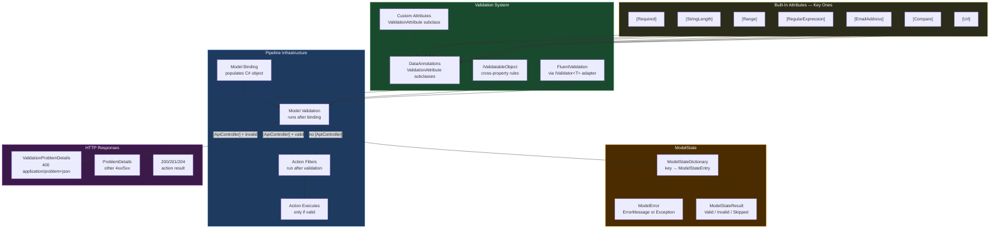
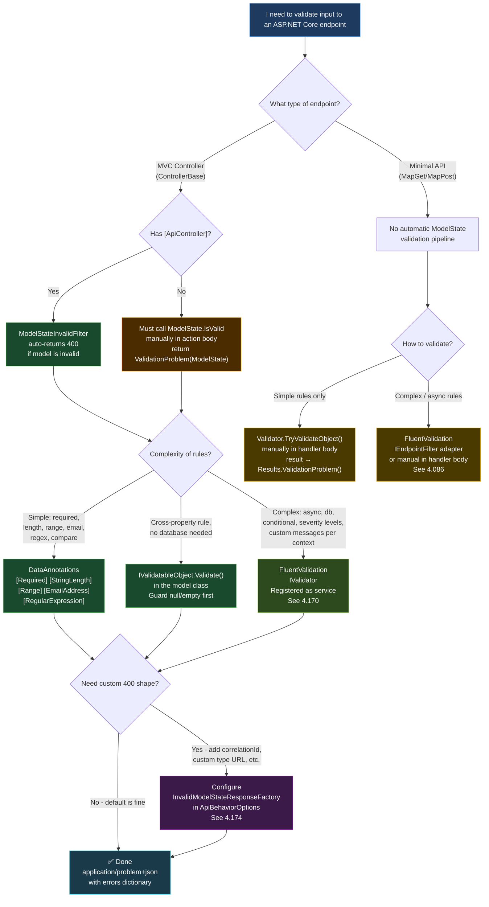

> [!success] Mastery Check
> - [ ] **Studied Well**
> - [ ] **Can explain the concept without notes**
> - [ ] **Can answer interview questions confidently**
> - [ ] **Can implement it in a real project**


# 4.102 — Model Validation: DataAnnotations and ModelState

## PART 0 — Navigation & Context

### Where This Topic Lives

```
ASP.NET Core Mastery
│
├── D. Dependency Injection (4.034–4.048)
├── E. Middleware Pipeline (4.049–4.063)
├── F. Routing System (4.064–4.077)
│
├── H. MVC & Controllers (4.098–4.122)
│   ├── 4.098  ControllerBase vs Controller
│   ├── 4.099  Action Results: IActionResult, ActionResult<T>
│   ├── 4.100  Model Binding: Sources, Order, and the Binding Algorithm
│   ├── 4.101  ApiController Attribute: Automatic 400, Binding Source Inference
│   ├── ► 4.102  Model Validation: DataAnnotations and ModelState  ◄ YOU ARE HERE
│   ├── 4.103  Content Type Negotiation
│   ├── 4.107  Output Formatters
│   └── 4.110  MVC Filter Pipeline
│
├── L. Validation (4.167–4.176)
│   ├── 4.167  DataAnnotations Validation (deep attributes reference)
│   ├── 4.168  ModelState: Checking Validity, Reading Errors
│   ├── 4.170  FluentValidation Integration
│   └── 4.174  Global Validation: SuppressModelStateInvalidFilter
│
└── M. Error Handling (4.177–4.185)
    └── 4.179  Problem Details (RFC 7807): IProblemDetailsService
```

### What You Need Before This

- **[[4.100 — Model Binding]]** — validation runs _after_ model binding completes; understanding what gets bound is prerequisite to understanding what gets validated
- **[[4.101 — ApiController Attribute]]** — `[ApiController]` is the switch that makes validation automatic; without it, you must check `ModelState.IsValid` manually
- **[[4.099 — Action Results]]** — the 400 `ValidationProblemDetails` response that validation produces is an `IActionResult`; knowing the result type hierarchy matters

### What This Unlocks After

- **[[4.168 — ModelState: Checking Validity and Custom Responses]]** — the mechanics of reading `ModelState` errors and customising the `ValidationProblemDetails` shape
- **[[4.170 — FluentValidation Integration]]** — when DataAnnotations fall short (async rules, database round-trips, complex conditionals), FluentValidation plugs into the same `ModelState` pipeline
- **[[4.174 — Global Validation Response Factory]]** — replacing the default 400 response format across the entire application without touching every controller

### Why This Topic Matters at Scale

Every byte that reaches your API endpoint has passed through validation logic — or hasn't, and that's the production incident. Validation is the contract enforcement layer between HTTP wire format and your domain model. At 50k req/day, even a 2% invalid payload rate means 1,000 requests that could corrupt data, trigger unhandled exceptions, or consume downstream resources. Understanding exactly when `ModelState` is populated, what short-circuits execution, and how the 400 response body is structured is the difference between an API that communicates failures clearly and one that silently drops bad data into a database.

---

## PART 1 — The Core Mental Model

### The Fundamental Rule

> **ASP.NET Core's model validation runs immediately after model binding completes, populates `ModelState` with every constraint violation it finds, and — when `[ApiController]` is present — automatically short-circuits execution with a 400 `ValidationProblemDetails` response before your action method body ever executes.**

### The Plain-Language Analogy

Think of `ModelState` as a customs inspector at an airport gate. Model binding is the baggage carousel that deposits the passenger's luggage (the bound C# object). Before the passenger is allowed onto the plane (your action), the inspector opens every bag and checks it against a manifest of rules (DataAnnotations). If anything violates the rules, the passenger is turned away at the gate with a written report of exactly what was wrong — they never board. The gate agent (`[ApiController]`) can be instructed to do this automatically so you don't have to personally stop every passenger and ask "did customs clear you?" The report given to the rejected passenger is `ValidationProblemDetails`, formatted as `application/problem+json` on the wire. The analogy holds for concurrent requests: each passenger (each HTTP request) has their own inspector and their own customs report — `ModelState` is scoped to the current `HttpContext`, never shared.

### The Taxonomy Diagram



---

## PART 2 — Deep Mechanics

### 2.1 — Pipeline Position: Where Validation Sits

```
HTTP Request arrives at Kestrel
│
▼
──► UseExceptionHandler
──► UseHttpsRedirection
──► UseStaticFiles
──► UseRouting          ← resolves endpoint; reads [ApiController] attribute
──► UseCors
──► UseAuthentication
──► UseAuthorization
──► [Action Filters: OnActionExecuting — BEFORE model binding in resource filters]
──► Model Binding       ← deserialises JSON body / route / query into C# object
──► Model Validation    ← runs DataAnnotations on the bound object ← YOU ARE HERE
      │
      ├─ ModelState.IsValid == false AND [ApiController] present
      │     └─► SHORT-CIRCUIT: 400 ValidationProblemDetails returned
      │         Action method body NEVER executes
      │
      └─ ModelState.IsValid == true (or no [ApiController])
            └─► Action Filters: OnActionExecuting (sees valid ModelState)
                └─► Action Method Body executes
                    └─► Action Filters: OnActionExecuted
                        └─► Result Filters
                            └─► Response written
```

**Cost:** `~2 allocations per validated property` (attribute instance is cached; validation context is per-call). For a model with 10 properties and 3 attributes each, expect ~60 allocations if all attributes run. Attributes are cached by the framework — the `ValidationAttributeStore` caches metadata per type, not per request.

> [!IMPORTANT] Model validation runs on the **bound model**, not the raw JSON. If binding fails (e.g., a string is sent for an `int` field), the property gets a binding error in `ModelState` — `[Required]` and other attributes may never run for that property because the framework marks it as `ModelError` with an exception from binding, not a validation failure.

### 2.2 — The HTTP Wire Format: What a Validation Failure Looks Like

When `[ApiController]` is present and `ModelState.IsValid` is false, the framework writes this before your action method executes:

```http
// HTTP request (approximate):
// POST /api/orders HTTP/1.1
// Content-Type: application/json
// Authorization: Bearer eyJhbGci...
//
// {
//   "customerId": "",
//   "quantity": -5,
//   "productSku": "not-an-email"
// }

// HTTP response (approximate):
// HTTP/1.1 400 Bad Request
// Content-Type: application/problem+json; charset=utf-8
// Cache-Control: no-cache
//
// {
//   "type": "https://tools.ietf.org/html/rfc7807",
//   "title": "One or more validation errors occurred.",
//   "status": 400,
//   "errors": {
//     "CustomerId": ["The CustomerId field is required."],
//     "Quantity": ["The field Quantity must be between 1 and 10000."],
//     "ProductSku": ["The ProductSku field is not a valid e-mail address."]
//   },
//   "traceId": "00-4bf92f3577b34da6a3ce929d0e0e4736-00f067aa0ba902b7-01"
// }
```

The `errors` dictionary key is the **property name** (PascalCase by default — the JSON naming policy for the response does NOT apply to `ModelState` keys in `ValidationProblemDetails.Errors`). This is a common gotcha when clients use camelCase JSON.

**Framework source path:** `DefaultApiProblemDetailsWriter` → `ValidationProblemDetails` → populated by `ModelStateInvalidFilter.OnActionExecuting()` (class `Microsoft.AspNetCore.Mvc.Infrastructure.ModelStateInvalidFilter`).

### 2.3 — ASP.NET Core Internally: What Happens Step by Step

```
// ASP.NET Core internally (approximate):
// Class: ObjectModelValidator (DefaultObjectModelValidator)
// Called from: ControllerActionInvoker.InvokeInnerFilterAsync()
//              → ValidateArguments()
//              → ObjectModelValidator.Validate(actionContext, validationState, prefix, model)

// Step 1: Walk the model object graph via ModelMetadata
//         (uses IModelMetadataProvider, cached per CLR type)
foreach (var property in modelMetadata.Properties)
{
    // Step 2: For each property, retrieve cached ValidationAttribute[] via
    //         ValidationAttributeStore (singleton, cached per type)
    var validationAttributes = property.ValidatorMetadata
        .OfType<ValidationAttribute>();

    // Step 3: Run each attribute
    foreach (var attribute in validationAttributes)
    {
        var validationContext = new ValidationContext(model, serviceProvider, null)
        {
            MemberName = property.PropertyName
        };

        var result = attribute.GetValidationResult(propertyValue, validationContext);

        if (result != ValidationResult.Success)
        {
            // Step 4: Add to ModelState
            modelState.AddModelError(
                key: prefix + property.PropertyName,
                errorMessage: result.ErrorMessage);
        }
    }
}

// Step 5: Run IValidatableObject.Validate() if model implements it
//         (after all attribute-level validation, always runs)
if (model is IValidatableObject validatable)
{
    var errors = validatable.Validate(validationContext);
    foreach (var error in errors)
        foreach (var memberName in error.MemberNames)
            modelState.AddModelError(memberName, error.ErrorMessage);
}

// Step 6: [ApiController] → ModelStateInvalidFilter.OnActionExecuting()
if (!actionContext.ModelState.IsValid && hasApiControllerAttribute)
{
    actionContext.Result = problemDetailsFactory
        .CreateValidationProblemDetails(actionContext.HttpContext, actionContext.ModelState, 400);
    // Action is short-circuited — method body never runs
}
```

**Cost:** Object graph walk is `O(n)` on property count, but model metadata is cached — metadata lookup is `O(1)` after first request. Validation context allocation is `~1 heap object per attribute call`. For deeply nested models, the walker recurses; cycles are detected via `ValidationStateDictionary`.

### 2.4 — The [ApiController] Short-Circuit in Detail

`[ApiController]` is an application model convention that, among other things, registers `ModelStateInvalidFilter` into the filter pipeline for every controller it decorates. This filter runs as an `IAlwaysRunResultFilter` in the **action filter** slot — specifically, its `OnActionExecuting` fires before the action body runs.

```
// Pipeline inside MVC with [ApiController]:
Authorization Filters
  └─► Resource Filters
        └─► Model Binding + Model Validation  ← ModelState populated here
              └─► ModelStateInvalidFilter.OnActionExecuting()
                    ├─ ModelState.IsValid → false → sets context.Result = 400 → EXITS
                    └─ ModelState.IsValid → true  → continues
                          └─► Action Filters (OnActionExecuting)
                                └─► Action Method Body
```

**Without `[ApiController]`:** `ModelStateInvalidFilter` is NOT registered. The action method body executes regardless of validation state. You are responsible for calling `if (!ModelState.IsValid) return BadRequest(ModelState)`.

> [!WARNING] If you call `services.Configure<ApiBehaviorOptions>(o => o.SuppressModelStateInvalidFilter = true)`, you re-enable manual ModelState checking in every action. Do this globally only if you need a custom unified error format — and then provide a replacement (see [[4.174 — Global Validation Response Factory]]).

### 2.5 — Failure Modes: Binding Error vs Validation Error

Two distinct error types can populate `ModelState`. They look similar to clients but behave differently internally:

```
Scenario 1: Binding failure (type mismatch)
  JSON: { "quantity": "banana" }
  C#:   int Quantity
  Result: ModelState["Quantity"].Errors[0].Exception = FormatException
          ModelState["Quantity"].Errors[0].ErrorMessage = "The value 'banana' is not valid for Quantity."
  Validation attributes on Quantity: NOT RUN (model has binding error for that property)

Scenario 2: Validation failure (type matched, constraint violated)
  JSON: { "quantity": -5 }
  C#:   [Range(1, 10000)] int Quantity
  Result: ModelState["Quantity"].Errors[0].ErrorMessage = "The field Quantity must be between 1 and 10000."
  ModelState["Quantity"].RawValue: "-5"

Scenario 3: Required missing
  JSON: {}  (CustomerId property absent)
  C#:   [Required] string CustomerId
  Result: ModelState["CustomerId"].Errors[0].ErrorMessage = "The CustomerId field is required."
  Note: [Required] on a reference type treats null AND empty string differently by default

Scenario 4: Nested model
  JSON: { "address": { "zipCode": "not-five-digits" } }
  C#:   [RegularExpression(@"^\d{5}$")] string ZipCode
  Result: ModelState["address.ZipCode"] (dot-notation key)
```

---

## PART 3 — Production Code Patterns

### Pattern 1: The Baseline Order Command — DataAnnotations with [ApiController]

The foundation — what every order service endpoint looks like before reaching for FluentValidation:

```csharp
// Domain: e-commerce order management service
// This is the correct baseline — [ApiController] handles the 400 automatically

[ApiController]
[Route("api/orders")]
public class OrderController : ControllerBase
{
    private readonly IOrderService _orderService;

    public OrderController(IOrderService orderService)
        => _orderService = orderService;

    [HttpPost]
    [ProducesResponseType(typeof(OrderCreatedResponse), StatusCodes.Status201Created)]
    [ProducesResponseType(typeof(ValidationProblemDetails), StatusCodes.Status400BadRequest)]
    public async Task<IActionResult> CreateOrder(
        [FromBody] CreateOrderRequest request,
        CancellationToken cancellationToken)
    {
        // ✅ No ModelState.IsValid check needed here.
        // [ApiController] + ModelStateInvalidFilter already returned 400
        // if anything in CreateOrderRequest violated its attributes.
        // If execution reaches this line, the model is guaranteed valid.

        var order = await _orderService.CreateAsync(request, cancellationToken);
        return CreatedAtAction(nameof(GetOrder), new { id = order.Id }, order);
    }
}

public class CreateOrderRequest
{
    [Required(ErrorMessage = "Customer ID is required.")]
    // Guid string — must be a valid non-empty GUID string
    [RegularExpression(
        @"^[0-9a-fA-F]{8}-[0-9a-fA-F]{4}-[0-9a-fA-F]{4}-[0-9a-fA-F]{4}-[0-9a-fA-F]{12}$",
        ErrorMessage = "Customer ID must be a valid GUID.")]
    public string CustomerId { get; set; } = string.Empty;

    [Required]
    [MinLength(1, ErrorMessage = "At least one line item is required.")]
    // Validates the collection is present and non-empty;
    // child items are recursively validated by the object validator
    public List<OrderLineRequest> Lines { get; set; } = [];

    [StringLength(500, ErrorMessage = "Notes cannot exceed 500 characters.")]
    public string? Notes { get; set; }
}

public class OrderLineRequest
{
    [Required]
    [StringLength(50, MinimumLength = 3, ErrorMessage = "SKU must be 3-50 characters.")]
    public string ProductSku { get; set; } = string.Empty;

    [Range(1, 10_000, ErrorMessage = "Quantity must be between 1 and 10,000.")]
    public int Quantity { get; set; }

    [Range(0.01, 999_999.99, ErrorMessage = "Unit price must be between $0.01 and $999,999.99.")]
    public decimal UnitPrice { get; set; }
}
```

```http
// HTTP wire format — invalid payload:
// POST /api/orders HTTP/1.1
// Content-Type: application/json
//
// { "customerId": "", "lines": [] }

// HTTP/1.1 400 Bad Request
// Content-Type: application/problem+json; charset=utf-8
//
// {
//   "type": "https://tools.ietf.org/html/rfc7807",
//   "title": "One or more validation errors occurred.",
//   "status": 400,
//   "errors": {
//     "CustomerId": ["Customer ID is required."],
//     "Lines": ["At least one line item is required."]
//   },
//   "traceId": "00-..."
// }
```

### Pattern 2: Cross-Property Validation with IValidatableObject

When a rule spans multiple properties, DataAnnotations attributes can't express it — `IValidatableObject` is the clean solution without reaching for FluentValidation:

```csharp
// Domain: logistics shipment booking — delivery window must be coherent

// ⚠️ WRONG: Using a custom attribute that receives only one property value
// Cannot compare two properties in a single ValidationAttribute.Validate() call
// because the attribute only sees the property it decorates, not siblings.
public class ShipmentRequest
{
    [Required]
    public DateTime PickupFrom { get; set; }

    [Required]
    // ⚠️ WRONG: Cannot reference PickupFrom here — attribute sees only DeliverBy
    [CustomValidator("must be after PickupFrom")]  // doesn't compile as shown; this fails
    public DateTime DeliverBy { get; set; }
}

// ✅ CORRECT: IValidatableObject for cross-property rules
public class ShipmentRequest : IValidatableObject
{
    [Required]
    public DateTime PickupFrom { get; set; }

    [Required]
    public DateTime DeliverBy { get; set; }

    [Range(1, 10_000)]
    public decimal WeightKg { get; set; }

    [Required]
    [StringLength(100)]
    public string DestinationAddress { get; set; } = string.Empty;

    // Called by ASP.NET Core's object validator AFTER all attribute-level validation.
    // If attribute validation already found errors, Validate() still runs.
    // Return ValidationResult.Success or yield error results.
    public IEnumerable<ValidationResult> Validate(ValidationContext validationContext)
    {
        // Cross-property rule: delivery must be after pickup
        if (DeliverBy <= PickupFrom)
        {
            yield return new ValidationResult(
                "Delivery time must be after pickup time.",
                memberNames: [nameof(DeliverBy), nameof(PickupFrom)]); // populates both keys in ModelState
        }

        // Business rule: max 3-day window for standard service
        var window = DeliverBy - PickupFrom;
        if (window.TotalDays > 3)
        {
            yield return new ValidationResult(
                "Standard shipments cannot have a delivery window exceeding 3 days.",
                memberNames: [nameof(DeliverBy)]);
        }
    }
}
```

```http
// HTTP wire format:
// POST /api/shipments HTTP/1.1
// Content-Type: application/json
//
// { "pickupFrom": "2026-06-10T14:00:00Z", "deliverBy": "2026-06-09T10:00:00Z",
//   "weightKg": 50, "destinationAddress": "123 Main St" }

// HTTP/1.1 400 Bad Request
// Content-Type: application/problem+json; charset=utf-8
//
// {
//   "title": "One or more validation errors occurred.",
//   "status": 400,
//   "errors": {
//     "DeliverBy": ["Delivery time must be after pickup time."],
//     "PickupFrom": ["Delivery time must be after pickup time."]
//   }
// }
```

### Pattern 3: Manual ModelState Check — When [ApiController] Is Absent

Legacy codebases or Razor Pages controllers that don't use `[ApiController]` require manual checking:

```csharp
// Domain: payment API — older codebase without [ApiController] on base class

[Route("api/payments")]
// ⚠️ Note: NO [ApiController] attribute — intentional legacy scenario
public class PaymentController : ControllerBase
{
    [HttpPost("initiate")]
    public async Task<IActionResult> InitiatePayment([FromBody] PaymentRequest request)
    {
        // ⚠️ WRONG: Skipping the check entirely
        // var result = await _paymentService.ProcessAsync(request);
        // — request could have null values, negative amounts, invalid card formats

        // ✅ CORRECT: Manual check when [ApiController] is absent
        if (!ModelState.IsValid)
        {
            // Return the same shape that [ApiController] would produce automatically
            return ValidationProblem(ModelState);
            // ValidationProblem() returns ValidationProblemDetails, status 400
            // Equivalent to: return BadRequest(new ValidationProblemDetails(ModelState))
            // But ValidationProblem() uses IProblemDetailsFactory for consistent formatting
        }

        var result = await _paymentService.ProcessAsync(request);
        return Ok(result);
    }
}

public class PaymentRequest
{
    [Required]
    [StringLength(19, MinimumLength = 13)]
    [CreditCard] // Validates Luhn algorithm — not just format
    public string CardNumber { get; set; } = string.Empty;

    [Required]
    [RegularExpression(@"^(0[1-9]|1[0-2])\/\d{2}$", ErrorMessage = "Use MM/YY format.")]
    public string ExpiryDate { get; set; } = string.Empty;

    [Range(0.01, 1_000_000, ErrorMessage = "Amount must be positive and under $1,000,000.")]
    public decimal Amount { get; set; }

    [Required]
    [StringLength(3, MinimumLength = 3, ErrorMessage = "Currency must be a 3-letter ISO code.")]
    public string Currency { get; set; } = string.Empty;
}
```

### Pattern 4: Customising the 400 Response Shape Globally

The default `ValidationProblemDetails` doesn't include a correlation ID or machine-readable error codes. The production fix is global:

```csharp
// Domain: payment API — all services need consistent error envelope with request ID

// In Program.cs
builder.Services.Configure<ApiBehaviorOptions>(options =>
{
    options.InvalidModelStateResponseFactory = context =>
    {
        // Build the standard ValidationProblemDetails first
        var problemDetails = new ValidationProblemDetails(context.ModelState)
        {
            Type = "https://api.payments.example.com/errors/validation",
            Title = "Request validation failed.",
            Status = StatusCodes.Status400BadRequest,
            // Instance is the specific request URI — helps clients correlate
            Instance = context.HttpContext.Request.Path
        };

        // Add the correlation/trace ID so clients can reference it in support tickets
        problemDetails.Extensions["requestId"] =
            context.HttpContext.TraceIdentifier;

        // Add timestamp for log correlation
        problemDetails.Extensions["timestamp"] =
            DateTimeOffset.UtcNow;

        return new BadRequestObjectResult(problemDetails)
        {
            ContentTypes = { "application/problem+json" }
        };
    };
});
```

```http
// HTTP/1.1 400 Bad Request
// Content-Type: application/problem+json; charset=utf-8
//
// {
//   "type": "https://api.payments.example.com/errors/validation",
//   "title": "Request validation failed.",
//   "status": 400,
//   "instance": "/api/payments/initiate",
//   "errors": {
//     "CardNumber": ["The CardNumber field is required."]
//   },
//   "requestId": "0HN8VG2TK1JKS:00000001",
//   "timestamp": "2026-06-08T14:32:10.123Z"
// }
```

### Pattern 5: Validating Nested Collections — The Recursive Walk

ASP.NET Core's object validator walks the entire object graph. Nested models inside collections are validated automatically — but only if the parent collection property itself passes its own validation:

```csharp
// Domain: inventory management — bulk product import

public class BulkImportRequest
{
    [Required]
    [StringLength(100)]
    public string ImportBatchName { get; set; } = string.Empty;

    // ✅ MinLength validates the collection count.
    // [Required] on a List<T> validates the list reference is not null.
    // Each ProductImportItem in the collection is recursively validated.
    [Required]
    [MinLength(1, ErrorMessage = "At least one product must be provided.")]
    [MaxLength(500, ErrorMessage = "Maximum 500 products per import batch.")]
    public List<ProductImportItem> Products { get; set; } = [];
}

public class ProductImportItem
{
    [Required]
    [StringLength(50, MinimumLength = 2)]
    public string Sku { get; set; } = string.Empty;

    [Required]
    [StringLength(200, MinimumLength = 1)]
    public string Name { get; set; } = string.Empty;

    [Range(0, int.MaxValue, ErrorMessage = "Stock quantity cannot be negative.")]
    public int StockQuantity { get; set; }

    [Range(0.00, 999_999.99)]
    public decimal WholesalePrice { get; set; }
}
```

```http
// HTTP wire format — item[1] is invalid:
// POST /api/inventory/import HTTP/1.1
// Content-Type: application/json
//
// {
//   "importBatchName": "June 2026",
//   "products": [
//     { "sku": "WIDGET-01", "name": "Blue Widget", "stockQuantity": 100, "wholesalePrice": 4.99 },
//     { "sku": "", "name": "", "stockQuantity": -1, "wholesalePrice": 5.00 }
//   ]
// }

// HTTP/1.1 400 Bad Request
// Content-Type: application/problem+json; charset=utf-8
//
// {
//   "title": "One or more validation errors occurred.",
//   "status": 400,
//   "errors": {
//     "Products[1].Sku": ["The Sku field is required."],
//     "Products[1].Name": ["The Name field is required."],
//     "Products[1].StockQuantity": ["Stock quantity cannot be negative."]
//   }
// }
// Note: ModelState keys use 0-based index notation: Products[1].PropertyName
```

### Pattern 6: Adding Validation Errors Manually in Action Body

Sometimes business rules can only be checked after hitting the database — the pattern is to add to `ModelState` manually, then return `ValidationProblem()`:

```csharp
// Domain: user registration — unique email check requires a database lookup

[HttpPost("register")]
public async Task<IActionResult> Register(
    [FromBody] RegisterUserRequest request,
    CancellationToken cancellationToken)
{
    // ModelState is already valid here (attributes passed)
    // But we have a business rule that requires a database round-trip

    var emailExists = await _userService
        .EmailExistsAsync(request.Email, cancellationToken);

    if (emailExists)
    {
        // ✅ Add the business rule violation to ModelState manually
        // The key matches the property name so the client gets consistent error location
        ModelState.AddModelError(nameof(request.Email),
            "An account with this email address already exists.");

        // Return the same shape as the automatic 400
        return ValidationProblem(ModelState);
        // HTTP: 400 application/problem+json with "Email": ["An account with..."]
    }

    var user = await _userService.CreateAsync(request, cancellationToken);
    return CreatedAtAction(nameof(GetUser), new { id = user.Id }, user);
}

public class RegisterUserRequest
{
    [Required]
    [EmailAddress]
    [StringLength(254)] // RFC 5321 maximum email length
    public string Email { get; set; } = string.Empty;

    [Required]
    [StringLength(100, MinimumLength = 8)]
    public string Password { get; set; } = string.Empty;

    [Required]
    [Compare(nameof(Password), ErrorMessage = "Passwords do not match.")]
    public string ConfirmPassword { get; set; } = string.Empty;
}
```

### Pattern 7: The Minimal API Equivalent — Manual Validation Without [ApiController]

Minimal API endpoints do not have `[ApiController]` and do not run `ModelStateInvalidFilter`. Validation must be done explicitly (or via FluentValidation middleware):

```csharp
// Domain: order management — Minimal API endpoint with manual validation

app.MapPost("/api/orders", async (
    [FromBody] CreateOrderRequest request,
    IValidator<CreateOrderRequest> validator,  // FluentValidation approach shown at end
    IOrderService orderService,
    CancellationToken cancellationToken) =>
{
    // Option A: Manual DataAnnotations validation in Minimal APIs
    var validationContext = new ValidationContext(request);
    var validationResults = new List<ValidationResult>();

    bool isValid = Validator.TryValidateObject(
        request,
        validationContext,
        validationResults,
        validateAllProperties: true); // must be true to run all attributes

    if (!isValid)
    {
        // Build ValidationProblemDetails manually — no built-in shortcut in Minimal APIs
        var errors = validationResults
            .SelectMany(r => r.MemberNames.Select(m => (m, r.ErrorMessage ?? "Invalid.")))
            .GroupBy(x => x.m)
            .ToDictionary(g => g.Key, g => g.Select(x => x.Item2).ToArray());

        return Results.ValidationProblem(errors);
        // HTTP: 400 application/problem+json with structured errors
    }

    var order = await orderService.CreateAsync(request, cancellationToken);
    return Results.CreatedAtRoute("GetOrder", new { id = order.Id }, order);
})
.WithName("CreateOrder")
.WithOpenApi();
```

---

## PART 4 — Gotchas & Anti-Patterns

### Gotcha 1: [Required] on Non-Nullable Value Types Is Meaningless

Experienced engineers often add `[Required]` to `int`, `DateTime`, `decimal`, and other value types believing it prevents missing values — it doesn't, and here's why.

```csharp
// ⚠️ WRONG: [Required] on a non-nullable int does nothing
public class OrderLineRequest
{
    [Required]
    public int Quantity { get; set; }  // int can never be null; [Required] never fires
    // If JSON omits "Quantity" entirely, the property gets its default value: 0
    // ModelState.IsValid remains true even though Quantity was not in the request
}

// HTTP consequence (wrong path):
// POST /api/orders { "lines": [{ "sku": "WIDGET" }] }
// → HTTP 201 Created — order created with Quantity = 0
// → Database has a line item with quantity zero — silent data corruption
```

```csharp
// ✅ CORRECT: Use nullable int + [Required] OR use [Range] with minimum 1
public class OrderLineRequest
{
    // Option A: Nullable + [Required] — [Required] on nullable types DOES fire on null
    [Required]
    public int? Quantity { get; set; }

    // Option B: Just use [Range] — also prevents zero and negative
    [Range(1, 10_000, ErrorMessage = "Quantity must be 1-10,000.")]
    public int Quantity { get; set; }
}

// HTTP consequence (correct path):
// POST /api/orders { "lines": [{ "sku": "WIDGET" }] }
// Option A → HTTP 400 — "The Quantity field is required."
// Option B → HTTP 400 — "Quantity must be 1-10,000." (0 fails Range)
```

// WHY: `[Required]` uses `RequiredAttribute.IsValid(value)` which checks for `null`. A non-nullable `int` is never `null` — it defaults to `0` when the JSON key is absent, so `[Required]` always sees a non-null value and succeeds. Nullable types (`int?`) default to `null` when absent, which `[Required]` catches correctly.

---

### Gotcha 2: ModelState Keys Are PascalCase, but JSON Responses May Be camelCase

The `ValidationProblemDetails.Errors` dictionary uses **ModelState keys** (PascalCase by default), not the serialized JSON property names. This breaks client-side error handling when clients expect camelCase.

```csharp
// ⚠️ WRONG: Assuming the errors dictionary keys match the client's JSON casing
// Client sends: { "customerId": "...", "quantity": -1 }
// Client expects error key: "quantity"

// HTTP consequence (wrong path):
// {
//   "errors": {
//     "Quantity": ["..."]   ← PascalCase, not "quantity"
//   }
// }
// JavaScript client: errors["quantity"] → undefined (missed the error)
```

```csharp
// ✅ CORRECT: Configure camelCase model state key transformation in options
builder.Services.AddControllers()
    .ConfigureApiBehaviorOptions(options =>
    {
        var builtInFactory = options.InvalidModelStateResponseFactory;
        options.InvalidModelStateResponseFactory = context =>
        {
            // Transform keys to camelCase to match JSON serialization convention
            var camelCaseErrors = context.ModelState
                .ToDictionary(
                    kvp => char.ToLowerInvariant(kvp.Key[0]) + kvp.Key[1..],
                    kvp => kvp.Value!.Errors
                        .Select(e => e.ErrorMessage)
                        .ToArray());

            return new BadRequestObjectResult(new ValidationProblemDetails(
                // Re-build with camelCase keys
                context.ModelState.Keys
                    .Select(k => new KeyValuePair<string, string[]>(
                        char.ToLowerInvariant(k[0]) + k[1..],
                        context.ModelState[k]!.Errors.Select(e => e.ErrorMessage).ToArray()))
                    .ToDictionary(x => x.Key, x => x.Value)));
        };
    });

// HTTP consequence (correct path):
// { "errors": { "quantity": ["..."] } }  ← camelCase matches client expectation
```

// WHY: `ModelState` is populated by the model binder using the C# property name (PascalCase) as the key. The JSON naming policy (`JsonSerializerOptions.PropertyNamingPolicy`) applies to the _serialization_ of response bodies — but `ValidationProblemDetails.Errors` is a `Dictionary<string, string[]>` whose keys are written as-is, bypassing the naming policy. Microsoft tracks this as a known inconsistency.

---

### Gotcha 3: IValidatableObject.Validate() Always Runs, Even When Attribute Validation Failed

Engineers often add short-circuit logic to `IValidatableObject.Validate()` assuming it won't run if other errors exist. It always runs, which can cause confusing cascading errors.

```csharp
// ⚠️ WRONG: Validate() accesses a property that may not be initialised
// because the [Required] attribute hasn't prevented null
public class ShipmentRequest : IValidatableObject
{
    [Required]
    public string OriginCity { get; set; } = string.Empty;

    [Required]
    public string DestinationCity { get; set; } = string.Empty;

    public IEnumerable<ValidationResult> Validate(ValidationContext ctx)
    {
        // ⚠️ If DestinationCity failed [Required], it is still "" here (empty string
        // from default value) — but the intent was null. This comparison is fragile.
        if (OriginCity == DestinationCity)
            yield return new ValidationResult("Origin and destination must differ.",
                [nameof(OriginCity), nameof(DestinationCity)]);
    }
}

// HTTP consequence (wrong path):
// POST /api/shipments { "originCity": "" }  ← both cities missing
// Response includes BOTH:
//   "OriginCity": ["The OriginCity field is required."]
//   "DestinationCity": ["The DestinationCity field is required."]
//   "OriginCity": ["Origin and destination must differ."]  ← spurious error
```

```csharp
// ✅ CORRECT: Guard against empty/null in Validate() before executing cross-field logic
public IEnumerable<ValidationResult> Validate(ValidationContext ctx)
{
    // Guard: only run cross-property logic if the individual values are present
    if (!string.IsNullOrEmpty(OriginCity) && !string.IsNullOrEmpty(DestinationCity))
    {
        if (OriginCity.Equals(DestinationCity, StringComparison.OrdinalIgnoreCase))
        {
            yield return new ValidationResult(
                "Origin and destination must differ.",
                [nameof(OriginCity), nameof(DestinationCity)]);
        }
    }
    // If either is empty, [Required] already added an error — no need to add more
}
```

// WHY: The ASP.NET Core object validator does not stop walking after the first failure. It collects all errors, then calls `IValidatableObject.Validate()` regardless. Always guard your cross-property logic with null/empty checks to prevent spurious secondary errors that confuse clients.

---

### Gotcha 4: Validation Skips Properties with Binding Errors

If model binding fails for a property (type mismatch), DataAnnotations on that property do NOT run. Engineers write unit tests with a valid model and assume all attributes were checked — but in production, a type-coercion failure silently skips subsequent attribute validation.

```csharp
// ⚠️ WRONG mental model: assuming [Range] ran when the binding failed
public class PricingRequest
{
    // In production: if client sends "amount": "free", binding fails with FormatException
    // The [Range] attribute NEVER runs for this property in that request
    [Range(0.01, 999_999.99, ErrorMessage = "Amount must be positive.")]
    public decimal Amount { get; set; }
}

// HTTP consequence (wrong path):
// POST /api/pricing { "amount": "free" }
// Response: 400 with ModelState["Amount"].Errors[0].ErrorMessage =
//   "The value 'free' is not valid for Amount."
// — This is a BINDING error, not a VALIDATION error
// — The [Range] error message DOES NOT appear
// — If client retries with { "amount": 0 }, NOW [Range] fires and shows the Range error
// — Two-step error discovery frustrates API consumers
```

```csharp
// ✅ CORRECT: Accept strings and validate/parse manually for complex types
//   OR document the two-phase error discovery clearly in API contracts.
// For numeric types, the binding error message is usually sufficient.
// The better fix is a custom model binder or accepting string with [RegularExpression]:

public class PricingRequest
{
    // Accept string → parse manually → gives a single clean error message
    [Required]
    [RegularExpression(@"^\d+(\.\d{1,2})?$", ErrorMessage = "Amount must be a positive number (e.g., 10.99).")]
    public string AmountRaw { get; set; } = string.Empty;

    // Parsed by the action method only after validation passes
    [BindNever] // never bound from request — computed property
    public decimal Amount => decimal.TryParse(AmountRaw, out var v) ? v : 0;
}
```

// WHY: Model binding and model validation are sequential, separate phases. The `DefaultObjectModelValidator` marks a property with a binding error as `ModelValidationState.Invalid` and skips attribute-level validation for it to avoid confusing double-errors. This is correct behaviour — but it means attribute error messages may never appear for type-mismatched fields.

---

### Gotcha 5: [StringLength] Does NOT Prevent SQL Injection or XSS — It Is Length Only

Engineers sometimes believe DataAnnotations attributes enforce content safety as well as format. `[StringLength]`, `[EmailAddress]`, and `[Url]` constrain structure, not malicious content.

```csharp
// ⚠️ WRONG: Believing [EmailAddress] prevents XSS in email fields
public class ContactRequest
{
    // [EmailAddress] validates structure (x@y.z) but does NOT sanitise HTML.
    // This passes validation: "<script>alert(1)</script>@evil.com"
    // — technically a syntactically valid email by the attribute's regex
    [Required]
    [EmailAddress]
    [StringLength(254)]
    public string Email { get; set; } = string.Empty;
}

// HTTP consequence (wrong path):
// POST /api/contact { "email": "<script>alert(1)</script>@evil.com" }
// → HTTP 201 — accepted and stored
// → If rendered in an admin UI without encoding: XSS attack succeeds
```

```csharp
// ✅ CORRECT: DataAnnotations validate shape; encoding/sanitisation is a separate concern
// Enforce at the rendering layer (HtmlEncoder) AND optionally at input

[Required]
[EmailAddress]
[StringLength(254)]
// For any user-supplied string stored and later rendered in HTML, sanitise on output
// using HtmlEncoder.Default.Encode(email) in Razor templates.
// For fields that must never contain HTML, add a custom attribute:
[NoHtml(ErrorMessage = "Email must not contain HTML.")]
public string Email { get; set; } = string.Empty;

// Custom attribute — validates no HTML angle brackets are present
[AttributeUsage(AttributeTargets.Property)]
public class NoHtmlAttribute : ValidationAttribute
{
    public override bool IsValid(object? value)
    {
        if (value is not string s) return true; // let [Required] handle null
        return !s.Contains('<') && !s.Contains('>');
    }
}
```

// WHY: ASP.NET Core's model validation is a _contract enforcement_ layer, not a _security sanitisation_ layer. DataAnnotations check that data conforms to expected shape and range. Security (XSS prevention, SQL injection prevention) is the responsibility of output encoding (Razor HtmlEncoder), parameterised queries (EF Core), and explicit sanitisation libraries. Conflating the two leads to a false sense of security. See [[4.173 — Input Sanitization]] and [[4.216 — SQL Injection in ASP.NET Core]].

---

## PART 5 — Performance Implications

### 5.1 — Request Pipeline Characteristics Table

|Scenario|Pipeline Depth|Allocations Per Request|Approx Latency Impact|Recommendation|
|---|---|---|---|---|
|Simple flat model, 5 properties, all valid|Model binding → validation → action|~15 (attribute contexts + ModelState entries)|<0.1ms|Baseline; no action needed|
|Simple flat model, 3 properties invalid, `[ApiController]`|Binding → validation → short-circuit|~20 + ValidationProblemDetails|~0.2ms|Acceptable for error path|
|Nested model, 3 levels deep, 20 total properties|Full object graph walk|~60 (recursive ValidationContext per property)|~0.3ms|Fine at normal traffic|
|Collection with 500 items, each with 5 attributes|Full recursive walk on all 500 items|~2,500+|~5ms|Consider `[MaxLength]` to cap input size _before_ validation begins|
|`[RegularExpression]` with a complex backtracking pattern|Per-property regex execution|Regex engine allocation; catastrophic with evil input|Potentially seconds|Use `[GeneratedRegex]` with `RegexOptions.None`; set timeout on Regex|
|`IValidatableObject` with database round-trip in `Validate()`|Synchronous database call from validation context|1 DB connection; blocks thread|10-100ms+|**Never.** Database validation belongs in the service layer after binding. Use FluentValidation with `MustAsync` instead|
|FluentValidation adapter replacing DataAnnotations|Same binding pipeline; validator invoked via `IValidator<T>`|Validator object graph; slightly higher than attributes|~0.5ms overhead vs attributes|Acceptable; prefer for complex rules|
|Validation with `ModelState.AddModelError()` in action body|Binding → validation → action → manual add → ValidationProblem()|+1 allocation per manual error|negligible|Fine; prefer for business rule violations|
|`Validator.TryValidateObject()` manually in Minimal API|Called explicitly; same attribute execution|Same as framework path|~same|Acceptable; watch for `validateAllProperties: false` bug|
|Deeply recursive model with circular references (not using `[ValidateNever]`)|Object graph walker may follow reference cycles|Stack overflow or infinite loop|Application crash|Use `[ValidateNever]` on navigation properties; break cycles at validation boundary|

### 5.2 — BenchmarkDotNet Scaffold

```csharp
// BenchmarkDotNet scaffold: Model Validation paths — Naive vs Optimised vs Optimal
// Run: dotnet run -c Release --project ValidationBenchmarks

using BenchmarkDotNet.Attributes;
using BenchmarkDotNet.Running;
using System.ComponentModel.DataAnnotations;

BenchmarkRunner.Run<ModelValidationBenchmarks>();

[MemoryDiagnoser]
[SimpleJob]
public class ModelValidationBenchmarks
{
    private ValidOrderRequest _validRequest = null!;
    private InvalidOrderRequest _invalidRequest = null!;
    private LargeCollectionRequest _largeRequest = null!;

    [GlobalSetup]
    public void Setup()
    {
        _validRequest = new ValidOrderRequest
        {
            CustomerId = "3fa85f64-5717-4562-b3fc-2c963f66afa6",
            Quantity = 10,
            ProductSku = "WIDGET-01",
            Email = "customer@example.com"
        };

        _invalidRequest = new ValidOrderRequest
        {
            CustomerId = "",
            Quantity = -5,
            ProductSku = "",
            Email = "not-an-email"
        } as dynamic; // simplified for benchmark clarity

        _largeRequest = new LargeCollectionRequest
        {
            Items = Enumerable.Range(0, 500)
                .Select(i => new LineItem { Sku = $"SKU-{i:D5}", Quantity = i + 1 })
                .ToList()
        };
    }

    // NAIVE: Calling Validator.TryValidateObject with validateAllProperties=false
    // (common mistake — misses collection items and non-required properties)
    [Benchmark(Baseline = true)]
    public bool Naive_IncompleteValidation()
    {
        var ctx = new ValidationContext(_validRequest);
        var results = new List<ValidationResult>();
        return Validator.TryValidateObject(_validRequest, ctx, results, validateAllProperties: false);
    }

    // OPTIMISED: Correct full validation
    [Benchmark]
    public bool Optimised_FullValidation()
    {
        var ctx = new ValidationContext(_validRequest);
        var results = new List<ValidationResult>();
        return Validator.TryValidateObject(_validRequest, ctx, results, validateAllProperties: true);
    }

    // OPTIMAL: Framework path via ObjectModelValidator in integration test harness
    // (framework-level validation is faster than manual Validator.TryValidateObject
    //  because it uses cached metadata and pre-compiled accessors)
    [Benchmark]
    public bool Optimal_LargeCollection()
    {
        var ctx = new ValidationContext(_largeRequest);
        var results = new List<ValidationResult>();
        return Validator.TryValidateObject(_largeRequest, ctx, results, validateAllProperties: true);
    }
}

public class ValidOrderRequest
{
    [Required] [RegularExpression(@"^[0-9a-fA-F-]{36}$")] public string CustomerId { get; set; } = "";
    [Range(1, 10_000)] public int Quantity { get; set; }
    [Required] [StringLength(50, MinimumLength = 3)] public string ProductSku { get; set; } = "";
    [EmailAddress] public string Email { get; set; } = "";
}

public class LargeCollectionRequest
{
    [Required] [MaxLength(500)] public List<LineItem> Items { get; set; } = [];
}

public class LineItem
{
    [Required] [StringLength(20, MinimumLength = 3)] public string Sku { get; set; } = "";
    [Range(1, 9999)] public int Quantity { get; set; }
}

// Expected output (approximate, .NET 8, x64, Release):
// | Method                        | Mean      | Allocated |
// |-------------------------------|-----------|-----------|
// | Naive_IncompleteValidation    |  1.2 µs   |   1.8 KB  |
// | Optimised_FullValidation      |  3.1 µs   |   3.2 KB  |
// | Optimal_LargeCollection (500) | 680.0 µs  | 420.0 KB  |
//
// Key insight: 500-item collection validation allocates ~420KB per request.
// Use [MaxLength] to enforce a cap on collection size BEFORE validation walks it.
```

> [!TIP] For real HTTP profiling, use `dotnet-counters monitor --process-id <pid> Microsoft.AspNetCore.Hosting` to see `requests-per-second` and `current-requests` alongside validation throughput. Use `dotnet-trace` with `--providers Microsoft-AspNetCore-Http-Connections` for request lifecycle traces. BenchmarkDotNet measures the validator in isolation — actual middleware overhead adds ~5-15µs per request.

### 5.3 — When to Care / When to Ignore

**When this costs you:**

- **Large collection payloads:** A request with 1,000 items, each with 10 attributes, triggers ~10,000 attribute evaluations per request. At 1,000 req/s, that's 10 billion attribute evaluations per second. Use `[MaxLength]` to enforce an input cap and return 400 before the full walk.
- **Complex `IValidatableObject` with database calls:** Synchronous database access inside `Validate()` blocks the thread pool. At any meaningful concurrency, this collapses throughput. Move to FluentValidation with `MustAsync`.
- **Regex-heavy validation at high throughput:** `[RegularExpression]` without `[GeneratedRegex]` allocates a `Regex` instance on first use and compiles it lazily. Use `[GeneratedRegex]` on a static partial method and reference it from a custom attribute to get compile-time regex with zero runtime allocation.
- **Deep object graphs with circular references:** Without `[ValidateNever]` on navigation properties, EF Core navigation objects can cause the validator to attempt infinite recursion. Always mark navigation properties with `[ValidateNever]` on DTOs that are hydrated from an ORM.

**When this doesn't matter:**

- **Admin endpoints with low traffic:** `/api/admin/config`, batch import endpoints that run once a day — DataAnnotations overhead is irrelevant at <10 req/min.
- **Internal service-to-service calls:** If the caller is your own service and you control both ends, the payload is already valid by construction. Heavy validation on an internal endpoint wastes CPU.
- **Simple flat models with 3-5 attributes and valid payloads:** The happy path validation of a flat model with all-valid data costs microseconds. Optimising this is premature.

---

## PART 6 — Interview Arsenal

### A. The Question Bank

---

**Question 1:** "Walk me through what happens when a client sends an invalid JSON payload to a controller with `[ApiController]`."

**Average Answer:** "The model validation runs, finds errors, and returns a 400 response with the validation errors."

**Why That's Insufficient:** It doesn't explain the pipeline sequence, which middleware or filter produces the 400, what the response body format is, or what short-circuits the action.

> **Great Answer:** "After routing matches the request to the endpoint, model binding runs first — it deserialises the JSON body into the C# parameter type. Then ASP.NET Core's `DefaultObjectModelValidator` walks the model's properties, executing each `ValidationAttribute` against the bound values and populating `ModelStateDictionary` with every error it finds. The `[ApiController]` attribute registers a filter called `ModelStateInvalidFilter` which runs in the action filter slot, before the action method body. If `ModelState.IsValid` is false, this filter sets `context.Result` to a `400 BadRequest` with a `ValidationProblemDetails` body — `application/problem+json` with an `errors` dictionary keyed by property name. The action method never executes. Without `[ApiController]`, this filter isn't registered, and my action body runs regardless — I'd have to check `ModelState.IsValid` manually and call `return ValidationProblem(ModelState)`. In production I always use `InvalidModelStateResponseFactory` to customise the 400 shape to include our correlation ID and internal error codes."

---

**Question 2:** "What's the difference between a binding error and a validation error in `ModelState`?"

**Average Answer:** "Binding errors happen when the type is wrong, validation errors happen when the value breaks a rule."

**Why That's Insufficient:** It doesn't explain the consequence — that attribute validation is skipped for properties with binding errors, which affects what error messages the client sees and how API consumers must handle responses.

> **Great Answer:** "These are two distinct error types in `ModelState.Errors`, and they have different implications. A binding error means the value in the request couldn't be coerced into the C# type — for example, sending the string 'banana' for an `int` property generates a `ModelError` with an `Exception` of type `FormatException`. Crucially, ASP.NET Core skips attribute validation for that property to avoid generating double errors. So if I have `[Range(1, 100)]` on that `int`, the Range error message will never appear for that invalid payload — only the binding error message does. A validation error means binding succeeded but the value violates a constraint — the type matched, but `[Range(1, 100)]` found a value of 200. In practice this matters when designing API contracts: if clients can't distinguish whether to fix the type or the value, they might loop through multiple round-trips fixing errors one at a time. I document this explicitly in the OpenAPI schema and accept strings with regex constraints for fields where the distinction would be confusing."

---

**Question 3:** "How do you add validation rules that require a database lookup — like checking for a unique email?"

**Average Answer:** "I check the database in the action method and return a 400 if it's not unique."

**Why That's Insufficient:** It doesn't address the tension between where validation logically belongs, how to maintain consistent response format, and why `IValidatableObject` is wrong for this case.

> **Great Answer:** "There are three options, and which I choose depends on the team's consistency requirements. The simplest is adding the check directly in the action body — after `[ApiController]` validates the structural constraints, I query the database, and if the email exists, I call `ModelState.AddModelError(nameof(request.Email), 'already registered')` and return `ValidationProblem(ModelState)`. This gives the client the same `application/problem+json` shape as the automatic 400, with the error key matching the property name. The second option is FluentValidation with `MustAsync` — the validator gets an `IUserRepository` injected and performs the check asynchronously, keeping the rule collocated with the model. The third option — and one I explicitly avoid — is putting the database call in `IValidatableObject.Validate()`, which is synchronous, runs on the current thread without async support, and can block the thread pool at any meaningful concurrency. The choice between option one and two is mostly whether the team has standardised on FluentValidation across all endpoints."

---

**Question 4:** "What does `[Required]` do on a non-nullable `int` property?"

**Average Answer:** "It makes the field required."

**Why That's Insufficient:** This is the most common misconception — most candidates don't know it's effectively a no-op on non-nullable value types, leading to silent data corruption bugs.

> **Great Answer:** "Nothing useful. `[Required]` checks whether the value is `null`. A non-nullable `int` can never be null — if the JSON omits the field, the model binder sets it to its default value of `0`, and `[Required]` sees `0` (non-null) and succeeds. The field was logically missing from the request, but validation passes. This is one of the most common silent data corruption paths I've seen — orders created with quantity zero, payments with zero amount. The correct fix depends on intent: if you want 'the field must be present', use `int?` with `[Required]`, which fires when the nullable has no value. If you want 'the value must be in a meaningful range', use `[Range(1, 10000)]`, which also catches zero. In .NET 8, the `[Required]` behaviour changed slightly with `RequiredMember` C# 11 support — but the DataAnnotations `[Required]` on value types is still effectively a no-op without nullable."

---

### B. Trick Questions

**Trick 1:** "Does model validation run if model binding fails completely — for example, if the `Content-Type` header is wrong and the body can't be read?"

**The Trap:** Candidates assume validation always runs after binding.

**Correct Answer:** If binding fails at the formatter level (e.g., the body can't be read because `Content-Type: text/plain` is sent to an endpoint expecting `application/json`), the action parameter may receive its default value (null for reference types) rather than a binding error in `ModelState`. Depending on the binding source (`[FromBody]`), ASP.NET Core may add a binding error for the entire parameter rather than individual properties, and the validator may produce a top-level `model` key error. With `[ApiController]`, a 400 is still returned — but the `errors` dictionary structure may be `{ "": ["A non-empty request body is required."] }` rather than property-level errors. HTTP consequence: client gets 400 but the `errors` structure is unexpected — `""` key, not a property name.

---

**Trick 2:** "If I have `[ApiController]` and manually return `BadRequest()` from my action, does ModelState validation still happen?"

**The Trap:** Candidates think `[ApiController]` intercepts all 400 responses.

**Correct Answer:** Yes, `ModelStateInvalidFilter` still runs _before_ your action body. If `ModelState` is invalid, you never reach your `return BadRequest()` line — the filter short-circuits first. If `ModelState` is valid but you choose to return `BadRequest()` from your action body for a business reason, that works fine — `[ApiController]` only intercepts when `ModelState.IsValid == false`. HTTP consequence: the filter and your manual `BadRequest()` are never both in the same response for the same request.

---

**Trick 3:** "Can you validate a query string parameter with DataAnnotations on a controller action?"

**The Trap:** Candidates assume DataAnnotations only works on model classes, not on action parameters directly.

**Correct Answer:** Yes. Parameters on action methods decorated with validation attributes are validated by the framework when the parameter itself is a simple type. For example: `public IActionResult Get([FromQuery][Range(1, 100)] int page)` — the `[Range]` attribute is evaluated. However, this only works for parameters bound from route/query/header; `[FromBody]` complex types are validated through the object graph walker. The ModelState key for a parameter named `page` will be `"page"` (lowercase — the parameter name). HTTP consequence: `400 { "errors": { "page": ["The field page must be between 1 and 100."] } }`.

---

**Trick 4:** "What happens if both `[Required]` and `[StringLength(10)]` fail for the same property? Does the client get one error or two?"

**The Trap:** Candidates assume the first failing attribute stops validation.

**Correct Answer:** The client gets **both** errors. ASP.NET Core's validator does not short-circuit on the first failure — it collects all attribute errors for all properties. The `errors` array for that property will have two entries: `["The field is required.", "The field must be between 1 and 10 characters."]`. This is intentional — clients should be able to see all problems in a single round-trip rather than fixing one error at a time. HTTP consequence: `400 { "errors": { "ProductSku": ["...", "..."] } }`.

---

### C. Red Flags to Avoid

1. **"I just check `if (ModelState.IsValid)` at the top of every action"** — This is correct without `[ApiController]`, but saying it as a universal pattern signals you don't know about `[ApiController]` short-circuiting. Score-down: shows lack of framework depth.
    
2. **"[Required] makes sure the field is present"** — Without qualifying that this only reliably works on reference types and nullable value types, this is the most common misconception. Score-down: immediately reveals the non-nullable value type blind spot.
    
3. **"I put database validation in IValidatableObject"** — Synchronous DB calls in `Validate()` block threads. This is a textbook anti-pattern for APIs with any concurrency. Score-down: production performance concern.
    
4. **"DataAnnotations handles all our validation"** — For complex business rules, async checks, or conditional validation, DataAnnotations is insufficient. Not knowing its limits signals you haven't worked with it at scale. Mention FluentValidation as the complement.
    
5. **"The validation errors come back as camelCase property names"** — They don't, by default. `ModelState` keys are PascalCase (C# property names). This is a well-known inconsistency that catches teams shipping to JavaScript clients. Not knowing this signals you haven't debugged a client-side form handler.
    
6. **"ModelState is shared across requests"** — Never. `ModelState` is part of `ActionContext` which is scoped to the current request. Claiming it's shared signals a fundamental misunderstanding of request scoping.
    
7. **"[ApiController] validates the model"** — `[ApiController]` does not validate. It registers `ModelStateInvalidFilter` which _short-circuits_ when validation (which already ran) found errors. The validation itself is done by `ObjectModelValidator`, always. Score-down: conflates two distinct components.
    

---

## PART 7 — Decision Framework



---

## PART 8 — Self-Check

### A. Conceptual Questions

1. Explain the exact sequence of events from "JSON arrives at Kestrel" to "action method body executes" for a request with a valid payload to a controller with `[ApiController]`. Name the classes involved.
    
2. What is `ModelStateInvalidFilter` and where does it sit in the filter pipeline? What attribute causes it to be registered?
    
3. Why does `[Required]` on a `public int Quantity { get; set; }` property do nothing useful, and what are two correct alternatives?
    
4. What happens to DataAnnotations validation on a property when model binding for that property produces an exception (type mismatch)? What appears in the `ModelState` entry for that property?
    
5. A client complains that your API returns validation errors with keys like `"Quantity"` but they expected `"quantity"`. What is the root cause, and what are two ways to fix it?
    
6. What is the difference between `Results.ValidationProblem()` in Minimal APIs and `return ValidationProblem(ModelState)` in a controller? Are the HTTP responses the same?
    
7. What is the HTTP response body format for a 400 from `[ApiController]` when `ModelState` has two errors? Name the `Content-Type`, the top-level JSON fields, and the shape of the `errors` field.
    
8. If `IValidatableObject.Validate()` yields a `ValidationResult` with two `MemberNames`, what does the `errors` dictionary in the 400 response look like? Does the error message appear once or twice?
    
9. What is `SuppressModelStateInvalidFilter` in `ApiBehaviorOptions`, and when would you set it to `true`?
    
10. Explain why a deeply nested model with circular EF Core navigation properties can cause the object validator to crash, and how you prevent it.
    

---

### B. Code Puzzles

**Puzzle 1 — What is the HTTP response status and `errors` structure?**

```csharp
[ApiController]
[Route("api/invoices")]
public class InvoiceController : ControllerBase
{
    [HttpPost]
    public IActionResult Create([FromBody] InvoiceRequest request)
    {
        return Ok(request);
    }
}

public class InvoiceRequest
{
    [Required]
    public string ClientId { get; set; } = string.Empty;

    [Range(1, int.MaxValue)]
    public int LineItemCount { get; set; }
}

// Request: POST /api/invoices
// Body: {}
// (empty JSON object)
```

<details> <summary>Answer</summary>

**HTTP 400 Bad Request** — `[ApiController]` + `ModelStateInvalidFilter` short-circuits.

The action method body (`return Ok(request)`) **never executes**.

`ClientId` deserialises to `""` (its default initializer). `[Required]` on a `string` checks for `null`, not empty string by default. With `= string.Empty` as the initializer, binding sets it to `""` since JSON `{}` has no `clientId` key — but the framework actually sets the value to `null` when the key is absent in the JSON, so `[Required]` fires.

Wait — `[Required]` fires for `ClientId` because the JSON key is absent and the model binder sets it to `null` (ignoring the C# initializer for absent JSON keys).

`LineItemCount` deserialises to `0` (default int). `[Range(1, int.MaxValue)]` fires because `0 < 1`.

```json
{
  "type": "https://tools.ietf.org/html/rfc7807",
  "title": "One or more validation errors occurred.",
  "status": 400,
  "errors": {
    "ClientId": ["The ClientId field is required."],
    "LineItemCount": ["The field LineItemCount must be between 1 and 2147483647."]
  }
}
```

Both errors appear simultaneously — the validator does not short-circuit after the first failure.

</details>

---

**Puzzle 2 — Does the action body execute? Where is the bug?**

```csharp
// No [ApiController] on this controller
[Route("api/shipments")]
public class ShipmentController : ControllerBase
{
    [HttpPost]
    public IActionResult Book([FromBody] ShipmentRequest request)
    {
        // Bug is here somewhere
        var booking = _bookingService.Create(request);
        return CreatedAtAction(nameof(GetBooking), new { id = booking.Id }, booking);
    }
}

public class ShipmentRequest
{
    [Required]
    public string Origin { get; set; } = string.Empty;

    [Required]
    [Range(1, 10_000)]
    public decimal WeightKg { get; set; }
}
```

<details> <summary>Answer</summary>

**The action body executes even when the model is invalid.** Without `[ApiController]`, `ModelStateInvalidFilter` is not registered. No automatic 400 is returned.

If the client sends `{}`, both `[Required]` errors are added to `ModelState`, but the action body runs unconditionally. `_bookingService.Create(request)` receives `Origin = null` and `WeightKg = 0` — a booking is created with invalid data.

**The fix:**

```csharp
[HttpPost]
public IActionResult Book([FromBody] ShipmentRequest request)
{
    if (!ModelState.IsValid)
        return ValidationProblem(ModelState); // explicit check required without [ApiController]

    var booking = _bookingService.Create(request);
    return CreatedAtAction(nameof(GetBooking), new { id = booking.Id }, booking);
}
```

Or add `[ApiController]` to the controller class.

</details>

---

**Puzzle 3 — What is the ModelState key for the error?**

```csharp
[ApiController]
[Route("api/inventory")]
public class InventoryController : ControllerBase
{
    [HttpPost("import")]
    public IActionResult Import([FromBody] ImportRequest request)
        => Ok();
}

public class ImportRequest
{
    [Required]
    [MinLength(1)]
    public List<ProductRow> Products { get; set; } = [];
}

public class ProductRow
{
    [Required]
    [StringLength(20, MinimumLength = 2)]
    public string Sku { get; set; } = string.Empty;
}

// Request body:
// { "products": [
//     { "sku": "A" },      ← too short (MinimumLength = 2)
//     { "sku": "VALID" }
//   ]
// }
```

<details> <summary>Answer</summary>

**HTTP 400**. The `[StringLength(20, MinimumLength = 2)]` validation fails for `Products[0].Sku` (value `"A"` has length 1, below MinimumLength 2).

The ModelState key uses **0-based index dot-notation**:

```json
{
  "errors": {
    "Products[0].Sku": ["The field Sku must be a string with a minimum length of 2 and a maximum length of 20."]
  }
}
```

`Products[1].Sku` ("VALID") passes — only index 0 has an error. The collection itself passes `[MinLength(1)]` because it has 2 items. The recursive validator walks all items regardless of whether earlier items failed.

</details>

---

**Puzzle 4 — The `[Required]` on nullable vs non-nullable trap**

```csharp
public class RefundRequest
{
    [Required]
    public decimal Amount { get; set; }  // non-nullable decimal

    [Required]
    public decimal? DiscountApplied { get; set; }  // nullable decimal
}

// Request A: { }
// Request B: { "amount": 0, "discountApplied": null }
// Request C: { "amount": 50.00 }
```

<details> <summary>Answer</summary>

**Request A:** `Amount` is set to `0.0m` by the model binder (JSON absent → default). `[Required]` sees `0.0m` (non-null) → **passes**. `DiscountApplied` is set to `null` (JSON absent). `[Required]` on `decimal?` sees `null` → **fails**.  
Result: **HTTP 400** — `{ "errors": { "DiscountApplied": ["The DiscountApplied field is required."] } }`

**Request B:** `Amount = 0.0m` → [Required] passes (non-null). `DiscountApplied = null` (explicitly sent as JSON null) → [Required] **fails**.  
Result: **HTTP 400** — same as Request A.

**Request C:** `Amount = 50.0m` → passes. `DiscountApplied` is absent → `null` → **fails**.  
Result: **HTTP 400** — `{ "errors": { "DiscountApplied": ["The DiscountApplied field is required."] } }`

**Key insight:** `[Required]` on non-nullable `decimal` is effectively a no-op — it will never produce a validation error. The engineer likely intended to require that the field is explicitly provided, but the field accepts `0` silently. Use `decimal?` with `[Required]` if you need to enforce presence, or use `[Range(0.01, ...)]` to enforce a meaningful minimum.

</details>

---

**Puzzle 5 — The IValidatableObject cascade bug (the most common misunderstanding of this topic)**

```csharp
// Most common misunderstanding: Validate() only runs when attributes pass
public class TransferRequest : IValidatableObject
{
    [Required]
    public string FromAccountId { get; set; } = string.Empty;

    [Required]
    public string ToAccountId { get; set; } = string.Empty;

    [Range(0.01, double.MaxValue)]
    public decimal Amount { get; set; }

    public IEnumerable<ValidationResult> Validate(ValidationContext context)
    {
        // This runs even if [Required] or [Range] failed above
        if (FromAccountId == ToAccountId)
        {
            yield return new ValidationResult(
                "Source and destination accounts must differ.",
                [nameof(FromAccountId), nameof(ToAccountId)]);
        }
    }
}

// Request: POST /api/transfers
// Body: { }  (all fields missing/default)
```

<details> <summary>Answer</summary>

**HTTP 400** with **three error entries**, not two.

The sequence:

1. `[Required]` on `FromAccountId` — fails (`null` from absent JSON key). Error: `"FromAccountId": ["..."]`
2. `[Required]` on `ToAccountId` — fails. Error: `"ToAccountId": ["..."]`
3. `[Range(0.01, ...)]` on `Amount` — `0.0m` < `0.01` — fails. Error: `"Amount": ["..."]`
4. `IValidatableObject.Validate()` runs **unconditionally** even though attributes failed.
5. `FromAccountId == ToAccountId` → `"" == ""` → **true** (both are empty strings from C# initializer `= string.Empty`; the model binder overwrites them to `null` when the JSON key is absent, so actually `null == null` → true). → Another error is yielded.

Final `errors` dictionary:

```json
{
  "errors": {
    "FromAccountId": ["The FromAccountId field is required.", "Source and destination accounts must differ."],
    "ToAccountId": ["The ToAccountId field is required.", "Source and destination accounts must differ."],
    "Amount": ["The field Amount must be between 1E-02 and 1.7976931348623157E+308."]
  }
}
```

The "accounts must differ" error is spurious — both were absent, not set to the same value intentionally. **Fix:** add null/empty guards in `Validate()` before the comparison.

</details>

---

## PART 9 — Connections & Resources

### A. Related Topics Table

|Topic|Why It Connects|
|---|---|
|[[4.100 — Model Binding: Sources, Order, and the Binding Algorithm]]|Validation runs after binding completes; a binding failure on a property skips attribute validation for that property — these two phases are sequential and interdependent|
|[[4.101 — ApiController Attribute: Automatic 400, Binding Source Inference]]|`[ApiController]` registers `ModelStateInvalidFilter`, which is what turns failed `ModelState` into an automatic 400 before the action executes|
|[[4.167 — DataAnnotations Validation in ASP.NET Core]]|Deep reference for every built-in `ValidationAttribute` — this note covers the pipeline; 4.167 covers the attribute catalogue|
|[[4.168 — ModelState: Checking Validity, Reading Errors, Custom Responses]]|`ModelState` is the output of validation; reading it, customising error formats, and adding manual errors are covered in depth there|
|[[4.170 — FluentValidation: Validators, RuleFor, and ASP.NET Core Integration]]|FluentValidation is the production complement to DataAnnotations — async rules, DI in validators, complex conditionals; it populates the same `ModelState` dictionary|
|[[4.174 — Global Validation: SuppressModelStateInvalidFilter and Custom Factory]]|`InvalidModelStateResponseFactory` is the hook to customise the automatic 400 response shape globally — directly extends the pipeline described here|
|[[4.118 — Problem Details in MVC: ProblemDetails and ValidationProblemDetails]]|`ValidationProblemDetails` is the concrete response type written to the HTTP body on validation failure — understanding its shape is required for API contract design|
|[[4.082 — IResult and TypedResults: Shaping HTTP Responses in Minimal APIs]]|`Results.ValidationProblem()` is the Minimal API equivalent of `return ValidationProblem(ModelState)` — different syntax, same HTTP output shape|
|[[4.086 — Validation in Minimal APIs: IValidator<T> and Manual Validation]]|Minimal APIs have no `[ApiController]` shortcut; FluentValidation via `IEndpointFilter` or manual `Validator.TryValidateObject()` fills the gap|
|[[4.110 — MVC Filter Pipeline: Six Filter Types and Execution Order]]|`ModelStateInvalidFilter` is an action filter — understanding where it sits in the filter pipeline (after model binding, before action body) explains the short-circuit|
|[[4.173 — Input Sanitization: Preventing XSS at the Model Binding Layer]]|DataAnnotations validate shape, not content safety — sanitisation for XSS prevention is a separate concern covered there|
|[[3.07 — Querying: LINQ to SQL Translation]]|EF Core connection: async database validation (unique email check) happens in the service layer, not inside `IValidatableObject.Validate()` — this cross-domain link explains why|
|[[2.07 — Async/Await State Machines]]|`IValidatableObject.Validate()` is synchronous — understanding async state machines explains why you cannot `await` inside it and must reach for FluentValidation's `MustAsync`|

### B. Books

|Book|Chapters|Why These Chapters|
|---|---|---|
|_ASP.NET Core in Action_ — Andrew Lock (3rd ed.)|Ch. 6 (Model Binding), Ch. 7 (Handling Requests with Model Validation)|Lock's chapter 7 is the most practical walkthrough of ModelState, DataAnnotations, and `[ApiController]` interaction available in book form|
|_Pro ASP.NET Core 8_ — Adam Freeman|Ch. 19 (Model Validation)|Freeman covers every built-in attribute with examples and custom attribute implementation in detail|
|_Designing Web APIs_ — Brenda Jin et al.|Ch. 4 (API Design: Error Formats)|RFC 7807 `application/problem+json` and the design rationale for structured validation errors — the non-ASP.NET perspective that informs why `ValidationProblemDetails` is shaped the way it is|
|_The Art of Unit Testing_ — Roy Osherove (3rd ed.)|Ch. 5 (Isolation)|Relevant for testing validation logic in isolation — how to unit test `IValidatableObject.Validate()` and custom `ValidationAttribute` without spinning up the full pipeline|

### C. Essential Articles & Docs

- **Microsoft Docs — Model validation in ASP.NET Core**: https://learn.microsoft.com/en-us/aspnet/core/mvc/models/validation — the canonical reference for every built-in attribute and `ModelState` API
- **Microsoft Docs — Handle errors in ASP.NET Core web APIs**: https://learn.microsoft.com/en-us/aspnet/core/web-api/handle-errors — covers `ValidationProblemDetails`, `InvalidModelStateResponseFactory`, and the full 400 error shape
- **Andrew Lock — Understanding `[ApiController]` attribute in ASP.NET Core 2.1**: https://andrewlock.net/understanding-the-new-attribute-in-asp-net-core-mvc-2-1/ — detailed walkthrough of exactly what `[ApiController]` does to the filter pipeline
- **GitHub — dotnet/aspnetcore `ModelStateInvalidFilter.cs`**: https://github.com/dotnet/aspnetcore/blob/main/src/Mvc/Mvc.Core/src/Infrastructure/ModelStateInvalidFilter.cs — the source code showing exactly when and how the filter short-circuits
- **RFC 7807 — Problem Details for HTTP APIs**: https://tools.ietf.org/html/rfc7807 — the standard that `ValidationProblemDetails` implements; required reading to understand the `type`, `title`, `status`, `detail`, `instance` field semantics

---

> [!NOTE] **Template meta-note — what each part is for:**
> 
> - **Part 0 — Navigation:** Orient yourself in the ASP.NET Core domain; know what to read before and after this note
> - **Part 1 — Core Mental Model:** One sentence that anchors the topic; analogy that holds under adversarial questioning; taxonomy of all related constructs
> - **Part 2 — Deep Mechanics:** Pipeline position, HTTP wire format, what ASP.NET Core is doing internally, failure mode diagrams, runtime cost labels — the stuff documentation hides
> - **Part 3 — Production Code Patterns:** 5-7 named patterns with domain context, anti-pattern then correct version, HTTP consequences shown explicitly
> - **Part 4 — Gotchas:** 5 bugs that experienced engineers make; wrong mental model, wrong code, HTTP consequence, correct code, pipeline-level explanation
> - **Part 5 — Performance:** Pipeline characteristics table + BenchmarkDotNet scaffold + when to care / when to ignore
> - **Part 6 — Interview Arsenal:** Full spoken-aloud great answers, trick questions with traps, red flags that score you down
> - **Part 7 — Decision Framework:** Mermaid flowchart answering "when do I use X vs Y?" — usable as a live interview cheat sheet
> - **Part 8 — Self-Check:** 10 conceptual questions + 5 code puzzles asking "what HTTP response?" with collapsible answers
> - **Part 9 — Connections:** Wiki-linked related topics with specific pipeline relationship notes; books with chapter numbers; essential docs-only articles
