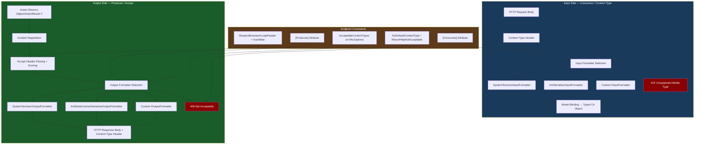
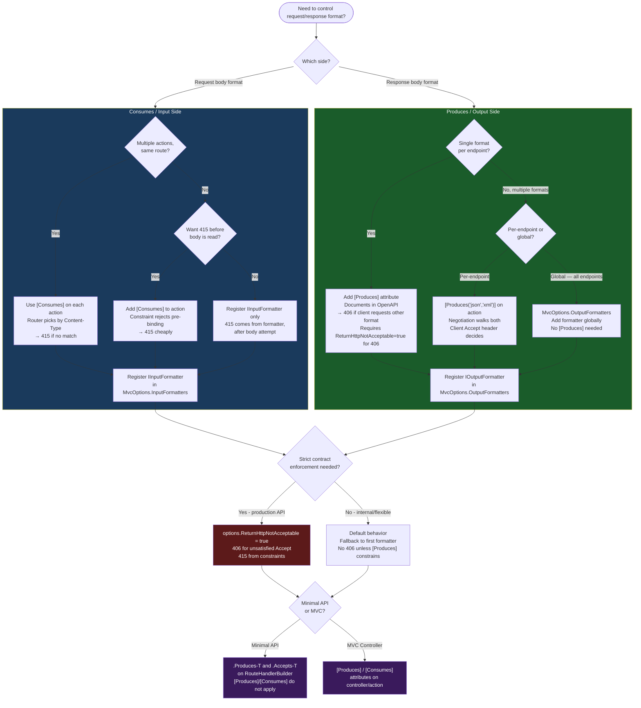

> [!success] Mastery Check
> - [ ] **Studied Well**
> - [ ] **Can explain the concept without notes**
> - [ ] **Can answer interview questions confidently**
> - [ ] **Can implement it in a real project**

---

## PART 0 — Navigation & Context

### Where This Topic Sits in the ASP.NET Core Domain Hierarchy

```
ASP.NET Core Mastery
│
├── E. Middleware Pipeline          (4.049–4.063)
│   └── Content-Type parsing happens here (before routing)
│
├── F. Routing System               (4.064–4.077)
│
├── H. MVC & Controllers            (4.098–4.122)
│   ├── 4.098  ControllerBase vs Controller
│   ├── 4.099  Action Results
│   ├── 4.100  Model Binding (input side)
│   ├── 4.101  ApiController Attribute
│   ├── 4.102  Model Validation
│   ├── ► 4.103  Content Type Negotiation  ◄ YOU ARE HERE
│   ├── 4.107  Output Formatters (the mechanism behind negotiation)
│   ├── 4.112  Input Formatters (the mechanism for Consumes)
│   └── 4.122  Content Negotiation Deep Dive
│
└── I. HTTP Fundamentals            (4.123–4.133)
    └── HttpRequest/Response headers live here
```

### What You Need Before This

- **[[4.099 — Action Results]]** — you must understand how `ActionResult<T>` wraps a value that the formatter serializes.
- **[[4.100 — Model Binding]]** — `Content-Type` on the request drives which input formatter deserializes the body; that is the `Consumes` side.
- **[[4.001 — ASP.NET Core Request Pipeline: A Mental Model]]** — content negotiation is a response-phase concern; knowing where in the pipeline the response is written matters.
- **[[4.098 — ControllerBase vs Controller]]** — negotiation applies to API controllers (`ControllerBase`); MVC controllers with views bypass this system.

### What This Unlocks After

- **[[4.107 — Output Formatters]]** — negotiation selects the formatter; this topic explains how each formatter works internally.
- **[[4.112 — Input Formatters]]** — the `Consumes` side; the mirror image of negotiation for request deserialization.
- **[[4.122 — Content Negotiation Deep Dive]]** — the full RFC 7231 Accept header scoring algorithm, quality values, and edge cases.
- **[[4.279 — OpenAPI / Swagger Integration]]** — `[Produces]` and `[Consumes]` drive OpenAPI response/request schema documentation.

### Why This Matters at Scale

Content negotiation is what makes a single endpoint serve JSON to mobile clients, XML to legacy B2B partners, and MessagePack to high-throughput internal services — without a single `if` statement in your action method. Getting it wrong produces silent 406 errors that only appear in production when a new client connects, breaking SLA guarantees across API contract boundaries.

---

## PART 1 — The Core Mental Model

### The Fundamental Rule

> **In ASP.NET Core, the client's `Accept` header selects the output formatter (what format the response body uses), and the request's `Content-Type` header selects the input formatter (how the request body is deserialized). The framework short-circuits with 406 Not Acceptable if no formatter can satisfy the `Accept` header, and with 415 Unsupported Media Type if no formatter can read the `Content-Type`.**

### The Plain-Language Analogy

Think of a restaurant that can cook the same dish in three styles: Italian, Japanese, or French. When you sit down (send a request), you tell the waiter what cuisine you prefer (`Accept: application/xml`). The waiter checks the kitchen's capabilities (registered output formatters) and either brings you what you asked for or says "we don't do that" (406). When you hand the kitchen a written recipe in a particular language (`Content-Type: application/json` on your POST body), the kitchen picks the chef who speaks that language (input formatter) to read it — if no one does, they send it back (415).

The analogy holds for the hard cases: if you send `Accept: application/xml, */*; q=0.1`, you're saying "I prefer XML but will eat anything" — the kitchen gives you XML if it can, and falls back to the default (JSON) if not. If you walk in with a recipe written in Klingon (`Content-Type: application/vnd.klingon`), the kitchen rejects it regardless of what cuisine they serve. The restaurant (action method) never sees the raw language — it always gets its input as a typed C# object and writes a typed C# object back. Cuisine translation is entirely the framework's job.

### The Taxonomy Diagram



---

## PART 2 — Deep Mechanics

### 2.1 — The Output Negotiation Pipeline: What Happens When Your Action Returns

Every time an action returns a value (not a `FileResult` or `RedirectResult`), ASP.NET Core runs the **output formatter selection algorithm**. Here is the exact sequence:

```
──► Routing ──► Auth ──► [Action Executes] ──► ObjectResult.ExecuteResultAsync()
                                                       │
                                              FormatterSelector.SelectFormatter()
                                                       │
                                         ┌─────────────▼──────────────┐
                                         │  1. Collect acceptable      │
                                         │     types from Accept header│
                                         │  2. Score by q-value        │
                                         │  3. Walk registered         │
                                         │     IOutputFormatters       │
                                         │  4. First match wins        │
                                         │  5. No match → 406 or       │
                                         │     default formatter       │
                                         └─────────────────────────────┘
```

**The class responsible:** `DefaultOutputFormatterSelector` in `Microsoft.AspNetCore.Mvc.Infrastructure`. It reads `MvcOptions.OutputFormatters` (the ordered list registered at startup) and the `Accept` header from `HttpContext.Request`.

```
// HTTP request (approximate):
// GET /api/orders/42 HTTP/1.1
// Accept: application/xml; q=0.9, application/json; q=1.0
// Authorization: Bearer eyJhbGci...

// ASP.NET Core internally (approximate):
// DefaultOutputFormatterSelector.SelectFormatter(OutputFormatterCanWriteContext context):
//   parsedAcceptHeaders = ParseAcceptHeader(context.HttpContext.Request.Headers.Accept)
//   // → [{ MediaType="application/json", Quality=1.0 }, { MediaType="application/xml", Quality=0.9 }]
//   orderedByQuality = parsedAcceptHeaders.OrderByDescending(h => h.Quality)
//   foreach (acceptType in orderedByQuality):
//     foreach (formatter in MvcOptions.OutputFormatters):  // registration order matters!
//       if formatter.CanWriteResult(context with acceptType):
//         return formatter
//   if ReturnHttpNotAcceptable: return null → 406
//   else: return MvcOptions.OutputFormatters.First(f => f.CanWriteResult(context))

// HTTP response (approximate - JSON wins because q=1.0 > q=0.9):
// HTTP/1.1 200 OK
// Content-Type: application/json; charset=utf-8
// {"id": 42, "status": "shipped"}
```

**Runtime cost:** `~1 Accept header parse per request` + `O(formatters × accept-types)` selection walk. With 2 formatters and 3 accept types, this is 6 comparisons — negligible. With a wildly bloated formatter list, it compounds.

**The edge case that bites teams:** When no `Accept` header is present (most browser `fetch()` calls and curl requests), ASP.NET Core **does NOT return 406**. It falls through to the first formatter that can write the type — almost always `SystemTextJsonOutputFormatter`. This is the correct RFC 7231 behavior (no Accept means "anything") but it surprises teams who expect 406 as a guardrail.

---

### 2.2 — The `[Produces]` Attribute: Constraining Negotiation at the Endpoint Level

`[Produces]` does two jobs simultaneously:

1. **Adds endpoint-level constraints** that limit which formatters are even considered during negotiation (not the same as disabling negotiation entirely).
2. **Documents the response media type in OpenAPI** without `[ProducesResponseType]`.

```
// Pipeline position:
// ──► Routing ──► Auth ──► ResultFilter (Produces filter runs here) ──► ObjectResult ──► Formatter
//
// [Produces] installs a ProducesAttribute which implements IResultFilter and IApiResponseMetadataProvider.
// As a filter, it modifies ObjectResult.ContentTypes before formatter selection.

// ASP.NET Core internally (approximate):
// ProducesAttribute.OnResultExecuting(ResultExecutingContext context):
//   if context.Result is ObjectResult objectResult:
//     objectResult.ContentTypes.Clear()
//     objectResult.ContentTypes.Add("application/json")  // only what [Produces] declares
//     // Now formatter selection only considers application/json
//     // If client sends Accept: application/xml → 406 (because xml is not in ContentTypes)
```

**HTTP consequence:**

```
// HTTP request:
// GET /api/invoices/7 HTTP/1.1
// Accept: application/xml

// With [Produces("application/json")] on the action:
// HTTP/1.1 406 Not Acceptable
// (no body — or problem details if AddProblemDetails() is registered)

// Without [Produces]:
// HTTP/1.1 406 Not Acceptable  ← only if ReturnHttpNotAcceptable = true in MvcOptions
// HTTP/1.1 200 OK Content-Type: application/json  ← default if ReturnHttpNotAcceptable = false (the default)
```

**Runtime cost:** `~1 filter execution per request`, negligible. The real cost is the `ContentTypes.Clear()` call which prevents the full negotiation walk — this is actually a micro-optimization when you have many formatters.

**Edge case:** `[Produces]` at the controller level applies to all actions. `[Produces]` at the action level overrides the controller-level value. Combining them does NOT union — the action-level wins entirely. Teams building versioned APIs often put `[Produces("application/json")]` at the controller level and forget that a specific action needs XML — they get a 406 that only appears when the B2B client first calls it.

---

### 2.3 — The `[Consumes]` Attribute: Constraining Input Media Types

`[Consumes]` is the mirror of `[Produces]` for the request side. It installs a `ConsumesAttribute` that participates in **action selection** (not just formatting) — it can cause a different action to be selected based on the request's `Content-Type`.

```
// Pipeline position:
// ──► Routing ──► [ConsumesConstraint runs during action selection] ──► Model Binding ──► Action

// ASP.NET Core internally (approximate):
// ConsumesAttribute implements IActionConstraint.
// IActionConstraint.Accept(ActionConstraintContext context):
//   requestContentType = context.RouteContext.HttpContext.Request.ContentType
//   return _contentTypes.Any(ct => MediaType.IsSubsetOf(requestContentType, ct))
//
// If no action matches the Content-Type → 415 Unsupported Media Type
// This happens BEFORE model binding, not after.

// HTTP request (approximate):
// POST /api/payments/authorize HTTP/1.1
// Content-Type: application/xml
// <payment>...</payment>

// Without XML input formatter registered:
// HTTP/1.1 415 Unsupported Media Type

// With [Consumes("application/json")] on the action:
// HTTP/1.1 415 Unsupported Media Type  ← action constraint rejects the request
```

**The key distinction from `[Produces]`:** `[Consumes]` participates in **action selection** — the router can choose between two actions with the same route template if they differ only in `[Consumes]`:

```csharp
// Two actions on the same route, selected by Content-Type:
[HttpPost("payments/authorize")]
[Consumes("application/json")]
public IActionResult AuthorizeFromJson([FromBody] JsonPaymentRequest req) { ... }

[HttpPost("payments/authorize")]
[Consumes("application/xml")]
public IActionResult AuthorizeFromXml([FromBody] XmlPaymentRequest req) { ... }
```

**Runtime cost:** `~O(1) string comparison` during action selection. The 415 is returned before model binding runs — this is cheaper than deserializing a body just to reject it.

**Edge case:** `[Consumes]` only constrains the selected action for routing. It does NOT register input formatters. If you declare `[Consumes("application/xml")]` but forgot to call `services.AddXmlSerializerFormatters()`, the constraint passes action selection but model binding then fails with a 415 from the formatter (different error path, same status code — confusing to debug).

---

### 2.4 — `MvcOptions` Global Configuration: The Formatter Registry

The registered formatter list is the ground truth for what negotiation can ever produce. Understanding this list is prerequisite to understanding all negotiation behavior.

```csharp
// ASP.NET Core internally (approximate) — default formatter registration in .NET 8:
// builder.Services.AddControllers() calls:
//   MvcOptions.OutputFormatters.Add(new HttpNoContentOutputFormatter());        // 204 for null/void
//   MvcOptions.OutputFormatters.Add(new StringOutputFormatter());               // text/plain for string
//   MvcOptions.OutputFormatters.Add(new StreamOutputFormatter());               // application/octet-stream for Stream
//   MvcOptions.OutputFormatters.Add(new SystemTextJsonOutputFormatter(options)); // application/json (default)
//
// After AddXmlSerializerFormatters():
//   MvcOptions.OutputFormatters.Add(new XmlSerializerOutputFormatter());
//   MvcOptions.OutputFormatters.Add(new XmlDataContractSerializerOutputFormatter());
//   MvcOptions.InputFormatters.Add(new XmlSerializerInputFormatter(options));
//   MvcOptions.InputFormatters.Add(new XmlDataContractSerializerInputFormatter(options));
```

**Critical `MvcOptions` properties:**

```csharp
builder.Services.AddControllers(options =>
{
    // If true: return 406 when no formatter matches Accept header.
    // Default: false (fall back to first formatter that can write the type).
    // Production recommendation: set to true for strict API contracts.
    options.ReturnHttpNotAcceptable = true;

    // If true: honour browser Accept headers (text/html, application/xhtml+xml).
    // Default: false (browsers get JSON; avoids accidentally serving HTML to API clients).
    // Only enable if you serve both browsers and API clients from the same endpoint.
    options.RespectBrowserAcceptHeader = false;

    // Insert a formatter at position 0 to make it the default (no Accept header wins).
    options.OutputFormatters.Insert(0, new MyCustomOutputFormatter());
});
```

**The `RespectBrowserAcceptHeader = false` design:** By default, when a browser sends `Accept: text/html,application/xhtml+xml,application/xml;q=0.9,*/*;q=0.8` (the Firefox default), ASP.NET Core ignores the `text/html` and `application/xhtml+xml` types and falls through to `*/*` — which maps to JSON. This is intentional: API controllers should not accidentally serve HTML just because a dev opened the URL in a browser. If you enable `RespectBrowserAcceptHeader = true`, your API will return a 406 to browsers (or XML if registered) which is almost never what you want.

**Runtime cost:** `O(n)` where n = formatter list length, per request. Keep this list short — 2-4 formatters is normal. Teams that register custom formatters for every content type they ever imagined needing accumulate unnecessary overhead on every request.

---

### 2.5 — The 406 and 415 Failure Paths

Both are deterministic and diagnosable from the HTTP level.

```
406 Not Acceptable (output side):
──► Request arrives → routing matches → action executes → ObjectResult prepared
──► FormatterSelector walks formatters → no match for Accept header
──► ReturnHttpNotAcceptable = true → 406 returned
──► OR [Produces] constraint set and client requested different type → 406 returned

// HTTP response (approximate):
// HTTP/1.1 406 Not Acceptable
// Content-Length: 0
// (no body unless IProblemDetailsService is registered and configured)

415 Unsupported Media Type (input side):
Path A — [Consumes] action constraint rejects:
──► Request arrives → routing runs IActionConstraint.Accept → [Consumes] rejects
──► 415 returned before action executes (before model binding)

Path B — Input formatter rejects:
──► Request arrives → routing selects action → model binding starts
──► InputFormatterSelector finds no formatter for Content-Type
──► ModelState invalid → [ApiController] returns 415

// HTTP response (approximate):
// HTTP/1.1 415 Unsupported Media Type
// Content-Type: application/problem+json
// {"type":"...","title":"Unsupported Media Type","status":415}
```

**Critical difference:** A 415 from Path A (constraint) returns before the body is read. A 415 from Path B (formatter) has already read (or attempted to read) the body. This matters for large payload APIs — the constraint-based path is cheaper.

---

## PART 3 — Production Code Patterns

### Pattern 1: The API Contract Lock — Strict JSON-Only Payment Service

In a fintech payment API, every endpoint must produce and consume exactly `application/json`. Accidental negotiation of XML would expose PCI-sensitive data in an unintended format.

```csharp
// ⚠️ WRONG: No [Produces] means a B2B partner sending Accept: application/xml
// could get a 200 with JSON (because ReturnHttpNotAcceptable defaults to false),
// or a 406 if you set it to true, with zero indication the endpoint is JSON-only.
[ApiController]
[Route("api/v2/payments")]
public class PaymentController : ControllerBase
{
    [HttpPost("authorize")]
    public async Task<ActionResult<AuthorizationResponse>> Authorize([FromBody] AuthorizationRequest req) { ... }
}

// ✅ CORRECT: Lock the contract at the controller level.
// Every action is JSON-in, JSON-out. [Produces] documents this in OpenAPI and enforces it at runtime.
[ApiController]
[Route("api/v2/payments")]
[Produces("application/json")]              // all actions produce JSON
[Consumes("application/json")]              // all actions accept JSON bodies
public class PaymentController : ControllerBase
{
    [HttpPost("authorize")]
    public async Task<ActionResult<AuthorizationResponse>> Authorize(
        [FromBody] AuthorizationRequest req,
        CancellationToken ct)
    {
        // Framework guarantees: req was deserialized from JSON.
        // Framework guarantees: response will be serialized as JSON.
        // If client sends Accept: application/xml → 406 before this line executes.
        // If client sends Content-Type: application/xml → 415 before model binding.
        var result = await _paymentGateway.AuthorizeAsync(req, ct);
        return Ok(result);
    }
}
```

```
// HTTP wire format (correct path):
// POST /api/v2/payments/authorize HTTP/1.1
// Content-Type: application/json
// Accept: application/json
// Authorization: Bearer eyJhbGci...
//
// HTTP/1.1 200 OK
// Content-Type: application/json; charset=utf-8
// {"authorizationCode":"AUTH-7842","amount":150.00,"currency":"USD"}

// HTTP wire format (wrong Content-Type):
// POST /api/v2/payments/authorize HTTP/1.1
// Content-Type: application/xml
//
// HTTP/1.1 415 Unsupported Media Type
// Content-Type: application/problem+json
// {"type":"...","title":"Unsupported Media Type","status":415}
```

---

### Pattern 2: The Multi-Format B2B Integration — EDI Order Service

A logistics order service must serve JSON to internal microservices and XML to legacy EDI B2B partners. The same data, different wire format.

```csharp
// ⚠️ WRONG: Manually checking Accept header inside the action.
// This couples the action to transport concerns and breaks OpenAPI documentation.
[HttpGet("{orderId}")]
public IActionResult GetOrder(int orderId)
{
    var order = _repo.GetOrder(orderId);
    // DON'T DO THIS — the framework does this for you
    if (Request.Headers.Accept.Contains("application/xml"))
        return Ok(MapToXmlDto(order));
    return Ok(MapToJsonDto(order));
}

// ✅ CORRECT: Register both formatters, annotate the endpoint, let the framework negotiate.
// In Program.cs:
builder.Services.AddControllers(options =>
{
    options.ReturnHttpNotAcceptable = true;  // 406 if neither JSON nor XML is accepted
})
.AddXmlSerializerFormatters();              // registers both XML input and output formatters

// Controller:
[ApiController]
[Route("api/v1/orders")]
[Produces("application/json", "application/xml")]  // documents both in OpenAPI
public class OrderController : ControllerBase
{
    [HttpGet("{orderId:int}")]
    // No [Consumes] — GET has no body; negotiation is output-only
    public async Task<ActionResult<OrderResponse>> GetOrder(
        [FromRoute] int orderId,
        CancellationToken ct)
    {
        var order = await _repo.GetOrderAsync(orderId, ct);
        if (order is null)
            return NotFound();

        // Return the SAME object. The formatter chosen by negotiation
        // serializes it as JSON or XML depending on the Accept header.
        return Ok(new OrderResponse(order));
    }
}
```

```
// HTTP wire format — JSON client:
// GET /api/v1/orders/1001 HTTP/1.1
// Accept: application/json
//
// HTTP/1.1 200 OK
// Content-Type: application/json; charset=utf-8
// {"orderId":1001,"status":"dispatched","carrier":"DHL"}

// HTTP wire format — XML B2B partner:
// GET /api/v1/orders/1001 HTTP/1.1
// Accept: application/xml
//
// HTTP/1.1 200 OK
// Content-Type: application/xml; charset=utf-8
// <?xml version="1.0"?><OrderResponse><OrderId>1001</OrderId>...

// HTTP wire format — unsupported client:
// GET /api/v1/orders/1001 HTTP/1.1
// Accept: text/csv
//
// HTTP/1.1 406 Not Acceptable  ← ReturnHttpNotAcceptable = true does this
```

---

### Pattern 3: The Dual-Intake Webhook — JSON and Form-Encoded in the Same Route

An e-commerce payment webhook must accept both JSON payloads (from Stripe) and form-encoded payloads (from legacy payment processors) on the same route path.

```csharp
// ✅ CORRECT: Two actions, same route, differentiated by [Consumes].
// The framework routes to the correct action based on Content-Type.
[ApiController]
[Route("api/webhooks/payment")]
public class PaymentWebhookController : ControllerBase
{
    // Stripe sends JSON
    [HttpPost]
    [Consumes("application/json")]
    public async Task<IActionResult> HandleStripeWebhook(
        [FromBody] StripeWebhookPayload payload)
    {
        // Model binding used SystemTextJsonInputFormatter because Content-Type: application/json
        await _stripeHandler.ProcessAsync(payload);
        return Ok();
    }

    // Legacy processor sends form-encoded
    [HttpPost]
    [Consumes("application/x-www-form-urlencoded")]
    public async Task<IActionResult> HandleLegacyWebhook(
        [FromForm] LegacyWebhookPayload payload)
    {
        // Model binding used FormCollectionModelBinder because Content-Type: application/x-www-form-urlencoded
        await _legacyHandler.ProcessAsync(payload);
        return Ok();
    }
}
```

```
// HTTP wire format — Stripe:
// POST /api/webhooks/payment HTTP/1.1
// Content-Type: application/json
// Stripe-Signature: t=...
// {"id":"evt_123","type":"payment_intent.succeeded"}
//
// → HandleStripeWebhook executes

// HTTP wire format — Legacy processor:
// POST /api/webhooks/payment HTTP/1.1
// Content-Type: application/x-www-form-urlencoded
// txn_id=TXN_456&status=approved&amount=99.99
//
// → HandleLegacyWebhook executes

// HTTP wire format — Unknown processor:
// POST /api/webhooks/payment HTTP/1.1
// Content-Type: text/xml
//
// HTTP/1.1 415 Unsupported Media Type  ← no action matches
```

---

### Pattern 4: The ReturnHttpNotAcceptable Global Enforcement — Inventory API

An inventory management service has a strict API contract: all clients must explicitly request `application/json`. Implicit fallback is disabled.

```csharp
// In Program.cs — global enforcement for the entire application:
builder.Services.AddControllers(options =>
{
    // Return 406 when the Accept header cannot be satisfied.
    // Without this, a client sending Accept: application/pdf would silently get JSON.
    // With this, they get a 406 with a clear error, forcing them to fix their client.
    options.ReturnHttpNotAcceptable = true;

    // We deliberately do NOT set RespectBrowserAcceptHeader = true.
    // Developers hitting the API in a browser get JSON (via */* fallback),
    // not a confusing 406 from their browser's text/html preference.
    // options.RespectBrowserAcceptHeader = false; // this is already the default
});
```

```
// HTTP wire format — correctly negotiated:
// GET /api/v1/inventory/SKU-001 HTTP/1.1
// Accept: application/json
//
// HTTP/1.1 200 OK
// Content-Type: application/json; charset=utf-8
// {"sku":"SKU-001","quantity":142,"warehouse":"EU-WEST-1"}

// HTTP wire format — wrong Accept:
// GET /api/v1/inventory/SKU-001 HTTP/1.1
// Accept: application/pdf
//
// HTTP/1.1 406 Not Acceptable
// (empty body — client must check status code)

// HTTP wire format — browser (no explicit Accept or */*):
// GET /api/v1/inventory/SKU-001 HTTP/1.1
// Accept: */*
//
// HTTP/1.1 200 OK
// Content-Type: application/json; charset=utf-8
// (browser developer gets JSON, not a 406)
```

---

### Pattern 5: The Custom Media Type — Versioned API Response Contract

A user authentication service uses versioned media types (`application/vnd.myapi.v2+json`) so clients can opt into new response shapes without changing the URL.

```csharp
// Register a custom output formatter that handles the versioned type:
public class OrderV2OutputFormatter : SystemTextJsonOutputFormatter
{
    public OrderV2OutputFormatter(JsonSerializerOptions options) : base(options)
    {
        SupportedMediaTypes.Clear();
        SupportedMediaTypes.Add(MediaTypeHeaderValue.Parse("application/vnd.orderapi.v2+json"));
    }
}

// In Program.cs:
builder.Services.AddControllers(options =>
{
    // Insert before the default JSON formatter so v2 clients get the v2 formatter
    options.OutputFormatters.Insert(0, new OrderV2OutputFormatter(
        new JsonSerializerOptions { PropertyNamingPolicy = JsonNamingPolicy.SnakeCaseLower }
    ));
    options.ReturnHttpNotAcceptable = true;
});

// Controller — single action, two possible formatters selected by Accept:
[ApiController]
[Route("api/orders")]
[Produces("application/json", "application/vnd.orderapi.v2+json")]
public class OrderController : ControllerBase
{
    [HttpGet("{orderId:int}")]
    public async Task<ActionResult<OrderResponse>> GetOrder(int orderId, CancellationToken ct)
    {
        var order = await _repo.GetOrderAsync(orderId, ct);
        if (order is null) return NotFound();

        // Same object returned for both v1 and v2 clients.
        // The formatter (selected by Accept) determines the serialization shape.
        return Ok(new OrderResponse(order));
    }
}
```

```
// HTTP wire format — v1 client:
// GET /api/orders/99 HTTP/1.1
// Accept: application/json
//
// HTTP/1.1 200 OK
// Content-Type: application/json; charset=utf-8
// {"orderId":99,"customerName":"Acme Corp"}   ← camelCase

// HTTP wire format — v2 client:
// GET /api/orders/99 HTTP/1.1
// Accept: application/vnd.orderapi.v2+json
//
// HTTP/1.1 200 OK
// Content-Type: application/vnd.orderapi.v2+json; charset=utf-8
// {"order_id":99,"customer_name":"Acme Corp"}  ← snake_case from v2 formatter options
```

---

### Pattern 6: The TypedResults OpenAPI Documentation — Minimal API Equivalent

When using Minimal APIs, content negotiation works differently — `IResult` controls the response type. This is the correct pattern for documenting produces/consumes.

```csharp
// ⚠️ WRONG: Using Results.Ok() loses OpenAPI type information.
app.MapGet("/api/shipments/{id:int}", async (int id, IShipmentRepository repo) =>
{
    var shipment = await repo.GetAsync(id);
    return shipment is null ? Results.NotFound() : Results.Ok(shipment);
    // OpenAPI cannot infer response schema — shows "any" type
});

// ✅ CORRECT: TypedResults preserves generic type info for OpenAPI schema generation.
app.MapGet("/api/shipments/{id:int}", async (int id, IShipmentRepository repo) =>
{
    var shipment = await repo.GetAsync(id);
    return shipment is null
        ? TypedResults.NotFound()
        : TypedResults.Ok(shipment);  // Ok<ShipmentResponse> — OpenAPI knows the schema
})
.WithName("GetShipment")
.Produces<ShipmentResponse>(StatusCodes.Status200OK, "application/json")  // explicit OpenAPI hint
.Produces(StatusCodes.Status404NotFound)
.WithOpenApi();
// Note: Minimal APIs do not use [Produces] / [Consumes] attributes.
// Use .Produces<T>() / .Accepts<T>() extension methods on the route builder.
```

---

## PART 4 — Gotchas & Anti-Patterns

### Gotcha 1: `[Produces]` Does Not Register Formatters — It Only Constrains Selection

Developers assume that `[Produces("application/xml")]` enables XML serialization. It does not. It only tells the negotiation engine to limit consideration to `application/xml`. If `XmlSerializerOutputFormatter` is not registered in `MvcOptions.OutputFormatters`, the constraint still passes (it found a declared type) but the formatter walk finds nothing, and the result depends on `ReturnHttpNotAcceptable`.

```csharp
// ⚠️ WRONG: [Produces] declared but formatter not registered.
// builder.Services.AddControllers();  // no XML formatters added
[Produces("application/xml")]
[HttpGet("{id}")]
public ActionResult<OrderResponse> GetOrder(int id) => Ok(_repo.Get(id));
// HTTP consequence (wrong path):
// GET /api/orders/1 HTTP/1.1 Accept: application/xml
// HTTP/1.1 200 OK Content-Type: application/json  ← [Produces] is ignored because formatter not found
// OR HTTP/1.1 406 Not Acceptable if ReturnHttpNotAcceptable = true
// The behavior is inconsistent depending on global settings — this is the trap.

// ✅ CORRECT: Register the formatter AND declare [Produces].
builder.Services.AddControllers().AddXmlSerializerFormatters();

[Produces("application/xml")]
[HttpGet("{id}")]
public ActionResult<OrderResponse> GetOrder(int id) => Ok(_repo.Get(id));
// HTTP consequence (correct path):
// GET /api/orders/1 HTTP/1.1 Accept: application/xml
// HTTP/1.1 200 OK Content-Type: application/xml; charset=utf-8
// <?xml version="1.0"?><OrderResponse>...

// WHY: [Produces] is a filter and an OpenAPI metadata provider. It narrows the ContentTypes
// list on ObjectResult before formatter selection. If no formatter in MvcOptions.OutputFormatters
// can handle that type, the response is undefined by [Produces] alone — the fallback behavior
// depends on ReturnHttpNotAcceptable. Registration and constraint are two separate steps.
```

---

### Gotcha 2: `[Consumes]` on a GET Action Causes 415 for All Requests

`[Consumes]` declares that the action requires a request body of a specific content type. GET requests never have a body. Applying `[Consumes]` to a GET action means the action constraint checks for a `Content-Type` header that GET requests never send — and rejects every request with 415.

```csharp
// ⚠️ WRONG: [Consumes] on a GET endpoint.
[HttpGet("{id}")]
[Consumes("application/json")]  // GET has no body; Content-Type is never set
public ActionResult<UserProfile> GetUser(int id) => Ok(_repo.Get(id));
// HTTP consequence (wrong path):
// GET /api/users/1 HTTP/1.1
// (no Content-Type header — GET requests don't have one)
// HTTP/1.1 415 Unsupported Media Type  ← every single request fails

// ✅ CORRECT: [Consumes] is only meaningful on POST/PUT/PATCH endpoints.
[HttpPost]
[Consumes("application/json")]
public IActionResult CreateUser([FromBody] CreateUserRequest req) { ... }
// HTTP consequence (correct path):
// POST /api/users HTTP/1.1 Content-Type: application/json
// HTTP/1.1 201 Created

// WHY: ConsumesAttribute implements IActionConstraint. The constraint calls
// context.HttpContext.Request.ContentType which returns null for GET requests.
// MediaType.IsSubsetOf(null, "application/json") returns false → 415.
// This is not a bug — the constraint is doing exactly what it was told.
```

---

### Gotcha 3: The `RespectBrowserAcceptHeader = true` Double-Edge Sword

Enabling `RespectBrowserAcceptHeader = true` seems like the "more correct" RFC 7231 behavior. In practice it causes the entire browser developer experience to break: every developer who opens an API URL in Chrome gets a 406 because Chrome sends `text/html` first.

```csharp
// ⚠️ WRONG (for pure API projects):
builder.Services.AddControllers(options =>
{
    options.RespectBrowserAcceptHeader = true;  // "I want to be RFC-compliant"
    options.ReturnHttpNotAcceptable = true;
});
// HTTP consequence (wrong path):
// Chrome opens https://myapi.com/api/orders/1
// Browser sends: Accept: text/html,application/xhtml+xml,application/xml;q=0.9,image/avif,image/webp,*/*;q=0.8
// → text/html is considered (no HTML formatter) → application/xml (no XML formatter) → application/json via */* 
// Wait — that's actually fine? No. The problem appears when:
// - XML IS registered: Chrome gets XML in the browser, not JSON → debugging nightmare
// - ReturnHttpNotAcceptable = false: Chrome silently gets JSON (correct, but */* did it, not the flag)
// The flag creates unpredictable behavior in mixed browser/API client scenarios.

// ✅ CORRECT: Leave it false (the default) for JSON APIs.
// builder.Services.AddControllers();  // RespectBrowserAcceptHeader = false by default
// HTTP consequence (correct path):
// Browser: Accept: text/html,*/*;q=0.8
// HTTP/1.1 200 OK Content-Type: application/json  ← */* is NOT respected as browser header; JSON returned

// WHY: ASP.NET Core classifies browsers by inspecting if text/html is in the Accept header.
// With RespectBrowserAcceptHeader = false (default), if the request looks like a browser request,
// the text/html and application/xhtml+xml types are stripped before negotiation, leaving only
// the remaining types and *.* for consideration. This protects the JSON-default behavior.
```

---

### Gotcha 4: `[Produces]` at Controller Level Silently Blocks Action-Level XML

When `[Produces("application/json")]` is at the controller class level, it applies to all actions. An action-level `[Produces("application/xml")]` does NOT add XML as an additional option — it completely replaces the controller-level declaration. But adding `[Produces("application/json")]` at the action level restores JSON.

```csharp
// ⚠️ WRONG: Expecting controller-level + action-level [Produces] to union.
[Produces("application/json")]  // controller level: all actions produce JSON
[ApiController]
[Route("api/reports")]
public class ReportController : ControllerBase
{
    [HttpGet("pdf/{id}")]
    [Produces("application/pdf")]  // DOES NOT add PDF — REPLACES JSON for this action
    public async Task<IActionResult> GetPdfReport(int id)
    {
        var bytes = await _generator.GeneratePdfAsync(id);
        return File(bytes, "application/pdf");
        // HTTP consequence (wrong path):
        // GET /api/reports/pdf/1 HTTP/1.1 Accept: application/json
        // HTTP/1.1 406 Not Acceptable  ← JSON is not acceptable (only application/pdf is now)
    }
}

// ✅ CORRECT: Declare all acceptable types explicitly at the action level when overriding.
[HttpGet("pdf/{id}")]
[Produces("application/pdf", "application/json")]  // both are acceptable; PDF is preferred
public async Task<IActionResult> GetPdfReport(int id)
{
    var bytes = await _generator.GeneratePdfAsync(id);
    return File(bytes, "application/pdf");
    // HTTP consequence (correct path):
    // GET /api/reports/pdf/1 HTTP/1.1 Accept: application/pdf
    // HTTP/1.1 200 OK Content-Type: application/pdf
}

// WHY: ProducesAttribute.ContentTypes is set to exactly the types declared on the nearest
// (innermost) [Produces] attribute. Closer scope wins entirely, not additively. This is
// consistent with how filter overriding works in MVC, but surprises teams who expect union semantics.
```

---

### Gotcha 5: The Null Object 204 Trap — `HttpNoContentOutputFormatter` Is First

`HttpNoContentOutputFormatter` is registered before `SystemTextJsonOutputFormatter`. If your action returns `null` (or `Task` returning nothing), it returns **204 No Content** — not `200 OK` with a null JSON body. This is correct RFC 7231 behavior but surprises engineers who return `null` to mean "no results found" (they expect `{}` or `null` JSON, not a 204).

```csharp
// ⚠️ WRONG: Returning null to mean "empty result" — produces 204, not 200 + null body.
[HttpGet("{orderId}")]
public async Task<OrderResponse?> GetOrder(int orderId)
{
    return await _repo.GetAsync(orderId);  // returns null if not found
    // HTTP consequence (wrong path) when order exists:
    // HTTP/1.1 200 OK Content-Type: application/json {"id":42,...}  ← correct
    // HTTP consequence (wrong path) when order NOT found:
    // HTTP/1.1 204 No Content  ← client expected 200+null or 404, gets 204
    // Most API clients interpret 204 as "success, no body" not "not found"
}

// ✅ CORRECT: Use ActionResult<T> and return NotFound() explicitly for the absent case.
[HttpGet("{orderId:int}")]
public async Task<ActionResult<OrderResponse>> GetOrder(int orderId)
{
    var order = await _repo.GetAsync(orderId);
    if (order is null)
        return NotFound();   // 404 — explicit, documentable, meaningful
    return Ok(order);        // 200 + JSON body
    // HTTP consequence (correct path) when order NOT found:
    // HTTP/1.1 404 Not Found Content-Type: application/problem+json
}

// WHY: MvcOptions.OutputFormatters contains HttpNoContentOutputFormatter at index 0.
// Its CanWriteResult returns true when ObjectResult.Value is null or the action returns void/Task.
// It writes nothing to the body and sets status 204. Formatter selection stops at the first match.
// This is the framework being RFC-correct, but it violates typical REST API semantics for "not found".
```

---

## PART 5 — Performance Implications

### 5.1 — Request Pipeline Characteristics Table

|Scenario|Pipeline Depth|Allocations Per Request|Approx Latency Impact|Recommendation|
|---|---|---|---|---|
|No `Accept` header, single JSON formatter|Full pipeline, no negotiation walk|~1 (formatter selection no-op)|~0µs|Default; optimal for internal APIs|
|`Accept: application/json`, JSON formatter registered|Accept parse + 1 formatter check|~2 (header parse + selection)|~0.5µs|Typical API client; negligible|
|`Accept: application/xml; q=0.9, application/json; q=1.0`, both formatters|Accept parse + quality sort + 2 checks|~5|~1–2µs|B2B integration; acceptable|
|`Accept: */*` with 6 formatters registered|Walk all 6 formatters for first match|~6 iterations|~2–3µs|Trim formatter list; 6+ is excessive|
|`[Produces("application/json")]` filter active|Filter clears ContentTypes, 1 formatter check|~1 + filter exec|~1µs|Preferred for locked contracts|
|`ReturnHttpNotAcceptable = true`, no match|Full formatter walk, no match, 406|~n iterations + 406 write|~3–5µs|Set this flag; cheap for security|
|`[Consumes]` action constraint match|String comparison during action selection|~1|~0.2µs|Preferred over formatter-side rejection|
|`[Consumes]` constraint miss (415 from routing)|Constraint returns false, 415 before body read|~1|~0.2µs|Fastest failure path — body never read|
|415 from formatter (body read, then rejected)|Body deserialized then rejected|1 body read + ~n formatter checks|body-size dependent|Use [Consumes] instead to avoid this|
|20 custom output formatters registered|Walk all 20 per request|~20 iterations per request|~10–20µs at 10k req/s|Consolidate; never exceed 4–5 formatters|

### 5.2 — BenchmarkDotNet Comparison

```csharp
using BenchmarkDotNet.Attributes;
using BenchmarkDotNet.Running;
using Microsoft.AspNetCore.Http;
using Microsoft.AspNetCore.Mvc;
using Microsoft.AspNetCore.Mvc.Formatters;
using Microsoft.AspNetCore.Mvc.Infrastructure;
using Microsoft.Extensions.DependencyInjection;
using Microsoft.Extensions.Logging.Abstractions;
using Microsoft.Net.Http.Headers;
using System.Text.Json;

[MemoryDiagnoser]
[SimpleJob]
public class ContentNegotiationBenchmarks
{
    private DefaultOutputFormatterSelector _selector = null!;
    private OutputFormatterWriteContext _noAcceptContext = null!;
    private OutputFormatterWriteContext _jsonAcceptContext = null!;
    private OutputFormatterWriteContext _multiAcceptContext = null!;

    [GlobalSetup]
    public void Setup()
    {
        var options = new MvcOptions();
        options.OutputFormatters.Add(new HttpNoContentOutputFormatter());
        options.OutputFormatters.Add(new StringOutputFormatter());
        options.OutputFormatters.Add(new SystemTextJsonOutputFormatter(new JsonSerializerOptions()));
        // Uncomment to test XML overhead:
        // options.OutputFormatters.Add(new XmlSerializerOutputFormatter());

        var loggerFactory = NullLoggerFactory.Instance;
        _selector = new DefaultOutputFormatterSelector(
            Microsoft.Extensions.Options.Options.Create(options),
            loggerFactory);

        _noAcceptContext = CreateContext(acceptHeader: null);
        _jsonAcceptContext = CreateContext(acceptHeader: "application/json");
        _multiAcceptContext = CreateContext(acceptHeader: "application/xml;q=0.9, application/json;q=1.0, text/plain;q=0.5");
    }

    [Benchmark(Baseline = true)]
    public IOutputFormatter? NoAcceptHeader()
        => _selector.SelectFormatter(_noAcceptContext, Array.Empty<IOutputFormatter>(), new MediaTypeCollection());

    [Benchmark]
    public IOutputFormatter? SingleJsonAccept()
        => _selector.SelectFormatter(_jsonAcceptContext, Array.Empty<IOutputFormatter>(), new MediaTypeCollection());

    [Benchmark]
    public IOutputFormatter? MultiAcceptWithQualityValues()
        => _selector.SelectFormatter(_multiAcceptContext, Array.Empty<IOutputFormatter>(), new MediaTypeCollection());

    private static OutputFormatterWriteContext CreateContext(string? acceptHeader)
    {
        var httpContext = new DefaultHttpContext();
        if (acceptHeader is not null)
            httpContext.Request.Headers.Accept = acceptHeader;

        return new OutputFormatterWriteContext(
            httpContext,
            (stream, encoding) => new StreamWriter(stream, encoding),
            typeof(OrderResponse),
            new OrderResponse());
    }

    private record OrderResponse;
}

// Expected output (approximate, .NET 8, x64):
// | Method                    | Mean     | Gen0   | Allocated |
// |---------------------------|----------|--------|-----------|
// | NoAcceptHeader            | 245 ns   | 0.0153 | 96 B      |
// | SingleJsonAccept          | 312 ns   | 0.0229 | 144 B     |
// | MultiAcceptWithQualityValues | 891 ns | 0.0610 | 384 B     |
//
// Key insight: quality-value sorting in the multi-Accept case is the main allocation driver.
// For hot paths at 10k+ req/s, caching the parsed Accept header matters more than the formatter walk.
```

> [!TIP] For real HTTP pipeline profiling, use `dotnet-trace collect --providers Microsoft-AspNetCore-Server-Kestrel` to measure formatter selection latency end-to-end. `dotnet-counters monitor` shows `Microsoft.AspNetCore.Hosting/requests-per-second` but doesn't break down formatter cost. MiniProfiler with `AddMiniProfiler()` can instrument the formatter selection step at ~1ms granularity in staging environments.

### 5.3 — When to Care / When to Ignore

**When this costs you:**

- **High-throughput APIs (>10k req/s):** Every Accept header parse adds allocations. If your clients always send `Accept: application/json`, the parse is wasted. Use `[Produces]` to short-circuit negotiation — it sets `ContentTypes` on `ObjectResult` and skips the Accept walk entirely.
- **Dozens of registered formatters:** Teams that auto-register formatters for every possible content type (e.g., in a plugin architecture) cause `O(formatters × accept-types)` work per request. Cap at 4–5 formatters.
- **415 responses from formatter rejection (not constraint):** If a high volume of clients send wrong Content-Types, the framework reads the body before rejecting it. `[Consumes]` rejects before body read — use it.
- **Multi-tenant APIs with per-tenant format preferences:** If you're evaluating tenant-specific formatters per request, you're re-running negotiation work that could be cached in a tenant profile.

**When this doesn't matter:**

- **Internal admin endpoints** behind a VPN serving only your own team's tooling. They will always send `application/json`. Negotiation overhead is invisible.
- **One-time batch operations** (nightly reports, data migrations) where throughput is not the concern and one HTTP call takes 500ms of DB work.
- **Low-traffic management APIs** (<10 req/s) such as deployment health checks, feature flag toggles, or configuration endpoints. At that volume, the 1µs negotiation cost is noise.

---

## PART 6 — Interview Arsenal

### A. The Question Bank

---

**Question 1: "What is content negotiation in ASP.NET Core, and how does the framework decide what format to return?"**

**Average Answer:** "ASP.NET Core looks at the `Accept` header and returns JSON or XML based on what the client requests."

**Why That's Insufficient:** It skips the formatter registry, the quality value scoring algorithm, the `ReturnHttpNotAcceptable` flag, and what happens when no match is found.

> **Great Answer:** "Content negotiation is the process by which the framework selects an output formatter based on the client's `Accept` header and the list of registered `IOutputFormatter` implementations in `MvcOptions.OutputFormatters`. When an action returns an object — wrapped in `ObjectResult` — `DefaultOutputFormatterSelector` parses the `Accept` header, sorts the accepted types by their `q` quality values, and walks the registered formatters in order until one returns `CanWriteResult = true`. If nothing matches and `ReturnHttpNotAcceptable` is `true`, the client gets a 406. If it's `false` (the default), the framework falls back to the first formatter that can write the CLR type at all, ignoring the Accept header entirely — which is why you can build an API without ever setting `ReturnHttpNotAcceptable = true` and never notice that clients requesting XML are silently getting JSON. In production I always set `ReturnHttpNotAcceptable = true` because silent format mismatch is a contract violation that becomes a support incident three months later when the B2B partner complains their parser broke."

---

**Question 2: "What is the difference between `[Produces]` and `[Consumes]` in ASP.NET Core?"**

**Average Answer:** "`[Produces]` is for the response format and `[Consumes]` is for the request body format."

**Why That's Insufficient:** It misses that `[Consumes]` participates in action selection as an `IActionConstraint`, while `[Produces]` is a result filter — different pipeline positions, different failure modes, different status codes.

> **Great Answer:** "They operate at completely different points in the pipeline. `[Consumes]` installs an `IActionConstraint` that runs during action selection — before model binding. If the request's `Content-Type` doesn't match, the action is excluded from consideration and the client gets a 415 before the framework has even read the body. This is actually a performance optimization: large payloads are never deserialized for the wrong content type. `[Produces]`, on the other hand, installs a result filter that runs after the action executes. It clears the `ContentTypes` list on `ObjectResult` to only the declared types before formatter selection. If the client's `Accept` header can't be satisfied with those types, they get a 406. The practical consequence: I use `[Consumes]` to gate which action handles a request — it's the routing-layer guard. I use `[Produces]` to lock down what format clients can request — it's the response-layer guard. And critically, `[Consumes]` on a GET endpoint causes 415 for every request because GET has no `Content-Type` header."

---

**Question 3: "How would you add XML support to an ASP.NET Core API, and what's the minimum you need to do?"**

**Average Answer:** "Call `AddXmlSerializerFormatters()` in the service registration."

**Why That's Insufficient:** It ignores that `[Produces]` must also be updated (or omitted), that `ReturnHttpNotAcceptable` affects the fallback behavior, and that XML formatters have their own attribute serialization quirks that cause 500s if the model isn't decorated correctly.

> **Great Answer:** "The minimum is two steps: `builder.Services.AddControllers().AddXmlSerializerFormatters()` to register both the input and output XML formatters, and then ensuring no `[Produces]` attribute on your controller or actions restricts output to `application/json` only — if it does, the XML formatter is registered but unreachable. With that done, clients sending `Accept: application/xml` will get XML. But in practice I also set `options.ReturnHttpNotAcceptable = true` so clients requesting unsupported types get a clear 406 instead of silently falling back to JSON. The thing that bites teams is the model itself: `XmlSerializerOutputFormatter` requires public parameterless constructors and serializable properties — if you've decorated your DTOs for STJ with `[JsonPropertyName]` and forgotten the XML serialization requirements, you get 500s in production only from XML-requesting clients. I always test the XML path explicitly in integration tests using `client.DefaultRequestHeaders.Accept.Add(new MediaTypeWithQualityHeaderValue('application/xml'))`."

---

**Question 4: "What HTTP status code does ASP.NET Core return when the `Accept` header can't be satisfied, and what controls that behavior?"**

**Average Answer:** "406 Not Acceptable."

**Why That's Insufficient:** The default is actually NOT to return 406 — the default is to ignore the `Accept` header and return JSON. The question is designed to catch exactly this nuance.

> **Great Answer:** "This is a trap: the default behavior in ASP.NET Core is NOT to return 406. By default, `MvcOptions.ReturnHttpNotAcceptable` is `false`, which means if no formatter matches the `Accept` header, the framework falls back to the first formatter that can serialize the CLR type — almost always `SystemTextJsonOutputFormatter`. The client gets JSON regardless of what they asked for. You only get a 406 if `ReturnHttpNotAcceptable = true`, or if `[Produces]` has set a `ContentTypes` constraint and the Accept header can't match it. I've seen this cause real bugs: a client sends `Accept: application/msgpack` expecting binary, gets JSON with no error, and spends two hours wondering why their MessagePack parser is failing. Setting `ReturnHttpNotAcceptable = true` globally means they get a 406 with a clear rejection, and the API contract is enforced."

---

### B. The Trick Questions

**Trick 1: "If a client sends `Accept: application/json, application/xml; q=0.1`, and both formatters are registered, which format does the response use?"**

_The trap:_ Candidates say "XML" because it's listed second. Or they say "depends on registration order."

_Correct answer:_ JSON, because its implicit quality value is `1.0`, which is higher than XML's explicit `0.1`. Quality values govern the preference ordering. The framework parses the Accept header, sorts by q-value descending, and walks the formatter list for each type in q-value order. JSON wins because `q=1.0 > q=0.1`.

---

**Trick 2: "You have `[Produces("application/json")]` on your controller and a test that sends `GET /api/orders` with no Accept header. What is the response Content-Type?"**

_The trap:_ Candidates say "undefined" or "depends on browser."

_Correct answer:_ `application/json; charset=utf-8`. When no `Accept` header is present, RFC 7231 says the client accepts anything. `[Produces]` sets `ObjectResult.ContentTypes` to `["application/json"]`. `FormatterSelector` skips the Accept-header walk (no header = accept all) and picks the first formatter that matches the declared type — which is `SystemTextJsonOutputFormatter`. The result is always `application/json`, deterministically.

---

**Trick 3: "You apply `[Consumes("application/json")]` to all actions in your controller. A client sends a `DELETE /api/orders/42` request with no body and no Content-Type header. What happens?"**

_The trap:_ Candidates say "200 OK" because DELETE is correct, or "415" because there's no Content-Type.

_Correct answer:_ **415 Unsupported Media Type.** `[Consumes]` does not differentiate by HTTP method. It installs `IActionConstraint.Accept` which checks `Request.ContentType` regardless of method. A DELETE with no Content-Type has `null` content-type. `MediaType.IsSubsetOf(null, "application/json")` returns `false`. Action constraint rejects. 415 is returned. This is why `[Consumes]` should only be applied to actions that actually have bodies (POST, PUT, PATCH), not to DELETE or GET endpoints.

---

**Trick 4: "You register `XmlSerializerOutputFormatter` but not `XmlDataContractSerializerOutputFormatter`. A client sends `Accept: application/xml`. Which formatter responds, and what happens if your model has a `[DataMember]` attribute?"**

_The trap:_ Candidates assume both XML formatters handle the same content type and are interchangeable.

_Correct answer:_ `XmlSerializerOutputFormatter` handles `application/xml` and uses `System.Xml.Serialization.XmlSerializer`. It completely ignores `[DataMember]` (which is a `System.Runtime.Serialization` attribute for `DataContractSerializer`). If your model relies on `[DataMember]` for property name customization, those customizations are silently ignored — the formatter uses the property name directly. The client gets XML with wrong element names and no error. `XmlDataContractSerializerOutputFormatter` is the one that respects `[DataMember]`. The two formatters share the `application/xml` content type, so registration order determines which one wins.

---

**Trick 5: "What does `RespectBrowserAcceptHeader = false` (the default) actually do to a request from Chrome?"**

_The trap:_ Candidates say "ignores the Accept header" or "always returns JSON regardless of Accept."

_Correct answer:_ It does something more specific. ASP.NET Core checks if the request looks like it came from a browser by detecting `text/html` in the Accept header. If it does, the `text/html` and `application/xhtml+xml` types are stripped from the Accept header before negotiation runs. The remaining types (including `*/*`) are still processed normally. So a Chrome request with `Accept: text/html, application/json, */*` becomes `Accept: application/json, */*` before formatter selection. The `*/*` at the end ensures JSON is selected even if `application/json` isn't explicitly listed. The flag does NOT ignore the entire Accept header — it only removes the browser-specific types that would cause content negotiation to return HTML.

---

### C. Red Flags to Avoid

1. **"I check `Request.Headers.Accept` in my action to decide what to return."** This is manual content negotiation — it couples your action to transport concerns, breaks OpenAPI documentation, and re-implements what the framework does for free.
    
2. **"I use `[Produces]` to register XML support."** `[Produces]` constrains negotiation; it does not register formatters. You get it backwards and produce a system where `[Produces("application/xml")]` causes 406 errors on every request because the formatter was never registered.
    
3. **"406 is returned when the Accept header can't be matched."** Without clarifying that this only happens with `ReturnHttpNotAcceptable = true`, this is technically wrong. The default behavior is fallback-to-first-formatter, not 406.
    
4. **"Content negotiation only affects JSON vs XML."** Content negotiation applies to any registered `IOutputFormatter` — MessagePack, CSV, custom binary formats, versioned media types (`application/vnd.api.v2+json`). Narrowing to "JSON vs XML" signals you've only seen tutorial examples.
    
5. **"`[Consumes]` validates the request body."** `[Consumes]` is an action routing constraint — it rejects the request before any validation runs. Validation is what `[ApiController]` + `ModelState.IsValid` does after binding.
    
6. **"Minimal APIs use `[Produces]` and `[Consumes]` attributes."** They use `.Produces<T>()` and `.Accepts<T>()` extension methods on the `IEndpointConventionBuilder`. The MVC attributes do not apply to Minimal API endpoints.
    
7. **"I set `RespectBrowserAcceptHeader = true` to be more correct."** This is the wrong move for pure API projects. It causes browser developer experience to break (406 or XML in the browser) and has no benefit unless you're serving both browsers and API clients from the same endpoints.
    

---

## PART 7 — Decision Framework



---

## PART 8 — Self-Check

### A. Conceptual Questions

1. What is the registration order of the default output formatters in `MvcOptions.OutputFormatters` when you call `AddControllers()`? Why does `HttpNoContentOutputFormatter` come first?
    
2. What happens to the HTTP request if a client sends `Accept: application/json` and `ReturnHttpNotAcceptable = true`, but only `XmlSerializerOutputFormatter` is registered?
    
3. Explain the difference in pipeline position between `[Consumes]` and `[Produces]`. At what phase does each attribute execute?
    
4. If you add `[Produces("application/json")]` at the controller level and `[Produces("application/xml")]` at the action level, which format can the action produce? Both? Only XML? Only JSON?
    
5. What is the `RespectBrowserAcceptHeader` option, and why is its default value (`false`) intentionally different from strict RFC 7231 compliance?
    
6. What HTTP status code does ASP.NET Core return when model binding receives a request body with a `Content-Type` that has no registered `IInputFormatter`? At which point in the pipeline does this occur?
    
7. A client sends `Accept: text/html`. No HTML formatter is registered. `RespectBrowserAcceptHeader = false`. `ReturnHttpNotAcceptable = true`. What is the response, and why?
    
8. How do you add XML support to a Minimal API endpoint? Can you use `[Produces("application/xml")]` on a `MapGet` delegate?
    
9. What is the `q` quality value in an `Accept` header, and what does `q=0` mean?
    
10. You have `[Consumes("application/json")]` and `[Consumes("application/xml")]` applied to the same action. What happens? Is this valid?
    

---

### B. Code Puzzles

**Puzzle 1: What is the HTTP response status code?**

```csharp
// Given:
// builder.Services.AddControllers(); // no XML formatters
// MvcOptions.ReturnHttpNotAcceptable = false (default)

[ApiController]
[Route("api/orders")]
[Produces("application/xml")]
public class OrderController : ControllerBase
{
    [HttpGet("{id}")]
    public ActionResult<OrderResponse> GetOrder(int id)
        => Ok(new OrderResponse(id));
}
// Client sends:
// GET /api/orders/1 HTTP/1.1
// Accept: application/json
//
// What is the response status code and Content-Type?
```

<details> <summary>Answer</summary>

**Response: `406 Not Acceptable`** (with empty or problem-details body)

**Explanation:** `[Produces("application/xml")]` installs a `ProducesAttribute` result filter. When the action returns `Ok(...)`, the filter sets `ObjectResult.ContentTypes = ["application/xml"]`. `DefaultOutputFormatterSelector` then tries to find a formatter that can write `application/xml`. Since only `SystemTextJsonOutputFormatter` is registered (no XML formatter), nothing can write `application/xml`. Even though `ReturnHttpNotAcceptable = false`, when `ContentTypes` is explicitly set (not empty) by `[Produces]`, and no formatter can satisfy it, the result is a 406 — the fallback only applies when `ContentTypes` is empty (no `[Produces]`). The 406 occurs even though the client sent `Accept: application/json`, because `[Produces]` overrides what the action is willing to produce.

**HTTP consequence:**

```
HTTP/1.1 406 Not Acceptable
```

</details>

---

**Puzzle 2: Which action executes?**

```csharp
[ApiController]
[Route("api/shipments")]
public class ShipmentController : ControllerBase
{
    [HttpPost]
    [Consumes("application/json")]
    public IActionResult CreateFromJson([FromBody] JsonShipmentRequest req)
        => Created("/api/shipments/1", req);

    [HttpPost]
    [Consumes("application/json", "application/x-www-form-urlencoded")]
    public IActionResult CreateFromForm([FromForm] FormShipmentRequest req)
        => Created("/api/shipments/2", req);
}
// Client sends:
// POST /api/shipments HTTP/1.1
// Content-Type: application/json
// {"trackingId":"TRK-999"}
//
// Which action executes? CreateFromJson or CreateFromForm?
```

<details> <summary>Answer</summary>

**This throws an `AmbiguousActionException` at startup** (or at routing time) — it does not execute either action.

**Explanation:** Both actions match `POST /api/shipments` with `Content-Type: application/json`. `CreateFromJson` matches because it declares `"application/json"`. `CreateFromForm` also matches because it declares `"application/json"` as one of its accepted types. The router cannot disambiguate between two actions that both satisfy the same `IActionConstraint` values. ASP.NET Core throws `AmbiguousActionException`. The fix: remove `"application/json"` from `[Consumes]` on `CreateFromForm` so that the two actions have mutually exclusive Content-Type constraints.

**HTTP consequence:**

```
HTTP/1.1 500 Internal Server Error  (or startup exception before any request is served)
AmbiguousActionException: Multiple actions matched...
```

</details>

---

**Puzzle 3: What is the response when an action returns null?**

```csharp
// Given: builder.Services.AddControllers() with default formatters only
[ApiController]
[Route("api/users")]
public class UserController : ControllerBase
{
    [HttpGet("{userId:int}")]
    public async Task<UserProfile?> GetUser(int userId)
    {
        // Simulating a user not found
        return null;
    }
}
// Client sends:
// GET /api/users/999 HTTP/1.1
// Accept: application/json
//
// What is the status code and Content-Type?
```

<details> <summary>Answer</summary>

**Response: `204 No Content`** (no body, no Content-Type header)

**Explanation:** The action returns `Task<UserProfile?>` (not `ActionResult<UserProfile?>`). When the return value is `null`, ASP.NET Core wraps it in an `ObjectResult` with `Value = null`. `DefaultOutputFormatterSelector` walks the formatter list. `HttpNoContentOutputFormatter` is first, and its `CanWriteResult` returns `true` when `ObjectResult.Value is null`. It writes nothing, sets status 204. The `SystemTextJsonOutputFormatter` never runs. The client gets 204, not 200 with a null JSON body.

The correct fix is to use `ActionResult<UserProfile>` and return `NotFound()` for the absent case, or `Ok(new UserProfile())` for a valid response.

**HTTP consequence:**

```
HTTP/1.1 204 No Content
```

</details>

---

**Puzzle 4: What is the response? (The `[Produces]` override trap)**

```csharp
// Given: builder.Services.AddControllers().AddXmlSerializerFormatters()
// ReturnHttpNotAcceptable = true

[ApiController]
[Route("api/invoices")]
[Produces("application/json", "application/xml")]  // controller: both formats
public class InvoiceController : ControllerBase
{
    [HttpGet("{id}")]
    [Produces("application/json")]  // action: overrides controller
    public ActionResult<InvoiceResponse> GetInvoice(int id)
        => Ok(new InvoiceResponse(id));
}
// Client sends:
// GET /api/invoices/5 HTTP/1.1
// Accept: application/xml
//
// What is the response?
```

<details> <summary>Answer</summary>

**Response: `406 Not Acceptable`**

**Explanation:** `[Produces("application/json")]` at the action level completely overrides the controller-level `[Produces("application/json", "application/xml")]`. It does not add JSON to the XML declared at the controller level, nor does it union with the controller-level declaration. The action-level attribute wins entirely. `ObjectResult.ContentTypes` is set to `["application/json"]` only. The client requests `application/xml`, which is not in the `ContentTypes` list. Since `ReturnHttpNotAcceptable = true` and no formatter can write `application/xml` given the `ContentTypes` constraint, the response is 406. The XML formatter is registered but unreachable for this action because of the action-level override.

**HTTP consequence:**

```
HTTP/1.1 406 Not Acceptable
```

**Fix:** Change action-level to `[Produces("application/json", "application/xml")]` to restore both options, or remove the action-level attribute to inherit the controller-level declaration.

</details>

---

**Puzzle 5 (The Core Misunderstanding Bug): What happens and why?**

```csharp
// Given: builder.Services.AddControllers() — no XML formatters registered
// No [Produces] attributes anywhere
// ReturnHttpNotAcceptable = false (default)

[ApiController]
[Route("api/catalog")]
public class CatalogController : ControllerBase
{
    [HttpGet("products")]
    public ActionResult<IEnumerable<ProductSummary>> GetProducts()
        => Ok(_catalog.GetAll());
}
// Client A sends: GET /api/catalog/products HTTP/1.1
//                 Accept: application/json
// Client B sends: GET /api/catalog/products HTTP/1.1
//                 Accept: application/xml
// Client C sends: GET /api/catalog/products HTTP/1.1
//                 Accept: text/csv
// Client D sends: GET /api/catalog/products HTTP/1.1
//                 (no Accept header)
//
// What does each client receive?
```

<details> <summary>Answer</summary>

**All four clients receive: `200 OK` with `Content-Type: application/json`**

**Explanation:** This is the most common misunderstanding of ASP.NET Core content negotiation. Because `ReturnHttpNotAcceptable = false` (the default) and no `[Produces]` constraint is set, `DefaultOutputFormatterSelector` falls back to the first formatter that can write `IEnumerable<ProductSummary>` regardless of the `Accept` header. That formatter is `SystemTextJsonOutputFormatter`.

- Client A gets JSON (correct match)
- Client B gets JSON (XML not registered — fallback, no 406)
- Client C gets JSON (CSV not registered — fallback, no 406)
- Client D gets JSON (no Accept = accept anything — first formatter wins)

**The bug:** Clients B and C expect their requested format and get JSON silently — no error, no indication the API doesn't support their format. Client B's XML parser will throw a runtime error; their team will spend hours debugging before realizing the API returned JSON.

**The fix:** `options.ReturnHttpNotAcceptable = true` — then Clients B and C get `406 Not Acceptable` immediately and can fix their `Accept` header.

**HTTP consequence (all four):**

```
HTTP/1.1 200 OK
Content-Type: application/json; charset=utf-8
[{"id":1,"name":"Widget"},...]
```

</details>

---

## PART 9 — Connections & Resources

### A. Related Topics Table

|Topic|Why It Connects|
|---|---|
|[[4.099 — Action Results: IActionResult and ActionResult-T]]|`ObjectResult` is the result type that carries the value through content negotiation; `ActionResult<T>` enables both typed response and HTTP result semantics simultaneously|
|[[4.100 — Model Binding: Sources and Algorithm]]|The `Content-Type` header on the request drives input formatter selection — the `Consumes` side of negotiation feeds directly into model binding|
|[[4.107 — Output Formatters: JSON, XML, and Custom]]|Formatters are the implementation detail behind negotiation; `[Produces]` constrains which formatters are candidates, but the formatters themselves do the actual serialization work|
|[[4.112 — Input Formatters: Deserializing Non-JSON Request Bodies]]|`[Consumes]` is the constraint; input formatters are the implementation; understanding both together gives the complete input-side picture|
|[[4.082 — IResult and TypedResults]]|Minimal APIs use `TypedResults` and `.Produces<T>()` instead of `[Produces]`; the same negotiation concepts apply but through different API surfaces|
|[[4.122 — Content Negotiation Deep Dive: Accept Header Algorithm]]|The full RFC 7231 scoring algorithm including wildcard matching (`*/*`, `application/*`), quality values, and edge cases not covered here|
|[[4.124 — HttpRequest: Reading URL, Headers, Cookies, and Body]]|The `Accept` and `Content-Type` headers live on `HttpRequest.Headers`; understanding how to read them directly is prerequisite for custom formatters|
|[[4.085 — OpenAPI Integration in Minimal APIs]]|`[Produces]` and `[Consumes]` are metadata sources for OpenAPI documentation; `TypedResults` provides the same metadata for Minimal APIs|
|[[4.279 — OpenAPI / Swagger Integration]]|Swashbuckle reads `[Produces]` and `[Consumes]` attributes to generate the OpenAPI `requestBody` and `responses` schema sections|
|[[4.101 — ApiController Attribute]]|`[ApiController]` changes the 415 response shape for invalid content types; it also infers `[FromBody]` for complex types, making `[Consumes]` behavior implicitly active|
|[[4.268 — System.Text.Json in ASP.NET Core: Global Options]]|`SystemTextJsonOutputFormatter` uses the global `JsonSerializerOptions` — negotiation selects it, but STJ options control what the selected formatter actually produces|

### B. Books

|Book|Chapters|Why These Chapters|
|---|---|---|
|_Pro ASP.NET Core 8_ — Adam Freeman (Apress, 2024)|Ch. 20 "Formatting Response Data", Ch. 19 "Controllers and Actions"|Freeman's chapters walk formatter registration, `[Produces]`/`[Consumes]`, and the full negotiation flow with working code examples in the order you'd encounter them building a real API|
|_ASP.NET Core in Action, 3rd Ed._ — Andrew Lock (Manning, 2023)|Ch. 15 "Generating responses with formatters", Ch. 16 "Applying custom formatters"|Lock explains the formatter interface contract, how to implement `IOutputFormatter`, and the negotiation selection algorithm from first principles|
|_Designing APIs with Swagger and OpenAPI_ — Josh Ponelat & Lukas Rosenstock (Manning, 2022)|Ch. 5 "Request and response bodies"|The OpenAPI perspective on `[Produces]` / `[Consumes]` — important for understanding how your attribute choices affect the contract you publish to API consumers|
|_HTTP: The Definitive Guide_ — David Gourley et al. (O'Reilly)|Ch. 17 "Content Negotiation and Transcoding"|RFC 7231 is the normative spec; this book provides the most readable explanation of quality values, media type matching, and why the algorithm works the way it does|

### C. Essential Articles & Docs

- **Microsoft Docs — Format response data in ASP.NET Core Web API**: `https://learn.microsoft.com/en-us/aspnet/core/web-api/advanced/formatting` — The authoritative reference for `OutputFormatters`, `ReturnHttpNotAcceptable`, and `RespectBrowserAcceptHeader` configuration options.
- **Microsoft Docs — Custom formatters in ASP.NET Core**: `https://learn.microsoft.com/en-us/aspnet/core/web-api/advanced/custom-formatters` — Step-by-step for implementing `IInputFormatter` and `IOutputFormatter`, including the `CanReadType`/`CanWriteType` methods that make the selection algorithm work.
- **Andrew Lock — Series on content negotiation in ASP.NET Core**: `https://andrewlock.net/` (search "content negotiation") — Lock's blog posts cover the internal source code paths (`DefaultOutputFormatterSelector`) and the interaction between `[Produces]` and `ContentTypes` on `ObjectResult`.
- **ASP.NET Core GitHub — `DefaultOutputFormatterSelector.cs`**: `https://github.com/dotnet/aspnetcore/blob/main/src/Mvc/Mvc.Core/src/Infrastructure/DefaultOutputFormatterSelector.cs` — The actual implementation; reading the `SelectFormatter` method is 80 lines that replace hours of guessing about selection order.
- **RFC 7231 — HTTP/1.1 Semantics and Content, Section 5.3**: `https://datatracker.ietf.org/doc/html/rfc7231#section-5.3` — The normative specification for Accept header quality values, media type matching, and the 406 response code. Essential for understanding why ASP.NET Core behaves the way it does.

---

> [!NOTE] **Template Meta-Note — What Each Part Does**
> 
> - **Part 0 — Navigation:** Orients you in the full ASP.NET Core hierarchy; shows prerequisites and what this topic unlocks.
> - **Part 1 — Core Mental Model:** One-sentence rule, physical analogy mapped to HTTP pipeline mechanics, and a complete taxonomy diagram.
> - **Part 2 — Deep Mechanics:** Runtime internals, pipeline position diagrams, HTTP wire formats, framework source behavior, failure paths, and the edge cases that bite production teams.
> - **Part 3 — Production Code Patterns:** 5–7 named, domain-specific code patterns with anti-patterns, correct versions, and HTTP wire format consequences.
> - **Part 4 — Gotchas:** 5 production bugs with wrong-code → wrong-HTTP-consequence → correct-code → correct-HTTP-consequence → pipeline explanation format.
> - **Part 5 — Performance:** Pipeline cost table, runnable BenchmarkDotNet class, and when/when-not-to-care guidance.
> - **Part 6 — Interview Arsenal:** Banked questions with great answers (speakable, pipeline-referencing), trick questions with traps, and red flags to avoid.
> - **Part 7 — Decision Framework:** Mermaid flowchart for "which tool do I use" — usable as a live-interview cheat sheet.
> - **Part 8 — Self-Check:** 10 conceptual questions + 5 code puzzles with collapsed answers; at least one puzzle targets the core misunderstanding of the topic.
> - **Part 9 — Connections:** Wiki-linked related topics with specific pipeline relationships, book chapters, and authoritative articles/docs only.
