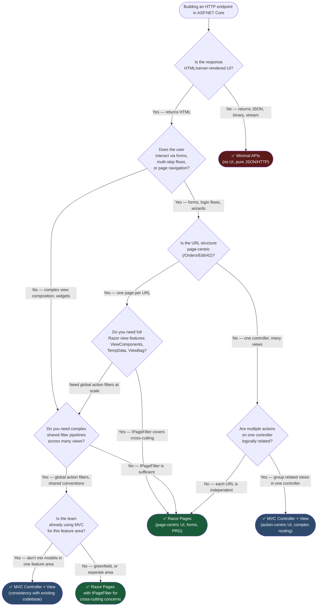

> [!success] Mastery Check
> - [ ] **Studied Well**
> - [ ] **Can explain the concept without notes**
> - [ ] **Can answer interview questions confidently**
> - [ ] **Can implement it in a real project**


# 4.104 — Razor Pages: PageModel, Handlers, and When to Use vs MVC

---

## PART 0 — Navigation & Context

### Domain Hierarchy Position

```
ASP.NET Core Mastery
│
├── E. Middleware Pipeline
├── F. Routing System
│   └── 4.064 — Endpoint Routing ◄── prerequisite
│
└── H. MVC & Controllers
    ├── 4.098 — ControllerBase vs Controller ◄── prerequisite
    ├── 4.099 — Action Results
    ├── 4.100 — Model Binding
    ├── 4.102 — Model Validation
    ├── 4.103 — Content Type Negotiation
    ► 4.104 — Razor Pages: PageModel, Handlers, and When to Use vs MVC  ◄ YOU ARE HERE
    ├── 4.105 — MVC Areas
    ├── 4.106 — ViewComponents
    ├── 4.107 — Output Formatters
    ├── 4.108 — Custom Model Binders
    └── 4.110 — MVC Filter Pipeline
```

### What You Need Before This

- **[[4.064 — Endpoint Routing: The Modern Routing Architecture]]** — Razor Pages are routed through the same endpoint routing system as MVC; `MapRazorPages()` registers page endpoints.
- **[[4.098 — ControllerBase vs Controller: API vs MVC Controllers]]** — Razor Pages replace the Controller+View pattern for page-centric UI; you need to know what you're replacing.
- **[[4.100 — Model Binding: Sources, Order, and the Binding Algorithm]]** — `[BindProperty]` in Razor Pages uses the same binding engine as MVC; the source rules are identical.
- **[[4.034 — The Built-In DI Container: Service Registration and Resolution]]** — PageModel services are injected via constructor; understanding DI lifetimes prevents scope bugs.

### What This Unlocks After

- **[[4.106 — ViewComponents: Encapsulated Server-Side UI Fragments]]** — ViewComponents compose into Razor Pages the same way they do into MVC views.
- **[[4.110 — MVC Filter Pipeline: Six Filter Types and Execution Order]]** — filters apply to Razor Pages through `IPageFilter`; the pipeline is analogous but distinct from MVC.
- **[[4.176 — Client-Side Validation Coordination: data-val Attributes in Razor]]** — Razor Pages generates `data-val-*` attributes from DataAnnotations on `[BindProperty]` models.
- **[[4.092 — Minimal API vs MVC Controller: The Decision Framework]]** — after Razor Pages, the full picture of ASP.NET Core's three endpoint programming models is complete.

### Why This Topic Matters at Scale

Razor Pages is the **production default for server-rendered web UI in ASP.NET Core** — its page-centric model eliminates the controller-action-view indirection that makes MVC hard to navigate for teams building form-heavy admin portals, customer-facing dashboards, and multi-step workflows. Choosing the wrong model adds friction to every feature and confuses every new engineer on the team.

---

## PART 1 — The Core Mental Model

### The Fundamental Rule

> **A Razor Page is a self-contained HTTP handler: its `.cshtml` file defines the response body, its `PageModel` class defines the handler methods, and the file system path is the route. The practical consequence is that every page's logic, model, and view live in one directory, not scattered across Controllers/, Models/, and Views/.**

### The Plain-Language Analogy

Think of Razor Pages like a medical office's intake workflow. Each room (page) has its own clipboard (PageModel) that holds the patient's data for that specific visit. When a patient walks in (GET), the nurse fills the clipboard. When they hand it back signed (POST), the desk processes it and either redirects to the next room or re-presents the same form with corrections marked.

This works under load: each patient gets their own clipboard per visit (Scoped PageModel), not a shared whiteboard that nurses would need to lock for concurrent access. It still holds when a POST fails validation: the clipboard comes back to the same room with the errors noted, not to a different floor. And it holds when a page needs partial content: ViewComponents are like specialist consultants who visit the room — they bring their own logic, not the room's clipboard.

The MVC equivalent would be like having a scheduling center (Controller) that books all room visits for the whole building, then a separate records room (View) that just displays clipboards. More coordination for the same patient outcome.

### The Taxonomy Diagram

```mermaid
graph TD
    subgraph pipeline["Pipeline Infrastructure"]
        RPI["MapRazorPages()"]
        ER["Endpoint Routing"]
        PF["IPageFilter Pipeline"]
        MB["Model Binding Engine"]
    end

    subgraph pagemodel["Razor Page Core"]
        PM["PageModel\n(base class)"]
        HC["Handler Methods\nOnGet / OnPost\nOnGetAsync / OnPostAsync\nOnPost{Handler}Async"]
        BP["[BindProperty]\n[BindProperty(SupportsGet=true)]"]
        VD["ViewData / TempData"]
        PL["PageResult / RedirectToPageResult\nIActionResult returns"]
    end

    subgraph routing["Routing System"]
        FS["File System Routing\n/Pages/Orders/Edit.cshtml\n→ /Orders/Edit"]
        RP["@page directive\n@page \"{id:int}\""]
        RA["@page with route template\noverrides file path"]
        NH["Named Handlers\nOnPost{Name}Async\n?handler=Name"]
    end

    subgraph di_model["DI & Composition"]
        CI["Constructor Injection\nin PageModel"]
        IS["[FromServices] on handler params"]
        VC["ViewComponent invocation\nfrom .cshtml"]
        PP["Partial Pages"]
    end

    subgraph comparisons["Programming Model Comparison"]
        MVC["MVC Controller+View\nHigh ceremony, flexible"]
        RP2["Razor Pages\nPage-centric, low ceremony"]
        MIN["Minimal APIs\nNo UI, pure HTTP"]
        SEL["Decision: UI needs?"]
    end

    RPI --> ER
    ER --> PF
    PF --> PM
    PM --> HC
    PM --> BP
    PM --> VD
    HC --> PL
    FS --> RP
    RP --> RA
    HC --> NH
    PM --> CI
    HC --> IS
    SEL -->|"Server-rendered UI + forms"| RP2
    SEL -->|"Complex UI, views, ViewComponents at scale"| MVC
    SEL -->|"JSON API / no HTML"| MIN

    style pipeline fill:#2d4a6b,color:#fff
    style pagemodel fill:#1a5c3a,color:#fff
    style routing fill:#5c3a1a,color:#fff
    style di_model fill:#4a2d6b,color:#fff
    style comparisons fill:#5c1a1a,color:#fff
```

---

## PART 2 — Deep Mechanics

### 2.1 — How Razor Pages Are Registered and Routed

Razor Pages sit inside the endpoint routing system. `MapRazorPages()` scans the `/Pages` directory and registers one endpoint per `.cshtml` file that has the `@page` directive at the top.

```
Pipeline position (request flow):

──► UseExceptionHandler
    ──► UseHttpsRedirection
        ──► UseStaticFiles          (serves .css/.js — Razor Pages never see these)
            ──► UseRouting          (matches /Orders/Edit to Pages/Orders/Edit.cshtml)
                ──► UseAuthentication
                    ──► UseAuthorization
                        ──► [IPageFilter: OnPageHandlerSelected]
                            ──► Model Binding ([BindProperty] properties populated)
                                ──► [IPageFilter: OnPageHandlerExecuting]
                                    ──► OnGetAsync / OnPostAsync  ◄── YOUR HANDLER
                                        ──► [IPageFilter: OnPageHandlerExecuted]
                                            ──► PageResult → Razor rendering → Response
```

**File system → Route mapping:**

```
/Pages/Index.cshtml                    → GET /
/Pages/Orders/Index.cshtml             → GET /Orders
/Pages/Orders/Edit.cshtml              → GET /Orders/Edit
/Pages/Orders/Edit.cshtml @page "{id}" → GET /Orders/Edit/42
/Pages/Account/Login.cshtml            → GET /Account/Login
/Pages/Admin/Users/List.cshtml         → GET /Admin/Users/List
```

**Framework source path:** `Microsoft.AspNetCore.Mvc.RazorPages.Infrastructure.PageActionInvoker` — the invoker that runs handler selection, model binding, and handler execution. `RazorPagesEndpointRouteBuilderExtensions.MapRazorPages()` calls into `PageActionDescriptorChangeProvider` to discover `.cshtml` files.

**Runtime cost:** ~2 allocations per request for handler descriptor lookup + `PageContext` construction. O(1) endpoint lookup via the routing trie (same as MVC). `~1` extra allocation vs MVC per request due to `PageContext` wrapping `ActionContext`.

---

### 2.2 — PageModel: The Handler Class

The `PageModel` is instantiated **per request** (Scoped). It is the C# class paired with a `.cshtml` file. Unlike a Controller where the action is one method, a PageModel is the entire page's behavior.

```csharp
// /Pages/Orders/Edit.cshtml.cs
// Pipeline position: instantiated after routing resolves to this page,
// before model binding populates [BindProperty] properties

using Microsoft.AspNetCore.Mvc;
using Microsoft.AspNetCore.Mvc.RazorPages;

public class EditModel : PageModel  // Must inherit PageModel
{
    private readonly IOrderService _orders;
    private readonly ILogger<EditModel> _logger;

    // Constructor injection — same as any DI consumer
    // Services must match registered lifetimes (Scoped or Singleton safe here)
    public EditModel(IOrderService orders, ILogger<EditModel> logger)
    {
        _orders = orders;
        _logger = logger;
    }

    // Properties decorated with [BindProperty] are populated from POST body.
    // They are NOT populated on GET by default.
    [BindProperty]
    public EditOrderInput Input { get; set; } = new();

    // Properties WITHOUT [BindProperty] are never populated from the request.
    // Use these for display-only data loaded in OnGetAsync.
    public OrderSummary Order { get; set; } = new();

    // GET handler — named exactly OnGetAsync (or OnGet for sync)
    // Receives route parameters as method parameters (bound from route)
    public async Task<IActionResult> OnGetAsync(int id)
    {
        var order = await _orders.GetByIdAsync(id);
        if (order is null)
            return NotFound();

        // Populate display data
        Order = order.ToSummary();
        // Pre-populate the form input from existing data
        Input = EditOrderInput.From(order);

        return Page(); // Renders Edit.cshtml with this PageModel as the model
    }

    // POST handler — named exactly OnPostAsync
    // [BindProperty] properties are already bound before this runs
    public async Task<IActionResult> OnPostAsync(int id)
    {
        if (!ModelState.IsValid)
        {
            // Must reload display data — [BindProperty] only, not display properties
            var order = await _orders.GetByIdAsync(id);
            if (order is not null)
                Order = order.ToSummary();
            return Page(); // Re-render with validation errors
        }

        await _orders.UpdateAsync(id, Input);
        return RedirectToPage("/Orders/Index"); // PRG pattern
    }
}
```

**HTTP wire format for the GET:**

```http
GET /Orders/Edit/42 HTTP/1.1
Host: orders.internal.company.com
Accept: text/html
Cookie: .AspNetCore.Antiforgery.xxx=yyy

HTTP/1.1 200 OK
Content-Type: text/html; charset=utf-8
Cache-Control: no-store
Set-Cookie: .AspNetCore.Antiforgery.xxx=zzz; SameSite=Strict; HttpOnly

<!DOCTYPE html>
<html>...form with antiforgery token...</html>
```

**HTTP wire format for the POST (valid):**

```http
POST /Orders/Edit/42 HTTP/1.1
Content-Type: application/x-www-form-urlencoded
Cookie: .AspNetCore.Antiforgery.xxx=yyy

__RequestVerificationToken=...&Input.ProductId=7&Input.Quantity=3

HTTP/1.1 302 Found
Location: /Orders
```

**HTTP wire format for the POST (invalid — validation failure):**

```http
POST /Orders/Edit/42 HTTP/1.1
Content-Type: application/x-www-form-urlencoded

__RequestVerificationToken=...&Input.Quantity=-1

HTTP/1.1 200 OK
Content-Type: text/html; charset=utf-8

<!DOCTYPE html>
...validation error summary visible...
```

**Runtime cost:** One async state machine per `await` in the handler. ~3 allocations per POST request: `PageContext`, `ModelBindingContext`, `ValidationContext`. The `ModelState` dictionary is populated during binding before your handler runs.

---

### 2.3 — Handler Method Naming Convention and Named Handlers

Razor Pages uses a **naming convention** to select which handler method runs. This is resolved by `PageHandlerMethodSelector`.

```
HTTP Method + Handler Name → Method Name

GET  (no handler)     → OnGet / OnGetAsync
POST (no handler)     → OnPost / OnPostAsync
GET  handler=Search   → OnGetSearch / OnGetSearchAsync
POST handler=Save     → OnPostSave / OnPostSaveAsync
POST handler=Delete   → OnPostDelete / OnPostDeleteAsync
DELETE (REST)         → OnDelete / OnDeleteAsync
PUT   (REST)          → OnPut / OnPutAsync
```

**Named handlers in the form (HTML):**

```html
<!-- In Edit.cshtml — two submit buttons, two POST handlers -->
<form method="post">
    <button type="submit" asp-page-handler="Save">Save Changes</button>
    <button type="submit" asp-page-handler="Delete">Delete Order</button>
</form>
```

This renders to:

```html
<button type="submit" formaction="/Orders/Edit/42?handler=Save">Save Changes</button>
<button type="submit" formaction="/Orders/Edit/42?handler=Delete">Delete Order</button>
```

**The PageModel with named handlers:**

```csharp
// Both handlers receive the same [BindProperty] data already bound
public async Task<IActionResult> OnPostSaveAsync(int id)
{
    if (!ModelState.IsValid) return Page();
    await _orders.UpdateAsync(id, Input);
    return RedirectToPage("/Orders/Index");
}

public async Task<IActionResult> OnPostDeleteAsync(int id)
{
    // No [BindProperty] needed — just the route id
    await _orders.DeleteAsync(id);
    TempData["Message"] = "Order deleted";
    return RedirectToPage("/Orders/Index");
}
```

> [!NOTE] Named handlers are the Razor Pages equivalent of separate action methods on an MVC controller. They let one page own multiple POST operations cleanly without a workaround like routing on form field values.

**Runtime cost:** Handler selection is O(n) over the PageModel's methods, cached per page descriptor. At scale, this cost is paid once per page type, not per request. `~0` runtime allocation for handler selection after warm-up.

---

### 2.4 — [BindProperty] and the Binding Model

`[BindProperty]` is the most important attribute in Razor Pages. It marks which PageModel properties are populated from the HTTP request. Everything else is your responsibility to populate from data sources.

```csharp
public class CheckoutModel : PageModel
{
    // ✅ CORRECT: [BindProperty] on POST-only data
    // Bound from form body on POST, ignored on GET
    [BindProperty]
    public CheckoutInput Input { get; set; } = new();

    // ✅ CORRECT: [BindProperty(SupportsGet = true)] for search/filter forms
    // Bound from query string on GET: /Catalog?Search.Term=widget&Search.Page=2
    [BindProperty(SupportsGet = true)]
    public CatalogSearch Search { get; set; } = new();

    // ✅ CORRECT: Display-only property — populated in handler, never from request
    public IReadOnlyList<ProductDto> Products { get; set; } = [];

    // ✅ CORRECT: Display-only scalar
    public decimal CartTotal { get; set; }
}
```

**Binding source hierarchy for [BindProperty]:**

1. Route values (from `@page "{id}"`)
2. Form body (`Content-Type: application/x-www-form-urlencoded` or `multipart/form-data`)
3. Query string (only if `SupportsGet = true` or accessed via `[FromQuery]` on handler params)

> [!WARNING] **[BindProperty] properties with complex types use the property name as the prefix.** If your property is `Input` and your form field is `Input.Quantity`, the binding engine strips the prefix from nested properties automatically. If you name the property `CheckoutForm` instead of `Input`, all your `asp-for` tag helpers and form field names must match.

**The binding cost:** ~1 `ModelBindingContext` allocation per `[BindProperty]` property. For pages with 3-4 bound properties, this is negligible. For pages with 20+ bound properties, consider grouping into nested objects.

---

### 2.5 — Return Types from Handlers

Handler methods return `IActionResult` (or `Task<IActionResult>`, or `void`/`Task` for handlers that always render the page).

```csharp
// All valid handler return types in a payment portal page:

// Render this page (always — no branching)
public void OnGet() { }          // Void — always renders Page()
public Task OnGetAsync() { }     // Async void — always renders Page()

// Branching returns
public async Task<IActionResult> OnPostAsync()
{
    if (!ModelState.IsValid)
        return Page();                           // 200 — re-render with errors

    if (await _payments.IsAlreadyProcessed(Input.IdempotencyKey))
        return RedirectToPage("/Payment/Duplicate");  // 302

    var result = await _payments.ProcessAsync(Input);
    return result switch
    {
        PaymentSuccess s => RedirectToPage("/Payment/Confirmation",
                                new { orderId = s.OrderId }),   // 302
        PaymentDeclined  => Page(),                              // 200 — show decline message
        PaymentError e   => RedirectToPage("/Error",
                                new { code = "PAYMENT_ERROR" }) // 302
    };
}

// Force 404 from a handler
public async Task<IActionResult> OnGetAsync(int id)
{
    var order = await _orders.GetByIdAsync(id);
    return order is null ? NotFound() : Page();
}

// Force 401/403 — typically done via [Authorize] but can be manual
public IActionResult OnGet() => Challenge();
```

**Common result types available on PageModel (inherited):**

|Method|HTTP|When to Use|
|---|---|---|
|`Page()`|200|Render the .cshtml for this page|
|`RedirectToPage(name)`|302|PRG pattern after successful POST|
|`RedirectToPage(name, routeValues)`|302|PRG with route parameters|
|`RedirectToPagePermanent(name)`|301|Permanent rename|
|`NotFound()`|404|Entity not found by route ID|
|`Forbid()`|403|Authenticated but not authorized|
|`Challenge()`|401|Not authenticated — trigger redirect to login|
|`BadRequest()`|400|Invalid request (rare in Razor Pages)|
|`Content(string)`|200|Partial text response|
|`Json(object)`|200|AJAX response from Razor Page handler|
|`File(bytes, contentType)`|200|File download from page|

> [!TIP] The `Json()` return from a Razor Page handler is legitimate for AJAX calls on the same page. It lets you have one route serve both the full HTML page and JSON partial updates without creating a separate API controller. Use it for live search, dependent dropdowns, and inline validation.

---

### 2.6 — The Antiforgery Token Integration

Razor Pages **automatically validates antiforgery tokens on all POST/PUT/DELETE/PATCH requests** unless `[IgnoreAntiforgeryToken]` is applied. This is on by default — you do not opt in like you do with MVC's `[ValidateAntiForgeryToken]`.

```html
<!-- In Edit.cshtml — the <form> tag helper auto-injects the token -->
<form method="post" asp-antiforgery="true">
    <!-- asp-antiforgery is true by default; this is explicit for clarity -->
    <input asp-for="Input.ProductId" />
    <button type="submit">Submit</button>
</form>
```

This renders as:

```html
<form method="post" action="/Orders/Edit/42">
    <input type="hidden" name="__RequestVerificationToken"
           value="CfDJ8Mj...base64encoded...token" />
    <input type="text" id="Input_ProductId" name="Input.ProductId" />
    <button type="submit">Submit</button>
</form>
```

**HTTP consequence when token is missing or invalid:**

```http
POST /Orders/Edit/42 HTTP/1.1
Content-Type: application/x-www-form-urlencoded

Input.ProductId=7

HTTP/1.1 400 Bad Request
Content-Type: text/html

<!-- Generic 400 page — antiforgery validation fails before handler runs -->
```

> [!DANGER] The `[IgnoreAntiforgeryToken]` attribute exists for AJAX scenarios where you're sending JSON, not form data. Using it on pages that process money, profile updates, or any state mutation disables CSRF protection entirely. Use it only on AJAX-only handlers that verify token via header instead (`X-XSRF-TOKEN`).

---

## PART 3 — Production Code Patterns

### Pattern 1: The Post-Redirect-Get (PRG) Form Workflow in a Patient Portal

The PRG pattern is the canonical Razor Pages pattern. POST modifies state, GET renders state. Never render the success view from a POST handler — the browser back button will re-submit the form.

```csharp
// /Pages/Appointments/Book.cshtml.cs
// Domain: Healthcare patient portal — appointment booking flow

public class BookModel : PageModel
{
    private readonly IAppointmentService _appointments;
    private readonly IPatientContext _patient;

    public BookModel(IAppointmentService appointments, IPatientContext patient)
    {
        _appointments = appointments;
        _patient = patient;
    }

    [BindProperty]
    public BookAppointmentInput Input { get; set; } = new();

    // Display-only data — populated by OnGetAsync, never from request
    public IReadOnlyList<ProviderDto> AvailableProviders { get; set; } = [];
    public IReadOnlyList<TimeSlotDto> AvailableSlots { get; set; } = [];

    public async Task OnGetAsync()
    {
        // Void return — always renders Page(); no branching needed
        AvailableProviders = await _appointments.GetAvailableProvidersAsync();
        AvailableSlots = await _appointments.GetOpenSlotsAsync(DateOnly.FromDateTime(DateTime.Today));
        // Input stays empty — the form starts blank
    }

    public async Task<IActionResult> OnPostAsync()
    {
        // [BindProperty] properties already bound — check validity
        if (!ModelState.IsValid)
        {
            // MUST reload display data before returning Page()
            // [BindProperty] data survives (it was bound), display data does not
            AvailableProviders = await _appointments.GetAvailableProvidersAsync();
            AvailableSlots = await _appointments.GetOpenSlotsAsync(Input.PreferredDate);
            return Page();
        }

        var patientId = _patient.CurrentPatientId;
        var result = await _appointments.BookAsync(patientId, Input);

        if (!result.IsSuccess)
        {
            // Domain validation failure — add to ModelState for display
            ModelState.AddModelError(string.Empty, result.ErrorMessage);
            AvailableProviders = await _appointments.GetAvailableProvidersAsync();
            AvailableSlots = await _appointments.GetOpenSlotsAsync(Input.PreferredDate);
            return Page();
        }

        // PRG: redirect after successful POST — browser back button won't re-submit
        TempData["ConfirmationId"] = result.ConfirmationId;
        return RedirectToPage("/Appointments/Confirmation");
    }
}

// The input model — separate from the display model
// [BindProperty] targets this class, not the PageModel's display properties
public class BookAppointmentInput
{
    [Required]
    public int ProviderId { get; set; }

    [Required]
    public DateOnly PreferredDate { get; set; }

    [Required]
    public TimeOnly PreferredTime { get; set; }

    [StringLength(500)]
    public string? Notes { get; set; }
}
```

```
// HTTP consequence (valid POST — successful booking):
// POST /Appointments/Book HTTP/1.1
// Content-Type: application/x-www-form-urlencoded
// → HTTP/1.1 302 Found → Location: /Appointments/Confirmation

// HTTP consequence (invalid POST — validation failure):
// POST /Appointments/Book HTTP/1.1
// → HTTP/1.1 200 OK (re-renders the form with errors inline)

// HTTP consequence (subsequent GET after redirect):
// GET /Appointments/Confirmation HTTP/1.1
// → HTTP/1.1 200 OK (confirmation page, TempData["ConfirmationId"] readable once)
```

---

### Pattern 2: Multi-Step Wizard with TempData in a Loan Application

Multi-step forms use TempData to carry validated data across redirects between pages without database writes at each step.

```csharp
// /Pages/Loan/Step1.cshtml.cs
// Domain: Fintech loan application — step 1 of 3

public class Step1Model : PageModel
{
    [BindProperty]
    public LoanStep1Input Input { get; set; } = new();

    public void OnGet()
    {
        // If returning to step 1 (back navigation), restore from TempData
        if (TempData.TryGetValue("Step1Data", out var saved) && saved is string json)
        {
            Input = System.Text.Json.JsonSerializer.Deserialize<LoanStep1Input>(json)
                    ?? new LoanStep1Input();
        }
    }

    public IActionResult OnPost()
    {
        if (!ModelState.IsValid) return Page();

        // Serialize validated step 1 data into TempData for step 2 to read
        // TempData survives one redirect; step 2 must Keep() it for step 3
        TempData["Step1Data"] = System.Text.Json.JsonSerializer.Serialize(Input);
        return RedirectToPage("/Loan/Step2");
    }
}

// /Pages/Loan/Step2.cshtml.cs
public class Step2Model : PageModel
{
    [BindProperty]
    public LoanStep2Input Input { get; set; } = new();

    public LoanStep1Input? Step1Data { get; private set; }

    public IActionResult OnGet()
    {
        // If step 1 data is missing, redirect back — prevents skipping steps
        if (!TempData.ContainsKey("Step1Data"))
            return RedirectToPage("/Loan/Step1");

        // TempData.Peek() reads without consuming — needed because POST also needs it
        Step1Data = System.Text.Json.JsonSerializer.Deserialize<LoanStep1Input>(
            TempData.Peek("Step1Data") as string ?? "");

        return Page();
    }

    public IActionResult OnPost()
    {
        if (!ModelState.IsValid)
        {
            // Keep step 1 data in TempData — marking it survives the next response
            TempData.Keep("Step1Data");
            return Page();
        }

        TempData.Keep("Step1Data"); // Still needed by step 3
        TempData["Step2Data"] = System.Text.Json.JsonSerializer.Serialize(Input);
        return RedirectToPage("/Loan/Step3");
    }
}
```

> [!NOTE] TempData is backed by session (or cookie) and survives one redirect by default. `TempData.Keep("Key")` marks a key to survive the next read too. For wizards with more than 3 steps, consider a draft entity in the database instead — TempData becomes unwieldy and has a size limit.

---

### Pattern 3: AJAX Partial Updates on an Inventory Management Page

Razor Pages handlers can return `JsonResult` for AJAX-driven partial updates, keeping API logic co-located with the page rather than in a separate controller.

```csharp
// /Pages/Inventory/Stock.cshtml.cs
// Domain: E-commerce inventory management — live stock level updates

public class StockModel : PageModel
{
    private readonly IInventoryService _inventory;

    public StockModel(IInventoryService inventory) => _inventory = inventory;

    [BindProperty]
    public AdjustStockInput Input { get; set; } = new();

    // Display data for initial page load
    public IReadOnlyList<StockItemDto> Items { get; set; } = [];

    public async Task OnGetAsync()
    {
        Items = await _inventory.GetCurrentStockAsync();
    }

    // POST handler for the main form submission
    public async Task<IActionResult> OnPostAsync()
    {
        if (!ModelState.IsValid) return Page();
        await _inventory.AdjustStockAsync(Input);
        TempData["Success"] = $"Adjusted {Input.Sku} by {Input.QuantityDelta}";
        return RedirectToPage();
    }

    // Named handler: returns JSON for AJAX calls
    // URL: GET /Inventory/Stock?handler=StockLevel&sku=ABC-123
    // [IgnoreAntiforgeryToken] — GET is safe, no state mutation
    [IgnoreAntiforgeryToken]
    public async Task<JsonResult> OnGetStockLevelAsync(string sku)
    {
        var level = await _inventory.GetCurrentLevelAsync(sku);
        // Returns: { "sku": "ABC-123", "currentQty": 47, "reorderPoint": 10 }
        return new JsonResult(new
        {
            sku = level.Sku,
            currentQty = level.Quantity,
            reorderPoint = level.ReorderPoint,
            isLow = level.Quantity <= level.ReorderPoint
        });
    }
}
```

```javascript
// In Stock.cshtml — JavaScript calling the named handler
async function refreshStockLevel(sku) {
    const response = await fetch(`/Inventory/Stock?handler=StockLevel&sku=${sku}`);
    const data = await response.json();
    document.getElementById(`qty-${sku}`).textContent = data.currentQty;
    document.getElementById(`status-${sku}`).className = data.isLow ? 'low-stock' : 'ok';
}
```

```
// HTTP wire format (AJAX call):
// GET /Inventory/Stock?handler=StockLevel&sku=ABC-123 HTTP/1.1
// Accept: application/json
//
// HTTP/1.1 200 OK
// Content-Type: application/json
// {"sku":"ABC-123","currentQty":47,"reorderPoint":10,"isLow":false}
```

---

### Pattern 4: Authorization-Protected Admin Page with Resource-Based Access

```csharp
// /Pages/Admin/Orders/Edit.cshtml.cs
// Domain: Order management — admin can edit, but only orders in their region

[Authorize(Roles = "Admin,RegionalManager")] // Applied to entire page
public class AdminOrderEditModel : PageModel
{
    private readonly IOrderRepository _orders;
    private readonly IAuthorizationService _authz;

    public AdminOrderEditModel(IOrderRepository orders, IAuthorizationService authz)
    {
        _orders = orders;
        _authz = authz;
    }

    [BindProperty]
    public AdminOrderEditInput Input { get; set; } = new();

    public OrderDetailDto? Order { get; set; }

    public async Task<IActionResult> OnGetAsync(int orderId)
    {
        Order = await _orders.GetDetailAsync(orderId);
        if (Order is null) return NotFound();

        // Resource-based authorization: [Authorize] role check already passed,
        // but now check that this user can edit THIS specific order
        var authResult = await _authz.AuthorizeAsync(User, Order, "CanEditOrder");
        if (!authResult.Succeeded) return Forbid();

        Input = AdminOrderEditInput.From(Order);
        return Page();
    }

    public async Task<IActionResult> OnPostAsync(int orderId)
    {
        if (!ModelState.IsValid)
        {
            // Reload order for display — re-authorize too (user might have changed)
            Order = await _orders.GetDetailAsync(orderId);
            if (Order is null) return NotFound();
            var authResult = await _authz.AuthorizeAsync(User, Order, "CanEditOrder");
            if (!authResult.Succeeded) return Forbid();
            return Page();
        }

        await _orders.UpdateAsync(orderId, Input, User.Identity!.Name!);
        return RedirectToPage("/Admin/Orders/Index");
    }
}
```

```
// HTTP consequence ([Authorize] role check fails):
// GET /Admin/Orders/Edit/42 HTTP/1.1
// → HTTP/1.1 302 Found → Location: /Account/Login?ReturnUrl=/Admin/Orders/Edit/42
//   (Cookie auth — redirects to login)
//   (JWT auth — HTTP/1.1 401 Unauthorized)

// HTTP consequence (resource-based authz fails):
// GET /Admin/Orders/Edit/42 HTTP/1.1
// → HTTP/1.1 403 Forbidden
//   (User is logged in but not authorized for this specific order)
```

---

### Pattern 5: Dependent Dropdown with Named Handler and ViewComponent

```csharp
// /Pages/Shipments/Create.cshtml.cs
// Domain: Logistics — create shipment, carrier options depend on origin country

public class CreateShipmentModel : PageModel
{
    private readonly ICarrierService _carriers;
    private readonly IWarehouseService _warehouses;

    public CreateShipmentModel(ICarrierService carriers, IWarehouseService warehouses)
    {
        _carriers = carriers;
        _warehouses = warehouses;
    }

    [BindProperty]
    public CreateShipmentInput Input { get; set; } = new();

    public SelectList Countries { get; set; } = SelectList.Empty;
    public SelectList Warehouses { get; set; } = SelectList.Empty;

    public async Task OnGetAsync()
    {
        Countries = await _carriers.GetSupportedCountriesSelectListAsync();
        Warehouses = await _warehouses.GetActiveSelectListAsync();
    }

    public async Task<IActionResult> OnPostAsync()
    {
        if (!ModelState.IsValid)
        {
            Countries = await _carriers.GetSupportedCountriesSelectListAsync();
            Warehouses = await _warehouses.GetActiveSelectListAsync();
            return Page();
        }

        var shipment = await _carriers.CreateShipmentAsync(Input);
        return RedirectToPage("/Shipments/Detail", new { id = shipment.Id });
    }

    // Named GET handler for AJAX-driven carrier options by country
    // ?handler=CarriersByCountry&countryCode=DE
    [IgnoreAntiforgeryToken]
    public async Task<JsonResult> OnGetCarriersByCountryAsync(string countryCode)
    {
        var carriers = await _carriers.GetByCountryAsync(countryCode);
        return new JsonResult(carriers.Select(c => new { value = c.Id, text = c.DisplayName }));
    }
}
```

---

### Pattern 6: File Upload Page with Antivirus Hook (Large File)

```csharp
// /Pages/Documents/Upload.cshtml.cs
// Domain: Healthcare — patient document upload with virus scan

[RequestSizeLimit(50 * 1024 * 1024)] // 50MB per request
[RequestFormLimits(MultipartBodyLengthLimit = 50 * 1024 * 1024)]
public class UploadModel : PageModel
{
    private readonly IDocumentStorage _storage;
    private readonly IVirusScanner _scanner;

    public UploadModel(IDocumentStorage storage, IVirusScanner scanner)
    {
        _storage = storage;
        _scanner = scanner;
    }

    [BindProperty]
    public IFormFile? Document { get; set; }

    [BindProperty]
    public DocumentUploadInput Input { get; set; } = new();

    public async Task<IActionResult> OnPostAsync()
    {
        if (!ModelState.IsValid) return Page();

        if (Document is null || Document.Length == 0)
        {
            ModelState.AddModelError(nameof(Document), "Please select a file.");
            return Page();
        }

        // Validate extension before scanning — fail fast on obvious abuse
        var allowed = new[] { ".pdf", ".jpg", ".png", ".docx" };
        var ext = Path.GetExtension(Document.FileName).ToLowerInvariant();
        if (!allowed.Contains(ext))
        {
            ModelState.AddModelError(nameof(Document), "File type not permitted.");
            return Page();
        }

        await using var stream = Document.OpenReadStream();
        var scanResult = await _scanner.ScanAsync(stream);

        if (scanResult.IsThreat)
        {
            ModelState.AddModelError(nameof(Document), "File failed security scan.");
            return Page();
        }

        // Reset stream position after scan
        stream.Position = 0;
        var docId = await _storage.StoreAsync(stream, Document.FileName, Input.Category);

        TempData["UploadedId"] = docId;
        return RedirectToPage("/Documents/Index");
    }
}
```

---

## PART 4 — Gotchas & Anti-Patterns

### Gotcha 1: Display Data Disappears on POST When ModelState Is Invalid

Engineers forget that only `[BindProperty]` properties survive a POST round-trip. Display properties (populated in `OnGetAsync`) are lost when you `return Page()` after validation failure — the page renders blank dropdowns or empty lists.

```csharp
// ⚠️ WRONG: display data not reloaded before Page() on validation failure
public class OrderCreateModel : PageModel
{
    private readonly IProductService _products;
    public OrderCreateModel(IProductService products) => _products = products;

    [BindProperty]
    public CreateOrderInput Input { get; set; } = new();

    public IReadOnlyList<ProductDto> AvailableProducts { get; set; } = [];

    public async Task OnGetAsync()
    {
        AvailableProducts = await _products.GetActiveAsync();
    }

    public async Task<IActionResult> OnPostAsync()
    {
        if (!ModelState.IsValid)
            return Page(); // ⚠️ AvailableProducts is empty! The dropdown renders blank.
    }
}

// HTTP consequence (wrong path):
// The page re-renders but the product dropdown is empty.
// User sees a broken form and cannot fix their validation errors.

// ✅ CORRECT: reload display data before returning Page()
public async Task<IActionResult> OnPostAsync()
{
    if (!ModelState.IsValid)
    {
        // Reload everything the GET handler would have loaded
        AvailableProducts = await _products.GetActiveAsync();
        return Page(); // Now the dropdown is populated
    }
    // ... proceed with save
}

// HTTP consequence (correct path):
// 200 with fully rendered form, validation errors visible, dropdowns populated.

// WHY: [BindProperty] populates properties from the request body during model binding.
// Properties without [BindProperty] are never populated from the request — they are
// your responsibility to populate in the handler before rendering. The GET handler runs
// on a GET; on a POST the GET handler does not run.
```

---

### Gotcha 2: [BindProperty] Without SupportsGet Silently Ignores GET Query Strings

Search forms with `[BindProperty]` fail silently on GET: the property is never populated from the query string because `SupportsGet` defaults to `false`.

```csharp
// ⚠️ WRONG: search page with [BindProperty] on GET form
public class SearchModel : PageModel
{
    [BindProperty]  // SupportsGet defaults to false
    public ProductSearchInput Search { get; set; } = new();

    public IReadOnlyList<ProductDto> Results { get; set; } = [];

    public async Task OnGetAsync()
    {
        // Search.Term is always null/default — never populated from ?Term=widget
        Results = await _products.SearchAsync(Search.Term, Search.Category);
    }
}

// HTTP consequence (wrong path):
// GET /Products/Search?Term=widget&Category=3
// → Search.Term is null, Search.Category is 0
// → Returns all products, not the filtered results the user expects
// → No error — silently wrong behavior

// ✅ CORRECT: add SupportsGet = true for GET-bound properties
public class SearchModel : PageModel
{
    [BindProperty(SupportsGet = true)]  // Now bound from query string on GET
    public ProductSearchInput Search { get; set; } = new();

    public IReadOnlyList<ProductDto> Results { get; set; } = [];

    public async Task OnGetAsync()
    {
        // Search.Term is now "widget", Search.Category is 3
        Results = await _products.SearchAsync(Search.Term, Search.Category);
    }
}

// HTTP consequence (correct path):
// GET /Products/Search?Term=widget&Category=3
// → Search.Term = "widget", Search.Category = 3
// → Returns filtered results

// WHY: [BindProperty] is designed for POST form data. GET query string binding is
// disabled by default because it would allow unexpected mutation of "POST-only" forms
// via crafted GET URLs. SupportsGet = true explicitly opts into query string binding.
```

---

### Gotcha 3: Missing @page Directive Means the File Is a View, Not a Page

Forgetting `@page` at the top of the `.cshtml` file means the file is treated as a Razor View (for MVC), not a Razor Page. The route is never registered. The error is a 404 with no useful message.

```html
<!-- ⚠️ WRONG: missing @page directive -->
@model CheckoutModel
<h1>Checkout</h1>
<form method="post">...</form>

<!-- HTTP consequence (wrong path):
GET /Checkout
→ HTTP/1.1 404 Not Found
The route /Checkout was never registered — no endpoint exists for it. -->

<!-- ✅ CORRECT: @page must be the FIRST LINE of the file -->
@page
@model CheckoutModel
<h1>Checkout</h1>
<form method="post">...</form>

<!-- ✅ ALSO CORRECT: @page with route template override -->
@page "{id:int}"
@model CheckoutModel

<!-- HTTP consequence (correct path):
GET /Checkout          → 200 (for @page without template)
GET /Checkout/42       → 200 (for @page "{id:int}") -->
```

```
// WHY: @page must be the FIRST directive in a .cshtml file to trigger Razor Pages
// compilation. Anything before @page — even whitespace or an HTML comment — causes
// the page compiler to treat it as a View. The PageModel class will exist but the
// route will never be registered by MapRazorPages().
```

---

### Gotcha 4: Antiforgery Validation Silently Breaks AJAX POST Requests

AJAX POST requests to Razor Page handlers fail with HTTP 400 because the antiforgery token is not in the form body. Engineers spend hours thinking the routing or model binding is broken.

```javascript
// ⚠️ WRONG: AJAX POST without antiforgery token
async function submitOrder(data) {
    const response = await fetch('/Orders/Create', {
        method: 'POST',
        headers: { 'Content-Type': 'application/json' },
        body: JSON.stringify(data)
    });
    // → HTTP/1.1 400 Bad Request — antiforgery validation fails
    // No validation errors in ModelState — the handler never runs
}

// HTTP consequence (wrong path):
// POST /Orders/Create HTTP/1.1
// Content-Type: application/json
// → HTTP/1.1 400 Bad Request (antiforgery middleware rejects it)
// Handler OnPostAsync never executes.

// ✅ CORRECT: include antiforgery token in AJAX POST header
async function submitOrder(data) {
    // Read the token from the hidden field or meta tag in the rendered page
    const token = document.querySelector('input[name="__RequestVerificationToken"]').value;
    const response = await fetch('/Orders/Create', {
        method: 'POST',
        headers: {
            'Content-Type': 'application/json',
            'RequestVerificationToken': token  // Header name checked by ASP.NET Core
        },
        body: JSON.stringify(data)
    });
}

// HTTP consequence (correct path):
// POST /Orders/Create HTTP/1.1
// Content-Type: application/json
// RequestVerificationToken: CfDJ8Mj...
// → HTTP/1.1 302 Found (or 200 if returning JSON)
```

```csharp
// WHY: Razor Pages antiforgery validation checks either the form body for
// __RequestVerificationToken or the request header "RequestVerificationToken".
// JSON bodies cannot carry form fields, so AJAX must use the header.
// The token itself is read from the cookie set by the antiforgery middleware.
// [IgnoreAntiforgeryToken] on the handler skips validation entirely — only use
// this on GET-equivalent safe handlers that produce no side effects.
```

---

### Gotcha 5: PageModel Constructor Injection of Scoped Services Requires Scoped Registration

Engineers register a service as Singleton, inject it into a PageModel (which is Scoped), and get stale data because the service captures a `DbContext` or user-specific state at startup.

```csharp
// ⚠️ WRONG: service registered as Singleton, depends on scoped DbContext
builder.Services.AddSingleton<IOrderRepository, OrderRepository>();
// OrderRepository injects OrderDbContext (Scoped) in its constructor.
// At Singleton resolution time, the DbContext captured is the first request's context.
// All subsequent requests share that same stale, disposed DbContext.

// HTTP consequence (wrong path):
// First request: fine
// Second request: ObjectDisposedException from the captured DbContext
// Concurrent requests: data corruption from shared DbContext state

// ✅ CORRECT: match service lifetime to its dependencies
builder.Services.AddScoped<IOrderRepository, OrderRepository>();
// OrderRepository is now created fresh per request — safely receives its own DbContext

// HTTP consequence (correct path):
// Every request: fresh OrderRepository, fresh DbContext — correct data, no exceptions

// WHY: PageModel itself is Scoped (created per HTTP request). Constructor injection
// resolves dependencies at PageModel construction time. If a dependency is Singleton,
// its own constructor dependencies are resolved at registration time (at startup),
// not per request. This is the captive dependency problem applied to Razor Pages.
// AddSingleton services must be thread-safe and must NOT depend on Scoped services.
```

---

## PART 5 — Performance Implications

### Request Pipeline Characteristics Table

|Scenario|Pipeline Depth|Allocations Per Request|Approx Latency Impact|Recommendation|
|---|---|---|---|---|
|Simple GET, no DB|Routing → PageFilter → Handler → Razor render|~8 (PageContext, ViewData, ModelState, TagHelpers)|+0.1–0.3ms vs raw middleware|Acceptable for any page|
|GET with 1 DB query|+ DbContext + materialization|~12 + EF allocations|+2–5ms (DB round-trip dominates)|Index properly; cache warm paths|
|POST with model binding|+ ModelBindingContext × properties|~10 + 1 per [BindProperty]|+0.2ms per bound property|Group properties into nested objects|
|POST with validation (DataAnnotations)|+ ValidationContext|~15|+0.3ms|Negligible|
|POST with FluentValidation (sync)|+ IValidator invocation chain|~20|+0.5ms|Use async validators only if needed|
|Page with [Authorize] policy|+ IAuthorizationService + policy evaluation|+3–5 per requirement|+0.5–2ms|Cache policy results for static permissions|
|Antiforgery validation|+ Token decryption (Data Protection)|+2|+0.1ms|Always on for POST — cost is minimal|
|TempData read/write|+ Session (in-memory) or cookie serialization|+1–3|+0.1ms (memory) / +1ms (cookie crypto)|Use cookie-based TempData for statefulness|
|Razor render with 5 ViewComponents|+ 5 × ViewComponent invocation|+5 × ViewComponent allocations|+1–3ms|Cache ViewComponent output with cache tag helpers|
|Page with 10 tag helpers|+ TagHelper context construction|+10|+0.2ms|Negligible|
|Static file served via UseStaticFiles|Short-circuits before routing|~2|<0.1ms|Always before UseRouting in pipeline|
|File upload (50MB buffered)|+ IFormFile buffering (LOH)|LOH pressure|+variable (IO-bound)|Stream directly; set size limits|

### BenchmarkDotNet Code

```csharp
// Benchmarks comparing Razor Pages render paths
// Run: dotnet run -c Release --project Benchmarks/

using BenchmarkDotNet.Attributes;
using BenchmarkDotNet.Running;
using Microsoft.AspNetCore.Mvc.Testing;
using System.Net.Http;

[MemoryDiagnoser]
[SimpleJob(warmupCount: 3, iterationCount: 10)]
public class RazorPagesBenchmarks : IDisposable
{
    private WebApplicationFactory<Program> _factory = null!;
    private HttpClient _client = null!;

    [GlobalSetup]
    public void Setup()
    {
        _factory = new WebApplicationFactory<Program>();
        _client = _factory.CreateClient();
        // Warm up — first request initializes Razor compilation cache
        _client.GetAsync("/").GetAwaiter().GetResult();
    }

    // Baseline: simple GET page with no DB access
    [Benchmark(Baseline = true)]
    public async Task Get_SimplePage_NoDatabase()
    {
        var response = await _client.GetAsync("/");
        response.EnsureSuccessStatusCode();
    }

    // Comparison: GET page with one cached database query
    [Benchmark]
    public async Task Get_PageWithCachedData_IMemoryCache()
    {
        var response = await _client.GetAsync("/Products");
        response.EnsureSuccessStatusCode();
    }

    // Comparison: POST with model binding and validation
    [Benchmark]
    public async Task Post_ValidForm_WithModelBinding()
    {
        var content = new FormUrlEncodedContent(new[]
        {
            new KeyValuePair<string, string>("Input.ProductId", "1"),
            new KeyValuePair<string, string>("Input.Quantity", "5"),
            new KeyValuePair<string, string>("__RequestVerificationToken", "test-token"),
        });
        var response = await _client.PostAsync("/Orders/Create", content);
        // 200 or 302 — both are successful outcomes
    }

    public void Dispose()
    {
        _client.Dispose();
        _factory.Dispose();
    }
}

// Expected output (approximate, .NET 8, x64, Kestrel, local, in-memory DB):
// | Method                              | Mean      | Error    | StdDev   | Allocated |
// |-------------------------------------|----------:|---------:|---------:|----------:|
// | Get_SimplePage_NoDatabase           |  2.1 ms   | 0.05 ms  | 0.04 ms  |  48 KB    |
// | Get_PageWithCachedData_IMemoryCache |  2.4 ms   | 0.07 ms  | 0.06 ms  |  55 KB    |
// | Post_ValidForm_WithModelBinding     |  3.1 ms   | 0.09 ms  | 0.08 ms  |  62 KB    |
//
// Note: Razor compilation is cached after first request. Initial requests cost
// 50–200ms for JIT compilation of the generated C# from .cshtml files.

// Profiling in production:
// dotnet-counters monitor --name YourApp -- Microsoft.AspNetCore.Hosting request-duration
// dotnet-trace collect --process-id <pid> --providers Microsoft-AspNetCore-Server-Kestrel
// MiniProfiler (MiniProfiler.AspNetCore.Mvc NuGet) — add to _Layout.cshtml:
//   @await MiniProfiler.Current.RenderIncludesAsync()
// This shows per-request timing including Razor render time, DB queries per page
```

### When to Care / When to Ignore

**When this costs you:**

- **Razor compilation at startup:** In large applications with 100+ pages, cold-start time includes JIT-compiling all Razor pages. In Kubernetes, this means rolling deployments hit elevated latency for 30–60 seconds. Mitigation: pre-compile Razor views (`<RazorCompileOnPublish>true</RazorCompileOnPublish>`).
- **ViewComponent overuse on high-traffic pages:** Each ViewComponent invocation allocates a new context and may trigger a DB query. A product listing page with 50 products each invoking a PriceCalculatorViewComponent makes 50 DB calls per GET. Cache aggressively.
- **TempData with large session state:** TempData backed by session adds serialization/deserialization overhead. For multi-step wizards carrying complex objects, the session serialization cost can hit 2–5ms per request on large payloads. Consider database-backed draft state above 10KB.

**When this doesn't matter:**

- **Admin portals and back-office tools with <100 req/min:** The Razor render overhead (~2ms) is invisible compared to the 50–500ms DB queries typically involved.
- **Internal tooling behind VPN:** Latency is dominated by network round-trips, not Razor render time.
- **CRUD pages with simple models:** Standard Create/Edit/Delete workflows with one DB query per handler have negligible overhead at any traffic level below 1,000 req/s per instance.

---

## PART 6 — Interview Arsenal

### A. The Question Bank

---

**Question 1: "What's the difference between Razor Pages and MVC controllers for building a server-rendered web application? How do you choose?"**

**Average Answer:** "Razor Pages is page-centric, where each page has its own class. MVC uses controllers with multiple actions and views in a separate folder. Razor Pages is simpler for CRUD forms."

**Why That's Insufficient:** It describes the surface difference without explaining the routing model, the handler convention, or the concrete trade-offs that drive the decision in a real project.

> **Great Answer:** "The core difference is the programming model and routing model. In Razor Pages, the file system is the route — `/Pages/Orders/Edit.cshtml` becomes `/Orders/Edit` automatically, and the handler methods on its `PageModel` own that single page's logic. In MVC, you have a controller with multiple action methods that can serve different routes and views, which gives you more flexibility but also more indirection — you're navigating across Controllers/, Views/, and Models/ to understand one feature. In practice, I reach for Razor Pages when I'm building form-heavy UI: patient registration flows, admin dashboards, e-commerce checkout funnels. The co-location of handler logic with the page it serves makes code review and onboarding dramatically faster. I stay with MVC when I need complex filter pipelines applied across controllers, when I have ViewComponents that compose into many different views, or when I'm on a team that already has a mature MVC structure. I've never used them together in the same feature area — that mix creates navigation confusion."

---

**Question 2: "Explain how POST handling works in Razor Pages. What is the Post-Redirect-Get pattern and why does Razor Pages enforce it?"**

**Average Answer:** "You define an OnPost method that handles form submissions. PRG means you redirect after a POST so the browser doesn't resubmit on refresh."

**Why That's Insufficient:** It doesn't explain what `[BindProperty]` does, why display data disappears, or the HTTP consequence of not redirecting.

> **Great Answer:** "In Razor Pages, POST is handled by `OnPostAsync` — a naming convention that the framework resolves automatically. When the POST arrives, model binding runs first and populates any properties marked `[BindProperty]` from the form body. Critically, properties without that attribute are not populated from the request — they're your responsibility to reload if you return `Page()`. If validation fails, I reload all display data — dropdowns, lookup lists — before returning `Page()`, because the page renders with whatever is in memory at that moment. The PRG pattern matters because if I render the success view directly from the POST handler and the user hits refresh, the browser resends the POST — which could charge a credit card twice or create a duplicate order. The correct pattern is: POST succeeds → `RedirectToPage('/Confirmation')` → browser follows the redirect to a GET → that GET renders the success view. Now the refresh key just reloads the GET, which is safe. I've seen missed PRGs cause duplicate payments and duplicate account creations in production."

---

**Question 3: "How does Razor Pages routing work? What happens if I want a custom URL that doesn't match the file path?"**

**Average Answer:** "The file path determines the route. You can use `@page` with a route template to customize it."

**Why That's Insufficient:** It doesn't explain the `@page` directive, route parameters, or what happens to handler parameters vs `[BindProperty]`.

> **Great Answer:** "The routing works in two layers. First, `MapRazorPages()` scans the `/Pages` directory and registers an endpoint for every `.cshtml` file with `@page` at the top. The file path maps directly to the URL: `/Pages/Orders/Edit.cshtml` becomes `/Orders/Edit`. Second, the `@page` directive accepts a route template that overrides or extends the file path. If I write `@page \"{id:int}\"`, the page now matches `/Orders/Edit/42` and the `id` parameter is available as a method parameter on the handler. Route parameters bound to handler method signatures — like `OnGetAsync(int id)` — are populated from the route, not from `[BindProperty]`. I've used this to build clean URLs like `/Products/widget-ABC` by putting the slug in the route template and resolving the actual entity in `OnGetAsync`. The gotcha is that `@page` must be the very first line of the file — anything before it, even a blank line, causes the file to be treated as a plain Razor View and the route never gets registered."

---

### B. Trick Questions

**Trick 1: "In a Razor Page, I have a property with `[BindProperty]`. If validation fails and I return `Page()`, will the user see the data they typed in the form?"**

_The trap:_ You might think `Page()` re-renders the page from scratch, losing what the user typed.

_Correct answer:_ Yes, the user sees their data — because `[BindProperty]` properties were populated from the POST body during model binding, and they remain populated when you call `Page()`. The Razor helpers like `asp-for` render the current value of the bound property, which is the user's input. What is NOT preserved is display-only properties you loaded in `OnGetAsync` — those are empty until you reload them explicitly before `return Page()`.

---

**Trick 2: "Can I call `OnGetAsync` from inside `OnPostAsync` to avoid reloading display data?"**

_The trap:_ It seems like a clean DRY pattern.

_Correct answer:_ Technically you can call it as a regular method, but you must be careful — `OnGetAsync` might return an `IActionResult` (like `NotFound()`), so you'd need to check the return value and act on it. More importantly, if `OnGetAsync` changes `HttpContext`, query string parsing behavior, or any routing-sensitive state, calling it from `OnPostAsync` in a POST context can produce incorrect results. The idiomatic pattern is a private method (e.g., `LoadDisplayDataAsync()`) called from both handlers. Calling one handler from another is considered an anti-pattern by the Razor Pages design.

---

**Trick 3: "I apply `[Authorize]` to the PageModel class. A user without the required role makes a GET request. What HTTP response do they get, and does the `OnGetAsync` handler run?"**

_The trap:_ Many assume the handler always runs since they've seen `return Forbid()` inside handlers.

_Correct answer:_ The handler does NOT run. `[Authorize]` on the PageModel class is evaluated by the authorization middleware, which runs before the page handler executes. If the user is unauthenticated: 302 redirect to login (cookie auth) or 401 (JWT). If authenticated but missing the role: 403 Forbid. `OnGetAsync` never executes. The `IPageFilter.OnPageHandlerExecutingAsync` also does not run the handler body. Authorization is enforced at the endpoint level, before any page code runs.

---

**Trick 4: "What's the difference between `TempData` and `ViewData` in Razor Pages, and which survives a redirect?"**

_The trap:_ Both sound like ways to pass data to the view.

_Correct answer:_ `ViewData` is a `Dictionary<string, object>` that lives for the duration of the current request only. It flows from the PageModel handler into the `.cshtml` file for rendering, but disappears after the response is sent. `TempData` is backed by session (or a cookie) and survives one redirect — it's specifically designed for the PRG pattern to carry data like success messages from the POST handler to the subsequent GET. After the GET reads TempData, it's cleared. `TempData.Keep("Key")` marks a key to survive another read, useful for multi-step wizards.

---

### C. Red Flags to Avoid

1. **"Razor Pages is just for simple apps"** — This signals you don't understand the model. Razor Pages scales to large enterprise applications (Microsoft's own Learn portal and many Azure portal pages use Razor Pages). The decision is about page-centric vs action-centric, not complexity level.
    
2. **"You don't need PRG in Razor Pages because the framework handles it"** — The framework does not handle PRG automatically. You must explicitly `return RedirectToPage(...)` after a successful POST. Returning `Page()` after success is still a double-submit vulnerability.
    
3. **"[BindProperty] automatically populates display data from the database"** — `[BindProperty]` only populates properties from the HTTP request. It has nothing to do with database loading. Confusing these two concepts signals a fundamental misunderstanding of the model.
    
4. **"I always use [Authorize] inside the handler with if (!User.IsInRole)"** — Manual authorization checks inside handlers are the wrong layer for role enforcement. `[Authorize]` on the class or with policies on the endpoint is the correct pattern; resource-based authorization via `IAuthorizationService` is for fine-grained ownership checks. "I check roles manually" in an interview suggests you don't know the authorization middleware.
    
5. **"Razor Pages doesn't support dependency injection like controllers do"** — PageModel constructor injection works identically to controller constructor injection. This statement reveals the candidate hasn't actually used Razor Pages in production.
    
6. **"I use the Controller with View() to render pages because it's more flexible"** — Using `Controller : Controller` (not `ControllerBase`) for JSON APIs unnecessarily pulls in view rendering infrastructure. Using it for pages when Razor Pages would be cleaner signals a cargo-cult MVC approach.
    
7. **"Antiforgery just adds a header automatically — I don't need to do anything for AJAX"** — Antiforgery tokens must be explicitly included in AJAX POST requests either via form body or a request header. The framework validates the token; it does not inject it into outgoing AJAX requests. Getting this wrong means your AJAX POSTs return 400 with no useful error message.
    

---

## PART 7 — Decision Framework



---

## PART 8 — Self-Check

### A. Conceptual Questions

1. A Razor Page at `/Pages/Admin/Reports/Monthly.cshtml` has the directive `@page "{year:int}/{month:int}"`. What is the resulting URL, and how do `year` and `month` appear in the handler?
    
2. What happens to `HttpContext.Request.RouteValues` between `UseRouting` and the Razor Page handler executing? Which middleware is responsible for populating route values?
    
3. A PageModel has `[BindProperty] public FilterInput Filter { get; set; }` on a page that uses a GET form (search/filter). The filter never seems to populate. What is the bug, and what is the one-word fix?
    
4. Why does the Post-Redirect-Get pattern matter specifically for payment forms? What happens at the HTTP level when PRG is omitted and the user hits browser back after a successful payment?
    
5. A developer puts `[Authorize(Policy = "AdminOnly")]` on the `OnPostDeleteAsync` named handler but not on the class. An unauthenticated user sends `POST /Orders/Edit/42?handler=Delete`. What does the pipeline do, and what HTTP response does the user receive?
    
6. What is the difference between `TempData["Key"] = value` and `ViewData["Key"] = value` in terms of request lifetime and redirect survival?
    
7. A Razor Page renders a form with `asp-antiforgery="false"` on the `<form>` tag. A user submits the form via POST. What happens on the server?
    
8. Explain why `[BindProperty]` properties populated by a POST are still present when you call `return Page()` after a validation failure, but properties you loaded in `OnGetAsync` are not.
    
9. What happens to the pipeline if `UseAuthentication()` is called in `Program.cs` but `MapRazorPages()` is not called? Does the Razor Page at `/Pages/Login.cshtml` get a route?
    
10. A team builds a large ASP.NET Core application with 80 Razor Pages and 15 MVC controllers in the same project. What problems can arise from mixing these in the same feature area, and what is the idiomatic way to separate them?
    

---

### B. Code Puzzles

**Puzzle 1: What is the HTTP response and why?**

```csharp
// /Pages/Orders/Detail.cshtml
// @page "{id:int}"
// @model DetailModel

public class DetailModel : PageModel
{
    [BindProperty]
    public int OrderId { get; set; }

    public OrderDto? Order { get; set; }

    public async Task<IActionResult> OnGetAsync(int id)
    {
        Order = await _orders.GetByIdAsync(OrderId);  // ← uses OrderId, not id
        return Order is null ? NotFound() : Page();
    }
}
```

_Question: For `GET /Orders/Detail/42`, what does `OrderId` equal, and does `Order` get populated?_

<details> <summary>Answer</summary>

**`OrderId` equals 0 (default int), NOT 42.**

`[BindProperty]` populates properties from the **POST body** (form data), not from GET route values. On a GET request, `[BindProperty]` without `SupportsGet = true` is never populated from the route or query string. The `id` parameter on `OnGetAsync(int id)` correctly receives `42` from the route, but `OrderId` (the `[BindProperty]` property) stays at its default value of `0`.

**HTTP consequence:** `_orders.GetByIdAsync(0)` either returns `null` (404) or returns the wrong order. The bug is silent — no exception, just wrong behavior.

**Fix:** Change the handler to use the `id` parameter: `Order = await _orders.GetByIdAsync(id);`

Or add `SupportsGet = true` and map the route value correctly — but for route parameters, the method parameter approach is cleaner and is the idiomatic Razor Pages pattern.

</details>

---

**Puzzle 2: Does this page short-circuit? What is the HTTP response?**

```csharp
// /Pages/Account/Settings.cshtml
// @page
// No [Authorize] attribute anywhere

public class SettingsModel : PageModel
{
    public async Task<IActionResult> OnGetAsync()
    {
        if (!User.Identity!.IsAuthenticated)
            return Challenge();

        // ... load settings
        return Page();
    }
}
```

_Question: `UseAuthentication()` is in the pipeline. An unauthenticated user requests `GET /Account/Settings`. What is the HTTP response? Does this pattern have a problem?_

<details> <summary>Answer</summary>

**HTTP response: 302 redirect to `/Account/Login?ReturnUrl=/Account/Settings`** (for cookie authentication).

`Challenge()` triggers the authentication scheme's challenge response — for cookie authentication, that is a redirect to the login page. For JWT, it would be `401 Unauthorized`.

**The pattern works but has a problem:** The `OnGetAsync` handler runs for every request, even unauthenticated ones. The Razor compilation, DI resolution, and handler selection all happen before your `if (!IsAuthenticated)` check. The correct pattern is to use `[Authorize]` on the class:

```csharp
[Authorize]
public class SettingsModel : PageModel { ... }
```

With `[Authorize]`, the authorization middleware evaluates the policy **before** the page handler runs at all — the handler never executes for unauthenticated users. This is both correct and performant. Manual authentication checks inside handlers are the wrong layer.

</details>

---

**Puzzle 3: The Bug in This Multi-Handler Page**

```csharp
public class InvoiceModel : PageModel
{
    [BindProperty]
    public InvoiceEditInput Input { get; set; } = new();

    public async Task<IActionResult> OnPostApproveAsync(int id)
    {
        if (!ModelState.IsValid) return Page();
        await _invoices.ApproveAsync(id, Input.Notes);
        return RedirectToPage("/Invoices/Index");
    }

    public async Task<IActionResult> OnPostRejectAsync(int id)
    {
        // No validation check here
        await _invoices.RejectAsync(id, Input.RejectionReason);
        return RedirectToPage("/Invoices/Index");
    }
}
```

_Question: A form posts to `?handler=Reject` with an empty `RejectionReason`. What runs? Is there a bug?_

<details> <summary>Answer</summary>

`OnPostRejectAsync` runs — the `handler=Reject` query string selects the named handler `OnPostReject`.

**The bug:** `ModelState.IsValid` is not checked in `OnPostRejectAsync`. If `RejectionReason` has a `[Required]` annotation on `InvoiceEditInput`, `ModelState` will be invalid, but the handler calls `_invoices.RejectAsync(id, null)` regardless — storing an empty rejection reason in the database.

**HTTP consequence:** 302 redirect to `/Invoices/Index` even though the operation had invalid input. The user sees a success redirect, the data stored is corrupted.

**Fix:**

```csharp
public async Task<IActionResult> OnPostRejectAsync(int id)
{
    if (!ModelState.IsValid) return Page(); // Add this guard
    await _invoices.RejectAsync(id, Input.RejectionReason);
    return RedirectToPage("/Invoices/Index");
}
```

This is the most common gotcha in Razor Pages with named handlers — each handler needs its own validation guard if it uses bound input.

</details>

---

**Puzzle 4: What does this return and why?**

```csharp
// /Pages/Checkout.cshtml
// @page

public class CheckoutModel : PageModel
{
    [BindProperty(SupportsGet = true)]
    public int CartId { get; set; }

    public async Task<IActionResult> OnGetAsync()
    {
        if (CartId <= 0)
            return BadRequest();

        var cart = await _carts.GetAsync(CartId);
        return cart is null ? NotFound() : Page();
    }
}
```

_Question: `GET /Checkout?CartId=0`. What HTTP response? `GET /Checkout?CartId=abc`. What response?_

<details> <summary>Answer</summary>

**`GET /Checkout?CartId=0`:** `CartId` is bound as `0` from the query string. `CartId <= 0` is true. Response: `400 Bad Request`.

**`GET /Checkout?CartId=abc`:** `CartId` is `int` — binding fails because `"abc"` cannot be parsed as an integer. `ModelState` gets an error for `CartId`. However, `OnGetAsync` does not check `ModelState.IsValid`, and `CartId` stays at its default value of `0`. So `CartId <= 0` is true → `400 Bad Request`.

**The subtlety:** Invalid type binding doesn't throw — the property keeps its default value and `ModelState` records the error. If you want to handle `CartId=abc` differently from `CartId=0` (e.g., return a different error message), you need to check `ModelState.IsValid` first:

```csharp
if (!ModelState.IsValid)
    return BadRequest("Invalid cart ID format");
if (CartId <= 0)
    return BadRequest("Cart ID required");
```

</details>

---

**Puzzle 5: The Most Common Misunderstanding — [BindProperty] on a GET**

```csharp
public class ProductListModel : PageModel
{
    private readonly IProductService _products;
    public ProductListModel(IProductService products) => _products = products;

    // Developer intends this to filter by category on GET: /Products?CategoryId=3
    [BindProperty]
    public int CategoryId { get; set; }

    public IReadOnlyList<ProductDto> Products { get; set; } = [];

    public async Task OnGetAsync()
    {
        Products = await _products.GetByCategoryAsync(CategoryId);
    }
}
```

_Question: `GET /Products?CategoryId=3`. What is `CategoryId`? What products are returned?_

<details> <summary>Answer</summary>

**`CategoryId` is `0`** (its default value). `[BindProperty]` without `SupportsGet = true` is **never bound on GET requests**. The query string `?CategoryId=3` is completely ignored.

**Products returned:** All products in category `0` (which might be "no category" or all products, depending on the `GetByCategoryAsync` implementation). The filter silently does nothing.

**HTTP consequence:** `GET /Products?CategoryId=3` returns `200 OK` with unfiltered or incorrectly filtered product list. No error, no exception — just wrong results.

**Fix:**

```csharp
[BindProperty(SupportsGet = true)]  // ← One word. This is the gotcha.
public int CategoryId { get; set; }
```

This is the single most common Razor Pages bug in codebases written by engineers coming from MVC, where query string binding happens automatically for action parameters. In Razor Pages, properties require explicit opt-in for GET binding.

</details>

---

## PART 9 — Connections & Resources

### A. Related Topics Table

|Topic|Why It Connects|
|---|---|
|[[4.098 — ControllerBase vs Controller: API vs MVC Controllers]]|Razor Pages replaces the Controller+View pattern for page-centric UI; you must understand what you're choosing between|
|[[4.100 — Model Binding: Sources, Order, and the Binding Algorithm]]|`[BindProperty]` uses the same binding engine; understanding source priority (route → form → query) explains why `SupportsGet` is needed|
|[[4.102 — Model Validation: DataAnnotations, ModelState, and 400 Responses]]|`ModelState.IsValid` is the validation gate in every POST handler; same validation pipeline as MVC|
|[[4.064 — Endpoint Routing: The Modern Routing Architecture]]|`MapRazorPages()` registers endpoints in the same routing system; `[Authorize]` and CORS policies attach to page endpoints the same way as minimal API endpoints|
|[[4.110 — MVC Filter Pipeline: Six Filter Types and Execution Order]]|Razor Pages uses `IPageFilter` (parallel to `IActionFilter`); understanding the MVC filter pipeline explains where `IPageFilter` fits|
|[[4.054 — HttpContext and IHttpContextAccessor: Safe Shared Request State]]|`PageModel.HttpContext` is the same `HttpContext` flowing through the pipeline; understanding it explains how `User`, `Request`, and `Response` are available|
|[[4.210 — CSRF / Antiforgery: IAntiforgery and ValidateAntiforgeryToken]]|Razor Pages has automatic antiforgery validation on all non-GET requests; understanding the underlying `IAntiforgery` service explains the AJAX integration pattern|
|[[4.167 — DataAnnotations Validation in ASP.NET Core]]|DataAnnotations on `[BindProperty]` models drive both server-side ModelState and client-side `data-val-*` attributes in Razor tag helpers|
|[[4.078 — Minimal APIs: Why They Exist and When to Use Them]]|Razor Pages and Minimal APIs are two of the three endpoint models; the decision framework requires understanding all three|
|[[4.092 — Minimal API vs MVC Controller: The Decision Framework]]|Extends the comparison to a three-way decision: Minimal APIs (pure HTTP), Razor Pages (page-centric UI), MVC (action-centric UI)|
|[[4.034 — The Built-In DI Container: Service Registration and Resolution]]|PageModel constructor injection is DI; PageModel lifetime is Scoped — understanding DI lifetimes prevents captive dependency bugs in pages|
|[[4.035 — Service Lifetimes: Singleton, Scoped, Transient — Rules and Pitfalls]]|PageModel is Scoped per request; services injected must be Singleton or Scoped — transient services in PageModel constructors cause predictable but subtle bugs|
|[[4.156 — Policy-Based Authorization: AddPolicy and IAuthorizationRequirement]]|`[Authorize(Policy = "...")]` on PageModel classes uses the same policy evaluation engine as MVC controllers|
|[[4.158 — Resource-Based Authorization: Passing Domain Objects to Handlers]]|Resource-based authorization (`IAuthorizationService.AuthorizeAsync(User, resource, policy)`) is the correct pattern for page-level ownership checks (can this user edit THIS order)|

### B. Books

|Book|Chapters|Why These Chapters|
|---|---|---|
|_ASP.NET Core in Action_ (3rd ed.) — Andrew Lock|Ch. 9–11 (Razor Pages introduction, routing, model binding)|Covers the PageModel lifecycle, handler naming convention, and `[BindProperty]` with practical examples from a real application|
|_Pro ASP.NET Core 7_ — Adam Freeman|Ch. 23–26 (Razor Pages, forms, tag helpers, validation)|Deep coverage of tag helpers in Razor Pages and the full form submission cycle including antiforgery|
|_Architecting Modern Web Applications with ASP.NET Core_ — Steve Smith (Microsoft Docs free)|Ch. 3 (Architectural principles applied to Razor Pages vs MVC)|Decision framework for choosing between Razor Pages and MVC at the project architecture level|
|_High Performance ASP.NET Core_ — Tugberk Ugurlu (Pluralsight)|Razor Pages performance module|Benchmark data comparing Razor Pages vs MVC controllers vs Minimal APIs for server-rendered content|

### C. Essential Articles & Docs

- **[Microsoft Docs — Introduction to Razor Pages in ASP.NET Core](https://docs.microsoft.com/en-us/aspnet/core/razor-pages/)** — The authoritative reference for the PageModel lifecycle, handler naming convention, and routing.
- **[Microsoft Docs — Razor Pages vs MVC](https://docs.microsoft.com/en-us/aspnet/core/razor-pages/mvc-vs-razor-pages)** — Official guidance on the decision between Razor Pages and MVC controllers.
- **[Andrew Lock — Your first Razor Pages application](https://andrewlock.net/your-first-razor-pages-application/)** — Step-by-step guide from a principal ASP.NET Core community author covering `[BindProperty]`, handler methods, and PRG.
- **[Andrew Lock — Migrating from MVC to Razor Pages](https://andrewlock.net/converting-a-mvc-controller-to-razor-pages/)** — Shows the concrete code transformation from MVC to Razor Pages, making the structural differences tangible.
- **[David Fowler (ASP.NET Core architect) — Razor Pages design GitHub discussion](https://github.com/dotnet/aspnetcore/issues/5462)** — The original design rationale from the architect of Razor Pages explaining why file-system routing and co-location were the driving goals.

---

> [!NOTE] **Template Meta-Note — What Each Part Is For**
> 
> - **Part 0 — Navigation:** Orient yourself in the ASP.NET Core subsystem hierarchy before reading a line of content
> - **Part 1 — Core Mental Model:** One defensible sentence + physical analogy + complete taxonomy diagram
> - **Part 2 — Deep Mechanics:** What ASP.NET Core is actually doing — pipeline position, HTTP wire format, framework source behavior, edge cases
> - **Part 3 — Production Code Patterns:** 5–7 real-domain patterns with HTTP consequences and anti-pattern comparisons
> - **Part 4 — Gotchas:** 5 bugs that experienced engineers write; wrong code → HTTP consequence → correct code → why
> - **Part 5 — Performance:** Pipeline cost table + runnable BenchmarkDotNet benchmark + when to care vs ignore
> - **Part 6 — Interview Arsenal:** Question bank with great answers + trick questions + red flags that tank your score
> - **Part 7 — Decision Framework:** Mermaid flowchart answering "which programming model do I use and when"
> - **Part 8 — Self-Check:** 8–10 conceptual questions + 4–5 code puzzles with collapsed answers
> - **Part 9 — Connections:** Wiki-linked related topics + curated books + essential articles + this meta-note
