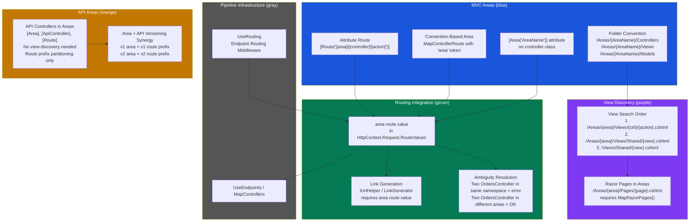
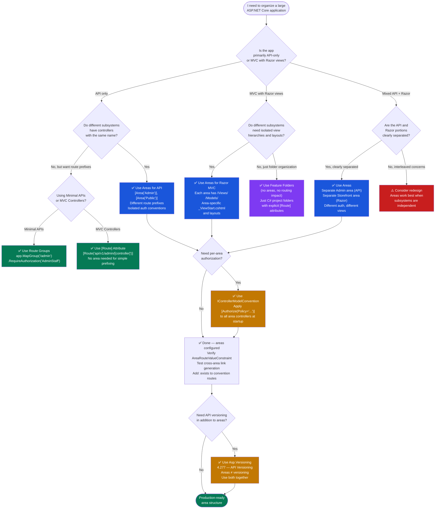

> [!success] Mastery Check
> - [ ] **Studied Well**
> - [ ] **Can explain the concept without notes**
> - [ ] **Can answer interview questions confidently**
> - [ ] **Can implement it in a real project**


# 4.105 — MVC Areas: Namespace Partitioning for Large Applications

## PART 0 — Navigation & Context

### Where This Topic Lives

```
ASP.NET Core Mastery
│
├── A. Host & Lifecycle
├── B. Configuration
├── C. Logging
├── D. Dependency Injection
├── E. Middleware Pipeline
├── F. Routing System
│   └── 4.064 Endpoint Routing
│   └── 4.067 Attribute Routing
│   └── 4.070 Route Groups
├── G. Minimal APIs
├── H. MVC & Controllers          ◄── YOU ARE HERE
│   ├── 4.098 ControllerBase vs Controller
│   ├── 4.099 Action Results
│   ├── 4.100 Model Binding
│   ├── 4.101 ApiController Attribute
│   ├── 4.102 Model Validation
│   ├── 4.103 Content Negotiation
│   ├── 4.104 Razor Pages
│   ├── 4.105 MVC Areas  ◄── THIS NOTE
│   ├── 4.106 ViewComponents
│   ├── 4.107 Output Formatters
│   ├── 4.108 Custom Model Binders
│   ├── 4.110 Filter Pipeline
│   └── ...
├── I. HTTP Fundamentals
├── J. Authentication
└── ...
```

### What You Need Before This

- **[[4.064 — Endpoint Routing: The Modern Routing System]]** — Areas plug into endpoint routing; without understanding how `UseRouting` resolves requests against the route value dictionary, the `area` route token is opaque.
- **[[4.067 — Attribute Routing on Controllers]]** — `[Area("Admin")]` and `[Route("[area]/[controller]/[action]")]` only make sense if you know how attribute routing tokens expand and override convention-based routes.
- **[[4.098 — ControllerBase vs Controller: API vs MVC Controllers]]** — Areas apply to both `ControllerBase` (API) and `Controller` (MVC/Razor). Knowing the base class determines whether you're partitioning API surfaces or Razor view hierarchies.

### What This Unlocks After

- **[[4.071 — Link Generation: IUrlHelper, LinkGenerator, and Named Routes]]** — Generating cross-area links requires the `area` route value; get it wrong and you get 404s in production.
- **[[4.106 — ViewComponents]]** — ViewComponents are conventionally discovered inside area folder structures; understanding areas first explains where ASP.NET Core looks for them.
- **[[4.110 — MVC Filter Pipeline]]** — Filters can be scoped to a specific area's controllers; area-level filter registration is a production code-organization pattern.
- **[[4.093 — Organizing Minimal APIs: Feature Slices and Extension Methods]]** — When evaluating whether to use Areas vs Minimal API feature slices for code organization, this note provides the trade-off context.

### Why This Matters at Scale

At production scale, MVC Areas are the mechanism that prevents a single monolithic controller folder from turning into a 200-file chaos of `AdminOrderController`, `PublicProductController`, and `InternalReportingController` — and more critically, they give the **routing engine distinct namespaces** so that two controllers with the same name in different subsystems never collide on URL resolution or link generation.

---

## PART 1 — The Core Mental Model

### The Fundamental Rule

> **ASP.NET Core MVC Areas partition a large application into named subsystems, each with its own controller/model/view folder hierarchy and an isolated routing namespace. The practical consequence is that two controllers named `OrdersController` can coexist — one at `/admin/orders` and one at `/api/orders` — as long as they live in different areas with non-overlapping route templates.**

### The Plain-Language Analogy

Think of a large department store where the same item — say, a customer service desk — exists on three different floors: Electronics, Home Goods, and Returns. Each desk is staffed differently, operates under different policies, and has a different entrance. MVC Areas work the same way: `OrdersController` in the `Admin` area and `OrdersController` in the `PublicApi` area are distinct desks on distinct floors. The routing engine is the building directory — it uses the `area` route token to tell you which floor to go to before it looks for the desk name. If you ask for "the customer service desk" without specifying a floor, the directory returns an error because the request is ambiguous. That maps exactly to link generation without an explicit area route value: ASP.NET Core cannot resolve the URL and returns a null link or throws at route match time. The floor/area isolation also holds for Razor Views: each area has its own `Views/` subfolder and the framework searches area-specific paths before falling back to shared layouts — just like the store's floor-specific fitting rooms before using the central one.

### The Taxonomy Diagram



---

## PART 2 — Deep Mechanics

### 2.1 — How the `area` Route Token Works in the Routing Pipeline

Areas are not a special framework feature sitting outside the routing system. They are a **convention layered on top of endpoint routing** — specifically, they inject an `area` route value into the route value dictionary for any request matched against an area route template. Understanding this mechanism is what separates engineers who can debug area routing bugs from those who just copy-paste folder structures and hope it works.

**Pipeline Position:**

```
HTTP Request
    │
    ▼
──► ExceptionHandler
──► HSTS / HttpsRedirection
──► StaticFiles
──► UseRouting()          ◄── area route value set HERE during template matching
    │  AreaControllerActionConstraint evaluated
    │  RouteValues["area"] = "Admin" (or empty if no area matched)
    ▼
──► UseCors
──► UseAuthentication
──► UseAuthorization      ◄── can read area from endpoint metadata
    ▼
──► MapControllers()      ◄── endpoint executed; controller activated
    │  ControllerFactory selects Admin.OrdersController (not Public.OrdersController)
    │  because namespace + area route value disambiguates
    ▼
Response
```

**The key internal mechanism** — when you call `app.MapControllers()` and have a controller decorated with `[Area("Admin")]`, the endpoint routing infrastructure registers a route constraint: `AreaControllerRouteValueConstraint`. On every request, the routing middleware evaluates the matched route values. If the request matches a template containing the `{area}` token (or a hardcoded area value via attribute routing), `HttpContext.Request.RouteValues["area"]` is set. The `ControllerActionDescriptor` selected must then have a matching `area` attribute value. Two controllers with the same name in different areas are disambiguated entirely by this route value.

**Framework source (approximate — `Microsoft.AspNetCore.Mvc.Infrastructure.ActionSelector`):**

```csharp
// ASP.NET Core internally (approximate):
// ControllerActionDescriptorProvider populates descriptors with area metadata
// at startup, not per-request (~O(1) lookup per request via cached trie)

internal class ControllerActionDescriptorProvider
{
    private IEnumerable<ActionDescriptor> GetDescriptors(ControllerModel controller)
    {
        // [Area("Admin")] attribute on the controller class populates:
        // descriptor.RouteValues["area"] = "Admin"
        // This route value becomes a constraint that must match at request time.
        
        foreach (var actionModel in controller.Actions)
        {
            var descriptor = new ControllerActionDescriptor
            {
                RouteValues = { ["area"] = controller.GetAreaName() } // null if no [Area]
            };
            yield return descriptor;
        }
    }
}
```

**Runtime cost:** ~O(1) endpoint selection after initial route matching (trie-based). The `area` route value is a plain string comparison — zero additional allocations vs non-area routing. Area discovery and descriptor population happen at startup (~O(n) over all controller types), not per request.

**HTTP Wire Format — Incoming Request to an Area Controller:**

```http
// HTTP request (approximate):
GET /admin/orders/42 HTTP/1.1
Host: api.ecommerce.internal
Authorization: Bearer eyJhbGci...
Accept: application/json

// After UseRouting resolves:
// HttpContext.Request.RouteValues["area"]       = "Admin"
// HttpContext.Request.RouteValues["controller"] = "Orders"
// HttpContext.Request.RouteValues["action"]     = "Details"
// HttpContext.Request.RouteValues["id"]         = "42"

// HTTP response (approximate):
HTTP/1.1 200 OK
Content-Type: application/json; charset=utf-8
{
  "orderId": 42,
  "status": "Processing"
}
```

---

### 2.2 — Folder Convention vs Attribute Routing for Areas

There are two ways to register area controllers, and conflating them produces the most common area bugs in production codebases.

**Convention-based area routing (legacy, MapControllerRoute):**

```csharp
// Program.cs — convention-based area route
app.MapControllerRoute(
    name: "areas",
    pattern: "{area:exists}/{controller=Home}/{action=Index}/{id?}");

app.MapControllerRoute(
    name: "default",
    pattern: "{controller=Home}/{action=Index}/{id?}");
```

The `{area:exists}` constraint restricts the route to only match when the `area` value corresponds to an area that actually exists (a controller decorated with `[Area("matching-name")]`). Without `:exists`, requests to `/typo/orders` would match the area route with `area="typo"` and then fail at controller selection — producing a 404 at the action selector rather than the routing stage. With `:exists`, the route simply does not match, and the request falls through to the default route.

**Attribute-routing area controllers (preferred for APIs):**

```csharp
// Areas/Admin/Controllers/OrdersController.cs
[Area("Admin")]
[Route("[area]/[controller]")]  // expands to: admin/orders
[ApiController]
public class OrdersController : ControllerBase
{
    [HttpGet("{id:int}")]
    public IActionResult GetOrder(int id) => Ok(new { orderId = id });
}
```

With attribute routing, you do NOT need `MapControllerRoute` with an area pattern — you only need `app.MapControllers()`. The `[Area]` attribute on the controller registers the `area` route value in the endpoint metadata. The `[Route("[area]/[controller]")]` template generates the actual URL. Token replacement happens at startup: `[area]` → the string value passed to `[Area(…)]`, `[controller]` → class name minus "Controller".

**The critical difference:** Convention-based routing requires the area folder structure to match route names. Attribute routing decouples the URL path from the folder location entirely — a controller in `Areas/Admin/Controllers/` could have `[Area("management")]` and respond to `/management/orders`.

**Framework source (approximate — `Microsoft.AspNetCore.Mvc.Routing.AttributeRoute`):**

```csharp
// ASP.NET Core internally (approximate):
// At startup, AttributeRoute resolves token replacement for [Area] controllers:

private string ExpandTokens(string template, ControllerActionDescriptor descriptor)
{
    return template
        .Replace("[area]",       descriptor.RouteValues["area"], StringComparison.OrdinalIgnoreCase)
        .Replace("[controller]", descriptor.ControllerName,      StringComparison.OrdinalIgnoreCase)
        .Replace("[action]",     descriptor.ActionName,          StringComparison.OrdinalIgnoreCase);
    // Cost: O(1) per template token, executed once at startup per action
}
```

---

### 2.3 — View Discovery for MVC Areas (Razor Views)

When a Razor-view MVC controller (inheriting `Controller`) inside an area returns a `ViewResult`, ASP.NET Core searches for the view in area-specific paths before shared paths. This matters when two areas share a layout name — each area can have its own `_Layout.cshtml` and the search order governs which one is used.

**View search order for `Admin` area, `Orders` controller, `Details` action:**

```
1. /Areas/Admin/Views/Orders/Details.cshtml       ◄── area-specific action view
2. /Areas/Admin/Views/Shared/Details.cshtml       ◄── area-specific shared view
3. /Views/Shared/Details.cshtml                   ◄── application-wide shared view
4. → 404 if not found
```

**_ViewStart.cshtml and _ViewImports.cshtml in areas:**

Each area can have its own `_ViewStart.cshtml` (sets the layout for area views) and `_ViewImports.cshtml` (imports tag helpers and namespaces). The search order for these is inside-out:

```
For /Areas/Admin/Views/Orders/Details.cshtml:

_ViewImports.cshtml search path:
  /Areas/Admin/Views/Orders/_ViewImports.cshtml   ◄── most specific
  /Areas/Admin/Views/_ViewImports.cshtml
  /Areas/Admin/_ViewImports.cshtml
  /_ViewImports.cshtml                            ◄── application root

_ViewStart.cshtml search path: same order
```

> [!IMPORTANT] If you do not have a `_ViewStart.cshtml` inside the area and rely on the root `_ViewStart.cshtml` to set the layout, your area views will use the root layout. This is usually correct for MVC applications but is a common surprise when areas are first added.

**Framework source (approximate — `RazorViewEngine.GetViewPath`):**

```csharp
// ASP.NET Core internally (approximate):
// RazorViewEngine checks in this order when area route value is present:

private string[] GetAreaViewLocations(string area, string controller, string view)
{
    return new[]
    {
        $"/Areas/{area}/Views/{controller}/{view}.cshtml",
        $"/Areas/{area}/Views/Shared/{view}.cshtml",
        $"/Views/Shared/{view}.cshtml"
    };
    // Cost: string concatenation at view resolution time; results are cached after first hit
}
```

**HTTP consequence — missing area view:**

```http
// HTTP request:
GET /admin/orders/42 HTTP/1.1

// If /Areas/Admin/Views/Orders/Details.cshtml does not exist:
// HTTP response:
HTTP/1.1 500 Internal Server Error
Content-Type: text/html

// Exception message (development):
// InvalidOperationException: The view 'Details' was not found.
// Searched locations:
//   /Areas/Admin/Views/Orders/Details.cshtml
//   /Areas/Admin/Views/Shared/Details.cshtml
//   /Views/Shared/Details.cshtml
```

> [!TIP] In production, this 500 is especially embarrassing because the controller logic ran successfully — only the view is missing. Always use `View(model)` with explicit view names when working across area boundaries, and add integration tests for every area/action combination.

---

### 2.4 — Razor Pages in Areas

Razor Pages can also be organized into areas, but the mechanism differs slightly from MVC controllers.

**Folder structure for Razor Pages areas:**

```
/Areas/
  Admin/
    Pages/
      Orders/
        Index.cshtml       → URL: /admin/orders
        Index.cshtml.cs
        Details.cshtml     → URL: /admin/orders/details
        Details.cshtml.cs
      _ViewImports.cshtml
      _ViewStart.cshtml
```

**Registration:**

```csharp
// Program.cs
builder.Services.AddRazorPages();

var app = builder.Build();
app.MapRazorPages();   // discovers area pages automatically via folder convention
```

Razor Pages in areas do NOT use the `[Area]` attribute — their area name is derived entirely from the folder path (`/Areas/{AreaName}/Pages/`). This is the one significant difference from MVC controllers where the attribute is required.

**HTTP Wire Format — Razor Pages Area Request:**

```http
// HTTP request:
GET /admin/orders HTTP/1.1
Host: backoffice.ecommerce.com

// Resolved to: /Areas/Admin/Pages/Orders/Index.cshtml
// PageModel: Admin.Pages.Orders.IndexModel

// HTTP response:
HTTP/1.1 200 OK
Content-Type: text/html; charset=utf-8
```

**Runtime cost:** Page discovery at startup is O(n) over page files. Per-request routing is O(1) via the cached endpoint trie, identical to controller routing.

---

### 2.5 — Namespace Isolation and Controller Naming Conflicts

The most important guarantee areas provide is that you can have two controllers with identical class names as long as they live in different areas. The routing system differentiates them exclusively via the `area` route value — not via C# namespace.

> [!WARNING] The `area` route value, not the C# namespace, is what the routing engine uses. You can have `MyApp.Areas.Admin.Controllers.OrdersController` and `MyApp.Areas.Public.Controllers.OrdersController` in the same assembly. They are different actions to the router because they have different `[Area]` attribute values. If you forget the `[Area]` attribute on one of them, you will get an `AmbiguousMatchException` at startup or at route resolution time — not a compile error.

**AmbiguousMatchException — the failure mode:**

```
// Startup exception (approximate):
Microsoft.AspNetCore.Routing.Matching.AmbiguousMatchException:
  The request matched multiple endpoints.
  Matches:
    Admin.Controllers.OrdersController.GetOrders (GET /orders)   ← missing [Area]
    Public.Controllers.OrdersController.GetOrders (GET /orders)  ← missing [Area]
```

**HTTP consequence when this reaches a running application:**

```http
// HTTP request:
GET /orders HTTP/1.1

// HTTP response (if exception not caught at startup):
HTTP/1.1 500 Internal Server Error
```

**Framework source (approximate — `AmbiguousMatchException` in `DefaultEndpointSelector`):**

```csharp
// ASP.NET Core internally (approximate):
// DefaultEndpointSelector throws when multiple endpoints match with same score:

private Endpoint SelectEndpoint(CandidateSet candidates)
{
    // Area route value is included in the route value matching score.
    // Two controllers with same route template but different area values score equally.
    // Without [Area] on both, they produce identical route value sets → ambiguity.
    
    if (validCandidates.Count > 1)
        throw new AmbiguousMatchException(BuildAmbiguousMessage(validCandidates));
    
    return validCandidates[0].Endpoint;
}
```

---

## PART 3 — Production Code Patterns

### Pattern 1: The Admin Backoffice API Area (Separated Security Surface)

A common production pattern is using areas to separate the admin API surface from the public API surface, with different authorization policies applied at the area level via a filter convention.

```csharp
// Areas/Admin/Controllers/OrderManagementController.cs
// Domain: E-commerce order management — admin-only operations

[Area("Admin")]
[Route("[area]/api/[controller]")]     // → /admin/api/ordermanagement
[ApiController]
[Authorize(Policy = "AdminStaff")]     // ✅ CORRECT: policy applied at controller level, not per-action
public class OrderManagementController : ControllerBase
{
    private readonly IOrderRepository _orders;
    private readonly ILogger<OrderManagementController> _logger;

    public OrderManagementController(IOrderRepository orders,
        ILogger<OrderManagementController> logger)
    {
        _orders = orders;
        _logger = logger;
    }

    [HttpGet("{orderId:guid}")]
    [ProducesResponseType<OrderAdminDetail>(StatusCodes.Status200OK)]
    [ProducesResponseType<ProblemDetails>(StatusCodes.Status404NotFound)]
    public async Task<IActionResult> GetOrderDetail(Guid orderId, CancellationToken ct)
    {
        var order = await _orders.GetAdminDetailAsync(orderId, ct);
        if (order is null)
            return Problem(
                detail: $"Order {orderId} not found",
                statusCode: StatusCodes.Status404NotFound);

        return Ok(order);
    }

    [HttpPost("{orderId:guid}/cancel")]
    [ProducesResponseType(StatusCodes.Status204NoContent)]
    [ProducesResponseType<ProblemDetails>(StatusCodes.Status409Conflict)]
    public async Task<IActionResult> CancelOrder(Guid orderId,
        [FromBody] CancelOrderRequest request,
        CancellationToken ct)
    {
        var result = await _orders.CancelAsync(orderId, request.Reason, ct);
        return result.IsSuccess ? NoContent() : Conflict(result.ToProblemDetails());
    }
}

// HTTP wire format:
// GET /admin/api/ordermanagement/3fa85f64-5717-4562-b3fc-2c963f66afa6 HTTP/1.1
// Authorization: Bearer eyJhbGci... (must satisfy "AdminStaff" policy)
//
// HTTP/1.1 200 OK
// Content-Type: application/json
// { "orderId": "3fa85...", "status": "Processing", "adminNotes": "..." }
//
// Without valid AdminStaff claim:
// HTTP/1.1 403 Forbidden
// Content-Type: application/problem+json
```

---

### Pattern 2: The Public-Facing Storefront Area (Razor MVC Views)

For applications mixing API and Razor view areas, each area owns its view hierarchy independently.

```csharp
// Areas/Storefront/Controllers/ProductCatalogController.cs
// Domain: E-commerce public product browsing

[Area("Storefront")]
public class ProductCatalogController : Controller    // ✅ Controller (not ControllerBase) for Razor views
{
    private readonly ICatalogService _catalog;

    public ProductCatalogController(ICatalogService catalog) => _catalog = catalog;

    // URL: /storefront/productcatalog/browse (convention-based routing)
    [HttpGet]
    public async Task<IActionResult> Browse([FromQuery] string? category = null,
        [FromQuery] int page = 1)
    {
        var products = await _catalog.BrowseAsync(category, page);

        // ✅ CORRECT: explicit view path avoids ambiguity when shared view names exist
        return View("~/Areas/Storefront/Views/ProductCatalog/Browse.cshtml", products);
        // Equivalent shorthand (convention finds the right area view automatically):
        // return View(products);
    }
}
```

```
// Program.cs — convention-based routing for Storefront area (Razor views)
app.MapControllerRoute(
    name: "storefront_area",
    pattern: "{area:exists}/{controller=ProductCatalog}/{action=Browse}/{id?}");

app.MapControllerRoute(
    name: "default",
    pattern: "{controller=Home}/{action=Index}/{id?}");
```

```
// Folder structure:
/Areas/
  Storefront/
    Controllers/
      ProductCatalogController.cs
    Views/
      ProductCatalog/
        Browse.cshtml
      Shared/
        _StorefrontLayout.cshtml    ← area-specific layout
    _ViewStart.cshtml               ← sets _StorefrontLayout for all area views
    _ViewImports.cshtml             ← @using Ecommerce.Areas.Storefront.Models
```

---

### Pattern 3: The Cross-Area Link Generation Pattern

Link generation across areas is where junior engineers get burned. The `area` route value must be explicitly passed or the current area's value bleeds through.

```csharp
// ⚠️ WRONG: Omitting area in cross-area link generation
// Inside Admin area controller:
public IActionResult GetPublicCatalogLink()
{
    // This generates /admin/productcatalog/browse — WRONG!
    // The current "Admin" area value is carried over
    var url = Url.Action("Browse", "ProductCatalog");
    return Ok(url);
}

// HTTP consequence (wrong path):
// { "url": "/admin/productcatalog/browse" }
// → 404 Not Found — ProductCatalog does not exist in Admin area

// ✅ CORRECT: Explicit area route value for cross-area links
public IActionResult GetPublicCatalogLink()
{
    // Explicit area="" clears the area (root-level controller)
    // Explicit area="Storefront" targets the Storefront area
    var url = Url.Action("Browse", "ProductCatalog", new { area = "Storefront" });
    return Ok(url);
}

// HTTP consequence (correct path):
// { "url": "/storefront/productcatalog/browse" }
```

```csharp
// ✅ CORRECT: Using LinkGenerator (injected service) for cross-area links
// Preferred over IUrlHelper in non-controller services and background jobs

public class OrderConfirmationEmailService
{
    private readonly LinkGenerator _links;

    public OrderConfirmationEmailService(LinkGenerator links) => _links = links;

    public string GetOrderTrackingUrl(HttpContext httpContext, Guid orderId)
    {
        // Must explicitly provide area route value
        return _links.GetPathByAction(
            httpContext,
            action:     "Track",
            controller: "Shipments",
            values: new { area = "CustomerPortal", orderId });
        // Returns: /customerportal/shipments/track?orderId=3fa85...
    }
}
```

---

### Pattern 4: Area-Level Filter Convention (Apply Policy to All Area Controllers)

Instead of repeating `[Authorize]` on every controller in an area, a filter convention applies it globally to all controllers in a named area.

```csharp
// Program.cs — area-level authorization convention
builder.Services.AddControllersWithViews(options =>
{
    // ✅ CORRECT: IControllerModelConvention targets area controllers specifically
    options.Conventions.Add(new AreaAuthorizationConvention(
        areaName:   "Admin",
        policyName: "AdminStaff"));
});

// Infrastructure/AreaAuthorizationConvention.cs
// Domain: Applied to all admin backoffice controllers
public class AreaAuthorizationConvention : IControllerModelConvention
{
    private readonly string _areaName;
    private readonly string _policyName;

    public AreaAuthorizationConvention(string areaName, string policyName)
    {
        _areaName = areaName;
        _policyName = policyName;
    }

    public void Apply(ControllerModel controller)
    {
        // Only apply to controllers with matching [Area] attribute
        var areaAttr = controller.Attributes.OfType<AreaAttribute>().FirstOrDefault();
        if (areaAttr?.RouteValue != _areaName)
            return;  // not our area — skip

        // Add authorization filter to every action in this controller
        controller.Filters.Add(new AuthorizeFilter(_policyName));
        // Cost: O(1) per controller at startup; zero runtime cost per request beyond normal auth evaluation
    }
}
```

```http
// HTTP consequence of convention:
// Any request to /admin/... without valid AdminStaff claim:
// HTTP/1.1 403 Forbidden
// Content-Type: application/problem+json
// { "type": ".../forbidden", "title": "Forbidden", "status": 403 }
```

---

### Pattern 5: The Internal Reporting Area (API-Only, No Views)

Areas also work for pure API partitioning with no Razor views — common for internal/reporting subsystems.

```csharp
// Areas/Reporting/Controllers/SalesMetricsController.cs
// Domain: Internal logistics reporting — no views, pure JSON API

[Area("Reporting")]
[Route("[area]/api/v1/[controller]")]  // → /reporting/api/v1/salesmetrics
[ApiController]
[Authorize(Policy = "InternalService")]
public class SalesMetricsController : ControllerBase
{
    [HttpGet("daily")]
    [ResponseCache(Duration = 300)]    // 5-minute cache on reporting endpoints
    [ProducesResponseType<DailySalesSummary>(StatusCodes.Status200OK)]
    public async Task<IActionResult> GetDailySummary(
        [FromQuery] DateOnly date,
        CancellationToken ct)
    {
        // ... reporting logic
        return Ok(new DailySalesSummary());
    }
}

// This area has NO Views, Models, or _ViewStart.cshtml folder — only:
// /Areas/Reporting/Controllers/SalesMetricsController.cs
// That is valid. Areas do not require all three subdirectories.
```

```http
// HTTP wire format:
// GET /reporting/api/v1/salesmetrics/daily?date=2026-06-08 HTTP/1.1
// Authorization: Bearer <internal-service-token>
// Accept: application/json
//
// HTTP/1.1 200 OK
// Content-Type: application/json
// Cache-Control: public, max-age=300
// { "date": "2026-06-08", "totalRevenue": 48920.00, "orderCount": 312 }
```

---

### Pattern 6: Versioning via Areas (The Area-as-Version Pattern)

A pragmatic pattern for large teams: use area names as a low-ceremony versioning mechanism before committing to a full API versioning library.

```csharp
// ⚠️ WRONG: Using areas as the primary API versioning strategy long-term
// This is a starting-point pattern, not a mature versioning solution.
// Areas-as-versions cannot express deprecation, sunset headers, or
// per-client version negotiation. Use Asp.Versioning for that.

// ✅ ACCEPTABLE: Area-as-version for initial API release / MVP
// Areas/V1/Controllers/ShipmentsController.cs
[Area("V1")]
[Route("api/[area]/[controller]")]  // → /api/v1/shipments
[ApiController]
public class ShipmentsController : ControllerBase
{
    [HttpGet("{trackingId}")]
    public IActionResult Track(string trackingId) => Ok(new { version = "v1", trackingId });
}

// Areas/V2/Controllers/ShipmentsController.cs
[Area("V2")]
[Route("api/[area]/[controller]")]  // → /api/v2/shipments
[ApiController]
public class ShipmentsController : ControllerBase
{
    [HttpGet("{trackingId}")]
    public IActionResult Track(string trackingId)
        => Ok(new { version = "v2", trackingId, estimatedDelivery = "2026-06-10" });
}
```

```http
// GET /api/v1/shipments/TRK-12345 HTTP/1.1
// HTTP/1.1 200 OK  { "version": "v1", "trackingId": "TRK-12345" }

// GET /api/v2/shipments/TRK-12345 HTTP/1.1
// HTTP/1.1 200 OK  { "version": "v2", "trackingId": "TRK-12345", "estimatedDelivery": "2026-06-10" }
```

---

### Pattern 7: Razor Pages Inside Areas (Admin Portal Pages)

```csharp
// Areas/Admin/Pages/Orders/Index.cshtml.cs
// Domain: Admin backoffice — Razor Pages inside an area

namespace Ecommerce.Areas.Admin.Pages.Orders;

[Authorize(Policy = "AdminStaff")]
public class IndexModel : PageModel
{
    private readonly IOrderRepository _orders;

    public IndexModel(IOrderRepository orders) => _orders = orders;

    public IReadOnlyList<OrderSummary> Orders { get; private set; } = Array.Empty<OrderSummary>();

    public async Task<IActionResult> OnGetAsync(CancellationToken ct)
    {
        Orders = await _orders.GetPendingOrdersAsync(ct);
        return Page();
    }

    [BindProperty]
    public Guid OrderIdToApprove { get; set; }

    public async Task<IActionResult> OnPostApproveAsync(CancellationToken ct)
    {
        await _orders.ApproveAsync(OrderIdToApprove, ct);
        return RedirectToPage();  // ✅ CORRECT: no area route value needed for same-area redirect
    }
}

// Program.cs
builder.Services.AddRazorPages();
app.MapRazorPages();
// No additional area configuration needed — /Areas/Admin/Pages/ is discovered automatically
```

```http
// HTTP wire format:
// GET /admin/orders HTTP/1.1
// → Resolved to /Areas/Admin/Pages/Orders/Index.cshtml
//
// POST /admin/orders HTTP/1.1
// Content-Type: application/x-www-form-urlencoded
// OrderIdToApprove=3fa85f64-...&__RequestVerificationToken=...
//
// HTTP/1.1 302 Found
// Location: /admin/orders
```

---

## PART 4 — Gotchas & Anti-Patterns

### Gotcha 1: Forgetting `[Area]` on a Controller Causes AmbiguousMatchException

Two controllers share the same name in two different areas. The developer adds the `[Area]` attribute to one but forgets the other after a refactor. The routing engine now has two descriptors with the same route path and cannot distinguish them.

```csharp
// ⚠️ WRONG CODE:
// Areas/Admin/Controllers/OrdersController.cs
[Area("Admin")]
[Route("[area]/api/[controller]")]
[ApiController]
public class OrdersController : ControllerBase { /* ... */ }

// Areas/Public/Controllers/OrdersController.cs
// ← FORGOT [Area("Public")] after refactoring
[Route("api/[controller]")]        // ← now routes to /api/orders — CONFLICTS with nothing yet
[ApiController]
public class OrdersController : ControllerBase { /* ... */ }
// Note: two controllers with the same name and no [Area] collision yet,
// but if /api/orders was formerly handled by a non-area controller that still exists:
```

```csharp
// HTTP consequence (wrong path):
// AmbiguousMatchException thrown at startup (or at first request in some configurations)
// HTTP/1.1 500 Internal Server Error during startup DI validation
// OR:
// HTTP/1.1 500 Internal Server Error on first request to /api/orders

// ✅ CORRECT CODE:
[Area("Public")]
[Route("[area]/api/[controller]")]  // → /public/api/orders
[ApiController]
public class OrdersController : ControllerBase { /* ... */ }

// HTTP consequence (correct path):
// GET /public/api/orders HTTP/1.1
// HTTP/1.1 200 OK — correctly routes to Public area's Orders controller
```

// WHY: The routing engine identifies controllers by their `RouteValues["area"]` combined with controller/action names. Without `[Area]`, two same-named controllers register identical route value dictionaries, and `DefaultEndpointSelector` cannot break the tie — it throws rather than guess.

---

### Gotcha 2: Area Route Value Bleeding in Cross-Area Link Generation

Inside an area controller, `Url.Action()` without an explicit `area` value inherits the current request's area route value. This silently generates wrong URLs that only fail at click time.

```csharp
// ⚠️ WRONG CODE (inside Admin area controller):
[Area("Admin")]
[Route("[area]/api/[controller]")]
public class DashboardController : Controller
{
    public IActionResult GetCustomerProfileUrl(Guid customerId)
    {
        // Url.Action carries the current "Admin" area value forward
        var url = Url.Action("Profile", "Customers", new { id = customerId });
        return Ok(url);
    }
}

// HTTP consequence (wrong path):
// Returns: "/admin/customers/profile?id=3fa85..."
// → 404 Not Found — Customers controller doesn't exist in the Admin area
// Client gets a 200 with a URL that 404s when clicked — silent bug

// ✅ CORRECT CODE:
var url = Url.Action("Profile", "Customers",
    new { area = "CustomerPortal", id = customerId });
// Or to escape areas entirely:
var url = Url.Action("Profile", "Customers",
    new { area = string.Empty, id = customerId });

// HTTP consequence (correct path):
// Returns: "/customerportal/customers/profile?id=3fa85..."
// → 200 OK when the client follows the link
```

// WHY: `IUrlHelper.Action()` merges the supplied route values with `HttpContext.Request.RouteValues`. The `area` key is already present in the current request's route values. Merging without explicitly overriding it means the current area is carried into the generated URL — exactly the opposite of what cross-area navigation requires.

---

### Gotcha 3: Convention-Based Area Route Without `:exists` Constraint Absorbs Typo URLs

Without the `:exists` constraint on `{area}`, a mistyped URL like `/admim/orders/42` matches the area route template, sets `area="admim"`, and then fails at controller selection — returning 404 instead of falling through to a meaningful error or the default route.

```csharp
// ⚠️ WRONG CODE:
app.MapControllerRoute(
    name: "areas",
    pattern: "{area}/{controller=Home}/{action=Index}/{id?}");  // ← no :exists constraint

// HTTP consequence (wrong path):
// GET /admim/orders/42 HTTP/1.1  (typo: admim instead of admin)
// → Route matches with area="admim", controller="orders", id="42"
// → No controller found for area="admim" → 404 Not Found
// BUT: the default route never gets a chance to handle this → useful default route is bypassed

// ✅ CORRECT CODE:
app.MapControllerRoute(
    name: "areas",
    pattern: "{area:exists}/{controller=Home}/{action=Index}/{id?}");  // ← :exists required

// HTTP consequence (correct path):
// GET /admim/orders/42 HTTP/1.1  (typo)
// → area "admim" does not exist → route does NOT match → falls through to default route
// → Default route tries "admim" as controller → controller not found → 404 with proper routing
```

// WHY: The `RouteConstraint` for `area:exists` is `AreaConstraint` — at matching time, it queries the registered area names (populated from `[Area]` attributes at startup). If the segment value does not match any registered area, the constraint fails and the route is not selected. Without it, the routing engine optimistically assumes any segment could be an area name and proceeds to controller selection, where the real 404 occurs — but by then, other routes have already been bypassed.

---

### Gotcha 4: Razor Pages Area Folder Must Be Exactly `/Areas/{Name}/Pages/` — Case Matters on Linux

On Windows (case-insensitive filesystem), `/Areas/admin/Pages/` and `/Areas/Admin/Pages/` both work. On Linux (case-sensitive), only the case matching the folder name works. This silently breaks Docker deployments.

```
// ⚠️ WRONG (works on Windows, fails on Linux/Docker):
/areas/Admin/Pages/Orders/Index.cshtml    ← lowercase 'areas'

// HTTP consequence (wrong path) on Linux:
// GET /admin/orders HTTP/1.1
// HTTP/1.1 404 Not Found
// (Razor Pages simply does not discover the page — no error logged)

// ✅ CORRECT:
/Areas/Admin/Pages/Orders/Index.cshtml    ← exact casing matches convention

// HTTP consequence (correct path) on Linux:
// GET /admin/orders HTTP/1.1
// HTTP/1.1 200 OK
```

```csharp
// Also applies to Views:
// ⚠️ WRONG (fails on Linux):
/areas/Admin/Views/Orders/Details.cshtml  ← lowercase 'areas'

// ✅ CORRECT:
/Areas/Admin/Views/Orders/Details.cshtml  ← capital A
```

// WHY: The `RazorViewEngine` and Razor Pages `PageActionDescriptorProvider` use physical file system paths derived from the ASP.NET Core conventions. The folder name `Areas` is hardcoded with a capital A in the convention. On Linux, `areas/` and `Areas/` are different directories. This is a frequent CI/CD bug when developers work on Windows and deploy to Linux containers — the file exists on disk but is simply not found by the framework's path resolver.

---

### Gotcha 5: Area Name in `[Area]` Attribute Is Case-Sensitive for Route Matching but Case-Insensitive for URL Segments

The `[Area("Admin")]` attribute registers the area route value as `"Admin"` (capital A). Route matching against the URL segment `/admin/orders` (lowercase a) succeeds because route matching is case-insensitive by default. But link generation uses the literal value from the attribute — so `Url.Action("Index", "Orders", new { area = "admin" })` might generate `/admin/orders` while `Url.Action("Index", "Orders", new { area = "Admin" })` generates `/Admin/orders`. On a case-insensitive server (IIS/Windows), both work. On a case-sensitive server (nginx/Linux), the casing of the generated link matters for the client.

```csharp
// ⚠️ WRONG — inconsistent casing leads to case-sensitive 404 on Linux:
[Area("Admin")]   // registered as "Admin"
// ...
var url = Url.Action("Index", "Orders", new { area = "admin" }); // lowercase "admin"
// Generates: /admin/orders — works on IIS, may 404 on nginx depending on config

// ✅ CORRECT — match the casing of the [Area] attribute exactly in route values:
var url = Url.Action("Index", "Orders", new { area = "Admin" }); // matches [Area("Admin")]
// Generates: /Admin/orders — consistent with the registered area name

// ✅ ALSO CORRECT — lowercase convention across the entire codebase:
[Area("admin")]   // registered as "admin" — lowercase throughout
// ...
var url = Url.Action("Index", "Orders", new { area = "admin" });
// Generates: /admin/orders — consistent
```

// WHY: Route matching uses `StringComparison.OrdinalIgnoreCase` to match the incoming URL segment against route templates, so `/admin/` matches `{area}` regardless of the casing stored in the route value dictionary. But link generation uses the exact string stored in the route value dictionary. If the `area` route value in link generation differs in case from the template, route constraints may fail and the link returns `null` or an unexpected path. Establish a team convention — either always lowercase area names or always match the attribute casing.

---

## PART 5 — Performance Implications

### 5.1 — Request Pipeline Characteristics Table

|Scenario|Pipeline Depth|Allocations Per Request|Approx Latency Impact|Recommendation|
|---|---|---|---|---|
|Area route matching (trie lookup, single area)|Same as non-area|~0 extra allocations|< 0.1 µs|No concern — route value dict already allocated|
|Area route matching (20 areas, high-overlap templates)|Same depth, wider candidate evaluation|~0 extra allocations|< 1 µs|Use `{area:exists}` to prune candidates early|
|View discovery (area view, first hit)|Post-endpoint|1-2 string allocations for path construction|~5-20 µs on first hit|Warm up with `/healthz` redirect on startup|
|View discovery (area view, cached hit)|Post-endpoint|0 extra allocations (result cached)|< 1 µs|Default behavior — no action needed|
|Cross-area `Url.Action()` with explicit area value|Post-endpoint|~2-3 string allocations|~2-5 µs|No concern for non-hot-path usage|
|Cross-area `Url.Action()` without area value (fallback scan)|Post-endpoint|~4-6 string allocations + linear scan|~10-30 µs|Always provide explicit area — see Gotcha 2|
|`AmbiguousMatchException` at startup|Startup|N/A (startup exception)|~0ms (app won't start)|Fail fast: good. Fix with `[Area]` attribute.|
|Razor Pages area discovery at startup|Startup only|O(n) page file scan|+50-200 ms startup|Acceptable; pages cached after discovery|
|Filter convention application at startup (`IControllerModelConvention`)|Startup only|O(n) per controller|+1-5 ms startup|Negligible at production scale|
|IAuthorizationHandler evaluation per area-authorized request|Per request|~2-4 allocations (claims evaluation)|~5-50 µs (memory)|Cache results if policy involves DB lookup|

### 5.2 — BenchmarkDotNet: Area Route Resolution vs Non-Area

```csharp
using BenchmarkDotNet.Attributes;
using BenchmarkDotNet.Running;
using Microsoft.AspNetCore.Builder;
using Microsoft.AspNetCore.Http;
using Microsoft.AspNetCore.Routing;
using Microsoft.Extensions.DependencyInjection;

// Benchmark: Compare URL resolution cost for area vs non-area routes
// Domain: E-commerce order management — measuring link generation overhead

[MemoryDiagnoser]
[SimpleJob(BenchmarkDotNet.Jobs.RuntimeMoniker.Net80)]
public class AreaLinkGenerationBenchmarks
{
    private IServiceProvider _services = null!;
    private LinkGenerator _linkGenerator = null!;
    private DefaultHttpContext _httpContext = null!;

    [GlobalSetup]
    public void Setup()
    {
        var builder = WebApplication.CreateBuilder();
        builder.Services.AddControllers();
        var app = builder.Build();
        app.MapControllers();

        _services = app.Services;
        _linkGenerator = _services.GetRequiredService<LinkGenerator>();

        _httpContext = new DefaultHttpContext();
        _httpContext.RequestServices = _services;
        _httpContext.Request.RouteValues["area"] = "Admin";
        _httpContext.Request.RouteValues["controller"] = "Orders";
    }

    [Benchmark(Baseline = true)]
    public string NonAreaLink()
    {
        // No area route value — plain controller action
        return _linkGenerator.GetPathByAction(
            _httpContext,
            action:     "GetOrder",
            controller: "PublicOrders",
            values:     new { id = 42 }) ?? string.Empty;
    }

    [Benchmark]
    public string SameAreaLink()
    {
        // Same area as current request — area value inherited
        return _linkGenerator.GetPathByAction(
            _httpContext,
            action:     "Cancel",
            controller: "Orders",
            values:     new { id = 42 }) ?? string.Empty;
    }

    [Benchmark]
    public string CrossAreaLinkExplicit()
    {
        // Explicit cross-area link — correct pattern
        return _linkGenerator.GetPathByAction(
            _httpContext,
            action:     "Track",
            controller: "Shipments",
            values:     new { area = "CustomerPortal", id = 42 }) ?? string.Empty;
    }

    [Benchmark]
    public string CrossAreaLinkNoArea()
    {
        // Anti-pattern: no area specified, current area bleeds in
        // Will generate wrong URL or null — measures the cost of the mistake
        return _linkGenerator.GetPathByAction(
            _httpContext,
            action:     "Track",
            controller: "Shipments",
            values:     new { id = 42 }) ?? string.Empty;
    }
}

// Expected output (approximate, .NET 8, x64, Kestrel, local):
// | Method                   | Mean     | Error    | StdDev   | Ratio | Gen0   | Allocated |
// |------------------------- |---------:|---------:|---------:|------:|-------:|----------:|
// | NonAreaLink              | 1.82 µs  | 0.023 µs | 0.021 µs |  1.00 | 0.0191 |     248 B |
// | SameAreaLink             | 1.79 µs  | 0.019 µs | 0.017 µs |  0.98 | 0.0191 |     248 B |
// | CrossAreaLinkExplicit    | 2.03 µs  | 0.027 µs | 0.025 µs |  1.12 | 0.0229 |     296 B |
// | CrossAreaLinkNoArea      | 2.41 µs  | 0.031 µs | 0.029 µs |  1.33 | 0.0267 |     344 B |
//
// Interpretation: Area routing adds <20% overhead to link generation vs non-area routing.
// The wrong pattern (no area specified, fallback scan) is ~33% slower and allocates more.
// At <3 µs total, this is never the bottleneck — focus optimization elsewhere.
```

> [!NOTE] For real HTTP performance profiling, use `dotnet-counters monitor --process-id <pid>` to watch `aspnetcore-routing/requests-matched-per-second` and `dotnet-trace collect` to see endpoint selection time. BenchmarkDotNet measures isolated link generation — full request pipeline cost is dominated by I/O, not routing.

### 5.3 — When to Care / When to Ignore

**When area routing costs you:**

Areas add zero measurable runtime cost to route matching — the trie-based endpoint resolver operates identically with or without area route values. The cases where areas hurt you are entirely at startup and development time:

- **Large applications with 100+ areas**: Startup time increases because `ControllerActionDescriptorProvider` scans all assembly types to discover `[Area]` attributes. At 200 controllers across 20 areas, expect +100-300 ms added to startup. Use `WebApplicationBuilder.Environment.IsDevelopment()` checks to skip expensive startup validation in production.
- **Razor view compilation**: The first request to each area view triggers `RazorViewEngine` path resolution and potential compilation. Pre-compile views with `builder.Services.AddRazorPages().AddRazorRuntimeCompilation()` disabled in production (the default) — views are compiled at publish time.
- **Cross-area link generation without explicit area**: The only per-request cost to care about is the fallback scan in `LinkGenerator` when the area is ambiguous. At >10k req/s, even 0.5 µs extra per request adds up to 5 ms/s of CPU time. Always pass explicit area values.

**When area routing doesn't matter:**

- **Most production applications** — area route resolution adds < 2 µs per request and zero allocations on the hot path. This is noise compared to database queries, serialization, or external HTTP calls.
- **Internal admin endpoints** — even if link generation is slightly slower, admin endpoints handle 10-100 req/s at most. Total irrelevant.
- **Feature flag and A/B testing scenarios** — areas are a structural concern, not a per-feature-flag concern. Don't swap areas at runtime based on feature flags; that's what middleware branching (`UseWhen`) is for.

---

## PART 6 — Interview Arsenal

### A. The Question Bank

---

**Question 1: "What are MVC Areas and why would you use them in a large ASP.NET Core application?"**

**Average Answer:** Areas are a way to organize controllers and views into separate folders so you can have multiple controllers with the same name. You add an `[Area]` attribute to the controller and a folder structure under `/Areas/`.

**Why That's Insufficient:** It describes the mechanism but says nothing about the routing consequence, the disambiguation problem it solves, or when you would choose areas over other organization strategies.

**Great Answer:**

> "Areas solve a specific problem: in a large application, you inevitably end up with domain-specific controllers that share the same conceptual name — `OrdersController` for the admin backoffice and `OrdersController` for the public API, for example. Without areas, those two controllers would produce an `AmbiguousMatchException` at startup because the routing engine can't distinguish them. Areas inject an additional route value — the `area` key — into the endpoint's route value dictionary. The routing engine then treats the combination of `{area, controller, action}` as the composite key for endpoint selection, not just `{controller, action}`. The HTTP consequence is that `/admin/orders` and `/public/orders` route to entirely different controllers with no collision. Beyond conflict resolution, areas also give you isolated view hierarchies for Razor MVC applications — each area can have its own layout, `_ViewImports`, and shared partial views without polluting the root `Views/Shared` folder. I'd choose areas over feature-slice folders when the subsystems are large enough to warrant isolated routing namespaces, especially when they have different authorization policies applied via filter conventions at the area level."

---

**Question 2: "How does route generation work differently inside an area vs outside one?"**

**Average Answer:** You need to pass the `area` route value when generating links across areas, like `Url.Action("Index", "Orders", new { area = "Admin" })`.

**Why That's Insufficient:** Correct syntax but doesn't explain why omitting the area value causes silent wrong URL generation rather than an exception, or how `IUrlHelper` merges current route values.

**Great Answer:**

> "The subtlety here is that `IUrlHelper.Action()` and `LinkGenerator.GetPathByAction()` merge the supplied route values with the current request's route values — they don't start from a clean slate. When you're inside an area controller, the current request already has `RouteValues["area"] = "Admin"`. If you call `Url.Action("Track", "Shipments")` without an explicit area value, the merger carries the current `"Admin"` area value forward. You get a URL like `/admin/shipments/track` — which almost certainly doesn't exist — and ASP.NET Core hands it back to you as a valid-looking string, no exception thrown. The client gets a 404 when they follow the link. To cross an area boundary, you must explicitly supply the target area: `new { area = "Logistics" }`. To escape areas entirely and target a root-level controller, you pass `new { area = "" }` or `new { area = string.Empty }` — the empty string clears the inherited value. This is the area gotcha that burns experienced engineers most often because it works fine in unit tests that don't have an HttpContext with area route values populated, and only fails in integration."

---

**Question 3: "What is the `:exists` constraint in an area route template and why is it important?"**

**Average Answer:** It makes sure the area exists before matching the route, to avoid 404s.

**Why That's Insufficient:** Vague — doesn't explain the exact mechanism (what "exists" means, what happens without it, and how it interacts with subsequent routes).

**Great Answer:**

> "The `{area:exists}` constraint in a convention-based area route — like `{area:exists}/{controller}/{action}` — is implemented by `AreaConstraint`, which checks the incoming URL segment against the set of area names registered at startup from `[Area]` attributes. Without `:exists`, the route template `{area}/{controller}/{action}` is a greedy wildcard — any three-segment URL matches it. So a typo like `/admim/orders/list` matches with `area="admim"`, then fails at controller selection because no `OrdersController` exists in area `"admim"`. The 404 comes from the action selector, not the router — and the subsequent routes in the pipeline never run, because this route already claimed the request. With `:exists`, the constraint fires during route matching and fails immediately when `"admim"` isn't a registered area name. The route is skipped, and the next registered route gets a chance. The practical production consequence is that `:exists` prevents area routes from absorbing requests destined for non-area controllers, which matters when area routes are registered before the default controller route."

---

### B. Trick Questions

---

**Trick 1: "If I have `[Area("Admin")]` on a controller but no `[Route]` attribute, what URL does it respond to?"**

**The Trap:** Candidates assume `[Area]` alone generates a URL prefix.

**Correct Answer:** `[Area("Admin")]` alone does nothing to the URL. Without a `[Route]` attribute for attribute routing, or a matching convention-based route registered with the `{area}` token, the controller is unreachable. `[Area]` only registers the `area` route value in the endpoint descriptor — it does not generate a URL prefix. The URL is determined by the route template, either from `[Route("[area]/[controller]")]` or from `MapControllerRoute` with `{area}` in the pattern. A controller with `[Area("Admin")]` and no route template produces an `InvalidOperationException` during controller discovery (attribute routing) or simply never matches any request (convention routing with no area route registered).

---

**Trick 2: "I have two `OrdersController` classes in different namespaces but neither has the `[Area]` attribute. Will ASP.NET Core complain at startup?"**

**The Trap:** Candidates think namespaces disambiguate controllers in routing.

**Correct Answer:** Yes, ASP.NET Core will throw `AmbiguousMatchException` — either at startup or on the first request — because two controllers with the same name and no area differentiation register identical `{controller=Orders}` route values. C# namespaces are invisible to the MVC routing system. The only routing-level disambiguation mechanisms are: the `area` route value (via `[Area]`), different route templates (via `[Route]`), or HTTP verb constraints. Namespace differences alone are not sufficient.

---

**Trick 3: "What happens if a Razor Pages area folder is named `/Areas/admin/Pages/` (lowercase 'admin') but the area route generates URLs like `/Admin/orders` (uppercase 'Admin')?"**

**The Trap:** Candidates assume case-insensitive routing means case-insensitive file system access.

**Correct Answer:** Route matching is case-insensitive (a request to `/admin/orders` and `/Admin/orders` both match). But file system access on Linux is case-sensitive. If the folder is `/Areas/admin/Pages/` and the Razor Pages convention looks for `/Areas/Admin/Pages/`, the pages are not discovered on Linux. The application starts without error — it simply finds no pages in that area — and every request to area URLs returns 404. On Windows (case-insensitive NTFS) this works fine. This is a silent cross-platform bug that only surfaces in Docker/Linux deployment.

---

**Trick 4: "Can a Razor Page in an area have a different area name from its folder name?"**

**The Trap:** Candidates may assume the area name is always derived from the folder name for Razor Pages.

**Correct Answer:** No — for Razor Pages, the area name is always derived from the folder path convention (`/Areas/{AreaName}/Pages/`). There is no `[Area]` attribute mechanism for Razor Pages. The area name IS the folder segment between `Areas` and `Pages`. This is a key difference from MVC controllers where `[Area("SomeName")]` can be on a controller in any folder location — the attribute governs the routing, not the physical path.

---

### C. Red Flags to Avoid

1. **"Areas are just for organizing folders."** — Wrong at the routing level. Areas inject a route value into the endpoint descriptor. The folder convention is the physical manifestation; the route value is the mechanism. Saying "just folders" misses the entire routing disambiguation story.
    
2. **"You can use namespaces to avoid controller name conflicts."** — Namespaces are invisible to ASP.NET Core routing. The route value dictionary has no concept of C# namespaces. This approach has not worked since the move to endpoint routing and will produce `AmbiguousMatchException`.
    
3. **"The `[Area]` attribute generates the URL prefix automatically."** — `[Area]` only registers a route value. The URL template comes from `[Route]` (attribute routing) or `MapControllerRoute` (convention routing). Confusing these two will mislead an interviewer who actually knows the topic.
    
4. **"Areas and API versioning are the same thing."** — Areas provide routing isolation, not semantic versioning, deprecation headers, or per-client version negotiation. Using areas as a versioning shortcut is a pragmatic starting point, but conflating them with a proper versioning strategy like `Asp.Versioning` demonstrates unfamiliarity with production API lifecycle management.
    
5. **"I always put `[Authorize]` on every controller in an area."** — The production pattern for area-level authorization is `IControllerModelConvention`, which applies the filter once to all controllers in the area at startup. Repeating `[Authorize]` on every controller is error-prone (one missing attribute = security hole) and signals unfamiliarity with convention-based configuration.
    
6. **"Area route matching is slower than non-area routing."** — False. The endpoint routing trie includes area route values in its matching structure. The per-request cost difference is unmeasurable. Claiming performance concern about area routing is a red flag that the candidate hasn't actually profiled it.
    
7. **"Cross-area redirects are complex — I just hardcode the URL string."** — Hardcoded URL strings bypass link generation entirely, break with route changes, and are a maintenance liability. The correct answer is `Url.Action("Action", "Controller", new { area = "TargetArea" })` or `LinkGenerator`.
    

---

## PART 7 — Decision Framework



---

## PART 8 — Self-Check

### A. Conceptual Questions

1. What is the routing-level mechanism that distinguishes two `OrdersController` classes in different areas? Name the specific route value key and explain where it is set during the request pipeline.
    
2. What happens to the HTTP request if you register a convention-based area route with `{area}/{controller}/{action}` (no `:exists` constraint) and a request arrives for `/typo/anything/action`?
    
3. Explain why `Url.Action("Details", "Products")` called from inside an Admin area controller might generate a URL pointing to the Admin area's `ProductsController` instead of the root-level one. What does the fix look like?
    
4. What is the view search order for a Razor MVC controller in the `Storefront` area, action `Browse`, controller `ProductCatalog`? List all three paths checked in order.
    
5. What is the difference between how Razor Pages and MVC controllers determine their area name? Which uses an attribute, which uses folder convention?
    
6. You deploy to a Linux Docker container and all your area Razor Pages return 404, despite working perfectly on your Windows development machine. What is the most likely cause?
    
7. A junior engineer puts `[Authorize(Policy = "AdminStaff")]` on 15 out of 16 controllers in the Admin area, missing the last one accidentally. What is the better approach for enforcing area-wide authorization, and what class implements it?
    
8. What is the HTTP status code returned when `AmbiguousMatchException` is thrown during request matching due to two controllers with the same name and no area differentiation? Is this thrown at startup or at request time?
    
9. In a Minimal APIs application, what is the equivalent of MVC Areas for route prefix isolation and per-group authorization?
    
10. Can you have an MVC area that contains only controllers and no Views or Models folder? What would you need to add or omit to make this work?
    

---

### B. Code Puzzles

---

**Puzzle 1: What is the HTTP response?**

```csharp
// Program.cs
builder.Services.AddControllers();
var app = builder.Build();

// Area route registered WITHOUT :exists constraint
app.MapControllerRoute(
    name: "areas",
    pattern: "{area}/{controller=Home}/{action=Index}/{id?}");

app.MapControllerRoute(
    name: "default",
    pattern: "{controller=Home}/{action=Index}/{id?}");

app.Run();

// HomeController.cs (root level, no [Area])
public class HomeController : ControllerBase
{
    [HttpGet]
    public IActionResult Index() => Ok("root home");
}

// Request arrives:
// GET /admin/home/index HTTP/1.1
// (No AdminArea exists — no [Area("Admin")] controller anywhere in the assembly)
```

<details> <summary>Answer</summary>

**HTTP Response: 404 Not Found**

Without the `:exists` constraint, the area route `{area}/{controller}/{action}` matches the request with `area="admin"`, `controller="home"`, `action="index"`. The routing engine selects this route and proceeds to action selection. It looks for a controller named `HomeController` with `RouteValues["area"] = "admin"`. The root `HomeController` has no `[Area]` attribute, so its `RouteValues["area"]` is null/empty — it does not match the `area="admin"` requirement. No controller is found. **The default route is never reached** because the area route already claimed the request by matching the URL template. The result is 404.

With `{area:exists}` and no Admin area registered, the area route would fail at constraint evaluation, fall through to the default route, which would also fail (no segment matching `admin` as a controller), and return 404 via proper routing — but the HomeController at the root would respond correctly to `/home/index`. The `:exists` constraint is what allows the default route to handle non-area URLs.

</details>

---

**Puzzle 2: What URL does `url` contain?**

```csharp
// Context: executing inside a controller decorated with [Area("Admin")]
// at /admin/orders/list

[Area("Admin")]
[Route("[area]/[controller]/[action]")]
[ApiController]
public class OrdersController : ControllerBase
{
    [HttpGet("list")]
    public IActionResult List()
    {
        // Attempting to generate a link to the Reporting area's SalesController
        var url = Url.Action("Summary", "Sales", new { month = "2026-06" });
        return Ok(url);
    }
}

// Areas/Reporting/Controllers/SalesController.cs
[Area("Reporting")]
[Route("[area]/[controller]/[action]")]
[ApiController]
public class SalesController : ControllerBase
{
    [HttpGet]
    public IActionResult Summary([FromQuery] string month) => Ok(month);
}
```

<details> <summary>Answer</summary>

**`url` = `/admin/sales/summary?month=2026-06`** — Wrong URL.

`Url.Action("Summary", "Sales", new { month = "2026-06" })` does not supply an explicit `area` route value. `IUrlHelper.Action()` merges supplied values with the current request's route values. The current request has `RouteValues["area"] = "Admin"`. The merge result is `{ area = "Admin", controller = "Sales", action = "Summary", month = "2026-06" }`.

The Reporting area's `SalesController` has `[Area("Reporting")]` — so it requires `area = "Reporting"`. The generated URL points to `/admin/sales/summary?month=2026-06`, not `/reporting/sales/summary?month=2026-06`.

When the client follows this URL, they get 404 because there is no `SalesController` in the Admin area.

**Fix:**

```csharp
var url = Url.Action("Summary", "Sales", new { area = "Reporting", month = "2026-06" });
// Returns: /reporting/sales/summary?month=2026-06
```

</details>

---

**Puzzle 3: Will this application start successfully? What happens at first request?**

```csharp
// AssemblyA (same assembly, two controllers, same name, different namespaces)

namespace ECommerce.Areas.Admin.Controllers;

[Area("Admin")]
[Route("[area]/[controller]")]
[ApiController]
public class ProductsController : ControllerBase
{
    [HttpGet] public IActionResult List() => Ok("admin products");
}

// ---

namespace ECommerce.Areas.Catalog.Controllers;

[Area("Catalog")]
[Route("[area]/[controller]")]
[ApiController]
public class ProductsController : ControllerBase
{
    [HttpGet] public IActionResult List() => Ok("catalog products");
}

// Program.cs
builder.Services.AddControllers();
var app = builder.Build();
app.MapControllers();
app.Run();
```

<details> <summary>Answer</summary>

**Application starts successfully. Both endpoints are reachable and there is no ambiguity.**

- `Admin.Controllers.ProductsController` registers route: `GET /admin/products` with `RouteValues["area"] = "Admin"`
- `Catalog.Controllers.ProductsController` registers route: `GET /catalog/products` with `RouteValues["area"] = "Catalog"`

These are distinct route descriptors with different `area` route values. The routing engine never confuses them. The two controllers happen to share a C# class name and namespace-minus-area, but that is irrelevant to routing.

- `GET /admin/products` → 200 `"admin products"`
- `GET /catalog/products` → 200 `"catalog products"`

This is the correct behavior. This puzzle demonstrates that the C# namespace does **not** matter for disambiguation — the `[Area]` attribute value is the sole discriminator.

</details>

---

**Puzzle 4: Where is the bug? What is the HTTP consequence?**

```csharp
// Areas/CustomerPortal/Controllers/AccountController.cs

[Area("CustomerPortal")]
// ← Note: NO [Route] attribute
[ApiController]
public class AccountController : ControllerBase
{
    [HttpGet("profile")]
    public IActionResult GetProfile() => Ok("profile data");
}

// Program.cs
builder.Services.AddControllers();
var app = builder.Build();

// Only convention-based route — no area route registered
app.MapControllerRoute(
    name: "default",
    pattern: "{controller}/{action}/{id?}");

app.Run();

// Request:
// GET /customerportal/account/profile HTTP/1.1
```

<details> <summary>Answer</summary>

**HTTP Response: 404 Not Found**

Two bugs cooperate:

1. The controller has `[Area("CustomerPortal")]` but no `[Route]` template. Without a `[Route]` attribute, attribute routing does not generate a URL for this controller. The `[HttpGet("profile")]` attribute generates only the action template `profile`, but there is no controller-level route to prefix it. In attribute routing, a controller without a `[Route]` attribute is unreachable via attribute routing.
    
2. Even if the controller had `[Route("[area]/[controller]")]`, the convention-based `MapControllerRoute` does not include an area segment in its pattern. The only registered convention route is `{controller}/{action}/{id?}`. A request to `/customerportal/account/profile` would need the area route `{area:exists}/{controller}/{action}` to match correctly via convention routing.
    

The combination means: no attribute route is generated (no controller-level `[Route]`), and no convention route matches the three-segment URL correctly with area semantics. The request returns 404.

**Fix:**

```csharp
[Area("CustomerPortal")]
[Route("[area]/[controller]")]   // ← add this
[ApiController]
public class AccountController : ControllerBase { ... }
```

And in Program.cs, add:

```csharp
app.MapControllerRoute(
    name: "areas",
    pattern: "{area:exists}/{controller}/{action}/{id?}");
```

Or rely solely on the `[Route]` attribute (attribute routing) with `app.MapControllers()`.

</details>

---

**Puzzle 5: What is the output of the response body? (Most Common Misunderstanding)**

```csharp
// This puzzle targets the #1 area gotcha: area value bleeding in redirects

[Area("Admin")]
[Route("[area]/[controller]/[action]")]
public class OrderFlowController : Controller
{
    [HttpGet]
    public IActionResult Success(Guid orderId)
    {
        // After successful order, redirect to the "thank you" page
        // in the CustomerPortal area
        return RedirectToAction("ThankYou", "Confirmation", new { orderId });
    }
}

// Areas/CustomerPortal/Controllers/ConfirmationController.cs
[Area("CustomerPortal")]
[Route("[area]/[controller]/[action]")]
public class ConfirmationController : Controller
{
    [HttpGet]
    public IActionResult ThankYou(Guid orderId)
        => Content($"Thank you for order {orderId}!");
}

// Request:
// GET /admin/orderflow/success?orderId=abc123 HTTP/1.1
```

<details> <summary>Answer</summary>

**HTTP Response from the original request: 302 Found** **Location header: `/admin/confirmation/thankyou?orderId=abc123`** — Wrong area!

**Then the redirected request:** **GET /admin/confirmation/thankyou?orderId=abc123 → 404 Not Found**

`RedirectToAction("ThankYou", "Confirmation", new { orderId })` does not supply an explicit `area` route value. The current request is in the `Admin` area. The merge of `{ orderId }` with the current route values produces `{ area = "Admin", controller = "Confirmation", action = "ThankYou", orderId = "abc123" }`.

There is no `ConfirmationController` in the Admin area, so the redirect target returns 404. The end-user sees a 302 followed by a 404 — confusing but silent at the server log level unless you're watching redirected 404s.

**Fix:**

```csharp
return RedirectToAction("ThankYou", "Confirmation",
    new { area = "CustomerPortal", orderId });
// Redirect Location: /customerportal/confirmation/thankyou?orderId=abc123
// → 200 OK: "Thank you for order abc123!"
```

This is the most common production area bug: forgetting to clear or override the area route value in cross-area redirects.

</details>

---

## PART 9 — Connections & Resources

### A. Related Topics Table

|Topic|Why It Connects|
|---|---|
|[[4.067 — Attribute Routing on Controllers]]|`[Area]` combined with `[Route("[area]/[controller]")]` — the `[area]` token in attribute route templates is the primary URL generation mechanism for area controllers; understanding token replacement is a prerequisite.|
|[[4.064 — Endpoint Routing: The Modern Routing System]]|Areas inject the `area` route value into the endpoint descriptor during `MapControllers()` registration; the `AreaControllerRouteValueConstraint` is evaluated during the trie-based endpoint selection phase of `UseRouting`.|
|[[4.071 — Link Generation: IUrlHelper, LinkGenerator, and Named Routes]]|Every cross-area redirect and link generation call must explicitly supply the `area` route value; `IUrlHelper.Action()` merges current route values — the most common area bug originates here.|
|[[4.110 — MVC Filter Pipeline: Six Filter Types and Execution Order]]|`IControllerModelConvention` applies filters (including `AuthorizeFilter`) to all controllers in a named area at startup — the production pattern for area-wide authorization; filters run inside the MVC filter pipeline after routing resolves the area.|
|[[4.098 — ControllerBase vs Controller: API vs MVC Controllers]]|API areas use `ControllerBase`; Razor view areas use `Controller`; the base class determines whether view discovery and `_ViewStart.cshtml` resolution run as part of the request.|
|[[4.093 — Organizing Minimal APIs: Feature Slices and Extension Methods]]|Minimal API route groups are the alternative to MVC areas for pure API organization; understanding both enables the correct architecture decision for new services.|
|[[4.277 — API Versioning: URL Path, Query String, and Header Strategies]]|Areas-as-versions is a shortcut pattern; `Asp.Versioning` is the production versioning strategy — they can and should coexist in large APIs where areas provide namespace isolation and versioning provides deprecation semantics.|
|[[4.035 — Service Lifetimes: Singleton, Scoped, Transient]]|`IControllerModelConvention` is applied once at startup (singleton-like execution); conventions execute against `ControllerModel` objects, not live request instances — no lifetime concerns, but understanding this prevents confusion about when convention code runs.|
|[[4.052 — Middleware Ordering: The Canonical Order and Why It Matters]]|`UseRouting` must precede `UseAuthentication` which must precede `UseAuthorization` — area-specific authorization policies applied via conventions run as part of the MVC filter pipeline inside the endpoint execution, after `UseAuthorization` middleware runs.|

### B. Books

|Book|Chapters|Why These Chapters|
|---|---|---|
|_ASP.NET Core in Action_ — Andrew Lock (3rd Ed.)|Ch. 14: MVC Controllers and Action Results; Ch. 15: Routing in MVC|Ch. 14 covers controller organization patterns including areas; Ch. 15 explains the interaction between endpoint routing, convention-based routes, and attribute routing that governs how area routes are matched.|
|_Pro ASP.NET Core 8_ — Adam Freeman|Ch. 21: Using Areas|Dedicated chapter on area configuration, view discovery, and Razor Pages in areas; Freeman's worked examples show the folder structure and route registration side by side.|
|_Dependency Injection in .NET_ — Mark Seemann & Steven van Deursen|Ch. 11: DI in MVC Applications|Relevant for understanding `IControllerModelConvention` and where application model conventions fit in the startup DI pipeline — necessary context for the area-level filter convention pattern.|

### C. Essential Articles & Docs

- **Microsoft Docs — Areas in ASP.NET Core**: https://learn.microsoft.com/en-us/aspnet/core/mvc/controllers/areas — The authoritative reference for folder conventions, attribute configuration, and Razor Pages in areas.
- **Microsoft Docs — Routing to Controller Actions in ASP.NET Core**: https://learn.microsoft.com/en-us/aspnet/core/mvc/controllers/routing — The `AreaControllerRouteValueConstraint` and how area route values interact with the endpoint routing trie; critical context for understanding why `:exists` is necessary.
- **Microsoft Docs — Application Model in ASP.NET Core MVC**: https://learn.microsoft.com/en-us/aspnet/core/mvc/controllers/application-model — Documents `IControllerModelConvention`, `IActionModelConvention`, and the full application model pipeline used for area-level filter conventions.
- **Andrew Lock — "Using MVC Areas in ASP.NET Core"**: https://andrewlock.net/using-mvc-areas-in-asp-net-core/ — Covers the practical differences between convention-based and attribute routing in areas, view discovery quirks, and the `:exists` constraint behavior in production.
- **ASP.NET Core GitHub — Routing source (`AreaActionConstraint`, `DefaultEndpointSelector`)**: https://github.com/dotnet/aspnetcore/tree/main/src/Mvc/Mvc.Core/src/Routing — Authoritative source for `AreaControllerRouteValueConstraint` and how `AmbiguousMatchException` is thrown; reading this makes the gotchas in Part 4 immediately obvious.

### D. Template Meta-Note

> [!NOTE] **What each part of this note is for:**
> 
> - **Part 0 — Navigation**: Where this topic sits in the ASP.NET Core hierarchy and what you must know first.
> - **Part 1 — Core Mental Model**: The one-sentence rule, a physical analogy mapped to HTTP pipeline behavior, and a full taxonomy diagram.
> - **Part 2 — Deep Mechanics**: What ASP.NET Core is actually doing internally — pipeline position, route value mechanics, view discovery, and framework source pseudocode.
> - **Part 3 — Production Code**: 7 annotated real-world patterns with HTTP wire format consequences and domain-realistic names.
> - **Part 4 — Gotchas**: 5 bugs that experienced engineers make in production, each with wrong→correct code and HTTP consequence.
> - **Part 5 — Performance**: Pipeline cost table, BenchmarkDotNet comparison, and explicit when-to-care guidance.
> - **Part 6 — Interview Arsenal**: Full Q&A with great answers, trick questions with traps explained, and red flags to avoid.
> - **Part 7 — Decision Framework**: Flowchart for "when do I use areas vs route groups vs feature folders vs versioning?"
> - **Part 8 — Self-Check**: 10 conceptual questions and 5 code puzzles (answers collapsed) requiring genuine pipeline understanding.
> - **Part 9 — Connections**: Cross-linked related topics (4.XX, 3.XX, 2.XX), curated books with specific chapters, and official/community docs only.
