> [!success] Mastery Check
> - [ ] **Studied Well**
> - [ ] **Can explain the concept without notes**
> - [ ] **Can answer interview questions confidently**
> - [ ] **Can implement it in a real project**


# 4.106 — ViewComponents: Encapsulated Server-Side UI Fragments

---

## PART 0 — Navigation & Context

### Where This Topic Lives

```
ASP.NET Core Mastery
└── H. MVC & Controllers  (4.098–4.122)
    ├── 4.098  ControllerBase vs Controller
    ├── 4.099  Action Results: IActionResult, ActionResult<T>
    ├── 4.100  Model Binding: Sources and Algorithm
    ├── 4.101  ApiController Attribute
    ├── 4.102  Model Validation: DataAnnotations and ModelState
    ├── 4.103  Content Type Negotiation
    ├── 4.104  Razor Pages: PageModel and Handlers
    ├── 4.105  MVC Areas
    ├── 4.106  ViewComponents  ◄ YOU ARE HERE
    ├── 4.107  Output Formatters
    ├── 4.108  Custom Model Binders
    ├── 4.109  Binding Source Attributes
    ├── 4.110  MVC Filter Pipeline
    └── ...
```

### What You Need Before This

- **[[4.034 — The Built-In DI Container: Service Registration and Resolution]]** — ViewComponents receive all dependencies via constructor injection from the DI container; understanding registration and resolution is a hard prerequisite.
- **[[4.035 — Service Lifetimes: Singleton, Scoped, Transient — Rules and Pitfalls]]** — ViewComponents are activated per-invocation; understanding what lifetime that creates and which services can be safely consumed is essential.
- **[[4.064 — Endpoint Routing: The Modern Routing Architecture]]** — ViewComponents are _not_ routed. Understanding routing reveals exactly what ViewComponents aren't: they don't respond to HTTP requests, they don't participate in route matching, and they have no URL.
- **[[4.098 — ControllerBase vs Controller: API vs MVC Controllers]]** — ViewComponents are a third programming model alongside Controllers and Razor Pages. Understanding the controller model shows why ViewComponents are separate.

### What This Unlocks After

- **[[4.104 — Razor Pages: PageModel, Handlers, and When to Use vs MVC]]** — ViewComponents work identically in Razor Pages; understanding the Razor Pages model reveals the shared Razor rendering host.
- **[[4.105 — MVC Areas: Namespace Partitioning for Large Applications]]** — Areas have their own ViewComponent view discovery paths that differ from the standard shared layout.
- **[[4.110 — MVC Filter Pipeline: Six Filter Types and Execution Order]]** — Studying the filter pipeline reveals definitively _why_ ViewComponents are invisible to it — they execute inside the view rendering phase, after the filter pipeline has already completed.
- **[[4.186 — IMemoryCache: In-Process Caching with Expiry, Size, and Priority]]** — The canonical pattern for preventing ViewComponents from hammering the database on every page render is IMemoryCache inside InvokeAsync.

### Why This Topic Matters at Scale

In any multi-page application serving HTML, the alternative to ViewComponents is duplicating data-fetching logic across every controller action that renders a layout with shared UI fragments — shopping cart counts, notification badges, navigation trees — creating N data sources that diverge over time and producing rendering inconsistencies that are nearly impossible to debug in production when the count on page A disagrees with the count on page B.

---

## PART 1 — The Core Mental Model

### The Fundamental Rule

> **A ViewComponent runs inside the Razor view rendering phase, not in the HTTP request pipeline: it cannot change the HTTP response status code after the parent action has started writing output, is completely invisible to MVC action filters (including `[Authorize]`), and is responsible for independently fetching every piece of data it needs to render — the parent controller must not know about it.**

### The Plain-Language Analogy

A ViewComponent is like a specialist insert team on a live news broadcast. The main anchor (controller action) runs the show, sets the overall response structure, and decides which segments air. But the sports correspondent (ShoppingCartViewComponent) is a self-contained unit: they independently gather their data from the sports desk (their own DbContext queries), render their segment (their own Razor view), and the result is embedded directly in the broadcast feed (the parent HTML response).

The production team's rules (MVC filter pipeline) govern the anchor segment — scheduling, editorial compliance, legal checks. But they don't automatically govern the correspondent's insert; the correspondent must enforce editorial rules themselves internally. If the anchor's segment is already on air (the response body has started streaming), the correspondent can't retroactively pull the broadcast — they can only render empty air or a fallback segment.

This analogy holds for the critical edge cases: "What about authorization?" — the correspondent self-polices (check `User.IsInRole()` inside `InvokeAsync`). "What about caching?" — the correspondent can pre-record common segments (IMemoryCache inside `InvokeAsync`). "What about an exception?" — if the correspondent throws mid-segment, the broadcast can't cleanly cut to a 500 error page; the exception propagates into the rendering pipeline and gets caught by the parent exception handling middleware, but the response state may already be compromised.

### The Taxonomy Diagram

```mermaid
graph TD
    VC["ViewComponent<br/>(Encapsulated UI Fragment)"]

    VC --> BaseClass["Activation Mechanism"]
    BaseClass --> B1["Inherits ViewComponent<br/>(standard — exposes HttpContext,<br/>User, ViewData, RouteData)"]
    BaseClass --> B2["POCO class + [ViewComponent(Name='X')]<br/>(no base class required)"]

    VC --> Invocation["Invocation Syntax"]
    Invocation --> I1["@await Component.InvokeAsync('Name', args)<br/>(C# expression in Razor)"]
    Invocation --> I2["&lt;vc:component-name param='val' /&gt;<br/>(Tag Helper — requires addTagHelper)"]
    Invocation --> I3["return ViewComponent('Name', args)<br/>(from controller action — enables AJAX partial)"]

    VC --> ReturnTypes["Return Types  IViewComponentResult"]
    ReturnTypes --> R1["View(model)<br/>→ ViewViewComponentResult<br/>→ renders Default.cshtml or named view"]
    ReturnTypes --> R2["Content('html string')<br/>→ ContentViewComponentResult<br/>→ renders raw string (no Razor)"]
    ReturnTypes --> R3["HtmlContent(IHtmlContent)<br/>→ HtmlContentViewComponentResult<br/>→ pre-encoded safe HTML"]

    VC --> ViewDiscovery["View File Discovery Order"]
    ViewDiscovery --> VD1["1. /Views/{Controller}/Components/{Name}/{View}.cshtml"]
    ViewDiscovery --> VD2["2. /Views/Shared/Components/{Name}/{View}.cshtml"]
    ViewDiscovery --> VD3["3. /Pages/Shared/Components/{Name}/{View}.cshtml"]
    ViewDiscovery --> VD4["4. Area paths (when in MVC Area)"]

    VC --> ExecutionMethod["Execute Method"]
    ExecutionMethod --> E1["InvokeAsync(...) → Task&lt;IViewComponentResult&gt;<br/>(preferred — supports async data fetch)"]
    ExecutionMethod --> E2["Invoke(...) → IViewComponentResult<br/>(sync — only for guaranteed sync work)"]

    VC --> PipelinePosition["Pipeline Relationship"]
    PipelinePosition --> PP1["✅ Runs in: Razor rendering phase<br/>(after action result execution begins)"]
    PipelinePosition --> PP2["❌ NOT in: MVC filter pipeline<br/>(no action/auth/exception filters)"]
    PipelinePosition --> PP3["❌ NOT in: HTTP request pipeline<br/>(no middleware wrapping)"]
    PipelinePosition --> PP4["❌ NOT in: Model binding<br/>(parameters passed manually by caller)"]

    style VC fill:#2d6a4f,color:#fff
    style ReturnTypes fill:#1d3557,color:#fff
    style ViewDiscovery fill:#457b9d,color:#fff
    style PipelinePosition fill:#c1121f,color:#fff
    style ExecutionMethod fill:#023e8a,color:#fff
```



---

## PART 2 — Deep Mechanics

### 2.1 Pipeline Position: Where ViewComponents Actually Execute

The single most important thing to understand about ViewComponents is that they live in the **view rendering layer**, not in the HTTP pipeline. Here is the full picture:

```
HTTP Request
    │
    ▼
┌─────────────────────────────────────────────────────────────────┐
│  MIDDLEWARE PIPELINE (request direction)                        │
│                                                                 │
│  ExceptionHandler ──► HSTS ──► StaticFiles ──► Routing         │
│  ──► Authentication ──► Authorization ──► Endpoint             │
│                                            │                   │
│                              ┌─────────────┘                   │
│                              ▼                                  │
│                    CONTROLLER ACTION EXECUTES                   │
│                    (Filter pipeline wraps it:                   │
│                     Auth filters → Resource filters             │
│                     → Action filters → Result filters)          │
│                              │                                  │
│                    return View(model);  ◄── filter pipeline     │
│                    → ViewResult.ExecuteResultAsync()            │
│                              │                                  │
│                    ┌─────────┘                                  │
│                    ▼                                            │
│          RAZOR VIEW ENGINE RENDERS                              │
│          Layout.cshtml → Index.cshtml → ...                     │
│                    │                                            │
│          @await Component.InvokeAsync("Cart")                   │
│                    │                                            │
│                    ▼                                            │
│         ┌─────────────────────────────┐                        │
│         │  ViewComponent EXECUTES     │  ◄── HERE              │
│         │  (OUTSIDE filter pipeline)  │                         │
│         │  InvokeAsync() runs         │                         │
│         │  → fetches its own data     │                         │
│         │  → returns View(model)      │                         │
│         │  → renders Components/      │                         │
│         │    Cart/Default.cshtml      │                         │
│         └─────────────────────────────┘                        │
│                    │                                            │
│         HTML fragment merged into parent view                   │
│                    │                                            │
└────────────────────┼────────────────────────────────────────────┘
                     ▼
HTTP Response (complete HTML page including ViewComponent output)
```

**What this means concretely:**

- By the time `Component.InvokeAsync` is called, `Response.HasStarted` may be `true` — the response headers have been sent. Throwing an unhandled exception here cannot produce a clean 500 response; exception handling middleware has already passed.
- The MVC filter pipeline (authorization filters, action filters, exception filters) has completely finished before the Razor engine starts rendering. ViewComponents are rendered inside that rendering, so they are completely outside the filter chain.
- The ViewComponent executes within the same HTTP request scope as the parent controller, so it can safely consume Scoped services (like DbContext). The DI scope is already open.

**Runtime cost:** `~1-3 allocations per ViewComponent invocation` (descriptor lookup, factory instantiation, view result); `O(1)` view discovery after first request (cached by `RazorViewEngine`); one complete async state machine per `InvokeAsync` call.

---

### 2.2 The Invocation Pipeline: From @ to HTML

When Razor encounters `@await Component.InvokeAsync("ShoppingCart", new { maxItems = 10 })`, here is what ASP.NET Core does internally:

```
// ASP.NET Core internally (approximate) — DefaultViewComponentHelper.InvokeAsync:

1. ViewComponentDescriptorProvider.SelectComponent("ShoppingCart")
   → Scans assembly for class ShoppingCartViewComponent : ViewComponent
   → OR class ShoppingCartViewComponent with [ViewComponent] attribute
   → Builds ViewComponentDescriptor (type, method info, name)
   → CACHED after first call

2. ViewComponentFactory.CreateViewComponent(context, descriptor)
   → IServiceProvider.GetService(descriptor.TypeInfo)
   → Constructor injection resolves (DbContext, ILogger, IMemoryCache...)
   → ViewComponentContext is created and injected via property
   → NEW instance per invocation (transient semantics)

3. ObjectMethodExecutor.ExecuteAsync(component, arguments)
   → Reflection-based method invocation of InvokeAsync(int maxItems)
   → Arguments matched by parameter name from anonymous object
     (case-insensitive: maxItems matches MaxItems)
   → Returns Task<IViewComponentResult>

4. IViewComponentResult.ExecuteAsync(context)
   → For ViewViewComponentResult:
     a. ViewEngine.FindView("Default")  (or named view)
     b. Searches /Views/Shared/Components/ShoppingCart/Default.cshtml
     c. Compiles view to C# class (first request only, then cached)
     d. ViewContext created with ViewComponent's ViewData/model
     e. Razor renders HTML to the current response stream writer

5. HTML fragment written into parent view's output stream
```

**Framework source classes to know:** `DefaultViewComponentHelper`, `DefaultViewComponentActivator`, `DefaultViewComponentDescriptorProvider`, `DefaultViewComponentSelector`, `ViewViewComponentResult`, `ObjectMethodExecutor`.

**HTTP wire format — what the client sees:**

```http
// HTTP request:
GET /orders HTTP/1.1
Host: shop.example.com
Accept: text/html
Cookie: .AspNetCore.Session=...

// HTTP response (complete):
HTTP/1.1 200 OK
Content-Type: text/html; charset=utf-8
Transfer-Encoding: chunked

<!DOCTYPE html>
<html>
<body>
  <nav>
    <!-- Rendered by NavigationViewComponent — independent DB query -->
    <ul><li>Orders</li><li>Products</li></ul>
  </nav>
  <main>
    <!-- Rendered by OrdersController.Index action -->
    <h1>Your Orders</h1>
    <table>...</table>
  </main>
  <aside>
    <!-- Rendered by ShoppingCartViewComponent — independent DB query -->
    <div class="cart-badge">3 items — £142.00</div>
  </aside>
</body>
</html>

// No separate HTTP request for ViewComponent output.
// Unlike AJAX, there is no additional round-trip.
```

---

### 2.3 DI in ViewComponents: What You Can and Cannot Inject

ViewComponents are created by the DI container via `DefaultViewComponentActivator`. This means full constructor injection is supported. Because ViewComponents execute within the HTTP request scope, **Scoped services are safe to inject**.

```csharp
// Pipeline position: inside view rendering, within the HTTP request DI scope
// This ViewComponent is NOT registered in DI explicitly —
// the activator resolves it on demand within the current scope.

public class ShoppingCartViewComponent : ViewComponent
{
    private readonly ICartRepository _cartRepository;   // Scoped — SAFE
    private readonly IMemoryCache _cache;               // Singleton — SAFE
    private readonly ILogger<ShoppingCartViewComponent> _logger; // Singleton — SAFE

    // ✅ CORRECT: Scoped DbContext is safe because ViewComponent runs
    //            within the request's IServiceScope
    public ShoppingCartViewComponent(
        ICartRepository cartRepository,
        IMemoryCache cache,
        ILogger<ShoppingCartViewComponent> logger)
    {
        _cartRepository = cartRepository;
        _cache = cache;
        _logger = logger;
    }
}
```

**What the ViewComponent base class exposes (without injection):**

|Property|Type|Notes|
|---|---|---|
|`HttpContext`|`HttpContext`|The current request context|
|`Request`|`HttpRequest`|Current HTTP request|
|`Response`|`HttpResponse`|Current HTTP response — DO NOT write to it|
|`User`|`ClaimsPrincipal`|The authenticated user (from HttpContext)|
|`ViewData`|`ViewDataDictionary`|The ViewComponent's own ViewData (not the parent's)|
|`ViewBag`|`dynamic`|Dynamic wrapper over ViewData|
|`RouteData`|`RouteData`|Current route values|
|`ViewComponentContext`|`ViewComponentContext`|Full context including parent ViewContext|
|`ModelState`|❌ Not available|ViewComponents have no model binding|

> [!WARNING] `ModelState` does NOT exist on `ViewComponent`. The parent controller's ModelState is accessible via `ViewComponentContext.ViewContext.ModelState`, but a ViewComponent cannot add errors to it or check validation state from its own model binding (there is none). This surprises developers expecting controller-like behavior.

**Runtime cost:** `O(constructor parameter count)` DI resolution on first request per component type (then descriptor is cached); `O(1)` once the component type is cached.

---

### 2.4 View File Discovery: The Path That Breaks Everyone

ViewComponent views follow a strict three-location search order. Getting this wrong causes a `ViewNotFoundException` that says "The view 'Default' was not found" and lists the locations it searched — which is a clear diagnostic if you read it.

```
When ViewComponent "ShoppingCart" calls return View(model):
The Razor engine searches in this exact order:

1. /Views/{CurrentController}/Components/ShoppingCart/Default.cshtml
   (controller-specific — only for ViewComponents used by one controller)

2. /Views/Shared/Components/ShoppingCart/Default.cshtml
   (MOST COMMON — shared across all controllers)

3. /Pages/Shared/Components/ShoppingCart/Default.cshtml
   (Razor Pages host — searched even from MVC if Razor Pages is registered)

When called from an Area:
   /Areas/{AreaName}/Views/{Controller}/Components/ShoppingCart/Default.cshtml
   /Areas/{AreaName}/Views/Shared/Components/ShoppingCart/Default.cshtml
   THEN falls back to the non-area paths above

Named view (return View("CartCompact", model)):
   Same order but replaces "Default" with "CartCompact":
   /Views/Shared/Components/ShoppingCart/CartCompact.cshtml
```

> [!DANGER] The most common path mistake: `/Views/Shared/ShoppingCart/Default.cshtml` — missing the `Components` subfolder. The view engine will NOT find this and will throw a clear `InvalidOperationException`. Always use `/Views/Shared/Components/{ComponentName}/Default.cshtml`.

**Framework source:** `DefaultRazorPageFactoryProvider` → `RazorViewEngine.FindView` with `ViewLocationExpander` using the `{2}` slot for `ViewComponent` prefix.

---

### 2.5 The Filter Pipeline Gap: ViewComponents Are Outside It

This is the most dangerous misconception about ViewComponents. The MVC filter pipeline — authorization filters, action filters, exception filters — runs around the **controller action execution**. ViewComponents execute during **view rendering**, which happens inside the result execution, after the filter pipeline is done.

```
MVC Filter Pipeline (what ViewComponents are OUTSIDE):

IAuthorizationFilter.OnAuthorizationAsync()    ← ViewComponent NOT here
    │
IResourceFilter.OnResourceExecutingAsync()     ← ViewComponent NOT here
    │
IActionFilter.OnActionExecutingAsync()         ← ViewComponent NOT here
    │
    Action Method Executes
    │
IActionFilter.OnActionExecutedAsync()          ← ViewComponent NOT here
    │
IResultFilter.OnResultExecutingAsync()         ← ViewComponent NOT here
    │
    ViewResult.ExecuteResultAsync()
    └── Razor Engine Renders
        └── @await Component.InvokeAsync(...)  ← ViewComponent IS here
            └── InvokeAsync() executes         ← Completely OUTSIDE all filters
IResultFilter.OnResultExecutedAsync()
IExceptionFilter.OnExceptionAsync()            ← Can catch ViewComponent exceptions
                                                  ONLY if response hasn't started
```

**What this means:**

```csharp
// ⚠️ This [Authorize] attribute does NOTHING.
// The MVC authorization filter does not apply to ViewComponents.
// The class compiles and runs — it just never checks authorization.

[Authorize(Roles = "Admin")]  // SILENTLY IGNORED
public class AdminStatsViewComponent : ViewComponent
{
    public async Task<IViewComponentResult> InvokeAsync()
    {
        // This code runs regardless of whether the user is an Admin.
        // If the parent page is accessible to anonymous users, this
        // ViewComponent will execute for EVERYONE.
        var stats = await _statsService.GetAdminStatsAsync();
        return View(stats);
    }
}
```

**Runtime cost:** Zero overhead from filter pipeline traversal (they never run). The authorization check must be done explicitly inside `InvokeAsync`, which costs one synchronous call to `User.IsInRole()` or one async call to `IAuthorizationService.AuthorizeAsync()`.

---

### 2.6 Tag Helper Invocation Syntax

The tag helper syntax is cleaner for Razor templates than the C# expression syntax. It requires two setup steps: the assembly tag helper registration and a tag helper component registration in the view.

```csharp
// Step 1: Add to _ViewImports.cshtml — enables vc: prefix for the assembly
@addTagHelper *, MyECommerceApp

// Step 2: The view file
// Instead of:
@await Component.InvokeAsync("ShoppingCart", new { maxItems = 10, compact = true })

// Use:
<vc:shopping-cart max-items="10" compact="true"></vc:shopping-cart>

// Name conversion rules:
// Class: ShoppingCartViewComponent  → vc:shopping-cart
// Class: ProductRecommendationViewComponent → vc:product-recommendation
// PascalCase becomes kebab-case (same as HTML element convention)
// Parameter: maxItems → max-items attribute
// Parameter: compact → compact attribute (bool maps to presence of attribute)
```

**Framework source behavior:** `ViewComponentTagHelper` is generated at compile time by the Razor SDK for every class discovered with the `ViewComponent` suffix. The tag helper maps attribute names to method parameter names using `HtmlAttributeNameHelper`.

**HTTP wire effect of both invocation styles:** Identical. Both produce the same HTML fragment. The choice is purely ergonomic.

---

## PART 3 — Production Code Patterns

### Pattern 1: The Self-Sufficient Cart Widget (Independent Data Ownership)

The canonical ViewComponent pattern: the component fetches its own data, owns its own query, and requires nothing from the parent controller. The parent controller does not query cart data at all.

```csharp
// ⚠️ WRONG: Controller "helps" the ViewComponent by pre-loading data.
// This creates coupling — if ShoppingCartViewComponent changes its
// data requirements, OrdersController.Index must also change.

public class OrdersController : Controller
{
    public async Task<IActionResult> Index()
    {
        var orders = await _orderRepo.GetActiveOrdersAsync(User.GetUserId());
        var cartItemCount = await _cartRepo.CountItemsAsync(User.GetUserId()); // ← wrong coupling
        ViewData["CartItemCount"] = cartItemCount; // passing data sideways to the layout
        return View(orders);
    }
}

// ✅ CORRECT: The ViewComponent owns its own data. The controller
// knows nothing about cart data.

// Domain: e-commerce order management
// File: ViewComponents/ShoppingCartViewComponent.cs
public class ShoppingCartViewComponent : ViewComponent
{
    private readonly ICartRepository _cartRepository;
    private readonly ILogger<ShoppingCartViewComponent> _logger;

    public ShoppingCartViewComponent(
        ICartRepository cartRepository,
        ILogger<ShoppingCartViewComponent> logger)
    {
        _cartRepository = cartRepository;
        _logger = logger;
    }

    // Pipeline position: inside Razor rendering, after authorization middleware
    // already ran. User is already authenticated at this point (or not).
    public async Task<IViewComponentResult> InvokeAsync(bool compact = false)
    {
        // The ViewComponent independently checks whether to render.
        // It does NOT rely on the parent controller to gate this.
        if (!User.Identity?.IsAuthenticated ?? true)
        {
            // Return empty content for anonymous users — do not render cart
            return Content(string.Empty);
        }

        var userId = User.FindFirstValue(ClaimTypes.NameIdentifier)
            ?? throw new InvalidOperationException("Authenticated user has no NameIdentifier claim.");

        CartSummaryModel summary;
        try
        {
            summary = await _cartRepository.GetSummaryAsync(userId);
        }
        catch (Exception ex)
        {
            // ViewComponents MUST handle their own exceptions.
            // An unhandled exception here propagates into the rendering pipeline.
            // If the response has already started streaming, a 500 cannot be sent.
            _logger.LogError(ex, "Failed to load cart for user {UserId}", userId);
            return Content(string.Empty); // Graceful degradation
        }

        // compact=true returns a minimal badge view; false returns full widget
        var viewName = compact ? "Compact" : "Default";
        return View(viewName, summary);
    }
}

// View: /Views/Shared/Components/ShoppingCart/Default.cshtml
// @model CartSummaryModel
// <div class="cart-widget" data-count="@Model.ItemCount">
//     <span class="badge">@Model.ItemCount</span>
//     <span class="total">@Model.FormattedTotal</span>
// </div>

// View: /Views/Shared/Components/ShoppingCart/Compact.cshtml
// @model CartSummaryModel
// <span class="cart-badge">@Model.ItemCount</span>
```

```
// Invocation in layout — controller knows nothing about cart data:
// _Layout.cshtml:
// <header>
//   @await Component.InvokeAsync("ShoppingCart", new { compact = true })
// </header>
```

---

### Pattern 2: The Cache-Backed Navigation Tree (IMemoryCache Inside InvokeAsync)

A navigation menu query is identical on every request. Running a DB query per page view for navigation is one of the most common sources of avoidable database load in MVC applications.

```csharp
// Domain: retail product catalog navigation
// File: ViewComponents/CategoryNavigationViewComponent.cs
public class CategoryNavigationViewComponent : ViewComponent
{
    private readonly ICategoryRepository _categoryRepo;
    private readonly IMemoryCache _cache;

    // IMemoryCache is Singleton — safe to inject into a ViewComponent
    // that runs inside the request scope.
    public CategoryNavigationViewComponent(
        ICategoryRepository categoryRepo,
        IMemoryCache cache)
    {
        _categoryRepo = categoryRepo;
        _cache = cache;
    }

    public async Task<IViewComponentResult> InvokeAsync()
    {
        // Navigation changes rarely — cache for 10 minutes.
        // GetOrCreateAsync: only one thread runs the factory even under concurrent requests.
        // ~1 DB query per 10 minutes instead of per request.
        var categories = await _cache.GetOrCreateAsync(
            "nav:categories:v1",
            async entry =>
            {
                entry.AbsoluteExpirationRelativeToNow = TimeSpan.FromMinutes(10);
                entry.Priority = CacheItemPriority.High;
                // ~1 allocation for the list + N for category objects
                return await _categoryRepo.GetNavigationCategoriesAsync();
            });

        return View(categories);
    }
}

// ⚠️ WRONG (no caching — runs a DB query on every page view):
// public async Task<IViewComponentResult> InvokeAsync()
// {
//     var categories = await _categoryRepo.GetNavigationCategoriesAsync();
//     return View(categories);
// }

// File: /Views/Shared/Components/CategoryNavigation/Default.cshtml
// @model IReadOnlyList<NavigationCategory>
// <nav class="category-nav">
//   @foreach (var category in Model)
//   {
//     <a href="/products/@category.Slug">@category.Name (@category.ProductCount)</a>
//   }
// </nav>
```

> [!TIP] IMemoryCache inside a ViewComponent is the standard pattern for semi-static data. Output Caching and Response Caching operate at the HTTP response level and cache the entire page — they cannot selectively cache just the ViewComponent's HTML fragment.

---

### Pattern 3: The Auth-Aware Notification Badge (Self-Policed Authorization)

Because `[Authorize]` is silently ignored on ViewComponents, authorization must be performed inside `InvokeAsync`. This pattern shows the correct approach using `IAuthorizationService` for policy-based checks.

```csharp
// Domain: B2B logistics portal — show pending approval count to managers only
// File: ViewComponents/PendingApprovalsBadgeViewComponent.cs
public class PendingApprovalsBadgeViewComponent : ViewComponent
{
    private readonly IShipmentApprovalService _approvalService;
    private readonly IAuthorizationService _authorizationService;

    public PendingApprovalsBadgeViewComponent(
        IShipmentApprovalService approvalService,
        IAuthorizationService authorizationService)
    {
        _approvalService = approvalService;
        _authorizationService = authorizationService;
    }

    public async Task<IViewComponentResult> InvokeAsync()
    {
        // ✅ CORRECT: ViewComponent performs its own authorization check.
        // Using IAuthorizationService (policy-based) rather than User.IsInRole()
        // keeps the business rule in one place.
        var authResult = await _authorizationService.AuthorizeAsync(
            HttpContext.User,
            resource: null,
            policy: "ShipmentApprovalManager");

        if (!authResult.Succeeded)
        {
            // Return nothing — the badge is simply absent for non-managers.
            // Do NOT throw. Do NOT redirect. The rendering pipeline cannot
            // handle these responses gracefully at this stage.
            return Content(string.Empty);
        }

        var pendingCount = await _approvalService.GetPendingCountAsync(
            tenantId: HttpContext.User.FindFirstValue("tenant_id")
                ?? throw new InvalidOperationException("Missing tenant_id claim"));

        if (pendingCount == 0)
            return Content(string.Empty); // No badge when nothing is pending

        return View(new PendingApprovalsBadgeModel { Count = pendingCount });
    }
}

// ⚠️ WRONG — [Authorize] is SILENTLY IGNORED on ViewComponents:
// [Authorize(Policy = "ShipmentApprovalManager")]
// public class PendingApprovalsBadgeViewComponent : ViewComponent { ... }
//
// HTTP consequence (wrong): Manager and non-manager users both see the badge
//   or worse, non-managers trigger a DB query they shouldn't trigger.
```

---

### Pattern 4: The AJAX-Loadable ViewComponent (Controller Return + Fetch)

By calling `return ViewComponent(...)` from a controller action, the ViewComponent can be loaded asynchronously via JavaScript. This is the standard pattern for refreshing a UI fragment without a full page reload.

```csharp
// Domain: e-commerce — cart badge updates after add-to-cart AJAX call
// This gives the ViewComponent a URL, but it's an explicit endpoint —
// not automatic routing.

[Route("api/components")]
[ApiController]
public class ComponentController : ControllerBase  // Note: use ControllerBase for API
{
    // This is NOT using ViewComponent — use Controller for view rendering
}

// For ViewComponent AJAX, you need a Controller (not ControllerBase):
public class PartialController : Controller
{
    // Dedicated action that returns ONLY the ViewComponent HTML.
    // Called via JavaScript: fetch('/partial/cart').then(r => r.text())
    //                        .then(html => document.getElementById('cart').innerHTML = html)
    [HttpGet("partial/cart")]
    [Authorize] // ✅ [Authorize] works here because this IS a controller action
    public IActionResult CartWidget()
    {
        // Pipeline position: full controller action with filter pipeline.
        // [Authorize] filters run correctly here.
        // The ViewComponent renders into the response stream.
        return ViewComponent("ShoppingCart", new { compact = false });
    }
}

// HTTP wire format for the AJAX pattern:
// Request:
// GET /partial/cart HTTP/1.1
// Host: shop.example.com
// Authorization: Bearer eyJhbG...     (or Cookie: .AspNetCore.Session=...)
// Accept: text/html
// X-Requested-With: XMLHttpRequest

// Response:
// HTTP/1.1 200 OK
// Content-Type: text/html; charset=utf-8
//
// <div class="cart-widget" data-count="3">
//   <span class="badge">3</span>
//   <span class="total">£142.00</span>
// </div>
```

---

### Pattern 5: The POCO ViewComponent with [ViewComponent] Attribute

When you don't need the `ViewComponent` base class helpers (HttpContext, User, etc.), a POCO class avoids the inheritance. This is the AOT-friendly pattern.

```csharp
// Domain: payment gateway status indicator
// POCO ViewComponent: no base class, just the [ViewComponent] attribute
// and InvokeAsync with the right return type.
// Useful when the ViewComponent only uses injected services
// and doesn't need HttpContext directly.

[ViewComponent(Name = "PaymentGatewayStatus")]
public class PaymentGatewayStatusViewComponent  // No base class
{
    private readonly IPaymentGatewayHealthService _healthService;
    private readonly IMemoryCache _cache;

    public PaymentGatewayStatusViewComponent(
        IPaymentGatewayHealthService healthService,
        IMemoryCache cache)
    {
        _healthService = healthService;
        _cache = cache;
    }

    // Return type MUST be Task<IViewComponentResult> for async
    public async Task<IViewComponentResult> InvokeAsync()
    {
        var status = await _cache.GetOrCreateAsync("payment:gateway:status", async entry =>
        {
            entry.AbsoluteExpirationRelativeToNow = TimeSpan.FromSeconds(30);
            return await _healthService.CheckStatusAsync();
        });

        return new ViewViewComponentResult
        {
            ViewName = "Default",
            ViewData = new ViewDataDictionary<PaymentGatewayStatusModel>(
                new EmptyModelMetadataProvider(),
                new ModelStateDictionary())
            {
                Model = new PaymentGatewayStatusModel { IsHealthy = status.IsHealthy, Latency = status.LatencyMs }
            }
        };
    }
}

// Invocation with the explicit Name from [ViewComponent]:
// @await Component.InvokeAsync("PaymentGatewayStatus")
// <vc:payment-gateway-status></vc:payment-gateway-status>
```

---

### Pattern 6: The Named View Selection (Device-Adaptive Rendering)

A ViewComponent can return different named views based on runtime conditions — the classic use case is rendering a compact mobile view vs a full desktop sidebar.

```csharp
// Domain: inventory management — product sidebar adapts to device type
// File: ViewComponents/ProductQuickInfoViewComponent.cs
public class ProductQuickInfoViewComponent : ViewComponent
{
    private readonly IProductRepository _productRepo;

    public ProductQuickInfoViewComponent(IProductRepository productRepo)
    {
        _productRepo = productRepo;
    }

    public async Task<IViewComponentResult> InvokeAsync(Guid productId)
    {
        var product = await _productRepo.GetWithStockAsync(productId);

        if (product is null)
        {
            // When the named product doesn't exist, return a "not found" fragment.
            // Cannot return 404 — this is not an HTTP endpoint.
            return View("NotFound");  // /Views/Shared/Components/ProductQuickInfo/NotFound.cshtml
        }

        // Detect mobile device from User-Agent via request.
        // In production, use a proper device detection library (DeviceDetector.NET)
        // or rely on client-side responsive CSS instead of server-side switching.
        var isMobile = Request.Headers.UserAgent.ToString()
            .Contains("Mobile", StringComparison.OrdinalIgnoreCase);

        var viewName = isMobile ? "Compact" : "Default";

        // View lookup:
        // Compact: /Views/Shared/Components/ProductQuickInfo/Compact.cshtml
        // Default: /Views/Shared/Components/ProductQuickInfo/Default.cshtml
        return View(viewName, product);
    }
}
```

---

## PART 4 — Gotchas & Anti-Patterns

### Gotcha 1: [Authorize] on the ViewComponent Class is Silently Ignored

Developers with controller experience instinctively reach for `[Authorize]` as the access control mechanism. On a ViewComponent, this attribute compiles without error, runs without error, and does absolutely nothing — authorization filters are not part of the view rendering phase.

```csharp
// ⚠️ WRONG CODE:
[Authorize(Roles = "InventoryManager")]  // Silently ignored — does NOTHING
public class InventoryAlertViewComponent : ViewComponent
{
    private readonly IInventoryService _inventoryService;

    public InventoryAlertViewComponent(IInventoryService inventoryService)
        => _inventoryService = inventoryService;

    public async Task<IViewComponentResult> InvokeAsync()
    {
        // This runs for ALL users, including anonymous users.
        var alerts = await _inventoryService.GetCriticalAlertsAsync();
        return View(alerts);
    }
}

// HTTP consequence (wrong path):
// GET /dashboard HTTP/1.1   (anonymous user)
// HTTP/1.1 200 OK
// <!-- InventoryAlertViewComponent renders — exposes sensitive alerts to everyone -->

// ✅ CORRECT CODE:
public class InventoryAlertViewComponent : ViewComponent
{
    private readonly IInventoryService _inventoryService;
    private readonly IAuthorizationService _authorizationService;

    public InventoryAlertViewComponent(
        IInventoryService inventoryService,
        IAuthorizationService authorizationService)
    {
        _inventoryService = inventoryService;
        _authorizationService = authorizationService;
    }

    public async Task<IViewComponentResult> InvokeAsync()
    {
        var result = await _authorizationService.AuthorizeAsync(
            HttpContext.User, policy: "InventoryManagerPolicy");

        if (!result.Succeeded)
            return Content(string.Empty); // Render nothing — do not throw or redirect

        var alerts = await _inventoryService.GetCriticalAlertsAsync();
        return View(alerts);
    }
}

// HTTP consequence (correct path):
// GET /dashboard HTTP/1.1   (anonymous user)
// HTTP/1.1 200 OK
// <!-- InventoryAlertViewComponent renders empty string — no data exposed -->
```

**WHY:** The MVC filter pipeline (including `IAuthorizationFilter`) runs before `ViewResult.ExecuteResultAsync()`. ViewComponent invocations happen inside that method, during Razor rendering. The filter pipeline has already completed — its attributes are meaningless at this stage.

---

### Gotcha 2: Blocking Async Work Inside Invoke() Instead of InvokeAsync()

Both `Invoke()` and `InvokeAsync()` are valid signatures — ASP.NET Core discovers both. Developers sometimes write `Invoke()` for a component that does async work, then block the async method with `.Result` or `.GetAwaiter().GetResult()`. This deadlocks under ASP.NET Core's synchronization context on some hosting configurations and always wastes threadpool threads.

```csharp
// ⚠️ WRONG CODE:
public class RecentOrdersViewComponent : ViewComponent
{
    private readonly IOrderRepository _orderRepo;

    public RecentOrdersViewComponent(IOrderRepository orderRepo)
        => _orderRepo = orderRepo;

    // Sync Invoke — forces async work to be blocked
    public IViewComponentResult Invoke(Guid customerId)
    {
        // .Result can deadlock in ASP.NET Core depending on context.
        // Always wastes a thread waiting for I/O.
        var orders = _orderRepo.GetRecentOrdersAsync(customerId).Result; // ⚠️ WRONG
        return View(orders);
    }
}

// HTTP consequence (wrong path):
// Under load: ThreadPool starvation, P99 latency spikes, eventual timeout responses
// HTTP/1.1 503 Service Unavailable  (under ThreadPool exhaustion)

// ✅ CORRECT CODE:
public class RecentOrdersViewComponent : ViewComponent
{
    private readonly IOrderRepository _orderRepo;

    public RecentOrdersViewComponent(IOrderRepository orderRepo)
        => _orderRepo = orderRepo;

    // Async InvokeAsync — releases the thread during I/O
    public async Task<IViewComponentResult> InvokeAsync(Guid customerId)
    {
        var orders = await _orderRepo.GetRecentOrdersAsync(customerId);
        return View(orders);
    }
}

// HTTP consequence (correct path):
// Thread is returned to threadpool during DB query.
// Kestrel can process other requests while waiting.
// HTTP/1.1 200 OK  (completed normally, thread efficient)
```

**WHY:** ASP.NET Core's Razor rendering awaits `InvokeAsync()` on the view's synchronization context. When you use `Invoke()` and call `.Result` on an async method, you risk a deadlock because the continuation needs the synchronization context that is currently blocked waiting for the `.Result` to return. Always use `InvokeAsync` for any component that touches I/O.

---

### Gotcha 3: Wrong View File Path — Missing the /Components/ Subfolder

Every "view not found" error for a ViewComponent is caused by the same mistake: the `Components` folder is missing from the path. The error message from ASP.NET Core lists the locations it searched, making this easy to diagnose if you read it — but developers often misread the required path.

```csharp
// ⚠️ WRONG CODE:
// File placed at: /Views/Shared/ShoppingCart/Default.cshtml   ← WRONG PATH

public class ShoppingCartViewComponent : ViewComponent
{
    public IViewComponentResult Invoke()
        => View(new CartModel()); // "Default" view not found at the wrong location
}

// HTTP consequence (wrong path):
// During page render, ViewComponent throws:
// InvalidOperationException: The view 'Default' was not found.
// Searched: /Views/Shared/ShoppingCart/Default.cshtml  ← what dev expects
// (but the engine was actually searching):
// /Views/Shared/Components/ShoppingCart/Default.cshtml ← what is required
//
// Result: HTTP/1.1 500 Internal Server Error (or developer exception page in dev)

// ✅ CORRECT CODE:
// File placed at: /Views/Shared/Components/ShoppingCart/Default.cshtml  ← CORRECT
//
// The path structure ALWAYS requires the /Components/ intermediate folder:
//
// /Views/
//   Shared/
//     Components/              ← Required folder name — never skip this
//       ShoppingCart/          ← Exact ViewComponent name (without "ViewComponent" suffix)
//         Default.cshtml       ← Default view name (or named: Compact.cshtml, etc.)

// HTTP consequence (correct path):
// HTTP/1.1 200 OK with correctly rendered ViewComponent HTML
```

**WHY:** The `RazorViewEngine` uses `IViewLocationExpander` with the location format `{0}` (view name), `{1}` (component name), `{2}` (`Components` — hard-coded). The intermediate `Components` folder is a framework convention, not configurable without replacing `IViewLocationExpander`.

---

### Gotcha 4: Cannot Change HTTP Status Code After View Rendering Has Started

A ViewComponent that throws an unhandled exception or tries to write a 403 response is working against the framework. By the time rendering starts, response headers may have been sent (with `Transfer-Encoding: chunked`, the first chunk ships the `<head>` element). There is no going back.

```csharp
// ⚠️ WRONG CODE:
public class BillingHistoryViewComponent : ViewComponent
{
    private readonly IBillingService _billingService;

    public BillingHistoryViewComponent(IBillingService billingService)
        => _billingService = billingService;

    public async Task<IViewComponentResult> InvokeAsync(Guid accountId)
    {
        if (!User.IsInRole("BillingAdmin"))
        {
            // ⚠️ WRONG: Cannot redirect or set status code during view rendering.
            // This throws: InvalidOperationException — headers already sent.
            Response.Redirect("/access-denied"); // WRONG
            // OR:
            Response.StatusCode = 403; // May throw if headers already sent
            throw new UnauthorizedAccessException(); // Produces 500, not 403
        }

        var history = await _billingService.GetHistoryAsync(accountId);
        return View(history);
    }
}

// HTTP consequence (wrong path):
// HTTP/1.1 500 Internal Server Error (exception thrown mid-render)
// Body is corrupt — partial HTML already streamed before the exception

// ✅ CORRECT CODE:
public class BillingHistoryViewComponent : ViewComponent
{
    private readonly IBillingService _billingService;

    public BillingHistoryViewComponent(IBillingService billingService)
        => _billingService = billingService;

    public async Task<IViewComponentResult> InvokeAsync(Guid accountId)
    {
        if (!User.IsInRole("BillingAdmin"))
        {
            // ✅ CORRECT: Return a view that informs the user,
            // or return empty content. Never redirect or set status code.
            return View("AccessDenied"); // /Views/Shared/Components/BillingHistory/AccessDenied.cshtml
            // OR: return Content(string.Empty);
        }

        var history = await _billingService.GetHistoryAsync(accountId);
        return View(history);
    }
}

// HTTP consequence (correct path):
// HTTP/1.1 200 OK (parent page renders normally)
// The ViewComponent section shows an "Access Denied" message — or nothing.
```

**WHY:** The Razor rendering pipeline writes directly to the response stream. With Kestrel's default `Transfer-Encoding: chunked`, headers and the start of the body are sent before all ViewComponents finish rendering. `Response.Redirect()` changes the status code to 302, which throws because the headers were already sent. The only safe actions inside a ViewComponent are: return a view, return content, return empty content, or re-throw a structured exception that the parent exception handler can catch early enough.

---

### Gotcha 5: Assuming Output Caching Selectively Caches ViewComponent Output

When a page is slow because a ViewComponent runs an expensive query, developers sometimes add Output Caching (`[OutputCache]`) to the controller action expecting only the ViewComponent output to be cached. Output Caching caches the **entire HTTP response**. This is usually fine — but when the response contains personalized content (user name, cart count), caching the whole page is wrong and serves one user's page to another.

```csharp
// ⚠️ WRONG: Output caching the entire page when only the navigation should be cached.
// This caches the full HTML including user-specific content (name, cart count).

[OutputCache(Duration = 300)]  // Caches entire page for 5 minutes
public class CatalogController : Controller
{
    public async Task<IActionResult> Index()
    {
        // The page renders:
        // - CategoryNavigationViewComponent (expensive, safe to cache)
        // - UserWelcomeViewComponent (user-specific, must NOT be cached)
        // - CartSummaryViewComponent (user-specific, must NOT be cached)
        return View();
    }
}

// HTTP consequence (wrong path):
// User A (John) visits /catalog — page is cached with "Hello, John" and cart count 3
// User B (Jane) visits /catalog — SAME cached page served: "Hello, John" cart count 3
// HTTP/1.1 200 OK  (but wrong user's data!)

// ✅ CORRECT: Cache expensive data INSIDE the ViewComponent using IMemoryCache.
// Do NOT cache the full page if it contains personalized content.

[HttpGet]
public async Task<IActionResult> Index()
{
    // No [OutputCache] on the action — the response is personalized
    return View();
}

// Inside CategoryNavigationViewComponent.InvokeAsync():
// var categories = await _cache.GetOrCreateAsync("nav:categories", async entry => {
//     entry.AbsoluteExpirationRelativeToNow = TimeSpan.FromMinutes(10);
//     return await _repo.GetCategoriesAsync(); // Only cached data; never user-specific
// });

// HTTP consequence (correct path):
// Every user gets their own personalized page.
// The DB query for navigation (shared, non-personal) is cached.
// DB queries for cart, user name (personal) run per request but are fast.
```

**WHY:** Output Caching and Response Caching operate at the HTTP response level. They store the rendered HTML bytes and replay them for subsequent requests. There is no mechanism to selectively exclude a ViewComponent's HTML from the cache. The correct granularity for ViewComponent-level caching is `IMemoryCache` or `IDistributedCache` inside `InvokeAsync`, which caches the _data_ the ViewComponent needs, not the HTML.

---

## PART 5 — Performance Implications

### Request Pipeline Characteristics Table

|Scenario|Pipeline Depth|Allocations Per Invocation|Approx Latency Impact|Recommendation|
|---|---|---|---|---|
|ViewComponent, no DB, pre-cached data|Razor render only|~3–5 (descriptor lookup cached)|+0.1–0.5ms|Ideal for static/config-driven fragments|
|ViewComponent, single indexed DB query (EF Core)|Razor render + 1 DB round-trip|~10–20 (VC + EF materialization)|+1–5ms per VC|Acceptable; add caching if >3 VCs per page|
|ViewComponent with IMemoryCache hit|Razor render only (cache hit)|~4–6|+0.1–0.3ms|Use for any data that's shared across users|
|ViewComponent with N+1 sub-queries|Razor render + N DB round-trips|Unbounded|+Nms × query latency|Always use joins or batch queries|
|5 ViewComponents on one page (sequential)|5× Razor render + 5× DB|5× per-VC cost|Additive: sum of all VC latencies|Minimize VC count; cache each; consider server-side include|
|Partial view (no DI, shared ViewData)|Razor render only|~2–3 (lighter than VC)|+0.05–0.2ms|Use when no async data needed|
|ViewComponent with IDistributedCache (Redis)|Razor render + 1 Redis round-trip|~8–12|+0.5–2ms (Redis RTT)|Only for multi-instance shared state|
|ViewComponent returning `Content("")` early|Descriptor lookup only|~2|Near zero|Correct pattern for conditional rendering|
|10+ ViewComponents on one page (no cache)|Sequential rendering × 10|Significant|Can be 50–200ms extra|Architectural smell; reconsider page design|
|ViewComponent from controller `return ViewComponent(...)` via AJAX|Full request pipeline + render|Controller action cost + VC cost|+1–10ms (depends on filter chain)|Efficient for partial page refresh|

### BenchmarkDotNet: Comparing ViewComponent Approaches

```csharp
// BenchmarkDotNet benchmark measuring ViewComponent rendering throughput
// via WebApplicationFactory (realistic — tests the actual rendering pipeline)
//
// File: Benchmarks/ViewComponentBenchmarks.cs

using BenchmarkDotNet.Attributes;
using BenchmarkDotNet.Jobs;
using Microsoft.AspNetCore.Mvc.Testing;

[MemoryDiagnoser]
[SimpleJob(RuntimeMoniker.Net80)]
public class ViewComponentRenderingBenchmarks : IAsyncDisposable
{
    private WebApplicationFactory<Program> _factory = null!;
    private HttpClient _client = null!;

    // These routes serve pages with different ViewComponent configurations:
    // /catalog/uncached  — CategoryNavigation VC with no caching (DB query every request)
    // /catalog/cached    — CategoryNavigation VC with IMemoryCache (DB query once per 10 min)
    // /catalog/partial   — Same data as partial view (no VC, shared ViewData from controller)

    [GlobalSetup]
    public void Setup()
    {
        _factory = new WebApplicationFactory<Program>()
            .WithWebHostBuilder(builder =>
            {
                builder.ConfigureServices(services =>
                {
                    // Replace real DB with in-memory for isolated benchmarking
                    services.AddDbContext<CatalogDbContext>(opts =>
                        opts.UseInMemoryDatabase("BenchmarkDb"));

                    // Seed with realistic data volume
                    var sp = services.BuildServiceProvider();
                    using var scope = sp.CreateScope();
                    var db = scope.ServiceProvider.GetRequiredService<CatalogDbContext>();
                    db.Database.EnsureCreated();
                    if (!db.Categories.Any())
                    {
                        db.Categories.AddRange(
                            Enumerable.Range(1, 50).Select(i => new Category
                            {
                                Id = Guid.NewGuid(),
                                Name = $"Category {i}",
                                Slug = $"category-{i}",
                                ProductCount = i * 10
                            }));
                        db.SaveChanges();
                    }
                });
            });

        _client = _factory.CreateClient();
    }

    [Benchmark(Baseline = true)]
    public async Task<string> Page_With_Uncached_ViewComponent()
    {
        // Every request runs a DB query inside CategoryNavigationViewComponent
        return await _client.GetStringAsync("/catalog/uncached");
    }

    [Benchmark]
    public async Task<string> Page_With_MemoryCached_ViewComponent()
    {
        // DB query runs once; subsequent requests hit IMemoryCache
        return await _client.GetStringAsync("/catalog/cached");
    }

    [Benchmark]
    public async Task<string> Page_With_PartialView_PreloadedData()
    {
        // Controller pre-loads navigation data, passes via ViewData to partial view
        // (the anti-pattern that ViewComponents are designed to replace)
        return await _client.GetStringAsync("/catalog/partial");
    }

    [Benchmark]
    public async Task<string> Page_With_Empty_ViewComponent()
    {
        // ViewComponent returns Content(string.Empty) — measures base invocation overhead
        return await _client.GetStringAsync("/catalog/empty-component");
    }

    [GlobalCleanup]
    public async ValueTask DisposeAsync()
    {
        _client.Dispose();
        await _factory.DisposeAsync();
    }
}

// Expected output (approximate, .NET 8, x64, Kestrel local, in-memory DB):
// | Method                                  | Mean      | Error    | StdDev   | Gen0   | Allocated |
// |---------------------------------------- |----------:|---------:|---------:|-------:|----------:|
// | Page_With_Uncached_ViewComponent        | 2,450 μs  |  45.2 μs |  42.3 μs | 5.0000 |  28.4 KB  |
// | Page_With_MemoryCached_ViewComponent    |   340 μs  |   8.1 μs |   7.6 μs | 0.5000 |   6.2 KB  |
// | Page_With_PartialView_PreloadedData     | 2,280 μs  |  31.4 μs |  29.4 μs | 4.8000 |  27.1 KB  |
// | Page_With_Empty_ViewComponent           |   145 μs  |   3.2 μs |   3.0 μs | 0.2500 |   3.8 KB  |
//
// Key insight: MemoryCached variant is ~7× faster and allocates ~5× less
// after the first request populates the cache.
//
// Note: BenchmarkDotNet measures isolated code performance.
// For realistic HTTP profiling of ViewComponent rendering:
//   dotnet-trace: dotnet-trace collect --process-id {pid} --profile asp-net-core
//   dotnet-counters: dotnet-counters monitor --process-id {pid} Microsoft.AspNetCore.Http.Connections
//   MiniProfiler: builder.Services.AddMiniProfiler().AddEntityFramework();
//                 app.UseMiniProfiler();  — shows per-ViewComponent query counts in the browser
```

### When to Care / When to Ignore

**When this costs you:**

- **High-traffic pages with many ViewComponents** — a page with 5 ViewComponents, each doing an unindexed DB query, at 10k req/s means 50k DB queries/second from ViewComponents alone. One ViewComponent making a network call (Redis, external API) adds 1–5ms per request, which compounds across the fleet.
- **Layout-level ViewComponents on every page** — a navigation tree ViewComponent in `_Layout.cshtml` runs on _every single page view_. Without caching, it becomes the highest-frequency query in the application.
- **ViewComponents inside tight loops** — calling `@await Component.InvokeAsync(...)` inside a `@foreach` loop creates N async state machines, N DI resolutions, and N Razor view compilations. This is an architectural mistake.
- **Missing IMemoryCache when data is shared across users** — navigation menus, category trees, configuration-driven widgets are identical for all users. Not caching them is pure waste.

**When this doesn't matter:**

- **Low-traffic admin dashboards** (< 100 req/s) — the absolute cost of an extra 2–5ms per ViewComponent is irrelevant at this scale.
- **Authenticated-only pages with per-user data** — caching is inapplicable anyway if every user sees different data; focus on query optimization instead.
- **One-off report pages** — pages that are visited occasionally don't need ViewComponent performance optimization.
- **Applications with aggressive CDN caching** — if the entire HTML page is cached at the CDN layer (unlikely with personalized content but possible for public catalog pages), ViewComponent rendering cost is irrelevant for most requests.

---

## PART 6 — Interview Arsenal

### A. The Question Bank

---

**Question 1: "What's the difference between a ViewComponent and a partial view? When would you choose one over the other?"**

**Average Answer:** "A ViewComponent is like a partial view but with its own logic. You use a ViewComponent when you need to run some code to get data, and a partial view when you're just rendering a template with existing data."

**Why That's Insufficient:** It treats ViewComponents as a more powerful partial view rather than explaining the pipeline separation, independent data ownership, and DI support that are the actual architectural reasons to choose one.

> **Great Answer:** "The fundamental difference is data ownership and execution context. A partial view is pure templating — it renders a Razor template using data the parent controller already put in ViewData or the model. It runs no logic of its own. A ViewComponent is a fully self-contained rendering unit: it gets its own constructor-injected services, runs its own async `InvokeAsync` method, fetches its own data from whatever source it needs, and returns an independent Razor view. The parent controller has no knowledge of what the ViewComponent queries. In a shopping application I worked on, the cart badge was originally populated by the controller pre-loading it into ViewData — which meant every controller action across the entire app had to include that query. Moving it to a ViewComponent removed that coupling completely. I'd choose a partial view when I'm splitting a large template into readable chunks, and a ViewComponent whenever the UI fragment needs data that comes from an I/O source or needs constructor-injected services. The practical test: if you can write the Razor template without any code-behind, use a partial. If you need to hit a database or call a service, use a ViewComponent."

---

**Question 2: "A junior developer on your team put [Authorize] on a ViewComponent class. How do you handle this in code review?"**

**Average Answer:** "I'd tell them that [Authorize] doesn't work on ViewComponents and they need to do the authorization check inside the InvokeAsync method."

**Why That's Insufficient:** It gives the right answer without explaining _why_, which means the developer will make the same mistake in a different form. It also doesn't describe the potential security consequence.

> **Great Answer:** "I'd call this out as a security issue, not just a style issue. The `[Authorize]` attribute on a ViewComponent is silently ignored — it compiles, runs, and does nothing. The MVC authorization filter pipeline has already completed by the time Razor starts rendering views. ViewComponents execute inside the Razor rendering phase, which is inside `ViewResult.ExecuteResultAsync()`, well after all authorization filters have run. The dangerous outcome is that the developer thinks the content is protected, the code review passes, the CI pipeline passes — and then in production, every user, including anonymous users, sees the 'admin-only' widget and triggers the admin database queries. The fix is to inject `IAuthorizationService` and call `AuthorizeAsync()` inside `InvokeAsync`, and return `Content(string.Empty)` when the check fails. I'd also add a comment explaining why `[Authorize]` won't work, so the next engineer doesn't try to 'fix' it by adding the attribute back."

---

**Question 3: "How would you design a page that has five different data-intensive ViewComponents? Walk me through your approach."**

**Average Answer:** "I'd cache the expensive queries using IMemoryCache inside each ViewComponent."

**Why That's Insufficient:** Caching is one tool, but the question is asking about architecture — how you'd think about the overall design, not just the optimization.

> **Great Answer:** "My first question is whether five ViewComponents is the right design, or whether some of them should be combined. ViewComponents on a page render sequentially — each `@await Component.InvokeAsync(...)` is a serial await. Five ViewComponents each taking 10ms gives 50ms just in ViewComponent overhead before the parent view finishes rendering. So I'd first separate the components by data change frequency. Static data — navigation trees, category menus, configuration-driven widgets — gets IMemoryCache with appropriate expiry. User-specific data that's cheap to query stays as uncached ViewComponents. User-specific data that's expensive gets IDistributedCache keyed by user ID. For any ViewComponent whose data is shared across users but volatile, I'd consider a cache-aside pattern with a short TTL. If all five ViewComponents are truly necessary and all slow, I'd look at the AJAX-loadable pattern: return the page shell immediately (fast), then use JavaScript to trigger `fetch('/partial/cart')` endpoints for each ViewComponent in parallel. That turns serial rendering into parallel HTTP requests. The key principle is that a ViewComponent is not free — each one is a complete Razor rendering cycle with its own DI resolution, so I treat them as explicit costs and justify each one."

---

**Question 4: "Can you call a ViewComponent from a Razor Pages page? Does it work the same way?"**

**Average Answer:** "Yes, ViewComponents work in Razor Pages too."

**Why That's Insufficient:** Doesn't explain that view discovery adds a Pages-specific path, and doesn't show actual knowledge of how the shared infrastructure works.

> **Great Answer:** "Yes, ViewComponents work identically in Razor Pages — the `@await Component.InvokeAsync()` syntax is the same, the tag helper syntax is the same, and `InvokeAsync` runs the same way. The only difference is view file discovery. When called from a Razor Page, the view engine searches `/Pages/Shared/Components/{Name}/{View}.cshtml` as an additional location. So if you have a ViewComponent used across both MVC controllers and Razor Pages, the view files can live in `/Views/Shared/Components/` (MVC path) or `/Pages/Shared/Components/` (Pages path) or both — the engine checks all locations in order. In practice, I put shared ViewComponent views in `/Views/Shared/Components/` even in Razor Pages–heavy applications because that's the first location searched for MVC controllers and it's accessible from Pages as a fallback. The underlying mechanism is the same: the Razor view engine, the `DefaultViewComponentHelper`, and the `DefaultViewComponentDescriptorProvider` are all shared between MVC and Razor Pages."

---

### B. Trick Questions

**Trick Question 1: "I want to add [ResponseCache] to my ViewComponent to cache its output. How do I do it?"**

_The trap:_ `[ResponseCache]` is an MVC filter. It does not apply to ViewComponents. There is no built-in attribute to cache ViewComponent output.

_Correct answer:_ You cannot add response caching to a ViewComponent via an attribute. The correct approach is to use `IMemoryCache` or `IDistributedCache` inside `InvokeAsync` to cache the data, or use Output Caching on the parent controller action (which caches the entire page, not just the component). If you need to cache the HTML output of a ViewComponent specifically, you'd need to wrap the rendering call with a caching helper in your own code — there is no built-in mechanism for this.

---

**Trick Question 2: "What HTTP status code does a ViewComponent return?"**

_The trap:_ ViewComponents do not return an HTTP status code. They return `IViewComponentResult`, which writes HTML into the parent response stream. The HTTP status code is set by the parent controller action before rendering begins. A ViewComponent cannot change the status code.

_Correct answer:_ None — the question has a false premise. ViewComponents return `IViewComponentResult` (View, Content, or HtmlContent). The parent controller's action result has already set the HTTP status code. The ViewComponent writes into the body stream without touching the status.

---

**Trick Question 3: "A ViewComponent needs to use a DbContext. Should I register the ViewComponent as Scoped in DI?"**

_The trap:_ ViewComponents are NOT registered in DI by default. The `DefaultViewComponentActivator` resolves them directly from the request scope's `IServiceProvider`. If you DO register the ViewComponent class in DI and set it as Singleton, a Scoped DbContext injected into it becomes a captive dependency.

_Correct answer:_ You don't need to register ViewComponents in DI at all — the framework resolves their constructor dependencies from the current request scope automatically. If you want to register one explicitly, register it as Scoped (or don't register it and let the framework handle it). Never register a ViewComponent as Singleton if it consumes any Scoped services like DbContext.

---

**Trick Question 4: "What's the difference between `@Html.RenderPartial("_Cart")` and `@await Component.InvokeAsync("Cart")`?"**

_The trap:_ `RenderPartial` is synchronous and cannot run async code to fetch data. `Component.InvokeAsync` is fully async. But more importantly: `_Cart.cshtml` for `RenderPartial` is just a template that uses data already in scope (ViewData, the current model). `Cart` for `InvokeAsync` triggers the `CartViewComponent.InvokeAsync()` method first, which can do anything — including querying a database. The Razor file for a ViewComponent lives in `Components/Cart/Default.cshtml`, not at the root shared path.

---

### C. Red Flags to Avoid

**1. "I'd put [Authorize] on the ViewComponent class."** Indicates you don't understand that ViewComponents are outside the filter pipeline. This is a security red flag.

**2. "ViewComponents are just partial views with more features."** Fundamentally misframes what a ViewComponent is. Partial views share data with the controller. ViewComponents own their data independently. This distinction matters architecturally.

**3. "I can redirect to /login from inside InvokeAsync if the user isn't authenticated."** Shows you don't understand the rendering pipeline position. By the time InvokeAsync runs, the response may have started. Redirects change the status code, which throws if headers are sent.

**4. "ViewComponents run in parallel on a page."** They don't — sequential `@await` calls are sequential. Parallel rendering requires explicit async concurrency patterns (e.g., `Task.WhenAll` before rendering starts, caching results into ViewData).

**5. "The view for a ViewComponent goes in /Views/Shared/{ComponentName}/Default.cshtml."** Missing the required `Components` subfolder. A reliable signal that the candidate hasn't actually implemented ViewComponents in production.

**6. "ViewComponents are only for MVC — they don't work with Razor Pages or Minimal APIs."** They work in MVC and Razor Pages. They don't apply to Minimal APIs (which don't render Razor). Overstatement shows incomplete knowledge.

**7. "I'd use Output Caching to cache my ViewComponent results."** Output Caching caches the entire HTTP response. Using it to cache a ViewComponent's output means the full page is cached, which breaks personalized content. The correct tool is IMemoryCache inside InvokeAsync.

**8. "ViewComponents use the same filter pipeline as controllers — you just need to apply filters at the component level."** Demonstrates a fundamental misunderstanding. ViewComponents are completely outside the filter pipeline. There is no "component-level filter."

---

## PART 7 — Decision Framework

```mermaid
flowchart TD
    Start(["I need to render a reusable UI fragment"])

    Start --> Q1{"Does the fragment need<br/>its own data from<br/>a database or external service?"}

    Q1 -->|Yes| Q2{"Is the data shared<br/>across all users?"}
    Q1 -->|No — data comes<br/>from parent ViewData/model| UsePartial["✅ Partial View<br/>@Html.Partial or @await Html.PartialAsync<br/>Views/Shared/_FragmentName.cshtml<br/>No DI, no async data fetch"]

    Q2 -->|Yes — same for everyone<br/>(navigation, categories, config)| Q3{"How frequently<br/>does the data change?"}
    Q2 -->|No — user-specific<br/>(cart count, notifications)| Q4{"Does it need<br/>DI services?"}

    Q3 -->|Rarely — minutes to hours| VC_Cached["✅ ViewComponent + IMemoryCache<br/>Cache the query inside InvokeAsync<br/>AbsoluteExpiry: 5–60 minutes<br/>Prevents N req/s × DB query"]
    Q3 -->|Frequently — seconds| VC_Short["✅ ViewComponent + Short Cache<br/>IMemoryCache, SlidingExpiry: 5–30s<br/>Or: uncached if truly volatile"]

    Q4 -->|Yes| Q5{"Can the response be<br/>personalized per user<br/>(not safe to cache at page level)?"}
    Q4 -->|No| UsePartial

    Q5 -->|Yes — personalized| Q6{"How is it loaded?"}
    Q5 -->|No — non-personalized| VC_Cached

    Q6 -->|Synchronously with the page| VC_Auth["✅ ViewComponent<br/>Check auth inside InvokeAsync<br/>via IAuthorizationService<br/>Return Content('') if unauthorized"]
    Q6 -->|Asynchronously via JavaScript| AJAX["✅ ViewComponent + Controller endpoint<br/>return ViewComponent('Name', args)<br/>from a dedicated [HttpGet] action<br/>[Authorize] works on the controller action"]

    Q1 -->|Possibly later| Q7{"Will you need async<br/>data in the future?"}
    Q7 -->|Yes| VC_Auth
    Q7 -->|No| UsePartial

    UsePartial --> NotePartial["⚠️ Note: If data is missing,<br/>parent controller must provide it<br/>via ViewData or the Model"]
    VC_Auth --> NoteVC["⚠️ Remember:<br/>[Authorize] on VC class = ignored<br/>Always check inside InvokeAsync"]

    style UsePartial fill:#2d6a4f,color:#fff
    style VC_Cached fill:#023e8a,color:#fff
    style VC_Short fill:#023e8a,color:#fff
    style VC_Auth fill:#023e8a,color:#fff
    style AJAX fill:#457b9d,color:#fff
```

---

## PART 8 — Self-Check

### A. Conceptual Questions

1. You have a ViewComponent that renders a loyalty points badge showing the user's current balance. The balance updates after every transaction. What caching strategy, if any, would you apply inside InvokeAsync, and why?
    
2. What is the exact order in which the Razor view engine searches for a ViewComponent's view file? What three top-level locations does it check, and which takes precedence?
    
3. A team adds `[Authorize(Policy = "Premium")]` to a ViewComponent class. The component continues rendering for all users, including free-tier users. What is the root cause, and what is the fix?
    
4. Explain why `@Html.Partial("_Cart")` cannot be a direct replacement for `@await Component.InvokeAsync("Cart")` in terms of async behavior and data ownership.
    
5. What happens to an unhandled exception thrown inside `InvokeAsync` if the parent view has already started writing chunks of the response to the HTTP stream? Can the exception handler middleware produce a clean 500 response?
    
6. A developer writes `public IViewComponentResult Invoke() { return View(_db.GetOrders().Result); }`. Under what conditions does `.Result` cause a deadlock, and how should this be written correctly?
    
7. You have a single `NavigationMenuViewComponent` used in `_Layout.cshtml`. This layout is rendered on every page view. The navigation data changes once per hour. How would you design the ViewComponent to minimize database load across 50k page views per hour?
    
8. Explain the view file path difference between a ViewComponent used by `HomeController` and the same ViewComponent placed in a Shared location. Which path takes precedence?
    
9. A ViewComponent calls `return ViewComponent("Nested")` to invoke another ViewComponent inside its view. Is this supported? What are the nesting implications for performance?
    
10. How does the `[ViewComponent(Name = "Alias")]` attribute affect the tag helper invocation syntax? What kebab-case name does `<vc:...>` expect when a component class is named `ProductCatalogSidebarViewComponent` but decorated with `[ViewComponent(Name = "ProductSidebar")]`?
    

---

### B. Code Puzzles

**Puzzle 1:** What does this ViewComponent return for an anonymous user? Is there an HTTP error?

```csharp
public class AccountDashboardViewComponent : ViewComponent
{
    private readonly IAccountService _accountService;

    public AccountDashboardViewComponent(IAccountService accountService)
        => _accountService = accountService;

    public async Task<IViewComponentResult> InvokeAsync()
    {
        var userId = User.FindFirstValue(ClaimTypes.NameIdentifier);
        var account = await _accountService.GetAsync(userId); // userId is null for anonymous
        return View(account); // account is null
    }
}
// The parent controller action has no [Authorize] and serves anonymous users.
// The layout renders @await Component.InvokeAsync("AccountDashboard")
```

<details> <summary>Answer</summary>

**What happens:** `User.FindFirstValue(ClaimTypes.NameIdentifier)` returns `null` for an anonymous user. `GetAsync(null)` is called — behavior depends on implementation, but typically returns `null`. `return View(null)` passes `null` as the model to `Default.cshtml`. The view renders (possibly with null reference exceptions if it accesses `@Model.PropertyName`). **If `GetAsync(null)` throws a `NullReferenceException` or `ArgumentNullException`:** the exception propagates into the rendering pipeline. If the response has already started chunking HTML, the exception handler middleware cannot produce a clean 500 response — the response body will be truncated HTML.

**There is no HTTP error at the ViewComponent level** — the HTTP status code is set by the parent controller. The issue manifests as either null model rendering errors or a corrupt partial HTML response.

**Fix:** Check `User.Identity?.IsAuthenticated == true` at the top of `InvokeAsync`. Return `Content(string.Empty)` for anonymous users.

```csharp
public async Task<IViewComponentResult> InvokeAsync()
{
    if (!User.Identity?.IsAuthenticated == true)
        return Content(string.Empty);
    var userId = User.FindFirstValue(ClaimTypes.NameIdentifier)!;
    var account = await _accountService.GetAsync(userId);
    return View(account);
}
```

</details>

---

**Puzzle 2:** What is the rendering result? Does the [Authorize] attribute do anything?

```csharp
[Authorize(Roles = "Admin")]
public class SystemHealthViewComponent : ViewComponent
{
    private readonly IHealthMonitorService _health;

    public SystemHealthViewComponent(IHealthMonitorService health)
        => _health = health;

    public async Task<IViewComponentResult> InvokeAsync()
    {
        var report = await _health.GetSystemHealthReportAsync();
        return View(report); // report contains sensitive infrastructure data
    }
}
// Invoked from a public page layout accessible to anonymous users:
// @await Component.InvokeAsync("SystemHealth")
```

<details> <summary>Answer</summary>

**[Authorize(Roles = "Admin")] does absolutely nothing.** The MVC authorization filter pipeline does not run during view rendering. For an anonymous user visiting a public page, `GetSystemHealthReportAsync()` executes and returns sensitive infrastructure data. The Default view renders that data and it appears in the HTML response.

**HTTP consequence:**

```
GET /home HTTP/1.1   (anonymous user)
HTTP/1.1 200 OK
<!-- System health data visible in HTML source — security vulnerability -->
```

**Fix:** Remove [Authorize] from the class (it's misleading noise). Add explicit authorization inside InvokeAsync:

```csharp
public class SystemHealthViewComponent : ViewComponent
{
    private readonly IHealthMonitorService _health;
    private readonly IAuthorizationService _authz;

    public SystemHealthViewComponent(IHealthMonitorService health, IAuthorizationService authz)
    {
        _health = health;
        _authz = authz;
    }

    public async Task<IViewComponentResult> InvokeAsync()
    {
        if (!(await _authz.AuthorizeAsync(HttpContext.User, "AdminPolicy")).Succeeded)
            return Content(string.Empty);

        var report = await _health.GetSystemHealthReportAsync();
        return View(report);
    }
}
```

</details>

---

**Puzzle 3:** Where does the view file need to be placed? What path does the engine search first?

```csharp
// Controller: OrdersController (in no Area)
// Layout invokes:
//   @await Component.InvokeAsync("OrderStatusBadge")
//
// The ViewComponent class is:
public class OrderStatusBadgeViewComponent : ViewComponent
{
    public IViewComponentResult Invoke() => View(new { Active = 3, Pending = 1 });
}
//
// The developer placed the view file at:
//   /Views/Shared/OrderStatusBadge/Default.cshtml
//
// Question: Does the view render? What is the error?
```

<details> <summary>Answer</summary>

**The view does NOT render.** The file is in the wrong location — it is missing the required `Components` intermediate folder.

The Razor view engine searches:

1. `/Views/Orders/Components/OrderStatusBadge/Default.cshtml` — not found
2. `/Views/Shared/Components/OrderStatusBadge/Default.cshtml` — **required path** — not found
3. `/Pages/Shared/Components/OrderStatusBadge/Default.cshtml` — not found

The developer placed the file at `/Views/Shared/OrderStatusBadge/Default.cshtml` — this path is never checked. The engine throws:

```
InvalidOperationException: The view 'Default' was not found.
The following locations were searched:
  /Views/Orders/Components/OrderStatusBadge/Default.cshtml
  /Views/Shared/Components/OrderStatusBadge/Default.cshtml
  /Pages/Shared/Components/OrderStatusBadge/Default.cshtml
```

**Fix:** Move the file to `/Views/Shared/Components/OrderStatusBadge/Default.cshtml`.

</details>

---

**Puzzle 4:** Is there a bug here? What does it do under high concurrent load?

```csharp
public class PopularProductsViewComponent : ViewComponent
{
    private readonly IProductRepository _productRepo;
    private readonly IMemoryCache _cache;

    public PopularProductsViewComponent(
        IProductRepository productRepo,
        IMemoryCache cache)
    {
        _productRepo = productRepo;
        _cache = cache;
    }

    public async Task<IViewComponentResult> InvokeAsync(int count = 5)
    {
        // Check cache manually
        if (_cache.TryGetValue("popular:products", out List<Product>? cached))
            return View(cached);

        // Cache miss — fetch from database
        var products = await _productRepo.GetPopularAsync(count);

        _cache.Set("popular:products", products, TimeSpan.FromMinutes(5));
        return View(products);
    }
}
```

<details> <summary>Answer</summary>

**Yes, there is a bug: this code has a cache stampede vulnerability.**

Under concurrent load, when the cache entry expires, multiple requests simultaneously reach `TryGetValue` → get `false` → all call `GetPopularAsync` in parallel. Before any of them sets the cache entry, N identical expensive DB queries run concurrently. This is the classic "thundering herd" / cache stampede problem.

**Impact:** At 1k req/s with a 5-minute cache TTL, every 5 minutes you get a burst of ~1k simultaneous DB queries for the same data.

**Fix:** Use `GetOrCreateAsync` which internally serializes the factory call (only one thread runs the factory even under concurrent access in .NET's IMemoryCache implementation):

```csharp
public async Task<IViewComponentResult> InvokeAsync(int count = 5)
{
    var products = await _cache.GetOrCreateAsync("popular:products", async entry =>
    {
        entry.AbsoluteExpirationRelativeToNow = TimeSpan.FromMinutes(5);
        return await _productRepo.GetPopularAsync(count);
    });

    return View(products);
}
```

Note: `GetOrCreateAsync` with `IMemoryCache` in .NET is NOT fully atomic across multiple processes. For multi-instance deployments, use `IDistributedCache` or a dedicated distributed lock if stampede prevention across pods is required.

</details>

---

**Puzzle 5:** What status code does the client receive? Is the redirect successful?

```csharp
// A page with this layout section:
// @await Component.InvokeAsync("AccountRequired")
//
// The ViewComponent:
public class AccountRequiredViewComponent : ViewComponent
{
    public IViewComponentResult Invoke()
    {
        if (!User.Identity?.IsAuthenticated ?? true)
        {
            // Attempt to redirect unauthenticated users to login
            Response.Redirect("/auth/login");
            return Content(string.Empty);
        }

        return View();
    }
}
// The parent controller action is accessible to anonymous users.
// The layout renders this ViewComponent after other ViewComponents and HTML.
```

<details> <summary>Answer</summary>

**Result is unpredictable and likely a corrupt response — not a clean 302 redirect.**

By the time `@await Component.InvokeAsync("AccountRequired")` is called (especially if it's rendered after other ViewComponents and layout HTML), the response may have already started. `Response.Redirect("/auth/login")` calls:

1. `Response.StatusCode = 302`
2. `Response.Headers.Location = "/auth/login"`

If headers have already been sent (which happens with `Transfer-Encoding: chunked` as soon as any content is flushed), setting `StatusCode` on a started response throws:

```
InvalidOperationException: StatusCode cannot be set, response has already started.
```

**HTTP consequence:**

- Best case (headers not yet sent): `HTTP/1.1 302 Found` — redirect works, but the subsequent `return Content(string.Empty)` still writes an empty body after the redirect header, which some browsers ignore.
- Worst case (headers sent): `HTTP/1.1 200 OK` with a truncated HTML body and a `Location` header set in the chunked body (meaningless to the browser). Corrupt page.

**Fix:** Never redirect from a ViewComponent. Check auth at the page/action level:

- Put `[Authorize]` on the parent controller action (correct level for the filter pipeline).
- Inside the ViewComponent, if auth fails: `return Content(string.Empty)` — render nothing silently.

</details>

---

## PART 9 — Connections & Resources

### A. Related Topics Table

|Topic|Why It Connects|
|---|---|
|[[4.034 — The Built-In DI Container: Service Registration and Resolution]]|ViewComponents receive constructor-injected services from the request scope's IServiceProvider; without DI, ViewComponents are just thin wrappers around Razor templates|
|[[4.035 — Service Lifetimes: Singleton, Scoped, Transient — Rules and Pitfalls]]|ViewComponents run in the HTTP request scope, making Scoped services (DbContext) safe to inject; accidentally registering a ViewComponent as Singleton while it consumes Scoped services creates a captive dependency|
|[[4.064 — Endpoint Routing: The Modern Routing Architecture]]|ViewComponents are NOT endpoints and have no URL; understanding routing clarifies exactly what ViewComponents aren't — they are invoked from Razor, not from HTTP requests|
|[[4.098 — ControllerBase vs Controller: API vs MVC Controllers]]|ViewComponents are a third rendering model; Controller (not ControllerBase) enables `return ViewComponent(...)` from controller actions for AJAX-loadable component endpoints|
|[[4.104 — Razor Pages: PageModel, Handlers, and When to Use vs MVC]]|ViewComponents work identically in Razor Pages; the only difference is an additional Pages-specific view discovery path (`/Pages/Shared/Components/`)|
|[[4.105 — MVC Areas: Namespace Partitioning for Large Applications]]|Areas add area-specific ViewComponent view discovery paths before falling back to Shared; a ViewComponent view placed in the wrong area path silently falls back to the non-area Shared location|
|[[4.110 — MVC Filter Pipeline: Six Filter Types and Execution Order]]|Understanding the filter pipeline confirms definitively that ViewComponents are outside it; `[Authorize]`, `[ActionFilter]`, and `[ExceptionFilter]` attributes on ViewComponent classes are all ignored|
|[[4.186 — IMemoryCache: In-Process Caching with Expiry, Size, and Priority]]|IMemoryCache inside InvokeAsync is the canonical pattern for preventing repeated DB queries from layout-level ViewComponents; understanding GetOrCreateAsync's atomic semantics is required for correctness|
|[[4.191 — Output Caching (.NET 7+): Server-Side Response Cache]]|Output Caching operates at HTTP response level and caches the entire page; understanding why it cannot selectively cache ViewComponent output helps architects choose the right caching granularity|
|[[4.154 — Authorization Architecture: Middleware, Policy Evaluation, Requirements]]|IAuthorizationService.AuthorizeAsync() is the correct way to perform policy-based authorization inside InvokeAsync; the authorization middleware itself runs before the view renders|
|[[4.157 — IAuthorizationHandler: Implementing Custom Authorization Logic]]|Custom authorization requirements are evaluated by IAuthorizationService inside ViewComponents; the handler logic is the same regardless of whether it's called from a controller action or a ViewComponent|
|[[3.01 — DbContext: Lifecycle, Internals, and DI Scoping]]|DbContext is Scoped; injecting it into a ViewComponent is safe because ViewComponents run within the HTTP request scope; using a long-lived cached DbContext instance would cause stale data and threading issues|

### B. Books

|Book|Chapters|Why These Chapters|
|---|---|---|
|_ASP.NET Core in Action_ — Andrew Lock (3rd ed.)|Ch. 21: Creating a richer UI with Razor views; Ch. 22: Building custom components with tag helpers and view components|Lock covers ViewComponent view discovery, DI, tag helper invocation, and the runtime behavior with concrete examples|
|_Pro ASP.NET Core 8_ — Adam Freeman|Ch. 24: Using View Components|Freeman's chapter covers the InvokeAsync lifecycle, view lookup, and the relationship to the MVC filter pipeline|
|_Designing Distributed Systems_ — Burns|Ch. 4: Serving Patterns (Adapter and Ambassador)|Conceptually relevant: ViewComponents implement the Adapter pattern for UI — encapsulating external data access behind a stable rendering contract|

### C. Essential Articles & Docs

- **Official Docs: View components in ASP.NET Core** — `https://learn.microsoft.com/en-us/aspnet/core/mvc/views/view-components` — Primary reference for view discovery rules, the `[ViewComponent]` attribute, tag helper registration, and the `ViewViewComponentResult` type.
- **Official Docs: Tag Helpers in ASP.NET Core** — `https://learn.microsoft.com/en-us/aspnet/core/mvc/views/tag-helpers/intro` — Required for understanding `<vc:component-name>` invocation syntax and `@addTagHelper` registration.
- **Andrew Lock — "What is a ViewComponent?"** — `https://andrewlock.net/an-introduction-to-viewcomponents-a-login-status-view-component/` — Covers the authorization gap (why [Authorize] is ignored) with practical examples from a login status component.
- **Microsoft GitHub: ViewComponent source** — `https://github.com/dotnet/aspnetcore/tree/main/src/Mvc/Mvc.ViewFeatures/src/ViewComponents` — `DefaultViewComponentActivator.cs`, `DefaultViewComponentDescriptorProvider.cs`, `DefaultViewComponentHelper.cs` — the exact code path for invocation, descriptor caching, and view discovery.
- **Microsoft GitHub: ViewLocationExpander** — Search `ViewLocationExpanderContext` in the aspnetcore repo — shows exactly how the `{2}` slot for `Components` is constructed in the search paths.

---

> [!NOTE] **Template Meta-Note — What Each Part Is For**
> 
> - **Part 0 — Navigation:** Orients you in the ASP.NET Core domain hierarchy; tells you what to know before reading and what this unlocks after.
> - **Part 1 — Core Mental Model:** One sentence that anchors everything; a physical analogy that holds under edge cases; a complete Mermaid taxonomy of the topic.
> - **Part 2 — Deep Mechanics:** What ASP.NET Core is actually doing at runtime — pipeline position, HTTP wire format, framework source behavior, runtime cost labels.
> - **Part 3 — Production Code Patterns:** 5–7 annotated real-world patterns with domain names, anti-pattern + correct, and HTTP wire effects.
> - **Part 4 — Gotchas:** 5 production bugs with wrong code → HTTP consequence → correct code → HTTP consequence → why it works.
> - **Part 5 — Performance:** Pipeline characteristics table (8+ rows) + BenchmarkDotNet scaffold + when to care / when to ignore.
> - **Part 6 — Interview Arsenal:** Full Q&A narratives (average vs great), trick questions with traps, red flags to avoid.
> - **Part 7 — Decision Framework:** Mermaid flowchart answering "what do I use?" with 6+ decision nodes ending at named concrete choices.
> - **Part 8 — Self-Check:** 8–10 conceptual questions + 4–5 code puzzles with collapsed answers asking "what status code?" and "where is the bug?".
> - **Part 9 — Connections:** Related topic wiki links with specific dependency reasons + books with chapter numbers + authoritative articles.
