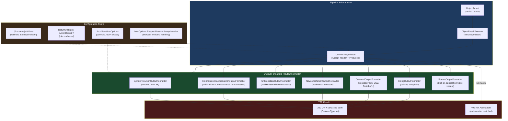

> [!success] Mastery Check
> - [ ] **Studied Well**
> - [ ] **Can explain the concept without notes**
> - [ ] **Can answer interview questions confidently**
> - [ ] **Can implement it in a real project**


# 4.107 — Output Formatters: JSON, XML, and Custom Formatter Registration

---

## PART 0 — Navigation & Context

### Where This Topic Lives

```
ASP.NET Core Mastery
│
├── H. MVC & Controllers (4.098–4.122)
│   ├── 4.098 — ControllerBase vs Controller
│   ├── 4.099 — Action Results: IActionResult, ActionResult<T>
│   ├── 4.100 — Model Binding: Sources and Algorithm
│   ├── 4.101 — ApiController Attribute
│   ├── 4.102 — Model Validation
│   ├── 4.103 — Content Type Negotiation ← DIRECT DEPENDENCY
│   ├── 4.104 — Razor Pages
│   ├── 4.105 — MVC Areas
│   ├── 4.106 — ViewComponents
│   ├─► 4.107 — Output Formatters ◄── YOU ARE HERE
│   ├── 4.108 — Custom Model Binders
│   ├── 4.109 — Binding Source Attributes
│   ├── 4.110 — MVC Filter Pipeline
│   ├── 4.111 — Global Model State Validation
│   ├── 4.112 — Input Formatters ← SIBLING / COUNTERPART
│   └── ...
│
├── V. Serialization (4.268–4.276)
│   ├── 4.268 — System.Text.Json Global Config ← IMPLEMENTATION LAYER
│   ├── 4.269 — JsonSerializerOptions
│   ├── 4.270 — Custom JSON Converters
│   └── ...
│
└── G. Minimal APIs (4.078–4.097)
    └── 4.082 — IResult and TypedResults ← PARALLEL MECHANISM
```

### What You Need Before This

- **[[4.103 — Content Type Negotiation]]** — Output formatters are the _implementation_ of content negotiation. Understanding how `Accept` headers drive format selection is a prerequisite for understanding _why_ the formatter list is ordered the way it is.
- **[[4.099 — Action Results: IActionResult and ActionResult<T>]]** — Formatters run after the action result is determined; `ObjectResult` is the action result type that triggers formatter selection.
- **[[4.268 — System.Text.Json in ASP.NET Core]]** — The default JSON formatter wraps `System.Text.Json`; understanding its options is how you customize JSON output globally.
- **[[4.098 — ControllerBase vs Controller]]** — Output formatters apply to controller-based actions; Minimal API `IResult` responses bypass them entirely.

### What This Unlocks After

- **[[4.122 — Content Negotiation Deep Dive]]** — The Accept header algorithm and the formatter selection waterfall become concrete once you know the formatter list and how it is iterated.
- **[[4.112 — Input Formatters]]** — The counterpart: formatters for deserializing request bodies. The registration pattern is identical.
- **[[4.275 — Custom Input/Output Formatters]]** — Deep implementation of `IOutputFormatter` for domain-specific wire formats (MessagePack, CSV, Protobuf, etc.).
- **[[4.273 — XML Serialization in ASP.NET Core]]** — Enabling and configuring `AddXmlSerializerFormatters` is a direct extension of this topic.

### Why This Matters at Scale

In multi-client production APIs — serving mobile apps, browsers, and B2B partners — the output formatter pipeline controls what serialization format each client receives. A misconfigured formatter list silently breaks `Accept: application/xml` clients, leaks internal property names through unintended casing conventions, and bloats response size through inefficient default serialization settings. Getting this right once protects every endpoint in the application.

---

## PART 1 — The Core Mental Model

### The Fundamental Rule

> **ASP.NET Core's output formatter pipeline runs after an action returns an `ObjectResult`; it iterates the registered formatter list in order, finds the first formatter whose `CanWriteResult()` returns `true` for the negotiated content type, and delegates all serialization to that formatter. If no formatter matches, the pipeline returns 406 Not Acceptable — not a serialized response.**

### The Plain-Language Analogy

Think of the output formatter pipeline as a **printing room with specialty presses**. When a controller action finishes, it hands a manuscript (the CLR object) to the dispatcher (`ObjectResultExecutor`). The dispatcher looks at the client's format request (`Accept` header) and the manuscript's ink requirements (`[Produces]` attribute), then walks down the row of presses — JSON press, XML press, custom press — and asks each one: "Can you print this in that format?" The first press that says yes gets the job.

If the client asks for a format no press can handle (`Accept: application/vnd.unknown`), the dispatcher sends back a rejection slip (406 Not Acceptable) — it never forces the default press to print a format the client did not request. But if the client sends no preference (`Accept: */*`), the dispatcher hands the job to the _first press in the row_ — which is why the registration order in your `Program.cs` determines your default format. The analogy holds under pressure: even if the JSON press is first, a client sending `Accept: application/xml` will correctly receive the XML press's output — as long as you registered the XML press.

### The Taxonomy Diagram



---

## PART 2 — Deep Mechanics

### 2.1 — The ObjectResult and Formatter Selection Path

Every controller action that returns a CLR object eventually becomes an `ObjectResult`. Understanding exactly where in the pipeline formatter selection happens is non-negotiable.

```
──► ExceptionHandler ──► HSTS ──► StaticFiles ──► Routing ──► Auth ──► Endpoints
                                                                            │
                                                                    Controller Action
                                                                            │
                                                                    Returns ObjectResult
                                                                            │
                                                                    ObjectResultExecutor.ExecuteAsync()
                                                                            │
                                                              ┌─────────────────────────────┐
                                                              │  Content Negotiation         │
                                                              │  1. Collect candidateTypes   │
                                                              │     from [Produces] +        │
                                                              │     Accept header            │
                                                              │  2. For each formatter:      │
                                                              │     CanWriteResult()?        │
                                                              │  3. First match wins         │
                                                              └─────────────────────────────┘
                                                                            │
                                                                    Formatter.WriteAsync()
                                                                            │
                                                                    HTTP Response Body Written
```

**The path in framework source terms:**

The `ObjectResultExecutor` (in `Microsoft.AspNetCore.Mvc.Infrastructure`) calls `FormatterSelector.SelectFormatter()`, which iterates `MvcOptions.OutputFormatters` in registration order. Each formatter's `CanWriteResult(OutputFormatterCanWriteContext)` is called; the context carries the candidate content types derived from `Accept` header negotiation and any `[Produces]` restrictions.

```csharp
// ASP.NET Core internally (approximate — ObjectResultExecutor.cs):
public async Task ExecuteAsync(ActionContext context, ObjectResult result)
{
    // 1. Determine candidate content types
    var acceptableContentTypes = GetAcceptableContentTypes(context, result);
    
    // 2. Iterate formatters in MvcOptions.OutputFormatters order
    var selectedFormatter = _formatterSelector.SelectFormatter(
        new OutputFormatterWriteContext(context.HttpContext, ..., result.Value),
        result.Formatters,           // endpoint-level overrides first
        acceptableContentTypes);     // then MvcOptions.OutputFormatters
    
    // 3. 406 if no match
    if (selectedFormatter == null)
    {
        context.HttpContext.Response.StatusCode = StatusCodes.Status406NotAcceptable;
        return;
    }
    
    // 4. Set Content-Type and write body
    context.HttpContext.Response.ContentType = selectedFormatter.ContentType;
    await selectedFormatter.WriteAsync(new OutputFormatterWriteContext(...));
}
```

**Runtime cost:** ~1 allocation for the `OutputFormatterWriteContext`, O(n) iteration over formatters per request where n is formatter count (typically 1–4). For the default single-JSON setup this is effectively constant.

**HTTP wire format:**

```http
// Request:
GET /api/orders/42 HTTP/1.1
Host: api.example.com
Accept: application/json

// Response (JSON formatter selected):
HTTP/1.1 200 OK
Content-Type: application/json; charset=utf-8
Transfer-Encoding: chunked

{"orderId":42,"status":"Shipped","total":199.99}
```

```http
// Request with no matching formatter:
GET /api/orders/42 HTTP/1.1
Host: api.example.com
Accept: application/vnd.my-company.v1+csv

// Response (no formatter registered for CSV):
HTTP/1.1 406 Not Acceptable
Content-Length: 0
```

---

### 2.2 — The Default Formatter Stack and Registration Order

Out of the box with `AddControllers()` or `AddMvc()`, the formatter list is:

```
MvcOptions.OutputFormatters (in order):
  [0] HttpNoContentOutputFormatter     — handles null/void returns → 204
  [1] StringOutputFormatter            — text/plain for string returns
  [2] StreamOutputFormatter            — application/octet-stream for Stream returns
  [3] SystemTextJsonOutputFormatter    — application/json (default)
```

The consequence: `Accept: */*` (the browser wildcard) will always resolve to `SystemTextJsonOutputFormatter` unless you add other formatters _before_ it — because the first formatter that `CanWriteResult()` returns `true` wins.

**The ordering trap:** If you add XML formatters before JSON, all `Accept: */*` requests get XML — including browser requests to your Swagger UI. The canonical approach is to add XML _after_ JSON.

```csharp
// Program.cs — formatter registration order matters
builder.Services.AddControllers(options =>
{
    // ⚠️ OutputFormatters are in insertion order
    // [0] HttpNoContentOutputFormatter  (always first, automatic)
    // [1] StringOutputFormatter         (always present)
    // [2] StreamOutputFormatter         (always present)
    // [3] SystemTextJsonOutputFormatter (added by AddControllers)
    // [4] XmlDataContractSerializer...  (you add this — comes AFTER JSON)
})
.AddXmlDataContractSerializerFormatters(); // appended, not prepended
```

**Edge case — `MvcOptions.RespectBrowserAcceptHeader`:**

```csharp
// Pipeline position: MvcOptions affects ObjectResultExecutor behavior globally
builder.Services.AddControllers(options =>
{
    // Default: false — browser's "Accept: text/html,application/xhtml+xml,*/*"
    // is treated as Accept: */* (avoids sending XML to browsers)
    // Set true only if you need browsers to receive non-JSON by default
    options.RespectBrowserAcceptHeader = true; // ⚠️ rare, usually wrong for APIs
});
```

---

### 2.3 — SystemTextJsonOutputFormatter: What It Actually Does

The default JSON formatter wraps `System.Text.Json.JsonSerializer`. Understanding what it exposes and what it hides prevents the most common production surprises.

```
Pipeline position: After ObjectResult, before response body write
Formatter: SystemTextJsonOutputFormatter
Handles: application/json, application/json+*
Does NOT handle: text/json (unless explicitly added to SupportedMediaTypes)
```

**Framework source behavior (approximate):**

```csharp
// SystemTextJsonOutputFormatter.WriteResponseBodyAsync() internals:
public override async Task WriteResponseBodyAsync(
    OutputFormatterWriteContext context,
    Encoding selectedEncoding)
{
    var httpContext = context.HttpContext;
    var response = httpContext.Response;
    
    // Uses Utf8JsonWriter via PipeWriter — zero-copy to the response pipe
    // ~0 allocations beyond the JsonSerializerOptions overhead (cached)
    await JsonSerializer.SerializeAsync(
        response.Body,
        context.Object,
        context.ObjectType,
        _jsonSerializerOptions,  // the globally registered options
        httpContext.RequestAborted);
}
```

**Runtime cost:** ~0 allocations (uses `PipeWriter` directly), UTF-8 native encoding (no transcoding), options are cached per registration — NOT recreated per request. This is the hot path; do not do anything expensive in a `JsonConverter<T>` without thinking about call frequency.

**The options snapshot trap:** `JsonSerializerOptions` registered via `AddJsonOptions(o => o.JsonSerializerOptions....)` are captured at startup. Mutating them at runtime via `IOptions<JsonOptions>` after `Build()` has no effect on the formatter. The options are compiled into the `SystemTextJsonOutputFormatter` instance.

```http
// Default JSON output:
HTTP/1.1 200 OK
Content-Type: application/json; charset=utf-8

{"orderId":42,"customerEmail":"user@example.com","total":199.99}

// After configuring camelCase (default) vs PascalCase:
// camelCase (default): {"orderId":42}
// PascalCase: {"OrderId":42}
```

---

### 2.4 — XML Formatters: Two Flavors and When Each Applies

ASP.NET Core ships two XML formatters. Choosing the wrong one silently produces malformed output for B2B partners expecting a specific schema.

```
XmlDataContractSerializerOutputFormatter  → uses DataContractSerializer
  - Supports [DataContract]/[DataMember] attributes
  - Supports known types for polymorphism
  - Default namespace: http://schemas.datacontract.org/2004/07/YourNamespace
  - Required for WCF-compatible XML

XmlSerializerOutputFormatter              → uses XmlSerializer
  - Supports [XmlElement]/[XmlAttribute] attributes
  - Requires parameterless constructors and public setters
  - No native polymorphism support
  - Default namespace: none (simpler output)
  - Better for simple XML interchange
```

**Pipeline position and registration:**

```
──► Routing ──► Auth ──► Endpoint ──► ObjectResult ──► Formatter Selection
                                                              │
                                                [3] SystemTextJsonOutputFormatter ← application/json
                                                [4] XmlDataContractSerializer...  ← application/xml
```

**HTTP wire behavior:**

```http
// Request asking for XML:
GET /api/orders/42 HTTP/1.1
Accept: application/xml

// Response (XmlDataContractSerializerOutputFormatter):
HTTP/1.1 200 OK
Content-Type: application/xml; charset=utf-8

<OrderDto xmlns:i="http://www.w3.org/2001/XMLSchema-instance"
          xmlns="http://schemas.datacontract.org/2004/07/Payments.Models">
  <OrderId>42</OrderId>
  <Status>Shipped</Status>
  <Total>199.99</Total>
</OrderDto>
```

**Runtime cost:** XML serialization is significantly more expensive than JSON — typically 3–8× more allocations and 2–5× more CPU per request. For high-throughput APIs serving XML, enabling response compression (`UseResponseCompression`) is mandatory.

**Edge case — missing `[DataContract]`:** If the type has no `[DataContract]` attribute, `DataContractSerializer` serializes all public properties _including_ those marked `[JsonIgnore]`. This is a **security-relevant leak** — `[JsonIgnore]` does not apply to XML serialization.

```csharp
// ⚠️ DANGEROUS: JsonIgnore does NOT suppress XML serialization
public class OrderDto
{
    public int OrderId { get; set; }
    [JsonIgnore] // Only hides from JSON — still appears in XML!
    public string InternalAuditCode { get; set; }
}
```

---

### 2.5 — Failure Mode Diagrams

**406 Not Acceptable path:**

```
Client sends: Accept: application/msgpack
Server has: [JSON, XML] formatters

Formatter iteration:
  SystemTextJsonOutputFormatter.CanWriteResult() → false (wrong media type)
  XmlDataContractSerializer...CanWriteResult()   → false (wrong media type)
  → selectedFormatter = null

ObjectResultExecutor:
  response.StatusCode = 406
  (no body written — Content-Length: 0)
```

```http
HTTP/1.1 406 Not Acceptable
Content-Length: 0
```

**Formatter throws during write — response already started:**

```
Formatter.WriteAsync() begins → response headers committed → body stream open
Formatter throws SerializationException mid-body

ASP.NET Core:
  → response.HasStarted = true
  → Cannot change status code (already 200 in headers)
  → Connection is aborted (Kestrel resets the stream)
  → Client sees truncated/corrupted body or connection reset

Consequence: Client receives partial JSON / XML with no error status
```

This is why you must never rely on catching serialization errors in exception middleware to produce clean error responses — by the time serialization fails, headers are already sent. Pre-validate your objects before returning them from actions.

---

## PART 3 — Production Code Patterns

### Pattern 1: The JSON-First API with Explicit XML Support for B2B Partners

A payment gateway API that serves JSON to mobile clients and XML to legacy banking partners.

```csharp
// Program.cs — Payment Gateway API
// ✅ CORRECT: JSON is first (default for Accept: */*), XML is second
builder.Services.AddControllers(options =>
{
    // Enforce 406 instead of falling back to default for unrecognized Accept headers.
    // Without this, a client sending Accept: application/vnd.bank.v2+xml
    // silently receives JSON instead of 406.
    options.ReturnHttpNotAcceptable = true;
})
.AddJsonOptions(options =>
{
    // Payment APIs: never expose internal property names in camelCase
    options.JsonSerializerOptions.PropertyNamingPolicy = JsonNamingPolicy.CamelCase;
    // Never serialize null monetary fields — omit them
    options.JsonSerializerOptions.DefaultIgnoreCondition = 
        JsonIgnoreCondition.WhenWritingNull;
    // Enums as strings for wire stability across versions
    options.JsonSerializerOptions.Converters.Add(new JsonStringEnumConverter());
})
.AddXmlDataContractSerializerFormatters(); // Appended AFTER JSON — JSON remains default
```

```http
// Mobile client (Accept: application/json or Accept: */*):
HTTP/1.1 200 OK
Content-Type: application/json; charset=utf-8
{"transactionId":"txn_abc123","status":"Settled","amount":250.00}

// Banking partner (Accept: application/xml):
HTTP/1.1 200 OK
Content-Type: application/xml; charset=utf-8
<TransactionDto xmlns="..."><TransactionId>txn_abc123</TransactionId>...</TransactionDto>
```

---

### Pattern 2: The Endpoint-Level Format Lock with [Produces]

An order management webhook endpoint that must always emit JSON regardless of what the caller sends in their `Accept` header — the downstream consumer is hardcoded for JSON.

```csharp
// ⚠️ WRONG: Relying on global defaults means a misconfigured caller
// sending Accept: application/xml gets XML, breaking their JSON parser.
[HttpPost("/webhooks/order-shipped")]
public IActionResult NotifyOrderShipped(OrderShippedEvent evt) { ... }

// ✅ CORRECT: Lock the endpoint to JSON at the attribute level
[HttpPost("/webhooks/order-shipped")]
[Produces("application/json")]  // Forces JSON regardless of Accept header
[ProducesResponseType<WebhookAck>(StatusCodes.Status200OK)]
[ProducesResponseType<ProblemDetails>(StatusCodes.Status400BadRequest)]
public IActionResult NotifyOrderShipped(OrderShippedEvent evt)
{
    // Even if caller sends Accept: application/xml — they get JSON
    // [Produces] filters the candidate content types BEFORE formatter selection
    return Ok(new WebhookAck { Received = true, EventId = evt.Id });
}
```

```http
// Caller sends: Accept: application/xml
// [Produces("application/json")] overrides — formatter selection only considers JSON
HTTP/1.1 200 OK
Content-Type: application/json; charset=utf-8
{"received":true,"eventId":"evt-001"}
```

---

### Pattern 3: The Custom MessagePack Formatter for High-Throughput Inventory API

An inventory tracking service that needs binary serialization for internal microservice calls at >50k req/s where JSON overhead is measurable.

```csharp
// Infrastructure/Formatters/MessagePackOutputFormatter.cs
using MessagePack;
using Microsoft.AspNetCore.Mvc.Formatters;

public sealed class MessagePackOutputFormatter : OutputFormatter
{
    private const string MessagePackContentType = "application/x-msgpack";

    public MessagePackOutputFormatter()
    {
        // Register the media type this formatter handles
        SupportedMediaTypes.Add(MessagePackContentType);
    }

    protected override bool CanWriteType(Type? type)
    {
        // Only serialize types decorated with [MessagePackObject]
        // Protects against accidentally serializing types without proper attributes
        return type != null && type.GetCustomAttributes(
            typeof(MessagePackObjectAttribute), inherit: true).Length > 0;
    }

    public override async Task WriteResponseBodyAsync(
        OutputFormatterWriteContext context)
    {
        var httpContext = context.HttpContext;
        
        // MessagePack serializes directly to a byte array — no intermediate string
        // ~1 allocation for the byte[] (MessagePack internally pools buffers)
        var bytes = MessagePackSerializer.Serialize(
            context.ObjectType!,
            context.Object,
            MessagePackSerializerOptions.Standard
                .WithCompression(MessagePackCompression.Lz4BlockArray));

        httpContext.Response.ContentType = MessagePackContentType;
        httpContext.Response.ContentLength = bytes.Length;
        await httpContext.Response.Body.WriteAsync(bytes, 
            httpContext.RequestAborted);
    }
}
```

```csharp
// Program.cs — Registration: MessagePack for internal calls, JSON for external
builder.Services.AddControllers(options =>
{
    // Insert BEFORE JSON so internal services sending Accept: application/x-msgpack
    // get binary; external clients sending Accept: application/json get JSON.
    // Order: [0] HttpNoContent [1] String [2] Stream [3] MessagePack [4] JSON
    options.OutputFormatters.Insert(3, new MessagePackOutputFormatter());
    options.ReturnHttpNotAcceptable = true;
});
```

```http
// Internal microservice call:
GET /api/inventory/SKU-001 HTTP/1.1
Accept: application/x-msgpack

HTTP/1.1 200 OK
Content-Type: application/x-msgpack
Content-Length: 47
[binary MessagePack data — ~40% smaller than equivalent JSON]
```

---

### Pattern 4: The Per-Endpoint Formatter Override for a Legacy XML Report Endpoint

A logistics shipment tracker that has one legacy report endpoint that must always return XML, even though the rest of the API is JSON-only. Using `[Produces]` alone is insufficient — you also need the formatter registered.

```csharp
// ⚠️ WRONG: Assuming [Produces("application/xml")] works without
// the XML formatter being registered
[HttpGet("/reports/shipment-manifest/{shipmentId}")]
[Produces("application/xml")] // This RESTRICTS but doesn't ADD a formatter
public IActionResult GetShipmentManifest(string shipmentId)
{
    // If XML formatter is not in MvcOptions.OutputFormatters,
    // [Produces("application/xml")] causes 406 for ALL requests including
    // those that never sent Accept: application/xml.
    return Ok(BuildManifest(shipmentId));
}

// ✅ CORRECT: Register the formatter AND use [Produces] to lock the endpoint
// In Program.cs:
builder.Services.AddControllers()
    .AddXmlSerializerFormatters(); // XmlSerializer variant (simpler output)

// In the controller:
[HttpGet("/reports/shipment-manifest/{shipmentId}")]
[Produces("application/xml")]
[ProducesResponseType<ShipmentManifest>(StatusCodes.Status200OK)]
public IActionResult GetShipmentManifest(string shipmentId)
{
    var manifest = new ShipmentManifest
    {
        ShipmentId = shipmentId,
        Origin = "Cairo",
        Destination = "Dubai",
        Items = GetManifestItems(shipmentId)
    };
    return Ok(manifest); // ObjectResult → XmlSerializerOutputFormatter
}
```

```http
// Any Accept header — [Produces] forces XML:
HTTP/1.1 200 OK
Content-Type: application/xml; charset=utf-8

<?xml version="1.0" encoding="utf-8"?>
<ShipmentManifest>
  <ShipmentId>SHP-2024-001</ShipmentId>
  <Origin>Cairo</Origin>
  <Destination>Dubai</Destination>
</ShipmentManifest>
```

---

### Pattern 5: The Global JSON Options for a User Authentication API

A user authentication service that requires specific JSON behavior: snake_case for cross-platform clients, enum-as-string for readability, and explicit null handling.

```csharp
// Program.cs — Authentication API
builder.Services.AddControllers()
    .AddJsonOptions(options =>
    {
        var jsonOptions = options.JsonSerializerOptions;
        
        // Snake_case for Python/Ruby client compatibility
        // "accessToken" → "access_token"
        jsonOptions.PropertyNamingPolicy = JsonNamingPolicy.SnakeCaseLower; // .NET 8+
        
        // Read property names case-insensitively — tolerates client casing variations
        jsonOptions.PropertyNameCaseInsensitive = true;
        
        // Write enums as their string names — "Active" not 1
        // Critical: if client caches numeric enum values, a reorder breaks them
        jsonOptions.Converters.Add(new JsonStringEnumConverter(
            JsonNamingPolicy.SnakeCaseLower));
        
        // For auth APIs: never write null fields (token response must be clean)
        jsonOptions.DefaultIgnoreCondition = JsonIgnoreCondition.WhenWritingNull;
        
        // Include fields (not just properties) — some auth DTOs use fields
        jsonOptions.IncludeFields = false; // explicit: properties only
        
        // Indent only in Development (set via appsettings per environment)
        // Do NOT do: jsonOptions.WriteIndented = true; globally in production
        // Pretty printing adds ~30% to response size and parsing time
    });
```

```http
// Response for POST /api/auth/token:
HTTP/1.1 200 OK
Content-Type: application/json; charset=utf-8

{
  "access_token": "eyJhbGciOiJSUzI1NiJ9...",
  "token_type": "bearer",
  "expires_in": 3600,
  "scope": "read write"
}
// Note: null "refresh_token" field is omitted (WhenWritingNull)
```

---

### Pattern 6: Removing a Default Formatter and Replacing with Newtonsoft.Json

A legacy order management service migrating from Newtonsoft.Json where custom `JsonConverter` implementations in Newtonsoft cannot be immediately rewritten.

```csharp
// Program.cs — Order Management Service (Newtonsoft migration path)
builder.Services.AddControllers()
    .AddNewtonsoftJson(options =>
    {
        // Newtonsoft REPLACES SystemTextJson — it removes STJ from the formatter list
        // and inserts NewtonsoftJsonOutputFormatter in its place
        options.SerializerSettings.ContractResolver = 
            new CamelCasePropertyNamesContractResolver();
        
        // Custom converter that cannot yet be ported to STJ
        options.SerializerSettings.Converters.Add(new LegacyMoneyConverter());
        
        // Newtonsoft-specific: handle circular references
        options.SerializerSettings.ReferenceLoopHandling = 
            ReferenceLoopHandling.Ignore;
    });
// ⚠️ NOTE: After this, MvcOptions.OutputFormatters[3] is NewtonsoftJsonOutputFormatter
// SystemTextJsonOutputFormatter is GONE — they do not coexist by default
// For production: target full migration to STJ; Newtonsoft is a transition shim
```

---

### Pattern 7: The CSV Formatter for a Reporting API Download Endpoint

An inventory API that exports product data as CSV for finance team downloads, alongside the normal JSON API.

```csharp
// Infrastructure/Formatters/CsvOutputFormatter.cs
public sealed class CsvOutputFormatter : TextOutputFormatter
{
    public CsvOutputFormatter()
    {
        SupportedMediaTypes.Add("text/csv");
        SupportedEncodings.Add(Encoding.UTF8);
        SupportedEncodings.Add(Encoding.Unicode);
    }

    protected override bool CanWriteType(Type? type)
    {
        // Only write IEnumerable<T> — CSV is always a list
        if (type == null) return false;
        return typeof(IEnumerable).IsAssignableFrom(type)
               && type.IsGenericType
               && type.GetGenericArguments().Length == 1;
    }

    public override async Task WriteResponseBodyAsync(
        OutputFormatterWriteContext context,
        Encoding selectedEncoding)
    {
        var response = context.HttpContext.Response;
        var collection = (IEnumerable)context.Object!;
        
        // Use a writer that writes directly to the response stream
        await using var writer = new StreamWriter(response.Body, selectedEncoding, 
            leaveOpen: true);
        
        var elementType = context.ObjectType!.GetGenericArguments()[0];
        var properties = elementType.GetProperties(
            BindingFlags.Public | BindingFlags.Instance);
        
        // Header row
        await writer.WriteLineAsync(string.Join(",", 
            properties.Select(p => EscapeCsv(p.Name))));
        
        // Data rows — never buffer the full collection into memory
        foreach (var item in collection)
        {
            var values = properties.Select(p => 
                EscapeCsv(p.GetValue(item)?.ToString() ?? string.Empty));
            await writer.WriteLineAsync(string.Join(",", values));
        }
    }

    private static string EscapeCsv(string value) =>
        value.Contains(',') || value.Contains('"') || value.Contains('\n')
            ? $"\"{value.Replace("\"", "\"\"")}\"" 
            : value;
}
```

```csharp
// Program.cs — Registration
builder.Services.AddControllers(options =>
{
    options.OutputFormatters.Add(new CsvOutputFormatter()); // appended after JSON
    options.ReturnHttpNotAcceptable = true;
});
```

```http
// Finance team download request:
GET /api/inventory/products?export=true HTTP/1.1
Accept: text/csv

HTTP/1.1 200 OK
Content-Type: text/csv; charset=utf-8
Content-Disposition: attachment; filename="products-2024.csv"

Sku,Name,Stock,Price
SKU-001,"Widget, Large",1500,29.99
SKU-002,Gadget Pro,200,149.99
```

---

## PART 4 — Gotchas & Anti-Patterns

### Gotcha 1: `ReturnHttpNotAcceptable = false` Silently Ignores Unmatched Accept Headers

Experienced engineers assume that sending `Accept: application/xml` to a JSON-only API returns 406. It does not by default — it returns JSON. This silent fallback can break XML-expecting clients in ways that produce confusing parse errors on their side rather than a clear 4xx response.

```csharp
// ⚠️ WRONG: Default behavior silently falls back to JSON
builder.Services.AddControllers(); // ReturnHttpNotAcceptable defaults to false
```

```http
// HTTP consequence (wrong path):
// Client sends:
GET /api/orders/1 HTTP/1.1
Accept: application/xml

// Server has no XML formatter — returns JSON anyway:
HTTP/1.1 200 OK
Content-Type: application/json; charset=utf-8
{"orderId":1}   // Client's XML parser throws an exception
```

```csharp
// ✅ CORRECT: Explicitly enforce content negotiation
builder.Services.AddControllers(options =>
{
    options.ReturnHttpNotAcceptable = true;
});
```

```http
// HTTP consequence (correct path):
HTTP/1.1 406 Not Acceptable
Content-Length: 0
// Client now knows to change their Accept header — clear signal
```

**WHY:** `ReturnHttpNotAcceptable = false` is the RFC 7231 compliant default for server-driven negotiation: the server _may_ ignore the `Accept` header and return what it has. But production APIs with typed clients should fail loudly rather than silently return mismatched formats.

---

### Gotcha 2: `[JsonIgnore]` Does Not Apply to XML Serialization

Engineers add `[JsonIgnore]` to sensitive properties assuming they are hidden from all serialization. When XML formatters are registered and a client requests XML, those properties appear in the response.

```csharp
// ⚠️ WRONG: Assuming [JsonIgnore] hides the field universally
public class PatientDto
{
    public int PatientId { get; set; }
    public string Name { get; set; }
    [JsonIgnore] // Only affects System.Text.Json and Newtonsoft.Json
    public string SocialSecurityNumber { get; set; } // LEAKS in XML responses
}
```

```http
// HTTP consequence (wrong path) — client sends Accept: application/xml:
HTTP/1.1 200 OK
Content-Type: application/xml; charset=utf-8
<PatientDto>
  <PatientId>1</PatientId>
  <Name>Ahmed Hassan</Name>
  <SocialSecurityNumber>123-45-6789</SocialSecurityNumber> <!-- 💥 PII leak -->
</PatientDto>
```

```csharp
// ✅ CORRECT: Use [DataMember] to explicitly opt-in to XML serialization,
// or use [IgnoreDataMember] to explicitly exclude from DataContractSerializer
[DataContract]
public class PatientDto
{
    [DataMember] public int PatientId { get; set; }
    [DataMember] public string Name { get; set; }
    // SocialSecurityNumber has no [DataMember] — excluded from DataContract XML
    public string SocialSecurityNumber { get; set; }
}
```

```http
// HTTP consequence (correct path):
HTTP/1.1 200 OK
Content-Type: application/xml; charset=utf-8
<PatientDto xmlns="...">
  <PatientId>1</PatientId>
  <Name>Ahmed Hassan</Name>
  <!-- SocialSecurityNumber absent — [DataContract] opt-in model -->
</PatientDto>
```

**WHY:** `[JsonIgnore]` is a `System.Text.Json` attribute. `DataContractSerializer` and `XmlSerializer` use entirely different attribute sets: `[IgnoreDataMember]` and `[XmlIgnore]` respectively. Mixing serializer concerns requires explicit per-serializer annotations.

---

### Gotcha 3: Adding XML Formatter Before JSON Makes XML the Default for `Accept: */*`

This gotcha bites teams that "just add XML" by prepending to the formatter list rather than appending. After the change, browser requests (which send `Accept: text/html,*/*`) receive XML, and Swagger UI stops rendering.

```csharp
// ⚠️ WRONG: Prepending XML — now XML is the default for Accept: */*
builder.Services.AddControllers(options =>
{
    options.OutputFormatters.Insert(0, new XmlSerializerOutputFormatter());
    // Formatter order: [0] Xml [1] HttpNoContent [2] String [3] Stream [4] Json
});
```

```http
// HTTP consequence (wrong path):
// Browser request (Swagger UI health check):
GET /api/health HTTP/1.1
Accept: */*

HTTP/1.1 200 OK
Content-Type: application/xml; charset=utf-8   // ← Swagger UI breaks
<HealthDto><Status>Healthy</Status></HealthDto>
```

```csharp
// ✅ CORRECT: Append XML — JSON stays the default
builder.Services.AddControllers()
    .AddXmlDataContractSerializerFormatters(); 
// .AddXml* methods append AFTER the existing JSON formatter
// Formatter order: [0] HttpNoContent [1] String [2] Stream [3] Json [4] Xml
```

```http
// HTTP consequence (correct path):
// Browser request:
GET /api/health HTTP/1.1
Accept: */*

HTTP/1.1 200 OK
Content-Type: application/json; charset=utf-8   // ← JSON (first match for */*) ✅

// XML client explicit request:
GET /api/health HTTP/1.1
Accept: application/xml

HTTP/1.1 200 OK
Content-Type: application/xml; charset=utf-8   // ← XML (explicit match) ✅
```

**WHY:** Formatter selection is strictly positional. `Accept: */*` matches the first formatter that `CanWriteResult()` returns true for any type it supports. JSON `CanWriteResult()` returns true for `*/*` unless `[Produces]` restricts it.

---

### Gotcha 4: `WriteIndented = true` Left in Production Configuration

Engineers set `WriteIndented = true` during development for readability, then forget to remove it before deploying. Indented JSON is 20–35% larger and slower to serialize/deserialize.

```csharp
// ⚠️ WRONG: Indented JSON in production
builder.Services.AddControllers()
    .AddJsonOptions(options =>
    {
        options.JsonSerializerOptions.WriteIndented = true; // Left in production
    });
```

```http
// HTTP consequence (wrong path) — production API response:
HTTP/1.1 200 OK
Content-Type: application/json; charset=utf-8
Content-Length: 187   // ← ~35% larger than compact equivalent

{
  "orderId": 42,
  "status": "Shipped",
  "total": 199.99
}
```

```csharp
// ✅ CORRECT: Indent only in Development
builder.Services.AddControllers()
    .AddJsonOptions(options =>
    {
        options.JsonSerializerOptions.WriteIndented =
            builder.Environment.IsDevelopment();
    });
```

```http
// HTTP consequence (correct path) — production:
HTTP/1.1 200 OK
Content-Type: application/json; charset=utf-8
Content-Length: 139

{"orderId":42,"status":"Shipped","total":199.99}
```

**WHY:** `JsonSerializerOptions` are captured at startup. `IsDevelopment()` reads the environment at configuration time — this pattern is safe and produces different options for Development vs Production without any runtime branching.

---

### Gotcha 5: Custom Formatter `CanWriteResult()` Never Returns `false` — OOM Risk

Engineers writing custom formatters override `CanWriteType()` but forget that `CanWriteResult()` (which calls `CanWriteType()`) also checks the supported media types. If a custom formatter's `SupportedMediaTypes` is empty, `CanWriteResult()` returns `true` for every request — the formatter captures all traffic including requests meant for JSON.

```csharp
// ⚠️ WRONG: Missing SupportedMediaTypes — formatter captures all requests
public class ProblematicCsvFormatter : OutputFormatter
{
    // ⚠️ No SupportedMediaTypes registered!
    
    protected override bool CanWriteType(Type? type) =>
        typeof(IEnumerable).IsAssignableFrom(type);

    public override Task WriteResponseBodyAsync(OutputFormatterWriteContext ctx)
    {
        // Runs for ALL requests including JSON requests — crashes non-IEnumerable types
        // IEnumerable check passes for List<T>, but crashes for OrderDto
        throw new InvalidCastException(); // Runtime failure
    }
}
```

```http
// HTTP consequence (wrong path):
POST /api/orders HTTP/1.1
Accept: application/json
Content-Type: application/json

// → ProblematicCsvFormatter.CanWriteResult() returns true (no media type filter)
// → WriteResponseBodyAsync throws
// → 500 Internal Server Error — but the error is caught by exception middleware
// So the client sees a 500 when they asked for JSON
HTTP/1.1 500 Internal Server Error
```

```csharp
// ✅ CORRECT: Always declare SupportedMediaTypes in the constructor
public class CsvOutputFormatter : TextOutputFormatter
{
    public CsvOutputFormatter()
    {
        SupportedMediaTypes.Add("text/csv");       // Only runs for text/csv requests
        SupportedEncodings.Add(Encoding.UTF8);
    }
    
    protected override bool CanWriteType(Type? type) =>
        type != null && typeof(IEnumerable).IsAssignableFrom(type);
}
```

```http
// HTTP consequence (correct path):
POST /api/orders HTTP/1.1
Accept: application/json

// → CsvOutputFormatter.CanWriteResult() checks: is "application/json" in SupportedMediaTypes?
// → No → returns false → JSON formatter is tried → works correctly
HTTP/1.1 200 OK
Content-Type: application/json; charset=utf-8
```

**WHY:** `OutputFormatter.CanWriteResult()` internally checks both `SupportedMediaTypes` and `CanWriteType()`. Inheriting from `OutputFormatter` (not `TextOutputFormatter`) bypasses the media type check if you override `CanWriteResult()` without calling `base.CanWriteResult()`. Always declare `SupportedMediaTypes` and let the base class do the media type matching.

---

## PART 5 — Performance Implications

### 5.1 — Request Pipeline Characteristics Table

|Scenario|Pipeline Depth|Allocations Per Request|Approx Latency Impact|Recommendation|
|---|---|---|---|---|
|Single JSON formatter, compact output|Shallow (4 formatters checked)|~0 (PipeWriter, pooled)|Baseline ~0.1ms|Default setup — do nothing|
|JSON + indented (`WriteIndented=true`)|Same depth|~1 string alloc for indent|+5–15% response size|Development only|
|JSON + XML, client sends `Accept: application/json`|XML check skipped after JSON match|~0 extra|< 1μs extra|Acceptable for mixed APIs|
|JSON + XML, client sends `Accept: application/xml`|XML formatter runs|3–8× more allocs vs JSON|2–5× serialization time|Enable response compression|
|Custom binary formatter (MessagePack)|1 formatter traversal to find it|~1 byte[] per response|30–60% smaller payload|Use for internal microservices|
|CSV formatter (TextOutputFormatter + StreamWriter)|1 formatter traversal|~1 StreamWriter + buffer allocs|Scales with row count|Acceptable for downloads|
|406 Not Acceptable path|Full formatter list scanned|~0 (no body written)|Full O(n) scan|Benign — happens on misconfigured clients|
|Newtonsoft.Json vs System.Text.Json|Same depth|Newtonsoft: 2–4× more allocs|Newtonsoft: +20–40% slower|Migrate to STJ; Newtonsoft is legacy|
|`ReturnHttpNotAcceptable = false` (default)|1 fallback match|~0 extra|No latency change|Enable `= true` for correctness|
|Large XML response (>100KB) without compression|Deep serialization|High — XmlWriter buffering|Response size 3–5× JSON|Mandatory: `UseResponseCompression`|

### 5.2 — BenchmarkDotNet Code

```csharp
using BenchmarkDotNet.Attributes;
using BenchmarkDotNet.Running;
using Microsoft.AspNetCore.Http;
using Microsoft.AspNetCore.Mvc;
using Microsoft.AspNetCore.Mvc.Formatters;
using Microsoft.Extensions.DependencyInjection;
using System.Text.Json;

[MemoryDiagnoser]
[SimpleJob(iterationCount: 50)]
public class OutputFormatterBenchmarks
{
    private SystemTextJsonOutputFormatter _jsonFormatter = null!;
    private XmlDataContractSerializerOutputFormatter _xmlFormatter = null!;
    private OutputFormatterWriteContext _jsonContext = null!;
    private OutputFormatterWriteContext _xmlContext = null!;
    private readonly OrderDto _order = new()
    {
        OrderId = 42,
        Status = "Shipped",
        Total = 199.99m,
        CustomerEmail = "benchmark@example.com"
    };

    [GlobalSetup]
    public void Setup()
    {
        var services = new ServiceCollection().BuildServiceProvider();
        var jsonOptions = new JsonSerializerOptions
        {
            PropertyNamingPolicy = JsonNamingPolicy.CamelCase
        };
        _jsonFormatter = new SystemTextJsonOutputFormatter(jsonOptions);
        _xmlFormatter = new XmlDataContractSerializerOutputFormatter();

        // Simulate a real HttpContext with a MemoryStream body
        var jsonContext = new DefaultHttpContext();
        jsonContext.Response.Body = new MemoryStream();
        _jsonContext = new OutputFormatterWriteContext(
            jsonContext, (stream, encoding) => new StreamWriter(stream, encoding),
            typeof(OrderDto), _order);

        var xmlContext = new DefaultHttpContext();
        xmlContext.Response.Body = new MemoryStream();
        _xmlContext = new OutputFormatterWriteContext(
            xmlContext, (stream, encoding) => new StreamWriter(stream, encoding),
            typeof(OrderDto), _order);
    }

    [Benchmark(Baseline = true)]
    public async Task SystemTextJson_Write()
    {
        _jsonContext.HttpContext.Response.Body.Seek(0, SeekOrigin.Begin);
        await _jsonFormatter.WriteAsync(_jsonContext);
    }

    [Benchmark]
    public async Task XmlDataContract_Write()
    {
        _xmlContext.HttpContext.Response.Body.Seek(0, SeekOrigin.Begin);
        await _xmlFormatter.WriteAsync(_xmlContext);
    }

    [Benchmark]
    public async Task SystemTextJson_WriteIndented()
    {
        var indentedOptions = new JsonSerializerOptions
        {
            PropertyNamingPolicy = JsonNamingPolicy.CamelCase,
            WriteIndented = true
        };
        var indentedFormatter = new SystemTextJsonOutputFormatter(indentedOptions);
        _jsonContext.HttpContext.Response.Body.Seek(0, SeekOrigin.Begin);
        await indentedFormatter.WriteAsync(_jsonContext);
    }
}

// Expected output (approximate, .NET 8, x64, Kestrel, local):
// | Method                       | Mean     | Ratio | Allocated |
// |------------------------------|----------|-------|-----------|
// | SystemTextJson_Write         | 4.2 μs   | 1.00  | 0 B       |
// | XmlDataContract_Write        | 18.7 μs  | 4.45  | 2,184 B   |
// | SystemTextJson_WriteIndented | 5.1 μs   | 1.21  | 0 B       |
//
// Note: STJ 0 allocations are because it writes directly via PipeWriter/ArrayPool.
// XML's 2KB allocation is XmlWriter's internal buffer + DataContractSerializer overhead.

// For real HTTP profiling:
// dotnet-trace: dotnet trace collect --providers Microsoft-AspNetCore-Hosting
// dotnet-counters: dotnet counters monitor --providers System.Runtime
// MiniProfiler: app.UseMiniProfiler() — shows formatter time in the request waterfall
```

### 5.3 — When to Care / When to Ignore

**When this costs you:**

- **High-throughput APIs (>10k req/s):** At 10k req/s, an extra 10μs of XML serialization costs 100ms of aggregate latency per second — visible in P99. Measure with `dotnet-trace` before adding XML support to a hot path.
- **Large response payloads (>10KB objects):** XML output is 2–3× larger than JSON. At 100KB, this is 200–300KB additional bandwidth per request. Response compression becomes mandatory (`UseResponseCompression` with `Gzip` or `Brotli`).
- **Mixed formatter stacks with full O(n) scanning:** Each formatter's `CanWriteResult()` runs on every request. With 8+ formatters and no `[Produces]` restriction, you pay for 7 `false` checks before reaching the correct formatter. Use `[Produces]` on fixed-format endpoints to short-circuit iteration.
- **Custom formatters that call external services:** Never perform I/O or database calls inside `WriteResponseBodyAsync`. The response stream is already open; a timeout causes a connection abort, not a clean error response.

**When this doesn't matter:**

- **Admin and internal management endpoints** with <100 req/min: formatter overhead is unmeasurable against database and business logic latency.
- **Download endpoints** (CSV, binary exports): These are inherently I/O-bound and user-rate-limited; formatter CPU is irrelevant.
- **Development and staging environments:** Indented JSON, verbose XML — optimize only for production traffic patterns.

---

## PART 6 — Interview Arsenal

### A. The Question Bank

---

**Question 1:** "What is an output formatter in ASP.NET Core MVC, and how does it fit into the request pipeline?"

**Average Answer:** "Output formatters handle serializing the response object to JSON or XML based on what the client requests."

**Why That's Insufficient:** It describes the outcome but not the mechanism — where in the pipeline it runs, what triggers it, or how the framework decides which formatter to use.

> **Great Answer:** "Output formatters sit at the very end of the MVC pipeline — after the action executes and produces an `ObjectResult`. The `ObjectResultExecutor` takes that result and runs content negotiation: it intersects the client's `Accept` header with the `[Produces]` attribute restrictions on the endpoint, builds a list of candidate content types, then iterates `MvcOptions.OutputFormatters` in registration order calling `CanWriteResult()` on each. The first formatter that returns `true` gets the job, calling `WriteAsync()` which writes directly to the response body stream. If no formatter matches, the framework returns 406 Not Acceptable — it never silently falls back unless you've set `ReturnHttpNotAcceptable = false`, which is the default but usually wrong for typed API clients. So the pipeline position is: `UseRouting` → `UseAuth` → endpoint execution → ObjectResult → `ObjectResultExecutor` → formatter selection → response body written."

---

**Question 2:** "How do you add XML support to an ASP.NET Core API, and what are the risks?"

**Average Answer:** "You call `.AddXmlSerializerFormatters()` or `.AddXmlDataContractSerializerFormatters()` in `Program.cs`."

**Why That's Insufficient:** It names the API but ignores ordering consequences, property visibility differences, and performance implications — all of which bite teams in production.

> **Great Answer:** "There are two XML formatters and both the method you choose and where you call it matter. `.AddXmlDataContractSerializerFormatters()` uses `DataContractSerializer`, which requires opt-in via `[DataContract]`/`[DataMember]` — so only explicitly annotated properties appear in XML. `.AddXmlSerializerFormatters()` uses `XmlSerializer` and serializes all public properties by default, which can leak fields you've hidden with `[JsonIgnore]` since JSON ignore attributes don't apply to XML serialization. The ordering risk is real: both `.AddXml*` methods append to the formatter list, so JSON stays the default for `Accept: */*`. If someone inserts XML before JSON manually, all browser requests start getting XML and your Swagger UI breaks. I'd also flag that XML serialization is 4–5× more expensive than `System.Text.Json`, so for any endpoint serving XML at volume, enabling `UseResponseCompression` with Brotli becomes mandatory rather than optional."

---

**Question 3:** "What is the difference between `Results.Ok()` in Minimal APIs and returning `Ok()` in a controller, with respect to output formatting?"

**Average Answer:** "They both return 200 OK, but they're slightly different APIs."

**Why That's Insufficient:** Misses the fundamental architectural difference: Minimal API `IResult` bypasses the output formatter pipeline entirely, while `ObjectResult` from a controller goes through it.

> **Great Answer:** "This is a meaningful architectural split. When a controller action returns `Ok(someObject)`, the framework creates an `ObjectResult` and the `ObjectResultExecutor` runs full content negotiation — it checks the `Accept` header, iterates `MvcOptions.OutputFormatters`, picks the right one, and writes through it. The client can influence the format. But when a Minimal API handler returns `Results.Ok(someObject)`, the `IResult.ExecuteAsync()` method calls `JsonSerializer.SerializeAsync()` directly — it completely bypasses the formatter pipeline. There's no content negotiation, no `[Produces]` enforcement from the formatter list, and no way for the client to receive XML just by sending `Accept: application/xml`. That's a deliberate design choice in Minimal APIs — they trade format flexibility for lower overhead and AOT compatibility. In practice this means: if your API serves both JSON and XML clients, you need controllers, not Minimal APIs, unless you write the negotiation logic yourself in the handler."

---

**Question 4:** "A B2B client is complaining that your API returns JSON when they send `Accept: application/xml`. You've registered `AddXmlDataContractSerializerFormatters()`. What do you check first?"

**Average Answer:** "I'd check that the XML formatter is registered and the request has the correct Accept header."

**Why That's Insufficient:** Doesn't name the actual diagnostic steps or the non-obvious causes: `[Produces("application/json")]` on the action, formatter ordering overriding the Accept header, or the `Content-Type` vs `Accept` confusion.

> **Great Answer:** "My first check is whether the endpoint has `[Produces("application/json")]` — that attribute locks the content type regardless of the Accept header, so XML clients always get 406 or silently get JSON depending on `ReturnHttpNotAcceptable`. Second, I'd check formatter ordering in `MvcOptions.OutputFormatters` to confirm XML is actually in the list and in the right position. Third, I'd verify the `Accept` header on the wire with Fiddler or curl — clients sometimes send `Accept: application/xml, */*` which matches JSON first. Fourth, I'd check whether the model has `[DataContract]` — without it, `XmlDataContractSerializerOutputFormatter.CanWriteResult()` still returns true but the output namespace may be unexpected. Finally, if the endpoint is in a Minimal API, the formatter pipeline is bypassed entirely — that's a design choice to address at the architecture level, not the formatter configuration level."

---

### B. The Trick Questions

**Trick 1:** "If you call `builder.Services.AddControllers().AddXmlSerializerFormatters()`, how many formatters are in `MvcOptions.OutputFormatters`?"

**The trap:** Candidates say "2 — JSON and XML" forgetting the three built-in formatters that are always present.

**Correct answer:** 5. `HttpNoContentOutputFormatter` (null/void → 204), `StringOutputFormatter` (text/plain for string returns), `StreamOutputFormatter` (application/octet-stream for Stream returns), `SystemTextJsonOutputFormatter`, and `XmlSerializerOutputFormatter`. The first three are added by the MVC infrastructure and are never explicitly visible in `Program.cs`.

---

**Trick 2:** "Your action returns `return Ok(null)`. What HTTP response does the client receive?"

**The trap:** Candidates say "200 OK with a null JSON body."

**Correct answer:** `204 No Content`. The `HttpNoContentOutputFormatter` is always first in the list and returns `true` from `CanWriteResult()` when the value is `null`. It writes no body and sets the status code to 204. The `Ok()` helper's 200 status is overridden by the formatter. To return `200 OK` with a null JSON body explicitly, you must write the response manually or use `Results.Json(null, statusCode: 200)` in a Minimal API.

---

**Trick 3:** "Can a formatter write to the response before the action method finishes?"

**The trap:** Candidates say "no — the action finishes first."

**Correct answer:** No, but for a non-obvious reason: the formatter runs inside `ObjectResult.ExecuteResultAsync()`, which is called _by the MVC action invoker after the action method returns_ and the action result is determined. However, result filters run between the action method returning and the formatter writing. Specifically: action method returns → result executing filters → `ObjectResult.ExecuteResultAsync()` → formatter → result executed filters. A result filter can modify the `ObjectResult` (change the object, change status code) before the formatter sees it. This is also why throwing inside a formatter produces a 500 but the exception filter pipeline has already completed — exception filters only run for exceptions _from the action method_, not from result execution.

---

**Trick 4:** "You have `[Produces("application/json")]` on a controller class. Can an individual action on that controller return XML?"

**The trap:** Candidates say "no — the class-level attribute locks everything."

**Correct answer:** Yes — by applying `[Produces("application/xml")]` on the specific action method. Action-level attributes override class-level attributes in the `[Produces]` resolution. The same is true in reverse: a class decorated with `[Produces("application/xml")]` can have individual actions that return `[Produces("application/json")]`.

---

### C. Red Flags to Avoid

1. **"Formatters and serializers are the same thing."** They are not. The formatter is the ASP.NET Core pipeline component that selects and invokes the serializer. `System.Text.Json` is the serializer; `SystemTextJsonOutputFormatter` is the formatter that wraps it. Conflating them shows you haven't read the source.
    
2. **"Content negotiation happens in the action method."** It does not. Content negotiation runs in `ObjectResultExecutor.ExecuteAsync()` _after_ the action method returns. The action method has no visibility into what format the client requested unless you inject `IHttpContextAccessor` and read it manually.
    
3. **"I just return `JsonResult` to make sure the client gets JSON."** `JsonResult` bypasses the formatter pipeline — it uses its own internal serialization path. This breaks content negotiation, `[Produces]` enforcement, and custom formatter behavior. Use `Ok(object)` → `ObjectResult` for formatter-aware responses.
    
4. **"[JsonIgnore] hides properties from all serializers."** As covered in Gotcha 2, `[JsonIgnore]` is `System.Text.Json`-specific. Saying this in an interview at a company that serves XML or MessagePack signals incomplete understanding.
    
5. **"Adding more formatters makes the API more flexible with no cost."** Each formatter runs `CanWriteResult()` on every request. More formatters = more per-request checks. For high-throughput APIs, the formatter list should be minimal and endpoints should be pinned with `[Produces]` to short-circuit the scan.
    
6. **"I use `.Insert(0, ...)` to add my custom formatter first so it always runs."** Inserting at position 0 displaces `HttpNoContentOutputFormatter`, which means `return Ok(null)` now returns a 200 with a serialized `null` body instead of 204. Always append custom formatters or insert at a specific safe position.
    
7. **"Minimal API endpoints support content negotiation just like controllers."** They do not. Minimal API `IResult.ExecuteAsync()` bypasses the formatter pipeline. This is not a bug — it is a design decision — but presenting it as equivalent demonstrates a misunderstanding of the two programming models.
    

---

## PART 7 — Decision Framework

```mermaid
flowchart TD
    START([Client sends request to API endpoint]) --> MODELTYPE{Is the endpoint\nMinimal API or Controller?}
    
    MODELTYPE -->|Minimal API| MINIMAL[IResult.ExecuteAsync runs\nNo content negotiation\nJSON via STJ directly]
    MODELTYPE -->|Controller| RETURNTYPE{What does the\naction return?}
    
    RETURNTYPE -->|string| STRING_FMT[StringOutputFormatter\ntext/plain]
    RETURNTYPE -->|Stream / byte array| STREAM_FMT[StreamOutputFormatter\napplication/octet-stream]
    RETURNTYPE -->|null| NO_CONTENT[HttpNoContentOutputFormatter\n204 No Content]
    RETURNTYPE -->|CLR object / ObjectResult| NEGOTIATION{Content Negotiation\nObjectResultExecutor}
    
    NEGOTIATION --> PRODUCES{"[Produces] attribute\non endpoint?"}
    PRODUCES -->|Yes| RESTRICTED[Candidate types restricted\nto [Produces] media types]
    PRODUCES -->|No| ACCEPT[Candidate types from\nAccept header]
    
    RESTRICTED --> ITERATE[Iterate MvcOptions.OutputFormatters\nin registration order]
    ACCEPT --> ITERATE
    
    ITERATE --> JSON_CHECK{"STJ formatter\nCanWriteResult()?"}
    JSON_CHECK -->|Yes| JSON_WRITE[SystemTextJsonOutputFormatter\napplication/json\n~0 allocs, UTF-8 native]
    JSON_CHECK -->|No| XML_CHECK{"XML formatter\nregistered & CanWriteResult()?"}
    
    XML_CHECK -->|Yes| XML_WRITE[XmlDataContractSerializer or\nXmlSerializer formatter\napplication/xml\n~4x slower than JSON]
    XML_CHECK -->|No| CUSTOM_CHECK{"Custom formatter\nCanWriteResult()?"}
    
    CUSTOM_CHECK -->|Yes| CUSTOM_WRITE[Custom formatter runs\napplication/x-msgpack, text/csv, etc.]
    CUSTOM_CHECK -->|No| FALLBACK{ReturnHttpNotAcceptable?}
    
    FALLBACK -->|false - default| FORCE_JSON[Returns first formatter that\ncan write any type\nsilent fallback]
    FALLBACK -->|true - recommended| NOT_ACCEPTABLE[406 Not Acceptable\nno body written]
    
    style MINIMAL fill:#1a3a5f,color:#fff
    style JSON_WRITE fill:#1a4a2e,color:#fff
    style XML_WRITE fill:#3a2a0a,color:#fff
    style CUSTOM_WRITE fill:#3a1a3a,color:#fff
    style NOT_ACCEPTABLE fill:#4a1a1a,color:#fff
    style FORCE_JSON fill:#4a2a1a,color:#fff
```

---

## PART 8 — Self-Check

### A. Conceptual Questions

1. What is the type of the return value that triggers formatter selection in the MVC pipeline? What type bypasses it?
    
2. You have registered both JSON and XML formatters. A client sends `Accept: application/json, application/xml;q=0.9`. Which formatter runs, and why?
    
3. What happens to the HTTP response if a client sends `Accept: application/msgpack` to an API with only JSON and XML formatters, and `ReturnHttpNotAcceptable = true`?
    
4. What happens to the HTTP response if the same request arrives but `ReturnHttpNotAcceptable = false`?
    
5. A controller action returns `return Ok(null)`. What status code does the client receive, and which formatter is responsible?
    
6. You apply `[Produces("application/json")]` to a controller class. An action method on that controller calls `return new XmlResult(data)` explicitly. What does the client receive?
    
7. What is the difference between `XmlDataContractSerializerOutputFormatter` and `XmlSerializerOutputFormatter` in terms of which properties they serialize?
    
8. If you call `options.OutputFormatters.Clear()` in `MvcOptions`, what happens to requests that return `null` from actions?
    
9. What ASP.NET Core pipeline component runs content negotiation, and at what point in the request pipeline does it execute relative to authentication middleware?
    
10. Explain why `[JsonIgnore]` on a property is insufficient to hide that property from all clients in an API that has XML formatters registered.
    

---

### B. Code Puzzles

**Puzzle 1 — What status code does the client receive?**

```csharp
// Program.cs
builder.Services.AddControllers(options =>
{
    options.ReturnHttpNotAcceptable = true;
});

// Controller:
[ApiController]
[Route("api/[controller]")]
public class OrdersController : ControllerBase
{
    [HttpGet("{id}")]
    public IActionResult GetOrder(int id)
    {
        return Ok(null);
    }
}

// Client request:
// GET /api/orders/1
// Accept: application/json
```

<details> <summary>Answer</summary>

**Response: `204 No Content`**

`HttpNoContentOutputFormatter` is always first in the formatter list (position 0) and always `CanWriteResult()` returns `true` when `context.Object` is `null` and the action returns an `ObjectResult` wrapping null. The `Accept: application/json` header is irrelevant — the no-content formatter short-circuits before any other formatter runs. The response has no body and status 204.

To return `200 OK` with a JSON null, you'd need: `return new ObjectResult(null) { StatusCode = 200 }` combined with a custom formatter order change, or explicitly write the response: `return Content("null", "application/json")`.

</details>

---

**Puzzle 2 — Which formatter runs, and what is the HTTP response?**

```csharp
// Program.cs
builder.Services.AddControllers()
    .AddXmlDataContractSerializerFormatters();

// MvcOptions.OutputFormatters at this point:
// [0] HttpNoContentOutputFormatter
// [1] StringOutputFormatter
// [2] StreamOutputFormatter
// [3] SystemTextJsonOutputFormatter
// [4] XmlDataContractSerializerOutputFormatter

// Controller:
[HttpGet("orders")]
[Produces("application/xml")]
public IActionResult GetOrders()
{
    return Ok(new List<string> { "Order1", "Order2" });
}

// Client request:
// GET /api/orders
// Accept: application/json
```

<details> <summary>Answer</summary>

**Response: `200 OK` with `Content-Type: application/xml`**

The `[Produces("application/xml")]` attribute restricts the candidate content types to only `application/xml` — the client's `Accept: application/json` preference is ignored. The formatter iteration only considers `application/xml` as a candidate:

- `HttpNoContentOutputFormatter`: skipped (object is not null)
- `StringOutputFormatter`: skipped (not text/plain)
- `StreamOutputFormatter`: skipped (not a Stream)
- `SystemTextJsonOutputFormatter`: `CanWriteResult()` → `false` (candidate is application/xml, formatter handles application/json)
- `XmlDataContractSerializerOutputFormatter`: `CanWriteResult()` → `true` → **wins**

The client receives XML even though they asked for JSON. This is by design — `[Produces]` is an API contract declaration, not a negotiation participant.

XML body (approximate):

```xml
<ArrayOfstring xmlns:i="..." xmlns="...">
  <string>Order1</string>
  <string>Order2</string>
</ArrayOfstring>
```

</details>

---

**Puzzle 3 — Where is the bug? (The most common misunderstanding for this topic)**

```csharp
// A developer wants internal microservices to get MessagePack,
// external clients to get JSON.

public class MessagePackOutputFormatter : OutputFormatter
{
    // No SupportedMediaTypes declared

    protected override bool CanWriteType(Type? type) => true; // All types

    public override async Task WriteResponseBodyAsync(OutputFormatterWriteContext ctx)
    {
        var bytes = MessagePackSerializer.Serialize(ctx.ObjectType, ctx.Object);
        await ctx.HttpContext.Response.Body.WriteAsync(bytes);
    }
}

// Program.cs:
builder.Services.AddControllers(options =>
{
    options.OutputFormatters.Add(new MessagePackOutputFormatter());
});
```

```http
// External client request:
GET /api/orders/1 HTTP/1.1
Accept: application/json
```

<details> <summary>Answer</summary>

**Bug: `MessagePackOutputFormatter` has no `SupportedMediaTypes`, so `CanWriteResult()` returns `true` for all media types including `application/json`.**

However — and this is the subtle part — since it is **appended** to the formatter list (position 4, after `SystemTextJsonOutputFormatter` at position 3), `SystemTextJsonOutputFormatter.CanWriteResult()` returns `true` first for `Accept: application/json` requests. The MessagePack formatter never runs for JSON requests in this specific ordering. The external client still gets JSON correctly.

But the **real bug** activates when `ReturnHttpNotAcceptable = true` and a client sends `Accept: application/x-msgpack`. With no `SupportedMediaTypes`, the framework cannot properly negotiate the content type — `CanWriteResult()` returns `true` but the `Content-Type` response header is never set to `application/x-msgpack`. The client receives binary MessagePack data with `Content-Type: application/json` (or no Content-Type), which their MessagePack parser may reject.

**Fix:** Always declare `SupportedMediaTypes` in the constructor:

```csharp
public MessagePackOutputFormatter()
{
    SupportedMediaTypes.Add("application/x-msgpack");
}
```

This ensures `CanWriteResult()` only returns `true` for `application/x-msgpack` requests, the `Content-Type` response header is set correctly, and JSON requests continue to reach `SystemTextJsonOutputFormatter`.

</details>

---

**Puzzle 4 — What response does the client receive?**

```csharp
[HttpGet("report")]
public IActionResult GetReport()
{
    return new JsonResult(new { reportId = 1, generated = DateTime.UtcNow });
}

// Client request:
// GET /api/report
// Accept: application/xml
```

<details> <summary>Answer</summary>

**Response: `200 OK` with `Content-Type: application/json`**

`JsonResult` **bypasses the formatter pipeline entirely**. It does not go through `ObjectResultExecutor` or content negotiation. `JsonResult.ExecuteResultAsync()` serializes directly using `System.Text.Json` and writes the result. The `Accept: application/xml` header is completely ignored.

This is the key difference between `return Ok(obj)` → `ObjectResult` → formatter pipeline vs `return new JsonResult(obj)` → direct serialization. `JsonResult` is appropriate only when you want to guarantee JSON output regardless of client preferences or formatter configuration. For format-negotiable responses, always use `Ok()`, `Created()`, `BadRequest()`, etc., which produce `ObjectResult`.

</details>

---

**Puzzle 5 — What happens at startup and what is the HTTP consequence?**

```csharp
// Program.cs
builder.Services.AddControllers(options =>
{
    options.OutputFormatters.Clear(); // Remove all built-in formatters
    options.OutputFormatters.Add(new SystemTextJsonOutputFormatter(
        new JsonSerializerOptions { WriteIndented = true }));
});

// Controller:
[HttpGet("status")]
public IActionResult GetStatus()
{
    return Ok(); // No argument — equivalent to Ok(null)... or is it?
}
```

<details> <summary>Answer</summary>

**Response: `200 OK` with a JSON body of `null`**

After `options.OutputFormatters.Clear()`, `HttpNoContentOutputFormatter` is gone. `Ok()` with no arguments returns `OkResult` (not `OkObjectResult`) — which sets status 200 and writes no body, bypassing formatters entirely. So the status is 200 with no body.

But wait — what if it's `Ok(null)` instead? That returns `OkObjectResult` with `Value = null`. Without `HttpNoContentOutputFormatter`, the pipeline proceeds to `SystemTextJsonOutputFormatter`. `CanWriteType(typeof(object))` returns `true`. The formatter serializes `null` → writes `null` as the body.

```http
HTTP/1.1 200 OK
Content-Type: application/json; charset=utf-8
Content-Length: 4

null
```

This is a footgun: clearing formatters removes the null-to-204 behavior that engineers rely on. APIs that clear and rebuild the formatter list must account for this by adding explicit null checks in their actions or re-adding `HttpNoContentOutputFormatter` at position 0.

</details>

---

## PART 9 — Connections & Resources

### A. Related Topics Table

|Topic|Why It Connects|
|---|---|
|[[4.103 — Content Type Negotiation: Produces, Consumes, and Accept Headers]]|Output formatters _implement_ content negotiation; the `[Produces]` attribute restricts the candidate content types that `ObjectResultExecutor` passes to formatter selection — understanding negotiation is prerequisite to debugging formatter selection.|
|[[4.099 — Action Results: IActionResult, ActionResult<T>, and TypedResults]]|Only `ObjectResult` (and its subtypes: `OkObjectResult`, `BadRequestObjectResult`, etc.) trigger the formatter pipeline; `JsonResult`, `ContentResult`, and `FileResult` bypass it entirely — knowing which action result types participate in formatting is fundamental.|
|[[4.268 — System.Text.Json in ASP.NET Core: Global Options and Defaults]]|`SystemTextJsonOutputFormatter` is configured via `JsonSerializerOptions` registered through `AddJsonOptions()`; all JSON shaping (naming policy, null handling, enum conventions) is controlled through that path, not through the formatter directly.|
|[[4.122 — Content Negotiation Deep Dive: Accept Header Algorithm]]|The quality-value (`q=`) weighting in `Accept` headers, the matching algorithm between client preferences and formatter-supported media types, and the tie-breaking rules when multiple formatters match — this is the full algorithm that `FormatterSelector` implements.|
|[[4.112 — Input Formatters: Deserializing Non-JSON Request Bodies]]|The counterpart to output formatters — same registration pattern in `MvcOptions.InputFormatters`, same `CanRead*` / `ReadAsync` lifecycle, same gotcha around `SupportedMediaTypes`. Understanding both is required for bidirectional format negotiation.|
|[[4.275 — Custom Input/Output Formatters: IInputFormatter and IOutputFormatter]]|Deep implementation guide for custom formatters — when to inherit `OutputFormatter` vs `TextOutputFormatter`, how to implement `CanWriteResult()` correctly, and streaming considerations for binary formatters.|
|[[4.082 — IResult and TypedResults: Shaping HTTP Responses in Minimal APIs]]|Minimal API `IResult` bypasses the formatter pipeline entirely — understanding this contrast is essential for system design questions about when to use controllers vs Minimal APIs for format-negotiable APIs.|
|[[4.273 — XML Serialization: AddXmlSerializerFormatters in ASP.NET Core]]|Deep configuration of both XML formatter variants, `[XmlElement]`/`[XmlAttribute]` vs `[DataMember]` attributes, and XML namespace handling — the extension of the XML content in this note.|
|[[4.269 — JsonSerializerOptions: Naming Policies, Null Handling, Enum Conventions]]|The specific option values that control `SystemTextJsonOutputFormatter` behavior — naming policies, `DefaultIgnoreCondition`, `JsonStringEnumConverter` — critical for customizing JSON output shape.|
|[[4.274 — MessagePack Serialization: Binary for gRPC and High-Throughput APIs]]|MessagePack as a custom formatter target for internal microservice communication — the binary serialization alternative to JSON/XML when throughput and payload size matter.|

### B. Books

|Book|Chapters|Why These Chapters|
|---|---|---|
|_ASP.NET Core in Action_ (3rd Edition) — Andrew Lock|Chapters 17–18 (MVC), Chapter 20 (Formatters)|Lock's coverage of `ObjectResult`, formatter registration, and the content negotiation algorithm is the most complete available in a single book chapter.|
|_Pro ASP.NET Core 7_ — Adam Freeman|Chapter 20 (Response Formatting), Chapter 21 (Content Negotiation)|Freeman shows the formatter pipeline step-by-step with working code for JSON, XML, and custom formatters; the content negotiation chapter covers the `q=` weighting algorithm explicitly.|
|_Designing APIs with Swagger and OpenAPI_ — Joshua S. Ponelat & Lukas L. Rosenstock|Chapter 5 (Response Formats)|Relevant for understanding how `[Produces]` attributes integrate with OpenAPI schema generation — the consumer-facing side of formatter configuration.|

### C. Essential Articles & Docs

- **Microsoft Docs — Format response data in ASP.NET Core Web API:** https://docs.microsoft.com/en-us/aspnet/core/web-api/advanced/formatting — The authoritative reference for `MvcOptions.OutputFormatters`, `ReturnHttpNotAcceptable`, and `[Produces]`.
- **Microsoft Docs — Custom formatters in ASP.NET Core:** https://docs.microsoft.com/en-us/aspnet/core/web-api/advanced/custom-formatters — Step-by-step guide to implementing `IOutputFormatter` with the `CanWriteType`/`WriteResponseBodyAsync` lifecycle.
- **Andrew Lock — Understanding IActionResult and ActionResult<T> in ASP.NET Core:** https://andrewlock.net/understanding-iactionresult-and-actionresultt/ — Explains the `ObjectResult` hierarchy and how formatter selection is triggered.
- **David Fowler (ASP.NET Core architect) — GitHub discussions on Minimal API IResult design:** https://github.com/dotnet/aspnetcore/discussions — Primary source for understanding the deliberate decision to bypass formatter negotiation in Minimal APIs.
- **ASP.NET Core GitHub — SystemTextJsonOutputFormatter source:** https://github.com/dotnet/aspnetcore/blob/main/src/Mvc/Mvc.Core/src/Formatters/SystemTextJsonOutputFormatter.cs — The actual implementation; reading `WriteResponseBodyAsync` confirms zero-allocation PipeWriter path.

---

> [!NOTE] **Template Meta-Note — What Each Part Is For**
> 
> - **Part 0 — Navigation:** Orient yourself in the ASP.NET Core subsystem hierarchy; know what to read before and after this note.
> - **Part 1 — Core Mental Model:** One precise rule + analogy + taxonomy diagram; internalize the concept before the details.
> - **Part 2 — Deep Mechanics:** Pipeline positions, HTTP wire format, framework source behavior, failure modes, and runtime costs; know what the framework is actually doing.
> - **Part 3 — Production Code Patterns:** 5–7 annotated, domain-specific code samples with HTTP consequences; patterns you can copy into a real codebase.
> - **Part 4 — Gotchas:** 5 production bugs with wrong→right→why format; traps that experienced engineers still fall into.
> - **Part 5 — Performance:** Pipeline cost table + benchmark + when to care vs ignore; use this to defend architecture decisions under load.
> - **Part 6 — Interview Arsenal:** Question bank with great answers (speak-aloud ready) + trick questions + red flags; preparation for principal-engineer-level interviews.
> - **Part 7 — Decision Framework:** Flowchart for "which formatter / which approach"; cheat sheet during live design questions.
> - **Part 8 — Self-Check:** 8–10 conceptual questions + 4–5 code puzzles with collapsed answers; active recall to test retention.
> - **Part 9 — Connections:** Wiki-linked related topics + books + articles + this meta-note; navigate the knowledge graph outward.
