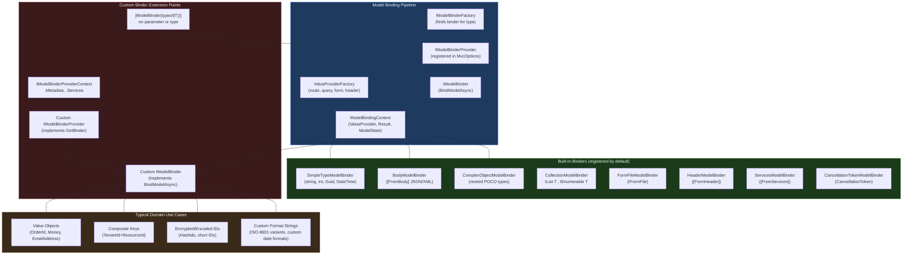
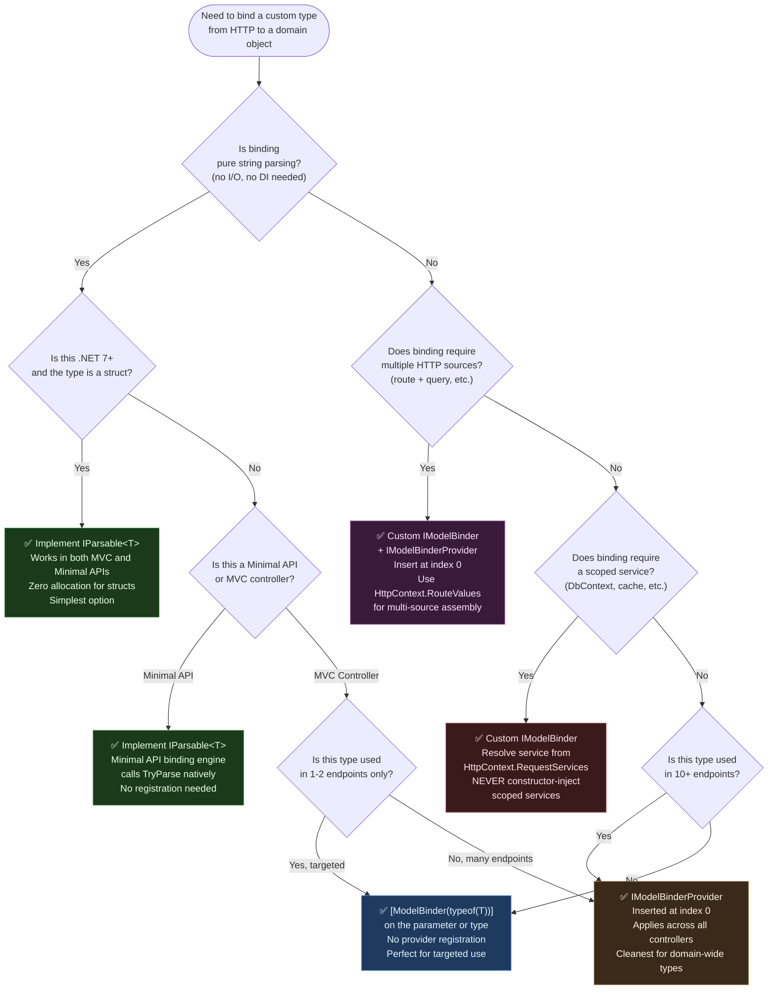

> [!success] Mastery Check
> - [ ] **Studied Well**
> - [ ] **Can explain the concept without notes**
> - [ ] **Can answer interview questions confidently**
> - [ ] **Can implement it in a real project**


# 4.108 — Model Binding: Custom IModelBinder for Domain Types

---

## PART 0 — Navigation & Context

### Domain Hierarchy Position

```
ASP.NET Core Mastery
│
├── H. MVC & Controllers  (4.098–4.122)
│   ├── 4.098  ControllerBase vs Controller
│   ├── 4.099  Action Results: IActionResult, ActionResult<T>
│   ├── 4.100  Model Binding: Sources, Order, and the Binding Algorithm
│   ├── 4.101  ApiController Attribute
│   ├── 4.102  Model Validation: DataAnnotations and ModelState
│   ├── 4.103  Content Type Negotiation
│   ├── ...
│   ├── 4.108  ► MODEL BINDING: CUSTOM IModelBinder for Domain Types  ◄
│   ├── 4.109  Binding Source Attributes: [FromBody], [FromRoute], [FromQuery]
│   ├── 4.110  MVC Filter Pipeline
│   └── ...
│
├── G. Minimal APIs  (4.078–4.097)
│   └── 4.080  Route Parameter Binding in Minimal APIs
│
└── D. Dependency Injection  (4.034–4.048)
    ├── 4.034  The Built-In DI Container
    └── 4.035  Service Lifetimes
```

### What You Need Before This

- **[[4.100 — Model Binding: Sources, Order, and the Binding Algorithm]]** — the binding pipeline runs before your custom binder; you must know what it replaces
- **[[4.101 — ApiController Attribute]]** — `[ApiController]` changes binding source inference; custom binders interact with this
- **[[4.034 — The Built-In DI Container]]** — custom binders can request services from DI; you need to understand how `IModelBinderFactory` gets its binders
- **[[4.109 — Binding Source Attributes]]** — `[ModelBinder(typeof(T))]` is a binding source decorator; these are part of the same system

### What This Unlocks After

- **[[4.109 — Binding Source Attributes]]** — using `[ModelBinder]` explicitly is how you wire custom binders to parameters
- **[[4.110 — MVC Filter Pipeline]]** — custom binders run before action filters; action filters see the already-bound domain type
- **[[4.080 — Route Parameter Binding in Minimal APIs]]** — Minimal APIs have `IParsable<T>` as an alternative to custom binders; the design tradeoffs become clear

### Why This Matters in Production

Custom `IModelBinder` implementations are the boundary enforcement layer between the HTTP wire format and your domain model — when your domain uses strongly typed identifiers (`OrderId`, `CustomerId`), money types (`Money`), or composite keys, a custom binder converts raw HTTP string values into validated domain objects before your action method runs, pushing the entire HTTP-layer translation concern out of every controller action.

---

## PART 1 — The Core Mental Model

### The Fundamental Rule

> **ASP.NET Core's model binding system calls `IModelBinder.BindModelAsync` when a parameter's type has a registered binder; the binder reads from `BindingContext.ValueProvider` — the abstracted source of HTTP values — and writes either a bound object or a binding failure to `BindingContext.Result` before the action method is invoked. The practical consequence is that your action method receives a fully constructed domain object, not a string.**

### The Plain-Language Analogy

Think of the model binder as the passport control officer at an airport border. Every passenger arrives with raw travel documents (a string from a URL, a query parameter, a form field). The officer doesn't hand you the raw passport and ask you to read it yourself — they inspect it, validate its format, look up records, and hand you back a structured traveller object (or deny entry). The officer runs before you ever meet the passenger.

This analogy holds when you press on edge cases: if the passport is malformed (bad format), the officer writes a model error to ModelState and the passenger never reaches you — the action short-circuits before it runs. If two passengers arrive simultaneously, each gets their own officer (binders are stateless or scoped correctly). If the officer needs to check a database (async validation), the `BindModelAsync` method returns a `Task` — the whole pipeline is async.

### The Taxonomy Diagram



---

## PART 2 — Deep Mechanics

### 2.1 — Where Model Binding Sits in the Full Request Pipeline

Model binding runs **inside the MVC/Minimal API execution pipeline**, after routing has matched the endpoint but before the action method or filter chain executes. It is not a middleware — it cannot short-circuit the HTTP pipeline directly. Instead, it writes to `ModelState`, and the `[ApiController]` automatic 400 response or your own `ModelState.IsValid` check gates the action.

```
──► ExceptionHandler ──► HTTPS ──► StaticFiles ──► Routing ──► Auth ──► Authorization
    ──► Endpoint Execution Begins
        ──► IActionInvoker
            ──► [Authorization Filters]          ← can short-circuit here
            ──► [Resource Filters]               ← can short-circuit here
            ──► MODEL BINDING                    ◄── YOU ARE HERE
                (IModelBinderFactory resolves binder per parameter)
                (custom IModelBinder.BindModelAsync called)
                (ValueProvider reads route/query/form values)
                (BindingContext.Result set)
            ──► [ModelState validation]
                [ApiController] auto-400 if ModelState invalid
            ──► [Action Filters — OnActionExecuting]
            ──► Action Method Executes
            ──► [Action Filters — OnActionExecuted]
            ──► [Result Filters]
            ──► IActionResult.ExecuteResultAsync
```

**Cost label:** One `IModelBinder.BindModelAsync` call per action parameter. For a custom binder on a value type: `~1 allocation` for the binding context + your object construction. For a binder that hits a cache: `O(1)` lookup. For a binder that hits a database: `1 async round-trip per request`.

### 2.2 — The IModelBinder Contract and BindModelAsync

The core contract is deceptively simple:

```csharp
// ASP.NET Core internally (approximate) — Microsoft.AspNetCore.Mvc.ModelBinding namespace:
// IModelBinderFactory.CreateBinder(ModelBinderFactoryContext context)
//   → iterates registered IModelBinderProvider list
//   → first provider that returns non-null GetBinder() wins
//   → returns the IModelBinder for that parameter type

public interface IModelBinder
{
    Task BindModelAsync(ModelBindingContext bindingContext);
}

// ModelBindingContext — the full state available to your binder:
// bindingContext.ModelName          → the parameter name ("orderId", "id", "[0]" for collections)
// bindingContext.ValueProvider      → abstracted source of string values (route, query, form)
// bindingContext.ModelMetadata      → type info, [Required], display name
// bindingContext.ModelState         → add errors here for validation failures
// bindingContext.HttpContext        → full HttpContext if you need headers, DI, etc.
// bindingContext.Result             → set this to indicate success or failure
//   ModelBindingResult.Success(object model) — bound successfully
//   ModelBindingResult.Failed()              — could not bind; adds to ModelState
```

The binder **must** set `bindingContext.Result` before returning. Failing to do so leaves the result as `ModelBindingResult.None`, which the framework treats as "I didn't try" — the next provider in the chain gets a chance. This is the most common silent bug in custom binders.

**Framework source path:** `Microsoft.AspNetCore.Mvc.ModelBinding.ModelBinderFactory` → `CreateBinder()` → `Microsoft.AspNetCore.Mvc.ModelBinding.CompositeValueProvider` aggregates route + query + form values → your binder reads via `bindingContext.ValueProvider.GetValue(bindingContext.ModelName)`.

### 2.3 — IModelBinderProvider: The Binder Discovery Mechanism

You cannot register `IModelBinder` directly in DI and expect it to be called. You must register an `IModelBinderProvider` in `MvcOptions.ModelBinderProviders`. The provider is called at request time (or during route compilation in some cases) to produce the binder:

```csharp
// ASP.NET Core internally (approximate):
// MvcOptions.ModelBinderProviders is IList<IModelBinderProvider>
// Searched in order — first non-null wins
// Default registration order:
//   0: BinderTypeModelBinderProvider        ← handles [ModelBinder(typeof(T))] attribute
//   1: ServicesModelBinderProvider          ← handles [FromServices]
//   2: BodyModelBinderProvider              ← handles [FromBody]
//   3: HeaderModelBinderProvider            ← handles [FromHeader]
//   4: FloatingPointTypeModelBinderProvider ← float, double, decimal
//   5: EnumTypeModelBinderProvider          ← enum types
//   6: DateTimeModelBinderProvider          ← DateTime, DateTimeOffset
//   7: SimpleTypeModelBinderProvider        ← string, int, Guid, bool, etc.
//   8: CancellationTokenModelBinderProvider ← CancellationToken
//   9: FormFileModelBinderProvider          ← IFormFile
//  10: ComplexObjectModelBinderProvider     ← POCOs (last resort)

public interface IModelBinderProvider
{
    // Called ONCE per parameter type during binder cache construction
    // Return null if this provider cannot handle the given metadata
    IModelBinder? GetBinder(ModelBinderProviderContext context);
}
```

**Registration position matters:** `Insert(0, provider)` to take precedence over built-ins. `Add(provider)` to fall back after all built-ins. The `[ModelBinder(typeof(T))]` attribute bypasses the provider search entirely — it directly specifies the binder type.

**Cost label:** `IModelBinderProvider.GetBinder()` is called **once** during binder caching (framework caches the result per parameter type). The actual `IModelBinder.BindModelAsync` is called once per request per parameter. The provider overhead is effectively zero at request time.

### 2.4 — ValueProvider: The Abstracted HTTP Source

Your binder does not read directly from `HttpContext.Request.RouteValues` or `HttpContext.Request.Query`. It reads from `bindingContext.ValueProvider`, which is a `CompositeValueProvider` aggregating all registered value providers:

```
ValueProvider Resolution Order (default):
  1. JQueryFormValueProvider   (if form data)
  2. RouteValueProvider        (route template matches: {id}, {tenantId})
  3. QueryStringValueProvider  (query string: ?orderId=123)
  4. (FormFile — separate path)
  
bindingContext.ValueProvider.GetValue("orderId")
  → returns ValueProviderResult
  → .FirstValue   → "ORD-00042"  (single string)
  → .Values       → StringValues (could be multiple: ?tag=a&tag=b)
  → .Length       → 0 means the key was not present in any source
```

```
// HTTP wire format (request reaching the binder):
// GET /api/orders/ORD-00042 HTTP/1.1
// Host: payments.acme.com
//
// Route value: id = "ORD-00042"  ← RouteValueProvider sees this
// bindingContext.ModelName = "id" or "orderId" depending on parameter name

// For query string:
// GET /api/orders?orderId=ORD-00042 HTTP/1.1
// QueryStringValueProvider sees orderId = "ORD-00042"
```

### 2.5 — ModelState Integration and the Failure Path

When your binder cannot parse the incoming value, you write to `ModelState` and set `Result` to `Failed()`:

```csharp
// ASP.NET Core internally (approximate) — after all binders complete:
// if (!ModelState.IsValid && [ApiController] attribute present)
//     → IActionResultExecutor runs
//     → ApiBehaviorOptions.InvalidModelStateResponseFactory invoked
//     → default: ValidationProblemDetails → 400 response

// HTTP consequence (failure path):
// POST /api/orders/ORD-INVALID/ship HTTP/1.1
//
// HTTP/1.1 400 Bad Request
// Content-Type: application/problem+json
//
// {
//   "type": "https://tools.ietf.org/html/rfc9110#section-15.5.1",
//   "title": "One or more validation errors occurred.",
//   "status": 400,
//   "errors": {
//     "orderId": ["The value 'ORD-INVALID' is not a valid order identifier."]
//   }
// }
```

**Failure mode diagram:**

```
Request: GET /api/orders/BADID
    │
    ▼
RouteValueProvider: id = "BADID"
    │
    ▼
OrderIdModelBinder.BindModelAsync()
    ├─ OrderId.TryParse("BADID") → false
    ├─ bindingContext.ModelState.TryAddModelError("orderId", "Not a valid order identifier")
    └─ bindingContext.Result = ModelBindingResult.Failed()
    │
    ▼
[ApiController] detects ModelState.IsValid == false
    │
    ▼
ValidationProblemDetails → HTTP 400
    (action method NEVER executes)
```

### 2.6 — DI in Custom Binders: The Correct Pattern

Model binders are **not** resolved from DI via constructor injection by default when using the provider pattern. To inject services, use `bindingContext.HttpContext.RequestServices`:

```csharp
// ASP.NET Core internally — IModelBinder instances are NOT scoped per request
// when instantiated by ComplexObjectModelBinderProvider or custom providers.
// The safe pattern is to resolve from RequestServices inside BindModelAsync.

// Cost label: ~1 IServiceProvider.GetRequiredService<T> call per request
//             → O(1) hashtable lookup in the DI container
//             → safe because HttpContext.RequestServices IS the request scope
```

The alternative — if your binder is registered via `[ModelBinder(typeof(MyBinder))]` and `MyBinder` is registered in DI — the framework resolves it from `RequestServices` automatically. This makes DI injection work, but the binder then has request-scoped lifetime.

---

## PART 3 — Production Code Patterns

### Pattern 1 — The Strongly-Typed Order Identifier Binder

**Domain:** Payment processing API. `OrderId` is a value object wrapping a string with a specific prefix format (`ORD-{ulid}`). Every order route must bind to this type, not a raw string.

```csharp
// ⚠️ WRONG: Raw string in every controller action — no type safety, validation repeated everywhere
[HttpGet("{id}")]
public async Task<IActionResult> GetOrder(string id)  // ← raw string, any garbage passes
{
    if (!id.StartsWith("ORD-") || id.Length != 30)
        return BadRequest("Invalid order ID format");
    // ...repeated in every single action that takes an order ID
}

// ✅ CORRECT: Custom binder converts at the boundary, action receives a valid domain type
[HttpGet("{orderId}")]
public async Task<ActionResult<OrderResponse>> GetOrder(OrderId orderId)  // ← domain type
{
    var order = await _orderRepository.FindByIdAsync(orderId);
    return order is null ? NotFound() : Ok(order.ToResponse());
}
```

```csharp
// The domain value object — validates its own invariants
public readonly record struct OrderId
{
    private readonly string _value;

    private OrderId(string value) => _value = value;

    // Used by the model binder
    public static bool TryParse(string? input, out OrderId orderId)
    {
        orderId = default;
        if (string.IsNullOrWhiteSpace(input)) return false;
        // Format: ORD-{26-char ULID uppercase}
        if (!input.StartsWith("ORD-", StringComparison.OrdinalIgnoreCase)) return false;
        if (input.Length != 30) return false;  // "ORD-" (4) + ULID (26)
        orderId = new OrderId(input.ToUpperInvariant());
        return true;
    }

    public override string ToString() => _value;
}

// The model binder
public sealed class OrderIdModelBinder : IModelBinder
{
    public Task BindModelAsync(ModelBindingContext bindingContext)
    {
        ArgumentNullException.ThrowIfNull(bindingContext);

        // Read the raw string value from route/query/form — whichever provided it
        var valueProviderResult = bindingContext.ValueProvider.GetValue(bindingContext.ModelName);

        if (valueProviderResult == ValueProviderResult.None)
        {
            // Key was not present in any source — leave Result unset (None)
            // This means "I didn't find this key" — not a failure, just absent
            return Task.CompletedTask;
        }

        // Key was present — we must either succeed or fail; cannot leave as None
        bindingContext.ModelState.SetModelValue(bindingContext.ModelName, valueProviderResult);

        var rawValue = valueProviderResult.FirstValue;

        if (OrderId.TryParse(rawValue, out var orderId))
        {
            bindingContext.Result = ModelBindingResult.Success(orderId);
        }
        else
        {
            bindingContext.ModelState.TryAddModelError(
                bindingContext.ModelName,
                $"The value '{rawValue}' is not a valid order identifier. Expected format: ORD-{{ULID}}.");
            bindingContext.Result = ModelBindingResult.Failed();
        }

        return Task.CompletedTask;
    }
}

// The provider — registered once in MvcOptions
public sealed class OrderIdModelBinderProvider : IModelBinderProvider
{
    public IModelBinder? GetBinder(ModelBinderProviderContext context)
    {
        ArgumentNullException.ThrowIfNull(context);
        // Only activate for OrderId type — return null for everything else
        return context.Metadata.ModelType == typeof(OrderId)
            ? new OrderIdModelBinder()
            : null;
    }
}

// Registration in Program.cs
builder.Services.AddControllers(options =>
{
    // Insert at 0 to run before built-in SimpleTypeModelBinder
    options.ModelBinderProviders.Insert(0, new OrderIdModelBinderProvider());
});
```

```
// HTTP wire format (success path):
// GET /api/orders/ORD-01H2XCEJQK5M6VHBSA000001 HTTP/1.1
//
// HTTP/1.1 200 OK
// Content-Type: application/json

// HTTP wire format (failure path):
// GET /api/orders/not-an-order HTTP/1.1
//
// HTTP/1.1 400 Bad Request
// Content-Type: application/problem+json
// {"errors": {"orderId": ["The value 'not-an-order' is not a valid order identifier."]}}
```

---

### Pattern 2 — The Money Value Object Binder with Culture Awareness

**Domain:** International e-commerce checkout. `Money` encapsulates amount and currency ISO code. Arrives as a composite query/route parameter like `USD:49.99` or `EUR:100.00`.

```csharp
// ⚠️ WRONG: Parsing money inline in action — invariant culture, no validation, duplicated
[HttpGet("products")]
public IActionResult SearchByPriceRange(string minPrice, string maxPrice)
{
    decimal min = decimal.Parse(minPrice);   // ← throws on "EUR:49.99", CultureInfo.CurrentCulture surprise
    decimal max = decimal.Parse(maxPrice);
    // ...
}

// ✅ CORRECT: Action receives validated Money objects, currency enforced at the boundary
[HttpGet("products")]
public async Task<IActionResult> SearchByPriceRange(
    [FromQuery] Money minPrice,
    [FromQuery] Money maxPrice)
{
    if (minPrice.Currency != maxPrice.Currency)
        return BadRequest("Currency mismatch in price range");
    // domain logic — both Money objects are valid by the time we get here
}
```

```csharp
public readonly record struct Money
{
    public decimal Amount { get; }
    public string Currency { get; }  // ISO 4217: "USD", "EUR", "GBP"

    private Money(decimal amount, string currency)
    {
        Amount = amount;
        Currency = currency;
    }

    // Format expected: "{CURRENCY}:{AMOUNT}" — e.g. "USD:49.99"
    public static bool TryParse(string? input, out Money money)
    {
        money = default;
        if (string.IsNullOrWhiteSpace(input)) return false;

        var colonIndex = input.IndexOf(':');
        if (colonIndex < 0) return false;

        var currencyPart = input[..colonIndex].Trim().ToUpperInvariant();
        var amountPart = input[(colonIndex + 1)..].Trim();

        // ISO 4217 currency codes are exactly 3 uppercase alpha characters
        if (currencyPart.Length != 3 || !currencyPart.All(char.IsLetter)) return false;

        // Always parse amount with InvariantCulture — HTTP APIs must not be culture-sensitive
        if (!decimal.TryParse(amountPart, System.Globalization.NumberStyles.Currency,
            System.Globalization.CultureInfo.InvariantCulture, out var amount)) return false;

        if (amount < 0) return false;  // Money cannot be negative in this domain

        money = new Money(amount, currencyPart);
        return true;
    }

    public override string ToString() => $"{Currency}:{Amount:F2}";
}

public sealed class MoneyModelBinder : IModelBinder
{
    public Task BindModelAsync(ModelBindingContext bindingContext)
    {
        var valueResult = bindingContext.ValueProvider.GetValue(bindingContext.ModelName);

        if (valueResult == ValueProviderResult.None)
            return Task.CompletedTask;  // Not present — leave as None

        bindingContext.ModelState.SetModelValue(bindingContext.ModelName, valueResult);

        var raw = valueResult.FirstValue;

        if (Money.TryParse(raw, out var money))
        {
            bindingContext.Result = ModelBindingResult.Success(money);
        }
        else
        {
            bindingContext.ModelState.TryAddModelError(
                bindingContext.ModelName,
                $"'{raw}' is not a valid money value. Expected format: {{CURRENCY}}:{{AMOUNT}} (e.g. USD:49.99).");
            bindingContext.Result = ModelBindingResult.Failed();
        }

        return Task.CompletedTask;
    }
}

public sealed class MoneyModelBinderProvider : IModelBinderProvider
{
    public IModelBinder? GetBinder(ModelBinderProviderContext context)
        => context.Metadata.ModelType == typeof(Money) ? new MoneyModelBinder() : null;
}
```

```
// HTTP wire format:
// GET /api/products?minPrice=USD:10.00&maxPrice=USD:99.99 HTTP/1.1
//
// Query string provider: minPrice = "USD:10.00", maxPrice = "USD:99.99"
// Both Money binders succeed → action receives Money(10.00, "USD") and Money(99.99, "USD")
//
// HTTP/1.1 200 OK
// Content-Type: application/json

// Failure:
// GET /api/products?minPrice=10dollars HTTP/1.1
// HTTP/1.1 400 Bad Request  {"errors": {"minPrice": ["'10dollars' is not a valid money value..."]}}
```

---

### Pattern 3 — The Composite Tenant+Resource Key Binder

**Domain:** Multi-tenant logistics platform. Every resource is identified by a `TenantResourceKey` struct combining a `Guid` tenant ID and an `int` resource ID. The route is `/tenants/{tenantId}/shipments/{shipmentId}` but the action wants a single keyed value.

```csharp
// ⚠️ WRONG: Two separate parameters — action must manually assemble and validate the combination
[HttpGet("/tenants/{tenantId}/shipments/{shipmentId}")]
public async Task<IActionResult> GetShipment(Guid tenantId, int shipmentId)
{
    // Every action that uses this combination must verify tenantId != Guid.Empty, shipmentId > 0
    // And cross-validate them against the user's tenant context
    if (tenantId == Guid.Empty) return BadRequest();
    if (shipmentId <= 0) return BadRequest();
    // ...
}

// ✅ CORRECT: Single domain key assembled by a custom binder that reads two route values
[HttpGet("/tenants/{tenantId}/shipments/{shipmentId}")]
public async Task<IActionResult> GetShipment(
    [ModelBinder(typeof(TenantResourceKeyBinder))] TenantResourceKey shipmentKey)
{
    // shipmentKey is a validated, assembled domain key — cannot be in an invalid state
    var shipment = await _shipmentRepository.FindByKeyAsync(shipmentKey);
    return shipment is null ? NotFound() : Ok(shipment);
}
```

```csharp
public readonly record struct TenantResourceKey(Guid TenantId, int ResourceId)
{
    public bool IsValid => TenantId != Guid.Empty && ResourceId > 0;
}

// This binder reads TWO route values to assemble ONE domain key
public sealed class TenantResourceKeyBinder : IModelBinder
{
    public Task BindModelAsync(ModelBindingContext bindingContext)
    {
        // Read from route values directly — this composite key spans two route segments
        var routeValues = bindingContext.HttpContext.Request.RouteValues;

        if (!routeValues.TryGetValue("tenantId", out var tenantIdRaw)
            || !routeValues.TryGetValue("shipmentId", out var resourceIdRaw))
        {
            bindingContext.ModelState.TryAddModelError(
                bindingContext.ModelName,
                "Route is missing required tenantId or shipmentId segments.");
            bindingContext.Result = ModelBindingResult.Failed();
            return Task.CompletedTask;
        }

        if (!Guid.TryParse(tenantIdRaw?.ToString(), out var tenantId) || tenantId == Guid.Empty)
        {
            bindingContext.ModelState.TryAddModelError(
                bindingContext.ModelName,
                $"'{tenantIdRaw}' is not a valid tenant identifier.");
            bindingContext.Result = ModelBindingResult.Failed();
            return Task.CompletedTask;
        }

        if (!int.TryParse(resourceIdRaw?.ToString(), out var resourceId) || resourceId <= 0)
        {
            bindingContext.ModelState.TryAddModelError(
                bindingContext.ModelName,
                $"'{resourceIdRaw}' is not a valid shipment identifier.");
            bindingContext.Result = ModelBindingResult.Failed();
            return Task.CompletedTask;
        }

        var key = new TenantResourceKey(tenantId, resourceId);
        bindingContext.Result = ModelBindingResult.Success(key);
        return Task.CompletedTask;
    }
}

// Note: [ModelBinder(typeof(TenantResourceKeyBinder))] is used directly on the parameter,
// so NO provider registration is required.
// The binder DOES need to be registered in DI if it has dependencies:
builder.Services.AddTransient<TenantResourceKeyBinder>();
```

```
// HTTP wire format:
// GET /tenants/a1b2c3d4-e5f6-7890-abcd-ef1234567890/shipments/42 HTTP/1.1
//
// Route values: tenantId = "a1b2c3d4-e5f6-7890-abcd-ef1234567890", shipmentId = "42"
// TenantResourceKeyBinder assembles: TenantResourceKey(Guid(...), 42)
//
// HTTP/1.1 200 OK — action receives one valid composite key
```

---

### Pattern 4 — The Async Binder That Reads a Database for Entity Resolution

**Domain:** Inventory management. `Sku` types must be validated against the product catalog before the action runs. The binding itself performs async lookup.

```csharp
// ⚠️ WRONG: Async DB call in model binder via constructor-injected scoped service — CAPTIVE DEPENDENCY BUG
// Model binders from providers are cached — the DbContext would be the first request's DbContext forever
public sealed class BrokenSkuBinder : IModelBinder
{
    private readonly InventoryDbContext _db;  // ⚠️ WRONG: Scoped injected into effectively-Singleton binder

    public BrokenSkuBinder(InventoryDbContext db) => _db = db;  // This will blow up in production

    public async Task BindModelAsync(ModelBindingContext bindingContext)
    {
        // _db is the first request's disposed DbContext — ObjectDisposedException on request 2+
    }
}

// ✅ CORRECT: Resolve scoped service from RequestServices inside BindModelAsync
public sealed class SkuModelBinder : IModelBinder
{
    // No constructor injection of scoped services — resolved per-request below

    public async Task BindModelAsync(ModelBindingContext bindingContext)
    {
        var valueResult = bindingContext.ValueProvider.GetValue(bindingContext.ModelName);

        if (valueResult == ValueProviderResult.None)
            return;

        bindingContext.ModelState.SetModelValue(bindingContext.ModelName, valueResult);
        var rawSku = valueResult.FirstValue;

        if (string.IsNullOrWhiteSpace(rawSku))
        {
            bindingContext.ModelState.TryAddModelError(bindingContext.ModelName, "SKU is required.");
            bindingContext.Result = ModelBindingResult.Failed();
            return;
        }

        // ✅ Resolve from RequestServices — this IS the request scope, safe for scoped services
        var skuValidator = bindingContext.HttpContext.RequestServices
            .GetRequiredService<ISkuValidationService>();

        // ~1 async database round-trip per request for this parameter
        var validatedSku = await skuValidator.ResolveSkuAsync(rawSku);

        if (validatedSku is null)
        {
            bindingContext.ModelState.TryAddModelError(
                bindingContext.ModelName,
                $"SKU '{rawSku}' does not exist in the product catalog.");
            bindingContext.Result = ModelBindingResult.Failed();
            return;
        }

        bindingContext.Result = ModelBindingResult.Success(validatedSku);
    }
}
```

```
// HTTP wire format:
// POST /api/inventory/restock HTTP/1.1
// Content-Type: application/json
// {"sku": "WIDGET-42", "quantity": 500}
//
// [FromBody] handles the JSON body → SkuModelBinder handles the Sku property within
// (for [FromBody] POCO properties, the ComplexObjectModelBinder delegates to child binders)
//
// If SKU valid:   HTTP/1.1 200 OK
// If SKU unknown: HTTP/1.1 400 Bad Request {"errors": {"sku": ["SKU 'WIDGET-99' does not exist..."]}}
```

---

### Pattern 5 — The IParsable<T> Alternative for Minimal APIs (.NET 7+)

**Domain:** Logistics tracking API using Minimal APIs. Custom `TrackingNumber` type uses `IParsable<T>` — the Minimal API binding mechanism that **does not require a custom binder**.

```csharp
// ✅ CORRECT for Minimal APIs: Implement IParsable<T> instead of IModelBinder
// Minimal API parameter binding automatically calls TryParse(string, ...) for route/query values
public readonly record struct TrackingNumber : IParsable<TrackingNumber>
{
    private readonly string _value;

    private TrackingNumber(string value) => _value = value;

    // IParsable<T> — used by Minimal API binding engine
    public static TrackingNumber Parse(string s, IFormatProvider? provider)
    {
        if (!TryParse(s, provider, out var result))
            throw new FormatException($"'{s}' is not a valid tracking number.");
        return result;
    }

    public static bool TryParse(string? s, IFormatProvider? provider, out TrackingNumber result)
    {
        result = default;
        if (string.IsNullOrWhiteSpace(s)) return false;
        if (!s.StartsWith("TRK-", StringComparison.OrdinalIgnoreCase)) return false;
        if (s.Length < 8) return false;
        result = new TrackingNumber(s.ToUpperInvariant());
        return true;
    }

    public override string ToString() => _value;
}

// In Minimal APIs — NO binder registration needed:
app.MapGet("/shipments/{trackingNumber}", async (TrackingNumber trackingNumber, IShipmentRepo repo) =>
{
    // trackingNumber was bound via IParsable<TrackingNumber>.TryParse()
    // If TryParse fails → automatic 400 — same behavior as custom binder
    var shipment = await repo.FindByTrackingAsync(trackingNumber);
    return shipment is null ? Results.NotFound() : Results.Ok(shipment);
});

// KEY INSIGHT: IParsable<T> works in both Minimal APIs AND MVC (via SimpleTypeModelBinder in .NET 7+)
// Prefer IParsable<T> for pure parsing. Use IModelBinder when you need:
//   - Multiple route value assembly (composite keys)
//   - DI-resolved services during binding (async DB lookup)
//   - Complex conditional binding logic
```

```
// HTTP wire format — same as custom binder:
// GET /shipments/TRK-ABC123XYZ HTTP/1.1
// → TrackingNumber.TryParse("TRK-ABC123XYZ", ...) → success
// HTTP/1.1 200 OK

// GET /shipments/bad-format HTTP/1.1
// → TrackingNumber.TryParse("bad-format", ...) → false
// HTTP/1.1 400 Bad Request
```

---

### Pattern 6 — The [ModelBinder] Attribute Shortcut Without Provider Registration

**Domain:** Patient management portal (healthcare). `PatientId` appears only on a few endpoints and does not warrant a global provider. Uses `[ModelBinder]` attribute for targeted, localized binding.

```csharp
// Using [ModelBinder(typeof(T))] directly on the parameter — no provider registration needed
// The BinderTypeModelBinderProvider (registered at position 0 by default) handles this attribute
[HttpGet("{patientId}/records")]
public async Task<IActionResult> GetPatientRecords(
    [ModelBinder(typeof(PatientIdModelBinder))] PatientId patientId)
{
    // PatientIdModelBinder.BindModelAsync was called before this line
    var records = await _recordsRepo.GetForPatientAsync(patientId);
    return Ok(records);
}

// Alternatively, annotate the type itself — applies wherever PatientId appears
[ModelBinder(typeof(PatientIdModelBinder))]
public readonly record struct PatientId
{
    public int Value { get; }
    private PatientId(int value) => Value = value;

    public static bool TryParse(string? s, out PatientId id)
    {
        id = default;
        if (!int.TryParse(s, out var raw) || raw <= 0) return false;
        id = new PatientId(raw);
        return true;
    }
}

public sealed class PatientIdModelBinder : IModelBinder
{
    public Task BindModelAsync(ModelBindingContext bindingContext)
    {
        var vpr = bindingContext.ValueProvider.GetValue(bindingContext.ModelName);
        if (vpr == ValueProviderResult.None) return Task.CompletedTask;

        bindingContext.ModelState.SetModelValue(bindingContext.ModelName, vpr);

        if (PatientId.TryParse(vpr.FirstValue, out var patientId))
        {
            bindingContext.Result = ModelBindingResult.Success(patientId);
        }
        else
        {
            bindingContext.ModelState.TryAddModelError(
                bindingContext.ModelName,
                $"'{vpr.FirstValue}' is not a valid patient identifier.");
            bindingContext.Result = ModelBindingResult.Failed();
        }

        return Task.CompletedTask;
    }
}

// When [ModelBinder] is on the TYPE — register the binder in DI so it can be resolved:
builder.Services.AddTransient<PatientIdModelBinder>();
// (If not in DI, framework tries to Activator.CreateInstance — works if binder has no constructor deps)
```

---

## PART 4 — Gotchas & Anti-Patterns

### Gotcha 1: Not Setting `bindingContext.Result` — The Silent "I Didn't Try"

When a binder finds the value is present but fails to parse it, an inexperienced engineer leaves `bindingContext.Result` unset (defaults to `ModelBindingResult.None`). The framework interprets `None` as "this provider didn't handle the type" and falls through to the next provider — typically `ComplexObjectModelBinder`, which treats the string as a POCO and returns a partially constructed object.

```csharp
// ⚠️ WRONG: Binder finds value, fails to parse, leaves Result as None
public Task BindModelAsync(ModelBindingContext bindingContext)
{
    var vpr = bindingContext.ValueProvider.GetValue(bindingContext.ModelName);
    if (vpr == ValueProviderResult.None) return Task.CompletedTask;

    if (OrderId.TryParse(vpr.FirstValue, out var orderId))
    {
        bindingContext.Result = ModelBindingResult.Success(orderId);
    }
    // ⚠️ MISSING: else branch that sets Result = Failed()
    // Framework sees Result.None → falls through to ComplexObjectModelBinder

    return Task.CompletedTask;
}

// HTTP consequence (wrong path):
// GET /api/orders/GARBAGE HTTP/1.1
// → ComplexObjectModelBinder creates a default OrderId (empty struct)
// → Action executes with OrderId.Empty — silent data corruption
// → HTTP/1.1 200 OK with wrong data returned

// ✅ CORRECT: Always set Result in the else branch
public Task BindModelAsync(ModelBindingContext bindingContext)
{
    var vpr = bindingContext.ValueProvider.GetValue(bindingContext.ModelName);
    if (vpr == ValueProviderResult.None) return Task.CompletedTask;

    bindingContext.ModelState.SetModelValue(bindingContext.ModelName, vpr);

    if (OrderId.TryParse(vpr.FirstValue, out var orderId))
        bindingContext.Result = ModelBindingResult.Success(orderId);
    else
    {
        bindingContext.ModelState.TryAddModelError(bindingContext.ModelName, "Invalid order ID.");
        bindingContext.Result = ModelBindingResult.Failed();
    }

    return Task.CompletedTask;
}

// HTTP consequence (correct path):
// GET /api/orders/GARBAGE HTTP/1.1
// HTTP/1.1 400 Bad Request — action never executes

// WHY: ModelBindingResult.None means "I am not the right binder for this type" — it is
// the signal for provider fallthrough. Failed() means "I AM the right binder and the
// input is invalid." The distinction is critical for correctness.
```

---

### Gotcha 2: Forgetting `SetModelValue` — Model State Is Empty on Error

Engineers often write the error path but forget to call `ModelState.SetModelValue()` before `TryAddModelError`. Without it, the attempted raw value is not recorded in ModelState, and the `ValidationProblemDetails.Errors` response omits the "attempted value" context that debugging tools and error logs depend on.

```csharp
// ⚠️ WRONG: TryAddModelError without SetModelValue
public Task BindModelAsync(ModelBindingContext bindingContext)
{
    var vpr = bindingContext.ValueProvider.GetValue(bindingContext.ModelName);
    if (vpr == ValueProviderResult.None) return Task.CompletedTask;

    // ⚠️ SetModelValue is missing here

    if (!Money.TryParse(vpr.FirstValue, out var money))
    {
        bindingContext.ModelState.TryAddModelError(bindingContext.ModelName, "Invalid money.");
        bindingContext.Result = ModelBindingResult.Failed();
    }
    // ...
}

// HTTP consequence (wrong path):
// ModelState["price"].AttemptedValue is null
// Error response lacks the "attempted value" field
// Debugging: you see the error message but not what the client actually sent

// ✅ CORRECT: SetModelValue always called immediately after confirming value is present
public Task BindModelAsync(ModelBindingContext bindingContext)
{
    var vpr = bindingContext.ValueProvider.GetValue(bindingContext.ModelName);
    if (vpr == ValueProviderResult.None) return Task.CompletedTask;

    bindingContext.ModelState.SetModelValue(bindingContext.ModelName, vpr);  // ← must be here

    if (!Money.TryParse(vpr.FirstValue, out var money))
    {
        bindingContext.ModelState.TryAddModelError(bindingContext.ModelName, "Invalid money format.");
        bindingContext.Result = ModelBindingResult.Failed();
    }
    else
    {
        bindingContext.Result = ModelBindingResult.Success(money);
    }
    return Task.CompletedTask;
}

// HTTP consequence (correct path):
// ModelState["price"].AttemptedValue = "10dollars"
// Error response includes the raw submitted value for client-side debugging

// WHY: SetModelValue records the raw string the client sent. Without it, ModelState.GetAttemptedValue()
// returns null, which breaks audit logs and error response completeness.
```

---

### Gotcha 3: Injecting a Scoped Service into the Binder Constructor via Provider

Model binder providers are called once during binder caching (or at the start of a request, depending on version). If your `IModelBinderProvider.GetBinder()` creates a binder with a constructor-injected `DbContext`, that same `DbContext` instance is reused across requests after the first caching point — a classic captive dependency.

```csharp
// ⚠️ WRONG: Provider creates binder with injected scoped service
public sealed class SkuBinderProvider : IModelBinderProvider
{
    private readonly InventoryDbContext _db;  // ⚠️ WRONG: Scoped in what becomes singleton-lifetime binder

    public SkuBinderProvider(InventoryDbContext db) => _db = db;

    public IModelBinder? GetBinder(ModelBinderProviderContext context)
        => context.Metadata.ModelType == typeof(Sku) ? new SkuModelBinder(_db) : null;
}

// HTTP consequence (wrong path):
// Request 1: SkuModelBinder gets DbContext with open connection to tenant A's DB
// Request 2: Same DbContext (now disposed or pointing to wrong tenant) is reused
// → ObjectDisposedException, incorrect data, or cross-tenant data leak

// ✅ CORRECT: Provider creates stateless binder; binder resolves service from RequestServices
public sealed class SkuBinderProvider : IModelBinderProvider
{
    // No dependencies — providers should be stateless
    public IModelBinder? GetBinder(ModelBinderProviderContext context)
        => context.Metadata.ModelType == typeof(Sku) ? new SkuModelBinder() : null;
}

public sealed class SkuModelBinder : IModelBinder
{
    public async Task BindModelAsync(ModelBindingContext bindingContext)
    {
        // ✅ Resolve scoped service per-request from the request scope
        var db = bindingContext.HttpContext.RequestServices
            .GetRequiredService<InventoryDbContext>();
        // db is request-scoped — safe to use, will be disposed when request ends
    }
}

// WHY: IModelBinderProvider is effectively Singleton after binder caching. Binders themselves
// may also be cached. The only safe place for scoped services is inside BindModelAsync,
// accessed via HttpContext.RequestServices (which IS the request scope).
```

---

### Gotcha 4: Using `app.Use*` Ordering — Binder Provider Order Is Not Middleware Order

Engineers who understand middleware ordering assume that `Insert(0, provider)` in `ModelBinderProviders` is a "last registered wins" pattern like middleware. In fact, it is "first non-null wins" — inserting at index 0 means your provider runs first and can preempt ALL built-in binders, including `BodyModelBinder`. Inserting at the end means running after `ComplexObjectModelBinder`, which always returns non-null for POCOs.

```csharp
// ⚠️ WRONG: Added at the end — never reached because ComplexObjectModelBinder returns non-null first
builder.Services.AddControllers(options =>
{
    options.ModelBinderProviders.Add(new OrderIdModelBinderProvider());  // ← position ~11, never reached
});

// HTTP consequence (wrong path):
// GET /api/orders/ORD-00042 HTTP/1.1
// ComplexObjectModelBinder matches OrderId first (it handles any non-primitive type)
// → OrderId is treated as a POCO, all properties are null/default
// → Action receives invalid OrderId.Empty
// → HTTP/1.1 200 OK with wrong data — silent data corruption

// ✅ CORRECT: Insert at index 0 to run before all built-ins
builder.Services.AddControllers(options =>
{
    options.ModelBinderProviders.Insert(0, new OrderIdModelBinderProvider());
});

// HTTP consequence (correct path):
// OrderIdModelBinderProvider is checked first → GetBinder returns OrderIdModelBinder
// → OrderIdModelBinder runs, binds "ORD-00042" to OrderId
// → HTTP/1.1 200 OK with correct data

// WHY: ModelBinderProviders is searched in index order; first provider to return non-null wins.
// ComplexObjectModelBinderProvider (last built-in) returns non-null for any class or struct type
// that has public properties — which includes most domain value objects. Your provider must
// be at a lower index to intercept before ComplexObjectModelBinder claims the type.
```

---

### Gotcha 5: Forgetting to Handle Collections — The Custom Binder Is Not Called for `List<OrderId>`

A custom `OrderIdModelBinder` is registered and works perfectly for single `OrderId` parameters. The engineer then adds an endpoint accepting `List<OrderId>` and is surprised to find the binder is never called — each element comes through as an empty `OrderId`.

```csharp
// ⚠️ WRONG assumption: Custom binder for T will automatically handle List<T>
[HttpGet("bulk")]
public IActionResult GetOrders([FromQuery] List<OrderId> orderIds)
    // ← orderIds is List<> of default(OrderId) — custom binder NOT called for elements
```

```
// HTTP wire format (wrong path):
// GET /api/orders/bulk?orderIds=ORD-001&orderIds=ORD-002 HTTP/1.1
// CollectionModelBinder handles List<OrderId>
// CollectionModelBinder looks up element binder for OrderId
// If Insert(0,...) was used: OrderIdModelBinderProvider IS found → each element is bound correctly
// If Add(...) was used: ComplexObjectModelBinder claims each element before OrderIdModelBinderProvider
//
// Critical: With Add() instead of Insert(0,...), the collection element binder is ALSO wrong.
```

```csharp
// ✅ CORRECT approach A: Insert at 0 ensures the provider is used for both T and List<T>
builder.Services.AddControllers(options =>
{
    options.ModelBinderProviders.Insert(0, new OrderIdModelBinderProvider());
    // CollectionModelBinder finds your provider for element binding automatically
});

// ✅ CORRECT approach B: Annotate the type with [ModelBinder] — works for both scalar and collection
[ModelBinder(typeof(OrderIdModelBinder))]
public readonly record struct OrderId { ... }

// HTTP consequence (correct path):
// GET /api/orders/bulk?orderIds=ORD-001&orderIds=ORD-002 HTTP/1.1
// CollectionModelBinder creates List<OrderId> → for each element, OrderIdModelBinder is invoked
// → List<OrderId> { OrderId("ORD-001"), OrderId("ORD-002") }
// HTTP/1.1 200 OK

// WHY: CollectionModelBinder delegates element binding to the registered binder for T.
// If your provider is not found at a lower index than ComplexObjectModelBinder, element binding
// falls through incorrectly. Insert(0,...) guarantees your provider wins for both T and IList<T>.
```

---

## PART 5 — Performance Implications

### 5.1 — Request Pipeline Characteristics Table

|Scenario|Pipeline Depth|Allocations Per Request|Approx Latency Impact|Recommendation|
|---|---|---|---|---|
|Built-in `SimpleTypeModelBinder` (int, Guid)|Shallow — direct parse|~0 additional allocs|< 1 µs|Baseline; use IParsable<T> to match this|
|`IParsable<T>` struct via `SimpleTypeModelBinder`|Shallow — TryParse call|~0 if struct (no boxing)|< 1 µs|Best option for simple parsing|
|Custom `IModelBinder` for struct, no DI|Shallow — one binder call|~0 if struct return|~1–2 µs|Ideal — zero allocs, pure parse|
|Custom `IModelBinder` for class type|Shallow|~1 object allocation|~1–5 µs|Acceptable for domain objects|
|Binder resolves `IServiceProvider.GetRequired<T>()`|Shallow + DI lookup|~0 (from DI container hashtable)|~1–3 µs overhead|Safe, negligible cost|
|Binder with async database round-trip|Deep — network I/O|~1 alloc + async state machine|+0.5–5 ms (DB latency)|Reserve for validation that MUST happen at binding time; prefer application-layer validation|
|Custom `IModelBinderProvider` with complex GetBinder logic|Once cached|Cached after first use|~0 at request time|Provider overhead is zero post-caching|
|`[ModelBinder(typeof(T))]` attribute on parameter|Provider bypass|~0 provider lookup|~0|Fastest path for targeted use|
|Complex POCO with 5 custom-bound properties|5 × binder calls|5 × per-binder allocs|~5–25 µs|Acceptable for infrequent admin endpoints|
|Collection `List<OrderId>` with 100 elements|100 × binder calls|100 × allocs|~100–500 µs|Cache parsed values; consider [FromBody] JSON for large collections|

### 5.2 — BenchmarkDotNet Code

```csharp
using BenchmarkDotNet.Attributes;
using BenchmarkDotNet.Running;
using Microsoft.AspNetCore.Http;
using Microsoft.AspNetCore.Mvc.ModelBinding;
using Microsoft.AspNetCore.Routing;
using Microsoft.Extensions.DependencyInjection;

[MemoryDiagnoser]
[SimpleJob]
public class ModelBinderBenchmarks
{
    private ModelBindingContext _routeValueContext = null!;
    private OrderIdModelBinder _customBinder = null!;
    private string _validOrderId = null!;

    [GlobalSetup]
    public void Setup()
    {
        _validOrderId = "ORD-01H2XCEJQK5M6VHBSA000001";
        _customBinder = new OrderIdModelBinder();

        // Build a minimal ModelBindingContext backed by a RouteValueProvider
        var services = new ServiceCollection().BuildServiceProvider();
        var httpContext = new DefaultHttpContext { RequestServices = services };
        httpContext.Request.RouteValues["orderId"] = _validOrderId;

        var valueProvider = new RouteValueProvider(
            BindingSource.Path,
            httpContext.Request.RouteValues);

        _routeValueContext = DefaultModelBindingContext.CreateBindingContext(
            new ActionContext(httpContext, new RouteData(), new Microsoft.AspNetCore.Mvc.Abstractions.ActionDescriptor()),
            valueProvider,
            new EmptyModelMetadataProvider().GetMetadataForType(typeof(OrderId)),
            bindingInfo: null,
            modelName: "orderId");
    }

    [Benchmark(Baseline = true)]
    public bool NaiveStringParse()
    {
        // Baseline: what happens without a custom binder (raw Guid.TryParse)
        return Guid.TryParse(_validOrderId, out _);
    }

    [Benchmark]
    public bool CustomBinderTryParse()
    {
        // Custom binder's inner parse only
        return OrderId.TryParse(_validOrderId, out _);
    }

    [Benchmark]
    public async Task CustomBinderFullPipeline()
    {
        // Full BindModelAsync call including ValueProvider lookup
        _routeValueContext.Result = ModelBindingResult.None;
        await _customBinder.BindModelAsync(_routeValueContext);
    }
}

// To run: dotnet run -c Release

// Expected output (approximate, .NET 8, x64, Intel i7):
// | Method                   | Mean      | Error    | Allocated |
// |------------------------- |----------:|---------:|----------:|
// | NaiveStringParse         |   35.4 ns |  0.4 ns  |       0 B |
// | CustomBinderTryParse     |   48.2 ns |  0.6 ns  |       0 B |
// | CustomBinderFullPipeline |  312.0 ns | 12.0 ns  |     192 B |

// The full pipeline overhead (~260 ns) comes from ValueProvider lookup and
// ModelState.SetModelValue — not the parsing logic itself.
// For 10,000 req/s this adds ~2.6 ms CPU time total — negligible.
```

> [!TIP] For real HTTP-level profiling of model binding overhead, use `dotnet-counters monitor --counters Microsoft.AspNetCore.Hosting[requests-per-second]` and compare with/without custom binders under load. Use MiniProfiler's `IProfiler` integration for per-request binding timing in development. BenchmarkDotNet measures the parser logic; only load testing reveals the true HTTP-level impact.

### 5.3 — When to Care / When to Ignore

**When this costs you:**

- **Async DB validation in the binder at high throughput (>5k req/s):** Each request waits for a DB round-trip before the action even starts. At 5k req/s this is 5,000 DB calls per second from model binding alone — consider moving entity validation into the application layer and only doing format validation in the binder.
- **Large collection binding (`List<OrderId>` with 1,000+ elements):** 1,000 binder invocations sequentially in model binding adds measurable latency. Consider accepting `string[]` and parsing in bulk.
- **Provider not inserted at index 0:** ComplexObjectModelBinder creates objects via reflection fallback — ~5–10x more expensive than a simple `TryParse`.

**When this doesn't matter:**

- Admin endpoints with 1–2 req/s traffic: custom binder cost is irrelevant.
- Background job endpoints (health checks, metrics scrapers, internal management APIs): parse cost is negligible.
- Endpoints where the majority of time is spent in DB I/O: 300ns of binder overhead is noise next to a 5ms database call.

---

## PART 6 — Interview Arsenal

### A. The Question Bank

---

**Q1: "How do you handle strongly typed identifiers like `OrderId` in an ASP.NET Core API without parsing them in every action method?"**

**Average Answer:** "You can create a custom `IModelBinder` that converts the route value to your type, and register it in MvcOptions."

**Why That's Insufficient:** It describes the mechanism but says nothing about where it runs in the pipeline, what happens on failure, or how it integrates with `[ApiController]` automatic 400 responses.

> **Great Answer:** "The approach I use in production is to implement `IModelBinder` for the value object and an accompanying `IModelBinderProvider`, then insert the provider at index zero in `MvcOptions.ModelBinderProviders`. The binder runs during the model binding phase — after routing, before any filters or the action method. When binding succeeds, the action receives a fully validated `OrderId` struct. When it fails, I call `ModelState.TryAddModelError` and set `Result = ModelBindingResult.Failed()`. Because we use `[ApiController]`, a failed ModelState automatically produces a 400 with `ValidationProblemDetails` before the action is ever invoked — the domain logic never sees invalid input. The one thing I always verify in code review is that both the `SetModelValue` call and the `Result = Failed()` call are in the error path — missing either one produces subtle bugs where the error doesn't appear in the 400 response or the binder silently falls through to `ComplexObjectModelBinder`."

---

**Q2: "What's the difference between implementing `IModelBinder` and implementing `IParsable<T>` for model binding?"**

**Average Answer:** "IParsable<T> is simpler — you just implement TryParse and it works automatically."

**Why That's Insufficient:** It doesn't explain where each mechanism works, what each can and cannot do, or how to choose.

> **Great Answer:** "Both approaches plug into the same model binding pipeline but at different points. `IParsable<T>` is handled by `SimpleTypeModelBinder` in .NET 7+ for MVC and by the Minimal API binding engine natively — it works for types where binding is pure string parsing with no external dependencies. `IModelBinder` is necessary when you need to assemble a domain type from multiple route values, inject and use a scoped service like `DbContext` for validation, or perform conditional logic based on the request context. The rule I follow in production: if the type can be fully validated from a single string with no I/O, implement `IParsable<T>` — it works in both MVC and Minimal APIs, and the framework handles the error-state plumbing. If the binding requires DI services, multiple HTTP sources, or complex business rules, implement `IModelBinder`. The key risk with `IModelBinder` and DI is that you must resolve scoped services from `HttpContext.RequestServices` inside `BindModelAsync` — never via constructor injection in the binder, because binders can be cached and outlive a single request."

---

**Q3: "What happens to the HTTP response when a custom model binder fails to bind a route parameter?"**

**Average Answer:** "It returns a 400 Bad Request."

**Why That's Insufficient:** It doesn't explain the mechanism — who produces the 400, what format the body has, or the critical role of `[ApiController]`.

> **Great Answer:** "The binder itself doesn't return an HTTP response — it only sets `ModelBindingResult.Failed()` and writes to `ModelState`. What happens next depends on whether `[ApiController]` is present. With `[ApiController]`, the framework's `ApiBehaviorOptions.InvalidModelStateResponseFactory` fires automatically — before the action method — and produces a 400 with `ValidationProblemDetails` containing an `errors` dictionary with the field name and error message. Without `[ApiController]`, the action executes with the invalid state, and you must check `ModelState.IsValid` yourself. The response body shape is `application/problem+json` with RFC 7807 format. One thing I've seen bite teams: if the binder sets `Failed()` but doesn't call `ModelState.TryAddModelError`, the 400 response has an empty `errors` object — the client knows something failed but not what. You have to call both."

---

**Q4: "Where should I put a custom `IModelBinderProvider` in the provider list, and why?"**

**Average Answer:** "Use `Insert(0, ...)` so it runs first."

**Why That's Insufficient:** Doesn't explain why position matters or what the fallthrough behavior is.

> **Great Answer:** "The provider list is searched linearly — first provider to return a non-null binder wins. `ComplexObjectModelBinderProvider` sits at the end of the default list and returns non-null for virtually every class and struct type, including all custom domain value objects. If I add my provider with `Add(...)`, it goes after `ComplexObjectModelBinderProvider` and is never reached for those types. Using `Insert(0, ...)` ensures my provider is evaluated before any built-in providers, including `SimpleTypeModelBinderProvider` for simple types and `ComplexObjectModelBinderProvider` as the catch-all. The practical rule: custom providers for domain types go at index 0. The one exception is if I'm writing a provider that should only activate for a very specific contract — like `[ModelBinder(typeof(T))]` on the parameter itself — in which case the `BinderTypeModelBinderProvider` already handles it at index 0 and I don't need to register a provider at all."

---

### B. Trick Questions

**Trick Q1: "If I implement `IParsable<T>` on my `OrderId` struct, does it automatically work in MVC controllers?"**

_The trap:_ Candidates assume `IParsable<T>` is only for Minimal APIs. _The correct answer:_ Yes, in .NET 7+, `SimpleTypeModelBinder` was updated to call `TryParse(string, IFormatProvider, out T)` for any type implementing `IParsable<T>`. So `IParsable<T>` works in both Minimal APIs and MVC controllers. Before .NET 7, you needed a custom `IModelBinder` even for simple parsing — the interface recognition was added in .NET 7.

---

**Trick Q2: "My custom `IModelBinder` doesn't call `await next()` anywhere. Is that a bug?"**

_The trap:_ Candidates apply middleware thinking to model binding. _The correct answer:_ No — `IModelBinder` has no `next()`. It is not a pipeline in the middleware sense. It either sets `Result = Success(...)`, `Result = Failed()`, or leaves `Result = None` (I didn't handle this). The "next provider" is selected by `IModelBinderFactory` before `BindModelAsync` is ever called. The binder operates in isolation.

---

**Trick Q3: "If I register a custom binder provider for `OrderId` and also use `[ModelBinder(typeof(OrderIdModelBinder))]` on a parameter, which wins?"**

_The trap:_ Candidates think the provider wins because it's at index 0. _The correct answer:_ `[ModelBinder(typeof(T))]` on the parameter wins unconditionally — it is handled by `BinderTypeModelBinderProvider` which is at position 0 and returns a binder directly from the attribute. Your registered `IModelBinderProvider` is not consulted for that specific parameter because `BinderTypeModelBinderProvider` already returned a non-null result. The attribute is more specific and always takes precedence over the provider chain.

---

**Trick Q4: "I have a custom binder for `OrderId`. A colleague adds `[Required]` to an `OrderId?` parameter. Will the binder and the Required attribute both run?"**

_The trap:_ Candidates think validation attributes run during binding. _The correct answer:_ No. DataAnnotations validation runs AFTER model binding in a separate phase. The custom binder runs first and sets the `Result`. Only after all parameters are bound does the framework validate ModelState attributes. However, `[Required]` on a nullable value type checks that the value was set by the binder — if the binder left `Result = None` (key not present), `[Required]` fires. If the binder set `Result = Failed()`, ModelState already has an error and `[Required]` is not checked again for that field.

---

**Trick Q5: "What HTTP status code does a failed model binder produce on an endpoint that does NOT have `[ApiController]`?"**

_The trap:_ Candidates answer "400" reflexively. _The correct answer:_ None automatically. Without `[ApiController]`, the framework does not automatically convert a failed ModelState into a 400 response. The action method executes normally, and `ModelState.IsValid` returns false. The action must explicitly check `if (!ModelState.IsValid) return BadRequest(ModelState)` or equivalent. The `[ApiController]` attribute is the mechanism that provides the automatic 400 behavior.

---

### C. Red Flags to Avoid

1. **"I'd just parse the string in the action method"** — Signals you don't understand the boundary enforcement value of custom binders; each action re-implements parsing and validation.
    
2. **"I inject `DbContext` into the binder constructor via the provider"** — Classic captive dependency bug; screams unfamiliarity with DI scope rules and lifetime management.
    
3. **"I call `context.Result = ModelBindingResult.Failed()` and the action still runs"** — Reveals you don't understand that `[ApiController]` is the component that gates action execution, not the binder itself.
    
4. **"I added my provider with `Add(...)` and it works fine"** — Only seems to work if no POCO with the same type structure exists; `ComplexObjectModelBinder` will silently absorb the type for most real domain objects.
    
5. **"Custom binders only work in MVC, not Minimal APIs"** — Incorrect; `[ModelBinder]` works in Minimal APIs. Shows gaps in understanding the unified endpoint model.
    
6. **"IParsable<T> is a Minimal API-only feature"** — Wrong since .NET 7; shows outdated knowledge.
    
7. **"I override `ToString()` to return the raw string and the built-in binder handles the rest"** — `ToString()` is for output; binding goes the other direction. This reveals confusion about which direction the binding pipeline runs.
    

---

## PART 7 — Decision Framework



---

## PART 8 — Self-Check

### A. Conceptual Questions

1. A custom `IModelBinder` for `OrderId` is registered with `Add(...)` instead of `Insert(0, ...)`. The endpoint `GET /orders/{id}` returns 200 with a default `OrderId` when `id=GARBAGE` is passed. Why does this happen, and what HTTP status should it return?
    
2. What happens to the HTTP request if `bindingContext.Result` is never set in `BindModelAsync`? Which binder runs next, and what does the action method receive?
    
3. A binder needs to check a Redis cache to validate a `CustomerId`. The Redis client is registered as `IDistributedCache` (Scoped). Is it safe to inject it into the `IModelBinderProvider`'s constructor? Where should it be resolved instead, and why?
    
4. An endpoint `[HttpGet("{tenantId}/orders")]` uses a `[ModelBinder(typeof(TenantIdBinder))]` parameter AND a global `TenantIdModelBinderProvider` inserted at index 0. Which one wins? Explain the provider resolution order.
    
5. What is the difference between `ModelBindingResult.None`, `ModelBindingResult.Failed()`, and `ModelBindingResult.Success(obj)`? When should each be returned?
    
6. A `POST /api/orders` endpoint has `[ApiController]` and an `OrderRequest` body with an `OrderId` property. The `OrderIdModelBinder` is registered globally. Does the binder run for `OrderId` inside the `[FromBody]` JSON-deserialized object? Explain why or why not.
    
7. What is the role of `ModelState.SetModelValue()` in a custom binder? What is broken in a 400 response if you forget to call it?
    
8. An engineer implements `IParsable<T>` on `ProductCode`. It works in Minimal API endpoints but NOT in MVC controller actions on .NET 6. Why? What is the fix?
    
9. What happens to the HTTP pipeline if an exception is thrown inside `BindModelAsync` (rather than setting `Result = Failed()`)? Where is it caught, and what response does the client receive?
    
10. A binder for `Money` reads both the `Currency` and `Amount` query string parameters to assemble the domain object. However, the default `CompositeValueProvider` reads `bindingContext.ModelName` as `"money"` — not `"currency"` and `"amount"`. How does the binder access the sub-keys?
    

---

### B. Code Puzzles

**Puzzle 1 — What does this binder return for `?orderId=ORD-00001`?**

```csharp
public Task BindModelAsync(ModelBindingContext bindingContext)
{
    var vpr = bindingContext.ValueProvider.GetValue(bindingContext.ModelName);
    if (vpr == ValueProviderResult.None) return Task.CompletedTask;

    bindingContext.ModelState.SetModelValue(bindingContext.ModelName, vpr);

    if (OrderId.TryParse(vpr.FirstValue, out var orderId))
    {
        bindingContext.Result = ModelBindingResult.Success(orderId);
    }

    return Task.CompletedTask;
}
// Question: What is bindingContext.Result when TryParse returns FALSE?
// What HTTP status does the client receive?
```

<details> <summary>Answer</summary>

**What happens:** When `TryParse` returns `false`, the `if` block is skipped and `bindingContext.Result` is never set — it remains `ModelBindingResult.None`. `None` means "I didn't handle this type" — the framework falls through to the next provider in the chain, which is `ComplexObjectModelBinder`. `ComplexObjectModelBinder` sees `OrderId` as a struct with properties and attempts to bind it from form/query values matching property names — finding none, it returns a default `OrderId()`.

**HTTP status:** `200 OK` (assuming the action executes). The action receives `default(OrderId)` — an invalid domain object — and the application silently processes bad data.

**Fix:** Add an `else` branch:

```csharp
else
{
    bindingContext.ModelState.TryAddModelError(bindingContext.ModelName, "Invalid order ID.");
    bindingContext.Result = ModelBindingResult.Failed();
}
```

This produces `HTTP 400 Bad Request` with `ValidationProblemDetails`.

**This is the most common misunderstanding of this topic:** `None` ≠ `Failed`. Leaving Result unset after finding a present-but-invalid value is a silent corruption bug, not a safe default.

</details>

---

**Puzzle 2 — What is the registration order problem here?**

```csharp
builder.Services.AddControllers(options =>
{
    options.ModelBinderProviders.Add(new CustomIdModelBinderProvider());
});

// CustomIdModelBinderProvider.GetBinder returns non-null for CustomId type.
// Endpoint: GET /api/resources/{id} — parameter: CustomId id
// Observed: action always receives default(CustomId) regardless of the route value.
// Question: What is the bug?
```

<details> <summary>Answer</summary>

**The bug:** `Add(...)` appends the provider at the end of `ModelBinderProviders`. The default list has `ComplexObjectModelBinderProvider` near the end, and it returns a non-null binder for any struct or class type (including `CustomId`). Since `ComplexObjectModelBinderProvider` appears **before** the custom provider in the list (because `Add` placed it after), `ComplexObjectModelBinder` wins and creates a default `CustomId` by trying to bind its properties from form/query values.

**HTTP behavior:** `GET /api/resources/RES-001` → `ComplexObjectModelBinder` runs → `CustomId` receives no matching property values → default struct returned → `200 OK` with wrong data.

**Fix:**

```csharp
options.ModelBinderProviders.Insert(0, new CustomIdModelBinderProvider());
```

Now `CustomIdModelBinderProvider` is evaluated first, returns the custom binder, and `ComplexObjectModelBinder` is never reached.

</details>

---

**Puzzle 3 — Does this async binder have a DI scope bug?**

```csharp
public sealed class ProductBinderProvider : IModelBinderProvider
{
    private readonly IProductCatalog _catalog;

    public ProductBinderProvider(IProductCatalog catalog) => _catalog = catalog;

    public IModelBinder? GetBinder(ModelBinderProviderContext context)
        => context.Metadata.ModelType == typeof(ProductCode)
            ? new ProductCodeBinder(_catalog)
            : null;
}

// IProductCatalog is registered as Scoped.
// ProductBinderProvider is registered in MvcOptions (effectively Singleton lifetime).
// Question: Is there a bug? What is the HTTP consequence?
```

<details> <summary>Answer</summary>

**Yes, severe captive dependency bug.** `IModelBinderProvider` instances registered in `MvcOptions` are held for the application lifetime (Singleton-scoped). `IProductCatalog` is `Scoped` — one instance per HTTP request. When `ProductBinderProvider` is constructed (at application startup or first use), it captures the `IProductCatalog` instance from that moment. On subsequent requests, it re-uses the same `IProductCatalog` instance — which may be disposed, stale, or from a previous request's scope.

**HTTP consequence:** First request: works. Second request: `ObjectDisposedException` (DbContext already disposed) or worse — silent stale/wrong catalog data. The bug is intermittent in development (short-lived processes) and catastrophic in production (long-running process).

**Fix:** Remove `IProductCatalog` from the provider constructor. Make `ProductCodeBinder` stateless. Resolve `IProductCatalog` from `HttpContext.RequestServices` inside `BindModelAsync`:

```csharp
public sealed class ProductCodeBinder : IModelBinder
{
    public async Task BindModelAsync(ModelBindingContext bindingContext)
    {
        var catalog = bindingContext.HttpContext.RequestServices
            .GetRequiredService<IProductCatalog>();
        // catalog is from the current request scope — safe
    }
}
```

</details>

---

**Puzzle 4 — What HTTP status code is returned and why?**

```csharp
// No [ApiController] attribute on the controller
public class OrdersController : ControllerBase
{
    [HttpGet("{orderId}")]
    public IActionResult GetOrder(OrderId orderId)
    {
        return Ok(orderId.ToString());
    }
}

// OrderIdModelBinder is registered at index 0.
// Request: GET /api/orders/INVALID-FORMAT
// OrderId.TryParse("INVALID-FORMAT") returns false.
// The binder sets: ModelState.TryAddModelError("orderId", "Invalid."); Result = Failed();
// Question: What HTTP status does the client receive?
```

<details> <summary>Answer</summary>

**The answer is: it depends on the controller's `[ApiController]` attribute — and in this case: `200 OK` with a null/empty body.**

Without `[ApiController]`, ASP.NET Core does NOT automatically convert an invalid ModelState into a 400 response. The action method `GetOrder` executes even with `ModelState.IsValid == false`. Since `Result = Failed()` means the parameter was not bound, `orderId` is `default(OrderId)` (empty struct). The action returns `Ok(orderId.ToString())` — which returns `200 OK` with the string representation of an empty `OrderId`.

**Fix:** Either add `[ApiController]` to the controller (which gates the action on `ModelState.IsValid` automatically), or add an explicit check:

```csharp
public IActionResult GetOrder(OrderId orderId)
{
    if (!ModelState.IsValid) return BadRequest(ModelState);
    return Ok(orderId.ToString());
}
```

This puzzle tests the most common misunderstanding: confusing the binder's `ModelBindingResult.Failed()` with "the framework will return 400." The binder only writes to ModelState. The `[ApiController]` attribute is what converts that to a 400 response automatically.

</details>

---

**Puzzle 5 — Why does `List<OrderId>` bind as a list of `default(OrderId)` even though the custom binder is registered?**

```csharp
// Registration:
builder.Services.AddControllers(options =>
{
    options.ModelBinderProviders.Add(new OrderIdModelBinderProvider()); // ← Add, not Insert
});

// Endpoint:
[HttpGet("bulk")]
public IActionResult GetOrders([FromQuery] List<OrderId> orderIds)
{
    // orderIds is always a list of default(OrderId) regardless of the query string
    return Ok(orderIds);
}

// Request: GET /api/orders/bulk?orderIds=ORD-001&orderIds=ORD-002
// Question: What is the bug and what does the client actually receive?
```

<details> <summary>Answer</summary>

**Two bugs in one:**

1. `Add(...)` places `OrderIdModelBinderProvider` after `ComplexObjectModelBinderProvider`.
2. `CollectionModelBinder` (which handles `List<OrderId>`) delegates element binding by calling `IModelBinderFactory.CreateBinder(context)` for `OrderId`. This factory search also uses the ordered provider list — and `ComplexObjectModelBinderProvider` intercepts `OrderId` before `OrderIdModelBinderProvider` is reached.

**HTTP consequence:** `GET /api/orders/bulk?orderIds=ORD-001&orderIds=ORD-002` returns `200 OK` with `[{"value": null}, {"value": null}]` — a list of two default `OrderId` structs. The query values are silently ignored.

**Fix:**

```csharp
options.ModelBinderProviders.Insert(0, new OrderIdModelBinderProvider());
```

With `Insert(0, ...)`, the provider wins for both `OrderId` (direct) and for `OrderId` as an element type inside `List<OrderId>`. `CollectionModelBinder` finds `OrderIdModelBinder` for element binding, calls it for each query value, and produces a correctly populated list.

**The root insight:** Provider ordering affects not just top-level parameter binding but also recursive element binding inside collections and complex object properties. `Insert(0, ...)` is the only safe default for domain type providers.

</details>

---

## PART 9 — Connections & Resources

### A. Related Topics Table

|Topic|Why It Connects|
|---|---|
|[[4.100 — Model Binding: Sources, Order, and the Binding Algorithm]]|Custom binders replace the built-in algorithm for specific types; you must understand the default algorithm to know what you're replacing and where your binder fits in the chain|
|[[4.101 — ApiController Attribute: Automatic 400, Binding Source Inference]]|`[ApiController]` is the component that converts `ModelState.IsValid == false` into an automatic 400 — without it, a failed custom binder does not produce a 400|
|[[4.102 — Model Validation: DataAnnotations and ModelState]]|DataAnnotations validation runs AFTER model binding in a separate phase; understanding the phase boundary prevents confusion about when `[Required]` fires vs when the binder's `Failed()` fires|
|[[4.109 — Binding Source Attributes: FromBody, FromRoute, FromQuery, FromHeader]]|`[ModelBinder(typeof(T))]` is a binding source attribute that bypasses the provider chain; understanding all binding source attributes shows where custom binders fit in the attribute taxonomy|
|[[4.080 — Route Parameter Binding in Minimal APIs]]|Minimal API binding uses `IParsable<T>` as the primary extension point instead of `IModelBinder`; understanding both helps choose the right mechanism for the right API style|
|[[4.034 — The Built-In DI Container: Service Registration and Resolution]]|Custom binders must resolve scoped services from `HttpContext.RequestServices` — understanding the DI container and scope rules is prerequisite for avoiding captive dependency bugs|
|[[4.035 — Service Lifetimes: Singleton, Scoped, Transient]]|The captive dependency bug in binder providers (Singleton capturing Scoped) is the most dangerous mistake in custom binder implementation|
|[[4.042 — The Captive Dependency Problem: Singleton Consuming Scoped]]|`IModelBinderProvider` instances are effectively Singleton — exactly the captive dependency scenario that causes data corruption and `ObjectDisposedException` in production|
|[[4.110 — MVC Filter Pipeline: Six Filter Types and Execution Order]]|Resource filters run before model binding; action filters run after; understanding the filter pipeline shows exactly when custom binders execute relative to cross-cutting concerns|
|[[4.174 — Global Validation: SuppressModelStateInvalidFilter]]|Customizing the automatic 400 response shape produced when a custom binder fails requires modifying `ApiBehaviorOptions.InvalidModelStateResponseFactory`|
|[[2.14 — Async/Await Internals]]|`BindModelAsync` returns `Task`; async binders that do I/O create async state machines — understanding async internals helps write correct and efficient async binders|

### B. Books

|Book|Chapters|Why These Chapters|
|---|---|---|
|_ASP.NET Core in Action_ — Andrew Lock (3rd Ed.)|Chapter 6 (Model Binding), Chapter 7 (Model Validation)|Covers the default model binding pipeline in detail with diagrams; the custom binder section shows the provider registration pattern exactly as it works in production|
|_Pro ASP.NET Core 7_ — Adam Freeman|Chapter 28 (Custom Model Binders)|Complete walkthrough of `IModelBinder`, `IModelBinderProvider`, and type attribute `[ModelBinder]` with worked examples from scratch|
|_Designing Web APIs_ — Brenda Jin, Saurabh Sahni|Chapter 4 (Request Design)|Domain-focused discussion of why strongly typed identifiers at the API boundary improve API contract guarantees — the motivation for custom binders|

### C. Essential Articles & Docs

- **Microsoft Docs — Custom Model Binding in ASP.NET Core:** https://learn.microsoft.com/en-us/aspnet/core/mvc/advanced/custom-model-binding — authoritative reference for `IModelBinder`, `IModelBinderProvider`, and the `[ModelBinder]` attribute
- **Microsoft Docs — Model Binding in ASP.NET Core:** https://learn.microsoft.com/en-us/aspnet/core/mvc/models/model-binding — the full default binding algorithm; required reading before customizing
- **ASP.NET Core GitHub — ModelBinderFactory source:** https://github.com/dotnet/aspnetcore/blob/main/src/Mvc/Mvc.Core/src/ModelBinding/ModelBinderFactory.cs — shows exactly how provider resolution and caching work internally
- **Andrew Lock Blog — Custom Model Binders in ASP.NET Core:** https://andrewlock.net/creating-a-custom-model-binder-to-bind-guids-in-a-specific-format-in-aspnet-core — real-world example with a typed GUID binder including the SetModelValue/SetModelError pattern
- **Microsoft Docs — Minimal API parameter binding (.NET 7+ IParsable):** https://learn.microsoft.com/en-us/aspnet/core/fundamentals/minimal-apis/parameter-binding — covers the IParsable<T> binding path as the Minimal API alternative to IModelBinder

---

> [!NOTE] **Template Meta-Note — What Each Part Is For:**
> 
> - **Part 0** — Navigate: know where you are in the ASP.NET Core domain, what you need first, what this unlocks.
> - **Part 1** — Anchor: one-sentence rule you can defend in an interview, an analogy that holds under pressure, a complete taxonomy diagram.
> - **Part 2** — Internals: pipeline position, HTTP wire format, framework source behavior, failure modes, cost labels. This is what separates senior from mid-level.
> - **Part 3** — Production: 5–7 patterns with domain context, wrong-first/correct-after, HTTP consequences shown explicitly.
> - **Part 4** — Gotchas: 5 production bugs experienced engineers make, with bad/correct code and HTTP consequence both shown.
> - **Part 5** — Performance: pipeline characteristics table, BenchmarkDotNet scaffold with expected output, explicit when-to-care guidance.
> - **Part 6** — Interview: full spoken-aloud Q&As with great answers referencing pipeline behavior, trick questions with traps named, red flags to avoid.
> - **Part 7** — Decision: a flowchart that answers "which mechanism?" usable as a cheat sheet mid-interview.
> - **Part 8** — Self-check: 10 conceptual questions and 5 code puzzles with collapsible answers, at least one testing the most common misunderstanding.
> - **Part 9** — Connect: wiki-linked related topics with specific dependency reasons, curated books with chapter rationale, authoritative docs only.
