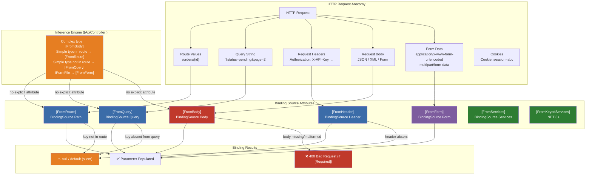
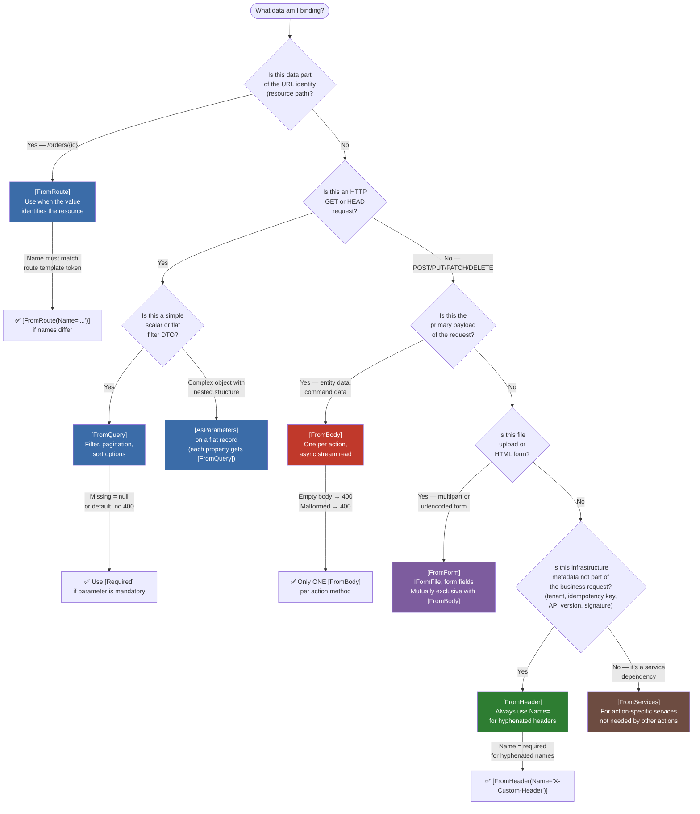

> [!success] Mastery Check
> - [ ] **Studied Well**
> - [ ] **Can explain the concept without notes**
> - [ ] **Can answer interview questions confidently**
> - [ ] **Can implement it in a real project**


# 4.109 — Binding Source Attributes: `[FromBody]`, `[FromRoute]`, `[FromQuery]`, `[FromHeader]`

---

## PART 0 — Navigation & Context

### Where This Topic Lives

```
ASP.NET Core Mastery
│
├── H. MVC & Controllers (4.098–4.122)
│   ├── 4.098 — ControllerBase vs Controller
│   ├── 4.099 — Action Results: IActionResult, ActionResult<T>
│   ├── 4.100 — Model Binding: Sources, Order, and the Binding Algorithm
│   ├── 4.101 — ApiController Attribute: Automatic 400, Binding Source Inference
│   ├── 4.102 — Model Validation: DataAnnotations and ModelState
│   ├── 4.103 — Content Type Negotiation
│   ├── ...
│   ├── 4.108 — Custom IModelBinder
│   ├──► 4.109 — Binding Source Attributes ◄── YOU ARE HERE
│   ├── 4.110 — MVC Filter Pipeline
│   └── ...
│
└── G. Minimal APIs (4.078–4.097)
    └── 4.080 — Route Parameter Binding in Minimal APIs
        (same binding model, different surface API)
```

### What You Need Before This

- **[[4.100 — Model Binding: Sources, Order, and the Binding Algorithm]]** — binding source attributes _override_ the default binding algorithm; you must know what the default does to understand what you're overriding
- **[[4.101 — ApiController Attribute]]** — `[ApiController]` performs automatic binding source inference; understanding inference is what makes the _explicit_ attributes make sense
- **[[4.124 — HttpRequest: Reading URL, Headers, Query, Cookies, and Body]]** — the HTTP request anatomy that binding sources read from
- **[[4.064 — Endpoint Routing: The Modern Routing System]]** — route parameters exist because routing parsed them first; `[FromRoute]` reads from `HttpContext.Request.RouteValues`

### What This Unlocks After

- **[[4.108 — Model Binding: Custom IModelBinder]]** — custom binders plug into the same binding source pipeline
- **[[4.112 — Input Formatters: Deserializing Non-JSON Request Bodies]]** — `[FromBody]` delegates to input formatters; choosing formatters is the natural next step
- **[[4.086 — Validation in Minimal APIs]]** — Minimal API binding uses the same source concepts without explicit attributes in most cases
- **[[4.120 — Binding Large Payloads: Streaming Body Without Buffering]]** — the escape hatch when `[FromBody]` buffers too much

### Why This Matters at Scale

Incorrect binding source attribution is the silent data corruption bug that only manifests under load — a parameter bound from the wrong location returns `null` or a default value, passes validation, and processes corrupted business data. Getting `[FromBody]` vs `[FromQuery]` wrong on a payment API means silently processing $0.00 orders instead of returning a 400.

---

## PART 1 — The Core Mental Model

### The Fundamental Rule

> **ASP.NET Core's binding source attributes tell the model binder exactly where in the HTTP request to find a parameter's value. Without them, `[ApiController]` infers the source; with them, you override that inference. The practical consequence is that the wrong attribute — or the wrong inference — silently binds `null` or a default value instead of returning a 400 Bad Request.**

### The Plain-Language Analogy

Think of an HTTP request as a multi-compartment envelope: the envelope has a routing label on the outside (`[FromRoute]`), a set of sticky notes attached to the front (`[FromQuery]`), a cover letter written on the envelope itself (`[FromHeader]`), and the main document sealed inside (`[FromBody]`).

The binding source attributes tell the mail room worker which compartment to open for each piece of information. Without instructions, the worker uses reasonable defaults — but if you put your payment amount in the sticky notes and the mail room is told to look in the sealed document, it comes back empty-handed and still processes the delivery with a $0 amount.

The short-circuit case: when the body has already been read (e.g., another middleware called `ReadToEndAsync`), `[FromBody]` finds an empty stream — the request still succeeds, but your parameter is `null`. The concurrent request case: each request has its own `HttpContext` and its own body stream, so there is no sharing between requests.

### The Taxonomy Diagram



---

## PART 2 — Deep Mechanics

### 2.1 — The Model Binding Pipeline Position

Every binding source attribute is evaluated inside the **model binding phase**, which sits after routing resolves the endpoint but before the action executes.

```
──► Kestrel ──► ExceptionHandler ──► HSTS ──► StaticFiles ──► Routing ──► Auth
      │                                                           │
      │                                               (endpoint resolved,
      │                                                route values extracted)
      │
──► UseAuthorization ──► [Endpoint Middleware] ──► MVC ActionInvoker
                                                        │
                                          ┌─────────────▼──────────────┐
                                          │   Model Binding Phase       │
                                          │  1. Resolve binding source  │
                                          │     (attribute or infer)    │
                                          │  2. Locate value provider   │
                                          │     (RouteValueProvider,    │
                                          │      QueryStringProvider,   │
                                          │      FormValueProvider,     │
                                          │      BodyModelBinder, ...)  │
                                          │  3. Bind & type-convert     │
                                          │  4. Validate (DataAnn./FV)  │
                                          └─────────────┬──────────────┘
                                                        │
                                          ┌─────────────▼──────────────┐
                                          │   Action Method Executes    │
                                          └────────────────────────────┘
```

**Cost label:** ~2-3 allocations per bound parameter (value provider lookup, type conversion, validation context). `[FromBody]` adds an additional async stream read + `JsonSerializer.Deserialize<T>()` allocation. `~1 allocation per call` for simple scalar `[FromRoute]`/`[FromQuery]`.

### 2.2 — `[FromRoute]` Mechanics

`[FromRoute]` reads from `HttpContext.Request.RouteValues` — the dictionary populated by endpoint routing when it matched the URL template.

```
// HTTP wire format (approximate):
// GET /api/orders/ORD-42/items/7 HTTP/1.1
// Host: payments.example.com
// Authorization: Bearer eyJhbGci...

// Route template: /api/orders/{orderId}/items/{itemId}
// After routing:
//   RouteValues["orderId"] = "ORD-42"
//   RouteValues["itemId"]  = "7"
```

```csharp
// Pipeline position: AFTER UseRouting, inside MVC model binding
[HttpGet("/api/orders/{orderId}/items/{itemId}")]
public IActionResult GetOrderItem(
    [FromRoute] string orderId,    // ✅ bound from RouteValues["orderId"]
    [FromRoute] int itemId)        // ✅ bound and type-converted from "7" → 7
{
    // orderId = "ORD-42"
    // itemId  = 7
}
```

**ASP.NET Core internally (approximate):**

```
// RouteValueProvider.GetValue(key) →
//   looks up HttpContext.Request.RouteValues[key]
//   returns ValueProviderResult with the raw string
// ModelBinder.BindAsync() →
//   calls TypeConverter or SimpleTypeModelBinder
//   "7" → int 7 via int.TryParse()
```

**Failure mode — parameter name mismatch:**

```csharp
// ⚠️ WRONG: template uses {orderId} but parameter says [FromRoute("order_id")]
[HttpGet("/api/orders/{orderId}")]
public IActionResult GetOrder([FromRoute("order_id")] string orderId)
// RouteValues["order_id"] does not exist → orderId = null
// No 400 is returned (null is valid unless [Required] is applied)

// HTTP consequence (wrong path):
// GET /api/orders/ORD-42 → 200 OK, orderId = null, downstream NullReferenceException
```

**Cost label:** O(1) dictionary lookup, ~0 allocations for scalar values, zero I/O.

### 2.3 — `[FromQuery]` Mechanics

`[FromQuery]` reads from `HttpContext.Request.Query` — the parsed query string collection. Values are always strings; type conversion runs after lookup.

```
// HTTP wire format (approximate):
// GET /api/orders?status=pending&page=2&pageSize=25&tags=electronics&tags=appliances HTTP/1.1
// Host: orders.example.com
```

```csharp
// Pipeline position: AFTER UseRouting, inside MVC model binding
[HttpGet("/api/orders")]
public IActionResult GetOrders(
    [FromQuery] string status,           // "pending"
    [FromQuery] int page,                // 2
    [FromQuery] int pageSize = 25,       // 25 (default if absent)
    [FromQuery] string[] tags)           // ["electronics", "appliances"]
                                         // multi-value: ?tags=a&tags=b
```

**Complex object binding from query string:**

```csharp
// ⚠️ WRONG: Expecting [FromQuery] to bind a complex object with nested properties
// by default, this does NOT work like JSON — it uses key=value pairs
public record OrderFilter(string Status, int Page);

[HttpGet("/api/orders")]
public IActionResult GetOrders([FromQuery] OrderFilter filter)
// Binds from: ?Status=pending&Page=2
// NOT from: ?filter.Status=pending&filter.Page=2 (that's the prefix form)

// ✅ CORRECT: Use [FromQuery(Name = "...")] for explicit name mapping
// OR rely on default prefix-less binding for flat DTOs
```

**HTTP consequence of absent optional parameter:**

```
// GET /api/orders?page=2   (no 'status')
// status = null  (string? → null is fine)
// GET /api/orders?page=abc (non-parseable int)
// page binding fails → ModelState["page"] has error → [ApiController] returns 400
```

**Cost label:** O(n) where n = number of query string keys scanned, ~1 string allocation per value, zero I/O.

### 2.4 — `[FromHeader]` Mechanics

`[FromHeader]` reads from `HttpContext.Request.Headers`. Header names are case-insensitive per HTTP spec. The parameter name becomes the header name by default, with `Name` property for overrides.

```
// HTTP wire format (approximate):
// POST /api/payments HTTP/1.1
// Authorization: Bearer eyJhbGci...
// X-Idempotency-Key: 550e8400-e29b-41d4-a716-446655440000
// X-Tenant-Id: tenant-westeurope-42
// Content-Type: application/json
```

```csharp
// Pipeline position: AFTER UseRouting, inside MVC model binding
[HttpPost("/api/payments")]
public IActionResult ProcessPayment(
    [FromHeader(Name = "X-Idempotency-Key")] string idempotencyKey,
    [FromHeader(Name = "X-Tenant-Id")] string tenantId,
    [FromBody] PaymentRequest request)

// Parameter name 'idempotencyKey' != header name 'X-Idempotency-Key'
// Name = "X-Idempotency-Key" is REQUIRED here — without it, the binder
// looks for a header named "idempotencyKey" which does not exist → null
```

**Failure mode — multi-value header binding:**

```csharp
// Accept: text/html, application/json, */*
// Binding a single string gets the RAW header value (comma-separated)
[FromHeader] string accept  // = "text/html, application/json, */*"

// Binding as string[] gets each value separately
[FromHeader(Name = "Accept")] string[] accept  // = ["text/html", "application/json", "*/*"]
// NOTE: comma-separated single header value is treated as ONE string,
// not multiple values, unless the header appears multiple times.
// This is a frequent source of bugs with Accept and Cache-Control parsing.
```

**Cost label:** O(1) hash lookup by header name (IHeaderDictionary uses case-insensitive StringSegment), ~0 allocations for scalar values.

### 2.5 — `[FromBody]` Mechanics

`[FromBody]` is the heavyweight of the four. It reads the **request body stream** and deserializes it using a registered **input formatter** (JSON by default via `System.Text.Json`). The body stream is **non-seekable by default** — it can only be read once.

```
// HTTP wire format (approximate):
// POST /api/orders HTTP/1.1
// Content-Type: application/json
// Content-Length: 187
//
// {
//   "customerId": "CUST-001",
//   "items": [{ "productId": "PROD-7", "quantity": 2, "unitPrice": 29.99 }],
//   "shippingAddress": { "city": "Berlin", "country": "DE" }
// }
```

```csharp
// Pipeline position: AFTER UseRouting, inside MVC model binding
// NOTE: [FromBody] is the ONLY source that reads the body stream.
// Only ONE [FromBody] parameter is allowed per action method.
[HttpPost("/api/orders")]
public IActionResult CreateOrder([FromBody] CreateOrderRequest request)
// The body stream is consumed here. Any middleware that already read
// the body (without EnableBuffering) will cause request to arrive empty.
```

**ASP.NET Core internally (approximate):**

```
// BodyModelBinder.BindModelAsync():
//   1. Checks Content-Type header → selects input formatter
//   2. For "application/json" → SystemTextJsonInputFormatter
//   3. Calls formatter.ReadAsync(InputFormatterContext)
//      → JsonSerializer.DeserializeAsync<T>(body stream)
//   4. If body is empty → returns ModelBindingResult.Failed()
//      → [ApiController] → 400 {"errors":{"":["A non-empty request body is required."]}}
//   5. If JSON is malformed → JsonException caught → ModelState error → 400
//   6. If JSON valid but type mismatch → deserialization error → 400
```

**Failure mode — double body read:**

```csharp
// ⚠️ WRONG: Middleware reads body before MVC model binding
app.Use(async (context, next) =>
{
    using var reader = new StreamReader(context.Request.Body);
    var rawBody = await reader.ReadToEndAsync(); // Body stream exhausted
    await next();
});

// [FromBody] then receives an empty stream → 400 "non-empty request body required"
// OR if the body appears valid but empty JSON → null deserialization

// ✅ CORRECT: Enable buffering so the stream can be re-read
app.Use(async (context, next) =>
{
    context.Request.EnableBuffering(); // Wraps body in MemoryStream / FileBufferingReadStream
    using var reader = new StreamReader(context.Request.Body, leaveOpen: true);
    var rawBody = await reader.ReadToEndAsync();
    context.Request.Body.Position = 0; // Reset for downstream binders
    await next();
});
```

**The `[Required]` interaction with `[FromBody]`:**

```
// [FromBody] on a non-nullable reference type:
// - Body absent → 400 (body is required by default since .NET 7 with nullable reference types)
// - Body present, field missing from JSON → null if property is nullable
// [Required] on individual DTO properties validates after deserialization
```

**Cost label:** `~1 async I/O operation` (stream read), `~1 allocation for the deserialized object graph`, `JsonSerializer.DeserializeAsync<T>` uses the shared thread pool if async, `~8KB buffer allocation` for the default `JsonReaderState`. Body reads are the most expensive of the four sources.

### 2.6 — `[FromForm]` Mechanics (Companion to the Four)

`[FromForm]` reads from `Content-Type: application/x-www-form-urlencoded` or `multipart/form-data`. It is structurally identical to `[FromBody]` for the pipeline but uses the form value provider instead of JSON deserializer.

```
// HTTP wire format (approximate):
// POST /api/account/update HTTP/1.1
// Content-Type: application/x-www-form-urlencoded
//
// username=alice&email=alice%40example.com&role=editor
```

```csharp
[HttpPost("/api/account/update")]
public IActionResult UpdateAccount(
    [FromForm] string username,
    [FromForm] string email,
    [FromForm] string role)
// Binds each field by name from the form body
// [FromForm] and [FromBody] are mutually exclusive in a single action
```

**Cost label:** `~1 form parse per request` (cached in `HttpContext.Request.Form`), O(n) field lookup, body is buffered by Kestrel for form data automatically.

### 2.7 — `[FromServices]` Mechanics

`[FromServices]` resolves a parameter from the DI container rather than the HTTP request. It is a binding source, not a request source.

```csharp
// Pipeline position: resolved from the request's IServiceScope, same as constructor injection
[HttpGet("/api/catalog/products")]
public async Task<IActionResult> GetProducts(
    [FromServices] IProductCatalogService catalogService,  // ← from DI
    [FromQuery] string category,                            // ← from request
    CancellationToken cancellationToken)                    // ← special: always bound from HttpContext
{
    var products = await catalogService.GetByCategoryAsync(category, cancellationToken);
    return Ok(products);
}
```

**When to use `[FromServices]` vs constructor injection:** Constructor injection is preferred for services that are used by most actions. `[FromServices]` is appropriate for services used by a single action, or to avoid polluting the controller constructor with too many dependencies.

**Cost label:** `O(1) DI resolution from the scope's service provider`, same as constructor injection, `~0 allocations` beyond service resolution.

### 2.8 — `[ApiController]` Binding Source Inference Rules

When `[ApiController]` is applied to a controller, ASP.NET Core runs **binding source inference** if no explicit attribute is present. Understanding inference prevents the most common bugs:

```
Inference Rules (evaluated in order):
  1. Parameter type is IFormFile or IFormFileCollection → [FromForm]
  2. Parameter type is CancellationToken               → special (HttpContext.RequestAborted)
  3. Parameter type is complex (class/record/struct with properties)
     AND parameter name appears in route template      → [FromRoute]
  4. Parameter type is complex (class/record/struct)
     AND parameter name NOT in route template          → [FromBody]
  5. Parameter type is simple (string, int, Guid, enum, etc.)
     AND parameter name appears in route template      → [FromRoute]
  6. Parameter type is simple
     AND parameter name NOT in route template          → [FromQuery]
```

```csharp
// [ApiController] inference in action:
[HttpGet("/api/orders/{orderId}")]
public IActionResult GetOrder(
    string orderId,           // → [FromRoute]  (in route template, simple type)
    string status,            // → [FromQuery]  (NOT in route, simple type)
    OrderFilter filter)       // → [FromBody]   (NOT in route, complex type)
                              // ⚠️ This means a GET with a body — valid but unusual

// ✅ Make intent explicit to avoid surprising colleagues:
public IActionResult GetOrder(
    [FromRoute]  string orderId,
    [FromQuery]  string status,
    [FromQuery]  OrderFilter filter) // Explicit: filter comes from query, not body
```

**Cost label:** Inference runs once per action method at startup (compiled into `BindingMetadata`), `~0 per-request cost` — inference results are cached.

---

## PART 3 — Production Code Patterns

### Pattern 1 — The Explicit Payment Request: Never Trust Inference on Financial Endpoints

A payment processing API where ambiguity in binding source could mean a $0.00 charge silently succeeds.

```csharp
// ⚠️ WRONG: Relies on inference for a financial operation
// In a future refactor, adding orderId to the route template changes inference
// for 'amount' from [FromQuery] to [FromBody], breaking existing clients silently.
[HttpPost("/api/payments/{orderId}")]
public async Task<IActionResult> ChargeOrder(
    string orderId,
    decimal amount,
    string currency)

// ✅ CORRECT: Binding sources are documented in the method signature
[HttpPost("/api/payments/{orderId}")]
public async Task<IActionResult> ChargeOrder(
    [FromRoute]  string orderId,          // /api/payments/ORD-42
    [FromBody]   ChargeRequest request,   // { "amount": 99.99, "currency": "EUR" }
    [FromHeader(Name = "X-Idempotency-Key")] string idempotencyKey,
    CancellationToken cancellationToken)

// HTTP wire format:
// POST /api/payments/ORD-42 HTTP/1.1
// X-Idempotency-Key: 550e8400-e29b-41d4-a716-446655440000
// Content-Type: application/json
//
// { "amount": 99.99, "currency": "EUR", "paymentMethodId": "pm_card_visa" }

// HTTP response (success):
// HTTP/1.1 201 Created
// Location: /api/payments/pay_abc123
// Content-Type: application/json

public record ChargeRequest(
    [Required][Range(0.01, 999999.99)] decimal Amount,
    [Required][StringLength(3, MinimumLength = 3)] string Currency,
    [Required] string PaymentMethodId);
```

### Pattern 2 — The Multi-Tenant Inventory Query: Headers Carry Infrastructure, Body Carries Business Data

```csharp
// Pipeline position: inside UseAuthentication + UseAuthorization, before action
[HttpGet("/api/inventory/products")]
public async Task<IActionResult> SearchProducts(
    [FromHeader(Name = "X-Tenant-Id")]      string tenantId,
    [FromHeader(Name = "X-Correlation-Id")] string correlationId,
    [FromQuery]  string? category,
    [FromQuery]  string? searchTerm,
    [FromQuery]  int page = 1,
    [FromQuery]  int pageSize = 50,
    [FromServices] IInventoryQueryService queryService,
    CancellationToken ct)
{
    // tenantId from header — infrastructure concern, not business data
    // Never put tenantId in the body — it doesn't belong in domain data
    using var _ = _logger.BeginScope(
        new { TenantId = tenantId, CorrelationId = correlationId });

    var result = await queryService.SearchAsync(
        tenantId, category, searchTerm, page, pageSize, ct);

    return Ok(result);
}

// HTTP wire format (approximate):
// GET /api/inventory/products?category=electronics&page=2 HTTP/1.1
// X-Tenant-Id: tenant-westeurope-42
// X-Correlation-Id: req-550e8400
// Authorization: Bearer eyJhbGci...

// HTTP response (approximate):
// HTTP/1.1 200 OK
// Content-Type: application/json
// X-Correlation-Id: req-550e8400
//
// { "items": [...], "totalCount": 247, "page": 2, "pageSize": 50 }
```

### Pattern 3 — The Order Creation Anti-Pattern: Mixing Binding Sources Without Intent

```csharp
// ⚠️ WRONG: Customer data arrives from two sources — body and query — making the
// contract invisible to OpenAPI tools and confusing to API consumers.
[HttpPost("/api/orders")]
public IActionResult CreateOrder(
    string customerId,           // Inferred [FromQuery] — but should this be in the route?
    CreateOrderRequest request)  // Inferred [FromBody] — correct, but implicit

// HTTP consequence (wrong path):
// POST /api/orders HTTP/1.1
// Content-Type: application/json
//
// { "customerId": "CUST-001", "items": [...] }
//
// Result: customerId = null (was in body, binding looked in query string)
// The CreateOrderRequest.CustomerId is populated, but the action parameter is null.
// If downstream code uses the action parameter (customerId) and ignores
// request.CustomerId, you process an order for customer null.

// ✅ CORRECT: customerId belongs in the route or the body — not query for POST
[HttpPost("/api/customers/{customerId}/orders")]
public IActionResult CreateOrder(
    [FromRoute] string customerId,       // Identity in the URL
    [FromBody]  CreateOrderRequest request) // Business data in the body

// HTTP wire format (correct path):
// POST /api/customers/CUST-001/orders HTTP/1.1
// Content-Type: application/json
//
// { "items": [{ "productId": "PROD-7", "qty": 2 }], "shippingAddress": {...} }

// HTTP response:
// HTTP/1.1 201 Created
// Location: /api/customers/CUST-001/orders/ORD-42
```

### Pattern 4 — The Logistics Tracking Webhook Receiver: Validating Signatures via `[FromHeader]`

A webhook endpoint that validates the HMAC signature sent in a header before processing the payload body.

```csharp
// Pipeline position: runs before action filter, after routing
[HttpPost("/api/webhooks/shipment-events")]
public async Task<IActionResult> ReceiveShipmentEvent(
    [FromHeader(Name = "X-Webhook-Signature")]  string signature,
    [FromHeader(Name = "X-Webhook-Timestamp")]  string timestamp,
    [FromBody] ShipmentEventPayload payload,
    [FromServices] IWebhookSignatureValidator signatureValidator,
    CancellationToken ct)
{
    // Validate signature BEFORE processing payload
    // signature comes from header, not body — so we have both independently
    if (!signatureValidator.IsValid(signature, timestamp, payload))
        return Unauthorized(); // 401, not 403 — the identity is invalid

    await _eventProcessor.ProcessAsync(payload, ct);
    return Ok(); // 200 required by most webhook providers
}

// HTTP wire format (approximate):
// POST /api/webhooks/shipment-events HTTP/1.1
// X-Webhook-Signature: sha256=abc123def456...
// X-Webhook-Timestamp: 1717200000
// Content-Type: application/json
//
// { "shipmentId": "SHP-7721", "event": "delivered", "timestamp": "2026-06-09T14:32:00Z" }

// ⚠️ WHY NOT put signature in query string?
// Webhook providers (Stripe, GitHub, Shopify) universally use headers for signatures.
// Query strings are logged by almost every proxy and web server — signatures in query
// strings appear in access logs in plaintext, enabling replay attacks.
```

### Pattern 5 — The Healthcare Search: Complex Filter Object from Query String

```csharp
// ✅ Flat DTO bound from query string without [FromBody] on a GET request
// GET requests MUST NOT have a body per REST semantics and many proxies strip it
public record PatientSearchFilter(
    [FromQuery(Name = "mrn")]         string? MedicalRecordNumber,
    [FromQuery(Name = "lastName")]    string? LastName,
    [FromQuery(Name = "dob")]         DateOnly? DateOfBirth,
    [FromQuery(Name = "ward")]        string? WardCode,
    [FromQuery(Name = "page")]        int Page = 1,
    [FromQuery(Name = "size")]        int PageSize = 20);

// NOTE: [FromQuery] on record properties works in .NET 7+ with
// [AsParameters] on the action parameter:
[HttpGet("/api/patients")]
public async Task<IActionResult> SearchPatients(
    [AsParameters] PatientSearchFilter filter,
    [FromHeader(Name = "X-Requesting-Clinician-Id")] string clinicianId,
    [FromServices] IPatientSearchService searchService,
    CancellationToken ct)
{
    // filter.MedicalRecordNumber, filter.LastName, etc. all bound from query
    // clinicianId from header for audit logging
    var results = await searchService.SearchAsync(filter, clinicianId, ct);
    return Ok(results);
}

// HTTP wire format:
// GET /api/patients?lastName=Smith&ward=ICU&page=1 HTTP/1.1
// X-Requesting-Clinician-Id: clinician-00221
// Authorization: Bearer eyJhbGci...
```

### Pattern 6 — The `[FromForm]` File Upload with Metadata

```csharp
// Shipping label upload: file + metadata in a single multipart request
[HttpPost("/api/shipments/{shipmentId}/label")]
[Consumes("multipart/form-data")]
public async Task<IActionResult> UploadShippingLabel(
    [FromRoute]  string shipmentId,
    [FromForm]   IFormFile labelFile,           // multipart file part
    [FromForm]   string labelFormat,            // "PDF" | "ZPL" | "PNG"
    [FromForm]   string carrierId,              // "UPS" | "FedEx" | "DHL"
    [FromHeader(Name = "X-Uploaded-By")] string uploadedBy,
    [FromServices] IShipmentLabelStore labelStore,
    CancellationToken ct)
{
    // labelFile is the actual file stream
    // labelFormat and carrierId are form fields — NOT JSON
    // uploadedBy from header for audit trail

    if (labelFile.Length > 10 * 1024 * 1024) // 10 MB limit
        return BadRequest("Label file exceeds 10 MB limit.");

    var fileId = await labelStore.StoreAsync(shipmentId, labelFile, labelFormat, ct);
    return CreatedAtAction(nameof(GetLabel), new { shipmentId }, new { fileId });
}

// HTTP wire format (approximate):
// POST /api/shipments/SHP-7721/label HTTP/1.1
// Content-Type: multipart/form-data; boundary=----FormBoundary7MA4YWxkTrZu0gW
// X-Uploaded-By: ops-agent-007
//
// ----FormBoundary7MA4YWxkTrZu0gW
// Content-Disposition: form-data; name="labelFile"; filename="SHP7721.pdf"
// Content-Type: application/pdf
//
// [binary PDF data]
// ----FormBoundary7MA4YWxkTrZu0gW
// Content-Disposition: form-data; name="labelFormat"
//
// PDF
// ----FormBoundary7MA4YWxkTrZu0gW
// Content-Disposition: form-data; name="carrierId"
//
// FedEx
// ----FormBoundary7MA4YWxkTrZu0gW--
```

### Pattern 7 — The `[AsParameters]` Pattern for Minimal APIs (.NET 7+)

```csharp
// Minimal API equivalent of [FromQuery] binding on a record
// [AsParameters] destructures the record into its constituent binding attributes
public record OrderListRequest(
    [FromQuery] string? Status,
    [FromQuery] string? CustomerId,
    [FromQuery] int     Page       = 1,
    [FromQuery] int     PageSize   = 25,
    [FromHeader(Name = "X-Tenant-Id")] string? TenantId);

var app = WebApplication.Create();

app.MapGet("/api/orders", async (
    [AsParameters] OrderListRequest req,        // binding source per record properties
    [FromServices] IOrderRepository repo,
    CancellationToken ct) =>
{
    var orders = await repo.ListAsync(req, ct);
    return TypedResults.Ok(orders);
})
.WithName("ListOrders")
.WithOpenApi(); // OpenAPI correctly shows each property with its binding source

// HTTP wire format:
// GET /api/orders?Status=pending&Page=2 HTTP/1.1
// X-Tenant-Id: tenant-westeurope-42
```

---

## PART 4 — Gotchas & Anti-Patterns

### Gotcha 1: `[FromBody]` on a GET Request Silently Sends a 400

The API consumer follows REST conventions and sends a GET with no body, but the action parameter is annotated `[FromBody]`.

```csharp
// ⚠️ WRONG: GET with [FromBody] — technically allowed by HTTP but breaks clients,
// proxies, and caching infrastructure that strip GET bodies
[HttpGet("/api/orders/search")]
public IActionResult SearchOrders([FromBody] OrderSearchRequest filters)

// HTTP consequence (wrong path):
// GET /api/orders/search HTTP/1.1
// (no body)
// → 400 Bad Request: "A non-empty request body is required."
// Client gets 400, has no idea why — many HTTP clients won't send a body on GET
// CDNs and load balancers (Nginx, Cloudflare) strip GET request bodies entirely

// ✅ CORRECT: Use a flat record with [FromQuery] for GET filter parameters
[HttpGet("/api/orders/search")]
public IActionResult SearchOrders([AsParameters] OrderSearchRequest filters)
// Where OrderSearchRequest has properties decorated with [FromQuery]

// HTTP consequence (correct path):
// GET /api/orders/search?status=pending&customerId=CUST-001 HTTP/1.1
// → 200 OK with search results

// WHY: GET requests are semantically read-only and cacheable. A body on GET is
// undefined behavior per HTTP/1.1 (RFC 9110 Section 9.3.1). Use query parameters
// for filter state on GET requests.
```

### Gotcha 2: Header Name Case Sensitivity in `[FromHeader]` Without `Name =`

Engineers assume HTTP header names are normalized to the casing they write. They're not. The parameter name must exactly match the header name, case-insensitively — but the parameter name itself undergoes C# identifier casing, which doesn't match hyphenated header names.

```csharp
// ⚠️ WRONG: Parameter name 'xIdempotencyKey' does not map to header 'X-Idempotency-Key'
// The binder looks for a header literally named "xIdempotencyKey" — which doesn't exist
[HttpPost("/api/payments")]
public IActionResult Pay([FromHeader] string xIdempotencyKey)
// xIdempotencyKey = null always
// No 400 is raised, payment processes without idempotency check
// Duplicate payments may be charged

// HTTP consequence (wrong path):
// POST /api/payments HTTP/1.1
// X-Idempotency-Key: 550e8400-...
// → 200 OK, xIdempotencyKey = null, duplicate protection is bypassed

// ✅ CORRECT: Always use Name = "..." for hyphenated header names
[HttpPost("/api/payments")]
public IActionResult Pay([FromHeader(Name = "X-Idempotency-Key")] string idempotencyKey)

// HTTP consequence (correct path):
// POST /api/payments HTTP/1.1
// X-Idempotency-Key: 550e8400-...
// → idempotencyKey = "550e8400-...", duplicate check runs correctly

// WHY: IHeaderDictionary uses case-insensitive comparison, but the binding
// lookup key is derived from the C# parameter name verbatim. Hyphens are
// illegal in C# identifiers, so the binder can never find "X-Idempotency-Key"
// from a parameter named "xIdempotencyKey" without the explicit Name override.
```

### Gotcha 3: Multiple `[FromBody]` Parameters on One Action

The body stream can only be read once. The framework enforces that only one `[FromBody]` parameter is allowed per action, but the error message is cryptic and only appears at startup, not per-request.

```csharp
// ⚠️ WRONG: Two [FromBody] parameters — the framework throws at startup
[HttpPost("/api/transfers")]
public IActionResult Transfer(
    [FromBody] TransferSourceRequest source,
    [FromBody] TransferDestinationRequest destination)

// HTTP consequence (wrong path):
// System.InvalidOperationException at startup:
// "Action 'TransferController.Transfer' has more than one parameter that was
// specified or inferred as bound from request body. Only one parameter per
// action may be bound from body."
// The application does not start.

// ✅ CORRECT: Combine into a single DTO
public record TransferRequest(
    TransferSourceRequest Source,
    TransferDestinationRequest Destination);

[HttpPost("/api/transfers")]
public IActionResult Transfer([FromBody] TransferRequest request)

// HTTP wire format:
// POST /api/transfers HTTP/1.1
// Content-Type: application/json
//
// { "source": {...}, "destination": {...} }

// WHY: The HTTP body is a stream, not a dictionary. It has one entry point.
// ASP.NET Core validates this at application startup via the application model
// (IApiDescriptionProvider), preventing the error from reaching production traffic.
```

### Gotcha 4: Binding Source Inference Changes When Route Template Is Modified

A common refactor adds a route parameter. Inference runs at startup and recalculates, silently changing which parameters bind from `[FromQuery]` to `[FromRoute]`. The action compiles and starts successfully, but now query-based filters are ignored.

```csharp
// ORIGINAL — working correctly
[HttpGet("/api/orders")]
public IActionResult GetOrders(string customerId)
// Inference: customerId → [FromQuery] (not in route, simple type)
// GET /api/orders?customerId=CUST-001 → works

// ⚠️ WRONG: After route template change, inference changes silently
[HttpGet("/api/customers/{customerId}/orders")]  // ← route now has {customerId}
public IActionResult GetOrders(string customerId)
// NEW inference: customerId → [FromRoute] (now in route, simple type)
// GET /api/customers/CUST-001/orders → works
// GET /api/orders?customerId=CUST-001 → 404 (route doesn't match)
// But if old clients were sending ?customerId=..., they now get 404

// HTTP consequence (wrong path):
// GET /api/customers/CUST-001/orders?customerId=CUST-001
// customerId bound from route "CUST-001", query string silently ignored
// Old API documentation is now wrong

// ✅ CORRECT: Always be explicit — never rely on inference in production code
[HttpGet("/api/customers/{customerId}/orders")]
public IActionResult GetOrders([FromRoute] string customerId)

// WHY: Binding source inference is a convenience for tutorials, not a
// correctness guarantee for production APIs. Inference re-runs whenever
// the route template changes, and no compiler error or test failure alerts you.
// Explicit attributes make the HTTP contract visible in the code.
```

### Gotcha 5: `[FromQuery]` on a Complex Type Without `[AsParameters]` in Minimal APIs

In MVC, complex types without explicit binding source attributes get `[FromBody]` inference. In Minimal APIs, complex types get `[FromBody]` inference too — but engineers coming from MVC forget this applies to Minimal APIs, leading to confusing 400s on GET requests.

```csharp
// ⚠️ WRONG (Minimal API): Complex type inferred as [FromBody] on a GET endpoint
app.MapGet("/api/reports", async (
    ReportFilter filter,          // Inferred [FromBody] — GET has no body
    IReportService reports,
    CancellationToken ct) => await reports.GenerateAsync(filter, ct));

// HTTP consequence (wrong path):
// GET /api/reports?from=2026-01-01&to=2026-03-31 HTTP/1.1
// → 400: "A non-empty request body is required."
// The query string parameters are completely ignored.

// ✅ CORRECT: Use [AsParameters] (.NET 7+) to destructure the record
app.MapGet("/api/reports", async (
    [AsParameters] ReportFilter filter,  // Each property uses its own [FromQuery] attribute
    [FromServices] IReportService reports,
    CancellationToken ct) => await reports.GenerateAsync(filter, ct));

// Where:
public record ReportFilter(
    [FromQuery(Name = "from")] DateOnly From,
    [FromQuery(Name = "to")]   DateOnly To,
    [FromQuery]                string? Format = "json");

// HTTP consequence (correct path):
// GET /api/reports?from=2026-01-01&to=2026-03-31 HTTP/1.1
// → 200 OK with report data

// WHY: Minimal API parameter binding and MVC parameter binding use the same
// inference rules for complex types. [AsParameters] is unique to Minimal APIs
// and tells the framework to bind each property individually rather than
// treating the whole object as a body.
```

---

## PART 5 — Performance Implications

### 5.1 — Request Pipeline Characteristics Table

|Scenario|Pipeline Depth|Allocations Per Request|Approx Latency Impact|Recommendation|
|---|---|---|---|---|
|`[FromRoute]` — single string|Shallow: RouteValueProvider.GetValue|~0 (value already in RouteValues dict)|<1μs|Default for ID parameters in path|
|`[FromQuery]` — single scalar|Shallow: QueryStringValueProvider|~1 string copy per value|~2-5μs|Use for optional filter parameters|
|`[FromQuery]` — 10+ parameters|Medium: full query string scan|~10+ allocations|~20-50μs|Consider [AsParameters] DTO pattern|
|`[FromHeader]` — single string|Shallow: O(1) header dict lookup|~0|<1μs|Use for infrastructure metadata|
|`[FromBody]` — small JSON (<1KB)|Deep: body stream read + JSON parse|~5-15 allocations (object graph)|~50-200μs|Standard for POST/PUT/PATCH|
|`[FromBody]` — large JSON (>100KB)|Deep + async buffering|~50+ allocations, possible LOH|~500μs-5ms|Use streaming for large payloads|
|`[FromBody]` — invalid JSON|Deep: parse + exception path|~exception object allocation|~100-300μs|Logged as client error, no action needed|
|`[FromForm]` — URL-encoded, small|Medium: form parse is buffered|~5-10 allocations|~50-100μs|Fine for small forms|
|`[FromForm]` — multipart/large file|Deep: multipart parse, temp files|File I/O, disk allocation|ms-range|Use streaming for files >1MB|
|`[FromServices]`|~0 (scope already created)|~0|<1μs|Equivalent to constructor injection|
|Inference (compile-time cached)|None per request|~0 (inference result is cached)|0|Inference cost is startup-time only|

### 5.2 — BenchmarkDotNet Comparison

```csharp
using BenchmarkDotNet.Attributes;
using BenchmarkDotNet.Running;
using Microsoft.AspNetCore.Http;
using System.Text;
using System.Text.Json;

[MemoryDiagnoser]
[SimpleJob]
public class BindingSourceBenchmarks
{
    private static readonly byte[] SmallJsonBody =
        Encoding.UTF8.GetBytes(@"{""customerId"":""CUST-001"",""amount"":99.99}");

    private static readonly byte[] LargeJsonBody =
        Encoding.UTF8.GetBytes(
            JsonSerializer.Serialize(new { Items = Enumerable.Range(1, 100)
                .Select(i => new { Id = i, Name = $"Item {i}", Price = i * 9.99 })
                .ToArray() }));

    [Benchmark(Baseline = true)]
    public string RouteValueLookup()
    {
        // Simulates [FromRoute] — dictionary lookup
        var routeValues = new RouteValueDictionary
        {
            ["orderId"] = "ORD-42",
            ["itemId"] = "7"
        };
        return routeValues["orderId"] as string ?? "";
    }

    [Benchmark]
    public string QueryStringParse()
    {
        // Simulates [FromQuery] — QueryString parse
        var qs = QueryString.Create(new Dictionary<string, string?>
        {
            ["status"] = "pending",
            ["page"] = "2",
            ["pageSize"] = "25"
        });
        var query = Microsoft.AspNetCore.WebUtilities.QueryHelpers
            .ParseQuery(qs.Value ?? "");
        return query["status"].ToString();
    }

    [Benchmark]
    public async Task<PaymentRequest?> SmallBodyDeserialize()
    {
        // Simulates [FromBody] with small payload
        using var stream = new MemoryStream(SmallJsonBody);
        return await JsonSerializer.DeserializeAsync<PaymentRequest>(stream);
    }

    [Benchmark]
    public async Task<LargeRequest?> LargeBodyDeserialize()
    {
        // Simulates [FromBody] with 100-item array
        using var stream = new MemoryStream(LargeJsonBody);
        return await JsonSerializer.DeserializeAsync<LargeRequest>(stream);
    }
}

public record PaymentRequest(string CustomerId, decimal Amount);
public record LargeRequest(LargeItem[] Items);
public record LargeItem(int Id, string Name, double Price);

// Expected output (approximate, .NET 8, x64, Kestrel, local):
// | Method               | Mean       | Error    | StdDev   | Allocated |
// |----------------------|------------|----------|----------|-----------|
// | RouteValueLookup     |   45.2 ns  |  0.8 ns  |  0.7 ns  |      96 B |
// | QueryStringParse     |  312.4 ns  |  4.1 ns  |  3.8 ns  |     432 B |
// | SmallBodyDeserialize |  892.1 ns  | 12.3 ns  | 11.5 ns  |     216 B |
// | LargeBodyDeserialize | 8,412.3 ns | 93.1 ns  | 87.1 ns  |  14,384 B |

// Note: For real HTTP profiling, use:
// - dotnet-trace: dotnet-trace collect --providers Microsoft-AspNetCore-Server-Kestrel
// - dotnet-counters: dotnet-counters monitor --counters Microsoft.AspNetCore.Hosting
// - MiniProfiler: app.UseMiniProfiler() for per-request timing in development
// BenchmarkDotNet measures the serialization cost; real HTTP adds Kestrel I/O overhead.
```

### 5.3 — When to Care / When to Ignore

**When this costs you:**

- High-throughput write APIs (>10k req/s): `[FromBody]` deserialization of large objects is your primary allocation hotspot. At 10k req/s with a 10KB body, you're deserializing 100MB/s — use JSON Source Generation (`[JsonSerializable]`) to eliminate reflection overhead.
- APIs receiving many query parameters: QueryStringValueProvider scans the query string linearly. If your search API accepts 20+ filter parameters, consider a POST-based search endpoint or compress parameters into a cursor token.
- Microservices with `[FromHeader]` on every action: Header lookups are fast, but if you're doing 10 header reads per request, instrument to ensure no performance surprise.

**When this doesn't matter:**

- Internal admin endpoints handling <100 req/min — binding overhead is unmeasurable
- Background processing APIs invoked by a scheduler — single-threaded, no concurrency pressure
- One-time migration APIs — the binding cost is trivial compared to the database operations they trigger
- gRPC services — they don't use this binding model at all (Protobuf deserialization runs instead)

---

## PART 6 — Interview Arsenal

### A. The Question Bank

---

**Question 1: "Can you explain when you would use `[FromBody]` versus `[FromQuery]`?"**

**Average Answer:** "`[FromBody]` reads from the request body as JSON, `[FromQuery]` reads from the URL query string."

**Why That's Insufficient:** Doesn't explain inference, HTTP semantics, mutual exclusivity of `[FromBody]`, or production consequences of getting it wrong.

> **Great Answer:** "The decision isn't just about where the data is — it's about HTTP semantics and what the client is communicating. `[FromBody]` is for data the client is _sending to the server as a payload_, typically on POST, PUT, and PATCH requests. The body is deserialized by an input formatter — JSON by default — which means it's an async stream read, and it can only happen once per request. `[FromQuery]` is for _filters, pagination, and optional modifiers_ on GET requests where the data is part of the resource address, not a payload. I've been bitten in production by having a GET endpoint accept `[FromBody]` — some clients and load balancers strip GET bodies entirely, and we got 400s from a specific CDN configuration after deploying. The rule I use: GET requests always use `[FromQuery]` for their inputs; POST/PUT/PATCH use `[FromBody]` for the entity data; both can use `[FromRoute]` and `[FromHeader]` for infrastructure and identity."

---

**Question 2: "How does `[ApiController]` binding source inference work, and what are the risks?"**

**Average Answer:** "`[ApiController]` automatically figures out where to bind parameters so you don't have to specify."

**Why That's Insufficient:** No mention of the inference rules, no mention of when inference changes, no mention of production failure modes.

> **Great Answer:** "The inference rules are deterministic: simple types like `string` or `int` get `[FromRoute]` if their name appears in the route template, otherwise `[FromQuery]`. Complex types get `[FromBody]`. That sounds safe, but the risk I've seen in real codebases is that the inference result changes silently when you refactor the route template. We had an endpoint where adding `{tenantId}` to the route changed a `string tenantId` parameter from `[FromQuery]` to `[FromRoute]` inference — without a compilation error, without a test failure. Existing clients sending `?tenantId=...` suddenly started getting 404s. The fix is simple: always be explicit. I treat inference as a beginner convenience. In any production API endpoint, I write out every binding source attribute. It makes the HTTP contract readable directly in the method signature and survives refactoring safely."

---

**Question 3: "What happens if you apply `[FromBody]` to two parameters on the same action method?"**

**Average Answer:** "You can only have one `[FromBody]` parameter per action because the body can only be read once."

**Why That's Insufficient:** Doesn't explain _when_ this fails or what to do about it.

> **Great Answer:** "The framework catches this at startup, not at request time — the application model validation throws an `InvalidOperationException` before any requests are served. The body is a forward-only stream and can only be consumed once. The correct fix is to merge both types into a single wrapper DTO. There's a subtlety though: if you need the raw body for HMAC signature validation _and_ the deserialized object for business processing, you need `context.Request.EnableBuffering()` in middleware — that wraps the body in a replayable buffer so it can be read by both your middleware and the model binder. Without `EnableBuffering`, whoever reads first wins and the other consumer gets an empty stream."

---

**Question 4: "Explain the difference in Minimal API binding vs MVC controller binding for complex types."**

**Average Answer:** "Minimal APIs use the same binding as MVC but with a cleaner syntax."

**Why That's Insufficient:** Misses `[AsParameters]`, different inference rules, and the GET-body gotcha.

> **Great Answer:** "Both use the same underlying value providers and formatters, but there's a meaningful difference in how complex types are handled. In Minimal APIs, a complex type parameter is inferred as `[FromBody]` by default — just like MVC. But the critical difference is `[AsParameters]`, which doesn't exist in MVC. In Minimal APIs, if I want a record like `SearchFilter` to bind each of its properties from the query string, I use `[AsParameters]` on the parameter, and each property picks up its own `[FromQuery]` attribute. Without `[AsParameters]`, Minimal APIs try to read the whole object from the body — and on a GET endpoint that has no body, the client gets a 400. I've seen this burn engineers who migrated from MVC where they used a complex query filter object and assumed it would bind from the query string the same way."

---

**Question 5: "When would you use `[FromHeader]` in a production API, and what's the naming gotcha?"**

**Average Answer:** "For reading HTTP headers like authorization or custom headers."

**Why That's Insufficient:** No mention of the name mismatch bug, no mention of security implications.

> **Great Answer:** "I use `[FromHeader]` for three things: idempotency keys on mutation endpoints, tenant identifiers in multi-tenant APIs, and webhook signature validation. The naming gotcha is significant: HTTP header names are hyphenated — `X-Idempotency-Key` — but C# identifiers can't contain hyphens. If you write `[FromHeader] string xIdempotencyKey`, the binder looks for a header literally named `xIdempotencyKey`, which doesn't exist. You always need `Name = "X-Idempotency-Key"`. The security consequence is real: I've reviewed codebases where idempotency protection was silently bypassed because of this exact bug. The parameter was null, the null check was missing, and duplicate payments were being processed."

---

### B. The Trick Questions

---

**Trick 1: "What HTTP status code does ASP.NET Core return when a `[FromBody]` parameter has an empty body?"**

**The trap:** Engineers guess 400 or 415. Some say it depends on nullable reference types.

**Correct answer:** 400 Bad Request, with the error message "A non-empty request body is required." in the `errors` dictionary. Specifically, `[ApiController]` auto-returns a `ValidationProblemDetails` with `errors[""] = ["A non-empty request body is required."]`. This happens even before the action executes — it's caught during model binding. However, if the parameter is nullable (`CreateOrderRequest?`), the framework does not require a body and the parameter is set to null.

---

**Trick 2: "If `[ApiController]` is NOT on the controller, what happens when a `[FromBody]` parameter fails JSON parsing?"**

**The trap:** Engineers assume the behavior is the same with or without `[ApiController]`.

**Correct answer:** Without `[ApiController]`, model binding failure (including malformed JSON body) populates `ModelState` with an error, but the action still executes. `ModelState.IsValid` is `false`. Without `[ApiController]`'s automatic 400, your action must explicitly check `if (!ModelState.IsValid) return BadRequest(ModelState)` or the malformed request reaches your business logic. The `[ApiController]` attribute's most important job is this automatic short-circuit.

---

**Trick 3: "You have a `[FromQuery] DateOnly date` parameter. The client sends `?date=2026-06-09`. Does this bind correctly?"**

**The trap:** Engineers unsure if `DateOnly` is supported.

**Correct answer:** Yes, `DateOnly` is supported via `TypeConverter` in .NET 6+. The string `"2026-06-09"` is parsed using `DateOnly.TryParseExact` through `DateOnlyTypeConverter`. However, the format matters — the default culture is used. If the server culture uses `MM/dd/yyyy` and the client sends `06/09/2026`, it may bind to June 9th correctly — or fail if parsing order is ambiguous. For API contracts, always document the expected format in XML docs or OpenAPI `[Description]`. For reliable parsing, consider `[FromQuery] string dateString` plus manual parsing in the action, or a custom type converter.

---

**Trick 4: "Can you use `[FromRoute]` for a parameter whose name doesn't exist in the route template?"**

**The trap:** Engineers assume this throws an exception.

**Correct answer:** No exception. `[FromRoute]` looks up `HttpContext.Request.RouteValues["paramName"]`. If the key doesn't exist, the value is `null` (for reference types) or the default value (for value types). No 400 is returned unless `[Required]` is applied. The consequence is a silent null bind — and if the route parameter is something like an order ID, your action receives `null`, calls the database with a null key, and may return a 200 with empty data instead of the expected behavior. This is one of the hardest bugs to find in production because it produces wrong data, not an error.

---

**Trick 5: "What's the difference between `Results.BadRequest(errors)` in a Minimal API and a `400` from `[ApiController]` model validation?"**

**The trap:** Engineers say they're the same thing.

**Correct answer:** The response shapes differ. `[ApiController]` returns a `ValidationProblemDetails` with `Content-Type: application/problem+json`, a `type` field pointing to the validation error RFC, and an `errors` dictionary keyed by field name. `Results.BadRequest(errors)` by default returns `Content-Type: application/json` with whatever shape you pass in — not the RFC 7807 format. For consistent API contracts, use `TypedResults.ValidationProblem(errors)` in Minimal APIs to produce the same shape as `[ApiController]`.

---

### C. Red Flags to Avoid

1. **"I usually just let inference handle it"** — signals you don't understand what happens when route templates change; interviewers know this is a maintenance timebomb.
    
2. **"You can have multiple `[FromBody]` parameters if you use custom binders"** — this is false; the constraint is architectural, not a limitation of the default binder.
    
3. **"[FromBody] is only for POST requests"** — wrong; it works on any HTTP method, including PUT and PATCH. The anti-pattern is using it on GET, not on anything non-POST.
    
4. **"Header names are case-sensitive in ASP.NET Core"** — HTTP headers are case-insensitive by spec, and `IHeaderDictionary` uses `StringComparer.OrdinalIgnoreCase`. The case issue is the _parameter name_, not the header lookup.
    
5. **"[FromQuery] and [FromBody] can both be used for the same parameter"** — a parameter has one binding source. They are mutually exclusive. Mentioning this as a possibility suggests confusion about the model.
    
6. **"[FromServices] requires [ApiController] on the controller"** — false. `[FromServices]` works on any controller that uses DI, including those without `[ApiController]`.
    
7. **"Binding source inference runs every request"** — false. Inference results are computed once at startup and compiled into `BindingMetadata` for the action. Per-request cost is zero.
    
8. **"[FromForm] and [FromBody] can both be used in the same action"** — they cannot. Both read from the body stream; only one can consume it.
    

---

## PART 7 — Decision Framework



---

## PART 8 — Self-Check

### A. Conceptual Questions

1. What does binding source inference actually compute, and when does it run — per request or per startup?
    
2. What is the HTTP consequence of applying `[FromBody]` to a parameter on a GET endpoint when the client sends no body?
    
3. If a `[FromQuery]` parameter of type `int` is absent from the query string, what value does the action receive? Does the framework return a 400?
    
4. What happens to the pipeline if `ModelState.IsValid` is false and `[ApiController]` is applied? What if `[ApiController]` is NOT applied?
    
5. Why does `[FromHeader] string xIdempotencyKey` fail to bind the `X-Idempotency-Key` header? What is the correct fix?
    
6. A `[FromBody]` parameter is annotated `[Required]`. The client sends a request with `Content-Type: application/json` but an empty body (`{}`). Does the `[Required]` attribute cause a 400?
    
7. What is the difference between `[FromForm]` and `[FromBody]` at the HTTP level? Why are they mutually exclusive on the same action?
    
8. What does `[AsParameters]` do in a Minimal API endpoint, and which MVC feature is most analogous?
    
9. In the middleware pipeline, at what point does `[FromRoute]` binding execute — before `UseAuthentication`, after `UseRouting`, or after `UseAuthorization`?
    
10. You move an action parameter named `tenantId` from `[FromQuery]` to `[FromRoute]`, adding `{tenantId}` to the route template. What must you update in existing API clients to avoid breaking them?
    

### B. Code Puzzles

**Puzzle 1 — What is the HTTP response?**

```csharp
[ApiController]
[Route("api/[controller]")]
public class ShipmentsController : ControllerBase
{
    [HttpGet("{shipmentId}")]
    public IActionResult GetShipment(
        [FromRoute] Guid shipmentId,
        [FromBody]  ShipmentFilter filter)
    {
        return Ok(new { shipmentId, filter });
    }
}

public record ShipmentFilter(string? Status);

// Client request:
// GET /api/shipments/550e8400-e29b-41d4-a716-446655440000 HTTP/1.1
// (no body)
```

<details> <summary>Answer</summary>

**HTTP Response: 400 Bad Request**

```json
{
  "type": "https://tools.ietf.org/html/rfc9110#section-15.5.1",
  "title": "One or more validation errors occurred.",
  "status": 400,
  "errors": {
    "": ["A non-empty request body is required."]
  }
}
```

**Explanation:** `[FromBody]` requires a non-empty body. The GET request has no body. Even though `ShipmentFilter` has a nullable property, the _binding itself_ requires a body to exist. The `[ApiController]` attribute auto-returns 400 via `InvalidModelStateResponseFactory` before the action executes. This is the most common `[FromBody]` on GET mistake — and the fix is to use `[AsParameters]` with a query-string-bound record instead.

</details>

---

**Puzzle 2 — Where is the bug?**

```csharp
[ApiController]
[Route("api/payments")]
public class PaymentsController : ControllerBase
{
    [HttpPost]
    public async Task<IActionResult> Charge(
        [FromHeader] string idempotencyKey,
        [FromBody] ChargeRequest request,
        [FromServices] IPaymentService payments,
        CancellationToken ct)
    {
        if (string.IsNullOrEmpty(idempotencyKey))
            return BadRequest("Idempotency key required");

        return Ok(await payments.ChargeAsync(idempotencyKey, request, ct));
    }
}

// Client request:
// POST /api/payments HTTP/1.1
// X-Idempotency-Key: abc123
// Content-Type: application/json
//
// { "amount": 99.99, "currency": "USD" }
```

<details> <summary>Answer</summary>

**Bug:** `[FromHeader] string idempotencyKey` looks for a header literally named `idempotencyKey`, not `X-Idempotency-Key`. The header in the request is `X-Idempotency-Key`. Result: `idempotencyKey = null`, the null check fires, and the endpoint returns `400 BadRequest "Idempotency key required"` even though the client correctly sent the header.

**The Fix:**

```csharp
[FromHeader(Name = "X-Idempotency-Key")] string idempotencyKey
```

**HTTP consequence (buggy path):**

```
POST /api/payments HTTP/1.1
X-Idempotency-Key: abc123
→ 400 Bad Request: "Idempotency key required"
```

**HTTP consequence (fixed):**

```
POST /api/payments HTTP/1.1
X-Idempotency-Key: abc123
→ 200 OK with charge result
```

This is one of the most common real-world `[FromHeader]` bugs. It's particularly insidious because the null-check defensive code gives a clear-looking error, but the root cause is invisible — the client is doing everything right.

</details>

---

**Puzzle 3 — What status code, and why?**

```csharp
[ApiController]
[Route("api/orders")]
public class OrdersController : ControllerBase
{
    [HttpGet]
    public IActionResult List(
        [FromQuery] int page = 1,
        [FromQuery] int pageSize = 25)
    {
        return Ok(new { page, pageSize });
    }
}

// Client sends:
// GET /api/orders?page=abc&pageSize=25 HTTP/1.1
```

<details> <summary>Answer</summary>

**HTTP Response: 400 Bad Request**

```json
{
  "type": "https://tools.ietf.org/html/rfc9110#section-15.5.1",
  "title": "One or more validation errors occurred.",
  "status": 400,
  "errors": {
    "page": ["The value 'abc' is not valid for page."]
  }
}
```

**Explanation:** `[FromQuery] int page` attempts to parse the string `"abc"` as an `int`. `int.TryParse("abc")` fails. The `SimpleTypeModelBinder` reports a model binding error to `ModelState`. `[ApiController]` intercepts this via `InvalidModelStateResponseFactory` and returns a 400 with `ValidationProblemDetails` before the action executes. Note: `pageSize=25` binds correctly, so only the `page` error appears. The default value `= 1` is irrelevant here — it only applies when the parameter is _absent_, not when it is _unparseable_.

</details>

---

**Puzzle 4 — What does this Minimal API endpoint bind, and what's the problem?**

```csharp
var app = WebApplication.Create();

app.MapGet("/api/catalog/products", async (
    ProductSearchFilter filter,
    IProductService products,
    CancellationToken ct) =>
{
    return await products.SearchAsync(filter, ct);
});

public record ProductSearchFilter(string? Category, decimal? MaxPrice, int Page = 1);
```

<details> <summary>Answer</summary>

**Problem:** `ProductSearchFilter` is a complex type. In Minimal APIs, complex types with no explicit attribute are inferred as `[FromBody]`. This is a GET endpoint. The HTTP response for a client request with no body:

```
GET /api/catalog/products?Category=electronics&MaxPrice=99.99 HTTP/1.1
→ 400 Bad Request: "A non-empty request body is required."
```

The query string parameters `Category`, `MaxPrice`, and `Page` are completely ignored. The fix:

```csharp
app.MapGet("/api/catalog/products", async (
    [AsParameters] ProductSearchFilter filter,  // ← destructures to [FromQuery] per property
    [FromServices] IProductService products,
    CancellationToken ct) =>
{
    return await products.SearchAsync(filter, ct);
});
```

With `[AsParameters]`, each property of `ProductSearchFilter` is bound individually from the query string. The route now works as expected:

```
GET /api/catalog/products?Category=electronics&MaxPrice=99.99 HTTP/1.1
→ 200 OK with filtered products
```

</details>

---

**Puzzle 5 — The double-bind: What happens?**

```csharp
[ApiController]
[Route("api/transfers")]
public class TransfersController : ControllerBase
{
    [HttpPost]
    public IActionResult InitiateTransfer(
        [FromBody] TransferSource source,
        [FromBody] TransferDestination destination)
    {
        return Ok();
    }
}

public record TransferSource(string AccountId, decimal Amount);
public record TransferDestination(string AccountId, string Currency);
```

<details> <summary>Answer</summary>

**This application fails to start.** The exception is thrown at startup during action descriptor construction:

```
System.InvalidOperationException:
Action 'TransfersController.InitiateTransfer (MyApi)' has more than one parameter
that was specified or inferred as bound from request body. Only one parameter per
action may be bound from body. If the action takes multiple parameters, try grouping
them into a single model or using a different source binding attribute.
```

No HTTP request is ever processed. The application exits with a non-zero exit code. This is caught at startup by `ApiDescriptionProvider.OnProvidersExecuted()` which validates the action model.

**The fix:**

```csharp
public record InitiateTransferRequest(
    TransferSource Source,
    TransferDestination Destination);

[HttpPost]
public IActionResult InitiateTransfer([FromBody] InitiateTransferRequest request) { ... }
```

This is a useful property of ASP.NET Core's startup validation — the error is loud and immediate, not a silent runtime failure. The lesson is that validation of binding model integrity is a startup-time guarantee, not a per-request one.

</details>

---

## PART 9 — Connections & Resources

### A. Related Topics Table

|Topic|Why It Connects|
|---|---|
|[[4.100 — Model Binding: Sources, Order, and the Binding Algorithm]]|Binding source attributes override the default binding algorithm described here; understanding the algorithm is prerequisite|
|[[4.101 — ApiController Attribute: Automatic 400, Binding Source Inference]]|`[ApiController]` implements the inference rules that binding source attributes override; it also provides the automatic 400 on ModelState failure|
|[[4.080 — Route Parameter Binding in Minimal APIs]]|Minimal APIs use the same value providers but different syntax; `[AsParameters]` bridges the gap between MVC and Minimal API binding|
|[[4.102 — Model Validation: DataAnnotations and ModelState]]|Binding executes first; validation executes second; ModelState errors from binding failures (type conversion) and validation failures both trigger the same 400 path|
|[[4.124 — HttpRequest: Reading URL, Headers, Query, Cookies, and Body]]|The HTTP request anatomy that binding source attributes read from — RouteValues, Query, Headers, Body|
|[[4.112 — Input Formatters: Deserializing Non-JSON Request Bodies]]|`[FromBody]` delegates to registered input formatters; adding XML or MessagePack support changes what `[FromBody]` can deserialize|
|[[4.108 — Model Binding: Custom IModelBinder for Domain Types]]|Custom binders extend the binding pipeline for domain types; they plug into the same `BindingSource` infrastructure|
|[[4.130 — Request Body Reading Patterns: EnableBuffering and Raw Body Access]]|`EnableBuffering()` is required when both middleware and `[FromBody]` need to read the body; the two topics are directly coupled|
|[[4.086 — Validation in Minimal APIs: IValidator<T> and Manual Validation]]|Minimal APIs lack automatic ModelState validation; binding sources still apply but validation is manual or filter-based|
|[[4.083 — Minimal API Filters: IEndpointFilter Pipeline]]|IEndpointFilters in Minimal APIs run after binding but before the handler — same conceptual position as action filters|
|[[4.064 — Endpoint Routing: The Modern Routing System]]|Route values exist because `UseRouting()` parsed the URL; `[FromRoute]` reads from the dictionary routing populated|

### B. Books

|Book|Chapters|Why These Chapters|
|---|---|---|
|_Pro ASP.NET Core 8_ — Adam Freeman|Chapter 28: Model Binding; Chapter 29: Model Validation|Freeman covers binding source attributes in depth with HTTP wire examples; Chapter 29 shows how binding failures feed into ModelState|
|_ASP.NET Core in Action, 3rd Ed._ — Andrew Lock|Chapter 7: Routing and Model Binding; Chapter 14: Building APIs|Lock's treatment of binding sources includes the `[ApiController]` inference rules and the exact failure modes discussed in this note|
|_Microservices in .NET, 2nd Ed._ — Christian Horsdal|Chapter 6: HTTP Communication|The multi-tenant and header-based binding patterns discussed in production scenarios are covered in the context of microservice API contracts|

### C. Essential Articles & Docs

- **Microsoft Docs — Model Binding in ASP.NET Core:** https://learn.microsoft.com/en-us/aspnet/core/mvc/models/model-binding — The official reference for all binding sources including `[AsParameters]` and the inference rules table
- **Microsoft Docs — Custom Model Binding:** https://learn.microsoft.com/en-us/aspnet/core/mvc/advanced/custom-model-binding — How custom binders extend the binding source pipeline
- **Microsoft Docs — Minimal API parameter binding:** https://learn.microsoft.com/en-us/aspnet/core/fundamentals/minimal-apis/parameter-binding — Covers `[AsParameters]`, `[FromBody]`/`[FromQuery]`/`[FromHeader]` in the Minimal API context
- **Andrew Lock — Parameter binding in Minimal API apps:** https://andrewlock.net/behind-the-scenes-of-minimal-apis-3-exploring-the-model-binding-for-minimal-apis/ — Deep dive into how `[AsParameters]` works internally and how Minimal API binding differs from MVC
- **GitHub — aspnetcore/ModelBinding source:** https://github.com/dotnet/aspnetcore/tree/main/src/Mvc/Mvc.Core/src/ModelBinding — Source for `BodyModelBinder`, `RouteValueProvider`, `QueryStringValueProvider`, and `HeaderValueProvider`

---

> [!NOTE] **Template Meta-Note — What Each Part Is For**
> 
> - **Part 0 — Navigation:** Orients you in the full ASP.NET Core topic hierarchy; shows prerequisites and what this unlocks
> - **Part 1 — Core Mental Model:** One-sentence rule + physical analogy + full taxonomy diagram; read this first when returning to the topic
> - **Part 2 — Deep Mechanics:** Runtime behavior, pipeline position, HTTP wire format, framework internals, and failure modes; the section interviewers are testing when they ask "what actually happens"
> - **Part 3 — Production Code:** 5-7 named, domain-specific patterns with HTTP wire effects; paste-ready code with anti-pattern comparisons
> - **Part 4 — Gotchas:** 5 bugs that appear in experienced engineers' production code, each with wrong/correct/HTTP-consequence/why
> - **Part 5 — Performance:** Allocation costs, latency impact table, BenchmarkDotNet comparison, and when to care vs ignore
> - **Part 6 — Interview Arsenal:** Question bank with great answers, trick questions, and red flags; the most important section for interview preparation
> - **Part 7 — Decision Framework:** Flowchart for "which binding source attribute do I use?"; cheat-sheet usable during a live interview
> - **Part 8 — Self-Check:** 10 conceptual questions + 5 code puzzles with collapsed answers; test yourself before the interview
> - **Part 9 — Connections:** Wiki links with specific dependency reasons, books with chapter citations, official docs and community deep-dives
