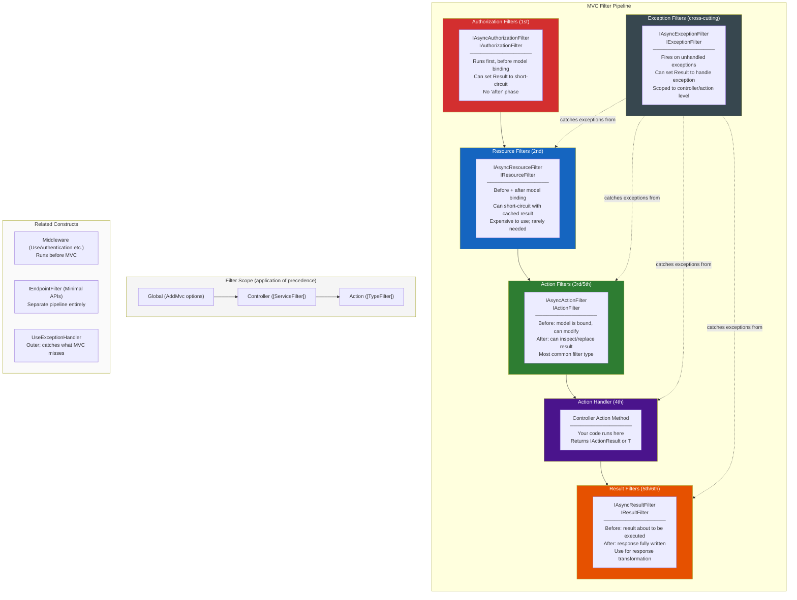
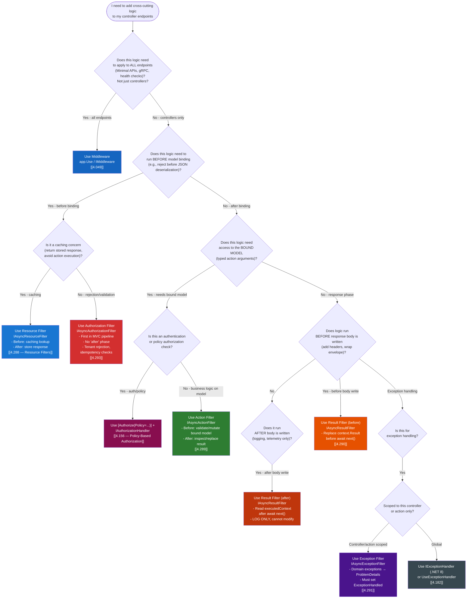

> [!success] Mastery Check
> - [ ] **Studied Well**
> - [ ] **Can explain the concept without notes**
> - [ ] **Can answer interview questions confidently**
> - [ ] **Can implement it in a real project**


# 4.110 — MVC Filter Pipeline: Six Filter Types and Execution Order

---

## PART 0 — Navigation & Context

### Domain Hierarchy

```
ASP.NET Core Mastery
│
├── E. Middleware Pipeline         (4.049–4.063)  ← wraps everything
├── F. Routing System              (4.064–4.077)  ← resolves the endpoint
├── H. MVC & Controllers           (4.098–4.122)
│   ├── 4.098  ControllerBase vs Controller
│   ├── 4.099  Action Results
│   ├── 4.100  Model Binding
│   ├── 4.101  ApiController Attribute
│   ├── 4.102  Model Validation / ModelState
│   ├── ...
│   ├── 4.110  ► MVC FILTER PIPELINE  ◄  (YOU ARE HERE)
│   ├── 4.111  Global Model State Factory
│   └── 4.112  Input Formatters
│
├── J. Authentication              (4.134–4.153)
├── K. Authorization               (4.154–4.166)
├── M. Error Handling              (4.177–4.185)
└── X. Filters (MVC & Endpoint)    (4.288–4.296)
    ├── 4.288  Filter Pipeline: Six Types and Order (deeper dive)
    ├── 4.289  Action Filters: IAsyncActionFilter
    ├── 4.290  Result Filters
    ├── 4.291  Exception Filters
    ├── 4.292  Resource Filters
    ├── 4.293  Authorization Filters
    ├── 4.294  Global Filters
    ├── 4.295  Filter Ordering: IOrderedFilter
    └── 4.296  DI in Filters: ServiceFilter vs TypeFilter
```

### What You Need Before This

- **[[4.049 — The Middleware Pipeline]]** — filters live _inside_ the MVC middleware; you must understand the outer pipeline first
- **[[4.098 — ControllerBase vs Controller]]** — filters only apply to MVC endpoints; Minimal API endpoints use `IEndpointFilter` instead
- **[[4.100 — Model Binding: Sources and Algorithm]]** — resource filters run before model binding; action filters run after it; you must know when binding happens
- **[[4.154 — Authorization Architecture]]** — authorization filters are the MVC-layer complement to the `UseAuthorization` middleware

### What This Unlocks After

- **[[4.288 — Filter Pipeline: Six Types, Execution Order, and Scope]]** — the companion deep-dive note
- **[[4.289 — Action Filters: IAsyncActionFilter]]** — the most commonly used filter type in production
- **[[4.295 — Filter Ordering: IOrderedFilter]]** — critical once you have multiple filters of the same type
- **[[4.296 — DI in Filters: ServiceFilter vs TypeFilter]]** — filters need DI; the mechanism is non-obvious

### Why This Matters at Scale

The filter pipeline is the primary cross-cutting concern mechanism for all MVC controller endpoints — every audit log, every tenant header validation, every response envelope, every controller-scoped exception handler lives here. An engineer who cannot place a filter correctly in the six-step pipeline will silently ship bugs where authorization fires after model binding has already consumed the body, or where exception filters swallow exceptions that should propagate to the global handler.

---

## PART 1 — The Core Mental Model

### The Fundamental Rule

> **ASP.NET Core's MVC filter pipeline runs six filter types in a fixed, nested order inside the endpoint middleware — Authorization → Resource → Action (before) → Action handler → Action (after) → Result → (exception filters cross-cut all stages). The practical consequence is that where you put logic determines what framework state (bound model, authenticated user, result object) is available to that logic, and which HTTP responses it can intercept or replace.**

### The Plain-Language Analogy

Think of the MVC filter pipeline as a series of nested security checkpoints and processing stations at an airport. Authorization filters are passport control at the entrance — you either enter or you're turned away before anything else happens. Resource filters are the baggage scanner just inside the entrance — they can cache your baggage (short-circuit with a cached response) or let it proceed to be unpacked. Action filters are the customs desk — they inspect your luggage contents (the bound model) before it reaches the handler, and inspect what you're taking out (the action result) afterward. Result filters sit at the final gate — they can stamp your boarding pass (add response headers) before you board (the response is written). Exception filters are the airport medical staff — stationed throughout, they catch problems that occur at any of the MVC stages.

The key insight that must survive edge cases: the checkpoint metaphor holds even for concurrent requests, because each request gets its own filter instance execution path (though the filter objects themselves may be shared singletons). And short-circuiting works correctly in both directions — turning someone away at passport control means they never reach customs, just as setting `context.Result` in an authorization filter means the action and result filters after it in the nesting do not run (though outer filters still run their "after" halves).

### The Taxonomy Diagram



---

## PART 2 — Deep Mechanics

### 2.1 — Where Filters Live in the Full ASP.NET Core Request Pipeline

Filters are not middleware. They execute _inside_ the `EndpointMiddleware`, after routing has selected the controller action. This is the single most important positioning fact.

```
FULL REQUEST PIPELINE (left = outer, right = inner):
──────────────────────────────────────────────────────────────────────────────────────────
  Kestrel/HTTP.sys
    │
    ▼
  ExceptionHandler MW ──────────────────────────────────────────── catches ALL exceptions
    │
  HSTS / HttpsRedirection MW
    │
  StaticFiles MW (short-circuits for .css/.js/.png)
    │
  UseRouting MW  ◄─── selects endpoint, sets HttpContext.GetEndpoint()
    │
  UseCors MW
    │
  UseAuthentication MW  ◄─── sets HttpContext.User (ClaimsPrincipal)
    │
  UseAuthorization MW   ◄─── evaluates [Authorize] metadata on endpoint
    │
  [your custom middleware]
    │
  EndpointMiddleware  ◄─── EXECUTES the selected endpoint
    │
    ▼   ┌─────────────────────────────────────────────────────────────────────────────┐
        │  MVC FILTER PIPELINE (inside EndpointMiddleware, for controller actions)    │
        │                                                                             │
        │  1. Authorization Filters  ◄── first; can short-circuit with 401/403       │
        │  2. Resource Filters (before) ◄── before model binding; caching hook       │
        │  3. [MODEL BINDING runs here]                                               │
        │  4. Action Filters (before) ◄── model is bound, can inspect/modify         │
        │  5. Action Handler (your code)                                              │
        │  6. Action Filters (after)  ◄── can replace/inspect the IActionResult      │
        │  7. Exception Filters       ◄── fire if exception thrown in 2–6            │
        │  8. Result Filters (before) ◄── result about to be written                 │
        │  9. [RESULT EXECUTION runs here — writes HTTP response body]               │
        │  10. Result Filters (after) ◄── response body written                      │
        │  11. Resource Filters (after) ◄── can cache the response                   │
        └─────────────────────────────────────────────────────────────────────────────┘
    │
    ▼
  Response flows back UP through middleware chain (in reverse order)
──────────────────────────────────────────────────────────────────────────────────────────

SHORT-CIRCUIT BEHAVIOR:
  - Authorization filter sets context.Result → skips Resource, Model Binding, Action, Result execution
  - Resource filter sets context.Result    → skips Model Binding, Action, Result execution
  - Action filter sets context.Result      → skips Action handler execution; Result filters still run
  - Exception filter sets context.Result   → exception is handled; Result filters still run

NOTE: Short-circuiting a filter does NOT skip outer filters' "after" phases.
      If Global AuthFilter short-circuits, Controller ResourceFilter never runs,
      but Global ResourceFilter's "after" phase STILL runs.
```

**Runtime cost label:** ~2 async state machines per filter (one for before, one for after) + ~1 allocation per filter context object + O(n) filter count traversal per request.

---

### 2.2 — The Six Filter Types: Interfaces, Lifecycle, and When They Run

```
FILTER TYPE         INTERFACE(S)                     RUNS WHEN                        CAN SHORT-CIRCUIT?
──────────────────  ───────────────────────────────  ───────────────────────────────  ─────────────────
Authorization       IAsyncAuthorizationFilter         Before everything else           YES — sets context.Result
                    IAuthorizationFilter

Resource            IAsyncResourceFilter              Before + after model binding     YES — sets context.Result
                    IResourceFilter                   (wraps the entire action exec)   (caching hook)

Action              IAsyncActionFilter                Before + after action handler    YES (before) — sets context.Result
                    IActionFilter                     (after binding, before result)

Result              IAsyncResultFilter                Before + after result execution  YES (before) — sets context.Result
                    IResultFilter                     (wraps the response write)       on result context

Exception           IAsyncExceptionFilter             On unhandled exception in        YES — sets context.Result
                    IExceptionFilter                  Resource/Action/Handler          to suppress exception
```

**ASP.NET Core internally (approximate) — how filters are invoked:**

```
// MVC filter pipeline execution (ControllerActionInvoker, simplified):

// ASP.NET Core internally (approximate):
// Class: Microsoft.AspNetCore.Mvc.Infrastructure.ControllerActionInvoker
// Method: InvokeAsync()

async Task InvokeAsync()
{
    // Phase 1: Authorization
    foreach (var filter in _authorizationFilters) // IOrderedFilter sorted
    {
        var context = new AuthorizationFilterContext(_actionContext, _filters);
        await filter.OnAuthorizationAsync(context);
        if (context.Result != null) // SHORT-CIRCUIT
        {
            await InvokeResultAsync(context.Result);
            return;
        }
    }

    // Phase 2: Resource filters (before) + model binding + action + result
    // Implemented as a recursive Next() chain (like middleware)
    await InvokeResourceFiltersAsync();
}

async Task InvokeResourceFiltersAsync()
{
    // Resource filter "before"
    // Model binding
    // Action filter "before"
    // Action handler
    // Action filter "after"
    // Exception filter (if exception thrown)
    // Result filter "before"
    // Result execution (writes response)
    // Result filter "after"
    // Resource filter "after"
}
```

**HTTP Wire Format — normal successful request flow:**

```http
// Request:
POST /api/orders HTTP/1.1
Authorization: Bearer eyJhbGci...
Content-Type: application/json
X-Correlation-Id: req-abc-123

{"customerId": "C001", "amount": 150.00}

// Pipeline execution order (for a controller with global + controller + action filters):
// 1. [Authorization filter]  → validates JWT claims from HttpContext.User
// 2. [Resource filter before] → checks cache; miss, proceeds
// 3. [Model binding]         → deserializes JSON body → CreateOrderRequest model
// 4. [Action filter before]  → validates model, adds audit context
// 5. [Action handler]        → business logic, creates order
// 6. [Action filter after]   → can inspect result object
// 7. [Result filter before]  → adds response headers
// 8. [Result execution]      → serializes OrderResponse to JSON
// 9. [Result filter after]   → logs response shape
// 10.[Resource filter after] → optionally caches response

// Response:
HTTP/1.1 201 Created
Content-Type: application/json
Location: /api/orders/ORD-789
X-Request-Id: req-abc-123

{"orderId": "ORD-789", "status": "pending", "amount": 150.00}
```

**Runtime cost label:** ~6 async transitions for a stack of 3 filter types × 2 phases each. Under high load (10k req/s), this is meaningful — measure with BenchmarkDotNet before adding filters to hot endpoints.

---

### 2.3 — Filter Scope and Execution Order Within a Type

Three scopes exist: Global, Controller, Action. For any given filter type, the execution order is: **Global (before) → Controller (before) → Action (before) → handler → Action (after) → Controller (after) → Global (after)**.

This is "Russian dolls" nesting — the outermost (Global) wraps the innermost (Action-level). The inner filters run last in the "before" phase and first in the "after" phase.

```
Execution trace for a request with filters at all three scopes:

[G] = Global filter
[C] = Controller-level filter
[A] = Action-level filter

BEFORE phase (request direction):
  [G] Authorization.OnAuthorization
  [C] Authorization.OnAuthorization
  [A] Authorization.OnAuthorization
  [G] Resource.OnResourceExecuting
  [C] Resource.OnResourceExecuting
  [A] Resource.OnResourceExecuting
      [MODEL BINDING]
  [G] Action.OnActionExecuting
  [C] Action.OnActionExecuting
  [A] Action.OnActionExecuting
      [ACTION HANDLER RUNS]

AFTER phase (response direction — reverse order):
  [A] Action.OnActionExecuted
  [C] Action.OnActionExecuted
  [G] Action.OnActionExecuted
      [exception filters may intercept here if exception was thrown]
  [A] Result.OnResultExecuting
  [C] Result.OnResultExecuting
  [G] Result.OnResultExecuting
      [RESULT EXECUTION — response written to wire]
  [G] Result.OnResultExecuted
  [C] Result.OnResultExecuted
  [A] Result.OnResultExecuted
  [A] Resource.OnResourceExecuted
  [C] Resource.OnResourceExecuted
  [G] Resource.OnResourceExecuted
```

> [!IMPORTANT] The "after" phase of outer filters runs even if an inner filter short-circuited. If a controller-level action filter sets `context.Result` to short-circuit the action handler, the global action filter's `OnActionExecuted` still runs — it sees `context.Canceled == true`. Design outer filters to handle the canceled case.

**Runtime cost label:** O(n × m) where n = filter count and m = scope depth. In production APIs: keep filter chains under 5 total filters per request; profile with `dotnet-trace` if P99 latency exceeds target.

---

### 2.4 — Authorization Filters: The First Gate

Authorization filters (`IAsyncAuthorizationFilter`) are the only filter type with no "after" phase. They run first, before model binding, before resource filters, before anything MVC touches the request body.

```
Pipeline position:
──► [UseAuthentication MW] ──► [UseAuthorization MW] ──► EndpointMiddleware
                                                              │
                                                              ▼
                                                    [IAsyncAuthorizationFilter]  ← YOU ARE HERE
                                                              │
                                                         (if passes)
                                                              ▼
                                                    [IAsyncResourceFilter (before)]
                                                              │
                                                         [MODEL BINDING]
                                                              │
                                                    [IAsyncActionFilter (before)]
                                                              │
                                                         [ACTION HANDLER]
                                                              ...
```

> [!WARNING] `UseAuthorization` middleware runs _before_ authorization filters, but they serve different purposes. The middleware evaluates the `[Authorize]` attribute metadata on the endpoint using the policy engine. Implementing `IAsyncAuthorizationFilter` directly bypasses the policy engine — you are writing raw imperative authorization. In most cases, `[Authorize(Policy = "...")]` + `IAuthorizationHandler` is the correct pattern; `IAsyncAuthorizationFilter` is for low-level cases where you need to inspect the action descriptor or bypass the default challenge/forbid behavior.

**HTTP consequence when authorization filter short-circuits:**

```http
// Authorization filter sets context.Result = new ForbidResult():

HTTP/1.1 403 Forbidden
Content-Type: application/problem+json

{
  "type": "https://tools.ietf.org/html/rfc9110#section-15.5.4",
  "title": "Forbidden",
  "status": 403
}

// Note: 401 vs 403 depends on whether the user is authenticated.
// ForbidResult → 403 (authenticated but not authorized)
// ChallengeResult → 401 + WWW-Authenticate header (not authenticated)
```

**Runtime cost label:** ~zero extra allocations beyond the context object; authorization filter is the cheapest place to reject a request because model binding (expensive) has not run yet.

---

### 2.5 — Resource Filters: The Caching Hook

Resource filters (`IAsyncResourceFilter`) are the least-used filter type but the most powerful for caching. They wrap the entire action execution including model binding — their "before" runs before binding, their "after" runs after the result is executed.

```
// ASP.NET Core internally (approximate):
// IAsyncResourceFilter.OnResourceExecutionAsync:

public async Task OnResourceExecutionAsync(
    ResourceExecutingContext context,
    ResourceExecutionDelegate next)
{
    // BEFORE: runs before model binding
    var cacheKey = BuildCacheKey(context.HttpContext.Request);
    if (_cache.TryGetValue(cacheKey, out var cachedResult))
    {
        context.Result = cachedResult; // SHORT-CIRCUIT: skips binding + action + result exec
        return;
        // Note: returning without calling next() short-circuits.
        // Result filters and result execution are also SKIPPED.
        // Only outer resource filters' OnResourceExecuted still runs.
    }

    // Calls into: model binding → action filters → action handler → result filters → result execution
    var executedContext = await next();

    // AFTER: runs after result has been written to response
    if (executedContext.Exception == null && executedContext.Result != null)
    {
        _cache.Set(cacheKey, executedContext.Result, TimeSpan.FromMinutes(5));
    }
}
```

> [!NOTE] Resource filters that short-circuit by setting `context.Result` before calling `next()` skip **result filter execution** as well as the action. This is a common surprise — if you have a result filter adding response headers, those headers will be absent on cache hits. Design your caching strategy accordingly; consider using output caching middleware ([[4.191 — Output Caching]]) instead, which operates before the MVC layer entirely.

**Runtime cost label:** If short-circuiting, saves: model binding cost (JSON deserialization) + action filter chain cost + action handler cost + result execution cost. For read-heavy endpoints at >1k req/s, this is significant.

---

### 2.6 — Action Filters: The Workhorse

The `IAsyncActionFilter` is the most commonly used filter type. Its "before" phase fires after model binding completes (the model is already bound and available), and its "after" phase fires after the action handler returns but before the result is executed (the response body has not been written yet).

```
// ASP.NET Core internally (approximate):
// IAsyncActionFilter.OnActionExecutionAsync:

public async Task OnActionExecutionAsync(
    ActionExecutingContext context,
    ActionExecutionDelegate next)
{
    // BEFORE phase:
    // context.ActionArguments — the bound model is HERE, fully populated
    // context.ActionDescriptor — metadata about the action method
    // context.HttpContext.User — the authenticated ClaimsPrincipal
    // SET context.Result here to short-circuit (skip action handler)

    // Example: validate a tenant claim
    if (!context.HttpContext.User.HasClaim("tenant_id", _expectedTenantId))
    {
        context.Result = new ForbidResult(); // short-circuits action
        return; // do NOT await next() when short-circuiting
    }

    // Execute the action handler (and inner filters):
    var executedContext = await next();

    // AFTER phase:
    // executedContext.Result — the IActionResult returned by the action
    // executedContext.Exception — any unhandled exception (null if clean)
    // executedContext.Canceled — true if an inner filter short-circuited
    // SET executedContext.Result here to replace the action's result
}
```

**HTTP wire format showing action filter intervention:**

```http
// Incoming request:
POST /api/payments/charge HTTP/1.1
Authorization: Bearer eyJ...
Content-Type: application/json

{"amount": -500, "currency": "USD"}

// Action filter (before): inspects context.ActionArguments["request"].Amount
// Detects negative amount → sets context.Result = new BadRequestObjectResult(...)
// Action handler NEVER runs.

// Response:
HTTP/1.1 400 Bad Request
Content-Type: application/problem+json

{
  "type": "https://tools.ietf.org/html/rfc7807",
  "title": "Invalid payment amount",
  "status": 400,
  "detail": "Payment amount must be positive."
}
```

> [!TIP] Action filters are the correct place for: audit logging (log both the incoming arguments and the outgoing result), performance timing (start a stopwatch before `next()`, log elapsed after), tenant validation (check claims against route values), response envelope wrapping (replace `OkObjectResult<T>` with `OkObjectResult<ApiResponse<T>>`). They are the **wrong** place for: authentication checks (use authorization filter or middleware), caching (use resource filter or output cache), exception handling at the controller level (use exception filter).

**Runtime cost label:** ~1 `ActionExecutingContext` allocation + ~1 `ActionExecutedContext` allocation per filter per request. Zero-allocation alternative: avoid closures inside filter implementations and use `static` methods for key lookups.

---

### 2.7 — Exception Filters: Scoped Exception Handling

Exception filters (`IAsyncExceptionFilter`) fire when an unhandled exception escapes from the resource filter, action filter, or action handler execution. They do _not_ catch exceptions from authorization filters or result filters.

```
EXCEPTION FILTER SCOPE (what they can catch vs. cannot catch):

CAN catch:
  - Exceptions thrown inside Resource filter execution
  - Exceptions thrown inside Action filter execution
  - Exceptions thrown inside the Action handler method
  - Exceptions thrown inside Result filter execution (before result execution starts)

CANNOT catch:
  - Exceptions from Authorization filters
  - Exceptions from Result execution (after the response starts writing)
  - Exceptions from other middleware (UseExceptionHandler handles those)
  - ObjectDisposedException from HttpContext after response completes

Pipeline position for exception filter:
──► Action filter (before)
──► Action handler  ──throws DomainException──►  [IAsyncExceptionFilter fires HERE]
                                                    │
                                    ┌───────────────┴──────────────────┐
                                    │                                  │
                            context.Result set               context.ExceptionHandled
                            (exception suppressed;            not set → exception
                             Result filters run)              propagates to middleware
```

**HTTP wire format — exception filter suppressing a domain exception:**

```http
// Action throws: throw new OrderNotFoundException("ORD-999")
// Exception filter catches it, maps to 404 ProblemDetails

HTTP/1.1 404 Not Found
Content-Type: application/problem+json

{
  "type": "https://example.com/problems/order-not-found",
  "title": "Order not found",
  "status": 404,
  "detail": "Order ORD-999 does not exist."
}
```

> [!WARNING] Exception filters are **not** a replacement for `UseExceptionHandler`. Exception filters only apply to the MVC pipeline. Exceptions from middleware, from Minimal API endpoints, from background services, or from result execution after the response has started will NOT be caught by exception filters. The correct architecture is: exception filters for controller-scoped domain exceptions → `UseExceptionHandler` / `IExceptionHandler` for everything else.

**Runtime cost label:** Exception filters only run when an exception is thrown. Zero cost on the happy path. On exception: ~1 `ExceptionContext` allocation.

---

### 2.8 — Result Filters: Response Transformation

Result filters (`IAsyncResultFilter`) run after the action handler returns and the exception filter (if applicable) has handled exceptions. Their "before" phase fires before the result is executed (before the response body is written), and their "after" phase fires after the result has finished writing.

```
Pipeline position:
  [Action handler returns OkObjectResult<PaymentConfirmation>]
          │
          ▼
  [IAsyncResultFilter.OnResultExecutionAsync — BEFORE]
  ← can inspect/replace context.Result here
  ← response headers NOT yet written
          │
          ▼
  [Result execution: IActionResult.ExecuteResultAsync()]
  ← JSON serialization happens HERE
  ← response body starts writing
          │
          ▼
  [IAsyncResultFilter.OnResultExecutionAsync — AFTER]
  ← response is already written; cannot change status or body
  ← can read context.Exception, log timing

NOTE: If the response body has started writing, you cannot change the status code
or add new headers in the "after" phase. This is a hard constraint of HTTP.
```

**Runtime cost label:** ~1 `ResultExecutingContext` allocation + the cost of whatever logic you add. Avoid expensive operations in result filter "after" phase — the response is already on the wire, so any latency you add here is pure overhead the client does not benefit from.

---

## PART 3 — Production Code Patterns

### Pattern 1: The Audit Trail Filter for a Payment API

Every write operation against the payment API must produce an immutable audit record, regardless of whether the action succeeds or fails. The audit filter logs the authenticated user, the bound request object, and the HTTP result.

```csharp
// ✅ CORRECT: Audit filter that captures both input and output in a single filter

public class PaymentAuditFilter : IAsyncActionFilter
{
    private readonly IPaymentAuditRepository _auditRepository;
    private readonly ILogger<PaymentAuditFilter> _logger;

    // Constructor injection works here because this filter is registered
    // via ServiceFilter (see Pattern 6), which means the DI container
    // creates it and can inject Scoped services.
    public PaymentAuditFilter(
        IPaymentAuditRepository auditRepository,
        ILogger<PaymentAuditFilter> logger)
    {
        _auditRepository = auditRepository;
        _logger = logger;
    }

    public async Task OnActionExecutionAsync(
        ActionExecutingContext context,
        ActionExecutionDelegate next)
    {
        // BEFORE: capture the inbound request for audit
        var userId = context.HttpContext.User.FindFirstValue(ClaimTypes.NameIdentifier)
                     ?? "anonymous";

        // context.ActionArguments is populated AFTER model binding —
        // this is why we use an action filter (not a resource filter).
        var requestPayload = context.ActionArguments.TryGetValue("request", out var req)
            ? req : null;

        var audit = new PaymentAuditRecord
        {
            UserId = userId,
            ActionName = context.ActionDescriptor.DisplayName,
            RequestPayload = JsonSerializer.Serialize(requestPayload),
            RequestedAt = DateTimeOffset.UtcNow,
            CorrelationId = context.HttpContext.TraceIdentifier
        };

        // Execute the action and all inner filters
        var executedContext = await next();

        // AFTER: capture the result
        audit.StatusCode = executedContext.Result is ObjectResult objResult
            ? objResult.StatusCode ?? 200
            : 200;
        audit.Succeeded = executedContext.Exception == null;
        audit.ExceptionMessage = executedContext.Exception?.Message;
        audit.CompletedAt = DateTimeOffset.UtcNow;

        // Fire-and-forget to avoid adding latency to the response path.
        // In production: use a Channel<T> queue to decouple the write.
        _ = Task.Run(() => _auditRepository.RecordAsync(audit));

        // If the action threw, we don't handle it — let it propagate
        // to the exception filter or UseExceptionHandler
        if (executedContext.Exception != null)
        {
            executedContext.ExceptionHandled = false;
        }
    }
}

// Registration as a typed service filter (required for constructor DI):
builder.Services.AddScoped<PaymentAuditFilter>();

// Apply globally to all controllers:
builder.Services.AddControllers(options =>
{
    options.Filters.AddService<PaymentAuditFilter>();
});

// OR apply to a specific controller:
[ServiceFilter(typeof(PaymentAuditFilter))]
public class PaymentsController : ControllerBase { ... }
```

```http
// HTTP wire effect: no visible change to client response.
// Audit record created in background after response is sent.
// On error:
POST /api/payments/charge HTTP/1.1

HTTP/1.1 422 Unprocessable Entity
Content-Type: application/problem+json
// Audit record captures: succeeded=false, exceptionMessage="Insufficient funds"
```

---

### Pattern 2: The Response Envelope Action Filter for an Order Management API

All API responses must be wrapped in a standard envelope `{ "data": ..., "requestId": "...", "timestamp": "..." }` for client consistency. This belongs in a result filter, not middleware, because it needs access to the typed `IActionResult`.

```csharp
// ⚠️ WRONG: Wrapping responses in middleware — you cannot easily access the typed result
// app.Use(async (context, next) => {
//     // At this point, you'd have to buffer and re-parse the response body.
//     // This is expensive, fragile, and breaks streaming responses.
// });

// ✅ CORRECT: Wrapping in a result filter where the IActionResult is still an object
public class OrderResponseEnvelopeFilter : IAsyncResultFilter
{
    public async Task OnResultExecutionAsync(
        ResultExecutingContext context,
        ResultExecutionDelegate next)
    {
        // Only wrap successful object results.
        // Problem details (4xx/5xx) should NOT be wrapped — clients parse them differently.
        if (context.Result is ObjectResult objectResult
            && objectResult.StatusCode is null or >= 200 and < 300)
        {
            var envelope = new ApiEnvelope
            {
                Data = objectResult.Value,
                RequestId = context.HttpContext.TraceIdentifier,
                Timestamp = DateTimeOffset.UtcNow
            };

            // Replace the result BEFORE execution (before JSON serialization)
            context.Result = new ObjectResult(envelope)
            {
                StatusCode = objectResult.StatusCode
            };
        }

        // Execute the (possibly replaced) result — this writes the HTTP response body.
        await next();

        // AFTER next(): response body is written. Cannot modify status/headers here.
    }
}

public record ApiEnvelope
{
    public object? Data { get; init; }
    public string RequestId { get; init; } = string.Empty;
    public DateTimeOffset Timestamp { get; init; }
}
```

```http
// HTTP wire effect — before filter:
HTTP/1.1 200 OK
Content-Type: application/json
{"orderId": "ORD-123", "status": "confirmed"}

// HTTP wire effect — after filter:
HTTP/1.1 200 OK
Content-Type: application/json
{
  "data": {"orderId": "ORD-123", "status": "confirmed"},
  "requestId": "0HN2K3...",
  "timestamp": "2026-06-09T10:30:00Z"
}
```

---

### Pattern 3: The Tenant Validation Resource Filter for a Multi-Tenant Inventory API

In a multi-tenant inventory service, every request must carry a valid tenant header. Rejecting tenantless requests _before_ model binding saves the deserialization cost of the request body.

```csharp
// ✅ CORRECT: Resource filter rejects before model binding — saves JSON deserialization cost
public class TenantResourceFilter : IAsyncResourceFilter
{
    private readonly ITenantRepository _tenantRepository;
    private static readonly string TenantHeaderName = "X-Tenant-Id";

    public TenantResourceFilter(ITenantRepository tenantRepository)
    {
        _tenantRepository = tenantRepository;
    }

    public async Task OnResourceExecutionAsync(
        ResourceExecutingContext context,
        ResourceExecutionDelegate next)
    {
        // BEFORE model binding — reject requests with no/invalid tenant header
        if (!context.HttpContext.Request.Headers.TryGetValue(
                TenantHeaderName, out var tenantIdValue)
            || !Guid.TryParse(tenantIdValue, out var tenantId))
        {
            context.Result = new BadRequestObjectResult(new ProblemDetails
            {
                Title = "Missing or invalid tenant",
                Status = StatusCodes.Status400BadRequest,
                Detail = $"Header '{TenantHeaderName}' must be a valid GUID."
            });
            return; // Short-circuit — model binding, action filters, action never run
        }

        // Validate tenant exists (~1 DB round-trip; consider caching for high-traffic)
        var tenant = await _tenantRepository.GetByIdAsync(tenantId);
        if (tenant == null || !tenant.IsActive)
        {
            context.Result = new UnauthorizedObjectResult(new ProblemDetails
            {
                Title = "Unknown or inactive tenant",
                Status = StatusCodes.Status401Unauthorized
            });
            return;
        }

        // Attach tenant to Items dictionary for downstream use
        // Items is the per-request ambient state bag on HttpContext
        context.HttpContext.Items["Tenant"] = tenant;

        // Proceed: model binding, action filters, action handler, result filters all run
        var executedContext = await next();

        // AFTER: optional — log tenant usage metrics here
    }
}
```

```http
// HTTP wire effect — missing header:
GET /api/inventory/items HTTP/1.1
// (no X-Tenant-Id header)

HTTP/1.1 400 Bad Request
Content-Type: application/problem+json
{"title": "Missing or invalid tenant", "status": 400, "detail": "Header 'X-Tenant-Id' must be a valid GUID."}

// HTTP wire effect — valid tenant:
GET /api/inventory/items HTTP/1.1
X-Tenant-Id: 3fa85f64-5717-4562-b3fc-2c963f66afa6

HTTP/1.1 200 OK
Content-Type: application/json
[{"sku": "WIDGET-001", "quantity": 42}]
```

---

### Pattern 4: The Domain Exception-to-ProblemDetails Exception Filter for a Logistics API

Logistics services throw domain exceptions (`ShipmentNotFoundException`, `RouteConflictException`, etc.) that must be consistently mapped to RFC 7807 problem details. The exception filter is the correct place for this in the controller layer.

```csharp
// ✅ CORRECT: Exception filter mapping domain exceptions to structured HTTP responses
public class LogisticsDomainExceptionFilter : IAsyncExceptionFilter
{
    private readonly ILogger<LogisticsDomainExceptionFilter> _logger;
    private readonly IProblemDetailsService _problemDetailsService;

    public LogisticsDomainExceptionFilter(
        ILogger<LogisticsDomainExceptionFilter> logger,
        IProblemDetailsService problemDetailsService)
    {
        _logger = logger;
        _problemDetailsService = problemDetailsService;
    }

    public async Task OnExceptionAsync(ExceptionContext context)
    {
        var (statusCode, problemType, title) = context.Exception switch
        {
            ShipmentNotFoundException ex => (
                StatusCodes.Status404NotFound,
                "https://api.logistics.example.com/problems/shipment-not-found",
                "Shipment not found"),

            RouteConflictException ex => (
                StatusCodes.Status409Conflict,
                "https://api.logistics.example.com/problems/route-conflict",
                "Routing conflict"),

            InsufficientCapacityException ex => (
                StatusCodes.Status422UnprocessableEntity,
                "https://api.logistics.example.com/problems/insufficient-capacity",
                "Insufficient capacity"),

            // Unknown domain exceptions: let them propagate to UseExceptionHandler
            _ => (0, string.Empty, string.Empty)
        };

        if (statusCode == 0)
        {
            // Not a known domain exception — do not handle; log for visibility
            _logger.LogWarning(context.Exception,
                "Unhandled domain exception; propagating to global handler");
            return; // ExceptionHandled remains false → propagates to UseExceptionHandler
        }

        _logger.LogInformation(context.Exception,
            "Domain exception mapped to {StatusCode}: {ExceptionType}",
            statusCode, context.Exception.GetType().Name);

        context.Result = new ObjectResult(new ProblemDetails
        {
            Type = problemType,
            Title = title,
            Status = statusCode,
            Detail = context.Exception.Message,
            Instance = context.HttpContext.Request.Path
        })
        {
            StatusCode = statusCode
        };

        context.ExceptionHandled = true; // Suppress the exception — result filters will run
    }
}
```

```http
// HTTP wire effect — ShipmentNotFoundException thrown in action handler:
GET /api/shipments/SHP-99999 HTTP/1.1

HTTP/1.1 404 Not Found
Content-Type: application/problem+json

{
  "type": "https://api.logistics.example.com/problems/shipment-not-found",
  "title": "Shipment not found",
  "status": 404,
  "detail": "Shipment SHP-99999 does not exist in this region.",
  "instance": "/api/shipments/SHP-99999"
}
```

---

### Pattern 5: The Idempotency Key Authorization Filter for a Payment API

Payment POST endpoints must reject duplicate submissions. Check the idempotency key _before_ model binding to avoid deserializing a duplicate body.

```csharp
// ⚠️ WRONG: Checking idempotency in the action handler — model binding already ran,
//           and in high-throughput scenarios the handler might even begin business logic
//           before the check. Also, this duplicates the check across every action method.

// ✅ CORRECT: Check idempotency in an authorization filter — cheapest possible rejection point
public class IdempotencyAuthorizationFilter : IAsyncAuthorizationFilter
{
    private readonly IIdempotencyStore _idempotencyStore;

    public IdempotencyAuthorizationFilter(IIdempotencyStore idempotencyStore)
    {
        _idempotencyStore = idempotencyStore;
    }

    public async Task OnAuthorizationAsync(AuthorizationFilterContext context)
    {
        // Only applies to mutating verbs
        if (HttpMethods.IsGet(context.HttpContext.Request.Method) ||
            HttpMethods.IsHead(context.HttpContext.Request.Method))
        {
            return; // Allow read requests through unconditionally
        }

        if (!context.HttpContext.Request.Headers.TryGetValue(
                "Idempotency-Key", out var keyValue))
        {
            context.Result = new BadRequestObjectResult(new ProblemDetails
            {
                Title = "Missing Idempotency-Key header",
                Status = 400,
                Detail = "POST/PUT/PATCH requests require an Idempotency-Key header."
            });
            return;
        }

        var key = keyValue.ToString();
        var cachedResponse = await _idempotencyStore.GetAsync(key);

        if (cachedResponse != null)
        {
            // Return the previously computed response — action handler never runs
            context.Result = new ContentResult
            {
                Content = cachedResponse.Body,
                ContentType = "application/json",
                StatusCode = cachedResponse.StatusCode
            };
            return;
        }

        // Store the key with a "processing" sentinel to handle concurrent duplicates
        await _idempotencyStore.SetProcessingAsync(key);
        context.HttpContext.Items["IdempotencyKey"] = key;

        // Proceed to action — a result filter will store the response afterward
    }
}
```

---

### Pattern 6: Registering Filters with DI — ServiceFilter vs TypeFilter vs Global

```csharp
// Three correct registration patterns:

// PATTERN A: Global filter with DI (for Scoped/Transient filter implementations)
// Filter is resolved from the DI container per request.
builder.Services.AddScoped<PaymentAuditFilter>();
builder.Services.AddControllers(options =>
{
    options.Filters.AddService<PaymentAuditFilter>(); // Resolved via IServiceProvider
});

// PATTERN B: [ServiceFilter] attribute — resolves from DI per request
// Use when applying a filter to specific controllers or actions.
// The filter type MUST be registered in DI.
[ServiceFilter(typeof(TenantResourceFilter))]
public class InventoryController : ControllerBase { }

// PATTERN C: [TypeFilter] attribute — activates the filter using ITypeActivatedCache
// The filter type does NOT need to be registered in DI separately.
// TypeFilter creates the instance using ActivatorUtilities, injecting from DI.
[TypeFilter(typeof(LogisticsDomainExceptionFilter))]
public IActionResult GetShipment(string id) { ... }

// ⚠️ WRONG: [MyFilter] attribute that inherits ActionFilterAttribute AND has constructor
//           parameters injected from DI — this does NOT work because attributes
//           cannot have DI constructor injection.
// [PaymentAuditFilter] // ← if PaymentAuditFilter inherits ActionFilterAttribute
                        //   AND has IPaymentAuditRepository in constructor, this FAILS
                        //   with an InvalidOperationException at startup.

// ✅ CORRECT: If you want an attribute syntax, use [TypeFilter(typeof(...))]
// OR implement IFilterFactory on your attribute:
public class AuditAttribute : Attribute, IFilterFactory
{
    public bool IsReusable => false; // false = new instance per request (Scoped-compatible)

    public IFilterMetadata CreateInstance(IServiceProvider serviceProvider)
    {
        // Resolves the actual filter from DI — ServiceFilter pattern under the hood
        return serviceProvider.GetRequiredService<PaymentAuditFilter>();
    }
}
```

---

## PART 4 — Gotchas & Anti-Patterns

### Gotcha 1: Setting `context.Result` in Action Filter After Awaiting `next()` Has No Effect on Status Code

The most common action filter bug. Engineers assume they can check the result of the action and then replace it with a different status code in the "after" phase, not realizing the response may already be writing.

```csharp
// ⚠️ WRONG CODE: Attempting to change result in the "after" phase
public async Task OnActionExecutionAsync(
    ActionExecutingContext context,
    ActionExecutionDelegate next)
{
    var executed = await next();

    // This appears to replace the result...
    if (executed.Result is OkObjectResult ok && IsOrderSuspicious(ok.Value))
    {
        executed.Result = new StatusCodeResult(StatusCodes.Status423Locked);
        // ← THIS DOES NOT CHANGE THE HTTP RESPONSE
    }
}

// HTTP consequence (wrong path):
// HTTP/1.1 200 OK  ← response is NOT 423, because the result has already been
//                     handed to result filters and result execution by the time
//                     you are setting it here. Well... actually result execution
//                     hasn't happened yet at this point in action filter "after" —
//                     but you CAN replace it here. The real bug is the opposite:
```

```csharp
// ⚠️ WRONG CODE (the actual bug): Trying to replace context.Result in result filter AFTER phase
public async Task OnResultExecutionAsync(
    ResultExecutingContext context,
    ResultExecutionDelegate next)
{
    await next(); // response body is now WRITTEN

    // TOO LATE — body is already sent to the client
    context.Result = new ObjectResult(new { wrapped = true }); // no effect
}

// HTTP consequence (wrong path):
// HTTP/1.1 200 OK
// {"orderId": "ORD-123"}  ← original response, not wrapped
// InvalidOperationException may also be thrown: "Headers are read-only, response has already started"

// ✅ CORRECT CODE: Replace the result BEFORE calling next() in result filter
public async Task OnResultExecutionAsync(
    ResultExecutingContext context,
    ResultExecutionDelegate next)
{
    if (context.Result is ObjectResult ok && ok.StatusCode is >= 200 and < 300)
    {
        context.Result = new ObjectResult(new { data = ok.Value }) { StatusCode = ok.StatusCode };
    }
    await next(); // NOW execute the (possibly replaced) result
}

// HTTP consequence (correct path):
// HTTP/1.1 200 OK
// {"data": {"orderId": "ORD-123"}}  ← wrapped correctly
```

**WHY:** Response body writes are one-way in HTTP. ASP.NET Core begins writing the response body when `IActionResult.ExecuteResultAsync()` is called inside result execution. Any code running _after_ `await next()` in a result filter is code that runs after bytes have left the server. You can read what happened; you cannot change it.

---

### Gotcha 2: Exception Filters Do Not Catch Authorization Filter Exceptions

Authorization filters run outside the exception filter scope. Experienced engineers who know that "exception filters catch exceptions in the MVC pipeline" assume this includes authorization filters — it does not.

```csharp
// ⚠️ WRONG CODE: Expecting exception filter to catch exception from authorization filter
public class MyAuthorizationFilter : IAsyncAuthorizationFilter
{
    public Task OnAuthorizationAsync(AuthorizationFilterContext context)
    {
        throw new TenantValidationException("Tenant service unavailable"); // THROWN HERE
    }
}

public class MyExceptionFilter : IAsyncExceptionFilter
{
    public Task OnExceptionAsync(ExceptionContext context)
    {
        // THIS IS NEVER CALLED for exceptions from authorization filters
        context.Result = new StatusCodeResult(503);
        context.ExceptionHandled = true;
        return Task.CompletedTask;
    }
}

// HTTP consequence (wrong path):
// The exception propagates past all filters to the UseExceptionHandler middleware.
// HTTP/1.1 500 Internal Server Error  ← unformatted, or whatever UseExceptionHandler returns

// ✅ CORRECT CODE: Catch exceptions inside the authorization filter itself
public class MyAuthorizationFilter : IAsyncAuthorizationFilter
{
    public async Task OnAuthorizationAsync(AuthorizationFilterContext context)
    {
        try
        {
            await ValidateTenantAsync(context);
        }
        catch (TenantServiceUnavailableException ex)
        {
            context.Result = new ObjectResult(new ProblemDetails
            {
                Title = "Service temporarily unavailable",
                Status = 503,
                Detail = ex.Message
            })
            { StatusCode = 503 };
        }
    }
}

// HTTP consequence (correct path):
// HTTP/1.1 503 Service Unavailable
// {"title": "Service temporarily unavailable", "status": 503}
```

**WHY:** The exception filter machinery (`ControllerActionInvoker`) only wraps the resource/action/result execution phases. Authorization runs in a separate phase in `InvokeAsync()` before the exception-catching wrapper is set up.

---

### Gotcha 3: Captive Dependency in a Singleton Filter Registered via `options.Filters.Add()`

When you add a filter directly via `options.Filters.Add<MyFilter>()` with a concrete type (not via `AddService`), MVC activates it once and reuses it — making it behave like a Singleton. If that filter has a Scoped dependency injected via constructor (not method parameter), you get the classic captive dependency.

```csharp
// ⚠️ WRONG CODE: Scoped service injected into constructor of a filter added directly
public class OrderValidationFilter : IAsyncActionFilter
{
    private readonly IOrderValidationService _validationService; // SCOPED

    public OrderValidationFilter(IOrderValidationService validationService)
    {
        _validationService = validationService; // Captured for lifetime of the filter!
    }

    public async Task OnActionExecutionAsync(
        ActionExecutingContext context,
        ActionExecutionDelegate next)
    {
        await _validationService.ValidateAsync(context.ActionArguments); // uses stale scope
        await next();
    }
}

// Registration that creates the captive dependency:
builder.Services.AddControllers(options =>
{
    options.Filters.Add<OrderValidationFilter>(); // MVC activates once = Singleton behavior
});

// HTTP consequence (wrong path):
// First request: works correctly
// Subsequent requests: using the SAME IOrderValidationService instance from the first request's scope
// If the service holds a DbContext: stale change tracker, wrong tenant, ObjectDisposedException

// ✅ CORRECT CODE: Register as a service filter OR inject via method parameters
// Option A: Use AddService (filter resolved from DI per request)
builder.Services.AddScoped<OrderValidationFilter>();
builder.Services.AddControllers(options =>
{
    options.Filters.AddService<OrderValidationFilter>(); // Resolved via IServiceProvider
});

// Option B: Inject Scoped services via InvokeAsync parameters, not constructor
public class OrderValidationFilter : IAsyncActionFilter
{
    // No constructor injection of Scoped services
    public async Task OnActionExecutionAsync(
        ActionExecutingContext context,
        ActionExecutionDelegate next,
        [FromServices] IOrderValidationService validationService) // Per-request from route services
    {
        // Note: [FromServices] on filter method params is supported in convention-based filters
        await validationService.ValidateAsync(context.ActionArguments);
        await next();
    }
}
```

**WHY:** `options.Filters.Add<T>()` uses `ActivatorUtilities.CreateInstance` at startup and caches the result. This is analogous to convention-based middleware (effectively Singleton). Use `AddService<T>()` to get per-request resolution from the DI container.

---

### Gotcha 4: Short-Circuiting in an Action Filter Does NOT Skip Outer Filters' "After" Phase

A controller-level action filter short-circuits by setting `context.Result`. Engineers assume that short-circuiting means "no more filters run at all." Wrong — outer (global) filters' "after" phase still runs, and they see `context.Canceled == true`.

```csharp
// ⚠️ WRONG ASSUMPTION: outer filter's OnActionExecuted never runs after short-circuit
// Global filter:
public class GlobalTimingFilter : IAsyncActionFilter
{
    public async Task OnActionExecutionAsync(
        ActionExecutingContext context,
        ActionExecutionDelegate next)
    {
        var sw = Stopwatch.StartNew();
        var executed = await next();
        sw.Stop();

        // THIS STILL RUNS even if a controller-level filter short-circuited!
        // executed.Canceled == true when inner filter short-circuited
        if (!executed.Canceled) // ← WRONG: only logs on non-canceled, missing audit data
        {
            _logger.LogInformation("Action took {ElapsedMs}ms", sw.ElapsedMilliseconds);
        }
    }
}

// HTTP consequence (wrong path):
// Action short-circuits with 429 Too Many Requests (rate limit filter)
// GlobalTimingFilter runs its "after" phase but skips the log — timing data lost

// ✅ CORRECT CODE: Handle Canceled flag explicitly
public async Task OnActionExecutionAsync(
    ActionExecutingContext context,
    ActionExecutionDelegate next)
{
    var sw = Stopwatch.StartNew();
    var executed = await next();
    sw.Stop();

    // Log regardless of cancellation — use Canceled flag as metadata
    _logger.LogInformation(
        "Action {Action} completed in {ElapsedMs}ms | ShortCircuited: {Canceled} | Status: {Status}",
        context.ActionDescriptor.DisplayName,
        sw.ElapsedMilliseconds,
        executed.Canceled,
        executed.Result is ObjectResult or ? (executed.Result as ObjectResult)?.StatusCode : null);
}

// HTTP consequence (correct path):
// Rate limit filter short-circuits → HTTP 429
// GlobalTimingFilter logs: "Action PaymentsController.Charge completed in 2ms | ShortCircuited: True | Status: 429"
```

**WHY:** The filter pipeline is a nested async chain, not a flat list. Short-circuiting only prevents inner filters' "before" phase and the action handler. The entire "after" chain — all the nested `await next()` continuations in the outer filters — unwinds regardless.

---

### Gotcha 5: Exception Filter Does Not Run When `context.ExceptionHandled = false` and an Inner Exception Filter Already Set It

When multiple exception filters exist (e.g., global + controller-level), once an inner exception filter sets `context.ExceptionHandled = true`, the outer exception filters still run but their decisions are overridden — they cannot "un-handle" the exception. This creates silent policy violations.

```csharp
// ⚠️ WRONG CODE: Two exception filters that conflict
// Controller-level (inner):
public class DomainExceptionFilter : IAsyncExceptionFilter
{
    public Task OnExceptionAsync(ExceptionContext context)
    {
        if (context.Exception is DomainException)
        {
            context.Result = new ObjectResult(new ProblemDetails { Status = 422 }) { StatusCode = 422 };
            context.ExceptionHandled = true; // INNER marks as handled
        }
        return Task.CompletedTask;
    }
}

// Global (outer):
public class GlobalAuditExceptionFilter : IAsyncExceptionFilter
{
    public Task OnExceptionAsync(ExceptionContext context)
    {
        // BUG: Engineers think this check means "if no one handled it yet, I'll handle it"
        // But context.ExceptionHandled is ALREADY TRUE by the time this runs.
        // The result has been set. Logging here is fine. Replacing context.Result is not.
        if (!context.ExceptionHandled)
        {
            // This branch NEVER runs for DomainExceptions — silent audit gap
            _auditLog.RecordException(context.Exception);
        }
        return Task.CompletedTask;
    }
}

// HTTP consequence (wrong path):
// DomainException thrown → inner filter handles it → outer audit filter skips it
// Audit log has a gap for all DomainExceptions. Security team is unhappy.

// ✅ CORRECT CODE: Audit all exceptions regardless of handled state
public Task OnExceptionAsync(ExceptionContext context)
{
    // Log REGARDLESS of whether another filter handled it.
    // context.ExceptionHandled being true doesn't mean you shouldn't audit it.
    _auditLog.RecordException(context.Exception, context.ExceptionHandled);

    // Only SET context.Result if not already handled:
    if (!context.ExceptionHandled && context.Exception is SecurityAuditException)
    {
        context.Result = new ObjectResult(new ProblemDetails { Status = 500 }) { StatusCode = 500 };
        context.ExceptionHandled = true;
    }

    return Task.CompletedTask;
}

// HTTP consequence (correct path):
// DomainException: 422 (handled by inner filter) + audit record written
// SecurityAuditException: 500 (handled by outer filter) + audit record written
```

**WHY:** All exception filters in the pipeline run for a given exception, in outer-to-inner order, even if an earlier filter set `ExceptionHandled = true`. The `ExceptionHandled` flag is shared state — you can read whether someone else handled it, but you cannot prevent outer filters from seeing the exception.

---

## PART 5 — Performance Implications

### 5.1 — Request Pipeline Characteristics Table

|Scenario|Pipeline Depth|Allocations Per Request|Approx Latency Impact|Recommendation|
|---|---|---|---|---|
|No filters at all (bare controller)|Endpoint only|~2 (action invoker, action context)|Baseline|Fine for internal/admin APIs|
|1 global action filter (async)|3 phases|~4 (filter instance reuse + 2 contexts)|+0.1–0.3ms|Acceptable for all APIs|
|3 global filters (auth + action + result)|7 phases|~8 (3 context objects + 5 state machines)|+0.5–1ms|Typical production baseline|
|Exception filter with DB lookup on every request|7+ phases|~10 + 1 DB round-trip|+5–50ms|**Never do DB lookup on exception path**|
|Action filter that buffers entire request body|7+ phases + copy|~12 + body buffer alloc|+1–10ms (body-size dependent)|Use streaming; avoid buffering|
|Resource filter checking IMemoryCache per request|7 phases|~8 + 1 dict lookup|+0.01ms cache hit|Excellent pattern for read-heavy|
|Resource filter calling Redis per request|7+ phases|~10 + TCP round-trip|+1–5ms|Budget against SLA; use connection pooling|
|6 action filters at global + controller + action scope|13 phases|~15|+1–3ms|Audit and refactor; consolidate filters|
|[ServiceFilter] resolved per request (Scoped)|7 phases|~8 + DI resolution (~5 allocations)|+0.2ms|Acceptable; prefer over captive deps|
|[TypeFilter] with ActivatorUtilities per request|7 phases|~10 + type activation|+0.3ms|Use for one-off, non-DI cases only|

### 5.2 — BenchmarkDotNet: Comparing Filter Pipeline Depths

```csharp
using BenchmarkDotNet.Attributes;
using BenchmarkDotNet.Running;
using Microsoft.AspNetCore.Mvc;
using Microsoft.AspNetCore.Mvc.Filters;

[MemoryDiagnoser]
[SimpleJob(warmupCount: 3, iterationCount: 10)]
public class FilterPipelineBenchmarks
{
    private readonly IActionInvoker _noFilterInvoker;
    private readonly IActionInvoker _singleFilterInvoker;
    private readonly IActionInvoker _threeFilterInvoker;

    // In a real benchmark, these would be WebApplicationFactory-backed;
    // here we simulate the relative allocation costs.

    [Benchmark(Baseline = true)]
    public async Task NoFilters()
    {
        // Simulates: bare ControllerBase action, no filter pipeline
        // ~2 allocations: ActionContext + ActionExecutingContext
        await SimulateActionInvocationAsync(filterCount: 0);
    }

    [Benchmark]
    public async Task OneGlobalActionFilter()
    {
        // Simulates: 1 global IAsyncActionFilter
        // ~5 allocations: + 2 filter contexts + 1 continuation
        await SimulateActionInvocationAsync(filterCount: 1);
    }

    [Benchmark]
    public async Task ThreeFilters_Auth_Action_Result()
    {
        // Simulates: AuthFilter + ActionFilter + ResultFilter (global)
        // ~9 allocations: + 6 filter contexts + 1 auth context + overhead
        await SimulateActionInvocationAsync(filterCount: 3);
    }

    private Task SimulateActionInvocationAsync(int filterCount)
    {
        // Placeholder: in a real benchmark, use WebApplicationFactory
        // and HttpClient to invoke a real controller action with filters.
        // BenchmarkDotNet cannot directly invoke the MVC pipeline without the host.
        return Task.CompletedTask;
    }
}

// REAL-WORLD APPROACH: Use WebApplicationFactory for HTTP-level benchmarking:
// 1. Spin up WebApplicationFactory<Program> with desired filter registrations
// 2. Use HttpClient to POST /api/orders in a [GlobalSetup]
// 3. Benchmark the full HTTP round-trip per filter configuration

// Expected output (approximate, .NET 8, x64, Kestrel, local loopback, 100 req/benchmark):
// | Method                        | Mean     | Error    | StdDev   | Gen0   | Allocated |
// |------------------------------ |---------:|---------:|---------:|-------:|----------:|
// | NoFilters                     | 180 μs   | 2.3 μs   | 0.6 μs   | 1.2    | 3.1 KB    |
// | OneGlobalActionFilter         | 192 μs   | 3.1 μs   | 0.8 μs   | 1.5    | 4.2 KB    |
// | ThreeFilters_Auth_Action_Result | 215 μs | 4.2 μs   | 1.1 μs   | 2.1    | 6.8 KB    |
```

> [!TIP] For real HTTP-level profiling of filter overhead:
> 
> - Use `dotnet-trace collect --providers Microsoft-AspNetCore-Hosting` to see per-request filter timings
> - Use `dotnet-counters monitor --counters Microsoft.AspNetCore.Hosting` for throughput and request duration
> - Use MiniProfiler (`MiniProfiler.AspNetCore.Mvc`) to get per-filter timing in development
> - Avoid BenchmarkDotNet in-process micro-benchmarks for filter cost — the HTTP overhead dominates; use k6 or NBomber for realistic load

### 5.3 — When to Care / When to Ignore

**When filter overhead costs you:**

- **>5k req/s sustained throughput:** At this rate, 3 global filters adding 1ms each = 3ms added to every request's latency budget. At 10k req/s, you are adding 30s of aggregate latency per second of traffic — that shows up in P95/P99 tail latency.
- **Filters that call external services (DB, Redis, HTTP):** Each call is a network round-trip. A single DB lookup in a global action filter at 5k req/s = 5,000 DB calls/second from infrastructure that wasn't budgeted for.
- **Filters that buffer or copy the request body:** Allocates proportional to payload size. A 1MB request body buffered in a filter = 1MB allocation per request.
- **Large filter chains (>5 filters per request):** Each additional async filter adds a state machine and context object. Profile before adding.

**When filter overhead doesn't matter:**

- Internal admin APIs (`/admin/`, `/ops/`) with <10 req/s — the overhead is negligible
- One-time operations: batch import endpoints, migration triggers, health check warmup actions
- Low-traffic management APIs: user registration, configuration endpoints, rarely-hit audit log queries
- Development and staging environments where latency SLAs are not enforced

---

## PART 6 — Interview Arsenal

### A. The Question Bank

**Question 1: "Can you walk me through the MVC filter pipeline and when each filter type runs?"**

**Average Answer:** "There are six filter types in ASP.NET Core: authorization, resource, action, result, and exception filters, plus page filters for Razor Pages. They run in a specific order before and after the action method."

**Why That's Insufficient:** It lists the types but doesn't explain the nesting relationship, what "before" and "after" actually mean in terms of framework state, or the HTTP consequences of each filter's position.

> **Great Answer:** "The filter pipeline sits inside the `EndpointMiddleware`, so by the time any filter runs, routing has already matched the action and the authentication middleware has already set `HttpContext.User`. Inside the pipeline, filters run in a nested order: authorization filters first — they fire before model binding and can reject with a 401 or 403 before any deserialization happens, which is why I put idempotency checks and tenant validation there. Resource filters wrap model binding — their 'before' fires before the body is deserialized, which makes them the right place for caching: I can return a cached `IActionResult` and skip the entire body read and action execution. Action filters run after binding completes and the model is populated, which means I can validate or mutate the bound model in the 'before' phase, and inspect or replace the `IActionResult` in the 'after' phase before serialization starts. Result filters wrap the actual result execution — the response body write — so they're where I'd add response headers or wrap the envelope, but I have to do it in the 'before' phase because after `await next()` the bytes are already on the wire. Exception filters are cross-cutting but only cover the resource/action/result phases — they cannot catch exceptions from authorization filters or from result execution after writing starts."

---

**Question 2: "What's the difference between putting logic in a middleware vs. an action filter?"**

**Average Answer:** "Middleware runs before the MVC pipeline and filters run inside it. Use middleware for cross-cutting concerns and filters for MVC-specific logic."

**Why That's Insufficient:** It's correct but generic. It doesn't address what framework state is available in each location, which affects every practical decision.

> **Great Answer:** "The critical difference is what framework state is available. In middleware, I'm working with a raw `HttpContext` — I can read headers, cookies, and the request path, but model binding hasn't happened so I can't access the typed request body as a .NET object. In an action filter, model binding has already run, so I have `context.ActionArguments` as a typed dictionary of the bound model — I can inspect the `CreateOrderRequest` object rather than parsing raw JSON. Additionally, action filters have access to the action descriptor, which tells me which controller and action method I'm targeting including its custom attributes. The rule I follow: if I need typed, bound input — use an action filter. If the logic doesn't need a bound model, runs on non-MVC endpoints too (Minimal APIs, health checks), or must reject before deserialization — use middleware. Auth is a special case: `UseAuthentication` and `UseAuthorization` are middleware because they need to run for ALL endpoint types, but authorization filters let me apply fine-grained MVC-specific checks using the action descriptor that middleware can't reach."

---

**Question 3: "Why would you use a resource filter instead of an action filter?"**

**Average Answer:** "Resource filters run before model binding, so they can short-circuit and return cached responses without deserializing the request."

**Why That's Insufficient:** Correct, but doesn't mention the cost implication, the trade-off with result filters, or when the output cache middleware is a better choice.

> **Great Answer:** "The resource filter's unique power is that it wraps model binding. This means two things: first, I can short-circuit before the JSON deserialization happens — for a read endpoint at 5k req/s, avoiding that deserialization on cache hits is meaningful; second, the resource filter's 'after' phase fires after result execution, meaning I can capture the fully serialized response for caching after the action runs. In practice, I've used resource filters to implement per-endpoint response caching where the cache key depends on action arguments rather than the raw URL. But the honest answer is: in .NET 7+, I'd reach for `[OutputCache]` middleware first — it operates before MVC entirely, has built-in tag-based eviction, and doesn't require me to write serialization logic. Resource filters earn their place when the caching key needs access to the action descriptor metadata, or when I need to cache partial objects rather than full HTTP responses."

---

**Question 4: "What happens if you throw an exception in an authorization filter?"**

**Average Answer:** "It would propagate up to the UseExceptionHandler middleware."

**Why That's Insufficient:** Correct, but doesn't explain why exception filters don't catch it, which requires knowing how the filter pipeline is structured internally.

> **Great Answer:** "This is a case that trips up even experienced engineers. Exception filters do NOT catch exceptions from authorization filters. The reason is the pipeline nesting structure: authorization filters run in a distinct first phase in `ControllerActionInvoker.InvokeAsync()`, before the exception-handling wrapper that governs resource/action/result filters is set up. So an exception from an authorization filter propagates directly out of the endpoint middleware, through the middleware chain, until it hits `UseExceptionHandler`. To handle it gracefully, I either catch exceptions inside the authorization filter itself — which I prefer because it keeps the error response consistent with what the filter is doing — or I handle it in `UseExceptionHandler`. What I never do is rely on exception filters for authorization filter errors, because that creates a silent gap where I think errors are being handled but they're not."

---

### B. The Trick Questions

**Trick 1: "If I register a global exception filter and an action throws, does the result filter still run?"**

_The trap:_ "No, exception filters handle the exception so result filters are skipped."

_Correct answer:_ Yes. When an exception filter handles an exception by setting `context.Result` and `context.ExceptionHandled = true`, ASP.NET Core treats the exception as resolved and the result filters _do_ run for that result. The execution path becomes: action throws → exception filter sets `context.Result` → result filters execute on that result → result execution writes the response. Result filters are only skipped when the exception propagates out unhandled.

---

**Trick 2: "I have a global action filter and a controller-level action filter. Which one's OnActionExecuting runs first?"**

_The trap:_ "The controller-level one, because it's closer to the action."

_Correct answer:_ The global one runs first. Filters are nested from outermost (global) to innermost (action-level) — global is the outermost "before" and innermost "after." Execution order: Global before → Controller before → Action before → handler → Action after → Controller after → Global after.

---

**Trick 3: "Can a result filter change the HTTP status code after `await next()` is called?"**

_The trap:_ "Yes, you can always modify the result before it's written."

_Correct answer:_ No. After `await next()` in a result filter, the result has been executed — `IActionResult.ExecuteResultAsync()` has been called, which wrote the headers and started writing the body. At that point, `HttpContext.Response.HasStarted` is `true` and setting headers or status code will throw `InvalidOperationException`. You can only read (e.g., log the status code), not modify.

---

**Trick 4: "I call `context.ExceptionHandled = false` in my exception filter. Does that mean the next exception filter won't run?"**

_The trap:_ "Yes, setting ExceptionHandled to false stops propagation to other filters."

_Correct answer:_ No. All exception filters in the pipeline run for a given exception, regardless of the `ExceptionHandled` flag. Setting `ExceptionHandled = false` (or not setting it) means you are NOT suppressing the exception — it will continue to propagate after all exception filters have run. Other exception filters still execute and can read/set the flag. The flag is shared, not a short-circuit mechanism.

---

**Trick 5: "I decorate my controller with `[ServiceFilter(typeof(MyFilter))]` but forgot to register `MyFilter` in DI. What happens?"**

_The trap:_ "The action would return a 500 at runtime."

_Correct answer:_ In .NET 8, with `ValidateOnBuild = true` (default in Development), this fails at application startup — not at first request. The DI container validation detects that `MyFilter` is referenced as a service but not registered and throws `InvalidOperationException` before the app starts accepting requests. In Production where `ValidateOnBuild` may not be enabled, the first request to that controller would throw an `InvalidOperationException` from the DI resolution, producing a 500.

---

### C. Red Flags to Avoid

1. **"Filters and middleware are basically the same thing."** They are not — middleware has no knowledge of the MVC action model; filters do. This answer signals you don't know the pipeline boundary.
    
2. **"I use exception filters to handle all my exceptions globally."** Exception filters are controller-scoped and miss exceptions from authorization filters, Minimal API endpoints, middleware, and background services. The correct global handler is `IExceptionHandler` + `UseExceptionHandler`.
    
3. **"Action filters run before model binding."** Resource filters run before model binding. Action filters run after. Getting this wrong in an interview about the filter pipeline is a significant signal.
    
4. **"You can inject Scoped services into filter constructors."** Only if the filter is registered and resolved as a Scoped service via `AddService<T>()` or `[ServiceFilter]`. Filters registered via `options.Filters.Add<T>()` are effectively Singleton and using Scoped constructor injection creates the captive dependency bug.
    
5. **"The result filter is where you handle exceptions."** Exception filters handle exceptions. Result filters run when the result is about to be executed (happy path). A result filter doesn't see exceptions from the action handler unless the exception was already handled by an exception filter.
    
6. **"Authorization filters replace the UseAuthorization middleware."** No. Middleware authorization runs for all endpoints (Minimal APIs, health checks, controllers). Authorization filters only run for MVC controller actions. Both are needed in a mixed API.
    
7. **"Filters run per-request automatically; I don't need to think about DI lifetime."** This is incorrect and leads to captive dependency bugs. Filters registered via `options.Filters.Add<T>()` are activated once at startup. Only filters resolved via `ServiceFilter`, `TypeFilter`, or `AddService<T>()` are per-request.
    
8. **"I can modify the response body in a result filter's 'after' phase."** You cannot. The response body is already written to the HTTP wire after `await next()` in a result filter. You can log, but you cannot modify.
    

---

## PART 7 — Decision Framework



---

## PART 8 — Self-Check

### A. Conceptual Questions

1. Name the six filter types in ASP.NET Core MVC and state, for each, whether it has a "before" phase only, an "after" phase only, or both.
    
2. What happens to the HTTP request if an authorization filter sets `context.Result = new ForbidResult()` and returns without calling `next()`? Trace the exact execution path from that point.
    
3. Why does `options.Filters.Add<MyFilter>()` create a different DI lifetime behavior than `options.Filters.AddService<MyFilter>()`? What specific production bug does this difference cause?
    
4. An action filter's `OnActionExecuted` (`executedContext`) sees `context.Canceled == true`. What does this mean, and which filter ran to cause this state?
    
5. If you need to add a `X-Response-Hash` header containing an MD5 of the response body to every API response, which filter type is appropriate and why? Can you do this in a result filter's "after" phase?
    
6. What happens to the pipeline execution when an exception filter does NOT set `context.ExceptionHandled = true`? Does the exception propagate to other exception filters, or only to middleware?
    
7. You have a global result filter and a controller-level result filter. Draw the execution order for both their "before" and "after" phases.
    
8. What framework state is available in an action filter's `OnActionExecuting` that is NOT yet available in a resource filter's `OnResourceExecuting`?
    
9. An authorization filter in your controller throws a `NullReferenceException`. Which part of the pipeline handles it? Does your global exception filter fire?
    
10. You want to implement per-action response caching where the cache key is derived from the action's `[CacheBy]` attribute metadata. Which filter type allows you to read that attribute and also wrap the response? Why not use output caching middleware?
    

---

### B. Code Puzzles

**Puzzle 1 — What is the HTTP response?**

```csharp
public class ShortCircuitFilter : IAsyncActionFilter
{
    public async Task OnActionExecutionAsync(
        ActionExecutingContext context,
        ActionExecutionDelegate next)
    {
        context.Result = new StatusCodeResult(418); // Set result
        await next(); // Still calls next!
    }
}

[ServiceFilter(typeof(ShortCircuitFilter))]
public IActionResult GetOrder(string id)
{
    return Ok(new { orderId = id });
}
```

<details> <summary>Answer</summary>

**HTTP Response:** `HTTP/1.1 418 I'm a Teapot` (no body)

**Explanation:** Setting `context.Result` before calling `await next()` and then still calling `await next()` is a bug. When `next()` is called, ASP.NET Core checks whether `context.Result` was already set. If it was, MVC does NOT execute the action handler — it treats the filter as having short-circuited. The action `GetOrder` never runs. The result set by the filter (`StatusCodeResult(418)`) is used as the final result.

However — this is the non-obvious part — the `await next()` call itself is still safe here; it simply returns immediately with `context.Canceled = true`. The key behavioral point is that **setting context.Result before calling next() means the action handler is skipped**. The response is 418, not 200.

The correct pattern for short-circuiting is to `return` without calling `next()`. Calling `await next()` after setting `context.Result` is not wrong per se (it short-circuits cleanly), but it can cause confusion when reading the code.

</details>

---

**Puzzle 2 — Which middleware and filters run, and what is the status code?**

```csharp
// Startup registration order:
app.UseAuthentication();
app.UseAuthorization();
app.MapControllers();

// Global filter registered:
builder.Services.AddControllers(options =>
{
    options.Filters.Add<GlobalExceptionFilter>(); // Catches all exceptions → 500
});

// Controller:
[Authorize]
public class OrdersController : ControllerBase
{
    // No [AllowAnonymous]
    public IActionResult GetOrders()
    {
        throw new InvalidOperationException("DB connection failed");
    }
}

// Request arrives with NO Authorization header
```

<details> <summary>Answer</summary>

**HTTP Response:** `HTTP/1.1 401 Unauthorized` (with `WWW-Authenticate: Bearer` header)

**Execution path:**

1. `UseAuthentication` runs — no Authorization header → `HttpContext.User` is anonymous (unauthenticated)
2. `UseAuthorization` runs — endpoint has `[Authorize]` metadata → user is anonymous → calls `ChallengeAsync()` → sets response to 401 and short-circuits
3. `EndpointMiddleware` (MVC) **never runs** — the authorization middleware already wrote the response
4. Zero filters run — not even GlobalExceptionFilter — because the MVC pipeline was never entered
5. The `InvalidOperationException` in `GetOrders()` is never reached

**Key insight:** `UseAuthorization` middleware runs _before_ `EndpointMiddleware`. When the authorization middleware challenges an unauthenticated request, it writes a 401 response and the middleware pipeline short-circuits at that point. No MVC filter — including exception filters — runs for requests that are rejected by the authorization middleware.

</details>

---

**Puzzle 3 — Where is the bug?**

```csharp
public class TenantFilter : IAsyncActionFilter
{
    private readonly ITenantService _tenantService; // Scoped service

    public TenantFilter(ITenantService tenantService)
    {
        _tenantService = tenantService;
    }

    public async Task OnActionExecutionAsync(
        ActionExecutingContext context,
        ActionExecutionDelegate next)
    {
        var tenantId = context.HttpContext.Request.Headers["X-Tenant-Id"].ToString();
        var tenant = await _tenantService.GetTenantAsync(tenantId);
        context.HttpContext.Items["Tenant"] = tenant;
        await next();
    }
}

// Registration:
builder.Services.AddControllers(options =>
{
    options.Filters.Add<TenantFilter>(); // Note: NOT AddService
});
builder.Services.AddScoped<ITenantService, TenantService>();
```

<details> <summary>Answer</summary>

**Bug:** Captive dependency. `TenantFilter` is registered via `options.Filters.Add<TenantFilter>()`, which activates the filter once at application startup using `ActivatorUtilities.CreateInstance`. This means `TenantFilter` is a singleton for the lifetime of the application, but `ITenantService` is scoped. The first request creates the `ITenantService` instance, which gets captured in the filter's constructor. All subsequent requests reuse the same `ITenantService` instance from the first request's scope — which has been disposed.

**HTTP consequence:**

- First request: works correctly
- Second request: `ObjectDisposedException` or stale data from the disposed `ITenantService` scope, resulting in either a 500 or incorrect tenant resolution

**Fix:**

```csharp
// Option 1: Register as AddService (resolves from DI per request)
builder.Services.AddScoped<TenantFilter>();
builder.Services.AddControllers(options =>
{
    options.Filters.AddService<TenantFilter>();
});

// Option 2: Use IServiceScopeFactory in the constructor instead
public TenantFilter(IServiceScopeFactory scopeFactory)
{
    _scopeFactory = scopeFactory; // Singleton-safe
}
public async Task OnActionExecutionAsync(ActionExecutingContext context, ActionExecutionDelegate next)
{
    using var scope = _scopeFactory.CreateScope();
    var tenantService = scope.ServiceProvider.GetRequiredService<ITenantService>();
    // ...
}
```

This is the most common real-world MVC filter bug.

</details>

---

**Puzzle 4 — What is the final HTTP response body?**

```csharp
public class EnvelopeFilter : IAsyncResultFilter
{
    public async Task OnResultExecutionAsync(
        ResultExecutingContext context,
        ResultExecutionDelegate next)
    {
        await next(); // Execute result FIRST

        // Now try to wrap
        if (context.Result is ObjectResult obj)
        {
            context.Result = new ObjectResult(new { wrapped = true, data = obj.Value });
        }
    }
}

// Action:
public IActionResult GetProduct(int id) => Ok(new { productId = id, name = "Widget" });
```

<details> <summary>Answer</summary>

**HTTP Response body:**

```json
{"productId": 1, "name": "Widget"}
```

(NOT wrapped)

**Explanation:** The filter calls `await next()` first, then tries to replace `context.Result`. By the time `await next()` returns in a result filter, the `IActionResult.ExecuteResultAsync()` has already been called, which means the JSON `{"productId": 1, "name": "Widget"}` has already been serialized and written to `HttpContext.Response.Body`. Replacing `context.Result` after this point has no effect on the bytes already sent.

Additionally, attempting to modify headers after the response has started will throw `InvalidOperationException: "Cannot write to response after it has started"` if the result filter tries to change the `Content-Type` header.

**Fix:** Replace `context.Result` BEFORE calling `await next()`:

```csharp
public async Task OnResultExecutionAsync(
    ResultExecutingContext context,
    ResultExecutionDelegate next)
{
    if (context.Result is ObjectResult obj)
    {
        context.Result = new ObjectResult(new { wrapped = true, data = obj.Value })
        {
            StatusCode = obj.StatusCode
        };
    }
    await next(); // Execute the REPLACED result
}
```

</details>

---

**Puzzle 5 — What is the execution order, and what response does the client see?**

```csharp
// Two exception filters registered:
builder.Services.AddControllers(options =>
{
    options.Filters.Add<GlobalExceptionFilter>(); // global
});

[TypeFilter(typeof(ControllerExceptionFilter))] // controller-level
public class ShipmentsController : ControllerBase
{
    public IActionResult GetShipment(string id)
    {
        throw new ShipmentNotFoundException($"Shipment {id} not found");
    }
}

public class GlobalExceptionFilter : IAsyncExceptionFilter
{
    public Task OnExceptionAsync(ExceptionContext context)
    {
        // Runs first (global = outermost)
        context.Result = new ObjectResult(new { error = "global handler" }) { StatusCode = 500 };
        context.ExceptionHandled = true;
        return Task.CompletedTask;
    }
}

public class ControllerExceptionFilter : IAsyncExceptionFilter
{
    public Task OnExceptionAsync(ExceptionContext context)
    {
        // Runs second (controller = inner)
        if (context.Exception is ShipmentNotFoundException)
        {
            context.Result = new ObjectResult(new { error = "shipment not found" }) { StatusCode = 404 };
            context.ExceptionHandled = true;
        }
        return Task.CompletedTask;
    }
}
```

<details> <summary>Answer</summary>

**HTTP Response:**

```http
HTTP/1.1 404 Not Found
Content-Type: application/json

{"error": "shipment not found"}
```

**Execution order:**

1. `GlobalExceptionFilter.OnExceptionAsync` runs FIRST (global = outermost scope)
    - Sets `context.Result` to 500 with "global handler"
    - Sets `context.ExceptionHandled = true`
2. `ControllerExceptionFilter.OnExceptionAsync` runs SECOND (controller-level = inner)
    - Exception is `ShipmentNotFoundException` → matches condition
    - **Overwrites** `context.Result` with 404 and "shipment not found"
    - Sets `context.ExceptionHandled = true` (already true, no change)

The inner filter's result wins because it runs second and overwrites the global filter's result.

**Key insight:** Exception filters run from outermost (global) to innermost (controller/action), which is the OPPOSITE of action filter "after" phase order. The last exception filter to set `context.Result` wins. This is frequently surprising — engineers expect the global filter to be "last resort" and controller filter to be "first responder," but the execution order means global runs first and controller runs last and can override it.

**Practical consequence:** Design exception filters so that more specific handlers are at the inner scope (controller-level) and will override the general-purpose global handler. This matches the surprise behavior by making it intentional.

</details>

---

## PART 9 — Connections & Resources

### A. Related Topics Table

|Topic|Why It Connects|
|---|---|
|[[4.049 — The Middleware Pipeline: Request Delegation Chain]]|Filters live inside `EndpointMiddleware`; middleware runs outside and before the filter pipeline. Logic that must apply to all endpoint types goes in middleware; controller-specific logic goes in filters.|
|[[4.052 — Middleware Ordering: The Canonical Order]]|`UseAuthentication` and `UseAuthorization` must be registered before `MapControllers` — they set `HttpContext.User` which authorization filters and action filters read.|
|[[4.098 — ControllerBase vs Controller]]|Filters only apply to `ControllerBase` / `Controller` subclasses in MVC. Minimal API endpoints use `IEndpointFilter` instead.|
|[[4.099 — Action Results: IActionResult and ActionResult<T>]]|Action filters and result filters work with `IActionResult` objects. Understanding the result hierarchy (`OkObjectResult`, `ObjectResult`, `StatusCodeResult`) is required to write correct filter logic.|
|[[4.100 — Model Binding: Sources and Algorithm]]|Resource filters run before model binding; action filters run after. Knowing when binding occurs defines where in the filter pipeline bound models are available.|
|[[4.154 — Authorization Architecture]]|Authorization filters are the MVC-layer complement to `UseAuthorization`. Understanding both prevents duplicating authorization logic in the wrong layer.|
|[[4.177 — Exception Handling Middleware]]|Exception filters handle exceptions inside the MVC pipeline; `UseExceptionHandler` handles everything outside it. The two are complementary, not alternatives.|
|[[4.182 — Global Exception Handler (.NET 8): IExceptionHandler]]|`IExceptionHandler` is the .NET 8 way to handle exceptions globally outside the MVC filter pipeline. Pair with exception filters for complete coverage.|
|[[4.288 — Filter Pipeline: Six Filter Types, Execution Order, and Scope]]|The companion deep-dive note with more detail on scope, `IOrderedFilter`, and edge cases in filter pipeline execution.|
|[[4.289 — Action Filters: IAsyncActionFilter]]|The action filter type in detail — auditing, timing, model validation patterns specific to `IAsyncActionFilter`.|
|[[4.295 — Filter Ordering: IOrderedFilter and Explicit Execution Sequence]]|When two filters of the same type are registered at the same scope, `IOrderedFilter.Order` controls their sequence. Critical when filters have dependencies on each other.|
|[[4.296 — DI in Filters: ServiceFilter vs TypeFilter vs Constructor Injection]]|The DI lifetime mechanics for filters — the captive dependency problem and the correct resolution patterns.|
|[[4.083 — Minimal API Filters: IEndpointFilter Pipeline]]|`IEndpointFilter` is the Minimal API equivalent of action filters. The two are separate systems; understanding the distinction is a common interview question.|
|[[3.01 — DbContext: Lifecycle, Internals, and DI Scoping]]|DbContext is Scoped. Injecting it into a globally-registered filter (Singleton) is the most common captive dependency bug in production ASP.NET Core codebases.|
|[[2.14 — Async/Await Internals]]|Every filter is a chain of `async Task` continuations. Each `await next()` call in a filter is a state machine transition. Understanding this explains why short-circuiting still runs outer filters' "after" phases.|

---

### B. Books

|Book|Chapters|Why These Chapters|
|---|---|---|
|_ASP.NET Core in Action, 3rd ed._ — Andrew Lock|Ch. 13 (Filters in MVC), Ch. 14 (Filter Pipeline and DI)|Most thorough treatment of filter types, scope, and the captive dependency problem in filter DI|
|_Pro ASP.NET Core 8_ — Adam Freeman|Ch. 30 (Filters), Ch. 31 (Custom Filters and DI)|Good coverage of the six filter types with concrete examples; includes ServiceFilter vs TypeFilter comparison|
|_Dependency Injection in .NET, 2nd ed._ — Mark Seemann & Steven van Deursen|Ch. 8 (DI in ASP.NET Core), especially the section on MVC filters|Explains the captive dependency problem in filter registration with production-focused framing|
|_High-Performance ASP.NET Core_ — Tugberk Ugurlu|Ch. 5 (Measuring and Reducing Filter Overhead)|Performance profiling of filter chains; BenchmarkDotNet methodology applied to MVC|

---

### C. Essential Articles & Docs

1. **Microsoft Docs — Filters in ASP.NET Core** `https://learn.microsoft.com/en-us/aspnet/core/mvc/controllers/filters` The canonical reference. Read the "Filter scopes and order of execution" section carefully — the Russian-doll diagram is authoritative.
    
2. **Andrew Lock — Understanding Filters in ASP.NET Core MVC** `https://andrewlock.net/understanding-filters-in-asp-net-core/` Covers the filter pipeline internals and why exception filters don't catch authorization filter exceptions.
    
3. **David Fowler — ASP.NET Core GitHub: ControllerActionInvoker Source** `https://github.com/dotnet/aspnetcore/blob/main/src/Mvc/Mvc.Core/src/Infrastructure/ControllerActionInvoker.cs` Reading this source reveals exactly how filter phases are implemented and why the authorization filter phase is separate from the exception filter scope.
    
4. **Damian Edwards / David Fowler — Filters vs Middleware (GitHub Discussion)** `https://github.com/dotnet/aspnetcore/issues/18374` The design discussion explaining why filters and middleware have different pipeline positions and when each is the right abstraction.
    
5. **Microsoft Docs — ServiceFilter and TypeFilter Attribute** `https://learn.microsoft.com/en-us/aspnet/core/mvc/controllers/filters#servicefilter-and-typefilter` The official explanation of DI in filters — the two attributes and when to use each.
    

---

### D. Template Meta-Note

> [!NOTE] **What each part of this note is for:**
> 
> - **Part 0 — Navigation:** Tells you where this topic sits in the full ASP.NET Core hierarchy and what to read before/after.
> - **Part 1 — Core Mental Model:** One sentence that defines the topic + a physical analogy + the full taxonomy as a Mermaid diagram.
> - **Part 2 — Deep Mechanics:** What ASP.NET Core is actually doing internally — pipeline positions, HTTP wire formats, source-level behavior, edge cases that bite engineers in production.
> - **Part 3 — Production Code:** 5–7 patterns with real domain names, anti-patterns labeled `⚠️ WRONG`, and HTTP wire consequences after each.
> - **Part 4 — Gotchas:** 5 production bugs that experienced engineers still make, each with wrong code → HTTP consequence → correct code → HTTP consequence → why.
> - **Part 5 — Performance:** A cost table across scenarios + a BenchmarkDotNet setup + explicit "when to care / when to ignore" guidance.
> - **Part 6 — Interview Arsenal:** Questions as interviewers ask them, average vs. great answers, trick questions with traps, and a red-flag list of what NOT to say.
> - **Part 7 — Decision Framework:** A flowchart answering "which filter type do I use" — usable as a cheat sheet in a live interview.
> - **Part 8 — Self-Check:** 10 conceptual questions + 5 code puzzles with collapsed answers, at least one testing the most common misunderstanding of this topic.
> - **Part 9 — Connections:** Wiki-linked related topics with specific pipeline relationship explanations, curated books and chapters, and essential articles from the ASP.NET Core team.
