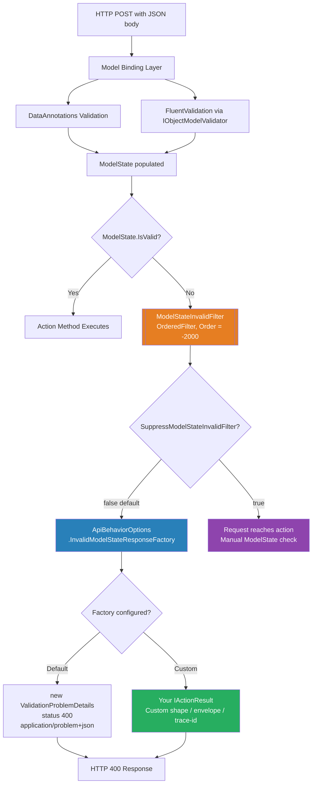
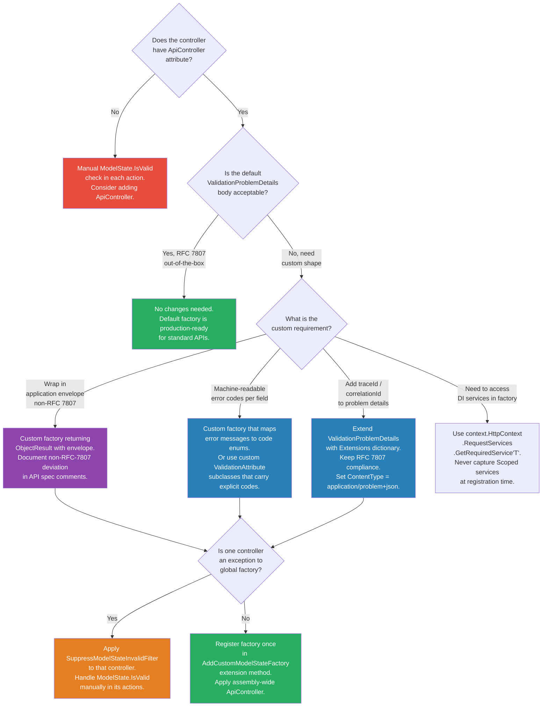

> [!success] Mastery Check
> - [ ] **Studied Well**
> - [ ] **Can explain the concept without notes**
> - [ ] **Can answer interview questions confidently**
> - [ ] **Can implement it in a real project**


# 4.111 — Global Model State: Custom InvalidModelStateResponseFactory

---

## Part 0 — Navigation & Context

### Where This Topic Lives

```
ASP.NET Core Mastery
└── H. MVC & Controllers (4.098–4.122)
    ├── 4.098  ControllerBase vs Controller
    ├── 4.099  Action Results: IActionResult, ActionResult<T>
    ├── 4.100  Model Binding: Sources, Order, and Algorithm
    ├── 4.101  ApiController Attribute ← triggers automatic 400
    ├── 4.102  Model Validation: DataAnnotations and ModelState
    ├── 4.110  MVC Filter Pipeline
    ╠══ 4.111  Global Model State: Custom InvalidModelStateResponseFactory ◄ YOU ARE HERE
    ├── 4.112  Input Formatters
    ├── 4.118  Problem Details in MVC
    └── ...
        ↕
    M. Error Handling & Problem Details (4.177–4.185)
    ├── 4.179  Problem Details RFC 7807: IProblemDetailsService
    └── 4.177  Exception Handling Middleware
```

### What You Need Before This

- **[[4.101 — ApiController Attribute]]** — `[ApiController]` is the mechanism that installs the automatic-400 behaviour this topic overrides. Understand what it does before replacing it.
- **[[4.102 — Model Validation: DataAnnotations and ModelState]]** — `ModelState` is populated by model binding + DataAnnotations before the factory fires. Know its structure.
- **[[4.118 — Problem Details in MVC: ProblemDetails and ValidationProblemDetails]]** — the default factory produces `ValidationProblemDetails`; your custom factory typically does too.
- **[[4.034 — The Built-In DI Container]]** — the factory is registered via `ApiBehaviorOptions`; DI services are accessible inside it.

### What This Unlocks After

- **[[4.174 — Global Validation: SuppressModelStateInvalidFilter and Custom Factory]]** — `SuppressModelStateInvalidFilter` is the escape hatch; knowing when to suppress vs customise is the next decision.
- **[[4.170 — FluentValidation Integration]]** — FluentValidation populates `ModelState` the same way DataAnnotations does; your custom factory fires for FluentValidation failures too.
- **[[4.168 — ModelState: Checking Validity, Reading Errors, Custom Responses]]** — per-controller `ModelState` handling is the fallback when global customisation is insufficient.
- **[[4.283 — REST API Design Conventions]]** — consistent, client-friendly error bodies are a REST API design requirement; this topic is how you enforce that consistency.

### Why This Topic Matters at Scale

When you run a payment API or order management service behind a gateway that routes hundreds of thousands of requests per day, every validation failure is an opportunity to either help the client fix the request or generate a support ticket. The default `ValidationProblemDetails` body is structurally correct but often operationally insufficient — it lacks a trace ID, a machine-readable error code, and enough field-level context for a mobile client to highlight exactly the wrong form field. **`InvalidModelStateResponseFactory` is the single configuration point that governs every 400 response your entire API emits.** Getting it wrong means inconsistency; getting it right means zero manual `ModelState.IsValid` checks anywhere in your codebase.

---

## Part 1 — The Core Mental Model

### The Fundamental Rule

> **When `[ApiController]` is present on a controller, ASP.NET Core short-circuits action execution before your code runs if `ModelState.IsValid` is false, calling `ApiBehaviorOptions.InvalidModelStateResponseFactory` to produce the `IActionResult` that becomes the HTTP 400 response. Replacing that factory is the single global control point for every validation failure in the MVC pipeline.**

### The Plain-Language Analogy

Think of a courier depot that checks every parcel at the intake counter before loading it onto a truck. If a parcel has a missing address, an illegible label, or a forbidden item, the counter staff fill out a standard rejection slip and send it back — the driver never sees the parcel. The `InvalidModelStateResponseFactory` is the template for that rejection slip. The depot manager (your team) can redesign the slip to include whatever fields the sender needs: a reason code, a timestamp, a tracking number, or a field-by-field breakdown of what was wrong. The critical point: the rejection always happens at the counter (before the action executes), the driver (your action method) never receives the bad parcel, and every depot branch (every controller in the application) uses the exact same rejection slip because you configured it once at head office (`ApiBehaviorOptions`). If one branch starts writing its own custom slip format, you have an inconsistency problem.

### The Taxonomy Diagram



---

## Part 2 — Deep Mechanics

### 2.1 — The `[ApiController]` Behaviour Contract and Pipeline Position

`[ApiController]` applied to a controller class (or assembly-wide via `[assembly: ApiController]`) registers a set of conventions via `ApiBehaviorApplicationModelProvider`. One of those conventions installs `ModelStateInvalidFilter` into the controller's filter pipeline.

```
──► ExceptionHandler ──► HSTS ──► Routing ──► Auth ──► Authorization ──► [Endpoint Execution]
                                                                                    │
                                                                           MVC Filter Pipeline
                                                                           ┌───────────────────────────────┐
                                                                           │ 1. Authorization Filters      │
                                                                           │ 2. Resource Filters           │
                                                                           │ 3. Model Binding              │
                                                                           │ 4. ◄ ModelStateInvalidFilter  │ Order = -2000
                                                                           │ 5. Action Filters             │
                                                                           │ 6. Action Executes            │
                                                                           │ 7. Result Filters             │
                                                                           │ 8. Exception Filters          │
                                                                           └───────────────────────────────┘
```

`ModelStateInvalidFilter` runs at **Order = -2000** — before any user-defined action filters (which default to Order = 0). This means:

- Authorization filters still run before validation. A 401 or 403 takes precedence over a 400.
- Model binding runs before the filter. The filter reads the already-populated `ModelState`.
- Your custom action filters (e.g., an idempotency filter, a timing filter) do **not** run when validation fails. The request is short-circuited.

**Framework source behaviour (approximate):**

```csharp
// Microsoft.AspNetCore.Mvc.Infrastructure.ModelStateInvalidFilter (approximate)
internal sealed class ModelStateInvalidFilter : IActionFilter, IOrderedFilter
{
    private readonly ApiBehaviorOptions _apiBehaviorOptions;

    public int Order => -2000;

    public void OnActionExecuting(ActionExecutingContext context)
    {
        if (context.Result != null) return; // already short-circuited upstream

        if (!context.ModelState.IsValid)
        {
            // This is the critical call — delegates to your factory
            context.Result = _apiBehaviorOptions.InvalidModelStateResponseFactory(context);
        }
    }

    public void OnActionExecuted(ActionExecutedContext context) { }
}
```

**Runtime cost:** `~1 allocation` for the `ActionContext` wrapping; the factory call itself is synchronous; the `ValidationProblemDetails` default produces `~3–5 allocations` (dictionary construction for the errors map). Cost is negligible per-request but the consistency guarantee is worth more than the allocation.

---

### 2.2 — `ApiBehaviorOptions` and the Factory Delegate

The factory is registered via `ApiBehaviorOptions.InvalidModelStateResponseFactory`:

```csharp
// The delegate signature — exactly what you replace:
// Func<ActionContext, IActionResult>
services.Configure<ApiBehaviorOptions>(options =>
{
    options.InvalidModelStateResponseFactory = context =>
    {
        // context.ModelState — the populated ModelState dictionary
        // context.HttpContext — full HttpContext access
        // context.ActionDescriptor — which controller/action triggered this
        return new BadRequestObjectResult(/* your shape */);
    };
});
```

**What `ActionContext` gives you:**

|Property|Type|Use|
|---|---|---|
|`ModelState`|`ModelStateDictionary`|Iterate errors|
|`HttpContext`|`HttpContext`|Read headers, `TraceIdentifier`, resolve services|
|`ActionDescriptor`|`ActionDescriptor`|Controller name, action name, route data|
|`RouteData`|`RouteData`|Route values at the time of the error|

**HTTP wire effect of the default factory:**

```http
// HTTP request (approximate — payment API):
POST /api/payments HTTP/1.1
Content-Type: application/json
Authorization: Bearer eyJhbGci...

{ "amount": -50, "currency": null }

// HTTP response (approximate — default factory):
HTTP/1.1 400 Bad Request
Content-Type: application/problem+json; charset=utf-8

{
  "type": "https://tools.ietf.org/html/rfc7807",
  "title": "One or more validation errors occurred.",
  "status": 400,
  "traceId": "00-abc123-def456-00",
  "errors": {
    "Amount": ["The Amount field must be greater than 0."],
    "Currency": ["The Currency field is required."]
  }
}
```

---

### 2.3 — What `ModelStateDictionary` Contains and How to Read It

`ModelState` is a `ModelStateDictionary` — a dictionary keyed by field path (e.g., `"Amount"`, `"Address.PostalCode"`, `""` for top-level body errors). Each entry is a `ModelStateEntry` with:

- `Errors` — a collection of `ModelError` (each has `ErrorMessage` and optionally `Exception`)
- `ValidationState` — `Valid`, `Invalid`, `Skipped`, `Unvalidated`
- `AttemptedValue` — the raw string value the client sent

```csharp
// Reading ModelState for a custom error response — production pattern:
var errors = new Dictionary<string, string[]>();

foreach (var (field, entry) in context.ModelState)
{
    if (entry.Errors.Count > 0)
    {
        errors[field] = entry.Errors
            .Select(e => e.ErrorMessage)
            .Where(m => !string.IsNullOrWhiteSpace(m))
            .ToArray();
    }
}
// Cost: O(n) over ModelState entries — bounded by request fields, not request volume
```

**Edge case that bites engineers:** When `[ApiController]` is combined with `[FromBody]` and the JSON is malformed (e.g., a syntax error, not a validation error), the error appears under the key `""` (empty string) or `"$"` depending on the binder, with `ErrorMessage` like `"The input was not valid."` Your factory must handle this case — iterating only named fields will silently drop the body-level error.

---

### 2.4 — Assembly-Wide vs Per-Controller `[ApiController]`

`[ApiController]` can be applied at three levels:

```csharp
// 1. Per controller (default — most explicit):
[ApiController]
[Route("api/[controller]")]
public class PaymentsController : ControllerBase { }

// 2. Assembly-wide in Program.cs (applies to ALL controllers in the assembly):
[assembly: ApiController]

// 3. Via convention in Program.cs (.NET 6+ pattern):
builder.Services.AddControllers(options =>
{
    options.Conventions.Add(new ApiControllerConvention()); // custom convention
});
```

**Pipeline consequence of assembly-wide:** Every controller in the project gets `ModelStateInvalidFilter`. This is usually what you want — but if you have a legacy controller that does its own `ModelState.IsValid` check and returns a custom shape, assembly-wide attribution will override it. `SuppressModelStateInvalidFilter = true` is the opt-out at the controller level.

**Runtime cost annotation:**

- Per-controller: `O(1)` per controller at startup (convention application)
- Assembly-wide: `O(n)` over all controller types at startup — irrelevant in practice

---

### 2.5 — Failure Mode Diagrams

**Failure Mode A: JSON syntax error (not a validation error)**

```
POST /api/orders HTTP/1.1
Content-Type: application/json

{ "orderId": 42, "items": [ INVALID JSON }

→ Model binding fails at the JSON deserialization step
→ ModelState["$"] or ModelState[""] gets an error with ErrorMessage "The JSON value ..."
→ ModelStateInvalidFilter fires
→ Default factory: ValidationProblemDetails with errors["$"] = ["..."]
→ 400 Bad Request

// Custom factory must handle the empty key / "$" case:
```

**Failure Mode B: Missing [ApiController] — factory NEVER fires**

```
POST /api/legacy/orders HTTP/1.1
Content-Type: application/json

{ invalid payload }

// Without [ApiController]:
→ Model binding runs, ModelState is invalid
→ ModelStateInvalidFilter is NOT registered
→ Action executes anyway
→ Developer must check ModelState.IsValid manually
→ If forgotten: action runs with null/default model — silent data corruption possible
```

**Failure Mode C: Factory throws an exception**

```
→ Factory throws NullReferenceException
→ The exception propagates up through the MVC pipeline
→ Falls through to UseExceptionHandler
→ Client receives 500 instead of 400
// This is a production incident. Factory must be exception-safe.
```

---

## Part 3 — Production Code Patterns

### Pattern 1: The Envelope-Wrapped Validation Error (Order Management API)

Every API response — success or failure — uses a consistent `ApiResponse<T>` envelope. The factory produces the same envelope shape for validation failures.

```csharp
// ⚠️ WRONG: Default factory — no correlation ID, no machine-readable error code,
// inconsistent with the rest of the API which uses ApiResponse<T> envelopes.
// Mobile clients must special-case 400s versus 200s because the shapes differ.

// ✅ CORRECT: Custom factory that produces consistent ApiResponse envelope
public sealed record ApiResponse<T>
{
    public bool Success { get; init; }
    public T? Data { get; init; }
    public ApiError? Error { get; init; }
}

public sealed record ApiError
{
    public string Code { get; init; } = string.Empty;
    public string Message { get; init; } = string.Empty;
    public string TraceId { get; init; } = string.Empty;
    public Dictionary<string, string[]>? ValidationErrors { get; init; }
}

// Registration — always in a dedicated extension method, never inline in Program.cs
public static class ApiBehaviorExtensions
{
    public static IServiceCollection AddCustomModelStateFactory(
        this IServiceCollection services)
    {
        services.Configure<ApiBehaviorOptions>(options =>
        {
            options.InvalidModelStateResponseFactory = context =>
            {
                // Extract field-level errors, handling both named fields and body-level "$" errors
                var validationErrors = context.ModelState
                    .Where(kvp => kvp.Value?.Errors.Count > 0)
                    .ToDictionary(
                        kvp => kvp.Key,                          // field path: "Amount", "$", etc.
                        kvp => kvp.Value!.Errors
                            .Select(e => e.ErrorMessage)
                            .Where(m => !string.IsNullOrWhiteSpace(m))
                            .ToArray()
                    );

                var traceId = context.HttpContext.TraceIdentifier;

                var error = new ApiError
                {
                    Code = "VALIDATION_FAILED",
                    Message = "One or more validation errors occurred. Review the errors dictionary.",
                    TraceId = traceId,
                    ValidationErrors = validationErrors
                };

                var response = new ApiResponse<object>
                {
                    Success = false,
                    Data = null,
                    Error = error
                };

                // Return 422 Unprocessable Entity — semantically more correct than 400
                // for domain validation failures (400 = malformed request, 422 = valid format, bad semantics)
                // NOTE: Use 400 if your API contract specifies it; be consistent, not "correct"
                return new UnprocessableEntityObjectResult(response);
            };
        });

        return services;
    }
}
```

```http
// HTTP wire format (correct path — order API):
HTTP/1.1 422 Unprocessable Entity
Content-Type: application/json; charset=utf-8

{
  "success": false,
  "data": null,
  "error": {
    "code": "VALIDATION_FAILED",
    "message": "One or more validation errors occurred. Review the errors dictionary.",
    "traceId": "00-4bf92f3577b34da6a3ce929d0e0e4736-00f067aa0ba902b7-01",
    "validationErrors": {
      "Amount": ["The Amount field must be greater than 0."],
      "Currency": ["The Currency field is required."]
    }
  }
}
```

---

### Pattern 2: RFC 7807-Compliant Factory with TraceId Extension (Payment API)

Stay RFC 7807 compliant but extend `ValidationProblemDetails` with production-required fields that the default factory omits.

```csharp
// ✅ CORRECT: Extends standard ValidationProblemDetails with extra fields
// Stays RFC 7807-compliant — API gateway and monitoring tools understand the shape

services.Configure<ApiBehaviorOptions>(options =>
{
    options.InvalidModelStateResponseFactory = context =>
    {
        // ValidationProblemDetails correctly maps ModelState to RFC 7807 "errors" dictionary
        var problemDetails = new ValidationProblemDetails(context.ModelState)
        {
            // Override the generic title — make it actionable
            Title = "Validation failed",
            Detail = "See the errors property for field-specific details.",
            Status = StatusCodes.Status400BadRequest,
            // Instance identifies which endpoint produced this error — helps support
            Instance = context.HttpContext.Request.Path
        };

        // Extend with non-standard (RFC 7807 permits extension members)
        problemDetails.Extensions["traceId"] = context.HttpContext.TraceIdentifier;
        problemDetails.Extensions["timestamp"] = DateTimeOffset.UtcNow;

        // Controller and action name — useful for support tickets
        if (context.ActionDescriptor is ControllerActionDescriptor cad)
        {
            problemDetails.Extensions["controller"] = cad.ControllerName;
            problemDetails.Extensions["action"] = cad.ActionName;
        }

        return new BadRequestObjectResult(problemDetails)
        {
            // Ensure Content-Type is application/problem+json, not application/json
            ContentTypes = { "application/problem+json" }
        };
    };
});
```

```http
// HTTP wire format (correct path — payment API):
POST /api/payments HTTP/1.1
Content-Type: application/json
Authorization: Bearer eyJhbGci...

{ "amount": 0, "recipientId": "" }

HTTP/1.1 400 Bad Request
Content-Type: application/problem+json; charset=utf-8

{
  "type": "https://tools.ietf.org/html/rfc7807",
  "title": "Validation failed",
  "status": 400,
  "detail": "See the errors property for field-specific details.",
  "instance": "/api/payments",
  "traceId": "00-4bf92f3577b34da6a3ce929d0e0e4736-00f067aa0ba902b7-01",
  "timestamp": "2026-06-09T12:34:56.789Z",
  "controller": "Payments",
  "action": "CreatePayment",
  "errors": {
    "Amount": ["The Amount field must be greater than 0."],
    "RecipientId": ["The RecipientId field is required."]
  }
}
```

---

### Pattern 3: Per-Field Error Code Injection (Logistics Shipment API)

Machine-readable error codes alongside human-readable messages allow mobile/frontend clients to map codes to localised UI strings without string parsing.

```csharp
// ✅ CORRECT: Enrich each field error with a machine-readable code
// The convention: code = "FIELD_REQUIRED", "VALUE_OUT_OF_RANGE", etc.
// The client maps code → localised message; the server provides English fallback.

public sealed record FieldError(string Code, string Message);

services.Configure<ApiBehaviorOptions>(options =>
{
    options.InvalidModelStateResponseFactory = context =>
    {
        var fieldErrors = new Dictionary<string, FieldError[]>();

        foreach (var (field, entry) in context.ModelState)
        {
            if (entry is null || entry.Errors.Count == 0) continue;

            fieldErrors[field] = entry.Errors.Select(error =>
            {
                // Derive machine-readable code from the error message pattern.
                // In production, use custom ValidationAttribute subclasses that carry
                // an explicit error code instead of parsing strings.
                var code = error.ErrorMessage switch
                {
                    string m when m.Contains("required", StringComparison.OrdinalIgnoreCase)
                        => "FIELD_REQUIRED",
                    string m when m.Contains("must be between", StringComparison.OrdinalIgnoreCase)
                        => "VALUE_OUT_OF_RANGE",
                    string m when m.Contains("maximum length", StringComparison.OrdinalIgnoreCase)
                        => "MAX_LENGTH_EXCEEDED",
                    _ => "VALIDATION_ERROR"
                };

                return new FieldError(code, error.ErrorMessage);
            }).ToArray();
        }

        var result = new
        {
            Type = "validation_error",
            TraceId = context.HttpContext.TraceIdentifier,
            Fields = fieldErrors
        };

        return new BadRequestObjectResult(result);
    };
});
```

```http
// HTTP wire format (logistics API — shipment validation):
HTTP/1.1 400 Bad Request
Content-Type: application/json; charset=utf-8

{
  "type": "validation_error",
  "traceId": "00-abc123-00",
  "fields": {
    "Weight": [{ "code": "VALUE_OUT_OF_RANGE", "message": "Weight must be between 0.1 and 1000 kg." }],
    "DestinationPostalCode": [{ "code": "FIELD_REQUIRED", "message": "The DestinationPostalCode field is required." }]
  }
}
```

---

### Pattern 4: Suppressing the Factory for a Legacy Controller While Keeping It Global (Inventory Service)

You have a global factory set, but one legacy controller predates the pattern and handles `ModelState` manually with a bespoke error format.

```csharp
// ⚠️ WRONG: Trying to detect the controller in the factory and branch logic
options.InvalidModelStateResponseFactory = context =>
{
    if (context.ActionDescriptor is ControllerActionDescriptor cad
        && cad.ControllerName == "LegacyInventory")
    {
        // This branching in a global factory becomes a maintenance nightmare
        // and couples the factory to controller names (brittle)
        return new BadRequestObjectResult(new { legacyError = "..." });
    }
    return StandardFactory(context); // inconsistent, unmaintainable
};

// ✅ CORRECT: Suppress the filter on the legacy controller; it handles ModelState itself
[ApiController]
[SuppressModelStateInvalidFilter]  // Lives in Microsoft.AspNetCore.Mvc.ApiBehavior
[Route("api/legacy/inventory")]
public class LegacyInventoryController : ControllerBase
{
    [HttpPost]
    public IActionResult CreateItem([FromBody] CreateItemRequest request)
    {
        // Manual check — legacy pattern, still consistent within this controller
        if (!ModelState.IsValid)
        {
            return BadRequest(new LegacyErrorResponse(ModelState));
        }
        // ... domain logic
    }
}
```

---

### Pattern 5: Accessing DI Services Inside the Factory (Payment API — Correlation ID from Service)

The factory is a delegate, not a class — access DI via `HttpContext.RequestServices`.

```csharp
// ✅ CORRECT: Resolving a scoped service inside the factory
// Use case: fetching a correlation ID from a request-scoped ICorrelationIdAccessor
// rather than relying on HttpContext.TraceIdentifier (which is a low-level ID)

services.Configure<ApiBehaviorOptions>(options =>
{
    options.InvalidModelStateResponseFactory = context =>
    {
        // Resolve a scoped service from the request's service provider
        // This is safe — the factory runs inside the HTTP request scope
        var correlationIdAccessor = context.HttpContext.RequestServices
            .GetRequiredService<ICorrelationIdAccessor>();

        var logger = context.HttpContext.RequestServices
            .GetRequiredService<ILogger<ApiBehaviorOptions>>();

        var correlationId = correlationIdAccessor.GetCorrelationId();

        // Log the validation failure with correlation context
        // Important: use LogWarning, not LogError — validation failures are client errors
        logger.LogWarning(
            "Validation failed for {Path} [correlationId={CorrelationId}]. Errors: {ErrorCount}",
            context.HttpContext.Request.Path,
            correlationId,
            context.ModelState.ErrorCount);

        var problemDetails = new ValidationProblemDetails(context.ModelState)
        {
            Status = 400,
            Instance = context.HttpContext.Request.Path
        };
        problemDetails.Extensions["correlationId"] = correlationId;

        return new BadRequestObjectResult(problemDetails)
        {
            ContentTypes = { "application/problem+json" }
        };
    };
});
```

---

### Pattern 6: FluentValidation Errors Through the Same Factory

FluentValidation, when integrated via `services.AddFluentValidationAutoValidation()`, populates `ModelState` with validation results. The factory fires for FluentValidation failures identically to DataAnnotations failures — no special handling required.

```csharp
// ✅ CORRECT: Single factory handles both DataAnnotations and FluentValidation errors
// FluentValidation adds errors to ModelState with the same key structure as DataAnnotations

// Registration (NuGet: FluentValidation.AspNetCore):
builder.Services.AddFluentValidationAutoValidation();
builder.Services.AddScoped<IValidator<CreateOrderRequest>, CreateOrderRequestValidator>();

public class CreateOrderRequestValidator : AbstractValidator<CreateOrderRequest>
{
    public CreateOrderRequestValidator()
    {
        RuleFor(x => x.CustomerId)
            .NotEmpty()
            .WithMessage("Customer ID is required.");    // → errors["CustomerId"]

        RuleFor(x => x.TotalAmount)
            .GreaterThan(0)
            .WithMessage("Order total must be positive."); // → errors["TotalAmount"]

        RuleFor(x => x.Items)
            .NotEmpty()
            .WithMessage("An order must have at least one item."); // → errors["Items"]
    }
}

// The factory sees the same ModelState structure regardless of validator source.
// No changes needed to the factory — it reads ModelState, not the validator type.
```

```http
// HTTP wire format — FluentValidation failure through custom factory:
POST /api/orders HTTP/1.1
Content-Type: application/json
Authorization: Bearer ...

{ "customerId": "", "totalAmount": -10, "items": [] }

HTTP/1.1 400 Bad Request
Content-Type: application/problem+json

{
  "title": "Validation failed",
  "status": 400,
  "traceId": "00-abc-01",
  "errors": {
    "CustomerId": ["Customer ID is required."],
    "TotalAmount": ["Order total must be positive."],
    "Items": ["An order must have at least one item."]
  }
}
```

---

## Part 4 — Gotchas & Anti-Patterns

### Gotcha 1: The Factory Never Fires Because `[ApiController]` Is Missing

Most engineers applying `[ApiController]` to controllers for the first time assume it is always present or set globally. On a brownfield project or a codebase that predates `[ApiController]`, controllers may not have it — and the factory is never called.

```csharp
// ⚠️ WRONG: Controller without [ApiController] — factory never fires
[Route("api/payments")]
public class PaymentsController : ControllerBase  // ← missing [ApiController]
{
    [HttpPost]
    public IActionResult CreatePayment([FromBody] CreatePaymentRequest request)
    {
        // ModelState is invalid but the action still executes
        // request may be null or partially populated
        var payment = _service.Create(request.Amount, request.Currency); // NullReferenceException
        return Ok(payment);
    }
}

// HTTP consequence (wrong path):
// POST /api/payments with invalid body
// → Action executes with invalid model
// → NullReferenceException or corrupted data
// → 500 Internal Server Error (or worse: silent bad data written to database)

// ✅ CORRECT: Always apply [ApiController] to API controllers
[ApiController]
[Route("api/payments")]
public class PaymentsController : ControllerBase
{
    // ...
}

// HTTP consequence (correct path):
// POST /api/payments with invalid body
// → Factory fires before action executes
// → 400 Bad Request with structured error body
// → Action never executes; database is never touched

// WHY: ModelStateInvalidFilter is registered by [ApiController] via ApiBehaviorApplicationModelProvider.
// Without the attribute, the filter is not in the pipeline. The factory is irrelevant without it.
```

---

### Gotcha 2: `new BadRequestObjectResult(problemDetails)` Produces `application/json`, Not `application/problem+json`

Engineers correctly build a `ValidationProblemDetails` but then return it in a way that sets the wrong `Content-Type` header. API gateways and clients that type-check the content type for RFC 7807 compliance get confused.

```csharp
// ⚠️ WRONG: Default ContentType for ObjectResult is application/json
options.InvalidModelStateResponseFactory = context =>
{
    var pd = new ValidationProblemDetails(context.ModelState) { Status = 400 };
    return new BadRequestObjectResult(pd); // ContentTypes is empty — will use application/json
};

// HTTP consequence (wrong path):
// HTTP/1.1 400 Bad Request
// Content-Type: application/json; charset=utf-8   ← WRONG — not RFC 7807 compliant
// { "title": "One or more...", "status": 400, "errors": {...} }

// ✅ CORRECT: Set ContentTypes explicitly
options.InvalidModelStateResponseFactory = context =>
{
    var pd = new ValidationProblemDetails(context.ModelState) { Status = 400 };
    return new BadRequestObjectResult(pd)
    {
        ContentTypes = { "application/problem+json" }
    };
};

// HTTP consequence (correct path):
// HTTP/1.1 400 Bad Request
// Content-Type: application/problem+json; charset=utf-8   ← RFC 7807 compliant

// WHY: ObjectResult uses the output formatter to determine Content-Type. The default JSON
// formatter uses application/json unless you explicitly set ContentTypes on the result.
// ValidationProblemDetails is a POCO as far as the formatter is concerned — the media type
// must be stated explicitly.
```

---

### Gotcha 3: Calling `.GetService<T>()` Instead of `.GetRequiredService<T>()` Inside the Factory

The factory looks like a safe context for service resolution, but calling `GetService<T>()` (nullable) when the service is guaranteed to be registered returns null silently in production environments where DI scope validation is disabled.

```csharp
// ⚠️ WRONG: GetService returns null if not registered — NullReferenceException later
options.InvalidModelStateResponseFactory = context =>
{
    var logger = context.HttpContext.RequestServices
        .GetService<ILogger<PaymentsController>>(); // returns null if not registered

    logger.LogWarning("Validation failed"); // NullReferenceException if logger is null
    // ...
};

// HTTP consequence (wrong path):
// Factory throws NullReferenceException
// Falls through to UseExceptionHandler
// Client receives 500 instead of 400
// Monitoring fires a P1 alert for a client validation error — noise

// ✅ CORRECT: GetRequiredService throws InvalidOperationException at startup if not registered
options.InvalidModelStateResponseFactory = context =>
{
    var logger = context.HttpContext.RequestServices
        .GetRequiredService<ILogger<ApiBehaviorOptions>>();
    logger.LogWarning("Validation failed for {Path}", context.HttpContext.Request.Path);
    // ...
};

// HTTP consequence (correct path):
// If logger is not registered (it always is via AddLogging), this throws at startup —
// fail-fast, caught in CI, never reaches production.

// WHY: GetRequiredService throws if the service is not registered, giving an explicit
// startup error. GetService silently returns null, deferring the failure to runtime
// in the middle of a validation response — harder to diagnose.
```

---

### Gotcha 4: Registering the Factory After `AddControllers()` Has Been Called but Thinking Order Matters

`ApiBehaviorOptions` is configured lazily — it does not matter whether you `Configure<ApiBehaviorOptions>` before or after `AddControllers()`. But engineers sometimes move the configuration call hoping to override a previous one, not realising that all `Configure<T>` calls are additive and the last write wins only for direct property assignment, not for delegates that close over shared state.

```csharp
// ⚠️ WRONG: Registering the factory in two places — the second one does NOT override cleanly
// if both modify the delegate without knowing about each other

builder.Services.AddControllers();

// Library registers its own factory (e.g., a shared NuGet package)
builder.Services.Configure<ApiBehaviorOptions>(o =>
{
    o.InvalidModelStateResponseFactory = LibraryFactory; // sets the delegate
});

// Your application also sets it — this DOES override the library's version (last write wins)
builder.Services.Configure<ApiBehaviorOptions>(o =>
{
    o.InvalidModelStateResponseFactory = AppFactory; // fully replaces the delegate
});

// HTTP consequence (wrong path):
// If you expected both factories to run (additive behaviour) — that is NOT how it works.
// The delegate is a property; the last Configure<T> call that assigns it wins.
// The library's factory is silently discarded.

// ✅ CORRECT: Compose explicitly if you need both factory behaviours
builder.Services.Configure<ApiBehaviorOptions>(o =>
{
    var libraryFactory = o.InvalidModelStateResponseFactory; // capture existing
    o.InvalidModelStateResponseFactory = context =>
    {
        // Add your extensions, then delegate to the original (or call it first)
        var result = libraryFactory(context);
        // Enrich the result...
        return result;
    };
});

// WHY: ApiBehaviorOptions.InvalidModelStateResponseFactory is a Func<ActionContext, IActionResult>
// property. Configure<T> is additive for options objects, but assigning the property
// replaces whatever was there. Composition must be explicit.
```

---

### Gotcha 5: Using `StatusCodes.Status422UnprocessableEntity` Without Updating `ProducesResponseType` — OpenAPI Shows 400 But Returns 422

When you change the factory to return 422 instead of 400, the generated OpenAPI spec still shows `400` because `[ApiController]` automatically registers a 400 response type for model validation. The spec is now wrong — the actual wire response is 422 but clients and contract tests expect 400.

```csharp
// ⚠️ WRONG: Return 422 from factory without updating OpenAPI conventions
options.InvalidModelStateResponseFactory = context =>
{
    return new UnprocessableEntityObjectResult(
        new ValidationProblemDetails(context.ModelState));
    // Factory returns 422 — but [ApiController] registers 400 in OpenAPI
};

// HTTP consequence (wrong path):
// Wire: HTTP/1.1 422 Unprocessable Entity
// OpenAPI spec: responses: { "400": { ... } }  ← MISMATCHED
// Contract tests fail. Client code checks for 400 and ignores 422.

// ✅ CORRECT: Update the ClientErrorMapping to match the status code
builder.Services.Configure<ApiBehaviorOptions>(options =>
{
    // Remove the default 400 validation mapping; register 422 instead
    options.ClientErrorMapping[StatusCodes.Status400BadRequest] = new ClientErrorData
    {
        Link = "https://tools.ietf.org/html/rfc7807",
        Title = "Validation Failed"
    };

    options.InvalidModelStateResponseFactory = context =>
    {
        var pd = new ValidationProblemDetails(context.ModelState)
        {
            Status = StatusCodes.Status422UnprocessableEntity
        };
        return new UnprocessableEntityObjectResult(pd)
        {
            ContentTypes = { "application/problem+json" }
        };
    };
});

// HTTP consequence (correct path):
// Wire: HTTP/1.1 422 Unprocessable Entity
// OpenAPI spec: consistent with actual wire behaviour
// Client contract tests pass

// WHY: [ApiController] uses ClientErrorMapping to determine which status codes produce
// problem details in the OpenAPI spec. Changing the factory status code without
// updating ClientErrorMapping creates a contract mismatch between spec and wire.
```

---

## Part 5 — Performance Implications

### 5.1 — Request Pipeline Characteristics Table

|Scenario|Pipeline Depth|Allocations Per Request|Approx Latency Impact|Recommendation|
|---|---|---|---|---|
|Valid request — factory never fires|Full pipeline|0 from factory|None|No overhead on the happy path|
|Invalid request — default `ValidationProblemDetails` factory|Short-circuit at `ModelStateInvalidFilter`|~5–8 (dict, list, problem details, JSON)|< 0.1ms|Acceptable for all throughput levels|
|Custom factory with `ValidationProblemDetails` + extensions|Short-circuit at filter|~6–10|< 0.1ms|Negligible|
|Custom factory that resolves DI services per validation failure|Short-circuit + service resolution|~8–12 + service graph|< 0.1ms + service overhead|Acceptable; services are already scoped|
|Custom factory with external call (database, HTTP)|Short-circuit + I/O|Variable|1ms–100ms+|**Never do I/O in the factory**|
|LINQ over `ModelState` with no short-circuit (`Where` + `Select`)|Same as above|~4–6 + LINQ|< 0.1ms|Acceptable for small models|
|`ModelState.ErrorCount` check before full iteration|Short-circuit|~1|< 0.01ms|Use when only error count is needed|
|Factory with reflection or string formatting on hot path|Same as above|~10–20|0.1–1ms|Avoid reflection; use compiled patterns|
|Factory producing large JSON (>50 fields)|Same as above|Proportional to field count|< 1ms for 50 fields|Use `JsonSerializer` source gen if needed|
|Assembly-wide `[ApiController]` with 100 controllers|Startup only|O(n) at startup|~1–5ms startup|One-time cost; not per-request|

### 5.2 — BenchmarkDotNet Code

```csharp
using BenchmarkDotNet.Attributes;
using BenchmarkDotNet.Running;
using Microsoft.AspNetCore.Mvc;
using Microsoft.AspNetCore.Mvc.ModelBinding;

// Run: dotnet run -c Release
BenchmarkRunner.Run<ModelStateFactoryBenchmarks>();

[MemoryDiagnoser]
[SimpleJob(warmupCount: 3, iterationCount: 10)]
public class ModelStateFactoryBenchmarks
{
    private ActionContext _actionContextWith3Errors = null!;
    private ActionContext _actionContextWith10Errors = null!;
    private ActionContext _validActionContext = null!;

    [GlobalSetup]
    public void Setup()
    {
        _actionContextWith3Errors = BuildActionContext(errorCount: 3);
        _actionContextWith10Errors = BuildActionContext(errorCount: 10);
        _validActionContext = BuildActionContext(errorCount: 0);
    }

    // Baseline: default ValidationProblemDetails factory
    [Benchmark(Baseline = true)]
    public IActionResult DefaultFactory_3Errors()
    {
        return DefaultFactory(_actionContextWith3Errors);
    }

    // Custom factory: adds traceId extension + content type override
    [Benchmark]
    public IActionResult CustomFactory_WithExtensions_3Errors()
    {
        return CustomFactoryWithExtensions(_actionContextWith3Errors);
    }

    // Custom factory on 10 fields — tests LINQ overhead scaling
    [Benchmark]
    public IActionResult CustomFactory_WithExtensions_10Errors()
    {
        return CustomFactoryWithExtensions(_actionContextWith10Errors);
    }

    // Optimal: pre-computed factory using ArrayPool for error collection
    [Benchmark]
    public IActionResult OptimalFactory_3Errors()
    {
        return OptimalFactory(_actionContextWith3Errors);
    }

    private static IActionResult DefaultFactory(ActionContext context)
    {
        var pd = new ValidationProblemDetails(context.ModelState) { Status = 400 };
        return new BadRequestObjectResult(pd);
    }

    private static IActionResult CustomFactoryWithExtensions(ActionContext context)
    {
        var pd = new ValidationProblemDetails(context.ModelState)
        {
            Status = 400,
            Instance = context.HttpContext.Request.Path
        };
        pd.Extensions["traceId"] = context.HttpContext.TraceIdentifier;
        pd.Extensions["timestamp"] = DateTimeOffset.UtcNow;
        return new BadRequestObjectResult(pd) { ContentTypes = { "application/problem+json" } };
    }

    private static IActionResult OptimalFactory(ActionContext context)
    {
        // Avoid re-constructing ValidationProblemDetails from scratch —
        // build the errors dictionary directly to avoid double-iteration
        var errors = new Dictionary<string, string[]>(context.ModelState.Count);
        foreach (var (key, entry) in context.ModelState)
        {
            if (entry?.Errors.Count > 0)
            {
                var messages = new string[entry.Errors.Count];
                for (int i = 0; i < entry.Errors.Count; i++)
                    messages[i] = entry.Errors[i].ErrorMessage;
                errors[key] = messages;
            }
        }

        var pd = new ValidationProblemDetails(errors)
        {
            Status = 400,
            Title = "Validation failed"
        };
        return new BadRequestObjectResult(pd) { ContentTypes = { "application/problem+json" } };
    }

    private static ActionContext BuildActionContext(int errorCount)
    {
        var modelState = new ModelStateDictionary();
        for (int i = 0; i < errorCount; i++)
        {
            modelState.AddModelError($"Field{i}", $"Error message for field {i}");
        }

        var httpContext = new DefaultHttpContext();
        return new ActionContext(httpContext, new RouteData(), new ActionDescriptor(), modelState);
    }
}

// Expected output (approximate, .NET 8, x64, Release, local machine):
//
// | Method                                     | Mean     | Allocated |
// |------------------------------------------- |---------:|----------:|
// | DefaultFactory_3Errors                     | 1.12 μs  | 1.84 KB   |
// | CustomFactory_WithExtensions_3Errors       | 1.31 μs  | 2.12 KB   |
// | CustomFactory_WithExtensions_10Errors      | 2.89 μs  | 4.80 KB   |
// | OptimalFactory_3Errors                     | 0.98 μs  | 1.60 KB   |
//
// Key insight: all variants are sub-microsecond to low-microsecond per call.
// The factory itself is never a performance bottleneck.
// Scaling concern is at response serialisation for large models, not at factory execution.
```

> [!NOTE] For real HTTP-level profiling (not factory microbenchmarks), use `dotnet-counters monitor --name MyApi --counters Microsoft.AspNetCore.Hosting` to observe `requests-failed` rate, or `dotnet-trace collect --name MyApi --profile http` for full pipeline traces. BenchmarkDotNet measures factory allocation cost; `dotnet-counters` measures production 4xx rates.

### 5.3 — When to Care / When to Ignore

**When this costs you:**

- High-throughput public APIs (>10k req/s) where a DDoS or misconfigured client sends floods of invalid requests — the factory fires for every one. Keep the factory O(1) or O(n fields), never O(1) + I/O.
- Factories that resolve services involving database round-trips (e.g., "look up the valid currency codes and include them in the error"). At 50k req/s of validation failures, that is 50k extra DB queries per second.
- Factories using reflection (`JsonSerializer.Serialize(new { ... })` with anonymous types) in hot paths — anonymous types use runtime reflection unless you target `JsonSerializerOptions` with source-gen.

**When this doesn't matter:**

- Internal admin APIs with < 100 req/min. Any factory design is fine.
- Batch import APIs where the caller always sends pre-validated data and validation failures are exceptional.
- Development and staging environments where developer convenience > microsecond optimisation.

---

## Part 6 — Interview Arsenal

### A. The Question Bank

**Q1: "What is `InvalidModelStateResponseFactory` and how does it relate to `[ApiController]`?"**

**Average Answer:** "It's a factory that returns a 400 response when model validation fails. `[ApiController]` enables it automatically."

**Why That's Insufficient:** It skips where in the pipeline the factory fires, what filter triggers it, and what you can actually configure.

> **Great Answer:** "The factory is a delegate on `ApiBehaviorOptions` — `Func<ActionContext, IActionResult>` — and it is only called when `[ApiController]` is present on the controller. What `[ApiController]` does is install `ModelStateInvalidFilter` at Order -2000 in the MVC filter pipeline — well before any of my action filters run. That filter checks `ModelState.IsValid` after model binding completes, and if it is false, it calls the factory and short-circuits the pipeline. My action method never executes. I use this to enforce a consistent 400 or 422 body shape across the entire API. In the payment service I worked on, we extended the default `ValidationProblemDetails` with a `traceId` and a `correlationId` field so that support tickets could be linked directly to traces in Jaeger without any additional logging."

---

**Q2: "If I configure a custom `InvalidModelStateResponseFactory` in Program.cs, does it apply to all controllers?"**

**Average Answer:** "Yes, it applies globally."

**Why That's Insufficient:** It misses the `[ApiController]` prerequisite and the `SuppressModelStateInvalidFilter` opt-out mechanism.

> **Great Answer:** "It applies to all controllers that have `[ApiController]` — either on the controller class directly or set assembly-wide. Without that attribute, `ModelStateInvalidFilter` is not in the pipeline and the factory is never invoked, even if I have it configured. For controllers where I want to opt out — maybe a legacy controller with its own error shape — I apply `[SuppressModelStateInvalidFilter]`. The global factory is the default; individual controllers can suppress it. What I never do is branch on controller name inside the factory — that couples global infrastructure to specific controllers and makes the factory a maintenance problem."

---

**Q3: "Why would you return 422 instead of 400 for model validation failures?"**

**Average Answer:** "400 means bad request and 422 means unprocessable entity, which is more specific for validation errors."

**Why That's Insufficient:** Does not address the OpenAPI contract implication or when the distinction actually matters.

> **Great Answer:** "The semantic difference is real but practically only matters in specific contracts. A 400 means the request was malformed at the HTTP or syntax level — a missing content-type header, an invalid JSON structure. A 422 means the HTTP request was structurally valid but the semantic content was rejected — the `amount` field was negative, or the `email` field failed regex validation. That is a meaningful distinction. However, if I change the factory to return 422, I must also update `ApiBehaviorOptions.ClientErrorMapping` so the generated OpenAPI spec reflects 422 responses, not 400. If I do not, I have a wire contract that returns 422 but a spec that declares 400 — contract tests will fail and API clients will miss the response. In practice I use 400 for all model validation failures in client-facing APIs unless the API contract explicitly specifies 422, because it is the more common expectation and avoids the OpenAPI update burden."

---

**Q4: "How do you access services like ILogger<T> or a custom ICorrelationIdAccessor inside the factory, which is just a delegate?"**

**Average Answer:** "You inject them through DI somehow."

**Why That's Insufficient:** Does not explain the mechanism — the factory has no constructor, so DI injection does not apply directly.

> **Great Answer:** "The factory receives an `ActionContext`, and `ActionContext.HttpContext.RequestServices` is the request-scoped `IServiceProvider`. I call `GetRequiredService<T>()` on it to resolve whatever I need. This is safe because the factory fires inside the HTTP request scope — the request scope is alive at this point. I use `GetRequiredService<ILogger<ApiBehaviorOptions>>()` for logging validation failures. I log at `Warning`, not `Error` — validation failures are client errors, not server errors, and logging them at Error level creates alert fatigue in production monitoring systems. One thing I avoid: capturing services as closed-over variables in the factory delegate at startup. Services like `ILogger` are typically singleton so it would work, but scoped services would be captured at the singleton scope — the captive dependency problem in miniature."

---

### B. The Trick Questions

**Trick Q1: "You have configured `InvalidModelStateResponseFactory`, but for one specific action, the validation fails silently and the action executes with an invalid model. No exception. No error response. What is the most likely cause?"**

**Trap:** Engineers immediately assume the factory is broken or misconfigured.

**Correct Answer:** The action's controller is missing `[ApiController]` — or has `[SuppressModelStateInvalidFilter]` applied. Without the attribute, `ModelStateInvalidFilter` is not in the pipeline. The factory is never called. The action executes with whatever `ModelState` is populated.

---

**Trick Q2: "Your factory returns `new BadRequestObjectResult(new ValidationProblemDetails(context.ModelState))`. A client using an HTTP library that parses `Content-Type: application/problem+json` complains the response is `application/json`. Who is wrong?"**

**Trap:** Engineers assume the client is misconfigured because the content looks like problem details.

**Correct Answer:** The factory is wrong. `BadRequestObjectResult` without an explicit `ContentTypes` setting uses the JSON output formatter which defaults to `application/json`. To produce `application/problem+json`, you must set `ContentTypes = { "application/problem+json" }` on the result.

---

**Trick Q3: "The default factory is producing `ValidationProblemDetails` with `traceId` already in the `extensions` dictionary when running in .NET 8. You did not add it. Where does it come from?"**

**Trap:** Engineers assume their custom code added it, or that there is a bug.

**Correct Answer:** ASP.NET Core 8's `IProblemDetailsService` and the default `ApiBehaviorOptions` factory call `HttpContext.TraceIdentifier` and add it to the problem details extensions automatically as part of the default `ValidationProblemDetails` population. It is a built-in feature in .NET 7+ — you do not have to add it manually unless you want a different field name or a custom correlation ID that differs from the ASP.NET Core trace identifier.

---

**Trick Q4: "Your factory closes over an `ILogger<T>` captured at `services.Configure<ApiBehaviorOptions>()` registration time. In development, `ValidateScopes` is true. Does this cause a DI validation error?"**

**Trap:** Engineers confuse capturing a singleton at configure-time (safe) with the captive dependency problem (Singleton holds Scoped).

**Correct Answer:** `ILogger<T>` is registered as a singleton. Capturing a singleton in a delegate that is itself part of a singleton-lifetime options object is safe — no captive dependency. The DI scope validator would only fire if you captured a _scoped_ service (e.g., `IDbContext`) at registration time, because the scoped service would be held for the application lifetime rather than released at request end.

---

### C. Red Flags to Avoid

1. **"I just check `ModelState.IsValid` at the top of every action."** — This is the pre-`[ApiController]` pattern. It signals unfamiliarity with `[ApiController]` behaviour and produces inconsistent 400 responses because each developer writes the check differently.
    
2. **"The factory returns `IActionResult` so I return `OkObjectResult` with an error flag."** — HTTP semantics violation. Validation failures are 4xx, never 200. An interviewer will immediately ask about HTTP semantics.
    
3. **"I add a database call in the factory to look up valid values and include them in the error message."** — I/O in a synchronous filter callback. The factory signature is `Func<ActionContext, IActionResult>` — synchronous. You cannot `await` in it without wrapping in `.GetAwaiter().GetResult()`, which blocks a thread-pool thread and causes thread starvation at scale.
    
4. **"I use `GetService<T>()` instead of `GetRequiredService<T>()` because it is safer."** — The opposite. `GetService` returns null and defers the failure to runtime. `GetRequiredService` throws at the first request if the service is missing — fail-fast, caught in CI.
    
5. **"The factory only applies to controllers with [FromBody] parameters."** — Wrong. The factory fires whenever `ModelState.IsValid` is false after model binding, regardless of binding source. `[FromQuery]`, `[FromRoute]`, `[FromHeader]` validation failures all trigger it too.
    
6. **"I can configure both the library's factory and my own factory by calling `Configure<ApiBehaviorOptions>` twice."** — They do not compose automatically. The second assignment replaces the first. You must explicitly capture and chain the delegate.
    
7. **"Returning 422 vs 400 is just a style choice."** — The OpenAPI spec implication makes it a contract decision. Changing the status code without updating `ClientErrorMapping` creates a spec/wire mismatch that breaks generated clients and contract tests.
    

---

## Part 7 — Decision Framework



---

## Part 8 — Self-Check

### A. Conceptual Questions

1. What C# type is `ApiBehaviorOptions.InvalidModelStateResponseFactory`? What does its input `ActionContext` give you access to?
    
2. At what filter order does `ModelStateInvalidFilter` execute? What does that mean for action filters with the default order of 0?
    
3. What happens to the HTTP request if you configure a custom factory but the controller does not have `[ApiController]`?
    
4. Why is the factory delegate synchronous (`Func<ActionContext, IActionResult>`) and what are the implications for I/O operations?
    
5. What HTTP status code does the default factory produce? What `Content-Type` header does `BadRequestObjectResult` produce by default, and how do you change it?
    
6. If `[ApiController]` is applied at the assembly level in `Program.cs`, does the `InvalidModelStateResponseFactory` apply to all controllers, including those in referenced class library projects?
    
7. What is the difference between `ValidationProblemDetails.Errors` (the built-in one) and building your own error shape from `context.ModelState`?
    
8. If FluentValidation is integrated via `AddFluentValidationAutoValidation()`, does the `InvalidModelStateResponseFactory` fire for FluentValidation failures in the same way it fires for DataAnnotations failures?
    
9. What is `SuppressModelStateInvalidFilter` and when would you use it on a specific controller?
    
10. What happens to the `InvalidModelStateResponseFactory` output when `ModelState` has an error keyed under `""` (empty string) — a body-level deserialization error rather than a field-level validation error?
    

---

### B. Code Puzzles

**Puzzle 1: What is the HTTP status code and response body shape?**

```csharp
// Context: Payment API controller
[ApiController]
[Route("api/[controller]")]
public class PaymentsController : ControllerBase
{
    [HttpPost]
    public IActionResult Create([FromBody] CreatePaymentRequest request)
    {
        return Ok(new { id = Guid.NewGuid() });
    }
}

public class CreatePaymentRequest
{
    [Required]
    public string? Currency { get; set; }

    [Range(0.01, 1_000_000)]
    public decimal Amount { get; set; }
}

// Request:
// POST /api/payments HTTP/1.1
// Content-Type: application/json
//
// { "amount": -5 }

// Question: What HTTP status code does the client receive?
// What is in the response body?
// Does the Create() action method execute?
```

<details> <summary>Answer</summary>

**Status code:** `400 Bad Request`

**Response body:** `ValidationProblemDetails` JSON with RFC 7807 structure:

```json
{
  "type": "https://tools.ietf.org/html/rfc7807",
  "title": "One or more validation errors occurred.",
  "status": 400,
  "traceId": "...",
  "errors": {
    "Currency": ["The Currency field is required."],
    "Amount": ["The field Amount must be between 0.01 and 1000000."]
  }
}
```

**Does the action execute?** No. `ModelStateInvalidFilter` at Order -2000 fires before the action. The factory produces the `BadRequestObjectResult` and the pipeline short-circuits. `Create()` is never called.

**Explanation:** `[ApiController]` installs `ModelStateInvalidFilter`. After model binding, `Currency` is null (fails `[Required]`) and `Amount` is -5 (fails `[Range(0.01, 1_000_000)]`). `ModelState.IsValid` is false. The filter calls `InvalidModelStateResponseFactory`, which returns the default `ValidationProblemDetails`.

</details>

---

**Puzzle 2: Where is the bug?**

```csharp
// The factory is configured in Program.cs:
builder.Services.Configure<ApiBehaviorOptions>(options =>
{
    options.InvalidModelStateResponseFactory = context =>
    {
        var errors = context.ModelState
            .Where(x => x.Value?.Errors.Count > 0)
            .ToDictionary(x => x.Key, x => x.Value!.Errors.Select(e => e.ErrorMessage).ToArray());

        return new BadRequestObjectResult(new { errors });
    };
});

// The controller:
[Route("api/orders")]
public class OrdersController : ControllerBase
{
    [HttpPost]
    public IActionResult Create([FromBody] CreateOrderRequest request)
    {
        if (!ModelState.IsValid)
            return BadRequest(ModelState);

        return Ok(new { orderId = Guid.NewGuid() });
    }
}

// Question: When a client sends an invalid request, what response does the client receive?
// What is the bug, and what is its consequence?
```

<details> <summary>Answer</summary>

**The client receives:** The built-in `BadRequest(ModelState)` response shape — not the custom factory shape. The custom factory is never called.

**The bug:** `[ApiController]` is missing from `OrdersController`. Without it, `ModelStateInvalidFilter` is not installed in the pipeline. The factory is never invoked. The action executes, reaches `if (!ModelState.IsValid)`, and calls `BadRequest(ModelState)` which produces a different (non-custom, non-RFC 7807) response shape — a raw serialisation of `ModelStateDictionary`.

**Consequence:** The custom factory configuration is silently ignored. The team thinks they have consistent error responses, but this controller produces a different 400 shape. If the controller is a customer-facing payment endpoint, clients receive inconsistent error bodies depending on which endpoint they hit.

**Fix:** Add `[ApiController]` to `OrdersController` and remove the manual `ModelState.IsValid` check — the factory handles it.

</details>

---

**Puzzle 3: What is the HTTP response `Content-Type` header?**

```csharp
services.Configure<ApiBehaviorOptions>(options =>
{
    options.InvalidModelStateResponseFactory = context =>
    {
        var problemDetails = new ValidationProblemDetails(context.ModelState)
        {
            Status = 400,
            Title = "Request validation failed"
        };
        problemDetails.Extensions["traceId"] = context.HttpContext.TraceIdentifier;

        return new BadRequestObjectResult(problemDetails);
    };
});

// Request:
// POST /api/shipments HTTP/1.1
// Content-Type: application/json
//
// { "weight": 0 }
// (Weight has [Range(0.1, 1000)] annotation)

// Question: What is the Content-Type of the 400 response?
// Is it RFC 7807 compliant?
```

<details> <summary>Answer</summary>

**Content-Type:** `application/json; charset=utf-8`

**RFC 7807 compliant?** No — the body is RFC 7807-shaped JSON, but the `Content-Type` header is `application/json`, not `application/problem+json`. RFC 7807 requires `Content-Type: application/problem+json` for the response to be spec-compliant.

**Why:** `BadRequestObjectResult` derives from `ObjectResult`. When no `ContentTypes` are specified, the output formatter negotiates with the `Accept` header. The default JSON formatter produces `application/json`. The formatter does not inspect whether the content is a `ProblemDetails` instance unless you explicitly force `application/problem+json`.

**Fix:**

```csharp
return new BadRequestObjectResult(problemDetails)
{
    ContentTypes = { "application/problem+json" }
};
```

This forces the response to use `Content-Type: application/problem+json` regardless of the `Accept` header.

</details>

---

**Puzzle 4: The most common misunderstanding of this topic — async I/O in the factory.**

```csharp
// A developer wants to include the list of valid currencies in the validation error
// when the Currency field fails. They fetch valid currencies from a cached DB table.

services.Configure<ApiBehaviorOptions>(options =>
{
    options.InvalidModelStateResponseFactory = context =>
    {
        // Get valid currencies to include in the error message
        var currencyRepo = context.HttpContext.RequestServices
            .GetRequiredService<ICurrencyRepository>();

        // ⚠️ PROBLEM: The factory is synchronous — what does this do?
        var validCurrencies = currencyRepo.GetValidCurrenciesAsync()
            .GetAwaiter().GetResult();

        var pd = new ValidationProblemDetails(context.ModelState);
        pd.Extensions["validCurrencies"] = validCurrencies;

        return new BadRequestObjectResult(pd);
    };
});

// Question: What happens under load (e.g., 500 concurrent invalid requests)?
// What is the correct approach?
```

<details> <summary>Answer</summary>

**What happens under load:** `.GetAwaiter().GetResult()` synchronously blocks a thread-pool thread while waiting for the async database operation. Under 500 concurrent invalid requests, 500 thread-pool threads are blocked waiting for DB responses. ASP.NET Core's thread pool starves — new requests queue rather than being served. Latency spikes across the entire application, including valid requests that have nothing to do with currency validation.

This is the classic sync-over-async deadlock / thread-pool starvation problem. It manifests as P99 latency spikes and "requests queued" metrics spiking in production monitoring. The root cause is hard to diagnose because the factory code looks innocuous.

**The correct approach:** The factory is synchronous by design (`Func<ActionContext, IActionResult>`). There are three correct solutions:

**Option A (best):** Cache the valid currencies in a singleton in-memory cache (`IMemoryCache` or a dedicated service) that is populated at startup. The factory reads from memory — zero I/O.

```csharp
var currencyService = context.HttpContext.RequestServices
    .GetRequiredService<ICurrencyCache>(); // populated at startup via IHostedService
var validCurrencies = currencyService.GetCachedCurrencies(); // sync, in-memory
```

**Option B:** Remove the valid currencies from the validation error response. Include only field names and error messages. The client should know valid currencies from API documentation, not from error responses.

**Option C:** Move to a custom `IAsyncActionFilter` that runs before model validation, fetches valid currencies async, and stores them in `HttpContext.Items` for the factory to read synchronously. (Complex — only for extreme requirements.)

</details>

---

**Puzzle 5: Two `Configure<ApiBehaviorOptions>` calls — which factory runs?**

```csharp
// Registered by a shared library NuGet package:
builder.Services.Configure<ApiBehaviorOptions>(options =>
{
    options.InvalidModelStateResponseFactory = context =>
    {
        var pd = new ValidationProblemDetails(context.ModelState);
        pd.Extensions["library"] = "PaymentShared/2.3.0";
        return new BadRequestObjectResult(pd);
    };
});

// Registered in the application's Program.cs after the library call:
builder.Services.Configure<ApiBehaviorOptions>(options =>
{
    options.InvalidModelStateResponseFactory = context =>
    {
        var pd = new ValidationProblemDetails(context.ModelState);
        pd.Extensions["app"] = "PaymentService";
        return new BadRequestObjectResult(pd);
    };
});

// Question: When validation fails, which factory runs?
// Does the response include "library": "PaymentShared/2.3.0"?
// Does it include "app": "PaymentService"?
```

<details> <summary>Answer</summary>

**Which factory runs:** The second one — the application's factory.

**Does the response include "library": "PaymentShared/2.3.0"?** No.

**Does it include "app": "PaymentService"?** Yes.

**Why:** `ApiBehaviorOptions.InvalidModelStateResponseFactory` is a property on the options object. `Configure<T>` calls are applied in registration order, but each call receives the **same options object**. The second call overwrites the `InvalidModelStateResponseFactory` property value set by the first call. There is no automatic composition or chaining — the last write wins.

**To get both extensions:**

```csharp
// Application code must explicitly compose with the library factory:
builder.Services.Configure<ApiBehaviorOptions>(options =>
{
    var libraryFactory = options.InvalidModelStateResponseFactory; // capture library's factory

    options.InvalidModelStateResponseFactory = context =>
    {
        // Run the library factory to get its result
        var result = (BadRequestObjectResult)libraryFactory(context);
        var pd = (ValidationProblemDetails)result.Value!;

        // Add application extensions on top
        pd.Extensions["app"] = "PaymentService";
        return result;
    };
});
```

This pattern requires knowing what the library factory returns — coupling. The better pattern is for the library to use a composable mechanism like `IProblemDetailsService` middleware rather than replacing the factory.

</details>

---

## Part 9 — Connections & Resources

### A. Related Topics Table

|Topic|Why It Connects|
|---|---|
|[[4.101 — ApiController Attribute: Automatic 400, Binding Source Inference]]|`[ApiController]` installs `ModelStateInvalidFilter` — the filter that invokes the factory. Without it, the factory is never called.|
|[[4.102 — Model Validation: DataAnnotations, ModelState, and 400 Responses]]|DataAnnotations populate `ModelState` before the factory fires. Understanding the error structure in `ModelState` is prerequisite.|
|[[4.168 — ModelState: Checking Validity, Reading Errors, Custom Responses]]|Per-action `ModelState.IsValid` checks are the fallback when `SuppressModelStateInvalidFilter` is applied; the factory replaces this in the normal path.|
|[[4.174 — Global Validation: SuppressModelStateInvalidFilter and Custom Factory]]|`SuppressModelStateInvalidFilter` is the opt-out for individual controllers; understanding both gives the full picture of global vs local validation response control.|
|[[4.118 — Problem Details in MVC: ProblemDetails and ValidationProblemDetails]]|The default factory uses `ValidationProblemDetails`; understanding its fields — `errors`, `type`, `title`, `status`, `instance` — is required to extend it correctly.|
|[[4.179 — Problem Details (RFC 7807): IProblemDetailsService in ASP.NET Core]]|RFC 7807 defines the wire format the default factory produces; `IProblemDetailsService` is the .NET 8 mechanism for customising problem details globally including for non-validation errors.|
|[[4.170 — FluentValidation: Validators, RuleFor, and ASP.NET Core Integration]]|FluentValidation populates `ModelState` identically to DataAnnotations when integrated via `AddFluentValidationAutoValidation()`; the factory fires for FluentValidation failures too.|
|[[4.035 — Service Lifetimes: Singleton, Scoped, Transient — Rules and Pitfalls]]|DI services resolved inside the factory via `RequestServices` must follow lifetime rules — capturing scoped services at delegate registration time is the captive dependency problem.|
|[[4.288 — Filter Pipeline: Six Filter Types, Execution Order, and Scope]]|`ModelStateInvalidFilter` is an action filter at Order -2000; understanding the full filter pipeline explains why auth filters still run before validation short-circuits.|
|[[3.10 — EF Core Validation: Where Model and Database Validation Meet]]|EF Core DbContext saves can throw `DbUpdateException` for constraint violations after the factory fires; the two validation layers are complementary, not redundant.|
|[[2.17 — Delegates, Func, and Action: The Type System for Callable Objects]]|The factory is a `Func<ActionContext, IActionResult>`; understanding delegate semantics is required to understand why two `Configure<T>` calls do not compose automatically.|

### B. Books

|Book|Chapters|Why These Chapters|
|---|---|---|
|_ASP.NET Core in Action_ (3rd ed.) — Andrew Lock|Ch. 7 (Model Binding), Ch. 11 (Validation)|Covers how `ModelState` is populated and how `[ApiController]` changes validation behaviour, giving the context for why the factory exists.|
|_Pro ASP.NET Core 8_ — Adam Freeman|Ch. 29 (Model Binding), Ch. 30 (Validation)|Detailed walkthrough of `ModelStateDictionary` structure and the `ApiBehaviorOptions` configuration surface.|
|_Designing APIs with Swagger and OpenAPI_ — Joshua S. Ponelat & Lukas Rosenstock|Ch. 9 (Error Responses)|Context for why RFC 7807 compliance matters when the factory shapes the contract that OpenAPI documents.|

### C. Essential Articles & Docs

- **Microsoft Docs — Model validation in ASP.NET Core:** `https://learn.microsoft.com/en-us/aspnet/core/mvc/models/validation` — official reference for the full validation pipeline including `ApiBehaviorOptions`.
- **Microsoft Docs — Handle errors in ASP.NET Core controller-based web APIs:** `https://learn.microsoft.com/en-us/aspnet/core/web-api/handle-errors` — covers `InvalidModelStateResponseFactory` configuration with code examples.
- **Microsoft Docs — Problem Details — RFC 7807 in ASP.NET Core:** `https://learn.microsoft.com/en-us/aspnet/core/fundamentals/error-handling#problem-details` — official docs for `IProblemDetailsService` and how it relates to model state responses.
- **Andrew Lock — Series: Creating a custom ErrorHandlerMiddleware function:** `https://andrewlock.net/creating-a-custom-error-handler-middleware-function/` — production-grade error response patterns by the author of _ASP.NET Core in Action_.
- **GitHub — aspnetcore/src/Mvc/Mvc.Core/src/Infrastructure/ModelStateInvalidFilter.cs:** `https://github.com/dotnet/aspnetcore` — source code for `ModelStateInvalidFilter` and `ApiBehaviorApplicationModelProvider` showing exactly how `[ApiController]` installs the filter.

---

> [!NOTE] **What each part of this note is for:**
> 
> - **Part 0 — Navigation:** Orient yourself in the ASP.NET Core domain hierarchy; understand prerequisites and what this unlocks.
> - **Part 1 — Core Mental Model:** The one-sentence rule, a physical analogy, and the complete taxonomy diagram — anchor your understanding before the details.
> - **Part 2 — Deep Mechanics:** Where the factory sits in the pipeline, what `[ApiController]` actually installs, how `ModelStateDictionary` works, and failure modes — what the framework is doing beneath the surface.
> - **Part 3 — Production Code Patterns:** Six copy-paste-ready patterns covering envelope responses, RFC 7807 extension, machine-readable codes, DI in factories, and FluentValidation integration.
> - **Part 4 — Gotchas:** Five production bugs experienced engineers make — missing `[ApiController]`, wrong Content-Type, sync-over-async I/O, delegate overwrite semantics, and OpenAPI status code mismatch.
> - **Part 5 — Performance:** Pipeline cost table, BenchmarkDotNet comparison, and explicit guidance on when (rarely) the factory is a performance concern.
> - **Part 6 — Interview Arsenal:** Four full Q&A pairs with great-answer scripts, four trick questions with traps explained, and seven red flags to never say in an interview.
> - **Part 7 — Decision Framework:** Flowchart for deciding between default factory, RFC 7807 extension, custom envelope, per-controller suppression, and assembly-wide registration.
> - **Part 8 — Self-Check:** Ten conceptual questions and five code puzzles — including the async I/O gotcha, the missing `[ApiController]` puzzle, and the delegate-overwrite puzzle.
> - **Part 9 — Connections:** Cross-domain wiki links (MVC, DI, EF Core, C# language), three books with specific chapters, and five official/authoritative articles.
