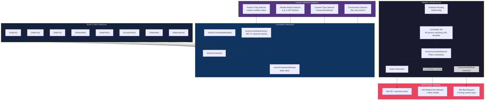
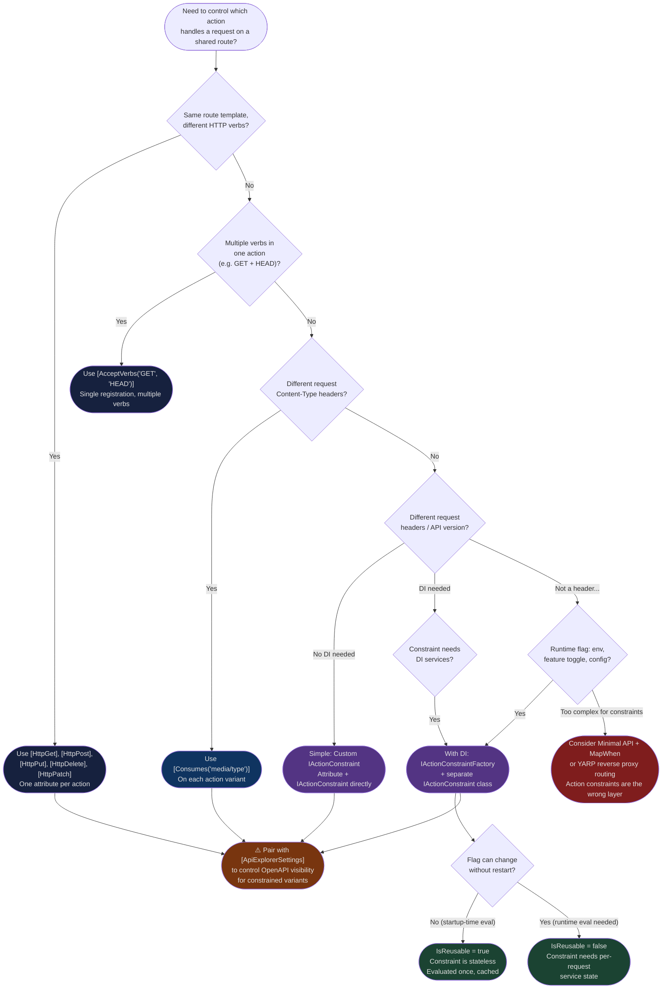

> [!success] Mastery Check
> - [ ] **Studied Well**
> - [ ] **Can explain the concept without notes**
> - [ ] **Can answer interview questions confidently**
> - [ ] **Can implement it in a real project**


# 4.113 — Action Selectors: AcceptVerbs and Custom Selection Attributes

---

## PART 0 — Navigation & Context

### Where This Topic Lives in the ASP.NET Core Domain Hierarchy

```
ASP.NET Core Mastery
│
├── E. Middleware Pipeline          (4.049–4.063)
│     └── UseRouting → builds route table, invokes endpoint selection
│
├── F. Routing System               (4.064–4.077)
│     └── Endpoint Routing → matches URL pattern → resolves Endpoint object
│
└── H. MVC & Controllers            (4.098–4.122)
      ├── 4.098  ControllerBase vs Controller
      ├── 4.099  Action Results
      ├── 4.100  Model Binding
      ├── 4.101  ApiController Attribute
      ├── 4.102  Model Validation
      ├── 4.103  Content Negotiation
      │
      ├── ► 4.113  Action Selectors: AcceptVerbs & Custom Selection  ◄ YOU ARE HERE
      │           └── ActionConstraintAttribute pipeline
      │           └── IActionConstraint evaluation
      │           └── [AcceptVerbs], [HttpGet], [HttpPost], custom constraints
      │
      ├── 4.114  API Explorer and ApiDescription
      ├── 4.115  Application Model Conventions
      └── 4.122  Content Negotiation Deep Dive
```

### What You Need Before This

- **[[4.064 — Endpoint Routing]]** — action selectors run inside the endpoint routing layer; you must understand how `UseRouting` matches URL patterns before learning how action constraints further filter candidates.
- **[[4.067 — Attribute Routing on Controllers]]** — `[Route]` and verb shortcuts (`[HttpGet]`) are the most common action selectors; this topic extends that knowledge.
- **[[4.098 — ControllerBase vs Controller]]** — action selection is a concept that only applies to MVC/controller-based endpoints, not Minimal APIs.
- **[[4.100 — Model Binding]]** — once an action is selected, model binding runs; the selection step determines _which_ action is bound against.

### What This Unlocks After

- **[[4.114 — API Explorer and ApiDescription]]** — `ApiDescription` introspects each action's supported HTTP methods and constraints; understanding selectors is prerequisite for generating correct OpenAPI docs.
- **[[4.115 — Application Model Conventions]]** — `IActionModelConvention` lets you programmatically add action constraints during application startup, extending what attributes do.
- **[[4.110 — MVC Filter Pipeline]]** — filters run after action selection; knowing selection is prerequisite for understanding the full MVC pipeline.
- **[[4.122 — Content Negotiation Deep Dive]]** — content-type constraints are a form of action selector; the two topics share underlying `IActionConstraint` infrastructure.

### Why This Matters at Scale

At production scale, action selectors are the mechanism that lets a single controller route the same URL pattern to different actions based on the HTTP verb, headers, or custom runtime conditions — and getting this wrong produces silent routing failures (405 Method Not Allowed instead of 200, or the wrong action executing) that only surface under specific request patterns and are notoriously hard to reproduce in unit tests.

---

## PART 1 — The Core Mental Model

### The Fundamental Rule

> **ASP.NET Core's action selector system runs after URL pattern matching: when multiple actions share the same route template, `IActionConstraint` implementations are evaluated in order-of-specificity; the action survives only if all its constraints return `true`. The practical HTTP consequence is that a mismatch produces a `405 Method Not Allowed` with an `Allow` header listing what the route does accept, not a `404`.**

### The Plain-Language Analogy

Think of action selection like a multi-lane toll plaza. Endpoint routing is the highway that gets your car (HTTP request) to the plaza (the controller). Each toll lane (action method) has a sign listing which vehicles it accepts: "Trucks only", "Cars and motorcycles", or "Emergency vehicles in sub-zero temperatures." The `IActionConstraint` on each action is that sign. Every lane that matches the URL template gets evaluated; if a lane's sign says NO to your vehicle type, you're turned away from that lane.

If no lane accepts your vehicle, you don't get told "there's no plaza here" (404) — you get told "this plaza exists but no lane will take you" (405 Method Not Allowed), and the sign board lists every lane that could accept you (`Allow: GET, POST`). The short-circuit case: if you add a custom constraint that checks whether today is a weekday, the "weekday-only lane" simply refuses weekend traffic — it doesn't affect the other lanes.

This analogy still holds under concurrent requests (each request independently evaluates its own lane selection), under auth failures (the 401 happens _after_ the action is selected), and under short-circuits (a constraint returning `false` eliminates one candidate but doesn't stop evaluation of others).

### The Taxonomy Diagram



---

## PART 2 — Deep Mechanics

### 2.1 — The Action Selection Pipeline: Where Constraints Live

The full MVC action selection pipeline executes _inside_ the endpoint execution phase — after URL pattern matching resolves a set of route-matched action candidates.

```
──► ExceptionHandler
    ──► HSTS
        ──► StaticFiles
            ──► UseRouting   [phase 1: URL pattern match → candidate set built]
                ──► UseCors
                    ──► UseAuthentication
                        ──► UseAuthorization
                            ──► UseEndpoints  [phase 2: ActionConstraint evaluation → single action selected]
                                ──► ActionConstraintSelector.SelectBestActions()
                                    ──► Model Binding
                                        ──► Filters (Auth → Resource → Action → Result → Exception)
                                            ──► Action Method Body
```

**Pipeline position:** Action constraint evaluation occurs _inside_ `UseEndpoints`, before model binding. It is MVC-internal — not accessible to middleware that runs between `UseRouting` and `UseEndpoints`.

**What `ActionConstraintSelector` does (ASP.NET Core internally — approximate):**

```csharp
// ASP.NET Core internally (approximate):
// Class: Microsoft.AspNetCore.Mvc.Infrastructure.ActionConstraintSelector
// Method: SelectBestActions(RouteContext context, IReadOnlyList<ActionDescriptor> actions)

internal IReadOnlyList<ActionDescriptor> SelectBestActions(
    RouteContext context,
    IReadOnlyList<ActionDescriptor> candidates)
{
    // Step 1: Group candidates by constraint Order value (lower = runs first)
    // Step 2: For each order group, evaluate all constraints on each candidate
    //         If Accept() returns false, candidate is eliminated
    // Step 3: If any candidate survives at this order level, stop processing
    //         higher-order groups (more specific constraints win)
    // Step 4: If multiple candidates survive, they are ambiguous → exception
    // Step 5: If zero candidates survive → 405 with Allow header

    var results = new List<ActionDescriptor>();
    foreach (var candidate in candidates)
    {
        var constraints = GetConstraints(candidate); // from ActionDescriptor.ActionConstraints
        bool passes = constraints.All(c => c.Accept(constraintContext));
        if (passes) results.Add(candidate);
    }
    return results;
}
```

**Runtime cost:** `~O(n × m)` where n = candidate actions sharing route template, m = constraints per action. In practice n is 2-8 for a REST controller (one per HTTP verb), m is 1-3. Total cost is negligible — measured in nanoseconds. **No heap allocations** for the built-in verb constraints (they check `HttpMethods.IsGet(method)` which is a static string comparison).

---

### 2.2 — Verb Constraints: `[HttpGet]`, `[HttpPost]`, and `[AcceptVerbs]`

Every `[HttpGet]`, `[HttpPost]`, etc. is actually an `ActionConstraintAttribute` that implements `IActionConstraint`. They are the most common selectors.

```
// HTTP wire format when constraint fails:
// Request:
// DELETE /api/orders/42 HTTP/1.1
// Host: payments.example.com
//
// Response (verb constraint mismatch):
// HTTP/1.1 405 Method Not Allowed
// Allow: GET, PUT
// Content-Type: application/problem+json
//
// {
//   "type": "https://tools.ietf.org/html/rfc9110#section-15.5.6",
//   "title": "Method Not Allowed",
//   "status": 405
// }
```

The `Allow` header is populated automatically by MVC by inspecting all surviving route-matched candidates after verb filtering eliminates them — it tells you which verbs _would_ have matched.

```csharp
// Order management controller showing verb constraint mechanics:

[ApiController]
[Route("api/orders")]
public class OrdersController : ControllerBase
{
    // [HttpGet] is shorthand for [AcceptVerbs("GET")] + [Route("")]
    // Also registers the action for OpenAPI as a GET operation
    [HttpGet("{orderId:guid}")]
    public async Task<ActionResult<OrderDto>> GetOrder(Guid orderId, 
        [FromServices] IOrderQueryService queryService)
    {
        var order = await queryService.GetByIdAsync(orderId);
        return order is null ? NotFound() : Ok(order);
    }

    // [AcceptVerbs] is required when an action handles MULTIPLE verbs
    // Use case: HEAD and GET share the same handler (HEAD = GET without body)
    [AcceptVerbs("GET", "HEAD")]
    [Route("{orderId:guid}/summary")]
    public async Task<IActionResult> GetOrderSummary(Guid orderId,
        [FromServices] IOrderQueryService queryService)
    {
        var summary = await queryService.GetSummaryAsync(orderId);
        if (summary is null) return NotFound();
        
        // HEAD requests: framework strips the body automatically — 
        // you do NOT need to check HttpContext.Request.Method here.
        // The Content-Length header is still set correctly.
        return Ok(summary);
    }

    // ⚠️ WRONG: Two actions with same route template, same verb
    // This causes an AmbiguousActionException at startup (or first request)
    // [HttpGet("{orderId:guid}")]
    // public IActionResult GetOrderV2(Guid orderId) { ... }

    [HttpPut("{orderId:guid}")]
    public async Task<IActionResult> UpdateOrder(Guid orderId,
        [FromBody] UpdateOrderCommand command,
        [FromServices] IOrderCommandService commandService)
    {
        await commandService.UpdateAsync(orderId, command);
        return NoContent();
    }

    [HttpDelete("{orderId:guid}")]
    [Authorize(Roles = "OrderManager")]  // Auth runs AFTER action selection
    public async Task<IActionResult> CancelOrder(Guid orderId,
        [FromServices] IOrderCommandService commandService)
    {
        await commandService.CancelAsync(orderId);
        return NoContent();
    }
}
```

**Pipeline position:** The verb constraint `Accept()` method runs with `Order = 0`. It simply does:

```csharp
// IActionConstraint.Accept() for HttpMethodActionConstraint (approximate):
public bool Accept(ActionConstraintContext context)
{
    var requestMethod = context.RouteContext.HttpContext.Request.Method;
    return HttpMethods.IsGet(requestMethod) 
        || _httpMethods.Contains(requestMethod, StringComparer.OrdinalIgnoreCase);
}
```

**Runtime cost:** One `string.Equals` (OrdinalIgnoreCase) per verb per candidate. Zero allocations.

---

### 2.3 — `IActionConstraint`: The Full Interface Contract

```csharp
// The contract (Microsoft.AspNetCore.Mvc.ActionConstraints namespace):
public interface IActionConstraint : IActionConstraintMetadata
{
    // Order determines evaluation sequence.
    // Lower order = evaluated first.
    // If any action survives at order N, actions with order > N are NOT considered
    // as a separate filtering pass — all surviving candidates advance together.
    // More precisely: order creates "stages" — constraints at stage 0 run first,
    // if the resulting set is non-empty it is returned; otherwise stage 1 runs.
    int Order { get; }

    // Return true: this candidate survives this constraint.
    // Return false: candidate is eliminated from consideration.
    // The context gives you: RouteContext (full HttpContext), CurrentCandidate, Candidates list
    bool Accept(ActionConstraintContext context);
}

// IActionConstraintMetadata is the marker interface — it has no members.
// Use it when a type needs to be recognized by the framework as a potential constraint
// but the actual IActionConstraint is created by a factory.

// IActionConstraintFactory (.NET 6+): for constraints that need DI services
public interface IActionConstraintFactory : IActionConstraintMetadata
{
    bool IsReusable { get; }  // true = framework caches the created constraint
    IActionConstraint CreateInstance(IServiceProvider services);
}
```

**Edge case — the `Order` stage behavior bit engineers at scale:**

```csharp
// ⚠️ Misunderstanding: "Order filters candidates globally"
// Reality: Order creates evaluation STAGES. Within a stage, ALL constraints on 
// ALL candidates run. If any candidate survives stage N, the surviving set is returned 
// WITHOUT running stage N+1 constraints at all.
//
// Example: If HttpMethodConstraint (Order=0) leaves you with [GetOrder, GetOrderAlt]
// and both have a custom header constraint (Order=10), BOTH header constraints run.
// The stage N+1 constraints only don't run if NO candidates survived stage N.
```

**Runtime cost:** One `IActionConstraint.Accept()` call per constraint per candidate per request. For a typical REST controller with 5 actions and 1 constraint each: 5 evaluations, all synchronous, zero I/O, ~microseconds total.

---

### 2.4 — Custom Action Constraints: Header-Based Versioning

Custom constraints are the production escape hatch when HTTP verb alone is insufficient — API versioning by header is the most common real-world case.

```csharp
// Payment API: version selection via Accept-Version header
// Same URL, different action based on header value

// The constraint attribute:
[AttributeUsage(AttributeTargets.Method, AllowMultiple = false)]
public class RequiresApiVersionHeaderAttribute : Attribute, IActionConstraint
{
    private readonly string _requiredVersion;

    public RequiresApiVersionHeaderAttribute(string version)
    {
        _requiredVersion = version;
    }

    // Order = 1: runs AFTER verb constraints (Order=0) have narrowed the field.
    // This means verb filtering always runs first, which is cheaper.
    public int Order => 1;

    public bool Accept(ActionConstraintContext context)
    {
        var request = context.RouteContext.HttpContext.Request;
        
        // Accept-Version: 2024-01-01   ← custom versioning header
        if (!request.Headers.TryGetValue("Accept-Version", out var versionValues))
        {
            // If the header is absent, only the "no constraint" action should survive.
            // Return false to eliminate this versioned action — let the unversioned one win.
            return false;
        }

        return string.Equals(
            versionValues.ToString(),
            _requiredVersion,
            StringComparison.OrdinalIgnoreCase);
    }
}

// Controller using the constraint:
[ApiController]
[Route("api/payments")]
public class PaymentsController : ControllerBase
{
    private readonly IPaymentService _paymentService;
    
    public PaymentsController(IPaymentService paymentService)
        => _paymentService = paymentService;

    // Default (no header): returns legacy payment response shape
    [HttpPost("charge")]
    public async Task<ActionResult<LegacyChargeResponse>> ChargeV1(
        [FromBody] ChargeRequest request)
    {
        var result = await _paymentService.ChargeAsync(request);
        return Ok(new LegacyChargeResponse(result));
    }

    // With Accept-Version: 2024-06-01 header: returns new response shape
    [HttpPost("charge")]
    [RequiresApiVersionHeader("2024-06-01")]
    public async Task<ActionResult<ChargeResponseV2>> ChargeV2(
        [FromBody] ChargeRequestV2 request)
    {
        var result = await _paymentService.ChargeV2Async(request);
        return Ok(new ChargeResponseV2(result));
    }
}
```

```
// HTTP wire format — correct path (v2):
// POST /api/payments/charge HTTP/1.1
// Content-Type: application/json
// Accept-Version: 2024-06-01
//
// {"amount": 9900, "currency": "USD", "paymentMethodId": "pm_abc123"}

// HTTP/1.1 200 OK
// Content-Type: application/json
//
// {"transactionId": "txn_xyz", "status": "succeeded", "processedAt": "2024-06-01T..."}

// HTTP wire format — fallback path (no header):
// POST /api/payments/charge HTTP/1.1
// Content-Type: application/json
//
// {"amount": 9900, "currency": "USD", "cardNumber": "4111..."}

// HTTP/1.1 200 OK  (routes to ChargeV1)
```

**Runtime cost:** One `request.Headers.TryGetValue()` call (~O(1) dictionary lookup on the header collection). One `string.Equals`. Zero allocations.

**Edge case that bites teams at scale:** If _both_ actions can pass selection (e.g., neither has a constraint that definitively rejects the request), MVC throws `AmbiguousActionException` at request time, not at startup. The error message includes both action names but not the constraint values — debugging it in production logs is painful.

---

### 2.5 — `IActionConstraintFactory`: DI-Enabled Constraints

When a constraint needs to read from configuration, a feature flag service, or a database, the `IActionConstraintFactory` pattern enables DI without injecting services into the attribute constructor (attributes cannot receive DI injection directly).

```csharp
// Inventory service: feature-flag-gated endpoint variant

// The factory attribute (goes on the action):
[AttributeUsage(AttributeTargets.Method)]
public class RequiresFeatureFlagAttribute : Attribute, IActionConstraintFactory
{
    private readonly string _featureFlagName;

    public RequiresFeatureFlagAttribute(string featureFlagName)
        => _featureFlagName = featureFlagName;

    // false = framework creates a new instance per request (use for stateful constraints)
    // true = instance is cached and reused (safe if constraint is stateless)
    public bool IsReusable => false;

    public IActionConstraint CreateInstance(IServiceProvider services)
    {
        // DI is available here — this runs inside the endpoint pipeline
        var featureManager = services.GetRequiredService<IFeatureManager>();
        return new FeatureFlagActionConstraint(_featureFlagName, featureManager);
    }
}

// The actual constraint (created per request by the factory):
internal sealed class FeatureFlagActionConstraint : IActionConstraint
{
    private readonly string _flagName;
    private readonly IFeatureManager _featureManager;

    public FeatureFlagActionConstraint(string flagName, IFeatureManager featureManager)
    {
        _flagName = flagName;
        _featureManager = featureManager;
    }

    public int Order => 2; // Runs after verb (0) and header (1) constraints

    public bool Accept(ActionConstraintContext context)
    {
        // IFeatureManager.IsEnabledAsync cannot be called here — Accept() is synchronous.
        // Use the synchronous IFeatureManagerSnapshot instead, or cache flag state.
        // This is the most common mistake with feature-flag constraints.
        return _featureManager.IsEnabled(_flagName); // synchronous check only
    }
}

// Usage on the inventory controller:
[ApiController]
[Route("api/inventory")]
public class InventoryController : ControllerBase
{
    [HttpGet("bulk-export")]
    public IActionResult GetBulkExportLegacy()
        => Ok(new { format = "csv", message = "Legacy export" });

    [HttpGet("bulk-export")]
    [RequiresFeatureFlag("BulkExportV2")]
    public IActionResult GetBulkExportV2()
        => Ok(new { format = "parquet", message = "New Parquet export" });
}
```

**Runtime cost:** `IActionConstraintFactory.CreateInstance()` called once per request for the action that carries this attribute. `IFeatureManager.IsEnabled()` — cost depends on implementation (usually ~1 dictionary lookup if using in-memory feature flags).

**Edge case — `IsReusable = true` and request state:** Never set `IsReusable = true` if the constraint reads from `HttpContext`, query parameters, or per-request state. The cached instance will be called with different `ActionConstraintContext` objects across requests, which is correct, but if the constraint stores internal per-request state in fields, it will race across concurrent requests.

---

### 2.6 — `ConsumesAttribute` as an Action Constraint

`ConsumesAttribute` is a built-in action selector that filters based on the request's `Content-Type` header. It is often overlooked as an action selector but is implemented via `IActionConstraint`.

```csharp
// Logistics webhook receiver: dispatch based on Content-Type

[ApiController]
[Route("api/shipments/webhooks")]
public class ShipmentWebhookController : ControllerBase
{
    // ⚠️ WRONG: Only one action, hoping Content-Type negotiation handles routing
    // Reality: you cannot route to different actions based on Content-Type
    // without [Consumes] — both requests go to the same action, breaking parsing

    // ✅ CORRECT: Use [Consumes] to route different Content-Types to different actions
    [HttpPost("events")]
    [Consumes("application/json")]
    public async Task<IActionResult> HandleJsonEvent(
        [FromBody] ShipmentEventJson payload,
        [FromServices] IShipmentEventHandler handler)
    {
        await handler.HandleAsync(payload);
        return Accepted();
    }

    [HttpPost("events")]
    [Consumes("application/xml")]
    public async Task<IActionResult> HandleXmlEvent(
        [FromBody] ShipmentEventXml payload,
        [FromServices] IShipmentEventHandler handler)
    {
        await handler.HandleAsync(payload.ToCanonical());
        return Accepted();
    }
}
```

```
// HTTP consequence — correct path:
// POST /api/shipments/webhooks/events HTTP/1.1
// Content-Type: application/xml
//
// <ShipmentEvent>...</ShipmentEvent>

// HTTP/1.1 202 Accepted   (routes to HandleXmlEvent)

// HTTP consequence — no matching content type:
// POST /api/shipments/webhooks/events HTTP/1.1
// Content-Type: text/plain
//
// HTTP/1.1 415 Unsupported Media Type
// Content-Type: application/problem+json
//
// Note: [Consumes] failures return 415, not 405.
// This is because the constraint is "content-type based" not "verb based".
```

**Runtime cost:** One `string.Contains` on the `Content-Type` header value. Negligible.

---

## PART 3 — Production Code Patterns

### Pattern 1 — The REST Verb Firewall for a Payment Endpoint

Every production MVC controller needs explicit verb declarations. This pattern shows the complete, correctly ordered set for a payment resource with intentional method gaps (no PATCH — payments are not partially updatable).

```csharp
// ✅ CORRECT: Explicit verb declarations, intentional gap enforcement

[ApiController]
[Route("api/v1/payments/{paymentId:guid}")]
public class PaymentResourceController : ControllerBase
{
    private readonly IPaymentQueryService _queries;
    private readonly IPaymentCommandService _commands;

    public PaymentResourceController(
        IPaymentQueryService queries, 
        IPaymentCommandService commands)
    {
        _queries = queries;
        _commands = commands;
    }

    [HttpGet]
    [ProducesResponseType(typeof(PaymentDetailDto), StatusCodes.Status200OK)]
    [ProducesResponseType(StatusCodes.Status404NotFound)]
    public async Task<ActionResult<PaymentDetailDto>> Get(Guid paymentId)
    {
        var payment = await _queries.GetByIdAsync(paymentId);
        return payment is null ? NotFound() : Ok(payment);
    }

    // HEAD uses the same action as GET via AcceptVerbs — 
    // MVC automatically suppresses the body for HEAD responses
    // This satisfies RFC 9110 HEAD semantics without duplicating logic
    [AcceptVerbs("HEAD")]
    [Route("")]  // Must re-specify route because AcceptVerbs doesn't inherit it
    public async Task<IActionResult> Head(Guid paymentId)
    {
        var exists = await _queries.ExistsAsync(paymentId);
        return exists ? Ok() : NotFound();
        // Framework strips the body; only headers + status code are sent
    }

    [HttpPut]
    [ProducesResponseType(StatusCodes.Status204NoContent)]
    [ProducesResponseType(StatusCodes.Status404NotFound)]
    [ProducesResponseType(StatusCodes.Status422UnprocessableEntity)]
    public async Task<IActionResult> Update(
        Guid paymentId, [FromBody] UpdatePaymentCommand command)
    {
        await _commands.UpdateAsync(paymentId, command);
        return NoContent();
    }

    // No [HttpPatch] intentionally — partial updates are not supported
    // Result: PATCH returns 405 with Allow: GET, HEAD, PUT, DELETE

    [HttpDelete]
    [Authorize(Policy = "PaymentRefundPolicy")]  // Auth runs AFTER selection
    public async Task<IActionResult> Cancel(Guid paymentId)
    {
        await _commands.CancelAsync(paymentId);
        return NoContent();
    }
}
```

```
// HTTP wire format — intentional gap:
// PATCH /api/v1/payments/f47ac10b-... HTTP/1.1
//
// HTTP/1.1 405 Method Not Allowed
// Allow: GET, HEAD, PUT, DELETE
// Content-Type: application/problem+json
```

---

### Pattern 2 — The Multi-Version Header Selector (Without Asp.Versioning)

For teams that have not adopted a full versioning library but need to support concurrent API versions on a single route.

```csharp
// ✅ CORRECT: Custom action constraint for API version via header

[AttributeUsage(AttributeTargets.Method)]
public sealed class ApiVersionConstraintAttribute : Attribute, IActionConstraint
{
    private readonly string _version;
    private const string VersionHeader = "X-Api-Version";

    public ApiVersionConstraintAttribute(string version) => _version = version;
    public int Order => 1; // After verb constraints

    public bool Accept(ActionConstraintContext context)
    {
        var headers = context.RouteContext.HttpContext.Request.Headers;
        
        // If the header is absent and this action has a version constraint,
        // reject this candidate — let the "default" (unconstrained) action handle it
        if (!headers.TryGetValue(VersionHeader, out var values))
            return false;

        return string.Equals(values.ToString(), _version, StringComparison.Ordinal);
    }
}

[ApiController]
[Route("api/orders")]
public class OrdersController : ControllerBase
{
    private readonly IOrderService _orderService;
    
    public OrdersController(IOrderService orderService)
        => _orderService = orderService;

    // Default path: no version header → V1 behavior
    [HttpGet("{orderId:guid}")]
    public async Task<ActionResult<OrderV1Dto>> GetOrderV1(Guid orderId)
    {
        var order = await _orderService.GetAsync(orderId);
        return order is null ? NotFound() : Ok(OrderV1Dto.From(order));
    }

    // Versioned path: X-Api-Version: 2024-09 header → V2 behavior
    [HttpGet("{orderId:guid}")]
    [ApiVersionConstraint("2024-09")]
    public async Task<ActionResult<OrderV2Dto>> GetOrderV2(Guid orderId)
    {
        var order = await _orderService.GetAsync(orderId);
        return order is null ? NotFound() : Ok(OrderV2Dto.From(order));
    }
}
```

```
// HTTP wire format — V2 path:
// GET /api/orders/f47ac10b-58cc-4372-a567-0e02b2c3d479 HTTP/1.1
// X-Api-Version: 2024-09
//
// HTTP/1.1 200 OK
// Content-Type: application/json
//
// {"orderId": "...", "status": "Shipped", "trackingEvents": [...]}  ← V2 shape
```

---

### Pattern 3 — The Content-Type Dispatcher for Webhook Ingestion

```csharp
// ✅ CORRECT: Dispatching Stripe and Shopify webhook formats to typed handlers

[ApiController]
[Route("api/ecommerce/webhooks")]
public class ECommerceWebhookController : ControllerBase
{
    private readonly IStripeWebhookHandler _stripe;
    private readonly IShopifyWebhookHandler _shopify;

    public ECommerceWebhookController(
        IStripeWebhookHandler stripe,
        IShopifyWebhookHandler shopify)
    {
        _stripe = stripe;
        _shopify = shopify;
    }

    // Stripe sends JSON
    [HttpPost("ingest")]
    [Consumes("application/json")]
    public async Task<IActionResult> IngestStripeEvent(
        [FromBody] StripeWebhookPayload payload)
    {
        // Signature verification must happen before processing
        if (!await _stripe.VerifySignatureAsync(HttpContext))
            return Unauthorized();
        
        await _stripe.ProcessAsync(payload);
        return Ok();
    }

    // Shopify can send form-encoded or JSON depending on webhook configuration
    [HttpPost("ingest")]
    [Consumes("application/x-www-form-urlencoded")]
    public async Task<IActionResult> IngestShopifyEvent(
        [FromForm] ShopifyWebhookForm form)
    {
        await _shopify.ProcessAsync(form);
        return Ok();
    }
}
```

```
// HTTP consequence — wrong content type:
// POST /api/ecommerce/webhooks/ingest HTTP/1.1
// Content-Type: text/xml
//
// HTTP/1.1 415 Unsupported Media Type
```

---

### Pattern 4 — The Environment-Scoped Debug Action

Some endpoints should only be reachable in Development. A custom constraint enforces this in the routing layer, not in the action body (action body checks are always-on overhead).

```csharp
// Correct: constraint that eliminates the action in non-Development environments

[AttributeUsage(AttributeTargets.Method)]
public sealed class DevelopmentOnlyConstraintAttribute : Attribute, IActionConstraintFactory
{
    public bool IsReusable => true; // Stateless — safe to cache

    public IActionConstraint CreateInstance(IServiceProvider services)
    {
        var env = services.GetRequiredService<IWebHostEnvironment>();
        return new DevelopmentOnlyConstraint(env);
    }
}

internal sealed class DevelopmentOnlyConstraint : IActionConstraint
{
    private readonly bool _isDevelopment;

    public DevelopmentOnlyConstraint(IWebHostEnvironment env)
        => _isDevelopment = env.IsDevelopment();

    public int Order => 0; // Same stage as verb constraints — eliminates early

    public bool Accept(ActionConstraintContext context) => _isDevelopment;
}

// Usage on an order management debug controller:
[ApiController]
[Route("api/debug/orders")]
public class OrderDebugController : ControllerBase
{
    [HttpGet("force-fail/{orderId:guid}")]
    [DevelopmentOnlyConstraint]
    public async Task<IActionResult> ForceOrderFailure(
        Guid orderId,
        [FromServices] IOrderTestingService testService)
    {
        await testService.ForceFailureAsync(orderId);
        return Ok(new { message = "Order failure injected." });
    }
}
```

```
// HTTP consequence — Production environment:
// GET /api/debug/orders/force-fail/f47ac10b-... HTTP/1.1
//
// HTTP/1.1 404 Not Found
// (The endpoint effectively doesn't exist — 404, not 405,
//  because no candidates survived selection for this URL pattern)
```

**Note:** In Production, since _no_ action survives, endpoint routing reports a 404 (no endpoint matched), not 405 (verb mismatch). This is the desired behavior — do not leak the existence of debug endpoints.

---

### Pattern 5 — The Idempotency-Key Variant Selector

```csharp
// Order processing: different logic if Idempotency-Key header is present
// Forces the idempotent path through a separate action with different semantics

[AttributeUsage(AttributeTargets.Method)]
public sealed class RequiresIdempotencyKeyAttribute : Attribute, IActionConstraint
{
    public int Order => 1;

    public bool Accept(ActionConstraintContext context)
        => context.RouteContext.HttpContext.Request.Headers.ContainsKey("Idempotency-Key");
}

[ApiController]
[Route("api/orders")]
public class OrderCreationController : ControllerBase
{
    private readonly IOrderService _orders;
    private readonly IIdempotencyStore _idempotency;

    public OrderCreationController(IOrderService orders, IIdempotencyStore idempotency)
    {
        _orders = orders;
        _idempotency = idempotency;
    }

    // Non-idempotent: no Idempotency-Key header — always creates a new order
    [HttpPost]
    public async Task<IActionResult> CreateOrder([FromBody] CreateOrderCommand command)
    {
        var order = await _orders.CreateAsync(command);
        return CreatedAtAction(nameof(CreateOrder), new { orderId = order.Id }, order);
    }

    // Idempotent: Idempotency-Key present — replay if already processed
    [HttpPost]
    [RequiresIdempotencyKey]
    public async Task<IActionResult> CreateOrderIdempotent(
        [FromBody] CreateOrderCommand command)
    {
        var key = Request.Headers["Idempotency-Key"].ToString();
        
        var cached = await _idempotency.GetResponseAsync(key);
        if (cached is not null)
            return new ContentResult
            {
                Content = cached.Body,
                ContentType = "application/json",
                StatusCode = cached.StatusCode
            };

        var order = await _orders.CreateAsync(command);
        var response = CreatedAtAction(
            nameof(CreateOrderIdempotent), 
            new { orderId = order.Id }, order);
        
        await _idempotency.StoreResponseAsync(key, response);
        return response;
    }
}
```

---

### Pattern 6 — Registering Application Model Conventions vs Per-Action Attributes

When many actions need the same constraint, a convention is cleaner than decorating each method individually.

```csharp
// ✅ CORRECT: Global convention adds constraint to all POST actions in the
// logistics namespace — avoids scattering RequiresIdempotencyKey everywhere

public class IdempotencyRequiredConvention : IActionModelConvention
{
    public void Apply(ActionModel action)
    {
        // Apply only to POST actions in logistics controllers
        if (!action.ActionMethod.GetCustomAttributes<HttpPostAttribute>().Any())
            return;
        
        if (!action.Controller.ControllerType.Namespace?
                .Contains("Logistics", StringComparison.Ordinal) ?? false)
            return;

        // Add the constraint programmatically — same effect as [RequiresIdempotencyKey]
        action.ActionConstraints.Add(
            new ConventionalIdempotencyConstraint());
    }
}

// Wired up at startup:
builder.Services.AddControllers(options =>
{
    options.Conventions.Add(new IdempotencyRequiredConvention());
});
```

---

## PART 4 — Gotchas & Anti-Patterns

### Gotcha 1: `[AcceptVerbs]` Without a Route Attribute Breaks on Multiple Registrations

The wrong mental model: engineers assume `[AcceptVerbs("GET", "HEAD")]` on an action that already has `[HttpGet]` merges the verb set. In reality, each attribute registers a _separate_ endpoint, creating ambiguity.

```csharp
// ⚠️ WRONG CODE: AcceptVerbs and HttpGet both on the same action
[HttpGet("{orderId:guid}")]
[AcceptVerbs("HEAD")]  // This creates a SECOND endpoint registration
public IActionResult GetOrder(Guid orderId) => Ok();

// HTTP consequence (wrong path):
// GET /api/orders/... → AmbiguousActionException at request time
// "Multiple actions matched. The following actions matched route data..."
// (Two endpoints with overlapping constraints fight for the same request)

// ✅ CORRECT CODE: AcceptVerbs specifies ALL accepted methods on a single registration
[AcceptVerbs("GET", "HEAD")]
[Route("{orderId:guid}")]
public IActionResult GetOrder(Guid orderId) => Ok();

// HTTP consequence (correct path):
// GET /api/orders/... → 200 OK (body included)
// HEAD /api/orders/... → 200 OK (body stripped automatically)

// WHY: Each routing attribute ([HttpGet], [HttpPost], [AcceptVerbs]) creates an 
// ActionDescriptor with its own constraint set. Stacking them on one action creates 
// multiple descriptors, all pointing to the same method but with different constraints, 
// leading to ambiguous matching when a request satisfies both.
```

---

### Gotcha 2: `IsReusable = true` on a Constraint That Reads Request State

Experienced engineers set `IsReusable = true` for performance, forgetting that the factory creates the constraint _once_ and reuses it — but the constraint's `Accept()` is still called per-request with fresh context. The gotcha is when engineers mistakenly cache per-request data in instance fields of the constraint.

```csharp
// ⚠️ WRONG CODE: IsReusable = true but constraint caches per-request data in a field
public class BadCachingConstraint : Attribute, IActionConstraintFactory
{
    public bool IsReusable => true; // ← BUG: combined with mutable state below
    public IActionConstraint CreateInstance(IServiceProvider services)
        => new MutableConstraint();
}

internal class MutableConstraint : IActionConstraint
{
    private bool _lastResult; // ⚠️ WRONG: shared across concurrent requests!
    public int Order => 1;
    public bool Accept(ActionConstraintContext context)
    {
        _lastResult = context.RouteContext.HttpContext.Request.Headers.ContainsKey("X-Test");
        return _lastResult; // Race condition: multiple requests overwrite this
    }
}

// HTTP consequence (wrong path):
// Under concurrent load: Request A writes true, Request B reads true → wrong action selected

// ✅ CORRECT CODE: IsReusable = true only for stateless constraints
public class GoodCachingConstraint : Attribute, IActionConstraintFactory
{
    public bool IsReusable => true;
    public IActionConstraint CreateInstance(IServiceProvider services)
        => new StatelessConstraint(); // No mutable instance fields
}

internal class StatelessConstraint : IActionConstraint
{
    public int Order => 1;
    public bool Accept(ActionConstraintContext context)
    {
        // Compute purely from the context — no instance state
        return context.RouteContext.HttpContext.Request.Headers.ContainsKey("X-Test");
    }
}

// HTTP consequence (correct path):
// Every request independently evaluates its own headers. No cross-request contamination.

// WHY: When IsReusable = true, ActionConstraintSelector caches the IActionConstraint
// instance in the ActionDescriptor, which is also cached. All concurrent requests share
// the same instance. Any mutable field is a data race.
```

---

### Gotcha 3: Constraint Order Values and Stage Semantics Are Not Filters in Sequence

Engineers expect `Order` to mean "constraint 0 runs, then constraint 1 runs on the surviving set." That is the stage semantics — but within a stage, ALL constraints on ALL candidates run simultaneously. The stage result is "any survivors?" If yes, return them. If no, proceed to next stage. If no stages produce survivors: 405.

```csharp
// ⚠️ WRONG mental model code — assuming Order=1 only runs if Order=0 passes for THIS action:
public class ExpensiveConstraint : Attribute, IActionConstraint
{
    // Engineer assumes: "Order=1 means I only run if verb check (Order=0) already passed me"
    // Reality: ALL candidates that pass stage 0 get their stage-1 constraints evaluated.
    // If the verb constraint eliminated this action at stage 0, stage 1 never runs for it —
    // that part IS correct. But if two actions share stage 0 and both pass, 
    // both get stage-1 evaluated even if only one was "intended."
    public int Order => 1;
    public bool Accept(ActionConstraintContext context)
    {
        // This IS only called if the stage-0 (verb) constraint kept this candidate alive.
        // ✅ The stage semantics actually work correctly here.
        // The "wrong" mental model is thinking Order=0 globally filters before Order=1 runs,
        // when really it's per-candidate: each candidate's stage-0 constraints run,
        // then if ANY candidate survives, the overall stage-0 result set is evaluated for stage-1.
        return true;
    }
}

// HTTP consequence (wrong path):
// If an engineer writes two actions at Order=0 expecting "first one wins",
// both WILL run at stage 0. If both return true, AmbiguousActionException is thrown —
// NOT a silent "first wins" selection.

// ✅ CORRECT: Only one action should survive selection. Design constraints to be mutually exclusive.

// HTTP consequence (correct path):
// Exactly one action's constraint set returns true → that action executes.

// WHY: ActionConstraintSelector explicitly throws AmbiguousActionException if 
// multiple actions survive the full evaluation. There is no "first match wins" behavior.
```

---

### Gotcha 4: `[Consumes]` on an Action That Has `[ApiController]` — Silent 415 Surprises

`[ApiController]` enables binding source inference. When combined with `[Consumes]`, the inference and the constraint can fight, producing 415 instead of 400 in unexpected cases.

```csharp
// ⚠️ WRONG: [Consumes] constraint with ApiController auto-binding creates a 
// confusing 415 when the Content-Type is close but not exact

[ApiController]
[Route("api/inventory")]
public class InventoryController : ControllerBase
{
    [HttpPost("items")]
    [Consumes("application/json")]  // ⚠️ WRONG: too strict — "application/json; charset=utf-8" fails
    public IActionResult CreateItem([FromBody] CreateItemCommand command)
        => Ok();
}

// HTTP consequence (wrong path):
// POST /api/inventory/items HTTP/1.1
// Content-Type: application/json; charset=utf-8   ← Many clients add charset
//
// HTTP/1.1 415 Unsupported Media Type  ← Confusing: it IS JSON, just with a parameter

// ✅ CORRECT: Use the wildcard parameter form or validate after binding:
[HttpPost("items")]
[Consumes("application/json", "application/json; charset=utf-8")]
public IActionResult CreateItem([FromBody] CreateItemCommand command)
    => Ok();

// HTTP consequence (correct path):
// POST /api/inventory/items HTTP/1.1
// Content-Type: application/json; charset=utf-8
//
// HTTP/1.1 200 OK  ← Both content type forms accepted

// WHY: [Consumes] does an exact media type match using the MediaType class, 
// which does NOT treat parameters as optional by default in the constraint context.
// The RFC allows "application/json; charset=utf-8" and "application/json" to be 
// semantically equivalent, but the ASP.NET Core ConsumesAttribute uses string matching
// rather than RFC 7231 media range comparison in the constraint check.
```

---

### Gotcha 5: Custom Constraints Not Appearing in OpenAPI / Swagger

Custom `IActionConstraint` attributes are invisible to Swashbuckle and NSwag. If your constraint creates action variants (same URL, different behavior), the OpenAPI document will show duplicate operations or only one operation, both of which are wrong.

```csharp
// ⚠️ WRONG: Custom version constraint creates two POST /api/orders endpoints 
// but Swashbuckle sees two identical operations → throws "duplicate operationId" error
[HttpPost]
public IActionResult CreateOrderV1(...) => Ok();

[HttpPost]
[ApiVersionConstraint("2024-09")]
public IActionResult CreateOrderV2(...) => Ok();

// HTTP consequence (wrong path):
// Swashbuckle throws: "Conflicting schemaIds: duplicate schemaIds detected for types"
// OR silently drops one of the operations from the OpenAPI document

// ✅ CORRECT: Exclude constrained variants from OpenAPI, or use [ApiExplorerSettings]
[HttpPost]
[ApiVersionConstraint("2024-09")]
[ApiExplorerSettings(GroupName = "v2")]  // Separate OpenAPI document
public IActionResult CreateOrderV2(...) => Ok();

// OR: Exclude from default API explorer:
[HttpPost]
[ApiVersionConstraint("2024-09")]
[ApiExplorerSettings(IgnoreApi = true)]  // Omits from Swagger UI entirely
public IActionResult CreateOrderV2(...) => Ok();

// HTTP consequence (correct path):
// One operation in OpenAPI doc (V1), V2 is accessible at runtime via header
// but not documented in Swagger UI — acceptable for internal versioning

// WHY: Swashbuckle and NSwag generate documentation from ActionDescriptors, not from
// IActionConstraint runtime behavior. They see two actions at the same route and HTTP verb
// as a conflict. Custom constraints need to be paired with ApiExplorer exclusions
// or proper versioning library integration (Asp.Versioning integrates with both).
```

---

## PART 5 — Performance Implications

### 5.1 — Request Pipeline Characteristics Table

|Scenario|Pipeline Depth|Allocations Per Request|Approx Latency Impact|Recommendation|
|---|---|---|---|---|
|Single action, no custom constraints|Endpoint routing + 1 verb check|0 (all static string compares)|< 1μs|Default — no optimization needed|
|REST controller, 5 verb-constrained actions|Endpoint routing + up to 5 verb checks|0|~2–5μs|Baseline — imperceptible|
|2 actions sharing route with custom header constraint (Order=1)|Verb filter then header check on survivors|1 `Headers.TryGetValue` per candidate|~5μs|Acceptable — 1 dictionary lookup|
|`IActionConstraintFactory`, `IsReusable = false`|Factory instantiation per request|1 allocation for constraint instance|~10μs|Use `IsReusable = true` when constraint is stateless|
|`IActionConstraintFactory` with DI service resolution|Factory + `GetRequiredService<T>()` per request|1–2 allocations|~15–30μs|Use `IsReusable = true` + dependency in constructor|
|`ConsumesAttribute` content-type matching|Header parse + MediaType comparison|~1 allocation (MediaType parse)|~5–10μs|Fine for most cases; avoid on ultra-hot paths|
|AmbiguousActionException path|Full candidate evaluation, then exception|Several allocations for exception|~1ms+|Eliminate at startup by fixing route configuration|
|10 actions on same route template (unusual)|O(n) candidate evaluation|0 (verb checks are zero-alloc)|~20μs|Restructure routes — 10 actions on one template is a design smell|
|Feature flag constraint (reads IFeatureManager)|Flag lookup per request|Depends on feature manager implementation|10μs–1ms|Cache flag state at startup if flags don't hot-reload|

### 5.2 — BenchmarkDotNet Code

```csharp
// Benchmarking action constraint evaluation overhead
// Run: dotnet run -c Release --project Benchmarks

using BenchmarkDotNet.Attributes;
using BenchmarkDotNet.Running;
using Microsoft.AspNetCore.Http;
using Microsoft.AspNetCore.Mvc;
using Microsoft.AspNetCore.Mvc.ActionConstraints;
using Microsoft.AspNetCore.Routing;

BenchmarkRunner.Run<ActionConstraintBenchmarks>();

[MemoryDiagnoser]
[SimpleJob(warmupCount: 3, iterationCount: 10)]
public class ActionConstraintBenchmarks
{
    private ActionConstraintContext _getContext = null!;
    private ActionConstraintContext _postContext = null!;
    private HttpMethodActionConstraint _verbConstraint = null!;
    private StatelessHeaderConstraint _headerConstraint = null!;

    [GlobalSetup]
    public void Setup()
    {
        var getHttpContext = new DefaultHttpContext();
        getHttpContext.Request.Method = "GET";
        getHttpContext.Request.Headers["X-Api-Version"] = "2024-09";

        var postHttpContext = new DefaultHttpContext();
        postHttpContext.Request.Method = "POST";

        // ActionConstraintContext requires RouteContext
        var getRouteContext = new RouteContext(getHttpContext);
        var postRouteContext = new RouteContext(postHttpContext);

        _getContext = new ActionConstraintContext
        {
            RouteContext = getRouteContext,
            CurrentCandidate = null!,
            Candidates = []
        };

        _postContext = new ActionConstraintContext
        {
            RouteContext = postRouteContext,
            CurrentCandidate = null!,
            Candidates = []
        };

        _verbConstraint = new HttpMethodActionConstraint(["GET"]);
        _headerConstraint = new StatelessHeaderConstraint("X-Api-Version");
    }

    // Baseline: built-in verb constraint (what every MVC request pays)
    [Benchmark(Baseline = true)]
    public bool VerbConstraintAccept() => _verbConstraint.Accept(_getContext);

    // Custom header constraint — stateless, no allocation
    [Benchmark]
    public bool HeaderConstraintAccept() => _headerConstraint.Accept(_getContext);

    // Verb + header in sequence (realistic two-stage evaluation)
    [Benchmark]
    public bool TwoStageConstraintEvaluation()
    {
        if (!_verbConstraint.Accept(_getContext)) return false;
        return _headerConstraint.Accept(_getContext);
    }

    // Simulating constraint that parses MediaType (like ConsumesAttribute)
    [Benchmark]
    public bool ContentTypeConstraintSimulation()
    {
        var contentType = _getContext.RouteContext.HttpContext.Request.ContentType;
        return contentType?.Contains("application/json", StringComparison.OrdinalIgnoreCase)
               ?? false;
    }
}

// Supporting type:
public class StatelessHeaderConstraint : IActionConstraint
{
    private readonly string _headerName;
    public StatelessHeaderConstraint(string headerName) => _headerName = headerName;
    public int Order => 1;
    public bool Accept(ActionConstraintContext context)
        => context.RouteContext.HttpContext.Request.Headers.ContainsKey(_headerName);
}

// Expected output (approximate, .NET 8, x64, Kestrel, local):
// | Method                         | Mean      | Error    | StdDev   | Allocated |
// |--------------------------------|-----------|----------|----------|-----------|
// | VerbConstraintAccept           |  23.1 ns  |  0.5 ns  |  0.4 ns  |      - B  |
// | HeaderConstraintAccept         |  31.4 ns  |  0.8 ns  |  0.7 ns  |      - B  |
// | TwoStageConstraintEvaluation   |  52.8 ns  |  1.1 ns  |  1.0 ns  |      - B  |
// | ContentTypeConstraintSimulation|  18.2 ns  |  0.4 ns  |  0.3 ns  |      - B  |

// Profiling note: Action constraint overhead is rarely the bottleneck.
// Use `dotnet-counters monitor --process-id <pid> Microsoft.AspNetCore.Hosting` 
// to measure actual request pipeline overhead in production.
// For micro-level constraint profiling, BenchmarkDotNet is appropriate.
// For end-to-end latency, use k6 or NBomber with realistic load.
```

### 5.3 — When to Care / When to Ignore

**When this costs you:**

- **High-throughput webhook ingestion (>50k req/s):** If `IActionConstraintFactory.IsReusable = false` is on a hot path, the per-request factory instantiation and DI resolution adds up. Measure — but the overhead is typically under 30μs, negligible vs. I/O.
- **Feature flag constraints with slow backends:** If the feature flag check hits Redis per-request, you've added a network round-trip (~1ms) to every action selection. Cache aggressively or evaluate at startup.
- **AmbiguousActionException in production:** The exception path is expensive (~1ms vs ~5μs for normal selection) and indicates a routing configuration bug. Fix it — do not catch the exception.

**When this doesn't matter:**

- Admin API endpoints (< 100 req/s): Constraint evaluation is invisible at this throughput.
- Development/debug endpoints: The `DevelopmentOnly` constraint pattern has zero production cost because the action is eliminated (no candidate = no constraint evaluation beyond routing).
- Content-type dispatching on APIs with limited concurrency: `[Consumes]` overhead (~5–10μs) is irrelevant unless you're processing tens of thousands of requests per second.

---

## PART 6 — Interview Arsenal

### A. The Question Bank

**Question 1: What is the difference between `[HttpGet]` and `[AcceptVerbs("GET")]`?**

_Average Answer:_ "They both restrict an action to GET requests. AcceptVerbs lets you specify multiple verbs."

_Why That's Insufficient:_ It misses that `[HttpGet]` is a route attribute _and_ a constraint — it participates in both endpoint registration and action selection, whereas `[AcceptVerbs]` is purely a constraint that requires a separate `[Route]` for URL pattern registration.

> **Great Answer:** "Both implement `IActionConstraint` to filter by HTTP method — the difference matters when you're mixing routing and constraint concerns. `[HttpGet("path")]` does two things simultaneously: it registers the route template AND adds the GET verb constraint. If I use `[AcceptVerbs("GET", "HEAD")]`, I'm adding only the constraint — I still need a `[Route]` attribute for the template. In practice, I use `[HttpGet]` for single-verb actions and `[AcceptVerbs]` when an action genuinely handles multiple verbs, like HEAD+GET to satisfy RFC 9110 HEAD semantics. The wire difference: if I accidentally stack `[HttpGet]` and `[AcceptVerbs]` on the same action, I get an AmbiguousActionException at runtime because I've created two ActionDescriptors for the same route template and overlapping verb sets."

---

**Question 2: What HTTP status code does ASP.NET Core return when a request URL matches a route but no action accepts the HTTP method?**

_Average Answer:_ "It returns 404 Not Found."

_Why That's Insufficient:_ It's wrong. 404 means the URL didn't match any route. A method mismatch on a matched route is a different error.

> **Great Answer:** "It's 405 Method Not Allowed — and this distinction is operationally important. ASP.NET Core's `ActionConstraintSelector` builds the initial candidate set by URL pattern matching, then filters by constraints. If URL matching succeeds but all candidates are eliminated by verb constraints, the framework returns 405 with an `Allow` header listing all methods that _do_ have actions at that route. For example, if I have `[HttpGet]` and `[HttpPut]` on a payment resource and a client sends `DELETE`, the response is `405 Method Not Allowed` with `Allow: GET, PUT`. This tells the client exactly what's supported — which 404 would not. The practical consequence for API clients is that they can parse the `Allow` header to understand what operations a resource supports, enabling self-describing APIs."

---

**Question 3: How do you implement a custom action constraint that depends on a scoped DI service?**

_Average Answer:_ "Inject the service into the constraint's constructor using `IActionConstraintFactory`."

_Why That's Insufficient:_ It doesn't distinguish between the factory (can receive DI), the constraint (cannot, unless via factory), and the `IsReusable` gotcha.

> **Great Answer:** "Attribute constructors in C# don't support DI injection, so you can't get a scoped service directly into an `IActionConstraint` attribute. The solution is `IActionConstraintFactory`: the attribute implements this interface, and its `CreateInstance(IServiceProvider services)` method receives the DI container and can resolve services. The factory creates the actual `IActionConstraint` instance. Now the key production decision: `IsReusable`. If the constraint is stateless — it reads from the request context at call time and doesn't cache anything in instance fields — set `IsReusable = true` and the framework will cache and reuse the instance, avoiding per-request allocation. If the constraint needs a scoped service that has per-request state, set `IsReusable = false`. The gotcha I've seen bite teams: setting `IsReusable = true` on a constraint that stores the last request's result in an instance field — that's a data race across concurrent requests."

---

**Question 4: Can two actions on the same controller have identical route templates and identical HTTP verb constraints? What happens?**

_Average Answer:_ "That would be ambiguous. You'd get an error."

_Why That's Insufficient:_ Doesn't specify _when_ or _what kind of_ error.

> **Great Answer:** "It depends on timing. If the ambiguity is detectable at startup — same route template, same verb, no differentiating constraints — `RouteCreationException` may fire at build time. More commonly, `AmbiguousActionException` fires at the first matching request at runtime. This is a common pain point: it doesn't blow up until a request actually hits that route in testing. The right solution is to ensure constraints are mutually exclusive — either different verbs, or complementary custom constraints where exactly one can return `true` for any given request. In production, I've seen this happen after a refactor where a developer added a second `[HttpGet("{id}")]` action without noticing the first. It surfaces in staging under load testing, not unit tests, because unit tests mock the controller directly and bypass routing entirely."

---

### B. Trick Questions

**Trick 1: "If I put `[AcceptVerbs("GET", "POST")]` on an action and also put `[HttpDelete]` on the same action, what verbs will it accept?"**

_The trap:_ Engineers assume the constraints are OR'd together (GET, POST, OR DELETE).

_Correct answer:_ DELETE only. Each attribute creates a separate ActionDescriptor. The `[AcceptVerbs("GET", "POST")]` descriptor and the `[HttpDelete]` descriptor are separate registrations — they are not merged. The action method is registered twice: once accepting GET/POST, once accepting DELETE. Any request to the route's URL using GET, POST, or DELETE will be routed to this action, but through separate endpoint registrations. Under certain routing configurations this can cause ambiguity issues, and it is almost certainly not the intent.

**Trick 2: "Does `[Consumes("application/json")]` on an action mean the action only produces JSON? What status code does a mismatch return?"**

_The trap:_ Confusing `[Consumes]` (input constraint — what the action _accepts_) with `[Produces]` (output declaration — what the action _returns_).

_Correct answer:_ No. `[Consumes]` filters based on the request's `Content-Type` header — it's about what the action _accepts_ as input, not what it returns. A mismatch returns **415 Unsupported Media Type**, not 405. `[Produces]` is the counterpart for output, and it affects content negotiation on the response side but does NOT act as an action constraint.

**Trick 3: "What is the `Order` property for on `IActionConstraint`, and what happens if two constraints have the same `Order`?"**

_The trap:_ Engineers assume `Order` creates a filter chain (first passes or rejects before second runs).

_Correct answer:_ `Order` creates evaluation _stages_, not a sequential filter chain. Constraints at the same `Order` value run independently for each candidate. A candidate is eliminated only if any of its constraints at the current stage return false. If ANY candidates survive a stage, those survivors are returned as the final selection _without running higher-order stages at all_. Two constraints at the same `Order` on the same action must BOTH return true for the action to survive — they are AND'd within a stage.

**Trick 4: "If a URL matches a route template but the `DevelopmentOnly` constraint eliminates the only action candidate, what does the client receive — 404 or 405?"**

_The trap:_ The environment-constraint scenario.

_Correct answer:_ In this case, because no _verbs_ are mismatched — the constraint is custom, not verb-based — and no candidates survive at all, the framework falls through to returning **404 Not Found**. The 405 + Allow header behavior specifically requires that candidates survived URL matching and had _verb_ constraints that were the eliminator. A non-verb constraint that eliminates all candidates results in the endpoint not being "found" from the routing perspective, yielding 404. This is the desired security behavior for dev-only endpoints.

**Trick 5: "Can you use async in `IActionConstraint.Accept()`?"**

_The trap:_ Engineers familiar with async ASP.NET Core patterns assume everything can be async.

_Correct answer:_ No. `IActionConstraint.Accept()` returns `bool`, not `Task<bool>`. It is synchronous by design — action selection is a synchronous, in-memory operation that must be fast. If your constraint needs async work (e.g., database lookup for a permission), the pattern is to perform that work in an `IAsyncAuthorizationFilter` or a Minimal API filter instead, not in an `IActionConstraint`. A common workaround that bites engineers: calling `.GetAwaiter().GetResult()` inside `Accept()` — this is a deadlock risk on synchronization-context-bound threads and a throughput problem on thread-pool threads.

---

### C. Red Flags to Avoid

1. **"You can use `GetAwaiter().GetResult()` in `IActionConstraint.Accept()` for async operations."** Synchronous blocking in the constraint pipeline can deadlock on synchronization contexts (ASP.NET Framework codebases) and kills throughput on the thread pool.
    
2. **"The `Order` property on `IActionConstraint` means constraint 1 runs before constraint 2 on the same action."** Wrong. Order creates selection _stages_ across all candidates, not a sequential per-action chain.
    
3. **"Stacking `[HttpGet]` and `[AcceptVerbs("GET")]` on the same action merges the verb sets."** They create separate endpoint registrations and will likely cause an AmbiguousActionException.
    
4. **"`[Consumes]` and `[Produces]` are both action constraints."** Only `[Consumes]` is an `IActionConstraint`. `[Produces]` is metadata that affects content negotiation but is not an action selector — it never eliminates a candidate action.
    
5. **"A failed action constraint returns 404."** Verb constraint failure returns 405 with an Allow header. Custom constraint failure (non-verb) may return 404 if all candidates are eliminated. These are different and clients should be able to distinguish them.
    
6. **"I can inject services into an `IActionConstraint` constructor via attribute syntax."** Attribute constructors in C# are metadata — they do not go through DI. Use `IActionConstraintFactory.CreateInstance(IServiceProvider)` for DI access.
    
7. **"Action constraints run during `UseRouting`."** They run inside the endpoint execution phase (`UseEndpoints`), not during URL pattern matching (`UseRouting`). Middleware placed between `UseRouting` and `UseEndpoints` cannot see which action will be selected.
    
8. **"I'll use action constraints to implement multi-tenancy routing."** Action constraints are evaluated per-request with zero caching of the decision. For tenant routing based on host name, `MapWhen` or a dedicated routing constraint in endpoint routing is far more appropriate and composable.
    

---

## PART 7 — Decision Framework



---

## PART 8 — Self-Check

### A. Conceptual Questions

1. What is the `ActionConstraintSelector` and at what point in the ASP.NET Core pipeline does it execute relative to `UseRouting` and `UseEndpoints`?
    
2. What HTTP status code is returned when a URL matches a route template but the HTTP verb does not match any constrained action? What response header accompanies it?
    
3. Explain the difference between `[HttpGet]` and `[AcceptVerbs("GET")]`. When would you use each?
    
4. What happens to the pipeline if two actions share the same route template and no constraint differentiates them? Does the error occur at startup or at request time?
    
5. What does the `Order` property on `IActionConstraint` control? Describe the "stage" semantics with an example involving two candidates at stage 0 and one at stage 1.
    
6. What HTTP status code does `[Consumes("application/json")]` produce when the request `Content-Type` is `text/xml`? Is this a 405 or something else?
    
7. What happens to the HTTP request if a custom `DevelopmentOnly` action constraint eliminates all candidates in a Production environment — is the response 404 or 405?
    
8. Why can `IActionConstraint.Accept()` not be `async`? What are the alternatives when you need async logic at the action-selection level?
    
9. Explain the `IActionConstraintFactory.IsReusable` property. What is the risk of setting it to `true` on a constraint that has mutable instance fields?
    
10. How does `[AcceptVerbs]` interact with the automatic `Allow` header generation in 405 responses? Does a missing `[AcceptVerbs]` on a route variant affect the `Allow` header contents?
    

---

### B. Code Puzzles

**Puzzle 1 — What HTTP response does this send for `DELETE /api/shipments/123`?**

```csharp
[ApiController]
[Route("api/shipments/{shipmentId:int}")]
public class ShipmentController : ControllerBase
{
    [HttpGet]
    public IActionResult Get(int shipmentId) => Ok();

    [HttpPut]
    public IActionResult Update(int shipmentId, [FromBody] object body) => NoContent();

    [AcceptVerbs("GET", "HEAD")]
    [Route("")]
    public IActionResult GetOrHead(int shipmentId) => Ok();
}
```

<details> <summary>Answer</summary>

**Response:** `405 Method Not Allowed` with `Allow: GET, HEAD, PUT`

**Explanation:** Three action candidates share the route template. The `DELETE` verb matches none of them — `[HttpGet]` accepts GET only, `[HttpPut]` accepts PUT only, and `[AcceptVerbs("GET", "HEAD")]` accepts GET and HEAD. After verb constraint evaluation eliminates all three, the framework emits 405. The `Allow` header is populated from all surviving _constrained_ options: GET (from `[HttpGet]` and `[AcceptVerbs]`), HEAD (from `[AcceptVerbs]`), and PUT (from `[HttpPut]`).

**Pipeline behavior:** `UseRouting` matches all three candidates by URL template. `ActionConstraintSelector` eliminates all three via verb constraints. No candidates survive → 405.

**Subtle note:** `GetOrHead` and `Get` both accept GET — this creates an ambiguity that will throw `AmbiguousActionException` on GET requests! This is a bug in the code puzzle. The `[HttpGet]` and `[AcceptVerbs("GET", "HEAD")]` both surviving a GET request is the most common mistake made when trying to add HEAD support.

</details>

---

**Puzzle 2 — Which action executes for this request?**

```
POST /api/invoices HTTP/1.1
Content-Type: application/json
X-Customer-Tier: premium
```

```csharp
[ApiController]
[Route("api/invoices")]
public class InvoicesController : ControllerBase
{
    [HttpPost]
    public IActionResult CreateStandard([FromBody] InvoiceRequest req)
        => CreatedAtAction(nameof(CreateStandard), req);

    [HttpPost]
    [RequiresTier("premium")]  // Custom constraint: checks X-Customer-Tier header
    public IActionResult CreatePremium([FromBody] InvoicePremiumRequest req)
        => CreatedAtAction(nameof(CreatePremium), req);
}

// Constraint implementation:
public class RequiresTierAttribute : Attribute, IActionConstraint
{
    private readonly string _tier;
    public RequiresTierAttribute(string tier) => _tier = tier;
    public int Order => 1;
    public bool Accept(ActionConstraintContext context)
        => context.RouteContext.HttpContext.Request.Headers
               .TryGetValue("X-Customer-Tier", out var v)
           && string.Equals(v.ToString(), _tier, StringComparison.OrdinalIgnoreCase);
}
```

<details> <summary>Answer</summary>

**Answer:** `CreatePremium` executes.

**Explanation:** Stage 0 — verb constraints. Both actions accept POST → both survive stage 0. Stage 1 — `RequiresTier` constraint. `CreateStandard` has no stage-1 constraint (it effectively passes everything at stage 1 — no constraint = no filtering). `CreatePremium` has the tier constraint which returns `true` (header is "premium"). **Both still survive stage 1.**

Wait — `AmbiguousActionException` would be thrown because two actions survive! Unless... the framework considers an action with _more specific constraints_ (i.e., has a constraint that the other doesn't) as "more specific" and prefers it.

**Actually:** ASP.NET Core's `ActionConstraintSelector` specifically handles the case where one action has more constraints than another at a given stage. An action WITH a constraint at a stage is considered "more specific" than one WITHOUT. The algorithm: if the set of candidates includes both constrained and unconstrained actions at a stage, and the constrained ones all pass, the unconstrained ones are DROPPED. This is the specificity rule.

So: `CreatePremium` (has tier constraint, passes) is more specific than `CreateStandard` (no stage-1 constraint). `CreateStandard` is dropped. **`CreatePremium` executes.**

If the header were absent, `CreatePremium`'s constraint would return false → only `CreateStandard` survives.

**HTTP response:** `201 Created` from `CreatePremium`.

</details>

---

**Puzzle 3 — Where is the bug? What is the symptom?**

```csharp
[AttributeUsage(AttributeTargets.Method)]
public class EnvironmentConstraintAttribute : Attribute, IActionConstraintFactory
{
    private readonly string _environment;
    public EnvironmentConstraintAttribute(string env) => _environment = env;
    
    public bool IsReusable => true; // ← Look here

    public IActionConstraint CreateInstance(IServiceProvider services)
    {
        var env = services.GetRequiredService<IWebHostEnvironment>();
        return new EnvironmentConstraint(env, _environment);
    }
}

internal class EnvironmentConstraint : IActionConstraint
{
    private readonly IWebHostEnvironment _env;
    private readonly string _target;
    private bool _lastResult; // ← And here

    public EnvironmentConstraint(IWebHostEnvironment env, string target)
    {
        _env = env;
        _target = target;
    }

    public int Order => 0;

    public bool Accept(ActionConstraintContext context)
    {
        _lastResult = _env.IsEnvironment(_target);
        return _lastResult;
    }
}
```

<details> <summary>Answer</summary>

**Bug:** `_lastResult` is an instance field on `EnvironmentConstraint` and `IsReusable = true`. This means the factory creates the `EnvironmentConstraint` once, and the framework caches and reuses that single instance across all requests. Under concurrent requests, multiple threads call `Accept()` simultaneously. Thread A writes `true` to `_lastResult`, Thread B reads `_lastResult` (gets Thread A's value), Thread C writes `false`, etc.

**Symptom:** Data race on `_lastResult`. Under concurrent load, the field value is unpredictable. However, the actual returned value (`return _lastResult`) and the _computation_ (`_env.IsEnvironment(_target)`) are different lines — the race condition means the `return` could return the previous request's result if the CPU reorders or the field is read before the write completes.

**More importantly:** `_lastResult` is completely unnecessary. `_env.IsEnvironment(_target)` is deterministic and stateless — the environment name doesn't change. The fix is trivial:

```csharp
public bool Accept(ActionConstraintContext context) 
    => _env.IsEnvironment(_target); // No field, no race condition
```

**HTTP consequence:** In rare cases under concurrent load, an action may execute in the wrong environment (a production request accepted by a development-only action). In practice, `IWebHostEnvironment.EnvironmentName` is read-only after startup, so `IsEnvironment` will always return the same value — but the `_lastResult` field is still a race-condition waiting to cause issues if the implementation ever changes, and it's a code smell.

</details>

---

**Puzzle 4 — The 5-puzzle rule: the most common misunderstanding of this topic**

What does the following code return for `POST /api/orders` with `Content-Type: application/json; charset=utf-8`?

```csharp
[ApiController]
[Route("api/orders")]
public class OrdersController : ControllerBase
{
    [HttpPost]
    [Consumes("application/json")]
    public IActionResult CreateOrder([FromBody] CreateOrderRequest request)
        => Created($"/api/orders/{Guid.NewGuid()}", request);
}
```

<details> <summary>Answer</summary>

**Response:** `415 Unsupported Media Type` (in some ASP.NET Core versions) or `200/201 OK` (in others, depending on media type matching behavior).

**This is the most common misunderstanding:** Engineers write `[Consumes("application/json")]` and expect it to match `application/json; charset=utf-8` because they're "the same type." Whether this works depends on the ASP.NET Core version and the underlying media type comparison.

**In ASP.NET Core 8:** The `ConsumesAttribute` uses `StringSegment`-based media type matching that does NOT treat `application/json` as a wildcard for `application/json; charset=utf-8`. The charset parameter is part of the media type string. The constraint evaluates `application/json` ≠ `application/json; charset=utf-8` and returns `false` → **415 Unsupported Media Type**.

**Fix:**

```csharp
[Consumes("application/json", "application/json; charset=utf-8")]
// OR: Don't use [Consumes] if you just want to accept any JSON variant
// [ApiController] with [FromBody] handles content negotiation automatically
```

**Practical lesson:** Only use `[Consumes]` when you need to dispatch different actions based on content type. If you just want to accept JSON and reject non-JSON, `[ApiController]`'s default behavior (415 if no compatible formatter found) handles this without `[Consumes]`.

**HTTP consequence:**

```
// HTTP/1.1 415 Unsupported Media Type
// Content-Type: application/problem+json
// 
// {"type": "https://...", "title": "Unsupported Media Type", "status": 415}
```

</details>

---

**Puzzle 5 — What is the response for `GET /api/products/abc`?**

```csharp
[ApiController]
[Route("api/products")]
public class ProductsController : ControllerBase
{
    [HttpGet("{productId:int}")]  // Note: int constraint
    public IActionResult GetById(int productId) => Ok(productId);

    [HttpGet("{slug}")]
    public IActionResult GetBySlug(string slug) => Ok(slug);
}
```

<details> <summary>Answer</summary>

**Response:** `200 OK` with body `"abc"` — routes to `GetBySlug`.

**Explanation:** This involves the interaction between route _constraints_ (`:int`) and action selection. The route constraint `{productId:int}` means this route template only matches if the segment is parseable as an integer. `abc` is not an integer, so the `[HttpGet("{productId:int}")]` candidate is eliminated during URL pattern matching in `UseRouting` — it never reaches action constraint evaluation.

The `[HttpGet("{slug}")]` template matches any single-segment path. `abc` matches → `GetBySlug` is selected via verb constraint → executes → returns `200 OK`.

**Important distinction:** Route parameter constraints (`:int`, `:guid`, `:minlength(3)`) are evaluated during URL matching, before `ActionConstraintSelector` runs. `IActionConstraint` attributes are evaluated after URL matching produces a candidate set. This is why `:int` eliminates a candidate from matching entirely, while a custom `IActionConstraint` only eliminates it from the already-matched candidate set.

**If the URL were `/api/products/42`:** Both actions would produce route-matched candidates. `ActionConstraintSelector` would then evaluate verb constraints — both have `[HttpGet]` → both survive → **AmbiguousActionException** (since `:int` would match 42 AND `{slug}` would also match 42 as a string).

This is a real routing design bug: having `{id:int}` and `{slug}` on the same controller. In production, you'd use different route prefixes or ensure they're on different controllers.

</details>

---

## PART 9 — Connections & Resources

### A. Related Topics Table

|Topic|Why It Connects|
|---|---|
|[[4.064 — Endpoint Routing: The Modern Routing Architecture]]|`ActionConstraintSelector` is invoked inside the endpoint execution phase; understanding `UseRouting` vs `UseEndpoints` is prerequisite for understanding where constraints live in the pipeline|
|[[4.067 — Attribute Routing on Controllers]]|`[HttpGet("path")]` is simultaneously a route template and a verb constraint; the two systems are fused in these attributes|
|[[4.098 — ControllerBase vs Controller: API vs MVC Controllers]]|Action selection only applies to MVC controllers; Minimal APIs use `IEndpointFilter` instead of `IActionConstraint`|
|[[4.083 — Minimal API Filters: IEndpointFilter Pipeline]]|`IEndpointFilter` is the Minimal API analog of both action filters and action constraints; understanding when to use Minimal APIs vs MVC depends partly on which constraint model you need|
|[[4.100 — Model Binding: Sources, Order, and the Binding Algorithm]]|Model binding runs after action selection; an incorrectly selected action causes the wrong binding algorithm to run against the request body|
|[[4.101 — ApiController Attribute: Automatic 400, Binding Source Inference]]|`[ApiController]` changes binding source inference, which interacts with how `[Consumes]`-constrained actions bind their parameters — particularly for `[FromBody]` inference|
|[[4.103 — Content Type Negotiation: Produces, Consumes, and Accept Headers]]|`[Consumes]` is an action constraint; `[Produces]` is not — understanding this distinction requires knowing both the constraint system and content negotiation|
|[[4.110 — MVC Filter Pipeline: Six Filter Types and Execution Order]]|Filters run after action selection; authorization filters run first within the filter pipeline but still after `ActionConstraintSelector` picks the action|
|[[4.114 — API Explorer and ApiDescription]]|`ApiDescription` reflects selected actions' verb and content-type constraints for OpenAPI generation; custom constraints need `[ApiExplorerSettings]` to be correctly represented|
|[[4.115 — Application Model Conventions: IControllerModelConvention]]|Conventions can programmatically add `IActionConstraint` instances to `ActionModel.ActionConstraints` at startup, replacing the need for per-action attributes|
|[[4.277 — API Versioning: URL Path, Query String, and Header Strategies]]|Header-based API versioning is often implemented via custom action constraints; the `Asp.Versioning` library uses `IActionConstraint` internally for its header and media type versioning strategies|
|[[4.288 — Filter Pipeline: Six Filter Types and Execution Order]]|Authorization filters (`IAsyncAuthorizationFilter`) run first inside the MVC filter pipeline, but only after action selection has already resolved which action to run|

### B. Books

|Book|Chapters|Why These Chapters|
|---|---|---|
|_Pro ASP.NET Core 8_ — Adam Freeman|Ch. 19–21 (Controllers and Actions), Ch. 22 (Filters)|Chapter 20 covers attribute routing and verb constraints in depth; Chapter 22 explains the filter pipeline that follows action selection — understanding the boundary between the two is directly relevant|
|_ASP.NET Core in Action, 3rd Edition_ — Andrew Lock|Ch. 14 (Routing), Ch. 16 (Filters and Attributes)|Chapter 14 covers how routing and action selection interact with templates and constraints; Chapter 16 covers filters and the distinction from constraints|
|_Customizing ASP.NET Core_ — Jürgen Gutsch|Ch. 5 (Extending Routing and Action Selection)|Directly covers `IActionConstraint` implementation, `IActionConstraintFactory`, and custom selection attribute patterns|

### C. Essential Articles & Docs

- **Microsoft Docs — Action Selection in ASP.NET Core MVC**: https://docs.microsoft.com/en-us/aspnet/core/mvc/controllers/routing#action-selection — the canonical reference for how `ActionConstraintSelector` works, including the specificity algorithm
- **ASP.NET Core Source — HttpMethodActionConstraint**: https://github.com/dotnet/aspnetcore/blob/main/src/Mvc/Mvc.Core/src/ActionConstraints/HttpMethodActionConstraint.cs — reading the built-in verb constraint source is the fastest way to understand the contract
- **ASP.NET Core Source — ActionConstraintSelector**: https://github.com/dotnet/aspnetcore/blob/main/src/Mvc/Mvc.Core/src/Infrastructure/ActionConstraintSelector.cs — the stage evaluation algorithm is in `SelectBestActions()`; reading it resolves most interview-level ambiguities
- **Andrew Lock — Custom IActionConstraints in ASP.NET Core**: https://andrewlock.net/creating-a-custom-iactionconstraint-in-aspnet-core/ — practical walkthrough of the constraint interface with realistic examples
- **GitHub — Asp.Versioning source (header versioning via constraints)**: https://github.com/dotnet/aspnet-api-versioning — shows how the versioning library implements `IActionConstraint` for header and media type versioning; a production-grade example of the constraint factory pattern

### D. Template Meta-Note

> [!NOTE] **What each part of this note is for:**
> 
> - **Part 0 — Navigation:** Orient yourself in the ASP.NET Core domain hierarchy; understand prerequisites and what this unlocks.
> - **Part 1 — Core Mental Model:** The one-sentence rule, an analogy that holds under edge cases, and the full taxonomy diagram.
> - **Part 2 — Deep Mechanics:** Pipeline internals, HTTP wire formats, framework source behavior, runtime costs, and the edge cases that burn production teams.
> - **Part 3 — Production Code Patterns:** 5–7 named, domain-specific patterns you can paste into a real codebase; each shows HTTP consequences.
> - **Part 4 — Gotchas:** 5 production bugs with wrong→correct→why format; every one includes HTTP consequence on both paths.
> - **Part 5 — Performance:** Pipeline characteristics table, BenchmarkDotNet code, and explicit when-to-care guidance.
> - **Part 6 — Interview Arsenal:** Verbatim questions + great answers (written to be spoken aloud) + trick questions + red flags.
> - **Part 7 — Decision Framework:** A Mermaid flowchart you can use as a cheat sheet during a live interview.
> - **Part 8 — Self-Check:** 10 conceptual questions and 5 code puzzles; at least one puzzle targets the most common misunderstanding of this topic.
> - **Part 9 — Connections:** Wiki-linked related topics, books with specific chapters, essential articles, and this meta-note.
