> [!success] Mastery Check
> - [ ] **Studied Well**
> - [ ] **Can explain the concept without notes**
> - [ ] **Can answer interview questions confidently**
> - [ ] **Can implement it in a real project**


# 4.114 — API Explorer and ApiDescription: Powering Swagger and Versioning

---

## Part 0 — Navigation & Context

### Domain Hierarchy

```
ASP.NET Core Mastery
│
├── A. Host & Application Lifecycle
├── B. Configuration System
├── C. Logging & Diagnostics
├── D. Dependency Injection
├── E. Middleware Pipeline
├── F. Routing System
├── G. Minimal APIs
├── H. MVC & Controllers          ◄── YOU ARE HERE
│   ├── 4.098  ControllerBase vs Controller
│   ├── 4.099  Action Results
│   ├── 4.100  Model Binding
│   ├── 4.101  ApiController Attribute
│   ├── 4.102  Model Validation
│   ├── 4.103  Content Type Negotiation
│   ├── 4.107  Output Formatters
│   ├── 4.108  Custom Model Binders
│   ├── 4.109  Binding Source Attributes
│   ├── 4.110  MVC Filter Pipeline
│   ├── 4.111  Global ModelState
│   ├── 4.112  Input Formatters
│   ├── 4.113  Action Selectors
│   ├── 4.114  API Explorer and ApiDescription  ◄── THIS NOTE
│   ├── 4.115  Application Model Conventions
│   ├── 4.116  Controller DI
│   └── ...
├── I. HTTP Fundamentals
├── ...
└── W. API Design Patterns
    ├── 4.277  API Versioning         (consumes ApiDescription)
    ├── 4.279  OpenAPI / Swagger      (consumes ApiDescription)
    └── 4.280  OpenAPI in .NET 9      (consumes ApiDescription)
```

### What You Need Before This

- [[4.099 — Action Results: IActionResult and ActionResult<T>]] — `ActionResult<T>` is the mechanism that gives API Explorer response type information; you must understand why `IActionResult` loses schema before the silent contract breach in Part 2 will make sense
- [[4.101 — ApiController Attribute]] — `[ApiController]` triggers binding source inference that API Explorer reflects into `ParameterDescriptions`; the attribute changes what `ApiDescription` sees for every parameter
- [[4.085 — OpenAPI Integration in Minimal APIs]] — Minimal APIs use a different code path (`WithOpenApi()`, `IEndpointMetadataProvider`) to feed the same API Explorer output; contrast is necessary to understand the full picture
- [[4.110 — MVC Filter Pipeline]] — filters contribute metadata via `IFilterMetadata`; understanding which filter types appear in `ApiDescription.ActionDescriptor.FilterDescriptors` prevents surprises when documenting secured endpoints

### What This Unlocks After

- [[4.279 — OpenAPI / Swagger: Swashbuckle and NSwag Integration]] — Swashbuckle is entirely built on top of `IApiDescriptionGroupCollectionProvider`; understanding ApiDescription makes every Swashbuckle customization point straightforward rather than magical
- [[4.277 — API Versioning: URL Path, Query String, and Header Strategies]] — API versioning groups `ApiDescription` objects into version-specific groups; without understanding ApiDescription, version-specific OpenAPI documents are opaque
- [[4.278 — Asp.Versioning: AddApiVersioning and MapToApiVersion]] — the `Asp.Versioning.ApiExplorer` package builds directly on `ApiDescriptionGroup.GroupName` to create version-named documents
- [[4.115 — Application Model Conventions: IControllerModelConvention]] — conventions modify the action model that feeds into `ActionDescriptor`, which feeds into `ApiDescription`; the chain is direct

### Why This Matters at Production Scale

Every OpenAPI document your API serves — the one your client teams use to generate SDKs, the one your security team audits for exposed endpoints, the one your integration tests validate contracts against — is built by walking the `ApiDescription` graph. A misconfigured `ApiDescription` produces a silent contract mismatch that breaks downstream consumers without a single runtime error in your service.

---

## Part 1 — The Core Mental Model

### The Fundamental Rule

> **ASP.NET Core's API Explorer builds a static graph of `ApiDescription` objects from endpoint metadata at documentation-request time, not at HTTP request time. The practical consequence is that what Swashbuckle, NSwag, or any OpenAPI toolchain documents about your API is exactly what the `ApiDescription` graph contains — no more, no less — and incorrect or missing metadata produces a silent contract breach that affects all API consumers without causing a single runtime exception in your service.**

### The Plain-Language Analogy

Think of a city's building permit office. Every building (endpoint) in the city has a permit on file (`ApiDescription`) that describes the structure — its address (route), what floors it has (parameters), what exits it has (response types), and what safety certifications apply (authorization metadata). When an insurance auditor (Swashbuckle) wants to assess the city, they walk to the permit office and read all permits. They do not visit each building.

If a building was constructed without a permit (an endpoint without `[ProducesResponseType]`), the auditor documents it as "unknown structure." If a permit has an error (wrong return type on an action), the auditor documents it incorrectly. The building itself behaves normally at runtime — tenants come and go, the elevator works — but the insurance contract written against the wrong permit is wrong, and claims will be denied. This analogy holds when you ask "but what about versioning": different versions of the city map (`ApiDescriptionGroups`) let the auditor produce separate reports per district (per API version), because the permit office groups permits by zone (`GroupName`).

### The Taxonomy Diagram

```mermaid
graph TD
    subgraph Build_Phase["Documentation Build Phase (lazy, cached after first access)"]
        AD[ActionDescriptor\nfrom MVC action model] -->|fed into| PP[ApiDescriptionProviderContext\ncreated with all ActionDescriptors]
        EP[EndpointMetadata\nfrom Minimal APIs MapGet etc.] -->|fed into| PP
        PP --> DAP[DefaultApiDescriptionProvider\nOrder = -1000\nbuilds MVC ApiDescriptions]
        PP --> EMAD[EndpointMetadataApiDescriptionProvider\nOrder = 0 .NET 7+\nbuilds Minimal API ApiDescriptions]
        PP --> CUSTOM[Custom IApiDescriptionProvider\nany Order value]
        DAP --> AGC[IApiDescriptionGroupCollectionProvider\naggregates and groups by GroupName]
        EMAD --> AGC
        CUSTOM --> AGC
    end

    subgraph ApiDescription_Object["ApiDescription — One Per Endpoint"]
        AGC --> ADS[ApiDescriptionGroup\nGroupName + Items list]
        ADS --> ADESC[ApiDescription]
        ADESC --> HTTP[HttpMethod\nGET POST PUT DELETE PATCH]
        ADESC --> PATH[RelativePath\napi/orders/{orderId}]
        ADESC --> PARAMS[ParameterDescriptions\nname + source + type + required]
        ADESC --> REQFMT[SupportedRequestFormats\ncontent types for request body]
        ADESC --> RSPTYPE[SupportedResponseTypes\nstatus code + CLR type + formats]
        ADESC --> PROPS[Properties dictionary\ncustom metadata bag]
    end

    subgraph Contribution_Points["How Metadata Enters ApiDescription"]
        PRT["[ProducesResponseType(typeof(T), 200)]"] -->|sets| RSPTYPE
        ART["ActionResult&lt;T&gt; return type inference"] -->|sets| RSPTYPE
        PROD["[Produces] attribute\ncontent type"] -->|sets| REQFMT
        CONS["[Consumes] attribute"] -->|sets| REQFMT
        AES["[ApiExplorerSettings]\nIgnoreApi / GroupName"] -->|controls| ADS
        WOA[".Produces&lt;T&gt;() / WithOpenApi()\nMinimal API chains"] -->|sets| RSPTYPE
        CONV[Custom IApiDescriptionProvider\nOnProvidersExecuting] -->|adds to| PROPS
    end

    subgraph Consumers["Consumers of IApiDescriptionGroupCollectionProvider"]
        AGC -->|reads| SWB[Swashbuckle SwaggerGenerator\nbuilds OpenApiDocument]
        AGC -->|reads| NSWAG[NSwag\nOpenApiDocumentGenerator]
        AGC -->|reads| VER[Asp.Versioning.ApiExplorer\ngrouping by api version]
        AGC -->|reads| BUILTIN[.NET 9 Built-In OpenAPI\nMicrosoft.AspNetCore.OpenApi]
    end

    style Build_Phase fill:#2d4a6e,color:#fff
    style ApiDescription_Object fill:#2d5a3d,color:#fff
    style Consumers fill:#6e3a2d,color:#fff
    style Contribution_Points fill:#5a4a2d,color:#fff
```

---

## Part 2 — Deep Mechanics

### 2.1 The ApiDescription Build Pipeline

API Explorer is not middleware in the HTTP request pipeline — it is a metadata pipeline that runs when documentation is requested. The typical trigger is a request to `/swagger/v1/swagger.json` (Swashbuckle) or `/openapi/v1.json` (.NET 9 built-in). The full chain from HTTP request to cached `ApiDescription` graph:

```
[HTTP GET /swagger/v1/swagger.json]
  │
  ▼
SwaggerMiddleware.InvokeAsync
  │
  ▼
IApiDescriptionGroupCollectionProvider.ApiDescriptionGroups  ← property access triggers lazy build
  │
  │  ┌─── Is cache valid? (_cache.Version == actionDescriptors.Version) ───┐
  │  │ YES: return cached ApiDescriptionGroupCollection (O(1), zero alloc) │
  │  └───────────────────────────────────────────────────────────────────────┘
  │  NO: build the collection
  │
  ▼
ApiDescriptionProviderContext created
  │   Input: IEnumerable<ActionDescriptor> from IActionDescriptorCollectionProvider
  │   (contains every MVC action + every Minimal API endpoint registered at startup)
  │
  ▼
IApiDescriptionProvider[] sorted by .Order ascending, then OnProvidersExecuting called
  │
  ├── DefaultApiDescriptionProvider (Order = -1000) — runs first
  │   Reads from each ActionDescriptor:
  │     • HttpMethodMetadata → HttpMethod
  │     • RouteEndpointMetadata → RelativePath
  │     • [ProducesResponseType] attributes (action + base types)
  │     • ActionResult<T> return type → SupportedResponseTypes[200].Type
  │     • [Produces] / [Consumes] → SupportedRequestFormats
  │     • Parameter sources ([FromRoute], [FromQuery], [FromBody], [FromHeader])
  │     • [ApiController] binding inference for parameters without explicit source
  │     • [ApiExplorerSettings(IgnoreApi)] → skip or include
  │     • [ApiExplorerSettings(GroupName)] → set GroupName
  │
  ├── EndpointMetadataApiDescriptionProvider (Order = 0, .NET 7+)
  │   Reads from IEndpointMetadataCollection (Minimal API endpoints):
  │     • IProducesResponseTypeMetadata from .Produces<T>() chains
  │     • IEndpointSummaryMetadata from .WithSummary()
  │     • IEndpointDescriptionMetadata from .WithDescription()
  │     • TypedResults return type annotation (Results<Ok<T>, NotFound>)
  │
  └── Custom IApiDescriptionProvider (developer-supplied, any Order)
      Can: add ApiDescriptions, remove them, mutate Properties, change GroupName
  │
  ▼
OnProvidersExecuted called in reverse order (post-processing)
  │
  ▼
context.Results grouped by GroupName
  → ApiDescriptionGroup(GroupName="v1", Items=[...])
  → ApiDescriptionGroup(GroupName="v2", Items=[...])
  → ApiDescriptionGroup(GroupName=null,  Items=[...])   ← ungrouped endpoints
  │
  ▼
ApiDescriptionGroupCollection cached with actionDescriptors.Version
  │
  ▼
SwaggerGenerator iterates matching groups → builds OpenApiDocument
  │
  ▼
[HTTP 200 Content-Type: application/json — OpenAPI document JSON]
```

**Framework Source Behavior:**

```csharp
// ASP.NET Core internally (approximate):
// Microsoft.AspNetCore.Mvc.ApiExplorer.ApiDescriptionGroupCollectionProvider
// Source: https://github.com/dotnet/aspnetcore/blob/main/src/Mvc/Mvc.ApiExplorer/src/ApiDescriptionGroupCollectionProvider.cs

public class ApiDescriptionGroupCollectionProvider : IApiDescriptionGroupCollectionProvider
{
    private readonly IActionDescriptorCollectionProvider _actionDescriptorProvider;
    private readonly IApiDescriptionProvider[] _providers; // sorted by Order ascending at ctor
    private ApiDescriptionGroupCollection? _cache;

    public ApiDescriptionGroupCollection ApiDescriptionGroups
    {
        get
        {
            var actionDescriptors = _actionDescriptorProvider.ActionDescriptors;
            
            // Version check: ActionDescriptor version increments on hot-reload in dev.
            // In production it is fixed at startup — so this rebuild runs exactly once.
            if (_cache == null || _cache.Version != actionDescriptors.Version)
            {
                _cache = GetCollection(actionDescriptors);
            }
            return _cache;
        }
    }

    private ApiDescriptionGroupCollection GetCollection(ActionDescriptorCollection actionDescriptors)
    {
        var context = new ApiDescriptionProviderContext(actionDescriptors.Items);

        // Execute providers in ascending Order sequence
        foreach (var provider in _providers) // sorted at ctor time
            provider.OnProvidersExecuting(context);

        // Execute OnProvidersExecuted in descending Order sequence (reverse)
        for (int i = _providers.Length - 1; i >= 0; i--)
            _providers[i].OnProvidersExecuted(context);

        // Group context.Results by GroupName
        var groups = context.Results
            .GroupBy(d => d.GroupName)
            .Select(g => new ApiDescriptionGroup(g.Key, g.ToArray()))
            .ToArray();

        return new ApiDescriptionGroupCollection(groups, actionDescriptors.Version);
    }
}
```

**Runtime Cost:** ~zero per HTTP request once cached. Build runs once on first swagger request. The build cost is `O(n × p)` where `n` = endpoint count and `p` = provider count. For 200 endpoints and 3 providers: ~5,000–10,000 allocations, ~20–80ms wall time. Cached indefinitely in production.

**The Edge Case That Bites Engineers:** A custom `IApiDescriptionProvider` that reads from a database, config file, or external HTTP service during `OnProvidersExecuting` blocks the first swagger request for the full I/O round-trip time. The cache means this only happens once per deployment — but in a canary deployment automation script that hits `/swagger.json` immediately after startup to validate the API contract, a 2-second database call in a provider causes a timeout that looks like a startup failure.

---

### 2.2 ApiDescription Anatomy: What the Object Actually Carries

Every endpoint produces exactly one `ApiDescription`. Understanding every field and its source is what separates an engineer who can debug a missing schema from one who files a ticket against Swashbuckle.

```csharp
// The complete ApiDescription structure (Microsoft.AspNetCore.Mvc.ApiExplorer):
public class ApiDescription
{
    // ── Identity ─────────────────────────────────────────────────────────────
    
    public string? GroupName { get; set; }
    // Source: [ApiExplorerSettings(GroupName = "v1")] on action or controller,
    //         OR set by Asp.Versioning.ApiExplorer to the version string
    // Swashbuckle groups documents by GroupName: one swagger.json per group

    public string? HttpMethod { get; set; }
    // Source: [HttpGet], [HttpPost], MapGet(), etc.
    // Values: "GET" "POST" "PUT" "DELETE" "PATCH" or null for multi-verb actions

    public string? RelativePath { get; set; }
    // Source: combined controller [Route] prefix + action route template
    // Example: "api/orders/{orderId:guid}/items/{itemId:int}"
    // NOTE: no leading slash, no query string syntax, no protocol

    // ── Backing Descriptor ────────────────────────────────────────────────────
    
    public ActionDescriptor ActionDescriptor { get; set; }
    // Contains: FilterDescriptors, AttributeRouteInfo, ControllerName, ActionName,
    //           EndpointMetadata (IEnumerable<object> — the raw metadata bag)
    // This is what IOperationFilter reads when it needs [Authorize] data

    // ── Parameters ────────────────────────────────────────────────────────────
    
    public IList<ApiParameterDescription> ParameterDescriptions { get; }
    // One entry per parameter that appears in the HTTP contract.
    // NOTE: DI-injected parameters (IService, CancellationToken) are EXCLUDED.
    // Each entry:
    //   .Name         → "orderId", "currency", "X-Idempotency-Key"
    //   .Source       → BindingSource (Path, Query, Body, Header, Form)
    //   .Type         → CLR Type of the parameter
    //   .IsRequired   → true for route params, [Required] annotated, non-nullable value types
    //   .ModelMetadata → full model metadata including validators
    //   .RouteInfo    → if Path source: IsOptional, DefaultValue, Constraints list

    // ── Request Formats ───────────────────────────────────────────────────────
    
    public IList<ApiRequestFormat> SupportedRequestFormats { get; }
    // Source: [Consumes("application/json")] or InputFormatter registrations
    // If empty: Swashbuckle uses the globally configured content types
    // Each entry: .MediaType ("application/json", "text/xml", "multipart/form-data")

    // ── Response Types ────────────────────────────────────────────────────────
    
    public IList<ApiResponseType> SupportedResponseTypes { get; }
    // The most important field for OpenAPI documentation.
    // Sources (in collection order):
    //   1. ActionResult<T> return type → entry with Type=T, StatusCode=200
    //   2. [ProducesResponseType(typeof(T), statusCode)] → entry per attribute
    //   3. [ProducesDefaultResponseType(typeof(T))] → IsDefaultResponse=true entry
    //   4. .Produces<T>(statusCode) on Minimal API endpoint → same effect
    // Each entry:
    //   .StatusCode         → 200, 201, 400, 404, 409, 500
    //   .Type               → CLR type (OrderResponse, ProblemDetails, typeof(void))
    //   .IsDefaultResponse  → true = "default" response in OpenAPI (catch-all)
    //   .ApiResponseFormats → media types for this specific response

    // ── Custom Metadata ───────────────────────────────────────────────────────
    
    public IDictionary<object, object> Properties { get; }
    // Source: custom IApiDescriptionProvider writing arbitrary key-value pairs,
    //         or WithMetadata() on Minimal API endpoints
    // Read by: Swashbuckle IOperationFilter, NSwag IOperationProcessor
    // Example use: webhook event name, custom security scheme, audit tags
}
```

**HTTP Wire Format showing what a complete ApiDescription produces:**

```
// Controller action that produces a fully-documented ApiDescription:
// [HttpPost("api/orders")]
// [ProducesResponseType(typeof(OrderResponse), 201)]
// [ProducesResponseType(typeof(ValidationProblemDetails), 400)]
// [ProducesResponseType(typeof(ProblemDetails), 404)]
// public async Task<ActionResult<OrderResponse>> CreateOrder(...)

// HTTP request to get the OpenAPI document:
// GET /swagger/v1/swagger.json HTTP/1.1
// Host: api.ordermanagement.com

// HTTP response (reflecting the ApiDescription above):
// HTTP/1.1 200 OK
// Content-Type: application/json; charset=utf-8
//
// {
//   "openapi": "3.0.1",
//   "paths": {
//     "/api/orders": {
//       "post": {
//         "parameters": [],
//         "requestBody": {
//           "required": true,
//           "content": {
//             "application/json": {
//               "schema": { "$ref": "#/components/schemas/CreateOrderRequest" }
//             }
//           }
//         },
//         "responses": {
//           "201": {
//             "content": { "application/json": { "schema": { "$ref": "#/components/schemas/OrderResponse" } } }
//           },
//           "400": {
//             "content": { "application/problem+json": { "schema": { "$ref": "#/components/schemas/ValidationProblemDetails" } } }
//           },
//           "404": {
//             "content": { "application/problem+json": { "schema": { "$ref": "#/components/schemas/ProblemDetails" } } }
//           }
//         }
//       }
//     }
//   }
// }
```

**Runtime Cost:** `ApiDescription` objects are plain CLR objects. Building one costs ~3–10 allocations depending on parameter count. For a 200-endpoint API: ~2,000–5,000 total allocations during build. Zero cost on subsequent reads — they are just CLR object reads. Reading `SupportedResponseTypes` for Swashbuckle: `O(n)` per endpoint where `n` is the number of response type entries.

**The Edge Case That Bites Engineers:** When an action returns `Task<IActionResult>` instead of `Task<ActionResult<OrderResponse>>`, `SupportedResponseTypes` has zero entries. Swashbuckle generates a `"200": { "description": "Success" }` response with no schema. The endpoint itself works perfectly at runtime — it still serializes the correct JSON. But every generated SDK receives `object` instead of a typed class. This is the single most common documentation bug in production ASP.NET Core APIs, and it produces no runtime error, no test failure (if tests only validate status codes), and no warning from any tool.

---

### 2.3 How Swashbuckle Consumes IApiDescriptionGroupCollectionProvider

**Internal Chain (approximate):**

```
GET /swagger/v1/swagger.json
  │
  ▼
SwaggerMiddleware.InvokeAsync(context)
  │
  ▼
ISwaggerProvider.GetSwaggerAsync("v1")  ← document name from URL
  │
  ▼
SwaggerGenerator.GetSwaggerAsync("v1")
  │
  ▼
IApiDescriptionGroupCollectionProvider.ApiDescriptionGroups  ← cached property
  │
  ▼  DocInclusionPredicate: (docName, apiDesc) => match(docName, apiDesc.GroupName)
  │  Default: matches when GroupName == null OR GroupName == docName
  │
  ▼
For each ApiDescription in matched groups:
  │
  ├── Generate operationId (controller_action or configurable strategy)
  │
  ├── Map parameters from ParameterDescriptions where Source != Body
  │   → OpenApiParameter objects (path, query, header)
  │
  ├── Map requestBody from ParameterDescriptions where Source == Body
  │   → OpenApiRequestBody using SupportedRequestFormats for content types
  │
  ├── Map responses from SupportedResponseTypes
  │   → Each entry: status code string → OpenApiResponse with schema ref
  │   → Schema ref generated by SchemaGenerator from the CLR Type
  │   → If SupportedResponseTypes is empty: responses["200"] = { description: "Success" }
  │
  ├── Apply IOperationFilter[] (Swashbuckle extension point — receive full ApiDescription)
  │   Standard filters:
  │   • AnnotationsOperationFilter (XML doc comments → summary/description)
  │   • SecurityRequirementsOperationFilter (reads EndpointMetadata for IAuthorizeData)
  │   • SwaggerDefaultValues (API versioning — substitutes default version values)
  │
  └── Place into OpenApiDocument.Paths[relativePath][httpMethod]
  │
  ▼
OpenApiDocument serialized to JSON by Microsoft.OpenApi
  │
  ▼
HTTP 200 Content-Type: application/json
```

**Framework Source Behavior (Swashbuckle internals, approximate):**

```csharp
// Swashbuckle.AspNetCore.SwaggerGen — SwaggerGenerator
// Source: https://github.com/domaindrivendev/Swashbuckle.AspNetCore

public class SwaggerGenerator : ISwaggerProvider
{
    public async Task<OpenApiDocument> GetSwaggerAsync(string documentName, ...)
    {
        // 1. Collect all ApiDescriptions for this document
        var applicableApiDescriptions = _apiDescriptionsProvider
            .ApiDescriptionGroups.Items
            .SelectMany(g => g.Items)
            .Where(apiDesc => _options.DocInclusionPredicate(documentName, apiDesc))
            .ToArray();

        var swaggerDoc = new OpenApiDocument { Info = _options.SwaggerDocs[documentName] };

        // 2. Group by path + method to build paths
        var operationGroups = applicableApiDescriptions
            .GroupBy(d => d.RelativePath?.ToLower());

        foreach (var group in operationGroups)
        {
            var pathItem = new OpenApiPathItem();

            foreach (var apiDescription in group)
            {
                var operation = GenerateOperation(apiDescription);  // full mapping

                // 3. Apply operation filters — every filter receives the ApiDescription
                var filterContext = new OperationFilterContext(
                    apiDescription,           // ← the raw ApiDescription is exposed here
                    _schemaGenerator,
                    _schemaRepository,
                    apiDescription.ActionDescriptor.GetType().GetMethod("...", ...));

                foreach (var filter in _options.OperationFilters)
                    filter.Apply(operation, filterContext);  // custom extension point

                pathItem.Operations[MapHttpMethod(apiDescription.HttpMethod)] = operation;
            }

            swaggerDoc.Paths["/" + group.Key] = pathItem;
        }

        return swaggerDoc;
    }

    private OpenApiOperation GenerateOperation(ApiDescription apiDescription)
    {
        var operation = new OpenApiOperation();

        // Parameters: route + query + header (NOT body)
        foreach (var param in apiDescription.ParameterDescriptions
            .Where(p => p.Source != BindingSource.Body && p.Source != BindingSource.Form))
        {
            operation.Parameters.Add(GenerateParameter(param));
        }

        // Request body (Body + Form sources)
        var bodyParam = apiDescription.ParameterDescriptions
            .FirstOrDefault(p => p.Source == BindingSource.Body);
        if (bodyParam != null)
        {
            operation.RequestBody = GenerateRequestBody(bodyParam,
                apiDescription.SupportedRequestFormats);
        }

        // Responses: one entry per SupportedResponseType
        if (!apiDescription.SupportedResponseTypes.Any())
        {
            // Fallback: undocumented success response
            operation.Responses["200"] = new OpenApiResponse { Description = "Success" };
        }
        else
        {
            foreach (var responseType in apiDescription.SupportedResponseTypes)
            {
                var key = responseType.IsDefaultResponse
                    ? "default"
                    : responseType.StatusCode.ToString();
                operation.Responses[key] = GenerateResponse(responseType);
            }
        }

        return operation;
    }
}
```

**The Edge Case That Bites Engineers:** Swashbuckle's `DocInclusionPredicate` default is `(docName, apiDesc) => apiDesc.GroupName == null || apiDesc.GroupName == docName`. When `Asp.Versioning.ApiExplorer` sets `GroupName = "1.0"` but `AddSwaggerGen` registers `SwaggerDoc("v1", ...)`, the predicate compares `"1.0"` to `"v1"` — they do not match. The document generates successfully but contains zero endpoints. No error is thrown. Setting `GroupNameFormat = "'v'VVV"` in `AddApiExplorer()` makes the versioning package produce `"v1"` instead of `"1.0"`, which matches the `SwaggerDoc` name and fixes the predicate.

---

### 2.4 Contribution Points: How Metadata Enters ApiDescription

`DefaultApiDescriptionProvider` reads these sources in order when building each `ApiDescription` from an MVC `ActionDescriptor`:

```
ActionDescriptor (one per MVC action)
│
├── Route Information
│   ├── [HttpGet("/api/orders/{orderId:guid}")] → HttpMethod = "GET"
│   │                                             RelativePath = "api/orders/{orderId:guid}"
│   └── [Route("api/[controller]")] on class + [HttpGet("{id}")] on action → combined
│
├── Response Type Attributes (collected from action, then controller, then base types)
│   ├── ActionResult<OrderResponse> return type → SupportedResponseTypes entry:
│   │       StatusCode = 200, Type = typeof(OrderResponse)
│   ├── [ProducesResponseType(typeof(ValidationProblemDetails), 400)] → entry:
│   │       StatusCode = 400, Type = typeof(ValidationProblemDetails)
│   ├── [ProducesDefaultResponseType(typeof(ProblemDetails))] → entry:
│   │       IsDefaultResponse = true, Type = typeof(ProblemDetails)
│   └── Multiple attributes with the same status code: BOTH are added to the list.
│       Swashbuckle deduplicates by taking the LAST entry per status code.
│
├── Content Type Attributes
│   ├── [Produces("application/json")] → SupportedRequestFormats (on response side)
│   └── [Consumes("application/json", "text/xml")] → SupportedRequestFormats entries
│
├── ApiExplorer Control
│   ├── [ApiExplorerSettings(IgnoreApi = true)] → action skipped from context.Results
│   └── [ApiExplorerSettings(GroupName = "v2")] → ApiDescription.GroupName = "v2"
│
└── Parameter Analysis (per parameter, with [ApiController] inference)
    ├── int orderId from route segment {orderId} → BindingSource.Path, IsRequired=true
    ├── [FromQuery] string currency → BindingSource.Query, IsRequired based on [Required]
    ├── [FromHeader(Name = "X-Idempotency-Key")] → BindingSource.Header
    ├── [FromBody] CreateOrderRequest → BindingSource.Body → becomes requestBody in OpenAPI
    ├── [ApiController] complex type with no attribute → inferred [FromBody]
    ├── [ApiController] simple type / string with no attribute → inferred [FromQuery]
    ├── IFormFile → inferred [FromForm]
    ├── IServiceProvider, ILogger, CancellationToken → EXCLUDED from ParameterDescriptions
    └── [FromServices] → EXCLUDED from ParameterDescriptions
```

**HTTP Wire Format showing binding source inference effects:**

```csharp
// Controller action:
[HttpPost("api/shipments")]
[ProducesResponseType(typeof(ShipmentResponse), StatusCodes.Status201Created)]
[ProducesResponseType(typeof(ProblemDetails), StatusCodes.Status409Conflict)]
public async Task<ActionResult<ShipmentResponse>> CreateShipment(
    [FromQuery] string currency,                        // ← BindingSource.Query
    [FromHeader(Name = "X-Correlation-Id")] string correlationId, // ← BindingSource.Header
    CreateShipmentRequest request,                      // ← [ApiController] infers [FromBody]
    ILogger<ShipmentsController> logger,               // ← EXCLUDED (DI-injected)
    CancellationToken cancellationToken)               // ← EXCLUDED
{
    // ...
}
```

```
// Generated ApiDescription.ParameterDescriptions:
// [0] Name="currency",       Source=Query,  Type=string,               IsRequired=false
// [1] Name="X-Correlation-Id", Source=Header, Type=string,             IsRequired=false
// [2] Name="request",        Source=Body,   Type=CreateShipmentRequest, IsRequired=true
// (logger and cancellationToken absent — DI params are excluded)
//
// Generated OpenAPI output:
// POST /api/shipments
//   parameters: [currency (query), X-Correlation-Id (header)]
//   requestBody: CreateShipmentRequest schema
//   responses:
//     201: ShipmentResponse schema
//     409: ProblemDetails schema
```

**For Minimal API Endpoints:**

```csharp
// EndpointMetadataApiDescriptionProvider reads the IEndpointMetadataCollection.
// The metadata collection is populated by the chain calls on the endpoint builder.

app.MapPost("/api/inventory/items", async (
    CreateInventoryItemRequest request,    // body parameter — included
    IInventoryService service,             // DI — excluded
    CancellationToken ct) =>              // excluded
{
    var item = await service.CreateAsync(request, ct);
    return TypedResults.Created($"/api/inventory/items/{item.Sku}", item);
})
.WithName("CreateInventoryItem")
.WithTags("Inventory")
.WithSummary("Create a new inventory item")
.Produces<InventoryItemResponse>(201)              // → SupportedResponseTypes entry
.ProducesProblem(400)                              // → SupportedResponseTypes entry
.ProducesProblem(409)                              // → SupportedResponseTypes entry
.WithOpenApi(op =>                                 // → enriches the generated OpenApiOperation
{
    op.Parameters[0].Description = "ISO 4217 currency code";
    return op;
});
```

**Runtime Cost:** Reflection-based attribute scanning during `DefaultApiDescriptionProvider.OnProvidersExecuting`: ~50–200 allocations per action depending on attribute count and parameter count. This runs once per build cycle — cached indefinitely in production.

---

### 2.5 API Versioning Integration: ApiDescriptionGroups as Version Documents

When `Asp.Versioning.ApiExplorer` is registered, it adds an `IApiDescriptionProvider` that modifies `GroupName` on each `ApiDescription` to match the endpoint's declared API version:

```
WITHOUT Asp.Versioning:
  ApiDescriptionGroup(GroupName=null, Items=[all 200 endpoints])
  Swashbuckle: /swagger/v1/swagger.json → all 200 endpoints

WITH Asp.Versioning.ApiExplorer:
  ApiDescriptionGroup(GroupName="v1", Items=[90 v1 endpoints])
  ApiDescriptionGroup(GroupName="v2", Items=[110 v2 endpoints])
  Swashbuckle:
    /swagger/v1/swagger.json → 90 v1-only endpoints
    /swagger/v2/swagger.json → 110 v2-only endpoints
```

**Framework Source Behavior (Asp.Versioning.ApiExplorer — approximate):**

```csharp
// Asp.Versioning.ApiExplorer.VersionedApiDescriptionProvider
// Runs after DefaultApiDescriptionProvider (Order = -100 or configurable)
public class VersionedApiDescriptionProvider : IApiDescriptionProvider
{
    public int Order => -100; // after -1000, so context.Results is already populated

    public void OnProvidersExecuting(ApiDescriptionProviderContext context)
    {
        var groupNameFormat = _options.GroupNameFormat; // "'v'VVV" → "v1", "v2"

        var resultsCopy = context.Results.ToList();
        context.Results.Clear();

        foreach (var apiDescription in resultsCopy)
        {
            // Read the ApiVersion metadata from the endpoint's ActionDescriptor
            var versionModel = apiDescription.ActionDescriptor.GetApiVersionModel();

            // Create one ApiDescription clone per version the endpoint supports
            foreach (var apiVersion in versionModel.DeclaredApiVersions)
            {
                var groupName = apiVersion.ToString(groupNameFormat, CultureInfo.InvariantCulture);
                
                var versionedDesc = CloneDescription(apiDescription);
                versionedDesc.GroupName = groupName; // "v1", "v2", etc.
                
                // Substitute {version} placeholder in route path
                if (_options.SubstituteApiVersionInUrl)
                {
                    versionedDesc.RelativePath = SubstituteVersion(
                        versionedDesc.RelativePath, apiVersion);
                }
                
                context.Results.Add(versionedDesc);
            }
        }
    }

    public void OnProvidersExecuted(ApiDescriptionProviderContext context) { }
}
```

**HTTP Wire Format for versioned API:**

```
// Two versions of the same logistics endpoint:

// v1 endpoint produces ShipmentTrackingV1Response:
// GET /swagger/v1/swagger.json HTTP/1.1
// → HTTP 200 Content-Type: application/json
// {
//   "paths": {
//     "/api/v1/shipments/{trackingId}": {
//       "get": {
//         "responses": {
//           "200": { "schema": { "$ref": "#/components/schemas/ShipmentTrackingV1Response" } },
//           "404": { "schema": { "$ref": "#/components/schemas/ProblemDetails" } }
//         }
//       }
//     }
//   }
// }

// v2 endpoint produces richer ShipmentTrackingV2Response:
// GET /swagger/v2/swagger.json HTTP/1.1
// → HTTP 200 Content-Type: application/json
// {
//   "paths": {
//     "/api/v2/shipments/{trackingId}": {
//       "get": {
//         "responses": {
//           "200": { "schema": { "$ref": "#/components/schemas/ShipmentTrackingV2Response" } },
//           "404": { "schema": { "$ref": "#/components/schemas/ProblemDetails" } }
//         }
//       }
//     }
//   }
// }

// Response headers on actual API calls (api-supported-versions header):
// HTTP/1.1 200 OK
// api-supported-versions: 1.0, 2.0
// api-deprecated-versions: 1.0
```

**The Edge Case That Bites Engineers:** When adding a new `[ApiVersion("3.0")]` to a controller, it is immediately discoverable by `IApiVersionDescriptionProvider`. But if `AddSwaggerGen()` was configured with hardcoded `SwaggerDoc("v1")` and `SwaggerDoc("v2")` — not iterating `IApiVersionDescriptionProvider.ApiVersionDescriptions` — the v3 document is never registered. The version exists in the running API, returns valid responses, and has the correct `api-supported-versions` header — but no OpenAPI document exists for it. Client SDK generators never learn about v3. The fix is to always drive `SwaggerDoc` registration from `IApiVersionDescriptionProvider.ApiVersionDescriptions`, not from hardcoded strings.

---

## Part 3 — Production Code Patterns

### Pattern 1: The Complete Response Type Contract (Payment Processing API)

For a payment processing API, every response variant must be documented. Undocumented responses cause client SDK generators to silently emit `object` types.

```csharp
// ⚠️ WRONG: IActionResult erases all response type information for ApiDescription
[HttpPost("api/payments/initiate")]
[Authorize(Policy = "PaymentProcessor")]
public async Task<IActionResult> InitiatePayment([FromBody] PaymentInitiateRequest request)
{
    // This action actually returns:
    //   201 PaymentInitiateResponse on success
    //   400 ValidationProblemDetails on bad input
    //   409 PaymentConflictResponse on duplicate
    //   500 ProblemDetails on infrastructure failure
    // But ApiDescription sees: SupportedResponseTypes = [] (none documented)
    var result = await _paymentService.InitiateAsync(request);
    return CreatedAtRoute("GetPayment", new { paymentId = result.Id }, result);
}
// HTTP consequence (wrong path):
// GET /swagger/v1/swagger.json → "responses": { "200": {} }
// TypeScript client generated: initiatePayment(): Promise<any>  — unusable
```

```csharp
// ✅ CORRECT: ActionResult<T> for the success case + [ProducesResponseType] for errors
[HttpPost("api/payments/initiate")]
[Authorize(Policy = "PaymentProcessor")]
[ProducesResponseType(typeof(PaymentInitiateResponse), StatusCodes.Status201Created)]
[ProducesResponseType(typeof(ValidationProblemDetails), StatusCodes.Status400BadRequest)]
[ProducesResponseType(typeof(PaymentConflictResponse), StatusCodes.Status409Conflict)]
[ProducesResponseType(typeof(ProblemDetails), StatusCodes.Status500InternalServerError)]
public async Task<ActionResult<PaymentInitiateResponse>> InitiatePayment(
    [FromBody] PaymentInitiateRequest request,
    CancellationToken cancellationToken)
{
    // ActionResult<PaymentInitiateResponse> declares the 201 schema to ApiDescription.
    // The [ProducesResponseType] attributes declare the 400/409/500 schemas.
    // Four entries in SupportedResponseTypes — all status codes are documented.
    var result = await _paymentService.InitiateAsync(request, cancellationToken);
    return CreatedAtRoute("GetPayment", new { paymentId = result.Id }, result);
}
```

```
// HTTP consequence (correct path):
// GET /swagger/v1/swagger.json →
// "responses": {
//   "201": { "content": { "application/json": { "schema": { "$ref": "#/components/schemas/PaymentInitiateResponse" } } } },
//   "400": { "content": { "application/problem+json": { "schema": { "$ref": "#/components/schemas/ValidationProblemDetails" } } } },
//   "409": { "content": { "application/json": { "schema": { "$ref": "#/components/schemas/PaymentConflictResponse" } } } },
//   "500": { "content": { "application/problem+json": { "schema": { "$ref": "#/components/schemas/ProblemDetails" } } } }
// }
// TypeScript client: initiatePayment(request: PaymentInitiateRequest): Promise<PaymentInitiateResponse>
```

---

### Pattern 2: Hiding Internal and Infrastructure Endpoints (Order Management Service)

Internal reconciliation, admin, and diagnostic endpoints must not appear in the public-facing OpenAPI document.

```csharp
// ⚠️ WRONG: No visibility control — internal endpoints pollute public API docs
[Route("internal/orders")]
[ApiController]
public class OrderReconciliationController : ControllerBase
{
    [HttpPost("reprocess-failed")]
    public async Task<IActionResult> ReprocessFailedOrders() { ... }

    [HttpDelete("purge-cancelled")]
    public async Task<IActionResult> PurgeCancelledOrders() { ... }
}
// HTTP consequence:
// GET /swagger/v1/swagger.json includes POST /internal/orders/reprocess-failed
// and DELETE /internal/orders/purge-cancelled — visible to all API consumers
```

```csharp
// ✅ CORRECT: Exclude at controller level using [ApiExplorerSettings]
[Route("internal/orders")]
[ApiController]
[ApiExplorerSettings(IgnoreApi = true)] // hides entire controller from ApiDescription pipeline
public class OrderReconciliationController : ControllerBase
{
    [HttpPost("reprocess-failed")]
    public async Task<IActionResult> ReprocessFailedOrders() { ... }
    // IgnoreApi = true is inherited by all actions here — no per-action override needed

    [HttpDelete("purge-cancelled")]
    public async Task<IActionResult> PurgeCancelledOrders() { ... }
}

// ✅ ALSO CORRECT: Exclude a single action from an otherwise public controller
[Route("api/orders")]
[ApiController]
public class OrdersController : ControllerBase
{
    [HttpGet("{orderId:guid}")]
    [ProducesResponseType(typeof(OrderDetailResponse), 200)]
    public async Task<ActionResult<OrderDetailResponse>> GetOrder(Guid orderId) { ... }

    [HttpPost("internal/force-complete")]
    [ApiExplorerSettings(IgnoreApi = true)] // hide just this action
    public async Task<IActionResult> ForceCompleteOrder([FromBody] ForceCompleteRequest req) { ... }
}
```

```
// HTTP consequence (correct path):
// GET /swagger/v1/swagger.json does NOT include /internal/* paths
// The endpoints still function normally — IgnoreApi affects documentation only
// POST /internal/orders/reprocess-failed still returns 200 at runtime
// It simply has no representation in the OpenAPI contract
```

> [!WARNING] `[ApiExplorerSettings(IgnoreApi = true)]` on a base controller class is inherited by all subclasses. If you intend to hide only the base class and keep derived controllers visible, you must explicitly override with `[ApiExplorerSettings(IgnoreApi = false)]` on each derived class. See Gotcha 1 for the production consequences.

---

### Pattern 3: Version-Specific OpenAPI Documents (Logistics Tracking API)

Two API versions with different response shapes must produce separate, non-overlapping OpenAPI documents.

```csharp
// Program.cs — complete versioning + documentation configuration
var builder = WebApplication.CreateBuilder(args);

builder.Services.AddControllers();

// 1. Add API versioning with ApiExplorer integration
builder.Services.AddApiVersioning(options =>
{
    options.DefaultApiVersion = new ApiVersion(1, 0);
    options.AssumeDefaultVersionWhenUnspecified = true;
    options.ReportApiVersions = true; // adds api-supported-versions response header
})
.AddApiExplorer(options =>
{
    // GroupNameFormat must match what you pass to SwaggerDoc()
    // "'v'VVV" produces: "v1", "v2" (matching "v{major}" pattern)
    options.GroupNameFormat = "'v'VVV";

    // Replaces {version} token in route templates for documentation purposes
    // GET /api/v{version}/shipments → documented as GET /api/v1/shipments
    options.SubstituteApiVersionInUrl = true;
});

// 2. AddSwaggerGen driven by IApiVersionDescriptionProvider — never hardcode version names
builder.Services.AddSwaggerGen();
builder.Services.ConfigureOptions<ConfigureSwaggerOptions>();
// ConfigureSwaggerOptions iterates IApiVersionDescriptionProvider.ApiVersionDescriptions

var app = builder.Build();

app.UseSwagger();
app.UseSwaggerUI(options =>
{
    // Enumerate discovered versions for SwaggerUI tab generation
    var descriptions = app.Services
        .GetRequiredService<IApiVersionDescriptionProvider>()
        .ApiVersionDescriptions;

    foreach (var desc in descriptions.OrderByDescending(d => d.ApiVersion))
    {
        var label = desc.IsDeprecated
            ? $"Logistics API {desc.GroupName} [DEPRECATED]"
            : $"Logistics API {desc.GroupName}";
        options.SwaggerEndpoint($"/swagger/{desc.GroupName}/swagger.json", label);
    }
});

// ConfigureSwaggerOptions.cs — IConfigureOptions<SwaggerGenOptions> pattern
// avoids BuildServiceProvider() anti-pattern in Program.cs
public class ConfigureSwaggerOptions : IConfigureOptions<SwaggerGenOptions>
{
    private readonly IApiVersionDescriptionProvider _versionProvider;

    public ConfigureSwaggerOptions(IApiVersionDescriptionProvider versionProvider)
        => _versionProvider = versionProvider;

    public void Configure(SwaggerGenOptions options)
    {
        foreach (var description in _versionProvider.ApiVersionDescriptions)
        {
            options.SwaggerDoc(description.GroupName, new OpenApiInfo
            {
                Title = "Logistics Shipment Tracker API",
                Version = description.GroupName,
                Description = description.IsDeprecated
                    ? "⚠️ This version is deprecated. Please migrate to the latest."
                    : null
            });
        }
    }
}
```

```csharp
// Controller decorated for multiple versions
[ApiController]
[ApiVersion("1.0")]
[ApiVersion("2.0", Deprecated = true)]
[Route("api/v{version:apiVersion}/shipments")]
public class ShipmentsController : ControllerBase
{
    [HttpGet("{trackingId}")]
    [MapToApiVersion("1.0")]
    [ProducesResponseType(typeof(ShipmentTrackingV1Response), StatusCodes.Status200OK)]
    [ProducesResponseType(typeof(ProblemDetails), StatusCodes.Status404NotFound)]
    public async Task<ActionResult<ShipmentTrackingV1Response>> GetShipmentV1(
        string trackingId) { ... }

    [HttpGet("{trackingId}")]
    [MapToApiVersion("2.0")]
    [ProducesResponseType(typeof(ShipmentTrackingV2Response), StatusCodes.Status200OK)]
    [ProducesResponseType(typeof(ProblemDetails), StatusCodes.Status404NotFound)]
    public async Task<ActionResult<ShipmentTrackingV2Response>> GetShipmentV2(
        string trackingId) { ... }
}
```

```
// HTTP consequence:
// GET /swagger/v1/swagger.json → ShipmentTrackingV1Response schema for 200 on /api/v1/shipments/{trackingId}
// GET /swagger/v2/swagger.json → ShipmentTrackingV2Response schema for 200 on /api/v2/shipments/{trackingId}
//
// Actual API response headers:
// GET /api/v1/shipments/TRK-9928 HTTP/1.1
// → HTTP/1.1 200 OK
// → api-supported-versions: 1.0, 2.0
// → api-deprecated-versions: 2.0
```

---

### Pattern 4: Custom IApiDescriptionProvider for Webhook Documentation (Inventory Service)

An inventory webhook receiver accepts multiple event types at one endpoint. A custom provider documents each event type as a named virtual endpoint in OpenAPI.

```csharp
// ✅ CORRECT: Custom IApiDescriptionProvider — documents webhook variants separately
public class InventoryWebhookApiDescriptionProvider : IApiDescriptionProvider
{
    private readonly IInventoryEventTypeRegistry _registry;

    public InventoryWebhookApiDescriptionProvider(IInventoryEventTypeRegistry registry)
        => _registry = registry;

    // Run after DefaultApiDescriptionProvider so context.Results is populated
    public int Order => 0;

    public void OnProvidersExecuting(ApiDescriptionProviderContext context)
    {
        // Find the base webhook endpoint that catches all inventory events
        var baseEndpoint = context.Results
            .FirstOrDefault(d =>
                d.RelativePath == "api/inventory/webhook" &&
                d.HttpMethod == "POST");

        if (baseEndpoint == null) return;

        // Remove the generic catch-all from the documentation
        context.Results.Remove(baseEndpoint);

        // Emit one documented variant per registered event type
        foreach (var eventType in _registry.GetAll())
        {
            var variant = DeepCloneApiDescription(baseEndpoint);

            // Virtual path distinguishes event types in Swagger UI
            // (Swashbuckle renders these as separate POST operations)
            variant.RelativePath = $"api/inventory/webhook#{eventType.EventName}";

            // Override the body parameter type with the specific event payload
            var bodyParam = variant.ParameterDescriptions
                .FirstOrDefault(p => p.Source == BindingSource.Body);

            if (bodyParam != null)
            {
                bodyParam.Type = eventType.PayloadClrType;  // e.g., StockAdjustedPayload
                bodyParam.Name = eventType.EventName;       // e.g., "StockAdjusted"
            }

            // Store event metadata for Swashbuckle operation filter to read
            variant.Properties["WebhookEventName"] = eventType.EventName;
            variant.Properties["WebhookEventDescription"] = eventType.Description;
            variant.Properties["WebhookEventVersion"] = eventType.Version;

            context.Results.Add(variant);
        }
    }

    public void OnProvidersExecuted(ApiDescriptionProviderContext context) { }

    private static ApiDescription DeepCloneApiDescription(ApiDescription source)
    {
        // ApiDescription does not implement ICloneable — manual deep copy required
        var clone = new ApiDescription
        {
            GroupName = source.GroupName,
            HttpMethod = source.HttpMethod,
            RelativePath = source.RelativePath,
            ActionDescriptor = source.ActionDescriptor,
        };
        foreach (var fmt in source.SupportedRequestFormats)
            clone.SupportedRequestFormats.Add(new ApiRequestFormat { MediaType = fmt.MediaType });
        foreach (var resp in source.SupportedResponseTypes)
            clone.SupportedResponseTypes.Add(resp); // response types are immutable enough to share
        foreach (var (k, v) in source.Properties)
            clone.Properties[k] = v;
        foreach (var param in source.ParameterDescriptions)
            clone.ParameterDescriptions.Add(new ApiParameterDescription
            {
                Name = param.Name,
                Source = param.Source,
                Type = param.Type,
                IsRequired = param.IsRequired,
                ModelMetadata = param.ModelMetadata,
                RouteInfo = param.RouteInfo,
            });
        return clone;
    }
}

// Registration — MUST be registered as IApiDescriptionProvider, not as concrete type
builder.Services.AddTransient<IApiDescriptionProvider, InventoryWebhookApiDescriptionProvider>();
```

---

### Pattern 5: Swashbuckle IOperationFilter Reading ApiDescription Metadata (Healthcare API)

An operation filter that reads `ApiDescription.ActionDescriptor.EndpointMetadata` to auto-document authorization requirements — eliminating per-endpoint `[SwaggerOperation(Security = ...)]` annotations.

```csharp
// ✅ CORRECT: Operation filter that auto-injects security requirements from endpoint metadata
// Works for both MVC controllers and Minimal API endpoints
public class BearerSecurityOperationFilter : IOperationFilter
{
    public void Apply(OpenApiOperation operation, OperationFilterContext context)
    {
        // context.ApiDescription is the full ApiDescription — this is the integration point
        var apiDescription = context.ApiDescription;

        // [AllowAnonymous] on the action or endpoint → skip security requirement
        var isAnonymous = apiDescription.ActionDescriptor.EndpointMetadata
            .OfType<IAllowAnonymous>().Any();

        if (isAnonymous) return;

        // Collect all [Authorize] data from endpoint metadata hierarchy
        var authorizeAttributes = apiDescription.ActionDescriptor.EndpointMetadata
            .OfType<IAuthorizeData>()
            .ToList();

        if (!authorizeAttributes.Any()) return;

        // Auto-inject 401 and 403 responses if not already explicitly declared
        // Read from ApiDescription.SupportedResponseTypes to avoid duplicating what's there
        var declaredStatusCodes = apiDescription.SupportedResponseTypes
            .Select(r => r.StatusCode)
            .ToHashSet();

        if (!declaredStatusCodes.Contains(401))
        {
            operation.Responses.TryAdd("401", new OpenApiResponse
            {
                Description = "Unauthorized — Bearer token required or token expired"
            });
        }

        if (!declaredStatusCodes.Contains(403))
        {
            operation.Responses.TryAdd("403", new OpenApiResponse
            {
                Description = "Forbidden — authenticated but insufficient permissions"
            });
        }

        // Add Bearer security requirement with the required policy names
        var requiredPolicies = authorizeAttributes
            .Where(a => !string.IsNullOrEmpty(a.Policy))
            .Select(a => a.Policy!)
            .Distinct()
            .ToList();

        operation.Security.Add(new OpenApiSecurityRequirement
        {
            [new OpenApiSecurityScheme
            {
                Reference = new OpenApiReference
                {
                    Type = ReferenceType.SecurityScheme,
                    Id = "Bearer"
                }
            }] = requiredPolicies
        });
    }
}

// Register in AddSwaggerGen:
builder.Services.AddSwaggerGen(options =>
{
    options.AddSecurityDefinition("Bearer", new OpenApiSecurityScheme
    {
        Type = SecuritySchemeType.Http,
        Scheme = "bearer",
        BearerFormat = "JWT",
        In = ParameterLocation.Header,
        Description = "Enter JWT token"
    });

    options.OperationFilter<BearerSecurityOperationFilter>();
    // Every [Authorize]-protected endpoint now auto-documents its Bearer requirement
    // and 401/403 responses — no per-action annotation needed
});
```

```
// HTTP consequence:
// Every endpoint with [Authorize] in GET /swagger/v1/swagger.json shows:
// "security": [{ "Bearer": ["RequiredPolicy"] }]
// "responses": { ..., "401": { "description": "Unauthorized..." }, "403": { ... } }
//
// [AllowAnonymous] endpoints show no security requirement in the OpenAPI document
```

---

### Pattern 6: TypedResults in Minimal APIs for Accurate OpenAPI (E-Commerce Order Service)

`TypedResults` versus `Results` is the single most impactful code style decision for OpenAPI correctness in minimal-style code.

```csharp
// ⚠️ WRONG: Results static class loses type information — no schema in OpenAPI
app.MapGet("/api/orders/{orderId:guid}", async (Guid orderId, IOrderRepository repo) =>
{
    var order = await repo.GetByIdAsync(orderId);
    // Results.NotFound() and Results.Ok() both return IResult — no generic type
    // EndpointMetadataApiDescriptionProvider sees no IProducesResponseTypeMetadata
    return order is null ? Results.NotFound() : Results.Ok(order);
});
// HTTP consequence: "responses": { "200": { "description": "Success" } }
// Generated C# client: Task<object> GetOrderAsync(Guid orderId)
```

```csharp
// ✅ CORRECT: Explicit return type annotation + TypedResults
// The return type Results<Ok<OrderDetailResponse>, NotFound> is the critical piece.
// EndpointMetadataApiDescriptionProvider reflects this declared type at build time.

app.MapGet("/api/orders/{orderId:guid}", async Task<Results<Ok<OrderDetailResponse>, NotFound>>
    (Guid orderId, IOrderRepository repo) =>
{
    var order = await repo.GetByIdAsync(orderId);
    // TypedResults.Ok<T>() returns Ok<OrderDetailResponse> (implements Results<Ok<T>, NotFound>)
    // TypedResults.NotFound() returns NotFound (implements Results<Ok<T>, NotFound>)
    return order is null
        ? TypedResults.NotFound()
        : TypedResults.Ok(order);
})
.WithName("GetOrder")
.WithTags("Orders")
.WithSummary("Retrieve an order by its unique identifier");
// EndpointMetadataApiDescriptionProvider reads the Results<Ok<OrderDetailResponse>, NotFound>
// return type annotation and produces:
// SupportedResponseTypes[0]: StatusCode=200, Type=OrderDetailResponse
// SupportedResponseTypes[1]: StatusCode=404, Type=void (NotFound has no body)
```

```
// HTTP consequence (correct path):
// GET /swagger/v1/swagger.json:
// "responses": {
//   "200": { "content": { "application/json": { "schema": { "$ref": "#/components/schemas/OrderDetailResponse" } } } },
//   "404": { "description": "Not Found" }
// }
// Generated C# client: Task<OrderDetailResponse?> GetOrderAsync(Guid orderId)
// Generated TypeScript: getOrder(orderId: string): Promise<OrderDetailResponse>
```

> [!TIP] If you do not want the verbose `Results<T1, T2>` return type annotation, the alternative is to add `.Produces<OrderDetailResponse>(200).ProducesProblem(404)` chain calls to the endpoint registration. These chain calls add `IProducesResponseTypeMetadata` to the endpoint's metadata collection, which `EndpointMetadataApiDescriptionProvider` reads. The runtime behavior is identical; the chain call is purely a documentation signal.

---

## Part 4 — Gotchas & Anti-Patterns

### Gotcha 1: ApiExplorerSettings.IgnoreApi on a Base Controller Silently Hides All Derived Controllers

Engineers building shared base controllers for common auth/logging behavior often apply `[ApiExplorerSettings(IgnoreApi = true)]` to hide the abstract base. The attribute is inherited by derived classes and silently removes their endpoints from all OpenAPI documents.

```csharp
// ⚠️ WRONG: IgnoreApi on the base class propagates to all derived controllers
[ApiController]
[ApiExplorerSettings(IgnoreApi = true)] // intended to hide the abstract base only
public abstract class SecureBaseController : ControllerBase
{
    protected string CurrentTenantId => User.FindFirstValue("tenant_id")!;
    // common helper properties and methods...
}

[Route("api/patients")]
public class PatientController : SecureBaseController
{
    [HttpGet("{patientId:guid}")]
    public async Task<ActionResult<PatientSummary>> GetPatient(Guid patientId) { ... }

    [HttpPost]
    public async Task<ActionResult<PatientCreatedResponse>> RegisterPatient(
        [FromBody] RegisterPatientRequest request) { ... }
}
// HTTP consequence (wrong path):
// GET /swagger/v1/swagger.json → "paths": {}
// All endpoints from all controllers that inherit SecureBaseController are absent.
// The endpoints work at runtime — this is a documentation-only bug.
// API client teams receive an empty OpenAPI doc.
```

```csharp
// ✅ CORRECT: Override IgnoreApi on every derived controller that should be visible
[Route("api/patients")]
[ApiExplorerSettings(IgnoreApi = false)] // explicit override of inherited true
public class PatientController : SecureBaseController
{
    [HttpGet("{patientId:guid}")]
    public async Task<ActionResult<PatientSummary>> GetPatient(Guid patientId) { ... }

    [HttpPost]
    public async Task<ActionResult<PatientCreatedResponse>> RegisterPatient(
        [FromBody] RegisterPatientRequest request) { ... }
}
```

```
// HTTP consequence (correct path):
// GET /swagger/v1/swagger.json → "paths": { "/api/patients/{patientId}": {...}, "/api/patients": {...} }
// Both endpoints appear correctly with their schemas.
```

**WHY:** `DefaultApiDescriptionProvider` calls `ActionDescriptorExtensions.GetApiExplorerSettings()` which walks the attribute inheritance chain using `MemberInfo.GetCustomAttributes(inherit: true)`. The first `ApiExplorerSettingsAttribute` found in the hierarchy is used. When the base class has `IgnoreApi = true` and the derived class has no override, `true` is returned for the derived class. The more-specific action-level or controller-level `IgnoreApi = false` overrides it because `GetCustomAttributes` returns attributes from the most-derived type first.

---

### Gotcha 2: IActionResult Return Type Produces Empty Schema in Generated Clients

Swashbuckle cannot read your method body to determine response types. It reads only the declared return type signature and `[ProducesResponseType]` attributes.

```csharp
// ⚠️ WRONG: IActionResult return type — SupportedResponseTypes will be empty
[HttpGet("api/inventory/items/{sku}")]
public async Task<IActionResult> GetInventoryItem(string sku)
{
    var item = await _repo.GetBySkuAsync(sku);
    if (item == null) return NotFound();
    return Ok(item); // item is InventoryItemResponse — but this is not reflected in ApiDescription
}

// HTTP consequence (wrong path):
// ApiDescription.SupportedResponseTypes = []
// GET /swagger/v1/swagger.json →
// "responses": { "200": { "description": "Success" } }
// Generated TypeScript client: getInventoryItem(sku: string): Promise<any>
// Generated C# client: Task<object> GetInventoryItemAsync(string sku)
```

```csharp
// ✅ CORRECT: ActionResult<T> declares the success type + [ProducesResponseType] for errors
[HttpGet("api/inventory/items/{sku}")]
[ProducesResponseType(typeof(InventoryItemResponse), StatusCodes.Status200OK)]
[ProducesResponseType(typeof(ProblemDetails), StatusCodes.Status404NotFound)]
public async Task<ActionResult<InventoryItemResponse>> GetInventoryItem(string sku)
{
    var item = await _repo.GetBySkuAsync(sku);
    if (item == null) return NotFound();
    return Ok(item);
}
```

```
// HTTP consequence (correct path):
// ApiDescription.SupportedResponseTypes:
//   [0]: StatusCode=200, Type=InventoryItemResponse
//   [1]: StatusCode=404, Type=ProblemDetails
// Generated TypeScript: getInventoryItem(sku: string): Promise<InventoryItemResponse>
// The actual HTTP behavior is identical — the only difference is what ApiDescription contains.
```

**WHY:** `DefaultApiDescriptionProvider` uses `ControllerActionDescriptor.MethodInfo.ReturnType` to infer the 200 response. When the return type is `Task<IActionResult>`, `typeof(IActionResult)` has no generic parameter to extract as a schema type. `IApiResponseTypeMetadataProvider` is not implemented by `IActionResult`. The provider adds zero entries for the success case. `ActionResult<T>` implements `IActionResult` AND carries the generic `T`, which the provider reads via reflection on the closed generic type argument.

---

### Gotcha 3: Multiple [ProducesResponseType] With the Same Status Code — Last One Wins Silently

When a base controller adds default response type attributes (401, 403, 500 for every endpoint) and an action adds its own for the same status code, both entries appear in `SupportedResponseTypes` and Swashbuckle silently takes the last one.

```csharp
// ⚠️ WRONG: Base controller contributes a 400 entry; action contributes a different 400 entry
[ProducesResponseType(typeof(ProblemDetails), StatusCodes.Status400BadRequest)] // base class
public abstract class BaseApiController : ControllerBase { }

[Route("api/orders")]
public class OrdersController : BaseApiController
{
    [HttpPost]
    [ProducesResponseType(typeof(ValidationProblemDetails), StatusCodes.Status400BadRequest)] // action
    [ProducesResponseType(typeof(OrderCreatedResponse), StatusCodes.Status201Created)]
    public async Task<ActionResult<OrderCreatedResponse>> CreateOrder(
        [FromBody] CreateOrderRequest request) { ... }
}

// ApiDescription.SupportedResponseTypes:
// [0]: StatusCode=400, Type=ProblemDetails          ← from base class (added first)
// [1]: StatusCode=400, Type=ValidationProblemDetails ← from action (added second)
// [2]: StatusCode=201, Type=OrderCreatedResponse
//
// HTTP consequence (wrong path):
// Swashbuckle.GetApiDescriptionExtensions() deduplicates: last entry per status code wins.
// GET /swagger/v1/swagger.json → 400 schema = ValidationProblemDetails only.
// If the server returns plain ProblemDetails on 400 (e.g., from middleware for unknown errors),
// the generated client cannot parse it. The mismatch is silent.
```

```csharp
// ✅ CORRECT: Don't put shared response types on the base class.
// Use an IOperationFilter to inject them systematically.
// On the base class — no [ProducesResponseType] attributes.
// On the action — only action-specific response types.
[Route("api/orders")]
public class OrdersController : BaseApiController
{
    [HttpPost]
    [ProducesResponseType(typeof(OrderCreatedResponse), StatusCodes.Status201Created)]
    [ProducesResponseType(typeof(ValidationProblemDetails), StatusCodes.Status400BadRequest)]
    [ProducesResponseType(typeof(ProblemDetails), StatusCodes.Status500InternalServerError)]
    public async Task<ActionResult<OrderCreatedResponse>> CreateOrder(
        [FromBody] CreateOrderRequest request) { ... }
}
// 401 and 403 are added by the BearerSecurityOperationFilter (see Pattern 5)
// — systematic, not per-action.
```

```
// HTTP consequence (correct path):
// Single definitive entry per status code in SupportedResponseTypes.
// Swashbuckle produces an unambiguous schema per status code.
```

**WHY:** `DefaultApiDescriptionProvider.GetDeclaredReturnType` collects all `IApiResponseTypeMetadataProvider` attributes by calling `actionDescriptor.FilterDescriptors` (which includes filters from base types). When two attributes with the same status code exist, both are appended to `context.Results`'s `SupportedResponseTypes`. Swashbuckle's `GetApiDescriptionExtensions.GetCombinedApiDescription()` then groups by status code and returns `Last()` per group. The first (base class) entry is dropped without warning.

---

### Gotcha 4: Custom IApiDescriptionProvider Registered as Concrete Type — Never Called

`IApiDescriptionGroupCollectionProvider` resolves `IEnumerable<IApiDescriptionProvider>` from DI. A registration of the concrete class type is invisible to this injection.

```csharp
// ⚠️ WRONG: Registered as concrete type — DI cannot supply it as IApiDescriptionProvider
builder.Services.AddTransient<ShipmentWebhookApiDescriptionProvider>(); // ← concrete type only

// The ApiDescriptionGroupCollectionProvider constructor:
// public ApiDescriptionGroupCollectionProvider(
//     IActionDescriptorCollectionProvider actionDescriptorCollectionProvider,
//     IEnumerable<IApiDescriptionProvider> apiDescriptionProviders)  ← resolves by interface
// The concrete type registration is NOT included in this IEnumerable.
```

```
// HTTP consequence (wrong path):
// GET /swagger/v1/swagger.json generates successfully — but with zero custom webhook entries.
// No exception is thrown. The custom provider is simply never instantiated.
// This is a completely silent failure — debug time typically wasted on provider logic.
```

```csharp
// ✅ CORRECT: Register as the interface
builder.Services.AddTransient<IApiDescriptionProvider, ShipmentWebhookApiDescriptionProvider>();

// Verify registration works in development by checking the DI graph:
// var providers = app.Services.GetServices<IApiDescriptionProvider>();
// foreach (var p in providers) Console.WriteLine(p.GetType().Name + " Order=" + p.Order);
// Expected output includes: ShipmentWebhookApiDescriptionProvider Order=0
```

```
// HTTP consequence (correct path):
// GET /swagger/v1/swagger.json includes custom webhook variant entries.
// ShipmentWebhookApiDescriptionProvider.OnProvidersExecuting is called at Order=0.
```

**WHY:** `IEnumerable<IApiDescriptionProvider>` in DI resolves all services registered for the `IApiDescriptionProvider` service type. `AddTransient<ConcreteType>()` registers `ConcreteType` as both the service type and the implementation — it does not add a registration for `IApiDescriptionProvider`. The container finds zero services for `IApiDescriptionProvider` when only concrete-type registrations exist.

---

### Gotcha 5: Swashbuckle DocInclusionPredicate Mismatch with Versioning GroupName Format

When `GroupNameFormat` in `AddApiExplorer()` does not match the `SwaggerDoc` name in `AddSwaggerGen()`, the `DocInclusionPredicate` compares non-equal strings and silently produces empty documents.

```csharp
// ⚠️ WRONG: GroupNameFormat produces "1.0" but SwaggerDoc is named "v1" — mismatch
builder.Services.AddApiVersioning().AddApiExplorer(options =>
{
    options.GroupNameFormat = "VVV"; // ← produces "1.0", "2.0"
});

builder.Services.AddSwaggerGen(options =>
{
    options.SwaggerDoc("v1", new OpenApiInfo { Title = "API", Version = "v1" });
    options.SwaggerDoc("v2", new OpenApiInfo { Title = "API", Version = "v2" });
    // Default DocInclusionPredicate:
    // (docName, apiDesc) => apiDesc.GroupName == null || apiDesc.GroupName == docName
    // Compares "1.0" to "v1" → false for every endpoint
    // Compares "2.0" to "v2" → false for every endpoint
});
```

```
// HTTP consequence (wrong path):
// GET /swagger/v1/swagger.json → HTTP 200 with valid JSON but "paths": {}  (empty!)
// GET /swagger/v2/swagger.json → HTTP 200 with valid JSON but "paths": {}  (empty!)
// No error, no 404, no logged warning. Both documents are valid empty OpenAPI documents.
```

```csharp
// ✅ CORRECT: GroupNameFormat must produce strings that match SwaggerDoc names exactly
builder.Services.AddApiVersioning().AddApiExplorer(options =>
{
    options.GroupNameFormat = "'v'VVV"; // ← produces "v1", "v2" — matches SwaggerDoc names
    options.SubstituteApiVersionInUrl = true;
});

builder.Services.ConfigureOptions<ConfigureSwaggerOptions>();
// ConfigureSwaggerOptions uses IApiVersionDescriptionProvider.ApiVersionDescriptions
// to iterate discovered versions and create matching SwaggerDoc registrations.
// Group names like "v1" from Asp.Versioning map to SwaggerDoc("v1") correctly.
```

```
// HTTP consequence (correct path):
// GET /swagger/v1/swagger.json → full OpenAPI document with v1 endpoints
// GET /swagger/v2/swagger.json → full OpenAPI document with v2 endpoints
```

**WHY:** Swashbuckle's `DocInclusionPredicate` is a simple string equality check between the `documentName` (the key passed to `SwaggerDoc()`) and `apiDescription.GroupName` (set by `VersionedApiDescriptionProvider` using `GroupNameFormat`). The format string `"'v'VVV"` in `AddApiExplorer` and the literal `"v1"` in `SwaggerDoc()` must produce the same output. Using `IApiVersionDescriptionProvider.ApiVersionDescriptions` to drive `SwaggerDoc` registrations guarantees they always match because both derive from the same discovered version data.

---

## Part 5 — Performance Implications

### Request Pipeline Characteristics Table

|Scenario|Pipeline Depth|Allocations Per Build|Approx Latency Impact|Recommendation|
|---|---|---|---|---|
|Initial `/swagger.json` request — 50 endpoints, 2 providers|Documentation pipeline (not request pipeline)|~2,000–5,000|5–20ms first request|Negligible; no optimization needed|
|Initial `/swagger.json` request — 200 endpoints, 3 providers|Documentation pipeline|~10,000–20,000|20–80ms first request|Cache is permanent in production; acceptable|
|Initial `/swagger.json` request — 500 endpoints, 3 providers|Documentation pipeline|~40,000–80,000|150–500ms first request|Pre-warm via background request in `IHostedService.StartAsync` if SLA applies to swagger endpoint|
|`ApiDescriptionGroups` accessed on every request (anti-pattern)|O(1) property read (cached)|0|~50ns per access|Safe but unnecessary; move the read to startup|
|Custom `IApiDescriptionProvider` with synchronous database call|Documentation pipeline|Depends|+1 DB round-trip per startup|Never I/O in `OnProvidersExecuting`; load data at app start and cache in-memory|
|Custom `IApiDescriptionProvider` with async database call|Not supported — `OnProvidersExecuting` is synchronous|N/A|Blocks the thread pool thread|Use a background service to pre-populate; inject the in-memory cache into the provider|
|Swashbuckle schema generation for deeply nested response types|Documentation pipeline|~100,000+ for complex type graphs|500ms–2s per document|Cache `/swagger.json` at reverse proxy level; document generation is O(types × depth)|
|`ActionDescriptors.Version` check on every property access|O(1) integer comparison|0|<1μs per check|Free — the version check is a single integer comparison|
|HTTP request to non-swagger endpoints|Not invoked — no documentation pipeline in request path|0|0|API Explorer has zero runtime cost on production traffic|
|`[ApiExplorerSettings(IgnoreApi = true)]` check during build|Attribute reflection, once per action during build|~2 per action|Negligible|No optimization needed|

> [!IMPORTANT] `IApiDescriptionGroupCollectionProvider` has **zero cost** on normal HTTP requests. The `ApiDescriptionGroups` property is only accessed by documentation tools (Swashbuckle, NSwag) and health check endpoints. Production traffic to `GET /api/orders/123` does not touch API Explorer at any point.

### BenchmarkDotNet Code

```csharp
using BenchmarkDotNet.Attributes;
using BenchmarkDotNet.Running;
using Microsoft.AspNetCore.Builder;
using Microsoft.AspNetCore.Mvc.ApiExplorer;
using Microsoft.Extensions.DependencyInjection;
using System.Reflection;

[MemoryDiagnoser]
[SimpleJob]
public class ApiDescriptionProviderBenchmarks
{
    private IApiDescriptionGroupCollectionProvider _provider = null!;
    private FieldInfo _cacheField = null!;

    [GlobalSetup]
    public void Setup()
    {
        var builder = WebApplication.CreateBuilder(Array.Empty<string>());
        builder.Services.AddControllers()
            .AddApplicationPart(Assembly.GetExecutingAssembly());
        builder.Services.AddEndpointsApiExplorer();
        var app = builder.Build();
        app.MapControllers();

        _provider = app.Services
            .GetRequiredService<IApiDescriptionGroupCollectionProvider>();

        // Locate internal cache field for forced-rebuild benchmark
        _cacheField = _provider.GetType()
            .GetField("_cache",
                BindingFlags.NonPublic | BindingFlags.Instance)!;

        // Pre-warm the cache
        _ = _provider.ApiDescriptionGroups;
    }

    // Baseline: accessing cached ApiDescriptionGroups — O(1) version check + field read
    [Benchmark(Baseline = true)]
    public ApiDescriptionGroupCollection AccessCachedGroups()
        => _provider.ApiDescriptionGroups;

    // Full rebuild: simulates first request or post-hot-reload scenario
    [Benchmark]
    public ApiDescriptionGroupCollection ForceRebuild()
    {
        _cacheField.SetValue(_provider, null); // clear cache to force rebuild
        return _provider.ApiDescriptionGroups;
    }

    // Iterate all ApiDescriptions: simulates what SwaggerGenerator does per document request
    [Benchmark]
    public int IterateAllDescriptions()
    {
        var groups = _provider.ApiDescriptionGroups;
        int total = 0;
        foreach (var group in groups.Items)
            foreach (var desc in group.Items)
            {
                total += desc.ParameterDescriptions.Count;
                total += desc.SupportedResponseTypes.Count;
            }
        return total;
    }
}

// Expected output (approximate, .NET 8, x64, 30-controller API ~120 endpoints):
// | Method                | Mean        | Allocated  |
// |-----------------------|-------------|------------|
// | AccessCachedGroups    |     18 ns   |     0 B    |  ← O(1) property read, no alloc
// | ForceRebuild          |  9,800 μs   |   620 KB   |  ← reflection-heavy, one-time
// | IterateAllDescriptions|    380 ns   |     0 B    |  ← reading cached objects, no alloc
//
// Swashbuckle swagger.json generation (including schema gen) on top of these:
// Add ~200ms for a 120-endpoint API with complex request/response types
// due to System.Text.Json schema graph construction

// Note: For real HTTP profiling of /swagger/v1/swagger.json end-to-end latency,
// use dotnet-trace: dotnet-trace collect --process-id <pid> --providers Microsoft-AspNetCore-Server-Kestrel
// or attach MiniProfiler to the swagger endpoint:
// app.UseMiniProfiler();
// options.RouteBasePath = "/_profiler";
```

### When This Costs You

**First swagger request in automated deployment validation.** CI/CD pipelines that hit `/swagger.json` immediately after container startup to validate the API contract pay the full rebuild cost. For APIs with >300 endpoints and complex schema graphs, this can be 500ms–2s. Pre-warm by requesting the document in `IHostedService.StartAsync`.

**Custom providers performing I/O.** Any `IApiDescriptionProvider` that reads from a database or external service during `OnProvidersExecuting` blocks the thread pool thread for the duration of the I/O. Since `OnProvidersExecuting` is synchronous, async/await cannot be used. The solution is to pre-load the data during application startup and inject the in-memory result.

**Very large APIs with deeply nested types.** A 500-endpoint logistics API with recursive type graphs (order → line items → product → category → attributes) can take 2–5 seconds to generate the full Swashbuckle `swagger.json` due to JSON schema traversal. Cache the swagger response at the reverse proxy with a TTL matching your deployment frequency.

### When This Doesn't Matter

**On every production HTTP request.** Zero cost. API Explorer is not invoked on any request path other than the documentation endpoint.

**For small and medium APIs (under 200 endpoints).** Rebuild time is under 50ms and happens once per process lifetime in production.

**For APIs where documentation is generated offline.** If Swashbuckle CLI or NSwag CLI generates the OpenAPI document as part of the build pipeline (not at runtime), the API Explorer cost is entirely offline and irrelevant to production latency.

---

## Part 6 — Interview Arsenal

### A. The Question Bank

---

**Q1: "How does Swashbuckle know what response types your endpoints return?"**

**Average Answer:** Swashbuckle reads the `[ProducesResponseType]` attributes from your controller actions.

**Why That's Insufficient:** It omits the `IApiDescriptionGroupCollectionProvider` indirection, `ActionResult<T>` type inference, and the fact that Swashbuckle never reads controller attributes directly.

**Great Answer:**

> Swashbuckle never reads your attributes directly. It reads an `ApiDescription` object that was built by `DefaultApiDescriptionProvider`. That provider runs when documentation is first requested — not on every HTTP request — and it walks each `ActionDescriptor` collecting every `[ProducesResponseType]` attribute it finds on the action, the controller, and any base classes. It also infers a 200 response type from `ActionResult<T>` — the generic parameter becomes the schema. These get aggregated into `ApiDescription.SupportedResponseTypes`. Swashbuckle's `SwaggerGenerator` then iterates `IApiDescriptionGroupCollectionProvider.ApiDescriptionGroups` and maps each `SupportedResponseType` to an OpenAPI response entry. The practical implication I've seen bite teams in production: return `IActionResult` instead of `ActionResult<T>` and forget the attributes, and `SupportedResponseTypes` is empty — Swashbuckle documents `"200": {}` with no schema, and every generated SDK returns `object`. No runtime error in your service, but every client breaks.

---

**Q2: "You add API versioning and now your Swagger UI is empty. What's wrong?"**

**Average Answer:** You need to configure a SwaggerDoc for each version and add endpoints to SwaggerUI.

**Why That's Insufficient:** It describes the symptom but not the root cause — the `DocInclusionPredicate` string comparison between `GroupName` and the SwaggerDoc name.

**Great Answer:**

> The connection runs through `ApiDescriptionGroup.GroupName`. When `Asp.Versioning.ApiExplorer` runs, it sets each endpoint's `ApiDescription.GroupName` to the formatted version string — for example, `"v1"` or `"v2"` if you use `GroupNameFormat = "'v'VVV"`. Swashbuckle's `DocInclusionPredicate` then matches endpoints to documents by comparing `GroupName` to the document name you registered with `SwaggerDoc`. If your versioning package produces `"1.0"` (the default format) but your `SwaggerDoc` was named `"v1"`, the predicate evaluates `"1.0" == "v1"` — false — and the document is empty. No error, no warning, just zero paths. The correct pattern is to let `Asp.Versioning.ApiExplorer` drive everything: set `GroupNameFormat = "'v'VVV"`, then iterate `IApiVersionDescriptionProvider.ApiVersionDescriptions` to generate one `SwaggerDoc` call per discovered version. That way the format and the names always match, and adding a new `[ApiVersion]` to a controller is all you need — the OpenAPI document appears automatically on next deployment.

---

**Q3: "What does IApiDescriptionProvider.OnProvidersExecuted do, and when would you use it?"**

**Average Answer:** It runs after all providers have executed and lets you do post-processing on the results.

**Why That's Insufficient:** It doesn't explain the execution order reversal, what kinds of post-processing are appropriate, or why `OnProvidersExecuted` exists separately from `OnProvidersExecuting`.

**Great Answer:**

> The two-phase pattern mirrors the ASP.NET Core convention used elsewhere — `UseRouting` / `UseEndpoints`, `OnProvidersExecuting` / `OnProvidersExecuted`. During `OnProvidersExecuting`, providers run in ascending `Order` — the default provider at -1000 runs first and populates `context.Results`. Custom providers at higher order values see a fully populated list and can modify it. `OnProvidersExecuted` runs in descending `Order` — the last provider runs first. This is useful for cleanup or validation that requires seeing the final state after all other providers have contributed. A practical case I'd use it for: a versioning provider that needs to ensure every version group has at least one endpoint — if `context.Results` after all providers are done has an empty group, `OnProvidersExecuted` can remove that orphaned group before the documentation is cached. Using `OnProvidersExecuting` for this would miss mutations added by later providers.

---

**Q4: "A team member says 'the documentation is wrong but the API is fine.' What does that tell you about the system design?"**

**Average Answer:** The documentation must not be updating correctly.

**Why That's Insufficient:** This is a system-design question about the decoupling of documentation from runtime behavior, and a good answer explains the architectural implication.

**Great Answer:**

> It tells me that the documentation pipeline and the request pipeline are correctly decoupled — which is by design, but which creates an important maintenance responsibility. In ASP.NET Core, `ApiDescription` is built from static metadata: return type annotations, attributes, method signatures. The runtime behavior is what the method body actually executes. These can diverge. The documentation being wrong while the API is fine usually means someone changed the method body without updating `ActionResult<T>` or `[ProducesResponseType]`. The system design question here is: do you have a test that fails when the documentation diverges from the behavior? In production codebases I've worked on, the answer is a contract test that generates a snapshot of the swagger document and fails the CI pipeline if it changes unexpectedly. That test makes the otherwise silent documentation divergence loud and immediate.

---

### B. Trick Questions

**TQ1: "If you mark a Minimal API endpoint with `[ApiExplorerSettings(IgnoreApi = true)]`, does it stop routing?"**

**The Trap:** Attribute-based thinking — assuming the attribute affects routing. `[ApiExplorerSettings]` is read only by `DefaultApiDescriptionProvider`. Minimal APIs are routed by the routing system, not by `DefaultApiDescriptionProvider`.

**Correct Answer:** No. `[ApiExplorerSettings(IgnoreApi = true)]` is a documentation-only flag. It tells `DefaultApiDescriptionProvider` to skip including this endpoint in `ApiDescriptionProviderContext.Results`. The routing system never reads it. A Minimal API endpoint decorated with `[ApiExplorerSettings(IgnoreApi = true)]` still responds to HTTP requests normally — it simply has no `ApiDescription` and therefore does not appear in any OpenAPI document.

---

**TQ2: "You call `ApiDescriptionGroups` in a middleware on every HTTP request to inspect endpoint metadata. Is this safe? Is it efficient?"**

**The Trap:** Confusing "safe" with "efficient." The call is thread-safe (it returns a cached immutable object after first build), but it is semantically wrong — endpoint metadata for the current request is already available via `HttpContext.GetEndpoint()?.Metadata`.

**Correct Answer:** It is technically safe in the sense that it returns a cached immutable `ApiDescriptionGroupCollection` after the first build — the property is thread-safe and does not rebuild on every call. However, it is the wrong tool for middleware. If you want to inspect the metadata of the current request's endpoint, use `HttpContext.GetEndpoint()?.Metadata` — that is O(1) and reads exactly the metadata for the matched endpoint without scanning all endpoints. `ApiDescriptionGroups` is for documentation tooling, not for per-request decisions. Calling it in middleware works but is architecturally wrong and would confuse any engineer maintaining the code.

---

**TQ3: "What is `ApiDescription.Properties` used for, and what is stored there by default?"**

**The Trap:** Assuming the framework populates it with rich data. It is empty by default.

**Correct Answer:** `ApiDescription.Properties` is a `Dictionary<object, object>` that is empty by default. The `DefaultApiDescriptionProvider` does not populate it. It exists as an extension point for custom `IApiDescriptionProvider` implementations and Swashbuckle `IOperationFilter` implementations to communicate arbitrary metadata. For example, a webhook documentation provider might store `Properties["WebhookEventType"] = "OrderCreated"`, and a Swashbuckle operation filter reads it to add a custom extension property to the OpenAPI operation. The `Asp.Versioning` package stores its versioning metadata in `ActionDescriptor.Properties`, not `ApiDescription.Properties` — a related but distinct bag.

---

**TQ4: "You return `Results<Ok<OrderResponse>, NotFound>` from a Minimal API lambda but the OpenAPI document shows no response schema. Why?"**

**The Trap:** Assuming the `TypedResults` call at runtime is what the provider reads.

**Correct Answer:** `EndpointMetadataApiDescriptionProvider` reads the **declared return type of the lambda**, not the runtime return value. If the lambda is declared as `Func<..., IResult>` (which is the default when the compiler infers the return type from an inline lambda expression), the provider sees `IResult` — no generic information. The `Results<Ok<OrderResponse>, NotFound>` annotation must be explicit in the lambda's declared return type, like `async Task<Results<Ok<OrderResponse>, NotFound>> (Guid id, IRepo repo) => { ... }`. Alternatively, `.Produces<OrderResponse>(200).ProducesProblem(404)` chain calls on the endpoint registration push `IProducesResponseTypeMetadata` into the endpoint's metadata collection, which the provider reads regardless of the return type. The TypedResults call at runtime carries the type information for the HTTP response — the documentation reads the static type declaration.

---

### C. Red Flags to Avoid

1. **"Swashbuckle reads my `[ProducesResponseType]` attributes directly."** Swashbuckle reads `ApiDescription.SupportedResponseTypes`. `DefaultApiDescriptionProvider` reads the attributes. Collapsing these two layers signals you don't understand the indirection that makes custom documentation providers possible.
    
2. **"I return `IActionResult` — Swashbuckle figures out the schema."** It cannot. Swashbuckle reads `SupportedResponseTypes`, which comes from the declared return type. `IActionResult` has no generic parameter. Saying Swashbuckle can infer from the body signals you haven't debugged a missing schema in a generated client.
    
3. **"`[ApiExplorerSettings(IgnoreApi = true)]` prevents the endpoint from being called."** It is a documentation flag. The endpoint is fully routable at runtime. Confusing documentation visibility with routing or auth signals a fundamental misunderstanding of the documentation pipeline separation.
    
4. **"Adding a new API version just works automatically with Swashbuckle."** It doesn't unless you drive `SwaggerDoc` registration from `IApiVersionDescriptionProvider.ApiVersionDescriptions`. Hardcoded version strings produce empty documents when new versions are added.
    
5. **"I registered my custom `IApiDescriptionProvider` in DI — why doesn't it run?"** Always check whether it was registered as `IApiDescriptionProvider` or as the concrete type. The former is injected; the latter is invisible to the provider pipeline. Registering as concrete is the most common reason custom providers are silently ignored.
    
6. **"The swagger.json builds on every API request."** It is lazy-initialized and cached after first access, tied to the `ActionDescriptor` version. It runs once per production deployment. Saying it rebuilds per request shows unfamiliarity with the caching model.
    
7. **"I can use `ApiDescriptionGroups` in middleware to get the current endpoint's metadata."** The correct tool is `HttpContext.GetEndpoint()?.Metadata`. `ApiDescriptionGroups` returns all endpoint metadata for all endpoints — scanning it per-request is both wrong architecturally and unnecessary given `GetEndpoint()`.
    

---

## Part 7 — Decision Framework

```mermaid
flowchart TD
    START([I need to control how my endpoint\nappears in the OpenAPI document])

    START --> Q1{What do I need to do?}

    Q1 -->|Hide an endpoint\nfrom documentation| Q2{Hide scope?}
    Q1 -->|Document response\ntypes accurately| Q3{Which endpoint style?}
    Q1 -->|Configure versioned\nOpenAPI documents| Q4{Using Asp.Versioning?}
    Q1 -->|Add cross-cutting\ndocumentation metadata| Q5{What kind of metadata?}
    Q1 -->|Debug missing\nendpoints in Swagger| Q6{What's the symptom?}

    Q2 -->|Whole controller| A1["[ApiExplorerSettings(IgnoreApi = true)]\non the class\n⚠️ Inherited by derived classes\nOverride with IgnoreApi=false on each subclass"]
    Q2 -->|Single action| A2["[ApiExplorerSettings(IgnoreApi = true)]\non the method only\nDoes NOT affect routing or auth"]
    Q2 -->|Entire group by version| A3["ApiDescriptionGroup.GroupName\nDo not register a SwaggerDoc\nfor the GroupName to exclude"]

    Q3 -->|MVC Controller| Q3A{Need accurate success schema?}
    Q3 -->|Minimal API| Q3B{Need typed response schemas?}

    Q3A -->|Yes| A4["ActionResult&lt;T&gt; return type\n+ [ProducesResponseType] for error codes\n✅ T inferred as 200 schema by DefaultApiDescriptionProvider"]
    Q3A -->|Multiple explicit codes| A5["[ProducesResponseType(typeof(T), statusCode)]\nfor every status code including 2xx\n⚠️ Avoid duplicate status codes across base/derived"]

    Q3B -->|Yes via return type| A6["Results&lt;Ok&lt;T&gt;, NotFound&gt; explicit union\n+ TypedResults.Ok&lt;T&gt; calls\n✅ EndpointMetadataApiDescriptionProvider reads union type"]
    Q3B -->|Yes via chain calls| A7[".Produces&lt;T&gt;(statusCode)\n.ProducesProblem(statusCode)\nWorks even with non-generic Results"]

    Q4 -->|Yes — Asp.Versioning| A8["AddApiVersioning().AddApiExplorer()\nGroupNameFormat = 'v'VVV\nUse IConfigureOptions&lt;SwaggerGenOptions&gt;\nto iterate IApiVersionDescriptionProvider\n✅ Never hardcode SwaggerDoc version names"]
    Q4 -->|No — manual grouping| A9["[ApiExplorerSettings(GroupName = 'v1')]\non controller or action\nAdd matching SwaggerDoc('v1') in AddSwaggerGen\nWrite DocInclusionPredicate if default does not match"]

    Q5 -->|Authorization security\nrequirements| A10["Swashbuckle IOperationFilter\nReads ApiDescription.ActionDescriptor\n.EndpointMetadata for IAuthorizeData\n✅ Auto-adds security + 401/403 responses"]
    Q5 -->|Summaries / descriptions| A11["[EndpointSummary] [EndpointDescription]\nor .WithSummary() .WithDescription()\nor XML doc comments + IncludeXmlComments()"]
    Q5 -->|Custom schema extensions| A12["Custom IApiDescriptionProvider:\nWrite to ApiDescription.Properties\nRead in IOperationFilter via\nOperationFilterContext.ApiDescription.Properties"]

    Q6 -->|Endpoint missing entirely| Q6A{Is IgnoreApi involved?}
    Q6 -->|Endpoint present but no schema| A13["Check return type:\nIActionResult → no schema\nActionResult&lt;T&gt; → T is the schema\nCheck SupportedResponseTypes directly:\napp.Services.GetRequiredService&lt;IApiDescriptionGroupCollectionProvider&gt;()\n.ApiDescriptionGroups.Items.SelectMany(g=>g.Items)"]
    Q6 -->|Entire document is empty| A14["DocInclusionPredicate mismatch:\nGroupName format from Asp.Versioning\ndoes not match SwaggerDoc name\nFix: GroupNameFormat = 'v'VVV\nto match SwaggerDoc('v1')"]

    Q6A -->|Yes| A15["[ApiExplorerSettings(IgnoreApi=true)] inherited\nfrom base class?\nAdd [ApiExplorerSettings(IgnoreApi=false)]\non the derived class"]
    Q6A -->|No| A16["Custom IApiDescriptionProvider not running?\nCheck registration:\nMUST be AddTransient&lt;IApiDescriptionProvider, ConcreteType&gt;\nNOT AddTransient&lt;ConcreteType&gt;"]

    style A1 fill:#6e3a2d,color:#fff
    style A2 fill:#2d4a6e,color:#fff
    style A3 fill:#2d4a6e,color:#fff
    style A4 fill:#2d5a3d,color:#fff
    style A5 fill:#2d5a3d,color:#fff
    style A6 fill:#2d5a3d,color:#fff
    style A7 fill:#2d5a3d,color:#fff
    style A8 fill:#2d5a3d,color:#fff
    style A9 fill:#5a4a2d,color:#fff
    style A10 fill:#5a4a2d,color:#fff
    style A11 fill:#5a4a2d,color:#fff
    style A12 fill:#5a4a2d,color:#fff
    style A13 fill:#6e3a2d,color:#fff
    style A14 fill:#6e3a2d,color:#fff
    style A15 fill:#6e3a2d,color:#fff
    style A16 fill:#6e3a2d,color:#fff
```



---

## Part 8 — Self-Check

### A. Conceptual Questions

1. Explain the difference between `IActionDescriptorCollectionProvider` and `IApiDescriptionGroupCollectionProvider`. Which one does Swashbuckle use directly, and why is the indirection useful?
    
2. A team adds a custom `IApiDescriptionProvider` that queries the database during `OnProvidersExecuting` to enrich each endpoint with customer-specific metadata. What is the production risk, and what is the correct architecture to solve it?
    
3. What exactly changes at runtime when `[ApiExplorerSettings(IgnoreApi = true)]` is applied to an endpoint? Does it affect routing? Does it affect authentication?
    
4. An action returns `Task<ActionResult<OrderSummary>>` but Swashbuckle shows no schema for the 200 response. List the three most likely root causes and describe how you would diagnose each one.
    
5. What is `ApiDescriptionGroup.GroupName` used for in the versioning integration? Trace the value from where it is set (which class, which method) to where Swashbuckle reads it (which predicate, what comparison).
    
6. Your Minimal API endpoint uses `TypedResults.Ok<ShipmentResponse>()`. The OpenAPI document still shows no schema for the 200 response. What is the specific condition causing this, and what are the two ways to fix it?
    
7. `DefaultApiDescriptionProvider` has `Order = -1000`. If you write a custom provider at `Order = -500`, what is in `context.Results` when your `OnProvidersExecuting` runs? What is in `context.Results` when your `OnProvidersExecuted` runs?
    
8. Explain why `OnProvidersExecuted` runs in reverse order compared to `OnProvidersExecuting`. Give a concrete example where this matters.
    
9. What does `ApiDescription.Properties` contain by default? When would you write to it in a custom provider, and who reads it?
    
10. How does `[ApiController]` change what appears in `ApiDescription.ParameterDescriptions` for an action with an undecorated complex parameter? What would appear without `[ApiController]`?
    

---

### B. Code Puzzles

**Puzzle 1: The Invisible Schema**

```csharp
[ApiController]
[Route("api/inventory")]
public class InventoryController : ControllerBase
{
    [HttpGet("items/{sku}")]
    public async Task<IActionResult> GetItem(string sku)
    {
        var item = await _repo.GetBySkuAsync(sku);
        if (item == null) return NotFound(new ProblemDetails { Title = "Item not found" });
        return Ok(item); // item is InventoryItemResponse
    }
}
```

What does `ApiDescription.SupportedResponseTypes` contain for this action? What does the Swashbuckle-generated OpenAPI response section look like? What does a generated TypeScript client produce for the return type?

<details> <summary>Answer</summary>

**`SupportedResponseTypes` contents:** Empty list — zero entries.

`DefaultApiDescriptionProvider` reads the declared return type `Task<IActionResult>`. `IActionResult` is not generic — there is no `T` to extract as a response type. No `[ProducesResponseType]` attributes are present. The `SupportedResponseTypes` list has zero entries.

**Generated OpenAPI response section:**

```json
"responses": {
  "200": {
    "description": "Success"
  }
}
```

Swashbuckle detects `SupportedResponseTypes.Count == 0` and falls back to the generic success response with no content schema. The 404 is also undocumented.

**Generated TypeScript client:** `getItem(sku: string): Promise<any>` — the return type is `any` because no schema is available.

**Fix:**

```csharp
[HttpGet("items/{sku}")]
[ProducesResponseType(typeof(InventoryItemResponse), StatusCodes.Status200OK)]
[ProducesResponseType(typeof(ProblemDetails), StatusCodes.Status404NotFound)]
public async Task<ActionResult<InventoryItemResponse>> GetItem(string sku) { ... }
```

</details>

---

**Puzzle 2: How Many Documents, and What Is In Them?**

```csharp
builder.Services.AddApiVersioning(opt =>
{
    opt.DefaultApiVersion = new ApiVersion(1, 0);
}).AddApiExplorer(opt =>
{
    opt.GroupNameFormat = "'v'VVV";
});

builder.Services.AddSwaggerGen(opt =>
{
    opt.SwaggerDoc("v1", new OpenApiInfo { Title = "API", Version = "v1" });
});

[ApiController]
[ApiVersion("1.0")]
[ApiVersion("2.0")]
[Route("api/v{version:apiVersion}/orders")]
public class OrdersController : ControllerBase
{
    [HttpGet]
    [MapToApiVersion("1.0")]
    [ProducesResponseType(typeof(IEnumerable<OrderSummaryV1>), 200)]
    public ActionResult<IEnumerable<OrderSummaryV1>> GetOrdersV1() { ... }

    [HttpGet]
    [MapToApiVersion("2.0")]
    [ProducesResponseType(typeof(IEnumerable<OrderSummaryV2>), 200)]
    public ActionResult<IEnumerable<OrderSummaryV2>> GetOrdersV2() { ... }
}
```

How many OpenAPI documents are generated? Which endpoints appear in each? What happens when you request `/swagger/v2/swagger.json`?

<details> <summary>Answer</summary>

**Number of documents generated:** One — only `v1`. The configuration registers `SwaggerDoc("v1")` but no `SwaggerDoc("v2")`.

**v1 document contents:** Only `GetOrdersV1` mapped to version 1.0. `Asp.Versioning.ApiExplorer` sets `GroupName = "v1"` for the v1 endpoint. The `DocInclusionPredicate` matches `GroupName "v1" == docName "v1"` → included. `GetOrdersV2` has `GroupName = "v2"` — no matching SwaggerDoc exists.

**Requesting `/swagger/v2/swagger.json`:** HTTP 404 from Swashbuckle middleware — the document name `"v2"` is not registered. No error at startup, but consumers requesting the v2 document receive 404. The v2 endpoint itself (`GET /api/v2/orders`) works perfectly at runtime — this is documentation-only.

**Fix:** Use `IConfigureOptions<SwaggerGenOptions>` to iterate `IApiVersionDescriptionProvider.ApiVersionDescriptions` and register one `SwaggerDoc` per discovered version:

```csharp
// Registers SwaggerDoc("v1") AND SwaggerDoc("v2") based on discovered versions
builder.Services.ConfigureOptions<ConfigureSwaggerOptions>();
```

</details>

---

**Puzzle 3: The Inherited IgnoreApi**

```csharp
[ApiController]
[ApiExplorerSettings(IgnoreApi = true)]
public abstract class TenantAwareController : ControllerBase
{
    protected string TenantId => User.FindFirstValue("tenant_id")!;
}

[ApiController]
[Route("api/patients")]
public class PatientController : TenantAwareController
{
    [HttpGet("{patientId:guid}")]
    public async Task<ActionResult<PatientSummary>> GetPatient(Guid patientId) { ... }

    [HttpPost]
    [ApiExplorerSettings(IgnoreApi = false)]
    public async Task<ActionResult<PatientCreatedResponse>> RegisterPatient(
        [FromBody] RegisterPatientRequest request) { ... }
}
```

Which endpoints appear in the OpenAPI document? What is the correct fix to make `GetPatient` visible without touching the base class?

<details> <summary>Answer</summary>

**Endpoints in the OpenAPI document:** Only `RegisterPatient` (`POST /api/patients`).

`GetPatient` has no `[ApiExplorerSettings]` attribute of its own. `DefaultApiDescriptionProvider` walks up the hierarchy: it finds `IgnoreApi = true` on `TenantAwareController`. Since the action has no override, `IgnoreApi = true` applies to `GetPatient` — it is excluded.

`RegisterPatient` has `[ApiExplorerSettings(IgnoreApi = false)]` directly on the action. This overrides the inherited `IgnoreApi = true` from the base class. It is included in the OpenAPI document.

**`RegisterPatient` documented status codes:**

- 201 with `PatientCreatedResponse` schema (inferred from `ActionResult<PatientCreatedResponse>` return type)
- No other codes (no additional `[ProducesResponseType]` attributes)

**Correct fix for `GetPatient`:**

```csharp
[HttpGet("{patientId:guid}")]
[ApiExplorerSettings(IgnoreApi = false)] // explicit override per action
public async Task<ActionResult<PatientSummary>> GetPatient(Guid patientId) { ... }
```

Or apply `[ApiExplorerSettings(IgnoreApi = false)]` at the class level on `PatientController`:

```csharp
[ApiController]
[Route("api/patients")]
[ApiExplorerSettings(IgnoreApi = false)] // overrides base class for all actions in this controller
public class PatientController : TenantAwareController { ... }
```

</details>

---

**Puzzle 4: TypedResults vs Results in OpenAPI**

```csharp
app.MapGet("/api/payments/{paymentId:guid}", async (Guid paymentId, IPaymentRepo repo) =>
{
    var payment = await repo.GetByIdAsync(paymentId);
    return payment is null ? Results.NotFound() : Results.Ok(payment);
})
.Produces<PaymentDetailResponse>(StatusCodes.Status200OK)
.ProducesProblem(StatusCodes.Status404NotFound);
```

What does `ApiDescription.SupportedResponseTypes` contain? What does the OpenAPI document show? Would it be different if `.Produces<PaymentDetailResponse>()` and `.ProducesProblem()` were removed?

<details> <summary>Answer</summary>

**`SupportedResponseTypes` with chain calls:**

- `[0]: StatusCode=200, Type=PaymentDetailResponse` — from `.Produces<PaymentDetailResponse>(200)`
- `[1]: StatusCode=404, Type=ProblemDetails` — from `.ProducesProblem(404)`

**OpenAPI document:** `"200"` with `PaymentDetailResponse` schema, `"404"` with `ProblemDetails` schema. Correct and complete.

**Without `.Produces<>()` and `.ProducesProblem()` calls:**

`SupportedResponseTypes` would be empty. `Results.Ok()` returns the non-generic `IResult` type. `EndpointMetadataApiDescriptionProvider` reads the lambda's inferred return type — `IResult` — finds no generic type parameter, and no metadata from chain calls. Result: `SupportedResponseTypes = []`. OpenAPI shows `"200": { "description": "Success" }` with no schema.

**Key insight:** `.Produces<T>()` and `.ProducesProblem()` push `IProducesResponseTypeMetadata` objects into the endpoint's `IEndpointMetadataCollection`. The provider reads this metadata. The runtime behavior (`Results.Ok()` returning the correct JSON) is entirely independent of what the documentation metadata says. Documentation and behavior can diverge — and this is exactly why `.Produces<T>()` or `TypedResults` with explicit return type annotations exist.

</details>

---

**Puzzle 5 (The Gotcha Puzzle): The Custom Provider That Never Executes**

```csharp
// Custom provider — correct implementation
public class OrderDocumentationEnricher : IApiDescriptionProvider
{
    public int Order => -500;

    public void OnProvidersExecuting(ApiDescriptionProviderContext context)
    {
        foreach (var result in context.Results)
        {
            result.Properties["x-order-service-owner"] = "order-team@company.com";
            result.Properties["x-sla-tier"] = "gold";
        }
    }

    public void OnProvidersExecuted(ApiDescriptionProviderContext context) { }
}

// Registration in Program.cs
builder.Services.AddSingleton<OrderDocumentationEnricher>();
// Note: registered as concrete type only
```

Does `x-order-service-owner` appear in the Swagger document? What error is thrown? What is the minimal fix?

<details> <summary>Answer</summary>

**Does `x-order-service-owner` appear?** No.

**Is an error thrown?** No error of any kind. Application starts, Swagger UI loads, OpenAPI document generates — all correctly. The enricher is simply never invoked.

**Why:** `ApiDescriptionGroupCollectionProvider` constructor receives `IEnumerable<IApiDescriptionProvider>`. The DI container populates this with all services registered for the `IApiDescriptionProvider` service type. `AddSingleton<OrderDocumentationEnricher>()` registers the concrete type `OrderDocumentationEnricher` as its own service type — it is NOT registered as `IApiDescriptionProvider`. The `IEnumerable<IApiDescriptionProvider>` injection contains zero services from this registration.

**Minimal fix:**

```csharp
builder.Services.AddSingleton<IApiDescriptionProvider, OrderDocumentationEnricher>();
// Registered AS the interface — now included in IEnumerable<IApiDescriptionProvider>
```

**Verification in development:** After fixing, confirm the provider runs:

```csharp
// In a diagnostic endpoint (not in production):
app.MapGet("/_diagnostic/providers", (IEnumerable<IApiDescriptionProvider> providers) =>
    providers.Select(p => new { Type = p.GetType().Name, Order = p.Order }));
// Expected: OrderDocumentationEnricher Order=-500 appears in the list
```

**Order note:** With `Order = -500`, `OnProvidersExecuting` runs after `DefaultApiDescriptionProvider` (`Order = -1000`). At the time it runs, `context.Results` is already populated with all `ApiDescription` objects. Iterating `context.Results` and writing to `Properties` therefore works correctly — the results list is not empty.

</details>

---

## Part 9 — Connections & Resources

### A. Related Topics Table

|Topic|Why It Connects|
|---|---|
|[[4.085 — OpenAPI Integration in Minimal APIs]]|`.WithOpenApi()`, `.Produces<T>()`, `.WithSummary()` are the Minimal API equivalents of `[ProducesResponseType]` — they push `IProducesResponseTypeMetadata` and `IEndpointMetadataProvider` entries into the same metadata collection that `EndpointMetadataApiDescriptionProvider` reads to build `ApiDescription.SupportedResponseTypes`|
|[[4.279 — OpenAPI / Swagger: Swashbuckle and NSwag Integration]]|Swashbuckle is entirely built on top of `IApiDescriptionGroupCollectionProvider`; every `IOperationFilter` receives an `ApiDescription` as `OperationFilterContext.ApiDescription` — understanding this note makes Swashbuckle customization debuggable rather than trial-and-error|
|[[4.277 — API Versioning: URL Path, Query String, and Header Strategies]]|API versioning sets `ApiDescription.GroupName` to the version string, enabling version-specific OpenAPI documents; the versioning strategy (URL path vs query string vs header) affects the `RelativePath` in `ApiDescription` and therefore the documented route template|
|[[4.278 — Asp.Versioning: AddApiVersioning and MapToApiVersion]]|`AddApiExplorer()` registers `VersionedApiDescriptionProvider` (an `IApiDescriptionProvider`) and `IApiVersionDescriptionProvider`; the `GroupNameFormat` option controls the string assigned to `ApiDescription.GroupName` — it must match Swashbuckle's `SwaggerDoc` name exactly|
|[[4.101 — ApiController Attribute]]|`[ApiController]` triggers binding source inference (`DefaultApiDescriptionProvider` reads inferred binding sources); without `[ApiController]`, parameters without explicit `[FromBody]`/`[FromQuery]` etc. may be documented with the wrong binding source or not documented at all|
|[[4.099 — Action Results: IActionResult and ActionResult<T>]]|`ActionResult<T>` is the mechanism by which the compiler-visible generic parameter `T` becomes `ApiDescription.SupportedResponseTypes[0].Type`; `IActionResult` provides no type information and produces empty `SupportedResponseTypes`|
|[[4.110 — MVC Filter Pipeline]]|Filters implementing `IApiResponseTypeMetadataProvider` contribute directly to `SupportedResponseTypes`; `ProducesAttribute` and `ProducesResponseTypeAttribute` are both filters and metadata providers — understanding the filter pipeline explains why attribute order on a class hierarchy affects documentation output|
|[[4.115 — Application Model Conventions: IControllerModelConvention]]|Conventions modify `ControllerModel` and `ActionModel` that compile into `ActionDescriptor`; adding `[ProducesResponseType]` globally via a convention is the production alternative to repeating it on every action — the effect is identical in `ApiDescription.SupportedResponseTypes`|
|[[4.280 — OpenAPI in .NET 9: Microsoft.AspNetCore.OpenApi Built-In]]|.NET 9's built-in OpenAPI support reads the same `IApiDescriptionGroupCollectionProvider` as Swashbuckle; everything in this note about `ApiDescription` construction transfers directly — only the document generation step differs|
|[[4.034 — The Built-In DI Container: Service Registration and Resolution]]|Custom `IApiDescriptionProvider` implementations must be registered as `IApiDescriptionProvider` (the interface), not as the concrete type — the most common gotcha in this topic is a result of fundamental DI registration mechanics|
|[[2.22 — Reflection and Type Metadata]]|`DefaultApiDescriptionProvider` uses reflection to walk parameter types, return types, and attribute hierarchies; the reflection cost is why `ApiDescriptionGroups` is cached — understanding C# reflection internals explains the one-time cost model|

---

### B. Books

|Book|Chapters|Why These Chapters|
|---|---|---|
|_ASP.NET Core in Action, 3rd ed._ — Andrew Lock|Ch. 13 (Documenting APIs with OpenAPI), Ch. 11 (Action Results and IResult)|Lock covers `[ProducesResponseType]` → `ApiDescription` → Swashbuckle chain explicitly; Ch. 11 explains why `ActionResult<T>` is the documentation-critical return type|
|_Pro ASP.NET Core 8_ — Adam Freeman|Ch. 20 (Documenting Web Services)|Freeman walks through `AddSwaggerGen`, `SwaggerDoc`, and `UseSwaggerUI` configuration with the underlying `ApiDescription` model visible in his examples|
|_Designing Web APIs_ — Brenda Jin, Saurabh Sahni, Amir Shevat|Ch. 7 (API Contracts and Documentation)|Maps directly to why `SupportedResponseTypes` completeness matters — the book's treatment of contract drift is exactly the production risk created by missing `[ProducesResponseType]` attributes|

---

### C. Essential Articles & Docs

- **Microsoft Docs — Web API conventions:** `https://docs.microsoft.com/en-us/aspnet/core/web-api/advanced/conventions` — `[ApiConventionType]` and `[ApiConventionMethod]` as a systematic alternative to per-action `[ProducesResponseType]` — directly relevant to maintaining `ApiDescription` accuracy at scale
- **ASP.NET Core source — DefaultApiDescriptionProvider.cs:** `https://github.com/dotnet/aspnetcore/blob/main/src/Mvc/Mvc.ApiExplorer/src/DefaultApiDescriptionProvider.cs` — reading the actual source is the most reliable way to understand what the provider reads and in what order; every production debugging session for missing swagger schemas ends here
- **Asp.Versioning GitHub Wiki — API Documentation:** `https://github.com/dotnet/aspnet-api-versioning/wiki/API-Documentation` — official documentation for `Asp.Versioning.ApiExplorer` integration with Swashbuckle; covers `GroupNameFormat`, `IApiVersionDescriptionProvider`, and the `DocInclusionPredicate` interaction
- **Andrew Lock — Exploring the ApiExplorer:** `https://andrewlock.net/introduction-to-the-api-explorer-in-asp-net-core/` — Andrew Lock's deep dive into `IApiDescriptionGroupCollectionProvider` and how it feeds into documentation tooling
- **Swashbuckle GitHub — Extending the Generator:** `https://github.com/domaindrivendev/Swashbuckle.AspNetCore#swashbuckle-aspnetcore` — official documentation on `IOperationFilter`, `IDocumentFilter`, and `ISchemaFilter` — all of which receive `ApiDescription` as context

---

### D. Template Meta-Note

> [!NOTE] **What each part of this note is for:**
> 
> - **Part 0 — Navigation:** Domain hierarchy position, prerequisites (what to read first), what this topic unlocks, and one-sentence production importance statement
> - **Part 1 — Mental Model:** One-sentence rule you can say in an interview; physical analogy that holds under edge-case questioning; complete Mermaid taxonomy diagram
> - **Part 2 — Deep Mechanics:** What ASP.NET Core actually does internally — provider pipeline with source code, `ApiDescription` object anatomy, Swashbuckle consumption chain, contribution points for MVC and Minimal APIs, versioning integration
> - **Part 3 — Production Code Patterns:** Six patterns with named domain scenarios (payment API, order service, logistics API), HTTP wire consequences, anti-pattern comparisons labeled ⚠️ WRONG / ✅ CORRECT
> - **Part 4 — Gotchas:** Five production bugs in the exact format: wrong mental model → wrong code → HTTP consequence → correct code → HTTP consequence → why
> - **Part 5 — Performance:** Pipeline cost table (documentation pipeline vs request pipeline distinction), BenchmarkDotNet code with expected output, explicit when-to-care / when-to-ignore sections
> - **Part 6 — Interview Arsenal:** Question bank with Average/Why Insufficient/Great Answer triads; trick questions with traps and correct answers; red flags list with one-line explanations
> - **Part 7 — Decision Framework:** Mermaid flowchart answering "what should I use?" for every documentation control decision; color-coded by category
> - **Part 8 — Self-Check:** Ten conceptual questions requiring genuine understanding; five code puzzles asking "what does the OpenAPI document show?" with collapsed detail answers including the full explanation
> - **Part 9 — Connections:** Wiki-linked related topics with specific dependency sentences; books with chapter-level precision; official documentation links only
