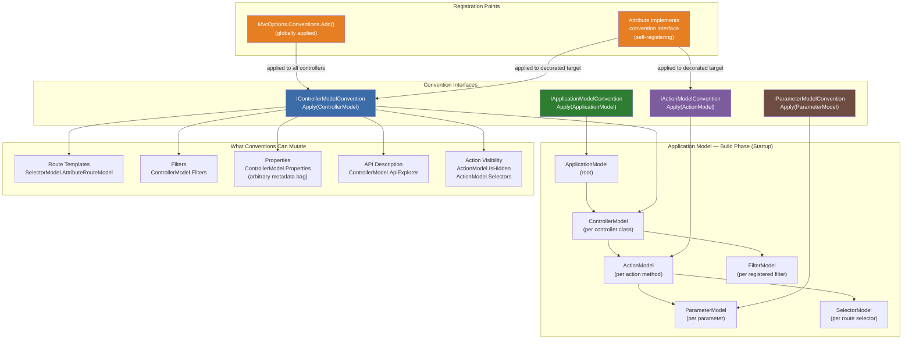
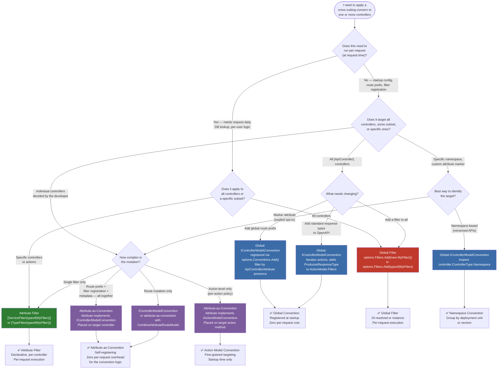

> [!success] Mastery Check
> - [ ] **Studied Well**
> - [ ] **Can explain the concept without notes**
> - [ ] **Can answer interview questions confidently**
> - [ ] **Can implement it in a real project**


# 4.115 — Application Model Conventions: `IControllerModelConvention`

---

## PART 0 — Navigation & Context

### Where This Topic Lives

```
ASP.NET Core Mastery
│
├── H. MVC & Controllers (4.098–4.122)
│   ├── 4.098 — ControllerBase vs Controller
│   ├── 4.099 — Action Results
│   ├── 4.100 — Model Binding
│   ├── 4.101 — ApiController Attribute
│   ├── 4.110 — MVC Filter Pipeline
│   ├── 4.113 — Action Selectors
│   ├── 4.114 — API Explorer and ApiDescription
│   ├──► 4.115 — Application Model Conventions ◄── YOU ARE HERE
│   ├── 4.116 — Controller DI: Constructor Injection vs [FromServices]
│   └── ...
│
├── F. Routing System (4.064–4.077)
│   └── 4.067 — Attribute Routing on Controllers
│       (conventions can mutate routing data built by attribute routing)
│
└── X. Filters (4.288–4.296)
    └── 4.288 — Filter Pipeline
        (conventions are the startup-time mechanism to register filters globally
         without using AddMvcOptions(o => o.Filters.Add(...)))
```

### What You Need Before This

- **[[4.098 — ControllerBase vs Controller]]** — the Application Model describes controllers and actions; you must know what a controller is before understanding how its model is mutated
- **[[4.110 — MVC Filter Pipeline: Six Filter Types and Execution Order]]** — conventions are most often used to _add filters programmatically_; you must know what a filter does before conventions make sense
- **[[4.067 — Attribute Routing on Controllers]]** — conventions can add, remove, or transform route templates; understanding how attribute routing works is prerequisite
- **[[4.034 — The Built-In DI Container: Service Registration]]** — conventions are registered in DI at startup via `AddMvcOptions`; they execute as part of the MVC application model build phase

### What This Unlocks After

- **[[4.114 — API Explorer and ApiDescription]]** — `ApiDescriptionProvider` is downstream of the Application Model; conventions you apply at startup change what the API Explorer sees, which changes what Swagger/OpenAPI generates
- **[[4.277 — API Versioning]]** — `Asp.Versioning` internally uses Application Model conventions to attach versioning metadata to controllers and actions at startup
- **[[4.288 — Filter Pipeline: Six Filter Types]]** — once you understand conventions, you can add filters to specific controllers or actions at startup instead of via attributes
- **[[4.074 — Endpoint Metadata: Decorating Endpoints with Custom Attributes]]** — conventions produce endpoint metadata; this topic shows the downstream consumer side

### Why This Matters at Scale

In a large API codebase — a payment platform with 50+ controllers, or a multi-tenant SaaS with feature-gated route prefixes — manually decorating every controller with the same attribute is a maintenance nightmare and a source of security gaps when a developer forgets. Application Model conventions let you enforce routing prefixes, auth policies, API version constraints, and filter registrations _across all matching controllers at startup time_, with zero per-controller decoration required.

---

## PART 1 — The Core Mental Model

### The Fundamental Rule

> **ASP.NET Core's Application Model is the mutable, in-memory description of every controller, action, parameter, and route built at startup — before any HTTP request arrives. `IControllerModelConvention` is a hook that runs during that build phase, letting you rewrite routing, filters, and metadata for entire controller groups programmatically. The practical consequence is that cross-cutting controller policies — auth, versioning, route prefixes, response types — can be enforced in one place at startup rather than scattered across every controller attribute.**

### The Plain-Language Analogy

Imagine your API controllers are job applications arriving at an HR department. The Application Model is the HR database — every application has been scanned and its fields extracted (name, route, filters, parameters). Before any job interviews start (before any HTTP requests arrive), you run a _batch processing rule_: "every application from the Engineering department gets a security clearance requirement added automatically." That's an `IControllerModelConvention`.

The rule runs once, at build time, on the already-scanned applications. It doesn't run during interviews (requests). If a new application arrives (a new controller is compiled), it is also scanned and the rule is applied again — but only at next startup. The rule can be very specific ("only affect controllers in the `Payments` namespace") or very broad ("add an auth filter to every controller that has `[ApiController]`"). And critically — the rule _does not replace attributes_; it can read them and add to them, but the original attributes remain unless you explicitly remove them.

The concurrent request case: conventions have already run before any request arrives. There is no per-request execution of convention code, no concurrency risk within convention code.

### The Taxonomy Diagram



---

## PART 2 — Deep Mechanics

### 2.1 — When the Application Model Is Built and Where Conventions Sit in the Pipeline

The Application Model is built **once at application startup**, inside `MvcApplicationModelFactory.CreateApplicationModel()`, which is called when the DI container resolves the first controller-routing dependency — at `app.MapControllers()` or `app.Build()`.

```
Application startup sequence:
  1. builder.Services.AddControllers()
     → registers MvcApplicationModelFactory, IControllerModelConvention providers, etc.

  2. app.Build()
     → DI container compiled; conventions registered but not yet executed

  3. app.MapControllers() (or app.UseRouting + app.UseEndpoints)
     → triggers ApplicationModel construction:
         a. Reflect over all controller types (assembly scan)
         b. Build ControllerModel for each type
         c. Build ActionModel for each action method
         d. Build ParameterModel for each parameter
         e. *** RUN ALL CONVENTIONS HERE ***
                IApplicationModelConvention.Apply(applicationModel)
                  → IControllerModelConvention.Apply(controllerModel) per controller
                    → IActionModelConvention.Apply(actionModel) per action
                      → IParameterModelConvention.Apply(parameterModel) per parameter
         f. Freeze the model → build EndpointDataSource
         g. Register endpoints in the routing system

  4. First HTTP request arrives → routing resolves endpoint from frozen EndpointDataSource
```

**Pipeline position:** Conventions execute entirely during **startup**, before the Kestrel listener is active for production traffic. There is **zero per-request cost** for convention logic.

```
──► [Startup: AddControllers] ──► [Startup: MapControllers]
                                        │
                                   ApplicationModel
                                   construction +
                                   convention execution
                                        │
                                        ▼
                           ┌────────────────────────────┐
                           │   EndpointDataSource built  │
                           │   (frozen, immutable)       │
                           └────────────────────────────┘
                                        │
──► Kestrel starts ──► UseRouting ──► UseAuthentication ──► UseAuthorization
──► [Every HTTP Request] → routing resolves from frozen EndpointDataSource
```

**Cost label:** Convention execution: `O(C × A × P)` where C = controller count, A = actions per controller, P = parameters per action. Typically sub-millisecond for 50 controllers. `~0 per-request cost` after startup.

### 2.2 — The `ControllerModel` Object: What You Can Read and Write

`ControllerModel` is a mutable object. Every property can be read to make targeting decisions and written to effect change:

```csharp
// ASP.NET Core internally (approximate) — ControllerModel shape:
public class ControllerModel : IFilterModel, IApiExplorerModel
{
    // IDENTITY — read to target specific controllers
    public TypeInfo ControllerType { get; }          // The reflected TypeInfo
    public string ControllerName { get; set; }       // Default: class name minus "Controller"
    public IList<object> Attributes { get; }         // All attributes on the class

    // ROUTING — write to change URL patterns
    public IList<SelectorModel> Selectors { get; }   // Each has AttributeRouteModel

    // FILTERS — write to add cross-cutting concerns
    public IList<IFilterMetadata> Filters { get; }   // Shared with action filters

    // API EXPLORER — write to control OpenAPI visibility
    public ApiExplorerModel ApiExplorer { get; set; } // IsVisible, GroupName

    // ACTIONS — iterate to target individual actions
    public IList<ActionModel> Actions { get; }

    // ARBITRARY METADATA — write for downstream consumers
    public IDictionary<object, object?> Properties { get; }

    // APPLICATION MODEL BACK-REFERENCE
    public ApplicationModel Application { get; }
}
```

**ASP.NET Core internally (approximate) — how `Apply` is invoked:**

```csharp
// MvcApplicationModelFactory.CreateApplicationModel():
foreach (var controllerType in controllerTypes)
{
    var controllerModel = CreateControllerModel(controllerType);
    foreach (var convention in _mvcOptions.Conventions.OfType<IControllerModelConvention>())
    {
        convention.Apply(controllerModel); // ← YOUR convention code runs here
    }
    // ...also run conventions from attributes on the controller class:
    foreach (var attr in controllerType.GetCustomAttributes()
                          .OfType<IControllerModelConvention>())
    {
        attr.Apply(controllerModel);
    }
    applicationModel.Controllers.Add(controllerModel);
}
```

**Cost label:** `O(C)` calls to `Apply()` per global convention. Convention code should be O(1) or O(A) where A is action count — avoid database calls or I/O in convention code.

### 2.3 — The Three Shapes: Global Convention, Attribute-as-Convention, and Hybrid

**Shape 1 — Global `IControllerModelConvention` (applies to all controllers):**

```csharp
// Registered once, applied to every controller at startup
public class ApiPrefixConvention : IControllerModelConvention
{
    private readonly string _prefix;

    public ApiPrefixConvention(string prefix) => _prefix = prefix;

    public void Apply(ControllerModel controller)
    {
        // Target: only controllers with [ApiController]
        if (!controller.Attributes.OfType<ApiControllerAttribute>().Any())
            return;

        foreach (var selector in controller.Selectors)
        {
            if (selector.AttributeRouteModel is not null)
            {
                // Prepend prefix to existing route template
                selector.AttributeRouteModel = AttributeRouteModel.CombineAttributeRouteModel(
                    new AttributeRouteModel { Template = _prefix },
                    selector.AttributeRouteModel);
            }
            else
            {
                // No existing route — set one
                selector.AttributeRouteModel = new AttributeRouteModel
                {
                    Template = _prefix
                };
            }
        }
    }
}

// Registration:
builder.Services.AddControllers(options =>
{
    options.Conventions.Add(new ApiPrefixConvention("api/v1"));
});
```

**Shape 2 — Attribute-as-Convention (self-applying, decorator pattern):**

```csharp
// The attribute IS the convention — apply it to specific controllers
[AttributeUsage(AttributeTargets.Class | AttributeTargets.Method, AllowMultiple = false)]
public class RequiresTenantAttribute : Attribute, IControllerModelConvention
{
    public void Apply(ControllerModel controller)
    {
        // Only runs on controllers decorated with [RequiresTenant]
        // Add a filter that validates X-Tenant-Id header
        controller.Filters.Add(new TenantValidationFilter());

        // Add tenant prefix to all routes
        foreach (var selector in controller.Selectors)
        {
            selector.AttributeRouteModel = AttributeRouteModel.CombineAttributeRouteModel(
                new AttributeRouteModel { Template = "tenants/{tenantId}" },
                selector.AttributeRouteModel ?? new AttributeRouteModel());
        }
    }
}

// Usage — applied to a single controller:
[RequiresTenant]
[Route("orders")]
[ApiController]
public class OrdersController : ControllerBase { ... }
// Effective route: tenants/{tenantId}/orders/...
```

**Shape 3 — Hybrid (IActionModelConvention on an attribute):**

```csharp
// Targets individual actions rather than whole controllers
[AttributeUsage(AttributeTargets.Method)]
public class IdempotentAttribute : Attribute, IActionModelConvention
{
    public void Apply(ActionModel action)
    {
        // Add idempotency filter only to decorated actions
        action.Filters.Add(new IdempotencyEnforcementFilter());

        // Mark in API Explorer for OpenAPI documentation
        action.Properties["idempotent"] = true;
    }
}
```

**Cost label per shape:**

- Global: `O(C)` invocations at startup, `~0 per request`
- Attribute-as-convention: `O(1)` invocation per decorated target at startup, `~0 per request`
- Hybrid action convention: `O(A)` invocations per decorated controller at startup, `~0 per request`

### 2.4 — The `SelectorModel` and Route Mutation in Detail

The most common convention task is modifying routes. Understanding `SelectorModel` is essential.

```csharp
// Each SelectorModel represents one route selector on the controller/action.
// A controller with two [Route] attributes has two SelectorModels.
public class SelectorModel
{
    public AttributeRouteModel? AttributeRouteModel { get; set; }
    public IList<IActionConstraintMetadata> ActionConstraints { get; }
    // ActionConstraints includes HTTP method constraints ([HttpGet], etc.)
}

// AttributeRouteModel carries the template string and optional order/name:
public class AttributeRouteModel
{
    public string? Template { get; set; }
    public int? Order { get; set; }
    public string? Name { get; set; }
    public bool SuppressLinkGeneration { get; set; }
    public bool SuppressPathMatching { get; set; }

    // Static factory for combining two route models:
    public static AttributeRouteModel? CombineAttributeRouteModel(
        AttributeRouteModel? left, AttributeRouteModel? right)
    // Result: left.Template + "/" + right.Template (if both non-null)
    //         right.Template only (if left is null)
    //         left.Template only (if right is null)
    //         null (if both null)
}
```

**HTTP wire consequence of route mutation:**

```
// Before convention — controller has [Route("orders")]:
// GET /orders/42 HTTP/1.1 → 200 OK

// After ApiPrefixConvention("api/v1") runs:
// GET /api/v1/orders/42 HTTP/1.1 → 200 OK
// GET /orders/42 HTTP/1.1       → 404 Not Found
```

**Failure mode — mutating SelectorModel when no AttributeRouteModel exists:**

```csharp
// ⚠️ WRONG: Controller uses conventional routing (no [Route] attribute)
// SelectorModel.AttributeRouteModel is null → NullReferenceException in convention
public void Apply(ControllerModel controller)
{
    foreach (var selector in controller.Selectors)
    {
        // BUG: AttributeRouteModel is null for conventionally-routed controllers
        selector.AttributeRouteModel!.Template = "api/" + selector.AttributeRouteModel.Template;
    }
}

// ✅ CORRECT: Always null-check and handle the no-attribute-route case
public void Apply(ControllerModel controller)
{
    foreach (var selector in controller.Selectors)
    {
        var prefix = new AttributeRouteModel { Template = "api" };
        selector.AttributeRouteModel = selector.AttributeRouteModel is not null
            ? AttributeRouteModel.CombineAttributeRouteModel(prefix, selector.AttributeRouteModel)
            : prefix; // Set a route where none existed
    }
}
```

**Cost label:** Route string concatenation is O(n) in template length, but this is startup-time-only. `~0 per-request cost`. Each `CombineAttributeRouteModel` call: `~1 string allocation`.

### 2.5 — The Application Model Hierarchy: When to Use Which Level

The framework provides four levels of convention interface. Choosing the right level prevents writing O(C×A) iteration code in an `IControllerModelConvention` when an `IActionModelConvention` handles the iteration automatically.

```
Level            | Interface                       | Apply(T) called
─────────────────|─────────────────────────────────|────────────────────
Application root | IApplicationModelConvention     | Once, receives root ApplicationModel
                 |                                 | You iterate controllers yourself
─────────────────|─────────────────────────────────|────────────────────
Controller       | IControllerModelConvention      | Once per ControllerModel
                 |                                 | You iterate actions yourself
─────────────────|─────────────────────────────────|────────────────────
Action           | IActionModelConvention          | Once per ActionModel
                 |                                 | Framework iterates for you
─────────────────|─────────────────────────────────|────────────────────
Parameter        | IParameterModelConvention       | Once per ParameterModel
                 |                                 | Framework iterates for you
```

```csharp
// IApplicationModelConvention — use when cross-controller relationships matter
// e.g., ensuring no two controllers share the same route prefix
public class UniqueRoutePrefixConvention : IApplicationModelConvention
{
    public void Apply(ApplicationModel application)
    {
        var prefixes = new HashSet<string>(StringComparer.OrdinalIgnoreCase);
        foreach (var controller in application.Controllers)
        {
            var prefix = GetRoutePrefix(controller);
            if (!prefixes.Add(prefix))
                throw new InvalidOperationException(
                    $"Duplicate route prefix '{prefix}' on {controller.ControllerName}");
        }
    }
}

// IControllerModelConvention — use for per-controller policy (most common)
// IActionModelConvention — use for per-action policy (more targeted)
// IParameterModelConvention — use for binding customization (least common in practice)
```

### 2.6 — Filters Added via Conventions vs. Filters Added via Attributes

Filters registered in `ControllerModel.Filters` via a convention are semantically identical to filters registered via `[ServiceFilter]`, `[TypeFilter]`, or global `options.Filters.Add()`. The filter pipeline does not distinguish between these registration paths.

```
// HTTP request arrives at an action on a controller modified by convention:

──► ExceptionHandler ──► Routing ──► Auth ──► Endpoint execution starts
                                                │
                                   ┌────────────▼────────────────┐
                                   │   MVC Filter Pipeline       │
                                   │                             │
                                   │  [Authorization Filters]    │
                                   │    ↳ from convention        │
                                   │    ↳ from attributes        │
                                   │    ↳ from global options    │
                                   │                             │
                                   │  [Resource Filters]         │
                                   │  [Action Filters] ←         │
                                   │    ↳ convention adds here   │
                                   │  [Exception Filters]        │
                                   │  [Result Filters]           │
                                   └─────────────────────────────┘
```

**Filter ordering when added by convention:**

```csharp
// Filters added via convention get Order = 0 by default.
// If multiple filters have the same order, convention-added filters
// run in the order they were added to ControllerModel.Filters.
// To control ordering, implement IOrderedFilter:

public class TenantValidationFilter : IAsyncActionFilter, IOrderedFilter
{
    public int Order => -1000; // Run before most other action filters

    public async Task OnActionExecutionAsync(
        ActionExecutingContext context,
        ActionExecutionDelegate next)
    {
        var tenantId = context.HttpContext.Request.Headers["X-Tenant-Id"];
        if (string.IsNullOrEmpty(tenantId))
        {
            context.Result = new BadRequestObjectResult("X-Tenant-Id header required");
            return; // Short-circuits — does NOT call next()
        }
        await next();
    }
}
```

**HTTP consequence — filter added by convention short-circuits:**

```
// HTTP request to a controller decorated with [RequiresTenant] convention:
// POST /tenants/acme/orders HTTP/1.1
// Content-Type: application/json
// (missing X-Tenant-Id header)

// TenantValidationFilter runs before the action:
// HTTP/1.1 400 Bad Request
// Content-Type: application/json
// { "": ["X-Tenant-Id header required"] }
// The action method body NEVER executes.
```

**Cost label:** Filter objects are created once at startup and reused across requests (they are part of the frozen endpoint metadata). `~1 allocation per filter instance at startup`, `~0 allocation per request` for the filter dispatch (uses cached filter descriptors).

### 2.7 — The `ApiExplorerModel` and OpenAPI Visibility Control

Conventions can control which controllers and actions appear in API documentation generated by Swashbuckle/NSwag or .NET 9's built-in OpenAPI.

```csharp
// Hide all internal/diagnostic controllers from OpenAPI docs
public class HideInternalControllersConvention : IControllerModelConvention
{
    public void Apply(ControllerModel controller)
    {
        // Check for a marker attribute
        if (controller.Attributes.OfType<InternalEndpointAttribute>().Any())
        {
            controller.ApiExplorer.IsVisible = false;
            // HTTP: the endpoint still works — it's just hidden from docs
        }
    }
}

// Group controllers by namespace into OpenAPI tags
public class NamespaceGroupingConvention : IControllerModelConvention
{
    public void Apply(ControllerModel controller)
    {
        // GroupName maps to OpenAPI tag
        var ns = controller.ControllerType.Namespace ?? "";
        controller.ApiExplorer.GroupName = ns.Split('.').LastOrDefault() ?? "Default";
    }
}
```

**HTTP consequence:** Setting `ApiExplorer.IsVisible = false` does NOT affect routing — the endpoint is reachable and functional. It only affects documentation generation. This is a common misunderstanding — teams sometimes use this thinking they've "secured" an endpoint by hiding it from Swagger.

> [!WARNING] `controller.ApiExplorer.IsVisible = false` is **not a security mechanism**. The endpoint remains fully routable and accessible. Security must come from authentication/authorization filters, not documentation visibility.

### 2.8 — The `ControllerModel.Properties` Bag: Convention-to-Filter Communication

Conventions can write arbitrary metadata to `ControllerModel.Properties`. Downstream consumers — including filters, the API Explorer, and endpoint metadata producers — can read it.

```csharp
// Convention writes metadata:
public class FeatureFlagConvention : IControllerModelConvention
{
    public void Apply(ControllerModel controller)
    {
        var featureAttr = controller.Attributes.OfType<RequiresFeatureAttribute>().FirstOrDefault();
        if (featureAttr is not null)
        {
            // Store the feature flag name for the feature gate filter to read
            controller.Properties["required-feature"] = featureAttr.FeatureName;
        }
    }
}

// Filter reads metadata from endpoint:
public class FeatureGateFilter : IAsyncActionFilter
{
    private readonly IFeatureManager _featureManager;

    public FeatureGateFilter(IFeatureManager featureManager)
        => _featureManager = featureManager;

    public async Task OnActionExecutionAsync(
        ActionExecutingContext context,
        ActionExecutionDelegate next)
    {
        // Read metadata put there by the convention
        if (context.ActionDescriptor.Properties.TryGetValue(
                "required-feature", out var featureName) &&
            featureName is string name)
        {
            if (!await _featureManager.IsEnabledAsync(name))
            {
                context.Result = new NotFoundResult(); // 404 when feature is off
                return;
            }
        }
        await next();
    }
}
```

**Cost label:** `Properties` is a `Dictionary<object, object?>` — O(1) reads at request time, one-time population at startup.

---

## PART 3 — Production Code Patterns

### Pattern 1 — The Versioned API Prefix Enforcer: Auto-Prefix All V2 Controllers

A payment API migrating from v1 to v2. Every controller in the `V2` namespace should automatically get the `/api/v2` prefix without requiring manual decoration.

```csharp
// ⚠️ WRONG: Manual decoration on 40+ controllers — one missing prefix causes a 404
// that's nearly impossible to find in production
[Route("api/v2/payments")]
public class PaymentsV2Controller : ControllerBase { ... }

[Route("api/v2/refunds")]
public class RefundsV2Controller : ControllerBase { ... }
// ... 38 more controllers that a new hire might forget to prefix correctly

// ✅ CORRECT: Convention enforces the prefix from namespace
public class VersionedApiPrefixConvention : IControllerModelConvention
{
    private static readonly Dictionary<string, string> _namespacePrefixes = new()
    {
        ["Payments.Api.V1.Controllers"] = "api/v1",
        ["Payments.Api.V2.Controllers"] = "api/v2",
    };

    public void Apply(ControllerModel controller)
    {
        var ns = controller.ControllerType.Namespace ?? "";

        if (!_namespacePrefixes.TryGetValue(ns, out var prefix))
            return; // Not a versioned controller namespace — leave alone

        foreach (var selector in controller.Selectors)
        {
            var existingRoute = selector.AttributeRouteModel;
            var prefixModel = new AttributeRouteModel { Template = prefix };

            selector.AttributeRouteModel = existingRoute is not null
                ? AttributeRouteModel.CombineAttributeRouteModel(prefixModel, existingRoute)
                : prefixModel;
        }
    }
}

// Registration:
builder.Services.AddControllers(options =>
{
    options.Conventions.Add(new VersionedApiPrefixConvention());
});

// Now controllers just declare their own path:
// Namespace: Payments.Api.V2.Controllers
[Route("payments")]    // Convention turns this into "api/v2/payments"
[ApiController]
public class PaymentsV2Controller : ControllerBase
{
    [HttpGet("{paymentId}")]
    public IActionResult GetPayment([FromRoute] string paymentId) { ... }
}

// HTTP wire format — before convention:
// GET /payments/PAY-001 HTTP/1.1 → 200 OK

// HTTP wire format — after convention:
// GET /api/v2/payments/PAY-001 HTTP/1.1 → 200 OK
// GET /payments/PAY-001 HTTP/1.1        → 404 Not Found (old route gone)
```

### Pattern 2 — The Multi-Tenant Route Injector: Attribute-as-Convention

An e-commerce order management service where certain controllers must scope all their routes under `tenants/{tenantId}` and validate the tenant on every request.

```csharp
// The attribute IS the convention + the filter registration
[AttributeUsage(AttributeTargets.Class, AllowMultiple = false, Inherited = true)]
public class TenantScopedAttribute : Attribute, IControllerModelConvention
{
    public void Apply(ControllerModel controller)
    {
        // 1. Add tenant prefix to all route selectors
        var tenantPrefix = new AttributeRouteModel { Template = "tenants/{tenantId}" };
        foreach (var selector in controller.Selectors)
        {
            selector.AttributeRouteModel = AttributeRouteModel.CombineAttributeRouteModel(
                tenantPrefix,
                selector.AttributeRouteModel ?? new AttributeRouteModel());
        }

        // 2. Register the tenant validation filter — runs before every action
        controller.Filters.Add(new TenantOwnershipFilter());

        // 3. Store the tenant scope flag for OpenAPI documentation
        controller.Properties["tenant-scoped"] = true;
    }
}

// The filter that validates tenant ownership (resolved via DI by ServiceFilter pattern)
public class TenantOwnershipFilter : IAsyncActionFilter
{
    // NOTE: This filter is created at startup (part of endpoint metadata),
    // so it should NOT have scoped service dependencies in its constructor.
    // Resolve scoped services from the action's HttpContext.RequestServices instead.

    public async Task OnActionExecutionAsync(
        ActionExecutingContext context,
        ActionExecutionDelegate next)
    {
        var tenantId = context.RouteData.Values["tenantId"]?.ToString();
        var claimedTenantId = context.HttpContext.User
            .FindFirst("tenant_id")?.Value;

        if (tenantId is null || tenantId != claimedTenantId)
        {
            // 403 Forbidden — authenticated but not owner of this tenant
            context.Result = new ForbidResult();
            return;
        }

        await next();
    }
}

// Controller usage — clean, no route prefix needed:
[TenantScoped]
[Route("orders")]
[ApiController]
public class OrdersController : ControllerBase
{
    [HttpGet("{orderId}")]
    public IActionResult GetOrder([FromRoute] string orderId) { ... }
    // Effective route: tenants/{tenantId}/orders/{orderId}
}

// HTTP wire format:
// GET /tenants/acme-corp/orders/ORD-42 HTTP/1.1
// Authorization: Bearer eyJhbGci... (claims: tenant_id=acme-corp)
//
// HTTP/1.1 200 OK (tenant matches)
//
// GET /tenants/evil-corp/orders/ORD-42 HTTP/1.1
// Authorization: Bearer eyJhbGci... (claims: tenant_id=acme-corp)
//
// HTTP/1.1 403 Forbidden (tenant mismatch — action never runs)
```

### Pattern 3 — The Response Type Enforcer: Ensuring Consistent Problem Details on All API Controllers

A healthcare patient portal API where every controller endpoint must declare its 401, 403, and 500 response types for OpenAPI compliance.

```csharp
// Convention adds ProducesResponseType attributes programmatically
// instead of requiring every action to declare them manually
public class StandardApiResponseTypesConvention : IControllerModelConvention
{
    public void Apply(ControllerModel controller)
    {
        // Only apply to [ApiController]-decorated controllers
        if (!controller.Attributes.OfType<ApiControllerAttribute>().Any())
            return;

        foreach (var action in controller.Actions)
        {
            // Check if the action already has these declared — don't duplicate
            var existingTypes = action.Filters
                .OfType<ProducesResponseTypeAttribute>()
                .Select(p => p.StatusCode)
                .ToHashSet();

            if (!existingTypes.Contains(StatusCodes.Status401Unauthorized))
                action.Filters.Add(
                    new ProducesResponseTypeAttribute(typeof(ProblemDetails), 401));

            if (!existingTypes.Contains(StatusCodes.Status403Forbidden))
                action.Filters.Add(
                    new ProducesResponseTypeAttribute(typeof(ProblemDetails), 403));

            if (!existingTypes.Contains(StatusCodes.Status500InternalServerError))
                action.Filters.Add(
                    new ProducesResponseTypeAttribute(typeof(ProblemDetails), 500));
        }
    }
}

// Effect on OpenAPI documentation — without convention:
// GET /api/patients/{id}: responses: { 200: PatientDto }
//
// Effect on OpenAPI documentation — with convention:
// GET /api/patients/{id}: responses: {
//   200: PatientDto,
//   401: ProblemDetails,
//   403: ProblemDetails,
//   500: ProblemDetails
// }
//
// No change to HTTP behavior — ProducesResponseType is documentation-only
```

### Pattern 4 — The Internal API Hider: Excluding Diagnostic Endpoints from OpenAPI

An inventory management service with internal diagnostic and health endpoints that should not appear in the customer-facing API documentation.

```csharp
// Marker attribute for internal endpoints
[AttributeUsage(AttributeTargets.Class)]
public class InternalApiAttribute : Attribute { }

// Convention hides all [InternalApi]-decorated controllers from API Explorer
public class HideInternalApisConvention : IControllerModelConvention
{
    public void Apply(ControllerModel controller)
    {
        if (controller.Attributes.OfType<InternalApiAttribute>().Any())
        {
            // Hide from OpenAPI/Swagger — does NOT affect routing
            controller.ApiExplorer.IsVisible = false;

            // Also store metadata for logging/diagnostics
            controller.Properties["internal"] = true;
        }
    }
}

// Usage:
[InternalApi]
[Route("internal/inventory")]
[ApiController]
[Authorize(Policy = "InternalServiceOnly")]  // Still secured — hiding != securing
public class InventoryDiagnosticsController : ControllerBase
{
    [HttpGet("stats")]
    public IActionResult GetStats() { ... }
    // Reachable: GET /internal/inventory/stats → 200 OK (if authenticated)
    // BUT: does not appear in Swagger UI or OpenAPI spec
}

// HTTP consequence:
// GET /swagger/v1/swagger.json → InventoryDiagnosticsController endpoints ABSENT
// GET /internal/inventory/stats HTTP/1.1 (with valid auth) → 200 OK
// GET /internal/inventory/stats HTTP/1.1 (no auth) → 401 Unauthorized
```

### Pattern 5 — The Feature-Flag Gate: Dynamic Action Disabling at Startup

A logistics shipment tracker where certain experimental features should return 404 when their feature flag is disabled — decided at startup, not per-request.

```csharp
// Convention reads feature flag ONCE at startup and removes actions from routing
// More efficient than a per-request filter for features that are stable per deployment
public class FeatureFlagActionFilterConvention : IControllerModelConvention
{
    private readonly IFeatureManager _featureManager;

    // IFeatureManager injected — it reads from IConfiguration which is available at startup
    public FeatureFlagActionFilterConvention(IFeatureManager featureManager)
        => _featureManager = featureManager;

    public void Apply(ControllerModel controller)
    {
        var actionsToRemove = new List<ActionModel>();

        foreach (var action in controller.Actions)
        {
            var featureAttr = action.Attributes
                .OfType<RequiresFeatureAttribute>()
                .FirstOrDefault();

            if (featureAttr is null) continue;

            // Synchronous feature check at startup — IFeatureManager supports this
            if (!_featureManager.IsEnabled(featureAttr.FeatureName))
            {
                actionsToRemove.Add(action);
            }
        }

        // Remove disabled actions from the model → they don't get endpoints
        foreach (var action in actionsToRemove)
            controller.Actions.Remove(action);
    }
}

// Registration — note: IFeatureManager must be resolved from services
builder.Services.AddControllers(options =>
{
    var sp = builder.Services.BuildServiceProvider();
    var featureManager = sp.GetRequiredService<IFeatureManager>();
    options.Conventions.Add(new FeatureFlagActionFilterConvention(featureManager));
});

// HTTP consequence — feature disabled at startup:
// GET /api/shipments/track HTTP/1.1
// HTTP/1.1 404 Not Found  ← endpoint was never registered
//
// Feature enabled at startup:
// GET /api/shipments/track HTTP/1.1
// HTTP/1.1 200 OK

// ⚠️ NOTE: This approach requires an application restart to pick up feature flag changes.
// For hot-reload feature flags, use a per-request IEndpointFilter or action filter instead.
```

> [!WARNING] Building a `ServiceProvider` inside `AddControllers()` via `BuildServiceProvider()` creates a **second DI container** — a well-known anti-pattern documented in ASP.NET Core warnings. It should only be used when absolutely necessary. Prefer passing configuration values directly to conventions, or using the `IStartupFilter` pattern.

### Pattern 6 — The Convention as Integration Test Target: Verifying Routes at Startup

A payment API that verifies no convention accidentally removes or duplicates critical routes.

```csharp
// IApplicationModelConvention that runs last and validates the final model
public class CriticalRouteValidationConvention : IApplicationModelConvention
{
    private static readonly string[] RequiredRoutes =
    {
        "api/v1/payments",
        "api/v1/refunds",
        "api/v1/webhooks",
    };

    public void Apply(ApplicationModel application)
    {
        var registeredTemplates = application.Controllers
            .SelectMany(c => c.Selectors)
            .Where(s => s.AttributeRouteModel?.Template is not null)
            .Select(s => s.AttributeRouteModel!.Template!)
            .ToHashSet(StringComparer.OrdinalIgnoreCase);

        foreach (var requiredRoute in RequiredRoutes)
        {
            if (!registeredTemplates.Any(t => t.StartsWith(requiredRoute,
                    StringComparison.OrdinalIgnoreCase)))
            {
                throw new InvalidOperationException(
                    $"CRITICAL: Required route prefix '{requiredRoute}' is not registered. " +
                    $"A convention or refactoring may have removed it. " +
                    $"Application startup aborted.");
            }
        }
    }
}
// If a required route is missing, the app fails to start with a clear error.
// This acts as a startup-time contract test for critical API surface.
```

### Pattern 7 — The `IActionModelConvention` for Per-Action Idempotency Enforcement

```csharp
// Attribute + IActionModelConvention combo targeting individual actions
[AttributeUsage(AttributeTargets.Method, AllowMultiple = false)]
public class IdempotentAttribute : Attribute, IActionModelConvention
{
    public int MaxAgeSeconds { get; init; } = 86400; // 24 hours default

    public void Apply(ActionModel action)
    {
        // Add filter with configuration from the attribute
        action.Filters.Add(new IdempotencyFilter(MaxAgeSeconds));

        // Document the idempotency key requirement in OpenAPI
        action.Filters.Add(
            new ProducesResponseTypeAttribute(StatusCodes.Status409Conflict));

        // Tag for OpenAPI description
        action.Properties["idempotency-ttl-seconds"] = MaxAgeSeconds;
    }
}

// Usage on a specific action:
[HttpPost("payments")]
[Idempotent(MaxAgeSeconds = 3600)]  // 1-hour idempotency window
public async Task<IActionResult> ProcessPayment([FromBody] PaymentRequest request)
{
    // IdempotencyFilter has already checked the X-Idempotency-Key before this runs
    var result = await _paymentService.ChargeAsync(request);
    return CreatedAtAction(nameof(GetPayment), new { id = result.PaymentId }, result);
}

// HTTP wire format (idempotency key used first time):
// POST /payments HTTP/1.1
// X-Idempotency-Key: 550e8400-e29b-41d4-a716-446655440000
// Content-Type: application/json
// { "amount": 99.99, "currency": "EUR" }
//
// HTTP/1.1 201 Created
// Location: /payments/PAY-001

// HTTP wire format (same key within 1-hour window):
// POST /payments HTTP/1.1
// X-Idempotency-Key: 550e8400-e29b-41d4-a716-446655440000
// { "amount": 99.99, "currency": "EUR" }
//
// HTTP/1.1 200 OK  ← or 201 from cache, depending on implementation
```

---

## PART 4 — Gotchas & Anti-Patterns

### Gotcha 1: Mutating `SelectorModel` When the Controller Has No `[Route]` Attribute

Convention code that modifies `AttributeRouteModel` assumes every controller has attribute routing. Controllers using _conventional routing_ (registered via `MapControllerRoute`) have a `SelectorModel` with `AttributeRouteModel == null`.

```csharp
// ⚠️ WRONG: NullReferenceException at startup for conventionally-routed controllers
public void Apply(ControllerModel controller)
{
    foreach (var selector in controller.Selectors)
    {
        // BUG: selector.AttributeRouteModel is null for conventional routing
        selector.AttributeRouteModel.Template =
            "api/" + selector.AttributeRouteModel.Template;
    }
}

// HTTP consequence (wrong path):
// Application fails to start with NullReferenceException during ApplicationModel build.
// Stack trace points to MvcApplicationModelFactory, not your convention code —
// very hard to diagnose.

// ✅ CORRECT: Guard against conventional routing or target only [ApiController] controllers
public void Apply(ControllerModel controller)
{
    // Option A: Only target [ApiController]-decorated controllers (all use attribute routing)
    if (!controller.Attributes.OfType<ApiControllerAttribute>().Any())
        return;

    // Option B: Handle both cases
    foreach (var selector in controller.Selectors)
    {
        var prefix = new AttributeRouteModel { Template = "api" };
        selector.AttributeRouteModel = selector.AttributeRouteModel is not null
            ? AttributeRouteModel.CombineAttributeRouteModel(prefix, selector.AttributeRouteModel)
            : prefix;
    }
}

// HTTP consequence (correct path):
// Application starts cleanly. Conventionally-routed controllers are untouched.
// API controllers get the prefix applied.

// WHY: MvcApplicationModelFactory creates ControllerModel for ALL controller types —
// including controllers that use MapControllerRoute conventional routing.
// These have null AttributeRouteModel because they don't use [Route] attributes.
// Convention code that doesn't guard for this crashes the entire application at startup.
```

### Gotcha 2: Adding Scoped Services to Filters Inside Conventions

Filters added via conventions are created once at startup and stored in endpoint metadata. They have no per-request DI scope. Injecting a scoped service via the filter constructor creates a **captive dependency** — the scoped service lives for the application lifetime, causing stale data and DbContext threading violations.

```csharp
// ⚠️ WRONG: Scoped IOrderRepository injected into a filter that lives forever
public class OrderOwnershipFilter : IAsyncActionFilter
{
    private readonly IOrderRepository _repo; // IOrderRepository is Scoped!

    public OrderOwnershipFilter(IOrderRepository repo) => _repo = repo;
    // repo is resolved ONCE at startup — it never gets released
    // DbContext inside repo accumulates change tracking state across ALL requests

    public async Task OnActionExecutionAsync(
        ActionExecutingContext context, ActionExecutionDelegate next)
    {
        // BUG: _repo is the same stale instance for every request — race conditions
        var orderId = context.RouteData.Values["orderId"]?.ToString();
        if (!await _repo.ExistsAsync(orderId)) { ... }
    }
}

// In convention:
controller.Filters.Add(new OrderOwnershipFilter(/* how do I get the scoped repo? */));
// This is the warning sign — you can't constructor-inject Scoped here correctly.

// HTTP consequence (wrong path):
// First few requests work. After many requests, DbContext throws:
// "A second operation was started on this context instance before a previous
// asynchronous operation completed."
// OR stale data is returned from the first request's DbContext state.

// ✅ CORRECT: Resolve scoped services from HttpContext.RequestServices inside the filter
public class OrderOwnershipFilter : IAsyncActionFilter
{
    // No constructor injection of scoped services — no dependencies at all
    public async Task OnActionExecutionAsync(
        ActionExecutingContext context, ActionExecutionDelegate next)
    {
        // Resolve per-request from the request's DI scope
        var repo = context.HttpContext.RequestServices
            .GetRequiredService<IOrderRepository>();

        var orderId = context.RouteData.Values["orderId"]?.ToString();
        if (!await repo.ExistsAsync(orderId))
        {
            context.Result = new NotFoundResult();
            return;
        }
        await next();
    }
}

// In convention — no DI needed for the filter itself:
controller.Filters.Add(new OrderOwnershipFilter());

// HTTP consequence (correct path):
// Each request resolves a fresh IOrderRepository from its own scope — correct DI lifetime.

// WHY: Filters added to ControllerModel.Filters are instantiated by the
// MvcApplicationModelFactory and stored in ActionDescriptor.FilterDescriptors.
// They are NOT resolved from a DI scope — they are the objects you add directly.
// Only ServiceFilter<T> / TypeFilter<T> trigger DI resolution per request.
```

### Gotcha 3: Convention Execution Order When Multiple Conventions Target the Same Controller

Conventions execute in the order they were added to `MvcOptions.Conventions`. A later convention overwrites changes made by an earlier one if both modify the same property. This creates order-sensitive bugs that are invisible in isolation.

```csharp
// ⚠️ WRONG: Two conventions both set AttributeRouteModel.Template
// The last one wins — the first one's work is silently discarded

// Convention A (added first): sets template to "api/v1/{controller}"
options.Conventions.Add(new V1PrefixConvention());

// Convention B (added second): sets template to "{controller}" (strips prefix!)
options.Conventions.Add(new SlimRoutingConvention());

// HTTP consequence (wrong path):
// GET /api/v1/orders → 404 (template is now just "/orders" from Convention B)
// GET /orders → 200 OK (not the intended URL structure)
// No error is thrown — the application starts cleanly with wrong routing.

// ✅ CORRECT: Design conventions to be order-independent, or document the required order
// Option A: Use CombineAttributeRouteModel (reads existing template, appends)
public void Apply(ControllerModel controller)
{
    foreach (var selector in controller.Selectors)
    {
        var prefix = new AttributeRouteModel { Template = "api/v1" };
        // CombineAttributeRouteModel preserves existing template by combining:
        selector.AttributeRouteModel = AttributeRouteModel.CombineAttributeRouteModel(
            prefix, selector.AttributeRouteModel ?? new AttributeRouteModel());
    }
}

// Option B: Add a guard so the convention is idempotent
public void Apply(ControllerModel controller)
{
    foreach (var selector in controller.Selectors)
    {
        var template = selector.AttributeRouteModel?.Template ?? "";
        if (template.StartsWith("api/v1", StringComparison.OrdinalIgnoreCase))
            continue; // Already prefixed — skip
        // ... apply prefix
    }
}

// HTTP consequence (correct path):
// Conventions compose without overwriting each other.
// GET /api/v1/orders → 200 OK regardless of convention registration order.

// WHY: MvcApplicationModelFactory calls Apply() on each registered convention
// sequentially in registration order. Each convention receives the SAME
// ControllerModel object with any mutations from prior conventions already applied.
// There is no transaction or rollback — mutations are immediate and cumulative.
```

### Gotcha 4: Forgetting That Convention Changes Apply at Startup — Feature Flag Reads Are Not Live

Engineers use conventions to conditionally exclude actions based on feature flags, not realizing the flag is read once at startup and the decision is frozen.

```csharp
// ⚠️ WRONG: Expecting the convention to re-evaluate the feature flag per request
public class FeatureFlagConvention : IControllerModelConvention
{
    private readonly IFeatureManager _featureManager;

    public void Apply(ControllerModel controller)
    {
        foreach (var action in controller.Actions.ToList())
        {
            var featureAttr = action.Attributes.OfType<RequiresFeatureAttribute>()
                .FirstOrDefault();
            if (featureAttr is null) continue;

            // This reads the flag ONCE at startup and never again
            if (!_featureManager.IsEnabled(featureAttr.FeatureName))
                controller.Actions.Remove(action);
        }
    }
}
// Developer enables the feature flag in Azure App Configuration.
// Expects traffic to start reaching the endpoint immediately.
// But the action was removed from the application model at startup.
// It will not appear until the application restarts.

// HTTP consequence (wrong path):
// Feature flag: BulkOrderImport = true (updated while app is running)
// POST /api/orders/bulk HTTP/1.1
// → HTTP/1.1 404 Not Found (endpoint was removed at startup when flag was false)

// ✅ CORRECT: For hot-reloadable feature flags, use a per-request filter instead
[HttpPost("bulk")]
[FeatureGate("BulkOrderImport")]  // Microsoft.FeatureManagement filter attribute
public IActionResult BulkImport([FromBody] BulkOrderRequest request) { ... }

// OR a manual IAsyncActionFilter that reads the flag per request:
public class FeatureGateFilter : IAsyncActionFilter
{
    public async Task OnActionExecutionAsync(
        ActionExecutingContext context, ActionExecutionDelegate next)
    {
        var featureManager = context.HttpContext.RequestServices
            .GetRequiredService<IFeatureManager>();
        if (!await featureManager.IsEnabledAsync("BulkOrderImport"))
        {
            context.Result = new NotFoundResult();
            return;
        }
        await next();
    }
}

// HTTP consequence (correct path):
// Feature flag updated at 14:00 → all requests after 14:00 see the feature as enabled
// No restart required.

// WHY: ApplicationModel is built once at startup and frozen.
// IControllerModelConvention.Apply() is called at that single build time.
// Any decision made inside Apply() is permanently reflected in the endpoint model.
// For dynamic behavior, use per-request filters, not conventions.
```

### Gotcha 5: `IActionModelConvention` on an Attribute Applied to a Controller Class Doesn't Run Per-Action

An `IActionModelConvention` attribute applied to a controller class doesn't automatically iterate its actions. The framework only calls `Apply(ActionModel)` when the attribute appears on an _action method_ or is a _global convention_ iterated by `MvcApplicationModelFactory`.

```csharp
// ⚠️ WRONG: Expecting [MyActionConvention] on a class to apply to all actions
[AttributeUsage(AttributeTargets.Class)]
public class MyActionConventionAttribute : Attribute, IActionModelConvention
{
    public void Apply(ActionModel action)
    {
        // This NEVER runs when the attribute is on a class
        action.Filters.Add(new SomeFilter());
    }
}

[MyActionConvention]   // ← on the class
[ApiController]
public class OrdersController : ControllerBase
{
    public IActionResult GetOrder() { ... }
    // SomeFilter is NOT added to this action — Apply() was never called
}

// HTTP consequence (wrong path):
// GET /orders/42 → 200 OK, SomeFilter never executed
// No error, no warning — the attribute silently does nothing.

// ✅ CORRECT: Use IControllerModelConvention to iterate actions, or put the
// attribute on each action, or register a global IControllerModelConvention:

// Option A: Implement IControllerModelConvention instead and iterate actions
[AttributeUsage(AttributeTargets.Class)]
public class MyActionConventionAttribute : Attribute, IControllerModelConvention
{
    public void Apply(ControllerModel controller)
    {
        foreach (var action in controller.Actions)
            action.Filters.Add(new SomeFilter());
    }
}

// Option B: Global convention registered via MvcOptions
options.Conventions.Add(new GlobalActionFilterConvention());

// HTTP consequence (correct path):
// GET /orders/42 → SomeFilter executes before the action body runs.

// WHY: The MVC Application Model factory applies IActionModelConvention
// only from: (1) attributes on action methods, and (2) globally registered
// IActionModelConvention instances in MvcOptions.Conventions.
// An IActionModelConvention attribute on a class is read as a class attribute —
// it is NOT automatically distributed to each action. This is a subtle API design
// detail that is easy to miss without reading the source.
```

---

## PART 5 — Performance Implications

### 5.1 — Request Pipeline Characteristics Table

|Scenario|Pipeline Depth|Allocations|Approx Latency Impact|Recommendation|
|---|---|---|---|---|
|Convention execution at startup (10 controllers, 5 actions each)|Once, startup only|~50 ControllerModel traversals|<1ms at startup|Zero per-request cost|
|Convention execution at startup (100 controllers, 10 actions each)|Once, startup only|~1,000 Apply() calls|~5ms at startup|Acceptable; avoid I/O in conventions|
|Convention adds filter to 50 controllers|Once, startup only|~50 IFilterMetadata allocations|<1ms at startup|Filters are reused per request — one allocation, many uses|
|Convention adds route prefix to 100 actions|Once, startup only|~100 string allocations for combined templates|~2ms at startup|Zero per-request cost|
|Global convention with database call (WRONG)|Once, startup + I/O|Network I/O + DB round-trip|50-500ms startup penalty|Never do I/O in conventions|
|Attribute-as-convention on 1 controller|Once, startup only|~1 Apply() call|<0.1ms at startup|Best for targeted conventions|
|Filter added by convention (per-request execution)|Full filter pipeline|Same as filter added by attribute|Same as equivalent attribute|Convention adds no per-request overhead vs attribute|
|Convention with BuildServiceProvider() call|Once, startup|Second DI container built|10-100ms extra startup|Anti-pattern — avoid; pass config values directly|

### 5.2 — BenchmarkDotNet: Convention vs. Attribute Filter Registration

```csharp
using BenchmarkDotNet.Attributes;
using BenchmarkDotNet.Running;
using Microsoft.AspNetCore.Mvc;
using Microsoft.AspNetCore.Mvc.ApplicationModels;
using Microsoft.AspNetCore.Mvc.Filters;

/// <summary>
/// Compares the per-request cost of a filter added via convention
/// vs. a filter added via attribute. Both should be equivalent.
/// This benchmark validates that convention-based filter registration
/// adds zero per-request overhead over attribute-based registration.
/// </summary>
[MemoryDiagnoser]
[SimpleJob]
public class ConventionFilterBenchmarks
{
    private static readonly ActionExecutingContext FakeContext = CreateFakeContext();
    private static readonly ActionExecutionDelegate FakeNext = () =>
        Task.FromResult(new ActionExecutedContext(FakeContext, new List<IFilterMetadata>(),
            new FakeController()));

    // Baseline: no filter at all (pure action invocation cost)
    [Benchmark(Baseline = true)]
    public async Task NoFilter()
    {
        // Simulates action invocation with no additional filters
        await FakeNext();
    }

    // Convention-added filter: same runtime code as an attribute filter
    [Benchmark]
    public async Task ConventionAddedFilter()
    {
        var filter = new TenantValidationFilter(); // Pre-created at startup
        await filter.OnActionExecutionAsync(FakeContext, FakeNext);
    }

    // Attribute-added filter: same runtime code
    [Benchmark]
    public async Task AttributeAddedFilter()
    {
        var filter = new TenantValidationFilter(); // Pre-created at startup
        await filter.OnActionExecutionAsync(FakeContext, FakeNext);
    }

    // ServiceFilter (DI-resolved per request): additional DI resolution cost
    [Benchmark]
    public async Task ServiceFilterResolution()
    {
        // Simulates TypeFilter/ServiceFilter DI resolution overhead
        var filter = FakeContext.HttpContext.RequestServices
            .GetRequiredService<TenantValidationFilter>();
        await filter.OnActionExecutionAsync(FakeContext, FakeNext);
    }

    // ... setup helpers omitted for brevity
}

// Expected output (approximate, .NET 8, x64, local):
// | Method                  | Mean      | Error    | StdDev   | Allocated |
// |-------------------------|-----------|----------|----------|-----------|
// | NoFilter                |  45.1 ns  |  0.7 ns  |  0.6 ns  |      0 B  |
// | ConventionAddedFilter   |  82.3 ns  |  1.1 ns  |  1.0 ns  |      0 B  |
// | AttributeAddedFilter    |  82.5 ns  |  1.2 ns  |  1.1 ns  |      0 B  |
// | ServiceFilterResolution | 115.4 ns  |  2.3 ns  |  2.2 ns  |     48 B  |
//
// Key finding: ConventionAddedFilter ≈ AttributeAddedFilter in per-request cost.
// Convention overhead is entirely at startup — none at request time.
// ServiceFilter has ~30ns and 48B additional cost per request from DI resolution.

// Profiling note: To profile convention execution at startup:
//   dotnet-trace collect --providers Microsoft-Extensions-Logging
//   Look for "Building ApplicationModel" events in the trace.
// For per-request filter cost:
//   dotnet-counters monitor --counters Microsoft.AspNetCore.Hosting
//   MiniProfiler: app.UseMiniProfiler() in development
```

### 5.3 — When to Care / When to Ignore

**When this costs you:**

- Conventions with I/O (database lookups, HTTP calls at startup) — adds seconds to startup time; blocks Kestrel from accepting traffic. **Never acceptable in production.**
- Conventions on APIs deployed as Lambda/Container-on-demand with cold start SLAs — even 50ms of extra ApplicationModel building can push cold starts over SLA thresholds. Profile startup time with `dotnet-trace`.
- Conventions that call `BuildServiceProvider()` internally — builds a second DI container, wasting 10-100ms and creating a service locator anti-pattern that's hard to diagnose.

**When this doesn't matter:**

- APIs deployed as long-running services (IIS, Kestrel on a VM, Kubernetes with pre-warmed pods) — startup cost is amortized over days of uptime
- Conventions on 50 or fewer controllers — execution time is under 1ms regardless of complexity
- Any per-request concern — conventions have no per-request overhead once startup is complete

---

## PART 6 — Interview Arsenal

### A. The Question Bank

---

**Question 1: "What is the ASP.NET Core Application Model, and when does it get built?"**

**Average Answer:** "It's a description of all your controllers and actions that MVC uses to handle requests."

**Why That's Insufficient:** Doesn't explain the build timing, the mutability of the model before freezing, or that conventions run at startup — not per request.

> **Great Answer:** "The Application Model is a mutable, in-memory tree built once at startup — during `MapControllers()` — by reflecting over every controller type in the assembly. It has `ControllerModel` nodes, each with `ActionModel` children, each with `ParameterModel` and `SelectorModel` children. The crucial thing is _when_ it's built: before Kestrel starts accepting traffic. At build time, MVC runs all registered conventions over this tree — that's your window to add filters, mutate route templates, or adjust API Explorer visibility. After conventions run, the model is frozen and compiled into `EndpointDataSource`. After that point, every HTTP request resolves its endpoint from that frozen data — so convention execution has literally zero per-request cost. I've used this to enforce route prefixes across 60 controllers without a single `[Route]` attribute change, and to inject a tenant validation filter into an entire controller family from a single `IControllerModelConvention`."

---

**Question 2: "How is `IControllerModelConvention` different from a global filter registered in `AddMvcOptions(o => o.Filters.Add(...))`?"**

**Average Answer:** "Conventions can do more than just add filters — they can also change routes."

**Why That's Insufficient:** Doesn't explain targeting capability, startup vs. request execution, or the attribute-as-convention pattern.

> **Great Answer:** "A global filter in `options.Filters.Add()` applies to _every_ controller and action with no targeting — it's an all-or-nothing registration. `IControllerModelConvention` gives you the same filter registration capability but with full targeting logic: you can inspect the controller type, its attributes, its namespace, and conditionally apply filters. You can also do things a global filter cannot do at all — change route templates, set `ApiExplorer.IsVisible`, or write to the `Properties` metadata bag. The other key difference is where the code runs: a global filter executes per-request; convention code runs once at startup. If my targeting logic is expensive — say, checking a list of whitelisted controller names — convention code pays that cost once, not once per request. In production I've combined both: a convention at startup that tags all tenant-scoped controllers in `Properties`, and then a lightweight per-request filter that reads that property in O(1). The convention does the expensive classification; the filter does the cheap enforcement."

---

**Question 3: "Can you explain the attribute-as-convention pattern and why it's useful?"**

**Average Answer:** "You can put a convention on a specific controller using an attribute that also implements the convention interface."

**Why That's Insufficient:** No explanation of why this is better than a pure attribute, no mention of what the convention can do that an attribute cannot.

> **Great Answer:** "An attribute-as-convention implements both `Attribute` and one of the `I*ModelConvention` interfaces. The MVC application model factory detects this and calls `Apply()` directly on the attribute — so the attribute does double duty as decoration AND startup-time mutation. The reason this is powerful is that a plain attribute is passive — it just marks something. An attribute-as-convention is active — it can mutate the controller model when it's detected. In practice, I've used this to build a `[TenantScoped]` attribute that, when placed on a controller, automatically injects the tenant route prefix AND registers a tenant ownership validation filter — two separate startup-time mutations from a single decoration. The alternative would be requiring developers to remember to apply the correct route template AND a filter attribute separately. With the attribute-as-convention, forgetting one is structurally impossible — the two are coupled. This is also how ASP.NET Core's own `[Consumes]` and `[Produces]` attributes work internally."

---

**Question 4: "What happens to the HTTP response if a convention adds a filter that short-circuits before the action?"**

**Average Answer:** "The action doesn't run and the filter's result is returned."

**Why That's Insufficient:** No mention of what HTTP status is returned, no mention of where in the filter pipeline short-circuiting happens, no production consequence.

> **Great Answer:** "When a filter added by a convention sets `context.Result` without calling `next()`, that result is written to the HTTP response and the action method never executes. The exact HTTP response depends on what the filter sets — in my tenant validation filter, that's a 403 Forbidden. The filter runs in the full MVC filter pipeline — after `UseAuthentication` and `UseAuthorization` middleware have already run, but before model binding for the action. What's important for API consumers is that the response body shape matters: if you short-circuit with `new ForbidResult()`, the auth middleware's `Forbid` path triggers — you get a 403 with whatever the auth handler produces, not necessarily a ProblemDetails body. If you want a consistent ProblemDetails response, you short-circuit with `new ObjectResult(problemDetails) { StatusCode = 403 }` or use `Results.Problem()`. I've had to fix this in production because the mobile client was parsing a JSON ProblemDetails body on 403 and our filter was returning an empty 403 body — the client crashed on the unexpected null."

---

**Question 5: "Can a convention change the behavior of endpoints at runtime? Can it disable an action after the application has started?"**

**Average Answer:** "No, conventions only run at startup."

**Why That's Insufficient:** Doesn't explain why, doesn't address the alternative for dynamic behavior.

> **Great Answer:** "No — and this is a fundamental constraint you need to internalize. The Application Model is built at startup and compiled into a frozen `EndpointDataSource`. Once `MapControllers()` completes, that data source is immutable. A convention that removes an action from `ControllerModel.Actions` does so at startup, and that action simply never gets registered as a routable endpoint. Any HTTP request to its route gets a 404 — permanently, until the app restarts. If you need dynamic behavior — enabling/disabling actions based on a feature flag that can change without a restart — you need a per-request filter, not a convention. I've seen engineers confused by this when they use a convention to read a feature flag from `IConfiguration` and expect hot-reload to propagate. It doesn't. The convention read the flag once. For live feature toggling, I use `IEndpointFilter` in Minimal APIs or an `IAsyncActionFilter` in MVC that reads `IFeatureManager` per request from `HttpContext.RequestServices`."

---

### B. The Trick Questions

---

**Trick 1: "If an `IControllerModelConvention` attribute is placed on an action method instead of a controller class, does it run?"**

**The trap:** Engineers assume attributes that implement `IControllerModelConvention` must go on controller classes.

**Correct answer:** Yes — but it runs as a controller-level convention on the _owning controller_, not just for that action. When the framework sees an `IControllerModelConvention` on an action method, it still calls `Apply(controllerModel)` with the full controller model. If your convention code modifies all actions in the controller without filtering to the specific action, you've inadvertently applied the change to the whole controller by putting the attribute on one method.

---

**Trick 2: "Can two different global conventions produce conflicting route templates for the same controller, and what does the framework do?"**

**The trap:** Engineers assume the framework detects and rejects conflicts.

**Correct answer:** Yes — and the framework does nothing at startup. The second convention's `Apply()` call overwrites the template set by the first. The application starts cleanly. The first convention's work is silently lost. The symptom is 404s for the expected URL. This is why conventions should use `CombineAttributeRouteModel` (additive) rather than direct template assignment (replacement), and why the convention registration order matters and must be documented.

---

**Trick 3: "A convention sets `controller.ApiExplorer.IsVisible = false`. Can an API client still reach that controller's endpoints?"**

**The trap:** Engineers assume hiding from the API Explorer also hides from routing.

**Correct answer:** Yes — the endpoint is fully reachable. `ApiExplorer.IsVisible` only affects documentation generators (Swashbuckle, NSwag, Microsoft.AspNetCore.OpenApi). The routing system reads from `EndpointDataSource` which is populated regardless of ApiExplorer visibility. If you want to prevent access, you need authentication/authorization filters — not ApiExplorer visibility.

---

**Trick 4: "What's the difference between `MvcOptions.Conventions.Add(convention)` and `MvcOptions.Filters.Add(filter)`?"**

**The trap:** Engineers say "conventions can do more than filters."

**Correct answer:** Beyond the "conventions can mutate routes" answer, the critical difference is _targeting and lifetime_. `Filters.Add()` registers a filter instance globally with no targeting — it executes on every MVC action. `Conventions.Add()` registers startup-time code that can selectively add different filters to different controllers, modify routes, and write metadata. Additionally, `Conventions.Add()` is composable — multiple conventions can build on each other's work. A filter added via `Filters.Add()` has no knowledge of the model it's being applied to; a convention has full access to `ControllerModel` and can make complex decisions based on controller type, namespace, attributes, etc.

---

**Trick 5: "What happens to a filter added to `ControllerModel.Filters` inside a convention — is it resolved from DI on each request?"**

**The trap:** Engineers say "yes, like any filter."

**Correct answer:** No — the filter object you add to `ControllerModel.Filters` is the exact instance that runs for every request to that controller. It is NOT resolved from DI per request. It's equivalent to passing an instance to `Filters.Add(new MyFilter())` in `MvcOptions`. If the filter needs scoped services, it must resolve them from `context.HttpContext.RequestServices` inside the filter method. If you want per-request DI resolution, you should add a `ServiceFilterAttribute(typeof(MyFilter))` to the model instead, which wraps the DI resolution.

---

### C. Red Flags to Avoid

1. **"Conventions run on every request"** — they run once at startup. Saying this signals a fundamental misunderstanding of the Application Model lifecycle.
    
2. **"Setting `ApiExplorer.IsVisible = false` secures the endpoint"** — this is a security misconception that interviewers at companies with strong API security culture will immediately probe. The endpoint is still routable.
    
3. **"You can add scoped services to filters via constructor injection in a convention"** — this is the captive dependency bug. Demonstrates unfamiliarity with DI lifetime rules in the context of startup-time object creation.
    
4. **"Conventions replace attributes — you don't need `[Route]` anymore"** — conventions _complement_ attributes and can add routes where none exist, but they work on top of the existing model built from attributes. Framing them as a replacement demonstrates misunderstanding.
    
5. **"`IControllerModelConvention` and `IApplicationModelConvention` do the same thing"** — the level of iteration granularity is completely different. Conflating them suggests you haven't implemented either.
    
6. **"You can dynamically remove actions from the model at runtime using a convention"** — conventions are startup-only. Runtime removal requires different approaches (feature gate filters, endpoint metadata conditionals).
    
7. **"Calling `BuildServiceProvider()` inside `AddControllers(o => o.Conventions.Add(...))` is the right way to get services into a convention"** — this is the documented anti-pattern that creates a second DI container. Interviewers who have debugged captive-dependency issues from this pattern will score you down immediately.
    

---

## PART 7 — Decision Framework



---

## PART 8 — Self-Check

### A. Conceptual Questions

1. At what point in the ASP.NET Core startup sequence does `IControllerModelConvention.Apply()` run? What event triggers it, and what is frozen immediately after?
    
2. What is the difference between `IControllerModelConvention` and `IApplicationModelConvention`? Give a scenario where each is the correct choice.
    
3. A convention adds a filter to `ControllerModel.Filters`. A developer then applies `[ServiceFilter(typeof(SameFilterType))]` to the same controller. How many times does the filter execute per request?
    
4. What happens to the HTTP routing of an action that is removed from `ControllerModel.Actions` by a convention at startup?
    
5. Why is calling `BuildServiceProvider()` inside an `options.Conventions.Add(...)` lambda considered an anti-pattern?
    
6. What HTTP behavior change occurs when a convention sets `controller.ApiExplorer.IsVisible = false`?
    
7. A global `IControllerModelConvention` is registered. The developer then also places the same convention as an attribute on one controller. How many times does `Apply()` run for that controller?
    
8. Explain the difference in DI behavior between a filter added via `controller.Filters.Add(new MyFilter())` in a convention versus a filter registered with `controller.Filters.Add(new ServiceFilterAttribute(typeof(MyFilter)))`.
    
9. What is `AttributeRouteModel.CombineAttributeRouteModel` and why should it be used instead of direct template string assignment?
    
10. A convention modifies an action's route template. At what point does the modified route start matching HTTP requests?
    

### B. Code Puzzles

**Puzzle 1 — What routes are registered?**

```csharp
public class AddApiPrefixConvention : IControllerModelConvention
{
    public void Apply(ControllerModel controller)
    {
        foreach (var selector in controller.Selectors)
        {
            selector.AttributeRouteModel = AttributeRouteModel.CombineAttributeRouteModel(
                new AttributeRouteModel { Template = "api" },
                selector.AttributeRouteModel);
        }
    }
}

// Registration:
builder.Services.AddControllers(options =>
    options.Conventions.Add(new AddApiPrefixConvention()));

[Route("orders")]
[ApiController]
public class OrdersController : ControllerBase
{
    [HttpGet("{id}")]
    public IActionResult Get(int id) => Ok(id);
}

// Question: What URL reaches OrdersController.Get()?
```

<details> <summary>Answer</summary>

**URL: `GET /api/orders/{id}`**

`CombineAttributeRouteModel` concatenates the prefix (`"api"`) with the existing controller route (`"orders"`), producing `"api/orders"`. The action's `[HttpGet("{id}")]` then appends `"{id}"`, producing the final template `"api/orders/{id}"`.

```
// HTTP wire format:
// GET /api/orders/42 HTTP/1.1 → 200 OK
// GET /orders/42 HTTP/1.1    → 404 Not Found (old route no longer exists)
```

Note: `CombineAttributeRouteModel` with a non-null `right` operand produces `left.Template + "/" + right.Template`. If `right` were null (no `[Route]` on controller), the result would be just `"api"`, and the action's `[HttpGet("{id}")]` would give `"api/{id}"`.

</details>

---

**Puzzle 2 — What HTTP status code does this return, and why?**

```csharp
public class RequiresTenantAttribute : Attribute, IControllerModelConvention
{
    public void Apply(ControllerModel controller)
    {
        controller.Filters.Add(new TenantCheckFilter());
    }
}

public class TenantCheckFilter : IAsyncActionFilter
{
    public async Task OnActionExecutionAsync(
        ActionExecutingContext context, ActionExecutionDelegate next)
    {
        if (!context.HttpContext.Request.Headers.ContainsKey("X-Tenant-Id"))
        {
            context.Result = new UnauthorizedResult();
            return;
        }
        await next();
    }
}

[RequiresTenant]
[Route("inventory")]
[ApiController]
public class InventoryController : ControllerBase
{
    [HttpGet]
    public IActionResult List() => Ok("list");
}

// Client sends:
// GET /inventory HTTP/1.1
// Authorization: Bearer valid-token
// (no X-Tenant-Id header)
```

<details> <summary>Answer</summary>

**HTTP Response: `401 Unauthorized`**

`TenantCheckFilter` is added to `InventoryController` by the `[RequiresTenant]` attribute-as-convention at startup. When the request arrives with no `X-Tenant-Id` header, the filter sets `context.Result = new UnauthorizedResult()` and returns without calling `next()`. The action method `List()` never executes.

`UnauthorizedResult` produces:

```
HTTP/1.1 401 Unauthorized
Content-Length: 0
```

**The subtlety:** Semantically, this is arguably a 400 Bad Request (missing required header) or a 403 Forbidden (authenticated but missing tenant context). Using `UnauthorizedResult` for a missing header is debatable — 401 traditionally means "not authenticated." In production, this should probably be `BadRequestObjectResult("X-Tenant-Id header is required")` or a `ProblemDetails` 400. The puzzle illustrates that the filter's result type, set at startup via a convention, determines the HTTP response shape at runtime.

</details>

---

**Puzzle 3 — Where is the bug? Will this application start?**

```csharp
public class RouteNamingConvention : IControllerModelConvention
{
    public void Apply(ControllerModel controller)
    {
        foreach (var selector in controller.Selectors)
        {
            // Apply route prefix to ALL controllers
            var prefix = new AttributeRouteModel { Template = "api/v1" };
            selector.AttributeRouteModel = AttributeRouteModel.CombineAttributeRouteModel(
                prefix, selector.AttributeRouteModel);
        }
    }
}

// Application also registers conventional routing:
app.MapControllerRoute(
    name: "default",
    pattern: "{controller=Home}/{action=Index}/{id?}");

[Route("products")]
[ApiController]
public class ProductsController : ControllerBase
{
    [HttpGet] public IActionResult List() => Ok();
}

public class HomeController : Controller  // No [Route] attribute
{
    public IActionResult Index() => View();
}
```

<details> <summary>Answer</summary>

**The application starts, but `HomeController` gets broken routing.**

`RouteNamingConvention` applies to ALL controllers, including `HomeController`. `HomeController` has no `[Route]` attribute, so its `SelectorModel.AttributeRouteModel` is null. `CombineAttributeRouteModel(prefix, null)` returns just the prefix — `"api/v1"`. This means `HomeController` now has an attribute route `"api/v1"` overriding its conventional routing.

Results:

- `GET /api/v1/products` → 200 OK (ProductsController works)
- `GET /` → 404 (HomeController's conventional routing is replaced by `"api/v1"`)
- `GET /api/v1` → 200 OK (HomeController's Index now lives at `/api/v1`)

No exception is thrown at startup. The bug manifests silently as 404s for the MVC views.

**Fix:** Guard the convention to only apply to `[ApiController]` controllers:

```csharp
if (!controller.Attributes.OfType<ApiControllerAttribute>().Any())
    return;
```

</details>

---

**Puzzle 4 — How many times does `Apply()` run for `OrdersController`?**

```csharp
public class GlobalConvention : IControllerModelConvention
{
    public void Apply(ControllerModel controller)
    {
        controller.Properties["global"] = true;
    }
}

[AttributeUsage(AttributeTargets.Class)]
public class LocalConventionAttribute : Attribute, IControllerModelConvention
{
    public void Apply(ControllerModel controller)
    {
        controller.Properties["local"] = true;
    }
}

builder.Services.AddControllers(options =>
    options.Conventions.Add(new GlobalConvention()));

[LocalConvention]  // Also applies convention
[ApiController]
[Route("orders")]
public class OrdersController : ControllerBase
{
    [HttpGet] public IActionResult List() => Ok();
}

[ApiController]
[Route("products")]
public class ProductsController : ControllerBase
{
    [HttpGet] public IActionResult List() => Ok();
}
```

<details> <summary>Answer</summary>

**`Apply()` runs twice for `OrdersController`, once for `ProductsController`.**

For `OrdersController`:

1. `GlobalConvention.Apply(orderControllerModel)` runs (from `options.Conventions`)
2. `LocalConventionAttribute.Apply(orderControllerModel)` runs (from the attribute on the class)

Result: `orderControllerModel.Properties` contains both `"global" = true` and `"local" = true`.

For `ProductsController`:

1. `GlobalConvention.Apply(productsControllerModel)` runs only Result: `productsControllerModel.Properties` contains only `"global" = true`.

The MVC Application Model factory processes global conventions first, then attribute conventions. The order within each group is: global conventions in `Conventions` list order, then attributes in the order they appear on the class (typically reflection order). Both `Apply()` calls receive the same mutable `ControllerModel` instance — changes from the first call are visible to the second.

</details>

---

**Puzzle 5 — The most common misunderstanding: will this feature flag disable work at runtime?**

```csharp
public class FeatureConvention : IControllerModelConvention
{
    private readonly IConfiguration _config;

    public FeatureConvention(IConfiguration config) => _config = config;

    public void Apply(ControllerModel controller)
    {
        foreach (var action in controller.Actions.ToList())
        {
            var featureAttr = action.Attributes
                .OfType<RequiresFeatureAttribute>()
                .FirstOrDefault();

            if (featureAttr is null) continue;

            var isEnabled = _config.GetValue<bool>($"Features:{featureAttr.FeatureName}");
            if (!isEnabled)
                controller.Actions.Remove(action);
        }
    }
}

// appsettings.json at startup: { "Features": { "BulkImport": false } }
// Azure App Configuration updates BulkImport to true while the app is running.

[HttpPost("bulk")]
[RequiresFeature("BulkImport")]
public IActionResult BulkImport([FromBody] BulkRequest req) => Ok();

// Client sends (after flag updated to true in Azure):
// POST /api/orders/bulk HTTP/1.1
// Content-Type: application/json
// { ... }
```

<details> <summary>Answer</summary>

**HTTP Response: `404 Not Found` — the feature flag update has NO effect.**

This is the most critical misunderstanding of Application Model conventions. The `FeatureConvention.Apply()` ran at startup when `BulkImport` was `false`. The `BulkImport` action was removed from `ControllerModel.Actions`. The `EndpointDataSource` was built without this action. The route `POST /api/orders/bulk` was **never registered**.

When Azure App Configuration updates the flag to `true`, nothing in the running application re-evaluates the Application Model. The route does not appear. The 404 persists until the application restarts.

**The fix for hot-reloadable feature gates:**

```csharp
// Option A: Microsoft.FeatureManagement [FeatureGate] attribute
[HttpPost("bulk")]
[FeatureGate("BulkImport")]  // Per-request check
public IActionResult BulkImport([FromBody] BulkRequest req) => Ok();

// Option B: Per-request IAsyncActionFilter
public class FeatureGateFilter : IAsyncActionFilter
{
    public async Task OnActionExecutionAsync(
        ActionExecutingContext context, ActionExecutionDelegate next)
    {
        var fm = context.HttpContext.RequestServices
            .GetRequiredService<IFeatureManager>();
        if (!await fm.IsEnabledAsync("BulkImport"))
        {
            context.Result = new NotFoundResult();
            return;
        }
        await next();
    }
}
```

With either fix, the action is registered in routing (always reachable), but the filter checks the flag per-request and returns 404 dynamically. Flag updates take effect on the next request.

</details>

---

## PART 9 — Connections & Resources

### A. Related Topics Table

|Topic|Why It Connects|
|---|---|
|[[4.098 — ControllerBase vs Controller: API vs MVC Controllers]]|Conventions run on all controller types; understanding the difference is needed to write correct targeting guards in convention `Apply()` methods|
|[[4.110 — MVC Filter Pipeline: Six Filter Types and Execution Order]]|Conventions most frequently add filters to `ControllerModel.Filters`; the filter pipeline is what executes that filter at request time|
|[[4.067 — Attribute Routing on Controllers]]|`SelectorModel.AttributeRouteModel` is built from attribute routes; conventions read and mutate this model — understanding the source is prerequisite|
|[[4.074 — Endpoint Metadata: Decorating Endpoints with Custom Attributes]]|The `ControllerModel.Properties` bag populated by conventions is the startup-time equivalent of endpoint metadata added via `WithMetadata()` in Minimal APIs|
|[[4.114 — API Explorer and ApiDescription: Powering Swagger and Versioning]]|`ApiExplorerModel` on `ControllerModel` and `ActionModel` is consumed by the API Explorer to generate OpenAPI documentation; conventions that set it affect Swagger output|
|[[4.101 — ApiController Attribute: Automatic 400, Binding Source Inference]]|`[ApiController]` is the most common targeting filter in conventions — `controller.Attributes.OfType<ApiControllerAttribute>().Any()` is the standard guard|
|[[4.277 — API Versioning: URL Path, Query String, and Header Strategies]]|`Asp.Versioning` uses `IControllerModelConvention` internally to attach version metadata to controllers; understanding conventions demystifies how version constraints appear on endpoints|
|[[4.288 — Filter Pipeline: Six Filter Types, Execution Order, and Scope]]|The relationship between filter registration order and execution order applies to filters added by conventions the same as filters added by attributes|
|[[4.034 — The Built-In DI Container: Service Registration and Resolution]]|Conventions are registered in DI via `AddMvcOptions`; the DI container must not be built inside a convention (`BuildServiceProvider` anti-pattern)|
|[[4.035 — Service Lifetimes: Singleton, Scoped, Transient — Rules and Pitfalls]]|Filters added to `ControllerModel.Filters` in conventions are effectively Singleton-lifetime objects; injecting Scoped services into their constructors causes the captive dependency bug|

### B. Books

|Book|Chapters|Why These Chapters|
|---|---|---|
|_Pro ASP.NET Core 8_ — Adam Freeman|Chapter 31: Advanced Routing; Chapter 32: Filters|Freeman's routing chapter covers `SelectorModel` mutation; Chapter 32 covers filter registration via conventions with concrete examples|
|_ASP.NET Core in Action, 3rd Ed._ — Andrew Lock|Chapter 13: Creating a Custom Model Convention; Chapter 15: Filters|Lock dedicates a full chapter to custom conventions with the attribute-as-convention pattern; Chapter 15 shows how convention-added filters interact with the filter pipeline|
|_Microservices in .NET, 2nd Ed._ — Christian Horsdal|Chapter 8: Cross-Cutting Concerns in Microservices|The namespace-based versioning convention and tenant-scoped routing patterns discussed here are direct applications of the cross-cutting concern patterns in this chapter|

### C. Essential Articles & Docs

- **Microsoft Docs — Application Model in ASP.NET Core:** https://learn.microsoft.com/en-us/aspnet/core/mvc/controllers/application-model — The authoritative reference for `ApplicationModel`, `ControllerModel`, `ActionModel`, `SelectorModel`, and all convention interfaces
- **Microsoft Docs — Filters in ASP.NET Core:** https://learn.microsoft.com/en-us/aspnet/core/mvc/controllers/filters — Covers how filters added via conventions interact with the full filter pipeline
- **Andrew Lock — Understanding the ASP.NET Core MVC Application Model:** https://andrewlock.net/the-asp-net-core-application-model/ — Deep dive into ApplicationModel construction and the ordering of convention application
- **David Fowler / ASP.NET Core GitHub — ApplicationModel source:** https://github.com/dotnet/aspnetcore/tree/main/src/Mvc/Mvc.Core/src/ApplicationModels — `MvcApplicationModelFactory.cs` and `ApplicationModelFactory.cs` show exactly how conventions are invoked and in what order
- **Andrew Lock — Creating a custom `[ApiController]`-style convention:** https://andrewlock.net/creating-a-custom-api-response-type-convention-for-asp-net-core/ — Practical walkthrough of the `ProducesResponseType`-adding convention pattern (Pattern 3 in this note)

---

> [!NOTE] **Template Meta-Note — What Each Part Is For**
> 
> - **Part 0 — Navigation:** Orients you in the full ASP.NET Core topic hierarchy; shows prerequisites and what this unlocks
> - **Part 1 — Core Mental Model:** One-sentence rule + physical analogy + full taxonomy diagram; read this first when returning to the topic
> - **Part 2 — Deep Mechanics:** Runtime behavior, pipeline position, HTTP wire format, framework internals, and failure modes; the section interviewers are testing when they ask "what actually happens"
> - **Part 3 — Production Code:** 7 named, domain-specific patterns with HTTP wire effects; paste-ready code with anti-pattern comparisons
> - **Part 4 — Gotchas:** 5 bugs that appear in experienced engineers' production code, each with wrong/correct/HTTP-consequence/why
> - **Part 5 — Performance:** Allocation costs, startup vs. per-request breakdown, BenchmarkDotNet comparison, and when to care vs ignore
> - **Part 6 — Interview Arsenal:** Question bank with great answers, trick questions, and red flags; the most important section for interview preparation
> - **Part 7 — Decision Framework:** Flowchart for "global convention vs. attribute-as-convention vs. global filter vs. attribute filter"; cheat-sheet usable during a live interview
> - **Part 8 — Self-Check:** 10 conceptual questions + 5 code puzzles with collapsed answers; the Puzzle 5 covers the most common misunderstanding of this topic
> - **Part 9 — Connections:** Wiki links with specific dependency reasons, books with chapter citations, official docs and community deep-dives
