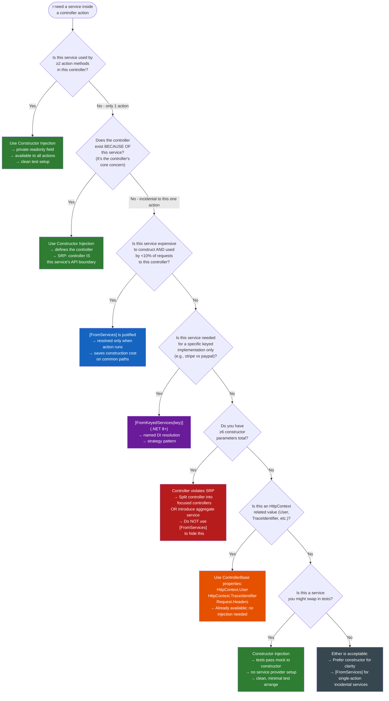

> [!success] Mastery Check
> - [ ] **Studied Well**
> - [ ] **Can explain the concept without notes**
> - [ ] **Can answer interview questions confidently**
> - [ ] **Can implement it in a real project**


# 4.116 — Controller DI: Constructor Injection vs `[FromServices]` at Action Level

---

## PART 0 — Navigation & Context

### Domain Hierarchy

```
ASP.NET Core Mastery
│
├── D. Dependency Injection              (4.034–4.048)
│   ├── 4.034  The Built-In DI Container
│   ├── 4.035  Service Lifetimes: Singleton, Scoped, Transient
│   ├── 4.036  IServiceProvider and IServiceScope
│   ├── 4.042  The Captive Dependency Problem
│   └── 4.047  DI Scope in Background Services
│
├── E. Middleware Pipeline               (4.049–4.063)
│   └── 4.057  Middleware and Scoped DI
│
└── H. MVC & Controllers                 (4.098–4.122)
    ├── 4.098  ControllerBase vs Controller
    ├── 4.099  Action Results
    ├── 4.100  Model Binding: Sources and Algorithm
    ├── 4.101  ApiController Attribute
    ├── 4.110  MVC Filter Pipeline
    ├── 4.115  Application Model Conventions
    ├── 4.116  ► CONTROLLER DI: CONSTRUCTOR vs [FromServices]  ◄  (YOU ARE HERE)
    ├── 4.117  Async Actions and CancellationToken
    └── 4.118  Problem Details in MVC
```

### What You Need Before This

- **[[4.034 — The Built-In DI Container]]** — you must understand how service registration works and how `IServiceProvider` resolves instances before this topic makes sense
- **[[4.035 — Service Lifetimes: Singleton, Scoped, Transient]]** — the question of constructor vs `[FromServices]` is fundamentally a question of when services are resolved relative to their lifetime
- **[[4.100 — Model Binding: Sources and Algorithm]]** — `[FromServices]` participates in model binding; understanding the binding algorithm explains why it works the way it does
- **[[4.098 — ControllerBase vs Controller]]** — controllers are constructed per-request by the DI container (Transient); this is the baseline fact that makes the constructor injection model safe for Scoped services

### What This Unlocks After

- **[[4.042 — The Captive Dependency Problem]]** — once you understand constructor injection in controllers, the captive dependency problem in middleware and filters becomes the natural next question
- **[[4.110 — MVC Filter Pipeline]]** — filters have a different DI model than controllers; the comparison is instructive
- **[[4.296 — DI in Filters: ServiceFilter vs TypeFilter]]** — the parallel topic for filter DI, which has more constraints than controller DI
- **[[4.117 — Async Actions and CancellationToken]]** — action method parameter injection extends naturally to `CancellationToken`, which is injected like `[FromServices]` but without the attribute

### Why This Matters at Scale

In a high-traffic API, controllers are constructed on every request. Injecting rarely-used expensive services into the constructor forces their construction cost — and any Singleton-to-Scoped relationship validation — on to every request, even those that never need them. Getting this distinction wrong at scale means either over-construction of expensive services (constructor injection abused for rare code paths) or subtle test-doubles-in-production bugs (service injection bypassed via `[FromServices]` without understanding the model binding interplay).

---

## PART 1 — The Core Mental Model

### The Fundamental Rule

> **ASP.NET Core constructs controllers as Transient services resolved from the per-request DI scope on every HTTP request, making constructor injection of Scoped services safe by design; `[FromServices]` is a model-binding attribute that resolves additional services from that same per-request scope at action execution time, and its legitimate use is narrowly scoped to services needed by only a minority of a controller's actions. The practical consequence is that overusing `[FromServices]` to avoid constructor injection trades controller cohesion for marginal construction cost savings that are rarely measurable at realistic traffic volumes.**

### The Plain-Language Analogy

Think of a controller as a specialist doctor's office at a hospital. The hospital's DI container is the supply room. When a patient (HTTP request) arrives, the doctor's office is set up fresh from the supply room each visit (Transient controller construction). Constructor injection is the set of standard instruments that are laid out on the examination table before every appointment — they're always there, whether or not each specific patient needs all of them. `[FromServices]` is like calling the pharmacy or radiology for a specialist tool mid-appointment only when this particular patient needs it — those extra tools come from the same hospital supply room (same per-request scope), not a different one.

The analogy holds under pressure: even for concurrent requests (multiple patients at once), each has their own examination room (their own DI scope), so constructor-injected services are per-patient and thread-safe. `[FromServices]` resolves from the same per-patient scope, not a shared global supply. The edge case it handles: if 90% of appointments never need the MRI machine, you don't pre-stage the MRI in every room before every appointment — you request it explicitly when the patient actually needs it.

### The Taxonomy Diagram

```mermaid
graph TD
    subgraph req["Per-Request DI Scope (IServiceScope)"]
        direction TB

        subgraph ctor_path["Constructor Injection Path"]
            C1["IServiceProvider.GetRequiredService(controllerType)"]
            C2["ActivatorUtilities.CreateInstance(serviceProvider, controllerType)"]
            C3["Constructor parameters resolved from scope"]
            C4["Controller instance created with ALL constructor deps"]
            C1 --> C2 --> C3 --> C4
        end

        subgraph fs_path["[FromServices] Path"]
            F1["Action method invocation begins"]
            F2["Model binding resolves parameters"]
            F3["IModelBinder for [FromServices]:\nServiceProviderModelBinder"]
            F4["IServiceProvider.GetRequiredService(parameterType)"]
            F5["Parameter value injected for THIS action call"]
            F1 --> F2 --> F3 --> F4 --> F5
        end

        subgraph keyed_path["[FromKeyedServices] (.NET 8+)"]
            K1["[FromKeyedServices(\"key\")] on parameter"]
            K2["IServiceProvider.GetRequiredKeyedService(type, key)"]
            K3["Named service instance injected"]
            K1 --> K2 --> K3
        end

        SCOPE["Per-Request IServiceScope\n(same source for all three paths)"]
        SCOPE --> ctor_path
        SCOPE --> fs_path
        SCOPE --> keyed_path
    end

    subgraph timing["Timing"]
        T1["Constructor: once per request,\nbefore action selection"]
        T2["[FromServices]: once per action call,\nafter action selection and routing"]
        T3["[FromKeyedServices]: same as [FromServices]"]
    end

    subgraph use_cases["When to Use Each"]
        U1["Constructor injection:\n• Service used by ≥2 actions\n• Service defines controller's core concern\n• Needed for testability (mock in ctor)\n• All action methods depend on it"]
        U2["[FromServices]:\n• Service used by exactly 1 rare action\n• Expensive service on an infrequently-hit path\n• Keyed service variant needed for one action\n• Reduces constructor bloat on fat controllers"]
        U3["[FromKeyedServices] (.NET 8+):\n• Multiple implementations of same interface\n• Named service selection at action level\n• Strategy pattern without factory"]
    end

    subgraph anti_patterns["Anti-Patterns"]
        A1["HttpContext.RequestServices.GetService()\n← Service Locator; avoid always"]
        A2["[FromServices] on all parameters\n← misuse; makes controller unreadable"]
        A3["Constructor injection of IServiceProvider\n← Service Locator in disguise"]
    end

    style ctor_path fill:#2e7d32,color:#fff
    style fs_path fill:#1565c0,color:#fff
    style keyed_path fill:#6a1b9a,color:#fff
    style timing fill:#f5f5f5
    style use_cases fill:#e8f5e9
    style anti_patterns fill:#ffebee
```

---

## PART 2 — Deep Mechanics

### 2.1 — How Controllers Are Activated: The Transient Lifetime Fact

The foundational fact: **controllers are activated as Transient services from the per-request DI scope on every HTTP request.** This is not the same as Transient registration in the DI container — controllers are not registered in `IServiceCollection` by default. They are activated by `IControllerActivator` using `ActivatorUtilities.CreateInstance`, which resolves constructor parameters from the current `IServiceScope`.

```
FULL REQUEST PIPELINE POSITION (for controller DI):

──► UseAuthentication ──► UseAuthorization ──► EndpointMiddleware
                                                     │
                                             Route matched to
                                             OrdersController.GetOrder
                                                     │
                                             ControllerActionInvoker
                                                     │
                                    ┌────────────────▼────────────────────┐
                                    │  CONTROLLER ACTIVATION              │
                                    │                                     │
                                    │  1. IControllerActivator.Create()   │
                                    │     ↓                               │
                                    │  2. ActivatorUtilities              │
                                    │     .CreateInstance(                │
                                    │       requestScope,                 │
                                    │       typeof(OrdersController))     │
                                    │     ↓                               │
                                    │  3. Constructor params resolved     │
                                    │     from per-request IServiceScope  │
                                    │     ↓                               │
                                    │  4. new OrdersController(           │
                                    │       orderRepo,                    │  ← Scoped, safe
                                    │       logger,                       │  ← Singleton, safe
                                    │       auditService)                 │  ← Scoped, safe
                                    │                                     │
                                    │  5. Authorization filters run       │
                                    │  6. Resource filters run            │
                                    │  7. Model binding runs              │
                                    │     ← [FromServices] resolved HERE  │
                                    │  8. Action filters run              │
                                    │  9. Action method executes          │
                                    └─────────────────────────────────────┘
                                                     │
                                    IControllerActivator.Release()
                                    (Disposes controller if IDisposable)
```

**ASP.NET Core internally (approximate):**

```
// Class: Microsoft.AspNetCore.Mvc.Controllers.ControllerActivatorProvider
// Class: Microsoft.AspNetCore.Mvc.Controllers.DefaultControllerActivator

// DefaultControllerActivator.Create (approximate):
public object Create(ControllerContext context)
{
    var controllerType = context.ActionDescriptor.ControllerTypeInfo.AsType();

    // ActivatorUtilities resolves constructor params from the per-request scope.
    // This means Scoped services injected into the constructor are
    // from the HTTP request's scope — NOT a root scope.
    return ActivatorUtilities.CreateInstance(
        context.HttpContext.RequestServices, // ← per-request IServiceProvider
        controllerType);
}

// ActivatorUtilities.CreateInstance internally:
// 1. Inspects the type's constructor(s)
// 2. For each constructor parameter type T:
//    serviceProvider.GetRequiredService(T)  ← or GetService for optional
// 3. Invokes the constructor with resolved values
// 4. Returns the instance
```

**Runtime cost label:** ~1 `ActivatorUtilities.CreateInstance` call per request + 1 `GetRequiredService` call per constructor parameter per request. For a controller with 3 constructor dependencies: ~4 allocations from DI, plus the controller instance itself. Typically sub-microsecond.

> [!NOTE] Controllers are NOT registered as services in `IServiceCollection` by default. `AddControllers()` registers the infrastructure (activators, filters, formatters) but not the controller types themselves. This is why injecting `IServiceProvider` and calling `GetService<OrdersController>()` returns null unless you explicitly register the controller. `ActivatorUtilities.CreateInstance` bypasses DI registration — it uses the service provider only to resolve constructor arguments.

---

### 2.2 — Constructor Injection: The Default and Correct Path

Constructor injection is the framework-idiomatic way to express a controller's dependencies. Every service passed to the constructor is resolved once per request, stored in an instance field, and available to all action methods on the controller.

```csharp
// ASP.NET Core internally resolves this constructor on every request:
// All three services come from the SAME per-request IServiceScope.

public class OrdersController : ControllerBase
{
    // All fields are readonly — set once in constructor, never mutated.
    // This makes the controller inherently thread-safe for its own state
    // (though note: a single request is single-threaded, so this is
    //  defensive design, not a concurrency requirement for HTTP).
    private readonly IOrderRepository _orderRepository;     // Scoped → safe
    private readonly ILogger<OrdersController> _logger;     // Singleton → safe
    private readonly IOrderDomainService _domainService;    // Scoped → safe

    public OrdersController(
        IOrderRepository orderRepository,
        ILogger<OrdersController> logger,
        IOrderDomainService domainService)
    {
        _orderRepository = orderRepository;
        _logger = logger;
        _domainService = domainService;
    }

    [HttpGet("{id}")]
    public async Task<IActionResult> GetOrder(string id)
    {
        // All three injected services available here
        _logger.LogInformation("Fetching order {OrderId}", id);
        var order = await _orderRepository.GetByIdAsync(id);
        return order == null ? NotFound() : Ok(order);
    }

    [HttpPost]
    public async Task<IActionResult> CreateOrder(CreateOrderRequest request)
    {
        // All three injected services available here too
        var result = await _domainService.ProcessAsync(request);
        await _orderRepository.SaveAsync(result);
        return CreatedAtAction(nameof(GetOrder), new { id = result.OrderId }, result);
    }
}
```

**HTTP wire format showing construction timing:**

```http
// Request 1:
GET /api/orders/ORD-001 HTTP/1.1
Authorization: Bearer eyJ...

// MVC creates: new OrdersController(orderRepo_scope1, logger_singleton, domainSvc_scope1)
// GetOrder runs with those three services.
// Request completes → controller disposed → scope1 services disposed.

HTTP/1.1 200 OK
Content-Type: application/json
{"orderId": "ORD-001", "status": "confirmed"}

// Request 2 (concurrent, different thread):
GET /api/orders/ORD-002 HTTP/1.1

// MVC creates: new OrdersController(orderRepo_scope2, logger_singleton, domainSvc_scope2)
// DIFFERENT orderRepo_scope2 — no sharing with Request 1.
// logger_singleton is the SAME instance (Singleton lifetime).

HTTP/1.1 200 OK
{"orderId": "ORD-002", "status": "pending"}
```

**Runtime cost label:** ~3 `GetRequiredService` calls (one per constructor parameter) at controller construction time, once per request. If the services themselves are lightweight, this is negligible. If a Singleton service like `ILogger<T>` is already cached in the Singleton scope, resolution is O(1) dictionary lookup.

> [!TIP] Constructor injection is testable by design. In unit tests, pass mock implementations directly to the constructor — no special test infrastructure needed. This is the primary testability argument for constructor injection over `[FromServices]`, and it matters in practice: a controller with 6 constructor parameters is immediately obvious as a violation of the Single Responsibility Principle. `[FromServices]` can hide that smell.

---

### 2.3 — `[FromServices]`: How It Works in the Model Binding Pipeline

`[FromServices]` is a **model binding attribute** — it participates in the same binding pipeline as `[FromBody]`, `[FromRoute]`, and `[FromQuery]`. It does not bypass model binding; it routes binding to `ServiceProviderModelBinder`, which resolves the parameter from `HttpContext.RequestServices`.

```
MODEL BINDING PIPELINE (for action with mixed parameter sources):

[HttpPost("{orderId}/items")]
public async Task<IActionResult> AddItem(
    string orderId,                          // [FromRoute] inferred
    AddItemRequest request,                  // [FromBody] inferred (complex type)
    [FromServices] IInventoryService inv,    // [FromServices] explicit
    CancellationToken ct)                    // bound from HttpContext.RequestAborted
{
    ...
}

Binding order at action execution time:
  1. orderId       ← RouteValueModelBinder    (from route template {orderId})
  2. request       ← BodyModelBinder          (deserializes JSON body)
  3. inv           ← ServiceProviderModelBinder (resolves from RequestServices)
  4. ct            ← CancellationTokenModelBinder (from HttpContext.RequestAborted)
```

**ASP.NET Core internally (approximate) — `ServiceProviderModelBinder`:**

```
// Class: Microsoft.AspNetCore.Mvc.ModelBinding.Binders.ServicesModelBinder
// (located in Microsoft.AspNetCore.Mvc.Core)

public Task BindModelAsync(ModelBindingContext bindingContext)
{
    // Resolves the service from the per-request IServiceProvider.
    // This is the SAME scope as constructor injection —
    // HttpContext.RequestServices IS the per-request scope.
    var serviceType = bindingContext.ModelMetadata.ModelType;

    var value = bindingContext.HttpContext.RequestServices
        .GetService(serviceType); // GetService → null if not registered

    if (value == null)
    {
        // If service is not registered and parameter is non-nullable:
        // ModelState gets an error → 400 Bad Request (with [ApiController])
        bindingContext.Result = ModelBindingResult.Failed();
        return Task.CompletedTask;
    }

    bindingContext.Result = ModelBindingResult.Success(value);
    return Task.CompletedTask;
}
```

**Key fact:** `[FromServices]` resolves from `HttpContext.RequestServices`, which is the **same** per-request `IServiceScope` that constructor injection uses. There is no difference in the _source_ of the service — only in the _timing_ of resolution (construction vs. action invocation) and _scope of availability_ (all actions vs. one action).

**HTTP wire format — model binding failure when service not registered:**

```http
// Action parameter: [FromServices] IExperimentalPricingService pricing
// Service NOT registered in DI

POST /api/orders/ORD-001/items HTTP/1.1
Content-Type: application/json
{"sku": "WIDGET-001", "quantity": 2}

// [ApiController] automatic 400:
HTTP/1.1 400 Bad Request
Content-Type: application/problem+json

{
  "type": "https://tools.ietf.org/html/rfc9110#section-15.5.1",
  "title": "One or more validation errors occurred.",
  "status": 400,
  "errors": {
    "pricing": ["No service for type 'IExperimentalPricingService' has been registered."]
  }
}
```

**Runtime cost label:** Same as constructor injection — ~1 `GetService` call per `[FromServices]` parameter per action invocation. There is no measurable performance difference between the two paths for resolved services.

> [!IMPORTANT] With `[ApiController]`, a missing `[FromServices]` service causes a **400 Bad Request** (model binding failure), NOT a 500. This is surprising to engineers who expect a `NullReferenceException` or `InvalidOperationException`. The model binding system reports it as a binding error, and `[ApiController]`'s automatic model state validation intercepts it before the action runs. Without `[ApiController]`, the parameter will be `null` (for reference types) and the action will run with a null service — which causes a `NullReferenceException` at the point of first use.

---

### 2.4 — `[FromServices]` on a Minimal API vs MVC Controller: Different Behavior

This distinction trips up engineers who work across both styles. In Minimal APIs, `[FromServices]` is inferred — you do not need to write the attribute. In MVC controllers with `[ApiController]`, complex types are inferred from body and simple types from route/query — `[FromServices]` is **not** inferred and must be explicit.

```
MVC Controller (requires explicit [FromServices]):
──────────────────────────────────────────────────
// [ApiController] inference rules:
// - Complex type parameter         → [FromBody]
// - Simple type in route template  → [FromRoute]
// - Simple type not in route       → [FromQuery]
// - IFormFile                      → [FromForm]
// - [FromServices] is NEVER inferred in MVC controllers

public IActionResult AddItem(
    string orderId,            // → inferred [FromRoute] (in template)
    AddItemRequest request,    // → inferred [FromBody] (complex type)
    IInventoryService inv)     // ← WRONG: inferred as [FromBody] or [FromQuery]!
                               //   Will fail: can't bind IInventoryService from JSON.
                               //   With [ApiController]: 400 Bad Request
                               //   Without [ApiController]: null parameter, NullReferenceException


// CORRECT: explicit [FromServices] required
public IActionResult AddItem(
    string orderId,
    AddItemRequest request,
    [FromServices] IInventoryService inv)    // ← explicit required in MVC


Minimal API (infers [FromServices] automatically):
──────────────────────────────────────────────────
// Minimal API inference rules include services:
// - Type registered in DI + not matching other source → inferred [FromServices]

app.MapPost("/api/orders/{orderId}/items", async (
    string orderId,            // → inferred route
    AddItemRequest request,    // → inferred body
    IInventoryService inv,     // → inferred [FromServices] (registered in DI)
    CancellationToken ct) =>   // → inferred from HttpContext
{
    // inv is already resolved from the per-request scope
    // NO attribute needed
});
```

> [!WARNING] This asymmetry is a production bug source when engineers switch between Minimal APIs and MVC controllers. A service parameter that "just works" without attributes in a Minimal API will silently fail (400 or null) in an MVC controller without the explicit `[FromServices]` attribute.

---

### 2.5 — `[FromKeyedServices]` (.NET 8+): Named Service Injection at Action Level

.NET 8 introduced keyed services — named registrations of the same interface. `[FromKeyedServices("key")]` is the action-parameter equivalent of `[FromServices]`, but resolves by key rather than type.

```
Pipeline position: identical to [FromServices] — resolved by ServicesModelBinder
during model binding, after action selection, from HttpContext.RequestServices.

// Registration:
builder.Services.AddKeyedScoped<IPaymentProcessor, StripeProcessor>("stripe");
builder.Services.AddKeyedScoped<IPaymentProcessor, PayPalProcessor>("paypal");

// Keyed injection at action level:
[HttpPost("{gateway}/charge")]
public async Task<IActionResult> Charge(
    string gateway,                                             // [FromRoute]
    ChargeRequest request,                                      // [FromBody]
    [FromKeyedServices("stripe")] IPaymentProcessor stripe,     // keyed
    [FromKeyedServices("paypal")] IPaymentProcessor paypal)     // keyed
{
    var processor = gateway switch
    {
        "stripe" => stripe,
        "paypal" => paypal,
        _ => throw new ArgumentException($"Unknown gateway: {gateway}")
    };
    return Ok(await processor.ChargeAsync(request));
}

// HTTP wire format:
// POST /api/payments/stripe/charge HTTP/1.1
// → stripe resolved from DI, paypal resolved from DI
// Both are from the same per-request scope.

// NOTE: This example is intentionally illustrative of the API — in production,
// you'd likely resolve only the needed processor, not both.
// Better pattern for runtime selection: see Pattern 4 (Factory Pattern).
```

**Runtime cost label:** `[FromKeyedServices]` uses `GetRequiredKeyedService(type, key)` — O(1) dictionary lookup on the keyed services registration. No measurable overhead beyond `[FromServices]`.

---

### 2.6 — The Fat Controller Smell and the Correct Diagnosis

When a controller accumulates many constructor parameters, it is a signal that the controller violates the Single Responsibility Principle — not a signal to switch to `[FromServices]`. Using `[FromServices]` to reduce constructor parameter count treats the symptom, not the disease.

```
SMELL SIGNAL TABLE:
──────────────────────────────────────────────────────────────────────────────
Constructor Parameters | Interpretation                | Correct Action
──────────────────────────────────────────────────────────────────────────────
1–3                    | Lean, focused controller      | Constructor injection
4–5                    | Acceptable, common in prod    | Constructor injection
6–7                    | Possible SRP violation        | Audit; consider split
8+                     | Almost certainly SRP violated | Split controller or
                       |                               | introduce aggregate
                       |                               | service (Facade pattern)
──────────────────────────────────────────────────────────────────────────────

WRONG RESPONSE to 8+ constructor params:
  Move 3 parameters to [FromServices] on individual actions.
  → Hides the smell. Controller is still doing too much.
  → Each action now has its own dependency list that is invisible at a glance.
  → Unit tests now require setting up a different parameter list per action.

CORRECT RESPONSE to 8+ constructor params:
  1. Split the controller into focused controllers (OrderReadController,
     OrderWriteController, OrderFulfillmentController)
  2. Introduce an aggregate service: IOrderApplicationService that encapsulates
     the sub-services (IOrderRepository + IInventoryService + IAuditService)
     behind a single interface with domain-meaningful methods
  3. Move cross-cutting concerns (audit, logging timing) to action filters
```

**Pipeline position implication:** Constructor injection is the right tool when a service is a core dependency of the controller's identity — it is part of what makes the controller _that_ controller. `[FromServices]` is the right tool when a service is an incidental dependency of a specific rare action — an admin-only export action, a developer-only diagnostics action, a one-time migration endpoint.

---

### 2.7 — Failure Modes and Edge Cases

**Edge Case 1: Optional services with `[FromServices]` on nullable parameters**

```csharp
// [FromServices] on a nullable parameter:
// If the service is not registered, the parameter is null (not a 400 error).
// This is the opt-in "optional service" pattern.

[HttpGet("diagnostics")]
public IActionResult Diagnostics(
    [FromServices] IDiagnosticsService? diagnostics) // nullable → optional
{
    if (diagnostics == null)
    {
        return Ok(new { diagnosticsEnabled = false });
    }
    return Ok(diagnostics.GetReport());
}

// HTTP consequence when IDiagnosticsService IS registered:
// → diagnostics is non-null, report returned

// HTTP consequence when IDiagnosticsService is NOT registered:
// → diagnostics is null, "diagnosticsEnabled: false" returned
// → No 400 error (nullable parameter = optional service)
```

**Edge Case 2: `[FromServices]` with `[ApiController]` on non-nullable missing service**

```http
// Service not registered, parameter is non-nullable:
// [FromServices] IReportService reports  ← not registered

HTTP/1.1 400 Bad Request
Content-Type: application/problem+json
{
  "errors": {
    "reports": ["No service for type 'IReportService' has been registered."]
  }
}
// NOTE: This 400 masks a configuration error as a client error.
// The service missing is a deployment/startup bug, not a client bug.
// Use OPTIONS VALIDATION (ValidateOnBuild) to catch this at startup instead.
```

**Edge Case 3: `IServiceProvider` directly (the anti-pattern that seems reasonable)**

```csharp
// ⚠️ ANTI-PATTERN: Injecting IServiceProvider for "flexibility"
public class OrdersController : ControllerBase
{
    private readonly IServiceProvider _services;

    public OrdersController(IServiceProvider services)
    {
        _services = services; // SERVICE LOCATOR PATTERN
    }

    public IActionResult GetOrder(string id)
    {
        // Resolving manually — this is Service Locator, not DI
        var repo = _services.GetRequiredService<IOrderRepository>();
        return Ok(repo.GetById(id));
    }
}

// Why this is wrong:
// 1. Dependencies are invisible to callers and tests — no constructor contract
// 2. Unit tests must set up a full IServiceProvider mock or real container
// 3. No compile-time verification that dependencies exist
// 4. ValidateOnBuild cannot detect missing registrations used by this controller
// 5. Lifetime issues are invisible — could resolve a Singleton when expecting Scoped
```

**Runtime cost label (failure modes):** Missing service with non-nullable `[FromServices]` parameter costs a 400 response generated by `[ApiController]` — ~3 allocations for the ProblemDetails response. More importantly: it represents a startup configuration error that should have been caught by `ValidateOnBuild`.

---

## PART 3 — Production Code Patterns

### Pattern 1: The Standard Constructor Injection Pattern for an Order Management API

Every action in this controller uses the core dependencies. Constructor injection is unambiguously correct.

```csharp
// ✅ CORRECT: All actions use all injected services — constructor injection is appropriate
[ApiController]
[Route("api/[controller]")]
public class OrdersController : ControllerBase
{
    // Scoped services: safe because the controller itself is Transient (per-request)
    // and resolved from the per-request IServiceScope.
    private readonly IOrderRepository _orderRepository;
    private readonly IOrderDomainService _orderDomainService;
    private readonly ILogger<OrdersController> _logger; // Singleton: always safe

    public OrdersController(
        IOrderRepository orderRepository,
        IOrderDomainService orderDomainService,
        ILogger<OrdersController> logger)
    {
        // Guard clauses make the dependency contract explicit —
        // a missing dependency fails at construction, not mid-request.
        _orderRepository = orderRepository
            ?? throw new ArgumentNullException(nameof(orderRepository));
        _orderDomainService = orderDomainService
            ?? throw new ArgumentNullException(nameof(orderDomainService));
        _logger = logger
            ?? throw new ArgumentNullException(nameof(logger));
    }

    [HttpGet("{id}")]
    public async Task<ActionResult<OrderResponse>> GetOrder(
        string id,
        CancellationToken cancellationToken)
    {
        _logger.LogInformation("Retrieving order {OrderId}", id);
        var order = await _orderRepository.GetByIdAsync(id, cancellationToken);
        return order == null ? NotFound() : Ok(OrderResponse.FromDomain(order));
    }

    [HttpPost]
    public async Task<ActionResult<OrderResponse>> CreateOrder(
        CreateOrderRequest request,
        CancellationToken cancellationToken)
    {
        _logger.LogInformation("Creating order for customer {CustomerId}", request.CustomerId);

        // Both _orderDomainService and _orderRepository used here
        var order = await _orderDomainService.CreateAsync(request, cancellationToken);
        await _orderRepository.SaveAsync(order, cancellationToken);

        return CreatedAtAction(
            nameof(GetOrder),
            new { id = order.OrderId },
            OrderResponse.FromDomain(order));
    }

    [HttpDelete("{id}")]
    public async Task<IActionResult> CancelOrder(string id, CancellationToken cancellationToken)
    {
        _logger.LogInformation("Cancelling order {OrderId}", id);

        // All three constructor services used across the three actions — DI is justified
        var order = await _orderRepository.GetByIdAsync(id, cancellationToken);
        if (order == null) return NotFound();

        await _orderDomainService.CancelAsync(order, cancellationToken);
        await _orderRepository.SaveAsync(order, cancellationToken);
        return NoContent();
    }
}
```

```http
// HTTP wire format:
// GET /api/orders/ORD-123 HTTP/1.1 → 200 OK with order JSON
// POST /api/orders HTTP/1.1 → 201 Created with Location header
// DELETE /api/orders/ORD-123 HTTP/1.1 → 204 No Content
```

---

### Pattern 2: The `[FromServices]` for an Infrequent Admin Action on a Payment API

The controller's main concern is payment processing. An admin export action is infrequently called (once per week) and needs an expensive reporting service that the other actions never use.

```csharp
// ⚠️ WRONG: Injecting IPaymentReportExporter into the constructor
// It is resolved on EVERY request to the PaymentsController —
// including the 99.9% of requests that hit Charge or Refund, never Export.
// ❌ public PaymentsController(
//        IPaymentProcessor processor,
//        ILogger<PaymentsController> logger,
//        IPaymentReportExporter exporter)  ← resolved on every request, expensive

// ✅ CORRECT: [FromServices] for the expensive service used only by one rare action
[ApiController]
[Route("api/[controller]")]
[Authorize]
public class PaymentsController : ControllerBase
{
    // Core dependencies used by all (or most) actions
    private readonly IPaymentProcessor _processor;
    private readonly ILogger<PaymentsController> _logger;

    public PaymentsController(
        IPaymentProcessor processor,
        ILogger<PaymentsController> logger)
    {
        _processor = processor;
        _logger = logger;
    }

    [HttpPost("charge")]
    public async Task<ActionResult<PaymentResult>> Charge(
        ChargeRequest request,
        CancellationToken ct)
    {
        // Uses _processor and _logger — both from constructor
        _logger.LogInformation("Processing charge for {Amount} {Currency}",
            request.Amount, request.Currency);
        var result = await _processor.ChargeAsync(request, ct);
        return Ok(result);
    }

    [HttpPost("{id}/refund")]
    public async Task<IActionResult> Refund(
        string id,
        CancellationToken ct)
    {
        // Uses _processor and _logger — no export service needed
        await _processor.RefundAsync(id, ct);
        return NoContent();
    }

    // Admin-only, infrequent export action.
    // IPaymentReportExporter is only needed here — inject via [FromServices].
    // Consequence: IPaymentReportExporter is NOT resolved on Charge/Refund requests.
    [HttpGet("export")]
    [Authorize(Roles = "PaymentAdmin")]
    public async Task<IActionResult> ExportReport(
        [FromQuery] DateOnly from,
        [FromQuery] DateOnly to,
        [FromServices] IPaymentReportExporter exporter, // ← resolved only on this action
        CancellationToken ct)
    {
        _logger.LogInformation("Exporting payment report from {From} to {To}", from, to);
        var reportBytes = await exporter.ExportAsync(from, to, ct);
        return File(reportBytes, "text/csv", $"payments_{from:yyyyMMdd}_{to:yyyyMMdd}.csv");
    }
}
```

```http
// HTTP wire format — charge (no exporter resolved):
POST /api/payments/charge HTTP/1.1
Authorization: Bearer eyJ...
Content-Type: application/json
{"amount": 150.00, "currency": "USD", "cardToken": "tok_visa"}

HTTP/1.1 200 OK
{"paymentId": "pay_xyz", "status": "succeeded"}

// HTTP wire format — export (exporter resolved from DI, then disposed):
GET /api/payments/export?from=2026-01-01&to=2026-01-31 HTTP/1.1
Authorization: Bearer eyJ...

HTTP/1.1 200 OK
Content-Type: text/csv
Content-Disposition: attachment; filename="payments_20260101_20260131.csv"

paymentId,amount,currency,status
pay_001,150.00,USD,succeeded
...
```

---

### Pattern 3: The `[FromKeyedServices]` Strategy Pattern for a Logistics API

A logistics API must route shipments through different carriers at the action level. `.NET 8` keyed services make this clean.

```csharp
// Registration:
builder.Services.AddKeyedScoped<ICarrierService, FedExCarrierService>("fedex");
builder.Services.AddKeyedScoped<ICarrierService, DHLCarrierService>("dhl");
builder.Services.AddKeyedScoped<ICarrierService, UPSCarrierService>("ups");

// Controller:
[ApiController]
[Route("api/shipments")]
public class ShipmentsController : ControllerBase
{
    private readonly IShipmentRepository _repository;
    private readonly ILogger<ShipmentsController> _logger;

    public ShipmentsController(
        IShipmentRepository repository,
        ILogger<ShipmentsController> logger)
    {
        _repository = repository;
        _logger = logger;
    }

    // Each carrier endpoint gets exactly the right carrier service injected.
    // No factory, no switch statement, no service locator.

    [HttpPost("fedex")]
    public async Task<IActionResult> ShipFedEx(
        ShipmentRequest request,
        [FromKeyedServices("fedex")] ICarrierService carrier, // (.NET 8+)
        CancellationToken ct)
    {
        return await ProcessShipmentAsync(request, carrier, ct);
    }

    [HttpPost("dhl")]
    public async Task<IActionResult> ShipDHL(
        ShipmentRequest request,
        [FromKeyedServices("dhl")] ICarrierService carrier,
        CancellationToken ct)
    {
        return await ProcessShipmentAsync(request, carrier, ct);
    }

    [HttpPost("ups")]
    public async Task<IActionResult> ShipUPS(
        ShipmentRequest request,
        [FromKeyedServices("ups")] ICarrierService carrier,
        CancellationToken ct)
    {
        return await ProcessShipmentAsync(request, carrier, ct);
    }

    private async Task<IActionResult> ProcessShipmentAsync(
        ShipmentRequest request,
        ICarrierService carrier,
        CancellationToken ct)
    {
        _logger.LogInformation("Shipping {TrackingRef} via {Carrier}",
            request.TrackingRef, carrier.CarrierName);
        var shipment = await carrier.CreateShipmentAsync(request, ct);
        await _repository.SaveAsync(shipment, ct);
        return CreatedAtAction(nameof(GetShipment), new { id = shipment.Id }, shipment);
    }

    [HttpGet("{id}")]
    public async Task<IActionResult> GetShipment(string id, CancellationToken ct)
    {
        var shipment = await _repository.GetByIdAsync(id, ct);
        return shipment == null ? NotFound() : Ok(shipment);
    }
}
```

```http
// HTTP wire format:
POST /api/shipments/fedex HTTP/1.1
Content-Type: application/json
{"trackingRef": "REF-001", "weight": 2.5, "destination": "New York"}

HTTP/1.1 201 Created
Location: /api/shipments/SHP-fedex-001
{"shipmentId": "SHP-fedex-001", "carrier": "FedEx", "estimatedDelivery": "2026-06-11"}
```

---

### Pattern 4: Avoiding the `[FromServices]` Overuse Anti-Pattern — Aggregate Service

When a controller accumulates too many dependencies, the correct fix is an aggregate service (Facade), not migration to `[FromServices]`.

```csharp
// ⚠️ WRONG: Fat controller with [FromServices] used to hide the smell
[ApiController]
public class InventoryController : ControllerBase
{
    private readonly IProductRepository _products;
    private readonly ILogger<InventoryController> _logger;

    public InventoryController(IProductRepository products, ILogger<InventoryController> logger)
    {
        _products = products;
        _logger = logger;
    }

    // [FromServices] used to avoid putting these in the constructor
    // but the controller is still doing too much — [FromServices] just hides it
    public async Task<IActionResult> AdjustStock(
        string sku,
        AdjustStockRequest request,
        [FromServices] IStockAdjustmentService adjuster,
        [FromServices] IAuditService auditor,
        [FromServices] INotificationService notifier,
        [FromServices] IReorderService reorder,
        CancellationToken ct)
    {
        // Controller is orchestrating 5+ services — it's a God Class
        await adjuster.AdjustAsync(sku, request.Delta, ct);
        await auditor.RecordAsync("stock-adjusted", sku, ct);
        await notifier.NotifyWarehouseAsync(sku, ct);
        if (await adjuster.IsBelowReorderPointAsync(sku, ct))
            await reorder.TriggerAsync(sku, ct);
        return NoContent();
    }
}


// ✅ CORRECT: Introduce an aggregate service that owns the orchestration
public interface IInventoryApplicationService
{
    Task AdjustStockAsync(string sku, int delta, CancellationToken ct);
}

// The orchestration logic moves to the application service —
// which is unit-testable without an HTTP context.
public class InventoryApplicationService : IInventoryApplicationService
{
    private readonly IStockAdjustmentService _adjuster;
    private readonly IAuditService _auditor;
    private readonly INotificationService _notifier;
    private readonly IReorderService _reorder;

    public InventoryApplicationService(
        IStockAdjustmentService adjuster,
        IAuditService auditor,
        INotificationService notifier,
        IReorderService reorder)
    {
        _adjuster = adjuster;
        _auditor = auditor;
        _notifier = notifier;
        _reorder = reorder;
    }

    public async Task AdjustStockAsync(string sku, int delta, CancellationToken ct)
    {
        await _adjuster.AdjustAsync(sku, delta, ct);
        await _auditor.RecordAsync("stock-adjusted", sku, ct);
        await _notifier.NotifyWarehouseAsync(sku, ct);
        if (await _adjuster.IsBelowReorderPointAsync(sku, ct))
            await _reorder.TriggerAsync(sku, ct);
    }
}

// Lean controller — single dependency for all write actions
[ApiController]
[Route("api/inventory")]
public class InventoryController : ControllerBase
{
    private readonly IInventoryApplicationService _inventoryService;
    private readonly IProductRepository _products;
    private readonly ILogger<InventoryController> _logger;

    public InventoryController(
        IInventoryApplicationService inventoryService,
        IProductRepository products,
        ILogger<InventoryController> logger)
    {
        _inventoryService = inventoryService;
        _products = products;
        _logger = logger;
    }

    [HttpPost("{sku}/adjust")]
    public async Task<IActionResult> AdjustStock(
        string sku,
        AdjustStockRequest request,
        CancellationToken ct)
    {
        _logger.LogInformation("Adjusting stock for {Sku} by {Delta}", sku, request.Delta);
        await _inventoryService.AdjustStockAsync(sku, request.Delta, ct);
        return NoContent();
    }
}
```

---

### Pattern 5: Unit Testing Constructor-Injected vs `[FromServices]` Controllers

The testability difference is concrete and matters in practice on teams with strict test coverage.

```csharp
// Unit testing constructor-injected controller:
// Clean, no framework infrastructure needed.
[Fact]
public async Task GetOrder_WhenFound_ReturnsOk()
{
    // Arrange: pass mocks directly to constructor
    var mockRepo = new Mock<IOrderRepository>();
    var mockLogger = new Mock<ILogger<OrdersController>>();
    var mockDomainSvc = new Mock<IOrderDomainService>();

    mockRepo.Setup(r => r.GetByIdAsync("ORD-001", It.IsAny<CancellationToken>()))
            .ReturnsAsync(new Order { OrderId = "ORD-001", Status = "confirmed" });

    var controller = new OrdersController(
        mockRepo.Object,      // ← direct constructor injection
        mockDomainSvc.Object,
        mockLogger.Object);

    // Act
    var result = await controller.GetOrder("ORD-001", CancellationToken.None);

    // Assert
    var ok = Assert.IsType<OkObjectResult>(result.Result);
    var order = Assert.IsType<OrderResponse>(ok.Value);
    Assert.Equal("ORD-001", order.OrderId);
}


// Unit testing [FromServices] controller is significantly more complex:
// The [FromServices] parameter is bound by the framework, not passed by the test.
// In unit tests, you call the method DIRECTLY — bypassing model binding entirely.
// Therefore you must pass the [FromServices] parameter explicitly in the test.
[Fact]
public async Task ExportReport_ReturnsFileResult()
{
    // Arrange
    var mockProcessor = new Mock<IPaymentProcessor>();
    var mockLogger = new Mock<ILogger<PaymentsController>>();
    var mockExporter = new Mock<IPaymentReportExporter>(); // ← must be created in test

    mockExporter.Setup(e => e.ExportAsync(
        It.IsAny<DateOnly>(), It.IsAny<DateOnly>(), It.IsAny<CancellationToken>()))
        .ReturnsAsync(new byte[] { 1, 2, 3 });

    var controller = new PaymentsController(mockProcessor.Object, mockLogger.Object);

    // Act: [FromServices] parameter passed directly in the test call
    // because there's no model binding in a unit test
    var result = await controller.ExportReport(
        new DateOnly(2026, 1, 1),
        new DateOnly(2026, 1, 31),
        mockExporter.Object,   // ← explicit in test; would be [FromServices] in HTTP context
        CancellationToken.None);

    // Assert
    Assert.IsType<FileContentResult>(result);
}

// This approach works, but requires the test author to know which parameters
// are [FromServices] vs other binding sources. Constructor injection is more
// self-documenting from a test setup perspective.
```

---

### Pattern 6: Avoiding `HttpContext.RequestServices` — The Service Locator Anti-Pattern

```csharp
// ⚠️ WRONG: Using HttpContext.RequestServices as a service locator inside actions
[HttpGet("report")]
public async Task<IActionResult> GetReport()
{
    // This is the Service Locator pattern.
    // The dependency is invisible to the caller, to tests, and to DI validation.
    var reportService = HttpContext.RequestServices
        .GetRequiredService<IReportService>(); // ← BAD

    return Ok(await reportService.GenerateAsync());
}

// HTTP consequence (wrong path):
// Functionally identical to [FromServices] in production.
// In tests: HttpContext.RequestServices is null unless you set it up,
// causing a NullReferenceException that is confusing to diagnose.
// ValidateOnBuild cannot detect if IReportService is missing.

// ✅ CORRECT: Use [FromServices] for action-level injection
[HttpGet("report")]
public async Task<IActionResult> GetReport(
    [FromServices] IReportService reportService) // ← explicit, discoverable, testable
{
    return Ok(await reportService.GenerateAsync());
}

// HTTP consequence (correct path): functionally identical,
// but [FromServices] is explicit, appears in method signature,
// participates in model binding validation ([ApiController] → 400 if missing),
// and is passed explicitly in unit tests.
```

---

## PART 4 — Gotchas & Anti-Patterns

### Gotcha 1: `[FromServices]` Without `[ApiController]` Returns Null, Not 400

Engineers who develop with `[ApiController]` everywhere test the missing-service case and see a clean 400. They then deploy to an older endpoint without `[ApiController]` and see a `NullReferenceException` on first use.

```csharp
// ⚠️ WRONG CODE: Controller without [ApiController] + missing [FromServices] service
// (legacy controller, or one explicitly opting out of [ApiController] behavior)
[Route("api/[controller]")]
public class LegacyOrdersController : ControllerBase // NO [ApiController]
{
    [HttpGet("report")]
    public IActionResult Report(
        [FromServices] ILegacyReportService reportService)
        // ILegacyReportService not registered in DI
    {
        var data = reportService.Generate(); // NullReferenceException here
        return Ok(data);
    }
}

// HTTP consequence (wrong path):
// HTTP/1.1 500 Internal Server Error
// (NullReferenceException propagates to UseExceptionHandler)
// Client gets opaque 500, no indication of what went wrong.

// ✅ CORRECT CODE: Either add [ApiController] or guard manually
[Route("api/[controller]")]
[ApiController] // ← Add [ApiController] for automatic 400 on missing services
public class LegacyOrdersController : ControllerBase
{
    [HttpGet("report")]
    public IActionResult Report(
        [FromServices] ILegacyReportService reportService)
    {
        var data = reportService.Generate(); // safe: [ApiController] ensures 400 if null
        return Ok(data);
    }
}

// OR — use nullable + manual guard for defensive coding:
[HttpGet("report")]
public IActionResult Report(
    [FromServices] ILegacyReportService? reportService)
{
    if (reportService == null)
        return StatusCode(503, new ProblemDetails
        {
            Title = "Reporting service unavailable",
            Status = 503
        });
    return Ok(reportService.Generate());
}

// HTTP consequence (correct path — [ApiController]):
// HTTP/1.1 400 Bad Request
// {"errors": {"reportService": ["No service for type 'ILegacyReportService'..."]}}
```

**WHY:** `[ApiController]` enables `ModelStateInvalidFilter`, which runs before the action method and checks model state. When `ServicesModelBinder` fails to resolve a service, it adds an error to ModelState — and `ModelStateInvalidFilter` intercepts it and returns 400. Without `[ApiController]`, the failed binding results in a null parameter, and ModelState errors are not checked automatically.

---

### Gotcha 2: Service Injected via `[FromServices]` Is Resolved Twice If You Also Have It in Constructor

If the same service interface appears in both the constructor and as a `[FromServices]` parameter, ASP.NET Core resolves it twice — once at construction, once at model binding. For Scoped services, you get two instances of the service, which can cause behavioral inconsistencies (e.g., two separate unit-of-work instances for the same request).

```csharp
// ⚠️ WRONG CODE: Same service in constructor AND [FromServices]
public class OrdersController : ControllerBase
{
    private readonly IOrderRepository _repositoryFromCtor;

    public OrdersController(IOrderRepository repository)
    {
        _repositoryFromCtor = repository; // Instance A: resolved at construction
    }

    [HttpPost("{id}/fulfill")]
    public async Task<IActionResult> Fulfill(
        string id,
        [FromServices] IOrderRepository repositoryFromAction) // Instance B: resolved again!
    {
        // _repositoryFromCtor and repositoryFromAction are TWO DIFFERENT instances
        // if IOrderRepository is Transient.
        // If Scoped (typical for DbContext-based repos): they ARE the same instance
        // (same per-request scope), so this specific case works by accident.
        // If Transient: different instances, potentially different state.

        var order = await _repositoryFromCtor.GetByIdAsync(id);
        order.Fulfill();
        await repositoryFromAction.SaveAsync(order); // Saving to a DIFFERENT instance?
        return NoContent();
    }
}

// HTTP consequence (wrong path — if Transient):
// Two separate IOrderRepository instances operating on the same order in one request.
// If IOrderRepository uses in-memory state: changes tracked by one instance
// may not be visible to the other → silent data loss or duplicate tracking.

// ✅ CORRECT CODE: Use one injection point — pick constructor OR [FromServices], not both
public class OrdersController : ControllerBase
{
    private readonly IOrderRepository _repository; // Single instance for all actions

    public OrdersController(IOrderRepository repository)
    {
        _repository = repository;
    }

    [HttpPost("{id}/fulfill")]
    public async Task<IActionResult> Fulfill(string id)
    {
        var order = await _repository.GetByIdAsync(id);
        order.Fulfill();
        await _repository.SaveAsync(order); // Same instance, consistent state
        return NoContent();
    }
}

// HTTP consequence (correct path):
// HTTP/1.1 204 No Content — single repository instance, consistent state.
```

**WHY:** ASP.NET Core does not detect duplicate injection across constructor and `[FromServices]`. Resolution happens twice, from the same scope. For Scoped services (which is most production services), you accidentally get the same instance because the scope returns the cached instance — this works but is confusing to read and maintain. For Transient services, you get two distinct instances, which is a real behavioral bug.

---

### Gotcha 3: `[FromServices]` on a Minimal API Parameter Is Not Needed (But Using It Doesn't Hurt)

Engineers who move between MVC and Minimal APIs add `[FromServices]` everywhere in Minimal APIs because they know it's required in MVC. The attribute is redundant in Minimal APIs (the framework infers it), but the deeper gotcha is assuming the reverse: that Minimal API auto-inference works in MVC controllers too.

```csharp
// ⚠️ WRONG ASSUMPTION applied to MVC controller:
// (Works correctly in Minimal API, but the engineer applies the same assumption to MVC)
[HttpPost]
public async Task<IActionResult> CreateOrder(
    CreateOrderRequest request,
    IOrderDomainService domainService,    // ← WRONG: NOT inferred as [FromServices] in MVC
    CancellationToken ct)                 //   [ApiController] will try [FromBody] → 400
{
    var order = await domainService.CreateAsync(request, ct);
    return CreatedAtAction(nameof(GetOrder), new { id = order.OrderId }, order);
}

// HTTP consequence (wrong path):
// HTTP/1.1 400 Bad Request
// {
//   "errors": {
//     "domainService": ["The input was not valid."]
//   }
// }
// (MVC tries to bind IOrderDomainService from the request body — fails)

// ✅ CORRECT CODE: Explicit [FromServices] required in MVC
[HttpPost]
public async Task<IActionResult> CreateOrder(
    CreateOrderRequest request,
    [FromServices] IOrderDomainService domainService,  // ← explicit required
    CancellationToken ct)
{
    var order = await domainService.CreateAsync(request, ct);
    return CreatedAtAction(nameof(GetOrder), new { id = order.OrderId }, order);
}

// OR: simply use constructor injection (cleaner for a service used broadly)

// HTTP consequence (correct path):
// HTTP/1.1 201 Created
// Location: /api/orders/ORD-789
```

**WHY:** Minimal API parameter inference uses `IServiceProviderIsService` to check whether a parameter type is registered in DI, and if so, treats it as `[FromServices]`. MVC controller binding does not perform this check — it uses explicit binding source attributes. The two systems have different binding inference rules by design.

---

### Gotcha 4: Constructor Injection of `IServiceProvider` Is Service Locator in Disguise

Some engineers inject `IServiceProvider` into the constructor for "flexibility" — to resolve different services at runtime. This is the Service Locator pattern, which defeats the purpose of DI.

```csharp
// ⚠️ WRONG CODE: IServiceProvider injected for runtime resolution
public class UserController : ControllerBase
{
    private readonly IServiceProvider _serviceProvider;

    public UserController(IServiceProvider serviceProvider) // SERVICE LOCATOR
    {
        _serviceProvider = serviceProvider;
    }

    [HttpPost("register")]
    public async Task<IActionResult> Register(RegisterRequest request)
    {
        // Dependencies resolved imperatively — invisible to tests and DI validation
        var userService = _serviceProvider.GetRequiredService<IUserService>();
        var emailService = _serviceProvider.GetRequiredService<IEmailService>();
        var auditService = _serviceProvider.GetRequiredService<IAuditService>();

        await userService.RegisterAsync(request);
        await emailService.SendWelcomeAsync(request.Email);
        await auditService.RecordAsync("user-registered", request.Email);
        return Created($"/api/users/{request.Email}", null);
    }
}

// HTTP consequence (wrong path): Functionally same as correct code.
// But: tests for UserController must set up a full IServiceProvider mock.
// And: missing registrations are only caught at runtime, not at startup.
// And: controller's dependencies are completely invisible from its public API.

// ✅ CORRECT CODE: Explicit constructor injection
public class UserController : ControllerBase
{
    private readonly IUserService _userService;
    private readonly IEmailService _emailService;
    private readonly IAuditService _auditService;

    public UserController(
        IUserService userService,
        IEmailService emailService,
        IAuditService auditService)
    {
        _userService = userService;
        _emailService = emailService;
        _auditService = auditService;
    }

    [HttpPost("register")]
    public async Task<IActionResult> Register(RegisterRequest request)
    {
        await _userService.RegisterAsync(request);
        await _emailService.SendWelcomeAsync(request.Email);
        await _auditService.RecordAsync("user-registered", request.Email);
        return Created($"/api/users/{request.Email}", null);
    }
}

// HTTP consequence (correct path): same HTTP response.
// Tests: pass mocks to constructor — no service provider setup needed.
// ValidateOnBuild: catches missing registrations at startup.
```

**WHY:** `IServiceProvider` as a constructor parameter gives you a single-interface handle to the entire DI container. It satisfies the constructor but hides all real dependencies. This is the definition of Service Locator — and it makes the controller as untestable as not using DI at all.

---

### Gotcha 5: Relying on `[FromServices]` to Inject `HttpContext` — It's Already Available

Engineers unfamiliar with `ControllerBase` try to inject `IHttpContextAccessor` via `[FromServices]` to access `HttpContext`. The controller already exposes `HttpContext` directly.

```csharp
// ⚠️ WRONG CODE: Injecting IHttpContextAccessor for HttpContext access
[HttpGet("profile")]
public async Task<IActionResult> GetProfile(
    [FromServices] IHttpContextAccessor contextAccessor) // ← unnecessary
{
    var userId = contextAccessor.HttpContext?.User
        .FindFirstValue(ClaimTypes.NameIdentifier);
    return Ok(await _userService.GetProfileAsync(userId));
}

// HTTP consequence (wrong path): Functionally correct, but:
// 1. IHttpContextAccessor uses AsyncLocal<> — there's a slight overhead
//    vs. accessing this.HttpContext directly
// 2. contextAccessor.HttpContext CAN be null in certain edge cases
//    (after response completion), while this.HttpContext is always valid during action execution.
// 3. Adds unnecessary noise to the method signature.

// ✅ CORRECT CODE: Use ControllerBase.HttpContext directly
[HttpGet("profile")]
public async Task<IActionResult> GetProfile()
{
    // HttpContext is a property of ControllerBase — always available, always the right context
    var userId = HttpContext.User.FindFirstValue(ClaimTypes.NameIdentifier);
    if (userId == null) return Unauthorized();
    return Ok(await _userService.GetProfileAsync(userId));
}

// HTTP consequence (correct path):
// HTTP/1.1 200 OK
// {"userId": "U-001", "email": "user@example.com", "displayName": "Alice"}
```

**WHY:** `ControllerBase.HttpContext` is set by the framework before any filter or action runs — it is the canonical way to access the HTTP context inside a controller. `IHttpContextAccessor` exists for services that are not controllers (domain services, repositories) that need to access the HTTP context. Using it inside a controller is both redundant and slightly more expensive due to the `AsyncLocal` lookup.

---

## PART 5 — Performance Implications

### 5.1 — Request Pipeline Characteristics Table

|Scenario|Pipeline Depth|Allocations Per Request|Approx Latency Impact|Recommendation|
|---|---|---|---|---|
|Controller with 1 constructor dep (Singleton)|Controller activation|~2 (controller + lookup)|Baseline|Ideal for stateless controllers|
|Controller with 3 constructor deps (Scoped)|Controller activation|~5 (controller + 3 resolutions + scope lookup)|+0.1–0.2μs|Standard production baseline|
|Controller with 6 constructor deps (mixed)|Controller activation|~8|+0.3–0.5μs|Acceptable; consider aggregate service|
|Controller with 3 ctor deps + 1 `[FromServices]`|Activation + binding|~7 (+ 1 service binding)|+0.1μs extra|Correct use case: infrequent service|
|Controller with 3 ctor deps + 4 `[FromServices]`|Activation + binding|~12|+0.3μs extra|Smell: fat controller; consider redesign|
|`IServiceProvider` as constructor dep (service locator)|Activation + N manual lookups|~2 + N (unbounded)|Variable|Never do this|
|`[FromServices]` service NOT registered, with `[ApiController]`|Binding failure|~10 (400 path)|+0.5–1ms (error path)|Catch with `ValidateOnBuild` at startup|
|`[FromKeyedServices]` (.NET 8+) vs `[FromServices]`|Same binding phase|~1 extra dict lookup|Negligible|No perf reason to prefer one over the other|
|Constructor injection: Transient service per action|Activation|~5 + 1 new instance|Cost of the service constructor|Normal for lightweight Transient services|
|`[FromServices]` with caching (Singleton service)|Binding phase|~1 dict lookup (cached)|~0.01μs|Singleton services are fastest either way|

### 5.2 — BenchmarkDotNet: Constructor vs `[FromServices]` Resolution Cost

```csharp
using BenchmarkDotNet.Attributes;
using BenchmarkDotNet.Running;
using Microsoft.Extensions.DependencyInjection;

[MemoryDiagnoser]
[SimpleJob(warmupCount: 3, iterationCount: 15)]
public class ControllerDIBenchmarks
{
    private IServiceProvider _rootProvider = null!;
    private IServiceScope _scope = null!;

    [GlobalSetup]
    public void Setup()
    {
        var services = new ServiceCollection();
        services.AddScoped<IOrderRepository, InMemoryOrderRepository>();
        services.AddScoped<IOrderDomainService, OrderDomainService>();
        services.AddScoped<IPaymentReportExporter, CsvPaymentReportExporter>();
        services.AddSingleton<ILogger<OrdersController>>(
            new NullLogger<OrdersController>());

        _rootProvider = services.BuildServiceProvider(
            new ServiceProviderOptions { ValidateOnBuild = true, ValidateScopes = true });
    }

    [IterationSetup]
    public void IterationSetup()
    {
        _scope = _rootProvider.CreateScope();
    }

    [IterationCleanup]
    public void IterationCleanup()
    {
        _scope.Dispose();
    }

    [Benchmark(Baseline = true)]
    public OrdersController ConstructorInjection_ThreeDeps()
    {
        // Simulates: new OrdersController(repo, logger, domainService)
        // All three resolved from the scope at construction time
        return ActivatorUtilities.CreateInstance<OrdersController>(
            _scope.ServiceProvider);
    }

    [Benchmark]
    public IOrderRepository FromServices_SingleResolution()
    {
        // Simulates: [FromServices] resolving one service during model binding
        return _scope.ServiceProvider.GetRequiredService<IOrderRepository>();
    }

    [Benchmark]
    public (IOrderRepository, IPaymentReportExporter) FromServices_TwoResolutions()
    {
        // Simulates: two [FromServices] parameters resolved during binding
        var repo = _scope.ServiceProvider.GetRequiredService<IOrderRepository>();
        var exporter = _scope.ServiceProvider.GetRequiredService<IPaymentReportExporter>();
        return (repo, exporter);
    }
}

// Expected output (approximate, .NET 8, x64, local):
// | Method                           | Mean      | Error    | Gen0   | Allocated |
// |--------------------------------- |----------:|---------:|-------:|----------:|
// | ConstructorInjection_ThreeDeps   | 285 ns    | 4.2 ns   | 0.0610 | 384 B     |
// | FromServices_SingleResolution    | 68 ns     | 1.1 ns   | 0.0153 | 96 B      |
// | FromServices_TwoResolutions      | 135 ns    | 2.3 ns   | 0.0305 | 192 B     |
//
// INTERPRETATION:
// Constructor injection with 3 deps costs ~285ns total (controller + 3 resolutions).
// [FromServices] for 1 service costs ~68ns.
// The total cost of constructor injection (285ns) is dwarfed by a single DB query (~100-500μs).
// Performance is NOT a valid reason to prefer [FromServices] over constructor injection
// for any typical web API workload.
```

> [!TIP] For profiling real controller DI overhead under load:
> 
> - Use `dotnet-counters monitor --counters Microsoft.AspNetCore.Hosting` to observe `requests-per-second` and `request-duration` during a load test
> - Use `dotnet-trace collect --providers Microsoft-AspNetCore-Hosting` to get per-request timing including controller activation
> - At >10k req/s, 285ns per request = 2.85ms/second of aggregate DI overhead — effectively invisible against typical DB-bound request latency

### 5.3 — When to Care / When to Ignore

**When DI activation overhead costs you:**

- **Extremely high-throughput, CPU-bound APIs (>50k req/s):** At this scale, even sub-microsecond per-request costs accumulate. Profile first; DI is almost never the bottleneck — network and serialization dominate.
- **Constructor injection of genuinely expensive-to-construct services:** If a service's constructor itself does work (opens a connection, allocates a large buffer), Transient registration + constructor injection means that cost is paid on every request. Consider Singleton or Scoped registration for such services instead, or lazy initialization.
- **[FromServices] on an action that is called 10k+ req/s with the service taking 10ms to construct:** Transient `[FromServices]` service with an expensive constructor hits the same issue. Use Scoped (cached per request) or Singleton (cached forever) registration.

**When this doesn't matter:**

- Any API with realistic web workloads (<1k req/s per instance): DI activation is nanoseconds; DB queries and network are milliseconds. The ratio makes DI overhead unmeasurable.
- Admin, internal, and management endpoints: rarely-hit endpoints where developer ergonomics matter far more than nanosecond resolution cost.
- Any service that is Scoped or Singleton: after the first resolution within scope, resolution is O(1) cached dictionary lookup regardless of constructor vs `[FromServices]`.

---

## PART 6 — Interview Arsenal

### A. The Question Bank

**Question 1: "What's the difference between constructor injection and `[FromServices]` in an ASP.NET Core controller?"**

**Average Answer:** "Constructor injection happens in the constructor and provides services to all action methods. `[FromServices]` injects a service into a specific action method as a parameter."

**Why That's Insufficient:** Correct but doesn't explain _why_ you'd choose one over the other, doesn't mention the model binding pipeline connection, and doesn't address the timing or testability implications.

> **Great Answer:** "They both resolve from the same per-request DI scope — there's no difference in what service instance you get. The real difference is in timing, scope of availability, and what it communicates about design. Constructor injection happens when the controller is activated by the MVC framework before any filter runs — so every action method can access those services, and the controller's dependency contract is visible in its constructor. `[FromServices]` runs during the model binding phase, after route matching, so it's resolved at the moment that specific action is invoked. I use constructor injection for services that define the controller's core concern — if I have an `OrdersController`, `IOrderRepository` and `IOrderDomainService` belong in the constructor because the controller exists for those dependencies. I use `[FromServices]` for services that only one specific action needs — a weekly report exporter, a one-time migration endpoint, a developer diagnostics action. The rule I apply: if removing a service from the constructor would make me question what the controller is _for_, it belongs in the constructor. If the answer is 'it's fine, most actions don't need it anyway', that's a `[FromServices]` candidate. From a testing perspective, constructor injection is cleaner — you just pass a mock to the constructor with no framework needed."

---

**Question 2: "Are there any cases where you should NOT use constructor injection in a controller?"**

**Average Answer:** "If you only need a service in one action, `[FromServices]` is more efficient."

**Why That's Insufficient:** Performance framing is almost always wrong here — the difference is nanoseconds. The real answer involves design clarity, not performance.

> **Great Answer:** "The performance argument is almost never valid — constructor injection with three Scoped services costs about 300 nanoseconds, which is orders of magnitude less than a single database call. The legitimate reason to avoid constructor injection is when a service is genuinely incidental to a specific rare code path. I'm thinking of things like: an admin-only export endpoint that lives in an otherwise regular controller, a developer-only diagnostics action, or a migration endpoint that only runs once. In those cases, constructor injection forces every request to the controller to pay the service activation cost for something it will never use — which is a design smell even if the performance impact is zero. The more important signal is when you have too many constructor parameters — if a controller needs 7+ services in its constructor, the right fix is not to move some to `[FromServices]`, it's to split the controller or introduce an aggregate service. `[FromServices]` should not be used to paper over a Single Responsibility violation."

---

**Question 3: "How does `[FromServices]` relate to model binding? Why does it go through that pipeline?"**

**Average Answer:** "It's an attribute that tells the framework to inject from DI instead of binding from the HTTP request."

**Why That's Insufficient:** Correct but doesn't explain the practical implications — specifically what happens when the service is missing, and the asymmetry with Minimal APIs.

> **Great Answer:** "It's implemented as a binding source attribute, resolved by `ServicesModelBinder` — the same model binding pipeline that handles `[FromBody]`, `[FromRoute]`, and `[FromQuery]`. This matters practically because it means a missing service registration is treated as a model binding failure. With `[ApiController]`, that becomes a 400 Bad Request before your action method even runs — ModelState gets an error entry saying the service wasn't found. Without `[ApiController]`, the parameter is null and you get a NullReferenceException on first use, which produces a 500. This is why `ValidateOnBuild` is important — it catches missing registrations at startup rather than letting them surface as confusing 400 errors at runtime. The other practical consequence: in Minimal APIs, the framework uses `IServiceProviderIsService` to infer `[FromServices]` automatically for any parameter type registered in DI — you don't write the attribute. In MVC controllers, this inference does not happen. Engineers who work across both styles hit this asymmetry when they forget to add `[FromServices]` in an MVC controller."

---

**Question 4: "I have a controller with 8 constructor parameters. A colleague suggests moving some to `[FromServices]` to reduce the constructor signature. Is that a good idea?"**

**Average Answer:** "It could work — you'd use `[FromServices]` for services only needed by some actions."

**Why That's Insufficient:** This accepts the premise that `[FromServices]` is the right fix for too many constructor parameters — it is not.

> **Great Answer:** "That's treating the symptom rather than the disease. Eight constructor parameters is a Single Responsibility Principle violation — the controller is doing too many things. Moving some to `[FromServices]` hides the smell rather than addressing it; the controller is still orchestrating eight concerns, the dependencies are just less visible. In production I've addressed this in two ways. First, split the controller: if you can identify coherent subsets of functionality, separate `OrderReadController` from `OrderWriteController` from `OrderFulfillmentController`. Each ends up with 2–4 focused dependencies. Second, introduce an aggregate service: an `IOrderApplicationService` that encapsulates the sub-services — `IOrderRepository`, `IAuditService`, `INotificationService` — behind a single interface with domain-meaningful methods. The orchestration moves to the application service and the controller gets one dependency. `[FromServices]` is appropriate for the rare case where a single action needs an incidental service that the other actions never use — not as a general strategy for managing controller scope creep."

---

### B. The Trick Questions

**Trick 1: "Does `[FromServices]` resolve from a different DI scope than constructor injection?"**

_The trap:_ "Yes — `[FromServices]` creates a new scope per action to isolate the service."

_Correct answer:_ No. Both resolve from the exact same per-request `IServiceScope` — `HttpContext.RequestServices`. For Scoped services, this means you get the same instance whether it's injected via the constructor or via `[FromServices]` on an action, because the scope caches Scoped services within the same scope lifetime. There is no scope isolation between the two paths.

---

**Trick 2: "If I add `[FromServices] IOrderRepository repo` to an action, and `IOrderRepository` is also in the constructor, will I get the same instance or a different one?"**

_The trap:_ "Different — model binding resolves it separately."

_Correct answer:_ For Scoped services (the typical registration for repositories), you get the **same** instance — because both resolutions happen from the same per-request scope, which caches Scoped services. For Transient services, you get a **different** instance — Transient means a new instance on every `GetRequiredService` call, regardless of scope. This is why accidentally having the same service in both the constructor and as `[FromServices]` is only a silent bug for Transient services, not Scoped ones.

---

**Trick 3: "Can I use `[FromServices]` on a constructor parameter?"**

_The trap:_ "Yes — it's just an attribute, it works anywhere."

_Correct answer:_ No. `[FromServices]` is a model binding attribute and only applies to action method parameters. Applying it to a constructor parameter has no effect — ASP.NET Core uses `ActivatorUtilities.CreateInstance` for controller activation, which ignores model binding attributes. The constructor parameter would need to be registered in DI normally. Placing `[FromServices]` on a constructor parameter compiles fine but is silently ignored at runtime.

---

**Trick 4: "I have a Minimal API with `app.MapGet()` and an MVC controller, both using the same `IOrderService` as an action parameter without `[FromServices]`. Will they both work?"**

_The trap:_ "Yes — both will resolve the service from DI."

_Correct answer:_ No. The Minimal API will work — `IOrderService` registered in DI is automatically inferred as `[FromServices]` in Minimal API parameter binding. The MVC controller will NOT work — without `[ApiController]`, the framework tries to bind `IOrderService` from the request body (complex type inference), fails, and passes `null` or returns a 400. With `[ApiController]`, it returns a 400. The `[FromServices]` attribute is required explicitly in MVC controller action methods.

---

**Trick 5: "What HTTP response does `[ApiController]` produce if a `[FromServices]` required service is not registered?"**

_The trap:_ "500 Internal Server Error — it's a configuration error."

_Correct answer:_ `400 Bad Request` with a `ValidationProblemDetails` body. The model binding failure adds an error to ModelState, and `[ApiController]`'s `ModelStateInvalidFilter` intercepts it before the action runs. The `errors` dictionary contains an entry like `{"serviceName": ["No service for type 'IMyService' has been registered."]}`. This is semantically misleading — a missing DI registration is a deployment error, not a client error — which is why the correct fix is `ValidateOnBuild = true` to catch the missing registration at application startup before traffic arrives.

---

### C. Red Flags to Avoid

1. **"Use `[FromServices]` instead of constructor injection for better performance."** At any realistic traffic volume, the performance difference is nanoseconds versus milliseconds for the actual request work. Stating performance as the primary reason to prefer `[FromServices]` signals you haven't measured it.
    
2. **"You can't inject Scoped services into a controller constructor because controllers are Singleton."** Controllers are Transient (per-request), not Singleton. This is a fundamental misunderstanding of controller activation lifetime.
    
3. **"Constructor injection and `[FromServices]` resolve from different scopes."** They both resolve from `HttpContext.RequestServices`, the per-request scope. There is one scope per request, and both paths use it.
    
4. **"`[FromServices]` infers automatically in MVC controllers just like in Minimal APIs."** It does not. `[FromServices]` must be explicit in MVC controller action parameters. This is one of the most common cross-style bugs.
    
5. **"Injecting `IServiceProvider` into the constructor is flexible DI."** This is the Service Locator anti-pattern. It defeats the purpose of DI, makes the controller's dependencies invisible, and breaks `ValidateOnBuild` detection of missing registrations.
    
6. **"If `[FromServices]` returns null, the service isn't registered — that's fine, I'll null-check it."** If the service isn't registered and it's required for the action to work, that is a deployment configuration error. Handle it with `ValidateOnBuild`, not with null-checks in production action methods. Null-checking `[FromServices]` parameters in production actions is a code smell that normalizes misconfiguration.
    
7. **"I use `[FromServices]` on all my action parameters to avoid constructor injection entirely."** This makes the controller untestable without an HTTP context or service provider setup, hides all dependencies, and makes the controller's purpose invisible from its class definition. Constructor injection is the idiomatic ASP.NET Core pattern for a reason.
    

---

## PART 7 — Decision Framework



---

## PART 8 — Self-Check

### A. Conceptual Questions

1. Controllers in ASP.NET Core are activated using `ActivatorUtilities.CreateInstance`. What does this mean for the DI lifetime of the controller itself, and why is it safe to inject Scoped services into the constructor?
    
2. What is the exact moment during the request pipeline when `[FromServices]` parameters are resolved, relative to authentication, authorization, and model binding of other parameters?
    
3. What HTTP response does `[ApiController]` produce when a `[FromServices]` service is not registered in the DI container, and why is this semantically problematic?
    
4. In Minimal APIs, `IMyService` is automatically treated as `[FromServices]` without an attribute. In MVC controllers, the same parameter without `[FromServices]` is treated differently. What happens in each case, and what causes the asymmetry?
    
5. A controller has `IOrderRepository` in both its constructor and as a `[FromServices]` parameter on one action. The service is registered as Scoped. What happens at runtime — same instance or different? What if it were Transient?
    
6. What are two production-appropriate reasons to use `[FromServices]` instead of constructor injection? What is one reason that sounds valid but is actually not?
    
7. What happens if you place `[FromServices]` on a constructor parameter (not an action method parameter)? Does it compile? Does it work?
    
8. You have a controller with 9 constructor parameters. A team member suggests using `[FromServices]` for 4 of them to reduce the constructor size. What is the correct diagnosis and what are the two correct fixes?
    
9. `IHttpContextAccessor` is registered as a Singleton in ASP.NET Core. Inside a controller action, what is the idiomatic way to access the `HttpContext`, and why would you not use `IHttpContextAccessor` here?
    
10. `ValidateOnBuild` is set to `true`. You have a `[FromServices] IReportService reports` parameter on an action, but `IReportService` is not registered. When does the failure occur — at application startup, or at the first HTTP request to that action?
    

---

### B. Code Puzzles

**Puzzle 1 — What HTTP status code does this endpoint return when `IAnalyticsService` is not registered?**

```csharp
[ApiController]
[Route("api/[controller]")]
public class ProductsController : ControllerBase
{
    private readonly IProductRepository _products;

    public ProductsController(IProductRepository products)
    {
        _products = products;
    }

    [HttpGet("{id}/analytics")]
    public async Task<IActionResult> GetAnalytics(
        string id,
        [FromServices] IAnalyticsService analytics) // NOT registered
    {
        var data = await analytics.GetForProductAsync(id);
        return Ok(data);
    }
}
```

<details> <summary>Answer</summary>

**HTTP Response:** `HTTP/1.1 400 Bad Request`

```json
{
  "type": "https://tools.ietf.org/html/rfc9110#section-15.5.1",
  "title": "One or more validation errors occurred.",
  "status": 400,
  "errors": {
    "analytics": ["No service for type 'IAnalyticsService' has been registered."]
  }
}
```

**Explanation:** `[ApiController]` enables `ModelStateInvalidFilter`. When `[FromServices]` fails to resolve `IAnalyticsService` (because it's not registered), `ServicesModelBinder` adds an error to ModelState. `ModelStateInvalidFilter` runs before the action method and, seeing ModelState is invalid, returns a 400 `ValidationProblemDetails` automatically. The action method `GetAnalytics` never executes — `analytics.GetForProductAsync(id)` is never called.

**The semantic problem:** This is a deployment misconfiguration (developer forgot to register the service), not a client error. The 400 response is misleading to client developers who will assume their request is malformed. The correct fix is `ValidateOnBuild = true` in development to catch this at startup.

**Comparison:** Without `[ApiController]`, `analytics` would be `null`, the action would execute, and `analytics.GetForProductAsync(id)` would throw `NullReferenceException` → 500.

</details>

---

**Puzzle 2 — Are `repoFromCtor` and `repoFromParam` the same instance?**

```csharp
builder.Services.AddScoped<IOrderRepository, OrderRepository>();
builder.Services.AddTransient<IAuditService, AuditService>();

public class OrdersController : ControllerBase
{
    private readonly IOrderRepository _repoFromCtor;
    private readonly IAuditService _auditFromCtor;

    public OrdersController(IOrderRepository repo, IAuditService audit)
    {
        _repoFromCtor = repo;
        _auditFromCtor = audit;
    }

    [HttpPost("{id}/fulfill")]
    public async Task<IActionResult> Fulfill(
        string id,
        [FromServices] IOrderRepository repoFromParam,   // Q: same as _repoFromCtor?
        [FromServices] IAuditService auditFromParam)     // Q: same as _auditFromCtor?
    {
        var isSameRepo = ReferenceEquals(_repoFromCtor, repoFromParam);
        var isSameAudit = ReferenceEquals(_auditFromCtor, auditFromParam);
        return Ok(new { isSameRepo, isSameAudit });
    }
}
```

<details> <summary>Answer</summary>

**HTTP Response:**

```json
{"isSameRepo": true, "isSameAudit": false}
```

**Explanation:**

`IOrderRepository` is **Scoped** — one instance per `IServiceScope`. The controller's constructor and `[FromServices]` both resolve from the same per-request scope (`HttpContext.RequestServices`). A Scoped service is instantiated once per scope and cached — so both resolutions return the exact same `OrderRepository` instance. `ReferenceEquals` is `true`.

`IAuditService` is **Transient** — a new instance is created on every `GetRequiredService` call. The constructor resolution creates one instance; the `[FromServices]` model binding resolution creates a second, independent instance. `ReferenceEquals` is `false`.

**Practical implication:** This is why having the same service in both constructor and `[FromServices]` is only a bug for Transient services (two instances, potentially inconsistent state). For Scoped services, you accidentally get the same instance due to the scope cache. In production, avoid this pattern entirely — it is confusing regardless of lifetime.

</details>

---

**Puzzle 3 — What does this controller's `GetOrders` action return, and what is the bug?**

```csharp
// IOrderService is registered as Transient.
// ILogger<OrdersController> is registered as Singleton.

public class OrdersController : ControllerBase
{
    private readonly IServiceProvider _sp;

    public OrdersController(IServiceProvider sp)
    {
        _sp = sp;
    }

    [HttpGet]
    public async Task<IActionResult> GetOrders()
    {
        var orderService = _sp.GetRequiredService<IOrderService>();
        var orders = await orderService.GetAllAsync();
        return Ok(orders);
    }
}
```

<details> <summary>Answer</summary>

**HTTP Response:** `HTTP/1.1 200 OK` with orders JSON — it functions correctly at runtime.

**The bug:** This is the Service Locator anti-pattern. `IServiceProvider` is injected into the constructor, and services are resolved imperatively inside the action method. The code is functionally correct but has three production problems:

1. **Invisible dependencies:** The controller's constructor contract says it needs `IServiceProvider` — it gives no information about what services are actually needed. A developer reading this class cannot know what it depends on without reading every action method.
    
2. **Broken `ValidateOnBuild`:** If `IOrderService` were accidentally unregistered, `ValidateOnBuild` would NOT catch it at startup because the controller's constructor dependency is `IServiceProvider` (which is always registered). The error would only surface at runtime on the first request.
    
3. **Untestable:** Unit tests for `GetOrders` must either set up a full `IServiceProvider` mock or use `ServiceCollection` to build a real container — neither is as clean as passing a mock `IOrderService` to the constructor.
    

**Correct version:**

```csharp
public class OrdersController : ControllerBase
{
    private readonly IOrderService _orderService;
    public OrdersController(IOrderService orderService) { _orderService = orderService; }
    [HttpGet]
    public async Task<IActionResult> GetOrders()
    {
        return Ok(await _orderService.GetAllAsync());
    }
}
```

</details>

---

**Puzzle 4 — Will this Minimal API and MVC controller both work as written?**

```csharp
// DI Registration:
builder.Services.AddScoped<IInventoryService, InventoryService>();

// Minimal API:
app.MapGet("/api/minimal/inventory/{sku}", async (
    string sku,
    IInventoryService inventory,  // NO [FromServices] attribute
    CancellationToken ct) =>
{
    return await inventory.GetStockAsync(sku, ct);
});

// MVC Controller:
[ApiController]
[Route("api/mvc")]
public class InventoryController : ControllerBase
{
    [HttpGet("inventory/{sku}")]
    public async Task<IActionResult> GetStock(
        string sku,
        IInventoryService inventory,  // NO [FromServices] attribute
        CancellationToken ct)
    {
        var stock = await inventory.GetStockAsync(sku, ct);
        return Ok(stock);
    }
}
```

<details> <summary>Answer</summary>

**Minimal API:** ✅ **Works correctly.** Returns `200 OK` with stock data.

Minimal APIs use `IServiceProviderIsService` during parameter binding inference. Since `IInventoryService` is registered in DI, the framework infers it as `[FromServices]` automatically. The `CancellationToken` is also automatically inferred from `HttpContext.RequestAborted`. No attributes required.

**MVC Controller:** ❌ **Fails with 400 Bad Request.**

```json
{
  "title": "One or more validation errors occurred.",
  "status": 400,
  "errors": {
    "inventory": ["The input was not valid."]
  }
}
```

MVC controller binding does not infer `[FromServices]`. For `[ApiController]`, a complex type parameter without an explicit binding source attribute defaults to `[FromBody]`. The framework attempts to deserialize `IInventoryService` from the JSON request body — which fails because the body doesn't contain a value that can be deserialized into an interface type. `ModelStateInvalidFilter` intercepts the binding failure and returns 400. The action method never runs.

**Fix:** Add `[FromServices]` explicitly:

```csharp
public async Task<IActionResult> GetStock(
    string sku,
    [FromServices] IInventoryService inventory,  // ← explicit required
    CancellationToken ct)
```

This is the most common bug engineers hit when working across both Minimal APIs and MVC controllers.

</details>

---

**Puzzle 5 — What is the lifetime of the `IShipmentTracker` instance, and is there a bug?**

```csharp
// Registration:
builder.Services.AddTransient<IShipmentTracker, ShipmentTracker>();

// Controller:
public class ShipmentsController : ControllerBase
{
    private readonly IShipmentTracker _trackerFromCtor;

    public ShipmentsController(IShipmentTracker tracker)
    {
        _trackerFromCtor = tracker;
        // ShipmentTracker opens a TCP connection in its constructor (expensive)
    }

    [HttpGet("{id}/status")]
    public async Task<IActionResult> GetStatus(string id, CancellationToken ct)
    {
        // Uses _trackerFromCtor — resolved at construction
        return Ok(await _trackerFromCtor.GetStatusAsync(id, ct));
    }

    [HttpGet("{id}/history")]
    public async Task<IActionResult> GetHistory(string id, CancellationToken ct)
    {
        // Uses _trackerFromCtor — same instance
        return Ok(await _trackerFromCtor.GetHistoryAsync(id, ct));
    }
}
```

<details> <summary>Answer</summary>

**Lifetime:** The `IShipmentTracker` instance lives for the duration of the HTTP request. Even though `IShipmentTracker` is registered as **Transient**, the controller is activated once per request via `ActivatorUtilities.CreateInstance`, and the Transient service is resolved once at that activation — then stored in `_trackerFromCtor`. The Transient lifetime means "new instance per resolution from the container"; since the controller only resolves it once in its constructor, there is only one `ShipmentTracker` instance per request, for all action methods.

**The bug:** `ShipmentTracker` opens a TCP connection in its constructor. Because it's Transient:

- Every HTTP request creates a new `ShipmentTracker` and opens a new TCP connection.
- The connection is disposed when the controller is disposed at request completion.
- At 100 req/s: 100 TCP connections opened and closed per second. This is connection thrashing and will exhaust OS TCP port resources and likely violate connection limits on the tracking service.

**Correct fix:** Register `IShipmentTracker` as **Scoped** (one per request, safe to use across action methods) and consider using a Singleton connection pool or `IHttpClientFactory` for the underlying HTTP communication. Or register as **Singleton** if the tracker is thread-safe and stateless (holding only a reusable connection pool).

```csharp
// Fix 1: Scoped (per-request, one connection per request — reduces thrashing)
builder.Services.AddScoped<IShipmentTracker, ShipmentTracker>();

// Fix 2: Singleton (if ShipmentTracker is thread-safe, connection pooled)
builder.Services.AddSingleton<IShipmentTracker, ShipmentTracker>();
```

This illustrates that the choice of constructor injection vs `[FromServices]` is secondary to the DI lifetime registration — which is the more impactful decision for expensive-to-construct services.

</details>

---

## PART 9 — Connections & Resources

### A. Related Topics Table

|Topic|Why It Connects|
|---|---|
|[[4.034 — The Built-In DI Container: Service Registration and Resolution]]|The prerequisite: controller DI makes no sense without understanding how `IServiceCollection` works, how `IServiceProvider` resolves instances, and what `ActivatorUtilities.CreateInstance` does under the hood.|
|[[4.035 — Service Lifetimes: Singleton, Scoped, Transient]]|The most important choice in controller DI is not constructor vs `[FromServices]` — it is the lifetime registration of the services. Scoped services in controller constructors are safe; Transient services in constructors can cause expensive per-request construction.|
|[[4.036 — IServiceProvider and IServiceScope: Manual Resolution Patterns]]|`HttpContext.RequestServices` IS the per-request `IServiceScope`. Understanding `IServiceProvider` and `IServiceScope` explains why both constructor injection and `[FromServices]` resolve from the same scope.|
|[[4.042 — The Captive Dependency Problem: Singleton Consuming Scoped]]|Controllers are Transient (not Singleton), so injecting Scoped services into the controller constructor is safe. The captive dependency problem applies to middleware and filters — which are effectively Singleton — making that the analogous danger zone.|
|[[4.057 — Middleware and Scoped DI: Injecting Scoped Services Correctly]]|The companion problem to this topic: convention-based middleware is Singleton-like and cannot safely inject Scoped services in its constructor. This forces the `IServiceScopeFactory` pattern that controllers avoid entirely.|
|[[4.098 — ControllerBase vs Controller]]|Controllers inherit from `ControllerBase` which exposes `HttpContext`, `User`, `Request`, and `Response` as instance properties — making direct injection of `IHttpContextAccessor` unnecessary inside controllers.|
|[[4.100 — Model Binding: Sources, Order, and the Binding Algorithm]]|`[FromServices]` is a binding source attribute that participates in the model binding pipeline. Understanding the binding algorithm — and its inference rules under `[ApiController]` — explains why `[FromServices]` must be explicit in MVC controllers but is inferred in Minimal APIs.|
|[[4.101 — ApiController Attribute: Automatic 400, Binding Source Inference]]|`[ApiController]` changes the behavior of missing `[FromServices]` services from a null parameter (which causes NullReferenceException) to a 400 Bad Request (via ModelStateInvalidFilter). This is one of the most operationally significant behaviors of `[ApiController]`.|
|[[4.110 — MVC Filter Pipeline: Six Filter Types and Execution Order]]|Filters have a different DI activation model than controllers. Controllers are Transient per-request; filters registered via `options.Filters.Add<T>()` are effectively Singleton. The contrast makes this topic more meaningful.|
|[[4.296 — DI in Filters: ServiceFilter vs TypeFilter vs Constructor Injection]]|The parallel topic for filter DI — where the lifetime constraints are stricter than in controllers and the choice of `ServiceFilter` vs `TypeFilter` matters in ways that have no equivalent in controller DI.|
|[[4.038 — Keyed Services (.NET 8): Named Resolution Without Hacks]]|`[FromKeyedServices]` is the action-parameter mechanism for keyed services — the action-level complement to Keyed Services in constructor injection. Understanding Keyed Services registration is prerequisite to using `[FromKeyedServices]`.|
|[[3.01 — DbContext: Lifecycle, Internals, and DI Scoping]]|`DbContext` is Scoped. In controllers (Transient per-request), this is safe — the DbContext is correctly tied to the request lifetime. The connection to this topic: using `DbContext` directly in a controller via constructor injection is idiomatic; injecting it via `[FromServices]` on every action is unnecessary.|

---

### B. Books

|Book|Chapters|Why These Chapters|
|---|---|---|
|_ASP.NET Core in Action, 3rd ed._ — Andrew Lock|Ch. 9 (Creating a service layer), Ch. 10 (Configuring services with DI)|Best practical treatment of constructor injection in controllers, the aggregate service pattern, and when to avoid fat controller constructors|
|_Dependency Injection in .NET, 2nd ed._ — Mark Seemann & Steven van Deursen|Ch. 7 (DI in ASP.NET Core MVC), section on controller activation|Authoritative on the Transient activation of controllers, the Service Locator anti-pattern in controllers, and why `IServiceProvider` as a constructor dependency is problematic|
|_Pro ASP.NET Core 8_ — Adam Freeman|Ch. 20 (Dependency Injection), Ch. 22 (Controllers and Actions)|Good coverage of `[FromServices]` vs constructor injection with examples across both MVC and Minimal APIs|
|_Clean Architecture_ — Robert C. Martin|Ch. 11 (The Dependency Inversion Principle)|The theoretical foundation for why constructor injection makes dependencies explicit and the Service Locator pattern violates encapsulation — relevant to the `IServiceProvider` anti-pattern in controllers|

---

### C. Essential Articles & Docs

1. **Microsoft Docs — Dependency injection in ASP.NET Core** `https://learn.microsoft.com/en-us/aspnet/core/fundamentals/dependency-injection` The canonical reference covering controller activation, `[FromServices]`, `ActivatorUtilities`, and the `ValidateOnBuild` option.
    
2. **Microsoft Docs — [FromServices] binding source attribute** `https://learn.microsoft.com/en-us/aspnet/core/mvc/controllers/dependency-injection#action-injection-with-fromservices` Official documentation for action injection, including the comparison with constructor injection and the Minimal API inference asymmetry.
    
3. **Andrew Lock — Injecting services into action methods in ASP.NET Core** `https://andrewlock.net/using-dependency-injection-in-action-methods-in-asp-net-core/` Practical treatment of `[FromServices]`, `ServiceProviderModelBinder`, and the testability differences between constructor and action injection.
    
4. **David Fowler / ASP.NET Core GitHub — Keyed Services Design Discussion** `https://github.com/dotnet/runtime/issues/64427` The design rationale for keyed services and `[FromKeyedServices]` in .NET 8, including the decision to support it as a binding source attribute in MVC controllers.
    
5. **Microsoft Docs — Keyed services in .NET 8 DI** `https://learn.microsoft.com/en-us/dotnet/core/extensions/dependency-injection#keyed-services` Reference for `AddKeyedScoped` and `[FromKeyedServices]` registration and usage patterns.
    

---

### D. Template Meta-Note

> [!NOTE] **What each part of this note is for:**
> 
> - **Part 0 — Navigation:** Where this topic sits in the ASP.NET Core hierarchy, prerequisites (DI fundamentals, model binding), and what topics become accessible after mastering this one.
> - **Part 1 — Core Mental Model:** The single sentence defining the rule + the specialist-clinic analogy (holds under concurrency and multiple binding sources) + a full taxonomy Mermaid diagram of all three injection paths and when each applies.
> - **Part 2 — Deep Mechanics:** How controller activation really works (`ActivatorUtilities.CreateInstance`, the per-request scope), `ServicesModelBinder` internals, the MVC vs Minimal API inference asymmetry, `[FromKeyedServices]` (.NET 8), and the fat controller smell diagnosis.
> - **Part 3 — Production Code:** 6 patterns covering standard constructor injection, `[FromServices]` for rare admin actions (payment API), `[FromKeyedServices]` strategy pattern (logistics), aggregate service fix for fat controller, unit testing both styles, and the `HttpContext.RequestServices` anti-pattern.
> - **Part 4 — Gotchas:** 5 production bugs: `[FromServices]` returning null without `[ApiController]`, double-resolving the same service, MVC vs Minimal API inference asymmetry, `IServiceProvider` as constructor dep (Service Locator), and `IHttpContextAccessor` injected where `ControllerBase.HttpContext` suffices.
> - **Part 5 — Performance:** 9-row characteristics table (nanosecond-level costs), BenchmarkDotNet setup comparing constructor vs action binding resolution costs, and "when to care" (almost never) vs "when DI overhead actually matters" (expensive-to-construct Transient services).
> - **Part 6 — Interview Arsenal:** 4 questions (average vs. great answers spoken aloud), 5 trick questions with named traps, 7 red flags to avoid in interviews about DI in controllers.
> - **Part 7 — Decision Framework:** Flowchart with 9 decision nodes from "I need a service" to the correct injection pattern, with color-coded outcomes and the critical "split controller" path for fat controller SRP violations.
> - **Part 8 — Self-Check:** 10 conceptual questions + 5 code puzzles covering: missing service 400 behavior, Scoped vs Transient same-instance question, Service Locator bug identification, MVC vs Minimal API inference, and Transient constructor connection thrashing.
> - **Part 9 — Connections:** Wiki-linked related topics with specific pipeline and lifetime relationship explanations, 4 curated books with chapter-level guidance, and 5 official/authoritative articles from the ASP.NET Core team and community.
