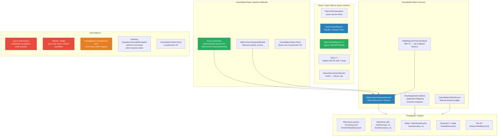

> [!success] Mastery Check
> - [ ] **Studied Well**
> - [ ] **Can explain the concept without notes**
> - [ ] **Can answer interview questions confidently**
> - [ ] **Can implement it in a real project**


# 4.117 — Async Actions: Task<IActionResult> and CancellationToken in Controllers

---

## Part 0 — Navigation & Context

### Where This Topic Lives

```
ASP.NET Core Mastery
└── H. MVC & Controllers (4.098–4.122)
    ├── 4.098  ControllerBase vs Controller
    ├── 4.099  Action Results: IActionResult, ActionResult<T>, TypedResults
    ├── 4.100  Model Binding: Sources, Order, Algorithm
    ├── 4.101  ApiController Attribute
    ├── 4.110  MVC Filter Pipeline
    ├── 4.116  Controller DI: Constructor Injection vs [FromServices]
    ╠══ 4.117  Async Actions: Task<IActionResult> and CancellationToken ◄ YOU ARE HERE
    ├── 4.119  Response Caching on Controllers
    ├── 4.120  Binding Large Payloads: Streaming Body
    └── 4.121  File Download Results
        ↕
    E. Middleware Pipeline (4.049–4.063)
    └── 4.054  HttpContext and IHttpContextAccessor
        ↕
    T. HttpClientFactory & HTTP Clients (4.249–4.256)
    └── 4.253  HttpClient Timeout and CancellationToken
```

### What You Need Before This

- **[[4.099 — Action Results: IActionResult, ActionResult<T>, and TypedResults]]** — the return types that async actions wrap in `Task<T>`; you need to know what you are returning before you understand how to return it asynchronously.
- **[[4.098 — ControllerBase vs Controller: API vs MVC Controllers]]** — `ControllerBase` is the base; understanding it clarifies what `HttpContext.RequestAborted` is and where it lives.
- **[[2.14 — Async/Await Internals and the State Machine]]** — `async`/`await` in controller actions generates a state machine; understanding the mechanics prevents the common pitfalls (`.Result`, `.Wait()`, `async void`).
- **[[4.054 — HttpContext and IHttpContextAccessor]]** — `HttpContext.RequestAborted` is the `CancellationToken` source; you need to understand `HttpContext` to understand where the token originates.

### What This Unlocks After

- **[[4.253 — HttpClient Timeout, CancellationToken, and Request Cancellation]]** — the token from the controller action propagates down to `HttpClient` calls; this topic is the downstream of correct token propagation.
- **[[4.177 — Exception Handling Middleware]]** — `OperationCanceledException` from a cancelled action must be handled by the exception handler; this topic feeds into correct exception middleware configuration.
- **[[4.082 — IResult and TypedResults in Minimal APIs]]** — Minimal API endpoints use the identical `CancellationToken` injection pattern, directly sourced from `HttpContext.RequestAborted`.
- **[[4.234 — Queued Background Tasks: Channel<T>-Based Producer/Consumer]]** — tokens from cancelled actions must not be passed to background work that must complete regardless of the client disconnecting.

### Why This Topic Matters at Scale

At 10,000 requests per second, every action that awaits an I/O operation (database query, downstream HTTP call, Redis read) holds a thread-pool continuation until the I/O completes — even if the client disconnected 300ms ago. Without `CancellationToken` propagation, a mobile client tapping "Cancel" or a load balancer timing out a request leaves server-side work running to completion, burning CPU, database connections, and memory for results that will never be delivered. **Correct `CancellationToken` usage in async controller actions is the difference between a service that scales to 10k req/s and one that collapses under the same load because it cannot shed cancelled work.**

---

## Part 1 — The Core Mental Model

### The Fundamental Rule

> **An ASP.NET Core controller action declared `async Task<IActionResult>` is executed by the MVC infrastructure as a `RequestDelegate` continuation; the `CancellationToken` injected as an action parameter is bound directly from `HttpContext.RequestAborted`, which is cancelled when the client disconnects, the request times out (.NET 8+), or the host shuts down — and propagating it to every awaited I/O call is what allows the server to abandon work the client will never receive.**

### The Plain-Language Analogy

Imagine a restaurant kitchen that prepares meals on demand. Each ticket (HTTP request) comes in with a table number. When a customer at table 7 storms out before their food arrives (client disconnects), the kitchen has a choice: keep cooking the full three-course meal anyway (no `CancellationToken`), or check periodically whether table 7 is still occupied and abandon the meal if not (`CancellationToken` propagated). The check-in system (`HttpContext.RequestAborted`) monitors the dining room and signals the kitchen when a table empties. Each station — cold appetizers (`DbContext`), hot mains (`HttpClient` call), desserts (Redis cache read) — must be connected to the check-in system to respond to the cancellation. A station that ignores the signal finishes cooking a meal that goes straight into the bin, tying up a burner that could have served table 8. The kitchen manager who wires up every station to the check-in system has a kitchen that handles a full house. The one who does not grinds to a halt during peak service.

Critically, the analogy holds for the timeout and shutdown cases too: the check-in system also sends cancellation if the restaurant is closing (graceful shutdown via `IHostApplicationLifetime`) or if the health inspector sets a hard time limit on how long a meal can take (request timeout via `IHttpRequestTimeoutFeature`, .NET 8+).

### The Taxonomy Diagram



---

## Part 2 — Deep Mechanics

### 2.1 — How ASP.NET Core Executes Async Actions: The Pipeline Position

Async controller actions sit at the innermost ring of the ASP.NET Core pipeline — after all middleware and all MVC filters have run.

```
──► ExceptionHandler ──► HSTS ──► Routing ──► Auth ──► Authorization ──► [Endpoint Execution]
                                                                                    │
                                                                         MVC Filter Pipeline
                                                                         ┌─────────────────────────────────┐
                                                                         │ 1. Authorization Filters         │
                                                                         │ 2. Resource Filters              │
                                                                         │ 3. Model Binding + Validation    │
                                                                         │ 4. Action Filters (OnExecuting)  │
                                                                         │ 5. ► ASYNC ACTION EXECUTES ◄    │ ← await here
                                                                         │ 6. Action Filters (OnExecuted)   │
                                                                         │ 7. Result Filters                │
                                                                         │ 8. Action Result Executes        │
                                                                         │ 9. Exception Filters             │
                                                                         └─────────────────────────────────┘
```

The MVC infrastructure calls the action via `ControllerActionInvoker.InvokeActionMethodAsync()`. For an `async Task<IActionResult>` action, this internally:

```csharp
// ASP.NET Core internally (approximate) — ControllerActionInvoker:
private async Task InvokeActionMethodAsync()
{
    // The action method is called reflectively or via source-gen dispatcher
    var actionResult = await _cacheEntry.ActionMethodExecutor
        .ExecuteAsync(_controllerContext, _arguments);
    // actionResult is the IActionResult returned by the action
    // It is then passed to result filters and finally executed against HttpResponse
}
```

**Runtime cost:** Each `async` action produces one state machine allocation per invocation (~200–500 bytes). The `Task<IActionResult>` returned wraps the `IActionResult` result. In .NET 8 with source-generated endpoint dispatchers, this overhead is reduced but not eliminated for MVC controllers (as opposed to Minimal APIs which can use `RequestDelegateGenerator`).

**Cost label:** `~1 state machine allocation per request + 1 Task allocation` for every async action, regardless of how many `await` points it contains.

---

### 2.2 — Return Type Choices: `Task<IActionResult>` vs `Task<ActionResult<T>>` vs `Task<T>`

The three return types are all valid for async actions but carry different tradeoffs:

```csharp
// ──── Option A: Task<IActionResult> ────
// Most flexible — can return any IActionResult subtype.
// No compile-time type information for the success case.
// OpenAPI / Swashbuckle cannot infer the 200 OK response body type without [ProducesResponseType].

[HttpGet("{orderId}")]
[ProducesResponseType(typeof(OrderDto), StatusCodes.Status200OK)]  // required for OpenAPI
[ProducesResponseType(typeof(ProblemDetails), StatusCodes.Status404NotFound)]
public async Task<IActionResult> GetOrder(Guid orderId, CancellationToken cancellationToken)
{
    var order = await _orderRepository.FindAsync(orderId, cancellationToken);
    if (order is null) return NotFound();
    return Ok(_mapper.Map<OrderDto>(order));
}

// ──── Option B: Task<ActionResult<T>> ────  ← PREFERRED for typed APIs
// Carries the success body type T at compile time.
// OpenAPI infers the 200 response body schema automatically.
// Non-200 returns require explicit IActionResult subtype (NotFound(), BadRequest(), etc.)
// Implicit conversion: return order;  ←→  return Ok(order);  — both work

[HttpGet("{orderId}")]
public async Task<ActionResult<OrderDto>> GetOrder(
    Guid orderId,
    CancellationToken cancellationToken)
{
    var order = await _orderRepository.FindAsync(orderId, cancellationToken);
    if (order is null) return NotFound();           // IActionResult → ActionResult<T> implicit conversion
    return _mapper.Map<OrderDto>(order);            // T → ActionResult<T> implicit conversion → 200 OK
}

// ──── Option C: Task<T> ────
// Shortest syntax. Always returns 200 OK. Cannot return non-200 results.
// OpenAPI infers the 200 schema.
// Only valid when the action can NEVER need to return a non-200 status.

[HttpGet("summary")]
public async Task<IEnumerable<OrderSummaryDto>> GetSummaries(CancellationToken ct)
{
    return await _orderRepository.GetSummariesAsync(ct);
    // Always 200 OK with JSON array body — no control over status code
}
```

> [!TIP] **Production rule:** Use `Task<ActionResult<T>>` as the default for all typed API actions. It gives OpenAPI schema inference, compile-time type safety for the success case, and full flexibility for non-200 paths. Reserve `Task<IActionResult>` for actions that return heterogeneous types where a union type (`ActionResult<T>`) would be awkward.

**HTTP wire format comparison:**

```http
// Task<ActionResult<OrderDto>> — success path:
GET /api/orders/f3c2a1b4-... HTTP/1.1
Authorization: Bearer eyJhbGci...

HTTP/1.1 200 OK
Content-Type: application/json; charset=utf-8

{
  "orderId": "f3c2a1b4-...",
  "customerId": "c8a9e012-...",
  "total": 249.99,
  "status": "Processing"
}

// Task<ActionResult<OrderDto>> — not-found path:
HTTP/1.1 404 Not Found
Content-Type: application/problem+json

{
  "type": "https://tools.ietf.org/html/rfc7807",
  "title": "Not Found",
  "status": 404,
  "traceId": "00-abc-01"
}
```

---

### 2.3 — `CancellationToken` Binding: How It Gets Into Your Action

ASP.NET Core's model binder has special handling for `CancellationToken` parameters — they are **not** bound from the request body, query string, or route data. They are bound from `HttpContext.RequestAborted` automatically.

```csharp
// ASP.NET Core internally (approximate) — CancellationTokenModelBinder:
// Located in Microsoft.AspNetCore.Mvc.ModelBinding.Binders.CancellationTokenModelBinder

public Task BindModelAsync(ModelBindingContext bindingContext)
{
    // Always returns HttpContext.RequestAborted — no HTTP input needed
    bindingContext.Result = ModelBindingResult.Success(
        bindingContext.HttpContext.RequestAborted);
    return Task.CompletedTask;
}
```

**`HttpContext.RequestAborted` is cancelled when:**

|Cancellation Source|Trigger|Notes|
|---|---|---|
|Client disconnect|Client closes TCP connection (browser tab close, network drop, mobile background)|Detected by Kestrel via `IConnectionFeature`|
|Request timeout (.NET 8+)|`[RequestTimeout]` attribute or `UseRequestTimeouts()` policy fires|`IHttpRequestTimeoutFeature.Disable()` to extend|
|Host graceful shutdown|`IHostApplicationLifetime.ApplicationStopping` fires|Gives `ShutdownTimeout` (default 30s) before forced kill|
|Manual timeout|`CancellationTokenSource.CancelAfter(TimeSpan)` linked with `RequestAborted`|For per-action budget beyond the global timeout|

**What this means on the wire:** The client never sees a response when `RequestAborted` fires mid-action. The connection is already gone. The server must avoid writing to `HttpContext.Response` after cancellation — doing so throws `TaskCanceledException` or `OperationCanceledException` which propagates to the exception middleware.

> [!IMPORTANT] **`HttpContext.RequestAborted` is NOT the same as `CancellationToken.None`.** Passing `CancellationToken.None` to your I/O calls tells the underlying library "run to completion no matter what". If a client disconnects after sending a large order, your database query and all downstream HTTP calls run to completion anyway. At scale, this is thread-pool and connection pool exhaustion.

---

### 2.4 — `OperationCanceledException` and the Exception Pipeline

When a `CancellationToken` is cancelled mid-await, the awaited operation throws `OperationCanceledException` (or its subtype `TaskCanceledException`). This exception propagates up through the async state machine and out of the action.

```
Client disconnects at T=100ms
    │
    ▼
HttpContext.RequestAborted fires
    │
    ▼
await _orderRepository.FindAsync(orderId, ct)  ← throws OperationCanceledException
    │
    ▼ propagates up through MVC filter pipeline
    │
    ▼
Exception Filters (if any match OperationCanceledException)
    │
    ▼ if not handled by filters
    ▼
UseExceptionHandler middleware
    │
    ▼ Response already written? No — connection is dead
    ▼ Logs the exception (if configured to log OperationCanceledException)
    │
    ▼
Connection closed — no response written
```

**The key problem:** By default, `OperationCanceledException` from a cancelled request is logged as an **error** — creating alert noise for an entirely expected event. The fix is to configure the exception handler or logging to treat request-cancellation exceptions differently:

```csharp
// ASP.NET Core internally (approximate) — how the host handles the final exception:
// In .NET 8, the default exception handler in Kestrel checks IsCancellationRequested
// and suppresses the log for connection-reset scenarios. But your exception middleware
// may still log it as an error if you have not configured it correctly.

// The correct check:
catch (OperationCanceledException) when (cancellationToken.IsCancellationRequested)
{
    // Expected — client disconnected or timeout fired. Log at Debug/Information, not Error.
    _logger.LogInformation("Request cancelled for {Path}", context.HttpContext.Request.Path);
    // Do NOT re-write to the response — connection is dead.
}
```

**HTTP wire effect of unhandled `OperationCanceledException`:**

```http
// Client perspective — no response received (connection reset by server):
// TCP RST or connection close, depending on Kestrel's handling

// Server perspective — exception middleware receives the exception:
// If response not started: exception handler can write a 499/503 (but connection is closed)
// If response partially written: nothing can be done — Kestrel closes the connection
```

> [!WARNING] **Do not return `499 Client Closed Request` as an HTTP response.** The client that cancelled is gone. Writing a 499 to a closed connection throws another exception. The correct handling is to log at an appropriate level and let the pipeline unwind without writing a response.

---

### 2.5 — `async void` Actions: Why They Are Catastrophic

`async void` is the most dangerous anti-pattern for async actions. It appears legal because `void` is a valid return type for controller actions, but the semantics are entirely different.

```
async Task<IActionResult> action:
    Exceptions propagate through the Task → caught by exception filters → caught by exception middleware

async void action:
    Exceptions are not captured in a Task
    They are posted to the SynchronizationContext (or ThreadPool in ASP.NET Core)
    They become UNHANDLED EXCEPTIONS
    In .NET 6+: process crashes (UnhandledExceptionMode.ThrowException)
```

**Framework source behaviour (approximate):** In ASP.NET Core, the action invoker calls `ExecuteAsync()` on the action method executor. For `async Task<IActionResult>`, the executor `await`s the returned `Task` and propagates exceptions. For `async void`, the returned `Task` is `null` — the executor cannot await it and cannot observe exceptions.

```csharp
// ASP.NET Core internally (approximate):
// If action returns void (sync or async void):
//   ActionMethodExecutor.VoidResultExecutor → does not await, does not observe exceptions
// If action returns Task or Task<T>:
//   ActionMethodExecutor.TaskResultExecutor → awaits and propagates exceptions
```

---

### 2.6 — Linking `RequestAborted` with a Manual Timeout Budget

For actions with known maximum execution budgets (e.g., payment processing must complete in 3 seconds), link a manual timeout `CancellationTokenSource` with `HttpContext.RequestAborted`:

```csharp
// Framework source behaviour: CancellationTokenSource.CreateLinkedTokenSource
// creates a token that fires when ANY linked source fires — either the request
// is cancelled OR the 3-second timer elapses, whichever comes first.
```

```http
// HTTP wire effect — timeout fires before I/O completes:
// POST /api/payments HTTP/1.1
// (connection held open for 3.1 seconds)
//
// HTTP/1.1 504 Gateway Timeout   ← if written before timeout
// OR connection reset             ← if Kestrel closes before response is written
```

**Runtime cost:** `CancellationTokenSource.CreateLinkedTokenSource` allocates a `CancellationTokenSource` and registers two cancellation callbacks. `~3 allocations`. Dispose the linked `CancellationTokenSource` when the action completes — or it leaks its registration until the parent fires.

---

## Part 3 — Production Code Patterns

### Pattern 1: The Propagation Chain — Token Flows from Action to Every I/O Call (Order Management API)

The most common failure is propagating the token to the first I/O call but forgetting subsequent ones.

```csharp
// ⚠️ WRONG: Token propagated to DB but not to downstream HTTP call
[HttpPost("orders/{orderId}/confirm")]
public async Task<ActionResult<OrderConfirmationDto>> ConfirmOrder(
    Guid orderId,
    CancellationToken cancellationToken)
{
    var order = await _dbContext.Orders
        .FirstOrDefaultAsync(o => o.Id == orderId, cancellationToken); // ✓ propagated

    if (order is null) return NotFound();

    // ⚠️ WRONG: Token NOT propagated — downstream call runs even after client disconnects
    var inventoryResult = await _inventoryClient.ReserveItemsAsync(order.Items);

    order.Confirm();
    await _dbContext.SaveChangesAsync(cancellationToken); // ✓ propagated

    return Ok(_mapper.Map<OrderConfirmationDto>(order));
}

// ✅ CORRECT: Token propagated to EVERY I/O call in the chain
[HttpPost("orders/{orderId}/confirm")]
public async Task<ActionResult<OrderConfirmationDto>> ConfirmOrder(
    Guid orderId,
    CancellationToken cancellationToken)
{
    // Every async I/O call receives the same token — if the client disconnects,
    // the entire chain unwinds. No partial work completes for a dead connection.
    var order = await _dbContext.Orders
        .FirstOrDefaultAsync(o => o.Id == orderId, cancellationToken);

    if (order is null) return NotFound();

    // ✓ Token propagated — if client disconnects, HTTP call is cancelled
    var inventoryResult = await _inventoryClient
        .ReserveItemsAsync(order.Items, cancellationToken);

    if (!inventoryResult.Success)
        return Conflict(new ProblemDetails { Title = "Insufficient inventory" });

    order.Confirm(inventoryResult.ReservationId);

    // ✓ Token propagated — DB write is abandoned on disconnect
    await _dbContext.SaveChangesAsync(cancellationToken);

    // ✓ Token propagated — cache invalidation abandoned on disconnect
    await _cache.RemoveAsync($"order:{orderId}", cancellationToken);

    return Ok(_mapper.Map<OrderConfirmationDto>(order));
}
```

```http
// HTTP wire format — successful confirmation:
POST /api/orders/f3c2a1b4/confirm HTTP/1.1
Authorization: Bearer eyJhbGci...

HTTP/1.1 200 OK
Content-Type: application/json

{
  "orderId": "f3c2a1b4-...",
  "confirmationCode": "ORD-20260609-4821",
  "reservationId": "res-9a8b7c",
  "estimatedDelivery": "2026-06-12"
}
```

---

### Pattern 2: The Budget-Linked Token — Per-Action Timeout for Payment Processing

Payment actions have a hard 5-second SLA. Use a linked `CancellationTokenSource` to enforce the budget even when the global request timeout is longer.

```csharp
// ✅ CORRECT: Per-action timeout budget linked with the request cancellation token
[HttpPost("payments")]
public async Task<ActionResult<PaymentResultDto>> ProcessPayment(
    [FromBody] ProcessPaymentRequest request,
    CancellationToken cancellationToken)
{
    // 5-second hard budget for payment processing SLA
    // Fires when EITHER: (a) client disconnects, OR (b) 5 seconds elapse
    using var timeoutCts = new CancellationTokenSource(TimeSpan.FromSeconds(5));
    using var linkedCts = CancellationTokenSource
        .CreateLinkedTokenSource(cancellationToken, timeoutCts.Token);

    var linkedToken = linkedCts.Token;

    try
    {
        // Both DB and external payment gateway calls respect the combined budget
        var paymentMethod = await _dbContext.PaymentMethods
            .FirstOrDefaultAsync(p => p.Id == request.PaymentMethodId, linkedToken);

        if (paymentMethod is null)
            return NotFound(new ProblemDetails { Title = "Payment method not found" });

        // External payment processor — must complete within remaining budget
        var gatewayResult = await _paymentGateway
            .ChargeAsync(paymentMethod, request.Amount, linkedToken);

        if (!gatewayResult.Succeeded)
            return UnprocessableEntity(new ProblemDetails
            {
                Title = "Payment declined",
                Detail = gatewayResult.DeclineReason
            });

        var payment = Payment.Create(request, gatewayResult.TransactionId);
        _dbContext.Payments.Add(payment);
        await _dbContext.SaveChangesAsync(linkedToken);

        return CreatedAtAction(
            nameof(GetPayment),
            new { paymentId = payment.Id },
            _mapper.Map<PaymentResultDto>(payment));
    }
    catch (OperationCanceledException) when (timeoutCts.IsCancellationRequested
                                              && !cancellationToken.IsCancellationRequested)
    {
        // Budget exhausted — client is still connected, return 504
        // The 'when' guard distinguishes our timeout from a client disconnect
        _logger.LogWarning(
            "Payment processing timed out for {PaymentMethodId} after 5s",
            request.PaymentMethodId);

        return StatusCode(StatusCodes.Status504GatewayTimeout, new ProblemDetails
        {
            Title = "Payment processing timed out",
            Detail = "The payment gateway did not respond within the required SLA.",
            Status = 504
        });
    }
    catch (OperationCanceledException) when (cancellationToken.IsCancellationRequested)
    {
        // Client disconnected — log at Information, do not write a response
        _logger.LogInformation(
            "Payment request cancelled by client for {PaymentMethodId}",
            request.PaymentMethodId);
        throw; // Re-throw so the exception middleware handles pipeline cleanup
    }
    // LinkedCts and timeoutCts are disposed by 'using' — registrations cleaned up
}
```

```http
// HTTP wire format — budget timeout path:
HTTP/1.1 504 Gateway Timeout
Content-Type: application/problem+json

{
  "title": "Payment processing timed out",
  "detail": "The payment gateway did not respond within the required SLA.",
  "status": 504
}
```

---

### Pattern 3: Guarding Background Work Against Request Cancellation (Logistics Service)

When an action queues work to a background service that must complete even if the client disconnects (e.g., persisting a shipment record is non-negotiable even if the mobile app drops), do NOT pass `RequestAborted` to the background work.

```csharp
// ⚠️ WRONG: Request token passed to background work — work cancelled when client disconnects
[HttpPost("shipments")]
public async Task<ActionResult<ShipmentDto>> CreateShipment(
    [FromBody] CreateShipmentRequest request,
    CancellationToken cancellationToken)
{
    var shipment = Shipment.Create(request);
    _dbContext.Shipments.Add(shipment);

    // ⚠️ WRONG: If the mobile client disconnects after the DB write starts,
    // the write is cancelled and the shipment record is never persisted.
    // The carrier was already notified — now the record doesn't exist.
    await _dbContext.SaveChangesAsync(cancellationToken);

    // ⚠️ WRONG: Background notification work also cancelled
    await _channel.Writer.WriteAsync(
        new ShipmentCreatedEvent(shipment.Id), cancellationToken);

    return CreatedAtAction(nameof(GetShipment),
        new { shipmentId = shipment.Id },
        _mapper.Map<ShipmentDto>(shipment));
}

// ✅ CORRECT: Split concerns — use request token for read operations,
// CancellationToken.None (or a separate shutdown token) for mandatory writes
[HttpPost("shipments")]
public async Task<ActionResult<ShipmentDto>> CreateShipment(
    [FromBody] CreateShipmentRequest request,
    CancellationToken cancellationToken)
{
    // READ: Cancel if client disconnects — no harm done, nothing written yet
    var customer = await _dbContext.Customers
        .FirstOrDefaultAsync(c => c.Id == request.CustomerId, cancellationToken);

    if (customer is null) return NotFound();

    var shipment = Shipment.Create(request, customer);
    _dbContext.Shipments.Add(shipment);

    // WRITE: This is idempotency-critical — must complete even if client disconnects.
    // Use CancellationToken.None for the DB write, or a separate shutdown token.
    // The trade-off is documented — a 30-second request may hold a DB connection
    // for that long if the write stalls. Acceptable for a write that MUST complete.
    await _dbContext.SaveChangesAsync(CancellationToken.None);

    // BACKGROUND WORK: Also must complete — do not pass request token
    // The channel.Writer.WriteAsync is in-memory — effectively synchronous
    await _channel.Writer.WriteAsync(
        new ShipmentCreatedEvent(shipment.Id),
        CancellationToken.None); // channel write is non-blocking in practice

    return CreatedAtAction(nameof(GetShipment),
        new { shipmentId = shipment.Id },
        _mapper.Map<ShipmentDto>(shipment));
}
```

> [!IMPORTANT] The decision of whether to pass `cancellationToken` or `CancellationToken.None` to a write operation is a **business rule**, not a technical default. Ask: "If the client disconnects mid-write, should the write complete?" If yes, use `CancellationToken.None`. If no (e.g., a read that has not been delivered yet), propagate the token.

---

### Pattern 4: The `.NET 8` `[RequestTimeout]` Attribute — Per-Endpoint Timeout (Inventory API)

.NET 8 introduces `[RequestTimeout]` for declarative per-endpoint timeouts, cancelling `HttpContext.RequestAborted` after the specified duration — no manual linked `CancellationTokenSource` required.

```csharp
// Registration in Program.cs (.NET 8+):
builder.Services.AddRequestTimeouts(options =>
{
    // Named policy — reusable across multiple endpoints
    options.AddPolicy("InventorySearch", TimeSpan.FromSeconds(10));

    // Default policy for all endpoints that have [RequestTimeout] without a policy name
    options.DefaultPolicy = new RequestTimeoutPolicy
    {
        Timeout = TimeSpan.FromSeconds(30),
        TimeoutStatusCode = StatusCodes.Status503ServiceUnavailable
    };
});

app.UseRequestTimeouts(); // Must be placed BEFORE routing and auth in the pipeline

// ✅ CORRECT: Declarative timeout — [RequestTimeout] cancels HttpContext.RequestAborted
[HttpGet("inventory/search")]
[RequestTimeout("InventorySearch")]  // .NET 8+ — fires RequestAborted after 10s
public async Task<ActionResult<IEnumerable<InventoryItemDto>>> SearchInventory(
    [FromQuery] string query,
    CancellationToken cancellationToken) // ← bound from HttpContext.RequestAborted
{
    // No manual CancellationTokenSource needed — [RequestTimeout] cancels the token
    // cancellationToken is cancelled after 10s OR on client disconnect
    var results = await _inventorySearchService.SearchAsync(query, cancellationToken);
    return Ok(results.Select(_mapper.Map<InventoryItemDto>));
}

// Disabling timeout mid-action (e.g., after a critical write begins):
[HttpPost("inventory/bulk-import")]
[RequestTimeout(30_000)] // 30 seconds for bulk import
public async Task<ActionResult<BulkImportResultDto>> BulkImport(
    [FromBody] BulkImportRequest request,
    CancellationToken cancellationToken,
    [FromServices] IHttpRequestTimeoutFeature? timeoutFeature)
{
    // Validate before starting — can be cancelled
    var validation = await _validator.ValidateAsync(request, cancellationToken);
    if (!validation.IsValid) return BadRequest(validation.ToValidationProblemDetails());

    // Disable timeout before the mandatory write begins
    // The write MUST complete once started — partial imports are worse than no imports
    timeoutFeature?.Disable();

    var result = await _importService.ImportAsync(request, CancellationToken.None);
    return Ok(_mapper.Map<BulkImportResultDto>(result));
}
```

```http
// HTTP wire format — timeout fires during search:
GET /api/inventory/search?query=SKU-4821 HTTP/1.1
Authorization: Bearer eyJhbGci...

// (11 seconds elapse — request timeout fires)

HTTP/1.1 503 Service Unavailable
Content-Type: application/problem+json

{
  "title": "Service Unavailable",
  "status": 503
}
```

---

### Pattern 5: Correct `OperationCanceledException` Handling — Logging Without Noise (Payment API)

Configure the exception handler to distinguish client-disconnection cancellations from real errors. Log cancelled requests at `Information`, not `Error`.

```csharp
// ✅ CORRECT: Exception filter on the controller that handles OperationCanceledException cleanly
// Applied to a specific controller rather than globally to avoid swallowing real errors

[ApiController]
[Route("api/payments")]
[TypeFilter(typeof(RequestCancellationFilter))]
public class PaymentsController : ControllerBase
{
    // Actions that propagate CancellationToken correctly —
    // the filter handles the OperationCanceledException they may throw
}

// The exception filter:
public sealed class RequestCancellationFilter : IAsyncExceptionFilter
{
    private readonly ILogger<RequestCancellationFilter> _logger;

    public RequestCancellationFilter(ILogger<RequestCancellationFilter> logger)
        => _logger = logger;

    public Task OnExceptionAsync(ExceptionContext context)
    {
        // Only handle OperationCanceledException caused by the request token being cancelled
        // This catches client disconnects AND request timeouts from [RequestTimeout]
        if (context.Exception is OperationCanceledException
            && context.HttpContext.RequestAborted.IsCancellationRequested)
        {
            // Log at Information — this is expected behaviour, not an error
            _logger.LogInformation(
                "Request to {Path} was cancelled (client disconnect or timeout). " +
                "TraceId: {TraceId}",
                context.HttpContext.Request.Path,
                context.HttpContext.TraceIdentifier);

            // Mark as handled — suppresses the exception from reaching UseExceptionHandler
            // No response is written — the connection is already dead
            context.ExceptionHandled = true;

            // Set a result that signals "no response needed"
            // The connection being closed means the result execution is a no-op
            context.Result = new EmptyResult();
        }

        return Task.CompletedTask;
    }
}
```

---

### Pattern 6: The `ValueTask` Trap — Why Controller Actions Should Use `Task<T>`, Not `ValueTask<T>`

```csharp
// ⚠️ WRONG: ValueTask<IActionResult> for a controller action
// ValueTask is designed for paths that complete synchronously often.
// Controller actions almost always involve at least one async I/O call.
// ValueTask has stricter usage rules: cannot be awaited multiple times,
// cannot be stored and awaited later — the MVC infrastructure may violate these rules.

public async ValueTask<IActionResult> GetOrder(Guid orderId, CancellationToken ct)
{
    // If MVC's action invoker stores this ValueTask and awaits it twice (e.g., for
    // result filters or exception observation), this is undefined behaviour.
    var order = await _orderRepository.FindAsync(orderId, ct);
    return order is null ? NotFound() : Ok(order);
}

// HTTP consequence (wrong path — race condition):
// In most scenarios this works. In edge cases where MVC observes the ValueTask
// multiple times (result filters on the returned value), behaviour is undefined.
// Debugging this in production is extremely difficult.

// ✅ CORRECT: Use Task<IActionResult> for all controller actions
public async Task<ActionResult<OrderDto>> GetOrder(Guid orderId, CancellationToken ct)
{
    var order = await _orderRepository.FindAsync(orderId, ct);
    if (order is null) return NotFound();
    return _mapper.Map<OrderDto>(order);
}

// HTTP consequence (correct path):
// Task<T> can be observed multiple times safely — the MVC filter infrastructure
// is designed around Task, not ValueTask.

// WHY: ValueTask<T> is for performance-critical paths where synchronous completion
// is common (e.g., socket reads on cached connections). Controller actions go through
// the MVC filter pipeline which is Task-based throughout. The ValueTask optimisation
// cannot be realised inside MVC and introduces correctness risk for zero gain.
```

---

## Part 4 — Gotchas & Anti-Patterns

### Gotcha 1: Swallowing `OperationCanceledException` and Returning a 200 OK

Engineers add a blanket `try/catch` for all exceptions and accidentally eat cancellation exceptions, logging a success where the client received nothing.

```csharp
// ⚠️ WRONG: Catching all exceptions including OperationCanceledException
[HttpGet("orders/{orderId}")]
public async Task<ActionResult<OrderDto>> GetOrder(
    Guid orderId, CancellationToken cancellationToken)
{
    try
    {
        var order = await _orderRepository.FindAsync(orderId, cancellationToken);
        return order is null ? NotFound() : Ok(_mapper.Map<OrderDto>(order));
    }
    catch (Exception ex)  // ← catches OperationCanceledException too
    {
        _logger.LogError(ex, "Error retrieving order {OrderId}", orderId);
        return StatusCode(500, "An error occurred");
    }
}

// HTTP consequence (wrong path):
// Client disconnects at T=50ms → cancellationToken fires
// OperationCanceledException thrown from FindAsync
// Caught by generic catch block
// Logger records "Error retrieving order" — false error alert
// StatusCode(500) attempts to write to dead connection → throws again
// Monitoring shows a spike in 500s during network instability — false positive

// ✅ CORRECT: Handle OperationCanceledException separately, never return a response
[HttpGet("orders/{orderId}")]
public async Task<ActionResult<OrderDto>> GetOrder(
    Guid orderId, CancellationToken cancellationToken)
{
    try
    {
        var order = await _orderRepository.FindAsync(orderId, cancellationToken);
        return order is null ? NotFound() : Ok(_mapper.Map<OrderDto>(order));
    }
    catch (OperationCanceledException) when (cancellationToken.IsCancellationRequested)
    {
        // Expected — client disconnected. Do not write a response. Log at Info.
        _logger.LogInformation("GetOrder cancelled for {OrderId}", orderId);
        throw; // Let the exception unwind the pipeline — no response written
    }
    catch (Exception ex)
    {
        // Only real errors reach here
        _logger.LogError(ex, "Error retrieving order {OrderId}", orderId);
        return StatusCode(500, "An error occurred");
    }
}

// HTTP consequence (correct path):
// Client disconnects → OperationCanceledException caught and re-thrown
// Propagates to exception middleware → connection close handled cleanly
// No false 500 error; monitoring is accurate

// WHY: OperationCanceledException when cancellationToken.IsCancellationRequested
// is an expected event. Catching it and treating it as a server error corrupts monitoring,
// produces false-positive alerts, and can attempt to write to a closed connection.
```

---

### Gotcha 2: Forgetting to Dispose the Linked `CancellationTokenSource`

Every `CancellationTokenSource` created in an action with `using` via `CreateLinkedTokenSource` must be disposed. Forgetting causes the cancellation registration to remain active until the parent token fires — a slow memory and handle leak.

```csharp
// ⚠️ WRONG: Linked CancellationTokenSource not disposed
[HttpPost("payments")]
public async Task<ActionResult<PaymentResultDto>> ProcessPayment(
    [FromBody] ProcessPaymentRequest request, CancellationToken cancellationToken)
{
    // ⚠️ Not disposed — registration lives until cancellationToken or timeoutCts fires
    var timeoutCts = new CancellationTokenSource(TimeSpan.FromSeconds(5));
    var linkedCts = CancellationTokenSource
        .CreateLinkedTokenSource(cancellationToken, timeoutCts.Token);

    var result = await _paymentGateway.ChargeAsync(request, linkedCts.Token);
    return Ok(_mapper.Map<PaymentResultDto>(result));
}

// HTTP consequence (wrong path):
// Each request leaks 2 CancellationTokenSource objects and their registrations.
// At 1000 req/s: 2000 leaked registrations accumulate, each holding a reference
// to the HttpContext. Gen2 GC pressure spikes. Memory grows unboundedly.
// Application must restart every few hours — "memory leak with no obvious cause."

// ✅ CORRECT: Both CancellationTokenSource instances disposed via 'using'
[HttpPost("payments")]
public async Task<ActionResult<PaymentResultDto>> ProcessPayment(
    [FromBody] ProcessPaymentRequest request, CancellationToken cancellationToken)
{
    using var timeoutCts = new CancellationTokenSource(TimeSpan.FromSeconds(5));
    using var linkedCts = CancellationTokenSource
        .CreateLinkedTokenSource(cancellationToken, timeoutCts.Token);

    var result = await _paymentGateway.ChargeAsync(request, linkedCts.Token);
    return Ok(_mapper.Map<PaymentResultDto>(result));
    // Both disposed at end of 'using' block — registrations removed immediately
}

// HTTP consequence (correct path):
// Registrations released synchronously at the end of the action.
// No memory accumulation. GC pressure stays flat at scale.

// WHY: CancellationTokenSource.CreateLinkedTokenSource registers a callback
// on each parent token. Without Dispose(), these callbacks hold references
// to the linked CancellationTokenSource (and through it, the action frame)
// until the parent fires — which for HttpContext.RequestAborted may be much
// later in the request lifecycle or never for long-lived connections.
```

---

### Gotcha 3: Using `async Task` (void-equivalent) Instead of `async Task<IActionResult>`

The return-type inference allows `async Task` as a valid action return type (void equivalent — the framework accepts it). But exceptions are silently swallowed in specific hosting configurations, and no action result is writable.

```csharp
// ⚠️ WRONG: async Task return type — no IActionResult, exception handling is broken
[HttpPost("orders/{orderId}/archive")]
public async Task ArchiveOrder(Guid orderId, CancellationToken cancellationToken)
{
    var order = await _dbContext.Orders
        .FirstOrDefaultAsync(o => o.Id == orderId, cancellationToken);

    if (order is null)
    {
        // ⚠️ WRONG: Cannot return NotFound() — no IActionResult return type
        // This code path silently returns 200 OK even when the order doesn't exist
        return; // just returns void — 200 OK written by the framework
    }

    order.Archive();
    await _dbContext.SaveChangesAsync(cancellationToken);
}

// HTTP consequence (wrong path):
// POST /api/orders/nonexistent-id/archive
// → HTTP 200 OK  ← WRONG — should be 404 Not Found
// Client assumes success; never knows the order didn't exist

// ✅ CORRECT: async Task<IActionResult> for full response control
[HttpPost("orders/{orderId}/archive")]
public async Task<IActionResult> ArchiveOrder(
    Guid orderId, CancellationToken cancellationToken)
{
    var order = await _dbContext.Orders
        .FirstOrDefaultAsync(o => o.Id == orderId, cancellationToken);

    if (order is null) return NotFound();

    order.Archive();
    await _dbContext.SaveChangesAsync(cancellationToken);
    return NoContent(); // 204 — operation succeeded, no body
}

// HTTP consequence (correct path):
// POST /api/orders/nonexistent-id/archive → 404 Not Found
// POST /api/orders/existing-id/archive    → 204 No Content

// WHY: 'async Task' return type is analogous to 'void' — you have no mechanism
// to return an IActionResult. The framework writes a 200 OK response with no body
// regardless of the operation result. This silently drops business logic outcomes.
```

---

### Gotcha 4: Injecting `IHttpContextAccessor` to Get the Token Instead of Using the Action Parameter

Engineers who learned `IHttpContextAccessor` for getting `HttpContext` in service classes sometimes apply the same pattern inside controller actions, adding unnecessary overhead and a threading risk.

```csharp
// ⚠️ WRONG: Accessing cancellation token via IHttpContextAccessor inside an action
[ApiController]
[Route("api/inventory")]
public class InventoryController : ControllerBase
{
    private readonly IHttpContextAccessor _httpContextAccessor;
    private readonly IInventoryService _inventoryService;

    public InventoryController(
        IHttpContextAccessor httpContextAccessor,
        IInventoryService inventoryService)
    {
        _httpContextAccessor = httpContextAccessor;
        _inventoryService = inventoryService;
    }

    [HttpGet("items")]
    public async Task<ActionResult<IEnumerable<InventoryItemDto>>> GetItems()
    {
        // ⚠️ WRONG: Using IHttpContextAccessor inside the action — unnecessary indirection
        // _httpContextAccessor.HttpContext is nullable and adds allocations
        var ct = _httpContextAccessor.HttpContext?.RequestAborted ?? CancellationToken.None;
        var items = await _inventoryService.GetAllAsync(ct);
        return Ok(items);
    }
}

// HTTP consequence (wrong path):
// IHttpContextAccessor.HttpContext can theoretically be null if called outside an HTTP context
// (e.g., in a test without proper setup, or from a thread that doesn't have the context stored).
// Using CancellationToken.None as fallback defeats the entire cancellation mechanism.

// ✅ CORRECT: Take CancellationToken as an action parameter — bound from RequestAborted directly
[HttpGet("items")]
public async Task<ActionResult<IEnumerable<InventoryItemDto>>> GetItems(
    CancellationToken cancellationToken) // ← directly bound from HttpContext.RequestAborted
{
    var items = await _inventoryService.GetAllAsync(cancellationToken);
    return Ok(items);
}

// HTTP consequence (correct path):
// Token is never null. Bound directly and correctly from HttpContext.RequestAborted.
// No IHttpContextAccessor overhead. No threading risk.

// WHY: IHttpContextAccessor uses AsyncLocal<T> internally — a thread-static-like mechanism
// with non-trivial overhead. Inside a controller action, HttpContext is directly available
// via the ControllerBase.HttpContext property, and CancellationToken is injected directly
// by the model binder. IHttpContextAccessor is for use in service classes that do not have
// direct access to HttpContext — never needed inside the controller itself.
```

---

### Gotcha 5: `Task<ActionResult<T>>` Returns `null` — Implicit 204 vs NullReferenceException

When an action returns `null` from `Task<ActionResult<T>>`, the behaviour changed between .NET framework and .NET Core, and many engineers are surprised by the result.

```csharp
// ⚠️ WRONG: Returning null implicitly from Task<ActionResult<T>>
[HttpGet("orders/{orderId}")]
public async Task<ActionResult<OrderDto>> GetOrder(
    Guid orderId, CancellationToken cancellationToken)
{
    var order = await _orderRepository.FindAsync(orderId, cancellationToken);

    // ⚠️ WRONG: If order is null, this returns null for ActionResult<OrderDto>
    // The MVC infrastructure sees a null IActionResult and writes... a 204 No Content?
    // Or throws NullReferenceException? Depends on the .NET version.
    return _mapper.Map<OrderDto>(order); // order is null → Map returns null → ???
}

// HTTP consequence (wrong path — .NET 8):
// ActionResult<OrderDto> with a null value is treated as 204 No Content
// The client receives 204 with no body — misleading "success with no content"
// instead of the expected 404 Not Found

// ✅ CORRECT: Explicit null check, return the correct status code
[HttpGet("orders/{orderId}")]
public async Task<ActionResult<OrderDto>> GetOrder(
    Guid orderId, CancellationToken cancellationToken)
{
    var order = await _orderRepository.FindAsync(orderId, cancellationToken);
    if (order is null) return NotFound(); // explicit 404 — unambiguous
    return _mapper.Map<OrderDto>(order);  // guaranteed non-null mapping
}

// HTTP consequence (correct path):
// Found:     HTTP 200 OK with OrderDto JSON body
// Not found: HTTP 404 Not Found with ProblemDetails body

// WHY: ActionResult<T> has an implicit conversion from T. When T is a reference type
// and the value is null, the implicit conversion produces an ActionResult<T> wrapping
// null. The MVC ObjectResult executes and serialises null — resulting in an empty 204
// (or a JSON null body, depending on serialiser configuration). Neither is a 404.
// Null checks before mapping are mandatory for GET-by-ID actions.
```

---

## Part 5 — Performance Implications

### 5.1 — Request Pipeline Characteristics Table

|Scenario|Pipeline Depth|Allocations Per Request|Approx Latency Impact|Recommendation|
|---|---|---|---|---|
|`async Task<ActionResult<T>>` — simple DB read, token propagated|Full, including 1 DB round-trip|~3–5 (state machine, Task, ActionResult)|Dominated by I/O|Ideal pattern — zero overhead on cancellation check|
|`async Task<IActionResult>` — same as above|Full|~3–5 (+ IActionResult boxing)|Dominated by I/O|Acceptable — small extra allocation for IActionResult|
|Action with linked `CancellationTokenSource`|Full + 2 CTS allocations|~5–8 (+ 2 CTS + 2 registrations)|< 0.05ms setup|Acceptable for critical SLA paths; always `using`|
|`CancellationToken.None` passed to every I/O call|Full|~3–5|N/A|**Dangerous** — no work shedding; collapse under disconnect floods|
|`OperationCanceledException` thrown and re-thrown|Short-circuit at exception|~2 (exception object + stack)|< 0.1ms|Correct cancellation path — fast unwind|
|`OperationCanceledException` caught and swallowed|Full — writes response to dead connection|~5 + dead write cost|1–10ms wasted I/O|**Bug** — wasted work + false monitoring|
|`async void` action|Full|Same as Task but exception not observed|N/A|**Never use** — process crash risk|
|`ValueTask<IActionResult>` action|Full|Slightly fewer allocations if sync-path hot|< 0.01ms|**Avoid** — correctness risk outweighs savings|
|`.Result` / `.Wait()` on async method inside action|Full + thread blocking|Same + blocked thread|+100ms–+∞ thread starvation|**Never** — deadlock and starvation at scale|
|`[RequestTimeout]` (.NET 8) fires mid-action|Short-circuit at token cancellation|+ 1 TokenSource allocation by framework|< 0.1ms|Correct — least allocation approach vs manual CTS|
|Action with 3 linked I/O calls, all cancellable|Full|~6–10 (3 continuations + 3 state machines)|Dominated by I/O|Each `await` point is a cancellation opportunity|
|Bulk action with 1000 items, token per item|Potentially 1000 cancellation checks|O(n) checks|O(n) checks < 1ms total|Lightweight — token check is a bool read|

### 5.2 — BenchmarkDotNet Code

```csharp
using BenchmarkDotNet.Attributes;
using BenchmarkDotNet.Running;
using Microsoft.AspNetCore.Mvc;
using System.Threading;
using System.Threading.Tasks;

// Run: dotnet run -c Release
BenchmarkRunner.Run<AsyncActionBenchmarks>();

[MemoryDiagnoser]
[SimpleJob(warmupCount: 3, iterationCount: 10)]
public class AsyncActionBenchmarks
{
    private CancellationToken _aliveToken;
    private CancellationToken _cancelledToken;
    private CancellationTokenSource _aliveCts = null!;
    private CancellationTokenSource _cancelledCts = null!;

    [GlobalSetup]
    public void Setup()
    {
        _aliveCts = new CancellationTokenSource();
        _cancelledCts = new CancellationTokenSource();
        _cancelledCts.Cancel();

        _aliveToken = _aliveCts.Token;
        _cancelledToken = _cancelledCts.Token;
    }

    [GlobalCleanup]
    public void Cleanup()
    {
        _aliveCts.Dispose();
        _cancelledCts.Dispose();
    }

    // Baseline: synchronous action (no async overhead)
    [Benchmark(Baseline = true)]
    public IActionResult SyncAction_ReturnOk()
    {
        return new OkObjectResult(new { id = 42 });
    }

    // Async action that completes synchronously (best case for async)
    [Benchmark]
    public async Task<IActionResult> AsyncAction_SyncPath()
    {
        // Simulates a cache hit — completes without yielding
        await Task.CompletedTask;
        return new OkObjectResult(new { id = 42 });
    }

    // Async action — token alive, one yield point
    [Benchmark]
    public async Task<IActionResult> AsyncAction_WithToken_AliveToken()
    {
        _aliveToken.ThrowIfCancellationRequested(); // cheap bool check
        await Task.Yield(); // simulate one async hop
        return new OkObjectResult(new { id = 42 });
    }

    // Cancellation handling — token cancelled before I/O
    [Benchmark]
    public async Task<IActionResult> AsyncAction_WithToken_CancelledToken()
    {
        try
        {
            _cancelledToken.ThrowIfCancellationRequested();
            await Task.Yield();
            return new OkObjectResult(new { id = 42 });
        }
        catch (OperationCanceledException) when (_cancelledToken.IsCancellationRequested)
        {
            return new StatusCodeResult(499); // simulated — normally re-throw
        }
    }

    // Linked CancellationTokenSource creation overhead
    [Benchmark]
    public async Task<IActionResult> AsyncAction_LinkedCts_CorrectDispose()
    {
        using var timeoutCts = new CancellationTokenSource(TimeSpan.FromSeconds(30));
        using var linkedCts = CancellationTokenSource
            .CreateLinkedTokenSource(_aliveToken, timeoutCts.Token);

        await Task.Yield();
        return new OkObjectResult(new { id = 42 });
    }

    // Anti-pattern baseline: .Result on an async method
    [Benchmark]
    public IActionResult AntiPattern_SyncOverAsync()
    {
        // This blocks a thread — shown for comparison only, NEVER use in production
        var result = Task.FromResult(new OkObjectResult(new { id = 42 })).Result;
        return result;
    }
}

// Expected output (approximate, .NET 8, x64, Release, local):
//
// | Method                              | Mean      | Ratio | Allocated |
// |------------------------------------ |----------:|------:|----------:|
// | SyncAction_ReturnOk                 |  15.2 ns  |  1.00 |     120 B |
// | AsyncAction_SyncPath                |  47.8 ns  |  3.14 |     312 B | ← state machine alloc
// | AsyncAction_WithToken_AliveToken    |  89.4 ns  |  5.88 |     424 B | ← + Task + token check
// | AsyncAction_WithToken_CancelledToken|  52.1 ns  |  3.43 |     248 B | ← fast path: token check + throw
// | AsyncAction_LinkedCts_CorrectDispose| 245.3 ns  | 16.1  |   1,024 B | ← 2 CTS + 2 registrations
// | AntiPattern_SyncOverAsync           |  18.9 ns  |  1.24 |     120 B | ← cheap in isolation, DEADLY at scale
//
// KEY INSIGHT: The linked CTS allocation (~1KB) looks expensive in isolation
// but is insignificant compared to a database round-trip (100µs–10ms).
// The allocation cost is never the bottleneck. The thread-blocking anti-pattern
// is the ONLY one that causes scale failures — not because of allocations,
// but because it blocks thread-pool threads.
```

> [!NOTE] For production async health profiling, use `dotnet-counters monitor --name MyApi --counters System.Runtime[threadpool-queue-length,threadpool-thread-count]`. A growing `threadpool-queue-length` counter is the primary signal of sync-over-async starvation. For tracing individual request lifetimes through async continuations, use `dotnet-trace collect --profile http` and open the resulting `.nettrace` in PerfView or SpeedScope.

### 5.3 — When to Care / When to Ignore

**When this costs you:**

- **Mobile APIs under flaky network conditions:** Mobile clients disconnect and reconnect frequently. An API without `CancellationToken` propagation performs 30–50% wasted work during typical mobile network conditions (reconnects, app backgrounding, timeouts). At 5,000 mobile clients, that is 1,500–2,500 wasted DB queries per second during peak usage.
- **Long-polling or large-response endpoints:** Endpoints that stream large JSON arrays or do heavy aggregation queries hold connections for seconds. Without token propagation, a single user closing a browser tab leaves a 10-second EF Core query running to completion.
- **Cascading downstream calls:** If an action calls Service A which calls Service B which calls an external API, token propagation through the chain means a client disconnect immediately unwinds the entire depth — without it, the external API call completes, the result is serialised, Service B returns to Service A, Service A returns to the action, the action tries to write to a dead connection, and only then does the work stop.

**When this doesn't matter:**

- Internal admin APIs with < 10 req/min where client disconnects are genuinely rare and the cost of wasted work is negligible.
- Actions that complete in < 5ms regardless (in-memory cache reads, computed responses without I/O). Cancellation overhead exceeds the potential savings.
- Batch processing endpoints called by automated systems (cron jobs, message queue consumers) that never disconnect mid-request.

---

## Part 6 — Interview Arsenal

### A. The Question Bank

**Q1: "What is the difference between `Task<IActionResult>` and `Task<ActionResult<T>>` for async controller actions?"**

**Average Answer:** "`ActionResult<T>` is typed and better for OpenAPI. `IActionResult` is more flexible."

**Why That's Insufficient:** Doesn't explain the implicit conversion, what OpenAPI actually infers, or when each is the right choice in production.

> **Great Answer:** "Both wrap an async result in a `Task`, but they differ in what type information they carry at compile time. `Task<IActionResult>` is fully flexible — I can return any status code with any body — but OpenAPI tools like Swashbuckle cannot infer the success body type automatically; I have to add `[ProducesResponseType(typeof(OrderDto), 200)]` manually. `Task<ActionResult<T>>` carries the generic parameter `T` which Swashbuckle reads directly to generate the 200 response schema — no attribute needed. The `ActionResult<T>` type has two implicit conversions: `T` converts to a 200 OK result, and any `IActionResult` subtype (like `NotFound()` or `Conflict()`) also converts. In the order management service I worked on, we standardised on `Task<ActionResult<T>>` for all typed responses and `Task<IActionResult>` only for actions that legitimately return different success body types (one endpoint could return either an `OrderDto` or a `ShipmentDto` depending on a query parameter). That kept our OpenAPI spec accurate without annotation overhead."

---

**Q2: "How does `CancellationToken` get into a controller action, and what exactly does it represent?"**

**Average Answer:** "You add it as a parameter and ASP.NET Core injects `HttpContext.RequestAborted`."

**Why That's Insufficient:** Doesn't name the mechanism (model binder), doesn't explain what conditions cancel the token, and doesn't connect to practical consequence.

> **Great Answer:** "The `CancellationToken` parameter in a controller action is handled by `CancellationTokenModelBinder` — a dedicated model binder that, unlike other binders, reads nothing from the HTTP request. It just returns `HttpContext.RequestAborted`. That token is cancelled under three conditions in a typical .NET 8 setup: the client closes the TCP connection (Kestrel detects the RST or FIN and signals the token), the request timeout fires (if you have `[RequestTimeout]` or `UseRequestTimeouts()` configured), or the host begins graceful shutdown. The reason it matters so much is that by the time the token fires, the client is already gone and will never see the response. Any I/O work we continue after the token fires — database queries, HTTP calls to downstream services, Redis reads — produces results that are immediately discarded. In the payment API I worked on, we had a mobile client with a 10-second timeout on their side. Before we added token propagation, 10-second payment gateway calls were completing even when the client had timed out, burning gateway API credits and holding database connections for work that was already abandoned client-side. After token propagation with a 5-second linked budget, wasted gateway calls dropped to near zero."

---

**Q3: "What happens to an `OperationCanceledException` thrown inside an async controller action?"**

**Average Answer:** "It propagates up and the exception handler converts it to a 500."

**Why That's Insufficient:** Doesn't distinguish between client-disconnect cancellation (expected) and other exceptions (unexpected), and doesn't mention the response-state issue.

> **Great Answer:** "It depends on whether the response has started writing. If the response has not been started — the common case for a cancelled read operation — the exception propagates out of the action, through the MVC exception filter pipeline, and up to `UseExceptionHandler`. The exception handler tries to write an error response. But here is the subtlety: if the token was cancelled because the client disconnected, there is no live connection to write to. Attempting to write a 500 to a closed connection throws another exception, which Kestrel handles by closing the socket. So in practice, a client-disconnect `OperationCanceledException` results in a silent connection close with no HTTP response — which is the correct outcome. The failure mode I see most often is teams logging this at `Error` level because the exception middleware catches it and runs the standard 'log this error' path. That creates alert noise — at 10k req/s with a 1% mobile disconnect rate, you have 100 'errors' per second in your monitoring that are not actually errors. I configure exception filters to catch `OperationCanceledException when HttpContext.RequestAborted.IsCancellationRequested` and log at `Information` instead."

---

**Q4: "Why is `async void` dangerous for a controller action, even though `void` is technically a valid action return type?"**

**Average Answer:** "`async void` doesn't propagate exceptions properly."

**Why That's Insufficient:** Does not explain the specific mechanism that fails — what happens to the `Task`, how ASP.NET Core handles the method execution, or the runtime consequence.

> **Great Answer:** "The issue is how the MVC action invoker calls the method. For `async Task<IActionResult>`, the invoker calls the method, gets back a `Task`, and `await`s it — which means exceptions are captured in the `Task`'s fault state and propagated to the invoker, which then routes them to exception filters and exception middleware. For `async void`, there is no returned `Task` — the exception is posted to the `SynchronizationContext` or the ThreadPool, where it becomes an _unhandled_ exception. In .NET 6 and later, unhandled exceptions on the ThreadPool cause the process to terminate. The insidious part is that `void` IS a valid synchronous action return type — a synchronous `void` action works fine because the MVC infrastructure calls it and any exceptions thrown synchronously propagate on the same call stack. But the moment you add `async` to a `void` action, the method returns immediately and exceptions from the `async` continuation are unobserved. I have seen this crash a production service during a deployment because one developer added `async` to a `void` action to add an `await` to a cache call, didn't notice the return type was still `void`, and the exception from a misconfigured Redis connection on the new deployment killed the process on the first request."

---

### B. The Trick Questions

**Trick Q1: "You have `[RequestTimeout(5000)]` on an action. Inside the action, you use `using var linkedCts = CancellationTokenSource.CreateLinkedTokenSource(cancellationToken, timeoutCts.Token)` where `timeoutCts` has a 10-second timeout. What is the actual effective timeout?"**

**Trap:** Engineers add their own `CancellationTokenSource` to the linked source but forget that `HttpContext.RequestAborted` is already affected by `[RequestTimeout]`.

**Correct Answer:** 5 seconds. `[RequestTimeout(5000)]` cancels `HttpContext.RequestAborted` after 5 seconds. The action parameter `cancellationToken` is bound from `HttpContext.RequestAborted`. The linked source fires when _any_ source fires — so the 5-second `[RequestTimeout]` fires first. The 10-second manual `timeoutCts` never fires. Creating the linked source is redundant here; the action could just use `cancellationToken` directly and rely on the 5-second `[RequestTimeout]`.

---

**Trick Q2: "Your action returns `Task<ActionResult<OrderDto>>` and you have a code path `return null;`. What HTTP status code does the client receive?"**

**Trap:** Engineers expect a `NullReferenceException` or a 500.

**Correct Answer:** `204 No Content` in .NET 8. The `null` is implicitly converted to `ActionResult<OrderDto>` wrapping `null`. The `ObjectResult` with a null value executes as a `NoContentResult` — 204. This is a silent bug: the client sees success with no body, not a 500 or an explicit 200 with a null body. The fix is always an explicit null check: `if (order is null) return NotFound();`.

---

**Trick Q3: "Can a controller action take _two_ `CancellationToken` parameters? What happens?"**

**Trap:** Engineers assume duplicate parameters cause a binding error.

**Correct Answer:** Yes, it compiles and runs without error. Both parameters are bound from `HttpContext.RequestAborted` — they receive the exact same `CancellationToken` instance. There is no error, but it is redundant. This can appear in code when a developer adds a second token parameter for "clarity" (e.g., naming one `requestCancellationToken` and another `timeoutToken`) without realising both bind identically.

---

**Trick Q4: "You write `await Task.Delay(100)` inside an action without passing the `CancellationToken`. The client disconnects after 50ms. What happens next?"**

**Trap:** Engineers assume the `Task.Delay` is immediately cancelled.

**Correct Answer:** `Task.Delay(100)` without a `CancellationToken` runs to completion in 100ms regardless of the client disconnect. After it completes, the code after the `await` runs — and that code may check `cancellationToken.IsCancellationRequested` or call a method that takes the token. If neither happens, the code runs to the `return Ok(...)` and attempts to write the response to a dead connection, which throws an exception (handled by Kestrel and swallowed). The correct fix: `await Task.Delay(100, cancellationToken)` which throws `TaskCanceledException` when the token fires.

---

**Trick Q5: "Does `HttpContext.RequestAborted` fire during a graceful shutdown?"**

**Trap:** Engineers assume `RequestAborted` only fires for client disconnects.

**Correct Answer:** Yes. During graceful shutdown, `IHostApplicationLifetime.ApplicationStopping` fires. ASP.NET Core links `ApplicationStopping` to `HttpContext.RequestAborted` for in-flight requests (in .NET 6+, this is configurable via `ShutdownTimeout`). In-flight actions whose tokens are derived from `RequestAborted` are cancelled, giving them the opportunity to clean up before the host forcibly terminates. This is why correct `CancellationToken` propagation also enables clean graceful shutdown — it is not just about client disconnects.

---

### C. Red Flags to Avoid

1. **"I use `.Result` or `.GetAwaiter().GetResult()` in my action methods to avoid `async`/`await` complexity."** — Sync-over-async on the ASP.NET Core thread pool causes thread starvation at scale. This is the single most damaging async anti-pattern in production .NET services.
    
2. **"I always pass `CancellationToken.None` to be safe — I don't want the work cancelled unexpectedly."** — This inverts the semantics. `CancellationToken.None` means "never cancel" — it defeats the entire client-disconnect shedding mechanism. `RequestAborted` IS the safety mechanism.
    
3. **"I catch `OperationCanceledException` and return a 200 OK — the client might retry."** — The client that cancelled is gone. Writing a response to a dead connection throws another exception. Catching cancellation and returning success also corrupts monitoring with false positive 200s.
    
4. **"I use `async void` for fire-and-forget actions — I don't need the result."** — `async void` unhandled exceptions crash the process in .NET 6+. For fire-and-forget, enqueue to a `Channel<T>` and process in a `BackgroundService`. Never `async void` in a controller.
    
5. **"I create a `CancellationTokenSource` without `using` — it will be GC'd eventually."** — Linked `CancellationTokenSource` registrations keep references alive until the parent token fires. At 1,000 req/s, 1,000 undisposed registrations accumulate per second, each holding an `HttpContext` reference — unbounded Gen2 growth.
    
6. **"I use `IHttpContextAccessor` inside my controller to get the cancellation token."** — Inside a controller action, the token is injected directly by the model binder. `IHttpContextAccessor` is for service classes outside the controller — using it inside the controller adds allocation overhead and a null-risk for zero benefit.
    
7. **"The action returns `Task<T>` so it always returns 200 OK — that's fine for read endpoints."** — Only if you are certain the endpoint can never need a non-200 status. A `GetById` returning `Task<OrderDto>` cannot return 404 without throwing an exception. Use `Task<ActionResult<T>>` and return `NotFound()` explicitly.
    

---

## Part 7 — Decision Framework

```mermaid
flowchart TD
    A{Does the action\nperform any I/O?\n(DB, HTTP, file, cache)} -- No --> B[Synchronous action acceptable.\nConsider async only if called code\nis exclusively async API.]

    A -- Yes --> C{Can the work be\nabanoned if the\nclient disconnects?}

    C -- No: mandatory write\ne.g. payment record,\naudit log --> D[Use CancellationToken for reads.\nUse CancellationToken.None\nfor mandatory writes.\nDocument the decision in a comment.]

    C -- Yes: read or\nnon-critical work --> E{Does the action\nneed a timeout budget\nbeyond the global default?}

    E -- No --> F[Take CancellationToken\nas action parameter.\nPropagate to ALL I/O calls.\nReturn Task&lt;ActionResult&lt;T&gt;&gt;.]

    E -- Yes: payment SLA,\nsearch budget,\nSLA-bounded query --> G{.NET 8+\nand per-endpoint\ntimeout policy?}

    G -- Yes --> H[Use &lsqb;RequestTimeout&rsqb; attribute.\nAction parameter CancellationToken\nis cancelled by the policy.\nNo manual CTS needed.]

    G -- No: .NET 7 or\ncustom linked budget --> I[Create linked CancellationTokenSource\nwith using.\nPass linkedCts.Token to I/O.\nCatch OperationCanceledException\nwhen timeoutCts.IsCancellationRequested\nto return 504.]

    F --> J{What return type?}
    H --> J
    I --> J

    J -- Typed success body,\nOpenAPI schema needed --> K[Task&lt;ActionResult&lt;T&gt;&gt;\nReturn T directly for 200\nReturn IActionResult for non-200]

    J -- Multiple heterogeneous\nbody types or legacy code --> L[Task&lt;IActionResult&gt;\nAdd ProducesResponseType attributes\nfor OpenAPI]

    J -- Always 200 OK\nnever needs non-200 --> M[Task&lt;T&gt;\nSimplest syntax\nbut loses non-200 capability]

    style F fill:#27ae60,color:#fff
    style H fill:#27ae60,color:#fff
    style K fill:#2980b9,color:#fff
    style D fill:#e67e22,color:#fff
    style B fill:#8e44ad,color:#fff
    style I fill:#e67e22,color:#fff
```

---

## Part 8 — Self-Check

### A. Conceptual Questions

1. Which model binder handles `CancellationToken` action parameters, and what does it read from the HTTP request to populate the value?
    
2. Name three conditions that cause `HttpContext.RequestAborted` to fire in .NET 8. How does each manifest in the pipeline?
    
3. What is the runtime difference between `Task<IActionResult>` and `Task<ActionResult<T>>` — do they produce different IL or state machines? What is the difference that matters in practice?
    
4. What happens to an `OperationCanceledException` thrown from a controller action when the response has already started writing (i.e., `HttpContext.Response.HasStarted == true`)?
    
5. If an action creates a linked `CancellationTokenSource` using `CreateLinkedTokenSource(requestAborted, timeoutToken)` but does not dispose it, what holds the reference alive and for how long?
    
6. Why does `async Task` (void-like) work correctly for synchronous actions (`void` return type) but produce dangerous behaviour when converted to `async`?
    
7. What is the `[RequestTimeout]` attribute in .NET 8, where in the pipeline must `UseRequestTimeouts()` be placed, and how does it interact with the `CancellationToken` action parameter?
    
8. If `cancellationToken.IsCancellationRequested` is `true` when checked at the start of an action (before any `await`), should the action proceed or short-circuit? What is the correct pattern?
    
9. Why is `IHttpContextAccessor` inappropriate for accessing `HttpContext.RequestAborted` inside a controller action, even though it works?
    
10. An action returns `Task<ActionResult<PaymentDto>>`. A code path returns `null` explicitly. What HTTP status code does the client receive in .NET 8, and what is the correct fix?
    

---

### B. Code Puzzles

**Puzzle 1: What HTTP status code does the client receive, and does the downstream HTTP call execute?**

```csharp
[ApiController]
[Route("api/shipments")]
public class ShipmentsController : ControllerBase
{
    private readonly IShipmentRepository _repo;
    private readonly ICarrierClient _carrierClient;

    public ShipmentsController(
        IShipmentRepository repo, ICarrierClient carrierClient)
    {
        _repo = repo;
        _carrierClient = carrierClient;
    }

    [HttpPost("{shipmentId}/dispatch")]
    public async Task<IActionResult> DispatchShipment(
        Guid shipmentId, CancellationToken cancellationToken)
    {
        var shipment = await _repo.FindAsync(shipmentId, cancellationToken);
        if (shipment is null) return NotFound();

        // Assume: client disconnects EXACTLY HERE before the next line executes
        // HttpContext.RequestAborted has fired

        var trackingNumber = await _carrierClient
            .RegisterShipmentAsync(shipment, CancellationToken.None); // Note: CancellationToken.None

        shipment.Dispatch(trackingNumber);
        await _repo.SaveAsync(CancellationToken.None);

        return NoContent();
    }
}

// Question 1: Does the carrier HTTP call execute?
// Question 2: Does the DB save execute?
// Question 3: What does the client receive?
// Question 4: Is this correct behaviour for a shipment dispatch API?
```

<details> <summary>Answer</summary>

**Q1: Does the carrier HTTP call execute?** Yes. `CancellationToken.None` is passed — the call is not cancellable and runs to completion even though `RequestAborted` has fired.

**Q2: Does the DB save execute?** Yes. `CancellationToken.None` is passed to `SaveAsync` as well.

**Q3: What does the client receive?** The client receives **nothing** — the connection was closed. After `await _repo.SaveAsync(CancellationToken.None)` completes, `return NoContent()` executes. The MVC infrastructure calls `NoContentResult.ExecuteResultAsync()` which tries to write a 204 to `HttpContext.Response`. The connection is dead — Kestrel detects the write failure and throws a `TaskCanceledException`, which propagates to the exception middleware. No response reaches the client.

**Q4: Is this correct behaviour?** It depends on the business rule for shipment dispatch. If "once dispatch starts, it MUST complete" (because the carrier API was already called and the shipment is en route), then using `CancellationToken.None` for the mandatory writes is correct — the data must be persisted even if the mobile app dropped the connection. The client can query the shipment status on reconnect. If the business rule is "if the client disconnects before dispatch, don't dispatch" — then the reads and writes should all use `cancellationToken`.

The code as written is a valid pattern for mandatory-completion writes, but the `CancellationToken.None` choice should be documented with a comment explaining the business justification.

</details>

---

**Puzzle 2: Where is the memory leak?**

```csharp
[HttpGet("inventory/report")]
public async Task<ActionResult<InventoryReportDto>> GenerateReport(
    [FromQuery] string category,
    CancellationToken cancellationToken)
{
    var timeoutCts = new CancellationTokenSource(TimeSpan.FromSeconds(30));
    var linkedCts = CancellationTokenSource
        .CreateLinkedTokenSource(cancellationToken, timeoutCts.Token);

    var report = await _reportService.GenerateAsync(category, linkedCts.Token);

    return Ok(_mapper.Map<InventoryReportDto>(report));
}

// Question: What is the memory leak, and what does it accumulate at 100 req/s?
```

<details> <summary>Answer</summary>

**The memory leak:** `timeoutCts` and `linkedCts` are created but never disposed. Neither has a `using` declaration.

**What accumulates at 100 req/s:**

- `CancellationTokenSource` objects: 2 per request = 200/second
- Cancellation registrations: `CreateLinkedTokenSource` registers callbacks on both parent tokens — 2 registrations per linked CTS = 200 registrations per second
- Each registration holds a delegate that closes over `linkedCts` — preventing GC of the `CancellationTokenSource` and its internal `CancellationCallbackInfo` linked list

The registrations remain alive until the parent tokens fire:

- `cancellationToken` (from `RequestAborted`) fires when the request completes — this eventually cleans up the registration, but only when Kestrel's internal cleanup runs, not immediately
- `timeoutCts` fires after 30 seconds if not cancelled earlier

At 100 req/s over 30 seconds: 3,000 leaked `CancellationTokenSource` instances and 6,000 registrations in Gen2 heap. Memory grows at approximately 10–50 KB/s depending on platform. After hours of traffic, Gen2 collections become more frequent and longer, causing latency spikes.

**Fix:**

```csharp
using var timeoutCts = new CancellationTokenSource(TimeSpan.FromSeconds(30));
using var linkedCts = CancellationTokenSource
    .CreateLinkedTokenSource(cancellationToken, timeoutCts.Token);
```

Both are disposed at the end of the method, which calls `Dispose()` → removes all cancellation registrations synchronously → immediate cleanup.

</details>

---

**Puzzle 3: What does the client receive for these two requests?**

```csharp
[ApiController]
[Route("api/orders")]
public class OrdersController : ControllerBase
{
    private readonly IOrderRepository _orderRepository;

    public OrdersController(IOrderRepository orderRepository)
        => _orderRepository = orderRepository;

    [HttpGet("{orderId}")]
    public async Task<ActionResult<OrderDto>> GetOrder(
        Guid orderId, CancellationToken cancellationToken)
    {
        var order = await _orderRepository.FindAsync(orderId, cancellationToken);
        // Note: no null check
        return _mapper.Map<OrderDto>(order);
    }
}

// Request A: GET /api/orders/existing-guid  (order exists in DB)
// Request B: GET /api/orders/nonexistent-guid  (order does NOT exist in DB)

// Question 1: What does Request A return?
// Question 2: What does Request B return?
// Question 3: Should it return something different for Request B?
```

<details> <summary>Answer</summary>

**Request A (order exists):** `HTTP 200 OK` with the serialised `OrderDto` JSON body. `_mapper.Map<OrderDto>(order)` produces a non-null `OrderDto`, which is implicitly converted to `ActionResult<OrderDto>` → `OkObjectResult(orderDto)`.

**Request B (order does not exist):** This depends on what `_mapper.Map<OrderDto>(null)` returns.

- If AutoMapper is configured to map `null` to `null`: `return null` for `ActionResult<OrderDto>` → in .NET 8, this produces **`HTTP 204 No Content`** with no body. NOT a 404.
- If AutoMapper throws on null input (configurable): an unhandled `AutoMapperMappingException` propagates → exception middleware → **`HTTP 500 Internal Server Error`**.

**Should it return something different?** Yes. The correct behaviour for a `GetById` that finds no entity is `HTTP 404 Not Found`. The fix:

```csharp
var order = await _orderRepository.FindAsync(orderId, cancellationToken);
if (order is null) return NotFound();      // explicit 404
return _mapper.Map<OrderDto>(order);       // guaranteed non-null
```

The absence of an explicit null check is the most common mistake in typed controller actions.

</details>

---

**Puzzle 4: The most common misunderstanding — what happens here?**

```csharp
// Payment API — the developer wants to "fire and forget" a notification
// after confirming a payment, without blocking the response.

[HttpPost("payments/{paymentId}/confirm")]
public async Task<IActionResult> ConfirmPayment(
    Guid paymentId, CancellationToken cancellationToken)
{
    var payment = await _dbContext.Payments
        .FirstOrDefaultAsync(p => p.Id == paymentId, cancellationToken);

    if (payment is null) return NotFound();

    payment.Confirm();
    await _dbContext.SaveChangesAsync(cancellationToken);

    // "Fire and forget" — don't await, return immediately
    _ = _notificationService.SendConfirmationEmailAsync(
        payment.CustomerEmail,
        cancellationToken); // ← passing the request's CancellationToken

    return NoContent();
}

// Question 1: Is the fire-and-forget pattern correct here?
// Question 2: What happens to the email notification if the client disconnects
//             10ms after the response is sent?
// Question 3: What token should be passed to SendConfirmationEmailAsync?
```

<details> <summary>Answer</summary>

**Q1: Is the fire-and-forget pattern correct?** The `_ = ...` (discard) fire-and-forget pattern has a subtle bug: if `SendConfirmationEmailAsync` throws an unhandled exception, it is silently swallowed (discarded). There is no way to observe the failure. In .NET 8, exceptions from discarded Tasks are not rethrown as unhandled exceptions — they are simply lost. A better pattern is to enqueue to a `Channel<T>` consumed by a `BackgroundService`.

**Q2: What happens if the client disconnects 10ms after the response is sent?** `HttpContext.RequestAborted` fires. But the `_ = Task` has already been started and is running on the thread pool. However, `cancellationToken` was passed to `SendConfirmationEmailAsync` — that token is now cancelled. Depending on the implementation of `SendConfirmationEmailAsync`, the email SMTP call may be cancelled mid-send, resulting in no notification being sent to the customer, even though the payment was confirmed and the DB was committed.

**Q3: What token should be passed?** `CancellationToken.None`. The email notification is a consequence of payment confirmation — it must complete regardless of what the client does. The request token governs the client's connection, not the business operation's completion. Passing the request token to fire-and-forget work is a common mistake that causes incomplete business operations on mobile network instability.

**Correct pattern:**

```csharp
// Use CancellationToken.None OR enqueue to BackgroundService channel
_ = _notificationService.SendConfirmationEmailAsync(
    payment.CustomerEmail,
    CancellationToken.None); // Must complete regardless of client disconnect
```

Or better:

```csharp
await _notificationChannel.Writer.WriteAsync(
    new PaymentConfirmedEvent(paymentId, payment.CustomerEmail),
    CancellationToken.None); // Enqueue — BackgroundService handles it durably
```

</details>

---

**Puzzle 5: What is the bug, and what happens to the process?**

```csharp
[ApiController]
[Route("api/reports")]
public class ReportsController : ControllerBase
{
    private readonly IReportService _reportService;

    public ReportsController(IReportService reportService)
        => _reportService = reportService;

    // Developer needed to call an async method but didn't want to change the signature
    [HttpGet("daily")]
    public async void GetDailyReport(CancellationToken cancellationToken)
    {
        var report = await _reportService.GenerateDailyReportAsync(cancellationToken);
        Response.ContentType = "application/json";
        await Response.WriteAsJsonAsync(report, cancellationToken);
    }
}

// Question: What is the return type bug?
// What happens if GenerateDailyReportAsync throws an exception?
// What happens to the process?
```

<details> <summary>Answer</summary>

**The return type bug:** `async void` on a controller action.

**What happens if `GenerateDailyReportAsync` throws?** The exception is thrown inside the `async void` state machine. It is NOT propagated through a `Task` (there is no `Task` to propagate through). Instead, it is re-thrown on the `SynchronizationContext`. ASP.NET Core does not install a custom `SynchronizationContext` — exceptions posted to the ThreadPool's default context become unhandled exceptions on the finalizer thread.

**What happens to the process?** In .NET 6+, unhandled exceptions on the ThreadPool (without a registered `AppDomain.UnhandledException` handler that swallows them) call `Environment.FailFast()` — the process crashes immediately. There is no stack trace in the normal exception log, only a Windows Error Report or a core dump if the host is configured to produce one.

**The fix:**

```csharp
[HttpGet("daily")]
public async Task<IActionResult> GetDailyReport(CancellationToken cancellationToken)
{
    var report = await _reportService.GenerateDailyReportAsync(cancellationToken);
    return Ok(report); // Let MVC handle response serialisation
}
```

Using `async Task<IActionResult>` means the exception is captured in the returned `Task`, propagated to the MVC action invoker, routed to exception filters, and handled by `UseExceptionHandler` — resulting in a clean 500 response and a logged exception, not a process crash.

</details>

---

## Part 9 — Connections & Resources

### A. Related Topics Table

|Topic|Why It Connects|
|---|---|
|[[4.099 — Action Results: IActionResult, ActionResult<T>, and TypedResults]]|Async actions return `Task<IActionResult>` or `Task<ActionResult<T>>`; this topic defines what those wrapped types are and their semantic differences.|
|[[4.082 — IResult and TypedResults: Shaping HTTP Responses in Minimal APIs]]|Minimal API endpoints use the identical `CancellationToken` injection pattern via model binding from `HttpContext.RequestAborted`; the pattern is shared across MVC and Minimal APIs.|
|[[4.054 — HttpContext and IHttpContextAccessor: Safe Shared Request State]]|`HttpContext.RequestAborted` is the source of the `CancellationToken`; understanding `HttpContext` lifetime is prerequisite to understanding when the token fires.|
|[[4.123 — HttpContext Deep Dive: Features, Items, and Request Lifetime]]|`IHttpRequestTimeoutFeature` (.NET 8) lives on `HttpContext.Features`; the deep dive explains the features collection and how `[RequestTimeout]` interacts with it.|
|[[4.177 — Exception Handling Middleware: UseExceptionHandler and Error Pipelines]]|`OperationCanceledException` from cancelled actions propagates to `UseExceptionHandler`; the exception handler must handle it correctly (no response write to dead connection, log at appropriate level).|
|[[4.199 — Request Timeouts (.NET 8): IHttpRequestTimeoutFeature]]|`[RequestTimeout]` is the declarative per-endpoint timeout that fires `RequestAborted`; the internals of how the feature works and when to use it vs a manual `CancellationTokenSource`.|
|[[4.253 — HttpClient Timeout, CancellationToken, and Request Cancellation]]|The `CancellationToken` from a controller action is the same token passed downstream to `HttpClient.GetAsync(url, ct)` — correct propagation through `IHttpClientFactory`-managed clients.|
|[[4.231 — IHostedService: Running Code at Application Startup and Shutdown]]|`IHostApplicationLifetime.ApplicationStopping` is linked to `HttpContext.RequestAborted` during graceful shutdown; correct token propagation enables clean shutdown without forced kills.|
|[[4.234 — Queued Background Tasks: Channel<T>-Based Producer/Consumer]]|The correct alternative to `async void` fire-and-forget — enqueue to `Channel<T>` with `CancellationToken.None`; the consumer in `BackgroundService` runs work that must outlive the request.|
|[[4.288 — Filter Pipeline: Six Filter Types, Execution Order, and Scope]]|`OperationCanceledException` handling belongs in an exception filter at the controller level; understanding filter ordering explains why cancellation handling fits there.|
|[[2.14 — Async/Await Internals and the State Machine]]|Controller action `async Task<T>` methods generate a C# state machine; understanding the IL output explains why `async void` cannot propagate exceptions and why `ValueTask` has stricter rules.|
|[[3.02 — DbContext Queries: LINQ, ToList, and Async Variants]]|Every EF Core async method (`ToListAsync`, `FirstOrDefaultAsync`, `SaveChangesAsync`) accepts a `CancellationToken`; passing `RequestAborted` correctly is the direct application of this topic to EF Core.|

### B. Books

|Book|Chapters|Why These Chapters|
|---|---|---|
|_Concurrency in C#_ — Stephen Cleary|Ch. 2 (Async Basics), Ch. 10 (Cancellation)|The definitive treatment of `CancellationToken`, `CancellationTokenSource`, linked tokens, and correct `OperationCanceledException` handling patterns — directly applicable to controller actions.|
|_ASP.NET Core in Action_ (3rd ed.) — Andrew Lock|Ch. 6 (MVC Controllers), Ch. 13 (Async and await)|Covers async action method execution, `Task<IActionResult>` vs `Task<ActionResult<T>>`, and the `CancellationToken` binding mechanism in the ASP.NET Core model binding pipeline.|
|_Pro ASP.NET Core 8_ — Adam Freeman|Ch. 29–30 (MVC Controllers, Model Binding)|Detailed coverage of action method return types, the implicit conversion rules for `ActionResult<T>`, and the interaction between model binding and the CancellationToken binder.|

### C. Essential Articles & Docs

- **Microsoft Docs — Cancellation in managed threads:** `https://learn.microsoft.com/en-us/dotnet/standard/threading/cancellation-in-managed-threads` — the foundational reference for `CancellationToken`, `CancellationTokenSource`, and cooperative cancellation semantics.
- **Microsoft Docs — Controller action return types in ASP.NET Core:** `https://learn.microsoft.com/en-us/aspnet/core/web-api/action-return-types` — official reference for `IActionResult`, `ActionResult<T>`, `Task<T>` return types and their OpenAPI implications.
- **Microsoft Docs — Request timeouts middleware in ASP.NET Core (.NET 8):** `https://learn.microsoft.com/en-us/aspnet/core/performance/timeouts` — official docs for `UseRequestTimeouts`, `[RequestTimeout]`, and `IHttpRequestTimeoutFeature`.
- **Stephen Cleary — Async/Await Best Practices:** `https://learn.microsoft.com/en-us/archive/msdn-magazine/2013/march/async-await-best-practices-in-asynchronous-programming` — the canonical article on async best practices: avoid `async void`, avoid `.Result`/`.Wait()`, configure `async` all the way. Still accurate for .NET 8.
- **Andrew Lock — Using CancellationTokens in ASP.NET Core minimal APIs:** `https://andrewlock.net/using-cancellationtokens-in-asp-net-core-minimal-apis/` — covers the identical token injection mechanism for Minimal APIs, confirming the pattern is shared across both programming models.
- **GitHub — aspnetcore/src/Mvc/Mvc.Core/src/Infrastructure/CancellationTokenModelBinder.cs:** `https://github.com/dotnet/aspnetcore` — source code confirming that the `CancellationToken` action parameter is bound from `HttpContext.RequestAborted` by a dedicated model binder, not from HTTP input.

---

> [!NOTE] **What each part of this note is for:**
> 
> - **Part 0 — Navigation:** Full MVC subsystem hierarchy, prerequisites (async/await, ActionResult, HttpContext), and what this topic unlocks (HttpClient propagation, background services, exception handling).
> - **Part 1 — Core Mental Model:** The one-sentence pipeline rule, the kitchen-cancellation analogy (holds for disconnect, timeout, and shutdown), and the complete taxonomy of return types, token sources, injection methods, and anti-patterns.
> - **Part 2 — Deep Mechanics:** Six sub-sections covering pipeline position (MVC filter order), the three return type tradeoffs with wire format examples, the `CancellationTokenModelBinder` source behaviour, exception propagation paths, the `async void` failure mode, and linked `CancellationTokenSource` composition.
> - **Part 3 — Production Code Patterns:** Six patterns — full-chain propagation, budget-linked timeout with correct 504 handling, mandatory writes with `CancellationToken.None`, the `.NET 8 [RequestTimeout]` attribute, correct `OperationCanceledException` exception filter, and the `ValueTask` trap.
> - **Part 4 — Gotchas:** Five production bugs — swallowing `OperationCanceledException`, forgetting to dispose linked CTS, `async Task` void-like returns, `IHttpContextAccessor` inside controllers, and the null `ActionResult<T>` returning 204 instead of 404.
> - **Part 5 — Performance:** Pipeline characteristics table with 11 scenarios, BenchmarkDotNet comparing sync, async, token overhead, and linked CTS allocation, plus `dotnet-counters` guidance for thread-pool starvation detection.
> - **Part 6 — Interview Arsenal:** Four full Q&A pairs with pipeline-aware great answers, five trick questions (linked timeout effective duration, null ActionResult<T> status code, two CancellationToken parameters, Task.Delay without token, RequestAborted during shutdown), and seven interview red flags.
> - **Part 7 — Decision Framework:** Flowchart answering "what return type + what token strategy?" covering mandatory writes, timeout budgets, .NET 8 `[RequestTimeout]`, and OpenAPI considerations.
> - **Part 8 — Self-Check:** Ten conceptual questions and five code puzzles — including the fire-and-forget token anti-pattern, the `async void` process crash, the null `ActionResult<T>` silent 204, the undisposed linked CTS memory leak, and the mandatory-write token decision.
> - **Part 9 — Connections:** Twelve cross-domain wiki links (MVC, Middleware, EF Core, C# async), three books with specific chapters, and six official/authoritative articles.
