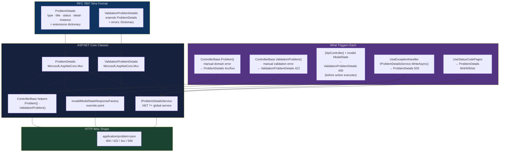
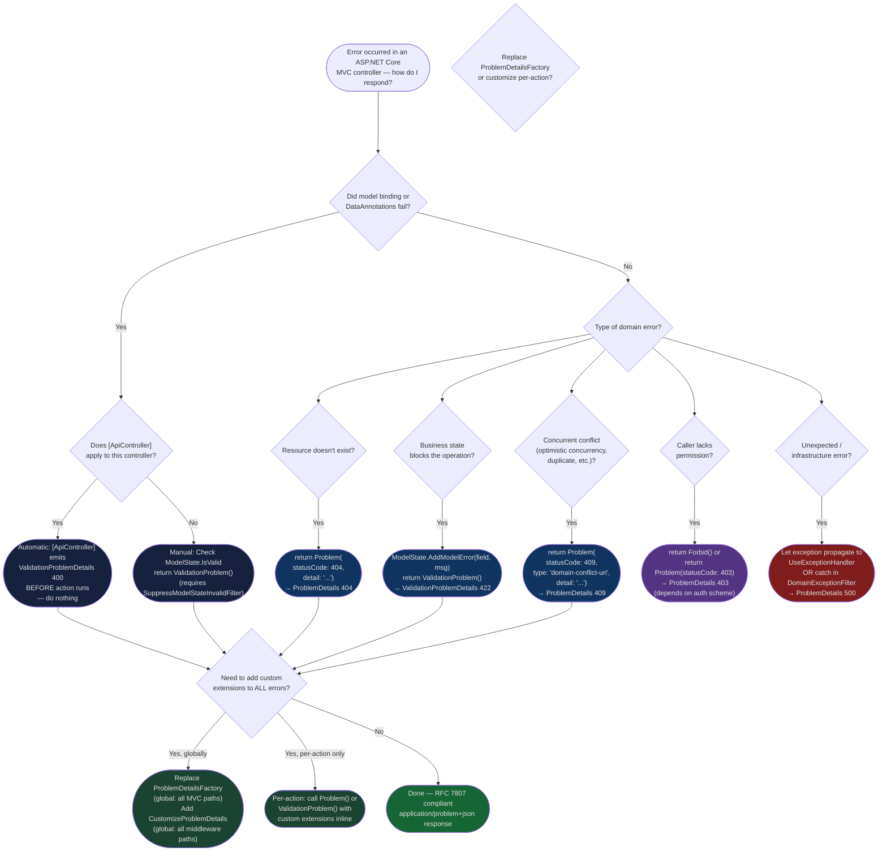

> [!success] Mastery Check
> - [ ] **Studied Well**
> - [ ] **Can explain the concept without notes**
> - [ ] **Can answer interview questions confidently**
> - [ ] **Can implement it in a real project**


# 4.118 — Problem Details in MVC: ProblemDetails and ValidationProblemDetails

---

## PART 0 — Navigation & Context

### Where This Topic Lives in the ASP.NET Core Domain Hierarchy

```
ASP.NET Core Mastery
│
├── E. Middleware Pipeline          (4.049–4.063)
│     └── UseExceptionHandler ──► IProblemDetailsService (called here for unhandled errors)
│
├── H. MVC & Controllers            (4.098–4.122)
│     ├── 4.098  ControllerBase vs Controller
│     ├── 4.099  Action Results: IActionResult, ActionResult<T>
│     ├── 4.100  Model Binding
│     ├── 4.101  ApiController Attribute  ──► triggers ValidationProblemDetails on 400
│     ├── 4.102  Model Validation: DataAnnotations and ModelState
│     ├── 4.110  MVC Filter Pipeline
│     │
│     ├── ► 4.118  Problem Details in MVC: ProblemDetails & ValidationProblemDetails  ◄ YOU ARE HERE
│     │           ├── ProblemDetails (RFC 7807 base class)
│     │           ├── ValidationProblemDetails (adds "errors" dictionary)
│     │           ├── [ApiController] auto-400 behaviour
│     │           ├── InvalidModelStateResponseFactory override
│     │           ├── ControllerBase helper methods: Problem(), ValidationProblem()
│     │           └── IProblemDetailsService integration (.NET 7+)
│     │
│     ├── 4.119  Response Caching on Controllers
│     └── 4.122  Content Negotiation Deep Dive
│
└── M. Error Handling & Problem Details  (4.177–4.185)
      ├── 4.177  Exception Handling Middleware
      ├── 4.179  Problem Details (RFC 7807): IProblemDetailsService  ◄ the broader service-layer topic
      └── 4.182  Global Exception Handler (.NET 8): IExceptionHandler
```

### What You Need Before This

- **[[4.101 — ApiController Attribute]]** — `[ApiController]` is what triggers the automatic `ValidationProblemDetails` 400 response; you cannot understand the default behaviour without knowing what that attribute does.
- **[[4.102 — Model Validation: DataAnnotations and ModelState]]** — `ValidationProblemDetails.Errors` is a serialised version of `ModelStateDictionary`; the two are tightly coupled.
- **[[4.168 — ModelState: Checking Validity, Reading Errors, Custom Responses]]** — `ModelState.IsValid` is the gate; `ValidationProblemDetails` is the canonical error body when that gate fails.
- **[[4.110 — MVC Filter Pipeline]]** — `[ApiController]`'s automatic 400 fires as a resource filter before model binding runs in full; understanding the filter pipeline explains _when_ the response is emitted.

### What This Unlocks After

- **[[4.179 — Problem Details (RFC 7807): IProblemDetailsService]]** — the broader framework service that generates problem details for _all_ error types (not just 400s); this topic covers the MVC-specific surface, that one covers the global middleware surface.
- **[[4.182 — Global Exception Handler (.NET 8): IExceptionHandler]]** — `IExceptionHandler` uses `IProblemDetailsService` to write problem details for unhandled exceptions; understanding the `ProblemDetails` shape is prerequisite.
- **[[4.174 — Global Validation: SuppressModelStateInvalidFilter]]** — once you know the default behaviour, this topic explains how to replace or suppress it.
- **[[4.082 — IResult and TypedResults in Minimal APIs]]** — `Results.Problem()` and `Results.ValidationProblem()` are the Minimal API equivalents of `ControllerBase.Problem()` and `ControllerBase.ValidationProblem()`; they produce the same wire format.

### Why This Matters at Scale

Inconsistent error response shapes — some endpoints returning `{ "message": "error" }`, others returning raw exception strings, others returning RFC 7807 problem details — are the #1 API contract complaint from frontend and mobile teams at scale. Every HTTP client must special-case each error format, and observability tooling (Datadog, Splunk, Grafana) cannot parse heterogeneous error bodies into actionable alerts. Standardising on `ProblemDetails` is the difference between a debuggable, client-observable API and a black box.

---

## PART 1 — The Core Mental Model

### The Fundamental Rule

> **ASP.NET Core MVC emits `ProblemDetails` (for generic errors) or `ValidationProblemDetails` (for model-state failures) as the standard error body — both are RFC 7807-compliant JSON objects with `Content-Type: application/problem+json`. When `[ApiController]` is present, a failing `ModelState` produces a `ValidationProblemDetails` 400 automatically before the action executes. The practical HTTP consequence is that every API error — validation, domain, unhandled exception — can and should produce a consistent, machine-readable `application/problem+json` body that clients parse the same way regardless of which error occurred.**

### The Plain-Language Analogy

Think of a hospital triage system. When a patient arrives, the triage nurse fills out a _standardised intake form_ — same structure every time: patient ID, problem category, problem description, severity, and a reference number for further enquiry. Without this form, every doctor would write their own notes in their own format; the downstream lab and pharmacy would have to decode each doctor's handwriting.

`ProblemDetails` is that standardised intake form for HTTP errors. `ValidationProblemDetails` is the specialised variant for admissions errors — it adds an `errors` field listing _exactly which fields have which problems_, the same way a triage form has a "reason for visit" section with checkboxes.

The analogy holds under edge cases: if a patient is unconscious (unhandled exception), the emergency staff still fill in the same form (`UseExceptionHandler` writes a `ProblemDetails`). If a patient is turned away at the door (auth failure), security still issues a standardised rejection slip (401 `ProblemDetails`). If a patient walks to the wrong department (404), the receptionist still issues the same form with "resource not found."

### The Taxonomy Diagram



---

## PART 2 — Deep Mechanics

### 2.1 — The RFC 7807 Wire Format and the .NET Classes

RFC 7807 (updated by RFC 9457) defines the standard fields for a machine-readable HTTP error body. ASP.NET Core maps these directly onto two classes.

```
// HTTP wire format — ProblemDetails (generic domain error):
// HTTP/1.1 404 Not Found
// Content-Type: application/problem+json
//
// {
//   "type": "https://tools.ietf.org/html/rfc9110#section-15.5.5",
//   "title": "Not Found",
//   "status": 404,
//   "detail": "Order f47ac10b-58cc-4372-a567-0e02b2c3d479 does not exist.",
//   "instance": "/api/orders/f47ac10b-58cc-4372-a567-0e02b2c3d479",
//   "traceId": "00-4bf92f3577b34da6a3ce929d0e0e4736-00f067aa0ba902b7-01"
// }

// HTTP wire format — ValidationProblemDetails (model state failure):
// HTTP/1.1 400 Bad Request
// Content-Type: application/problem+json
//
// {
//   "type": "https://tools.ietf.org/html/rfc9110#section-15.5.1",
//   "title": "One or more validation errors occurred.",
//   "status": 400,
//   "errors": {
//     "Amount": ["The Amount field is required.", "Amount must be greater than 0."],
//     "Currency": ["'GBP', 'EUR', or 'USD' are the only accepted currencies."]
//   },
//   "traceId": "00-4bf92f3577b34da6a3ce929d0e0e4736-00f067aa0ba902b7-01"
// }
```

**The .NET class anatomy:**

```csharp
// Microsoft.AspNetCore.Mvc.ProblemDetails (simplified):
public class ProblemDetails
{
    // "type": URI reference identifying the problem type.
    // Default in ASP.NET Core: "https://tools.ietf.org/html/rfc9110#section-15.X.Y"
    // Null is allowed (serialised as absent) but RFC 9457 recommends a value.
    public string? Type { get; set; }

    // "title": short, human-readable summary. Should NOT change between occurrences.
    // Default: the standard HTTP reason phrase (e.g. "Not Found", "Bad Request")
    public string? Title { get; set; }

    // "status": the HTTP status code. Must match the actual response status code.
    public int? Status { get; set; }

    // "detail": human-readable explanation specific to THIS occurrence.
    // May include safe information for end-users. Never include stack traces here.
    public string? Detail { get; set; }

    // "instance": URI reference that identifies the specific occurrence.
    // Usually the request path. Useful for support tickets ("the error at /api/payments/...").
    public string? Instance { get; set; }

    // Extensions: arbitrary additional members serialised into the JSON object.
    // Common production extensions: traceId, errorCode, supportReference.
    [JsonExtensionData]
    public IDictionary<string, object?> Extensions { get; set; } = new Dictionary<string, object?>();
}

// Microsoft.AspNetCore.Mvc.ValidationProblemDetails:
public class ValidationProblemDetails : ProblemDetails
{
    // "errors": field-name → array of error messages.
    // Key is the model property name (case-sensitive, matches model binding name).
    // An empty key ("") represents model-level errors (not tied to a specific field).
    public IDictionary<string, string[]> Errors { get; set; }
        = new Dictionary<string, string[]>(StringComparer.Ordinal);
}
```

**Pipeline position:** Both classes are C# objects. They become HTTP responses only when serialised — either by `ObjectResult` (returned from actions/helpers) going through the MVC formatter pipeline, or by `IProblemDetailsService.WriteAsync()` writing directly to `HttpContext.Response`.

**Runtime cost:** Serialisation of `ProblemDetails` via `System.Text.Json` — ~1 allocation for the JSON writer, ~O(n) proportional to the number of extension fields and validation errors. Negligible on error paths.

---

### 2.2 — The `[ApiController]` Automatic 400 Mechanism

This is the most production-critical behaviour: when `[ApiController]` is on a controller and `ModelState.IsValid` is `false`, the framework returns `ValidationProblemDetails` **before the action method body executes**.

```
Pipeline position for automatic 400:

──► ExceptionHandler
    ──► UseRouting
        ──► UseAuthentication
            ──► UseAuthorization
                ──► UseEndpoints
                    ──► [MVC Resource Filter Phase]
                        ──► Model Binding runs
                            ──► DataAnnotations validation runs
                                ──► ModelStateInvalidFilter checks ModelState.IsValid
                                    │
                                    ├── IsValid = false → writes ValidationProblemDetails 400
                                    │   ACTION METHOD BODY NEVER RUNS
                                    │
                                    └── IsValid = true → action method body runs
```

**ASP.NET Core internally (approximate):**

```csharp
// Microsoft.AspNetCore.Mvc.Infrastructure.ModelStateInvalidFilter
// This is the built-in resource filter injected by [ApiController]

internal sealed class ModelStateInvalidFilter : IActionFilter, IOrderedFilter
{
    // Runs at order -2000 (very early in filter pipeline, before action filters)
    public int Order => -2000;

    public void OnActionExecuting(ActionExecutingContext context)
    {
        if (context.ModelState.IsValid) return;

        // Calls InvalidModelStateResponseFactory to build the response
        // This factory is what you override to customise the 400 shape
        var factory = context.HttpContext.RequestServices
            .GetRequiredService<IOptions<ApiBehaviorOptions>>()
            .Value.InvalidModelStateResponseFactory;

        context.Result = factory(context);
        // Setting context.Result short-circuits: action body and subsequent filters don't run
    }

    public void OnActionExecuted(ActionExecutedContext context) { }
}
```

**The default `InvalidModelStateResponseFactory` (approximate):**

```csharp
// This is what runs when ModelState is invalid and [ApiController] is present.
// Registered in ApiBehaviorOptions during AddControllers().

static IActionResult DefaultInvalidModelStateResponse(ActionContext context)
{
    var problemDetails = context.HttpContext.RequestServices
        .GetRequiredService<ProblemDetailsFactory>()
        .CreateValidationProblemDetails(
            context.HttpContext,
            context.ModelState,
            statusCode: StatusCodes.Status400BadRequest);

    // ProblemDetailsFactory also populates:
    // - type: "https://tools.ietf.org/html/rfc9110#section-15.5.1"
    // - title: "One or more validation errors occurred."
    // - traceId from Activity.Current or HttpContext.TraceIdentifier

    return new BadRequestObjectResult(problemDetails)
    {
        ContentTypes = { "application/problem+json" }
    };
}
```

```
// HTTP wire format — automatic [ApiController] 400:
// POST /api/payments/charge HTTP/1.1
// Content-Type: application/json
//
// { "amount": -50, "currency": "INVALID" }

// HTTP/1.1 400 Bad Request
// Content-Type: application/problem+json; charset=utf-8
//
// {
//   "type": "https://tools.ietf.org/html/rfc9110#section-15.5.1",
//   "title": "One or more validation errors occurred.",
//   "status": 400,
//   "errors": {
//     "Amount": ["Amount must be a positive value."],
//     "Currency": ["Currency must be one of: USD, EUR, GBP."]
//   },
//   "traceId": "00-4bf92f3577b34da6a3ce929d0e0e4736-00f067aa0ba902b7-01"
// }
```

**Runtime cost:** `ProblemDetailsFactory.CreateValidationProblemDetails()` — ~1 allocation for the `ValidationProblemDetails` object, ~1 allocation per field with validation errors (for the `string[]` value), O(n) traversal of `ModelStateDictionary`. This is an error path — performance is not the concern.

**Edge case:** `[ApiController]` automatic 400 fires for **binding failures** too (missing required `[FromBody]`, malformed JSON, type conversion failures), not just DataAnnotations. A request with a malformed JSON body produces the same `ValidationProblemDetails` shape before your action runs.

---

### 2.3 — `ControllerBase.Problem()` and `ControllerBase.ValidationProblem()`

`ControllerBase` exposes two helper methods for manually constructing problem details responses from within action bodies. These are the primary tools for domain-level errors.

```csharp
// ControllerBase.Problem() — for non-validation errors (domain errors, not-found, etc.)
// Returns ObjectResult with status code you specify (default 500)
protected ObjectResult Problem(
    string? detail = null,
    string? instance = null,
    int? statusCode = null,        // defaults to 500
    string? title = null,
    string? type = null);

// ControllerBase.ValidationProblem() — for validation errors you detect in action body
// Returns UnprocessableEntityObjectResult (422) by default
// Note: 422 (Unprocessable Entity) not 400 — use 400 for model binding failures,
// 422 for business logic validation that passes model binding but fails domain rules
protected ActionResult ValidationProblem(
    ModelStateDictionary? modelStateDictionary = null); // uses current ModelState if null

protected ActionResult ValidationProblem(
    string? detail = null,
    string? instance = null,
    int? statusCode = null,        // defaults to 422
    string? title = null,
    string? type = null,
    ModelStateDictionary? modelStateDictionary = null);
```

**ASP.NET Core internally (approximate):**

```csharp
// ControllerBase.Problem() — creates ProblemDetails via ProblemDetailsFactory
protected ObjectResult Problem(string? detail = null, ...)
{
    var problemDetails = ProblemDetailsFactory.CreateProblemDetails(
        HttpContext,
        statusCode: statusCode ?? 500,
        title: title,
        type: type,
        detail: detail,
        instance: instance);
    // ProblemDetailsFactory also writes traceId automatically
    return new ObjectResult(problemDetails)
    {
        StatusCode = problemDetails.Status
    };
}
```

```
// HTTP wire format — Problem() for a domain 404:
// GET /api/orders/f47ac10b-... HTTP/1.1

// HTTP/1.1 404 Not Found
// Content-Type: application/problem+json
//
// {
//   "type": "https://tools.ietf.org/html/rfc9110#section-15.5.5",
//   "title": "Not Found",
//   "status": 404,
//   "detail": "Order f47ac10b-58cc-4372-a567-0e02b2c3d479 does not exist.",
//   "instance": "/api/orders/f47ac10b-58cc-4372-a567-0e02b2c3d479",
//   "traceId": "00-4bf92f3577b34da6a3ce929d0e0e4736-00f067aa0ba902b7-01"
// }

// HTTP wire format — ValidationProblem() for a business rule failure:
// POST /api/orders HTTP/1.1
//
// HTTP/1.1 422 Unprocessable Entity
// Content-Type: application/problem+json
//
// {
//   "type": "https://tools.ietf.org/html/rfc9110#section-15.5.21",
//   "title": "One or more validation errors occurred.",
//   "status": 422,
//   "errors": {
//     "PaymentMethod": ["This payment method has been revoked and cannot be used."]
//   },
//   "traceId": "00-..."
// }
```

**The 400 vs 422 distinction** — this trips up every team:

|Source of Error|Status Code|Response Type|When|
|---|---|---|---|
|Model binding failure (malformed JSON, missing required field)|400|ValidationProblemDetails|Automatic via [ApiController]|
|DataAnnotations validation failure|400|ValidationProblemDetails|Automatic via [ApiController]|
|Business/domain validation in action body|**422**|ValidationProblemDetails|Manual via `ValidationProblem()`|
|Resource not found|404|ProblemDetails|Manual via `Problem()`|
|General domain/server error|500|ProblemDetails|Manual via `Problem()`|

RFC 9110 §15.5.1 (400) means "the server cannot or will not process the request due to something perceived as a client error." RFC 9110 §15.5.21 (422) means "the request was well-formed but could not be processed due to semantic errors." Distinguish them — clients use these codes to decide whether to retry (400 = fix the input; 422 = the data is structurally valid but semantically invalid).

---

### 2.4 — `ProblemDetailsFactory`: The Central Production Customisation Point

`ProblemDetailsFactory` is the ASP.NET Core abstraction responsible for creating `ProblemDetails` and `ValidationProblemDetails` instances. Both `ControllerBase.Problem()` and the automatic `[ApiController]` 400 path use it. Replacing it is the cleanest way to add production-mandatory extensions (trace ID, error code, support URL) to _every_ problem details response.

```csharp
// Microsoft.AspNetCore.Mvc.Infrastructure.ProblemDetailsFactory (abstract):
public abstract class ProblemDetailsFactory
{
    public abstract ProblemDetails CreateProblemDetails(
        HttpContext httpContext,
        int? statusCode = null,
        string? title = null,
        string? type = null,
        string? detail = null,
        string? instance = null);

    public abstract ValidationProblemDetails CreateValidationProblemDetails(
        HttpContext httpContext,
        ModelStateDictionary modelStateDictionary,
        int? statusCode = null,
        string? title = null,
        string? type = null,
        string? detail = null,
        string? instance = null);
}
```

**Pipeline position:** `ProblemDetailsFactory` is resolved from DI. It is called by:

1. `ModelStateInvalidFilter` (automatic [ApiController] 400)
2. `ControllerBase.Problem()` helper
3. `ControllerBase.ValidationProblem()` helper

**Replacing the factory (production pattern):**

```csharp
// Custom factory adds traceId and errorCode to every ProblemDetails response
// in a payment API where support teams need both fields for triage

internal sealed class PaymentApiProblemDetailsFactory : ProblemDetailsFactory
{
    private readonly ApiBehaviorOptions _options;

    public PaymentApiProblemDetailsFactory(IOptions<ApiBehaviorOptions> options)
        => _options = options.Value;

    public override ProblemDetails CreateProblemDetails(
        HttpContext httpContext,
        int? statusCode = null,
        string? title = null,
        string? type = null,
        string? detail = null,
        string? instance = null)
    {
        var status = statusCode ?? 500;
        var problemDetails = new ProblemDetails
        {
            Status = status,
            Title = title ?? ReasonPhrases.GetReasonPhrase(status),
            Type = type ?? GetDefaultType(status),
            Detail = detail,
            Instance = instance ?? httpContext.Request.Path
        };

        ApplyDefaults(httpContext, problemDetails);
        return problemDetails;
    }

    public override ValidationProblemDetails CreateValidationProblemDetails(
        HttpContext httpContext,
        ModelStateDictionary modelStateDictionary,
        int? statusCode = null,
        string? title = null,
        string? type = null,
        string? detail = null,
        string? instance = null)
    {
        var status = statusCode ?? 400;
        var problemDetails = new ValidationProblemDetails(modelStateDictionary)
        {
            Status = status,
            Title = title ?? "One or more validation errors occurred.",
            Type = type ?? GetDefaultType(status),
            Detail = detail,
            Instance = instance ?? httpContext.Request.Path
        };

        ApplyDefaults(httpContext, problemDetails);
        return problemDetails;
    }

    private static void ApplyDefaults(HttpContext context, ProblemDetails problemDetails)
    {
        // traceId: correlates error with distributed trace in Datadog/Jaeger
        var activity = Activity.Current;
        problemDetails.Extensions["traceId"] = activity?.Id
            ?? context.TraceIdentifier;

        // Support reference code — stable identifier for support tickets
        // Clients can say "I got error code PAY-404-001" in a support ticket
        problemDetails.Extensions["errorCode"] = GenerateErrorCode(
            problemDetails.Status,
            context.Request.Path);
    }

    private static string GenerateErrorCode(int? status, PathString path)
        => $"PAY-{status}-{Math.Abs(path.ToString().GetHashCode()) % 10000:D4}";

    private static string GetDefaultType(int status) => status switch
    {
        400 => "https://tools.ietf.org/html/rfc9110#section-15.5.1",
        401 => "https://tools.ietf.org/html/rfc9110#section-15.5.2",
        403 => "https://tools.ietf.org/html/rfc9110#section-15.5.4",
        404 => "https://tools.ietf.org/html/rfc9110#section-15.5.5",
        409 => "https://tools.ietf.org/html/rfc9110#section-15.5.10",
        422 => "https://tools.ietf.org/html/rfc9110#section-15.5.21",
        500 => "https://tools.ietf.org/html/rfc9110#section-15.6.1",
        _   => "about:blank"
    };
}

// Registration:
builder.Services.AddControllers();
// Replace AFTER AddControllers() — otherwise AddControllers registers the default
builder.Services.AddSingleton<ProblemDetailsFactory, PaymentApiProblemDetailsFactory>();
```

**Runtime cost:** The custom factory is Singleton. `ApplyDefaults` runs per-error-response: `Activity.Current` is a static thread-local read (~1ns), string interpolation for `errorCode` (~1 allocation, error path only).

---

### 2.5 — `InvalidModelStateResponseFactory`: The 400 Override Point

For teams that want to customise only the automatic `[ApiController]` 400 without replacing the entire `ProblemDetailsFactory`, `ApiBehaviorOptions.InvalidModelStateResponseFactory` is the right hook.

```csharp
// ASP.NET Core internally (approximate):
// ApiBehaviorOptions.InvalidModelStateResponseFactory is a Func<ActionContext, IActionResult>
// Default value: produces ValidationProblemDetails as shown in 2.2

// Override pattern — adds a domain-specific error envelope for an order management API:
builder.Services.AddControllers()
    .ConfigureApiBehaviorOptions(options =>
    {
        options.InvalidModelStateResponseFactory = context =>
        {
            // Build the standard ValidationProblemDetails base
            var factory = context.HttpContext.RequestServices
                .GetRequiredService<ProblemDetailsFactory>();

            var validationProblem = factory.CreateValidationProblemDetails(
                context.HttpContext,
                context.ModelState,
                statusCode: StatusCodes.Status400BadRequest);

            // Add domain-specific extension: correlate to API operation type
            validationProblem.Extensions["operationType"] =
                context.HttpContext.Request.Method switch
                {
                    "POST"  => "create",
                    "PUT"   => "update",
                    "PATCH" => "partial-update",
                    _       => "unknown"
                };

            return new BadRequestObjectResult(validationProblem)
            {
                ContentTypes = { "application/problem+json" }
            };
        };
    });
```

**Failure mode diagram:**

```
Request with invalid body → Model Binding → ModelState.IsValid = false
                                                     │
                              ┌──────────────────────┘
                              ▼
                  InvalidModelStateResponseFactory(context)
                              │
                              ▼
                  ValidationProblemDetails built
                              │
                              ▼
              BadRequestObjectResult → ObjectResultExecutor
                              │
                              ▼
              MVC formatter pipeline → System.Text.Json serialiser
                              │
                              ▼
              HTTP/1.1 400 Bad Request
              Content-Type: application/problem+json
              { "type": ..., "errors": {...} }

  ACTION BODY: ✗ NEVER EXECUTES
  ACTION FILTERS: ✗ OnActionExecuting runs, but result is already set so
                    post-action filters still fire (OnActionExecuted)
  RESULT FILTERS: ✓ still execute (can inspect/modify the problem details result)
```

---

### 2.6 — Integration with `IProblemDetailsService` (.NET 7+)

In .NET 7+, `builder.Services.AddProblemDetails()` registers `IProblemDetailsService`, which is used by middleware (`UseExceptionHandler`, `UseStatusCodePages`) to write problem details for non-MVC error paths. The MVC `ProblemDetailsFactory` and the middleware `IProblemDetailsService` are separate but should produce consistent output.

```csharp
// Full production setup for consistent problem details across all error paths:

builder.Services.AddControllers();

// Registers IProblemDetailsService + default ProblemDetailsOptions
builder.Services.AddProblemDetails(options =>
{
    // This lambda customises ALL problem details (MVC + middleware paths)
    options.CustomizeProblemDetails = context =>
    {
        // Add traceId to every problem details response, everywhere
        context.ProblemDetails.Extensions["traceId"] =
            Activity.Current?.Id ?? context.HttpContext.TraceIdentifier;

        // Don't leak server details in production
        if (context.ProblemDetails.Status == 500)
        {
            context.ProblemDetails.Detail = null;
            context.ProblemDetails.Instance = null;
        }
    };
});

// Replace default factory so MVC paths also benefit from the factory pattern
builder.Services.AddSingleton<ProblemDetailsFactory, PaymentApiProblemDetailsFactory>();

// ...

app.UseExceptionHandler();  // Uses IProblemDetailsService internally
app.UseStatusCodePages();   // Also uses IProblemDetailsService
```

> [!IMPORTANT] **The two customisation points are independent.** `ProblemDetailsOptions.CustomizeProblemDetails` customises what `IProblemDetailsService` writes (middleware paths — exception handler, status code pages). The custom `ProblemDetailsFactory` customises what MVC actions and filters produce. For full consistency you need both, OR you use only `ProblemDetailsFactory` for MVC paths and `CustomizeProblemDetails` for middleware paths, and ensure they produce the same extension fields.

---

## PART 3 — Production Code Patterns

### Pattern 1 — The Standardised Payment API Error Contract

A payment API where all errors — validation, domain, and unexpected — produce the same `application/problem+json` shape with a stable `errorCode` extension field.

```csharp
// Program.cs: full problem details setup for a payment API
var builder = WebApplication.CreateBuilder(args);

builder.Services.AddControllers();

// Step 1: Register AddProblemDetails for middleware-layer errors
builder.Services.AddProblemDetails(options =>
{
    options.CustomizeProblemDetails = ctx =>
    {
        ctx.ProblemDetails.Extensions["traceId"] =
            Activity.Current?.Id ?? ctx.HttpContext.TraceIdentifier;
    };
});

// Step 2: Replace ProblemDetailsFactory for MVC-layer errors (action responses)
// This ensures all MVC-produced problem details also get traceId + errorCode
builder.Services.AddSingleton<ProblemDetailsFactory, PaymentApiProblemDetailsFactory>();

// Step 3: Customise the automatic 400 to add operationType extension
builder.Services.Configure<ApiBehaviorOptions>(options =>
{
    var previousFactory = options.InvalidModelStateResponseFactory;
    options.InvalidModelStateResponseFactory = context =>
    {
        var result = (ObjectResult)previousFactory(context);
        // Downstream: the factory already added traceId; we just add operationType
        if (result.Value is ProblemDetails pd)
        {
            pd.Extensions["requestId"] = context.HttpContext.Request.Headers["X-Request-ID"].ToString();
        }
        return result;
    };
});

var app = builder.Build();

app.UseExceptionHandler();     // Middleware-layer 500s → ProblemDetails via IProblemDetailsService
app.UseStatusCodePages();      // Middleware-layer 404/405/etc → ProblemDetails
app.UseHttpsRedirection();
app.UseAuthentication();
app.UseAuthorization();
app.MapControllers();
app.Run();
```

```csharp
// PaymentsController: demonstrating all three error patterns

[ApiController]
[Route("api/payments")]
public class PaymentsController : ControllerBase
{
    private readonly IPaymentService _payments;
    private readonly ILogger<PaymentsController> _logger;

    public PaymentsController(IPaymentService payments, ILogger<PaymentsController> logger)
    {
        _payments = payments;
        _logger = logger;
    }

    // Pattern A: [ApiController] auto-400 for model binding + DataAnnotations
    // Action body never reached when ChargeRequest is invalid
    [HttpPost("charge")]
    [ProducesResponseType(typeof(ChargeResponse), StatusCodes.Status201Created)]
    [ProducesResponseType(typeof(ValidationProblemDetails), StatusCodes.Status400BadRequest)]
    [ProducesResponseType(typeof(ProblemDetails), StatusCodes.Status422UnprocessableEntity)]
    public async Task<ActionResult<ChargeResponse>> Charge(
        [FromBody] ChargeRequest request,
        CancellationToken cancellationToken)
    {
        // Pattern B: Domain/business validation → 422 (not 400)
        // Model binding passed (request is structurally valid), but fails business rules
        var paymentMethod = await _payments.GetPaymentMethodAsync(
            request.PaymentMethodId, cancellationToken);

        if (paymentMethod is null)
        {
            // 404: the referenced resource genuinely doesn't exist
            return Problem(
                detail: $"Payment method '{request.PaymentMethodId}' was not found.",
                statusCode: StatusCodes.Status404NotFound);
        }

        if (!paymentMethod.IsActive)
        {
            // 422: structurally valid request, semantically invalid due to state
            // Use ModelState to carry field-level error, not just a detail string
            ModelState.AddModelError(
                nameof(request.PaymentMethodId),
                "The specified payment method is inactive and cannot be charged.");
            return ValidationProblem(modelStateDictionary: ModelState);
        }

        if (paymentMethod.Currency != request.Currency)
        {
            // Another domain validation failure — add multiple errors if needed
            ModelState.AddModelError(
                nameof(request.Currency),
                $"Payment method currency is {paymentMethod.Currency}; " +
                $"request currency {request.Currency} does not match.");
            return ValidationProblem();  // Uses current ModelState automatically
        }

        var result = await _payments.ChargeAsync(request, cancellationToken);
        return CreatedAtAction(nameof(GetCharge), new { chargeId = result.Id }, result);
    }

    [HttpGet("{chargeId:guid}")]
    [ProducesResponseType(typeof(ChargeResponse), StatusCodes.Status200OK)]
    [ProducesResponseType(typeof(ProblemDetails), StatusCodes.Status404NotFound)]
    public async Task<ActionResult<ChargeResponse>> GetCharge(Guid chargeId)
    {
        var charge = await _payments.GetChargeAsync(chargeId);
        if (charge is null)
            return Problem(
                detail: $"Charge '{chargeId}' was not found.",
                statusCode: StatusCodes.Status404NotFound);

        return Ok(charge);
    }
}
```

```
// HTTP wire format — business validation failure (Pattern B):
// POST /api/payments/charge HTTP/1.1
// Content-Type: application/json
//
// { "paymentMethodId": "pm_revoked_123", "amount": 5000, "currency": "USD" }

// HTTP/1.1 422 Unprocessable Entity
// Content-Type: application/problem+json
//
// {
//   "type": "https://tools.ietf.org/html/rfc9110#section-15.5.21",
//   "title": "One or more validation errors occurred.",
//   "status": 422,
//   "errors": {
//     "PaymentMethodId": ["The specified payment method is inactive and cannot be charged."]
//   },
//   "traceId": "00-4bf92f3577b34da6a3ce929d0e0e4736-00f067aa0ba902b7-01",
//   "errorCode": "PAY-422-0137"
// }
```

---

### Pattern 2 — The Custom `InvalidModelStateResponseFactory` for an Order Management API

```csharp
// ✅ CORRECT: Override the factory to produce a richer validation body
// while keeping full compatibility with the ProblemDetails standard

builder.Services.Configure<ApiBehaviorOptions>(options =>
{
    options.InvalidModelStateResponseFactory = context =>
    {
        var httpContext = context.HttpContext;

        // Build the errors dictionary manually for precise control
        var errors = context.ModelState
            .Where(x => x.Value?.Errors.Count > 0)
            .ToDictionary(
                // Normalise key to camelCase to match JSON property naming
                kvp => char.ToLower(kvp.Key[0]) + kvp.Key[1..],
                kvp => kvp.Value!.Errors
                    .Select(e => e.ErrorMessage)
                    .ToArray());

        var problemDetails = new ValidationProblemDetails(errors)
        {
            Type   = "https://api.orders.example.com/errors/validation",
            Title  = "Request validation failed.",
            Status = StatusCodes.Status400BadRequest,
            Detail = "One or more fields contain invalid values. " +
                     "See 'errors' for field-level detail.",
            Instance = httpContext.Request.Path
        };

        // Mandatory extensions for the order management domain
        problemDetails.Extensions["traceId"]     = Activity.Current?.Id ?? httpContext.TraceIdentifier;
        problemDetails.Extensions["requestId"]   = httpContext.Request.Headers["X-Request-ID"].ToString();
        problemDetails.Extensions["timestamp"]   = DateTimeOffset.UtcNow;

        return new BadRequestObjectResult(problemDetails)
        {
            ContentTypes = { "application/problem+json" }
        };
    };
});
```

---

### Pattern 3 — The Domain Exception to Problem Details Mapping Filter

For APIs where the domain layer throws typed exceptions, an exception filter can map them to problem details without cluttering action bodies.

```csharp
// Domain exceptions:
public sealed class OrderNotFoundException : Exception
{
    public Guid OrderId { get; }
    public OrderNotFoundException(Guid orderId)
        : base($"Order {orderId} was not found.")
        => OrderId = orderId;
}

public sealed class InsufficientInventoryException : Exception
{
    public string Sku { get; }
    public int Requested { get; }
    public int Available { get; }
    public InsufficientInventoryException(string sku, int requested, int available)
        : base($"SKU {sku}: requested {requested}, available {available}.")
    {
        Sku = sku; Requested = requested; Available = available;
    }
}

// Exception filter that maps these to ProblemDetails:
// Registered globally so it applies to all controllers
public sealed class DomainExceptionFilter : IExceptionFilter
{
    private readonly ProblemDetailsFactory _factory;
    private readonly ILogger<DomainExceptionFilter> _logger;

    public DomainExceptionFilter(
        ProblemDetailsFactory factory,
        ILogger<DomainExceptionFilter> logger)
    {
        _factory = factory;
        _logger = logger;
    }

    public void OnException(ExceptionContext context)
    {
        ProblemDetails? problemDetails = context.Exception switch
        {
            OrderNotFoundException ex => _factory.CreateProblemDetails(
                context.HttpContext,
                statusCode: StatusCodes.Status404NotFound,
                detail: ex.Message),

            InsufficientInventoryException ex => BuildInventoryProblem(context.HttpContext, ex),

            _ => null  // Not a domain exception — let it propagate to UseExceptionHandler
        };

        if (problemDetails is null) return;

        _logger.LogWarning("Domain error {StatusCode}: {Detail}",
            problemDetails.Status, problemDetails.Detail);

        context.Result = new ObjectResult(problemDetails)
        {
            StatusCode = problemDetails.Status,
            ContentTypes = { "application/problem+json" }
        };
        context.ExceptionHandled = true;  // Prevents propagation to UseExceptionHandler
    }

    private ProblemDetails BuildInventoryProblem(
        HttpContext httpContext,
        InsufficientInventoryException ex)
    {
        var pd = _factory.CreateProblemDetails(
            httpContext,
            statusCode: StatusCodes.Status409Conflict,
            type: "https://api.inventory.example.com/errors/insufficient-stock",
            title: "Insufficient inventory.",
            detail: ex.Message);

        // Domain-specific extension: structured data the client can use
        pd.Extensions["sku"]       = ex.Sku;
        pd.Extensions["requested"] = ex.Requested;
        pd.Extensions["available"] = ex.Available;
        return pd;
    }
}

// Registration as a global filter:
builder.Services.AddControllers(options =>
{
    options.Filters.Add<DomainExceptionFilter>();
});
```

```
// HTTP wire format — InsufficientInventoryException:
// POST /api/orders HTTP/1.1
//
// HTTP/1.1 409 Conflict
// Content-Type: application/problem+json
//
// {
//   "type": "https://api.inventory.example.com/errors/insufficient-stock",
//   "title": "Insufficient inventory.",
//   "status": 409,
//   "detail": "SKU WIDGET-42: requested 100, available 12.",
//   "traceId": "00-...",
//   "sku": "WIDGET-42",
//   "requested": 100,
//   "available": 12
// }
```

---

### Pattern 4 — Suppressing the Automatic 400 and Handling Validation Manually

Sometimes teams want full control over the 400 response — perhaps they need to log specific validation events or conditionally return 422 instead of 400. The correct pattern suppresses the automatic behaviour and replaces it explicitly.

```csharp
// ⚠️ WRONG: Checking ModelState.IsValid inside the action when [ApiController] is present
// [ApiController] already checked it — if you reach the action body, ModelState IS valid.
// This code never triggers because [ApiController] short-circuits before the body runs.
[HttpPost]
public IActionResult CreateOrder([FromBody] CreateOrderRequest request)
{
    if (!ModelState.IsValid)        // ← NEVER REACHED when [ApiController] is present
        return BadRequest(ModelState);  // ← Even if reached: not a ProblemDetails response!
    // ...
}

// ✅ CORRECT: Suppress automatic 400, handle manually for custom routing
builder.Services.Configure<ApiBehaviorOptions>(options =>
{
    // Turn off the automatic 400 — now action bodies run even with invalid ModelState
    options.SuppressModelStateInvalidFilter = true;
});

[ApiController]
[Route("api/logistics/shipments")]
public class ShipmentController : ControllerBase
{
    [HttpPost]
    public async Task<IActionResult> CreateShipment(
        [FromBody] CreateShipmentRequest request,
        [FromServices] IShipmentService shipmentService)
    {
        // Now we can inspect ModelState ourselves
        if (!ModelState.IsValid)
        {
            // Log before returning — useful for audit trails
            // (You can't do this in the factory unless you inject ILogger)
            var errors = ModelState
                .Where(m => m.Value?.Errors.Any() == true)
                .Select(m => $"{m.Key}: {string.Join("; ", m.Value!.Errors.Select(e => e.ErrorMessage))}");

            // Return the standard shape — don't invent your own
            return ValidationProblem();
        }

        // Further domain checks...
        var result = await shipmentService.CreateAsync(request);
        return CreatedAtAction(nameof(GetShipment), new { id = result.Id }, result);
    }
}
```

---

### Pattern 5 — Unit Testing Problem Details Responses

Problem details shape must be tested — wrong status codes or missing `errors` keys break API clients in production.

```csharp
// Integration test verifying ValidationProblemDetails shape
// Uses WebApplicationFactory to test the full MVC pipeline

public class PaymentsControllerTests : IClassFixture<WebApplicationFactory<Program>>
{
    private readonly HttpClient _client;

    public PaymentsControllerTests(WebApplicationFactory<Program> factory)
        => _client = factory.CreateClient();

    [Fact]
    public async Task Charge_WithInvalidRequest_Returns400WithValidationProblemDetails()
    {
        // Arrange: missing required fields
        var request = new { currency = "INVALID" }; // amount missing, currency invalid

        // Act
        var response = await _client.PostAsJsonAsync("/api/payments/charge", request);

        // Assert: status code
        response.StatusCode.Should().Be(HttpStatusCode.BadRequest);

        // Assert: content type MUST be application/problem+json
        response.Content.Headers.ContentType!.MediaType
            .Should().Be("application/problem+json");

        // Assert: problem details shape
        var body = await response.Content.ReadFromJsonAsync<ValidationProblemDetails>();
        body.Should().NotBeNull();
        body!.Status.Should().Be(400);
        body.Title.Should().Be("One or more validation errors occurred.");
        body.Errors.Should().ContainKey("Amount");
        body.Errors.Should().ContainKey("Currency");
        body.Extensions.Should().ContainKey("traceId");
    }

    [Fact]
    public async Task GetCharge_WithNonExistentId_Returns404WithProblemDetails()
    {
        var response = await _client.GetAsync($"/api/payments/{Guid.NewGuid()}");

        response.StatusCode.Should().Be(HttpStatusCode.NotFound);
        response.Content.Headers.ContentType!.MediaType.Should().Be("application/problem+json");

        var body = await response.Content.ReadFromJsonAsync<ProblemDetails>();
        body!.Status.Should().Be(404);
        body.Detail.Should().Contain("was not found");
        body.Extensions.Should().ContainKey("traceId");
    }
}
```

---

### Pattern 6 — The `ProblemDetails` Typed Error Code Extension (Production-Grade)

Avoid magic strings in the `type` field. Use typed, domain-specific URIs that point to real documentation.

```csharp
// Centralised error type registry for the order management API

public static class OrderApiProblemTypes
{
    private const string Base = "https://api.orders.example.com/errors";

    public const string OrderNotFound           = $"{Base}/order-not-found";
    public const string PaymentDeclined         = $"{Base}/payment-declined";
    public const string InsufficientInventory   = $"{Base}/insufficient-inventory";
    public const string DuplicateOrderReference = $"{Base}/duplicate-order-reference";
    public const string OrderAlreadyCancelled   = $"{Base}/order-already-cancelled";
    public const string ValidationFailed        = $"{Base}/validation-failed";
}

// Usage in controller:
[HttpPost("cancel/{orderId:guid}")]
public async Task<IActionResult> CancelOrder(Guid orderId)
{
    var order = await _orders.GetAsync(orderId);
    if (order is null)
        return Problem(
            type: OrderApiProblemTypes.OrderNotFound,
            title: "Order not found.",
            detail: $"Order {orderId} does not exist.",
            statusCode: StatusCodes.Status404NotFound);

    if (order.Status == OrderStatus.Cancelled)
        return Problem(
            type: OrderApiProblemTypes.OrderAlreadyCancelled,
            title: "Order already cancelled.",
            detail: $"Order {orderId} was cancelled on {order.CancelledAt:O}.",
            statusCode: StatusCodes.Status409Conflict);

    await _orders.CancelAsync(orderId);
    return NoContent();
}
```

---

## PART 4 — Gotchas & Anti-Patterns

### Gotcha 1: Returning `BadRequest(ModelState)` Instead of `ValidationProblem()`

Experienced engineers coming from ASP.NET MVC 5 or early ASP.NET Core know `return BadRequest(ModelState)`. This produces a `SerializableError` JSON shape, not a `ValidationProblemDetails` — breaking any client that expects RFC 7807.

```csharp
// ⚠️ WRONG CODE:
[HttpPost]
public IActionResult CreateOrder([FromBody] CreateOrderRequest request)
{
    if (!ModelState.IsValid)
        return BadRequest(ModelState);  // SerializableError — NOT ProblemDetails!
}

// HTTP consequence (wrong path):
// HTTP/1.1 400 Bad Request
// Content-Type: application/json   ← NOT application/problem+json
//
// {
//   "Amount": ["Amount must be greater than 0"],   ← flat format, not RFC 7807
//   "Currency": ["Invalid currency"]
// }

// ✅ CORRECT CODE:
[HttpPost]
public IActionResult CreateOrder([FromBody] CreateOrderRequest request)
{
    if (!ModelState.IsValid)
        return ValidationProblem();  // ValidationProblemDetails — RFC 7807 compliant
}

// HTTP consequence (correct path):
// HTTP/1.1 400 Bad Request
// Content-Type: application/problem+json
//
// {
//   "type": "https://...",
//   "title": "One or more validation errors occurred.",
//   "status": 400,
//   "errors": { "Amount": ["..."], "Currency": ["..."] }
// }

// WHY: BadRequest(ModelState) calls the ModelState serialiser via ObjectResult, which
// serialises ModelStateDictionary as SerializableError — a flat key/value JSON format
// that predates RFC 7807 and is not application/problem+json. Clients that parse
// for "type", "title", "status", "errors" will silently receive null for all fields.
```

---

### Gotcha 2: Confusing 400 and 422 — Business Validation at the Wrong Status Code

Teams uniformly return 400 for all validation errors. RFC 9110 distinguishes: 400 = the request was malformed (fix the syntax/structure), 422 = the request was well-formed but semantically wrong (the data is valid JSON but invalid for the domain). Clients use these to decide retry logic.

```csharp
// ⚠️ WRONG CODE: returning 400 for a domain/business validation failure
[HttpPost("charge")]
public async Task<IActionResult> Charge([FromBody] ChargeRequest request)
{
    var method = await _payments.GetMethodAsync(request.PaymentMethodId);
    if (!method.IsActive)
        return BadRequest(new { error = "Payment method is inactive." }); // ← 400, not RFC 7807

// HTTP consequence (wrong path):
// HTTP/1.1 400 Bad Request
// Content-Type: application/json
//
// { "error": "Payment method is inactive." }
// Client interprets: "I sent a bad request — I should fix my input format."
// But the input WAS structurally correct — the business state caused the failure.

// ✅ CORRECT CODE: 422 for domain validation, proper ProblemDetails shape
    if (!method.IsActive)
    {
        ModelState.AddModelError(
            nameof(request.PaymentMethodId),
            "The payment method is inactive and cannot be charged.");
        return ValidationProblem();  // 422 Unprocessable Entity by default
    }

// HTTP consequence (correct path):
// HTTP/1.1 422 Unprocessable Entity
// Content-Type: application/problem+json
//
// { "status": 422, "errors": { "PaymentMethodId": ["The payment method is inactive..."] } }
// Client interprets: "My request structure was correct, but the state doesn't allow this."

// WHY: HTTP 400 signals structural/binding issues. HTTP 422 signals semantic/domain issues.
// The distinction is meaningful to clients that implement retry-on-transient-error logic:
// a 400 means "stop retrying — fix your code", a 422 may mean "retry after state changes".
```

---

### Gotcha 3: `SuppressModelStateInvalidFilter = true` Without Replacing the Behaviour

Setting `SuppressModelStateInvalidFilter = true` disables the automatic 400 but leaves the action running with an invalid `ModelState`. Engineers forget that `ModelState.IsValid` will always be `false` when the suppression is active and binding failed — actions proceed with partially bound models.

```csharp
// ⚠️ WRONG CODE: suppress automatic filter, forget to check ModelState manually
builder.Services.Configure<ApiBehaviorOptions>(o =>
    o.SuppressModelStateInvalidFilter = true);

[HttpPost]
public async Task<IActionResult> ProcessInvoice([FromBody] InvoiceRequest request)
{
    // ModelState is invalid here (e.g., Amount was missing in the JSON body)
    // but we never check it, so we proceed with request.Amount == 0 (default value)
    await _invoicing.ProcessAsync(request);  // Processes with invalid data!
    return NoContent();
}

// HTTP consequence (wrong path):
// HTTP/1.1 204 No Content
// (Invoice processed with Amount = 0 — silent data corruption)

// ✅ CORRECT CODE: always check ModelState when suppression is active
[HttpPost]
public async Task<IActionResult> ProcessInvoice([FromBody] InvoiceRequest request)
{
    if (!ModelState.IsValid)
        return ValidationProblem();  // Guard is now your responsibility

    await _invoicing.ProcessAsync(request);
    return NoContent();
}

// HTTP consequence (correct path):
// HTTP/1.1 422 Unprocessable Entity
// Content-Type: application/problem+json
// { "status": 422, "errors": { "Amount": ["The Amount field is required."] } }

// WHY: SuppressModelStateInvalidFilter removes ModelStateInvalidFilter from the pipeline.
// Nothing else re-adds the guard. The action runs unconditionally, with invalid model state.
// This is a silent data corruption path that is very hard to detect in testing because
// unit tests mock the service layer and never exercise model binding.
```

---

### Gotcha 4: Custom `ProblemDetailsFactory` Registered Before `AddControllers()` Gets Overwritten

The framework registers a default `ProblemDetailsFactory` (singleton) inside `AddControllers()`. If your custom factory is registered _before_ `AddControllers()`, the framework's `AddControllers()` call overwrites it. The engine of DI for singleton registration: last writer wins.

```csharp
// ⚠️ WRONG CODE: custom factory registered before AddControllers()
builder.Services.AddSingleton<ProblemDetailsFactory, MyCustomFactory>();  // ← registered first
builder.Services.AddControllers();  // ← AddControllers() re-registers the default, overwriting yours!

// HTTP consequence (wrong path):
// POST /api/payments/charge with invalid body
// HTTP/1.1 400 Bad Request
// Content-Type: application/problem+json
//
// { "type": "...", "title": "...", "status": 400, "errors": {...} }
// (Missing traceId, errorCode, and any other custom extensions from MyCustomFactory)

// ✅ CORRECT CODE: custom factory registered AFTER AddControllers()
builder.Services.AddControllers();  // ← registers default factory
builder.Services.AddSingleton<ProblemDetailsFactory, MyCustomFactory>();  // ← overwrites default

// HTTP consequence (correct path):
// { "type": "...", "title": "...", "status": 400, "errors": {...},
//   "traceId": "00-...", "errorCode": "PAY-400-0042" }

// WHY: IServiceCollection is a list. For singleton registrations, the last registration
// of a given service type wins. AddControllers() calls services.TryAddSingleton<ProblemDetailsFactory>()
// which only adds if NOT already registered. Actually — TryAdd means this gotcha is version-specific.
// In .NET 8, DefaultProblemDetailsFactory is registered via TryAddSingleton, so registering BEFORE
// AddControllers() would work. But relying on TryAdd semantics is fragile — always register AFTER
// for clarity and correctness across framework versions.
```

---

### Gotcha 5: Extensions Dictionary Is Not Serialised by Default Without `AddProblemDetails()`

`ProblemDetails.Extensions` is an `IDictionary<string, object?>` marked with `[JsonExtensionData]`. When serialised via `System.Text.Json`, extension data _is_ written as root-level properties — but only if `JsonSerializerOptions` has been configured to handle `IDictionary<string, object?>` correctly. Without `AddProblemDetails()`, the global JSON options may not have the right configuration, and extensions silently disappear.

```csharp
// ⚠️ WRONG CODE: not calling AddProblemDetails(), adding extensions, but they vanish
builder.Services.AddControllers();
// Missing: builder.Services.AddProblemDetails()

// Action:
var pd = new ProblemDetails { Status = 500, Detail = "Something broke." };
pd.Extensions["traceId"] = "00-abc123"; // Added...
return new ObjectResult(pd) { StatusCode = 500 };

// HTTP consequence (wrong path):
// HTTP/1.1 500 Internal Server Error
// Content-Type: application/problem+json
//
// { "status": 500, "detail": "Something broke." }
// — traceId is MISSING from the response

// ✅ CORRECT CODE: AddProblemDetails() ensures the serialisation chain is set up correctly
builder.Services.AddControllers();
builder.Services.AddProblemDetails();  // ← registers IProblemDetailsService and serialiser setup

var pd = new ProblemDetails { Status = 500, Detail = "Something broke." };
pd.Extensions["traceId"] = "00-abc123";
return new ObjectResult(pd) { StatusCode = 500 };

// HTTP consequence (correct path):
// HTTP/1.1 500 Internal Server Error
// Content-Type: application/problem+json
//
// { "status": 500, "detail": "Something broke.", "traceId": "00-abc123" }

// WHY: ProblemDetails uses [JsonExtensionData] on the Extensions property.
// The built-in System.Text.Json serialisation for IDictionary<string, object?>
// with [JsonExtensionData] works when the serialiser sees ProblemDetails directly.
// In practice, extensions ARE serialised without AddProblemDetails() in most cases.
// The real issue is that without AddProblemDetails(), UseStatusCodePages and 
// UseExceptionHandler don't write problem details format at all — they write HTML.
// Always call AddProblemDetails() unconditionally.
```

---

## PART 5 — Performance Implications

### 5.1 — Request Pipeline Characteristics Table

|Scenario|Pipeline Depth|Allocations Per Request|Approx Latency Impact|Recommendation|
|---|---|---|---|---|
|Happy path (no error)|Full pipeline, ProblemDetails never invoked|0 for error handling|0μs overhead|Baseline — no optimisation needed|
|`[ApiController]` auto-400 (simple validation)|ModelStateInvalidFilter → ValidationProblemDetails|~3–5 (ValidationProblemDetails, errors dict, ObjectResult)|~20–50μs|Normal error path — not worth optimising|
|`[ApiController]` auto-400 (20 field errors)|Same pipeline|~25 (one string[] per field)|~100–200μs|Error paths are not hot paths|
|`ControllerBase.Problem()`|ObjectResult → formatter|~2–3 allocations|~10–30μs|Fine — error paths|
|Custom `ProblemDetailsFactory` (singleton)|One DI resolution (singleton — free after first)|0 (singleton is cached)|~0μs overhead|Singleton is correct — no concern|
|`InvalidModelStateResponseFactory` override|One invocation per 400|Depends on implementation|Depends|Keep factory fast — avoid DB queries in the factory|
|`IProblemDetailsService.WriteAsync()` via exception handler|Full middleware stack unwind + write|~5–10|~100μs|Exception paths — irrelevant to throughput|
|`UseStatusCodePages` with problem details|Middleware re-execution|~8–15|~200–500μs|404s on hot paths can add up — cache static 404 responses|
|JSON serialisation of `ProblemDetails` (simple)|`System.Text.Json` write|~1 (JsonWriter)|~5–15μs|Negligible|
|JSON serialisation of `ValidationProblemDetails` (10 fields, 2 errors each)|`System.Text.Json` write|~3–5|~20–50μs|Error paths only|

### 5.2 — BenchmarkDotNet Code

```csharp
using BenchmarkDotNet.Attributes;
using BenchmarkDotNet.Running;
using Microsoft.AspNetCore.Mvc;
using System.Text.Json;

BenchmarkRunner.Run<ProblemDetailsBenchmarks>();

[MemoryDiagnoser]
[SimpleJob(warmupCount: 3, iterationCount: 10)]
public class ProblemDetailsBenchmarks
{
    private static readonly JsonSerializerOptions s_options =
        new(JsonSerializerDefaults.Web);

    private ProblemDetails _simpleError = null!;
    private ValidationProblemDetails _validationError = null!;
    private ValidationProblemDetails _manyFieldsError = null!;

    [GlobalSetup]
    public void Setup()
    {
        _simpleError = new ProblemDetails
        {
            Status = 404,
            Title = "Not Found",
            Detail = "Order was not found.",
            Type = "https://tools.ietf.org/html/rfc9110#section-15.5.5"
        };
        _simpleError.Extensions["traceId"] = "00-abc123def456-01";

        _validationError = new ValidationProblemDetails(new Dictionary<string, string[]>
        {
            ["Amount"]   = ["Amount must be positive.", "Amount is required."],
            ["Currency"] = ["Invalid currency code."]
        })
        { Status = 400, Title = "Validation errors" };
        _validationError.Extensions["traceId"] = "00-abc123def456-01";

        _manyFieldsError = new ValidationProblemDetails(
            Enumerable.Range(1, 20)
                .ToDictionary(
                    i => $"Field{i}",
                    i => new[] { $"Field{i} is invalid.", $"Field{i} is required." }))
        { Status = 400 };
    }

    // Baseline: serialise a simple ProblemDetails with one extension
    [Benchmark(Baseline = true)]
    public string SerializeSimpleProblemDetails()
        => JsonSerializer.Serialize(_simpleError, s_options);

    // ValidationProblemDetails with 3 fields
    [Benchmark]
    public string SerializeValidationProblemDetails()
        => JsonSerializer.Serialize(_validationError, s_options);

    // ValidationProblemDetails with 20 fields (worst case for large forms)
    [Benchmark]
    public string SerializeLargeValidationProblemDetails()
        => JsonSerializer.Serialize(_manyFieldsError, s_options);

    // Construction cost: building the object (not serialisation)
    [Benchmark]
    public ProblemDetails ConstructProblemDetails()
    {
        var pd = new ProblemDetails
        {
            Status = 404,
            Detail = "Resource not found.",
            Type = "https://tools.ietf.org/html/rfc9110#section-15.5.5"
        };
        pd.Extensions["traceId"] = "00-abc123-01";
        return pd;
    }

    // Construction + serialisation (full error response cost)
    [Benchmark]
    public string FullErrorResponseCost()
    {
        var pd = new ProblemDetails { Status = 500, Detail = "Unexpected error." };
        pd.Extensions["traceId"] = "00-abc123-01";
        return JsonSerializer.Serialize(pd, s_options);
    }
}

// Expected output (approximate, .NET 8, x64, local):
// | Method                              | Mean      | Error    | Gen0   | Allocated |
// |-------------------------------------|-----------|----------|--------|-----------|
// | SerializeSimpleProblemDetails       |  1.82 μs  | 0.02 μs  | 0.0610 |    512 B  |
// | SerializeValidationProblemDetails   |  3.21 μs  | 0.04 μs  | 0.0992 |    832 B  |
// | SerializeLargeValidationProblemDetails | 18.4 μs | 0.21 μs | 0.4883 |  4,096 B  |
// | ConstructProblemDetails             |  0.14 μs  | 0.001 μs | 0.0153 |    128 B  |
// | FullErrorResponseCost               |  1.96 μs  | 0.02 μs  | 0.0763 |    640 B  |

// Profiling for real HTTP overhead:
// Use: dotnet-counters monitor --process-id <pid> Microsoft.AspNetCore.Hosting
// Watch: requests-per-second and failed-requests
// For tracing: dotnet-trace collect --providers Microsoft-AspNetCore-Mvc
// Note: BenchmarkDotNet measures in-memory serialisation only; HTTP overhead
// (network, TCP stack, Kestrel) is orders of magnitude larger — serialisation
// is never the bottleneck on error paths.
```

### 5.3 — When to Care / When to Ignore

**When this costs you:**

- **High-traffic 404 paths:** If a large percentage of requests result in 404 (e.g., a public CDN URL that generates probe requests), `UseStatusCodePages` generating a `ProblemDetails` object per 404 adds meaningful overhead at >50k req/s. Cache the 404 response body or disable status code pages for that route prefix.
- **Large validation payloads:** A form with 50+ fields and all failing validation creates a large `ValidationProblemDetails` object. This is an error path — optimise only if validation errors occur on hot paths with very high frequency (unusual).
- **Custom `ProblemDetailsFactory` with non-trivial logic:** If the factory generates `errorCode` by hashing the path on every error, that's computation on every error response. Profile under load.

**When this doesn't matter:**

- **Any happy path:** Problem details code never executes. Zero overhead.
- **Low-traffic internal admin APIs:** Error paths at <100 req/s have immeasurable impact.
- **One-time startup validation errors:** If `AddProblemDetails` is called and the `ProblemDetailsFactory` is configured at startup, the singleton registration cost is paid once.
- **Microservices with short request lifetimes:** The serialisation overhead (~2–5μs) is invisible against I/O latency (milliseconds for DB/network round-trips).

---

## PART 6 — Interview Arsenal

### A. The Question Bank

**Question 1: What is the difference between `ProblemDetails` and `ValidationProblemDetails`?**

_Average Answer:_ "ValidationProblemDetails is for validation errors and has an errors field. ProblemDetails is more general."

_Why That's Insufficient:_ Doesn't explain the RFC 7807 origin, the `errors` dictionary structure (key = field name, value = `string[]`), the status code conventions (400 for binding failures vs 422 for domain validation), or when each is produced by the framework automatically vs manually.

> **Great Answer:** "Both are RFC 7807 problem detail objects — they share `type`, `title`, `status`, `detail`, `instance`, and an extensions dictionary, all serialised as `application/problem+json`. `ProblemDetails` is the general-purpose error object for things like 404, 409, or 500. `ValidationProblemDetails` extends it with an `errors` field: a dictionary of field name to `string[]` of error messages. The status code matters here — model binding failures and DataAnnotations errors should be 400, because the request structure was wrong. Business/domain validation failures should be 422 Unprocessable Entity, because the request was structurally valid but semantically incorrect. In production, I've seen teams return 400 for everything, which breaks clients that differentiate 'fix your input syntax' (400) from 'the operation was rejected due to business state' (422). `[ApiController]` automatically produces `ValidationProblemDetails` at 400 before the action runs for DataAnnotations failures. For domain validation inside the action body, I call `return ValidationProblem()`, which produces a 422 by default."

---

**Question 2: How does `[ApiController]` produce the automatic 400 response, and at what point in the MVC pipeline does it fire?**

_Average Answer:_ "When `[ApiController]` is applied and ModelState is invalid, ASP.NET Core automatically returns a 400."

_Why That's Insufficient:_ Doesn't explain the mechanism (`ModelStateInvalidFilter` as a resource filter at order -2000), the fact that the action body is never called, that the factory can be replaced, or what HTTP shape is produced.

> **Great Answer:** "The mechanism is `ModelStateInvalidFilter`, a built-in resource filter that `[ApiController]` injects at order `-2000` — which means it runs very early in the MVC filter pipeline, after model binding but before action filters and the action body. When `ModelState.IsValid` is false, the filter calls `InvalidModelStateResponseFactory` — a delegate in `ApiBehaviorOptions` — which by default constructs a `ValidationProblemDetails` with `Content-Type: application/problem+json` and HTTP 400, then sets `context.Result` to short-circuit the pipeline. The action method never executes. In production I always override this factory to inject `traceId` and domain-specific fields — by calling `services.Configure<ApiBehaviorOptions>(o => o.InvalidModelStateResponseFactory = ctx => ...)`. The key production detail: if you're checking `ModelState.IsValid` inside an action body on a controller with `[ApiController]`, that check will never return false at runtime — if you reach the body, model state is already valid."

---

**Question 3: How do you ensure that all error responses — including unhandled exceptions and 404s from the routing layer — produce `application/problem+json` rather than HTML?**

_Average Answer:_ "Call `UseExceptionHandler` and configure it to return JSON."

_Why That's Insufficient:_ Missing the `AddProblemDetails()` + `UseStatusCodePages()` combination, the role of `IProblemDetailsService`, and the distinction between MVC-level errors (ProblemDetailsFactory) and middleware-level errors (IProblemDetailsService).

> **Great Answer:** "There are three error sources, each with its own configuration. First, model validation and domain errors inside MVC actions — these go through `ProblemDetailsFactory`, which I replace via `AddSingleton<ProblemDetailsFactory, MyFactory>()` to ensure consistent extensions. Second, unhandled exceptions anywhere in the pipeline — `app.UseExceptionHandler()` in .NET 7+ uses `IProblemDetailsService`, which is registered by `builder.Services.AddProblemDetails()`. Without that service registered, `UseExceptionHandler` falls back to writing a basic text or HTML response. Third, routing-level 404s and 405s that never reach MVC at all — these are handled by `app.UseStatusCodePages()`, which also uses `IProblemDetailsService` to write a problem details body. So the full configuration is: `AddProblemDetails()` with a `CustomizeProblemDetails` callback that adds `traceId` to every response, plus a custom `ProblemDetailsFactory` for MVC paths. I always verify this by sending a request to a non-existent route and checking the `Content-Type` header — if it says `text/html`, the configuration is incomplete."

---

**Question 4: A colleague proposes using an exception filter to map all exceptions to problem details. What are the tradeoffs vs. a custom `ProblemDetailsFactory` or `UseExceptionHandler`?**

_Average Answer:_ "Exception filters are more granular — they apply at controller scope. UseExceptionHandler is global."

_Why That's Insufficient:_ Doesn't address the pipeline position difference (exception filters don't catch middleware-level exceptions), the MVC vs. non-MVC scope, the interaction with `[ApiController]` automatic 400, or the production recommendation.

> **Great Answer:** "The scoping difference is the key: exception filters are inside the MVC pipeline — they catch exceptions thrown by action methods, model binders, and other MVC filters, but they do not catch exceptions thrown by middleware, Kestrel, or anything before `UseEndpoints`. If an exception is thrown in an `IActionConstraint`, a middleware, or during startup, exception filters don't see it. `UseExceptionHandler` is the global safety net at the start of the middleware chain — it catches everything that survives the rest of the pipeline. In production I use both layers deliberately: an exception filter to map domain exceptions to typed problem details with rich extension fields (since I have controller and DI context there), and `UseExceptionHandler` as the final fallback that catches truly unexpected exceptions, logs them with the full stack trace internally, and writes a sanitised 500 problem details to the client. The important pipeline rule: if an exception filter sets `context.ExceptionHandled = true`, the exception doesn't reach `UseExceptionHandler`. I only set `ExceptionHandled = true` for known, expected domain exceptions — unknown exceptions propagate so `UseExceptionHandler` can catch and log them with full context."

---

### B. Trick Questions

**Trick 1: "I have `[ApiController]` on my controller. Inside my action body, I check `if (!ModelState.IsValid) return ValidationProblem()`. Will that code ever execute?"**

_The trap:_ Engineers write defensive `ModelState.IsValid` checks inside actions that have `[ApiController]`.

_Correct answer:_ No. `[ApiController]` injects `ModelStateInvalidFilter` at order -2000, which runs _before_ the action body executes. If `ModelState` is invalid, the filter short-circuits the pipeline and returns the 400 response. The action body is never entered. The `if (!ModelState.IsValid)` check is dead code. It only runs if you have explicitly set `SuppressModelStateInvalidFilter = true` in `ApiBehaviorOptions`.

**Trick 2: "What HTTP status code does `ControllerBase.ValidationProblem()` return by default, and why isn't it 400?"**

_The trap:_ Engineers assume all validation errors should be 400.

_Correct answer:_ 422 Unprocessable Entity. The rationale: `ValidationProblem()` is called from inside the action body, meaning the request passed model binding and DataAnnotations (the automatic 400 path). The action body represents domain/business logic validation. RFC 9110 §15.5.21 defines 422 as "the server understands the content type and the syntax is correct, but it was unable to process the contained instructions." This is semantically correct for business rule failures that happen post-binding. The automatic `[ApiController]` 400 is for _before_ the action runs (structural failures); 422 is for _inside_ the action (domain failures on structurally valid input).

**Trick 3: "Does `ProblemDetails.Extensions` serialise automatically without any special configuration?"**

_The trap:_ Engineers assume it might need manual configuration.

_Correct answer:_ Yes, it serialises automatically. `Extensions` is decorated with `[JsonExtensionData]` in .NET's `System.Text.Json`. This attribute causes all key-value pairs to be "unrolled" into the root JSON object during serialisation and rolled up back into the dictionary during deserialisation. The entries appear as top-level fields in the JSON (e.g., `"traceId": "..."` at the same level as `"status"` and `"title"`). This is compliant with RFC 7807, which allows problem type documents to define additional members. No special options configuration is required for basic serialisation.

**Trick 4: "You replace `ProblemDetailsFactory` in DI. You also have `AddProblemDetails()` with a `CustomizeProblemDetails` callback. Both add `traceId`. Which one wins for MVC action responses?"**

_The trap:_ Engineers assume the two systems interact automatically.

_Correct answer:_ The custom `ProblemDetailsFactory` wins for MVC action responses. `ProblemDetailsFactory` is called by `ControllerBase.Problem()`, `ControllerBase.ValidationProblem()`, and `ModelStateInvalidFilter`. It creates the object, and then the object is serialised directly. `ProblemDetailsOptions.CustomizeProblemDetails` is called inside `IProblemDetailsService.WriteAsync()`, which is invoked by _middleware_ (exception handler, status code pages) — not by the MVC action path. So you get double `traceId` only if the error goes through `IProblemDetailsService`. They are independent. The correct pattern: put shared logic in the custom `ProblemDetailsFactory` (so MVC paths use it), and also wire `CustomizeProblemDetails` for middleware paths, ensuring both add the same extensions.

**Trick 5: "If `UseExceptionHandler` catches an unhandled exception while the HTTP response has already started streaming, can it write a `ProblemDetails` response?"**

_The trap:_ Assumes all exceptions can be cleanly mapped to a new response.

_Correct answer:_ No. Once the response has started (HTTP headers have been sent and the body is being streamed), the status code cannot be changed and the `Content-Type` cannot be altered. ASP.NET Core detects this via `HttpContext.Response.HasStarted`. When an exception occurs after the response has started, `UseExceptionHandler` can only log the exception — it cannot write a new problem details body. The connection is typically aborted. This is why streaming responses that can fail mid-stream need exception handling _within the streaming logic itself_, not relying on the exception handler middleware to rescue them.

---

### C. Red Flags to Avoid

1. **"I return `BadRequest(ModelState)` for validation errors."** This produces `SerializableError`, not `application/problem+json`. Any client expecting RFC 7807 gets a different shape silently.
    
2. **"I return `BadRequest(new { error = '...' })` for domain errors."** Inventing a custom JSON shape for errors instead of using `Problem()` breaks API contract consistency. Every client has to special-case your error format.
    
3. **"400 and 422 are the same — I just use 400 for all validation errors."** Interviewers from API-focused teams flag this immediately. 400 = structural failure, 422 = semantic/domain failure. The distinction is meaningful to clients that implement retry logic.
    
4. **"I check `ModelState.IsValid` at the top of every action."** On controllers with `[ApiController]`, this check is always `true` when the action body runs (the filter already returned 400). Dead code that signals misunderstanding of the framework.
    
5. **"I throw exceptions in my action body and catch them in `UseExceptionHandler` to produce error responses."** Exceptions are expensive (stack unwind, allocation). For expected domain errors (not-found, conflict), use `Problem()` or `ValidationProblem()`. Reserve exception-based flow for truly unexpected errors.
    
6. **"I don't need `AddProblemDetails()` — I handle all errors in my controller."** Without `AddProblemDetails()`, routing-level 404s (URL never matched a route) and middleware exceptions still produce HTML or plain-text responses. The client gets mixed `application/problem+json` and `text/html` error shapes depending on where the error occurred.
    
7. **"I can put database queries in my `InvalidModelStateResponseFactory` for enrichment."** The factory is called synchronously on every validation failure. Database I/O in a synchronous context is a deadlock risk and a throughput killer.
    
8. **"Extensions in `ProblemDetails` are safe to put any data in."** Never put sensitive data (stack traces, internal server names, connection strings, user PII) in the `detail` field or `Extensions`. Problem details are client-visible. In production, 500 errors should have `detail = null` and `extensions` limited to traceId and a safe error code.
    

---

## PART 7 — Decision Framework



---

## PART 8 — Self-Check

### A. Conceptual Questions

1. What is the content type of a problem details HTTP response, and why is it different from `application/json`?
    
2. What are the five standard RFC 7807 fields on `ProblemDetails`? Which fields are optional vs. recommended?
    
3. `[ApiController]` is on a controller. A request arrives with a malformed JSON body (syntax error). What HTTP status code and response body shape does the client receive? Does the action method execute?
    
4. What is the difference between returning `ValidationProblem()` with status 400 vs. status 422? When is each appropriate, and which is the default?
    
5. At what position in the MVC filter pipeline does `ModelStateInvalidFilter` fire? What is its `Order` value, and why does the order matter?
    
6. A request reaches `UseExceptionHandler` because an unhandled exception escaped the MVC pipeline. What is required for `UseExceptionHandler` to write `application/problem+json` instead of an HTML error page? What service must be registered?
    
7. You replace `ProblemDetailsFactory` and also configure `AddProblemDetails().CustomizeProblemDetails`. A 404 from `UseStatusCodePages` fires. Which extension is responsible for the response? Which extension handles a 400 from `[ApiController]`?
    
8. `ControllerBase.Problem()` uses `ProblemDetailsFactory` internally. If you call it with `statusCode: 404`, what does ASP.NET Core set for the `type` field by default?
    
9. What is the risk of putting sensitive error data (stack traces, server names) in the `detail` field of a `ProblemDetails` response?
    
10. A controller does not have `[ApiController]`. A request comes in with an invalid model. What happens — does ASP.NET Core automatically return 400? What must you do manually?
    

---

### B. Code Puzzles

**Puzzle 1 — What does the client receive?**

```csharp
[ApiController]
[Route("api/invoices")]
public class InvoicesController : ControllerBase
{
    [HttpPost]
    public IActionResult Create([FromBody] CreateInvoiceRequest request)
    {
        if (!ModelState.IsValid)
            return BadRequest("Validation failed.");

        return Ok(new { id = Guid.NewGuid() });
    }
}

public class CreateInvoiceRequest
{
    [Required]
    public string? CustomerName { get; set; }

    [Range(1, 1_000_000)]
    public decimal Amount { get; set; }
}
```

Request:

```
POST /api/invoices HTTP/1.1
Content-Type: application/json

{ "amount": -50 }
```

<details> <summary>Answer</summary>

**Response:** `400 Bad Request` with `Content-Type: application/problem+json`, **not** the `BadRequest("Validation failed.")` string the action body produces.

**Explanation:** `[ApiController]` injects `ModelStateInvalidFilter` at order -2000. The request is missing `CustomerName` (required) and has `Amount = -50` (out of range `[1, 1_000_000]`). After model binding runs, `ModelState.IsValid` is `false`. `ModelStateInvalidFilter.OnActionExecuting` fires, sets `context.Result` to a `ValidationProblemDetails` 400 ObjectResult, and short-circuits the pipeline.

**The action body never executes.** The `if (!ModelState.IsValid) return BadRequest(...)` line is dead code.

**Wire format:**

```json
{
  "type": "https://tools.ietf.org/html/rfc9110#section-15.5.1",
  "title": "One or more validation errors occurred.",
  "status": 400,
  "errors": {
    "CustomerName": ["The CustomerName field is required."],
    "Amount": ["The field Amount must be between 1 and 1000000."]
  },
  "traceId": "00-..."
}
```

**Content-Type:** `application/problem+json` — NOT the `application/json` that `BadRequest(string)` would produce.

</details>

---

**Puzzle 2 — What status code and body shape does this produce?**

```csharp
[ApiController]
[Route("api/orders")]
public class OrdersController : ControllerBase
{
    [HttpPost("{orderId:guid}/ship")]
    public async Task<IActionResult> Ship(
        Guid orderId,
        [FromServices] IOrderService orderService)
    {
        var order = await orderService.GetAsync(orderId);
        if (order is null)
            return NotFound();

        if (order.Status != OrderStatus.ReadyToShip)
        {
            ModelState.AddModelError("status",
                $"Order must be in ReadyToShip status; current status is {order.Status}.");
            return ValidationProblem();
        }

        await orderService.ShipAsync(orderId);
        return NoContent();
    }
}
```

Assume `order.Status == OrderStatus.Pending`.

<details> <summary>Answer</summary>

**Response:** `422 Unprocessable Entity` with `Content-Type: application/problem+json`.

**Explanation:** `ValidationProblem()` with no explicit status code defaults to **422**, not 400. 422 is correct here — the request was structurally valid (orderId is a valid GUID, the order exists, the JSON body was fine), but the operation cannot proceed because of the domain state (order is not ready to ship).

**Wire format:**

```json
{
  "type": "https://tools.ietf.org/html/rfc9110#section-15.5.21",
  "title": "One or more validation errors occurred.",
  "status": 422,
  "errors": {
    "status": ["Order must be in ReadyToShip status; current status is Pending."]
  },
  "traceId": "00-..."
}
```

**Pipeline behavior:** The action body runs fully (model binding succeeded, `[ApiController]` auto-400 did not fire). The `NotFound()` check passed (order exists). The `ValidationProblem()` call creates a `ValidationProblemDetails` via `ProblemDetailsFactory` and returns it as an `UnprocessableEntityObjectResult`.

</details>

---

**Puzzle 3 — Where is the bug? What does it produce?**

```csharp
builder.Services.AddSingleton<ProblemDetailsFactory, CustomProblemDetailsFactory>();
builder.Services.AddControllers();
builder.Services.AddProblemDetails();

// CustomProblemDetailsFactory adds "errorCode" to every ProblemDetails
```

<details> <summary>Answer</summary>

**Bug:** `CustomProblemDetailsFactory` is registered **before** `AddControllers()`.

**What happens:** `AddControllers()` internally calls `services.TryAddSingleton<ProblemDetailsFactory, DefaultProblemDetailsFactory>()`. Because `TryAdd*` only registers if the service type is NOT already registered, and `CustomProblemDetailsFactory` was already registered as `ProblemDetailsFactory`, the `TryAdd` call is a no-op.

Wait — that means the custom factory **does survive** in this specific case! `TryAddSingleton` does not overwrite. The bug I described in Gotcha 4 is about regular `AddSingleton` (last-write-wins). `AddControllers()` uses `TryAddSingleton`, so registering **before** `AddControllers()` actually works correctly.

**Revised answer:** In this specific code, **there is no bug** — the custom factory registered before `AddControllers()` is preserved because `AddControllers()` uses `TryAddSingleton`. The `errorCode` extension will appear on all MVC-level problem details.

**However**, the registration order still matters for readability and correctness: teams that later upgrade ASP.NET Core versions or change registration patterns may break this. The best-practice recommendation is to register after `AddControllers()` for clarity.

**The actual bug risk:** If someone changes `TryAddSingleton` in a future framework version or swaps to a different registration method that does overwrite, the pre-`AddControllers()` registration would silently stop working. Register **after** `AddControllers()` for safety and maintainability.

</details>

---

**Puzzle 4 — The 5-puzzle rule: the most common misunderstanding**

```csharp
// Controller WITHOUT [ApiController]
[Route("api/shipments")]
public class ShipmentsController : ControllerBase
{
    [HttpPost]
    public IActionResult Create([FromBody] CreateShipmentRequest request)
    {
        return Ok(new { id = Guid.NewGuid() });
    }
}

public class CreateShipmentRequest
{
    [Required]
    public string? DestinationAddress { get; set; }

    [Required]
    public string? TrackingReference { get; set; }
}
```

Request:

```
POST /api/shipments HTTP/1.1
Content-Type: application/json

{}
```

What does the client receive?

<details> <summary>Answer</summary>

**Response:** `200 OK` with `{ "id": "..." }`.

**This is the most common misunderstanding of this topic:** `[ApiController]` is not present, so `ModelStateInvalidFilter` is **not injected**. The model state is invalid (`DestinationAddress` and `TrackingReference` are missing), but without the filter, the action body executes unconditionally.

The action ignores `ModelState` entirely and returns 200 with a new GUID — creating a shipment record with null destination and tracking reference. This is **silent data corruption** in production.

**Wire format (wrong — what actually happens):**

```
HTTP/1.1 200 OK
Content-Type: application/json

{ "id": "f47ac10b-58cc-4372-a567-0e02b2c3d479" }
```

**Wire format (what should happen with proper validation):**

```
HTTP/1.1 400 Bad Request
Content-Type: application/problem+json

{
  "status": 400,
  "errors": {
    "DestinationAddress": ["The DestinationAddress field is required."],
    "TrackingReference": ["The TrackingReference field is required."]
  }
}
```

**Fix options:**

1. Add `[ApiController]` to the controller — automatic 400 is enabled.
2. Check `ModelState.IsValid` manually at the top of the action and return `ValidationProblem()`.

**Why this matters in production:** Removing `[ApiController]` from a controller for any reason (e.g., customising content negotiation, supporting non-standard binding) silently disables validation. This has caused real data integrity incidents in production APIs.

</details>

---

**Puzzle 5 — What is wrong with this production deployment?**

```csharp
// Program.cs
var builder = WebApplication.CreateBuilder(args);
builder.Services.AddControllers();
// AddProblemDetails() is NOT called

var app = builder.Build();
app.UseExceptionHandler("/error");
app.UseRouting();
app.MapControllers();
app.MapGet("/error", (HttpContext ctx) =>
{
    return Results.Problem("An unexpected error occurred.");
});
app.Run();
```

An unhandled exception is thrown in a controller action. The client is a mobile app that always parses `application/problem+json`. What does the mobile app receive, and what happens?

<details> <summary>Answer</summary>

**What the mobile app receives:** `200 OK` with `Content-Type: application/json`.

**Wait — shouldn't it be `500`?** Here's the full sequence:

1. Exception is thrown in the controller action.
2. `UseExceptionHandler("/error")` catches it and re-executes the pipeline at `/error`.
3. `/error` is mapped to `Results.Problem("An unexpected error occurred.")`.
4. `Results.Problem()` from Minimal APIs **does** write `application/problem+json` — but the HTTP status code from `Results.Problem()` depends on the `ProblemDetails.Status` field, which defaults to 500 if `statusCode` is not specified.

Actually, the status **would** be 500 and the body **would** be `application/problem+json` because `Results.Problem()` in Minimal APIs uses `IProblemDetailsService` or directly writes the `ProblemDetails` object with status 500.

**The real bug:** `UseExceptionHandler("/error")` re-executes to the `/error` route. The `Results.Problem(string detail)` call does return a proper `application/problem+json` 500. **However**, if `AddProblemDetails()` is missing, routing-level 404s (requests that don't match any route) return **HTML**, not `application/problem+json`. The mobile app gets mixed formats: controller exceptions → problem+json, routing 404s → HTML.

**Second bug:** The `/error` handler uses `Results.Problem()` which doesn't have access to the original exception. It cannot add the `traceId` from `Activity.Current`. Support teams cannot correlate error reports to traces.

**Full fix:**

```csharp
builder.Services.AddControllers();
builder.Services.AddProblemDetails(options =>
{
    options.CustomizeProblemDetails = ctx =>
        ctx.ProblemDetails.Extensions["traceId"] =
            Activity.Current?.Id ?? ctx.HttpContext.TraceIdentifier;
});

app.UseExceptionHandler();   // No path — uses IProblemDetailsService directly
app.UseStatusCodePages();    // Handles routing-level 404/405
```

</details>

---

## PART 9 — Connections & Resources

### A. Related Topics Table

|Topic|Why It Connects|
|---|---|
|[[4.179 — Problem Details (RFC 7807): IProblemDetailsService]]|This note covers MVC-layer problem details (ProblemDetailsFactory, ControllerBase helpers); 4.179 covers the middleware-layer service (IProblemDetailsService, UseExceptionHandler, UseStatusCodePages) — both must be configured for fully consistent API error responses|
|[[4.101 — ApiController Attribute: Automatic 400, Binding Source Inference]]|[ApiController] is what enables ModelStateInvalidFilter; understanding the attribute is prerequisite for understanding the automatic 400 mechanism described in Part 2.2|
|[[4.102 — Model Validation: DataAnnotations and ModelState]]|DataAnnotations failures populate ModelStateDictionary, which is serialised into ValidationProblemDetails.Errors — the two are mechanically coupled|
|[[4.168 — ModelState: Checking Validity, Reading Errors, Custom Responses]]|ModelState.IsValid gates the [ApiController] auto-400; the Errors collection is the data source for ValidationProblemDetails|
|[[4.174 — Global Validation: SuppressModelStateInvalidFilter and Custom Factory]]|The other side of the customisation story — SuppressModelStateInvalidFilter disables the automatic 400, and InvalidModelStateResponseFactory replaces its output|
|[[4.177 — Exception Handling Middleware: UseExceptionHandler and Error Pipelines]]|UseExceptionHandler is the middleware that catches unhandled exceptions and writes ProblemDetails for non-MVC errors; must be paired with AddProblemDetails()|
|[[4.182 — Global Exception Handler (.NET 8): IExceptionHandler Interface]]|IExceptionHandler is the .NET 8 structured alternative to UseExceptionHandler's lambda; it calls IProblemDetailsService to write problem details with full DI context|
|[[4.183 — Correlation IDs: Request Tracing Across Service Boundaries]]|The traceId extension field in ProblemDetails is the primary correlation mechanism — understanding Activity.Current and traceId is needed to implement it correctly in ProblemDetailsFactory|
|[[4.110 — MVC Filter Pipeline: Six Filter Types and Execution Order]]|ModelStateInvalidFilter runs as a resource filter at order -2000; understanding the filter pipeline explains when and why the action body is skipped for invalid model state|
|[[4.082 — IResult and TypedResults: Shaping HTTP Responses in Minimal APIs]]|Results.Problem() and Results.ValidationProblem() are the Minimal API equivalents of ControllerBase.Problem() and ValidationProblem() — they produce the same application/problem+json wire format|
|[[4.170 — FluentValidation: Validators, RuleFor, and ASP.NET Core Integration]]|FluentValidation writes failures into ModelState; those failures are then serialised into ValidationProblemDetails.Errors via the same [ApiController] automatic 400 mechanism|
|[[4.277 — API Versioning: URL Path, Query String, and Header Strategies]]|Versioned APIs should maintain consistent ProblemDetails shapes across all versions; when introducing a new ProblemDetails extension field, version negotiation determines which clients receive it|

### B. Books

|Book|Chapters|Why These Chapters|
|---|---|---|
|_ASP.NET Core in Action, 3rd Edition_ — Andrew Lock|Ch. 13 (Handling errors), Ch. 18 (Problem details)|Chapter 18 specifically covers RFC 7807 in ASP.NET Core, the `ProblemDetails` class, `ValidationProblemDetails`, and `IProblemDetailsService` integration — directly aligned with this topic|
|_Pro ASP.NET Core 8_ — Adam Freeman|Ch. 20 (Model validation), Ch. 32 (Error handling)|Chapter 20 covers ModelState and [ApiController] automatic 400; Chapter 32 covers UseExceptionHandler and consistent error responses — together they frame the full problem details story|
|_Building APIs with ASP.NET Core_ — various Microsoft Press|API error design chapters|Covers the practical API contract implications of consistent error shapes — how clients parse problem details and why inconsistency breaks SDKs and mobile apps|

### C. Essential Articles & Docs

- **Microsoft Docs — Handle errors in ASP.NET Core web APIs**: https://learn.microsoft.com/en-us/aspnet/core/web-api/handle-errors — the canonical reference, covers UseExceptionHandler, IProblemDetailsService, ProblemDetails, and the automatic 400 mechanism
- **Microsoft Docs — Problem details — ProblemDetailsFactory**: https://learn.microsoft.com/en-us/aspnet/core/fundamentals/error-handling#problem-details — specifically the factory customisation pattern and AddProblemDetails() integration
- **RFC 9457 — Problem Details for HTTP APIs** (replaces RFC 7807): https://www.rfc-editor.org/rfc/rfc9457 — the actual RFC; the `type`, `title`, `status`, `detail`, `instance` fields are defined here; understanding the spec is required for correct implementation
- **ASP.NET Core Source — ModelStateInvalidFilter**: https://github.com/dotnet/aspnetcore/blob/main/src/Mvc/Mvc.Core/src/Infrastructure/ModelStateInvalidFilter.cs — reading the exact filter logic that produces the automatic 400 resolves most interview ambiguities
- **ASP.NET Core Source — DefaultProblemDetailsFactory**: https://github.com/dotnet/aspnetcore/blob/main/src/Mvc/Mvc.Core/src/Infrastructure/DefaultProblemDetailsFactory.cs — the default factory implementation; the starting point for any custom factory
- **Andrew Lock — Using ProblemDetails middleware in ASP.NET Core**: https://andrewlock.net/handling-web-api-exceptions-with-problemdetails-middleware/ — practical walkthrough of AddProblemDetails(), CustomizeProblemDetails, and the interaction between MVC and middleware error paths in .NET 7+

### D. Template Meta-Note

> [!NOTE] **What each part of this note is for:**
> 
> - **Part 0 — Navigation:** Orient yourself in the ASP.NET Core domain hierarchy; understand prerequisites and what this unlocks.
> - **Part 1 — Core Mental Model:** The one-sentence rule, an analogy that holds under edge cases, and the full taxonomy diagram.
> - **Part 2 — Deep Mechanics:** Pipeline internals, HTTP wire formats, framework source behaviour, runtime costs, and the edge cases that burn production teams.
> - **Part 3 — Production Code Patterns:** 6 named, domain-specific patterns you can paste into a real codebase; each shows HTTP wire consequences.
> - **Part 4 — Gotchas:** 5 production bugs with wrong→correct→why format; every one includes HTTP consequence on both paths.
> - **Part 5 — Performance:** Pipeline characteristics table, BenchmarkDotNet code, and explicit when-to-care guidance.
> - **Part 6 — Interview Arsenal:** Verbatim questions + great answers (written to be spoken aloud) + trick questions + red flags.
> - **Part 7 — Decision Framework:** A Mermaid flowchart you can use as a cheat sheet during a live interview.
> - **Part 8 — Self-Check:** 10 conceptual questions and 5 code puzzles; at least one puzzle targets the most common misunderstanding of this topic.
> - **Part 9 — Connections:** Wiki-linked related topics, books with specific chapters, essential articles, and this meta-note.
