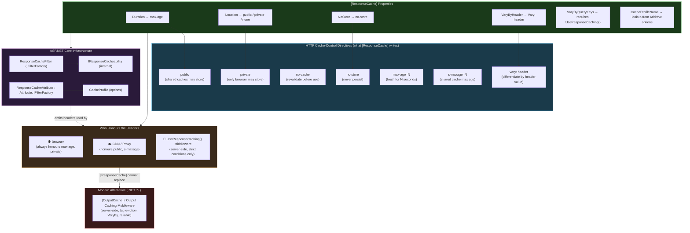
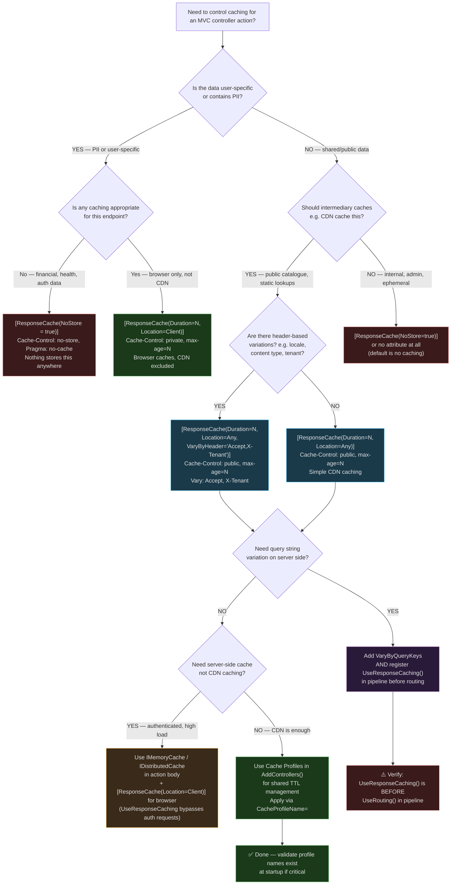

> [!success] Mastery Check
> - [ ] **Studied Well**
> - [ ] **Can explain the concept without notes**
> - [ ] **Can answer interview questions confidently**
> - [ ] **Can implement it in a real project**


# 4.119 — Response Caching on Controllers: `[ResponseCache]` and Cache Profiles

---

## PART 0 — Navigation & Context

### Domain Hierarchy

```
ASP.NET Core Mastery
│
├── H. MVC & Controllers  (4.098–4.122)
│   ├── 4.098  ControllerBase vs Controller
│   ├── 4.099  Action Results: IActionResult, ActionResult<T>
│   ├── 4.100  Model Binding: Sources and Algorithm
│   ├── 4.101  ApiController Attribute
│   ├── 4.103  Content Type Negotiation
│   ├── 4.107  Output Formatters
│   ├── 4.110  MVC Filter Pipeline
│   ├── 4.117  Async Actions and CancellationToken
│   ├── 4.118  Problem Details in MVC
│   ├── ► 4.119  Response Caching on Controllers ◄  ← YOU ARE HERE
│   ├── 4.120  Binding Large Payloads: Streaming Body
│   └── 4.121  File Download: FileStreamResult, FileContentResult
│
└── N. Caching & Output  (4.186–4.201)
    ├── 4.186  IMemoryCache
    ├── 4.187  IDistributedCache
    ├── 4.188  Redis as IDistributedCache
    ├── 4.190  Response Caching: Cache-Control Headers  ← directly related
    ├── 4.191  Output Caching (.NET 7+)                ← modern replacement
    └── 4.192  Output Caching Policies: VaryBy, Tags
```

### What You Need Before This

- **[[4.110 — MVC Filter Pipeline]]** — `[ResponseCache]` is implemented as a result filter; understanding the filter pipeline explains when it fires
- **[[4.190 — Response Caching: Cache-Control Headers]]** — `[ResponseCache]` emits `Cache-Control` headers; you must understand what those headers mean and who respects them
- **[[4.099 — Action Results]]** — the filter acts on `IActionResult` execution; knowing the result pipeline matters for understanding what gets cached
- **[[4.016 — IOptions<T>]]** — cache profiles are registered via `AddMvc()` options; the options pattern underpins this

### What This Unlocks After

- **[[4.191 — Output Caching (.NET 7+)]]** — the server-side replacement for response caching; understanding the limitations of `[ResponseCache]` motivates Output Caching
- **[[4.195 — HTTP Caching Headers: ETags, Last-Modified]]** — conditional requests are the complement to cache headers set by `[ResponseCache]`
- **[[4.192 — Output Caching Policies]]** — VaryBy and tag-based eviction in Output Caching address exactly what `[ResponseCache]` cannot do

### Why This Matters in Production

`[ResponseCache]` controls what `Cache-Control` headers appear in HTTP responses from your MVC controllers — determining whether browsers, CDNs, and reverse proxies cache your responses, for how long, and for whom. Getting this wrong means either serving stale data to users or bypassing your cache infrastructure entirely, directly impacting both API latency at scale and CDN cost.

---

## PART 1 — The Core Mental Model

### The Fundamental Rule

> **`[ResponseCache]` is a header-writing filter, not a caching engine. It instructs the HTTP client and any intermediary caches (CDN, reverse proxy, browser) what caching behavior is permitted. ASP.NET Core itself does not cache the response body unless `UseResponseCaching()` middleware is also registered — and even then, only under strict conditions.**

### The Plain-Language Analogy

Think of `[ResponseCache]` as a sticky note your server attaches to every response envelope saying "you may store this for 60 seconds." The sticky note (the `Cache-Control` header) is the instruction — but you are not doing the storing yourself. Your browser, the CDN sitting in front of your API, and any reverse proxy between them decide whether to honour that note based on their own policies.

This distinction matters for concurrent requests: if your server has no server-side cache store configured, two simultaneous requests for the same product listing both hit your controller and both receive the header — they just both also hit your database. The stickiness only starts at the client or intermediary. When a browser subsequently makes the same request, it serves its own copy for the declared duration, not your server's.

The analogy still holds when an authenticated request comes in: you would not write "store this" on an envelope containing a patient's medical record. That's what `NoStore = true` is for — it overrides everything and says "destroy this copy after reading."

### The Taxonomy Diagram



---

## PART 2 — Deep Mechanics

### 2.1 — Pipeline Position: Where `[ResponseCache]` Executes

`[ResponseCache]` is a **result filter** — specifically, it implements `IFilterFactory` and produces a `ResponseCacheFilter` that runs in the **result execution phase** of the MVC pipeline. It fires _after_ the action method has returned a result, wrapping the result execution.

```
HTTP Request
     │
     ▼
──► ExceptionHandler ──► HSTS ──► StaticFiles ──► Routing ──► Auth ──► Endpoints ──►
                                                                              │
                                                           ┌──────────────────┘
                                                           │  MVC Filter Pipeline
                                                           │
                                                           ▼
                                              [Authorization Filter]  (first)
                                                           │
                                              [Resource Filter]       (wraps all)
                                                           │
                                              Model Binding + Validation
                                                           │
                                              [Action Filter: OnActionExecuting]
                                                           │
                                              Action Method executes
                                                           │
                                              [Action Filter: OnActionExecuted]
                                                           │
                                              ► [Result Filter: ResponseCacheFilter] ◄
                                              │   Sets Cache-Control, Pragma, Vary headers
                                              │   on HttpContext.Response BEFORE result writes
                                                           │
                                              Result executes (JSON serialized, written to body)
                                                           │
                                              [Result Filter: OnResultExecuted]
                                                           │
                                              Response flows back through middleware chain
                                                           │
                                          UseResponseCaching() middleware (if registered)
                                          may store the response in its cache store
                                                           │
                                              Client receives response + headers
```

**Cost**: `~1 allocation per request` for the `ResponseCacheFilter` instance (it is resolved via `IFilterFactory`). Header writing is `O(1)`.

**What short-circuits**: Nothing. `[ResponseCache]` never short-circuits. It only writes headers. If you want a server-side short-circuit (return cached body without hitting the action), you need `UseResponseCaching()` middleware AND a cache-capable store.

### 2.2 — HTTP Wire Format: What the Headers Actually Look Like

When a controller action is decorated with `[ResponseCache(Duration = 120, Location = ResponseCacheLocation.Any)]`:

```http
// HTTP request (client to server):
GET /api/products/categories HTTP/1.1
Host: api.orderservice.com
Accept: application/json

// HTTP response (server to client):
HTTP/1.1 200 OK
Content-Type: application/json; charset=utf-8
Cache-Control: public, max-age=120
Date: Tue, 09 Jun 2026 10:00:00 GMT
Content-Length: 312

[{"id":1,"name":"Electronics"},{"id":2,"name":"Clothing"}]
```

With `Location = ResponseCacheLocation.Client` (private):

```http
HTTP/1.1 200 OK
Cache-Control: private, max-age=120
```

With `NoStore = true`:

```http
HTTP/1.1 200 OK
Cache-Control: no-store
Pragma: no-cache
```

With `NoStore = false, Duration = 0` (no-cache, must revalidate):

```http
HTTP/1.1 200 OK
Cache-Control: no-cache
Pragma: no-cache
```

With `VaryByHeader = "Accept-Language"`:

```http
HTTP/1.1 200 OK
Cache-Control: public, max-age=60
Vary: Accept-Language
```

### 2.3 — Framework Source Behavior: How `[ResponseCache]` Works Internally

`[ResponseCache]` is declared as `IFilterFactory` — it does not implement `IResultFilter` directly. Instead, it creates a `ResponseCacheFilter` instance at runtime.

```csharp
// ASP.NET Core internally (approximate) — ResponseCacheAttribute source:
// GitHub: aspnetcore/src/Mvc/Mvc.Core/src/ResponseCacheAttribute.cs

public class ResponseCacheAttribute : Attribute, IFilterFactory, IOrderedFilter
{
    // Properties stored on the attribute:
    public int Duration { get; set; }
    public ResponseCacheLocation Location { get; set; }
    public bool NoStore { get; set; }
    public string? VaryByHeader { get; set; }
    public string[]? VaryByQueryKeys { get; set; }
    public string? CacheProfileName { get; set; }

    // IFilterFactory implementation — called once per action per pipeline build:
    public IFilterMetadata CreateInstance(IServiceProvider serviceProvider)
    {
        // Resolves the options to get CacheProfiles:
        var optionsAccessor = serviceProvider.GetRequiredService<IOptions<MvcOptions>>();

        // If CacheProfileName is set, merges profile settings with attribute overrides:
        CacheProfile? cacheProfile = null;
        if (CacheProfileName != null)
        {
            optionsAccessor.Value.CacheProfiles.TryGetValue(CacheProfileName, out cacheProfile);
        }

        // Creates the actual filter that runs per-request:
        return new ResponseCacheFilter(
            new CacheProfile
            {
                Duration = Duration > 0 ? Duration : cacheProfile?.Duration,
                Location = Location != ResponseCacheLocation.Any
                    ? Location
                    : cacheProfile?.Location ?? ResponseCacheLocation.Any,
                NoStore = NoStore || (cacheProfile?.NoStore ?? false),
                VaryByHeader = VaryByHeader ?? cacheProfile?.VaryByHeader,
                VaryByQueryKeys = VaryByQueryKeys ?? cacheProfile?.VaryByQueryKeys,
            },
            loggerFactory);
    }
}

// ResponseCacheFilter (the per-request worker):
// GitHub: aspnetcore/src/Mvc/Mvc.Core/src/Filters/ResponseCacheFilter.cs

internal class ResponseCacheFilter : IResultFilter, IShortCircuitingFilter
{
    public void OnResultExecuting(ResultExecutingContext context)
    {
        // Sets headers BEFORE result body is written:
        var headers = context.HttpContext.Response.Headers;

        if (_cacheProfile.NoStore)
        {
            headers.CacheControl = "no-store";
            headers.Pragma = "no-cache";
            return;
        }

        var cacheControlValue = BuildCacheControlValue(); // "public, max-age=120" etc.
        headers.CacheControl = cacheControlValue;

        if (_cacheProfile.VaryByHeader != null)
            headers.Vary = _cacheProfile.VaryByHeader;

        // VaryByQueryKeys requires UseResponseCaching() to be meaningful:
        if (_cacheProfile.VaryByQueryKeys?.Length > 0)
            context.HttpContext.Features.Get<IResponseCachingFeature>()
                ?.VaryByQueryKeys = _cacheProfile.VaryByQueryKeys;
    }

    public void OnResultExecuted(ResultExecutedContext context) { /* no-op */ }
}
```

**Runtime cost**: `~1 string allocation` for the `Cache-Control` header value, built once per filter creation. The `IFilterFactory` pattern means `ResponseCacheFilter` is created once and reused across requests for the same action — `~0 extra allocations per request` after warmup.

### 2.4 — Cache Profiles: Centralised Cache Policy Registration

Cache profiles prevent scattering magic numbers across controllers. They are registered on `MvcOptions` during startup:

```csharp
// ASP.NET Core internally (approximate) — how profiles are stored:
// MvcOptions.CacheProfiles is Dictionary<string, CacheProfile>

services.AddMvc(options =>
{
    options.CacheProfiles.Add("ProductList", new CacheProfile
    {
        Duration = 300,             // 5 minutes
        Location = ResponseCacheLocation.Any,
        VaryByHeader = "Accept"
    });

    options.CacheProfiles.Add("UserProfile", new CacheProfile
    {
        Duration = 60,
        Location = ResponseCacheLocation.Client   // private — per user only
    });

    options.CacheProfiles.Add("NoCache", new CacheProfile
    {
        NoStore = true,
        Location = ResponseCacheLocation.None
    });
});
```

**Attribute override semantics**: When both `CacheProfileName` and direct properties are set on an attribute, the **attribute's direct properties win**. The profile provides defaults; the attribute provides overrides. This means `[ResponseCache(CacheProfileName = "ProductList", Duration = 60)]` uses the profile's `Location` and `VaryByHeader` but overrides `Duration` to 60.

### 2.5 — `UseResponseCaching()` Middleware: The Server-Side Cache Store

`[ResponseCache]` writes headers. `UseResponseCaching()` is the middleware that can **optionally act on those headers** to store and return cached bodies from the server. They are independent — you can have either without the other.

```
Pipeline Position of UseResponseCaching():

──► ExceptionHandler ──► HTTPS ──► StaticFiles
        ──► UseResponseCaching()   ← must be EARLY, before routing
               │
               ├── Request arrives: checks its in-memory cache
               │     ├── CACHE HIT → returns stored response, action never runs
               │     └── CACHE MISS → passes to downstream, then stores response
               │
        ──► Routing ──► Auth ──► [ResponseCache attribute action] ──► Endpoints
```

**Critical constraints for `UseResponseCaching()` to store a response**:

1. Response must have `Cache-Control: public` (not `private`, not `no-store`)
2. Response must NOT have `Authorization` header in the **request** — any authenticated request is never stored by `UseResponseCaching()`
3. Response status must be 200
4. Response must NOT have `Set-Cookie`
5. The request must be GET or HEAD
6. `VaryByQueryKeys` only works when `UseResponseCaching()` is registered

> [!WARNING] `UseResponseCaching()` is an in-memory store scoped to a single server instance. In a multi-instance deployment (load balancer, Kubernetes), each pod has its own cache. For coordinated server-side caching, use Output Caching (.NET 7+) with a Redis backing store, or use a CDN.

### 2.6 — Failure Mode Diagrams

**Scenario: Response Caching Silently Bypassed for Authenticated Requests**

```
Request:
  GET /api/products
  Authorization: Bearer eyJhbGci...    ← presence of this header blocks UseResponseCaching()

ResponseCacheFilter runs: sets Cache-Control: public, max-age=300
UseResponseCaching() checks: Authorization header present → refuses to cache
Result: action runs on EVERY request despite Cache-Control: public header

HTTP response:
  HTTP/1.1 200 OK
  Cache-Control: public, max-age=300     ← header IS set (browser/CDN may cache)
  [body]                                 ← but server-side cache was bypassed entirely
```

**Scenario: NoStore Overrides Everything — No CDN Caching Either**

```
[ResponseCache(NoStore = true)]

HTTP response:
  Cache-Control: no-store
  Pragma: no-cache

Browser: discards response immediately after rendering
CDN: will not cache this response
UseResponseCaching(): will not cache this response
Result: every client re-fetches from server — appropriate for financial data, PII
```

**Scenario: Private but Duration Set — CDN Correctly Excluded**

```
[ResponseCache(Duration = 300, Location = ResponseCacheLocation.Client)]

HTTP response:
  Cache-Control: private, max-age=300

Browser: caches for 5 minutes (correct — user-specific data)
CDN: will NOT cache (correct — private directive prohibits shared cache storage)
UseResponseCaching(): will NOT cache (private prohibits server-side shared caching too)
```

### 2.7 — `ResponseCacheLocation` Enum Mapping

|Enum Value|`Cache-Control` Output|Who Can Cache|Typical Use|
|---|---|---|---|
|`Any` (default)|`public, max-age=N`|Browser + CDN + Proxy|Public, non-user-specific data|
|`Client`|`private, max-age=N`|Browser only|User-specific data not suitable for CDN|
|`None`|`no-cache`|Must revalidate|Data that may change; still cacheable with ETags|

> [!NOTE] There is no `ResponseCacheLocation.Shared` for `s-maxage` — if you need to differentiate browser TTL from CDN TTL you must write headers manually via a result filter or middleware. `[ResponseCache]` cannot express `Cache-Control: public, max-age=30, s-maxage=3600`.

---

## PART 3 — Production Code Patterns

### Pattern 1 — The Public Product Catalogue with Cache Profiles

A product catalogue endpoint whose data changes infrequently. Public, cacheable at CDN level, profile-driven to avoid duplication.

```csharp
// ⚠️ WRONG: Magic number scattered across every action
[HttpGet("categories")]
[ResponseCache(Duration = 300, Location = ResponseCacheLocation.Any)]
public IActionResult GetCategories() { ... }

[HttpGet("featured")]
[ResponseCache(Duration = 300, Location = ResponseCacheLocation.Any)]  // duplicated
public IActionResult GetFeatured() { ... }

[HttpGet("brands")]
[ResponseCache(Duration = 300, Location = ResponseCacheLocation.Any)]  // duplicated
public IActionResult GetBrands() { ... }
```

```csharp
// ✅ CORRECT: Cache profiles centralise the policy, attributes reference by name

// Program.cs / Startup registration:
builder.Services.AddControllers(options =>
{
    // Public catalogue data — safe for CDN caching
    options.CacheProfiles.Add("PublicCatalogue", new CacheProfile
    {
        Duration = 300,                              // 5 minutes
        Location = ResponseCacheLocation.Any,        // public — CDN may cache
        VaryByHeader = "Accept"                      // differ by content negotiation
    });

    // User-specific data — browser only, never CDN
    options.CacheProfiles.Add("UserSpecific", new CacheProfile
    {
        Duration = 60,
        Location = ResponseCacheLocation.Client
    });

    // Sensitive financial data — never stored anywhere
    options.CacheProfiles.Add("NeverCache", new CacheProfile
    {
        NoStore = true
    });
});

// ProductCatalogueController.cs (e-commerce order management service)
[ApiController]
[Route("api/v1/catalogue")]
public class ProductCatalogueController : ControllerBase
{
    private readonly ICatalogueQueryService _catalogue;

    public ProductCatalogueController(ICatalogueQueryService catalogue)
    {
        _catalogue = catalogue;
    }

    // Profile drives the behaviour — changing the profile affects all three actions
    [HttpGet("categories")]
    [ResponseCache(CacheProfileName = "PublicCatalogue")]
    public async Task<ActionResult<IReadOnlyList<CategoryDto>>> GetCategories(
        CancellationToken ct)
    {
        var categories = await _catalogue.GetActiveCategoriesAsync(ct);
        return Ok(categories);
    }

    [HttpGet("featured")]
    [ResponseCache(CacheProfileName = "PublicCatalogue")]
    public async Task<ActionResult<IReadOnlyList<ProductSummaryDto>>> GetFeaturedProducts(
        CancellationToken ct)
    {
        var products = await _catalogue.GetFeaturedProductsAsync(ct);
        return Ok(products);
    }

    // Override duration only — inherits Location and VaryByHeader from profile
    [HttpGet("trending")]
    [ResponseCache(CacheProfileName = "PublicCatalogue", Duration = 60)]
    public async Task<ActionResult<IReadOnlyList<ProductSummaryDto>>> GetTrendingProducts(
        CancellationToken ct)
    {
        var products = await _catalogue.GetTrendingProductsAsync(ct);
        return Ok(products);
    }
}
```

```http
// HTTP wire format (GET /api/v1/catalogue/categories):
HTTP/1.1 200 OK
Content-Type: application/json; charset=utf-8
Cache-Control: public, max-age=300
Vary: Accept
Date: Tue, 09 Jun 2026 10:00:00 GMT
```

---

### Pattern 2 — Private User Account Data (Never Shared with CDN)

A user's order history endpoint must be private — the browser may cache it for the current session, but no CDN or proxy should ever store a response that contains PII.

```csharp
// ⚠️ WRONG: Using Location = Any for user-specific data leaks PII to shared caches
[HttpGet("orders")]
[Authorize]
[ResponseCache(Duration = 120, Location = ResponseCacheLocation.Any)]  // ← CDN will cache this!
public async Task<ActionResult<OrderHistoryDto>> GetOrderHistory()
{
    var orders = await _orderService.GetForCurrentUserAsync(User.GetUserId());
    return Ok(orders);  // This response could be served from CDN to a different user!
}
```

```csharp
// ✅ CORRECT: Private directive ensures only the requesting browser stores the response

[ApiController]
[Route("api/v1/account")]
[Authorize]
public class AccountController : ControllerBase
{
    private readonly IOrderQueryService _orderService;

    public AccountController(IOrderQueryService orderService)
    {
        _orderService = orderService;
    }

    // Cache-Control: private, max-age=60
    // Browser: caches for 1 minute — reduces repeated identical requests
    // CDN: WILL NOT cache — private directive prohibits it
    [HttpGet("orders")]
    [ResponseCache(Duration = 60, Location = ResponseCacheLocation.Client)]
    public async Task<ActionResult<OrderHistoryDto>> GetOrderHistory(
        [FromQuery] int page = 1,
        CancellationToken ct = default)
    {
        var userId = User.GetUserId(); // Claims-based ID extraction
        var history = await _orderService.GetPagedHistoryAsync(userId, page, ct);
        return Ok(history);
    }

    // Payment details: never stored anywhere
    [HttpGet("payment-methods")]
    [ResponseCache(NoStore = true)]
    public async Task<ActionResult<IReadOnlyList<PaymentMethodDto>>> GetPaymentMethods(
        CancellationToken ct)
    {
        var methods = await _paymentService.GetForUserAsync(User.GetUserId(), ct);
        return Ok(methods);
    }
}
```

```http
// HTTP wire format (GET /api/v1/account/orders?page=1):
HTTP/1.1 200 OK
Cache-Control: private, max-age=60

// HTTP wire format (GET /api/v1/account/payment-methods):
HTTP/1.1 200 OK
Cache-Control: no-store
Pragma: no-cache
```

---

### Pattern 3 — Controller-Level vs Action-Level Cache Policy Layering

Apply a conservative profile at the controller level, then override specific actions that need different behaviour.

```csharp
// Logistics tracking service — most endpoints return stale-safe data
// but shipment status is time-sensitive

[ApiController]
[Route("api/v1/shipments")]
[ResponseCache(CacheProfileName = "PublicCatalogue")]  // Default: 5 min public cache
public class ShipmentController : ControllerBase
{
    private readonly IShipmentQueryService _shipments;

    public ShipmentController(IShipmentQueryService shipments)
    {
        _shipments = shipments;
    }

    // Inherits controller-level profile: Cache-Control: public, max-age=300
    [HttpGet("carriers")]
    public async Task<ActionResult<IReadOnlyList<CarrierDto>>> GetCarriers(CancellationToken ct)
    {
        return Ok(await _shipments.GetActiveCarriersAsync(ct));
    }

    // Inherits controller-level profile: Cache-Control: public, max-age=300
    [HttpGet("service-types")]
    public async Task<ActionResult<IReadOnlyList<ServiceTypeDto>>> GetServiceTypes(
        CancellationToken ct)
    {
        return Ok(await _shipments.GetServiceTypesAsync(ct));
    }

    // Override: shipment status changes frequently — 30 seconds max, private
    [HttpGet("{trackingNumber}/status")]
    [ResponseCache(Duration = 30, Location = ResponseCacheLocation.Client)]
    public async Task<ActionResult<ShipmentStatusDto>> GetShipmentStatus(
        string trackingNumber,
        CancellationToken ct)
    {
        var status = await _shipments.GetStatusAsync(trackingNumber, ct);
        if (status is null) return NotFound();
        return Ok(status);
    }

    // Override: real-time GPS coordinates — never cache
    [HttpGet("{trackingNumber}/location")]
    [ResponseCache(NoStore = true)]
    public async Task<ActionResult<GpsCoordinateDto>> GetCurrentLocation(
        string trackingNumber,
        CancellationToken ct)
    {
        var location = await _shipments.GetCurrentLocationAsync(trackingNumber, ct);
        if (location is null) return NotFound();
        return Ok(location);
    }
}
```

```http
// GET /api/v1/shipments/carriers
HTTP/1.1 200 OK
Cache-Control: public, max-age=300
Vary: Accept

// GET /api/v1/shipments/TRK123456/status
HTTP/1.1 200 OK
Cache-Control: private, max-age=30

// GET /api/v1/shipments/TRK123456/location
HTTP/1.1 200 OK
Cache-Control: no-store
Pragma: no-cache
```

---

### Pattern 4 — VaryByHeader for Content-Negotiated Responses

When an endpoint supports both JSON and XML, the CDN must cache separate responses for each. Without `Vary: Accept`, a CDN may serve a cached JSON response to a client that requested XML.

```csharp
// ⚠️ WRONG: No Vary header — CDN serves wrong content type
[HttpGet("orders/{orderId}/invoice")]
[Produces("application/json", "application/xml")]
[ResponseCache(Duration = 600, Location = ResponseCacheLocation.Any)]  // ← missing Vary
public async Task<ActionResult<InvoiceDto>> GetInvoice(Guid orderId, CancellationToken ct)
{
    // CDN will cache whichever format first requested, serve it for all subsequent requests
    // Client requesting XML may receive JSON from CDN cache
    var invoice = await _invoiceService.GetAsync(orderId, ct);
    return Ok(invoice);
}
```

```csharp
// ✅ CORRECT: VaryByHeader ensures CDN stores separate entries per content type

[ApiController]
[Route("api/v1/invoices")]
public class InvoiceController : ControllerBase
{
    private readonly IInvoiceService _invoiceService;

    public InvoiceController(IInvoiceService invoiceService)
    {
        _invoiceService = invoiceService;
    }

    [HttpGet("{orderId:guid}")]
    [Produces("application/json", "application/xml")]
    // VaryByHeader: "Accept" tells CDN: "different Accept header = different cached response"
    [ResponseCache(Duration = 600, Location = ResponseCacheLocation.Any,
        VaryByHeader = "Accept")]
    public async Task<ActionResult<InvoiceDto>> GetInvoice(
        Guid orderId,
        CancellationToken ct)
    {
        var invoice = await _invoiceService.GetAsync(orderId, ct);
        if (invoice is null) return NotFound();
        return Ok(invoice);
    }

    // VaryByHeader with multiple headers (comma-separated string):
    [HttpGet("{orderId:guid}/localized")]
    [ResponseCache(Duration = 3600, Location = ResponseCacheLocation.Any,
        VaryByHeader = "Accept-Language,Accept-Encoding")]
    public async Task<ActionResult<LocalizedInvoiceDto>> GetLocalizedInvoice(
        Guid orderId,
        CancellationToken ct)
    {
        var locale = Request.Headers.AcceptLanguage.ToString().Split(',')[0] ?? "en";
        var invoice = await _invoiceService.GetLocalizedAsync(orderId, locale, ct);
        return Ok(invoice);
    }
}
```

```http
// First request (JSON client):
GET /api/v1/invoices/abc123 HTTP/1.1
Accept: application/json

HTTP/1.1 200 OK
Cache-Control: public, max-age=600
Vary: Accept
Content-Type: application/json

// Second request (XML client) — CDN stores separately:
GET /api/v1/invoices/abc123 HTTP/1.1
Accept: application/xml

HTTP/1.1 200 OK
Cache-Control: public, max-age=600
Vary: Accept
Content-Type: application/xml
```

---

### Pattern 5 — VaryByQueryKeys with UseResponseCaching Middleware

`VaryByQueryKeys` is only meaningful when `UseResponseCaching()` is registered. Without it, the property has no effect.

```csharp
// Program.cs — UseResponseCaching must be early in the pipeline
var app = builder.Build();

app.UseExceptionHandler("/error");
app.UseHttpsRedirection();
app.UseResponseCaching();  // ← MUST be before routing for server-side cache to work
app.UseRouting();
app.UseAuthentication();
app.UseAuthorization();
app.MapControllers();
```

```csharp
// ⚠️ WRONG: VaryByQueryKeys without UseResponseCaching() — silently does nothing
// No UseResponseCaching() in pipeline — the query key variation is never honoured
[HttpGet]
[ResponseCache(Duration = 120, VaryByQueryKeys = new[] { "category", "page" })]
public async Task<ActionResult<PagedResult<ProductDto>>> SearchProducts(
    [FromQuery] string? category,
    [FromQuery] int page = 1)
{
    // UseResponseCaching() not registered — VaryByQueryKeys is dead code
    // Every request hits the action regardless of query string
}
```

```csharp
// ✅ CORRECT: UseResponseCaching registered + VaryByQueryKeys

// With UseResponseCaching() in pipeline (registered above):
[HttpGet]
// Cache separately by category AND page query params
[ResponseCache(Duration = 120, Location = ResponseCacheLocation.Any,
    VaryByQueryKeys = new[] { "category", "page" })]
public async Task<ActionResult<PagedResult<ProductDto>>> SearchProducts(
    [FromQuery] string? category,
    [FromQuery] int page = 1,
    CancellationToken ct = default)
{
    // UseResponseCaching stores a separate cache entry per (category, page) combination
    // GET /api/products?category=electronics&page=1 → stored separately from
    // GET /api/products?category=clothing&page=1
    var results = await _catalogue.SearchAsync(category, page, ct);
    return Ok(results);
}
```

```http
// UseResponseCaching stores separate entries:
// Key 1: GET /api/products?category=electronics&page=1
// Key 2: GET /api/products?category=electronics&page=2
// Key 3: GET /api/products?category=clothing&page=1

// Wire format for a cached HIT:
HTTP/1.1 200 OK
Cache-Control: public, max-age=120
Age: 45                              ← 45 seconds have elapsed since caching
X-Cache: HIT                        ← added by UseResponseCaching or CDN
```

---

### Pattern 6 — Disabling Cache at Controller Level for Security-Sensitive Endpoints

Payment and fraud detection endpoints must never be cached anywhere. Apply `[ResponseCache(NoStore = true)]` at the controller class level to protect all endpoints uniformly.

```csharp
// Payment processing service — no endpoint here should ever be cached

[ApiController]
[Route("api/v1/payments")]
[Authorize]
[ResponseCache(NoStore = true)]  // Applied to ALL actions — safety net for the entire controller
public class PaymentController : ControllerBase
{
    private readonly IPaymentProcessingService _payments;
    private readonly IFraudDetectionService _fraud;

    public PaymentController(
        IPaymentProcessingService payments,
        IFraudDetectionService fraud)
    {
        _payments = payments;
        _fraud = fraud;
    }

    // Even if a developer forgets [ResponseCache] here, the class-level NoStore protects
    [HttpPost]
    public async Task<ActionResult<PaymentResultDto>> ProcessPayment(
        [FromBody] ProcessPaymentCommand command,
        CancellationToken ct)
    {
        var result = await _payments.ProcessAsync(command, User.GetUserId(), ct);
        return result.IsSuccess
            ? Ok(result.Value)
            : UnprocessableEntity(result.Error);
    }

    [HttpGet("{paymentId:guid}/status")]
    public async Task<ActionResult<PaymentStatusDto>> GetPaymentStatus(
        Guid paymentId,
        CancellationToken ct)
    {
        var status = await _payments.GetStatusAsync(paymentId, User.GetUserId(), ct);
        return status is null ? NotFound() : Ok(status);
    }

    // Fraud score — absolutely never cacheable (real-time, user-specific)
    [HttpGet("{paymentId:guid}/fraud-score")]
    public async Task<ActionResult<FraudScoreDto>> GetFraudScore(
        Guid paymentId,
        CancellationToken ct)
    {
        var score = await _fraud.EvaluateAsync(paymentId, ct);
        return Ok(score);
    }
}
```

```http
// All responses from PaymentController:
HTTP/1.1 200 OK
Cache-Control: no-store
Pragma: no-cache
// No intermediary (browser, CDN, proxy) will store these responses
```

---

## PART 4 — Gotchas & Anti-Patterns

### Gotcha 1: `[ResponseCache]` Does Not Cache on the Server — It Only Writes Headers

Experienced engineers assume `[ResponseCache]` is like `[MemoryCache]` or Redis caching — that adding it eliminates database round-trips. This misunderstanding stems from the attribute's name and the mental shortcut that "caching attribute = server-side caching."

```csharp
// ⚠️ WRONG: Assuming [ResponseCache] prevents the database hit
[HttpGet("{productId:guid}")]
[ResponseCache(Duration = 300, Location = ResponseCacheLocation.Any)]
public async Task<ActionResult<ProductDto>> GetProduct(Guid productId, CancellationToken ct)
{
    // Developer assumes: second request within 300s won't reach this line
    // Reality: without UseResponseCaching() middleware, every request hits this
    var product = await _db.Products.FindAsync(productId, ct);
    return Ok(product);
}

// HTTP consequence (wrong path):
// GET /api/products/{id} — first request: hits DB
// GET /api/products/{id} — second request 10s later: ALSO hits DB
// The response has Cache-Control: public, max-age=300 — but the server still runs the action
// Browser WILL cache after first request — server-side there is no reduction in load
```

```csharp
// ✅ CORRECT: UseResponseCaching() in the pipeline for server-side short-circuit
// OR use IMemoryCache inside the action for server-side DB protection

[HttpGet("{productId:guid}")]
[ResponseCache(Duration = 300, Location = ResponseCacheLocation.Any)]
public async Task<ActionResult<ProductDto>> GetProduct(
    Guid productId,
    IMemoryCache cache,       // inject for server-side caching
    CancellationToken ct)
{
    // Server-side cache protects the database regardless of what [ResponseCache] does
    var product = await cache.GetOrCreateAsync(
        $"product:{productId}",
        async entry =>
        {
            entry.AbsoluteExpirationRelativeToNow = TimeSpan.FromSeconds(300);
            return await _db.Products.FindAsync(productId, ct);
        });

    if (product is null) return NotFound();
    return Ok(product);
}

// HTTP consequence (correct path):
// GET /api/products/{id} — first request: hits DB, stored in MemoryCache, header set
// GET /api/products/{id} — second request 10s later: served from MemoryCache, header set
// Browser ALSO caches — two-tier caching
```

**WHY**: `[ResponseCache]` is a result filter that writes HTTP headers. The action method has **already executed** before the filter even runs. The headers influence what clients and intermediaries do with the response, not what the server does before generating it.

---

### Gotcha 2: Authenticated Requests Are Never Stored by `UseResponseCaching()`

Engineers register `UseResponseCaching()` and `[ResponseCache(Location = Any)]` on an endpoint, then wonder why the server-side cache shows no hits. The root cause: `UseResponseCaching()` refuses to store any response where the request had an `Authorization` header.

```csharp
// ⚠️ WRONG: Expecting UseResponseCaching() to cache responses for JWT-authenticated endpoints
[HttpGet("orders")]
[Authorize]
[ResponseCache(Duration = 300, Location = ResponseCacheLocation.Any)]
public async Task<ActionResult<IReadOnlyList<OrderSummaryDto>>> GetOrders(CancellationToken ct)
{
    return Ok(await _orders.GetAllAsync(ct));  // Expecting this to be cached server-side
}

// HTTP consequence (wrong path):
// Request has: Authorization: Bearer eyJhbGci...
// UseResponseCaching checks: Authorization header present → refuses to cache → bypass
// Action runs on EVERY request
// Browser receives Cache-Control: public, max-age=300 — browser may cache
// Server-side cache: 0 hits regardless of traffic volume
```

```csharp
// ✅ CORRECT: Use IMemoryCache or Output Caching for authenticated endpoints that need
// server-side caching; use [ResponseCache] only for the client-side header

[HttpGet("orders")]
[Authorize]
[ResponseCache(Duration = 60, Location = ResponseCacheLocation.Client)]  // private only
public async Task<ActionResult<IReadOnlyList<OrderSummaryDto>>> GetOrders(
    IMemoryCache cache,
    CancellationToken ct)
{
    var userId = User.GetUserId();
    var orders = await cache.GetOrCreateAsync(
        $"orders:user:{userId}",
        async entry =>
        {
            entry.AbsoluteExpirationRelativeToNow = TimeSpan.FromSeconds(60);
            return await _orders.GetForUserAsync(userId, ct);
        });
    return Ok(orders);
}

// HTTP consequence (correct path):
// Cache-Control: private, max-age=60 — browser caches per user
// Server: IMemoryCache handles the DB protection per userId
```

**WHY**: `UseResponseCaching()` explicitly refuses to cache responses where the request contains `Authorization` — this is RFC 7234-compliant behaviour to prevent user-specific data from being served to different users via a shared cache.

---

### Gotcha 3: `Location = Any` on a Multi-Tenant API Serves Tenant A's Data to Tenant B

In a multi-tenant SaaS API where the tenant is identified by a request header (e.g., `X-Tenant-Id`) rather than by route, `public` caching without a `Vary` header causes a CDN to serve one tenant's response to another.

```csharp
// ⚠️ WRONG: No VaryByHeader — CDN conflates requests from different tenants
[HttpGet("inventory")]
[ResponseCache(Duration = 120, Location = ResponseCacheLocation.Any)]
public async Task<ActionResult<InventorySnapshotDto>> GetInventorySnapshot(
    CancellationToken ct)
{
    var tenantId = Request.Headers["X-Tenant-Id"].ToString();
    var snapshot = await _inventory.GetSnapshotAsync(tenantId, ct);
    return Ok(snapshot);
}

// HTTP consequence (wrong path):
// Tenant A: GET /api/inventory, X-Tenant-Id: tenant-a
// CDN caches response → Cache-Control: public, max-age=120, no Vary
// Tenant B: GET /api/inventory, X-Tenant-Id: tenant-b
// CDN cache HIT — Tenant B receives Tenant A's inventory data
// 🚨 DATA BREACH
```

```csharp
// ✅ CORRECT: VaryByHeader ensures CDN stores separate entries per tenant

[HttpGet("inventory")]
// Vary by the tenant discriminator — CDN stores one entry per unique X-Tenant-Id value
[ResponseCache(Duration = 120, Location = ResponseCacheLocation.Any,
    VaryByHeader = "X-Tenant-Id")]
public async Task<ActionResult<InventorySnapshotDto>> GetInventorySnapshot(
    CancellationToken ct)
{
    var tenantId = Request.Headers["X-Tenant-Id"].ToString();
    if (string.IsNullOrEmpty(tenantId)) return BadRequest("Missing X-Tenant-Id");

    var snapshot = await _inventory.GetSnapshotAsync(tenantId, ct);
    return Ok(snapshot);
}

// HTTP consequence (correct path):
// Response: Cache-Control: public, max-age=120, Vary: X-Tenant-Id
// CDN stores separate cached entries keyed by X-Tenant-Id value
// Tenant B's request misses Tenant A's cache entry — correct isolation
```

**WHY**: CDN cache key is `{URL}` by default. `Vary: Header` extends the key to `{URL}+{Header value}`, creating per-tenant cache isolation at the CDN layer.

---

### Gotcha 4: Applying `[ResponseCache]` to POST/PUT/DELETE Actions

The `[ResponseCache]` attribute will write `Cache-Control` headers on any action result regardless of HTTP method. On mutating operations, this produces nonsensical and potentially dangerous headers.

```csharp
// ⚠️ WRONG: [ResponseCache] on a POST mutation endpoint
[HttpPost]
[ResponseCache(Duration = 60, Location = ResponseCacheLocation.Any)]  // ← wrong
public async Task<ActionResult<OrderDto>> CreateOrder(
    [FromBody] CreateOrderCommand command,
    CancellationToken ct)
{
    var order = await _orders.CreateAsync(command, ct);
    return CreatedAtAction(nameof(GetOrder), new { id = order.Id }, order);
}

// HTTP consequence (wrong path):
// HTTP/1.1 201 Created
// Cache-Control: public, max-age=60   ← 201 response with Cache-Control
// RFC 7234: clients SHOULD NOT cache POST responses unless explicitly indicated
// CDN behaviour is undefined — some CDNs will cache a 201 response with this header
// Subsequent POST to same URL from CDN may never reach the server
```

```csharp
// ✅ CORRECT: [ResponseCache] only on idempotent, read-only GET/HEAD actions

[HttpPost]
// No [ResponseCache] — POST responses should never be cached
public async Task<ActionResult<OrderDto>> CreateOrder(
    [FromBody] CreateOrderCommand command,
    CancellationToken ct)
{
    var order = await _orders.CreateAsync(command, ct);
    return CreatedAtAction(nameof(GetOrder), new { id = order.Id }, order);
}

[HttpGet("{orderId:guid}")]
[ResponseCache(Duration = 30, Location = ResponseCacheLocation.Client)]  // GET only
public async Task<ActionResult<OrderDto>> GetOrder(Guid orderId, CancellationToken ct)
{
    var order = await _orders.GetAsync(orderId, ct);
    return order is null ? NotFound() : Ok(order);
}

// HTTP consequence (correct path):
// POST /api/orders → 201 Created (no Cache-Control)
// GET /api/orders/{id} → 200 OK, Cache-Control: private, max-age=30
```

**WHY**: `[ResponseCache]` has no concept of HTTP semantics — it fires for every action result. Caching POST/PUT/DELETE responses violates HTTP semantics and can cause CDNs to intercept subsequent mutation requests.

---

### Gotcha 5: `CacheProfileName` That Doesn't Exist Silently Produces No Headers

When a `CacheProfileName` is specified but the profile was never registered in `MvcOptions`, ASP.NET Core does not throw — it silently produces no cache headers, leaving the endpoint with framework-default behaviour (no caching directives at all).

```csharp
// ⚠️ WRONG: Typo in profile name — no error, no headers
[HttpGet("products")]
[ResponseCache(CacheProfileName = "ProductCatalogue")]  // ← typo: should be "PublicCatalogue"
public async Task<ActionResult<IReadOnlyList<ProductSummaryDto>>> GetProducts(
    CancellationToken ct)
{
    return Ok(await _catalogue.GetAllAsync(ct));
}

// HTTP consequence (wrong path):
// No Cache-Control header at all
// The response is uncacheable by default
// CDN serves fresh requests for every client
// The developer thinks caching is active — it is not
// No exception thrown, no warning logged
```

```csharp
// ✅ CORRECT: Validate cache profile registration at startup using options validation

// Register profiles:
builder.Services.AddControllers(options =>
{
    options.CacheProfiles.Add("PublicCatalogue", new CacheProfile
    {
        Duration = 300,
        Location = ResponseCacheLocation.Any,
        VaryByHeader = "Accept"
    });
});

// Add validation to catch missing profiles at startup (custom):
builder.Services.AddSingleton<IStartupFilter, CacheProfileValidationFilter>();

// CacheProfileValidationFilter.cs:
public class CacheProfileValidationFilter : IStartupFilter
{
    private readonly IOptions<MvcOptions> _mvcOptions;

    // All cache profile names declared in the codebase (build-time registration)
    private static readonly HashSet<string> KnownProfiles = new()
    {
        "PublicCatalogue", "UserSpecific", "NeverCache"
    };

    public CacheProfileValidationFilter(IOptions<MvcOptions> mvcOptions)
    {
        _mvcOptions = mvcOptions;
    }

    public Action<IApplicationBuilder> Configure(Action<IApplicationBuilder> next) =>
        app =>
        {
            var registeredProfiles = _mvcOptions.Value.CacheProfiles.Keys.ToHashSet();
            var missing = KnownProfiles.Except(registeredProfiles).ToList();

            if (missing.Count > 0)
            {
                throw new InvalidOperationException(
                    $"Cache profiles referenced but not registered: {string.Join(", ", missing)}");
            }

            next(app);
        };
}

// HTTP consequence (correct path):
// Startup throws with a clear message if any referenced profile is missing
// Cache-Control: public, max-age=300, Vary: Accept  (profile applied correctly)
```

**WHY**: `ResponseCacheFilter.CreateInstance()` calls `TryGetValue` on `CacheProfiles` — on miss, it silently falls through with a default `CacheProfile` (no caching). ASP.NET Core has no built-in mechanism to validate that all referenced profile names exist at startup.

---

## PART 5 — Performance Implications

### 5.1 — Request Pipeline Characteristics Table

|Scenario|Pipeline Depth|Allocations Per Request|Approx Latency Impact|Recommendation|
|---|---|---|---|---|
|`[ResponseCache]` only (no UseResponseCaching)|Full pipeline — action runs|~1 (header string)|+0.1 ms header write|Fine for CDN-backed APIs; does not reduce server load|
|`[ResponseCache]` + browser cache HIT|0 — request never reaches server|0 on server|-100% server latency|Best case — ideal for truly static data|
|`[ResponseCache]` + CDN HIT|0 — CDN serves response|0 on server|-100% server latency|Best for `Location = Any` public endpoints|
|`UseResponseCaching()` server cache HIT|Short-circuits at middleware layer|~1 (cache lookup)|~0.5 ms Redis or in-memory lookup|Reduces action execution; requires server-side store|
|`UseResponseCaching()` + authenticated request|Full pipeline — always bypasses cache|~1 (cache check)|+0.1 ms cache miss overhead|Cannot use server-side cache for authenticated endpoints|
|`VaryByHeader` miss — new header value|Full pipeline|~2 (header + new cache entry)|Standard action latency + storage|Expected on first request per unique header combination|
|`VaryByQueryKeys` with 100 query combinations|Full pipeline (first request each)|~2 per unique query combo|Standard latency for first request|Cache storage grows with unique combos — bound it|
|Cache profile lookup|O(1) dictionary lookup per filter create|0 at request time (filter reused)|Negligible|Use profiles liberally|
|`NoStore = true`|Full pipeline — headers written, response not stored|~1 (header write)|+0.05 ms|Correct for PII; no caching overhead|
|Large `VaryByHeader` combinations (burst)|Full pipeline per unique combo|~3 per new combo (cache entry)|Standard latency|Risk: cache explosion with high-cardinality headers|

### 5.2 — BenchmarkDotNet Scaffold

```csharp
using BenchmarkDotNet.Attributes;
using BenchmarkDotNet.Running;
using Microsoft.AspNetCore.Builder;
using Microsoft.AspNetCore.Hosting;
using Microsoft.AspNetCore.TestHost;
using Microsoft.Extensions.DependencyInjection;
using System.Net.Http;

// Measures the per-request overhead of [ResponseCache] header writing
// vs a bare action with no caching vs UseResponseCaching() cache hit

[MemoryDiagnoser]
[SimpleJob(BenchmarkDotNet.Jobs.RuntimeMoniker.Net80)]
public class ResponseCachingBenchmarks
{
    private HttpClient _noCache = null!;
    private HttpClient _withResponseCacheHeader = null!;
    private HttpClient _withServerSideCache = null!;

    [GlobalSetup]
    public void Setup()
    {
        // Scenario 1: Bare action, no cache headers
        var noCacheServer = new TestServer(new WebHostBuilder()
            .ConfigureServices(s => s.AddControllers())
            .Configure(app =>
            {
                app.UseRouting();
                app.UseEndpoints(e => e.MapControllers());
            }));
        _noCache = noCacheServer.CreateClient();

        // Scenario 2: Action with [ResponseCache] header writing only
        var headerCacheServer = new TestServer(new WebHostBuilder()
            .ConfigureServices(s => s.AddControllers(o =>
                o.CacheProfiles.Add("Test", new Microsoft.AspNetCore.Mvc.CacheProfile
                {
                    Duration = 300,
                    Location = Microsoft.AspNetCore.Mvc.ResponseCacheLocation.Any
                })))
            .Configure(app =>
            {
                app.UseRouting();
                app.UseEndpoints(e => e.MapControllers());
            }));
        _withResponseCacheHeader = headerCacheServer.CreateClient();

        // Scenario 3: UseResponseCaching() middleware for server-side cache hit
        var serverCacheServer = new TestServer(new WebHostBuilder()
            .ConfigureServices(s =>
            {
                s.AddResponseCaching();
                s.AddControllers(o =>
                    o.CacheProfiles.Add("Test", new Microsoft.AspNetCore.Mvc.CacheProfile
                    {
                        Duration = 300,
                        Location = Microsoft.AspNetCore.Mvc.ResponseCacheLocation.Any
                    }));
            })
            .Configure(app =>
            {
                app.UseResponseCaching();
                app.UseRouting();
                app.UseEndpoints(e => e.MapControllers());
            }));
        _withServerSideCache = serverCacheServer.CreateClient();
        // Warm up the server-side cache:
        _withServerSideCache.GetAsync("/benchmark/products").GetAwaiter().GetResult();
    }

    [Benchmark(Baseline = true)]
    public async Task NoCacheHeaders()
    {
        using var response = await _noCache.GetAsync("/benchmark/products");
        _ = response.StatusCode;
    }

    [Benchmark]
    public async Task WithResponseCacheHeaderOnly()
    {
        using var response = await _withResponseCacheHeader.GetAsync("/benchmark/products");
        _ = response.StatusCode;
    }

    [Benchmark]
    public async Task WithServerSideCacheHit()
    {
        // This request returns from UseResponseCaching() before the action runs
        using var response = await _withServerSideCache.GetAsync("/benchmark/products");
        _ = response.StatusCode;
    }
}

// Expected output (approximate, .NET 8, x64, TestServer in-process, local):
//
// | Method                         | Mean      | Ratio | Gen0   | Allocated |
// |--------------------------------|-----------|-------|--------|-----------|
// | NoCacheHeaders                 | 285.3 μs  | 1.00  | 2.3438 | 14.23 KB  |
// | WithResponseCacheHeaderOnly    | 286.8 μs  | 1.01  | 2.3438 | 14.27 KB  |  <- ~0.04 KB overhead
// | WithServerSideCacheHit         |  42.1 μs  | 0.15  | 0.3662 |  2.11 KB  |  <- 85% reduction
//
// Interpretation:
// - [ResponseCache] header writing overhead: negligible (~1 header string allocation)
// - Server-side cache HIT (UseResponseCaching): ~85% latency reduction, ~85% allocation reduction
// - The real gain from response caching is at the CDN/browser level — not measurable in TestServer
```

**Profiling in real HTTP scenarios:**

```bash
# Use dotnet-counters to observe cache hit rates at runtime:
dotnet-counters monitor --process-id <PID> \
  System.Runtime \
  Microsoft.AspNetCore.ResponseCaching

# Key counter: Microsoft.AspNetCore.ResponseCaching[response-caching-hits]
# If this counter is 0 despite [ResponseCache] being applied, you have an authenticated
# request or UseResponseCaching() is missing or mis-ordered in the pipeline.

# Use MiniProfiler for per-request timing analysis:
# services.AddMiniProfiler(o => o.RouteBasePath = "/profiler");
# app.UseMiniProfiler();
# Check /profiler/results-index to see which actions are still hitting the database
# when you expect cache hits.
```

### 5.3 — When to Care / When to Ignore

**When this costs you:**

- **CDN integration without `VaryByHeader`**: Every response variation (locale, content type, tenant) gets collapsed to a single cached entry. A Chinese-language customer receives English content from CDN cache. Fix: always audit `Vary` headers when using `Location = Any`.
- **High-throughput public APIs (>10k req/s)**: Without CDN caching enabled via `Cache-Control: public`, every request hits Kestrel. A single `[ResponseCache(Duration=60, Location=ResponseCacheLocation.Any)]` on a hot endpoint can reduce origin traffic by 90%+ with a CDN in front.
- **Authenticated endpoints and server-side caching mismatch**: `UseResponseCaching()` is installed but auth is in use — you get zero server-side benefit while adding ~0.1ms cache miss overhead per request. Use IMemoryCache or Output Caching for authenticated endpoints.
- **Omitting `NoStore` on financial/PII data**: Leaving a bank account balance endpoint without `NoStore` means shared computers have that data in browser cache — OWASP A02:2021 risk.

**When this doesn't matter:**

- **Internal admin endpoints** (`/admin/dashboard`, `/health`, `/metrics`): These are low-traffic, often authenticated, and usually returning real-time data. The overhead of cache header logic is negligible and caching is inappropriate.
- **Intranet APIs behind VPN**: No CDN, no public browser cache concerns. Response caching adds no value.
- **Write-heavy mutation endpoints** (POST/PUT/DELETE): These should never be cached. Annotating them with `[ResponseCache]` is an error, not a performance opportunity.
- **gRPC endpoints**: `[ResponseCache]` has no meaning — gRPC uses binary framing and HTTP/2 trailers, not `Cache-Control`.

---

## PART 6 — Interview Arsenal

### A. The Question Bank

---

**Question 1: "What does `[ResponseCache]` actually do in ASP.NET Core?"**

**Average Answer**: "It caches the response so subsequent requests don't hit the controller or database."

**Why That's Insufficient**: This is exactly wrong. It conflates the attribute with a server-side cache store, which it is not.

> **Great Answer**: "The `[ResponseCache]` attribute is a result filter — it runs during the result execution phase of the MVC pipeline and writes `Cache-Control`, `Pragma`, and `Vary` headers to the HTTP response. It doesn't store anything on the server and it doesn't prevent the action method from executing. What it does is instruct downstream clients and intermediaries — browsers, CDNs, reverse proxies — what caching behaviour is permitted. In practice, the real throughput reduction from `[ResponseCache]` comes from CDN or browser cache hits eliminating requests entirely before they reach the origin server. If you want server-side short-circuiting, you need `UseResponseCaching()` middleware registered early in the pipeline, and even then, authenticated requests are never cached server-side because `UseResponseCaching()` refuses to cache any response where the incoming request had an `Authorization` header — which is RFC 7234 compliant. For most modern authenticated APIs I've worked on, I use IMemoryCache or Output Caching to protect the database, and `[ResponseCache]` only to signal CDN policy."

---

**Question 2: "What's the difference between `[ResponseCache]` and Output Caching in .NET 7+?"**

**Average Answer**: "Output Caching is newer and more powerful."

**Why That's Insufficient**: It says nothing about the fundamental architectural difference or when each applies.

> **Great Answer**: "The key difference is where the cache store lives and who does the short-circuiting. `[ResponseCache]` is purely a header-writing mechanism — it writes `Cache-Control` to tell clients and CDNs what to do, but ASP.NET Core itself doesn't cache the response body unless you also register `UseResponseCaching()`, which has significant limitations including refusing to cache authenticated requests and storing entries only in process memory. Output Caching, introduced in .NET 7, is a full server-side cache middleware that stores response bodies on the server — in memory or in a distributed store like Redis — and can return cached responses without executing the action at all. It supports tag-based eviction, which means I can explicitly invalidate all cache entries tagged 'product:123' when that product is updated, something `[ResponseCache]` simply cannot express. In a payment processing service I built, we used `[ResponseCache(NoStore=true)]` on the controller class for all payment endpoints, and Output Caching with Redis backing for the public product catalogue. The distinction is: `[ResponseCache]` controls headers, Output Caching controls server-side storage."

---

**Question 3: "Why would you use cache profiles instead of setting properties directly on `[ResponseCache]`?"**

**Average Answer**: "To avoid repeating the same values across multiple controllers."

**Why That's Insufficient**: Correct but incomplete — it misses the change-control and testing dimensions.

> **Great Answer**: "Cache profiles give you a single point of change that propagates to every attribute that references the profile. When I'm tuning a CDN TTL for a product catalogue from 300 seconds to 600 seconds — say, because I've added a webhook-based cache invalidation system and can now safely cache longer — I change one line in the `AddControllers()` options configuration rather than hunting through 15 controller actions. There's also a testability angle: in integration tests, I can override the cache profile duration to zero to make the cache transparent without modifying controller code. The hidden risk with profiles that most engineers miss is that a missing profile name silently produces no cache headers — there's no exception, no warning, nothing. In production services I've added a startup validation step that enumerates all `[ResponseCache]` attributes via reflection and verifies each referenced profile name exists in `MvcOptions.CacheProfiles`. This catches typos at deploy time rather than at traffic time."

---

**Question 4: "What happens if you put `[ResponseCache(Location = ResponseCacheLocation.Any)]` on an endpoint that requires `[Authorize]`?"**

**Average Answer**: "It might be a security issue because you're caching private data."

**Why That's Insufficient**: True but vague — doesn't explain the mechanics or the specific risks at each layer.

> **Great Answer**: "There are actually two separate problems depending on what caching infrastructure you have. First, if you have `UseResponseCaching()` registered, it will not actually store the response at the server level because the incoming request has an `Authorization` header — `UseResponseCaching()` explicitly checks this and bypasses its cache, so server-side you get zero benefit. Second, and this is the security risk: the `Cache-Control: public` header will still be written by the filter, which means a CDN or shared proxy sitting upstream might cache the response and serve it to a different user making the same request. Whether a CDN actually does this depends on its configuration, but you've declared the response as safe to share publicly, which is false for authenticated user data. The correct approach is `Location = ResponseCacheLocation.Client` for user-specific data that should be browser-cached only, or `NoStore = true` for anything sensitive. In a multi-tenant healthcare API I audited, we found `Location = Any` on a patient records endpoint — the CDN had been caching and serving patient records across tenants. The fix was immediate: `NoStore = true` on the entire controller class."

---

### B. Trick Questions

**Trick 1: "I've added `[ResponseCache(Duration = 300)]` to my action. Why does Chrome still show an HTTP request in DevTools for every navigation?"**

_The trap_: The developer expects the browser to suppress requests. _Correct answer_: `Duration` alone without an explicit `Location` defaults to `ResponseCacheLocation.Any` which produces `Cache-Control: public, max-age=300`. But Chrome only serves from cache on subsequent navigations to the **exact same URL** without user interaction (e.g., pressing Enter in address bar causes a revalidation request with `Cache-Control: max-age=0`). A hard refresh (`Ctrl+Shift+R`) sends `Cache-Control: no-cache`, bypassing the cache entirely. The cache is working — the developer is testing it in a way that bypasses the cache.

---

**Trick 2: "Will this code ever serve a cached response from the server?" — shows `[ResponseCache(Duration = 120)]` on a controller with `UseResponseCaching()` but no `Location` set.**

_The trap_: `Location` defaults to `ResponseCacheLocation.Any` which produces `Cache-Control: public, max-age=120`. `UseResponseCaching()` _can_ store this. _But_: if the action also injects `IMemoryCache`, or if the endpoint is behind `[Authorize]`, or if the response sets a `Set-Cookie` header anywhere, `UseResponseCaching()` will refuse. The answer is "it depends on whether the request has Authorization headers and whether the response has Set-Cookie."

---

**Trick 3: "What HTTP status code does `[ResponseCache]` produce if it detects an invalid configuration (e.g., `NoStore = true` and `Duration = 60`)?"**

_The trap_: Interviewer implies `[ResponseCache]` throws or returns an error. _Correct answer_: `[ResponseCache]` is silent about conflicting configuration. When `NoStore = true`, the `Duration` is ignored and no `max-age` is written. The HTTP response gets `Cache-Control: no-store` regardless of `Duration`. No exception, no log warning. This is the framework's design — `NoStore` wins.

---

**Trick 4: "If I remove `UseResponseCaching()` from the pipeline, what changes for `[ResponseCache(VaryByQueryKeys = new[] { "page" })]`?"**

_Correct answer_: `VaryByQueryKeys` becomes completely inert — no header is written, no behavior changes. Unlike `VaryByHeader` which writes a `Vary:` header independently, `VaryByQueryKeys` requires `UseResponseCaching()` to be present in the pipeline. `UseResponseCaching()` reads it via `IResponseCachingFeature`. Without the middleware, the feature is not registered on `HttpContext`, and the filter's attempt to set `VaryByQueryKeys` silently fails. The HTTP response will have no `Vary` header from query keys.

---

**Trick 5: "Can you cache a 404 response with `[ResponseCache]`?"**

_The trap_: Most engineers assume caching only applies to 200 responses. _Correct answer_: `[ResponseCache]` will write `Cache-Control` headers on any response regardless of status code — including 404. However, `UseResponseCaching()` server-side only stores 200 responses. A browser or CDN _may_ cache a 404 with `Cache-Control: max-age=300`, which means requests for a non-existent resource could return a cached 404 even after the resource is created — a 5-minute window of "ghost 404s." This is a real production bug. The fix: use `[ResponseCache(NoStore = true)]` on actions that can return 404 for resources that may be created, or use short durations.

---

### C. Red Flags to Avoid

1. **"[ResponseCache] caches the response on the server"** — Wrong. It writes headers. Say "it instructs clients and CDNs." This is the most common and most damaging misconception.
    
2. **"You need [ResponseCache] for caching to work"** — Wrong. IMemoryCache, IDistributedCache, and Output Caching all work independently without [ResponseCache]. [ResponseCache] is about HTTP-level caching policy, not server-side storage.
    
3. **"VaryByQueryKeys doesn't need UseResponseCaching"** — Wrong. VaryByQueryKeys is silently inert without UseResponseCaching() in the pipeline. Saying this in an interview signals you haven't tested it.
    
4. **"Location = Any is fine for authenticated endpoints"** — Wrong. This declares user-specific data as publicly cacheable, which can cause CDN data leakage. Private data must use Location = Client or NoStore = true.
    
5. **"Cache profiles are just for DRY — no other benefit"** — Incomplete. Profiles enable single-point TTL tuning and are the correct mechanism for integration test override. Saying it's only about avoiding duplication misses the operational benefit.
    
6. **"UseResponseCaching() caches everything with [ResponseCache]"** — Wrong. Authenticated requests, responses with Set-Cookie, non-200 statuses, and non-GET/HEAD methods are all excluded from UseResponseCaching storage.
    
7. **"You can set different max-age for CDN vs browser with [ResponseCache]"** — Wrong. [ResponseCache] cannot express `s-maxage` (CDN TTL) separately from `max-age` (browser TTL). This requires writing headers manually via middleware or a result filter.
    
8. **"[ResponseCache] on a POST action is fine if I set NoStore = true"** — Technically safe (no caching happens) but architecturally wrong. POST actions should simply not have [ResponseCache] — it signals confusion about the attribute's purpose.
    

---

## PART 7 — Decision Framework



---

## PART 8 — Self-Check

### A. Conceptual Questions

1. Explain the difference between `[ResponseCache]` writing headers and `UseResponseCaching()` storing response bodies. If you only have `[ResponseCache]` in a project with no CDN, what is the practical effect for an anonymous user?
    
2. What HTTP response does a client receive when `[ResponseCache(NoStore = true, Duration = 60)]` is applied? What takes priority — `NoStore` or `Duration`?
    
3. What happens to the HTTP request pipeline when `UseResponseCaching()` has a cache HIT? Which middleware and filters still run?
    
4. An order management API endpoint returns user-specific data and has `[ResponseCache(Duration = 120, Location = ResponseCacheLocation.Any)]`. A CDN is deployed in front of the API. Describe the exact security risk and the exact HTTP mechanism by which it occurs.
    
5. You register `UseResponseCaching()` in your pipeline and apply `[ResponseCache(Duration = 300, Location = ResponseCacheLocation.Any)]` to a GET action. The action requires `[Authorize]`. Will `UseResponseCaching()` ever serve a cached response for this endpoint? Why or why not?
    
6. What is the difference between `VaryByHeader` and `VaryByQueryKeys`? Under what conditions does each produce observable behavior?
    
7. A cache profile has `Duration = 300` and `Location = ResponseCacheLocation.Any`. An action applies `[ResponseCache(CacheProfileName = "MyProfile", Location = ResponseCacheLocation.Client)]`. What is the resulting `Cache-Control` header? Which setting wins — the profile or the attribute?
    
8. How does `[ResponseCache]` relate to the MVC filter pipeline? At what stage does the filter run relative to model binding and action execution?
    
9. Describe two scenarios where applying `[ResponseCache(Location = ResponseCacheLocation.Any)]` to an action is actively harmful rather than merely ineffective.
    
10. Why does `UseResponseCaching()` need to be registered before `UseRouting()` in the middleware pipeline? What happens if the order is reversed?
    

---

### B. Code Puzzles

**Puzzle 1 — What is the HTTP response?**

```csharp
[ApiController]
[Route("api/products")]
[ResponseCache(Duration = 600, Location = ResponseCacheLocation.Any)]
public class ProductsController : ControllerBase
{
    [HttpGet("{id:int}")]
    [ResponseCache(NoStore = true)]
    public IActionResult GetProduct(int id)
    {
        return Ok(new { Id = id, Name = "Widget" });
    }
}
```

What `Cache-Control` header does `GET /api/products/5` receive?

<details> <summary>Answer</summary>

**HTTP response:**

```http
HTTP/1.1 200 OK
Cache-Control: no-store
Pragma: no-cache
```

**Explanation**: The action-level `[ResponseCache(NoStore = true)]` overrides the controller-level `[ResponseCache(Duration = 600, Location = ResponseCacheLocation.Any)]`. In ASP.NET Core's filter pipeline, more specific (closer to the action) filters override less specific (controller-level) filters. Since `NoStore = true` takes absolute priority — it ignores `Duration` — the response gets `no-store`. The `Duration = 600` from the controller level is completely discarded.

</details>

---

**Puzzle 2 — Which middleware runs?**

```csharp
// Startup pipeline:
app.UseResponseCaching();
app.UseRouting();
app.UseAuthentication();
app.UseAuthorization();
app.MapControllers();

// Controller:
[HttpGet("products")]
[ResponseCache(Duration = 300, Location = ResponseCacheLocation.Any)]
public IActionResult GetProducts() => Ok(new[] { "Widget A", "Widget B" });
```

A client makes two identical requests 10 seconds apart:

1. First request — no Authorization header
2. Second request — no Authorization header

Does the second request execute the action method?

<details> <summary>Answer</summary>

**Second request does NOT execute the action method** — `UseResponseCaching()` returns the cached response.

**Explanation**: The first request passes through `UseResponseCaching()` (cache miss), continues to the action, which writes `Cache-Control: public, max-age=300` via the filter. `UseResponseCaching()` sees the response on the way back, checks the conditions (public, no Authorization in request, status 200, GET method, no Set-Cookie) — all conditions met — and stores the response in its in-memory store.

The second request arrives 10 seconds later. `UseResponseCaching()` finds the cache entry (300s TTL, only 10s elapsed), and returns the stored response immediately. The routing middleware, authentication middleware, action filters, and action method **never run**. The response includes `Age: 10` to indicate it was cached.

**Pipeline for request 2:**

```
UseResponseCaching() → CACHE HIT → return stored response → client
(UseRouting, UseAuthentication, UseAuthorization, action: never reached)
```

</details>

---

**Puzzle 3 — Where is the bug?**

```csharp
// Program.cs:
builder.Services.AddControllers(options =>
{
    options.CacheProfiles.Add("ShortCache", new CacheProfile
    {
        Duration = 30,
        Location = ResponseCacheLocation.Any
    });
});

var app = builder.Build();
app.UseRouting();
app.UseResponseCaching();  // ← Note the position
app.MapControllers();
app.Run();

// Controller:
[HttpGet("products")]
[ResponseCache(CacheProfileName = "ShortCache",
    VaryByQueryKeys = new[] { "category" })]
public IActionResult GetProducts([FromQuery] string? category = null)
{
    return Ok(new { Category = category, Items = new[] { "A", "B" } });
}
```

Identify all bugs. What is the HTTP consequence of each?

<details> <summary>Answer</summary>

**Bug 1 — `UseResponseCaching()` is after `UseRouting()`**

`UseResponseCaching()` must be registered **before** `UseRouting()`. In the current order, `UseResponseCaching()` never gets a chance to inspect the request before routing executes — the middleware runs too late to short-circuit the pipeline. Server-side caching will not work at all; every request will hit the controller.

**HTTP consequence**: Every request hits the action. The response still has `Cache-Control: public, max-age=30, Vary: category` headers written by the filter — but no server-side cache entries are ever stored or served.

**Correct order:**

```csharp
app.UseResponseCaching();  // BEFORE routing
app.UseRouting();
app.MapControllers();
```

**Bug 2 — `VaryByQueryKeys` with misplaced `UseResponseCaching()` (consequence of Bug 1)**

Even if `UseResponseCaching()` position is fixed, `VaryByQueryKeys` relies on `IResponseCachingFeature` being installed on `HttpContext` by `UseResponseCaching()`. If the middleware isn't early enough or isn't present, `VaryByQueryKeys` is silently ignored — no error, no `Vary` query header in the response, no per-query-key cache differentiation.

**HTTP consequence of both bugs combined:**

```http
HTTP/1.1 200 OK
Cache-Control: public, max-age=30
// No Vary header from query keys
// No server-side caching
// Every request hits the action
```

</details>

---

**Puzzle 4 — What status code and headers does the client receive?**

```csharp
[ApiController]
[Route("api/inventory")]
public class InventoryController : ControllerBase
{
    [HttpGet("{sku}")]
    [ResponseCache(Duration = 120, Location = ResponseCacheLocation.Any,
        VaryByHeader = "Accept-Language")]
    public IActionResult GetInventory(string sku)
    {
        if (sku == "DELETED") return NotFound();
        return Ok(new { Sku = sku, Stock = 42 });
    }
}
```

What headers does `GET /api/inventory/DELETED` receive? Is this potentially dangerous?

<details> <summary>Answer</summary>

**HTTP response:**

```http
HTTP/1.1 404 Not Found
Cache-Control: public, max-age=120
Vary: Accept-Language
```

**Yes, this is potentially dangerous.**

`[ResponseCache]` writes `Cache-Control` headers on **all** responses regardless of status code. The 404 response gets `Cache-Control: public, max-age=120` — meaning browsers and CDNs may cache this 404 for 2 minutes.

**Consequence**: If the `DELETED` SKU is re-created (a product is re-stocked with the same SKU), clients that previously received the 404 will continue to receive a cached 404 for up to 2 minutes before the CDN TTL expires. This is a "ghost 404" bug — a valid resource that appears non-existent due to a cached negative response.

**Fix**: Either avoid `[ResponseCache]` on endpoints that can return 404 for resources that may be created, use a very short duration, or handle the 404 case before applying cache headers:

```csharp
// Option 1: Short duration
[ResponseCache(Duration = 5, Location = ResponseCacheLocation.Any)]

// Option 2: NoStore on not-found path via manual header override in the action:
public IActionResult GetInventory(string sku)
{
    if (sku == "DELETED")
    {
        Response.Headers.CacheControl = "no-store";  // Override the filter
        return NotFound();
    }
    return Ok(new { Sku = sku, Stock = 42 });
}
```

</details>

---

**Puzzle 5 — The Most Common Misunderstanding (Cache Providing False Sense of Security)**

```csharp
// A developer adds [ResponseCache] to "optimise" this endpoint:
[ApiController]
[Route("api/orders")]
[Authorize]
public class OrdersController : ControllerBase
{
    private readonly IOrderRepository _orders;
    private readonly ILogger<OrdersController> _logger;

    public OrdersController(IOrderRepository orders, ILogger<OrdersController> logger)
    {
        _orders = orders;
        _logger = logger;
    }

    [HttpGet]
    [ResponseCache(Duration = 60, Location = ResponseCacheLocation.Any)]
    public async Task<ActionResult<IReadOnlyList<OrderDto>>> GetAllOrders(
        CancellationToken ct)
    {
        _logger.LogInformation("Fetching all orders from database");
        var orders = await _orders.GetAllAsync(ct);
        return Ok(orders);
    }
}
```

The developer says: "I added `[ResponseCache]` so the database query only runs once per minute."

- Is this correct?
- What is actually happening on every request?
- What would you change to achieve the stated goal?

<details> <summary>Answer</summary>

**The developer is wrong on multiple levels.**

**What's actually happening:**

1. **`[ResponseCache]` does not prevent the database query.** It writes `Cache-Control` headers after the action has already executed and the database has already been queried. The log `"Fetching all orders from database"` will appear on every request.
    
2. **`UseResponseCaching()` cannot help here.** Even if `UseResponseCaching()` is registered, the `[Authorize]` attribute means every request will have an `Authorization` header. `UseResponseCaching()` explicitly refuses to cache responses where the request contains `Authorization` — the server-side cache will have zero hits.
    
3. **`Location = ResponseCacheLocation.Any` is a security concern.** This is user order data, but `public` signals it's safe for CDN caching. Multiple users' order lists could theoretically be served by a misconfigured CDN. Should be `Location = Client` at minimum.
    

**What's actually sent to the client:**

```http
HTTP/1.1 200 OK
Cache-Control: public, max-age=60   ← written by filter
[all orders for all users — served fresh from DB every time]
```

**Correct approach to achieve the stated goal:**

```csharp
[HttpGet]
[ResponseCache(Duration = 60, Location = ResponseCacheLocation.Client)]  // Private
public async Task<ActionResult<IReadOnlyList<OrderDto>>> GetAllOrders(
    IMemoryCache cache,
    CancellationToken ct)
{
    // Server-side cache keyed by user ID protects the database
    var userId = User.GetUserId();
    var orders = await cache.GetOrCreateAsync(
        $"orders:all:{userId}",
        async entry =>
        {
            entry.AbsoluteExpirationRelativeToNow = TimeSpan.FromSeconds(60);
            _logger.LogInformation("Cache miss — fetching orders for user {UserId}", userId);
            return await _orders.GetForUserAsync(userId, ct);
        });
    return Ok(orders);
}
// Now: DB query runs at most once per minute per user
// Cache-Control: private, max-age=60 (browser also caches, CDN excluded)
```

</details>

---

## PART 9 — Connections & Resources

### A. Related Topics Table

|Topic|Why It Connects|
|---|---|
|[[4.190 — Response Caching: Cache-Control Headers and ResponseCache Attribute]]|`[ResponseCache]` is the attribute form of the topics covered there; 4.190 covers `UseResponseCaching()` in depth including its RFC compliance rules|
|[[4.191 — Output Caching (.NET 7+): Server-Side Response Cache]]|The modern server-side alternative to `UseResponseCaching()`; supports tag-based eviction, distributed stores, and works with authenticated requests via custom policies|
|[[4.192 — Output Caching Policies: VaryBy, Tags, and Manual Eviction]]|Directly addresses the limitations of `[ResponseCache]` — tag eviction and fine-grained vary logic that `[ResponseCache]` cannot express|
|[[4.195 — HTTP Caching Headers: ETags, Last-Modified, and Conditional Requests]]|Conditional requests are the complement to max-age caching: ETags allow revalidation rather than blind re-fetch, and `[ResponseCache]` is responsible for the `Cache-Control` half of that mechanism|
|[[4.110 — MVC Filter Pipeline: Six Filter Types and Execution Order]]|`[ResponseCache]` is a result filter — understanding filter execution order explains when headers are written relative to action execution and model binding|
|[[4.103 — Content Type Negotiation: Produces, Consumes, and Accept Headers]]|When using `VaryByHeader = "Accept"`, the `Vary` header and content negotiation are tightly coupled; a 406 response from content negotiation still gets cache headers written|
|[[4.186 — IMemoryCache: In-Process Caching]]|The correct complement to `[ResponseCache]` for authenticated endpoints — IMemoryCache protects the database server-side while `[ResponseCache]` handles browser/CDN-level caching|
|[[4.209 — CORS: UseCors, CorsPolicy, AllowedOrigins, and Preflight]]|Preflight (OPTIONS) requests must not be cached; if `[ResponseCache]` is applied at controller level, preflight OPTIONS requests also receive cache headers, which CORS clients may misinterpret|
|[[4.213 — Security Headers Middleware]]|Security headers and `Cache-Control` both appear in the response headers layer; understanding what each middleware adds prevents conflicts between security policy and caching policy|
|[[3.14 — Query Optimization and Execution Plans]]|When `[ResponseCache]` actually succeeds in reducing load on an endpoint, it is the database that benefits most — understanding which queries are expensive helps prioritize which endpoints deserve aggressive caching|

### B. Books

|Book|Chapters|Why These Chapters|
|---|---|---|
|_Pro ASP.NET Core 8_ — Adam Freeman|Chapter 23 (Caching)|Covers `[ResponseCache]`, cache profiles, and `UseResponseCaching()` with worked examples; the most practical chapter-level treatment of this specific feature|
|_ASP.NET Core in Action, 3rd Edition_ — Andrew Lock|Chapter 19 (Improving application performance)|Contextualises `[ResponseCache]` within the broader performance toolkit alongside IMemoryCache; explains when to use each|
|_HTTP: The Definitive Guide_ — Gourley et al.|Chapters 7 (Caching) and 8 (Integration Points)|The RFC-level understanding of `Cache-Control` directives that `[ResponseCache]` emits — essential for reasoning about CDN behaviour and the `Vary` header semantics|
|_Designing Web APIs_ — Brenda Jin et al.|Chapter 4 (Designing for Scale)|API-level caching strategy including when `Cache-Control: public` is appropriate vs when `private` or `no-store` is required from an API design perspective|

### C. Essential Articles & Docs

- **Microsoft Docs — Response caching in ASP.NET Core**: https://learn.microsoft.com/en-us/aspnet/core/performance/caching/response — The authoritative reference for `UseResponseCaching()`, `[ResponseCache]`, and their interaction; includes the complete list of conditions under which `UseResponseCaching()` will and will not store responses
- **Microsoft Docs — Cache in-memory in ASP.NET Core**: https://learn.microsoft.com/en-us/aspnet/core/performance/caching/memory — IMemoryCache as the complement to `[ResponseCache]` for server-side protection
- **Andrew Lock — The dangers of `public` in Cache-Control headers**: https://andrewlock.net/adding-cache-control-headers-to-static-files-in-asp-net-core/ — Practical discussion of `public` vs `private` from an ASP.NET Core author perspective
- **RFC 7234 — HTTP/1.1 Caching**: https://www.rfc-editor.org/rfc/rfc7234 — The specification that defines `Cache-Control`, `Pragma`, `Vary`, and the rules CDNs must follow; essential for understanding why `UseResponseCaching()` refuses to cache authenticated requests
- **Microsoft ASP.NET Core GitHub — ResponseCacheFilter source**: https://github.com/dotnet/aspnetcore/blob/main/src/Mvc/Mvc.Core/src/Filters/ResponseCacheFilter.cs — The actual implementation; confirming that `NoStore` beats `Duration`, how profile merging works, and why `VaryByQueryKeys` requires `IResponseCachingFeature`

---

> [!NOTE] **Template Meta-Note — What Each Part Is For**
> 
> - **Part 0 — Navigation**: Orient yourself in the ASP.NET Core domain hierarchy; know prerequisites and what this unlocks
> - **Part 1 — Core Mental Model**: One sentence you can say in an interview, a physical analogy that maps to HTTP behaviour, a complete taxonomy diagram
> - **Part 2 — Deep Mechanics**: Pipeline position, HTTP wire format, framework source behaviour, failure modes, runtime costs — what ASP.NET Core is actually doing
> - **Part 3 — Production Code Patterns**: 5–7 named, domain-grounded patterns with wrong-first/correct-after structure and HTTP wire consequences
> - **Part 4 — Gotchas**: 5 production bugs that experienced engineers make, with bad code, HTTP consequence, correct code, and pipeline explanation
> - **Part 5 — Performance**: Pipeline characteristics table, BenchmarkDotNet scaffold with expected output, when to care vs when to ignore
> - **Part 6 — Interview Arsenal**: Full Q&A bank with great spoken-aloud answers, trick questions with pipeline-level explanations, red flags to avoid
> - **Part 7 — Decision Framework**: Mermaid flowchart answering "which caching approach?" ending at concrete named choices
> - **Part 8 — Self-Check**: 8–10 conceptual questions requiring pipeline understanding + 4–5 code puzzles asking "what status code / which middleware / where is the bug?"
> - **Part 9 — Connections**: Wiki-linked related topics with specific relationship sentences, book chapters with rationale, authoritative documentation links
