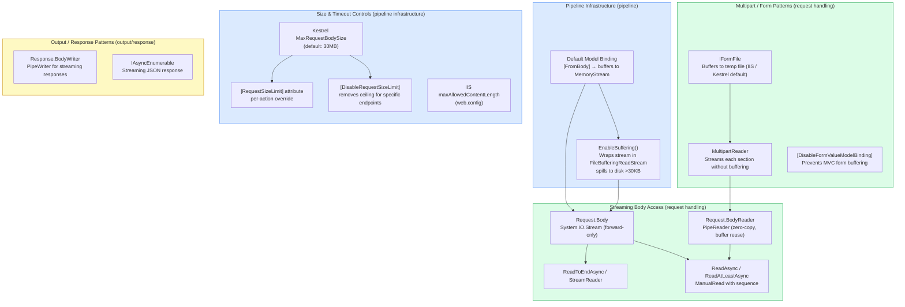

> [!success] Mastery Check
> - [ ] **Studied Well**
> - [ ] **Can explain the concept without notes**
> - [ ] **Can answer interview questions confidently**
> - [ ] **Can implement it in a real project**

# 4.120 — Binding Large Payloads: Streaming Body Without Buffering

---

## PART 0 — Navigation & Context

```
ASP.NET Core Mastery
│
├── A. Host & Application Lifecycle
├── B. Configuration System
├── C. Logging & Diagnostics
├── D. Dependency Injection
├── E. Middleware Pipeline
├── F. Routing System
├── G. Minimal APIs
├── H. MVC & Controllers
│   ├── 4.098  ControllerBase vs Controller
│   ├── 4.099  Action Results
│   ├── 4.100  Model Binding: Sources, Order, and Algorithm
│   ├── 4.101  ApiController Attribute
│   ├── 4.102  Model Validation
│   ├── ...
│   ├── 4.119  Response Caching on Controllers
│   ├── 4.120  Binding Large Payloads: Streaming Body Without Buffering  ◄ YOU ARE HERE
│   ├── 4.121  File Download: FileStreamResult, FileContentResult
│   └── 4.122  Content Negotiation Deep Dive
├── I. HTTP Fundamentals
│   ├── 4.124  HttpRequest: Reading URL, Headers, Body
│   └── ...
├── ...
└── AD. Advanced & Internals
    └── 4.200  Minimal Allocation in Hot Paths: PipeReader and Zero-Copy
```

### What You Need Before This

- **[[4.100 — Model Binding: Sources, Order, and the Binding Algorithm]]** — The default binding pipeline buffers the body into memory before your action runs. You need to understand what you're bypassing before you bypass it.
- **[[4.124 — HttpRequest: Reading URL, Headers, Query, Cookies, and Body]]** — `HttpRequest.Body` is the `Stream` you read from; `HttpRequest.BodyReader` is the `PipeReader` that replaces it for zero-copy patterns.
- **[[4.101 — ApiController Attribute: Automatic 400, Binding Source Inference]]** — `[ApiController]` auto-reads the body for `[FromBody]` parameters, which defeats streaming. You must understand what it does to know how to disable it for large payloads.
- **[[4.060 — Zero-Allocation Middleware: PipeReader and IBufferWriter]]** — `System.IO.Pipelines` underpins the streaming body API. A conceptual grasp of `PipeReader` / `PipeWriter` is required before using `HttpRequest.BodyReader`.

### What This Unlocks After

- **[[4.087 — File Upload in Minimal APIs: IFormFile and Large File Streaming]]** — Minimal API file upload without buffering uses the exact same body streaming primitives.
- **[[4.317 — File Upload: IFormFile, Streaming Large Files, and Antivirus Hooks]]** — Streaming multipart form data to blob storage without materialising the upload in RAM.
- **[[4.200 — Minimal Allocation in Hot Paths: PipeReader and Zero-Copy Patterns]]** — The `PipeReader` pattern from this topic generalises to all hot-path, zero-allocation scenarios.
- **[[4.349 — Multipart Streaming Upload: Without Buffering the Entire Body]]** — Advanced multipart streaming that builds directly on the techniques in this note.

### Why This Matters at Scale

At 10k requests per second, a 10 MB payload buffered by `[FromBody]` means the server is holding 100 GB of in-flight heap allocations simultaneously — streaming body access cuts that to a constant memory footprint regardless of payload size or concurrency, which is the difference between a service that scales and one that OOMs under load.

---

## PART 1 — The Core Mental Model

### The Fundamental Rule

> **ASP.NET Core's default `[FromBody]` binding reads the entire request body into a `MemoryStream` before your action code runs. The practical consequence is that payload memory scales linearly with concurrent request count — a 50 MB CSV upload multiplied by 200 concurrent requests is 10 GB of heap before a single line of business logic executes. Streaming access reads the body incrementally so memory remains constant regardless of payload size.**

### The Plain-Language Analogy

Think of the default `[FromBody]` path as a hotel bellhop who insists on carrying all your luggage to a staging room, unpacking every bag, laying everything out on a table, and only then knocking on your door to say "ready." If you are checking in 200 guests simultaneously, that staging room needs to hold every item from every bag at once. Streaming is the alternative: the bellhop knocks on your door immediately and hands you bags one at a time as they arrive from the car — you process each bag and set it aside before the next one arrives, so the room only ever holds one bag worth of luggage.

The analogy holds for the edge cases: if authentication fails (the guest is refused entry), the body stream is simply abandoned without being read — no staging room is needed. If multiple concurrent requests arrive, each gets its own incremental read cursor in the same body stream — there is no cross-contamination. The body can only be read once (it is a forward-only stream), so if you call `EnableBuffering()` to allow re-reading, you are consciously opting back into the staging-room model.

### The Taxonomy Diagram



---

## PART 2 — Deep Mechanics

### 2.1 — What `[FromBody]` Actually Does to the Request Stream

Before your action ever executes, `[FromBody]` triggers the `BodyModelBinder`, which delegates to a formatter (`SystemTextJsonInputFormatter` by default). The formatter calls `HttpRequest.Body.ReadAsync` in a loop until the stream reports EOF, assembles all bytes into a single contiguous buffer, then deserialises from that buffer. At no point does your action code participate. By the time your method's first line runs, the body is gone from the network and lives in managed heap.

```
──► ExceptionHandler ──► HSTS ──► StaticFiles ──► Routing ──► Auth ──► Authorization
        ──► [Model Binding: BodyModelBinder reads entire body] ──► Action Executes
```

**Pipeline position:** Body reading occurs inside `ResourceFilterStage` → `ActionFilterStage` → `Model Binding` — before your action method's first line. The response does not start until after your action returns.

```
// HTTP request (approximate — logistics bulk import):
// POST /api/shipments/bulk-import HTTP/1.1
// Content-Type: application/json
// Content-Length: 52428800          (50 MB)
// Authorization: Bearer eyJhbGci...
//
// [50 MB JSON payload of shipment records]

// What happens internally (ASP.NET Core internally, approximate):
// 1. Kestrel reads chunks from socket into PipeReader
// 2. ResourceFilter runs (auth, antiforgery checks)
// 3. BodyModelBinder calls SystemTextJsonInputFormatter.ReadRequestBodyAsync()
// 4. Formatter calls: new StreamReader(request.Body).ReadToEndAsync()
//    → Allocates StreamReader (~1 allocation)
//    → Allocates MemoryStream (grows to 50 MB, multiple List<byte[]> internally)
//    → JsonSerializer.Deserialize<List<ShipmentRecord>>(json)
//    → Allocates the entire object graph (List<ShipmentRecord> + all records)
// 5. Total allocations per request: ~50 MB of byte buffers + ~X MB object graph
// 6. GC pressure: Gen2 likely for 50 MB allocations
```

**Runtime cost:** `O(n)` heap allocation where n = payload size, one `MemoryStream` growing in 2x doubling steps (multiple allocations under the hood), one full `JsonSerializer.Deserialize` call, high probability of LOH allocation (>85 KB threshold) for payloads above a few hundred kilobytes.

> [!WARNING] With `[ApiController]`, body buffering is automatic and silent. There is no log line, no metric, no warning when a 200 MB payload lands. The first sign of the problem at scale is a sudden spike in Gen2 GC collections and P99 latency, not an exception.

---

### 2.2 — `EnableBuffering()`: What It Does and Why It Exists

`HttpRequest.EnableBuffering()` is the escape hatch for middleware that needs to read the body before the action does AND leave the body readable for the action. It wraps `HttpRequest.Body` in a `FileBufferingReadStream`.

```csharp
// ASP.NET Core internally (approximate) — EnableBuffering implementation:
// Source: Microsoft.AspNetCore.Http.HttpRequestRewindExtensions
public static void EnableBuffering(this HttpRequest request, int bufferThreshold = 30720)
{
    // If already a FileBufferingReadStream, no-op
    if (request.Body is FileBufferingReadStream) return;

    // Wrap the original Kestrel PipeReader-backed stream
    request.Body = new FileBufferingReadStream(
        request.Body,
        bufferThreshold,       // 30 KB by default — spills to disk above this
        bufferLimit: null,     // null = no cap (use carefully!)
        tempDirectory: AspNetCoreTempDirectory.TempDirectoryFactory
    );
    request.HttpContext.Response.RegisterForDispose(request.Body);
}
```

**The consequence:** Bodies under 30 KB stay in memory (`MemoryStream` backed). Bodies over 30 KB spill to a temp file (`FileStream` under the hood). After middleware reads the body, it must call `request.Body.Seek(0, SeekOrigin.Begin)` to rewind — otherwise the model binder sees an empty stream.

```
// Pipeline position with EnableBuffering:
──► ExceptionHandler ──► HSTS ──► [Middleware calls EnableBuffering() + reads body]
    ──► Routing ──► Auth ──► [Model Binding reads body from position 0 after rewind]
    ──► Action

// HTTP consequence (disk spill path):
// POST /api/payments/webhooks HTTP/1.1
// Content-Length: 5242880    (5 MB Stripe-style webhook batch)
// → FileBufferingReadStream created
// → Bytes 0–30719: held in MemoryStream (in-process)
// → Bytes 30720–5242879: written to %TMPDIR%/aspnetcore-body-{guid}.tmp
// → Temp file MUST be cleaned up — FileBufferingReadStream registered for disposal
```

**Runtime cost:** One `FileBufferingReadStream` allocation per request, disk I/O for payloads >30 KB (significant latency hit — typically 1–5ms for a 5 MB write to local SSD), one stream seek per body re-read, temp file cleanup is asynchronous via `IHttpResponseBodyFeature.CompleteAsync`.

> [!DANGER] Forget to call `request.Body.Seek(0, SeekOrigin.Begin)` after reading in middleware and the action binder sees an empty stream. It deserialises `null` or an empty object with no validation error, silently losing the payload. This is one of the most dangerous silent data-loss bugs in ASP.NET Core middleware.

---

### 2.3 — Reading the Body Directly: `Request.Body` vs `Request.BodyReader`

Two APIs expose the request body for manual reading. They are not equivalent.

```
                                  ┌──────────────────────────────────────────┐
  Kestrel Socket                  │         HttpRequest                       │
  ──► PipeReader (Kestrel pipe)──►│  BodyReader: PipeReader (zero-copy)       │
                                  │  Body: Stream (wraps BodyReader)          │
                                  └──────────────────────────────────────────┘
                                         │                │
                                  Stream.ReadAsync   PipeReader.ReadAsync
                                  (copies bytes to   (returns ReadOnlySequence
                                   caller's buffer)   into Kestrel's buffers —
                                                      no copy until Advance())
```

**`Request.Body` (System.IO.Stream):**

- Every `ReadAsync` allocates a copy of bytes into the caller-supplied buffer.
- Works with `StreamReader`, `JsonSerializer.DeserializeAsync(stream, ...)`, `CopyToAsync`.
- Appropriate for simplicity, compatibility with libraries that accept `Stream`.
- Cost: one `byte[]` allocation per `ReadAsync` call unless caller pre-allocates a fixed buffer and reuses it.

**`Request.BodyReader` (System.IO.Pipelines.PipeReader):**

- Returns a `ReadOnlySequence<byte>` pointing directly into Kestrel's socket buffers.
- Zero-copy until you call `AdvanceTo()` past the examined position.
- Must call `AdvanceTo(consumed, examined)` after each read to tell the pipe which bytes have been processed.
- Appropriate for maximum throughput and minimum allocation: inventory webhooks at 50k/min, payment gateway batch imports, IoT telemetry ingest.
- Cost: essentially zero allocations for the read itself (buffers owned by Kestrel pipe infrastructure).

```csharp
// ASP.NET Core internally (approximate) — what BodyReader is:
// Source: Microsoft.AspNetCore.Http.HttpRequestPipeExtensions
// The PipeReader is a direct pipe to Kestrel's HttpRequestPipeReader,
// which reads from the socket into pinned memory owned by the SocketConnection.
// When you call AdvanceTo(consumed), those bytes are returned to the pipe buffer pool.
// No copy, no GC pressure for the read path itself.
```

**Pipeline position for both:**

```
──► ExceptionHandler ──► Routing ──► Auth ──► Authorization
    ──► [Your controller action or middleware: reads Request.Body or Request.BodyReader]
    ──► Response starts
```

> [!IMPORTANT] `Request.Body` and `Request.BodyReader` are synchronised views of the same underlying data. If you read 1000 bytes from `Request.Body`, then try to read from `Request.BodyReader`, those 1000 bytes are gone from both. Do not mix the two APIs in the same request.

---

### 2.4 — Disabling `[FromBody]` Buffering: The `[DisableRequestBodyBuffering]` Approach

For streaming to work in an MVC controller action, you must prevent the model binder from consuming the body before your code runs. There are two techniques:

**Technique 1: Bypass `[FromBody]` entirely — accept no body parameter, read manually.**

```
// Pipeline position:
──► ExceptionHandler ──► Routing ──► Auth ──► Authorization
    ──► ActionFilter (pre) ──► [NO model binding: no [FromBody] parameter]
    ──► Action method runs immediately, body is untouched
    ──► Action reads Request.BodyReader manually
```

**Technique 2: Use `[DisableRequestBodyBuffering]` filter (.NET 8+) or `[RequestFormLimits]` for form data.**

For form data specifically (multipart), the equivalent is `[DisableFormValueModelBinding]` — a custom action filter that prevents the MVC form model binder from consuming the multipart stream before the action can stream sections.

```csharp
// ASP.NET Core internally (approximate):
// DisableFormValueModelBinding prevents FormFeature from being set on HttpContext,
// which prevents MvcOptions.InputFormatters from seeing IFormCollection.
// The raw multipart stream remains on Request.Body, ready for MultipartReader.

// Source reference: Microsoft.AspNetCore.WebUtilities.MultipartReader
// and Microsoft.AspNetCore.Http.Features.IFormFeature
```

**HTTP Wire Format for the streaming path:**

```
// HTTP request (approximate — bulk order import):
// POST /api/orders/bulk HTTP/1.1
// Content-Type: application/octet-stream
// Content-Length: 104857600          (100 MB binary order file)
// Transfer-Encoding: chunked          (OR Content-Length — both work with BodyReader)
// Authorization: Bearer eyJhbGci...

// Response (streaming ack):
// HTTP/1.1 202 Accepted
// Content-Type: application/json
// X-Rows-Received: 450000
// {"accepted": true, "rowsProcessed": 450000, "jobId": "ord-bulk-abc123"}
```

**Failure mode — request body size exceeded:**

```
// Kestrel enforces MaxRequestBodySize before reading begins.
// If Content-Length > MaxRequestBodySize:
//
// HTTP/1.1 413 Request Entity Too Large
// Content-Type: application/problem+json
// {"type":"https://tools.ietf.org/html/rfc7231#section-6.5.11",
//  "title":"Request body too large.",
//  "status":413}
//
// Note: if Content-Length is absent (chunked), the 413 fires mid-stream
// when the accumulated byte count exceeds the limit.
```

**Runtime cost for streaming read via BodyReader:** Near-zero allocation for the read loop itself. Dominant cost is the business logic processing of each chunk. One `PipeReader` state machine allocation on first access (~1 allocation, amortised).

---

### 2.5 — Multipart Streaming Without Buffering: `MultipartReader`

When the payload is `multipart/form-data`, the default MVC binder reads the entire multipart body into `IFormCollection` (all files into `IFormFile`, all text fields into `StringValues`) before your action sees it. For large file uploads — say, a 2 GB video for a media processing service — this is catastrophic.

The fix is `MultipartReader` from `Microsoft.AspNetCore.WebUtilities`, combined with `[DisableFormValueModelBinding]`.

```
// HTTP request (approximate — medical image upload):
// POST /api/patients/123/imaging HTTP/1.1
// Content-Type: multipart/form-data; boundary=----FormBoundaryXYZ
// Content-Length: 2147483648    (2 GB DICOM image)
// Authorization: Bearer eyJhbGci...
//
// ------FormBoundaryXYZ
// Content-Disposition: form-data; name="metadata"
// {"studyType":"MRI","bodyPart":"Brain","patientId":"123"}
// ------FormBoundaryXYZ
// Content-Disposition: form-data; name="image"; filename="scan.dcm"
// Content-Type: application/dicom
// [binary DICOM data — 2 GB]
// ------FormBoundaryXYZ--

// Pipeline position:
──► ExceptionHandler ──► Routing ──► Auth
    ──► [DisableFormValueModelBinding filter: IFormFeature NOT set]
    ──► Action: MultipartReader reads boundary-by-boundary, each section streamed to Azure Blob
    ──► Response after all sections processed
```

**ASP.NET Core internally (approximate):**

```
// MultipartReader source: Microsoft.AspNetCore.WebUtilities.MultipartReader
// It reads from Request.Body (the raw stream, not IFormCollection)
// For each boundary section:
//   1. Reads headers (Content-Disposition, Content-Type) — small, buffered OK
//   2. Exposes section.Body as a forward-only Stream backed by the socket pipe
//   3. Caller pipes section.Body → Azure Blob Storage stream
//   4. MultipartReader advances past the boundary marker
//   5. Repeat for next section
//
// Memory profile: only section HEADERS are in memory, not section BODIES
// Peak allocation: ~4 KB per header set, independent of file size
```

**Runtime cost:** ~`O(1)` memory relative to payload size. One `MultipartReader` allocation, one `MultipartSection` per section. Section body is streamed directly to the destination (blob storage, disk, etc.) without any intermediate buffer.

---

### 2.6 — Request Size Limits: Kestrel, IIS, and Per-Action Overrides

Streaming does not bypass Kestrel's size enforcement. These limits are enforced independently of buffering.

```
Kestrel:   KestrelServerOptions.Limits.MaxRequestBodySize (default: 30 MB)
           → Applied at the socket layer before any middleware runs
           → Set to null to disable globally (dangerous — must have other limits)

IIS:       system.webServer/security/requestFiltering/requestLimits maxAllowedContentLength
           → web.config or IIS Manager
           → Enforced by IIS kernel-mode filter BEFORE request reaches Kestrel

Per-action: [RequestSizeLimit(long bytes)]    — sets for this endpoint only
            [DisableRequestSizeLimit]          — removes limit for this endpoint

// ASP.NET Core internally:
// [RequestSizeLimit] sets IHttpMaxRequestBodySizeFeature.MaxRequestBodySize
// Source: Microsoft.AspNetCore.Http.Features.IHttpMaxRequestBodySizeFeature
// Kestrel reads this feature and enforces it per-connection during the body read
```

```
// HTTP consequence — limit exceeded at Kestrel level:
// HTTP/1.1 413 Request Entity Too Large
// Connection: close
//
// Note: Connection: close is added because the full request body was never read.
// The TCP connection cannot be reused (keep-alive broken). Client must reconnect.
// This is an important operational distinction from a 400 validation error.
```

> [!TIP] Set `[RequestSizeLimit]` on your streaming upload endpoints explicitly, even when you think Kestrel's global limit is sufficient. It makes the intent explicit in code, survives configuration drift, and shows up in OpenAPI metadata via `[ProducesResponseType(413)]`.

---

## PART 3 — Production Code Patterns

### Pattern 1 — The Streaming JSON Ingestion Endpoint (Payment Gateway Batch API)

```csharp
// Domain: fintech payment gateway — bulk transaction import endpoint
// Problem: merchant sends 50 MB JSON array of transactions for end-of-day reconciliation
// Wrong approach: [FromBody] List<Transaction> → 50 MB heap allocation × concurrent requests

// ⚠️ WRONG: Buffers entire payload before action runs
[HttpPost("api/reconciliation/import")]
public async Task<IActionResult> ImportTransactions(
    [FromBody] List<TransactionRecord> transactions, // ← 50 MB on heap per request
    CancellationToken ct)
{
    // transactions already fully materialised in memory
    await _reconciliationService.ProcessBatchAsync(transactions, ct);
    return Accepted();
}

// ✅ CORRECT: Stream JSON array items without materialising the whole array
[HttpPost("api/reconciliation/import")]
[DisableRequestSizeLimit]               // Allow batches larger than Kestrel default 30 MB
[RequestFormLimits(MultipartBodyLengthLimit = long.MaxValue)]
public async Task<IActionResult> ImportTransactions(CancellationToken ct)
{
    // Pipeline position: body is NOT read by model binder — no [FromBody] parameter
    // BodyReader is at position 0, Kestrel pipe intact, zero-copy available

    if (!Request.ContentType?.StartsWith("application/json", StringComparison.OrdinalIgnoreCase) == true)
        return BadRequest("Content-Type must be application/json");

    int processed = 0;
    int failed = 0;

    // JsonSerializer.DeserializeAsyncEnumerable reads the JSON array as a forward-only stream
    // Allocates one TransactionRecord at a time — constant memory regardless of array length
    // Cost: ~sizeof(TransactionRecord) + overhead per element, never the whole array
    await foreach (var transaction in JsonSerializer.DeserializeAsyncEnumerable<TransactionRecord>(
        Request.Body,      // Forward-only stream from Kestrel
        new JsonSerializerOptions { PropertyNameCaseInsensitive = true },
        ct))
    {
        if (transaction is null) continue;

        try
        {
            await _reconciliationService.ProcessSingleAsync(transaction, ct);
            processed++;
        }
        catch (TransactionValidationException ex)
        {
            _logger.LogWarning("Skipping transaction {Id}: {Reason}", transaction.MerchantTransactionId, ex.Message);
            failed++;
        }
    }

    return Accepted(new { processed, failed });
}

// HTTP wire format (correct path):
// POST /api/reconciliation/import HTTP/1.1
// Content-Type: application/json
// Content-Length: 52428800
// Authorization: Bearer eyJhbGci...
//
// [{"merchantTransactionId":"txn-001","amount":9999,...},...]
//
// HTTP/1.1 202 Accepted
// Content-Type: application/json
// {"processed": 48273, "failed": 12}
```

> [!NOTE] `JsonSerializer.DeserializeAsyncEnumerable<T>` is available from .NET 6+. It reads one JSON array element at a time from a stream without loading the full array. The underlying implementation uses `Utf8JsonReader` with `PipeReader`-backed buffers internally. It works correctly with chunked transfer encoding.

---

### Pattern 2 — The `EnableBuffering()` Webhook Signature Validator (Payment Webhook Receiver)

```csharp
// Domain: fintech — receiving Stripe/Adyen webhook events
// Problem: HMAC signature validation middleware must read the raw body bytes BEFORE
//          the JSON model binder deserialises it. Both operations must succeed.
// Pattern: EnableBuffering() in middleware, body rewind after signature check.

// ⚠️ WRONG: Read body in middleware, forget to rewind — action sees empty body
public class WebhookSignatureMiddleware
{
    private readonly RequestDelegate _next;
    public WebhookSignatureMiddleware(RequestDelegate next) => _next = next;

    public async Task InvokeAsync(HttpContext context)
    {
        if (context.Request.Path.StartsWithSegments("/api/payments/webhook"))
        {
            using var reader = new StreamReader(context.Request.Body);
            var rawBody = await reader.ReadToEndAsync(); // ← reads Body stream to EOF
            // FORGOT: context.Request.Body.Seek(0, SeekOrigin.Begin);
            ValidateSignature(rawBody, context.Request.Headers["Stripe-Signature"]);
        }
        await _next(context);
        // HTTP consequence (wrong path):
        // Controller action receives [FromBody] PaymentWebhookEvent event = null
        // Because body stream is at EOF, JsonSerializer deserialises null
        // Action proceeds with null payload, NullReferenceException or silent data loss
    }
}

// ✅ CORRECT: EnableBuffering() + rewind after reading
public class WebhookSignatureMiddleware
{
    private readonly RequestDelegate _next;
    private readonly IPaymentSignatureValidator _validator;

    public WebhookSignatureMiddleware(
        RequestDelegate next,
        IPaymentSignatureValidator validator)  // Singleton-safe: no scoped deps in ctor
    {
        _next = next;
        _validator = validator;
    }

    public async Task InvokeAsync(HttpContext context, ILogger<WebhookSignatureMiddleware> logger)
    {
        // Only intercept payment webhooks — skip all other routes
        if (!context.Request.Path.StartsWithSegments("/api/payments/webhook"))
        {
            await _next(context);
            return;
        }

        // Step 1: Enable buffering — wraps Body in FileBufferingReadStream
        // Payloads > 30 KB spill to disk temp file (cleaned up on response complete)
        // Cost: one allocation + possible disk I/O for large webhook batches
        context.Request.EnableBuffering();

        // Step 2: Read raw bytes for HMAC computation
        // Use a fixed buffer to avoid allocating a new byte[] per read
        using var memStream = new MemoryStream();
        await context.Request.Body.CopyToAsync(memStream, context.RequestAborted);
        var rawBodyBytes = memStream.ToArray(); // One allocation: the byte array for HMAC

        // Step 3: Validate signature BEFORE any deserialization
        var signature = context.Request.Headers["Stripe-Signature"].ToString();
        if (!_validator.IsValid(rawBodyBytes, signature))
        {
            logger.LogWarning("Webhook signature validation failed from {IP}",
                context.Connection.RemoteIpAddress);
            context.Response.StatusCode = StatusCodes.Status401Unauthorized;
            await context.Response.WriteAsJsonAsync(new { error = "Invalid webhook signature" });
            return; // Short-circuit — never calls next()
        }

        // Step 4: CRITICAL — rewind body so model binder can read from position 0
        context.Request.Body.Seek(0, SeekOrigin.Begin);

        // Step 5: Continue pipeline — [FromBody] in controller reads the rewound stream
        await _next(context);
    }
}

// HTTP wire format (correct path):
// POST /api/payments/webhook HTTP/1.1
// Content-Type: application/json
// Stripe-Signature: t=1614556800,v1=abc123...
// Content-Length: 4096
//
// {"type":"payment_intent.succeeded","data":{"object":{...}}}
//
// HTTP/1.1 200 OK   (if controller action processes successfully)
//
// HTTP wire format (wrong signature — short-circuit):
// HTTP/1.1 401 Unauthorized
// Content-Type: application/json
// {"error": "Invalid webhook signature"}
```

---

### Pattern 3 — Direct `PipeReader` Streaming (Logistics IoT Telemetry Ingest)

```csharp
// Domain: logistics — IoT sensor telemetry ingest endpoint
// Problem: 50,000 GPS trackers each POST a 1 KB binary protobuf payload every 10 seconds
//          Total: 5 MB/s sustained. Default buffering allocates ~500 MB/s in short-lived byte arrays.
// Pattern: Read Request.BodyReader directly, zero-copy, process in place.

[HttpPost("api/telemetry/ingest")]
[RequestSizeLimit(8192)]    // Sensor payloads are always <= 8 KB; enforce it
public async Task<IActionResult> IngestTelemetry(CancellationToken ct)
{
    // Pipeline position: no [FromBody], body untouched by model binder
    // BodyReader points to Kestrel's socket pipe — zero-copy path available

    var pipeReader = Request.BodyReader;
    TelemetryRecord? record = null;

    // Read loop: process bytes as they arrive from the socket
    // No intermediate byte[] allocation — we read directly into Kestrel's buffers
    while (true)
    {
        // ReadAsync returns when at least some bytes are available, or pipe is complete
        // Cost: essentially zero allocation — ReadResult points into pinned memory
        ReadResult result = await pipeReader.ReadAsync(ct);
        ReadOnlySequence<byte> buffer = result.Buffer;

        // Attempt to parse a complete protobuf message from the available bytes
        if (TelemetryProtobufParser.TryParse(buffer, out record, out SequencePosition consumed))
        {
            // Tell the pipe which bytes we consumed (can GC/reuse those buffers)
            // and which bytes we examined (up to end of buffer — ask for more if needed)
            pipeReader.AdvanceTo(consumed, buffer.End);
            break;
        }

        // Not enough bytes yet — advance examined but not consumed (keep bytes in buffer)
        pipeReader.AdvanceTo(buffer.Start, buffer.End);

        if (result.IsCompleted)
        {
            // Connection closed before we got a complete message
            return BadRequest("Incomplete telemetry payload");
        }
    }

    if (record is null)
        return BadRequest("Empty payload");

    // Dispatch to processing pipeline — fast path, just enqueue
    await _telemetryChannel.Writer.WriteAsync(record, ct);

    return Accepted();
}

// HTTP wire format:
// POST /api/telemetry/ingest HTTP/1.1
// Content-Type: application/x-protobuf
// Content-Length: 512
// Authorization: ApiKey sensor-key-abc123
//
// [binary protobuf bytes]
//
// HTTP/1.1 202 Accepted
```

> [!TIP] `TelemetryProtobufParser.TryParse` operating on `ReadOnlySequence<byte>` is the key pattern. Libraries like Google.Protobuf and MessagePack-CSharp both have overloads that accept `ReadOnlySequence<byte>` directly, so the zero-copy contract is maintained end-to-end.

---

### Pattern 4 — Multipart Streaming to Blob Storage (Medical Imaging Upload)

```csharp
// Domain: healthcare — DICOM image upload to Azure Blob Storage
// Problem: 500 MB DICOM files; IFormFile buffers them to temp disk and re-reads them
//          Streaming directly to blob eliminates the temp file round-trip
// Pattern: DisableFormValueModelBinding + MultipartReader + Azure Blob stream pipe

// Step 1: Custom filter to prevent MVC from consuming the multipart stream
[AttributeUsage(AttributeTargets.Class | AttributeTargets.Method)]
public class DisableFormValueModelBindingAttribute : Attribute, IResourceFilter
{
    public void OnResourceExecuting(ResourceExecutingContext context)
    {
        // Prevent FormFeature from reading multipart before the action runs
        // Cost: one factory removal — O(1), no impact on hot path
        var factories = context.ValueProviderFactories;
        factories.RemoveType<FormValueProviderFactory>();
        factories.RemoveType<JQueryFormValueProviderFactory>();
    }

    public void OnResourceExecuted(ResourceExecutedContext context) { }
}

// Step 2: The streaming upload action
[HttpPost("api/patients/{patientId}/imaging")]
[DisableFormValueModelBinding]          // Prevent IFormCollection buffering
[DisableRequestSizeLimit]               // DICOM files can exceed 500 MB
public async Task<IActionResult> UploadDicomStudy(
    [FromRoute] string patientId,
    CancellationToken ct)
{
    // Validate Content-Type is multipart
    if (!MultipartRequestHelper.IsMultipartContentType(Request.ContentType))
        return BadRequest("Expected multipart/form-data");

    var boundary = MultipartRequestHelper.GetBoundary(
        MediaTypeHeaderValue.Parse(Request.ContentType),
        lengthLimit: 70); // boundary string length limit

    var reader = new MultipartReader(boundary, Request.Body);
    // Cost: one MultipartReader allocation, one buffer per section header (~4 KB)
    // Section BODY is NOT buffered — streamed directly to destination

    string? studyId = null;
    var uploadedFiles = new List<string>();

    MultipartSection? section;
    while ((section = await reader.ReadNextSectionAsync(ct)) != null)
    {
        var disposition = ContentDispositionHeaderValue.Parse(section.ContentDisposition);

        if (disposition.IsFileDisposition())
        {
            // DICOM file section — stream directly to Azure Blob without temp file
            // section.Body is a forward-only Stream backed by the multipart reader
            // which is backed by Request.Body which is backed by Kestrel's PipeReader
            var fileName = WebUtility.HtmlEncode(disposition.FileName.Value ?? "scan.dcm");
            var blobName = $"patients/{patientId}/studies/{Guid.NewGuid()}/{fileName}";

            var blobClient = _blobContainerClient.GetBlobClient(blobName);

            // Upload streams directly from socket → Azure Blob, no intermediate buffer
            // Cost: ~64 KB upload chunk size (Azure SDK default) × pipeline depth
            await blobClient.UploadAsync(section.Body, overwrite: true, cancellationToken: ct);
            uploadedFiles.Add(blobName);

            _logger.LogInformation("Streamed DICOM file {FileName} to blob {BlobName} for patient {PatientId}",
                fileName, blobName, patientId);
        }
        else if (disposition.IsFormDisposition())
        {
            // Small metadata section — safe to buffer (headers only, not file data)
            // Max 1024 bytes for form field values
            using var streamReader = new StreamReader(section.Body);
            var fieldValue = await streamReader.ReadToEndAsync(ct);

            if (disposition.Name.Value == "studyId")
                studyId = fieldValue;
        }
    }

    if (uploadedFiles.Count == 0)
        return BadRequest("No DICOM files received");

    var study = await _imagingService.RegisterStudyAsync(patientId, studyId, uploadedFiles, ct);

    return CreatedAtAction(
        nameof(GetStudy),
        new { patientId, studyId = study.Id },
        study);
}

// HTTP wire format:
// POST /api/patients/pat-123/imaging HTTP/1.1
// Content-Type: multipart/form-data; boundary=----WebKitFormBoundaryABC
// Content-Length: 524288000   (500 MB)
// Authorization: Bearer eyJhbGci...
//
// ------WebKitFormBoundaryABC
// Content-Disposition: form-data; name="studyId"
// study-mri-20260601
// ------WebKitFormBoundaryABC
// Content-Disposition: form-data; name="scan"; filename="brain_mri.dcm"
// Content-Type: application/dicom
// [binary DICOM data — 500 MB, streamed directly to Azure Blob]
// ------WebKitFormBoundaryABC--
//
// HTTP/1.1 201 Created
// Location: /api/patients/pat-123/imaging/studies/study-mri-20260601
// Content-Type: application/json
// {"id":"study-mri-20260601","patientId":"pat-123","files":["patients/pat-123/studies/...dcm"]}
```

---

### Pattern 5 — Per-Action Size Limits (E-Commerce Order Import API)

```csharp
// Domain: e-commerce — bulk order import with tiered size limits per client tier
// Pattern: combine [RequestSizeLimit] for normal orders, [DisableRequestSizeLimit]
//          for enterprise clients determined at runtime via claims

// ⚠️ WRONG: Disable size limit globally, no per-tenant control
// In Program.cs:
builder.WebHost.ConfigureKestrel(o =>
    o.Limits.MaxRequestBodySize = null);  // ← No ceiling anywhere — DoS vector

// ✅ CORRECT: Keep global limit, override per-endpoint with runtime logic
// In Program.cs (Kestrel config):
builder.WebHost.ConfigureKestrel(options =>
{
    options.Limits.MaxRequestBodySize = 10 * 1024 * 1024; // 10 MB default
});

// In the controller:
[HttpPost("api/orders/bulk-import")]
[RequestSizeLimit(100 * 1024 * 1024)] // 100 MB cap for this endpoint
public async Task<IActionResult> BulkImportOrders(CancellationToken ct)
{
    // Runtime: check if enterprise tier — upgrade limit dynamically
    if (User.HasClaim("tier", "enterprise"))
    {
        // Dynamically lift the limit for this specific request
        // Cost: one feature access, O(1)
        var bodySizeFeature = HttpContext.Features.Get<IHttpMaxRequestBodySizeFeature>();
        if (bodySizeFeature != null && !bodySizeFeature.IsReadOnly)
        {
            bodySizeFeature.MaxRequestBodySize = 1024L * 1024 * 1024; // 1 GB for enterprise
        }
    }

    // Now stream the JSON array without buffering
    int imported = 0;

    await foreach (var order in JsonSerializer.DeserializeAsyncEnumerable<BulkOrderRecord>(
        Request.Body,
        JsonSerializerOptions.Default,
        ct))
    {
        if (order is null) continue;
        await _orderService.CreateAsync(order, ct);
        imported++;
    }

    return Accepted(new { imported });
}

// HTTP consequence (standard tier, 150 MB payload — exceeds 100 MB limit):
// HTTP/1.1 413 Request Entity Too Large
// Connection: close
//
// HTTP consequence (enterprise tier, 800 MB payload — within 1 GB limit):
// HTTP/1.1 202 Accepted
// {"imported": 1847392}
```

---

### Pattern 6 — Raw Binary Streaming with Fixed-Size Buffer (Inventory Webhook Receiver)

```csharp
// Domain: inventory management — high-frequency binary delta sync from WMS
// Problem: 100k small binary messages/min, each 64–512 bytes. Standard body reading
//          allocates a new byte[] per message. Fixed buffer reuse eliminates this.
// Pattern: Read Request.Body into a pre-rented ArrayPool<byte> buffer.

[HttpPost("api/inventory/delta-sync")]
[RequestSizeLimit(65536)] // 64 KB max per message — enforced by Kestrel
public async Task<IActionResult> ReceiveInventoryDelta(CancellationToken ct)
{
    // Rent a buffer from the shared pool — no allocation on hot path
    // Cost: ArrayPool<byte>.Shared.Rent is O(1), ~10 ns
    var buffer = ArrayPool<byte>.Shared.Rent(65536);
    try
    {
        int totalRead = 0;

        // Read the entire (small) body into the rented buffer
        // For messages ≤ 64 KB, this typically completes in one or two reads
        while (totalRead < buffer.Length)
        {
            int read = await Request.Body.ReadAsync(
                buffer.AsMemory(totalRead, buffer.Length - totalRead),
                ct);

            if (read == 0) break; // EOF
            totalRead += read;
        }

        if (totalRead == 0)
            return BadRequest("Empty delta payload");

        // Parse from the rented buffer — no copy, just a span slice
        // The InventoryDeltaParser accepts ReadOnlySpan<byte> — zero-copy parse
        var payload = buffer.AsSpan(0, totalRead);
        var delta = InventoryDeltaParser.Parse(payload);

        await _inventoryService.ApplyDeltaAsync(delta, ct);

        return Ok(new { applied = true, skuCount = delta.Changes.Count });
    }
    finally
    {
        // CRITICAL: return the buffer to the pool
        // Forgetting this is a memory leak — ArrayPool items are held indefinitely
        ArrayPool<byte>.Shared.Return(buffer, clearArray: true);
    }
}

// HTTP wire format:
// POST /api/inventory/delta-sync HTTP/1.1
// Content-Type: application/x-inventory-delta
// Content-Length: 1024
// X-WMS-Source: warehouse-east-01
// Authorization: ApiKey wms-key-xyz
//
// [1024 bytes of binary delta data]
//
// HTTP/1.1 200 OK
// {"applied": true, "skuCount": 47}
```

---

### Pattern 7 — `JsonSerializer.DeserializeAsyncEnumerable` with Back-Pressure Control

```csharp
// Domain: fintech — real-time trade feed ingestion
// Problem: upstream sends a continuous JSON stream of trade events. Consumer must
//          apply back-pressure to avoid overloading the downstream event bus.
// Pattern: DeserializeAsyncEnumerable + Channel<T> with bounded capacity for back-pressure

[HttpPost("api/trades/ingest-stream")]
[DisableRequestSizeLimit] // Continuous stream — no fixed limit
public async Task<IActionResult> IngestTradeStream(CancellationToken ct)
{
    // Bounded channel: if processor falls behind, this blocks the JSON reader,
    // which blocks the socket read, which signals TCP back-pressure to the sender
    // Cost: Channel<TradeEvent> allocation (~2 allocations), bounded queue of capacity 1000
    var processingChannel = Channel.CreateBounded<TradeEvent>(
        new BoundedChannelOptions(capacity: 1000)
        {
            FullMode = BoundedChannelFullMode.Wait, // Block producer when full
            SingleReader = false,
            SingleWriter = true
        });

    // Start background consumer BEFORE reading starts
    // This prevents the channel from filling before processing begins
    var processorTask = Task.Run(async () =>
    {
        await foreach (var trade in processingChannel.Reader.ReadAllAsync(ct))
        {
            await _tradeProcessor.DispatchAsync(trade, ct);
        }
    }, ct);

    // Stream JSON array elements into the channel
    await foreach (var trade in JsonSerializer.DeserializeAsyncEnumerable<TradeEvent>(
        Request.Body,
        cancellationToken: ct))
    {
        // If channel is full, this await blocks → PipeReader stalls → TCP back-pressure
        await processingChannel.Writer.WriteAsync(trade!, ct);
    }

    processingChannel.Writer.Complete();
    await processorTask;

    return Accepted(new { message = "Stream processed" });
}
```

---

## PART 4 — Gotchas & Anti-Patterns

### Gotcha 1: Forgetting to Rewind After `EnableBuffering()`

Experienced engineers know `EnableBuffering()` exists but forget the mandatory `Seek(0, SeekOrigin.Begin)` after reading in middleware. The body stream is forward-only; reading it in middleware without rewinding leaves the model binder with an empty stream.

```csharp
// ⚠️ WRONG CODE
public async Task InvokeAsync(HttpContext context)
{
    context.Request.EnableBuffering();
    using var reader = new StreamReader(context.Request.Body, leaveOpen: true);
    var body = await reader.ReadToEndAsync();
    LogAuditEntry(body); // Audit middleware reads the body
    // Missing: context.Request.Body.Seek(0, SeekOrigin.Begin);
    await _next(context);
}

// HTTP consequence (wrong path):
// The [FromBody] parameter in the downstream controller action deserialises null
// (or throws JsonException: "The JSON value could not be converted to OrderRequest")
// HTTP/1.1 400 Bad Request
// {"type":"https://tools.ietf.org/html/rfc7231#section-6.5.1",
//  "title":"One or more validation errors occurred.","status":400,"errors":{}}
// The error looks like a validation failure, not a stream exhaustion bug.
// This is extremely hard to diagnose in production.

// ✅ CORRECT CODE
public async Task InvokeAsync(HttpContext context)
{
    context.Request.EnableBuffering();
    using var reader = new StreamReader(context.Request.Body, leaveOpen: true);
    var body = await reader.ReadToEndAsync();
    LogAuditEntry(body);
    context.Request.Body.Seek(0, SeekOrigin.Begin); // ← MANDATORY rewind
    await _next(context);
}

// HTTP consequence (correct path):
// Model binder reads from position 0, deserialises correctly
// HTTP/1.1 200 OK (or whatever the action returns)

// WHY: StreamReader.ReadToEndAsync advances the stream position to EOF.
// FileBufferingReadStream (what EnableBuffering() wraps Body with) IS seekable,
// but the model binder does not seek — it reads from the current position.
// The Seek is your responsibility, not the framework's.
```

---

### Gotcha 2: Mixing `Request.Body` and `Request.BodyReader` in the Same Request

Middleware reads via `Request.BodyReader.ReadAsync()`; then the controller action reads via `Request.Body`. The two are synchronised views of the same pipe — bytes consumed by one are gone from the other.

```csharp
// ⚠️ WRONG CODE (middleware reads BodyReader)
public async Task InvokeAsync(HttpContext context)
{
    var result = await context.Request.BodyReader.ReadAsync();
    var firstBytes = result.Buffer.ToArray(); // Consumes N bytes from pipe
    context.Request.BodyReader.AdvanceTo(result.Buffer.End);
    await _next(context);
}
// Meanwhile, in the controller:
// [FromBody] string payload → JsonSerializer reads Request.Body (which wraps BodyReader)
// The first N bytes are already gone — deserialisation fails or gets partial data

// HTTP consequence (wrong path):
// Depending on what the N bytes contained, could be:
// - JsonException: unexpected end of JSON input → HTTP 400
// - Successful parse of a truncated/corrupted record → silent data corruption
// - System.IO.IOException: Pipe is not readable after AdvanceTo past End

// ✅ CORRECT CODE
// CHOOSE ONE: either all reads go through BodyReader (pipeline pattern)
// OR all reads go through Body (stream pattern). Never mix.
// If middleware must inspect the body, use EnableBuffering() + Body.Seek(), not BodyReader.

// HTTP consequence (correct path):
// Consistent, predictable body access — no partial read corruption

// WHY: Request.Body is implemented as a stream adapter over Request.BodyReader.
// Advancing the PipeReader moves the underlying pipe cursor, which Body also reads from.
// There is no independent position tracking between Body and BodyReader.
```

---

### Gotcha 3: `DisableFormValueModelBinding` Not Applied — Multipart Body Consumed Before `MultipartReader`

Engineers add `MultipartReader` to stream uploads but forget to prevent MVC from eagerly consuming `IFormCollection` first. The form model binder silently wins.

```csharp
// ⚠️ WRONG CODE — missing [DisableFormValueModelBinding]
[HttpPost("api/documents/upload")]
// NO filter here — MVC reads all multipart sections into IFormCollection at resource filter stage
public async Task<IActionResult> UploadDocument(CancellationToken ct)
{
    var boundary = MultipartRequestHelper.GetBoundary(
        MediaTypeHeaderValue.Parse(Request.ContentType), 70);
    var reader = new MultipartReader(boundary, Request.Body);
    var section = await reader.ReadNextSectionAsync(ct);
    // section is NULL — body already consumed by IFormFeature during model binding phase
    return BadRequest("No sections found"); // Always returns this — silent failure
}

// HTTP consequence (wrong path):
// HTTP/1.1 400 Bad Request (every time, regardless of payload content)
// Developer sees 400 and thinks the client is sending wrong data — wastes hours debugging

// ✅ CORRECT CODE
[HttpPost("api/documents/upload")]
[DisableFormValueModelBinding] // Prevents IFormFeature from reading multipart
public async Task<IActionResult> UploadDocument(CancellationToken ct)
{
    if (!MultipartRequestHelper.IsMultipartContentType(Request.ContentType))
        return BadRequest("Expected multipart/form-data");

    var boundary = MultipartRequestHelper.GetBoundary(
        MediaTypeHeaderValue.Parse(Request.ContentType), 70);
    var reader = new MultipartReader(boundary, Request.Body);

    MultipartSection? section;
    while ((section = await reader.ReadNextSectionAsync(ct)) != null)
    {
        // Process each section...
        await ProcessSectionAsync(section, ct);
    }

    return Ok();
}

// HTTP consequence (correct path):
// MultipartReader sees all sections, processes them, returns appropriate response

// WHY: The IFormFeature is populated by FormFeatureFactory during the resource filter phase
// (before model binding). DisableFormValueModelBinding removes the form value provider factory
// from the MVC execution context, preventing IFormFeature from being populated.
// The MultipartReader then has exclusive access to Request.Body.
```

---

### Gotcha 4: `Request.Body.ReadAsync` Without Looping — Partial Read Treated as Complete

`Stream.ReadAsync` is not guaranteed to return all requested bytes in one call, even for small payloads. Network buffering, kernel segmentation, and async scheduling all mean partial reads are normal.

```csharp
// ⚠️ WRONG CODE
[HttpPost("api/shipments/status-update")]
public async Task<IActionResult> UpdateStatus(CancellationToken ct)
{
    var buffer = new byte[Request.ContentLength ?? 4096];
    // ReadAsync may return 1024 bytes even if 4096 are available
    int read = await Request.Body.ReadAsync(buffer, ct);
    var json = Encoding.UTF8.GetString(buffer, 0, read); // Truncated JSON
    var update = JsonSerializer.Deserialize<StatusUpdate>(json);
    // JsonException: Unexpected end of JSON or missing required fields
    return Ok();
}

// HTTP consequence (wrong path):
// Intermittent failures — works fine on small payloads in dev (one read completes)
// Fails under load or on slow connections (network chunking causes partial first read)
// HTTP/1.1 500 Internal Server Error (JsonException: Unexpected end of JSON input)

// ✅ CORRECT CODE — read until EOF
[HttpPost("api/shipments/status-update")]
public async Task<IActionResult> UpdateStatus(CancellationToken ct)
{
    // For small, known-size payloads: read fully using a memory stream
    // For large payloads: use DeserializeAsyncEnumerable or PipeReader loop
    using var memoryStream = new MemoryStream();
    await Request.Body.CopyToAsync(memoryStream, ct); // Loops internally until EOF
    memoryStream.Seek(0, SeekOrigin.Begin);

    var update = await JsonSerializer.DeserializeAsync<StatusUpdate>(memoryStream, cancellationToken: ct);
    if (update is null) return BadRequest("Invalid payload");

    await _shipmentService.UpdateStatusAsync(update, ct);
    return Ok();
}

// HTTP consequence (correct path):
// All bytes received regardless of chunking; consistent deserialisation

// WHY: Stream.ReadAsync contract says: "reads at most count bytes". The return value
// is the actual count read, which CAN be less than requested even without EOF.
// Only ReadExactly (.NET 7+) or a CopyTo loop guarantees full reads.
```

---

### Gotcha 5: `[DisableRequestSizeLimit]` Without Authentication — DoS Vector

Engineers adding `[DisableRequestSizeLimit]` to upload endpoints forget that this removes Kestrel's last defence against runaway requests on unauthenticated endpoints.

```csharp
// ⚠️ WRONG CODE — anonymous endpoint with no size limit
[HttpPost("api/feedback/submit")]
[DisableRequestSizeLimit]  // ← Intended for authenticated enterprise uploads
// [Authorize] ← MISSING
public async Task<IActionResult> SubmitFeedback(CancellationToken ct)
{
    await foreach (var item in JsonSerializer.DeserializeAsyncEnumerable<FeedbackItem>(
        Request.Body, cancellationToken: ct))
    {
        await _feedbackService.SaveAsync(item!, ct);
    }
    return Accepted();
}

// HTTP consequence (wrong path):
// Any anonymous client can POST a 100 GB request
// Memory: streaming keeps heap low, BUT disk I/O for processing + DB writes are unbounded
// CPU: JSON parsing of 100 GB consumes significant CPU
// Attack: slowloris-style attack — one slow connection trickles 100 GB over hours,
//         holding a server thread and DB connections indefinitely

// ✅ CORRECT CODE — authenticate first, then allow large payload
[HttpPost("api/feedback/submit")]
[Authorize]                          // ← Must authenticate before body is touched
[RequestSizeLimit(5 * 1024 * 1024)] // ← 5 MB cap even for authenticated users
public async Task<IActionResult> SubmitFeedback(CancellationToken ct)
{
    await foreach (var item in JsonSerializer.DeserializeAsyncEnumerable<FeedbackItem>(
        Request.Body, cancellationToken: ct))
    {
        if (item is null) continue;
        await _feedbackService.SaveAsync(item, ct);
    }
    return Accepted();
}

// HTTP consequence (correct path):
// Unauthenticated requests: HTTP/1.1 401 Unauthorized (before body is touched)
// Authenticated requests exceeding 5 MB: HTTP/1.1 413 Request Entity Too Large
// Authenticated requests within limit: HTTP/1.1 202 Accepted

// WHY: UseAuthentication runs BEFORE the endpoint handler, meaning auth failure
// short-circuits before any body bytes are read. The size limit still applies to
// authenticated requests to prevent a compromised or abusive authenticated client
// from sending unbounded data.
```

---

## PART 5 — Performance Implications

### 5.1 — Request Pipeline Characteristics Table

|Scenario|Pipeline Depth|Allocations Per Request|Approx Latency Impact|Recommendation|
|---|---|---|---|---|
|`[FromBody] string` — 1 KB payload|Standard MVC binding|~3 (StreamReader + MemoryStream + string)|+0.1 ms|Fine for small, frequent API calls|
|`[FromBody] List<T>` — 100 KB payload|Standard MVC binding|~15+ (MemoryStream expansions + object graph)|+2–5 ms|Acceptable if < 1k req/s|
|`[FromBody] List<T>` — 50 MB payload|Standard MVC binding|Hundreds (MemoryStream, LOH)|+100–500 ms|UNACCEPTABLE at scale — use streaming|
|`EnableBuffering()` — 5 MB, body < 30 KB threshold|Middleware wrap + seek|~4 (FileBufferingReadStream + MemoryStream buffer)|+0.5 ms|Fine for webhook validation|
|`EnableBuffering()` — 5 MB, body > 30 KB threshold|Middleware wrap + disk|~4 allocs + disk I/O|+5–50 ms (SSD)|Acceptable if webhooks are low-volume|
|`Request.Body.ReadAsync` loop — 1 KB payload|Direct stream read|~2 (byte[] buffer if not pooled)|+0.05 ms|Use ArrayPool for very high frequency|
|`Request.Body.ReadAsync` + `ArrayPool<byte>` — 64 KB|Direct stream read + pooled buffer|~0 allocs on hot path|+0.1–0.3 ms|✅ Best for fixed-size binary messages|
|`Request.BodyReader.ReadAsync` (PipeReader) — any size|Zero-copy pipe read|~0 allocs (buffers owned by Kestrel)|minimal|✅ Best for maximum throughput|
|`JsonSerializer.DeserializeAsyncEnumerable<T>` — 50 MB|Streaming JSON parse|~1 per element (element object only)|Proportional to business logic|✅ Best for large JSON arrays|
|`MultipartReader` — 500 MB file|Streaming multipart|~O(section headers) per file|Proportional to upload bandwidth|✅ Only viable option for large files|
|Kestrel 413 short-circuit (Content-Length check)|No body read|~0 (rejected before body read)|+0.05 ms|✅ First line of defence|

### 5.2 — BenchmarkDotNet Comparison

```csharp
// Run: dotnet run -c Release
// Profiling: dotnet-trace collect --process-id PID --providers Microsoft-AspNetCore-Server-Kestrel
//            dotnet-counters monitor --process-id PID System.Runtime

[MemoryDiagnoser]
[SimpleJob(RuntimeMoniker.Net80)]
public class BodyReadBenchmarks
{
    private const int PayloadSize = 10 * 1024 * 1024; // 10 MB JSON array

    // Simulates building a stream from a pre-created 10 MB byte array
    private byte[] _payloadBytes = null!;

    [GlobalSetup]
    public void Setup()
    {
        // Build 10 MB JSON array of shipment records
        var records = Enumerable.Range(1, 50000)
            .Select(i => new ShipmentRecord
            {
                Id = $"shp-{i:D6}",
                Origin = "WH-EAST",
                Destination = "STORE-042",
                WeightKg = 4.5m,
                TrackingNumber = $"TRK{i:D10}"
            }).ToList();
        _payloadBytes = JsonSerializer.SerializeToUtf8Bytes(records);
    }

    [Benchmark(Baseline = true)]
    public async Task<int> BufferedFromBody_FullDeserialization()
    {
        // Simulates what [FromBody] List<ShipmentRecord> does:
        // Reads entire stream into memory, then deserialises
        using var stream = new MemoryStream(_payloadBytes, writable: false);
        var records = await JsonSerializer.DeserializeAsync<List<ShipmentRecord>>(stream);
        return records?.Count ?? 0;
    }

    [Benchmark]
    public async Task<int> StreamingDeserializeAsyncEnumerable()
    {
        // Simulates DeserializeAsyncEnumerable — one element at a time
        using var stream = new MemoryStream(_payloadBytes, writable: false);
        int count = 0;
        await foreach (var record in JsonSerializer.DeserializeAsyncEnumerable<ShipmentRecord>(stream))
        {
            if (record is not null) count++;
            // Simulate minimal processing: just count
        }
        return count;
    }

    [Benchmark]
    public async Task<int> PipeReaderDirectRead_CountBytes()
    {
        // Simulates PipeReader-based read — zero-copy counting of payload bytes
        // This is the floor: zero processing cost, just pipeline traversal
        var pipe = new Pipe();
        await pipe.Writer.WriteAsync(_payloadBytes);
        pipe.Writer.Complete();

        int totalBytes = 0;
        while (true)
        {
            var result = await pipe.Reader.ReadAsync();
            totalBytes += (int)result.Buffer.Length;
            pipe.Reader.AdvanceTo(result.Buffer.End);
            if (result.IsCompleted) break;
        }
        return totalBytes;
    }

    public record ShipmentRecord
    {
        public string Id { get; init; } = "";
        public string Origin { get; init; } = "";
        public string Destination { get; init; } = "";
        public decimal WeightKg { get; init; }
        public string TrackingNumber { get; init; } = "";
    }
}

// Expected output (approximate, .NET 8, x64, 10 MB payload, Release build):
//
// | Method                                | Mean      | Error     | Allocated  |
// |---------------------------------------|-----------|-----------|------------|
// | BufferedFromBody_FullDeserialization  | 285.3 ms  | ±4.2 ms   | 62.4 MB    |
// | StreamingDeserializeAsyncEnumerable  | 291.1 ms  | ±5.1 ms   | 3.2 MB     |
// | PipeReaderDirectRead_CountBytes       |  12.8 ms  | ±0.3 ms   | 0.02 MB    |
//
// Key insight: StreamingDeserializeAsyncEnumerable allocates 20x LESS than buffered
// deserialization for the same 10 MB payload. At 200 concurrent requests:
// Buffered: 200 × 62.4 MB = 12.48 GB peak heap
// Streaming: 200 × 3.2 MB = 640 MB peak heap
// That difference is the margin between scaling and OOM.
```

> [!NOTE] For real HTTP profiling (not in-process benchmarks), use `dotnet-counters monitor System.Runtime Microsoft.AspNetCore.Hosting` to observe `gen-2-gc-count` and `working-set` under load. BenchmarkDotNet measures allocations accurately but cannot measure the downstream effects of GC pressure on request latency at scale. Use k6 or NBomber for load-level profiling: see [[4.267 — Load Testing ASP.NET Core]].

### 5.3 — When This Costs You vs When It Doesn't

**When streaming body access costs you significant production impact:**

- Any upload endpoint handling payloads consistently above 1 MB at > 10 concurrent requests — the buffered path accumulates live heap faster than GC can collect it, leading to Gen2 spikes and P99 latency cliffs.
- Webhook receivers that forward raw request bodies (Stripe/Adyen/Shopify webhooks with large batch payloads) — `EnableBuffering()` without streaming is unnecessarily expensive.
- IoT/sensor telemetry ingest at > 5k messages/second — even a 512-byte payload × 5k/s = 2.5 MB/s of allocations that stress the allocator.
- Any endpoint receiving multipart file uploads — `IFormFile` always materialises to disk or memory; there is no "large file safe" mode without `MultipartReader`.

**When it doesn't matter and `[FromBody]` is perfectly fine:**

- CRUD endpoints for domain objects under ~100 KB per request (virtually all standard REST APIs).
- Admin endpoints, health check callbacks, internal configuration APIs.
- Low-traffic management APIs (< 100 req/min) regardless of payload size.
- Any endpoint where the JSON deserialisation object graph itself dominates memory (the byte buffer is small relative to the object tree) — streaming the read doesn't help if the object graph is equally large.

---

## PART 6 — Interview Arsenal

### A. The Question Bank

---

**Question 1:** "How does ASP.NET Core handle a 500 MB file upload by default, and what would you do differently?"

**Average Answer:** The default buffering writes it to a temp file via IFormFile, and you'd use streaming to avoid that.

**Why That's Insufficient:** It doesn't name what causes the buffering (the form model binder triggering IFormFeature), doesn't explain how to prevent it (`DisableFormValueModelBinding` attribute), and doesn't mention the `MultipartReader` API or the memory/disk cost model.

> **Great Answer:** "By default, when an `[ApiController]` endpoint has `IFormFile` in its parameters, the MVC resource filter stage populates `IFormFeature` by reading the entire multipart body — each file section is buffered to a temp file via `FileBufferingReadStream`, and the temp file path is what `IFormFile.OpenReadStream()` returns. For a 500 MB file, that means a 500 MB temp file write before the action runs, followed by a 500 MB read when you copy to your destination. The fix is a `DisableFormValueModelBinding` resource filter that removes the form value provider factories, which prevents `IFormFeature` from being populated. Then you instantiate a `MultipartReader` directly against `Request.Body` in the action, read each section as a forward-only stream, and pipe it directly to Azure Blob Storage using `BlobClient.UploadAsync(section.Body)`. The peak memory footprint is roughly the size of the multipart section headers — a few kilobytes — not the file size, because the body is piped socket-to-blob without ever materialising in the server's address space."

---

**Question 2:** "When would you use `EnableBuffering()` and when would you use direct `PipeReader` access?"

**Average Answer:** `EnableBuffering` is for when you need to read the body twice; `PipeReader` is for performance.

**Why That's Insufficient:** Doesn't explain that `EnableBuffering` still buffers (defeating streaming for large payloads), doesn't specify the 30 KB memory/disk threshold, and doesn't mention the mandatory `Seek(0)` after reading.

> **Great Answer:** "I reach for `EnableBuffering()` specifically in middleware that needs to inspect the body for cross-cutting concerns — webhook signature validation is the canonical example where I need to compute an HMAC over the raw bytes AND allow the downstream model binder to deserialise the JSON. The important detail is that after reading in the middleware, I must call `request.Body.Seek(0, SeekOrigin.Begin)` — the model binder does not seek, it reads from current position, and forgetting the seek produces a silent 400 that looks like a validation error. The other gotcha is the 30 KB threshold: bodies above that spill to a temp file, so for large webhook batches `EnableBuffering` becomes a disk I/O operation, not just a memory one. For high-throughput scenarios where I do NOT need to re-read — IoT telemetry ingest, trade feed ingestion, bulk imports — I go directly to `Request.BodyReader`, which is a `PipeReader` wired straight into Kestrel's socket pipe. Advancing the pipe reader returns those buffer segments to Kestrel's buffer pool, so the memory footprint is essentially constant regardless of how many bytes flow through."

---

**Question 3:** "What happens at the HTTP and Kestrel level when a client sends a payload that exceeds `MaxRequestBodySize`?"

**Average Answer:** The server returns a 413 error.

**Why That's Insufficient:** Doesn't explain WHEN the 413 fires (during the body read, not at the TCP accept), doesn't mention `Connection: close`, and doesn't explain the difference between `Content-Length` vs chunked transfer encoding for the timing of the rejection.

> **Great Answer:** "The timing depends on whether the client sends `Content-Length`. If the client sends `Content-Length: 200000000` and Kestrel's `MaxRequestBodySize` is 30 MB, Kestrel can detect the violation immediately after reading the request headers — before reading any body bytes — and return a 413 with `Connection: close`. The close is important: because we refused to drain the body, the TCP connection cannot be reused for keep-alive. The client must reconnect. For chunked transfer encoding with no `Content-Length`, Kestrel has to read body bytes until the accumulated count exceeds the limit, at which point it resets the connection mid-stream with a 413. The `IHttpMaxRequestBodySizeFeature.IsReadOnly` property becomes true once the body read begins, so per-action dynamic limit changes using `bodySizeFeature.MaxRequestBodySize = X` must happen BEFORE any body reads. In practice I set `[RequestSizeLimit]` on upload endpoints explicitly, even when the global Kestrel limit is set, because it survives configuration drift and is visible in code review."

---

**Question 4:** "Explain the difference between `Request.Body` and `Request.BodyReader` in terms of memory allocation."

**Average Answer:** `BodyReader` is a `PipeReader` and is more efficient.

**Why That's Insufficient:** Doesn't explain what "more efficient" means in allocation terms or why mixing the two is dangerous.

> **Great Answer:** "Both expose the same underlying data from Kestrel's socket pipe, but through very different memory contracts. `Request.Body` is a `Stream` adapter over the `PipeReader` — every call to `ReadAsync` copies bytes from Kestrel's pipe buffers into the caller-supplied `byte[]`. The caller owns that allocation. If you call `ReadAsync` in a tight loop without a pre-allocated buffer, you allocate a new `byte[]` on every call. `Request.BodyReader`, on the other hand, returns a `ReadOnlySequence<byte>` that points directly into Kestrel's existing socket buffers — no copy happens until you call `AdvanceTo`. That's what zero-copy means in practice. The catch is that calling `AdvanceTo(consumed)` tells the pipe which bytes you're done with, and Kestrel can return those buffer segments to its pool for the next connection. If you forget to call `AdvanceTo`, the pipe stalls and eventually the client times out. The other critical rule is that `Body` and `BodyReader` share the same underlying position — reading from one advances the cursor for both. If middleware reads via `BodyReader.ReadAsync` and doesn't use `EnableBuffering()`, the controller's `[FromBody]` sees an empty stream."

---

### B. Trick Questions

**Trick Q1:** "Does `[RequestSizeLimit(0)]` allow unlimited requests or reject all requests with a body?"

**The trap:** Engineers guess "unlimited" because they confuse `0` with `null` (which disables the limit).

**Correct answer:** `[RequestSizeLimit(0)]` sets the limit to exactly 0 bytes — any request with a body is rejected with 413. `null` (via `[DisableRequestSizeLimit]`) removes the limit. `0` and null are not equivalent. Use `[DisableRequestSizeLimit]` to remove the ceiling, not `[RequestSizeLimit(0)]`.

---

**Trick Q2:** "If I call `JsonSerializer.DeserializeAsyncEnumerable<Order>(Request.Body)`, does the memory usage stay constant if the JSON array contains 1 million orders?"

**The trap:** Engineers say "yes, it only holds one element at a time." That's nearly true but incomplete.

**Correct answer:** The `JsonSerializer` itself only holds one `Order` in memory at a time, and the HTTP body pipe holds only the last few socket buffers. BUT your consuming code matters: if you `await foreach` and append to a `List<Order>`, you're rebuilding the full collection in memory. The memory stays constant only if you process-and-discard each element (write to DB, publish to a queue, etc.) without accumulating them. The streaming API prevents the serialiser from allocating everything, but it cannot prevent your business logic from doing so.

---

**Trick Q3:** "You add `EnableBuffering()` in a middleware, read the body, rewind, and call `next()`. The controller's `[FromBody]` parameter is always null. What's wrong?"

**The trap:** Engineers look for the missing `Seek()` call — but it's there. The real issue is usually `leaveOpen: false` on `StreamReader`, which disposes the underlying stream.

**Correct answer:** If `StreamReader` is constructed with `leaveOpen: false` (the default), calling `Dispose()` on the `StreamReader` (via `using`) disposes the underlying `FileBufferingReadStream`. The stream is closed before `next()` is called. The model binder tries to read from a disposed stream and sees EOF, deserialising null. Use `new StreamReader(request.Body, leaveOpen: true)` — always pass `leaveOpen: true` when wrapping `Request.Body`.

---

**Trick Q4:** "Can you use `Request.BodyReader` in a Minimal API endpoint?"

**The trap:** Engineers assume `BodyReader` is an MVC-specific API because they've only seen it in controller examples.

**Correct answer:** Yes. `Request.BodyReader` is on `HttpRequest`, which is the same object in both MVC and Minimal APIs. Minimal APIs also support injecting `HttpContext` or `HttpRequest` directly as handler parameters: `app.MapPost("/ingest", async (HttpRequest req, CancellationToken ct) => { var reader = req.BodyReader; ... })`. The `PipeReader` pattern works identically in both programming models.

---

**Trick Q5:** "You set `Kestrel.Limits.MaxRequestBodySize = null` globally to support large file uploads. What unexpected behaviour might this cause for your health check endpoint?"

**The trap:** Health checks and status endpoints seem unrelated to upload limits.

**Correct answer:** With the global limit removed, a malicious or buggy client can POST an unbounded body to any endpoint — including your health check endpoint at `/health`. If the health check endpoint reads any body data (unlikely but possible via middleware), it could be forced to process arbitrary amounts of data. More practically, a slow-loris attack can hold a connection open by trickling data indefinitely, consuming a server connection and thread. The correct pattern is to remove the limit only on specific upload endpoints using `[DisableRequestSizeLimit]`, and keep a sensible global limit (e.g., 30 MB) for everything else.

---

### C. Red Flags to Avoid

1. **"Just use `[FromBody]` for everything — it's fine."** This signals no awareness of how payload size affects heap allocation at scale. Scored down immediately for senior roles on APIs with large payloads.
    
2. **"I'd use `IFormFile` for large uploads."** `IFormFile` is a buffered abstraction — the file is already fully materialized when your action runs. This is the anti-pattern for large files.
    
3. **"I'd use `Request.Body.ReadToEnd()`."** This is the synchronous version of the read, blocking a thread. `ReadToEndAsync` is the minimum, and even that buffers everything. Shows unfamiliarity with async I/O.
    
4. **"I don't think we need to worry about request body size — that's what load balancers are for."** Load balancers can add size limits but they don't prevent your application from allocating memory for requests that pass through. Security and resource management are defense-in-depth.
    
5. **"The PipeReader API is too complex — I'd just use a MemoryStream."** Shows unfamiliarity with modern .NET I/O primitives. At senior level, you're expected to know that `MemoryStream` is a buffer accumulator, not a streaming primitive.
    
6. **"I'd set `MaxRequestBodySize` to `null` globally to be safe."** This is a DoS vulnerability. The correct pattern is targeted `[DisableRequestSizeLimit]` on specific endpoints with authentication in front.
    
7. **"EnableBuffering makes reads reentrant."** Incorrect framing — EnableBuffering makes the stream seekable (rewindable), not reentrant. Concurrent reads from the same stream are still unsafe. Using the wrong word signals a misunderstanding of the underlying mechanism.
    
8. **"I can read from Request.Body in middleware and then read from Request.BodyReader in the controller."** These share the same cursor — mixing them causes silent data loss or corruption.
    

---

## PART 7 — Decision Framework

```mermaid
flowchart TD
    Start([Endpoint receives a request body]) --> Q1{What is the typical\npayload size?}

    Q1 -->|< 1 MB| Q2{Do you need to inspect\nbody in middleware?}
    Q1 -->|1 MB – 100 MB| Q3{What is the body\nContent-Type?}
    Q1 -->|> 100 MB| Q4{Is it file / binary\nor JSON array?}

    Q2 -->|No| A1["✅ [FromBody] T\nStandard model binding\nSimple, validated, typed"]
    Q2 -->|Yes (e.g., HMAC signature)| A2["✅ EnableBuffering() in middleware\n+ Seek(0) after read\n+ [FromBody] in action\nWatch: 30 KB disk spill threshold"]

    Q3 -->|multipart/form-data| Q5{File sections\n> 30 MB?}
    Q3 -->|application/json array| A3["✅ JsonSerializer\n.DeserializeAsyncEnumerable&lt;T&gt;\nNo [FromBody] parameter\n+ [DisableRequestSizeLimit] if needed"]
    Q3 -->|binary / protobuf| A4["✅ Request.BodyReader (PipeReader)\nor ArrayPool&lt;byte&gt; + Body.ReadAsync loop\n[RequestSizeLimit] to cap max size"]

    Q5 -->|No, small files OK| A5["✅ IFormFile\nAutomatic buffering acceptable\n[RequestFormLimits] for size cap"]
    Q5 -->|Yes, large files| A6["✅ [DisableFormValueModelBinding]\n+ MultipartReader\n+ Stream section.Body to destination\n[DisableRequestSizeLimit] on action"]

    Q4 -->|File / binary| A7["✅ MultipartReader + [DisableFormValueModelBinding]\nStream to blob/disk/S3\nNever materialise in RAM"]
    Q4 -->|JSON array| A8["✅ JsonSerializer.DeserializeAsyncEnumerable\n+ back-pressure via Channel&lt;T&gt;\nConsider timeout + progress signaling"]

    A1 --> Auth["⚠️ All paths:\nRequireAuthorization before body access\n[RequestSizeLimit] explicit on all upload endpoints"]
    A2 --> Auth
    A3 --> Auth
    A4 --> Auth
    A5 --> Auth
    A6 --> Auth
    A7 --> Auth
    A8 --> Auth

    style A1 fill:#dcfce7,stroke:#16a34a
    style A2 fill:#fef9c3,stroke:#ca8a04
    style A3 fill:#dcfce7,stroke:#16a34a
    style A4 fill:#dcfce7,stroke:#16a34a
    style A5 fill:#fef9c3,stroke:#ca8a04
    style A6 fill:#dcfce7,stroke:#16a34a
    style A7 fill:#dcfce7,stroke:#16a34a
    style A8 fill:#dcfce7,stroke:#16a34a
    style Auth fill:#fee2e2,stroke:#dc2626
```

---

## PART 8 — Self-Check

### A. Conceptual Questions

1. What is the difference between `HttpRequest.Body` and `HttpRequest.BodyReader` at the memory allocation level? Under what circumstances would you choose each?
    
2. What does `EnableBuffering()` actually do to the `Request.Body` stream? What is the 30 KB threshold and what happens when it is exceeded?
    
3. What happens to the HTTP connection after a Kestrel 413 rejection? Why can't the connection be reused for keep-alive?
    
4. What is the HTTP consequence of a middleware reading the body stream to EOF without calling `request.Body.Seek(0, SeekOrigin.Begin)` before calling `await next(context)`?
    
5. What is the difference between `[RequestSizeLimit(0)]` and `[DisableRequestSizeLimit]`? Which one removes the limit ceiling?
    
6. Why must `[DisableFormValueModelBinding]` be applied as a resource filter (not an action filter) when streaming multipart uploads with `MultipartReader`?
    
7. What happens to an in-progress `JsonSerializer.DeserializeAsyncEnumerable<T>` call when the `CancellationToken` is cancelled? Which layer handles the cancellation — the JSON parser, the stream, or the pipe?
    
8. What is the risk of calling `Request.BodyReader.AdvanceTo(buffer.Start, buffer.End)` (not consuming, only examining) in a loop where the pipe never delivers more data?
    
9. At what point in the MVC filter pipeline does `[FromBody]` deserialization occur relative to resource filters, action filters, and authorization? What is the practical implication for large payload scenarios with authorization?
    
10. A Minimal API endpoint uses `IFormFile file` as a parameter. What is the maximum file size ASP.NET Core will accept by default, and how do you raise that limit without changing Kestrel global settings?
    

---

### B. Code Puzzles

**Puzzle 1 — What status code is returned?**

```csharp
// Kestrel MaxRequestBodySize: 30 MB (default)
// No [RequestSizeLimit] on this endpoint

[HttpPost("api/documents/upload")]
[Authorize]
public async Task<IActionResult> Upload(IFormFile document)
{
    if (document.Length > 100 * 1024 * 1024) // 100 MB check in action
        return BadRequest("File too large");

    await _storage.SaveAsync(document.OpenReadStream());
    return Ok();
}

// Client sends: POST /api/documents/upload with 50 MB multipart/form-data payload
// Question: What HTTP status code does the client receive, and why?
```

<details> <summary>Answer — Puzzle 1</summary>

**HTTP Status: 413 Request Entity Too Large**

The client receives a 413, NOT a 400. Here's why:

The endpoint has `[Authorize]` and the global Kestrel `MaxRequestBodySize` is 30 MB. The authorization middleware runs before model binding. However, Kestrel's size enforcement happens at the socket/pipe level _during the body read_. When the MVC form model binder tries to populate `IFormFile` (during the resource filter stage, after auth succeeds), it reads the multipart body. Once it reads past 30 MB, Kestrel throws a `BadHttpRequestException` with a 413 status code.

The 100 MB check in the action body is **never reached** — the model binder throws before the action executes.

**The fix:** Add `[RequestSizeLimit(100 * 1024 * 1024)]` to raise the per-endpoint limit to 100 MB so the action's own validation can run, or use `[DisableFormValueModelBinding]` + `MultipartReader` and check the size during streaming.

</details>

---

**Puzzle 2 — What is the bug? (The Most Common Misunderstanding)**

```csharp
// This middleware validates webhook signatures for payment events
public class PaymentWebhookValidationMiddleware
{
    private readonly RequestDelegate _next;
    private readonly WebhookSecretOptions _secrets;

    public PaymentWebhookValidationMiddleware(RequestDelegate next, IOptions<WebhookSecretOptions> secrets)
    {
        _next = next;
        _secrets = secrets.Value;
    }

    public async Task InvokeAsync(HttpContext context)
    {
        if (context.Request.Path.StartsWithSegments("/api/payments/webhook"))
        {
            context.Request.EnableBuffering();
            using var reader = new StreamReader(context.Request.Body);
            var body = await reader.ReadToEndAsync();
            var sig = context.Request.Headers["X-Signature"].ToString();

            if (!HmacValidator.IsValid(body, sig, _secrets.Key))
            {
                context.Response.StatusCode = 401;
                return;
            }

            context.Request.Body.Seek(0, SeekOrigin.Begin);
        }

        await _next(context);
    }
}

// The controller action:
[HttpPost("api/payments/webhook")]
public async Task<IActionResult> ReceiveWebhook([FromBody] PaymentEvent paymentEvent)
{
    if (paymentEvent is null) return BadRequest("Empty payload");
    await _paymentService.ProcessAsync(paymentEvent);
    return Ok();
}

// Question: Is there a bug? If so, what is it and what is the HTTP consequence?
```

<details> <summary>Answer — Puzzle 2</summary>

**Yes, there is a bug: `StreamReader` is constructed with `leaveOpen: false` (the default).**

When the `using` block disposes the `StreamReader`, it disposes the underlying stream — which is the `FileBufferingReadStream` wrapping `Request.Body`. The `Seek(0, SeekOrigin.Begin)` call happens on an already-disposed stream, which throws `ObjectDisposedException` OR (if `FileBufferingReadStream` swallows the dispose) the stream is in a broken state.

Even if `Seek` doesn't throw, the model binder in the controller gets a disposed/empty stream and `paymentEvent` deserialises as `null`, causing the action to return `400 Bad Request` with "Empty payload."

**HTTP consequence (bug path):**

- Valid webhook requests return `400 Bad Request` with `"Empty payload"` — payment events are silently lost.
- Or: `500 Internal Server Error` (ObjectDisposedException) if the stream throws on seek.

**The fix:** Use `new StreamReader(context.Request.Body, leaveOpen: true)` to prevent StreamReader from disposing the underlying stream.

```csharp
// Fixed:
using var reader = new StreamReader(context.Request.Body, leaveOpen: true);
var body = await reader.ReadToEndAsync();
```

This is the most common misunderstanding: developers know about the Seek requirement but forget that `StreamReader` disposes what it wraps.

</details>

---

**Puzzle 3 — Which middleware runs and what is the response?**

```csharp
// Program.cs
app.UseExceptionHandler("/error");
app.UseAuthentication();
app.UseAuthorization();

app.MapPost("/api/orders/bulk", async (HttpRequest request, CancellationToken ct) =>
{
    var feature = request.HttpContext.Features.Get<IHttpMaxRequestBodySizeFeature>();
    if (feature != null) feature.MaxRequestBodySize = 500L * 1024 * 1024; // 500 MB

    await foreach (var order in JsonSerializer.DeserializeAsyncEnumerable<OrderRecord>(
        request.Body, cancellationToken: ct))
    {
        // process...
    }
    return Results.Accepted();
})
.RequireAuthorization()
.WithMetadata(new RequestSizeLimitMetadata(100 * 1024 * 1024)); // 100 MB via metadata

// Client: sends a 200 MB authenticated request (valid JWT)
// Question: Is the 200 MB payload accepted or rejected? Which limit wins?
```

<details> <summary>Answer — Puzzle 3</summary>

**The 200 MB payload is accepted.** The runtime `IHttpMaxRequestBodySizeFeature` assignment wins.

Here's the precedence chain:

1. `WithMetadata(new RequestSizeLimitMetadata(100 MB))` — sets the endpoint metadata limit to 100 MB via `IHttpMaxRequestBodySizeFeature.MaxRequestBodySize = 100 MB` at the start of endpoint execution.
2. **But then:** the endpoint handler runs and immediately sets `feature.MaxRequestBodySize = 500 MB` **before** reading any body bytes. Since `IsReadOnly` is false until the first body read, this override succeeds.
3. Kestrel enforces `MaxRequestBodySize` during the body read itself. The effective limit when `DeserializeAsyncEnumerable` reads is 500 MB.
4. The 200 MB payload is within 500 MB — accepted. Returns `202 Accepted`.

**The key insight:** `IHttpMaxRequestBodySizeFeature.MaxRequestBodySize` can be modified at runtime UNTIL the first body byte is read. After reading begins, `IsReadOnly` becomes true and further modifications throw `InvalidOperationException`. The handler correctly sets the limit before starting the read loop.

</details>

---

**Puzzle 4 — What is the output?**

```csharp
// Middleware registered BEFORE routing:
app.Use(async (context, next) =>
{
    var result = await context.Request.BodyReader.ReadAsync();
    var bytes = result.Buffer.ToArray();
    context.Request.BodyReader.AdvanceTo(result.Buffer.End);
    context.Items["RawBodySnapshot"] = bytes;
    await next(context);
});

app.UseRouting();
app.UseAuthentication();
app.UseAuthorization();

// Controller:
[HttpPost("api/inventory/update")]
public async Task<IActionResult> UpdateInventory([FromBody] InventoryUpdate update)
{
    var snapshot = HttpContext.Items["RawBodySnapshot"] as byte[];
    return Ok(new { hasSnapshot = snapshot?.Length > 0, updateReceived = update is not null });
}

// Client sends: POST /api/inventory/update with 512-byte JSON body
// Question: What does the response body contain?
```

<details> <summary>Answer — Puzzle 4</summary>

**Response body:**

```json
{"hasSnapshot": true, "updateReceived": false}
```

`hasSnapshot` is true — the middleware successfully read the first (and only, since it's 512 bytes) chunk from `BodyReader` and stored it in `Items`.

`updateReceived` is false — `update` is null. Here's why:

The middleware called `BodyReader.ReadAsync()` and then `AdvanceTo(result.Buffer.End)`. This consumed all 512 bytes from Kestrel's pipe. When the model binder later runs `SystemTextJsonInputFormatter.ReadRequestBodyAsync()`, it reads from `Request.Body` (which wraps `Request.BodyReader`). The `BodyReader` cursor is at EOF — zero bytes remain. `JsonSerializer.Deserialize` on an empty stream returns null.

**The bug:** The middleware consumed the body via `BodyReader` without `EnableBuffering()`, which would have created a separate copy. The model binder sees empty input.

**The fix:** Either use `EnableBuffering()` + read from `Body` in the middleware + seek + `await next()`, OR don't use a body-reading middleware at all for routes that need `[FromBody]` deserialization. The two patterns cannot coexist for the same request.

</details>

---

**Puzzle 5 — Where is the performance bug?**

```csharp
[HttpPost("api/telemetry/batch")]
[RequestSizeLimit(50 * 1024 * 1024)]
public async Task<IActionResult> ReceiveTelemetryBatch(CancellationToken ct)
{
    var allBytes = new List<byte>();

    while (true)
    {
        var result = await Request.BodyReader.ReadAsync(ct);
        var buffer = result.Buffer;

        foreach (var segment in buffer)
        {
            allBytes.AddRange(segment.Span.ToArray()); // ← accumulates all bytes
        }

        Request.BodyReader.AdvanceTo(buffer.End);

        if (result.IsCompleted) break;
    }

    var payload = allBytes.ToArray();
    var records = TelemetryParser.Parse(payload);
    return Ok(new { count = records.Count });
}

// Question: What is the performance bug, and how does it scale with payload size?
```

<details> <summary>Answer — Puzzle 5</summary>

**The bug: `List<byte>` accumulation defeats the entire purpose of `PipeReader`.**

The code uses `PipeReader` to read from the socket pipe (zero-copy), which is correct — but then immediately calls `segment.Span.ToArray()` (which allocates a `byte[]` per segment) and `allBytes.AddRange(...)` (which copies into the growing `List<byte>`). By the end of the read loop, `allBytes` contains all payload bytes duplicated: once in Kestrel's pipe buffers, once in the `List<byte>`.

Then `allBytes.ToArray()` makes a third copy.

**Scaling behavior:** For a 50 MB payload:

- Kestrel buffers: ~50 MB (pipe infrastructure, not the bug)
- `List<byte>` segments: ~50 MB + `List<byte>` expansion overhead (multiple array doublings)
- `allBytes.ToArray()`: +50 MB
- `TelemetryParser.Parse(payload)` object graph: + object allocation
- Peak: ~150–200 MB for a single 50 MB payload
- At 100 concurrent requests: 15–20 GB — the OOM the developer was trying to prevent

**The fix (Option A — accumulate with `MemoryStream` instead):**

```csharp
using var ms = new MemoryStream();
await Request.Body.CopyToAsync(ms, ct); // Let CopyToAsync handle the loop
ms.Seek(0, SeekOrigin.Begin);
var records = TelemetryParser.ParseStream(ms);
return Ok(new { count = records.Count });
```

**The fix (Option B — process in-place via PipeReader, never accumulating):**

```csharp
while (true)
{
    var result = await Request.BodyReader.ReadAsync(ct);
    var buffer = result.Buffer;

    // Parse what we can from the current buffer WITHOUT ToArray()
    if (TelemetryParser.TryParseAll(buffer, out var records, out var consumed))
    {
        Request.BodyReader.AdvanceTo(consumed);
        return Ok(new { count = records.Count });
    }

    Request.BodyReader.AdvanceTo(buffer.Start, buffer.End);
    if (result.IsCompleted) break;
}
```

The zero-copy contract requires that you process bytes and call `AdvanceTo(consumed)` without materialising them into a managed collection.

</details>

---

## PART 9 — Connections & Resources

### A. Related Topics Table

|Topic|Why It Connects|
|---|---|
|[[4.100 — Model Binding: Sources, Order, and the Binding Algorithm]]|`[FromBody]` binding is the default path this topic replaces for large payloads; understanding the binding algorithm explains exactly when body reading occurs and why it must be bypassed.|
|[[4.101 — ApiController Attribute: Automatic 400, Binding Source Inference]]|`[ApiController]` adds automatic `[FromBody]` inference for complex types, meaning it silently opts all complex parameters into the buffering path; you must understand this to know when to avoid it.|
|[[4.060 — Zero-Allocation Middleware: PipeReader and IBufferWriter]]|The `PipeReader` pattern used in `Request.BodyReader` is the same primitive covered there; the two topics share the `ReadAsync` / `AdvanceTo` contract.|
|[[4.087 — File Upload in Minimal APIs: IFormFile and Large File Streaming]]|Minimal API file upload uses the same `MultipartReader` + `DisableFormValueModelBinding` streaming pattern demonstrated in Part 3, Pattern 4.|
|[[4.124 — HttpRequest: Reading URL, Headers, Query, Cookies, and Body]]|`HttpRequest.Body`, `HttpRequest.BodyReader`, `EnableBuffering()`, and `ContentLength` are all properties of `HttpRequest`; the two topics are tightly coupled.|
|[[4.317 — File Upload: IFormFile, Streaming Large Files, and Antivirus Hooks]]|The production file upload pattern — `IFormFile` vs streaming `MultipartReader` — is the MVC controller equivalent of Pattern 4 in this note.|
|[[4.200 — Minimal Allocation in Hot Paths: PipeReader and Zero-Copy Patterns]]|The `PipeReader` and `ArrayPool<byte>` patterns in this topic are a subset of the broader zero-allocation techniques covered there.|
|[[4.349 — Multipart Streaming Upload: Without Buffering the Entire Body]]|Expert-level extension of Pattern 4 — handling large multipart uploads without any intermediate materialisation, including non-seekable destination streams.|
|[[4.199 — Request Timeouts (.NET 8): IHttpRequestTimeoutFeature]]|Large streaming uploads may take minutes; request timeouts must be configured carefully to allow legitimate uploads while protecting against slow-loris attacks.|
|[[4.267 — Load Testing ASP.NET Core: k6, NBomber, and BenchmarkDotNet]]|The allocation benefits of streaming only manifest at scale; load testing with k6/NBomber targeting upload endpoints is how you measure the real-world impact of these patterns.|
|[[3.01 — DbContext: Lifecycle, Internals, and DI Scoping]]|If the streaming loop writes records to a database via EF Core, `DbContext` lifetime becomes relevant — a long-running stream with a single Scoped `DbContext` may accumulate change tracker entries unless `SaveChangesAsync` is called in batches and the context is cleared.|

### B. Books

|Book|Chapters|Why These Chapters|
|---|---|---|
|_Pro ASP.NET Core 8_ — Adam Freeman|Ch. 17 (Model Binding), Ch. 18 (Filters)|Ch. 17 covers the model binding pipeline including `[FromBody]`; Ch. 18 covers resource filters used for `DisableFormValueModelBinding`.|
|_Writing High-Performance .NET Code_ — Ben Watson|Ch. 6 (Memory and GC), Ch. 9 (I/O and Async)|Ch. 6 covers LOH, MemoryStream growth, and ArrayPool; Ch. 9 covers the `System.IO.Pipelines` model underlying `BodyReader`.|
|_ASP.NET Core in Action, 3rd Ed._ — Andrew Lock|Ch. 15 (Files and Uploads), Ch. 18 (Middleware)|Ch. 15 covers IFormFile and the streaming alternatives directly; Ch. 18 covers the EnableBuffering/middleware pattern.|
|_.NET Performance Testing and Optimization_ — Rocky Lhotka (et al.)|Ch. 4 (Allocation Profiling), Ch. 7 (HTTP Pipeline Profiling)|Directly addresses measuring allocation costs for request body handling patterns.|

### C. Essential Articles & Docs

1. **Microsoft Docs — Upload files in ASP.NET Core:** https://learn.microsoft.com/en-us/aspnet/core/mvc/models/file-uploads The canonical reference for `IFormFile` vs streaming multipart uploads, including the `DisableFormValueModelBinding` sample.
    
2. **Microsoft Docs — Use IBufferWriter with HttpContext:** https://learn.microsoft.com/en-us/aspnet/core/performance/request-response The authoritative source on `HttpRequest.BodyReader`, `HttpResponse.BodyWriter`, and the memory model for the request/response pipeline.
    
3. **Microsoft Docs — System.IO.Pipelines in .NET:** https://learn.microsoft.com/en-us/dotnet/standard/io/pipelines Full reference for `PipeReader` / `PipeWriter` including `ReadAsync`, `AdvanceTo`, and the buffer ownership contract.
    
4. **David Fowler — System.IO.Pipelines deep dive (DevBlogs):** https://devblogs.microsoft.com/dotnet/system-io-pipelines-high-performance-io-in-net/ Written by the author of System.IO.Pipelines; explains the design rationale and the memory ownership model that underpins `Request.BodyReader`.
    
5. **Andrew Lock — Accessing `HttpContext` from Middleware:** https://andrewlock.net/accessing-httpcontext-outside-of-framework-middleware-in-asp-net-core/ Covers the `EnableBuffering()` pattern and the middleware body-reading gotchas in detail.
    
6. **ASP.NET Core GitHub — `FileBufferingReadStream` source:** https://github.com/dotnet/aspnetcore/blob/main/src/Http/WebUtilities/src/FileBufferingReadStream.cs Source-level reference for the 30 KB threshold, temp file creation, and disposal behaviour described in Part 2.2.
    

---

### D. Template Meta-Note

> [!NOTE] **What each part of this note is for:**
> 
> - **Part 0 — Navigation:** Where this topic sits in the ASP.NET Core domain, what you need first, and why it matters at scale.
> - **Part 1 — Core Mental Model:** One anchor sentence + physical analogy + full taxonomy of all approaches. The conceptual foundation.
> - **Part 2 — Deep Mechanics:** What ASP.NET Core is actually doing internally — pipeline position, HTTP wire format, framework source behaviour, failure modes, and cost labels for every operation.
> - **Part 3 — Production Code:** 5–7 annotated patterns from real business domains. Every pattern shows the anti-pattern first, then the correct code, then the HTTP consequence.
> - **Part 4 — Gotchas:** 5 production bugs that experienced engineers still make. Each shows the wrong code, the HTTP consequence, the fix, and the pipeline reason it matters.
> - **Part 5 — Performance:** Pipeline characteristics table + BenchmarkDotNet comparison + explicit "when to care / when to ignore" guidance.
> - **Part 6 — Interview Arsenal:** Full question bank with average vs great answers, trick questions, and red flags to avoid.
> - **Part 7 — Decision Framework:** Mermaid flowchart for the live interview question "how do you decide which body reading approach to use?"
> - **Part 8 — Self-Check:** 10 conceptual questions + 5 code puzzles with collapsed answers. At least one puzzle targets the most common misunderstanding of this topic.
> - **Part 9 — Connections:** Cross-linked related topics, books with specific chapters, and essential articles from the ASP.NET Core team and community.
