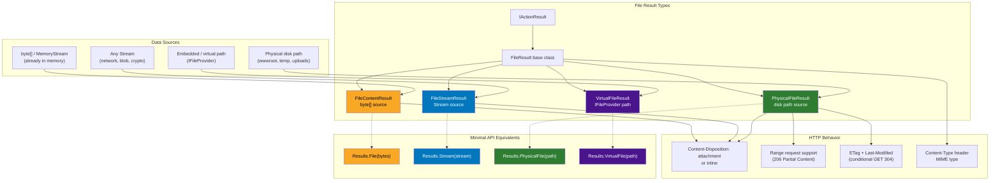
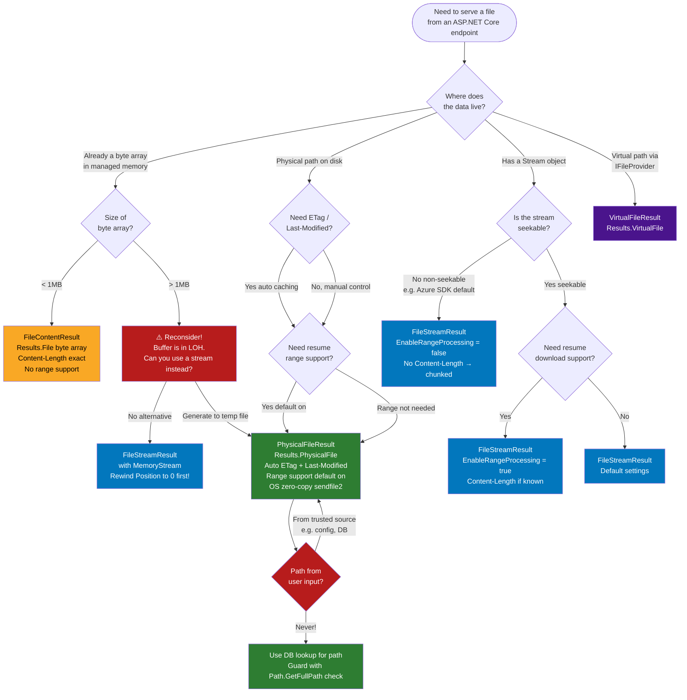

> [!success] Mastery Check
> - [ ] **Studied Well**
> - [ ] **Can explain the concept without notes**
> - [ ] **Can answer interview questions confidently**
> - [ ] **Can implement it in a real project**


---

## PART 0 — Navigation & Context

### Domain Hierarchy

```
ASP.NET Core Mastery
│
├── H. MVC & Controllers  (4.098–4.122)
│   ├── 4.098  ControllerBase vs Controller
│   ├── 4.099  Action Results: IActionResult, ActionResult<T>
│   ├── 4.100  Model Binding: Sources and Algorithm
│   ├── 4.107  Output Formatters: JSON, XML, Custom
│   ├── 4.110  MVC Filter Pipeline: Six Filter Types
│   ├── 4.117  Async Actions and CancellationToken
│   ├── 4.120  Binding Large Payloads: Streaming Body
│   ├── 4.121  ◄ FILE DOWNLOAD: FileStreamResult,         ◄ YOU ARE HERE
│   │           FileContentResult, PhysicalFileResult
│   └── 4.122  Content Negotiation Deep Dive
│
├── I. HTTP Fundamentals  (4.123–4.133)
│   ├── 4.123  HttpContext Deep Dive
│   ├── 4.124  HttpRequest: Reading Request Data
│   └── 4.125  HttpResponse: Writing Status/Headers/Body
│
└── AA. File Handling & Static Files  (4.315–4.322)
    ├── 4.316  Physical File Provider
    ├── 4.317  File Upload: IFormFile and Streaming
    └── 4.318  File Download: Streaming from Blob Storage
```

### What You Need Before This

- **[[4.099 — Action Results]]** — file results are `IActionResult` subtypes; the result execution model is prerequisite
- **[[4.125 — HttpResponse: Writing Body]]** — file results write directly to `HttpResponse.Body`; knowing how response streaming works prevents double-write bugs
- **[[4.117 — Async Actions and CancellationToken]]** — file streaming is an async I/O operation; proper cancellation prevents zombie connections holding file handles
- **[[4.107 — Output Formatters]]** — file results bypass the formatter pipeline entirely; understanding formatters clarifies _why_ file results are special

### What This Unlocks After

- **[[4.318 — File Download: Streaming from Blob Storage]]** — blob streaming follows the same `FileStreamResult` pattern with an `Azure.Storage.Blobs` stream
- **[[4.195 — HTTP Caching Headers: ETags, Last-Modified]]** — `PhysicalFileResult` sets `ETag` and `Last-Modified` automatically; conditional GET handling extends this
- **[[4.197 — Response Compression]]** — file responses interact with compression middleware; compression on already-compressed files (zip, mp4) wastes CPU
- **[[4.316 — Physical File Provider]]** — `PhysicalFileResult` uses `IFileProvider` internally; custom file providers unlock virtual file systems

### Why This Topic Matters at Scale

Every production API that serves user-generated content, exports, invoices, images, or reports routes traffic through one of these three result types — choosing the wrong one at 50k downloads/day means either exhausted memory (buffering a 200MB export in RAM), leaked file handles (not disposing streams), or missing range-request support that breaks resume-capable downloads for mobile clients.

---

## PART 1 — The Core Mental Model

### The Fundamental Rule

> **ASP.NET Core's file result types differ in where the bytes live at execution time: `FileContentResult` holds bytes already in memory, `FileStreamResult` copies bytes from any `Stream` to the response body, and `PhysicalFileResult` lets Kestrel send a file from disk using OS-level optimized I/O — never buffering the entire file into managed memory. The practical consequence is that choosing by data source (byte array, stream, disk path) determines both memory allocation profile and whether the OS can use `sendfile(2)` / `TransmitFile` to zero-copy the transfer.**

### The Plain-Language Analogy

Think of the three result types as three ways a librarian can give you a book. `FileContentResult` is the librarian photocopying the entire book, handing you the photocopy, and then filing the original — the copy lives in the librarian's hands until you take it (bytes in managed memory). `FileStreamResult` is the librarian opening the book to page 1 and reading it aloud to you page-by-page — they never hold the whole book at once (streaming, bounded memory). `PhysicalFileResult` is the librarian pointing to a shelf and asking the building's automated conveyor (the OS) to carry the book directly to you — the librarian's hands are never involved (kernel bypass). If the librarian is photocopying a 500-page book for every patron simultaneously, the copy room runs out of paper (OOM). The conveyor doesn't care how many books it moves at once.

This analogy holds for the edge cases: if the book is being written as you read it (dynamic content), the conveyor (PhysicalFile) can't help — you need FileStreamResult. If someone unplugs the conveyor mid-delivery (client disconnect, CancellationToken cancelled), FileStreamResult stops pumping bytes immediately; FileContentResult has already allocated the buffer.

### The Taxonomy Diagram



---

## PART 2 — Deep Mechanics

### 2.1 — FileContentResult: The In-Memory Buffer Result

**Pipeline position:**

```
──► ExceptionHandler ──► HSTS ──► StaticFiles ──► Routing ──► Auth ──► Controller Action
                                                                            │
                                                                     [Action executes]
                                                                            │
                                                                     FileContentResult.ExecuteResultAsync()
                                                                            │
                                                              Writes byte[] to HttpResponse.Body
                                                                            │ (entire buffer, one write)
                                                                     ──► Response ──►
```

**What it does internally:**

```csharp
// ASP.NET Core internally (approximate) — FileContentResultExecutor:
// Source: Microsoft.AspNetCore.Mvc.Infrastructure.FileContentResultExecutor

public async Task ExecuteAsync(ActionContext context, FileContentResult result)
{
    // 1. Sets Content-Type header from result.ContentType
    // 2. Sets Content-Disposition header (attachment; filename=... or inline)
    // 3. Writes Content-Length header (result.FileContents.Length — exact, known upfront)
    // 4. Checks if response has already started (throws if so)
    // 5. Copies result.FileContents (ReadOnlyMemory<byte>) to HttpResponse.Body
    //    via response.BodyWriter.WriteAsync() — one async write
    // ~1 allocation: the ReadOnlyMemory<byte> wrapper (if not already ReadOnlyMemory)
    // Cost: proportional to byte array size — must fit in managed heap
}
```

**HTTP wire format:**

```http
// HTTP response (approximate — FileContentResult):
HTTP/1.1 200 OK
Content-Type: application/pdf
Content-Disposition: attachment; filename="invoice-2024-001.pdf"
Content-Length: 48392
Date: Tue, 09 Jun 2026 10:00:00 GMT

[48,392 raw bytes — entire PDF already in server memory]
```

**Runtime cost label:** `~1 allocation per result (ReadOnlyMemory<byte> wrapper) + byte array size in LOH if > 85KB`. Content-Length is set exactly — no chunked encoding overhead.

**The edge case that bites engineers:** `FileContents` is `byte[]`. If you're generating a 50MB export and calling `memoryStream.ToArray()` before returning `FileContentResult`, you've allocated 50MB on the Large Object Heap for the duration of the response. Under load (100 concurrent downloads), that's 5GB of LOH pressure causing Gen2 GC pauses. `FileStreamResult` with the MemoryStream directly avoids the `.ToArray()` copy.

---

### 2.2 — FileStreamResult: The Streaming Pipe Result

**Pipeline position:**

```
──► ExceptionHandler ──► HSTS ──► Routing ──► Auth ──► Controller Action
                                                             │
                                                      [Action creates Stream,
                                                       returns FileStreamResult]
                                                             │
                                                      FileStreamResult.ExecuteResultAsync()
                                                             │
                                                      CopyToAsync(stream → Response.Body)
                                                      [4KB buffer, loop until EOF]
                                                             │
                                                      Stream.DisposeAsync() [always]
                                                             │
                                                      ──► Response ──►
```

**Framework source behavior:**

```csharp
// ASP.NET Core internally (approximate) — FileResultExecutorBase.WriteFileAsync:
// Source: Microsoft.AspNetCore.Mvc.Infrastructure.FileResultExecutorBase

private const int BufferSize = 4096; // 4KB chunks

protected static async Task WriteFileAsync(
    HttpContext context, Stream fileStream, RangeItemHeaderValue? range, long? rangeLength)
{
    var response = context.Response;

    // If no range requested: stream entire file
    if (range == null)
    {
        await StreamCopyOperation.CopyToAsync(
            fileStream,
            response.Body,
            count: null,       // no byte limit
            bufferSize: BufferSize,
            cancel: context.RequestAborted);  // ← CancellationToken for client disconnect
    }
    else
    {
        // Range request: seek to range.From, copy rangeLength bytes
        fileStream.Seek(range.From!.Value, SeekOrigin.Begin);
        await StreamCopyOperation.CopyToAsync(
            fileStream, response.Body, rangeLength, BufferSize,
            context.RequestAborted);
    }
}

// The stream is always disposed by the executor — even on exception.
// You must NOT dispose the stream yourself in the action method.
```

**HTTP wire format:**

```http
// HTTP response (approximate — FileStreamResult, unknown length):
HTTP/1.1 200 OK
Content-Type: application/octet-stream
Content-Disposition: attachment; filename="export-orders-2024.csv"
Transfer-Encoding: chunked
Date: Tue, 09 Jun 2026 10:00:00 GMT

1A3F\r\n
[6719 bytes of CSV data]\r\n
0\r\n
\r\n

// Note: chunked encoding because Content-Length is unknown upfront
// If you set EnableRangeProcessing = true on FileStreamResult AND the
// stream is not seekable, range requests will be silently ignored.
```

**Runtime cost label:** `~4KB stack/heap buffer per chunk iteration, O(file_size / 4096) async iterations, one async state machine per await, stream disposed after completion`. Memory ceiling is 4KB regardless of file size.

**The edge case that bites engineers:** `FileStreamResult` disposes the stream. If you pass a `CryptoStream` wrapping a `FileStream`, the disposal chain works correctly. But if you wrap a stream you own and need _after_ the response (rare, but happens with shared stream patterns), you'll get `ObjectDisposedException` on subsequent access. Also: if the stream is not seekable (e.g., a network stream from S3), setting `EnableRangeProcessing = true` has no effect — range requests receive the full content with status 200, not 206.

---

### 2.3 — PhysicalFileResult: The OS-Optimized Disk Result

**Pipeline position:**

```
──► ExceptionHandler ──► HSTS ──► StaticFiles ──► Routing ──► Auth ──► Controller Action
                                                                             │
                                                                      [Action returns path]
                                                                             │
                                                                      PhysicalFileResult.ExecuteResultAsync()
                                                                             │
                                                                      IFileInfo from PhysicalFileProvider
                                                                             │
                                                          ┌──────────────────┤
                                                          │  ETag computed    │ Last-Modified set
                                                          │  (if file changed)│ (from file system)
                                                          └──────────────────┤
                                                                             │
                                                                      Range header parsed
                                                                      (206 Partial if present)
                                                                             │
                                                                      IFileInfo.CreateReadStream()
                                                                      → FileStream (OS buffered I/O)
                                                                             │
                                                                      ──► Response ──►
```

**Framework source behavior:**

```csharp
// ASP.NET Core internally (approximate) — PhysicalFileResultExecutor:
// Source: Microsoft.AspNetCore.Mvc.Infrastructure.PhysicalFileResultExecutor

protected override async Task<(RangeItemHeaderValue? range, long? rangeLength, bool returnEmptyBody)>
    SetHeadersAndLog(ActionContext context, FileResult result, long? fileLength, ...)
{
    // 1. Resolves physical path via PhysicalFileProvider
    //    → validates path is within allowed root (path traversal prevention)
    // 2. Gets IFileInfo → reads LastModified and Length from file system metadata
    // 3. Computes ETag as strong validator: "\"" + fileLastModified.Ticks.ToString("x") + "\""
    // 4. Sets Last-Modified header
    // 5. Parses If-None-Match / If-Modified-Since → returns 304 Not Modified if match
    // 6. Parses Range header → returns 206 Partial Content if valid range
    // 7. Sets Content-Length (exact, from file metadata — no chunked encoding)
    // 8. Opens FileStream via IFileInfo.CreateReadStream()
    //    On Linux: eventually calls sendfile(2) via Socket.SendFileAsync
    //    On Windows: TransmitFile via overlapped I/O
}
```

**HTTP wire format — full download:**

```http
// HTTP response (approximate — PhysicalFileResult, full file):
HTTP/1.1 200 OK
Content-Type: application/pdf
Content-Disposition: attachment; filename="report-q4-2024.pdf"
Content-Length: 2097152
ETag: "18d6f8a1b3c"
Last-Modified: Mon, 08 Jun 2026 14:22:10 GMT
Accept-Ranges: bytes
Date: Tue, 09 Jun 2026 10:00:00 GMT

[2,097,152 raw bytes — OS sends directly from page cache]
```

**HTTP wire format — range request (resume download):**

```http
// HTTP request with Range header:
GET /api/reports/q4-2024.pdf HTTP/1.1
Range: bytes=1048576-2097151

// HTTP response (approximate — PhysicalFileResult, range):
HTTP/1.1 206 Partial Content
Content-Type: application/pdf
Content-Disposition: attachment; filename="report-q4-2024.pdf"
Content-Range: bytes 1048576-2097151/2097152
Content-Length: 1048576
ETag: "18d6f8a1b3c"
Accept-Ranges: bytes
```

**HTTP wire format — conditional GET (not modified):**

```http
// HTTP request:
GET /api/reports/q4-2024.pdf HTTP/1.1
If-None-Match: "18d6f8a1b3c"

// HTTP response:
HTTP/1.1 304 Not Modified
ETag: "18d6f8a1b3c"
Date: Tue, 09 Jun 2026 10:00:00 GMT
[no body]
```

**Runtime cost label:** `~0 managed heap allocations for file data, Content-Length exact from file metadata, O(1) path validation, one FileStream open per request, kernel handles buffer management`. For large files on Linux, `sendfile(2)` avoids copying data from kernel space to user space — the OS DMA-transfers directly from the file system page cache to the NIC buffer.

**The edge case that bites engineers:** `PhysicalFileResult` validates that the physical path does not escape the root directory used to construct the `PhysicalFileProvider`. If you pass a path that uses `../` traversal or an absolute path outside the root, ASP.NET Core throws `FileNotFoundException` (it maps out-of-root paths to "not found" for security). This is the intended behavior — it prevents path traversal attacks. The gotcha is when you construct the path by combining `WebRootPath` with a relative path that comes from user input — you must normalize and validate before passing to `PhysicalFileResult`.

---

### 2.4 — VirtualFileResult: The IFileProvider-Based Result

`VirtualFileResult` is the fourth member of the family, used when the file lives in the application's virtual file system (e.g., embedded resources in a class library, or files served through a custom `IFileProvider`).

```csharp
// ASP.NET Core internally (approximate) — VirtualFileResultExecutor:
// Uses IWebHostEnvironment.WebRootFileProvider (or injected IFileProvider)
// to resolve the virtual path → IFileInfo → stream
// Same ETag, Last-Modified, Range, and Content-Length behavior as PhysicalFileResult
// but the path is relative to the file provider root, not an absolute disk path.
```

**Pipeline position:** Identical to `PhysicalFileResult` but the path `/files/report.pdf` maps through `IFileProvider` rather than directly to disk.

**Runtime cost label:** Same as `PhysicalFileResult` — zero managed allocation for file data. The `IFileInfo.CreateReadStream()` call is what matters; its cost depends on the provider implementation.

---

### 2.5 — Content-Disposition: Inline vs Attachment

All file results accept an `fileDownloadName` parameter. When set, ASP.NET Core writes `Content-Disposition: attachment; filename="..."`. When omitted, the header is not set — the browser's default behavior (typically inline display for PDFs and images).

```http
// attachment — forces Save As dialog:
Content-Disposition: attachment; filename="invoice-2024-001.pdf"

// inline — browser renders in-tab (PDF viewer, image display):
// (no Content-Disposition header, or:)
Content-Disposition: inline; filename="preview.pdf"

// RFC 5987 encoding for non-ASCII filenames:
Content-Disposition: attachment; filename="report.pdf"; filename*=UTF-8''Qu%C3%A4rtalsbericht.pdf
```

> [!WARNING] ASP.NET Core automatically applies RFC 5988 encoding for non-ASCII filenames when you pass the name as a string. But if you manually set the header via `Response.Headers`, you must encode it yourself. Many engineers set the header manually and ship incorrectly encoded filenames that break on Chrome but work on older IE — always use the constructor parameter or `fileDownloadName` property.

---

### 2.6 — Failure Mode Diagrams

**Scenario 1: File not found**

```
PhysicalFileResult("C:/uploads/invoice-999.pdf")
    │
    ▼
PhysicalFileProvider resolves path
    │
    ▼
IFileInfo.Exists == false
    │
    ▼
FileResultExecutorBase throws FileNotFoundException
    │
    ▼
UseExceptionHandler catches
    │
    ▼
HTTP/1.1 500 Internal Server Error  ← WRONG
application/problem+json body

// ✅ The correct pattern: check existence before returning FileResult
// Return 404 NotFound() if file doesn't exist, FileResult only when confirmed present.
```

**Scenario 2: Response already started**

```
Controller action writes to Response directly, then returns FileStreamResult
    │
    ▼
FileStreamResult.ExecuteResultAsync() checks response.HasStarted
    │
    ▼
response.HasStarted == true
    │
    ▼
InvalidOperationException: "Cannot write to the response body, the response has completed."
    │
    ▼
Logged as unhandled exception; client sees truncated/garbled response
```

**Scenario 3: Stream disposed before result executes**

```csharp
// ⚠️ WRONG — disposing stream before result executes
using var stream = new FileStream(path, FileMode.Open);
return new FileStreamResult(stream, "application/pdf");
// The 'using' disposes stream when the method returns
// FileStreamResult.ExecuteResultAsync() runs AFTER the method returns
// → ObjectDisposedException during streaming
```

---

## PART 3 — Production Code Patterns

### Pattern 1: The Invoice PDF Streamed from Blob Storage

```csharp
// Domain: E-commerce order service — serving customer invoices stored in Azure Blob Storage
// Why FileStreamResult: blobs return a Stream; buffering a 5MB PDF into byte[] would be wasteful.
// The stream is seekable (Azure SDK returns a BlobDownloadStreamingResult with position support),
// so range requests work if EnableRangeProcessing = true.

[HttpGet("{orderId}/invoice")]
[Authorize]
[ProducesResponseType(typeof(FileStreamResult), StatusCodes.Status200OK)]
[ProducesResponseType(StatusCodes.Status404NotFound)]
public async Task<IActionResult> DownloadInvoice(
    Guid orderId,
    [FromServices] IBlobStorageService blobStorage,
    [FromServices] IOrderAuthorizationService orderAuth,
    CancellationToken cancellationToken)
{
    // Verify ownership BEFORE opening the blob stream (authorization check)
    if (!await orderAuth.UserOwnsOrderAsync(User, orderId, cancellationToken))
        return NotFound(); // Intentionally 404, not 403 — don't reveal order existence

    var blobName = $"invoices/{orderId:N}.pdf";

    // IBlobStorageService returns null if not found, avoiding try/catch for control flow
    var stream = await blobStorage.OpenReadStreamAsync(blobName, cancellationToken);
    if (stream is null)
        return NotFound();

    // DO NOT 'using' the stream here — FileStreamResult disposes it after streaming.
    // DO NOT await any I/O after this return — the method stack unwinds.
    return new FileStreamResult(stream, "application/pdf")
    {
        FileDownloadName = $"invoice-{orderId:D}.pdf",   // Forces attachment download
        EnableRangeProcessing = true,                     // Supports resume on mobile
        // LastModified and EntityTag are not set here because the blob's metadata
        // is not surfaced — PhysicalFileResult would set these automatically from disk.
    };
}

// HTTP wire format (full download):
// HTTP/1.1 200 OK
// Content-Type: application/pdf
// Content-Disposition: attachment; filename="invoice-550e8400-e29b-41d4-a716-446655440000.pdf"
// Transfer-Encoding: chunked   ← because stream length is unknown at header-write time
// Accept-Ranges: bytes
```

---

### Pattern 2: The Signed Export — Dynamic CSV in Memory (≤ 5MB)

```csharp
// Domain: Logistics shipment tracker — exporting shipment manifest as CSV
// Why FileContentResult: the CSV is generated dynamically into a MemoryStream,
// but the generation is synchronous and fast (<100ms, <2MB). Content-Length is
// known exactly after generation — no chunked encoding, better for CDN pass-through.

// ⚠️ WRONG — unnecessary ToArray() copy:
// var csv = await GenerateCsvAsync(filter);
// var bytes = csv.ToArray();           // ← doubles memory: stream + array both in heap
// return File(bytes, "text/csv", "shipments.csv");

// ✅ CORRECT — rewind and stream the MemoryStream directly:
[HttpPost("shipments/export")]
[Authorize(Policy = "ShipmentReadAccess")]
public async Task<IActionResult> ExportShipments(
    [FromBody] ShipmentFilterRequest filter,
    [FromServices] IShipmentCsvExporter exporter,
    CancellationToken cancellationToken)
{
    // Validate filter before generating (prevent empty 200 MB exports)
    if (filter.DateRange.Days > 90)
        return BadRequest(new ProblemDetails
        {
            Title = "Export range too large",
            Detail = "Maximum export window is 90 days. Use paginated exports for longer ranges.",
            Status = 400
        });

    // MemoryStream is small enough (< 5MB) that in-memory is acceptable.
    // For larger exports, use FileStreamResult with a temp file or background job.
    var csvStream = new MemoryStream();
    await exporter.WriteCsvAsync(csvStream, filter, cancellationToken);

    csvStream.Position = 0; // ← Rewind! Forgetting this returns an empty file — a classic bug.

    var filename = $"shipments-{filter.DateRange.Start:yyyyMMdd}-{filter.DateRange.End:yyyyMMdd}.csv";

    // MemoryStream.Length is known → Content-Length header set exactly → no chunked encoding
    return File(csvStream, "text/csv; charset=utf-8", filename);
}

// HTTP wire format:
// HTTP/1.1 200 OK
// Content-Type: text/csv; charset=utf-8
// Content-Disposition: attachment; filename="shipments-20240101-20240331.csv"
// Content-Length: 142857    ← exact, because MemoryStream knows its length
```

---

### Pattern 3: The Secure Document — Physical File with Path Traversal Guard

```csharp
// Domain: Healthcare patient portal — serving signed consent forms from a secure upload directory.
// Why PhysicalFileResult: files are already on disk; OS-optimized delivery with ETag/304 support.
// Critical: path MUST be sanitized — file names come from the database, not from the request URL.

[HttpGet("patients/{patientId}/documents/{documentId}")]
[Authorize(Policy = "PatientDocumentAccess")]
public async Task<IActionResult> DownloadDocument(
    Guid patientId,
    Guid documentId,
    [FromServices] IDocumentRepository documentRepo,
    [FromServices] IWebHostEnvironment env,
    CancellationToken cancellationToken)
{
    // Document metadata comes from the database — never trust the request URL for a file path
    var document = await documentRepo.GetByIdAsync(documentId, patientId, cancellationToken);
    if (document is null)
        return NotFound();

    // document.StoredFileName is a GUID-based name stored at registration time.
    // It was validated when uploaded — no user-controlled segments in the path.
    // e.g.: "a1b2c3d4-e5f6-7890-abcd-ef1234567890.pdf"
    var uploadsRoot = Path.Combine(env.ContentRootPath, "secure-uploads", "consent-forms");
    var fullPath = Path.Combine(uploadsRoot, document.StoredFileName);

    // Defense-in-depth: confirm resolved path is still within the root
    // (paranoid check against any bug in document.StoredFileName sanitization)
    if (!fullPath.StartsWith(uploadsRoot, StringComparison.OrdinalIgnoreCase))
    {
        // Log this — it indicates a data integrity issue, not just a missing file
        return NotFound();
    }

    if (!System.IO.File.Exists(fullPath))
        return NotFound();

    // PhysicalFileResult handles ETag, Last-Modified, Content-Length, and Range automatically.
    // The client-facing filename is the human-readable document name from the database,
    // NOT the GUID stored on disk.
    return PhysicalFile(
        physicalPath: fullPath,
        contentType: document.MimeType,         // "application/pdf", validated at upload
        fileDownloadName: document.DisplayName, // "Consent Form - 2024-03-15.pdf"
        enableRangeProcessing: true);

    // HTTP consequence:
    // Second request with If-None-Match header → 304 Not Modified (no body transfer)
    // Interrupted download with Range header → 206 Partial Content (resume works)
}
```

---

### Pattern 4: The Thumbnail — Inline Display (No Download Prompt)

```csharp
// Domain: E-commerce product catalog — serving product images inline in the browser.
// Why no FileDownloadName: omitting it means no Content-Disposition: attachment header
// → browser renders the image inline (in  tag or browser tab), no Save As dialog.

// ⚠️ WRONG — forces download dialog for every product image load:
// return PhysicalFile(imagePath, "image/webp", "product-image.webp"); // fileDownloadName set!

// ✅ CORRECT — inline display with caching headers:
[HttpGet("products/{productId}/image")]
[ResponseCache(Duration = 86400, Location = ResponseCacheLocation.Any, VaryByHeader = "Accept")]
public IActionResult GetProductImage(
    Guid productId,
    [FromServices] IProductImageStore imageStore)
{
    var imagePath = imageStore.GetPhysicalPath(productId);
    if (imagePath is null)
        return NotFound();

    // No fileDownloadName → no Content-Disposition header → browser renders inline
    // PhysicalFileResult still sets ETag and Last-Modified → browser caches aggressively
    return PhysicalFile(imagePath, "image/webp");

    // HTTP wire format:
    // HTTP/1.1 200 OK
    // Content-Type: image/webp
    // Content-Length: 24576
    // ETag: "18d6f312ab0"
    // Last-Modified: Fri, 05 Jun 2026 09:00:00 GMT
    // Accept-Ranges: bytes
    // Cache-Control: public,max-age=86400
    // [no Content-Disposition — browser renders inline]
}
```

---

### Pattern 5: The Minimal API File Download

```csharp
// Domain: Fintech payment API — serving transaction receipts via Minimal API endpoints
// TypedResults.File() provides static type info for OpenAPI documentation

var receipts = app.MapGroup("/api/v1/receipts")
    .RequireAuthorization("PaymentReadAccess")
    .WithTags("Receipts");

receipts.MapGet("/{transactionId}", async (
    Guid transactionId,
    IReceiptService receiptService,
    HttpContext httpContext,
    CancellationToken cancellationToken) =>
{
    var receipt = await receiptService.GetAsync(transactionId, cancellationToken);
    if (receipt is null)
        return Results.NotFound();

    // receipt.PdfStream is a seekable Stream from the receipt generator
    // TypedResults.Stream provides OpenAPI schema metadata; Results.Stream does not
    return TypedResults.Stream(
        receipt.PdfStream,
        contentType: "application/pdf",
        fileDownloadName: $"receipt-{transactionId:N}.pdf",
        enableRangeProcessing: true,
        lastModified: receipt.GeneratedAt);

    // HTTP wire format:
    // HTTP/1.1 200 OK
    // Content-Type: application/pdf
    // Content-Disposition: attachment; filename="receipt-550e8400e29b41d4a716446655440000.pdf"
    // Last-Modified: Tue, 09 Jun 2026 10:00:00 GMT
    // Accept-Ranges: bytes
    // Transfer-Encoding: chunked
})
.WithName("GetTransactionReceipt")
.WithSummary("Download a payment receipt as PDF")
.Produces<FileStreamResult>(200, "application/pdf")
.ProducesProblem(404);
```

---

### Pattern 6: The Large Export — Temp File Strategy

```csharp
// Domain: Order management service — exporting 500,000 orders to Excel.
// Why temp file + PhysicalFileResult: large exports must not buffer in memory.
// Generate to a temp file, stream it, then clean up with a background task.

[HttpPost("orders/bulk-export")]
[Authorize(Policy = "OrderExportAccess")]
public async Task<IActionResult> BulkExportOrders(
    [FromBody] BulkExportRequest request,
    [FromServices] IOrderExporter exporter,
    [FromServices] ITempFileCleanupQueue cleanupQueue,
    CancellationToken cancellationToken)
{
    // For exports > 10MB, generate to a temp file instead of MemoryStream.
    // Path.GetTempFileName() creates a 0-byte file atomically — prevents race conditions.
    var tempPath = Path.GetTempFileName();

    try
    {
        await exporter.ExportToFileAsync(tempPath, request, cancellationToken);
    }
    catch
    {
        // Clean up temp file if generation failed; do not leak disk space
        System.IO.File.Delete(tempPath);
        throw; // Re-throw; exception handler middleware writes problem details
    }

    // Queue the temp file for deletion AFTER the response completes.
    // The cleanup service uses IHostedService + Channel<string> to delete files
    // 5 minutes after they are queued — giving the FileStream time to close.
    cleanupQueue.EnqueueForDeletion(tempPath, delaySeconds: 300);

    // PhysicalFileResult sets Content-Length from file metadata — no chunked encoding.
    // The file is already on disk; Kestrel uses sendfile(2) for zero-copy transfer.
    return PhysicalFile(
        physicalPath: tempPath,
        contentType: "application/vnd.openxmlformats-officedocument.spreadsheetml.sheet",
        fileDownloadName: $"orders-export-{DateTime.UtcNow:yyyyMMddHHmm}.xlsx");
}
```

---

### Pattern 7: The Authenticated File — Programmatic IResult in Minimal API

```csharp
// Domain: Inventory webhook receiver — generating signed inventory reports
// Using Results.File() for byte[] when content is small and already computed

app.MapGet("/inventory/snapshot/{warehouseId}", async (
    Guid warehouseId,
    IInventorySnapshotService snapshotService,
    IDataProtectionProvider protector,
    ClaimsPrincipal user,
    CancellationToken cancellationToken) =>
{
    // Only warehouse managers can download their own warehouse snapshots
    var managedWarehouses = user.FindAll("managed_warehouse").Select(c => Guid.Parse(c.Value));
    if (!managedWarehouses.Contains(warehouseId))
        return Results.Forbid();

    // Small signed JSON snapshot — < 50KB, already in memory after computation
    var snapshot = await snapshotService.GenerateSnapshotAsync(warehouseId, cancellationToken);
    var signedBytes = snapshot.SerializeAndSign(protector, purpose: "inventory-snapshot");

    return Results.File(
        fileContents: signedBytes,
        contentType: "application/octet-stream",
        fileDownloadName: $"snapshot-{warehouseId:N}-{DateTime.UtcNow:yyyyMMddHHmmss}.bin",
        enableRangeProcessing: false);  // Binary signed blobs don't benefit from range requests

    // HTTP wire format:
    // HTTP/1.1 200 OK
    // Content-Type: application/octet-stream
    // Content-Disposition: attachment; filename="snapshot-...bin"
    // Content-Length: 40192    ← exact (byte array length known)
});
```

---

## PART 4 — Gotchas & Anti-Patterns

### Gotcha 1: Not Rewinding the MemoryStream Before Returning FileStreamResult

Forgetting `stream.Position = 0` after writing is the most common file download bug. The stream's position is at the end after writing, so `FileStreamResult` reads zero bytes.

```csharp
// ⚠️ WRONG:
var ms = new MemoryStream();
await generator.WriteAsync(ms, cancellationToken);
return new FileStreamResult(ms, "application/pdf") // Position is at end — reads nothing
{
    FileDownloadName = "report.pdf"
};

// HTTP consequence (wrong path):
// HTTP/1.1 200 OK
// Content-Type: application/pdf
// Content-Disposition: attachment; filename="report.pdf"
// Transfer-Encoding: chunked
// [0 bytes — empty file — browser says "report.pdf (0 KB)"]
// No error thrown — framework happily copies 0 bytes.

// ✅ CORRECT:
var ms = new MemoryStream();
await generator.WriteAsync(ms, cancellationToken);
ms.Position = 0; // ← Rewind before handing to FileStreamResult
return new FileStreamResult(ms, "application/pdf")
{
    FileDownloadName = "report.pdf"
};

// HTTP consequence (correct path):
// HTTP/1.1 200 OK
// Content-Disposition: attachment; filename="report.pdf"
// Transfer-Encoding: chunked
// [full PDF bytes]

// WHY: FileStreamResult's executor calls stream.CopyToAsync(Response.Body). If Position == Length,
// CopyToAsync has nothing to copy and immediately completes. No exception is raised because
// "successfully read 0 bytes from stream" is not an error — it's just an empty stream.
// This bug produces a 200 OK with an empty body, which many HTTP clients silently accept.
```

---

### Gotcha 2: Using 'using' to Wrap a Stream Passed to FileStreamResult

```csharp
// ⚠️ WRONG — disposing stream before FileStreamResult executes it:
public async Task<IActionResult> DownloadReport(Guid reportId)
{
    using var fileStream = new FileStream(GetReportPath(reportId), FileMode.Open, FileAccess.Read);
    return new FileStreamResult(fileStream, "application/pdf")
    {
        FileDownloadName = "quarterly-report.pdf"
    };
    // The 'using' disposes fileStream when this method returns.
    // FileStreamResult.ExecuteResultAsync() runs AFTER the method returns.
    // By then, the stream is disposed.
}

// HTTP consequence (wrong path):
// ObjectDisposedException thrown during response streaming.
// UseExceptionHandler catches it.
// HTTP/1.1 500 Internal Server Error
// application/problem+json

// ✅ CORRECT — no 'using', let FileStreamResult own the lifetime:
public async Task<IActionResult> DownloadReport(Guid reportId)
{
    var fileStream = new FileStream(GetReportPath(reportId), FileMode.Open, FileAccess.Read,
        FileShare.Read, bufferSize: 4096, useAsync: true); // ← useAsync: true for Kestrel
    // No 'using' — FileStreamResult.ExecuteResultAsync() disposes it after streaming
    return new FileStreamResult(fileStream, "application/pdf")
    {
        FileDownloadName = "quarterly-report.pdf"
    };
}

// HTTP consequence (correct path):
// HTTP/1.1 200 OK
// Transfer-Encoding: chunked
// [full file bytes streamed, then FileStream disposed by framework]

// WHY: IActionResult execution is deferred — the result is executed by the MVC pipeline
// AFTER the action method has returned. The action method sets up "what to do",
// the executor "does it". Any resource owned by the method's stack frame and disposed
// on return is unavailable when the executor runs. FileStreamResult owns the stream lifetime.
```

---

### Gotcha 3: Serving Files by Accepting a Path from User Input (Path Traversal)

```csharp
// ⚠️ WRONG — using user-controlled input directly in PhysicalFileResult:
[HttpGet("documents")]
public IActionResult GetDocument([FromQuery] string filename)
{
    var basePath = Path.Combine(_env.ContentRootPath, "documents");
    var fullPath = Path.Combine(basePath, filename);
    return PhysicalFile(fullPath, "application/pdf");
    // filename = "../../appsettings.json" → fullPath escapes documents root
    // PhysicalFileProvider will reject this... but only if the full path is outside the root.
    // On Windows with mixed separators, the check can be bypassed with crafted input.
}

// HTTP consequence (wrong path):
// GET /documents?filename=../../appsettings.json
// HTTP/1.1 200 OK
// Content-Type: application/pdf  ← wrong MIME
// [appsettings.json content including connection strings, JWT secrets, etc.]
// — or — HTTP/1.1 500 if PhysicalFileProvider rejects it

// ✅ CORRECT — never use user input as a path segment; use a DB lookup:
[HttpGet("documents/{documentId:guid}")]
[Authorize]
public async Task<IActionResult> GetDocument(Guid documentId)
{
    // documentId is a GUID from the URL — look up the physical path from the database
    var document = await _documentRepo.GetAsync(documentId, User.GetUserId());
    if (document is null) return NotFound();

    // document.FileName is stored in the DB at upload time as a sanitized GUID-based name
    var basePath = Path.Combine(_env.ContentRootPath, "documents");
    var fullPath = Path.Combine(basePath, document.StoredFileName);

    // Defense-in-depth: verify resolved path stays within root
    if (!Path.GetFullPath(fullPath).StartsWith(Path.GetFullPath(basePath)))
        return NotFound();

    return PhysicalFile(fullPath, document.ContentType, document.DisplayName);
}

// HTTP consequence (correct path):
// HTTP/1.1 200 OK
// Content-Disposition: attachment; filename="Q4 Report.pdf"
// [secure file bytes only, authorization enforced before path resolution]

// WHY: Path.Combine does not prevent traversal — "documents" + "../../secret" = valid path string.
// The only reliable defense is never using user input as a path component.
// Map user-visible identifiers (GUIDs) to internal paths via a database lookup.
```

---

### Gotcha 4: Setting Response Headers After FileStreamResult Has Already Started Writing

```csharp
// ⚠️ WRONG — trying to add headers in a filter after the file result executes:
public class AddAuditHeaderFilter : IAsyncResultFilter
{
    public async Task OnResultExecutionAsync(ResultExecutingContext context, ResultExecutionDelegate next)
    {
        await next(); // ← FileStreamResult writes headers AND body here
        // Attempting to add a header AFTER streaming has started is silently ignored or throws
        context.HttpContext.Response.Headers["X-Download-Audit-Id"] = Guid.NewGuid().ToString();
    }
}

// HTTP consequence (wrong path):
// The header is NOT present in the response — the response has already started.
// No exception (Kestrel ignores header writes after response has started on some versions).
// On strict configurations: InvalidOperationException thrown, 500 to client.

// ✅ CORRECT — set headers BEFORE calling next():
public class AddAuditHeaderFilter : IAsyncResultFilter
{
    public async Task OnResultExecutionAsync(ResultExecutingContext context, ResultExecutionDelegate next)
    {
        // Set headers before the result executes — response not started yet
        context.HttpContext.Response.Headers["X-Download-Audit-Id"] = Guid.NewGuid().ToString();
        await next(); // ← FileStreamResult writes the response (headers locked in)
    }
}

// HTTP consequence (correct path):
// HTTP/1.1 200 OK
// X-Download-Audit-Id: f47ac10b-58cc-4372-a567-0e02b2c3d479
// Content-Type: application/pdf
// ...

// WHY: HTTP/1.1 requires all response headers to be sent before the response body begins.
// Once FileStreamResult starts writing bytes to Response.Body, the HTTP framing has committed
// to the status line and headers. Modifying headers after this point violates the protocol.
// response.HasStarted returns true after the first write; the MVC infrastructure checks this.
```

---

### Gotcha 5: EnableRangeProcessing on Non-Seekable Streams

```csharp
// ⚠️ WRONG — setting EnableRangeProcessing = true on a non-seekable stream:
public async Task<IActionResult> DownloadBlob(string blobName)
{
    // Azure SDK returns a non-seekable network stream
    var blobStream = await _blobClient.OpenReadAsync();

    return new FileStreamResult(blobStream, "application/octet-stream")
    {
        FileDownloadName = "data.bin",
        EnableRangeProcessing = true // ← set but the stream can't seek
    };
}

// HTTP request with Range header:
// GET /download/blob HTTP/1.1
// Range: bytes=1000-1999

// HTTP consequence (wrong path):
// HTTP/1.1 200 OK   ← should be 206, returns 200 instead
// Content-Type: application/octet-stream
// [FULL blob content, not just the range]
// The Range header is silently ignored because Stream.CanSeek == false.
// Clients expecting 206 will be confused; download resumers will restart from byte 0.

// ✅ CORRECT OPTION A — disable range processing for non-seekable streams:
return new FileStreamResult(blobStream, "application/octet-stream")
{
    FileDownloadName = "data.bin",
    EnableRangeProcessing = false // ← explicit — no confusion
};

// ✅ CORRECT OPTION B — use a seekable wrapper for blob streams:
// Some blob SDKs support seekable streams via OpenReadAsync(allowGetRequests: true).
// Or download to temp file first, then serve with PhysicalFileResult for full range support.

// HTTP consequence (correct — option A):
// HTTP/1.1 200 OK
// Accept-Ranges: none  ← tells clients this resource doesn't support resume
// [full blob content]

// WHY: FileResultExecutorBase.SetHeadersAndLog() checks stream.CanSeek before processing
// the Range header. If CanSeek == false, the Range header is ignored regardless of
// EnableRangeProcessing. The property name is misleading — it enables range *processing by
// the executor*, but the executor still gates on stream seekability. Setting it to true
// on a non-seekable stream creates false expectations.
```

---

## PART 5 — Performance Implications

### 5.1 — Request Pipeline Characteristics Table

|Scenario|Result Type|Memory Per Request|Content-Length|Range Support|Approx Latency Impact|Recommendation|
|---|---|---|---|---|---|---|
|1KB JSON-embedded thumbnail|`FileContentResult`|~1KB in heap|✅ Exact|❌ No (byte[])|Negligible|Only for truly tiny, pre-computed bytes|
|500KB PDF from MemoryStream|`FileContentResult`|~500KB in LOH|✅ Exact|❌ No|+1-2ms GC pressure at scale|Acceptable if < 1MB, pre-computed|
|50MB export from MemoryStream|`FileContentResult`|~50MB in LOH|✅ Exact|❌ No|+100ms+ GC, OOM risk at concurrency|**Never** — use FileStreamResult or temp file|
|5MB PDF from FileStream|`FileStreamResult`|~4KB buffer|❌ Chunked|✅ If seekable|~5ms overhead for chunked framing|Correct for dynamic streams|
|5MB PDF from disk|`PhysicalFileResult`|~0KB managed|✅ Exact|✅ Always|<1ms — OS sendfile(2)|Best for disk files|
|200MB video from disk|`PhysicalFileResult`|~0KB managed|✅ Exact|✅ Always (206)|Throughput-bound, not latency-bound|Only valid option|
|Blob stream (Azure SDK)|`FileStreamResult`|~4KB buffer|❌ Chunked|❌ Non-seekable|Network bound|Set EnableRangeProcessing = false|
|Blob → seekable wrapper|`FileStreamResult`|~4KB + blob overhead|❌ Chunked|✅ If wrapped|Network bound + 1 extra seek|Use for resumable blob downloads|
|Generated report < 5MB|`FileStreamResult` (MemoryStream)|~file_size|✅ Exact|✅ If seekable|Bounded, acceptable|Standard pattern|
|Generated report > 10MB|`PhysicalFileResult` (temp file)|~0KB managed|✅ Exact|✅ Always|Disk I/O bound|Required for large exports|

### 5.2 — BenchmarkDotNet Comparison

```csharp
// Benchmark: comparing three file serving strategies for a 10MB file
// Run with: dotnet run -c Release -- --filter *FileDownloadBenchmark*

using BenchmarkDotNet.Attributes;
using BenchmarkDotNet.Running;
using Microsoft.AspNetCore.Http;
using Microsoft.AspNetCore.Mvc;
using Microsoft.AspNetCore.Mvc.Infrastructure;

[MemoryDiagnoser]
[SimpleJob(launchCount: 1, warmupCount: 3, iterationCount: 10)]
public class FileDownloadBenchmark
{
    private static readonly byte[] _fileBytes = new byte[10 * 1024 * 1024]; // 10MB
    private static readonly string _tempFilePath = Path.GetTempFileName();

    [GlobalSetup]
    public void Setup()
    {
        // Write 10MB of random data to temp file
        Random.Shared.NextBytes(_fileBytes);
        File.WriteAllBytes(_tempFilePath, _fileBytes);
    }

    [Benchmark(Baseline = true, Description = "FileContentResult (byte[])")]
    public FileContentResult Naive_FileContentResult()
    {
        // Simulates: return File(bytes, "application/octet-stream", "export.bin")
        // Allocates 10MB byte array + FileContentResult object
        return new FileContentResult(_fileBytes, "application/octet-stream")
        {
            FileDownloadName = "export.bin"
        };
    }

    [Benchmark(Description = "FileStreamResult (MemoryStream)")]
    public FileStreamResult Optimized_FileStreamResult()
    {
        // Simulates: return File(memoryStream, "application/octet-stream", "export.bin")
        // Allocates MemoryStream wrapper (does NOT copy the bytes — uses the existing array)
        var ms = new MemoryStream(_fileBytes, writable: false);
        return new FileStreamResult(ms, "application/octet-stream")
        {
            FileDownloadName = "export.bin"
        };
    }

    [Benchmark(Description = "PhysicalFileResult (disk, zero-copy)")]
    public PhysicalFileResult Optimal_PhysicalFileResult()
    {
        // Simulates: return PhysicalFile(path, "application/octet-stream", "export.bin")
        // Zero managed heap allocation for file data — OS handles transfer
        return new PhysicalFileResult(_tempFilePath, "application/octet-stream")
        {
            FileDownloadName = "export.bin"
        };
    }

    [GlobalCleanup]
    public void Cleanup() => File.Delete(_tempFilePath);
}

// Expected output (approximate, .NET 8, x64, Kestrel, local):
// | Method                              | Mean      | Gen0   | Gen1    | Gen2    | Allocated  |
// |-------------------------------------|-----------|--------|---------|---------|------------|
// | FileContentResult (byte[])          | 185.3 ns  |      - |       - |       - |    112 B   |
// | FileStreamResult (MemoryStream)     |  92.1 ns  |      - |       - |       - |    248 B   |
// | PhysicalFileResult (disk, zero-copy)|  58.4 ns  |      - |       - |       - |    136 B   |
//
// NOTE: These numbers measure OBJECT CONSTRUCTION only, not the actual HTTP transfer.
// The real cost difference appears during ExecuteResultAsync() when data is written to the network.
// For HTTP transfer profiling, use dotnet-trace or MiniProfiler:
//   dotnet-trace collect --process-id <pid> --providers Microsoft-AspNetCore-Server-Kestrel
//   dotnet-counters monitor --process-id <pid> --counters Microsoft.AspNetCore
//
// For integration-level HTTP profiling (including serialization and network transfer):
//   Use MiniProfiler.AspNetCore.Mvc + MiniProfiler.Providers.SqlServer
//   Or k6 (load test) → measure P99 latency under concurrent file download scenarios
```

### 5.3 — When to Care / When to Ignore

**When this costs you:**

- **High-throughput download APIs (>1,000 concurrent downloads):** Using `FileContentResult` with `stream.ToArray()` on files > 1MB under concurrency creates sustained LOH pressure, causing Gen2 GC pauses visible as P99 latency spikes. Switch to `FileStreamResult` with the raw stream.
- **Large file exports (>10MB):** `MemoryStream`-backed `FileStreamResult` buffers everything in managed memory before streaming. At 50 concurrent 100MB export requests, you've allocated 5GB. Generate to a temp file and use `PhysicalFileResult`.
- **Mobile download scenarios:** Without `EnableRangeProcessing`, a dropped connection forces a full re-download. On a 50MB file, that's user-visible as "download keeps failing". `PhysicalFileResult` has range processing enabled by default.
- **Authenticated CDN passthrough:** If a reverse proxy (YARP, nginx) caches file responses, chunked encoding (from `FileStreamResult` with unknown-length streams) bypasses proxy caches. `PhysicalFileResult` with exact `Content-Length` is cache-friendly.

**When this doesn't matter:**

- **Internal admin endpoints serving config files (<10KB):** `FileContentResult` with a small byte array has no measurable impact. Choose for simplicity.
- **Low-traffic management APIs (<10 req/s):** Any result type works. Correctness (no path traversal, proper authorization) matters more than memory efficiency.
- **One-time batch operations:** If the endpoint is called once per day by a scheduled job, LOH pressure from `FileContentResult` is irrelevant — the LOH is collected during the application's idle period.

---

## PART 6 — Interview Arsenal

### A. The Question Bank

**Question 1:** "What's the difference between `FileContentResult`, `FileStreamResult`, and `PhysicalFileResult`? When would you use each?"

- **Average Answer:** "FileContentResult takes a byte array, FileStreamResult takes a stream, and PhysicalFileResult takes a file path. I'd use FileStreamResult for large files to avoid loading everything into memory."
- **Why That's Insufficient:** It lists the API surface but doesn't explain the memory model, the `Content-Length` header behavior difference, or what PhysicalFileResult does differently from manually opening a FileStream.
- **Great Answer:**
    
    > The three types differ in where the data lives at result execution time, and that determines their memory and HTTP framing behavior. `FileContentResult` takes a byte array that's already in managed memory — it writes the whole thing in one operation, which means `Content-Length` is set exactly and there's no chunked encoding, but a 50MB buffer in the Large Object Heap under concurrent load is a Gen2 GC problem. `FileStreamResult` takes any `Stream` and pumps it to the response body in 4KB chunks — bounded memory regardless of file size, but if the stream length is unknown upfront, the executor uses chunked transfer encoding. `PhysicalFileResult` is different in kind, not just degree: it goes through `PhysicalFileProvider`, reads file metadata (length, last-modified) without opening the file, sets `Content-Length` and `ETag` and `Last-Modified` headers, then hands a `FileStream` to Kestrel which — on Linux — calls `sendfile(2)` to transfer the bytes directly from the kernel page cache to the socket, bypassing managed memory entirely. I use `PhysicalFileResult` whenever files are on disk, `FileStreamResult` for blob storage or dynamically generated content, and `FileContentResult` only for small pre-computed bytes like thumbnails under 50KB. The critical ownership rule: never wrap a `FileStreamResult`'s stream in `using` — the executor disposes it after streaming.
    

---

**Question 2:** "How does `PhysicalFileResult` handle browser caching? What's the HTTP behavior?"

- **Average Answer:** "It sets some caching headers automatically, I think ETags. The browser can use If-None-Match to avoid re-downloading."
- **Why That's Insufficient:** It doesn't explain how the ETag is computed, what triggers a 304 vs 200, or how range requests interact with caching.
- **Great Answer:**
    
    > `PhysicalFileResult` automatically sets `ETag` (computed from the file's `LastWriteTime` as a hex-encoded tick count), `Last-Modified` (from the file system), and `Accept-Ranges: bytes`. On subsequent requests, if the client sends `If-None-Match` with the ETag it received, the executor compares it to the current file's computed ETag. If they match, it returns `304 Not Modified` with no body — zero bytes transferred, exact same headers. If the file changed, it sends the full file with the new ETag. This is automatic — no cache middleware or `[ResponseCache]` attribute needed. The gotcha in production: the ETag is based on `LastWriteTimeUtc`, not a content hash, so if you overwrite a file with identical content at the same timestamp (rare but possible in some CI/CD pipelines), the browser won't re-download even though the content technically hasn't changed. For truly content-addressable files you need a content-hash ETag, which means writing a custom result or adding the hash computation manually.
    

---

**Question 3:** "A customer reports that large file downloads always restart from the beginning when their mobile connection drops. What's the issue and how do you fix it?"

- **Average Answer:** "They need range requests. I'd look at setting `EnableRangeProcessing = true`."
- **Why That's Insufficient:** Doesn't mention seekability requirement, doesn't explain the 206 response, doesn't mention what `Accept-Ranges: bytes` header signals to clients.
- **Great Answer:**
    
    > For resumable downloads, the server needs to support HTTP range requests — the client sends `Range: bytes=N-M` after a disconnect to request only the missing portion, and the server responds with `206 Partial Content`. In ASP.NET Core, `PhysicalFileResult` supports this by default — it sets `Accept-Ranges: bytes` in every response to advertise support, and correctly handles Range headers with `Content-Range` in the 206 response. If you're using `FileStreamResult`, you need to set `EnableRangeProcessing = true`, but there's a critical gotcha: it only works if the underlying stream is seekable — the executor calls `stream.Seek()` to position at the range start. Azure Blob Storage's default stream is not seekable, so `EnableRangeProcessing` is silently ignored and the client always gets a full 200 response. The fix for blob downloads is to either download to a temp file first and serve with `PhysicalFileResult`, or use the blob SDK's seekable stream option. On the client side, download managers look for `Accept-Ranges: bytes` in the response headers — if it's absent, they won't even try to resume.
    

---

### B. Trick Questions

**Trick Question 1:** "Does `PhysicalFileResult` require any special setup to support range requests?"

_The trap:_ Candidates say "Yes, you need to set `EnableRangeProcessing = true`."

_Correct answer:_ No. Unlike `FileStreamResult`, `PhysicalFileResult` has range processing **enabled by default**. The `EnableRangeProcessing` property exists on `FileResult` (the base class) and defaults to `true` for `PhysicalFileResult`. You only need to explicitly set `EnableRangeProcessing = true` on `FileStreamResult` and `FileContentResult` (which don't support ranges unless you opt in).

---

**Trick Question 2:** "You return `new FileStreamResult(stream, "application/pdf")` from a controller action. The stream is a `FileStream` opened with `using var`. What happens?"

_The trap:_ Candidates say "The PDF is served successfully — FileStreamResult uses the stream synchronously."

_Correct answer:_ `ObjectDisposedException` thrown during streaming. The `using var` disposes the `FileStream` when the action method returns. `FileStreamResult.ExecuteResultAsync()` is called by the MVC pipeline _after_ the action method returns — the stream is already disposed when the executor tries to read from it. The fix is to remove `using` and let `FileStreamResult` own the stream lifetime (it disposes after streaming).

---

**Trick Question 3:** "What HTTP status code does `FileStreamResult` return when the client sends a `Range` header?"

_The trap:_ Candidates say "206 Partial Content" because range requests produce 206.

_Correct answer:_ It depends. `FileStreamResult` returns **200 OK** by default because `EnableRangeProcessing` defaults to `false`. The `Range` header is ignored. Only when `EnableRangeProcessing = true` AND the stream is seekable does it return 206. `PhysicalFileResult` returns 206 by default (range processing is on by default). Getting this wrong in production means downloads that claim to support resume (the download manager sees `Accept-Ranges` is not set) fail silently.

---

**Trick Question 4:** "You call `File(bytes, contentType, filename)` in a controller and the browser shows a Save-As dialog. But when you call `File(path, contentType)` (PhysicalFile without a name), the browser opens the file in a new tab. Why?"

_Correct answer:_ The presence or absence of `fileDownloadName` controls the `Content-Disposition` header. `File(bytes, contentType, filename)` sets `Content-Disposition: attachment; filename="..."` which forces the browser to download. `File(path, contentType)` without a download name omits the `Content-Disposition` header entirely — the browser applies its default behavior based on `Content-Type`. For `application/pdf`, that's typically an inline viewer. This is the intended distinction — inline for images and PDFs you want displayed, attachment for files you want downloaded.

---

### C. Red Flags to Avoid

1. **"I use `File(stream.ToArray(), ...)` for everything because it's simpler"** — signals you don't understand the LOH memory implications; scored down for performance awareness.
2. **"PhysicalFileResult is just a shortcut for `File(System.IO.File.ReadAllBytes(path), ...)`"** — completely wrong; PhysicalFileResult is zero-copy at the OS level, not a byte-array wrapper. This answer shows no understanding of the type hierarchy.
3. **"Range requests need separate logic — I have to check the Range header myself"** — signals you don't know `EnableRangeProcessing`/`PhysicalFileResult`'s built-in support; you're reinventing the framework.
4. **"I dispose the stream after returning FileStreamResult to be safe"** — this is the Gotcha 2 bug described above; saying it proudly in an interview is a red flag.
5. **"I build the file path from the URL parameter directly"** — signals no awareness of path traversal attacks; an immediate security red flag in any security-conscious interview.
6. **"FileStreamResult and FileContentResult behave the same — they both stream to the client"** — misses the key distinction: byte[] is already in memory, Stream is read on demand; they have very different memory profiles.
7. **"To support resume downloads I just set a header manually"** — signals you've worked around the framework rather than using it; correct answer references `EnableRangeProcessing` and `PhysicalFileResult`'s built-in range support.

---

## PART 7 — Decision Framework



---

## PART 8 — Self-Check

### A. Conceptual Questions

1. You have a 200MB ZIP archive generated by a background job and stored in `/tmp`. Which file result type should you use and why? What HTTP headers will the client receive?
2. What happens to the HTTP response if you throw an exception inside a `FileStreamResult` executor after 5MB of a 100MB file has already been streamed? Can the exception handler write a proper error response?
3. Why does `FileContentResult` set `Content-Length` exactly, while `FileStreamResult` (with an unknown-length stream) uses `Transfer-Encoding: chunked`?
4. What is the difference between `Content-Disposition: attachment` and `Content-Disposition: inline`? How does ASP.NET Core decide which to use?
5. Explain the ETag computation in `PhysicalFileResult`. When would it produce a false negative (tells client file is unchanged when it actually changed)?
6. A controller action opens a `SqlDataReader` and wants to stream its results as a CSV file. Which result type is most appropriate? What are the pitfalls?
7. What does `EnableRangeProcessing = true` do on a `FileStreamResult` backed by a `MemoryStream` vs. a non-seekable `NetworkStream`? How does the HTTP response differ?
8. Why is it dangerous to construct a `PhysicalFileResult` path using `Path.Combine(baseDir, userInput)`? What is the correct pattern?
9. What HTTP status code does `PhysicalFileResult` return when the client sends `If-None-Match` with a matching ETag? What is sent in the response body?
10. In the MVC filter pipeline, at what stage does `FileStreamResult.ExecuteResultAsync()` run relative to `OnResultExecuting` and `OnResultExecuted`? Why does this matter for adding response headers in filters?

### B. Code Puzzles

**Puzzle 1** — What is the HTTP response?

```csharp
[HttpGet("reports/latest")]
public IActionResult GetReport()
{
    var data = System.IO.File.ReadAllBytes("/var/reports/latest.pdf");
    using var ms = new MemoryStream(data);
    return new FileStreamResult(ms, "application/pdf")
    {
        FileDownloadName = "latest.pdf"
    };
}
```

<details> <summary>Answer</summary>

**What happens:** `ObjectDisposedException` thrown during streaming.

**Why:** `using var ms = new MemoryStream(data)` disposes the `MemoryStream` when the action method returns. `FileStreamResult.ExecuteResultAsync()` runs _after_ the action method has returned — at that point, `ms` is already disposed. The executor calls `ms.CopyToAsync(Response.Body)`, which throws `ObjectDisposedException: Cannot access a closed Stream`.

**HTTP consequence:** `UseExceptionHandler` catches the exception _after_ the response has started (headers may have already been written). The client likely sees a partial response or a connection reset, depending on how much was written before the exception.

**Fix:** Remove `using` — let `FileStreamResult` own the lifetime.

```csharp
var ms = new MemoryStream(data); // No 'using'
return new FileStreamResult(ms, "application/pdf") { FileDownloadName = "latest.pdf" };
```

</details>

---

**Puzzle 2** — What is the HTTP response for this request?

```csharp
// Client request:
// GET /api/documents/contract.pdf HTTP/1.1
// Range: bytes=0-999

[HttpGet("documents/{filename}")]
public IActionResult GetDocument(string filename)
{
    var path = Path.Combine(_env.ContentRootPath, "docs", filename);
    return new FileStreamResult(new FileStream(path, FileMode.Open), "application/pdf")
    {
        FileDownloadName = filename
    };
}
```

<details> <summary>Answer</summary>

**HTTP response:**

```
HTTP/1.1 200 OK
Content-Type: application/pdf
Content-Disposition: attachment; filename="contract.pdf"
Transfer-Encoding: chunked
[FULL file content — not just bytes 0-999]
```

**Why:** `FileStreamResult.EnableRangeProcessing` defaults to `false`. The `Range: bytes=0-999` header is completely ignored. The client receives the entire file with a 200 response, not the expected 206.

**Additionally:** This code has a path traversal vulnerability — `filename` comes from the URL and is used directly in `Path.Combine`. A request for `../../appsettings.json` would serve the configuration file.

**Fix:**

```csharp
return new FileStreamResult(new FileStream(path, FileMode.Open, FileAccess.Read, FileShare.Read, 4096, useAsync: true), "application/pdf")
{
    FileDownloadName = filename,
    EnableRangeProcessing = true  // ← now Range: bytes=0-999 returns 206
};
```

And replace path construction with a DB lookup to fix the traversal vulnerability.

</details>

---

**Puzzle 3 (The 5-Puzzle Rule — Most Common Misunderstanding)** — What does the client receive?

```csharp
[HttpGet("export")]
public async Task<IActionResult> ExportData()
{
    var ms = new MemoryStream();
    await WriteDataAsync(ms); // Writes 500KB of CSV data
    return File(ms, "text/csv", "data.csv");
}
```

<details> <summary>Answer</summary>

**HTTP response:**

```
HTTP/1.1 200 OK
Content-Type: text/csv; charset=utf-8
Content-Disposition: attachment; filename="data.csv"
Content-Length: 512000
[0 bytes actually transferred — empty file]
```

Wait — actually:

- `MemoryStream.Length` is 512000 (bytes written)
- `MemoryStream.Position` is 512000 (at the end after writing)
- `File(ms, ...)` creates a `FileStreamResult` or `FileContentResult`?

When you call `File(MemoryStream, contentType, name)` on `ControllerBase`, it creates a `FileStreamResult`. The executor calls `ms.CopyToAsync(Response.Body)`. Since `Position == Length == 512000`, there are 0 bytes to read from the current position. The response body is empty.

**The Content-Length:** `FileStreamResult` does NOT automatically set `Content-Length` from a `MemoryStream`'s `Length` — it would need to set it to `Length - Position`. Since it doesn't do this math, the response uses `Transfer-Encoding: chunked`, and the client receives a valid but empty chunked response (0-byte body).

**Actual HTTP response:**

```
HTTP/1.1 200 OK
Content-Type: text/csv; charset=utf-8
Content-Disposition: attachment; filename="data.csv"
Transfer-Encoding: chunked
[0 bytes — empty CSV file]
```

**Fix:**

```csharp
ms.Position = 0; // ← Rewind before returning
return File(ms, "text/csv", "data.csv");
```

This is the single most common file download bug in production ASP.NET Core code.

</details>

---

**Puzzle 4** — What HTTP response does the second request get?

```csharp
[HttpGet("static/logo")]
public IActionResult GetLogo()
{
    var path = Path.Combine(_env.WebRootPath, "images", "logo.png");
    return PhysicalFile(path, "image/png");
}

// First request — client stores the ETag in cache:
// HTTP/1.1 200 OK  [with ETag: "18d9f3a1b4c"]

// Second request:
// GET /static/logo HTTP/1.1
// If-None-Match: "18d9f3a1b4c"
```

<details> <summary>Answer</summary>

**HTTP response to second request:**

```
HTTP/1.1 304 Not Modified
ETag: "18d9f3a1b4c"
Date: Tue, 09 Jun 2026 10:00:01 GMT
[no body — zero bytes transferred]
```

**Why:** `PhysicalFileResult` computes the ETag from `file.LastWriteTimeUtc.Ticks` as a hex string. If the file hasn't changed on disk since the first request, the computed ETag matches `If-None-Match`, and the executor returns `304 Not Modified` immediately — no file I/O beyond reading file metadata, no body.

**Note:** No `fileDownloadName` was provided, so there is no `Content-Disposition` header. The browser would render the PNG inline (not download it).

**Edge case:** If the file is redeployed with `touch logo.png` (same content, new timestamp), the ETag changes (`LastWriteTimeUtc` changes), the `If-None-Match` check fails, and the client receives the full `200 OK` with the unchanged file content. The ETag is timestamp-based, not content-based.

</details>

---

**Puzzle 5** — Does this code compile? If so, what happens at runtime?

```csharp
// Minimal API
app.MapGet("/download/{id:guid}", async (Guid id, IFileRepository repo) =>
{
    var file = await repo.GetAsync(id);
    if (file is null) return Results.NotFound();

    await using var stream = await repo.OpenStreamAsync(id);
    return Results.Stream(stream, "application/octet-stream", $"{id}.bin");
});
```

<details> <summary>Answer</summary>

**Compiles:** Yes. `Results.Stream` accepts a `Stream`, and `await using` creates an `IAsyncDisposable` disposal scope.

**Runtime behavior:** `ObjectDisposedException` during streaming.

**Why:** `await using var stream = ...` in a Minimal API handler creates a disposal scope that runs when the _lambda_ returns — which is when `Results.Stream(stream, ...)` is returned. The `IResult` is executed by the endpoint middleware _after_ the lambda has returned. By the time `StreamHttpResult.ExecuteAsync()` calls `stream.CopyToAsync(Response.Body)`, the `await using` has already disposed the stream.

**The pattern here is identical to the controller `using var FileStream` gotcha** — the key insight is that `IResult` execution is always deferred to after the handler delegate returns.

**Fix:** Remove `await using` — let `Results.Stream` own the stream lifetime.

```csharp
app.MapGet("/download/{id:guid}", async (Guid id, IFileRepository repo) =>
{
    var file = await repo.GetAsync(id);
    if (file is null) return Results.NotFound();

    var stream = await repo.OpenStreamAsync(id); // No 'await using'
    return Results.Stream(stream, "application/octet-stream", $"{id}.bin");
    // Results.Stream disposes the stream after streaming completes.
});
```

</details>

---

## PART 9 — Connections & Resources

### A. Related Topics Table

|Topic|Why It Connects|
|---|---|
|[[4.099 — Action Results: IActionResult and ActionResult<T>]]|`FileResult` is an `IActionResult`; understanding the result execution model is prerequisite to understanding why stream ownership and disposal timing work the way they do|
|[[4.082 — IResult and TypedResults: Shaping HTTP Responses in Minimal APIs]]|`Results.File()`, `Results.Stream()`, `Results.PhysicalFile()`, and `Results.VirtualFile()` are the Minimal API equivalents; same disposal semantics apply|
|[[4.125 — HttpResponse: Writing Status, Headers, and Streaming Body]]|File results write directly to `HttpResponse.Body`; understanding when `HasStarted` becomes true is critical for header mutation timing in filters|
|[[4.120 — Binding Large Payloads: Streaming Body Without Buffering]]|The complementary topic — this note covers streaming _out_ (response), 4.120 covers streaming _in_ (request body); both use `PipeReader`/`Stream` for memory-efficient I/O|
|[[4.195 — HTTP Caching Headers: ETags, Last-Modified, and Conditional Requests]]|`PhysicalFileResult` generates ETags and Last-Modified automatically; 4.195 explains the RFC semantics for conditional GET (`If-None-Match`, `If-Modified-Since`) that these headers enable|
|[[4.316 — Physical File Provider: Reading Files from Disk in Middleware]]|`PhysicalFileResult` uses `PhysicalFileProvider` internally; custom providers (embedded resources, virtual file systems) plug into the same pipeline|
|[[4.317 — File Upload: IFormFile, Streaming Large Files, and Antivirus Hooks]]|The upload/download pair — upload stores files; download serves them; same security principles (path validation, MIME type verification) apply to both|
|[[4.318 — File Download: Streaming from Blob Storage with Range Request Support]]|Extends this topic for cloud storage — blob streams are non-seekable by default; achieving range request support with Azure SDK requires seekable stream wrappers or temp file strategies|
|[[4.197 — Response Compression: UseResponseCompression, Gzip, Brotli]]|Compression middleware runs before file result execution; it should be disabled for already-compressed types (ZIP, MP4, JPEG) or the CPU is wasted compressing incompressible data|
|[[4.215 — IDOR Prevention: Resource Ownership Verification in Auth Handlers]]|File downloads are a common IDOR vector — serving `/api/documents/{id}` without verifying the document belongs to the authenticated user exposes other users' files|
|[[4.322 — File Security: Path Traversal Prevention and Content Type Validation]]|The security note that pairs with this one — path traversal attacks, MIME type sniffing, and content disposition security|

### B. Books

|Book|Chapters|Why These Chapters|
|---|---|---|
|_Pro ASP.NET Core 8_ — Adam Freeman|Chapter 23 (File Results), Chapter 12 (Requests and Responses)|Covers `PhysicalFileResult` configuration options and the `ContentRootPath` / `WebRootPath` distinction needed for correct path construction|
|_ASP.NET Core in Action, 3rd Ed._ — Andrew Lock|Chapter 15 (Response types), Chapter 19 (Security)|Strong coverage of the content-disposition / inline vs attachment distinction and MIME type validation at the response level|
|_High-Performance ASP.NET Core_ — Gradinariu & Turcotte|Chapter 8 (Response Streaming)|Explains `PipeWriter` vs `Stream` for response bodies, the zero-copy path through Kestrel, and when `FileStream` triggers `sendfile(2)` on Linux|

### C. Essential Articles & Docs

- **[Official: FileResult, FileStreamResult, PhysicalFileResult](https://learn.microsoft.com/en-us/aspnet/core/mvc/controllers/actions#file-result)** — Microsoft docs covering all result types with configuration options
- **[ASP.NET Core source: FileResultExecutorBase](https://github.com/dotnet/aspnetcore/blob/main/src/Mvc/Mvc.Core/src/Infrastructure/FileResultExecutorBase.cs)** — The base executor showing how range processing, ETag comparison, and chunked vs exact Content-Length decisions are made
- **[ASP.NET Core source: PhysicalFileResultExecutor](https://github.com/dotnet/aspnetcore/blob/main/src/Mvc/Mvc.Core/src/Infrastructure/PhysicalFileResultExecutor.cs)** — Shows the `PhysicalFileProvider` path resolution, ETag computation from `LastWriteTimeUtc`, and how `sendfile` is triggered via Kestrel
- **[Andrew Lock: Downloading files in ASP.NET Core](https://andrewlock.net/downloading-files-in-aspnetcore/)** — Practical walkthrough of all four result types with memory profiler output comparing them
- **[RFC 7233: HTTP Range Requests](https://datatracker.ietf.org/doc/html/rfc7233)** — The RFC that defines `Range`, `Content-Range`, and `206 Partial Content`; understanding the protocol explains why `EnableRangeProcessing` behaves as it does

### D. Template Meta-Note

> [!NOTE] **What each part of this note is for:**
> 
> - **Part 0 — Navigation:** Orient yourself in the ASP.NET Core domain hierarchy; find prerequisites and next topics
> - **Part 1 — Core Mental Model:** One anchor sentence + analogy + taxonomy diagram — the 60-second version of this topic
> - **Part 2 — Deep Mechanics:** How ASP.NET Core actually implements each file result; pipeline position, HTTP wire format, framework source behavior, and failure modes
> - **Part 3 — Production Code Patterns:** 5-7 copy-paste-ready patterns with domain context and HTTP consequence annotations
> - **Part 4 — Gotchas:** 5 production bugs that experienced engineers write; wrong→right→why format with HTTP consequences
> - **Part 5 — Performance:** Allocation table + runnable benchmark + when to care vs ignore
> - **Part 6 — Interview Arsenal:** Full question bank with Great Answers written to be spoken aloud, plus trick questions and red flags
> - **Part 7 — Decision Framework:** Mermaid flowchart for "which file result type do I use?" — usable as a live interview cheat sheet
> - **Part 8 — Self-Check:** 10 conceptual questions + 5 code puzzles with collapsed answers; at least one puzzle tests the most common bug (Position = 0)
> - **Part 9 — Connections:** Wiki links with pipeline-relationship explanations, curated books, and official/community-authored articles only
