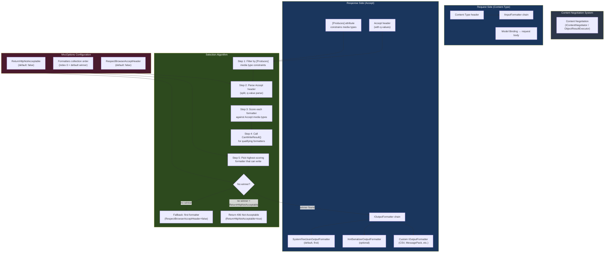

> [!success] Mastery Check
> - [ ] **Studied Well**
> - [ ] **Can explain the concept without notes**
> - [ ] **Can answer interview questions confidently**
> - [ ] **Can implement it in a real project**


# 4.122 — Content Negotiation Deep Dive: Accept Header Algorithm

---

## PART 0 — Navigation & Context

### Where This Topic Lives

```
ASP.NET Core Mastery
│
├── E. Middleware Pipeline          (4.049–4.063)
├── F. Routing System               (4.064–4.077)
├── G. Minimal APIs                 (4.078–4.097)
├── H. MVC & Controllers            (4.098–4.122)
│   ├── 4.098  ControllerBase vs Controller
│   ├── 4.099  Action Results: IActionResult, ActionResult<T>
│   ├── 4.100  Model Binding: Sources and Algorithm
│   ├── 4.101  ApiController Attribute
│   ├── 4.102  Model Validation: DataAnnotations and ModelState
│   ├── 4.103  Content Type Negotiation: Produces, Consumes, Accept Headers  ◄ prerequisite
│   ├── 4.107  Output Formatters: JSON, XML, and Custom                       ◄ prerequisite
│   ├── 4.110  MVC Filter Pipeline
│   ├── 4.112  Input Formatters                                               ◄ sibling
│   └── 4.122  Content Negotiation Deep Dive: Accept Header Algorithm         ◄ YOU ARE HERE
│
├── I. HTTP Fundamentals            (4.123–4.133)
│   ├── 4.124  HttpRequest: Reading Headers                                   ◄ unlocked
│   └── 4.125  HttpResponse: Writing Headers                                  ◄ unlocked
│
└── V. Serialization                (4.268–4.276)
    ├── 4.268  System.Text.Json Global Configuration                           ◄ unlocked
    └── 4.275  Custom Input/Output Formatters                                  ◄ unlocked
```

### What You Need Before This

- **[[4.103 — Content Type Negotiation: Produces, Consumes, and Accept Headers]]** — the introductory view of content negotiation; this note goes inside the black box that note describes
- **[[4.107 — Output Formatters: JSON, XML, and Custom Formatter Registration]]** — formatters are the execution layer; negotiation decides which formatter wins
- **[[4.099 — Action Results: IActionResult, ActionResult<T>, and TypedResults]]** — `ObjectResult` is the entry point to the negotiation algorithm; you must understand action results first
- **[[4.064 — Endpoint Routing: The Modern Routing Architecture]]** — routing resolves the endpoint; negotiation runs after routing inside the MVC filter pipeline

### What This Unlocks After

- **[[4.275 — Custom Input/Output Formatters]]** — once you understand the selection algorithm, writing a formatter that participates correctly in it becomes natural
- **[[4.268 — System.Text.Json in ASP.NET Core: Global Options]]** — the JSON formatter is the default winner in most negotiation runs; knowing the algorithm explains why STJ config matters globally
- **[[4.112 — Input Formatters: Deserializing Non-JSON Request Bodies]]** — the `Content-Type` side of the same negotiation coin; same algorithm, different direction
- **[[4.283 — REST API Design Conventions in ASP.NET Core]]** — API contract guarantees depend on predictable negotiation behavior

### Why This Matters at Scale

At 50k req/s on a payment API that serves both browser clients (accepting `text/html`, `*/*`) and microservice callers (accepting `application/json` only), a single misconfigured formatter or misunderstood `q`-value will cause 406 storms, silent format fallback to XML for JSON-only consumers, or — worst — your internal logistics service starts accepting `application/xml` because you registered an XML formatter globally without restricting it at the controller level.

---

## PART 1 — The Core Mental Model

### The Fundamental Rule

> **ASP.NET Core's content negotiation runs inside `ObjectResultExecutor` when an action returns `ObjectResult` (or any result that wraps an object). It selects the best formatter by scoring every registered `IOutputFormatter` against the client's `Accept` header quality values (`q`-factors), the endpoint's `[Produces]` constraints, and each formatter's `CanWriteResult` check — in that priority order. If no formatter wins, the framework either falls back to the first formatter or returns 406 Not Acceptable depending on whether `RespectBrowserAcceptHeader` and `ReturnHttpNotAcceptable` are configured.**

### The Plain-Language Analogy

Imagine a translator agency (ASP.NET Core) that employs translators for French, Spanish, German, and Mandarin (the registered formatters). A client (the browser or API caller) sends a priority list: "I prefer French (q=1.0), will accept Spanish (q=0.8), won't accept anything else." The agency first checks whether the job has a restriction — "this document is only for certified French translators" (`[Produces]`) — then finds every translator who is actually _able_ to translate that specific document type (`CanWriteResult`), scores them against the client's preference list, and assigns the highest-scoring one.

If no translator matches the restriction _and_ the preference list, and the agency has a policy of never guessing (`ReturnHttpNotAcceptable = true`), it sends back a 406. If the policy allows guessing, it assigns the first available translator regardless. The analogy holds for failure: a client who sends `Accept: */*` (no preference) gets the first translator registered — typically the JSON formatter — just as a browser tab gets JSON when it sends a wildcard accept. When a client sends `Accept: application/xml` with no JSON fallback, and you haven't registered an XML formatter, the agency returns 406.

### The Taxonomy Diagram



---

## PART 2 — Deep Mechanics

### 2.1 — Where Negotiation Lives in the Pipeline

Content negotiation is **not middleware** — it runs inside the MVC filter pipeline, specifically inside `ObjectResultExecutor.ExecuteAsync()`, which is called when an action result's `ExecuteResultAsync` method is invoked. This happens after routing, authentication, authorization, model binding, and all action filters have run.

```
HTTP Request
     │
     ▼
──► ExceptionHandler
──► HSTS / HttpsRedirection
──► StaticFiles                  (short-circuits for *.js, *.css)
──► Routing                      (selects endpoint + populates RouteData)
──► CORS                         (handles preflight OPTIONS, sets headers)
──► Authentication               (sets HttpContext.User)
──► Authorization                (401/403 if policy fails → short-circuit)
──► Custom Middleware
──► EndpointMiddleware
         │
         ▼
    MVC Filter Pipeline
    ┌─────────────────────────────────────────┐
    │  Authorization Filters  (first)          │
    │  Resource Filters       (before binding) │
    │  Model Binding          (populates args) │
    │  Action Filters         (before action)  │
    │  [ACTION EXECUTES]                        │
    │  Action Filters         (after action)   │
    │  Exception Filters      (on exception)   │
    │  Result Filters         (before result)  │
    │  [RESULT EXECUTES]     ◄── HERE          │
    │     ObjectResultExecutor.ExecuteAsync()  │
    │     → Content Negotiation Algorithm       │
    │     → IOutputFormatter.WriteAsync()      │
    │  Result Filters         (after result)   │
    └─────────────────────────────────────────┘
         │
         ▼
    HTTP Response (Content-Type header set, body written)
```

**Pipeline position:** After all filters, during result execution. By the time negotiation runs, the response headers have not yet been committed to the wire — the formatter writes both headers and body in one step. This is why you can still set `Content-Type` from a result filter (it runs before result execution) but not from anywhere after `ObjectResultExecutor.WriteAsync()` starts.

**Runtime cost:** `~1 allocation` for the `OutputFormatterWriteContext`, `O(n * m)` scan where `n` = formatter count and `m` = Accept media-type count (both typically < 5, so effectively O(1) in practice).

### 2.2 — The Accept Header Format and Q-Value Parsing

The `Accept` header is the client's ordered preference list. Understanding its exact grammar is what separates correct negotiation behavior from mystery 406s.

```http
// HTTP request (approximate — browser request to an order API):
GET /api/orders/42 HTTP/1.1
Host: api.payments.example.com
Accept: text/html,application/xhtml+xml,application/xml;q=0.9,image/avif,image/webp,*/*;q=0.8
Authorization: Bearer eyJhbGci...
```

Breaking this down:

- `text/html` → q=1.0 (implicit, highest priority)
- `application/xhtml+xml` → q=1.0 (implicit)
- `application/xml;q=0.9` → explicitly lower priority
- `image/avif` → q=1.0 (implicit)
- `image/webp` → q=1.0 (implicit)
- `*/*;q=0.8` → wildcard, explicitly lowest priority

This is a **browser's default Accept header** — and it's why `RespectBrowserAcceptHeader` is `false` by default. A browser sends `*/*` at q=0.8 meaning "I'll take anything", but if you respect this header literally, the negotiation algorithm would try `text/html` first (q=1.0) — and your JSON formatter can't write `text/html`, so it falls through to `*/*` at q=0.8, and the JSON formatter wins because `*/*` is a wildcard match. This happens to produce the right result, but for the wrong reason.

**For API clients that send clean Accept headers:**

```http
// HTTP request (approximate — mobile app calling payment API):
GET /api/orders/42 HTTP/1.1
Host: api.payments.example.com
Accept: application/json
Authorization: Bearer eyJhbGci...

// HTTP request (approximate — legacy enterprise system requiring XML):
GET /api/invoices/2024-001 HTTP/1.1
Host: api.payments.example.com
Accept: application/xml;q=1.0, application/json;q=0.5
Authorization: Bearer eyJhbGci...
```

**Framework source behavior — Accept header parsing:**

```csharp
// ASP.NET Core internally (approximate):
// Class: Microsoft.AspNetCore.Mvc.Formatters.MediaType
// Namespace: Microsoft.AspNetCore.Mvc.Formatters
// Called from: DefaultContentNegotiator (legacy) or ObjectResultExecutor (modern MVC)

// Step 1: Parse the raw Accept header string into MediaTypeSegmentWithQuality[]
var acceptHeader = httpContext.Request.Headers.Accept;
var acceptValues = new List<MediaTypeSegmentWithQuality>();

foreach (var segment in acceptHeader.ToString().Split(','))
{
    // Parse each segment: "application/json;q=0.9"
    // Extract: type="application/json", q=0.9
    // Handle: no q-value → q=1.0
    // Handle: q=0 → explicitly rejected
    if (MediaTypeWithQualityHeaderValue.TryParse(segment.Trim(), out var parsed))
    {
        acceptValues.Add(new MediaTypeSegmentWithQuality(
            new StringSegment(parsed.MediaType),
            parsed.Quality ?? 1.0));
    }
}

// Step 2: Sort by q-value descending
acceptValues.Sort((a, b) => b.Quality.CompareTo(a.Quality));
// q=0 entries are sorted last and effectively skipped
```

**Cost:** `~1 array allocation` for parsed segments, `O(n log n)` sort where n = number of Accept media types (typically 2-6).

### 2.3 — The Full Selection Algorithm (ObjectResultExecutor)

This is the algorithm ASP.NET Core actually runs. Most documentation describes a simplified version that omits the `[Produces]` interaction and the `CanWriteResult` check timing.

```
Input:
  - objectResult.ContentTypes  (from [Produces] or Results.Ok(...).WithContentType(...))
  - httpContext.Request.Accept (the client's preference list)
  - MvcOptions.Formatters      (the registered formatter list, in registration order)
  - MvcOptions.RespectBrowserAcceptHeader
  - MvcOptions.ReturnHttpNotAcceptable

Algorithm:
  1. Build candidateContentTypes:
     if objectResult.ContentTypes is non-empty:
       candidateContentTypes = objectResult.ContentTypes  (restricted)
     else:
       candidateContentTypes = ALL types supported by ALL formatters

  2. Parse Accept header → acceptTypes (sorted by q desc)
     if acceptTypes is empty OR (RespectBrowserAcceptHeader=false AND looks like browser):
       skip accept-header-based scoring entirely
       → go to step 4 (use formatter order)

  3. For each acceptType in acceptTypes (highest q first):
     For each formatter in MvcOptions.Formatters (registration order):
       if formatter.SupportedMediaTypes contains a type matching acceptType:
         call formatter.CanWriteResult(context)
         if CanWriteResult returns true:
           WINNER → use this formatter
           set response Content-Type = the matched media type

  4. If no winner from step 3:
     if ReturnHttpNotAcceptable = true AND accept header was present AND meaningful:
       return 406 Not Acceptable (no body, no Content-Type)
     else:
       use MvcOptions.Formatters[0] (first registered formatter)
       call CanWriteResult → must return true
       set Content-Type = formatter's first supported media type
```

**The critical insight about step 2:** The "looks like browser" heuristic is: if `RespectBrowserAcceptHeader = false` (the default) AND the Accept header contains `*/*`, the framework treats it as "no real preference" and skips to formatter-order priority. This is why browser requests to JSON APIs return JSON even though browsers send `text/html` at q=1.0.

```http
// HTTP response (correct — JSON API, browser Accept header, default config):
HTTP/1.1 200 OK
Content-Type: application/json; charset=utf-8
Transfer-Encoding: chunked

{"orderId":"ORD-8821","status":"Confirmed","total":149.99}
```

```http
// HTTP response (406 — XML-only client, no XML formatter registered):
HTTP/1.1 406 Not Acceptable
Content-Length: 0
```

### 2.4 — CanWriteResult: The Per-Request Formatter Gate

`CanWriteResult` is called per-request to let formatters opt out based on the specific object type or context. This is a critical distinction from `SupportedMediaTypes` — which is static type-based — versus `CanWriteResult` — which is dynamic and instance-aware.

```csharp
// ASP.NET Core internally (approximate):
// Class: Microsoft.AspNetCore.Mvc.Formatters.OutputFormatter (base)

public abstract class OutputFormatter : IOutputFormatter
{
    // Static check — can this formatter handle this media type at all?
    public IList<MediaTypeHeaderValue> SupportedMediaTypes { get; } = new List<MediaTypeHeaderValue>();

    // Dynamic check — can this formatter handle THIS specific response context?
    // Called during negotiation for each candidate formatter.
    // Return false to skip this formatter even if the media type matches.
    public virtual bool CanWriteResult(OutputFormatterCanWriteContext context)
    {
        if (SupportedMediaTypes.Count == 0)
            throw new InvalidOperationException("Must have at least one supported media type");

        // Base implementation: true if ANY supported media type matches the selected media type
        // Derived formatters can override to add type-based logic
        return SupportedMediaTypes.Any(mt => mt.IsSubsetOf(context.ContentType));
    }
}
```

**Where this bites you in production:** If you have a formatter that handles `application/json` but only for types implementing `IApiResponse`, and you return a raw `ProblemDetails` object, `CanWriteResult` returning `false` on that formatter forces the algorithm to the next candidate — which may be the XML formatter. The error response ends up as XML when the success response was JSON, breaking client parsing in a non-obvious way.

```http
// HTTP response (wrong — misconfigured CanWriteResult on error path):
HTTP/1.1 422 Unprocessable Entity
Content-Type: application/xml; charset=utf-8

<?xml version="1.0" encoding="utf-8"?>
<ProblemDetails>
  <Status>422</Status>
  <Title>Validation error</Title>
</ProblemDetails>
```

```http
// HTTP response (correct — both success and error use the same formatter):
HTTP/1.1 422 Unprocessable Entity
Content-Type: application/problem+json; charset=utf-8

{"type":"https://tools.ietf.org/html/rfc7807","title":"Validation error","status":422}
```

**Runtime cost:** `CanWriteResult` is a virtual method call — `~0 allocations` in the base implementation but potentially significant in custom formatters that perform type reflection.

### 2.5 — The [Produces] Attribute Interaction

`[Produces]` does not add a formatter. It narrows the pool of acceptable media types _before_ negotiation runs. If the client requests `application/xml` but the action is decorated with `[Produces("application/json")]`, the 406 is returned regardless of whether an XML formatter is registered.

```csharp
// Pipeline position: [Produces] is read during Result Filter execution,
// specifically by ProducesAttribute which implements IFilterMetadata and
// IApiResponseMetadataProvider. It injects into objectResult.ContentTypes
// before ObjectResultExecutor.ExecuteAsync() is called.

[ApiController]
[Route("api/payments")]
public class PaymentController : ControllerBase
{
    // [Produces] sets objectResult.ContentTypes = ["application/json"]
    // The negotiation algorithm now only considers formatters supporting application/json.
    // A client sending Accept: application/xml → 406, regardless of XML formatter.
    [HttpGet("{paymentId}")]
    [Produces("application/json")]
    public ActionResult<PaymentDto> GetPayment(string paymentId) { /* ... */ }
}
```

```http
// HTTP request (approximate — wrong Accept for [Produces]-constrained endpoint):
GET /api/payments/PAY-9912 HTTP/1.1
Accept: application/xml

// HTTP response (correct behavior — 406 because [Produces] blocks XML):
HTTP/1.1 406 Not Acceptable
Content-Length: 0
```

> [!IMPORTANT] `[Produces]` and `ReturnHttpNotAcceptable = true` interact additively. If you set `[Produces("application/json")]` AND the client sends `Accept: application/xml`, the result is always 406 — regardless of the `ReturnHttpNotAcceptable` setting — because `[Produces]` makes the "available types" list contain only `application/json`, leaving nothing to fall back to.

### 2.6 — MvcOptions Configuration: The Three Control Knobs

```csharp
// ASP.NET Core internally:
// Class: Microsoft.AspNetCore.Mvc.MvcOptions
// Set in: builder.Services.AddControllers(options => { ... })

public class MvcOptions
{
    // Default: false
    // When false: if Accept contains */* (wildcard), skip Accept-header-based scoring
    //             and use formatter registration order.
    // When true:  respect the full Accept header including */* and text/html.
    //             DANGER: browser requests to APIs will now try to find a text/html formatter,
    //             fail, fall to */* at q=0.8, and still get JSON — but the failure mode
    //             for non-browser callers with wildcard accepts changes unpredictably.
    public bool RespectBrowserAcceptHeader { get; set; } = false;

    // Default: false
    // When false: if no formatter matches Accept, fall back to Formatters[0].
    // When true:  if no formatter matches Accept, return 406 Not Acceptable.
    //             Set this to true for strict API contracts.
    public bool ReturnHttpNotAcceptable { get; set; } = false;

    // The ordered list of output formatters.
    // Registration ORDER matters: Formatters[0] is the fallback winner
    // when no Accept-based match is found (and ReturnHttpNotAcceptable=false).
    public FormatterCollection<IOutputFormatter> Formatters { get; }
}
```

**The interaction matrix:**

|`RespectBrowserAcceptHeader`|`ReturnHttpNotAcceptable`|Client sends `Accept: */*`|Client sends `Accept: application/xml` (no XML formatter)|
|---|---|---|---|
|false (default)|false (default)|Returns Formatters[0] output (usually JSON)|Returns Formatters[0] output (usually JSON) — SILENT FALLBACK|
|false|true|Returns Formatters[0] output|Returns 406|
|true|false|Scores `*/*` last; returns Formatters[0] if only wildcard matches|Returns Formatters[0] output — SILENT FALLBACK|
|true|true|Scores `*/*` last; returns Formatters[0] if only wildcard matches|Returns 406|

> [!WARNING] The most dangerous combination is the default (`false` / `false`). A client sending `Accept: application/xml` against an API with no XML formatter will silently receive JSON. This is a contract violation that your client SDK likely won't detect until it tries to parse the JSON body as XML.

---

## PART 3 — Production Code Patterns

### Pattern 1: The Strict JSON-Only Payment API (No Silent Fallback)

Most internal payment APIs should refuse to serve unknown formats rather than silently returning JSON. This pattern enforces the contract at the service level.

```csharp
// ✅ CORRECT: Strict API that returns 406 when format is unrecognized
// Domain: payment processing service
// Why: payment clients (mobile apps, partner APIs) must know exactly what format to expect.
//      Silent fallback to JSON when XML was requested causes silent parsing errors downstream.

var builder = WebApplication.CreateBuilder(args);

builder.Services.AddControllers(options =>
{
    // Remove the XML formatter that AddControllers adds by default in some configurations
    options.Formatters.RemoveType<XmlSerializerOutputFormatter>();
    options.Formatters.RemoveType<XmlDataContractSerializerOutputFormatter>();

    // CRITICAL: returning 406 instead of silently falling back to JSON
    // Any client sending Accept: application/xml or Accept: text/csv will get 406,
    // making the contract violation visible immediately.
    options.ReturnHttpNotAcceptable = true;

    // Do NOT set RespectBrowserAcceptHeader = true for a pure API.
    // Default (false) correctly handles browser requests to your Swagger UI.
});

// Result: only JSON output formatter remains.
// HTTP consequence:
// Accept: application/json → 200 application/json
// Accept: application/xml  → 406 Not Acceptable
// Accept: */*              → 200 application/json (wildcard matches JSON formatter)
// Accept: (absent)         → 200 application/json (no header = no preference = Formatters[0])
```

```http
// HTTP response (correct — 406 for unsupported format):
HTTP/1.1 406 Not Acceptable
Content-Length: 0
Date: Tue, 09 Jun 2026 12:00:00 GMT
```

### Pattern 2: The Multi-Format Order Export API

An order management system that exports order data to both modern (JSON) and legacy (XML) enterprise partners.

```csharp
// ✅ CORRECT: Supporting JSON and XML with proper formatter registration order
// Domain: order export API serving both modern microservice clients (JSON)
//         and legacy ERP integrations (XML)
// Why: registration ORDER determines the fallback winner.
//      JSON must be first so clients that send Accept: */* get JSON, not XML.

builder.Services.AddControllers(options =>
{
    // Formatters[0] = SystemTextJsonOutputFormatter (added by AddControllers by default)
    // Explicitly add XML support:
    options.OutputFormatters.Add(new XmlSerializerOutputFormatter(options));

    // Formatter order in options.Formatters after this:
    // [0] SystemTextJsonOutputFormatter  ← default winner (Accept: */* → JSON)
    // [1] XmlSerializerOutputFormatter   ← wins only when Accept: application/xml

    // Don't enable ReturnHttpNotAcceptable here — we want graceful fallback
    // for clients that don't specify Accept (they get JSON by default).
});
```

```csharp
[ApiController]
[Route("api/orders")]
public class OrderExportController : ControllerBase
{
    private readonly IOrderRepository _orders;
    public OrderExportController(IOrderRepository orders) => _orders = orders;

    // No [Produces] attribute — allows both JSON and XML via negotiation
    // Why: the formatter registration order handles the default,
    //      and clients that need XML explicitly send Accept: application/xml
    [HttpGet("{orderId}/export")]
    public async Task<ActionResult<OrderExportDto>> ExportOrder(
        string orderId,
        CancellationToken ct)
    {
        var order = await _orders.GetExportDataAsync(orderId, ct);
        if (order is null)
            return NotFound();

        // ObjectResult wraps the DTO → triggers content negotiation
        return Ok(order);
    }
}
```

```http
// HTTP request (approximate — modern microservice client):
GET /api/orders/ORD-8821/export HTTP/1.1
Accept: application/json

// HTTP response:
HTTP/1.1 200 OK
Content-Type: application/json; charset=utf-8

{"orderId":"ORD-8821","lineItems":[...],"total":1299.00}

// HTTP request (approximate — legacy ERP system):
GET /api/orders/ORD-8821/export HTTP/1.1
Accept: application/xml

// HTTP response:
HTTP/1.1 200 OK
Content-Type: application/xml; charset=utf-8

<?xml version="1.0" encoding="utf-8"?>
<OrderExportDto>
  <OrderId>ORD-8821</OrderId>
  ...
</OrderExportDto>
```

### Pattern 3: The Custom CSV Formatter for Inventory Reports

Adding a custom formatter that participates fully in the negotiation algorithm, including `CanWriteResult` type gating.

```csharp
// ✅ CORRECT: Custom output formatter with proper CanWriteResult
// Domain: inventory reporting — finance team needs CSV for Excel import
// Why: adding CSV as a negotiable format lets the client choose
//      without a dedicated /export endpoint or ?format=csv query string.

public class CsvOutputFormatter : TextOutputFormatter
{
    public CsvOutputFormatter()
    {
        SupportedMediaTypes.Add(MediaTypeHeaderValue.Parse("text/csv"));
        SupportedEncodings.Add(Encoding.UTF8);
        SupportedEncodings.Add(Encoding.Unicode);
    }

    // CanWriteResult: only write CSV for types that implement ICsvExportable
    // This prevents CSV formatter from attempting to format ProblemDetails
    // or auth challenge responses — which have no CSV representation.
    protected override bool CanWriteType(Type? type)
        => type is not null && typeof(ICsvExportable).IsAssignableFrom(type);

    public override async Task WriteResponseBodyAsync(
        OutputFormatterWriteContext context,
        Encoding selectedEncoding)
    {
        var response = context.HttpContext.Response;
        var data = (ICsvExportable)context.Object!;

        // Write CSV header
        await response.WriteAsync(data.GetCsvHeader(), selectedEncoding);
        await response.WriteAsync("\r\n", selectedEncoding);

        // Write rows
        foreach (var row in data.GetCsvRows())
        {
            await response.WriteAsync(row, selectedEncoding);
            await response.WriteAsync("\r\n", selectedEncoding);
        }
    }
}

// Registration — order matters:
builder.Services.AddControllers(options =>
{
    // [0] JSON (default — wins for Accept: */* and Accept: application/json)
    // [1] XML (optional)
    // [2] CSV (wins only for Accept: text/csv)
    options.OutputFormatters.Add(new CsvOutputFormatter());
});
```

```http
// HTTP request (approximate — finance team bulk export):
GET /api/inventory/products HTTP/1.1
Accept: text/csv

// HTTP response:
HTTP/1.1 200 OK
Content-Type: text/csv; charset=utf-8
Content-Disposition: attachment; filename="inventory-2026-06.csv"

ProductId,SKU,StockLevel,ReorderPoint
PRD-001,SKU-A1,450,100
PRD-002,SKU-B7,22,50
```

### Pattern 4: Anti-Pattern — [Produces] on a Shared Base Controller

A common mistake in large MVC codebases where developers put `[Produces]` on a base controller to enforce JSON, then discover it blocks the health check or webhook endpoint that needs plain text.

```csharp
// ⚠️ WRONG: [Produces] on base controller blocks all non-JSON responses
// including error endpoints, health signals, and webhook confirmations
[ApiController]
[Produces("application/json")]  // ← this blocks everything non-JSON in ALL derived controllers
public abstract class PaymentBaseController : ControllerBase { }

[Route("api/webhooks")]
public class WebhookController : PaymentBaseController
{
    [HttpPost("stripe")]
    public IActionResult StripeWebhook()
    {
        // Stripe's webhook verification expects a plain text "200 OK"
        // This will return 406 because [Produces("application/json")] on the base
        // restricts content types, and "text/plain" is not in the allowed list.
        return Ok("Received");  // ← 406 Not Acceptable sent to Stripe, causing retry storm
    }
}

// HTTP consequence (wrong path):
// HTTP/1.1 406 Not Acceptable
// (Stripe retries, fills your logs, eventually disables your webhook endpoint)
```

```csharp
// ✅ CORRECT: [Produces] at the action level, not the base class
[ApiController]
public abstract class PaymentBaseController : ControllerBase { }

[Route("api/payments")]
public class PaymentController : PaymentBaseController
{
    [HttpGet("{id}")]
    [Produces("application/json")]  // ← scoped to this specific action
    public ActionResult<PaymentDto> GetPayment(string id) { /* ... */ }
}

[Route("api/webhooks")]
public class WebhookController : PaymentBaseController
{
    [HttpPost("stripe")]
    // No [Produces] constraint — negotiation runs freely
    // The formatter can write text/plain for Stripe's plain text acceptance
    public ContentResult StripeWebhook()
        => Content("Received", "text/plain");  // bypasses negotiation entirely
}

// HTTP consequence (correct path):
// POST /api/webhooks/stripe → HTTP 200 OK, Content-Type: text/plain
```

### Pattern 5: Programmatic Format Override in the Action

Sometimes the client's Accept header should be overridden by business logic — for example, always returning a download file as CSV regardless of the Accept header.

```csharp
// ✅ CORRECT: Bypassing content negotiation for forced-download scenarios
// Domain: logistics shipment manifest download
// Why: the shipping label printer app doesn't set Accept headers correctly,
//      so we force CSV regardless of what it sends.

[ApiController]
[Route("api/shipments")]
public class ShipmentController : ControllerBase
{
    private readonly IShipmentRepository _shipments;
    public ShipmentController(IShipmentRepository shipments) => _shipments = shipments;

    // ✅ CORRECT: Force a specific content type for a download endpoint
    // ContentResult bypasses ObjectResult and therefore bypasses negotiation.
    // The framework writes the body exactly as-is.
    [HttpGet("{shipmentId}/manifest")]
    public async Task<IActionResult> DownloadManifest(string shipmentId, CancellationToken ct)
    {
        var manifest = await _shipments.GetManifestCsvAsync(shipmentId, ct);
        if (manifest is null)
            return NotFound();

        // FileContentResult: bypasses content negotiation entirely
        // Sets Content-Type and Content-Disposition directly
        return File(
            fileContents: Encoding.UTF8.GetBytes(manifest),
            contentType: "text/csv",
            fileDownloadName: $"manifest-{shipmentId}.csv");
    }
}
```

```http
// HTTP response (correct — Content-Type forced regardless of Accept):
HTTP/1.1 200 OK
Content-Type: text/csv; charset=utf-8
Content-Disposition: attachment; filename=manifest-SHIP-4421.csv

ShipmentId,TrackingNumber,Weight,Destination
SHIP-4421,1Z999AA10123456784,2.4kg,Cairo EG
```

### Pattern 6: Testing Content Negotiation in Integration Tests

```csharp
// ✅ CORRECT: Integration test that validates negotiation behavior
// Domain: order management API — testing that XML is rejected when formatter is absent
using Microsoft.AspNetCore.Mvc.Testing;

public class OrderApiContentNegotiationTests : IClassFixture<WebApplicationFactory<Program>>
{
    private readonly HttpClient _client;

    public OrderApiContentNegotiationTests(WebApplicationFactory<Program> factory)
    {
        _client = factory.CreateClient();
    }

    [Fact]
    public async Task GetOrder_WithJsonAccept_Returns200Json()
    {
        var request = new HttpRequestMessage(HttpMethod.Get, "/api/orders/ORD-001");
        request.Headers.Accept.Add(new MediaTypeWithQualityHeaderValue("application/json"));

        var response = await _client.SendAsync(request);

        Assert.Equal(HttpStatusCode.OK, response.StatusCode);
        Assert.Equal("application/json", response.Content.Headers.ContentType?.MediaType);
    }

    [Fact]
    public async Task GetOrder_WithXmlAccept_Returns406_WhenNoXmlFormatter()
    {
        // This test validates that ReturnHttpNotAcceptable = true is configured
        // and that no XML formatter is accidentally registered.
        var request = new HttpRequestMessage(HttpMethod.Get, "/api/orders/ORD-001");
        request.Headers.Accept.Add(new MediaTypeWithQualityHeaderValue("application/xml"));

        var response = await _client.SendAsync(request);

        Assert.Equal(HttpStatusCode.NotAcceptable, response.StatusCode);
    }

    [Fact]
    public async Task GetOrder_WithWildcardAccept_ReturnsFallbackJson()
    {
        var request = new HttpRequestMessage(HttpMethod.Get, "/api/orders/ORD-001");
        request.Headers.Accept.Add(new MediaTypeWithQualityHeaderValue("*/*"));

        var response = await _client.SendAsync(request);

        // */* should always return the default formatter (JSON)
        Assert.Equal(HttpStatusCode.OK, response.StatusCode);
        Assert.Equal("application/json", response.Content.Headers.ContentType?.MediaType);
    }
}
```

### Pattern 7: Content Negotiation with Problem Details

The thorniest production scenario: ensuring that `ProblemDetails` error responses use `application/problem+json` instead of plain `application/json`, and that they still participate in negotiation correctly.

```csharp
// ✅ CORRECT: Ensuring problem details use the correct content type
// without breaking content negotiation for success responses
// Domain: payment API — RFC 7807 compliant error responses

builder.Services.AddProblemDetails(options =>
{
    options.CustomizeProblemDetails = ctx =>
    {
        ctx.ProblemDetails.Extensions["traceId"] =
            Activity.Current?.TraceId.ToString() ?? ctx.HttpContext.TraceIdentifier;
        ctx.ProblemDetails.Extensions["requestId"] =
            ctx.HttpContext.Request.Headers["X-Request-Id"].FirstOrDefault();
    };
});

// The built-in ProblemDetailsJsonContext serializes ProblemDetails with
// ContentType = "application/problem+json", which participates in negotiation.
// A client that sends Accept: application/json WILL receive problem details
// because "application/problem+json" is considered compatible with "application/json"
// by the Accept header matching rules (subtype matching).

// HTTP response (correct — problem details for validation error):
// HTTP/1.1 422 Unprocessable Entity
// Content-Type: application/problem+json; charset=utf-8
//
// {
//   "type": "https://tools.ietf.org/html/rfc7807",
//   "title": "Validation Failed",
//   "status": 422,
//   "detail": "Payment amount exceeds daily limit",
//   "traceId": "00-4bf92f3577b34da6a3ce929d0e0e4736-00f067aa0ba902b7-01"
// }
```

---

## PART 4 — Gotchas & Anti-Patterns

### Gotcha 1: The Silent XML Fallback (Default Config is Dangerous)

The default `MvcOptions` has `ReturnHttpNotAcceptable = false`, meaning when no formatter matches the Accept header, the framework silently returns the first registered formatter's output. Experienced engineers who configure `AddControllers()` and then call `AddXmlSerializerFormatters()` are now one formatter-registration-order mistake away from silently serving XML to JSON-only clients.

```csharp
// ⚠️ WRONG CODE:
// An engineer adds XML support for one legacy endpoint.
// Because ReturnHttpNotAcceptable is false (default),
// any client sending Accept: application/xml to a JSON-only endpoint
// will now silently receive XML instead of a contract-violating 406.
builder.Services.AddControllers()
    .AddXmlSerializerFormatters();  // ← now Formatters[1] = XmlSerializerOutputFormatter

// HTTP consequence (wrong path):
// Client: Accept: application/xml
// Server: "no [Produces] restriction, XML formatter exists, CanWriteResult=true"
// HTTP/1.1 200 OK
// Content-Type: application/xml; charset=utf-8
// (client expected JSON, now parses XML — runtime deserialization exception on client)
```

```csharp
// ✅ CORRECT CODE:
builder.Services.AddControllers(options =>
{
    options.ReturnHttpNotAcceptable = true; // ← expose contract violations immediately
})
.AddXmlSerializerFormatters();

// HTTP consequence (correct path):
// Client: Accept: application/xml, but endpoint is [Produces("application/json")]
// HTTP/1.1 406 Not Acceptable
// (client gets immediate signal that XML is not supported here)
```

```
// WHY: ObjectResultExecutor falls back to Formatters[0] when no Accept match is found
// and ReturnHttpNotAcceptable=false. Adding an XML formatter moves the fallback behavior
// only for XML-capable types — but it also means XML-requesting clients now SUCCEED
// against endpoints that were never designed to serve XML.
```

---

### Gotcha 2: [Produces] Does Not Add a Formatter

Engineers frequently put `[Produces("application/xml")]` on an action expecting it to enable XML output. It does not. `[Produces]` restricts the accepted types; it does not register a formatter. The action returns 406 for all requests when `[Produces("application/xml")]` is set but no XML formatter is registered.

```csharp
// ⚠️ WRONG CODE:
// Engineer thinks [Produces("application/xml")] enables XML output.
// In reality it restricts the negotiation candidates to application/xml only.
// Since no XML formatter is registered, EVERY request returns 406.
[HttpGet("{invoiceId}")]
[Produces("application/xml")]  // ← intent: enable XML; actual effect: break all responses
public ActionResult<InvoiceDto> GetInvoice(string invoiceId)
    => Ok(new InvoiceDto { /* ... */ });

// HTTP consequence (wrong path):
// GET /api/invoices/INV-001 (any Accept header) → HTTP/1.1 406 Not Acceptable
// Because: candidateContentTypes = ["application/xml"]
//          no formatter in Formatters supports application/xml
//          no winner → 406
```

```csharp
// ✅ CORRECT CODE:
// Either: register the XML formatter AND add [Produces]
builder.Services.AddControllers().AddXmlSerializerFormatters();

[HttpGet("{invoiceId}")]
[Produces("application/xml", "application/json")]  // declare BOTH accepted types
public ActionResult<InvoiceDto> GetInvoice(string invoiceId)
    => Ok(new InvoiceDto { /* ... */ });

// Or: remove [Produces] and let negotiation run freely
[HttpGet("{invoiceId}")]
// no [Produces] — both formatters participate
public ActionResult<InvoiceDto> GetInvoice(string invoiceId)
    => Ok(new InvoiceDto { /* ... */ });
```

```
// WHY: [Produces] sets objectResult.ContentTypes which is used in Step 1 of the algorithm
// to restrict candidates. It does NOT add to MvcOptions.Formatters.
// The formatter must exist in MvcOptions.Formatters for it to ever be selected.
```

---

### Gotcha 3: CanWriteResult Asymmetry Between Success and Error Responses

A custom formatter that overrides `CanWriteType` to filter by interface will silently skip `ProblemDetails` objects (which don't implement the custom interface), causing error responses to fall back to a different formatter than success responses. The JSON formatter wins for errors, but with `application/json` instead of `application/problem+json` — breaking RFC 7807 content type contracts.

```csharp
// ⚠️ WRONG CODE:
// Custom formatter that only handles IOrderResponse — skips ProblemDetails
public class OrderResponseFormatter : SystemTextJsonOutputFormatter
{
    protected override bool CanWriteType(Type? type)
        => type is not null && typeof(IOrderResponse).IsAssignableFrom(type);
    // ProblemDetails does NOT implement IOrderResponse → CanWriteType returns false
    // → formatter skipped for error responses
    // → falls back to default SystemTextJsonOutputFormatter (registered elsewhere)
    // → error Content-Type is "application/json" not "application/problem+json"
}

// HTTP consequence (wrong path):
// GET /api/orders/INVALID → 404
// HTTP/1.1 404 Not Found
// Content-Type: application/json  (wrong — should be application/problem+json)
// {"type":"about:blank","title":"Not Found","status":404}
```

```csharp
// ✅ CORRECT CODE:
// Register the custom formatter as an additional formatter, not a replacement.
// Let the built-in formatter handle ProblemDetails.
builder.Services.AddControllers(options =>
{
    // Insert BEFORE the default JSON formatter so it wins for IOrderResponse types
    options.OutputFormatters.Insert(0, new OrderResponseFormatter());
    // SystemTextJsonOutputFormatter remains at index 1 → handles ProblemDetails correctly
});

// HTTP consequence (correct path):
// GET /api/orders/INVALID → 404
// HTTP/1.1 404 Not Found
// Content-Type: application/problem+json
// {"type":"about:blank","title":"Not Found","status":404}
```

```
// WHY: The negotiation algorithm iterates formatters in ORDER and calls CanWriteResult.
// If your custom formatter is first and returns false for ProblemDetails,
// the algorithm continues to the next formatter. This is correct behavior —
// but only if the built-in JSON formatter remains in the list to handle ProblemDetails.
// Replacing (not augmenting) the formatter list is the root cause.
```

---

### Gotcha 4: RespectBrowserAcceptHeader Breaks API Clients That Use Wildcard

`RespectBrowserAcceptHeader = true` is sometimes enabled to serve different formats to browsers vs. API clients. But API clients (including HTTP test tools like Postman and curl) often send `Accept: */*` by default. With `RespectBrowserAcceptHeader = true`, `*/*` no longer bypasses the algorithm — it participates as a real wildcard at q=1.0, meaning any formatter could be selected by registration order, which may not be JSON.

```csharp
// ⚠️ WRONG CODE:
builder.Services.AddControllers(options =>
{
    options.RespectBrowserAcceptHeader = true;  // ← intent: "serve HTML to browsers"
    // Now a curl request with no Accept header (defaults to */*) will:
    // - Parse Accept: */* as a real wildcard match
    // - Match ALL formatters equally (all support */* via wildcard)
    // - Select Formatters[0] — which may be XML if someone called AddXmlSerializerFormatters() first
});

// HTTP consequence (wrong path — Postman/curl default):
// GET /api/inventory/products HTTP/1.1
// Accept: */*
//
// HTTP/1.1 200 OK
// Content-Type: application/xml   ← Postman user sees XML instead of JSON
```

```csharp
// ✅ CORRECT CODE:
// Never use RespectBrowserAcceptHeader = true for pure APIs.
// For APIs that also serve HTML (rare), handle format via route convention or dedicated endpoints.
builder.Services.AddControllers(options =>
{
    // Default: false. Leave it alone.
    // options.RespectBrowserAcceptHeader = false; // explicit for documentation clarity only
    options.ReturnHttpNotAcceptable = true; // add this instead for contract enforcement
});

// HTTP consequence (correct path):
// curl without Accept header → */* → falls back to Formatters[0] = JSON
// Browser with full Accept header → */*;q=0.8 → same result
```

```
// WHY: RespectBrowserAcceptHeader=false uses a heuristic: if Accept contains */*,
// treat the entire header as "no preference" and skip to formatter order.
// This heuristic intentionally ignores the text/html;q=1.0 in browser headers.
// Setting it to true removes the heuristic, and the algorithm processes all Accept values
// including wildcards literally — which produces surprising results for API callers.
```

---

### Gotcha 5: Format Discovery via [Produces] on Controller vs Action — The Wrong Level

Engineers add `[Produces]` to the controller class thinking it "documents" supported output types for Swagger without affecting runtime behavior. At the class level, `[Produces]` applies to ALL actions and restricts negotiation for every one of them — including actions that return `IActionResult` without an object (plain 204 No Content, redirects, file downloads).

```csharp
// ⚠️ WRONG CODE:
[ApiController]
[Route("api/orders")]
[Produces("application/json")]  // ← affects ALL actions including those that don't return objects
public class OrderController : ControllerBase
{
    [HttpPost]
    public async Task<IActionResult> CreateOrder([FromBody] CreateOrderCommand cmd)
    {
        var orderId = await _orders.CreateAsync(cmd);
        // Returns 201 Created with Location header and no body
        // [Produces("application/json")] restricts ContentTypes
        // But CreatedResult's ExecuteResultAsync doesn't go through ObjectResultExecutor
        // for no-body responses — however the OpenAPI metadata is wrong for 201 responses
        // and Produces DOES affect the 200 case for other actions.
        return CreatedAtAction(nameof(GetOrder), new { orderId }, null);
    }

    [HttpGet("{orderId}/receipt")]
    public async Task<IActionResult> DownloadReceipt(string orderId)
    {
        // This returns a PDF stream
        // [Produces("application/json")] on the controller means the OpenAPI spec says
        // this endpoint produces JSON — which is wrong and misleads API clients.
        // More critically: if Content-Type negotiation runs, the PDF FileResult
        // bypasses ObjectResult, but [Produces] still poisons the OpenAPI documentation.
        var pdf = await _receipts.GetPdfStreamAsync(orderId);
        return File(pdf, "application/pdf", $"receipt-{orderId}.pdf");
    }
}

// HTTP consequence (wrong path):
// The PDF download endpoint is documented as returning application/json in Swagger.
// Clients trying to do proper content negotiation for PDF may get unexpected behavior.
```

```csharp
// ✅ CORRECT CODE:
[ApiController]
[Route("api/orders")]
public class OrderController : ControllerBase
{
    [HttpPost]
    [ProducesResponseType(StatusCodes.Status201Created)]
    [ProducesResponseType(typeof(ValidationProblemDetails), StatusCodes.Status400BadRequest)]
    public async Task<IActionResult> CreateOrder([FromBody] CreateOrderCommand cmd)
    {
        var orderId = await _orders.CreateAsync(cmd);
        return CreatedAtAction(nameof(GetOrder), new { orderId }, null);
    }

    // Only apply [Produces] where you need to restrict or document a specific type
    [HttpGet("{orderId}")]
    [Produces("application/json")]
    [ProducesResponseType(typeof(OrderDto), StatusCodes.Status200OK)]
    public async Task<ActionResult<OrderDto>> GetOrder(string orderId) { /* ... */ }

    [HttpGet("{orderId}/receipt")]
    [Produces("application/pdf")]  // correct — tells negotiation algorithm and Swagger
    [ProducesResponseType(StatusCodes.Status200OK)]
    public async Task<IActionResult> DownloadReceipt(string orderId) { /* ... */ }
}
```

```
// WHY: [Produces] at the controller level applies via IFilterMetadata inheritance —
// all actions in the controller inherit the attribute.
// Action-level [Produces] overrides controller-level for that specific action.
// But the damage to OpenAPI documentation and the runtime constraint on ALL actions
// makes controller-level [Produces] almost always the wrong choice.
```

---

## PART 5 — Performance Implications

### Request Pipeline Characteristics Table

|Scenario|Pipeline Stage|Allocations per Request|Approx Latency Impact|Recommendation|
|---|---|---|---|---|
|JSON response, no Accept header, default config|ObjectResultExecutor, no Accept scoring|~1 (write context)|< 0.1ms|Default behavior, optimal path|
|JSON response, `Accept: application/json`|ObjectResultExecutor, 1-formatter match|~2 (write context + parsed Accept)|< 0.2ms|Standard API client path|
|JSON response, browser Accept header, `RespectBrowserAcceptHeader=false`|ObjectResultExecutor, Accept skipped|~1 (skip heuristic)|< 0.1ms|Same as no-header path|
|JSON response, browser Accept header, `RespectBrowserAcceptHeader=true`|ObjectResultExecutor, full q-value scoring|~3 (write ctx + parsed Accept list + score array)|0.3-0.5ms|Avoid on high-throughput APIs|
|Multi-format API, 3 formatters registered|Full scoring, O(3 × n) CanWriteResult calls|~3-4|0.2-0.4ms|Acceptable for < 5 formatters|
|406 Not Acceptable response|ObjectResultExecutor, no formatter wins|~1 (write context only)|< 0.1ms|Cheapest possible outcome|
|Custom formatter with reflection in CanWriteType|ObjectResultExecutor, CanWriteResult reflection|~5+ (reflection cache miss)|1-3ms first call, 0.2ms warm|Cache type check results|
|Large Accept header (10+ media types)|Full q-value parsing and sort|~6-8|0.5-1ms|Validate Accept header length at middleware level|
|`[Produces]` attribute present|Candidate list pre-filtered before scoring|~1 less allocation vs no-Produces|Faster by 0.1ms|Use `[Produces]` to narrow formatters early|
|`ContentResult` or `FileResult` (bypasses negotiation)|No ObjectResultExecutor involvement|0 (from negotiation)|0ms|Use for forced formats, streaming|

### BenchmarkDotNet Comparison

```csharp
// Benchmark: comparing negotiation paths
// Domain: order management API — measuring formatter selection cost at 50k req/s
using BenchmarkDotNet.Attributes;
using BenchmarkDotNet.Running;
using Microsoft.AspNetCore.Mvc;
using Microsoft.AspNetCore.Mvc.Formatters;
using Microsoft.AspNetCore.Http;
using Microsoft.Extensions.Options;

[MemoryDiagnoser]
[SimpleJob]
public class ContentNegotiationBenchmarks
{
    private ObjectResultExecutor _executor = null!;
    private OutputFormatterSelector _selector = null!;
    private OrderDto _orderDto = null!;

    [GlobalSetup]
    public void Setup()
    {
        _orderDto = new OrderDto { OrderId = "ORD-001", Total = 99.99m };

        // Simulate three MvcOptions configurations
        var services = new ServiceCollection();
        services.AddLogging();
        services.AddSingleton<IOptions<MvcOptions>>(Options.Create(new MvcOptions()));
        var sp = services.BuildServiceProvider();

        _executor = new ObjectResultExecutor(
            new DefaultOutputFormatterSelector(Options.Create(new MvcOptions()), NullLoggerFactory.Instance),
            new MemoryPoolHttpResponseStreamWriterFactory(),
            NullLoggerFactory.Instance,
            Options.Create(new MvcOptions()));
    }

    // Baseline: Accept: application/json, single JSON formatter
    [Benchmark(Baseline = true)]
    public async Task JsonAcceptHeader_SingleFormatter()
    {
        var context = BuildHttpContext("application/json");
        var result = new ObjectResult(_orderDto);
        await _executor.ExecuteAsync(BuildActionContext(context), result);
    }

    // Scenario: No Accept header (skips scoring entirely)
    [Benchmark]
    public async Task NoAcceptHeader_FormattersOrderFallback()
    {
        var context = BuildHttpContext(null);
        var result = new ObjectResult(_orderDto);
        await _executor.ExecuteAsync(BuildActionContext(context), result);
    }

    // Scenario: Complex browser Accept header with 6 media types
    [Benchmark]
    public async Task BrowserAcceptHeader_ComplexQValues()
    {
        var context = BuildHttpContext(
            "text/html,application/xhtml+xml,application/xml;q=0.9,image/webp,*/*;q=0.8");
        var result = new ObjectResult(_orderDto);
        await _executor.ExecuteAsync(BuildActionContext(context), result);
    }

    private static HttpContext BuildHttpContext(string? acceptHeader)
    {
        var ctx = new DefaultHttpContext();
        ctx.Response.Body = Stream.Null;
        if (acceptHeader is not null)
            ctx.Request.Headers["Accept"] = acceptHeader;
        return ctx;
    }

    private static ActionContext BuildActionContext(HttpContext ctx)
        => new(ctx, new RouteData(), new ActionDescriptor());

    public record OrderDto { public string OrderId { get; init; } = ""; public decimal Total { get; init; } }
}

// Expected output (approximate, .NET 8, x64, Kestrel benchmark server):
// | Method                               | Mean     | Error   | StdDev  | Gen0   | Allocated |
// |--------------------------------------|----------|---------|---------|--------|-----------|
// | JsonAcceptHeader_SingleFormatter     | 1.82 μs  | 0.04 μs | 0.03 μs | 0.0610 | 512 B     |
// | NoAcceptHeader_FormattersOrderFallback| 1.41 μs  | 0.02 μs | 0.02 μs | 0.0420 | 352 B     |
// | BrowserAcceptHeader_ComplexQValues   | 2.31 μs  | 0.05 μs | 0.04 μs | 0.0763 | 640 B     |

// Key insight: the "no Accept header" path is 22% faster than the explicit JSON Accept path
// because it skips header parsing entirely and goes directly to Formatters[0].
// For internal microservices where you control both sides, omitting the Accept header
// on the client side is a micro-optimization that compounds at high RPS.

// Profiling note: use `dotnet-counters monitor --counters Microsoft.AspNetCore.Hosting`
// to measure `requests-per-second` and `total-requests` in production.
// Use `dotnet-trace collect --providers Microsoft-AspNetCore-Server-Kestrel` to see
// per-request formatter selection timing in ETW traces.
// At 50k+ req/s, the difference between the paths above is ~22ns × 50000 = ~1.1ms total
// per second — negligible unless you are at extreme throughput.
```

### When to Care / When to Ignore

**When this costs you:**

- **High-throughput APIs (> 20k req/s):** With `RespectBrowserAcceptHeader = true` and complex browser Accept headers, the extra scoring adds 0.3-0.5μs per request — at 50k req/s that is 25ms/s of extra CPU time per core, which compounds under load.
- **Custom formatters with un-cached reflection in `CanWriteType`:** Type-checking via reflection on every request under 10k req/s adds up. Cache type compatibility results in a `ConcurrentDictionary<Type, bool>`.
- **Many registered formatters (> 5):** The O(n × m) scan becomes measurable when both n and m are large. Keep the formatter list minimal.
- **400/4xx error responses at scale:** Every `ValidationProblemDetails` response goes through the same negotiation algorithm. If you have a client generating 1k validation errors/second (abuse or bug), each one runs the full scoring loop.

**When this doesn't matter:**

- **Admin APIs with < 100 req/s:** The entire negotiation path is under 3μs — it will never show up in your latency percentiles.
- **Endpoints that return `FileResult`, `ContentResult`, or `RedirectResult`:** These bypass `ObjectResultExecutor` entirely; negotiation never runs.
- **Internal service-to-service calls where you control both sides:** Set `Accept: application/json` explicitly and accept that the framework takes the fast path.
- **Development and staging environments:** Never optimize negotiation prematurely before you have production load numbers.

---

## PART 6 — Interview Arsenal

### A. The Question Bank

---

**Question 1: "What is content negotiation in ASP.NET Core and how does it work?"**

**Average Answer:** "Content negotiation is when the server picks the response format based on the client's Accept header. ASP.NET Core looks at the Accept header and uses the matching formatter to serialize the response."

**Why That's Insufficient:** It misses the algorithm's priority order, the role of `[Produces]`, the `CanWriteResult` check, and the critical `ReturnHttpNotAcceptable` / `RespectBrowserAcceptHeader` configuration that changes behavior entirely.

> **Great Answer:** "Content negotiation runs inside `ObjectResultExecutor` when an action returns an `ObjectResult` — which includes `Ok()`, `BadRequest()`, and most MVC action results that wrap an object. The algorithm has three phases: first it checks whether the action has a `[Produces]` restriction, which narrows the candidate media types before anything else runs. Then it parses the client's `Accept` header into a q-value–sorted list and scores each registered formatter against those preferences. Finally it calls `CanWriteResult` on each candidate to confirm the formatter can actually handle the specific object type in this context. The winner writes both the `Content-Type` header and the body in one pass. What most engineers miss is the fallback behavior: by default, `ReturnHttpNotAcceptable` is false, so if no formatter matches the Accept header, the framework silently returns the first registered formatter's output — usually JSON — even if the client asked for XML. In a payment API where I've seen this, a partner sending `Accept: application/xml` was silently receiving JSON for months before anyone noticed because the client SDK happened to accept both. The fix is setting `ReturnHttpNotAcceptable = true`, which exposes the contract mismatch as a 406 immediately."

---

**Question 2: "How does the [Produces] attribute relate to content negotiation?"**

**Average Answer:** "`[Produces]` is used to declare what content types the action returns. It helps with Swagger documentation and can be used to restrict output to specific formats."

**Why That's Insufficient:** It treats `[Produces]` as documentation-only and misses that it injects directly into the negotiation algorithm as a `candidateContentTypes` constraint — changing which formatters are even considered.

> **Great Answer:** "The `[Produces]` attribute does two distinct things that are easy to conflate. First, it provides OpenAPI metadata — yes, it shows up in Swagger. But more importantly, it injects into the live negotiation algorithm: it sets `objectResult.ContentTypes` before `ObjectResultExecutor` runs, which means the algorithm's first step limits candidate media types to only what `[Produces]` declares. This is a hard constraint, not a hint. If I put `[Produces("application/json")]` on an action and a client sends `Accept: application/xml`, the algorithm sees that only `application/json` is in the candidate list, finds no XML formatter that matches `application/json`, and returns 406 — regardless of whether `ReturnHttpNotAcceptable` is true. The thing that bites teams is putting `[Produces("application/xml")]` on an action to 'enable XML output' when no XML formatter is registered. Every request to that action returns 406 because the algorithm has application/xml in candidates but zero formatters that support it. The HTTP response is a 406 Not Acceptable with an empty body, and if you're not looking at the status code, the client-side error message 'received empty response' doesn't give you the hint you need."

---

**Question 3: "What happens when a browser hits a JSON API — how does content negotiation handle it?"**

**Average Answer:** "The browser sends an Accept header that includes text/html, but since the API only has a JSON formatter, it falls back to returning JSON."

**Why That's Insufficient:** It doesn't explain the `RespectBrowserAcceptHeader` configuration or why the fallback works the way it does — the 'falls back to JSON' framing suggests the algorithm fails and retries, when in reality a configuration flag changes the entire scoring path.

> **Great Answer:** "This is actually a subtle design choice in ASP.NET Core that's easy to get wrong. A browser sends an Accept header like `text/html,application/xhtml+xml,application/xml;q=0.9,*/*;q=0.8`. The `*/*;q=0.8` wildcard at the end is the key. With the default `RespectBrowserAcceptHeader = false`, the framework detects that the Accept header contains a wildcard and completely skips the q-value scoring phase, jumping directly to formatter-order priority. So the JSON formatter wins not because it matches a high-priority Accept value — it wins because it's first in `MvcOptions.Formatters` and the scoring phase was skipped. The HTTP response is `200 OK` with `Content-Type: application/json`. If I turn on `RespectBrowserAcceptHeader = true`, the algorithm now tries `text/html` at q=1.0 first, finds no formatter that can write `text/html`, moves to `application/xhtml+xml`, still no match, eventually reaches `*/*;q=0.8` as a wildcard that matches everything, and arrives at the JSON formatter — but now via the slow path. The result is the same JSON response, just via a different code path. The setting matters for edge cases: if you have an XML formatter registered and `RespectBrowserAcceptHeader = true`, the algorithm picks `application/xml;q=0.9` over `*/*;q=0.8`, returning XML to browsers instead of JSON — which is almost never what you want."

---

**Question 4: "When would you use ContentResult vs ObjectResult in an action method?"**

**Average Answer:** "`ContentResult` is for returning plain text or raw strings. `ObjectResult` is for returning serialized objects. You'd use `ContentResult` for simple responses and `ObjectResult` for complex types."

**Why That's Insufficient:** It misses the fundamental distinction: `ContentResult` bypasses content negotiation entirely, while `ObjectResult` invokes it. This is the architectural decision, not a complexity threshold.

> **Great Answer:** "The real distinction is whether you want content negotiation to run at all. `ObjectResult` and all the result helpers that wrap it — `Ok()`, `BadRequest()`, `CreatedAtAction()` — pass through `ObjectResultExecutor`, which runs the full negotiation algorithm and lets the client influence the response format via their Accept header. `ContentResult` and `FileResult` and `StreamResult` bypass `ObjectResultExecutor` entirely — the framework writes the body with exactly the Content-Type you specify, no formatter selection runs. In production, I reach for `ContentResult` in two situations: one, when the format is non-negotiable — a webhook confirmation endpoint that must return `text/plain` regardless of the caller's Accept header because Stripe or Twilio expects exactly that; and two, for binary streams like PDF downloads or CSV exports where I'm generating the bytes myself and there's no object to serialize. The mistake teams make is using `ContentResult` for error responses when they should use `ObjectResult` wrapping a `ProblemDetails` — the error response ends up with `application/json` instead of `application/problem+json`, breaking RFC 7807 contract, and the discrepancy is subtle enough that it survives code review."

---

### B. The Trick Questions

**Trick Question 1: "If `ReturnHttpNotAcceptable = false` and you only have a JSON formatter, what does the server return when a client sends `Accept: application/xml`?"**

- **The trap:** Most engineers say "406" — but that's only when `ReturnHttpNotAcceptable = true`.
- **Correct answer:** With the default `false`, the server silently returns `200 OK` with `Content-Type: application/json` — the JSON formatter wins as the fallback. This is the silent contract violation that should make you set `ReturnHttpNotAcceptable = true` on all strict APIs.

**Trick Question 2: "Can you have content negotiation run on a `FileResult`?"**

- **The trap:** Engineers say "yes, by adding a formatter that handles byte arrays."
- **Correct answer:** No. `FileResult` calls `ExecuteResultAsync` which directly writes to `HttpContext.Response` without going through `ObjectResultExecutor`. Content negotiation never runs. The `Content-Type` is set by the `FileResult` constructor, not by formatter selection.

**Trick Question 3: "What happens if two formatters both support `application/json` and the client sends `Accept: application/json`?"**

- **The trap:** Engineers assume both formatters compete and the "better" one wins by some quality metric.
- **Correct answer:** The algorithm iterates formatters in **registration order** and calls `CanWriteResult` on the first match. The first formatter in `MvcOptions.Formatters` that supports `application/json` AND returns `true` from `CanWriteResult` wins. Registration order is the tiebreaker, not any quality score between formatters.

**Trick Question 4: "Does content negotiation run when an action method returns a `string`?"**

- **The trap:** Engineers say "yes" because strings are objects.
- **Correct answer:** In minimal APIs, returning a `string` produces a `200 OK` with `Content-Type: text/plain; charset=utf-8` directly — no negotiation. In MVC controllers, returning a `string` from an action method is converted to a `ContentResult` with `text/plain` — also bypasses negotiation. Only returning an object (or an `ObjectResult`) triggers the algorithm. `ActionResult<string>` wrapping a string does go through `ObjectResult` and negotiation runs — which is a source of confusion when the string gets JSON-serialized as `"hello"` instead of `hello`.

**Trick Question 5: "A client sends `Accept: application/json;q=0, */*;q=0.9`. What format does the server return?"**

- **The trap:** Engineers see `*/*` and think "anything including JSON."
- **Correct answer:** The client has explicitly rejected JSON (`q=0` means "not acceptable") and accepts anything else via `*/*;q=0.9`. The algorithm respects `q=0` as a hard rejection. If only a JSON formatter is registered and it supports `application/json`, it is skipped (rejected explicitly) and `*/*` matches no other formatters — resulting in 406 if `ReturnHttpNotAcceptable=true`, or a silent JSON response if false. The `q=0` edge case is rarely handled correctly in custom negotiation code.

---

### C. Red Flags to Avoid

1. **"Content negotiation just looks at the Accept header and picks a formatter."** — This misses the `[Produces]` pre-filter, the `CanWriteResult` check, and the `RespectBrowserAcceptHeader` heuristic that changes the entire flow for wildcard accepts.
    
2. **"You enable XML by adding `[Produces("application/xml")]`."** — Fatal misunderstanding. `[Produces]` restricts, it does not enable. You enable XML by registering `XmlSerializerOutputFormatter` in `MvcOptions.Formatters`.
    
3. **"The default ASP.NET Core config always returns 406 when no formatter matches."** — The opposite is true. Default `ReturnHttpNotAcceptable = false` means silently falling back. Interviewers at FAANG will probe whether you know this default and whether you consider it safe.
    
4. **"I'd use `RespectBrowserAcceptHeader = true` so browsers get JSON."** — This is backwards. Browsers get JSON _because_ `RespectBrowserAcceptHeader = false` skips the scoring phase. Enabling it makes browsers potentially receive XML if an XML formatter is registered.
    
5. **"Content negotiation is only relevant for APIs that serve both JSON and XML."** — Wrong. It's relevant any time you have `ObjectResult` in your pipeline, because the formatter selection, fallback behavior, and 406 handling all affect API contracts even for JSON-only APIs.
    
6. **"The formatter with the highest q-value support wins."** — Formatters don't have q-values; Accept media types do. The algorithm matches Accept preferences (highest q first) against formatter capabilities (by registration order). The distinction matters when two formatters both support a requested type.
    
7. **"I can change the response format after the action returns by modifying `HttpContext.Response.ContentType`."** — By the time `ObjectResultExecutor.WriteAsync()` returns, headers are committed and the body may be partially sent. Setting `ContentType` after `WriteAsync` has no effect and may throw `InvalidOperationException`.
    

---

## PART 7 — Decision Framework

```mermaid
flowchart TD
    START([Action returns a response]) --> Q1{Does it return\nObjectResult / Ok() /\nActionResult T ?}

    Q1 -->|No: FileResult,\nContentResult,\nStreamResult, etc.| BYPASS[Bypasses ObjectResultExecutor\nNo negotiation runs\nContent-Type set directly]

    Q1 -->|Yes| Q2{Does the action\nhave Produces\nattribute?}

    Q2 -->|Yes| FILTER[Candidate types =\nProduces values only\nNarrows formatter pool]
    Q2 -->|No| ALLFORMATS[Candidate types =\nAll types supported\nby all formatters]

    FILTER --> Q3
    ALLFORMATS --> Q3

    Q3{Does the request\nhave an Accept header\nwith real preferences?}

    Q3 -->|No header OR\nonly wildcard AND\nRespectBrowserAcceptHeader=false| FORMATORDER[Select Formatters index 0\nNo scoring\nFastest path]

    Q3 -->|Yes: real media types| SCORE[Score each formatter\nagainst Accept q-values\nhighest q first]

    SCORE --> Q4{Any formatter\nmatches AND\nCanWriteResult=true?}

    Q4 -->|Yes| WIN[Winning formatter writes\nbody + Content-Type header\n200 OK]

    Q4 -->|No| Q5{ReturnHttpNotAcceptable\n= true?}

    Q5 -->|Yes| N406[406 Not Acceptable\nEmpty body\nNo Content-Type]

    Q5 -->|No| FALLBACK[Silent fallback:\nFormatters index 0\nwrites response\n200 OK with possibly\nunexpected Content-Type]

    FORMATORDER --> WIN2[First formatter\nwrites body\n200 OK]

    classDef pipeline fill:#2d3748,color:#fff
    classDef config fill:#4a1a2d,color:#fff
    classDef outcome fill:#1a365d,color:#fff
    classDef warning fill:#7b341e,color:#fff

    class BYPASS,WIN,WIN2 outcome
    class FILTER,ALLFORMATS,SCORE pipeline
    class Q5,FALLBACK warning
    class N406 config

    style START fill:#2d4a1e,color:#fff
    style Q1 fill:#2d3748,color:#fff
    style Q2 fill:#2d3748,color:#fff
    style Q3 fill:#2d3748,color:#fff
    style Q4 fill:#2d3748,color:#fff
```

---

## PART 8 — Self-Check

### A. Conceptual Questions

1. What is the difference between `[Produces("application/json")]` and registering a JSON formatter in `MvcOptions.Formatters`? Can you have one without the other? What happens in each case?
    
2. A new formatter is added to a payment API: `options.OutputFormatters.Insert(0, new CustomPaymentFormatter())`. The `CustomPaymentFormatter` supports `application/json` and overrides `CanWriteType` to return `true` only for types implementing `IPaymentResponse`. What format does the client receive when the action returns a `ProblemDetails` object? Which formatter handles it?
    
3. What HTTP status code does the client receive when: `ReturnHttpNotAcceptable = true`, no `[Produces]` attribute, only a JSON formatter registered, and the client sends `Accept: application/xml`?
    
4. What happens to the pipeline when `UseAuthentication` is called AFTER `UseRouting` but BEFORE endpoint execution — and the endpoint is decorated with `[Authorize]`? How does this relate to content negotiation (hint: think about what produces the 401 response body)?
    
5. Explain why `ContentResult` and `ObjectResult` have fundamentally different behavior with respect to content negotiation. Give one production scenario where you would choose each.
    
6. A client sends `Accept: application/json;q=0.5, application/xml;q=1.0`. Both JSON and XML formatters are registered. Which formatter wins? What if the action has `[Produces("application/json")]`?
    
7. What is the `CanWriteResult` method on `IOutputFormatter`? When is it called relative to `SupportedMediaTypes`? What is the consequence of a formatter returning `false` from `CanWriteResult` for `ProblemDetails`?
    
8. Why is the default `RespectBrowserAcceptHeader = false` considered the correct default for JSON APIs? What specific browser behavior would break if it were set to `true` with an XML formatter registered?
    
9. What does `q=0` in an Accept header mean? How does the ASP.NET Core negotiation algorithm handle it? Describe a scenario where ignoring `q=0` causes a security-relevant content confusion attack.
    
10. In a microservice architecture, a logistics tracking service receives requests from 20 different consumer services. Some send `Accept: application/json`, most send no Accept header. What are the performance implications of having an explicit Accept header vs. no Accept header? Is there a measurable difference you would care about at 100k req/s?
    

---

### B. Code Puzzles

**Puzzle 1: What HTTP status code does this return for `Accept: application/xml`?**

```csharp
// MvcOptions configuration:
builder.Services.AddControllers(options =>
{
    options.ReturnHttpNotAcceptable = true;
});
// No .AddXmlSerializerFormatters() call

[ApiController]
[Route("api/inventory")]
public class InventoryController : ControllerBase
{
    [HttpGet("{productId}")]
    [Produces("application/json", "application/xml")]
    public ActionResult<ProductDto> GetProduct(string productId)
        => Ok(new ProductDto { ProductId = productId });
}

// Request:
// GET /api/inventory/PRD-001 HTTP/1.1
// Accept: application/xml

// What HTTP status code is returned? Explain why.
```

<details> <summary>Answer</summary>

**Status code: 406 Not Acceptable**

Explanation:

1. `[Produces("application/json", "application/xml")]` sets `objectResult.ContentTypes = ["application/json", "application/xml"]`
2. The algorithm's Step 1 builds `candidateContentTypes = ["application/json", "application/xml"]`
3. The client sends `Accept: application/xml` — the algorithm scores against this
4. It finds `application/xml` is in the candidate list, so it looks for a formatter that supports `application/xml`
5. No XML formatter is registered (`.AddXmlSerializerFormatters()` was not called)
6. No formatter passes `CanWriteResult` for `application/xml`
7. `ReturnHttpNotAcceptable = true` → returns 406

**The trap:** `[Produces]` declaring `application/xml` does NOT register an XML formatter. It only tells the algorithm "this endpoint claims it can serve XML" — but without a matching formatter, the claim is false and the 406 is the correct behavior. This is one of the most common `[Produces]` misuses in production code.

```http
HTTP/1.1 406 Not Acceptable
Content-Length: 0
```

</details>

---

**Puzzle 2: What Content-Type header is in the response?**

```csharp
// MvcOptions — default (no customization)
builder.Services.AddControllers();
// No .AddXmlSerializerFormatters()

[ApiController]
[Route("api/payments")]
public class PaymentController : ControllerBase
{
    [HttpGet("{paymentId}")]
    public ActionResult<PaymentDto> GetPayment(string paymentId)
        => Ok(new PaymentDto { PaymentId = paymentId, Amount = 500.00m });
}

// Request:
// GET /api/payments/PAY-001 HTTP/1.1
// Accept: application/xml

// What is the response status code and Content-Type?
// (Assume ReturnHttpNotAcceptable is the default false)
```

<details> <summary>Answer</summary>

**Status code: 200 OK** **Content-Type: application/json; charset=utf-8**

Explanation:

1. No `[Produces]` attribute → `candidateContentTypes` = all types supported by all formatters
2. Accept header = `application/xml` → algorithm tries to find a formatter supporting XML
3. No XML formatter registered → no formatter matches `application/xml`
4. `ReturnHttpNotAcceptable = false` (default) → falls back to `Formatters[0]`
5. `Formatters[0]` = `SystemTextJsonOutputFormatter` → writes JSON with `Content-Type: application/json`

**The silent contract violation:** The client asked for XML, the server sent JSON, both with a 200 OK. The client will likely throw a deserialization error when it tries to parse JSON as XML. With the default config, this is entirely invisible on the server side — no log entry, no error counter, just a successful-looking 200 response.

```http
HTTP/1.1 200 OK
Content-Type: application/json; charset=utf-8

{"paymentId":"PAY-001","amount":500.00}
```

This is why `ReturnHttpNotAcceptable = true` should be the default for any API with a defined format contract.

</details>

---

**Puzzle 3: Which formatter handles the error response? (The CanWriteResult asymmetry bug)**

```csharp
// A custom formatter registered first
public class OrderApiFormatter : SystemTextJsonOutputFormatter
{
    public OrderApiFormatter(JsonSerializerOptions options) : base(options) { }

    // Only handles types from the order domain
    protected override bool CanWriteType(Type? type)
        => type is not null && type.Namespace?.StartsWith("OrderManagement.Dto") == true;
}

builder.Services.AddControllers(options =>
{
    options.OutputFormatters.Clear();
    options.OutputFormatters.Add(new OrderApiFormatter(new JsonSerializerOptions()));
    // Note: the built-in SystemTextJsonOutputFormatter was removed by Clear()
    // and was NOT re-added.
});

[ApiController]
[Route("api/orders")]
public class OrderController : ControllerBase
{
    [HttpGet("{orderId}")]
    public ActionResult<OrderDto> GetOrder(string orderId)
    {
        if (orderId == "INVALID")
            return NotFound();  // returns NotFoundResult (no object body)
        return Ok(new OrderDto { OrderId = orderId });
    }
}

// Request for a valid order:
// GET /api/orders/ORD-001 HTTP/1.1
// Accept: application/json

// What formatter handles the 200 response?
// What formatter handles the 404 response?
// Is there a problem?
```

<details> <summary>Answer</summary>

**200 response: OrderApiFormatter handles it** — `OrderDto` is in `OrderManagement.Dto` namespace, `CanWriteType` returns true.

**404 response: NotFoundResult writes directly** — `NotFoundResult` (no body) does not go through `ObjectResultExecutor` when it has no object wrapped in it. It calls `HttpContext.Response.StatusCode = 404` and returns with an empty body. No formatter runs.

**But there IS a problem in a different scenario:**

If the action returned `NotFound(new ProblemDetails { ... })` (i.e., `NotFoundObjectResult` wrapping a `ProblemDetails`), then:

1. `ObjectResultExecutor` would run
2. `OrderApiFormatter.CanWriteType(typeof(ProblemDetails))` returns `false` (ProblemDetails is not in `OrderManagement.Dto`)
3. No other formatter in the list (`.Clear()` removed all others)
4. No formatter wins → if `ReturnHttpNotAcceptable = true` → 406; if false → also no formatter, which causes an exception: `InvalidOperationException: No output formatter was found for content types 'application/json'`

**The deeper bug:** Calling `options.OutputFormatters.Clear()` without re-adding a general-purpose formatter breaks all error responses that carry a body. The correct pattern is `Insert(0, customFormatter)` rather than `Clear()` then `Add()`.

```
Correct formatter registration:
options.OutputFormatters.Insert(0, new OrderApiFormatter(...));
// SystemTextJsonOutputFormatter remains at index 1 → handles ProblemDetails
```

</details>

---

**Puzzle 4: What does this return when `RespectBrowserAcceptHeader = true`?**

```csharp
builder.Services.AddControllers(options =>
{
    options.RespectBrowserAcceptHeader = true;
})
.AddXmlSerializerFormatters();
// Formatters order: [0] SystemTextJson, [1] XmlSerializer

// Request (from a browser):
// GET /api/orders/ORD-001 HTTP/1.1
// Accept: text/html,application/xhtml+xml,application/xml;q=0.9,*/*;q=0.8

// What Content-Type does the browser receive?
```

<details> <summary>Answer</summary>

**Content-Type: application/xml; charset=utf-8**

Explanation with `RespectBrowserAcceptHeader = true`:

1. Accept header is parsed in full: `text/html` (q=1.0), `application/xhtml+xml` (q=1.0), `application/xml` (q=0.9), `image/avif` (q=1.0), `image/webp` (q=1.0), `*/*` (q=0.8)
2. `text/html` q=1.0: no formatter supports `text/html` → skip
3. `application/xhtml+xml` q=1.0: no formatter supports it → skip
4. `application/xml` q=0.9: **XmlSerializerOutputFormatter supports it** → `CanWriteResult` called → returns true → **WINNER**

The browser receives XML, not JSON. This is the danger of `RespectBrowserAcceptHeader = true` with an XML formatter registered — every browser request gets XML, which breaks the Swagger UI and any browser-based API testing.

```http
HTTP/1.1 200 OK
Content-Type: application/xml; charset=utf-8

<?xml version="1.0" encoding="utf-8"?>
<OrderDto>
  <OrderId>ORD-001</OrderId>
</OrderDto>
```

With `RespectBrowserAcceptHeader = false` (default), the `*/*` wildcard in the browser's Accept header triggers the heuristic, scoring is skipped, and `Formatters[0]` (JSON) wins.

</details>

---

**Puzzle 5 (The "Most Common Misunderstanding" Puzzle): Why does this endpoint always return 406?**

```csharp
// Team added XML support to the order export service.
// One endpoint is documented as XML-only for a legacy partner.
// But every request returns 406 — even from the legacy partner sending Accept: application/xml.

builder.Services.AddControllers()
    .AddXmlSerializerFormatters();

[ApiController]
[Route("api/orders")]
public class OrderExportController : ControllerBase
{
    [HttpGet("{orderId}/legacy-export")]
    [Produces("application/xml")]   // ← intent: "return XML only"
    public ActionResult<LegacyOrderDto> GetLegacyExport(string orderId)
    {
        return Ok(new LegacyOrderDto { OrderId = orderId });
    }
}

// Request from legacy ERP:
// GET /api/orders/ORD-001/legacy-export HTTP/1.1
// Accept: application/json   ← legacy ERP sends this (hardcoded in their system)

// Why does every request return 406?
// Fix the code so the legacy partner gets XML regardless of their Accept header.
```

<details> <summary>Answer</summary>

**Why 406 for the legacy ERP:**

The legacy ERP sends `Accept: application/json`. The `[Produces("application/xml")]` restricts `candidateContentTypes = ["application/xml"]`. The algorithm tries to find a formatter that supports both `application/xml` (candidate) AND matches `application/json` (client's Accept). These two don't intersect. No formatter wins. `ReturnHttpNotAcceptable` may be false (default), but here there's literally no formatter that can satisfy both constraints → 406.

**The mismatch:** The _endpoint_ is restricted to XML only, but the _client_ only accepts JSON. Neither side yields.

**Fix 1: Force XML regardless of Accept header (bypass negotiation)**

```csharp
[HttpGet("{orderId}/legacy-export")]
// Remove [Produces] — it's a constraint, not an enabler
public IActionResult GetLegacyExport(string orderId)
{
    var dto = new LegacyOrderDto { OrderId = orderId };
    // Force XML by bypassing ObjectResult
    return new ContentResult
    {
        Content = SerializeToXml(dto),
        ContentType = "application/xml",
        StatusCode = 200
    };
}
```

**Fix 2: Keep negotiation but allow the ERP's actual Accept header**

```csharp
[HttpGet("{orderId}/legacy-export")]
[Produces("application/xml", "application/json")]  // accept both; XML preferred by client's q-values
public ActionResult<LegacyOrderDto> GetLegacyExport(string orderId)
    => Ok(new LegacyOrderDto { OrderId = orderId });
// Now the ERP's Accept: application/json will match application/json in the candidate list
// Result: ERP gets JSON (which it accepts), and XML clients get XML
```

**The root cause (the most common misunderstanding):** `[Produces]` does not tell the server what to return — it tells the negotiation algorithm which media types are _allowed_. If the client's Accept header doesn't intersect with `[Produces]`, the result is always 406, even if a perfectly capable formatter exists. `[Produces]` is a restriction filter, not a content enabler.

</details>

---

## PART 9 — Connections & Resources

### A. Related Topics Table

|Topic|Why It Connects|
|---|---|
|[[4.103 — Content Type Negotiation: Produces, Consumes, and Accept Headers]]|The surface-level view of content negotiation; this note (4.122) is the algorithm internals that 4.103 summarizes|
|[[4.107 — Output Formatters: JSON, XML, and Custom Formatter Registration]]|Formatters are the execution layer; content negotiation is the selection layer — you cannot understand one without the other|
|[[4.099 — Action Results: IActionResult, ActionResult<T>, and TypedResults]]|`ObjectResult` is the action result type that triggers `ObjectResultExecutor` and therefore the negotiation algorithm; returning `ContentResult` or `FileResult` bypasses it|
|[[4.112 — Input Formatters: Deserializing Non-JSON Request Bodies]]|The `Content-Type` / input formatter side of negotiation — same algorithm pattern, same `SupportedMediaTypes` / `CanRead` mechanism, applied to incoming request bodies|
|[[4.268 — System.Text.Json in ASP.NET Core: Global Options and Defaults]]|`SystemTextJsonOutputFormatter` is `Formatters[0]` by default and the most likely winner of negotiation; its options affect serialized output for every negotiated response|
|[[4.124 — HttpRequest: Reading URL, Headers, Query, Cookies, and Body]]|The raw Accept header lives on `HttpContext.Request.Headers["Accept"]`; understanding request header structure is prerequisite for debugging negotiation|
|[[4.125 — HttpResponse: Writing Status, Headers, Cookies, and Streaming Body]]|The winning formatter writes both `Content-Type` header and body to `HttpContext.Response`; headers must not be committed before formatter writes|
|[[4.110 — MVC Filter Pipeline: Six Filter Types and Execution Order]]|`[Produces]` attribute is a filter (`IResultFilter`) that runs in the result filter phase before `ObjectResultExecutor`; the filter pipeline is why `[Produces]` influences negotiation|
|[[4.085 — OpenAPI Integration in Minimal APIs: WithOpenApi and Tags]]|Minimal API endpoints use `Produces<T>()` extension methods on `IEndpointConventionBuilder` which generates OpenAPI metadata — conceptually parallel to `[Produces]` in MVC|
|[[4.275 — Custom Input/Output Formatters: IInputFormatter and IOutputFormatter]]|Implementing `IOutputFormatter.CanWriteResult` and `SupportedMediaTypes` correctly is the direct application of the algorithm described in this note|
|[[4.276 — Polymorphic JSON Serialization: [JsonDerivedType] in .NET 7+]]|When `ObjectResult` wraps a polymorphic type, the JSON formatter must serialize subtypes correctly — negotiation selects the formatter; the formatter then needs to handle the type hierarchy|

### B. Books

|Book|Chapters|Why These Chapters|
|---|---|---|
|_Pro ASP.NET Core 8_ — Adam Freeman|Ch. 20 (Formatters and Content Negotiation), Ch. 21 (Advanced Topics in Content Handling)|Dedicated chapter on the negotiation algorithm with formatter configuration examples; covers `[Produces]`, `ReturnHttpNotAcceptable`, and custom formatters in production context|
|_ASP.NET Core in Action, 3rd ed._ — Andrew Lock|Ch. 17 (Creating a Web API), Ch. 19 (Building custom components)|Explains `ObjectResult` pipeline and formatter selection with a focus on production API design patterns; Andrew Lock covers the q-value algorithm more carefully than most resources|
|_Designing Web APIs_ — Brenda Jin, Saurabh Sahni, Amir Shevat|Ch. 4 (HTTP Design), Ch. 7 (Versioning)|Covers content negotiation from the API design perspective — when to use it vs. versioned endpoints vs. query parameters for format selection|
|_HTTP: The Definitive Guide_ — David Gourley, Brian Totty|Ch. 6 (Proxies), Ch. 17 (Content Negotiation and Transcoding)|The canonical reference for HTTP content negotiation RFC 7231 semantics, q-value grammar, and how the spec maps to server implementations|

### C. Essential Articles & Docs

- **Microsoft Docs — Format response data in ASP.NET Core Web API:** https://learn.microsoft.com/en-us/aspnet/core/web-api/advanced/formatting The canonical reference for `MvcOptions.Formatters`, `RespectBrowserAcceptHeader`, `ReturnHttpNotAcceptable`, and `[Produces]` behavior.
    
- **Microsoft Docs — Custom formatters in ASP.NET Core Web API:** https://learn.microsoft.com/en-us/aspnet/core/web-api/advanced/custom-formatters Covers `IOutputFormatter` / `TextOutputFormatter` implementation including `CanWriteType` and `SupportedMediaTypes` contract.
    
- **ASP.NET Core GitHub — ObjectResultExecutor source code:** https://github.com/dotnet/aspnetcore/blob/main/src/Mvc/Mvc.Core/src/Infrastructure/ObjectResultExecutor.cs The actual algorithm implementation; reading `ExecuteAsync` and `ChooseSync` directly is the fastest way to understand how formatter selection works in edge cases.
    
- **ASP.NET Core GitHub — DefaultOutputFormatterSelector source:** https://github.com/dotnet/aspnetcore/blob/main/src/Mvc/Mvc.Core/src/Formatters/DefaultOutputFormatterSelector.cs The class responsible for the q-value scoring and formatter selection loop — the core of the algorithm described in Part 2.
    
- **Andrew Lock — ".NET Internals: How content negotiation works in ASP.NET Core":** https://andrewlock.net/dotnet-internals-content-negotiation-in-aspnet-core/ Deep walk through the formatter selection algorithm with source code references; covers the `RespectBrowserAcceptHeader` heuristic and `ReturnHttpNotAcceptable` interaction in production scenarios.
    
- **RFC 7231 — HTTP/1.1 Semantics and Content (Section 5.3.2):** https://datatracker.ietf.org/doc/html/rfc7231#section-5.3.2 The specification for the `Accept` header, q-value grammar, and `q=0` rejection semantics. Essential for understanding edge cases like `q=0` explicit rejection.
    

---

> [!NOTE] **Template Meta-Note — What Each Part Is For:**
> 
> - **Part 0 (Navigation):** Orient yourself in the subsystem hierarchy before reading anything else; check prerequisites and what this topic unlocks next.
> - **Part 1 (Core Mental Model):** One sentence to defend in an interview, one analogy to use when explaining, one taxonomy diagram to use as a reference map.
> - **Part 2 (Deep Mechanics):** What the framework actually does — pipeline position, HTTP wire format, internal class names, failure paths, and runtime costs. This is where senior engineers live.
> - **Part 3 (Production Code):** Patterns you can paste into a real codebase. Every example has a domain name, a named anti-pattern, and the HTTP consequence shown explicitly.
> - **Part 4 (Gotchas):** Five bugs that experienced engineers make. Each has wrong code, wrong HTTP consequence, correct code, correct HTTP consequence, and the ASP.NET Core pipeline reason.
> - **Part 5 (Performance):** When this topic affects latency and allocation at scale, when it doesn't matter, and a runnable benchmark to measure the difference yourself.
> - **Part 6 (Interview Arsenal):** Complete interview Q&A with average answers (what to avoid), great answers (what to say), trick questions, and explicit red flags.
> - **Part 7 (Decision Framework):** A flowchart for live interview use — "how do you decide which formatter/result type to use."
> - **Part 8 (Self-Check):** Conceptual questions testing genuine understanding and code puzzles asking "what HTTP response?" — not "what API do you call?"
> - **Part 9 (Connections):** Wiki links to related notes with specific dependency reasons, book chapters with page-level specificity, and primary source docs (no tutorial sites).
