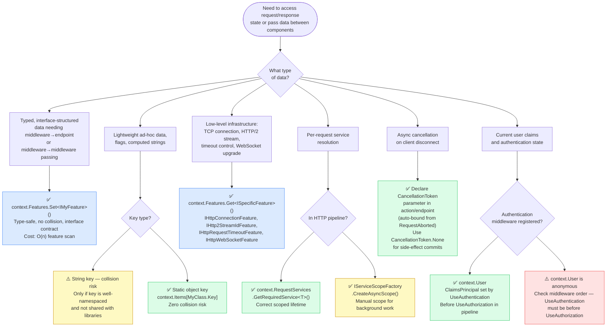

# 4.123 — HttpContext Deep Dive: Features, Items, and Request Lifetime

---

## PART 0 — Navigation & Context

### Where This Topic Sits in the ASP.NET Core Hierarchy

```
ASP.NET Core Mastery
│
├── A. Host & Application Lifecycle  (4.001–4.010)
├── B. Configuration System          (4.011–4.022)
├── C. Logging & Diagnostics         (4.023–4.033)
├── D. Dependency Injection          (4.034–4.048)
├── E. Middleware Pipeline           (4.049–4.063)
│     └── HttpContext flows through every middleware as shared state
├── F. Routing System                (4.064–4.077)
├── G. Minimal APIs                  (4.078–4.097)
├── H. MVC & Controllers             (4.098–4.122)
│
├── I. HTTP Fundamentals             (4.123–4.133)  ◄ YOU ARE HERE
│     ├── 4.123  HttpContext Deep Dive ◄ this note
│     ├── 4.124  HttpRequest
│     ├── 4.125  HttpResponse
│     ├── 4.126  Cookies
│     ├── 4.127  HTTP/2
│     ├── 4.128  Sessions
│     └── ...
│
├── J. Authentication                (4.134–4.153)
├── K. Authorization                 (4.154–4.166)
└── ...
```

### What You Need Before This

- **[[4.049 — The Middleware Pipeline: Request Delegation Chain]]** — HttpContext is the single object shared across the entire middleware chain; you must understand the chain before understanding what rides through it.
- **[[4.035 — Service Lifetimes: Singleton, Scoped, Transient]]** — HttpContext has request scope; its DI integration (`RequestServices`) is a Scoped container tied to the request lifetime.
- **[[4.050 — Writing Middleware: IMiddleware vs Convention-Based]]** — you write middleware that receives `HttpContext`; knowing how to write middleware is the first practical use of this topic.
- **[[4.034 — The Built-In DI Container: Service Registration and Resolution]]** — `HttpContext.RequestServices` is an `IServiceProvider`; understanding DI is prerequisite.

### What This Unlocks After

- **[[4.124 — HttpRequest: Reading URL, Headers, Query, Cookies, and Body]]** — `HttpContext.Request` is `HttpRequest`; this note is the prerequisite.
- **[[4.125 — HttpResponse: Writing Status, Headers, Cookies, and Streaming Body]]** — `HttpContext.Response` is `HttpResponse`; same dependency.
- **[[4.054 — HttpContext and IHttpContextAccessor: Safe Shared Request State]]** — `IHttpContextAccessor` is the way to access `HttpContext` outside of middleware; requires knowing what HttpContext is first.
- **[[4.134 — Authentication Architecture: Schemes, Handlers, and the Middleware]]** — `HttpContext.User` is set by authentication middleware; all auth concepts depend on this.

### Why This Matters at Scale

`HttpContext` is the membrane through which every request passes — it owns the DI scope, the feature set, the cross-middleware state bag, and the cancellation signal. A senior engineer who cannot explain how `HttpContext.Features` differs from `HttpContext.Items`, or why `HttpContext.RequestAborted` must propagate to every downstream `async` call, will build code that silently leaks memory, ignores client disconnects at 10k req/s, and fails in non-HTTP hosting scenarios.

---

## PART 1 — The Core Mental Model

### The Fundamental Rule

> **`HttpContext` is the single mutable object allocated once per HTTP request that acts as the shared state container for every participant in the pipeline — middleware, authentication, routing, and endpoint — and its lifetime is bounded precisely to that request's execution. The practical consequence is that holding a reference to `HttpContext` past request completion produces use-after-free bugs: all memory backing it returns to object pools or gets collected.**

### The Plain-Language Analogy

Think of `HttpContext` as the physical ticket and clipboard that accompanies a package through an order fulfilment warehouse. Every station on the conveyor belt (middleware) can read and annotate the clipboard (`Items`), swap out or attach special equipment (`Features`), check who signed for the package (`User`), or stop the line entirely (short-circuit). The package itself (request body/response body) is also on the conveyor, but the clipboard is what every station uses to communicate with every other station. When the package reaches the shipping dock (response completes), the clipboard is immediately recycled — anyone who photocopied it and kept the copy will be reading stale data.

The analogy holds for concurrent requests: each package gets its own clipboard. The warehouse building (the application) is shared, but no two packages share a clipboard. The analogy holds for the `Features` collection: the clipboard has a set of snap-on modules (the feature interfaces); some modules are always present (standard HTTP request/response), others only snap on if the conveyor is configured for them (WebSockets, HTTP/2 server push, connection info).

### The Taxonomy Diagram

```mermaid
graph TD
    subgraph pipeline["Pipeline Infrastructure (grey)"]
        HC["HttpContext\n(one per request)"]
        HC --> REQ["HttpRequest\n.Request"]
        HC --> RESP["HttpResponse\n.Response"]
        HC --> FEAT["IFeatureCollection\n.Features"]
        HC --> ITEMS["IDictionary&lt;object,object&gt;\n.Items"]
        HC --> SVC["IServiceProvider\n.RequestServices\n(scoped container)"]
        HC --> USER["ClaimsPrincipal\n.User"]
        HC --> CONN["ConnectionInfo\n.Connection"]
        HC --> WS["WebSocketManager\n.WebSockets"]
        HC --> CT["CancellationToken\n.RequestAborted"]
        HC --> TA["ISession\n.Session"]
        HC --> TID["string\n.TraceIdentifier"]
    end

    subgraph features["Feature Interfaces (blue)"]
        FEAT --> IHR["IHttpRequestFeature\nMethod, Path, Headers, Body"]
        FEAT --> IHRSP["IHttpResponseFeature\nStatus, Headers, Body"]
        FEAT --> IHRF["IHttpResponseBodyFeature\nSendFile, StartAsync, CompleteAsync"]
        FEAT --> ICON["IHttpConnectionFeature\nRemoteIP, LocalIP, ConnectionId"]
        FEAT --> IAUTH["IHttpAuthenticationFeature\nUser (wraps .User)"]
        FEAT --> IWS["IHttpWebSocketFeature\nAcceptAsync"]
        FEAT --> IRQ["IHttpRequestLifetimeFeature\nRequestAborted, Abort()"]
        FEAT --> ITO["IHttpRequestTimeoutFeature\n.NET 8 DisableTimeout()"]
    end

    subgraph patterns["Usage Patterns (green)"]
        ITEMS --> P1["Cross-middleware\nstate passing"]
        SVC --> P2["Per-request\nservice resolution"]
        CT --> P3["Downstream async\ncancellation"]
        TID --> P4["Correlation ID\nin logs and responses"]
    end

    subgraph danger["Danger Zone (red)"]
        HC --> CAPTURED["⚠️ Never capture\nHttpContext in a\nbackground Task\nor Singleton"]
    end

    style pipeline fill:#f5f5f5,stroke:#999
    style features fill:#dbeafe,stroke:#3b82f6
    style patterns fill:#dcfce7,stroke:#22c55e
    style danger fill:#fee2e2,stroke:#ef4444
```



---

## PART 2 — Deep Mechanics

### 2.1 — What HttpContext Actually Is: DefaultHttpContext and the Feature Abstraction

`HttpContext` is an abstract class. At runtime, Kestrel allocates a `DefaultHttpContext` (from `Microsoft.AspNetCore.Http`). But `DefaultHttpContext` is a façade — every property on it reads from the `IFeatureCollection` it wraps, not from fields on the object itself.

```
Pipeline position (HttpContext is present from the very first middleware):

──► ExceptionHandler ──► HSTS ──► StaticFiles ──► Routing ──► Auth ──► Authorization ──► Endpoint
     HttpContext allocated before ExceptionHandler runs.
     Disposed/returned to pool after the outermost middleware returns.
     Every box above receives the same HttpContext instance.
```

**Framework source behavior (approximate):**

```csharp
// ASP.NET Core internally (approximate) — DefaultHttpContext.cs:
public sealed class DefaultHttpContext : HttpContext
{
    // The Features collection is the real backing store.
    // Properties are read-through adapters.
    private readonly IFeatureCollection _features;

    public override HttpRequest Request => _request; // _request reads from _features
    public override HttpResponse Response => _response; // same
    public override ClaimsPrincipal User
    {
        get => _features.Get<IHttpAuthenticationFeature>()?.User
               ?? _defaultUser; // anonymous if auth hasn't run
        set => EnsureFeature<IHttpAuthenticationFeature>().User = value;
    }

    public override CancellationToken RequestAborted
    {
        get => _features.Get<IHttpRequestLifetimeFeature>()?.RequestAborted
               ?? CancellationToken.None;
        set => EnsureFeature<IHttpRequestLifetimeFeature>().RequestAborted = value;
    }
}
```

**Runtime cost:**

- `~1 DefaultHttpContext` allocated per request (reused from pool in Kestrel by resetting the feature collection)
- `IFeatureCollection` property access: `O(n)` linear scan on the small feature list (typically 8-15 features) — fast in practice but not zero-cost
- `~1 IServiceScope` created per request for `RequestServices`

> [!IMPORTANT] `DefaultHttpContext` is pooled by Kestrel via `DefaultHttpContextFactory`. When the request completes, `HttpContextFactory.Dispose(context)` is called, which calls `context.Initialize(features)` with nulled-out state for the next reuse. **Any reference you captured to `HttpContext` now points to a recycled context serving a different request.** This is not a theoretical concern — it is a class of bug that appears in production when developers pass `HttpContext` to background `Task.Run()` calls.

---

### 2.2 — The Feature Collection: The Abstraction Layer Below the API

The `IFeatureCollection` (`HttpContext.Features`) is a dictionary of interface types to implementations. It is the extensibility point that lets Kestrel, IIS, and test hosts swap out HTTP behavior without changing `DefaultHttpContext`.

```
IFeatureCollection (runtime content for a typical Kestrel HTTP/1.1 request):

  IHttpRequestFeature         → Http1RequestFeature     (Method, Path, QueryString, Headers, Body stream)
  IHttpResponseFeature        → Http1ResponseFeature     (StatusCode, Headers)
  IHttpResponseBodyFeature    → Http1ResponseBodyFeature (SendFileAsync, StartAsync)
  IHttpConnectionFeature      → Http1Connection          (RemoteIpAddress, LocalIpAddress, ConnectionId)
  IHttpRequestLifetimeFeature → Http1Connection          (RequestAborted CancellationToken, Abort())
  IHttpRequestIdentifierFeature → ...                    (TraceIdentifier)
  IHttpAuthenticationFeature  → HttpAuthenticationFeature (User, set by UseAuthentication)
  ITlsConnectionFeature       → (only if HTTPS)          (ClientCertificate)
  IHttpWebSocketFeature       → (only if WS upgrade)     (AcceptAsync)
  IHttpRequestTimeoutFeature  → (.NET 8+, if UseRequestTimeouts registered)
```

**Reading from the feature collection directly (when the API surface isn't enough):**

```csharp
// Pipeline position: inside any middleware or endpoint handler
// ~O(n) feature list scan per .Get<T>() call

public class ShipmentTrackingMiddleware : IMiddleware
{
    public async Task InvokeAsync(HttpContext context, RequestDelegate next)
    {
        // Access raw connection info via feature — not exposed on .Connection for some values
        var connFeature = context.Features.Get<IHttpConnectionFeature>();
        var remoteIp = connFeature?.RemoteIpAddress?.ToString() ?? "unknown";

        // Access HTTP/2 specific features — only present on HTTP/2 connections
        var http2Feature = context.Features.Get<IHttp2StreamIdFeature>();
        var streamId = http2Feature?.StreamId; // null on HTTP/1.1

        // .NET 8+: Disable per-request timeout for a specific long-running endpoint
        var timeoutFeature = context.Features.Get<IHttpRequestTimeoutFeature>();
        if (context.Request.Path.StartsWithSegments("/shipments/stream"))
        {
            timeoutFeature?.DisableTimeout();
        }

        await next(context);
    }
}
```

**Setting a custom feature (the extension pattern):**

```csharp
// Define a feature interface for cross-middleware communication
public interface ITenantFeature
{
    string TenantId { get; }
    string ConnectionString { get; }
}

// Early middleware sets the feature
public class TenantResolutionMiddleware : IMiddleware
{
    public async Task InvokeAsync(HttpContext context, RequestDelegate next)
    {
        // Resolve tenant from subdomain/header
        var tenantId = context.Request.Host.Host.Split('.')[0];
        context.Features.Set<ITenantFeature>(new TenantFeature(tenantId, GetConnectionString(tenantId)));

        await next(context);
    }
}

// Later middleware/endpoint reads the feature
// Pipeline position: any middleware registered after TenantResolutionMiddleware
var tenantFeature = context.Features.Get<ITenantFeature>();
// Cost: ~O(n) scan of feature list, typically 15-20 features → negligible
```

> [!NOTE] `context.Features.Set<T>(value)` replaces any existing value for that interface type. This is intentional — a downstream middleware can replace an upstream middleware's feature implementation. This is how `UseResponseCompression` replaces `IHttpResponseBodyFeature` with a compressed wrapper transparently.

---

### 2.3 — HttpContext.Items: The Request-Scoped State Bag

`HttpContext.Items` is `IDictionary<object, object?>`. It is the correct mechanism for passing computed data between middleware and downstream handlers in the same request. It is **not** DI — it is ad-hoc, stringly-typed (by convention), and cleaned up automatically when the request ends.

```
──► TenantMiddleware → sets Items["TenantId"] ──► Auth → sets Items["UserId"] ──► OrderEndpoint → reads both
```

```csharp
// ⚠️ WRONG: Using magic strings as keys (collision-prone, no refactoring safety)
context.Items["tenant"] = tenantId; // will collide if any library uses the same string

// ✅ CORRECT: Use a static object as the key (reference equality, zero collision risk)
public static class OrderHttpContextKeys
{
    // Static object keys — identity equality, no collision possible
    public static readonly object TenantIdKey = new();
    public static readonly object ResolvedOrderKey = new();
    public static readonly object AuditContextKey = new();
}

// Middleware setting the item
context.Items[OrderHttpContextKeys.TenantIdKey] = "acme-corp";

// Endpoint or downstream middleware reading the item
// Pipeline position: any point after the middleware that set the item
if (context.Items.TryGetValue(OrderHttpContextKeys.TenantIdKey, out var tenantIdObj)
    && tenantIdObj is string tenantId)
{
    // ~0 allocations — dictionary lookup, no new heap objects
    logger.LogInformation("Processing request for tenant {TenantId}", tenantId);
}
```

**HTTP consequence:** Items are invisible to the HTTP wire. They exist purely in process memory and are never serialized to request or response headers. Cost: `O(1)` dictionary lookup per access, `~1 Dictionary<object,object>` allocated per request (lazy in some implementations).

> [!TIP] Prefer `context.Features.Set<IMyFeature>()` over `context.Items` when the data is structural and interface-typed. Use `Items` for lightweight, non-interface data (string values, flags, pre-computed objects) where defining a feature interface would be overkill. The key distinction: Features are framework-level abstractions; Items are application-level shortcuts.

---

### 2.4 — HttpContext.RequestServices: The Per-Request DI Scope

`HttpContext.RequestServices` is the scoped `IServiceProvider` for the current request. It is distinct from the root container (`app.Services`). All `Scoped` services resolved from `RequestServices` are tied to the request lifetime and disposed when the request ends.

```
Application Root Container (Singleton scope)
│
└── Per-Request Scope (RequestServices) ← created by HttpContextFactory at request start
      │
      ├── OrderService (Scoped) — resolved fresh per request
      ├── AppDbContext (Scoped) — one DbContext per request
      ├── ICurrentUserService (Scoped) — reads from HttpContext.User
      └── ... all scoped services for this request
```

**Framework source behavior (approximate):**

```csharp
// ASP.NET Core internally — IServiceScopeFactory creates the scope:
// HostingApplicationDiagnostics / RequestServicesContainerMiddleware

// This middleware is always registered internally — it creates and disposes the scope:
// Pipeline position: very early, before any user middleware
public class RequestServicesContainerMiddleware
{
    public async Task Invoke(HttpContext httpContext)
    {
        // ~1 IServiceScope allocation per request
        await using var scope = _scopeFactory.CreateAsyncScope();
        httpContext.RequestServices = scope.ServiceProvider;
        await _next(httpContext);
        // scope disposed here — all Scoped services Disposed in registration-reverse order
    }
}
```

**The correct and incorrect ways to access services in middleware:**

```csharp
// ⚠️ WRONG: Convention-based middleware receives scoped services via constructor injection
// Constructor runs ONCE (middleware is singleton-like), so the scoped service is captive
public class OrderAuditMiddleware
{
    private readonly RequestDelegate _next;
    private readonly IOrderAuditService _auditService; // ⚠️ This is Scoped — will be the same
                                                       // instance for ALL requests (captive!)
    public OrderAuditMiddleware(RequestDelegate next, IOrderAuditService auditService)
    {
        _next = next;
        _auditService = auditService; // captured at startup — WRONG for Scoped services
    }
}

// ✅ CORRECT: Receive Scoped services as InvokeAsync method parameters (resolved per request)
public class OrderAuditMiddleware
{
    private readonly RequestDelegate _next;

    public OrderAuditMiddleware(RequestDelegate next) => _next = next;

    // IOrderAuditService is resolved from RequestServices per request — correct lifetime
    public async Task InvokeAsync(HttpContext context, IOrderAuditService auditService)
    {
        await auditService.RecordRequestAsync(context.TraceIdentifier, context.Request.Path);
        await _next(context);
    }
}

// ✅ ALSO CORRECT: IMiddleware — resolved per request from DI, can use constructor injection
public class OrderAuditMiddleware : IMiddleware
{
    private readonly IOrderAuditService _auditService; // Safe: this entire class is Scoped

    public OrderAuditMiddleware(IOrderAuditService auditService)
        => _auditService = auditService;

    public async Task InvokeAsync(HttpContext context, RequestDelegate next)
    {
        await _auditService.RecordRequestAsync(context.TraceIdentifier, context.Request.Path);
        await next(context);
    }
}
// Register as Scoped:
// builder.Services.AddScoped<OrderAuditMiddleware>();
// app.UseMiddleware<OrderAuditMiddleware>();
```

**Runtime cost:**

- `~1 IServiceScope` created per request
- `~1 async disposal` at request end for all IAsyncDisposable Scoped services
- `O(1)` resolution for already-resolved services (cached in scope dictionary)

---

### 2.5 — RequestAborted: The Client Disconnect Signal

`HttpContext.RequestAborted` is a `CancellationToken` that fires when the HTTP client disconnects or the request is otherwise cancelled. Every meaningful async operation triggered by an HTTP request should accept and propagate this token.

```
Client closes browser tab / network drops
         │
         ▼
  Kestrel detects TCP teardown
         │
         ▼
  IHttpRequestLifetimeFeature.RequestAborted fires
         │
         ▼
  HttpContext.RequestAborted is cancelled
         │
         ▼
  All downstream await calls that received this token throw OperationCanceledException
         │
         ▼
  Pipeline unwinds — exception caught by ExceptionHandler middleware
  (UseExceptionHandler converts OperationCanceledException from RequestAborted to 499 or 0 — no response sent)
```

**HTTP wire format — what the client sees:**

```
// Client (browser) closes the connection mid-flight.
// No HTTP response is received by the client — TCP FIN arrives.
// Server logs: OperationCanceledException — Connection reset by peer.
// No status code emitted (response stream already closed).
```

```csharp
// ⚠️ WRONG: Not passing the cancellation token — continues processing after client disconnects
[HttpGet("/orders/{orderId}")]
public async Task<ActionResult<OrderDto>> GetOrder(Guid orderId)
{
    var order = await _orderRepository.FindAsync(orderId); // ignores client disconnect
    var enriched = await _inventoryService.EnrichAsync(order); // 200ms wasted if client is gone
    return Ok(enriched);
}

// ✅ CORRECT: Propagate RequestAborted everywhere
[HttpGet("/orders/{orderId}")]
public async Task<ActionResult<OrderDto>> GetOrder(
    Guid orderId,
    CancellationToken cancellationToken) // ASP.NET Core auto-binds this from HttpContext.RequestAborted
{
    // Every async call receives the token
    var order = await _orderRepository.FindAsync(orderId, cancellationToken);
    if (order is null) return NotFound();
    var enriched = await _inventoryService.EnrichAsync(order, cancellationToken);
    return Ok(enriched);
}

// In Minimal APIs:
app.MapGet("/orders/{orderId}", async (Guid orderId, IOrderRepository repo,
    CancellationToken ct) =>
{
    var order = await repo.FindAsync(orderId, ct); // ct comes from HttpContext.RequestAborted
    return order is null ? Results.NotFound() : Results.Ok(order);
});
```

> [!WARNING] There is a subtle gotcha with `RequestAborted` and exception handling middleware. If `OperationCanceledException` is thrown because `RequestAborted` was cancelled, your `UseExceptionHandler` will intercept it. You usually **do not** want to log this as an error or return a ProblemDetails response — it is normal client behaviour. Always check `ex is OperationCanceledException && context.RequestAborted.IsCancellationRequested` before treating a cancellation as an application fault.

---

### 2.6 — TraceIdentifier, Connection, and WebSockets

```csharp
// HttpContext.TraceIdentifier — the unique request ID for distributed tracing
// Kestrel generates this as a base64-encoded random identifier by default
// Format: "0HN5JRPVUJVRD:00000001" (ConnectionId:RequestNumber)
// Cost: ~0 — already set by Kestrel on context initialization

string traceId = context.TraceIdentifier; // read, do not generate your own

// Can be overridden to use W3C trace context from upstream services:
// Pipeline position: early middleware, before any logging
if (context.Request.Headers.TryGetValue("X-Request-Id", out var requestId))
{
    context.TraceIdentifier = requestId.ToString(); // correlates with upstream system
}

// HttpContext.Connection — TCP-level connection information
// Pipeline position: available anywhere
var connectionInfo = context.Connection;
string connectionId = connectionInfo.ConnectionId;       // unique TCP connection ID
IPAddress? remoteIp = connectionInfo.RemoteIpAddress;    // ⚠️ May be ::ffff:127.0.0.1 behind a proxy
int remotePort = connectionInfo.RemotePort;
X509Certificate2? clientCert = await connectionInfo.GetClientCertificateAsync(); // mTLS

// ⚠️ WARNING: RemoteIpAddress is the IMMEDIATE caller's IP — behind a reverse proxy, this is
// the proxy's IP. Use IHttpConnectionFeature + ForwardedHeaders middleware for the real client IP.
// See [[4.329 — Reverse Proxy Configuration: X-Forwarded Headers Middleware]]

// HttpContext.WebSockets — the WebSocket upgrade manager
// Pipeline position: only meaningful at an endpoint that upgrades
if (context.WebSockets.IsWebSocketRequest)
{
    using var ws = await context.WebSockets.AcceptWebSocketAsync();
    await HandleWebSocketSessionAsync(ws, context.RequestAborted);
}
```

**HTTP wire format for WebSocket upgrade:**

```http
// HTTP request (WebSocket upgrade):
GET /orders/live HTTP/1.1
Host: api.example.com
Upgrade: websocket
Connection: Upgrade
Sec-WebSocket-Key: dGhlIHNhbXBsZSBub25jZQ==
Sec-WebSocket-Version: 13

// HTTP response (upgrade accepted):
HTTP/1.1 101 Switching Protocols
Upgrade: websocket
Connection: Upgrade
Sec-WebSocket-Accept: s3pPLMBiTxaQ9kYGzzhZRbK+xOo=
```

---

## PART 3 — Production Code Patterns

### Pattern 1 — The Tenant Context Feature: Structured Cross-Middleware State

The feature collection is the right mechanism when middleware needs to pass rich, typed data to downstream middleware and endpoints without polluting `Items` with untyped objects.

```csharp
// Domain: multi-tenant order management service (SaaS platform)
// Problem: Tenant resolution happens in early middleware; 12 downstream handlers need tenant DB connection string

// ✅ CORRECT: Structured feature interface — type-safe, zero string key collision risk

public interface IOrderTenantFeature
{
    string TenantId { get; }
    string TenantDatabaseConnectionString { get; }
    TenantPlan Plan { get; }
    DateTimeOffset LeaseExpiry { get; }
}

public sealed record OrderTenantFeature(
    string TenantId,
    string TenantDatabaseConnectionString,
    TenantPlan Plan,
    DateTimeOffset LeaseExpiry) : IOrderTenantFeature;

public class TenantResolutionMiddleware : IMiddleware
{
    private readonly ITenantRepository _tenants;
    private readonly ILogger<TenantResolutionMiddleware> _logger;

    public TenantResolutionMiddleware(ITenantRepository tenants,
        ILogger<TenantResolutionMiddleware> logger)
    {
        _tenants = tenants;
        _logger = logger;
    }

    public async Task InvokeAsync(HttpContext context, RequestDelegate next)
    {
        // Pipeline position: after UseRouting (so route values are available),
        // before UseAuthentication (tenant context needed for auth DB resolution)

        // Extract tenant from subdomain: acme.api.example.com → "acme"
        var host = context.Request.Host.Host;
        var tenantId = ExtractTenantId(host)
            ?? context.Request.Headers["X-Tenant-Id"].FirstOrDefault();

        if (tenantId is null)
        {
            // Short-circuit — no tenant means no valid request to this API
            context.Response.StatusCode = 400;
            await context.Response.WriteAsJsonAsync(new { error = "Tenant identifier required" });
            return; // ← does NOT call next(); short-circuits the pipeline
        }

        var tenant = await _tenants.FindAsync(tenantId, context.RequestAborted);
        if (tenant is null)
        {
            context.Response.StatusCode = 404;
            await context.Response.WriteAsJsonAsync(new { error = $"Tenant '{tenantId}' not found" });
            return;
        }

        // Set feature — all downstream middleware and endpoints read this
        // Cost: ~O(n) feature list insert, n typically 10-15 → negligible
        context.Features.Set<IOrderTenantFeature>(
            new OrderTenantFeature(tenant.Id, tenant.ConnectionString, tenant.Plan, tenant.LeaseExpiry));

        using var scope = _logger.BeginScope(new { TenantId = tenant.Id });
        await next(context);
    }

    private static string? ExtractTenantId(string host)
        => host.Split('.') is [var subdomain, ..] && subdomain != "api" ? subdomain : null;
}

// Endpoint reading the feature
// Pipeline position: endpoint handler, after TenantResolutionMiddleware
app.MapGet("/orders", async (HttpContext ctx, IOrderQueryService orders, CancellationToken ct) =>
{
    var tenant = ctx.Features.Get<IOrderTenantFeature>()
        ?? throw new InvalidOperationException("TenantResolutionMiddleware not registered");

    var result = await orders.ListAsync(tenant.TenantId, ct);
    return TypedResults.Ok(result);
});

// HTTP wire format:
// GET /orders HTTP/1.1
// Host: acme.api.example.com
// Authorization: Bearer eyJ...
//
// HTTP/1.1 200 OK
// Content-Type: application/json
// {"orders": [...]}
```

---

### Pattern 2 — The RequestAborted Guard in Payment Processing

Never let an abandoned payment request continue executing after the client disconnects. Doing so wastes DB connections, holds payment gateway locks, and produces ghost transactions.

```csharp
// Domain: payment processing API
// Problem: Client submits payment, connection drops mid-processing

// ⚠️ WRONG: No cancellation — continues charging even if client browser closed
[HttpPost("/payments")]
public async Task<IActionResult> ChargeCard([FromBody] PaymentRequest request)
{
    var authorization = await _gateway.AuthorizeAsync(request.CardToken, request.AmountCents);
    var capture = await _gateway.CaptureAsync(authorization.AuthorizationCode);
    await _paymentRepository.RecordAsync(capture); // still runs even if client is gone
    return Ok(new { transactionId = capture.TransactionId });
}

// ✅ CORRECT: All async operations are cancellation-aware
[HttpPost("/payments")]
public async Task<ActionResult<PaymentConfirmation>> ChargeCard(
    [FromBody] PaymentRequest request,
    CancellationToken cancellationToken) // bound to HttpContext.RequestAborted by ASP.NET Core
{
    // Check immediately — if client already disconnected, don't start at all
    cancellationToken.ThrowIfCancellationRequested();

    try
    {
        var authorization = await _gateway.AuthorizeAsync(
            request.CardToken, request.AmountCents, cancellationToken);

        // If the client disconnects between authorize and capture, the gateway authorization
        // must be voided. This is why we don't blindly propagate cancellation to capture:
        PaymentCapture capture;
        try
        {
            capture = await _gateway.CaptureAsync(
                authorization.AuthorizationCode, cancellationToken);
        }
        catch (OperationCanceledException) when (cancellationToken.IsCancellationRequested)
        {
            // Client disconnected between auth and capture — void the authorization to prevent
            // the card being charged without a recorded transaction
            await _gateway.VoidAsync(authorization.AuthorizationCode, CancellationToken.None);
            // Use CancellationToken.None for the void — we MUST void even though the request is cancelled
            return StatusCode(499); // Non-standard "Client Closed Request"
        }

        // Record is idempotent — safe to complete even if client disconnected
        await _paymentRepository.RecordAsync(capture, CancellationToken.None);

        return Ok(new PaymentConfirmation(capture.TransactionId, capture.Amount));
    }
    catch (OperationCanceledException) when (cancellationToken.IsCancellationRequested)
    {
        // Client disconnected before authorization completed — nothing to void
        _logger.LogInformation("Payment request {TraceId} abandoned by client",
            HttpContext.TraceIdentifier);
        return StatusCode(499);
    }
}

// HTTP wire format (normal path):
// POST /payments HTTP/1.1
// Content-Type: application/json
// {"cardToken": "tok_xxx", "amountCents": 9999}
//
// HTTP/1.1 200 OK
// Content-Type: application/json
// {"transactionId": "txn_abc123", "amount": 9999}
```

---

### Pattern 3 — Correlation ID Middleware Using TraceIdentifier

Set the correlation ID early in the pipeline via `context.TraceIdentifier` so every log entry in the request automatically includes it.

```csharp
// Domain: logistics shipment tracking API
// Problem: Distributed system — correlate this API's logs with the calling service's logs

public class CorrelationIdMiddleware : IMiddleware
{
    private const string CorrelationIdHeader = "X-Correlation-Id";

    public async Task InvokeAsync(HttpContext context, RequestDelegate next)
    {
        // Pipeline position: FIRST custom middleware, immediately after UseExceptionHandler
        // Must be before any logging middleware to ensure all log entries carry the ID

        // Accept correlation ID from upstream caller, or generate one
        var correlationId = context.Request.Headers[CorrelationIdHeader].FirstOrDefault()
            ?? context.TraceIdentifier; // fall back to Kestrel's generated ID

        // Overwrite TraceIdentifier so all ILogger log entries automatically include it
        // (ASP.NET Core includes TraceIdentifier in default log scope)
        context.TraceIdentifier = correlationId;

        // Propagate downstream in response headers for client-side tracing
        context.Response.OnStarting(() =>
        {
            // OnStarting runs just before response headers are flushed — correct hook
            context.Response.Headers[CorrelationIdHeader] = correlationId;
            return Task.CompletedTask;
        });

        await next(context);
    }
}

// HTTP wire format:
// POST /shipments HTTP/1.1
// X-Correlation-Id: upstream-service-req-42
//
// HTTP/1.1 201 Created
// X-Correlation-Id: upstream-service-req-42   ← echoed back for client tracing
// Location: /shipments/SHP-9876
```

> [!NOTE] `context.Response.OnStarting(callback)` is the correct hook for setting response headers when your middleware wraps a call to `next()`. Do not try to set headers after `await next(context)` returns — by then the response may already have started (headers sent). `OnStarting` fires synchronously just before the first byte of the response headers is written.

---

### Pattern 4 — The HttpContext.Items Anti-Pattern and Correct Alternative

```csharp
// Domain: order management service — pre-loading order data in a resource filter

// ⚠️ WRONG: String keys in Items — fragile, not refactorable, collision-prone
public class OrderPreloadFilter : IAsyncResourceFilter
{
    public async Task OnResourceExecutionAsync(ResourceExecutingContext context,
        ResourceExecutionDelegate next)
    {
        var orderId = context.RouteData.Values["orderId"] as string;
        var order = await _orders.FindAsync(orderId);
        context.HttpContext.Items["order"] = order; // magic string — WRONG
        await next();
    }
}

// Downstream action reads:
var order = (Order?)HttpContext.Items["order"]; // typo "ordr" compiles fine, returns null at runtime

// ✅ CORRECT: Private static key objects — identity equality, compile-time safe
public class OrderPreloadFilter : IAsyncResourceFilter
{
    // Define the key in the same class that sets it — ownership is clear
    public static readonly object OrderKey = new();

    private readonly IOrderRepository _orders;
    public OrderPreloadFilter(IOrderRepository orders) => _orders = orders;

    public async Task OnResourceExecutionAsync(ResourceExecutingContext context,
        ResourceExecutionDelegate next)
    {
        // Pipeline position: resource filter, before model binding
        if (!context.RouteData.Values.TryGetValue("orderId", out var idObj)
            || idObj is not string orderId)
        {
            await next();
            return;
        }

        var order = await _orders.FindAsync(Guid.Parse(orderId), context.HttpContext.RequestAborted);
        if (order is not null)
        {
            context.HttpContext.Items[OrderKey] = order;
        }

        await next();
    }
}

// Controller reads with type safety:
public async Task<ActionResult<OrderDto>> GetOrder()
{
    if (HttpContext.Items[OrderPreloadFilter.OrderKey] is not Order order)
        return NotFound();
    return Ok(_mapper.Map<OrderDto>(order));
    // Cost: O(1) dictionary lookup, zero additional DB round-trip
}
```

---

### Pattern 5 — RequestServices for Manual Resolution in Edge Cases

```csharp
// Domain: inventory webhook receiver — must resolve service inside a delegate
// that was registered before DI was fully configured (edge case: startup-time middleware factory)

// ⚠️ WRONG: Resolving from root app.Services (returns Singleton scope — ignores Scoped lifetime)
app.Use(async (context, next) =>
{
    var inventoryService = app.Services.GetRequiredService<IInventoryService>(); // ⚠️ Wrong scope
    // IInventoryService is Scoped but resolved from root — single instance for all requests
    await next(context);
});

// ✅ CORRECT: Resolve from context.RequestServices — correct per-request scope
app.Use(async (context, next) =>
{
    // context.RequestServices IS the scoped container for this request
    var inventoryService = context.RequestServices.GetRequiredService<IInventoryService>();
    // Fresh Scoped instance for this request — disposed when request ends
    await next(context);
});

// Even better: inject directly via IMiddleware or method-injection in convention middleware
public class WebhookValidationMiddleware
{
    private readonly RequestDelegate _next;
    public WebhookValidationMiddleware(RequestDelegate next) => _next = next;

    // Method injection — ASP.NET Core resolves these from RequestServices automatically
    public async Task InvokeAsync(HttpContext context,
        IWebhookSignatureValidator validator,      // Scoped — correct lifetime
        IInventoryEventRepository eventRepo)       // Scoped — correct lifetime
    {
        var isValid = await validator.ValidateAsync(context.Request, context.RequestAborted);
        if (!isValid)
        {
            context.Response.StatusCode = 401;
            return;
        }
        await next(context);
    }
}

// HTTP wire format (invalid signature):
// POST /webhooks/inventory HTTP/1.1
// X-Webhook-Signature: sha256=invalid
//
// HTTP/1.1 401 Unauthorized
```

---

### Pattern 6 — Aborting a Request Programmatically

```csharp
// Domain: payment API — immediate abort on detected fraud signal
// Use case: middleware detects a known fraudulent IP and must abort without a response body

public class FraudDetectionMiddleware : IMiddleware
{
    private readonly IFraudSignalCache _fraudCache;
    private readonly ILogger<FraudDetectionMiddleware> _logger;

    public FraudDetectionMiddleware(IFraudSignalCache fraudCache,
        ILogger<FraudDetectionMiddleware> logger)
    {
        _fraudCache = fraudCache;
        _logger = logger;
    }

    public async Task InvokeAsync(HttpContext context, RequestDelegate next)
    {
        var remoteIp = context.Connection.RemoteIpAddress?.ToString();

        if (remoteIp is not null && await _fraudCache.IsBlockedAsync(remoteIp))
        {
            _logger.LogWarning("Blocked payment attempt from known fraud IP {IP}", remoteIp);

            // Option A: Return a response (preferred — gives client a signal)
            context.Response.StatusCode = 403;
            await context.Response.WriteAsJsonAsync(new { error = "Access denied" });
            return; // short-circuit

            // Option B: Abort the connection entirely (TCP RST — no HTTP response)
            // Use when you want to give the attacker NO information
            // context.Features.Get<IHttpRequestLifetimeFeature>()?.Abort();
            // return;
        }

        await next(context);
    }
}

// HTTP wire format (Option A):
// HTTP/1.1 403 Forbidden
// Content-Type: application/json
// {"error": "Access denied"}
```

---

## PART 4 — Gotchas & Anti-Patterns

### Gotcha 1: Capturing HttpContext in a Background Task

The most common HttpContext bug. Developers pass `HttpContext` to `Task.Run()`, a `Channel<T>` producer, or a `BackgroundService` queue. By the time the background work executes, the request is complete and `DefaultHttpContext` has been reset to serve a different request.

```csharp
// ⚠️ WRONG CODE — captures HttpContext by reference into a background task
[HttpPost("/orders")]
public IActionResult PlaceOrder([FromBody] PlaceOrderCommand cmd)
{
    _ = Task.Run(async () =>
    {
        // THIS IS A BUG: HttpContext is reset/pooled once this action returns.
        // HttpContext.User, .Request.Body, .Items — all invalid after the response is sent.
        var userId = HttpContext.User.FindFirst("sub")?.Value; // reads recycled context!
        await _orderProcessor.ProcessAsync(cmd, userId);
    });
    return Accepted();
}

// HTTP consequence (wrong path):
// The action returns 202 Accepted. HttpContext is reset.
// The background Task reads HttpContext.User — it now belongs to another request.
// userId is null or a different user's ID. Silent data corruption.

// ✅ CORRECT CODE — capture only the data you need, not the context
[HttpPost("/orders")]
public IActionResult PlaceOrder([FromBody] PlaceOrderCommand cmd)
{
    // Extract everything needed BEFORE returning from the action
    var userId = HttpContext.User.FindFirst("sub")!.Value;
    var traceId = HttpContext.TraceIdentifier;

    _ = Task.Run(async () =>
    {
        // Safe: userId and traceId are plain strings, not tied to HttpContext lifetime
        await _orderProcessor.ProcessAsync(cmd, userId, traceId);
    });
    return Accepted();
}

// HTTP consequence (correct path):
// HTTP/1.1 202 Accepted
// Background task runs with correct, stable data.

// WHY: DefaultHttpContext is object-pooled in Kestrel. After the action returns and the response
// is sent, HttpContextFactory.Dispose() calls context.Initialize(features: null), clearing
// all state. The pool entry is handed to the next incoming request. Any code that captured
// the context instance now reads whatever the next request's data happens to be.
```

---

### Gotcha 2: Reading HttpContext.RequestAborted as the Cancellation Token for All Async Work

Not all async work in a request handler should be cancelled when the client disconnects. Specifically, any work that has side effects and must complete for data integrity (recording a payment, writing an audit log) should use `CancellationToken.None` for the final commit.

```csharp
// ⚠️ WRONG CODE — blindly propagates RequestAborted to the database commit
[HttpPost("/orders/{orderId}/confirm")]
public async Task<IActionResult> ConfirmOrder(Guid orderId, CancellationToken ct)
{
    var order = await _orders.FindAsync(orderId, ct);
    order.Confirm();
    await _orders.SaveChangesAsync(ct); // ⚠️ If client disconnects during SaveChanges, the
                                        // EF transaction is rolled back. Order was confirmed
                                        // in memory but never persisted. Client retries and
                                        // gets a different result.
    return NoContent();
}

// HTTP consequence (wrong path):
// Client closes connection during the DB write. SaveChangesAsync throws OperationCanceledException.
// Unhandled → 500 response (or swallowed by exception handler).
// Order is NOT confirmed in the database. Client state is inconsistent.

// ✅ CORRECT CODE — cancel reads but not final writes
[HttpPost("/orders/{orderId}/confirm")]
public async Task<IActionResult> ConfirmOrder(Guid orderId, CancellationToken ct)
{
    // Cancellable: pure read — no side effects
    var order = await _orders.FindAsync(orderId, ct);
    if (order is null) return NotFound();

    order.Confirm();

    // Non-cancellable: write has a side effect that must complete for consistency
    // Use CancellationToken.None — the commit MUST succeed regardless of client state
    await _orders.SaveChangesAsync(CancellationToken.None);
    return NoContent();
}

// HTTP consequence (correct path):
// Client closes connection during DB write — SaveChangesAsync completes successfully.
// Client receives no response (connection already closed), but data is consistent.
// Client retry gets the already-confirmed order.

// WHY: CancellationToken propagation must be conscious, not mechanical. Reads and idempotent
// operations: cancel aggressively. Writes with commit semantics: use CancellationToken.None.
```

---

### Gotcha 3: Using HttpContext.Items With String Keys Across Assemblies

Two middleware packages — yours and a third-party one — both use `context.Items["userId"]`. You get the other middleware's value (or it overwrites yours). This is silent data corruption, not an exception.

```csharp
// ⚠️ WRONG CODE — "userId" is a globally unqualified key
public class AuthEnrichmentMiddleware : IMiddleware
{
    public async Task InvokeAsync(HttpContext context, RequestDelegate next)
    {
        context.Items["userId"] = context.User.FindFirst("sub")?.Value;
        await next(context);
    }
}

// Third-party middleware (in a NuGet package you don't control):
// context.Items["userId"] = "SYSTEM"; // overwrites your value

// HTTP consequence (wrong path):
// Your endpoint reads HttpContext.Items["userId"] → "SYSTEM"
// The actual user's ID is lost. Authorization decisions or audit logs use the wrong identity.
// No exception, no warning — silent wrong data.

// ✅ CORRECT CODE — private static object key, defined in your assembly
internal static class HttpContextItemKeys
{
    internal static readonly object AuthenticatedUserId = new(); // reference equality key
}

public class AuthEnrichmentMiddleware : IMiddleware
{
    public async Task InvokeAsync(HttpContext context, RequestDelegate next)
    {
        context.Items[HttpContextItemKeys.AuthenticatedUserId] =
            context.User.FindFirst("sub")?.Value;
        await next(context);
    }
}

// No third-party code can collide with a private static object reference.

// HTTP consequence (correct path):
// Only your code can read or set this key. Data integrity guaranteed by reference equality.

// WHY: Dictionary<object, object> uses object.GetHashCode() and object.Equals() for key lookup.
// For string keys, two different "userId" string literals are equal (string equality).
// For static object keys, equality is reference identity — physically impossible to collide
// from another assembly without having access to your internal reference.
```

---

### Gotcha 4: Accessing HttpContext Outside the Request Pipeline via IHttpContextAccessor in Singleton Services

`IHttpContextAccessor.HttpContext` returns `null` in any code that runs outside the request pipeline (background services, startup code, message consumers). Singleton services that cache `IHttpContextAccessor` then use `.HttpContext!.User` in background work will throw `NullReferenceException` silently swallowed by the thread pool.

```csharp
// ⚠️ WRONG CODE — singleton service uses IHttpContextAccessor as if it's always non-null
public class AuditService : IAuditService
{
    private readonly IHttpContextAccessor _accessor;

    public AuditService(IHttpContextAccessor accessor) => _accessor = accessor;

    public async Task RecordAsync(string action)
    {
        // Called from a BackgroundService (no HTTP request in flight)
        var userId = _accessor.HttpContext!.User.FindFirst("sub")!.Value; // NullReferenceException!
        await _auditRepo.InsertAsync(userId, action);
    }
}

// HTTP consequence (wrong path):
// NullReferenceException when RecordAsync is called from background context.
// Audit record not written. Exception swallowed or crashes the background service.

// ✅ CORRECT CODE — design the method to accept the caller's identity explicitly
public class AuditService : IAuditService
{
    public async Task RecordAsync(string action, string? userId = null)
    {
        // Callers from HTTP context pass their own userId
        // Callers from background services pass null or a service account identifier
        await _auditRepo.InsertAsync(userId ?? "system", action);
    }
}

// Or: guard explicitly
public async Task RecordAsync(string action)
{
    var userId = _accessor.HttpContext?.User?.FindFirst("sub")?.Value ?? "background-service";
    await _auditRepo.InsertAsync(userId, action);
}

// HTTP consequence (correct path):
// Background audit records use "background-service" as actor.
// HTTP context audit records use the authenticated user's ID.
// No exceptions in either context.

// WHY: IHttpContextAccessor.HttpContext is backed by an AsyncLocal<HttpContext> that is set
// to null outside of the HTTP request pipeline. Singleton services that use it must always
// null-check and handle the non-HTTP case.
```

---

### Gotcha 5: Modifying Response Headers After the Response Has Started

Headers must be set before the first byte of the response body is written. Once Kestrel flushes response headers (which happens automatically on the first `WriteAsync` or explicit `FlushAsync`), attempting to set headers throws an `InvalidOperationException: Headers are read-only, response has already started`.

```csharp
// ⚠️ WRONG CODE — sets header after response body has started
public class TimingMiddleware : IMiddleware
{
    public async Task InvokeAsync(HttpContext context, RequestDelegate next)
    {
        var sw = Stopwatch.StartNew();
        await next(context); // ← response headers already sent during this call
        sw.Stop();
        // ⚠️ InvalidOperationException: Headers are read-only, response has already started
        context.Response.Headers["X-Response-Time-Ms"] = sw.ElapsedMilliseconds.ToString();
    }
}

// HTTP consequence (wrong path):
// InvalidOperationException thrown. Exception propagates up to UseExceptionHandler.
// Exception handler can't set headers either (response started) — logs the error,
// but the client already received a partial response with no timing header.

// ✅ CORRECT CODE — use OnStarting to hook header writing before first byte
public class TimingMiddleware : IMiddleware
{
    public async Task InvokeAsync(HttpContext context, RequestDelegate next)
    {
        var sw = Stopwatch.StartNew();

        // Register callback that fires just before response headers are flushed
        context.Response.OnStarting(() =>
        {
            sw.Stop();
            // This runs synchronously just before headers flush — safe to set headers here
            context.Response.Headers["X-Response-Time-Ms"] = sw.ElapsedMilliseconds.ToString();
            return Task.CompletedTask;
        });

        await next(context);
        // If the response never started (e.g., exception occurred), OnStarting never fires.
        // That's fine — we don't want a timing header on error responses either.
    }
}

// HTTP consequence (correct path):
// HTTP/1.1 200 OK
// X-Response-Time-Ms: 42
// Content-Type: application/json
// {"orders": [...]}

// WHY: ASP.NET Core's response pipeline is a forward-only stream. Once Kestrel calls
// IHttpResponseBodyFeature.StartAsync(), headers are written to the wire. The HttpResponse
// object tracks HasStarted = true. Any subsequent header mutation throws to prevent
// invalid HTTP on the wire.
```

---

## PART 5 — Performance Implications

### 5.1 — Request Pipeline Characteristics Table

|Scenario|Pipeline Depth|Allocations Per Request|Approx Latency Impact|Recommendation|
|---|---|---|---|---|
|Reading `HttpContext.TraceIdentifier`|~0|0|~0ns|Always use it; it's already set by Kestrel|
|`context.Features.Get<T>()`|~O(n) feature scan, n≈12|0|<50ns|Fine in hot paths; n is bounded and small|
|`context.Items[key]` read/write|O(1) dictionary|0 additional|~10ns|Prefer static object keys; string keys add string hash cost|
|`context.RequestServices.GetRequired<T>()` for cached Scoped service|O(1) scope dict|0 (already resolved)|~20ns|First resolution: O(n) service graph; subsequent: O(1)|
|`context.RequestServices.GetRequired<T>()` first Transient resolution|O(n) factory chain|~1 per Transient|~100–500ns|Cache Transient results in Items if resolved repeatedly|
|`HttpContext.User` access after UseAuthentication|O(1) feature read|0|~10ns|ClaimsPrincipal is set once; Claims iteration is O(n claims)|
|`context.Response.OnStarting(cb)` registration|O(1) list append|~1 delegate|~50ns|Multiple registrations supported; callbacks run LIFO|
|`IServiceScope` creation per request (RequestServices setup)|—|~1 scope, ~varies|~500ns–2µs|Built into every request; unavoidable cost|
|`context.RequestAborted` check (`IsCancellationRequested`)|O(1)|0|~5ns|Check before expensive operations; essentially free|
|Reading `context.Connection.RemoteIpAddress`|O(1) feature read|0|~10ns|Cheap; done at HTTP layer by Kestrel|
|`context.Features.Set<T>(newImpl)` mid-request|O(n) scan + set|0|~50ns|Fine for middleware integration (e.g., compression wrapping response body)|
|Accessing `HttpContext` from `IHttpContextAccessor`|O(1) `AsyncLocal` read|0|~20–50ns|Add `AddHttpContextAccessor()` only when constructor injection is unavailable|

### 5.2 — BenchmarkDotNet Comparison

```csharp
using BenchmarkDotNet.Attributes;
using BenchmarkDotNet.Running;
using Microsoft.AspNetCore.Http;
using Microsoft.AspNetCore.Http.Features;

[MemoryDiagnoser]
[ShortRunJob]
public class HttpContextAccessBenchmarks
{
    private DefaultHttpContext _context = null!;
    private static readonly object _staticKey = new();

    [GlobalSetup]
    public void Setup()
    {
        _context = new DefaultHttpContext();
        _context.TraceIdentifier = "bench-trace-id";
        _context.Items[_staticKey] = "tenant-acme";
        _context.Items["string-key"] = "tenant-acme";
    }

    [Benchmark(Baseline = true)]
    public string ReadTraceIdentifier()
        => _context.TraceIdentifier;
    // Reads through IHttpRequestIdentifierFeature — O(n) feature scan

    [Benchmark]
    public object? ReadItemsWithStaticKey()
        => _context.Items[_staticKey];
    // Object.GetHashCode() + reference equality — fastest possible dictionary lookup

    [Benchmark]
    public object? ReadItemsWithStringKey()
        => _context.Items["string-key"];
    // string.GetHashCode() + string.Equals() — slightly more expensive due to hash computation

    [Benchmark]
    public IHttpConnectionFeature? GetKnownFeature()
        => _context.Features.Get<IHttpConnectionFeature>();
    // Linear scan of feature list — O(n), n≈12

    [Benchmark]
    public void SetAndGetCustomFeature()
    {
        _context.Features.Set<ITenantFeature>(new ConcreteFeature());
        _ = _context.Features.Get<ITenantFeature>();
    }
    // One set + one get = two O(n) scans
}

// Expected output (approximate, .NET 8, x64, Kestrel test context):
// | Method                   | Mean     | Error    | StdDev   | Allocated |
// |--------------------------|----------|----------|----------|-----------|
// | ReadTraceIdentifier      | 12.3 ns  | 0.15 ns  | 0.12 ns  | -         |
// | ReadItemsWithStaticKey   |  8.1 ns  | 0.07 ns  | 0.06 ns  | -         |
// | ReadItemsWithStringKey   | 11.4 ns  | 0.12 ns  | 0.10 ns  | -         |
// | GetKnownFeature          | 18.7 ns  | 0.21 ns  | 0.19 ns  | -         |
// | SetAndGetCustomFeature   | 38.2 ns  | 0.43 ns  | 0.40 ns  | 40 B      |
```

> [!NOTE] BenchmarkDotNet measures isolated method calls. For real HTTP profiling, use `dotnet-trace collect --providers Microsoft-AspNetCore-Server-Kestrel:0x10:5` to capture request pipeline traces, `dotnet-counters monitor --process-id <PID> --counters Microsoft.AspNetCore.Hosting` for live request counters, or MiniProfiler middleware for per-request breakdown in a staging environment.

### 5.3 — When to Care / When to Ignore

**When this costs you:**

- **High-throughput APIs (>10k req/s):** The `IServiceScope` created per request adds ~500ns–2µs. At 50k req/s this is 25–100ms of scope allocation overhead per second across the process. Profile with `dotnet-counters` before optimizing.
- **Chatty feature collection access in tight loops:** A filter or middleware that calls `context.Features.Get<T>()` 50 times per request amplifies the O(n) cost. Cache the result in a local variable within the middleware's `InvokeAsync`.
- **Singleton services calling `IHttpContextAccessor.HttpContext` in hot paths:** `AsyncLocal` reads are ~20-50ns but add up if called in deeply nested call stacks at high volume.
- **`Items` with string keys at scale:** String hash computation is cheap per call but shows up in CPU profiles for extremely high-throughput microservices. Switch to static object keys.

**When this doesn't matter:**

- **Internal admin APIs (<100 req/s):** All HttpContext access costs are sub-microsecond; the database round-trip is 3-5 orders of magnitude more expensive.
- **Background services and startup code:** HttpContext doesn't apply; cost concerns are irrelevant.
- **Startup middleware (`UseStaticFiles`, `UseHttpsRedirection`):** These run on rare or static paths; HttpContext allocation cost is amortized over milliseconds of total request time.

---

## PART 6 — Interview Arsenal

### A. The Question Bank

**Question 1: "Explain what HttpContext is and what its relationship is to the HTTP request lifecycle."**

_Average Answer:_ "HttpContext is an object that holds information about the current HTTP request and response. It gives you access to things like the request headers, response, and the current user."

_Why That's Insufficient:_ It describes the surface API but not the lifecycle (pooling, scope), the architecture (feature collection), or the implications for correct usage.

> **Great Answer:** "HttpContext is the single mutable object allocated once per HTTP request that threads the entire middleware pipeline together. Every middleware receives the same instance — it's not cloned. The interesting thing is that DefaultHttpContext is actually a façade over an IFeatureCollection — properties like .Request, .Response, and .User are adapters that read from underlying feature interfaces, not directly from fields. This matters in practice because you can replace individual feature implementations mid-pipeline, which is how response compression middleware transparently wraps the response body stream. The lifecycle part is what most engineers miss: Kestrel pools DefaultHttpContext instances. Once the response is sent, the context is reset and handed to the next incoming request. I've seen this cause silent data corruption when developers capture HttpContext in a Task.Run() or Channel producer — by the time that background code runs, the context is serving a different request entirely. The invariant I enforce on my teams is: never let HttpContext outlive the middleware stack frame that received it."

---

**Question 2: "What is HttpContext.Items and when would you use it?"**

_Average Answer:_ "HttpContext.Items is a dictionary you can use to pass data between middleware components."

_Why That's Insufficient:_ Doesn't mention key collision risks, the correct key strategy, or when to prefer Features over Items.

> **Great Answer:** "HttpContext.Items is a request-scoped IDictionary<object,object> — essentially a state bag for the duration of one request. It's the right tool when middleware earlier in the pipeline needs to pass computed data to downstream middleware or endpoint handlers without adding a dependency. The classic example is a tenant resolution middleware that resolves the tenant from the subdomain, sets the connection string, and expects the endpoint to use it. The gotcha that I've seen bite teams in production is using string keys — two middleware packages using the same string key will silently overwrite each other's values, and you won't find out until a security review notices the wrong tenant ID in audit logs. The pattern I enforce is private static object keys — since object equality is reference equality, a static object key defined in your assembly is physically impossible for another assembly to collide with. That said, if the data is rich and typed — like a full tenant context with plan information and feature flags — I prefer setting it as a typed feature interface via context.Features.Set<ITenantFeature>() rather than Items. Features are for structured, interface-typed data; Items are for lightweight ad-hoc values."

---

**Question 3: "Why should you pass CancellationToken to every async method in an ASP.NET Core endpoint, and where does that token come from?"**

_Average Answer:_ "You should pass it so that if the request is cancelled, you don't do unnecessary work. The token comes from HttpContext.RequestAborted."

_Why That's Insufficient:_ Doesn't address the partial-write correctness problem, or how the token is automatically bound in MVC/Minimal APIs.

> **Great Answer:** "The token from HttpContext.RequestAborted fires when the client drops the TCP connection — browser tab closed, network dropped, timeout on their side. Propagating it aggressively means your database queries and outbound HTTP calls abort immediately instead of consuming resources for a response that will never be delivered. In high-throughput scenarios this materially reduces DB connection saturation. But the nuance that separates senior engineers from mid-level ones is knowing where NOT to propagate it. If you're in the middle of a multi-step write — say, authorizing a payment, then capturing it — and the client disconnects between those two steps, you must still void the authorization even though the token is cancelled. I always use CancellationToken.None for final commits and cleanup operations that have side effects requiring completion for data integrity. The other thing worth mentioning: in MVC controller actions, if you declare a CancellationToken parameter, ASP.NET Core automatically binds it to HttpContext.RequestAborted — you don't call GetCancellationToken() yourself. Same in Minimal APIs — the framework injects it from RequestAborted by parameter type matching."

---

### B. Trick Questions

**Trick 1: "If you have a Singleton service that takes IHttpContextAccessor in its constructor and reads .HttpContext.User in a method, what happens when that method is called from a BackgroundService?"**

_The trap:_ Candidates say "it reads the current user" without thinking about when the method is called.

_Correct answer:_ `IHttpContextAccessor.HttpContext` returns `null` outside the HTTP pipeline because it's backed by an `AsyncLocal<HttpContext>` that is only set during request execution. The Singleton service calling `.HttpContext!.User` from a BackgroundService throws `NullReferenceException`. The fix is to never design services that implicitly require an HTTP context — accept the actor identity as an explicit parameter.

---

**Trick 2: "Can you call context.Response.Headers["X-Custom"] = 'value' after await next(context) returns in middleware?"**

_The trap:_ Sounds like it should work because `next()` has returned.

_Correct answer:_ No — if any downstream middleware or endpoint called `WriteAsync` or `FlushAsync`, `HttpResponse.HasStarted` is `true` and headers are read-only. Setting them throws `InvalidOperationException`. The correct hook is `context.Response.OnStarting(callback)`, registered before calling `next()`.

---

**Trick 3: "You have five middleware components registered in order. An exception is thrown in middleware 3. Which middleware components see the exception on the way back up?"**

_The trap:_ Candidates describe only the forward direction.

_Correct answer:_ The pipeline is bidirectional. Middleware 2 and Middleware 1 see the exception as it unwinds from the `await next(context)` call in each of their `InvokeAsync` methods, unless they catch it. Middleware 4 and 5 never run because Middleware 3 threw before calling `next()`. Middleware 1 (UseExceptionHandler) is specifically designed to catch this at the top.

---

**Trick 4: "HttpContext.RequestServices.GetRequiredService<IMyService>() — is this the same as IServiceProvider.GetRequiredService<IMyService>() called on the root app.Services?"**

_The trap:_ "It's the same IServiceProvider."

_Correct answer:_ No. `context.RequestServices` is a child `IServiceScope` scoped to the request lifetime. `Scoped` services resolved from it are unique to this request and disposed when the request ends. `app.Services` is the root container — resolving `Scoped` services from it is the captive dependency bug and throws in development (`ValidateScopes = true`). Always use `context.RequestServices` inside request-handling code, never the root container.

---

### C. Red Flags to Avoid

1. **"HttpContext is thread-safe, so you can share it across threads."** — `DefaultHttpContext` is explicitly NOT thread-safe. The entire design assumes single-request sequential access through the middleware chain.
    
2. **"I store HttpContext in a field of my service for later use."** — Services outlive requests. Capturing `HttpContext` in a service field is the pooling/lifetime bug described in Gotcha 1. Says you don't understand request lifetime.
    
3. **"Items is just like a global variable for the request."** — Framing it as "global" suggests you're not thinking about encapsulation. The key collision problem will follow.
    
4. **"I always pass CancellationToken everywhere to be safe."** — Mechanically correct but wrong. Interviewers who know the domain will probe payment/write scenarios. "Always" is the answer that leads to broken commits.
    
5. **"HttpContext.User is set by my endpoint code."** — `User` is set by the Authentication middleware, not endpoint code. Saying your endpoint sets the user suggests you don't understand the pipeline order and how auth works.
    
6. **"I use IHttpContextAccessor in all my services so they can access the request."** — Over-reliance on accessor is a design smell. Services that need request data should receive it as parameters, not fish for it from an ambient accessor. Signals you don't understand service boundaries.
    
7. **"context.Features is just another way to access headers."** — Features are infrastructure abstractions (request/response streams, connection info, timeout control), not header bags. Conflating them shows shallow understanding of the abstraction layer.
    

---

## PART 7 — Decision Framework



---

## PART 8 — Self-Check

### A. Conceptual Questions

1. What is the relationship between `DefaultHttpContext` and the `IFeatureCollection` it wraps? What would happen if you called `context.Features.Get<IHttpResponseBodyFeature>()` and replaced its implementation with a custom wrapper?
    
2. Why is `HttpContext` considered to be "pooled" in Kestrel? What does pooling mean for code that captures a reference to `HttpContext` in a long-lived structure?
    
3. What is the difference between `HttpContext.Items` and `HttpContext.Features`? Give one scenario where each is the better choice.
    
4. What happens to the HTTP request pipeline if Middleware 2 of 5 throws an `InvalidOperationException` and no middleware wraps the call in a `try-catch`? Trace which middleware components execute and in what order.
    
5. Why does `IHttpContextAccessor.HttpContext` return `null` when called from a `BackgroundService`? What is the underlying mechanism?
    
6. What happens to the HTTP response if you try to set a response header after `await next(context)` returns, when the downstream endpoint has already written to the response body?
    
7. A controller action declares `CancellationToken cancellationToken` as a parameter. Where does that value come from at runtime? What event triggers its cancellation?
    
8. You have a Singleton service that receives `IHttpContextAccessor` and reads `.HttpContext.User`. A co-worker says this is a "captive dependency problem." Are they correct? Explain what the actual risk is and how it differs from the classic captive dependency problem (Singleton→Scoped).
    
9. What is `context.Response.OnStarting()` and why is it the correct hook for middleware that needs to add a response header without knowing when the downstream middleware will start writing the body?
    
10. You have three middleware components. The first sets `context.Features.Set<ITenantFeature>(...)`. The third reads `context.Features.Get<ITenantFeature>()`. The second middleware calls `context.Features.Set<ITenantFeature>(null)`. What does the third middleware receive? Is this a valid design pattern?
    

---

### B. Code Puzzles

**Puzzle 1 — What does this middleware do to every response?**

```csharp
public class MysteryMiddleware : IMiddleware
{
    public async Task InvokeAsync(HttpContext context, RequestDelegate next)
    {
        context.Response.OnStarting(() =>
        {
            context.Response.StatusCode = 503;
            return Task.CompletedTask;
        });
        await next(context);
    }
}
```

What status code does every response have after this middleware is registered? Is there an exception?

<details> <summary>Answer</summary>

**Every response returns 503 Service Unavailable.**

`OnStarting` fires synchronously just before response headers are flushed. At that point, it overwrites the status code with 503, regardless of what the endpoint set it to. The endpoint might return `TypedResults.Ok(data)` (which sets status 200), but when headers flush, `OnStarting` runs and changes it to 503.

**Is there an exception?** Yes — if the response has already started before `OnStarting` fires (because the endpoint called `StartAsync()` explicitly, or if there's an error path that flushes headers earlier), the `OnStarting` callback may not be able to change the status code. But in normal request flow — endpoint sets status, then first write causes header flush — the `OnStarting` override always wins.

**The lesson:** `OnStarting` callbacks run in LIFO order and can modify any not-yet-sent response state. This is both a powerful hook for middleware and a dangerous footgun if used carelessly.

</details>

---

**Puzzle 2 — Is this safe? What is the bug?**

```csharp
[HttpPost("/payments/process")]
public IActionResult StartPaymentProcessing([FromBody] PaymentRequest request)
{
    var context = HttpContext;
    var userId = context.User.FindFirst("sub")!.Value;

    _ = Task.Run(async () =>
    {
        await Task.Delay(100); // simulates some async setup
        var tenantId = (string?)context.Items[TenantKeys.TenantId]; // is this safe?
        await _paymentService.ProcessAsync(request, userId, tenantId);
    });

    return Accepted();
}
```

<details> <summary>Answer</summary>

**This is NOT safe. The bug is capturing `context` (the `HttpContext` reference) in the lambda.**

`userId` is safe — it's extracted as a plain `string` before the action returns.

`context.Items[TenantKeys.TenantId]` inside `Task.Run` is **not safe**. The action method returns `Accepted()`, which triggers ASP.NET Core to complete the response. Kestrel then recycles the `DefaultHttpContext` instance — calling `Initialize(features: null)` which clears `Items`, `Features`, `User`, and all other state. The `context` variable still points to the same `DefaultHttpContext` object, but that object now represents a different request (or has been partially reset).

Reading `context.Items` inside `Task.Run` may return `null`, a value from a different request, or throw a `NullReferenceException` depending on timing.

**The fix:**

```csharp
var userId = HttpContext.User.FindFirst("sub")!.Value;
var tenantId = (string?)HttpContext.Items[TenantKeys.TenantId]; // extract BEFORE returning

_ = Task.Run(async () =>
{
    await Task.Delay(100);
    await _paymentService.ProcessAsync(request, userId, tenantId); // uses captured strings, not context
});
return Accepted();
```

</details>

---

**Puzzle 3 — What HTTP status code does the client see?**

```csharp
app.Use(async (context, next) =>
{
    try
    {
        await next(context);
    }
    catch (Exception ex) when (ex is not OperationCanceledException)
    {
        context.Response.StatusCode = 500;
        await context.Response.WriteAsync("Internal error");
    }
});

app.MapGet("/inventory", async (HttpContext ctx) =>
{
    await ctx.Response.WriteAsync("Starting response...");
    throw new InvalidOperationException("Something broke");
});
```

What status code does the client see? Does the catch block execute?

<details> <summary>Answer</summary>

**The client sees status 200 with a partial body.**

Here's why:

1. `MapGet` endpoint calls `ctx.Response.WriteAsync("Starting response...")`. This flushes the response headers with status 200 (the default) to the wire. `HttpResponse.HasStarted = true`.
    
2. The `InvalidOperationException` is thrown after the first write.
    
3. The `catch` block in the outer middleware executes — the exception is caught.
    
4. The catch block tries to set `context.Response.StatusCode = 500`. But `HasStarted` is `true` — **this throws `InvalidOperationException: Headers are read-only, response has already started`**. The original exception is now hidden; this new one propagates.
    
5. `context.Response.WriteAsync("Internal error")` never executes.
    
6. The client receives: `HTTP/1.1 200 OK` followed by `Starting response...` and then a TCP connection drop (the server threw an unhandled exception mid-response).
    

**The lesson:** Once you've started writing the response body, you cannot change the status code. Error handling middleware must check `context.Response.HasStarted` before attempting to write an error response. This is exactly what `UseExceptionHandler` does internally.

</details>

---

**Puzzle 4 — The most common HttpContext misunderstanding (the 5-puzzle rule)**

```csharp
public class ConventionMiddleware
{
    private readonly RequestDelegate _next;
    private readonly IInventoryCache _cache; // ← Scoped service

    public ConventionMiddleware(RequestDelegate next, IInventoryCache cache)
    {
        _next = next;
        _cache = cache;
    }

    public async Task InvokeAsync(HttpContext context)
    {
        var tenantId = (string?)context.Items["tenantId"];
        var inventory = await _cache.GetInventoryAsync(tenantId);
        context.Items["inventory"] = inventory;
        await _next(context);
    }
}

// Registration:
builder.Services.AddScoped<IInventoryCache, RedisInventoryCache>();
app.UseMiddleware<ConventionMiddleware>();
```

What is the bug? What happens at runtime?

<details> <summary>Answer</summary>

**The bug is injecting a `Scoped` service (`IInventoryCache`) into a convention-based middleware's constructor.**

Convention-based middleware (the class has `InvokeAsync` but does not implement `IMiddleware`) is treated as a **Singleton**. The constructor is called exactly once at startup. The `IInventoryCache cache` parameter is resolved from the root DI container at startup time.

Since `IInventoryCache` is `Scoped`, resolving it from the root container violates scope rules. With `ValidateScopes = true` (the default in Development), the application **throws at startup**:

```
InvalidOperationException: Cannot resolve scoped service 'IInventoryCache'
from root provider.
```

In Production (`ValidateScopes = false`), it silently resolves the Scoped service from the root container — meaning the **same `IInventoryCache` instance is reused for ALL requests**. `RedisInventoryCache` likely holds a tenant-specific connection or context that should be per-request. The result is data from one tenant's request leaking into another tenant's request.

**The fix:**

```csharp
// Option A: Use IMiddleware — resolved per request, can use constructor injection safely
public class InventoryMiddleware : IMiddleware
{
    private readonly IInventoryCache _cache; // Scoped — safe because IMiddleware is Scoped
    public InventoryMiddleware(IInventoryCache cache) => _cache = cache;
    public async Task InvokeAsync(HttpContext context, RequestDelegate next) { ... }
}
builder.Services.AddScoped<InventoryMiddleware>();

// Option B: Use InvokeAsync method injection (received per-request from RequestServices)
public async Task InvokeAsync(HttpContext context, IInventoryCache cache) // injected per-request
{
    ...
}
```

This is the classic captive dependency bug applied to middleware — the most common `HttpContext`-adjacent mistake in production ASP.NET Core codebases.

</details>

---

**Puzzle 5 — What is wrong with this approach to cross-request correlation?**

```csharp
public class RequestCorrelationMiddleware : IMiddleware
{
    private static string? _lastCorrelationId; // static field!

    public async Task InvokeAsync(HttpContext context, RequestDelegate next)
    {
        _lastCorrelationId = context.Request.Headers["X-Correlation-Id"].FirstOrDefault()
            ?? Guid.NewGuid().ToString();
        context.Items["correlationId"] = _lastCorrelationId;
        await next(context);
    }
}
```

<details> <summary>Answer</summary>

**`_lastCorrelationId` is a `static` field — it is shared across all concurrent requests.**

At any given moment, multiple requests are executing simultaneously on different threads. Request A sets `_lastCorrelationId = "req-A"`. Request B sets `_lastCorrelationId = "req-B"`. Request A then reads its Items value (which is correctly "req-A"), but any code that reads `_lastCorrelationId` directly (via the static field) gets "req-B" — a different request's correlation ID.

This is a race condition, not a compile-time error. It produces:

- Log entries tagged with the wrong correlation ID
- Distributed traces correlated to the wrong upstream request
- Near-impossible-to-reproduce bugs that only appear under concurrent load

**The correct approach:** Never store per-request state in static fields. Use `context.Items`, feature collection, or `AsyncLocal<T>` for per-request ambient state. Static fields in middleware are effectively Singleton-scoped state shared across all concurrent requests.

</details>

---

## PART 9 — Connections & Resources

### A. Related Topics Table

|Topic|Why It Connects|
|---|---|
|[[4.049 — The Middleware Pipeline: Request Delegation Chain]]|HttpContext is the single object threaded through the entire `RequestDelegate` chain; understanding the chain is prerequisite to understanding what the context carries|
|[[4.050 — Writing Middleware: IMiddleware vs Convention-Based]]|IMiddleware vs convention-based determines whether constructor injection of Scoped services from HttpContext.RequestServices is safe — directly affects the captive dependency gotcha|
|[[4.054 — HttpContext and IHttpContextAccessor: Safe Shared Request State]]|IHttpContextAccessor is the mechanism for accessing HttpContext outside of middleware; the accessor's AsyncLocal backing store is what returns null in background services|
|[[4.052 — Middleware Ordering: The Canonical Order and Why It Matters]]|HttpContext.User is null until UseAuthentication runs; HttpContext.GetEndpoint() returns null until UseRouting runs — ordering determines which properties are populated at any given pipeline position|
|[[4.124 — HttpRequest: Reading URL, Headers, Query, Cookies, and Body]]|HttpContext.Request is the HttpRequest object; this note is the prerequisite for understanding the request surface|
|[[4.125 — HttpResponse: Writing Status, Headers, Cookies, and Streaming Body]]|HttpContext.Response is the HttpResponse object; HasStarted, OnStarting, and header mutation rules are documented here|
|[[4.035 — Service Lifetimes: Singleton, Scoped, Transient]]|HttpContext.RequestServices is a Scoped IServiceProvider; the lifetime rules governing Scoped vs Singleton in DI directly determine correct usage of RequestServices|
|[[4.042 — The Captive Dependency Problem: Singleton Consuming Scoped]]|Convention-based middleware has Singleton lifetime; injecting Scoped services (like DbContext) into its constructor via HttpContext.RequestServices at construction time is the captive dependency problem in middleware form|
|[[4.134 — Authentication Architecture: Schemes, Handlers, and the Middleware]]|UseAuthentication sets HttpContext.User by calling IAuthenticationHandler.AuthenticateAsync; understanding how .User is populated requires knowing this middleware|
|[[4.183 — Correlation IDs: Request Tracing Across Service Boundaries]]|HttpContext.TraceIdentifier is the built-in correlation ID mechanism; this note describes how to propagate it via middleware using context.Response.OnStarting|
|[[4.199 — Request Timeouts (.NET 8): IHttpRequestTimeoutFeature]]|IHttpRequestTimeoutFeature is accessed via context.Features.Get<IHttpRequestTimeoutFeature>() — a direct application of the feature collection pattern|
|[[3.06 — DbContext: Lifecycle, Internals, and DI Scoping]]|DbContext is Scoped — it lives in HttpContext.RequestServices scope and is disposed when the request scope (RequestServicesContainerMiddleware) tears down|
|[[2.14 — Async/Await Internals]]|The RequestDelegate chain is a series of async continuations; every `await next(context)` is an async state machine; CancellationToken propagation correctness depends on understanding async lifetime|

### B. Books

|Book|Chapters|Why These Chapters|
|---|---|---|
|_ASP.NET Core in Action, 3rd Ed._ — Andrew Lock|Ch. 3 (Middleware), Ch. 17 (Custom middleware)|Most thorough treatment of the middleware pipeline and HttpContext interaction available in book form|
|_Pro ASP.NET Core 7_ — Adam Freeman|Ch. 12–14 (Middleware, Routing, Pipeline)|Detailed walkthrough of how HttpContext properties map to the HTTP wire format|
|_Dependency Injection in .NET_ — Mark Seemann & Steven van Deursen|Ch. 8 (DI Scope management)|The theoretical grounding for why HttpContext.RequestServices scope must be distinct from the root container|

### C. Essential Articles & Docs

- **Microsoft Docs — HttpContext Class:** https://learn.microsoft.com/en-us/dotnet/api/microsoft.aspnetcore.http.httpcontext — Official API reference; the properties and feature interfaces are fully documented here
- **Andrew Lock — "Using HttpContext outside of controllers in ASP.NET Core":** https://andrewlock.net/accessing-httpcontext-outside-of-framework-components-in-aspnet-core — The canonical article on IHttpContextAccessor pitfalls and correct usage patterns
- **David Fowler — ASP.NET Core Request Pipeline Internals (GitHub comment thread):** https://github.com/dotnet/aspnetcore/issues/18463 — David Fowler explaining why DefaultHttpContext is pooled and what the threading guarantees are
- **Microsoft Docs — Write custom ASP.NET Core middleware:** https://learn.microsoft.com/en-us/aspnet/core/fundamentals/middleware/write — Official guide covering IMiddleware vs convention-based and the DI scope implications
- **Microsoft Docs — IFeatureCollection in ASP.NET Core:** https://learn.microsoft.com/en-us/dotnet/api/microsoft.aspnetcore.http.features.ifeaturecollection — Feature interface inventory with descriptions of each built-in feature

---

> [!NOTE] **Template Meta-Note — What each part of this note is for:**
> 
> - **Part 0 — Navigation:** Orients you in the ASP.NET Core subsystem hierarchy; shows prerequisites and what this unlocks
> - **Part 1 — Core Mental Model:** One-sentence rule, physical analogy, and taxonomy diagram — build the mental scaffold before details
> - **Part 2 — Deep Mechanics:** Runtime behavior, feature collection internals, pipeline positions, HTTP wire format, and cost labels — what the framework is actually doing
> - **Part 3 — Production Code Patterns:** 5-7 real-world patterns from named business domains — what correct code looks like in production
> - **Part 4 — Gotchas:** 5 bugs that experienced engineers write — wrong code → HTTP consequence → correct code → why it works
> - **Part 5 — Performance:** Pipeline cost table, BenchmarkDotNet comparison, and when-to-care guidance
> - **Part 6 — Interview Arsenal:** Question bank with great answers, trick questions, and red flags — ready to speak aloud
> - **Part 7 — Decision Framework:** Mermaid flowchart for "which HttpContext API do I use?" — cheat sheet for live interviews
> - **Part 8 — Self-Check:** 10 conceptual questions + 5 code puzzles with collapsed answers — active recall practice
> - **Part 9 — Connections:** Wiki links with specific dependency reasons, books, and official documentation