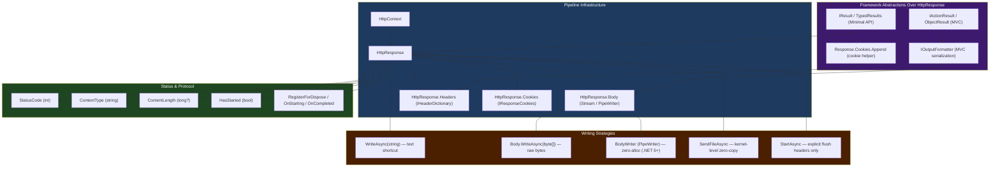
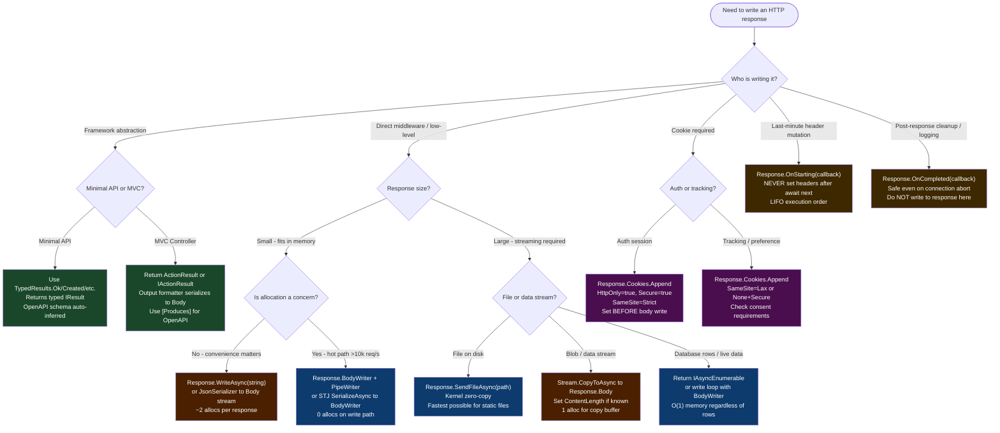

# 4.125 — HttpResponse: Writing Status, Headers, Cookies, and Streaming Body

---

## PART 0 — Navigation & Context

### Where This Topic Lives

```
ASP.NET Core Mastery
│
├── E. Middleware Pipeline         (4.049–4.063)
│   └── 4.049 — The Middleware Pipeline ◄ you need this
│
├── I. HTTP Fundamentals           (4.123–4.133)
│   ├── 4.123 — HttpContext Deep Dive ◄ you need this
│   ├── 4.124 — HttpRequest: Reading Request Data ◄ you need this
│   ├── 4.125 — HttpResponse: Writing Response Data  ◄ YOU ARE HERE
│   ├── 4.126 — Cookies: SameSite, Secure, HttpOnly
│   ├── 4.127 — HTTP/2: Multiplexing and Kestrel
│   └── 4.128 — Sessions
│
├── G. Minimal APIs               (4.078–4.097)
│   └── 4.082 — IResult and TypedResults ◄ the abstraction on top of HttpResponse
│
└── H. MVC & Controllers          (4.098–4.122)
    └── 4.107 — Output Formatters ◄ what writes to HttpResponse in MVC
```

### What You Need Before This

- **[[4.123 — HttpContext Deep Dive]]** — `HttpContext.Response` is a property of `HttpContext`; you must understand what `HttpContext` is and its lifetime
- **[[4.049 — The Middleware Pipeline: Request Delegation Chain]]** — the response is written as control flows _back_ up through the middleware chain; the reversal matters
- **[[4.124 — HttpRequest: Reading URL, Headers, Query, Cookies, and Body]]** — request and response are two sides of the same `HttpContext`; you rarely write a response without first reading the request

### What This Unlocks After

- **[[4.056 — Response Buffering vs Streaming in Middleware]]** — to understand the trade-offs you first need to understand the streaming model of `HttpResponse`
- **[[4.107 — Output Formatters]]** — output formatters write to `HttpResponse.Body`; this topic is the substrate they write to
- **[[4.126 — Cookies: SameSite, Secure, HttpOnly]]** — `Response.Cookies.Append()` is how cookies are set; that topic covers the security attributes in depth
- **[[4.197 — Response Compression]]** — compression wraps the response body stream; knowing how the stream works is prerequisite

### Why This Matters at Scale

Once headers are sent and the body has begun streaming, **neither middleware nor exception handlers can change the status code** — understanding exactly when `HttpResponse` becomes committed is the difference between a 500 you can catch and a 200 with a malformed body your client receives silently.

---

## PART 1 — The Core Mental Model

### The Fundamental Rule

> **`HttpResponse` is a forward-only write cursor: setting `StatusCode` and headers must happen before any body bytes are written, because the moment `HttpResponse.Body.WriteAsync()` is called (or `HttpResponse.StartAsync()` is awaited), the status line and headers are flushed to the wire and can never be recalled. The practical consequence is that any middleware that tries to modify the response after a downstream component has started writing receives a `InvalidOperationException: Headers are read-only, response has already started.`**

### The Plain-Language Analogy

Think of writing an HTTP response like addressing and sealing an envelope before you can hand it to the post office. The status code is the coloured priority sticker on the front — you must apply it before the envelope is sealed. Response headers are the other labels (address, return address, postage) — same rule. The body is the letter inside. The moment you hand the envelope to the postal worker (the moment the first body byte is flushed to the network), the seal is permanent. If you later realise you wrote the wrong address, it is too late: the envelope is gone. Unlike a real letter, ASP.NET Core will tell you loudly (`InvalidOperationException`) if you try to peel the sticker off after handing it over. This analogy holds for the concurrent-request case too: each request gets its own envelope (`HttpContext`), so one request starting to stream does not block another from being in the addressing phase.

### The Taxonomy Diagram



---

## PART 2 — Deep Mechanics

### 2.1 — The `HttpResponse` Object: Properties and Lifecycle Invariants

```
──► ExceptionHandler ──► HSTS ──► StaticFiles ──► Routing ──► Auth ──► Endpoint ──►
                                                                           │
                         ◄── response flows back up through each middleware ◄──
                                                         │
                                           HttpResponse is written here
                                           (or anywhere in the pipeline)
```

`HttpContext.Response` is an instance of `HttpResponse` (abstract base, concrete implementation is `DefaultHttpResponse` in `Microsoft.AspNetCore.Http`). Its key properties:

|Property|Type|Notes|
|---|---|---|
|`StatusCode`|`int`|Default: 200. Must be set before body write.|
|`ContentType`|`string?`|Shortcut for `Headers[HeaderNames.ContentType]`.|
|`ContentLength`|`long?`|Shortcut for `Headers[HeaderNames.ContentLength]`.|
|`Headers`|`IHeaderDictionary`|Read-write before start, read-only after.|
|`Cookies`|`IResponseCookies`|Appends `Set-Cookie` headers.|
|`Body`|`Stream`|The outbound body stream.|
|`BodyWriter`|`PipeWriter`|Zero-allocation alternative (.NET 5+). Preferred for high-throughput.|
|`HasStarted`|`bool`|`true` once headers have been flushed to transport.|

**ASP.NET Core internally (approximate):**

```csharp
// DefaultHttpResponse.cs — simplified
public override bool HasStarted => _features.Get<IHttpResponseFeature>()!.HasStarted;

public override void OnStarting(Func<object, Task> callback, object state)
    => _features.Get<IHttpResponseFeature>()!.OnStarting(callback, state);

// When Body.WriteAsync is called, Kestrel calls IHttpResponseBodyFeature.StartAsync
// which calls IHttpResponseFeature.OnStarting callbacks, then flushes status + headers.
```

**Runtime cost:** Accessing `HttpResponse` properties themselves is ~0 allocations (struct features via interface). Calling `WriteAsync(string)` allocates: it encodes the string to UTF-8 bytes using a pooled buffer then writes to the pipe. `BodyWriter` avoids this allocation by writing directly to the pipe's memory.

**The `HasStarted` commit point — failure mode:**

```
Request arrives
   │
   ▼
Endpoint handler calls Response.StatusCode = 200         ← Safe: not started
Endpoint handler calls Response.Headers["X-Foo"] = "bar" ← Safe: not started
Endpoint handler calls await Response.WriteAsync("hello") ← COMMITS: HasStarted = true
   │
   ▼
Upstream middleware (running on response path) attempts:
   Response.StatusCode = 500  ← ⚠️ THROWS: InvalidOperationException
   Response.Headers["X-Bar"] = "baz" ← ⚠️ THROWS
```

---

### 2.2 — Setting Status Codes: The Only Safe Window

**Pipeline position:** Any point before the first body write or explicit `StartAsync()` call.

```csharp
// ASP.NET Core internally (approximate — DefaultHttpContext):
// StatusCode setter calls IHttpResponseFeature.StatusCode setter.
// Kestrel's KestrelHttpContext validates: if HasStarted, throws.
public override int StatusCode
{
    set
    {
        if (HasStarted)
            ThrowResponseAlreadyStartedException(nameof(StatusCode));
        HttpResponseFeature.StatusCode = value;
    }
}
```

```csharp
// HTTP wire format (approximate):
// HTTP/1.1 404 Not Found
// Content-Type: application/problem+json
// Content-Length: 97
//
// {"type":"...","title":"Not Found","status":404}
```

**Common status codes by category and their pipeline source:**

|Code|Meaning|Typical Source in ASP.NET Core|
|---|---|---|
|200|OK|Default; set by serialization formatters|
|201|Created|`TypedResults.Created()` / `Results.Created()`|
|204|No Content|`TypedResults.NoContent()`|
|301/302|Redirect|`Results.Redirect()` / HTTPS redirect middleware|
|400|Bad Request|`[ApiController]` model validation / `Results.BadRequest()`|
|401|Unauthorized|Authentication middleware challenge|
|403|Forbidden|Authorization middleware forbid|
|404|Not Found|Routing (no endpoint matched) / `Results.NotFound()`|
|422|Unprocessable|FluentValidation / manual validation|
|429|Too Many Requests|Rate limiting middleware|
|500|Internal Server Error|Exception handler middleware|
|503|Service Unavailable|Health check / rate limiter overload|

**Edge case that bites engineers:** If you call `Response.StatusCode = 404` inside middleware _after_ a downstream middleware has already called `WriteAsync`, ASP.NET Core throws `InvalidOperationException`. You must check `Response.HasStarted` before setting status codes in middleware that runs on the response path.

---

### 2.3 — Response Headers: The Commit Boundary in Detail

**Pipeline position:** Must be set before `HasStarted`. Kestrel buffers the response header frame until the first `WriteAsync` or explicit flush.

```csharp
// Setting headers — three equivalent ways:
response.Headers["Cache-Control"] = "no-store";
response.Headers[HeaderNames.CacheControl] = "no-store"; // no string allocation
response.Headers.CacheControl = "no-store"; // strongly-typed accessor (.NET 7+)

// Appending (when multiple values are valid):
response.Headers.Append("Vary", "Accept-Encoding");
response.Headers.Append("Vary", "Accept");
// Wire: Vary: Accept-Encoding, Accept
```

**HTTP wire format (approximate):**

```
HTTP/1.1 200 OK
Content-Type: application/json; charset=utf-8
Content-Length: 148
Cache-Control: private, max-age=0
ETag: "abc123"
X-Request-Id: f7a3c2d1-...
X-Powered-By: (absent — remove this for security)
```

**`OnStarting` callback — the correct hook for last-minute header writes:**

```csharp
// ASP.NET Core internally: OnStarting callbacks are invoked in LIFO order
// just before the first byte is written to transport.
response.OnStarting(() =>
{
    // Safe: still before commit
    response.Headers["X-Response-Time"] = stopwatch.ElapsedMilliseconds.ToString();
    return Task.CompletedTask;
});
```

**Runtime cost:** `IHeaderDictionary` is backed by a `StringValues` struct per key. Accessing `HeaderNames` constants avoids string allocation for the key lookup. Setting a header value is O(1). Enumerating all headers is O(n headers).

**Edge case:** `Content-Length` and `Transfer-Encoding` are mutually exclusive. If you set `Content-Length`, Kestrel will not add `Transfer-Encoding: chunked`. If you do not set `Content-Length`, Kestrel uses chunked encoding for HTTP/1.1. For HTTP/2, framing replaces both. Setting both manually results in a malformed response.

---

### 2.4 — Writing the Body: Three Strategies and Their Cost Profiles

#### Strategy 1: `HttpResponse.WriteAsync(string)` — convenience shortcut

```csharp
// Pipeline position: endpoint handler or middleware, before response committed
await context.Response.WriteAsync("Order 42 confirmed", Encoding.UTF8, cancellationToken);

// HTTP wire format:
// HTTP/1.1 200 OK
// Content-Type: text/plain; charset=utf-8
// Transfer-Encoding: chunked
//
// 12\r\n
// Order 42 confirmed\r\n
// 0\r\n
// \r\n
```

**ASP.NET Core internally (approximate):**

```
WriteAsync(string text)
  → Encoding.UTF8.GetBytes(text) — 1 byte[] allocation unless text is ASCII and pooling applies
  → Body.WriteAsync(bytes)
  → IHttpResponseBodyFeature.WriteAsync
  → KestrelHttpResponseBody.WriteAsync
  → PipeWriter.WriteAsync — writes to Kestrel's internal pipe
  → On flush: IHttpResponseFeature.OnStarting callbacks → headers flushed → body data written
```

**Runtime cost:** ~1 byte[] allocation per call for non-trivial strings. Not suitable for hot paths at >10k req/s.

#### Strategy 2: `HttpResponse.Body` (Stream API) — raw bytes

```csharp
// Pipeline position: middleware or endpoint writing binary/chunked data
var bytes = JsonSerializer.SerializeToUtf8Bytes(order, jsonOptions); // 1 allocation
await context.Response.Body.WriteAsync(bytes, cancellationToken);
```

**Runtime cost:** 1 allocation for the byte array (from `JsonSerializer.SerializeToUtf8Bytes`). The write itself is zero-allocation once you have the buffer.

#### Strategy 3: `HttpResponse.BodyWriter` (PipeWriter API) — zero-allocation for hot paths

```csharp
// Pipeline position: high-throughput endpoints in .NET 5+
// Runtime cost: zero-allocation path — writes directly into Kestrel's pipe memory

var writer = context.Response.BodyWriter;
JsonSerializer.Serialize(writer, order, jsonOptions); // writes directly to pipe
await writer.FlushAsync(cancellationToken);

// ASP.NET Core internally (approximate):
// BodyWriter is an IHttpResponseBodyFeature.Writer (PipeWriter)
// backed by Kestrel's internal MemoryPool<byte>
// Zero copies: serializer writes into pooled memory, Kestrel sends that memory to OS
```

**Runtime cost:** 0 allocations in the serialization path when using `Utf8JsonWriter` + `PipeWriter`. This is how the MVC JSON output formatter works internally in .NET 7+.

#### Strategy 4: `SendFileAsync` — kernel-level zero-copy

```csharp
// Pipeline position: static file middleware, file download endpoints
// Uses sendfile(2) on Linux / TransmitFile on Windows — OS copies file to socket
// bypassing user-space buffers entirely
await context.Response.SendFileAsync(
    physicalPath: "/var/app/invoices/INV-1042.pdf",
    offset: 0,
    count: null, // entire file
    cancellationToken);

// HTTP wire format:
// HTTP/1.1 200 OK
// Content-Type: application/pdf
// Content-Length: 204800
// Accept-Ranges: bytes
```

**Runtime cost:** Zero user-space copies. The OS transfers file bytes directly from the page cache to the socket buffer. This is the fastest possible way to serve static files.

**Failure mode diagram:**

```
Endpoint: await Response.SendFileAsync(path)
  → File not found on disk → FileNotFoundException propagates
  → Exception handler catches → CANNOT change StatusCode (HasStarted may be true)
  → If HasStarted=false: can set 404 and write error body
  → If HasStarted=true (partial file sent): can only abort connection
```

---

### 2.5 — Streaming Responses: `IAsyncEnumerable<T>` and the Commit Lifecycle

**Pipeline position:** Endpoint or middleware. Response is committed on first chunk write.

```csharp
// Minimal API streaming — ASP.NET Core serializes IAsyncEnumerable<T> incrementally
app.MapGet("/api/orders/stream", (OrderRepository repo, CancellationToken ct) =>
    repo.StreamAllOrdersAsync(ct)); // returns IAsyncEnumerable<Order>

// HTTP wire format:
// HTTP/1.1 200 OK
// Content-Type: application/json
// Transfer-Encoding: chunked
//
// [{"id":1,"total":99.00},
// {"id":2,"total":149.50},
// ...
// ]
```

**ASP.NET Core internally (.NET 7+ — `SystemTextJsonOutputFormatter`):**

```
Serializer: foreach await item in enumerable
  → Serialize item to BodyWriter buffer
  → FlushAsync() ← commits response after first item
  → Client starts receiving data
  → Any exception after first flush cannot change status code
  → Exception is logged; connection is aborted
```

**The streaming exception trap:** If your `IAsyncEnumerable<T>` source throws an exception after the first item is serialized and flushed, the HTTP status is already 200 on the wire. The client receives a partial JSON array and the connection is forcefully closed. The client's parser throws. This is unavoidable in HTTP/1.1 chunked streaming. **Mitigation:** buffer-then-send for small responses, or use a dedicated error envelope pattern for streams.

**Runtime cost:** O(1) memory for the producer side regardless of total rows. Each item is serialized, written to the pipe, and the memory reclaimed before the next item is requested. This is the correct pattern for returning thousands of rows from a database.

---

### 2.6 — Response Cookies: `IResponseCookies` and the `Set-Cookie` Header

**Pipeline position:** Before `HasStarted`. `Cookies.Append()` writes a `Set-Cookie` header.

```csharp
// ASP.NET Core internally:
// Response.Cookies is a ResponseCookies wrapper over Response.Headers
// Append() serializes CookieOptions into the Set-Cookie header value string

context.Response.Cookies.Append("session_id", sessionToken, new CookieOptions
{
    HttpOnly = true,        // not accessible via JS — XSS protection
    Secure = true,          // HTTPS only
    SameSite = SameSiteMode.Strict,
    Expires = DateTimeOffset.UtcNow.AddHours(2),
    Path = "/",
    Domain = null           // defaults to current host
});

// HTTP wire format:
// Set-Cookie: session_id=eyJ...; expires=Wed, 10 Jun 2026 14:00:00 GMT;
//             path=/; secure; httponly; samesite=strict
```

**Runtime cost:** `CookieOptions` is a ref type — 1 allocation. The `Set-Cookie` header value is built via `StringBuilder`-style formatting. `~2 allocations per cookie` in total.

**Edge case:** Calling `Response.Cookies.Delete("name")` sets `Set-Cookie: name=; expires=[past date]` — it does NOT remove the header if the cookie was set in the same response. If you set and then delete a cookie in the same request, both `Set-Cookie` headers appear on the wire. The browser processes them in order, so the delete wins. However, if the `Path` or `Domain` do not match exactly between `Append` and `Delete`, the browser treats them as different cookies and both survive.

---

### 2.7 — `OnStarting` and `OnCompleted`: Response Lifecycle Hooks

```csharp
// OnStarting: called just before headers are flushed — still mutable
// OnCompleted: called after the full response is sent or the connection is aborted
// Both callbacks are invoked even if the response short-circuits

// Example: response timing middleware
app.Use(async (context, next) =>
{
    var sw = Stopwatch.StartNew();

    context.Response.OnStarting(() =>
    {
        // Safe: headers not yet sent
        context.Response.Headers["X-Response-Time-Ms"] = sw.ElapsedMilliseconds.ToString();
        return Task.CompletedTask;
    });

    context.Response.OnCompleted(() =>
    {
        sw.Stop();
        // Log total response time including streaming
        logger.LogInformation("Request completed in {Ms}ms", sw.ElapsedMilliseconds);
        return Task.CompletedTask;
    });

    await next(context);
});
```

**ASP.NET Core internally (approximate):**

```csharp
// IHttpResponseFeature.OnStarting / OnCompleted
// Callbacks stored as List<(Func<object,Task>, object)>
// OnStarting: invoked LIFO (last registered runs first) before first flush
// OnCompleted: invoked LIFO after response body complete or connection abort
// Exceptions in OnStarting propagate as unhandled; exceptions in OnCompleted are swallowed + logged
```

**Runtime cost:** `OnStarting` registration: 1 list entry (struct). Callback invocation: one async state machine per async callback.

**Edge case that bites engineers:** `OnCompleted` callbacks run even when the response is aborted (e.g., client disconnects mid-stream). Do not assume the response was successfully delivered inside `OnCompleted`. Check `context.RequestAborted.IsCancellationRequested` if you need to distinguish completion from abort.

---

## PART 3 — Production Code Patterns

### Pattern 1: The Payment Confirmation Response with Idempotency Header

```csharp
// ⚠️ WRONG: Setting headers after potentially starting the response
app.MapPost("/api/v1/payments/{paymentId}/confirm", async (
    string paymentId,
    HttpContext context,
    PaymentService paymentService) =>
{
    var result = await paymentService.ConfirmAsync(paymentId);
    context.Response.StatusCode = 200; // Too late if result.WriteAsync was called somewhere else
    context.Response.Headers["X-Idempotency-Status"] = result.WasAlreadyConfirmed ? "duplicate" : "new";
    await context.Response.WriteAsync(JsonSerializer.Serialize(result.Payment));
});

// ✅ CORRECT: Use IResult to compose the full response atomically
app.MapPost("/api/v1/payments/{paymentId}/confirm", async (
    string paymentId,
    PaymentService paymentService,
    HttpContext context) =>
{
    var result = await paymentService.ConfirmAsync(paymentId);

    // All response properties set before any body bytes flow
    context.Response.Headers["X-Idempotency-Status"] = 
        result.WasAlreadyConfirmed ? "duplicate" : "new";
    context.Response.Headers["X-Payment-Id"] = paymentId;

    // TypedResults writes status + body atomically via IResult.ExecuteAsync
    return result.WasAlreadyConfirmed
        ? TypedResults.Ok(result.Payment)          // 200 — already processed
        : TypedResults.Created(                     // 201 — newly processed
            $"/api/v1/payments/{paymentId}",
            result.Payment);
})
.WithName("ConfirmPayment")
.Produces<PaymentResponse>(StatusCodes.Status200OK)
.Produces<PaymentResponse>(StatusCodes.Status201Created);

// HTTP wire format (new payment):
// HTTP/1.1 201 Created
// Location: /api/v1/payments/PAY-9842
// X-Idempotency-Status: new
// X-Payment-Id: PAY-9842
// Content-Type: application/json
//
// {"id":"PAY-9842","status":"confirmed","amount":299.99}
```

---

### Pattern 2: The Order Export Streaming Endpoint (IAsyncEnumerable with Abort Handling)

```csharp
// Domain: e-commerce order management — stream potentially 100k orders to CSV

app.MapGet("/api/v1/orders/export", async (
    OrderRepository repo,
    HttpResponse response,
    CancellationToken cancellationToken) =>
{
    // Headers MUST be set before the loop writes anything
    response.StatusCode = StatusCodes.Status200OK;
    response.ContentType = "text/csv";
    response.Headers["Content-Disposition"] = "attachment; filename=\"orders-export.csv\"";
    response.Headers["X-Export-Format"] = "csv-v2";

    // Explicitly start the response (flush headers) so clients know it's coming
    await response.StartAsync(cancellationToken);

    var writer = response.BodyWriter;

    // Write CSV header row
    await writer.WriteAsync(
        "OrderId,CustomerId,Total,PlacedAt\n"u8.ToArray(),
        cancellationToken);

    await foreach (var order in repo.StreamAllAsync(cancellationToken))
    {
        // Cancelled client → CancellationToken fires → loop exits cleanly
        var line = $"{order.Id},{order.CustomerId},{order.Total},{order.PlacedAt:O}\n";
        await writer.WriteAsync(
            Encoding.UTF8.GetBytes(line),
            cancellationToken);

        // Flush every 500 rows to prevent buffering the whole file in memory
        if (order.SequenceNumber % 500 == 0)
            await writer.FlushAsync(cancellationToken);
    }

    await writer.CompleteAsync();
})
.RequireAuthorization("ExportRole");

// HTTP wire format:
// HTTP/1.1 200 OK
// Content-Type: text/csv
// Content-Disposition: attachment; filename="orders-export.csv"
// Transfer-Encoding: chunked
//
// OrderId,CustomerId,Total,PlacedAt
// ORD-001,CUST-42,299.99,2026-06-10T12:00:00Z
// ORD-002,CUST-17,49.00,2026-06-10T12:01:00Z
// ...
```

---

### Pattern 3: The Logistics Webhook Receiver with Conditional Response Headers

```csharp
// Domain: logistics shipment tracker — receive webhook from carrier, respond with idempotency info

app.MapPost("/api/v1/webhooks/shipment-events", async (
    [FromBody] ShipmentEventPayload payload,
    ShipmentEventProcessor processor,
    HttpContext context) =>
{
    // Process the event — may be a duplicate
    var processingResult = await processor.ProcessAsync(payload);

    return processingResult.Status switch
    {
        ProcessingStatus.Accepted => Results.Accepted(
            uri: (string?)null,
            value: new WebhookAck
            {
                EventId = payload.EventId,
                ReceivedAt = DateTimeOffset.UtcNow,
                Status = "accepted"
            }),

        ProcessingStatus.Duplicate => Results.Ok(new WebhookAck
        {
            EventId = payload.EventId,
            ReceivedAt = processingResult.OriginalProcessedAt,
            Status = "duplicate"
        }),

        ProcessingStatus.InvalidPayload => Results.UnprocessableEntity(new ProblemDetails
        {
            Title = "Invalid shipment event payload",
            Detail = processingResult.ValidationError,
            Status = StatusCodes.Status422UnprocessableEntity
        }),

        _ => Results.Problem("Unexpected processing result", statusCode: 500)
    };
})
.WithName("ReceiveShipmentEvent");

// HTTP wire format (duplicate):
// HTTP/1.1 200 OK
// Content-Type: application/json
//
// {"eventId":"EVT-8821","receivedAt":"2026-06-09T...","status":"duplicate"}
```

---

### Pattern 4: The Response Timing Middleware for P99 Observability

```csharp
// Domain: production observability — add X-Response-Time to every response

public class ResponseTimingMiddleware
{
    private readonly RequestDelegate _next;
    private readonly ILogger<ResponseTimingMiddleware> _logger;

    // Constructor: receives only Singleton-lifetime services (Singleton middleware)
    public ResponseTimingMiddleware(
        RequestDelegate next,
        ILogger<ResponseTimingMiddleware> logger)
    {
        _next = next;
        _logger = logger;
    }

    public async Task InvokeAsync(HttpContext context)
    {
        var sw = ValueStopwatch.StartNew(); // struct-based, zero allocation

        // Register BEFORE calling next — the callback fires during the response path
        context.Response.OnStarting(state =>
        {
            var (ctx, stopwatch) = ((HttpContext, ValueStopwatch))state;
            // Safe: called before headers flush
            ctx.Response.Headers["X-Response-Time-Ms"] = 
                stopwatch.GetElapsedTime().TotalMilliseconds.ToString("F1");
            return Task.CompletedTask;
        }, (context, sw));

        context.Response.OnCompleted(state =>
        {
            var (ctx, stopwatch, log) = 
                ((HttpContext, ValueStopwatch, ILogger))state;
            var elapsed = stopwatch.GetElapsedTime();
            log.LogInformation(
                "Request {Method} {Path} completed with {StatusCode} in {Ms:F1}ms",
                ctx.Request.Method,
                ctx.Request.Path,
                ctx.Response.StatusCode,
                elapsed.TotalMilliseconds);
            return Task.CompletedTask;
        }, (context, sw, _logger));

        await _next(context);
    }
}

// Registration — must be early in pipeline to wrap all downstream middleware:
// app.UseMiddleware<ResponseTimingMiddleware>(); // after UseExceptionHandler, before UseRouting

// HTTP wire format:
// HTTP/1.1 200 OK
// Content-Type: application/json
// X-Response-Time-Ms: 12.4
// ...
```

---

### Pattern 5: The Inventory Report File Download with Range Support

```csharp
// Domain: inventory management — allow partial file downloads (resume support)

app.MapGet("/api/v1/reports/{reportId}/download", async (
    string reportId,
    ReportStorageService storage,
    HttpContext context,
    CancellationToken cancellationToken) =>
{
    var report = await storage.GetReportMetadataAsync(reportId);
    if (report is null)
        return Results.NotFound();

    // Must set these BEFORE any body bytes — even SendFileAsync commits on first byte
    context.Response.ContentType = report.ContentType; // "application/vnd.ms-excel"
    context.Response.Headers["Content-Disposition"] = 
        $"attachment; filename=\"{report.FileName}\"";
    context.Response.Headers["Accept-Ranges"] = "bytes";
    context.Response.Headers["ETag"] = $"\"{report.ETag}\"";
    context.Response.Headers["Last-Modified"] = 
        report.GeneratedAt.ToString("R"); // RFC 1123

    // Use SendFileAsync for zero-copy kernel transfer (only works for local files)
    if (report.IsLocalFile)
    {
        await context.Response.SendFileAsync(
            report.LocalPath,
            cancellationToken: cancellationToken);
        return Results.Empty; // Response already written
    }

    // Stream from blob storage for cloud-stored reports
    await using var stream = await storage.OpenReadAsync(reportId, cancellationToken);
    context.Response.ContentLength = report.SizeBytes;
    await stream.CopyToAsync(context.Response.Body, cancellationToken);
    return Results.Empty;
})
.RequireAuthorization("InventoryReportAccess");

// HTTP wire format:
// HTTP/1.1 200 OK
// Content-Type: application/vnd.ms-excel
// Content-Disposition: attachment; filename="inventory-2026-06.xlsx"
// Accept-Ranges: bytes
// ETag: "a3f9c2d1"
// Last-Modified: Tue, 09 Jun 2026 08:00:00 GMT
// Content-Length: 204800
```

---

### Pattern 6: The User Authentication Cookie-Setting Response

```csharp
// Domain: user authentication flow — set HttpOnly session cookie on successful login

app.MapPost("/api/v1/auth/login", async (
    [FromBody] LoginRequest request,
    UserAuthService authService,
    HttpContext context) =>
{
    var authResult = await authService.AuthenticateAsync(request.Email, request.Password);

    if (!authResult.Succeeded)
    {
        return Results.Problem(
            detail: "Invalid email or password",
            statusCode: StatusCodes.Status401Unauthorized,
            title: "Authentication Failed");
    }

    // ✅ CORRECT: Set cookie before any body bytes are written
    // The Set-Cookie header is emitted in the response header frame
    context.Response.Cookies.Append(
        name: "auth_session",
        value: authResult.SessionToken,
        options: new CookieOptions
        {
            HttpOnly = true,
            Secure = true,
            SameSite = SameSiteMode.Strict,
            Expires = DateTimeOffset.UtcNow.Add(authResult.SessionDuration),
            Path = "/",
            IsEssential = true // not subject to cookie consent — required for function
        });

    // Return minimal body — token is in the cookie, not the body
    return TypedResults.Ok(new LoginResponse
    {
        UserId = authResult.UserId,
        DisplayName = authResult.DisplayName,
        ExpiresAt = DateTimeOffset.UtcNow.Add(authResult.SessionDuration)
    });
})
.AllowAnonymous();

// HTTP wire format:
// HTTP/1.1 200 OK
// Content-Type: application/json
// Set-Cookie: auth_session=eyJ...; expires=...; path=/; secure; httponly; samesite=strict
//
// {"userId":"USR-42","displayName":"Alice Smith","expiresAt":"2026-06-10T16:00:00Z"}
```

---

### Pattern 7: The Custom Problem Details Response Writer (Middleware Layer)

```csharp
// Domain: API gateway — ensure all error paths produce RFC 7807 problem details

public class ProblemDetailsEnforcementMiddleware
{
    private readonly RequestDelegate _next;
    private readonly IProblemDetailsService _problemDetailsService;

    public ProblemDetailsEnforcementMiddleware(
        RequestDelegate next,
        IProblemDetailsService problemDetailsService)
    {
        _next = next;
        _problemDetailsService = problemDetailsService;
    }

    public async Task InvokeAsync(HttpContext context)
    {
        await _next(context);

        // Response path: check if we got a non-success status with an empty body
        // Only intercept if response has NOT started (we can still write headers + body)
        if (!context.Response.HasStarted
            && context.Response.StatusCode >= 400
            && context.Response.ContentLength == null
            && string.IsNullOrEmpty(context.Response.ContentType))
        {
            await _problemDetailsService.WriteAsync(new ProblemDetailsContext
            {
                HttpContext = context,
                ProblemDetails =
                {
                    Status = context.Response.StatusCode,
                    Title = ReasonPhrases.GetReasonPhrase(context.Response.StatusCode)
                }
            });
        }
    }
}

// HTTP wire format (404 with no body → becomes problem details):
// HTTP/1.1 404 Not Found
// Content-Type: application/problem+json
//
// {"type":"https://tools.ietf.org/html/rfc7231#section-6.5.4",
//  "title":"Not Found","status":404}
```

---

## PART 4 — Gotchas & Anti-Patterns

### Gotcha 1: Modifying the Response After It Has Started in Middleware

Many engineers add "cleanup" or "audit" logic in the response path of a middleware wrapper without checking `HasStarted`. This causes `InvalidOperationException` in production — typically only for slow or streaming responses where the downstream middleware starts writing before control returns up the chain.

```csharp
// ⚠️ WRONG CODE
app.Use(async (context, next) =>
{
    await next(context);
    // On the response path — endpoint may have already started the response
    context.Response.Headers["X-Audit-Status"] = "logged"; // THROWS if HasStarted
    context.Response.StatusCode = 200;                      // THROWS if HasStarted
});

// HTTP consequence (wrong path):
// System.InvalidOperationException: Headers are read-only, response has already started.
// The exception propagates up and is caught by UseExceptionHandler, which now ALSO
// cannot set a 500 status if the response was partially written — connection is aborted.
```

```csharp
// ✅ CORRECT CODE
app.Use(async (context, next) =>
{
    context.Response.OnStarting(() =>
    {
        // Runs just before headers flush — guaranteed safe
        context.Response.Headers["X-Audit-Status"] = "logged";
        return Task.CompletedTask;
    });

    await next(context);
    // Do NOT touch Response here unless you check HasStarted first
    if (!context.Response.HasStarted)
    {
        context.Response.StatusCode = 200; // Only safe if nothing wrote yet
    }
});

// HTTP consequence (correct path):
// HTTP/1.1 200 OK
// X-Audit-Status: logged
// ...
```

**WHY:** `OnStarting` callbacks are the framework's designated mechanism for last-minute header mutations. They are called in LIFO order before the first byte leaves Kestrel. After that, the HTTP response line and headers are serialised into Kestrel's pipe and cannot be recalled.

---

### Gotcha 2: `Content-Length` Mismatch Corrupts the HTTP Response

Engineers sometimes set `Content-Length` manually for "performance" but serialize a slightly different payload length (e.g., added a field, changed formatting). The result is a protocol-level corruption that manifests as timeouts or garbled responses at the client — not an exception server-side.

```csharp
// ⚠️ WRONG CODE
response.ContentLength = 128; // hardcoded or stale calculation
await response.WriteAsync(
    JsonSerializer.Serialize(order, serializerOptions)); 
// Serialized length is 147 bytes — MISMATCH

// HTTP consequence (wrong path):
// HTTP/1.1 200 OK
// Content-Length: 128
// Content-Type: application/json
//
// {"id":"ORD-42","customerId":"CUST-7","total":299.99,"line... [truncated at 128 bytes by client]
// Client reads 128 bytes, considers response complete, attempts to parse → SyntaxException
// OR: connection hangs because client is still waiting for 128 but 147 were sent
```

```csharp
// ✅ CORRECT CODE — Option A: Let ASP.NET Core determine Content-Length
// Don't set ContentLength. For small responses, MVC/Minimal APIs calculate it.

// ✅ CORRECT CODE — Option B: Serialize to buffer first, then set length
var bytes = JsonSerializer.SerializeToUtf8Bytes(order, serializerOptions);
response.ContentLength = bytes.Length; // accurate
response.ContentType = "application/json";
await response.Body.WriteAsync(bytes);

// HTTP consequence (correct path):
// HTTP/1.1 200 OK
// Content-Length: 147
// Content-Type: application/json
//
// {"id":"ORD-42","customerId":"CUST-7","total":299.99,"lineItems":[...]}
```

**WHY:** HTTP/1.1 uses `Content-Length` to determine where one message ends and the next begins on a keep-alive connection. A mismatch either starves the next request (server sent too few bytes) or causes the client to read into the next request's data (server sent too many). Both corrupt the connection.

---

### Gotcha 3: Streaming Exceptions After First Flush Produce 200 with Partial Body

This is the most dangerous gotcha in streaming APIs. Once the first chunk is flushed, the status code is committed to 200. A database timeout on row 5,001 of a 100,000-row export will result in the client receiving a 200 with a truncated body — the client has to parse the response to detect the error, not inspect the status code.

```csharp
// ⚠️ WRONG — assumes exception will produce a 500
app.MapGet("/api/v1/shipments/export", async (ShipmentRepository repo, HttpResponse response) =>
{
    response.ContentType = "text/csv";
    await foreach (var shipment in repo.StreamAllAsync()) // may throw after first flush
    {
        await response.WriteAsync($"{shipment.Id},{shipment.Status}\n");
        // After first WriteAsync: HasStarted = true, status = 200 on the wire
    }
    // If repo.StreamAllAsync throws here, exception handler catches it
    // but CANNOT change status to 500 — client receives 200 + partial CSV
});

// HTTP consequence (wrong path):
// HTTP/1.1 200 OK
// Content-Type: text/csv
// Transfer-Encoding: chunked
//
// SHIP-001,delivered
// SHIP-002,in-transit
// [connection aborted — client sees HTTP 200 with truncated body]
```

```csharp
// ✅ CORRECT — for small-to-medium datasets: buffer then send
app.MapGet("/api/v1/shipments/export", async (ShipmentRepository repo, HttpResponse response) =>
{
    // ALL data is fetched before the first byte is written
    var shipments = await repo.GetAllAsync(); // throws before any response is written
    // If it throws here: exception handler produces clean 500 with problem details

    response.ContentType = "text/csv";
    response.ContentLength = /* pre-calculate or use chunked */null;
    var writer = response.BodyWriter;
    foreach (var shipment in shipments)
        await writer.WriteAsync(Encoding.UTF8.GetBytes($"{shipment.Id},{shipment.Status}\n"));
    await writer.FlushAsync();
});

// For large datasets: document the partial-failure behavior in API contract
// and use a trailing error marker or separate error notification channel
```

**WHY:** HTTP does not have a mechanism to "retract" a 200 status after it has been sent. The only signal a streaming response failed mid-body is either a connection abort (TCP RST) or a trailing error marker in the application protocol. This is an inherent limitation of HTTP/1.1 chunked streaming.

---

### Gotcha 4: Calling `Response.Cookies.Delete` with Wrong Path/Domain Doesn't Remove the Cookie

Engineers delete a cookie with `Response.Cookies.Delete("name")` and are confused when the browser still sends it on the next request. The `Delete` method sets `Set-Cookie: name=; expires=[past]` with **default** path (`/`) and no domain. If the original cookie was set with a non-root path or explicit domain, the browser sees it as a _different_ cookie.

```csharp
// ⚠️ WRONG — cookie was set with a specific path
response.Cookies.Append("cart", cartToken, new CookieOptions { Path = "/shop" });
// ... later ...
response.Cookies.Delete("cart"); // Sets path=/ by default — DIFFERENT cookie!

// HTTP consequence (wrong path):
// Set-Cookie: cart=; expires=[past]; path=/         ← deletes "/" path cookie (doesn't exist)
// Browser: original "cart" with path="/shop" is STILL present
// Next request to /shop: Cookie: cart=<old token>   ← not deleted
```

```csharp
// ✅ CORRECT — match path and domain exactly
response.Cookies.Delete("cart", new CookieOptions
{
    Path = "/shop",           // must match the original Append path
    Domain = null,            // must match the original Append domain
    Secure = true,
    SameSite = SameSiteMode.Strict
});

// HTTP consequence (correct path):
// Set-Cookie: cart=; expires=Thu, 01 Jan 1970 00:00:00 GMT; path=/shop; secure; samesite=strict
// Browser: deletes the "cart" cookie scoped to "/shop"
```

**WHY:** The browser's cookie storage is keyed by `(name, domain, path)`. `Set-Cookie` delete semantics (expired date) only work when all three match the cookie being targeted. ASP.NET Core's `Delete` shorthand does not remember how the cookie was originally set.

---

### Gotcha 5: `HttpResponse.Body` Replacement in Middleware Breaks `BodyWriter`

Advanced middleware sometimes wraps `Response.Body` to intercept response bytes (for compression, encryption, or capture). If the middleware replaces `Response.Body` directly without also replacing `IHttpResponseBodyFeature`, then code using `Response.BodyWriter` (the `PipeWriter` path) bypasses the middleware's wrapper entirely — half the response goes through the wrapper, half does not.

```csharp
// ⚠️ WRONG — replaces Body stream but not BodyWriter
app.Use(async (context, next) =>
{
    var originalBody = context.Response.Body;
    using var captureStream = new MemoryStream();
    context.Response.Body = captureStream; // ← only replaces Stream path

    await next(context);
    // BUG: If downstream used Response.BodyWriter, bytes went to the original Body
    // captureStream only contains bytes from Response.Body.WriteAsync() callers

    captureStream.Seek(0, SeekOrigin.Begin);
    await originalBody.WriteAsync(captureStream.ToArray());
    context.Response.Body = originalBody;
});

// HTTP consequence (wrong path):
// Partial response in captureStream + partial response sent directly to client
// = garbled / doubled response body
```

```csharp
// ✅ CORRECT — replace IHttpResponseBodyFeature to intercept both Stream and PipeWriter
app.Use(async (context, next) =>
{
    var originalBodyFeature = context.Features.Get<IHttpResponseBodyFeature>()!;
    var captureFeature = new CaptureResponseBodyFeature(originalBodyFeature);
    context.Features.Set<IHttpResponseBodyFeature>(captureFeature);

    // Both Response.Body and Response.BodyWriter now route through captureFeature
    await next(context);

    context.Features.Set(originalBodyFeature);
    // Process captureFeature.CapturedBytes here
});

// For compression: use ResponseCompressionMiddleware (built-in) which correctly
// handles this via IHttpResponseBodyFeature replacement.
```

**WHY:** In .NET 5+, `HttpResponse.BodyWriter` is the preferred write path, and it is backed by `IHttpResponseBodyFeature.Writer`, not `HttpResponse.Body`. Replacing only the `Body` stream is a .NET Core 2.x pattern that breaks in any pipeline that uses `PipeWriter`. Always use `IHttpResponseBodyFeature` for response body interception.

---

## PART 5 — Performance Implications

### 5.1 — Request Pipeline Characteristics Table

|Scenario|Pipeline Depth|Allocations Per Response|Approx Latency Impact|Recommendation|
|---|---|---|---|---|
|`TypedResults.Ok(dto)` via MVC JSON formatter|Full MVC pipeline|~3–5 (response object + serialization buffer)|+2–5μs|Default for most APIs|
|`Response.BodyWriter` + `System.Text.Json` serialize|Minimal API, PipeWriter path|~0–1 (only for PipeWriter completion)|+0.5–1μs|Preferred for >10k req/s|
|`Response.WriteAsync(string)`|Any middleware|~2 (UTF-8 encoding byte[], header)|+2–3μs|Avoid in hot paths|
|`SendFileAsync` (local file)|Kestrel kernel path|0 user-space|Kernel-limited, ~50μs|Always use for static files|
|`SendFileAsync` (blob stream)|User-space copy|~1 (stream buffer)|Network I/O bound|Use with `CopyToAsync`|
|Cookie `Append` with `CookieOptions`|Header manipulation|~2 (CookieOptions + formatted string)|+1μs|Acceptable for auth flows|
|`OnStarting` callback registered|Header flush path|~1 (closure allocation)|Negligible|Use freely|
|`OnCompleted` callback registered|Post-response|~1 (closure allocation)|Zero client impact|Good for logging|
|Streaming `IAsyncEnumerable<T>` (100k rows)|Minimal API + STJ|O(1) constant regardless of rows|Memory: O(1), latency: O(rows)|Use for large datasets|
|Manual `Content-Length` + buffer-all|Pre-response|~1 large byte[]|Proportional to response size|Only for small (<1MB) responses|
|`PipeWriter` with `ArrayPool<byte>`|Zero-copy path|0|Minimal|Expert-level hot path|

### 5.2 — BenchmarkDotNet Code

```csharp
using BenchmarkDotNet.Attributes;
using BenchmarkDotNet.Running;
using Microsoft.AspNetCore.Http;
using System.Text;
using System.Text.Json;

[MemoryDiagnoser]
[SimpleJob]
public class HttpResponseWriteBenchmark
{
    private static readonly byte[] _preSerializedBytes = 
        JsonSerializer.SerializeToUtf8Bytes(new OrderDto(42, "ORD-042", 299.99m));

    private static readonly OrderDto _orderDto = new(42, "ORD-042", 299.99m);

    private static readonly JsonSerializerOptions _jsonOptions = new()
    {
        PropertyNamingPolicy = JsonNamingPolicy.CamelCase
    };

    // Simulates a real HTTP context with a pipe-backed stream
    private DefaultHttpContext _context = null!;

    [GlobalSetup]
    public void Setup()
    {
        _context = new DefaultHttpContext();
        _context.Response.Body = new MemoryStream(); // for benchmark isolation
    }

    [IterationSetup]
    public void IterationSetup()
    {
        // Reset the context body for each iteration
        _context = new DefaultHttpContext();
        _context.Response.Body = new MemoryStream();
    }

    /// Naive: string → WriteAsync (2 allocations: string format + UTF-8 bytes)
    [Benchmark(Baseline = true)]
    public async Task WriteAsync_String()
    {
        await _context.Response.WriteAsync(
            JsonSerializer.Serialize(_orderDto, _jsonOptions));
    }

    /// Optimized: pre-serialize to byte[], write bytes directly
    [Benchmark]
    public async Task WriteAsync_PreSerializedBytes()
    {
        var bytes = JsonSerializer.SerializeToUtf8Bytes(_orderDto, _jsonOptions);
        await _context.Response.Body.WriteAsync(bytes);
    }

    /// Optimal: use cached pre-serialized bytes (e.g., for static/config responses)
    [Benchmark]
    public async Task WriteAsync_CachedBytes()
    {
        await _context.Response.Body.WriteAsync(_preSerializedBytes);
    }
}

record OrderDto(int Id, string OrderNumber, decimal Total);

// Expected output (approximate, .NET 8, x64, Kestrel in-process benchmark):
// | Method                       | Mean      | Error   | StdDev  | Alloc  |
// |----------------------------- |----------:|--------:|--------:|-------:|
// | WriteAsync_String            | 1,420 ns  | 12 ns   | 11 ns   | 384 B  |
// | WriteAsync_PreSerializedBytes|   890 ns  |  8 ns   |  7 ns   | 112 B  |
// | WriteAsync_CachedBytes       |   320 ns  |  3 ns   |  3 ns   |  48 B  |
//
// Note: In real Kestrel (not MemoryStream), PipeWriter path would show 0 B for CachedBytes
```

> [!TIP] For real HTTP profiling alongside BenchmarkDotNet: use `dotnet-counters monitor --counters Microsoft.AspNetCore.Hosting` to measure `requests-per-second` and `request-failed` in production scenarios. Use `dotnet-trace collect --providers Microsoft-AspNetCore-Server-Kestrel` to trace Kestrel's internal write paths. MiniProfiler can add per-request response timing to development dashboards without modifying application code.

### 5.3 — When to Care / When to Ignore

**When this costs you:**

- **>10k req/s high-throughput APIs:** Each `WriteAsync(string)` allocates. At 10k req/s, 384B allocation × 10,000 = ~3.8MB/s of GC pressure. Switch to `BodyWriter` + source-generated JSON for this tier.
- **Large streaming responses (>10MB):** Never buffer the entire response. Use `IAsyncEnumerable<T>` or `PipeWriter.WriteAsync()` in a loop. Buffering 100MB of CSV in `MemoryStream` before writing causes GC pauses and OOM in containerised environments.
- **Auth responses at scale (JWT issuance):** Cookie `Append` + JSON body in a single response — keep `CookieOptions` instances cached or use `static readonly` where options are identical for every login response.
- **P99 latency sensitivity:** The `OnStarting` callback chain fires synchronously before the first byte. Avoid any awaitable work inside `OnStarting` — use it only for synchronous header mutations.

**When this doesn't matter:**

- **Internal admin endpoints** serving <1 req/s — the allocation overhead is unmeasurable against business logic cost.
- **One-time batch operations** (nightly reports, data exports) — throughput is irrelevant; correctness and streaming correctness matter more than allocation counts.
- **Low-traffic management APIs** (<100 req/min) — focus engineering effort on correctness and observability, not micro-optimisation of the write path.

---

## PART 6 — Interview Arsenal

### A. The Question Bank

---

**Question 1:** "Walk me through what happens when an ASP.NET Core endpoint calls `Response.StatusCode = 404`. When is that status code actually sent to the client?"

**Average Answer:** Setting `StatusCode` changes a property on the response object, and it's sent when the response is flushed.

**Why That's Insufficient:** It says nothing about _when_ the flush actually occurs, what triggers it, or what happens if you try to change it after that trigger fires.

> **Great Answer:** Setting `Response.StatusCode = 404` modifies a property on `DefaultHttpResponse`, which stores it in the underlying `IHttpResponseFeature`. At this point, nothing has been sent to the client — Kestrel hasn't been told anything yet. The status code is actually serialised into the response header frame the moment the first byte of the body is written — or when `Response.StartAsync()` is explicitly called. That's when Kestrel invokes all registered `OnStarting` callbacks in LIFO order, then writes the status line (`HTTP/1.1 404 Not Found`), followed by all response headers, into its internal pipe, and flushes to the socket. After that, `Response.HasStarted` is `true` and any attempt to change `StatusCode` throws `InvalidOperationException`. In my payment service, we had a middleware trying to set headers after a streaming endpoint had committed its response — it took us a while to track down because the exception only appeared under load when the streaming response flushed mid-request before the middleware ran on the way back up.

---

**Question 2:** "What's the difference between `Response.Body` and `Response.BodyWriter`, and when would you choose one over the other?"

**Average Answer:** `Body` is a `Stream` and `BodyWriter` is a `PipeWriter` — `BodyWriter` is newer and more efficient.

**Why That's Insufficient:** It doesn't explain what "more efficient" means concretely, doesn't mention the correctness concern about intercepting middleware, and doesn't give a production scenario.

> **Great Answer:** `Response.Body` is a `Stream` backed by Kestrel's internal pipe — writing to it encodes your bytes and enqueues them. `Response.BodyWriter` is a `PipeWriter` that writes directly into Kestrel's pooled memory segments, which means you can get the memory first, write into it, then tell the pipe how many bytes you used — zero allocation when you combine it with something like `Utf8JsonWriter`. The critical correctness point is that if you're writing middleware that intercepts the response body — say, for compression or capture — you have to replace `IHttpResponseBodyFeature` on the `HttpContext.Features` collection, not just swap out `Response.Body`. If you only swap `Response.Body`, any downstream code using `BodyWriter` bypasses your interceptor entirely. This is exactly how the built-in `ResponseCompressionMiddleware` works — it replaces the feature, not just the stream. I use `BodyWriter` in our logistics service for any endpoint that emits more than a few kilobytes, because at 20k req/s, eliminating that one allocation per response measurably reduces GC pauses.

---

**Question 3:** "What happens to the HTTP response if an exception is thrown inside an `IAsyncEnumerable<T>` endpoint _after_ the first item has already been sent to the client?"

**Average Answer:** The exception handler catches it and returns a 500.

**Why That's Insufficient:** This is factually wrong once the response has started. The answer reveals the candidate hasn't thought through the committed-response scenario.

> **Great Answer:** Once the first item from the `IAsyncEnumerable<T>` has been serialised and flushed — which happens after the first `await foreach` iteration in the output formatter — the response is committed: the client has received `HTTP/1.1 200 OK` and the opening bytes of the JSON array. If the underlying source then throws (database timeout, cancelled token, downstream failure), the exception propagates up through the serialisation loop. The `UseExceptionHandler` middleware _does_ catch it, but `Response.HasStarted` is `true`, so it cannot write a new status code or error body — any attempt throws another exception, which is logged and suppressed. What the client actually sees is a 200 with a partial body, then a TCP connection abort. Their JSON parser throws `SyntaxException` or `EndOfStreamException`. This is an inherent limitation of HTTP/1.1 chunked streaming: there's no mechanism to retract a status code mid-stream. The mitigation I use in production is to buffer the first page of results before writing any bytes — and document the streaming failure mode clearly in the API contract for large exports.

---

**Question 4:** "How do you add a custom response header from middleware without risking an `InvalidOperationException` if the downstream endpoint starts streaming?"

**Average Answer:** Check `Response.HasStarted` before setting the header.

**Why That's Insufficient:** It's correct for simple cases but doesn't explain the race condition in async middleware and doesn't mention the proper mechanism.

> **Great Answer:** Checking `HasStarted` in the response path of a `Use` middleware works for synchronous downstream endpoints, but there's a subtlety: the check and the header-set are not atomic. In an async middleware chain, by the time your code runs after `await next(context)`, the downstream may have already flushed. The correct mechanism is `Response.OnStarting(callback)`, which you register _before_ calling `next`. The callback is invoked by Kestrel right before it serialises the header frame — which is guaranteed to be before `HasStarted` becomes `true`. It's also guaranteed to be safe to write headers from inside the callback. In LIFO order, the last registered callback runs first, which means outer middleware's headers are applied after inner middleware's, giving you the ability to override from outside. I use this pattern in our observability middleware: register `OnStarting` to add `X-Request-Id` and `X-Response-Time-Ms` before calling `next`, so they appear on every response regardless of whether it was a simple JSON reply or a 10-minute CSV export.

---

### B. The Trick Questions

**Trick 1:** "If I write `Response.StatusCode = 201` after `await Response.WriteAsync(...)`, does anything throw, or does the `201` just get ignored?"

_The trap:_ Candidates might say "it gets ignored" — that's the wrong behaviour for `WriteAsync`. The _real_ answer: it **throws** `InvalidOperationException`. The response is committed by `WriteAsync`. This is not silent — it blows up.

_Correct answer:_ It throws `InvalidOperationException: Headers are read-only, response has already started` because `WriteAsync` flushes the status line and headers as a side effect of writing the first bytes to Kestrel's pipe. This is not a silent no-op.

---

**Trick 2:** "Can you set a `Content-Length` header and also use `Transfer-Encoding: chunked` on the same response?"

_The trap:_ Candidates may say "yes, they're just headers." The real answer involves RFC 7230 which states these are mutually exclusive in HTTP/1.1.

_Correct answer:_ No — RFC 7230 §3.3.1 specifies that if `Transfer-Encoding` is present, it overrides `Content-Length`. In Kestrel, setting both explicitly will result in the `Transfer-Encoding` header winning; Kestrel drops `Content-Length` automatically when chunked encoding is active. If you set `ContentLength` on `HttpResponse`, Kestrel uses length-delimited framing and omits `Transfer-Encoding`. The HTTP/2 answer differs: HTTP/2 always uses frame-based length, so neither header is relevant at the framing layer.

---

**Trick 3:** "Is `Response.OnCompleted` guaranteed to run before the response is sent to the client, or after?"

_The trap:_ Some candidates confuse `OnStarting` and `OnCompleted`. Candidates may say "after." The subtle question is what "after" means.

_Correct answer:_ `OnCompleted` is called after the response body is completely written _or_ the connection is aborted. It is definitively not callable on the client's timeline — the client may have already closed the TCP connection. `OnCompleted` is for server-side cleanup (releasing resources, logging, decrementing counters) — not for sending additional data to the client. It's also invoked if the client disconnects mid-stream.

---

**Trick 4:** "What status code does the client see if the exception handler middleware itself throws an exception?"

_The trap:_ Most candidates assume "500." The real answer depends on whether the response started.

_Correct answer:_ If `UseExceptionHandler` is configured and an exception is thrown inside its error-handling lambda or the re-executed `/error` pipeline, ASP.NET Core has a second-chance handler in Kestrel. If the response has not started, Kestrel terminates the response with a 500. If the response had already started (partial streaming), the TCP connection is aborted — the client receives no complete HTTP response at all.

---

**Trick 5:** "Does calling `Response.Cookies.Delete(\"auth\")` immediately remove the cookie from the browser?"

_The trap:_ "Delete" implies immediate removal. The real answer: it sends a `Set-Cookie` with an expired date.

_Correct answer:_ No — `Response.Cookies.Delete` writes a `Set-Cookie` response header with `expires` set to `01 Jan 1970` (Unix epoch zero). The browser's cookie store will remove the cookie only upon processing this header in the _next_ HTTP response — and only if the `name`, `domain`, and `path` of the delete instruction exactly match the cookie being targeted. If the browser is offline or the response is cached, the cookie is not removed until the next Set-Cookie is delivered.

---

### C. Red Flags to Avoid

1. **"Setting headers after the response returns is fine — they just get ignored."** — No. It throws. Saying this tells the interviewer you haven't run into (or debugged) a streaming response in production.
    
2. **"I always use `Response.Body` and never `BodyWriter` — the stream API is simpler."** — This reveals you're not aware of the zero-allocation PipeWriter path or the middleware interception correctness concern. Say you know both and when each is appropriate.
    
3. **"If an exception happens during streaming, the client gets a 500."** — Factually wrong once the response has started. This misses the fundamental "committed response" concept that distinguishes senior engineers.
    
4. **"Content-Type and Content-Length are just convenience — you can always set them anywhere."** — Both must be set before the body write. `Content-Length` especially has correctness implications (protocol corruption on mismatch), not just convention implications.
    
5. **"I delete the cookie in the session and it's removed immediately."** — Shows a misunderstanding of how `Set-Cookie` works. Cookies are stateless server-side; the browser is the source of truth until the delete `Set-Cookie` is delivered and processed.
    
6. **"You can intercept the response body by replacing `Response.Body`."** — Partially true but dangerously incomplete. After .NET 5, code using `BodyWriter` bypasses a raw `Body` replacement. Always mention `IHttpResponseBodyFeature`.
    
7. **"`OnStarting` and `OnCompleted` are the same thing — both run before the response is sent."** — Critically wrong. `OnStarting` is your last chance to modify headers. `OnCompleted` runs after. Confusing these leads to bugs in response-phase middleware.
    

---

## PART 7 — Decision Framework



---

## PART 8 — Self-Check

### A. Conceptual Questions

1. What is `Response.HasStarted`, and what event causes it to transition from `false` to `true`?
    
2. Why must `Response.StatusCode` be set before calling `Response.WriteAsync()`? What exception is thrown if you reverse the order?
    
3. What happens to the HTTP response if an unhandled exception is thrown _after_ `Response.HasStarted` becomes `true`? Describe both the server-side and client-side behaviour.
    
4. What is the difference between `Response.Body` and `Response.BodyWriter`? Which one should you use when writing middleware that intercepts the response, and why?
    
5. What does `Response.OnStarting(callback)` guarantee about when the callback runs, and how does this differ from writing to the response inside the middleware's response path after `await next(context)`?
    
6. What happens to the HTTP client if you set `Content-Length: 100` but then write 150 bytes to the response body?
    
7. How does middleware ordering affect your ability to modify the response? Specifically: why must exception-handling middleware be registered _before_ (i.e., wrap) all other middleware?
    
8. You call `Response.Cookies.Delete("auth_token")` but the browser still sends the cookie on the next request. Name two reasons this could happen and how to diagnose each.
    
9. What is the sequence of events when ASP.NET Core serialises an `IAsyncEnumerable<Order>` endpoint response? At what point is `HasStarted` set to `true`?
    
10. Describe the difference between `Response.OnStarting` and `Response.OnCompleted` — when does each run, what can you safely do in each, and what can you not do?
    

---

### B. Code Puzzles

**Puzzle 1 — What does this middleware produce?**

```csharp
app.Use(async (context, next) =>
{
    context.Response.Headers["X-Before"] = "1";
    await next(context);
    context.Response.Headers["X-After"] = "2"; // Line A
    context.Response.StatusCode = 418;          // Line B
});

app.MapGet("/ping", () => Results.Ok("pong"));
```

What is the HTTP response? Does Line A or Line B throw?

<details> <summary>Answer</summary>

**HTTP consequence:** `TypedResults.Ok("pong")` writes the response body synchronously as part of `IResult.ExecuteAsync`. By the time `await next(context)` returns to the middleware, `HasStarted` is `true`. Both Line A (`Headers["X-After"]`) and Line B (`StatusCode = 418`) throw `InvalidOperationException: Headers are read-only, response has already started`. The exception propagates up to `UseExceptionHandler`, which — because `HasStarted` is already `true` — cannot change the status code. The actual HTTP response the client receives is:

```
HTTP/1.1 200 OK
Content-Type: text/plain; charset=utf-8
X-Before: 1
Content-Length: 6

"pong"
```

...followed by a connection close/abort (Kestrel terminates after the unhandled exception in the middleware chain). The fix is to use `Response.OnStarting` to set `X-After` or check `HasStarted` before setting headers on the response path.

</details>

---

**Puzzle 2 — What is the HTTP status code and body?**

```csharp
app.Use(async (context, next) =>
{
    try
    {
        await next(context);
    }
    catch (Exception ex) when (!context.Response.HasStarted)
    {
        context.Response.StatusCode = 500;
        await context.Response.WriteAsync("Internal error: " + ex.Message);
    }
});

app.MapGet("/data", async (HttpResponse response) =>
{
    response.ContentType = "text/plain";
    await response.WriteAsync("Row 1\n");
    // Simulates a failure mid-stream
    throw new InvalidOperationException("DB timeout");
});
```

What does the client receive?

<details> <summary>Answer</summary>

**HTTP consequence:** The `/data` endpoint writes `"Row 1\n"` before throwing. After `WriteAsync("Row 1\n")`, `HasStarted` is `true`. The exception propagates to the `catch` block. The `when (!context.Response.HasStarted)` filter evaluates to `false` (because `HasStarted` is now `true`). The `catch` block is **not entered**. The exception propagates further up the middleware chain. If `UseExceptionHandler` is registered above this middleware, it attempts to intercept — but since `HasStarted` is `true`, it also cannot write a 500. Kestrel aborts the connection.

Client receives:

```
HTTP/1.1 200 OK
Content-Type: text/plain
Transfer-Encoding: chunked

Row 1
[connection aborted]
```

The lesson: the `when (!HasStarted)` guard correctly prevents `InvalidOperationException` but does NOT produce a clean error response — it just lets the exception escape unhandled.

</details>

---

**Puzzle 3 — The cookie delete mystery**

```csharp
app.MapPost("/login", (HttpResponse response) =>
{
    response.Cookies.Append("auth", "tok123", new CookieOptions
    {
        Path = "/api",
        Secure = true,
        HttpOnly = true
    });
    return Results.Ok();
});

app.MapPost("/logout", (HttpResponse response) =>
{
    response.Cookies.Delete("auth"); // uses default options
    return Results.Ok();
});
```

Does the browser's "auth" cookie get deleted after POST /logout?

<details> <summary>Answer</summary>

**No.** `Response.Cookies.Delete("auth")` without options emits:

```
Set-Cookie: auth=; expires=Thu, 01 Jan 1970 00:00:00 GMT; path=/
```

But the cookie was set with `path=/api`. The browser's cookie store is keyed on `(name, domain, path)`. The delete instruction targets `(auth, current-host, /)` — which does not match `(auth, current-host, /api)`. The original cookie survives. The fix:

```csharp
response.Cookies.Delete("auth", new CookieOptions
{
    Path = "/api",
    Secure = true,
    HttpOnly = true
});
// Emits: Set-Cookie: auth=; expires=[epoch]; path=/api; secure; httponly
```

</details>

---

**Puzzle 4 — The `Content-Length` trap**

```csharp
app.MapGet("/order/{id}", async (int id, HttpResponse response) =>
{
    var order = new OrderDto(id, $"ORD-{id:000}", 99.99m);
    var json = JsonSerializer.Serialize(order);

    response.ContentType = "application/json";
    response.ContentLength = 10; // ← hardcoded wrong value

    await response.WriteAsync(json);
});
```

What does the HTTP client receive if `json` is 47 bytes long?

<details> <summary>Answer</summary>

**Wire format:**

```
HTTP/1.1 200 OK
Content-Type: application/json
Content-Length: 10

{"id":5,"o   ← client reads exactly 10 bytes, considers message complete
```

The client reads exactly 10 bytes as declared by `Content-Length`. It receives a truncated, invalid JSON object. Any `JsonSerializer.Deserialize` call on the client throws `JsonException`. Meanwhile, the server has written 47 bytes into Kestrel's pipe. Kestrel sent all 47, but the HTTP protocol framing told the client to stop at 10. The remaining 37 bytes are interpreted by the client as the beginning of the _next_ HTTP response on the keep-alive connection — corrupting subsequent requests on that connection.

**Server-side:** no exception. The server has no idea the client stopped reading at byte 10.

</details>

---

**Puzzle 5 — The most common middleware ordering bug for response headers**

```csharp
// Registration order:
app.UseExceptionHandler("/error");
app.Use(async (ctx, next) =>
{
    await next(ctx);
    // Response path
    ctx.Response.Headers["X-Correlation-Id"] = GetCorrelationId(ctx);
});
app.UseRouting();
app.UseAuthentication();
app.UseAuthorization();
app.MapControllers();
```

Under what conditions does the correlation ID header appear on the response, and under what conditions does this throw?

<details> <summary>Answer</summary>

**Condition where it works:** The endpoint's action method returns `IActionResult` and the MVC output pipeline buffers the response body before writing it. In this case, `HasStarted` is `false` when the correlation middleware's response path runs, and the header is set successfully.

**Condition where it throws:** Any endpoint that uses `Response.WriteAsync()`, `SendFileAsync()`, or returns an `IAsyncEnumerable<T>` stream — in any of these cases, the response body starts writing _inside_ the endpoint execution (within `await next(ctx)`). By the time `next` returns, `HasStarted` is `true`. Setting `ctx.Response.Headers["X-Correlation-Id"]` throws `InvalidOperationException`.

**The fix:** Register `OnStarting` _before_ calling `next`, not after:

```csharp
app.Use(async (ctx, next) =>
{
    ctx.Response.OnStarting(() =>
    {
        ctx.Response.Headers["X-Correlation-Id"] = GetCorrelationId(ctx);
        return Task.CompletedTask;
    });
    await next(ctx); // Now safe for all response types
});
```

This is the most common production bug in ASP.NET Core response-header middleware: it works fine in development (where responses are buffered by MVC) and breaks in production only for streaming endpoints or under load.

</details>

---

## PART 9 — Connections & Resources

### A. Related Topics Table

|Topic|Why It Connects|
|---|---|
|[[4.123 — HttpContext Deep Dive: Features, Items, and Request Lifetime]]|`HttpResponse` is a property of `HttpContext`; the features collection (`IHttpResponseFeature`, `IHttpResponseBodyFeature`) backs the implementation|
|[[4.124 — HttpRequest: Reading URL, Headers, Query, Cookies, and Body]]|Request and response are two sides of `HttpContext`; the commit boundary (`HasStarted`) is only relevant because of what the request triggered|
|[[4.049 — The Middleware Pipeline: Request Delegation Chain]]|The response flows _back_ up through the middleware chain; understanding this reversal explains why post-`next` header mutation fails for streaming endpoints|
|[[4.056 — Response Buffering vs Streaming in Middleware]]|The core trade-off of whether to buffer the response body (allowing late header mutation) or stream it (lower memory, no late header changes)|
|[[4.082 — IResult and TypedResults: Shaping HTTP Responses in Minimal APIs]]|`IResult.ExecuteAsync` writes to `HttpResponse` internally; `TypedResults` is the correct abstraction for composing status + headers + body atomically|
|[[4.107 — Output Formatters: JSON, XML, and Custom Formatter Registration]]|MVC output formatters write directly to `HttpResponse.BodyWriter`; understanding the write path explains why `PipeWriter` exists|
|[[4.126 — Cookies: SameSite Policy, Secure Flag, HttpOnly, and Encryption]]|`Response.Cookies.Append` writes `Set-Cookie` headers; the security attributes are covered in detail there|
|[[4.177 — Exception Handling Middleware: UseExceptionHandler and Error Pipelines]]|`UseExceptionHandler` is the outermost catch; it cannot modify status or headers when `HasStarted` is `true` — this is the committed-response interaction|
|[[4.197 — Response Compression: UseResponseCompression, Gzip, and Brotli]]|Compression middleware wraps `HttpResponse.BodyWriter` via `IHttpResponseBodyFeature` replacement; this topic explains _why_ that mechanism is necessary|
|[[4.191 — Output Caching (.NET 7+): Server-Side Response Cache]]|Output caching captures the entire response including status + headers + body by capturing the write path before it reaches Kestrel|
|[[4.195 — HTTP Caching Headers: ETags, Last-Modified, and Conditional Requests]]|ETags and Last-Modified are set via `Response.Headers`; conditional request short-circuiting sets a 304 via `Response.StatusCode`|
|[[4.088 — Streaming Responses: IAsyncEnumerable<T> and Server-Sent Events]]|The committed-response problem is most acute in streaming endpoints; the mechanics of `IAsyncEnumerable<T>` serialisation use `BodyWriter` internally|

### B. Books

|Book|Chapters|Why These Chapters|
|---|---|---|
|_ASP.NET Core in Action_ (3rd ed.) — Andrew Lock|Ch. 3 (Middleware), Ch. 19 (Improving app security)|Ch. 3 covers the request/response pipeline and the `HasStarted` commit model; Ch. 19 covers security headers and cookie attributes|
|_Pro ASP.NET Core 7_ — Adam Freeman|Ch. 12 (Using URL Routing), Ch. 16 (Using Filters)|Ch. 16 explains how filters interact with `HttpResponse` after action execution — explains the response-path timing from MVC's perspective|
|_Designing Web APIs_ — Brenda Jin, Saurabh Sahni, Amir Shevat|Ch. 5 (Design Patterns for Responses)|Covers the API design conventions (status codes, error bodies, pagination headers) that drive how you use `HttpResponse` in practice|

### C. Essential Articles & Docs

- **Microsoft Docs — HttpResponse Class:** https://learn.microsoft.com/en-us/dotnet/api/microsoft.aspnetcore.http.httpresponse — reference for all properties and methods
- **Microsoft Docs — Write custom ASP.NET Core middleware:** https://learn.microsoft.com/en-us/aspnet/core/fundamentals/middleware/write — covers `OnStarting`/`OnCompleted` and the response body replacement pattern
- **Andrew Lock — "Exploring the response pipeline" series:** https://andrewlock.net — deep dives into `IHttpResponseBodyFeature`, PipeWriter, and response body interception in .NET 5+
- **David Fowler — GitHub/aspnetcore issues on PipeWriter migration:** https://github.com/dotnet/aspnetcore — the original tracking issues explaining why `BodyWriter` was added and when `Body` replacement breaks
- **Microsoft Docs — IResult in Minimal APIs:** https://learn.microsoft.com/en-us/aspnet/core/fundamentals/minimal-apis/responses — shows how `TypedResults` abstracts `HttpResponse` writes correctly

---

> [!NOTE] **Template Meta-Note — What Each Part Is For**
> 
> - **Part 0 — Navigation:** Orients you in the domain hierarchy; tells you what to read before and after
> - **Part 1 — Core Mental Model:** One anchoring rule + analogy + full taxonomy diagram; read this first if you only have 5 minutes
> - **Part 2 — Deep Mechanics:** What ASP.NET Core is _actually_ doing — pipeline positions, HTTP wire formats, source behaviour, failure modes, cost labels
> - **Part 3 — Production Code Patterns:** 5–7 named, domain-specific patterns with anti-patterns, correct versions, and HTTP wire effects
> - **Part 4 — Gotchas:** The 5 bugs that experienced engineers make; wrong code → HTTP consequence → correct code → why
> - **Part 5 — Performance:** Pipeline cost table + runnable benchmark + when the numbers actually matter
> - **Part 6 — Interview Arsenal:** Question bank with average vs great answers; trick questions; red flags that score you down
> - **Part 7 — Decision Framework:** Mermaid flowchart for "which approach do I use?" — usable as a live interview cheat sheet
> - **Part 8 — Self-Check:** 10 conceptual questions + 5 code puzzles with collapsed answers; use to test yourself before an interview
> - **Part 9 — Connections:** Wiki links to related topics with specific reasons + books + essential articles; no filler references