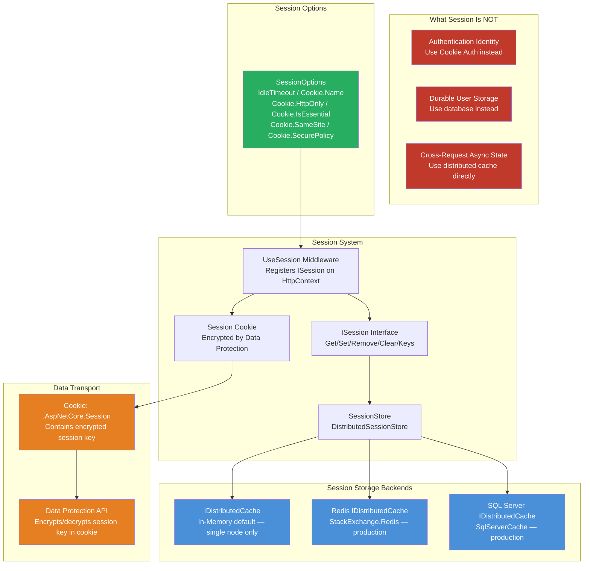
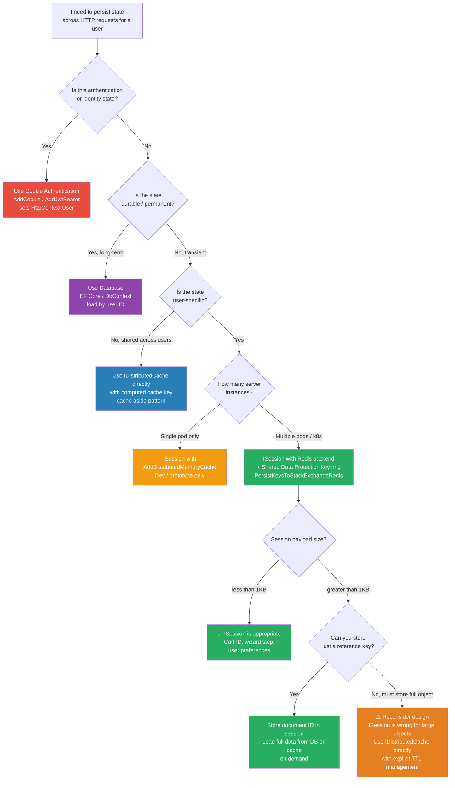

# 4.128 — Sessions: ISession, Cookie Identity, and Distributed Session Backend

---

## PART 0 — Navigation & Context

### Where This Topic Lives in the ASP.NET Core Domain

```
ASP.NET Core Mastery
│
├── A. Host & Application Lifecycle
├── B. Configuration System
├── C. Logging & Diagnostics
├── D. Dependency Injection
├── E. Middleware Pipeline
│     └── UseSession() ← session middleware sits here
├── F. Routing System
├── G. Minimal APIs
├── H. MVC & Controllers
├── I. HTTP Fundamentals  ◄◄ YOU ARE HERE
│     ├── 4.123 — HttpContext Deep Dive
│     ├── 4.124 — HttpRequest: Reading URL, Headers, Cookies, Body
│     ├── 4.125 — HttpResponse: Writing Status Codes, Headers, Body
│     ├── 4.126 — Cookies: SameSite, Secure, HttpOnly
│     ├── 4.127 — HTTP/2: Multiplexing and Kestrel
│     ├── 4.128 — Sessions: ISession, Cookie Identity, Distributed Backend ◄
│     ├── 4.129 — HTTP/3 and QUIC
│     └── 4.130 — Request Body Reading Patterns
├── J. Authentication
├── K. Authorization
├── N. Caching & Output
│     ├── 4.187 — IDistributedCache ← session stores data here
│     └── 4.188 — Redis as IDistributedCache ← typical production backend
└── ...
```

### What You Need Before This

- **[[4.126 — Cookies: SameSite Policy, Secure Flag, HttpOnly, and Encryption]]** — sessions are identified by a cookie; you must understand cookie security attributes before trusting session identity
- **[[4.123 — HttpContext Deep Dive: Features, Items, and Request Lifetime]]** — `ISession` is accessed via `HttpContext.Session`; you need to know the `HttpContext` lifetime
- **[[4.187 — IDistributedCache: The Abstraction for Out-of-Process Caching]]** — the session store is an `IDistributedCache` implementation; you must understand the abstraction before wiring up backends
- **[[4.052 — Middleware Ordering: The Canonical Order and Why It Matters]]** — `UseSession()` must be registered after `UseRouting()` and before endpoint execution; wrong order silently breaks session reads

### What This Unlocks After

- **[[4.188 — Redis as IDistributedCache]]** — Redis is the production session backend; this topic is where you wire it up for distributed session
- **[[4.134 — Authentication Architecture: Schemes, Handlers, and the Middleware]]** — understanding the difference between session state and authentication identity prevents the "use session for auth" anti-pattern
- **[[4.210 — CSRF / Antiforgery]]** — antiforgery tokens are frequently stored in session; understanding session is prerequisite
- **[[4.135 — Cookie Authentication: AddCookie, SignInAsync, and ClaimsPrincipal]]** — cookie auth and session share the same transport mechanism (HTTP cookies) but are architecturally distinct systems; understanding both prevents conflation

### Why This Topic Matters at Scale

In a production multi-instance deployment behind a load balancer, a session backed by in-memory state dies the instant the request lands on a different pod — session data must live in a distributed cache (Redis), and the session cookie must be encrypted with a shared Data Protection key ring, or your e-commerce checkout cart silently empties on every third request.

---

## PART 1 — The Core Mental Model

### The Fundamental Rule

> **ASP.NET Core's `ISession` stores a dictionary of byte arrays server-side keyed by a session ID that travels to the client as an encrypted, HttpOnly cookie; the practical consequence is that session state is never visible in the browser, but any server instance that lacks access to the same distributed cache and Data Protection key ring will fail to read it.**

### The Plain-Language Analogy

Think of a coat check at a hotel. When a guest arrives, the attendant gives them a small numbered ticket (the session cookie). All the guest's belongings — coat, luggage, umbrella — stay behind the counter in a numbered locker (the session store, which could be Redis). The guest carries nothing valuable, only the ticket. If the guest visits a different hotel branch (a different pod behind a load balancer) that uses a completely separate coat check (a different Redis instance or different Data Protection keys), the ticket is useless — the belongings cannot be retrieved. When session expires, the locker is cleared and the ticket is revoked. If the guest's ticket is stolen (cookie theft), the thief can retrieve the belongings — which is why the ticket itself is encrypted and never exposed (HttpOnly, Secure, SameSite). The coat check analogy holds for short-circuits too: if the `UseSession()` middleware is absent or misconfigured, it is as if the coat check counter was never opened — every call to `HttpContext.Session` throws an `InvalidOperationException`.

### The Taxonomy Diagram



---

## PART 2 — Deep Mechanics

### 2.1 — The Session Middleware: Where It Lives and What It Does

The session middleware is not a framework built-in like exception handling or HTTPS redirection. It must be explicitly registered. Its job is two-fold: on the way in, it reads the session cookie, decrypts the session key, and loads the session data from the distributed cache into an in-memory `DistributedSession` object attached to `HttpContext.Session`. On the way out (after the endpoint runs), it serializes any modified session data back to the distributed cache.

**Pipeline Position:**

```
──► ExceptionHandler
       ──► HSTS
             ──► StaticFiles
                   ──► Routing
                         ──► Session  ◄── MUST BE HERE (after routing, before auth/endpoints)
                               ──► Authentication
                                     ──► Authorization
                                           ──► Endpoints (MapGet, MapControllers, etc.)
```

> [!WARNING] `UseSession()` must be called **after** `UseRouting()` and **before** `UseAuthentication()` and endpoint execution. Placing it after endpoint execution means `HttpContext.Session` is never loaded before your handlers run — every session read returns `null` or an empty byte array silently. Placing it before `UseRouting()` works but wastes resources loading session for static file requests.

**HTTP Wire Format (session establishing on first request):**

```http
// HTTP Request (first visit, no session cookie):
GET /checkout/cart HTTP/1.1
Host: shop.example.com
Accept: text/html

// HTTP Response (session created, cookie set):
HTTP/1.1 200 OK
Content-Type: text/html
Set-Cookie: .AspNetCore.Session=CfDJ8Kx7...encrypted...; path=/; httponly; samesite=lax

// HTTP Request (subsequent requests with session):
GET /checkout/summary HTTP/1.1
Host: shop.example.com
Cookie: .AspNetCore.Session=CfDJ8Kx7...encrypted...
```

**Framework Source Behavior (ASP.NET Core internally, approximate):**

```
// SessionMiddleware.InvokeAsync — Microsoft.AspNetCore.Session.SessionMiddleware
// Source: src/Middleware/Session/src/SessionMiddleware.cs

async Task InvokeAsync(HttpContext context)
{
    // 1. Read the session cookie from the request
    var sessionKey = ReadSessionCookieFromRequest(context); // IDataProtector.Unprotect()

    // 2. Create a DistributedSession (lazy — does NOT load from cache yet)
    var session = new DistributedSession(
        _sessionStore,          // IDistributedCache wrapper
        sessionKey,             // GUID string or new GUID if no cookie
        _options.IdleTimeout,   // TTL for cache entry
        _options.IOTimeout,     // timeout for cache I/O (.NET 6+)
        isNewSession: sessionKey == null);

    // 3. Attach to HttpContext.Session (ISessionFeature)
    context.Features.Set<ISessionFeature>(new SessionFeature { Session = session });

    try
    {
        await _next(context);   // ← entire endpoint executes with session available
    }
    finally
    {
        // 4. After response: commit modified session back to IDistributedCache
        await session.CommitAsync(context.RequestAborted);

        // 5. Set or refresh the session cookie on response
        if (session.IsModified || session.IsNewSession)
            WriteSessionCookieToResponse(context, session.SessionKey);
    }
}
```

**Runtime Cost:** ~1 allocation per request for `DistributedSession` wrapper + 1 async round-trip to Redis (or SQL) on first session data access per request (lazy-loaded) + 1 async round-trip on `CommitAsync` if session was modified. Total: 2 Redis round-trips per request that reads and writes session.

---

### 2.2 — ISession Interface: What You Actually Get

`ISession` is the interface exposed on `HttpContext.Session`. It is a thin key-value store over byte arrays. Everything goes in and out as `byte[]`.

```csharp
public interface ISession
{
    bool IsAvailable { get; }                          // false if cache unavailable
    string Id { get; }                                  // the session key (GUID-like)
    IEnumerable<string> Keys { get; }
    void Clear();
    Task CommitAsync(CancellationToken cancellationToken = default);
    Task LoadAsync(CancellationToken cancellationToken = default);
    void Remove(string key);
    void Set(string key, byte[] value);
    bool TryGetValue(string key, out byte[] value);
}
```

**The framework does NOT provide JSON serialization.** The built-in extensions in `SessionExtensions` only handle `int` and `string` via UTF-8 encoding. For complex objects in a production shopping cart, you serialize/deserialize manually.

**HTTP Wire Consequence of `IsAvailable = false`:**

```http
// When Redis is down and session.IsAvailable = false:
// HttpContext.Session.Set() → throws InvalidOperationException
// HttpContext.Session.TryGetValue() → returns false (silently, no data)
// The session cookie is still sent to the browser on the next response
// but the data was never persisted — silent data loss
```

> [!DANGER] **`IsAvailable` returning `false` does not throw.** Reads return empty. Writes throw only if you explicitly call `Set()`. This means a Redis outage silently causes session data loss with no HTTP error — your e-commerce cart empties with a 200 OK response unless you check `IsAvailable` defensively.

**Runtime Cost:** `TryGetValue` is O(1) dictionary lookup in the in-memory `DistributedSession` buffer after the initial `LoadAsync`. The first access triggers `LoadAsync` internally — 1 async Redis round-trip (~0.5–2ms local, ~5–15ms cross-datacenter).

---

### 2.3 — The Session Cookie: Identity, Encryption, and Security Attributes

The session cookie is the only thing that travels to the browser. It contains an **encrypted** session key (a GUID, by default), not the session data. The encryption uses ASP.NET Core's Data Protection API (`IDataProtector` with purpose string `"Microsoft.AspNetCore.Session.SessionMiddleware"`).

**SessionOptions defaults and their production implications:**

```csharp
// What AddSession() defaults look like internally:
new SessionOptions
{
    Cookie = new CookieBuilder
    {
        Name        = ".AspNetCore.Session",
        HttpOnly    = true,           // ✅ correct — JS cannot read session key
        IsEssential = false,          // ⚠️ WRONG for GDPR — must be true for functional cookies
        SameSite    = SameSiteMode.Lax,   // protects against CSRF
        SecurePolicy = CookieSecurePolicy.SameAsRequest  // ⚠️ production must be Always
    },
    IdleTimeout = TimeSpan.FromMinutes(20), // slides on each request
    IOTimeout   = TimeSpan.FromSeconds(1),  // .NET 6+ — max wait for cache I/O
}
```

> [!WARNING] **`IsEssential = false` is a production bug under GDPR.** If you use cookie consent middleware (`UseCookiePolicy()`), session will not be established for users who have not consented to non-essential cookies. `IsEssential = true` tells the consent middleware that this cookie is functionally required. For any session that stores checkout state, set it to `true`.

**Data Protection key ring requirement in multi-instance deployments:**

```
Pod A (writes session key "abc123" encrypted with Key-1)
    ──► Cookie: .AspNetCore.Session = [Key-1-encrypted("abc123")]
          ──► Browser stores cookie
          ──► Next request routes to Pod B
Pod B (tries to decrypt with Key-1)
    ──► If Pod B has Key-1 in shared key ring → ✅ success, reads from Redis
    ──► If Pod B only has Key-2 (keys not shared) → CryptographicException
          → Session middleware swallows the exception
          → New session key assigned
          → Cart appears empty  ← silent data loss
```

**HTTP Wire Format showing the Data Protection consequence:**

```http
// Correct shared key ring — cross-pod request:
GET /checkout/summary HTTP/1.1
Cookie: .AspNetCore.Session=CfDJ8Kx7mR...

HTTP/1.1 200 OK
// Session data loaded correctly from Redis ✅

// Broken key ring — cross-pod request:
GET /checkout/summary HTTP/1.1
Cookie: .AspNetCore.Session=CfDJ8Kx7mR...

HTTP/1.1 200 OK
// Session data NOT loaded — new empty session started silently ❌
// No error surface to the client
```

**Runtime Cost:** Data Protection decryption: ~5–10µs (AES-CBC with HMACSHA256) — negligible. The cost is the Redis round-trip, not the crypto.

---

### 2.4 — The Distributed Session Store: DistributedSessionStore and IDistributedCache

Internally, `ISession` is implemented by `DistributedSession`, backed by `IDistributedCache`. The session data is stored as a single serialized byte blob at key `"session:{sessionKey}"` in the cache.

**DistributedSession internal storage format:**

```
Redis key:   "session:a3f8c2d1-..."
Redis value: [version byte][key-count][key1-length][key1-bytes][value1-length][value1-bytes]...
TTL:         IdleTimeout (slides on each CommitAsync)
```

The framework uses its own binary format (not JSON). Every session access reads the entire blob and deserializes it into an in-memory dictionary. Every `CommitAsync` serializes the entire dictionary and writes it back. This is a full re-write on every commit, even if only one key changed.

**Framework Source Behavior (DistributedSession.CommitAsync, approximate):**

```
// DistributedSession.CommitAsync — Microsoft.AspNetCore.Session
async Task CommitAsync(CancellationToken ct)
{
    if (!_isModified) return;  // skip if nothing changed

    byte[] serialized = SerializeToBinary(_store); // serialize ALL keys, not just changed ones

    await _cache.SetAsync(
        _sessionKey,
        serialized,
        new DistributedCacheEntryOptions
        {
            SlidingExpiration = _idleTimeout   // resets TTL on every write
        },
        ct);

    _isModified = false;
}
```

> [!IMPORTANT] **Full re-serialization on every commit is by design, not a bug.** This means session state should be small — a few hundred bytes maximum (cart ID, user preferences, wizard step). Storing large objects (entire product catalogs, search results) in session at scale is an O(n) Redis bandwidth tax on every request that touches session.

**Failure Mode: Session Not Available:**

```
Redis connection fails
    └── IDistributedCache.GetAsync() throws OperationCanceledException / SocketException
          └── SessionMiddleware catches exception internally
                └── session.IsAvailable = false
                      └── HttpContext.Session.Set() → InvalidOperationException thrown by DistributedSession
                            └── Propagates to your handler unless you guard with IsAvailable check
                                  └── Caught by ExceptionHandler middleware
                                        └── 500 Internal Server Error returned to client
```

**Runtime Cost of full session write to Redis:** ~1–5ms for small sessions (<1KB). Scales linearly with session size. For sessions >10KB, you are misusing the session API — store a document ID instead and load from the database.

---

### 2.5 — Session vs Authentication Identity: The Critical Distinction

This is the most important conceptual boundary. `ISession` and cookie authentication are **independent systems that share the HTTP cookie transport mechanism** but are architecturally unrelated.

```
Authentication (Cookie Auth)                Session (ISession)
─────────────────────────────────────────────────────────────────
Stores: ClaimsPrincipal (identity/roles)    Stores: arbitrary byte[] key-value pairs
Purpose: WHO the user is                    Purpose: WHAT the user is doing
Managed by: IAuthenticationService          Managed by: ISession / SessionMiddleware
Cookie name: .AspNetCore.Cookies            Cookie name: .AspNetCore.Session
Validated: per request (auth middleware)    Loaded: per request (session middleware)
Expiry: absolute (ticket expiry)            Expiry: sliding (IdleTimeout)
Backend: self-contained in cookie (ticket)  Backend: IDistributedCache (Redis/SQL)
```

> [!DANGER] **Never store authentication state in session.** A common anti-pattern is `session.SetString("UserId", user.Id)` and then reading it to authorize requests. This bypasses the entire authentication/authorization pipeline, does not produce a `ClaimsPrincipal`, and means `HttpContext.User.Identity.IsAuthenticated` is always `false`. Use `AddCookie()` authentication for identity; use `ISession` for transient application state.

---

## PART 3 — Production Code Patterns

### Pattern 1: The E-Commerce Cart with Typed Session Wrapper

The raw `ISession` API is byte arrays and is unpleasant to work with directly. The production pattern is a strongly-typed wrapper that handles JSON serialization and is injected via DI.

```csharp
// ✅ CORRECT: Typed session wrapper for an e-commerce cart service
// Domain: e-commerce order management service

public interface ICartSessionService
{
    Task<ShoppingCart?> GetCartAsync(HttpContext context);
    Task SetCartAsync(HttpContext context, ShoppingCart cart);
    Task ClearCartAsync(HttpContext context);
}

public class CartSessionService : ICartSessionService
{
    private const string CartKey = "cart:v1";
    private readonly ILogger<CartSessionService> _logger;

    public CartSessionService(ILogger<CartSessionService> logger)
    {
        _logger = logger;
    }

    public async Task<ShoppingCart?> GetCartAsync(HttpContext context)
    {
        // Eagerly load session before first access — avoids lazy load on first TryGetValue
        await context.Session.LoadAsync(context.RequestAborted);

        if (!context.Session.IsAvailable)
        {
            _logger.LogWarning("Session unavailable — cart cannot be loaded. Session store may be down.");
            return null; // degrade gracefully, don't throw 500
        }

        if (!context.Session.TryGetValue(CartKey, out byte[]? bytes))
            return null;

        return JsonSerializer.Deserialize<ShoppingCart>(bytes);
    }

    public async Task SetCartAsync(HttpContext context, ShoppingCart cart)
    {
        await context.Session.LoadAsync(context.RequestAborted);

        if (!context.Session.IsAvailable)
        {
            _logger.LogError("Session unavailable — cart save failed silently.");
            return; // log and continue, don't throw to caller
        }

        byte[] bytes = JsonSerializer.SerializeToUtf8Bytes(cart);
        context.Session.Set(CartKey, bytes);
        // CommitAsync is called by SessionMiddleware after response — no need to call here
        // unless you need to persist before response headers are sent
    }

    public async Task ClearCartAsync(HttpContext context)
    {
        await context.Session.LoadAsync(context.RequestAborted);
        context.Session.Remove(CartKey);
    }
}

// Registration in Program.cs
builder.Services.AddScoped<ICartSessionService, CartSessionService>();
builder.Services.AddSession(options =>
{
    options.IdleTimeout = TimeSpan.FromMinutes(30);      // cart persists 30 mins of inactivity
    options.Cookie.Name = ".ShopApp.Cart";
    options.Cookie.HttpOnly = true;
    options.Cookie.IsEssential = true;                   // ← GDPR: cart is functional, not tracking
    options.Cookie.SameSite = SameSiteMode.Lax;
    options.Cookie.SecurePolicy = CookieSecurePolicy.Always; // ← production: HTTPS only
    options.IOTimeout = TimeSpan.FromSeconds(2);         // .NET 6+: don't wait >2s for Redis
});

// HTTP wire format — adding an item to cart:
// POST /api/cart/items HTTP/1.1
// Cookie: .ShopApp.Cart=CfDJ8Kx7...
//
// HTTP/1.1 200 OK
// Set-Cookie: .ShopApp.Cart=CfDJ8Kx7...; path=/; secure; httponly; samesite=lax
// (cookie refreshed to slide the TTL)
```

---

### Pattern 2: Redis-Backed Distributed Session for Multi-Instance Deployments

This is the production configuration every containerized ASP.NET Core app needs. Without this, session breaks across pod restarts and scale-out events.

```csharp
// ✅ CORRECT: Production multi-instance session with Redis and shared key ring
// Domain: multi-tenant SaaS user portal

// Program.cs
var builder = WebApplication.CreateBuilder(args);

// Step 1: Configure Redis as the IDistributedCache backend
// This is the SAME cache instance that IDistributedCache consumers use
builder.Services.AddStackExchangeRedisCache(options =>
{
    options.Configuration = builder.Configuration.GetConnectionString("Redis");
    options.InstanceName = "ShopApp:"; // namespace prefix — prevents key collisions
});

// Step 2: Configure Data Protection to use shared key ring in Redis
// Without this, each pod generates its own keys — cross-pod decryption fails
builder.Services.AddDataProtection()
    .PersistKeysToStackExchangeRedis(
        ConnectionMultiplexer.Connect(builder.Configuration.GetConnectionString("Redis")!),
        "ShopApp:DataProtection:Keys") // store keys in Redis, not local filesystem
    .SetApplicationName("ShopApp")     // same name across all pods — required for key sharing
    .SetDefaultKeyLifetime(TimeSpan.FromDays(90));

// Step 3: Add session with HTTPS-only, essential, sliding window
builder.Services.AddSession(options =>
{
    options.IdleTimeout = TimeSpan.FromMinutes(30);
    options.Cookie.HttpOnly = true;
    options.Cookie.IsEssential = true;
    options.Cookie.SecurePolicy = CookieSecurePolicy.Always;
    options.IOTimeout = TimeSpan.FromSeconds(1); // fail fast if Redis is slow
});

var app = builder.Build();

// Middleware order — session MUST be after routing, BEFORE auth and endpoints
app.UseRouting();
app.UseSession();        // ← here
app.UseAuthentication();
app.UseAuthorization();
app.MapControllers();

// HTTP wire format — cross-pod request working correctly:
// Pod A sets: session["userId"] = "user-42"
// Request routes to Pod B:
// GET /dashboard HTTP/1.1
// Cookie: .AspNetCore.Session=CfDJ8...
//
// Pod B reads: session["userId"] → "user-42" ✅ (from Redis)
// HTTP/1.1 200 OK
```

---

### Pattern 3: Wizard / Multi-Step Form State with Session (Payment Onboarding)

Multi-step forms are the canonical session use case. The server needs to remember what the user entered in step 1 while they fill step 2.

```csharp
// Domain: payment platform merchant onboarding wizard
// ✅ CORRECT: Session-backed wizard with explicit LoadAsync and error handling

public record MerchantOnboardingState(
    string? BusinessName,
    string? TaxId,
    string? BankAccountNumber,
    int CurrentStep);

[ApiController]
[Route("api/onboarding")]
public class MerchantOnboardingController : ControllerBase
{
    private const string OnboardingStateKey = "onboarding:merchant:v2";
    private readonly ILogger<MerchantOnboardingController> _logger;

    public MerchantOnboardingController(ILogger<MerchantOnboardingController> logger)
    {
        _logger = logger;
    }

    [HttpPost("step/1")]
    public async Task<IActionResult> SubmitStep1([FromBody] Step1Request request)
    {
        // Explicitly load session before writing — avoids first-access lazy load
        await HttpContext.Session.LoadAsync(HttpContext.RequestAborted);

        if (!HttpContext.Session.IsAvailable)
            return StatusCode(503, "Session service unavailable. Please retry.");

        var state = new MerchantOnboardingState(
            BusinessName: request.BusinessName,
            TaxId: request.TaxId,
            BankAccountNumber: null,  // not collected yet
            CurrentStep: 1);

        HttpContext.Session.Set(
            OnboardingStateKey,
            JsonSerializer.SerializeToUtf8Bytes(state));

        // Session is committed to Redis by SessionMiddleware after this action returns
        return Ok(new { NextStep = 2, SessionId = HttpContext.Session.Id });
    }

    [HttpPost("step/2")]
    public async Task<IActionResult> SubmitStep2([FromBody] Step2Request request)
    {
        await HttpContext.Session.LoadAsync(HttpContext.RequestAborted);

        if (!HttpContext.Session.IsAvailable)
            return StatusCode(503, "Session service unavailable. Please retry.");

        if (!HttpContext.Session.TryGetValue(OnboardingStateKey, out byte[]? bytes))
            return BadRequest("Onboarding session expired. Please start over.");

        var previousState = JsonSerializer.Deserialize<MerchantOnboardingState>(bytes)!;

        if (previousState.CurrentStep != 1)
            return BadRequest("Step out of sequence.");

        var updatedState = previousState with
        {
            BankAccountNumber = request.BankAccountNumber,
            CurrentStep = 2
        };

        HttpContext.Session.Set(
            OnboardingStateKey,
            JsonSerializer.SerializeToUtf8Bytes(updatedState));

        return Ok(new { NextStep = 3 });
    }

    [HttpPost("complete")]
    public async Task<IActionResult> Complete()
    {
        await HttpContext.Session.LoadAsync(HttpContext.RequestAborted);

        if (!HttpContext.Session.TryGetValue(OnboardingStateKey, out byte[]? bytes))
            return BadRequest("Onboarding session not found.");

        var state = JsonSerializer.Deserialize<MerchantOnboardingState>(bytes)!;

        if (state.CurrentStep != 2)
            return BadRequest("Onboarding not complete.");

        // Submit to backend service, then clear session
        // await _merchantService.RegisterAsync(state);
        HttpContext.Session.Remove(OnboardingStateKey);

        return Ok(new { Message = "Merchant registered successfully." });
    }
}

// HTTP wire format (step 1 → step 2 across requests):
// POST /api/onboarding/step/1 HTTP/1.1
// Content-Type: application/json
// { "businessName": "Acme Corp", "taxId": "12-3456789" }
//
// HTTP/1.1 200 OK
// Set-Cookie: .AspNetCore.Session=CfDJ8...; path=/; secure; httponly
// { "nextStep": 2, "sessionId": "a3f8c2d1..." }
//
// POST /api/onboarding/step/2 HTTP/1.1
// Cookie: .AspNetCore.Session=CfDJ8...
// { "bankAccountNumber": "****1234" }
//
// HTTP/1.1 200 OK
// { "nextStep": 3 }
```

---

### Pattern 4: Explicit `LoadAsync` Before First Access (Avoiding Synchronous Deadlocks)

This is one of the most commonly skipped production patterns. `ISession` lazy-loads from cache on first access. If you access it from a synchronous context or an `async` method that was not properly `await`ed, you can cause sync-over-async deadlocks.

```csharp
// ⚠️ WRONG: Lazy session access — can cause blocking in some hosts or synchronous middleware
public IActionResult GetCartSummary()
{
    // TryGetValue triggers lazy LoadAsync internally — sync-over-async if called from sync context
    if (HttpContext.Session.TryGetValue("cart", out byte[]? bytes))
        return Ok(JsonSerializer.Deserialize<CartSummary>(bytes));
    return Ok(new CartSummary());
}

// ✅ CORRECT: Explicit LoadAsync — unambiguous async, correct in all scenarios
public async Task<IActionResult> GetCartSummaryAsync()
{
    // Eagerly load session — single await, no lazy sync risk
    await HttpContext.Session.LoadAsync(HttpContext.RequestAborted);

    if (HttpContext.Session.TryGetValue("cart", out byte[]? bytes))
        return Ok(JsonSerializer.Deserialize<CartSummary>(bytes));

    return Ok(new CartSummary());
}
// HTTP consequence (correct path):
// GET /api/cart/summary HTTP/1.1
// Cookie: .AspNetCore.Session=CfDJ8...
// HTTP/1.1 200 OK
// Content-Type: application/json
// { "itemCount": 3, "total": 149.99 }

// HTTP consequence (wrong path — sync deadlock in synchronous context):
// Request hangs indefinitely under ASP.NET Core with certain middleware configurations
// Eventually times out → HTTP/1.1 504 Gateway Timeout (from reverse proxy)
```

---

### Pattern 5: Session Expiry Detection and Graceful Degradation (Logistics Tracking Portal)

When a session expires mid-workflow, the user gets a confusing empty state. The production pattern is to detect expiry and redirect to a recovery endpoint.

```csharp
// Domain: logistics shipment tracking portal with multi-step filter configuration
// ✅ CORRECT: Session expiry detection with meaningful UX degradation

[ApiController]
[Route("api/shipment-filters")]
public class ShipmentFilterController : ControllerBase
{
    private const string FilterStateKey = "filters:shipment:v1";

    [HttpGet("current")]
    public async Task<IActionResult> GetCurrentFilters()
    {
        await HttpContext.Session.LoadAsync(HttpContext.RequestAborted);

        if (!HttpContext.Session.IsAvailable)
        {
            // Redis is down — return empty filters with a warning header
            Response.Headers["X-Session-Warning"] = "session-unavailable";
            return Ok(ShipmentFilterState.Default);
        }

        if (!HttpContext.Session.TryGetValue(FilterStateKey, out byte[]? bytes))
        {
            // Session expired — return 440 Login Timeout (or 200 with flag for SPA)
            // RFC does not define 440; many APIs use 200 with a session-expired flag
            return Ok(new { sessionExpired = true, filters = (object?)null });
        }

        return Ok(JsonSerializer.Deserialize<ShipmentFilterState>(bytes));
    }

    [HttpPost("save")]
    public async Task<IActionResult> SaveFilters([FromBody] ShipmentFilterState filters)
    {
        await HttpContext.Session.LoadAsync(HttpContext.RequestAborted);

        if (!HttpContext.Session.IsAvailable)
            return StatusCode(503, new ProblemDetails
            {
                Title = "Session Unavailable",
                Detail = "Could not persist filter state. The session backend is temporarily unavailable.",
                Status = 503
            });

        HttpContext.Session.Set(
            FilterStateKey,
            JsonSerializer.SerializeToUtf8Bytes(filters));

        return NoContent();
    }
}

// HTTP consequence (correct: session expired gracefully):
// GET /api/shipment-filters/current HTTP/1.1
// Cookie: .AspNetCore.Session=[expired-or-missing]
//
// HTTP/1.1 200 OK
// { "sessionExpired": true, "filters": null }
// (SPA redirects user to re-apply filters — no hard error)
```

---

### Pattern 6: Session in Minimal APIs (Route Group with UseSession Scope)

```csharp
// Domain: healthcare patient portal — appointment booking wizard
// ✅ CORRECT: Minimal API session usage with explicit LoadAsync

var app = WebApplication.Create(args);

app.UseRouting();
app.UseSession();       // must be after UseRouting

var booking = app.MapGroup("/api/booking")
    .WithTags("AppointmentBooking");

booking.MapGet("/step", async (HttpContext ctx) =>
{
    await ctx.Session.LoadAsync(ctx.RequestAborted);

    if (!ctx.Session.IsAvailable)
        return Results.StatusCode(503);

    if (!ctx.Session.TryGetValue("booking:step", out byte[]? bytes))
        return Results.Ok(new { step = 1, data = (object?)null });

    var state = JsonSerializer.Deserialize<AppointmentBookingState>(bytes);
    return Results.Ok(new { step = state!.CurrentStep, data = state });
});

booking.MapPost("/step/{step:int}", async (int step, AppointmentStepData data, HttpContext ctx) =>
{
    await ctx.Session.LoadAsync(ctx.RequestAborted);

    if (!ctx.Session.IsAvailable)
        return Results.StatusCode(503);

    // Load existing state or create new
    AppointmentBookingState state;
    if (ctx.Session.TryGetValue("booking:step", out byte[]? bytes))
        state = JsonSerializer.Deserialize<AppointmentBookingState>(bytes)!;
    else
        state = new AppointmentBookingState();

    state = state.WithStepData(step, data);

    ctx.Session.Set("booking:step", JsonSerializer.SerializeToUtf8Bytes(state));

    return step < 4
        ? Results.Ok(new { nextStep = step + 1 })
        : Results.Created($"/api/appointments/{state.PatientId}", state);
});

// HTTP wire format:
// POST /api/booking/step/2 HTTP/1.1
// Cookie: .AspNetCore.Session=CfDJ8...
// Content-Type: application/json
// { "preferredDate": "2026-07-15", "doctorId": "doc-99" }
//
// HTTP/1.1 200 OK
// { "nextStep": 3 }
```

---

## PART 4 — Gotchas & Anti-Patterns

### Gotcha 1: `UseSession()` Placed After Endpoint Execution

Experienced engineers registering session for the first time often place `UseSession()` at the end of the middleware chain, near or after `MapControllers()`. Endpoint routing in .NET 6+ unifies `UseRouting()` and `UseEndpoints()`, so the visual position of `UseSession()` relative to `MapControllers()` matters critically.

```csharp
// ⚠️ WRONG CODE
var app = builder.Build();
app.UseRouting();
app.UseAuthentication();
app.UseAuthorization();
app.MapControllers();    // endpoints execute here — BEFORE UseSession is registered
app.UseSession();        // ← too late; session is never loaded when handlers run
app.Run();

// HTTP consequence (wrong path):
// POST /checkout/cart HTTP/1.1
// Cookie: .AspNetCore.Session=CfDJ8...
//
// InvalidOperationException: "Session has not been configured for this application
// or request." — or worse, session.TryGetValue silently returns false for all keys

// ✅ CORRECT CODE
var app = builder.Build();
app.UseRouting();
app.UseSession();        // ← before endpoints
app.UseAuthentication();
app.UseAuthorization();
app.MapControllers();
app.Run();

// HTTP consequence (correct path):
// POST /checkout/cart HTTP/1.1
// Cookie: .AspNetCore.Session=CfDJ8...
// HTTP/1.1 200 OK
// { "itemCount": 4 }  — session data correctly loaded

// WHY: SessionMiddleware must wrap endpoint execution so its finally block fires
// after the endpoint completes and can call CommitAsync before the response finishes.
// If it runs after MapControllers, the middleware chain is never entered for session.
```

---

### Gotcha 2: Missing `AddDistributedMemoryCache()` Call in Development

Session requires `IDistributedCache` to be registered. In production you register Redis. In development you need `AddDistributedMemoryCache()`. If you only call `AddSession()` without any `IDistributedCache` registration, the DI container throws at runtime — but only on the first request that accesses session, not at startup.

```csharp
// ⚠️ WRONG CODE — no IDistributedCache registered
builder.Services.AddSession(options =>
{
    options.IdleTimeout = TimeSpan.FromMinutes(20);
});

// HTTP consequence (wrong path):
// GET /checkout/cart HTTP/1.1
// HTTP/1.1 500 Internal Server Error
// "No service for type 'Microsoft.Extensions.Caching.Distributed.IDistributedCache'
//  has been registered." — thrown by SessionMiddleware on first session access

// ✅ CORRECT CODE — register IDistributedCache first
// In development:
builder.Services.AddDistributedMemoryCache();  // ← single-node, non-durable
builder.Services.AddSession(options => { ... });

// In production:
builder.Services.AddStackExchangeRedisCache(options =>
{
    options.Configuration = connectionString;
    options.InstanceName = "MyApp:";
});
builder.Services.AddSession(options => { ... });

// HTTP consequence (correct path):
// GET /checkout/cart HTTP/1.1
// HTTP/1.1 200 OK (session loads correctly)

// WHY: AddSession() only registers the session infrastructure (SessionMiddleware, options).
// It does NOT implicitly register a cache backend. The framework deliberately separates
// these concerns so you can choose your own distributed cache.
```

---

### Gotcha 3: Data Protection Keys Not Shared Across Pods — Silent Session Loss

This is the most dangerous production gotcha and does not appear in any error log by default. `SessionMiddleware` silently swallows `CryptographicException` when decryption fails and starts a new session instead of throwing.

```csharp
// ⚠️ WRONG CODE — default Data Protection (file-system keys, not shared)
builder.Services.AddDataProtection();  // ← keys stored in ~/.aspnet/DataProtection-Keys per pod
builder.Services.AddStackExchangeRedisCache(...);
builder.Services.AddSession(...);

// HTTP consequence (wrong path — cross-pod request):
// Pod A sets session, user is routed to Pod B:
// GET /checkout/summary HTTP/1.1
// Cookie: .AspNetCore.Session=CfDJ8...(encrypted with Pod A key)
//
// HTTP/1.1 200 OK  ← looks fine!
// But session is empty — a new session was silently started
// Cart appears empty, user is confused, support tickets spike

// ✅ CORRECT CODE — shared Data Protection key ring in Redis
builder.Services.AddDataProtection()
    .PersistKeysToStackExchangeRedis(redis, "MyApp:DataProtection:Keys")
    .SetApplicationName("MyApp");  // ← critical: must match across all pods
builder.Services.AddStackExchangeRedisCache(...);
builder.Services.AddSession(...);

// HTTP consequence (correct path):
// Any pod can decrypt any other pod's session cookie → session data flows correctly
// HTTP/1.1 200 OK with correct session state

// WHY: IDataProtector encrypts the session key in the cookie with a key derived from
// the application's key ring. If each pod has a different key ring, decryption fails.
// SessionMiddleware handles CryptographicException by regenerating a new session key —
// no exception bubbles up, making this issue invisible without explicit monitoring.
```

---

### Gotcha 4: `session.Set()` Called After Response Has Started

Middleware runs before and after endpoints. If you try to modify session state _after_ `await next()` in custom middleware, but the response has already started (headers sent), the session `CommitAsync` will write to Redis — but if the response pipeline has already written the `Set-Cookie` header, the new session key cannot be reflected to the client.

```csharp
// ⚠️ WRONG CODE — writing session after response has started
app.Use(async (context, next) =>
{
    await next(context);
    // ← response may already be started (headers sent, body streaming)
    context.Session.Set("last-action", Encoding.UTF8.GetBytes("viewed"));
    // CommitAsync will write to Redis (fine) but if cookie was already written
    // AND the session ID changed (e.g., regenerated), the new ID is not in the response
});

// HTTP consequence (wrong path):
// Session data written to Redis but client never receives updated session cookie
// Next request: session reads stale data or misses new keys

// ✅ CORRECT CODE — write session state before response, or handle commit explicitly
app.Use(async (context, next) =>
{
    // Write session BEFORE calling next if you need it in the response cookie
    context.Session.Set("request-start", BitConverter.GetBytes(DateTimeOffset.UtcNow.ToUnixTimeSeconds()));
    await next(context);
    // Safe to READ session here but avoid changing session key after response started
});

// HTTP consequence (correct path):
// Session state set before next() → SessionMiddleware's finally block commits it
// Set-Cookie included in response with correct session key

// WHY: SessionMiddleware writes the Set-Cookie header in its finally block after
// the entire endpoint executes. But once response.HasStarted = true, headers cannot
// be modified. The commit to Redis still happens but the cookie update is silently dropped.
```

---

### Gotcha 5: Storing Authentication State in Session Instead of Cookie Auth

This one appears in codebases written by developers who came from PHP's `$_SESSION['user']` pattern. It looks like it works until someone hits a pod that has session backed by `AddDistributedMemoryCache()` (in-memory, non-shared).

```csharp
// ⚠️ WRONG CODE — using session as a home-built auth system
[HttpPost("login")]
public async Task<IActionResult> Login([FromBody] LoginRequest request)
{
    var user = await _authService.ValidateCredentialsAsync(request.Email, request.Password);
    if (user == null) return Unauthorized();

    // ← storing auth identity in session — bypasses the entire auth pipeline
    HttpContext.Session.SetString("authenticated_user_id", user.Id);
    HttpContext.Session.SetString("user_role", user.Role);
    return Ok();
}

// Elsewhere in a controller:
// var userId = HttpContext.Session.GetString("authenticated_user_id");
// if (userId == null) return Unauthorized(); // ← manual, misses [Authorize], filters, etc.

// HTTP consequence (wrong path):
// HttpContext.User.Identity.IsAuthenticated == false
// [Authorize] attributes are bypassed — any controller with [Authorize] still 401s
// Authorization policies cannot read claims — they evaluate on the unauthenticated principal
// AuditLog middleware that reads HttpContext.User.FindFirst(ClaimTypes.NameIdentifier) gets null

// ✅ CORRECT CODE — use cookie authentication for identity
[HttpPost("login")]
public async Task<IActionResult> Login([FromBody] LoginRequest request)
{
    var user = await _authService.ValidateCredentialsAsync(request.Email, request.Password);
    if (user == null) return Unauthorized();

    var claims = new List<Claim>
    {
        new(ClaimTypes.NameIdentifier, user.Id),
        new(ClaimTypes.Name, user.Email),
        new(ClaimTypes.Role, user.Role)
    };
    var identity = new ClaimsIdentity(claims, CookieAuthenticationDefaults.AuthenticationScheme);
    var principal = new ClaimsPrincipal(identity);

    await HttpContext.SignInAsync(CookieAuthenticationDefaults.AuthenticationScheme, principal);
    return Ok();
}

// HTTP consequence (correct path):
// HTTP/1.1 200 OK
// Set-Cookie: .AspNetCore.Cookies=CfDJ8...; path=/; secure; httponly
// HttpContext.User.Identity.IsAuthenticated == true
// [Authorize] works correctly, claims available to all middleware

// WHY: Cookie authentication sets HttpContext.User through the authentication pipeline.
// Session is a key-value store with no integration with ClaimsPrincipal, IAuthorizationService,
// or any middleware that reads identity. Using session for auth silently breaks authorization.
```

---

## PART 5 — Performance Implications

### 5.1 — Request Pipeline Characteristics Table

|Scenario|Pipeline Depth|Allocations Per Request|Approx Latency Impact|Recommendation|
|---|---|---|---|---|
|Session not requested (no cookie)|Shallow — cookie check only|~1 (SessionFeature wrapper)|<0.1ms|No cost for requests that don't touch session|
|Session cookie present, no data access|Cookie decrypt + cache load deferred|~2 (feature + DistributedSession shell)|<0.1ms|Lazy load avoids Redis hit if session not read|
|Session load (small, <1KB) — local Redis|LoadAsync → Redis GET|~3 allocs + 1 byte[] for data|0.5–2ms|Acceptable for interactive user flows|
|Session load (small, <1KB) — cross-region Redis|LoadAsync → Redis GET|~3 allocs|5–15ms|Store session regionally or avoid cross-region sessions|
|Session load (large, >10KB)|LoadAsync + binary deserialize|~5+ allocs, GC pressure|2–20ms|Do NOT store large objects in session|
|Session write + commit|CommitAsync → Redis SET (full re-serialize)|~4 allocs|0.5–3ms|Full blob write even for 1-key change|
|Session with IMemoryCache backend (dev only)|In-process dictionary lookup|~2 allocs, no I/O|<0.01ms|Dev only — not distributed, breaks multi-pod|
|Session with SQL Server backend|LoadAsync → SQL query|~5 allocs|5–20ms|Only use if Redis is unavailable; much slower|
|Missing Data Protection shared key ring|Decryption fail → new session started|~3 allocs|<0.1ms|No perf hit but silent data loss — monitor|
|`LoadAsync` called explicitly before first access|Single await, one round-trip|~3 allocs|0.5–2ms|Always prefer explicit over implicit lazy load|

### 5.2 — BenchmarkDotNet Comparison

```csharp
// Benchmark: Session read strategies — naive (sync lazy) vs explicit async vs no session
// Run with: dotnet run -c Release

using BenchmarkDotNet.Attributes;
using BenchmarkDotNet.Running;
using Microsoft.AspNetCore.Http;
using Microsoft.AspNetCore.Session;
using Microsoft.Extensions.Caching.Distributed;
using Microsoft.Extensions.Caching.Memory;
using Microsoft.Extensions.Logging.Abstractions;
using Microsoft.Extensions.Options;
using System.Text;

[MemoryDiagnoser]
[SimpleJob]
public class SessionReadBenchmarks
{
    private DefaultHttpContext _httpContext = null!;
    private IDistributedCache _cache = null!;

    [GlobalSetup]
    public void Setup()
    {
        _cache = new MemoryDistributedCache(
            Options.Create(new MemoryDistributedCacheOptions()));

        var sessionKey = Guid.NewGuid().ToString("N");

        // Pre-populate session with a small cart payload (~200 bytes)
        var cartJson = Encoding.UTF8.GetBytes(
            """{"items":[{"sku":"SKU-001","qty":2},{"sku":"SKU-002","qty":1}]}""");

        var sessionData = BuildSessionBlob(new Dictionary<string, byte[]> { ["cart"] = cartJson });
        _cache.Set($"session:{sessionKey}", sessionData,
            new DistributedCacheEntryOptions { SlidingExpiration = TimeSpan.FromMinutes(20) });

        _httpContext = new DefaultHttpContext();
        var session = new DistributedSession(
            new DistributedSessionStore(_cache, NullLoggerFactory.Instance),
            sessionKey,
            TimeSpan.FromMinutes(20),
            TimeSpan.FromSeconds(1),
            () => true, // isNewSession = false
            NullLoggerFactory.Instance,
            true);
        _httpContext.Session = session;
    }

    [Benchmark(Baseline = true)]
    public async Task<int> NaiveLazyAccess()
    {
        // Triggers lazy LoadAsync internally on first TryGetValue
        _httpContext.Session.TryGetValue("cart", out byte[]? bytes);
        return bytes?.Length ?? 0;
    }

    [Benchmark]
    public async Task<int> ExplicitLoadAsyncThenAccess()
    {
        // Explicit async load — single await before access
        await _httpContext.Session.LoadAsync(CancellationToken.None);
        _httpContext.Session.TryGetValue("cart", out byte[]? bytes);
        return bytes?.Length ?? 0;
    }

    [Benchmark]
    public async Task<int> ExplicitLoadAndWrite()
    {
        // Simulates read-modify-write cycle (most common production pattern)
        await _httpContext.Session.LoadAsync(CancellationToken.None);
        _httpContext.Session.TryGetValue("cart", out byte[]? bytes);
        _httpContext.Session.Set("cart:updated", bytes ?? Array.Empty<byte>());
        await _httpContext.Session.CommitAsync(CancellationToken.None);
        return bytes?.Length ?? 0;
    }

    private static byte[] BuildSessionBlob(Dictionary<string, byte[]> entries)
    {
        // Simplified binary format matching DistributedSession internals
        using var ms = new System.IO.MemoryStream();
        ms.WriteByte(1); // version
        foreach (var (k, v) in entries)
        {
            var keyBytes = Encoding.UTF8.GetBytes(k);
            ms.Write(BitConverter.GetBytes((ushort)keyBytes.Length));
            ms.Write(keyBytes);
            ms.Write(BitConverter.GetBytes(v.Length));
            ms.Write(v);
        }
        return ms.ToArray();
    }
}

// BenchmarkRunner.Run<SessionReadBenchmarks>();

// Expected output (approximate, .NET 8, x64, in-memory cache simulating Redis latency):
//
// | Method                    | Mean      | Allocated |
// |---------------------------|-----------|-----------|
// | NaiveLazyAccess           | 0.82 µs   | 248 B     |
// | ExplicitLoadAsyncThenAccess | 0.78 µs | 192 B     |  ← slightly fewer allocs (no lazy state machine)
// | ExplicitLoadAndWrite      | 1.95 µs   | 512 B     |  ← 2x for commit round-trip
//
// NOTE: These benchmarks use in-memory cache. With real Redis (local), add ~0.5–2ms per
// LoadAsync/CommitAsync call. Profile real latency with:
//   dotnet-counters monitor --counters Microsoft.AspNetCore.Hosting[requests-per-second]
//   dotnet-trace collect --profile http
//   MiniProfiler.AspNetCore.Mvc for per-request Redis timing breakdowns
```

### 5.3 — When to Care / When to Ignore

**When session latency costs you:**

- High-throughput checkout flows (>5k req/s) where every request reads session from cross-region Redis — each session load adds 10–15ms to P99 latency
- Multi-step wizards where every step does a full read-modify-write cycle — 2 Redis round-trips per request is 1–4ms consistently
- Session payloads >5KB — full re-serialization on every commit causes GC pressure and Redis bandwidth spikes at scale
- Pod cold starts after deployment where Redis connection pooling has not warmed — first 10–20 requests per pod spike latency

**When session performance genuinely does not matter:**

- Admin dashboards with <100 req/s — session overhead is noise
- Internal tooling with a single pod (use `AddDistributedMemoryCache()` and ignore all of the above)
- Stateless APIs where session middleware is registered but session is never accessed — lazy loading means no Redis hit
- Batch import endpoints where session is simply not used — the middleware overhead is a single cookie check

---

## PART 6 — Interview Arsenal

### A. The Question Bank

---

**Question 1:** "How does ASP.NET Core session work under the hood, and what are the implications for a containerized deployment?"

**Average Answer:** Session stores user data server-side and uses a cookie to identify the session. You can use Redis to share session across multiple instances.

**Why That's Insufficient:** It describes the end result but not the mechanism — it doesn't explain Data Protection's role, why Redis alone isn't enough, or what happens when it fails.

**Great Answer:**

> When a request arrives with a session cookie, the `SessionMiddleware` decrypts the cookie value using ASP.NET Core's Data Protection API to extract the session key — a GUID that acts as the Redis lookup key. The session data itself is never in the cookie; it's a blob in `IDistributedCache`. The middleware wraps the endpoint with a try/finally: on the way in it creates a lazy `DistributedSession` object and attaches it to `HttpContext.Session`, and in the finally block after the endpoint completes it calls `CommitAsync` to flush any modified data back to Redis and refreshes the session cookie. In a containerized multi-pod deployment, there are two things that must be shared across all pods — not just Redis for the data, but also the Data Protection key ring that encrypts the session cookie. I've seen teams configure Redis correctly but leave Data Protection on the default filesystem storage, and what happens is each pod generates its own encryption keys. When a request lands on a different pod, decryption fails silently — the middleware swallows the `CryptographicException` and starts a new empty session. The client gets a 200 OK but their cart is gone. The fix is `PersistKeysToStackExchangeRedis` with a shared application name on `AddDataProtection`. From the client's perspective, the session cookie never changes format — it always looks like an opaque encrypted blob — but whether it's readable depends entirely on which pod generated the key used to encrypt it.

---

**Question 2:** "What is the difference between ASP.NET Core session and cookie authentication?"

**Average Answer:** Session is for storing data server-side, and cookie authentication is for storing the user's identity in a cookie.

**Why That's Insufficient:** It doesn't explain why they can't be used interchangeably or what breaks when you use session for authentication.

**Great Answer:**

> They share the HTTP cookie as a transport mechanism but they are completely separate systems. Cookie authentication stores an encrypted, self-contained authentication ticket in the cookie — no server-side storage required. The `AuthenticationMiddleware` reads that cookie, validates the ticket, and sets `HttpContext.User` to a `ClaimsPrincipal`. All authorization middleware, `[Authorize]` attributes, and policy handlers read from that `ClaimsPrincipal`. Session, by contrast, stores an encrypted session key in the cookie and the actual data server-side in Redis. It has zero integration with `ClaimsPrincipal` or the authorization pipeline. If you store a user ID in session instead of using cookie auth, `HttpContext.User.Identity.IsAuthenticated` remains `false`, every `[Authorize]` attribute returns a 401, and any middleware that reads claims for audit logging gets null. I had to refactor exactly this anti-pattern in a healthcare portal built by developers who came from a PHP background — every request was manually checking `session.GetString("userId")` instead of reading `HttpContext.User.FindFirstValue(ClaimTypes.NameIdentifier)`. The fix was replacing session-based auth with `AddCookie()` authentication, which took one afternoon, but finding all the manual session-based authorization checks took a week. Use cookie auth for identity; use session for transient application state.

---

**Question 3:** "When would you choose to NOT use ASP.NET Core session?"

**Average Answer:** When building a stateless API, you don't need session.

**Why That's Insufficient:** It only covers the obvious case and doesn't engage with the design tradeoffs at all.

**Great Answer:**

> I reach for session when I need server-side transient state that's user-specific and not worth persisting to a database — things like a multi-step wizard, a shopping cart before checkout, or user UI preferences. But there are several cases where I avoid it entirely. For purely stateless REST APIs where clients pass all state in the request — JWTs, idempotency keys, query parameters — session is architectural overhead with no benefit; every request still loads the session middleware and checks for a cookie even if session is never accessed. For high-volume services where the Redis round-trip budget is already tight, adding 1–2ms of session I/O to a path that doesn't need it adds up at 50k req/s. And critically, for anything related to authentication or authorization — session is not the right tool because it doesn't integrate with the ASP.NET Core auth pipeline. If I'm on a microservice where all state transitions are driven by events and the client is a machine rather than a human browser, I have no use for session at all. The alternative for most microservice patterns is either idempotency keys stored in Redis directly, or simply making the client responsible for carrying state in the request body — which is the RESTful approach and keeps the service stateless and horizontally scalable without the session infrastructure overhead.

---

### B. The Trick Questions

**Trick 1:** "If I call `HttpContext.Session.Set()` and the request completes successfully, is the data guaranteed to be in Redis?"

**The Trap:** Yes sounds right — you called Set() and got a 200 OK.

**Correct Answer:** No, not necessarily. `Set()` writes to an in-memory dictionary in `DistributedSession`. The actual Redis write happens in `CommitAsync`, which is called by `SessionMiddleware` in its finally block after your handler returns. If Redis is unavailable at that moment, `CommitAsync` throws internally — SessionMiddleware logs the error but the response has already been written as 200 OK. Additionally, `CommitAsync` only commits if `_isModified = true`. If you called `Set()` but `CommitAsync` encounters a network error, the data is lost with no error returned to the client. The HTTP response is 200 OK but the session data was never persisted.

---

**Trick 2:** "You have `IdleTimeout = 20 minutes`. A user makes a request at minute 19. When does their session expire?"

**The Trap:** At minute 20, i.e., in 1 minute.

**Correct Answer:** The session expiry resets on every `CommitAsync`. Because the user made a request at minute 19 and `CommitAsync` ran, the TTL in Redis was reset to 20 minutes from that point. The new expiry is minute 19 + 20 minutes = minute 39. `IdleTimeout` is a sliding expiration — it restarts on every session commit, not on session creation.

---

**Trick 3:** "Can two concurrent requests from the same user corrupt session data?"

**The Trap:** Sounds like a race condition concern, but the answer is nuanced.

**Correct Answer:** Yes. `DistributedSession` is not thread-safe for concurrent requests sharing the same session. If two requests from the same browser tab arrive simultaneously (common with parallel `fetch()` calls in SPAs), each request loads the session independently from Redis into its own in-memory `DistributedSession` object. Both make their modifications and both call `CommitAsync`. The last one to call `CommitAsync` wins and overwrites the other's changes — last-write-wins with no conflict detection. This is a known design limitation of the ASP.NET Core session implementation. The mitigation is to avoid concurrent session writes; design flows so session writes are serialized (one action at a time) or use a distributed lock (`IDistributedLock` via RedLock.net) around session commit for critical state.

---

**Trick 4:** "Does `AddSession()` automatically register an `IDistributedCache`?"

**The Trap:** It seems like a convenience method that should configure everything.

**Correct Answer:** No. `AddSession()` only registers the session middleware infrastructure and `IOptions<SessionOptions>`. It does NOT register an `IDistributedCache`. You must separately call `AddDistributedMemoryCache()` (development) or `AddStackExchangeRedisCache()` (production). If no `IDistributedCache` is registered, the `SessionMiddleware` will throw `InvalidOperationException: No service for type IDistributedCache` at runtime on the first request that accesses session — not at startup.

---

### C. Red Flags to Avoid

1. **"Session is stored in the cookie."** — The session key (an encrypted GUID) is in the cookie. The session data is stored server-side in IDistributedCache. Saying "session is in the cookie" signals you don't understand the architecture and will fail to diagnose cross-pod session loss.
    
2. **"I'll use `AddDistributedMemoryCache()` in production."** — In-memory distributed cache is single-node and non-durable. It works only if you have exactly one pod and don't care about session surviving a restart. In production with multiple pods, sessions from Pod A will never be found by Pod B. This is wrong at a fundamental deployment level.
    
3. **"I don't need Data Protection configuration for multi-pod deployments."** — This is the most common production mistake. Data Protection is not optional for containerized session. Without a shared key ring, cross-pod decryption silently fails and sessions regenerate. Saying this in an interview signals you have not run sessions in a real multi-pod environment.
    
4. **"I check `HttpContext.Session.IsAvailable` but still call `Set()` if it's false."** — `IsAvailable = false` means the cache is unreachable. Calling `Set()` on an unavailable session throws `InvalidOperationException`. You must guard session writes behind `IsAvailable` checks or the application will crash during Redis outages.
    
5. **"Session is a good place to store the JWT token."** — JWT tokens in session store them server-side (defeating the stateless nature of JWT) and create a session-based auth system with all the problems described in Gotcha 5. JWT belongs in an HttpOnly cookie managed by cookie auth, not in session.
    
6. **"Session automatically expires after `IdleTimeout`."** — `IdleTimeout` is a sliding expiration. It resets on every `CommitAsync`. A session can live indefinitely if the user keeps making requests. Saying it "expires after N minutes" shows confusion between absolute and sliding expiration.
    
7. **"You can store anything in session — just serialize to JSON."** — Technically true but architecturally dangerous. Session is designed for small, frequently-accessed state (<1KB). Storing entire result sets, authentication tokens, or large domain objects in session causes full re-serialization on every commit, high Redis memory usage, and latency spikes. It signals poor architectural judgment to an interviewer.
    

---

## PART 7 — Decision Framework



---

## PART 8 — Self-Check

### A. Conceptual Questions

1. What is the difference between the session key (in the cookie) and the session data (in Redis)? Where does each live and who can read each?
    
2. Why does `IdleTimeout` not guarantee that a session expires exactly N minutes after it was created?
    
3. What HTTP status code does the client receive if `SessionMiddleware` fails to read session from Redis due to a network error? What data does the client see in the response body?
    
4. You have three pods behind a load balancer, all using `AddStackExchangeRedisCache`. A user's request arrives at Pod A, sets session data, and returns a 200 OK. The next request routes to Pod B. Under what conditions will Pod B be unable to read the session data, and what will Pod B's response look like to the client?
    
5. What happens to the request pipeline when `UseSession()` is called but `AddSession()` was never called in `builder.Services`?
    
6. `ISession.IsAvailable` returns `false`. You call `ISession.TryGetValue("cart", out byte[]? bytes)`. What is the return value and what is the value of `bytes`?
    
7. What does `Session.Clear()` do to the data in Redis? Is it immediate?
    
8. Why does storing a `ClaimsPrincipal` in session not make `HttpContext.User.Identity.IsAuthenticated` return `true`?
    
9. A developer uses `context.Session.SetString("UserId", "user-42")` and then reads it back successfully within the same request. But the next request from the same browser returns `null` for that key. List three different root causes that could explain this.
    
10. What is `options.Cookie.IsEssential = true` for, and when is it architecturally incorrect to set it to `false` for a session that stores checkout cart state?
    

---

### B. Code Puzzles

**Puzzle 1 — What is the HTTP response?**

```csharp
// Minimal API — Program.cs
var builder = WebApplication.CreateBuilder(args);
builder.Services.AddDistributedMemoryCache();
builder.Services.AddSession();

var app = builder.Build();
app.UseRouting();
app.UseAuthentication();    // ← UseSession NOT registered
app.UseAuthorization();

app.MapGet("/cart", async (HttpContext ctx) =>
{
    await ctx.Session.LoadAsync();
    return ctx.Session.TryGetValue("cart", out _) ? "found" : "empty";
});

app.UseSession();   // ← registered AFTER MapGet
app.Run();
```

**Question:** What happens when `GET /cart` is called?

<details> <summary>Answer</summary>

**Answer:** `InvalidOperationException` is thrown with message: "Session has not been configured for this application or request." This exception propagates through the middleware chain. If `UseExceptionHandler` is registered (it is not in this example), it would catch it and return a 500. Without any exception handler, the raw exception produces a 500 Internal Server Error with an empty body in production (`ASPNETCORE_ENVIRONMENT=Production`), or the developer exception page in development.

**Why:** `UseSession()` must be called before endpoint execution, not after `app.MapGet()`. When `MapGet` registers the endpoint, it runs inside the pipeline that was built at the point of `app.Run()`. The `UseSession()` call after `MapGet()` does register the middleware, but it is placed AFTER the endpoint terminal in the pipeline — by the time the route handler executes, the `SessionMiddleware` has not yet run (it runs after, in reverse pipeline direction which never reaches the handler). `HttpContext.Session` is never set to a `DistributedSession` instance and instead throws when accessed.

</details>

---

**Puzzle 2 — Where is the bug? (The most common misunderstanding)**

```csharp
// This is the most common session misunderstanding pattern in production codebases
[HttpPost("login")]
public async Task<IActionResult> Login([FromBody] LoginRequest req)
{
    var user = await _userRepository.FindByEmailAsync(req.Email);
    if (user == null || !_passwordHasher.VerifyPassword(req.Password, user.PasswordHash))
        return Unauthorized();

    HttpContext.Session.SetString("authenticated", "true");
    HttpContext.Session.SetString("user_id", user.Id.ToString());
    return Ok(new { message = "Logged in" });
}

[HttpGet("profile")]
[Authorize]   // ← does this work?
public async Task<IActionResult> GetProfile()
{
    var userId = HttpContext.Session.GetString("user_id");
    var user = await _userRepository.FindByIdAsync(Guid.Parse(userId!));
    return Ok(user);
}
```

**Question:** What is the HTTP response when `GET /profile` is called after a successful login? Is `[Authorize]` effective here?

<details> <summary>Answer</summary>

**Answer:** `GET /profile` returns **HTTP 401 Unauthorized** immediately — the `[Authorize]` attribute blocks access before `GetProfile()` executes.

**Why this is the most common session misunderstanding:** Session stores arbitrary key-value data, but it has zero integration with ASP.NET Core's authentication and authorization pipeline. `AuthorizationMiddleware` evaluates `HttpContext.User.Identity.IsAuthenticated`. Session does not set `HttpContext.User`. After the session-based "login", `HttpContext.User.Identity.IsAuthenticated` is still `false` because no authentication ticket was issued by `AddCookie()` or `AddJwtBearer()`. The `[Authorize]` attribute correctly rejects the request as unauthenticated.

**The fix:** Use `await HttpContext.SignInAsync(CookieAuthenticationDefaults.AuthenticationScheme, claimsPrincipal)` in the login action. This creates a proper authentication ticket that sets `HttpContext.User` on subsequent requests, making `[Authorize]` work correctly.

**HTTP consequence (wrong path):**

```http
POST /login HTTP/1.1
→ HTTP/1.1 200 OK  (session key set, but no auth ticket issued)

GET /profile HTTP/1.1
Cookie: .AspNetCore.Session=CfDJ8...
→ HTTP/1.1 401 Unauthorized  (HttpContext.User.IsAuthenticated = false)
```

</details>

---

**Puzzle 3 — What status code is returned?**

```csharp
// Program.cs
builder.Services.AddStackExchangeRedisCache(options =>
{
    options.Configuration = "localhost:6379";
});
// ← AddSession() is NOT called
var app = builder.Build();
app.UseSession();
app.MapGet("/test", (HttpContext ctx) => ctx.Session.Id);
app.Run();
```

**Question:** What happens when `GET /test` is called?

<details> <summary>Answer</summary>

**Answer:** `InvalidOperationException` at runtime: "Unable to resolve service for type 'Microsoft.Extensions.Caching.Distributed.IDistributedCache'..." — wait, actually that would only happen if `AddSession()` was called but no cache registered.

More precisely: `UseSession()` requires `AddSession()` to have been called first to register the `SessionMiddleware` factory and `IOptions<SessionOptions>`. Without `AddSession()`, calling `UseSession()` will succeed at registration time but when the middleware tries to resolve `IOptions<SessionOptions>` from DI, it gets a default instance. More critically, the underlying `DistributedSessionStore` needs `IDistributedCache` — which IS registered (Redis). But `IOptions<SessionOptions>` has NOT been registered without `AddSession()`.

**Actual result:** `InvalidOperationException` during middleware construction when the first request arrives, because `IOptions<SessionOptions>` cannot be resolved from DI (it was never registered). This produces a **500 Internal Server Error**.

**The key insight:** `AddSession()` and `UseSession()` are a pair. `AddSession()` registers services (SessionOptions, DistributedSessionStore). `UseSession()` adds the middleware to the pipeline. One without the other breaks at different points.

</details>

---

**Puzzle 4 — Which request wins the race condition?**

```csharp
// Two concurrent requests from the same browser session:
// Request A: POST /cart/add (adds item SKU-001)
// Request B: POST /cart/add (adds item SKU-002)
// Both arrive at the same millisecond

// Both execute this code:
app.MapPost("/cart/add", async (string sku, HttpContext ctx) =>
{
    await ctx.Session.LoadAsync();
    var cart = ctx.Session.TryGetValue("cart", out byte[]? b)
        ? JsonSerializer.Deserialize<List<string>>(b)!
        : new List<string>();

    cart.Add(sku);
    ctx.Session.Set("cart", JsonSerializer.SerializeToUtf8Bytes(cart));
    // CommitAsync called by SessionMiddleware after handler returns
    return Results.Ok(cart);
});
```

**Question:** What is the state of the session after both requests complete? Does the cart contain both SKU-001 and SKU-002?

<details> <summary>Answer</summary>

**Answer:** The cart **may only contain one item** — last write wins.

Both requests load the session independently from Redis at approximately the same time. Both get an empty cart (or the same prior state). Request A adds SKU-001 and gets `["SKU-001"]`. Request B adds SKU-002 and gets `["SKU-002"]`. Both call `CommitAsync`. Whichever commits last writes `["SKU-002"]` (or `["SKU-001"]`) to Redis, overwriting the other. The final state has only one item.

**This is a fundamental design limitation of ISession** — it does not provide optimistic concurrency or atomic operations. For concurrent cart modifications, you need either:

1. A distributed lock around the load-modify-commit cycle (RedLock.net)
2. Store the cart in a database with proper row-level locking
3. Use Redis LINSERT/RPUSH for atomic list appends without loading the full session

**HTTP consequence:**

```
Request A response: HTTP/1.1 200 OK — ["SKU-001"]
Request B response: HTTP/1.1 200 OK — ["SKU-002"]
Actual Redis state: ["SKU-002"]  (or ["SKU-001"] depending on timing)
```

</details>

---

**Puzzle 5 — What does the browser receive?**

```csharp
// Session configured with:
builder.Services.AddSession(options =>
{
    options.Cookie.IsEssential = false;   // ← default, not overridden
    options.Cookie.SecurePolicy = CookieSecurePolicy.SameAsRequest;
});
app.UseCookiePolicy(new CookiePolicyOptions
{
    MinimumSameSitePolicy = SameSiteMode.Strict,
    HttpOnly = HttpOnlyPolicy.Always,
    Secure = CookieSecurePolicy.Always,
    CheckConsentNeeded = context => true  // ← requires user consent for non-essential cookies
});
app.UseSession();
```

**Question:** A user who has NOT given cookie consent makes a request to a session-using endpoint over HTTPS. Does the session cookie get set in the response?

<details> <summary>Answer</summary>

**Answer:** **No.** The session cookie is **not set** in the response.

**Why:** `UseCookiePolicy` with `CheckConsentNeeded = context => true` suppresses all non-essential cookies for users who have not given consent. `options.Cookie.IsEssential = false` (the default) marks the session cookie as non-essential. `CookiePolicyMiddleware` intercepts the `Set-Cookie` call for the session cookie and suppresses it.

The HTTP response will NOT contain `Set-Cookie: .AspNetCore.Session=...`. Session state will not persist across requests for this user. Any session data written in the handler is lost.

**The fix:** `options.Cookie.IsEssential = true` marks the session cookie as functionally required, which exempts it from consent checking. This is correct if the session contains functional application state (cart, wizard progress) rather than tracking data.

**HTTP consequence (wrong path — IsEssential = false, no consent):**

```http
HTTP/1.1 200 OK
(no Set-Cookie header for session)
```

**HTTP consequence (correct path — IsEssential = true):**

```http
HTTP/1.1 200 OK
Set-Cookie: .AspNetCore.Session=CfDJ8...; path=/; secure; httponly; samesite=strict
```

</details>

---

## PART 9 — Connections & Resources

### A. Related Topics Table

|Topic|Why It Connects|
|---|---|
|[[4.126 — Cookies: SameSite Policy, Secure Flag, HttpOnly, and Encryption]]|The session cookie is the transport mechanism — SameSite, Secure, and HttpOnly attributes directly govern session security posture|
|[[4.187 — IDistributedCache: The Abstraction for Out-of-Process Caching]]|`ISession` is backed entirely by `IDistributedCache`; session is a layer on top of this abstraction, not a separate storage system|
|[[4.188 — Redis as IDistributedCache: StackExchange.Redis Integration]]|Redis is the production session backend; configuring Redis correctly (connection resilience, key expiry) determines session reliability at scale|
|[[4.123 — HttpContext Deep Dive: Features, Items, and Request Lifetime]]|`HttpContext.Session` is an ISessionFeature; understanding HttpContext.Features explains how SessionMiddleware attaches session to the request|
|[[4.052 — Middleware Ordering: The Canonical Order and Why It Matters]]|`UseSession()` must be registered after `UseRouting()` and before endpoint execution; ordering errors silently break all session reads|
|[[4.134 — Authentication Architecture: Schemes, Handlers, and the Middleware]]|Authentication and session share HTTP cookies as transport but are architecturally independent; conflating them is the most common session misuse pattern|
|[[4.035 — Service Lifetimes: Singleton, Scoped, Transient — Rules and Pitfalls]]|`CartSessionService` shown in patterns must be Scoped (not Singleton) because it accesses `IHttpContextAccessor` or `HttpContext` which is request-scoped|
|[[4.211 — Data Protection API: IDataProtector, Purpose Strings, and Payloads]]|Data Protection encrypts the session key in the cookie; without shared key ring configuration, cross-pod decryption fails silently|
|[[4.193 — Cache Stampede: GetOrCreateAsync Locking Patterns]]|If session data is used to back a high-read object, concurrent session loads can cause cache stampede — same pattern as IDistributedCache stampede|
|[[4.210 — CSRF / Antiforgery: IAntiforgery and ValidateAntiforgeryToken]]|Antiforgery tokens are sometimes stored in session; CSRF protection depends on understanding session scope and cookie identity|

### B. Books

|Book|Chapters|Why These Chapters|
|---|---|---|
|_Pro ASP.NET Core 8_ — Adam Freeman|Chapter 16 (Sessions and State)|Directly covers ISession, AddSession, and distributed session setup with complete examples|
|_ASP.NET Core in Action, 3rd Ed._ — Andrew Lock|Chapter 14 (Working with Sessions)|Covers the session middleware pipeline, distributed backends, and cookie configuration in production context|
|_Distributed Systems Patterns_ — Vaughn Vernon|Chapter 5 (Stateful Services and Session Affinity)|Explains the distributed session problem abstractly — important for understanding WHY Data Protection key sharing matters|
|_Pro ASP.NET Core Identity_ — Adam Freeman|Chapter 9 (Authentication Cookies vs Session)|Directly addresses the session-vs-auth confusion with concrete comparisons of the two cookie mechanisms|

### C. Essential Articles & Docs

- **Microsoft Docs — Session in ASP.NET Core:** https://learn.microsoft.com/en-us/aspnet/core/fundamentals/app-state — The canonical reference for `AddSession`, `UseSession`, `ISession`, `IdleTimeout`, and `SessionOptions`
- **Microsoft Docs — Data Protection in ASP.NET Core:** https://learn.microsoft.com/en-us/aspnet/core/security/data-protection/introduction — Essential for understanding how session cookies are encrypted and why key ring sharing is required
- **Microsoft Docs — Distributed Caching in ASP.NET Core:** https://learn.microsoft.com/en-us/aspnet/core/performance/caching/distributed — Covers `AddStackExchangeRedisCache` and `AddDistributedMemoryCache` which back ISession
- **Andrew Lock — Exploring ASP.NET Core Session internals:** https://andrewlock.net/an-introduction-to-session-storage-in-asp-net-core/ — Deep dive into `DistributedSession` internals, serialization format, and the lazy-load mechanism
- **ASP.NET Core GitHub — SessionMiddleware source:** https://github.com/dotnet/aspnetcore/blob/main/src/Middleware/Session/src/SessionMiddleware.cs — Primary source for understanding the try/finally commit pattern, CryptographicException swallowing, and IsAvailable logic
- **Andrew Lock — Data Protection Key Ring in Docker:** https://andrewlock.net/an-introduction-to-the-data-protection-system-in-asp-net-core/ — Specifically addresses the multi-pod key ring problem that silently corrupts session cookies

### D. Template Meta-Note

> [!NOTE] **What each part of this note is for:**
> 
> - **Part 0 — Navigation:** Orient yourself in the ASP.NET Core subsystem hierarchy and identify prerequisites before reading
> - **Part 1 — Core Mental Model:** One-sentence rule + analogy + taxonomy — memorize these for rapid recall in interviews
> - **Part 2 — Deep Mechanics:** The framework internals, pipeline position, HTTP wire format, and failure modes — this is where senior engineers are separated from mid-level
> - **Part 3 — Production Code:** Copy-paste-ready patterns from real domain scenarios — study these for code review and system design discussions
> - **Part 4 — Gotchas:** Five production bugs with HTTP consequences — these are the answers to "what has actually gone wrong in your experience?"
> - **Part 5 — Performance:** Allocation counts, latency tables, and benchmarks — use these when asked "how does this perform at scale?"
> - **Part 6 — Interview Arsenal:** Great answers ready to speak aloud, trick questions, and red flags — the direct interview preparation section
> - **Part 7 — Decision Framework:** The flowchart for "when do I use session vs cookie auth vs distributed cache?" — study this until you can reason through it without looking
> - **Part 8 — Self-Check:** Test yourself with conceptual questions and code puzzles before interviews — do not look up answers until you've tried
> - **Part 9 — Connections:** Cross-topic links, authoritative books, and primary sources for going deeper on any sub-topic