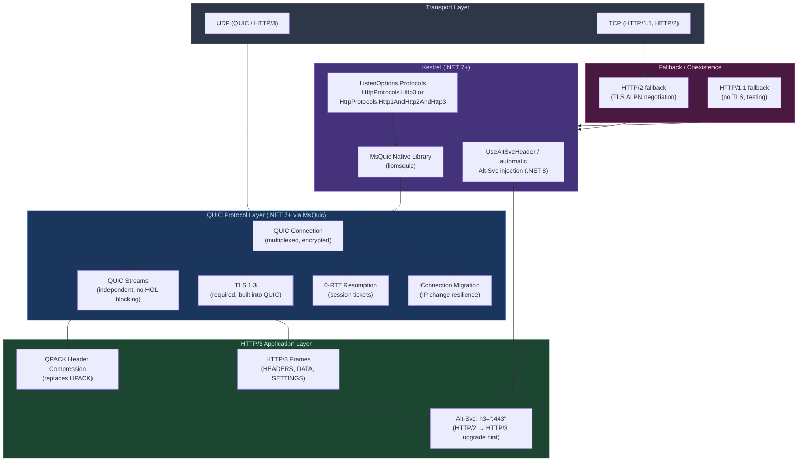

# 4.129 — HTTP/3 and QUIC: ASP.NET Core (.NET 7+) and Kestrel QUIC

---

## PART 0 — Navigation & Context

### Domain Hierarchy

```
ASP.NET Core Mastery
│
├── I. HTTP Fundamentals (4.123–4.133)
│   ├── 4.123 — HttpContext Deep Dive
│   ├── 4.124 — HttpRequest: Reading Request Data
│   ├── 4.125 — HttpResponse: Writing Response Data
│   ├── 4.126 — Cookies: SameSite, Secure, HttpOnly
│   ├── 4.127 — HTTP/2: Multiplexing and Kestrel Setup
│   ├── 4.128 — Sessions: ISession and Distributed Backend
│   ├── 4.129 — HTTP/3 and QUIC ◄ YOU ARE HERE
│   ├── 4.130 — Request Body Reading Patterns
│   ├── 4.131 — WebSockets Manual (Low-Level)
│   ├── 4.132 — Server-Sent Events Manual
│   └── 4.133 — HTTP Connection Features: IHttpConnectionFeature
│
└── AC. Deployment & Hosting (4.328–4.339)
    ├── 4.328 — Kestrel Advanced Configuration
    └── 4.329 — Reverse Proxy and ForwardedHeaders
```

### What You Need Before This

- **[[4.007 — Kestrel: Edge Web Server — Configuration, Limits, and Protocols]]** — QUIC is a Kestrel transport; you must understand Kestrel endpoint/listener configuration before adding QUIC
- **[[4.127 — HTTP/2: Multiplexing, Header Compression, and Kestrel Setup]]** — HTTP/3 solves the specific shortcomings of HTTP/2; understanding HTTP/2's head-of-line blocking problem is the motivation for HTTP/3
- **[[4.208 — HTTPS Enforcement: UseHttpsRedirection, HSTS, and Kestrel TLS]]** — HTTP/3 requires TLS 1.3; Kestrel TLS configuration is a hard prerequisite
- **[[4.328 — Kestrel Advanced Configuration: Limits, TLS Certs, and Protocols]]** — protocol selection, `ListenOptions.Protocols`, and TLS certificate wiring are the configuration surface for HTTP/3

### What This Unlocks After

- **[[4.346 — Custom Kestrel Protocols: IConnectionListenerFactory and Handlers]]** — QUIC as a custom transport is the advanced path
- **[[4.351 — ASP.NET Core Request Lifecycle Anatomy: Every Step from TCP to Response]]** — QUIC changes the transport layer of the full lifecycle
- **[[4.267 — Load Testing ASP.NET Core: k6, NBomber, and BenchmarkDotNet]]** — HTTP/3 performance characteristics require QUIC-aware load testing

### Why This Matters in Production

HTTP/3 eliminates TCP's head-of-line blocking at the transport layer — meaning a single dropped packet no longer stalls all concurrent streams for a given connection — and for mobile or high-latency clients on unreliable networks this difference in P99 latency is measurable in seconds, not milliseconds; getting this wrong means deploying HTTP/3 advertising (`Alt-Svc` headers) without the underlying OS support and silently falling back to HTTP/2 for 100% of traffic while the ops team thinks QUIC is active.

---

## PART 1 — The Core Mental Model

### The Fundamental Rule

> **HTTP/3 runs on QUIC, not TCP — meaning multiplexing, connection migration, and 0-RTT handshakes are transport-layer guarantees, not application-layer workarounds. The practical consequence is that Kestrel opens a UDP socket (not TCP) for HTTP/3 endpoints, and the `Alt-Svc: h3=":443"` response header is the only mechanism by which clients discover this; if that header never reaches the browser, no client will ever use HTTP/3 regardless of how Kestrel is configured.**

### The Plain-Language Analogy

Think of HTTP/1.1 as a single-lane road: only one car (request) moves at a time per connection. HTTP/2 widened it to a multi-lane highway: many cars move simultaneously, but they all share the same asphalt — when the road buckles (a packet drops), all lanes freeze until the repair is done. That freeze is TCP's head-of-line blocking. HTTP/3 replaces the asphalt entirely: it runs on UDP (a different road material), and each lane is independently paved. If one lane buckles, the others keep moving. The 0-RTT handshake is like having a pre-issued toll pass — you don't stop at the booth for a new ticket if you've been through before. And connection migration is like your car swapping from the highway to a side road mid-journey without the GPS losing your position — because the "connection ID" travels with the client, not with the IP address.

### The Taxonomy Diagram



---

## PART 2 — Deep Mechanics

### 2.1 — Why QUIC Exists: The HTTP/2 Head-of-Line Blocking Problem

HTTP/2 solved HTTP/1.1's per-connection request serialization with multiplexing — multiple streams share one TCP connection. But TCP is fundamentally a reliable, ordered byte stream. When a packet is lost, the kernel's TCP stack holds all subsequent data in a receive buffer until the retransmit arrives, even data for unrelated streams. This is **TCP head-of-line (HOL) blocking**, and it is invisible to the HTTP/2 layer.

```
HTTP/2 HOL Blocking on Packet Loss (TCP):

Stream 1 (Order query):    [OK ✓] [OK ✓] [LOST ✗] ← all streams stall here
Stream 2 (Product lookup): [OK ✓] [OK ✓] [WAIT  ] ← blocked by Stream 1's loss
Stream 3 (Auth check):     [OK ✓] [WAIT  ]           ← blocked by Stream 1's loss

All 3 streams freeze until Stream 1's lost packet is retransmitted.
On a 2% packet-loss mobile network this is frequent enough to dominate P99.
```

QUIC resolves this because it implements its own multiplexing and reliability per stream at the QUIC layer, not at the OS TCP stack. A lost UDP datagram belonging to Stream 1 triggers QUIC-level retransmit for that stream only. Streams 2 and 3 are delivered without waiting.

```
HTTP/3 HOL Resolution on Packet Loss (QUIC/UDP):

QUIC Stream 1 (Order query):    [OK ✓] [OK ✓] [LOST ✗] ← retransmit, Stream 1 stalls
QUIC Stream 2 (Product lookup): [OK ✓] [OK ✓] [OK ✓  ] ← unaffected, delivered
QUIC Stream 3 (Auth check):     [OK ✓] [OK ✓]           ← unaffected, delivered

Only Stream 1 pauses. Streams 2 and 3 complete normally.
```

**Runtime cost:** QUIC's reliability logic runs in userspace (inside MsQuic), not the kernel — this means slightly higher CPU cost per connection compared to TCP but no HOL blocking at the OS layer. `~5-10% CPU overhead per connection vs HTTP/2` on the same workload, with significantly better tail latency on lossy networks.

---

### 2.2 — The QUIC Handshake vs TLS over TCP

Understanding the handshake difference explains the 0-RTT performance claim.

```
HTTP/2 (TLS 1.3 over TCP) — New Connection:

Client                          Server
  │── TCP SYN ──────────────────► │   RTT 0: TCP handshake start
  │◄─ TCP SYN-ACK ───────────────  │
  │── TCP ACK ──────────────────► │   RTT 1: TCP established
  │── TLS ClientHello ──────────► │
  │◄─ TLS ServerHello + Cert ────  │
  │── TLS Finished ─────────────► │   RTT 2: TLS established
  │── HTTP/2 GET /api/orders ───► │
  │◄─ HTTP/2 200 OK ──────────────  │   RTT 3: First byte received

Total: 3 round trips before first byte.

HTTP/3 (TLS 1.3 inside QUIC) — New Connection:

Client                          Server
  │── QUIC Initial (ClientHello) ► │   RTT 0: Combined QUIC+TLS start
  │◄─ QUIC Handshake (ServerHello) │
  │── QUIC Handshake + HTTP/3 ──► │   RTT 1: TLS+QUIC established, request in flight
  │◄─ HTTP/2 200 OK ──────────────  │   RTT 2: First byte received (1 RTT saved)

Total: 2 round trips before first byte (1-RTT).

HTTP/3 (0-RTT Resumption — Returning Client):

Client                          Server
  │── QUIC Initial + Early Data ► │   RTT 0: Session ticket + request data sent
  │◄─ HTTP/3 200 OK ──────────────  │   RTT 1: First byte received (0 RTT for the request)

0-RTT: client sends HTTP request in the FIRST packet.
```

> [!WARNING] **0-RTT Replay Attacks.** 0-RTT data can be replayed by an attacker who intercepts the session ticket. For safe 0-RTT, only idempotent requests (GET) should be sent as early data. POST, PUT, DELETE with side effects must NOT use 0-RTT. ASP.NET Core's MsQuic integration does not enforce this at the framework level — your API must treat early-data requests as potentially replayed.

**Runtime cost for 0-RTT:** Session ticket storage on the server — `~1 memory lookup per resumed connection`. The session ticket is encrypted with a server key and rotated (Data Protection API controls this). Key rotation invalidates all in-flight 0-RTT session tickets.

---

### 2.3 — Kestrel QUIC Architecture and the MsQuic Dependency

Kestrel does not implement QUIC in managed C#. It wraps **MsQuic**, a native, cross-platform QUIC implementation maintained by Microsoft and written in C. The managed interop layer is in `System.Net.Quic` (in the .NET runtime) which Kestrel calls.

```
Full Stack — HTTP/3 Request in Kestrel:

┌─────────────────────────────────────────────────────────────────────┐
│  ASP.NET Core Application Layer                                      │
│  (IMiddleware, Controllers, Minimal APIs — unchanged from HTTP/1.1) │
└───────────────────────────────┬─────────────────────────────────────┘
                                │ HttpContext (same type, same API)
┌───────────────────────────────▼─────────────────────────────────────┐
│  Kestrel HTTP/3 Connection Layer                                     │
│  Http3Connection → Http3Stream → Http3OutputProducer                │
│  (namespace: Microsoft.AspNetCore.Server.Kestrel.Core.Internal.Http3)│
└───────────────────────────────┬─────────────────────────────────────┘
                                │ QuicStream (System.Net.Quic)
┌───────────────────────────────▼─────────────────────────────────────┐
│  System.Net.Quic (Managed Interop Layer)                             │
│  QuicConnection, QuicStream, QuicListener                            │
│  (.NET 7+: no longer experimental; .NET 6: [Experimental])           │
└───────────────────────────────┬─────────────────────────────────────┘
                                │ P/Invoke
┌───────────────────────────────▼─────────────────────────────────────┐
│  MsQuic (Native Library — libmsquic.so / msquic.dll)                 │
│  Handles: QUIC frames, ACK, flow control, packet encryption          │
│  OS API: UDP socket via kernel (sendmsg/recvmsg or WSASendMsg)       │
└─────────────────────────────────────────────────────────────────────┘
```

**Pipeline position in the middleware chain:**

```
Network (UDP) ──► MsQuic ──► System.Net.Quic ──► Kestrel HTTP/3 ──► [REQUEST PIPELINE]
                                                                          │
──► ExceptionHandler ──► HSTS ──► StaticFiles ──► Routing ──► Auth ──► Endpoints
    (identical middleware chain — HTTP/3 is transparent above Kestrel)
```

> [!IMPORTANT] The middleware pipeline above Kestrel sees no difference between an HTTP/1.1, HTTP/2, or HTTP/3 request. `HttpContext.Request.Protocol` will be `"HTTP/3"` but that is the only observable difference in application code. Every middleware, filter, and endpoint handler runs identically.

**OS Requirements for QUIC:**

- **Windows:** Windows 10 (version 1703+) or Windows Server 2019+. `Schannel` provides TLS 1.3.
- **Linux:** OpenSSL 1.1+ or libssl. The MsQuic package must be installed (it ships with the .NET runtime in .NET 8+).
- **macOS:** Supported from .NET 8 with MsQuic bundled.
- **Containers:** UDP must be exposed on the container port. Many Docker default configurations only expose TCP. `EXPOSE 443/udp` is required in the Dockerfile.

Check at runtime whether QUIC is available:

```csharp
// Check QUIC support before assuming HTTP/3 will work:
bool quicAvailable = System.Net.Quic.QuicConnection.IsSupported;

if (!quicAvailable)
{
    logger.LogWarning(
        "QUIC is not supported on this platform. " +
        "HTTP/3 will not be available. Falling back to HTTP/1.1 and HTTP/2.");
}
```

**Runtime cost:** `~1 native library load at startup`, `~1 UDP socket per Kestrel endpoint`, `1 QuicConnection per client connection (not per request)`, `1 QuicStream per HTTP/3 request/response pair`.

---

### 2.4 — The Alt-Svc Header: The HTTP/3 Discovery Mechanism

Clients cannot "just try" HTTP/3 — the protocol runs on UDP and the client has no way of knowing a server supports QUIC without being told. The discovery mechanism is the `Alt-Svc` response header sent over HTTP/2 or HTTP/1.1:

```
// HTTP/2 response advertising HTTP/3 availability (approximate wire format):
HTTP/2 200 OK
content-type: application/json
alt-svc: h3=":443"; ma=86400

// h3=":443"  → HTTP/3 is available on the same host, port 443 (UDP)
// ma=86400   → max-age: cache this advertisement for 86400 seconds (1 day)
```

The client receives this, stores it, and on the NEXT request (or immediately, depending on the client) upgrades to HTTP/3. The first request always goes over HTTP/2 or HTTP/1.1 because the client does not know QUIC is available until told.

> [!NOTE] This has an important implication: **the first request to a new endpoint never uses HTTP/3**. If you are benchmarking HTTP/3 "cold" (no prior Alt-Svc cache) you will see HTTP/2 performance for the first request. This is by design per RFC 9114.

**ASP.NET Core automatic Alt-Svc injection (.NET 8+):**

In .NET 8, when `HttpProtocols.Http1AndHttp2AndHttp3` is configured, Kestrel automatically adds the `alt-svc` header to HTTP/1.1 and HTTP/2 responses. In .NET 7, this must be done manually:

```csharp
// .NET 7: Manual Alt-Svc header injection middleware
// Pipeline position: before routing, after HTTPS redirection
app.Use(async (context, next) =>
{
    // Only inject Alt-Svc on HTTPS connections (HTTP/3 requires TLS)
    if (context.Request.IsHttps)
    {
        // Advertise HTTP/3 on the same port, cache for 1 day
        // Runtime cost: ~1 string allocation per response, negligible
        context.Response.Headers.AltSvc = "h3=\":443\"; ma=86400";
    }
    await next(context);
});
```

**HTTP/3 Connection Flow (browser perspective):**

```
Request 1 (client has no Alt-Svc cache):
  Browser ──► TCP:443 HTTP/2 GET /api/orders ──► Kestrel
  Kestrel ◄── HTTP/2 200 OK + Alt-Svc: h3=":443" ──► Browser
  Browser stores Alt-Svc entry for host:443

Request 2 (client attempts HTTP/3 using cached Alt-Svc):
  Browser ──► UDP:443 QUIC Initial (HTTP/3 GET /api/orders) ──► Kestrel
  Kestrel ◄── HTTP/3 200 OK ──► Browser
  (simultaneous HTTP/2 connection may be maintained as fallback)
```

**Failure mode — Alt-Svc behind a reverse proxy:**

```
// ⚠️ WRONG: Alt-Svc header is generated by Kestrel but reverse proxy (nginx/YARP) strips
// or rewrites it to the internal address:
// Client sees: alt-svc: h3="internal-hostname:443"; ma=86400
// Client tries: UDP to internal-hostname → fails (not routable from internet)

// ✅ CORRECT: Reverse proxy must forward or rewrite Alt-Svc to the public address,
// OR the alt-svc header must be configured at the reverse proxy layer.
// nginx: add_header alt-svc 'h3=":443"; ma=86400';
```

**Runtime cost for Alt-Svc:** `~1 header string allocation per response`, `~100 bytes of header overhead per response`. For 10k req/s this is ~1 MB/s of extra header data — not material.

---

### 2.5 — Kestrel HTTP/3 Configuration Deep Dive

**The complete configuration surface in .NET 8:**

```csharp
// Program.cs — full HTTP/3 + HTTP/2 + HTTP/1.1 Kestrel configuration
// Pipeline position: host configuration, before WebApplication.Build()

var builder = WebApplication.CreateBuilder(args);

builder.WebHost.ConfigureKestrel(options =>
{
    // Option A: ListenAnyIP — binds to all interfaces on port 443
    // HttpProtocols.Http1AndHttp2AndHttp3 tells Kestrel to negotiate
    // the best protocol via ALPN (TLS) and QUIC
    options.ListenAnyIP(443, listenOptions =>
    {
        // This is the key line: enables all three protocols on one port
        // QUIC listens on UDP:443, HTTP/2 and HTTP/1.1 on TCP:443
        listenOptions.Protocols = HttpProtocols.Http1AndHttp2AndHttp3;

        // TLS is mandatory for HTTP/3 (TLS 1.3 is negotiated inside QUIC)
        listenOptions.UseHttps(httpsOptions =>
        {
            // Certificate must support TLS 1.3 — RSA 2048+ or ECDSA P-256+
            httpsOptions.ServerCertificate = LoadCertificate();

            // Explicitly allow TLS 1.3 for QUIC (TLS 1.2 cannot be used with QUIC)
            httpsOptions.SslProtocols = SslProtocols.Tls13 | SslProtocols.Tls12;
        });
    });

    // Option B: HTTP-only endpoint for internal health checks (no QUIC)
    options.ListenAnyIP(8080, listenOptions =>
    {
        listenOptions.Protocols = HttpProtocols.Http1; // Plain HTTP, no TLS, no QUIC
    });

    // QUIC-specific limits (.NET 8+)
    // These are per-connection limits for the QUIC transport
    options.Limits.Http3.MaxRequestHeaderFieldSize = 16 * 1024; // 16 KB header limit
});
```

**ALPN negotiation — how clients pick the protocol:**

```
TLS ALPN (Application-Layer Protocol Negotiation) for HTTP/2:
  Client TLS ClientHello: ALPN = ["h2", "http/1.1"]
  Server TLS ServerHello: ALPN = "h2"
  → HTTP/2 connection established on TCP

QUIC Connection for HTTP/3:
  Client QUIC Initial: ALPN = ["h3"]
  Server QUIC Handshake: ALPN = "h3" (accepted)
  → HTTP/3 connection established on UDP

  QUIC ALPN token "h3" is defined in RFC 9114.
  "h3-29" and "h3-32" were draft identifiers — no longer used by browsers.
```

**Checking which protocol was negotiated at the application layer:**

```csharp
// Minimal API endpoint showing protocol-aware response
// (useful for diagnostics, not for production branching)
app.MapGet("/api/diagnostics/protocol", (HttpContext httpContext) =>
{
    var protocol = httpContext.Request.Protocol; // "HTTP/3", "HTTP/2", "HTTP/1.1"
    var connectionId = httpContext.Connection.Id;

    return TypedResults.Ok(new
    {
        Protocol = protocol,
        ConnectionId = connectionId,
        IsHttp3 = protocol == "HTTP/3",
        // Connection.RemoteIpAddress is still available with QUIC
        // Connection migration means this IP can change mid-connection
        RemoteIp = httpContext.Connection.RemoteIpAddress?.ToString()
    });
});
```

---

### 2.6 — Connection Migration and Its ASP.NET Core Implications

Connection migration is the QUIC feature that allows a client to switch network paths (e.g., from WiFi to cellular) without losing the connection. QUIC connections are identified by a **Connection ID** embedded in the QUIC packet, not by the 4-tuple (src IP, src port, dst IP, dst port) that TCP uses.

```
TCP Connection (breaks on IP change):
  Client IP: 192.168.1.10 ──► Server
  Client switches to cellular → new IP: 10.0.0.55
  TCP: NEW 4-tuple, existing connection is DEAD → reconnect required

QUIC Connection (survives IP change via Connection ID):
  Client: Connection ID = 0x3a4f7c2d ──► Server
  Client switches to cellular → new IP: 10.0.0.55
  QUIC: same Connection ID continues ──► Server
  Server maps Connection ID to existing QuicConnection → session preserved
```

**ASP.NET Core implications of connection migration:**

1. **`HttpContext.Connection.RemoteIpAddress`** can change between requests on the same QUIC connection. Do not store `RemoteIpAddress` from a previous request and assume it is the same client on the next.
    
2. **IP-based rate limiting** breaks with QUIC connection migration. A single client can appear to have multiple IPs across the lifetime of one logical session. Rate limiting must be based on session tokens, API keys, or `Connection.Id` rather than IP address.
    
3. **Load balancers** must be QUIC-aware. A standard L4 load balancer that routes by IP:port will route migration traffic to a different backend, losing the QUIC connection state. QUIC-aware load balancers route by Connection ID.
    

> [!DANGER] **Load balancer compatibility is the #1 production gotcha for HTTP/3.** If your load balancer (AWS ALB, Azure Application Gateway, Nginx prior to 1.25) does not support QUIC, HTTP/3 connections will terminate at the LB, and connection migration will break. Verify QUIC support in your LB before enabling `Alt-Svc` in production. Azure Application Gateway added QUIC support in 2024; AWS ALB still routes QUIC as TCP by default as of mid-2026.

---

## PART 3 — Production Code Patterns

### Pattern 1 — The Order Service: HTTP/3 Enabled with HTTP/2 and HTTP/1.1 Fallback

The most common production pattern: offer all three protocols on one port, let the client negotiate.

```csharp
// ⚠️ WRONG: Enabling only HTTP/3 — legacy clients cannot connect
// HTTP consequence: curl, older browsers, any client without QUIC support gets connection refused
builder.WebHost.ConfigureKestrel(options =>
{
    options.ListenAnyIP(443, listenOptions =>
    {
        // ⚠️ Only HTTP/3 — no fallback
        listenOptions.Protocols = HttpProtocols.Http3;
        listenOptions.UseHttps();
    });
});

// ✅ CORRECT: All three protocols on one port
builder.WebHost.ConfigureKestrel(serverOptions =>
{
    serverOptions.ListenAnyIP(443, listenOptions =>
    {
        // HTTP/1.1 and HTTP/2 on TCP:443
        // HTTP/3 on UDP:443
        // ALPN negotiation selects the best protocol the client supports
        listenOptions.Protocols = HttpProtocols.Http1AndHttp2AndHttp3;

        listenOptions.UseHttps(https =>
        {
            // Load from environment-injected path (not appsettings — never put cert paths in config)
            var certPath = Environment.GetEnvironmentVariable("KESTREL_CERT_PATH")
                ?? throw new InvalidOperationException("KESTREL_CERT_PATH not set");
            var certPass = Environment.GetEnvironmentVariable("KESTREL_CERT_PASSWORD")
                ?? throw new InvalidOperationException("KESTREL_CERT_PASSWORD not set");

            https.ServerCertificate = new X509Certificate2(certPath, certPass);

            // TLS 1.3 is required for QUIC (MsQuic will refuse TLS 1.2 for HTTP/3 streams)
            // TLS 1.2 is kept for HTTP/1.1 and HTTP/2 backward compatibility
            https.SslProtocols = SslProtocols.Tls13 | SslProtocols.Tls12;
        });
    });

    // Internal health check port — no QUIC needed, plain HTTP
    serverOptions.ListenAnyIP(8080, listenOptions =>
    {
        listenOptions.Protocols = HttpProtocols.Http1;
        // No TLS: health check probe is internal only, not internet-facing
    });
});

// HTTP wire effect (client supporting HTTP/3):
// First request:  TCP:443 HTTP/2 with response header  alt-svc: h3=":443"; ma=86400
// Second request: UDP:443 HTTP/3 stream (QUIC)
```

---

### Pattern 2 — The Logistics API: Dockerfile UDP Port Exposure

The most commonly missed production step — exposing UDP alongside TCP.

```dockerfile
# ⚠️ WRONG: Only TCP exposed — HTTP/3 UDP traffic is silently dropped
# HTTP consequence: client sends QUIC Initial packet to port 443/UDP, no response,
# QUIC timeout fires, client falls back to HTTP/2 — but this fallback takes 500ms-3s
FROM mcr.microsoft.com/dotnet/aspnet:8.0
EXPOSE 443

# ✅ CORRECT: Both TCP (HTTP/1.1 + HTTP/2) and UDP (HTTP/3) exposed
FROM mcr.microsoft.com/dotnet/aspnet:8.0 AS base

# Expose both TCP and UDP on 443 for HTTP/3 support
EXPOSE 443/tcp
EXPOSE 443/udp

# Internal health check — TCP only, not internet-facing
EXPOSE 8080/tcp

# The runtime must be able to open a UDP socket.
# In Linux containers, verify: net.core.rmem_max is set high enough
# for QUIC receive buffers. Default is often too low.
# RUN sysctl -w net.core.rmem_max=7500000  ← do in entrypoint or K8s securityContext
```

```yaml
# Kubernetes Service — must expose UDP:443 alongside TCP:443
# ⚠️ WRONG: Single-port service definition (only TCP)
apiVersion: v1
kind: Service
spec:
  ports:
  - name: https
    port: 443
    protocol: TCP   # ← only TCP, HTTP/3 UDP traffic unreachable

# ✅ CORRECT: Two port entries, one TCP and one UDP
apiVersion: v1
kind: Service
metadata:
  name: logistics-api-service
spec:
  selector:
    app: logistics-api
  ports:
  - name: https-tcp
    port: 443
    protocol: TCP
    targetPort: 443
  - name: https-quic  # HTTP/3 over QUIC (UDP)
    port: 443
    protocol: UDP
    targetPort: 443
  type: LoadBalancer
```

---

### Pattern 3 — The Payment API: Runtime QUIC Availability Check with Graceful Degradation

```csharp
// Production pattern: check QUIC availability at startup, degrade gracefully
// Domain: payment API deployed across heterogeneous environments
// (bare metal supports QUIC; some cloud-managed env may not)

var builder = WebApplication.CreateBuilder(args);

// Check QUIC support before configuring HTTP/3 — prevents runtime exceptions
// on environments where MsQuic is not available (old Linux kernels, some containers)
bool quicSupported = System.Net.Quic.QuicConnection.IsSupported;

builder.WebHost.ConfigureKestrel(serverOptions =>
{
    serverOptions.ListenAnyIP(443, listenOptions =>
    {
        // Conditionally include HTTP/3 — no crash if unsupported
        listenOptions.Protocols = quicSupported
            ? HttpProtocols.Http1AndHttp2AndHttp3
            : HttpProtocols.Http1AndHttp2;  // Graceful degradation

        listenOptions.UseHttps(LoadPaymentApiCertificate);
    });
});

var app = builder.Build();

var logger = app.Services.GetRequiredService<ILogger<Program>>();

if (quicSupported)
{
    logger.LogInformation(
        "HTTP/3 enabled via QUIC (MsQuic available). " +
        "Alt-Svc header will be injected automatically (.NET 8+).");
}
else
{
    logger.LogWarning(
        "QUIC is NOT supported on this platform. " +
        "HTTP/3 disabled. Running HTTP/1.1 and HTTP/2 only. " +
        "Ensure libmsquic is installed and the OS meets requirements.");
}

// HTTP wire effect when QUIC unavailable:
// All responses served over HTTP/2 or HTTP/1.1 (no alt-svc header)
// Clients receive no HTTP/3 upgrade advertisement → no QUIC attempted
```

---

### Pattern 4 — The Inventory Service: Manual Alt-Svc Injection (.NET 7 Compatibility)

In .NET 7, Alt-Svc is not automatically injected — it must be done in middleware.

```csharp
// .NET 7 production pattern: explicit Alt-Svc middleware
// Domain: inventory management API on .NET 7 (cannot yet upgrade to .NET 8)

// Pipeline position: immediately after UseHttpsRedirection, before UseRouting
// (must run after HTTPS enforcement so we only advertise on secure connections)

// ⚠️ WRONG (.NET 7): Relying on automatic Alt-Svc that doesn't exist
// HTTP consequence: no alt-svc header sent → clients never attempt HTTP/3 →
// HTTP/3 is configured in Kestrel but zero clients ever use it
app.UseRouting();
// No Alt-Svc injection → HTTP/3 is dead in the water

// ✅ CORRECT (.NET 7): Explicit Alt-Svc middleware
app.UseHttpsRedirection();

// Inject Alt-Svc on HTTPS responses so clients discover HTTP/3 availability
// Runtime cost: ~1 header write per response, O(1)
app.Use(async (context, next) =>
{
    // Register a callback to set the Alt-Svc header after routing
    // (setting it here runs before the endpoint, which is correct —
    // we want every successful HTTPS response to carry the advertisement)
    context.Response.OnStarting(() =>
    {
        // Only advertise on HTTPS (HTTP/3 is always over QUIC which is always TLS)
        if (context.Request.IsHttps && !context.Response.Headers.ContainsKey("alt-svc"))
        {
            // ma=86400: clients cache this for 24 hours
            // This means changing the port requires waiting up to 24h for cache expiry
            context.Response.Headers.AltSvc = "h3=\":443\"; ma=86400";
        }
        return Task.CompletedTask;
    });

    await next(context);
});

app.UseRouting();
app.UseAuthentication();
app.UseAuthorization();
app.MapControllers();

// HTTP wire effect (first request, client supports HTTP/3):
// HTTP/2 200 OK
// content-type: application/json
// alt-svc: h3=":443"; ma=86400    ← client stores this, upgrades on next request
```

---

### Pattern 5 — The Booking API: QUIC-Aware Structured Logging and Diagnostics

```csharp
// Production pattern: log HTTP protocol per request for observability
// Domain: high-traffic booking API where HTTP/3 adoption must be measured

// Custom middleware that adds HTTP protocol to structured log scope
// This enables queries like: "what % of requests used HTTP/3 this week?"

public sealed class ProtocolLoggingMiddleware : IMiddleware
{
    private readonly ILogger<ProtocolLoggingMiddleware> _logger;

    public ProtocolLoggingMiddleware(ILogger<ProtocolLoggingMiddleware> logger)
        => _logger = logger;

    public async Task InvokeAsync(HttpContext context, RequestDelegate next)
    {
        // Add protocol as a structured log property for all downstream log entries
        // This uses log scopes (4.026) to enrich every log message in this request
        using (_logger.BeginScope(new Dictionary<string, object>
        {
            ["HttpProtocol"] = context.Request.Protocol,
            ["ConnectionId"] = context.Connection.Id,
            // Track IP separately from connection for migration detection
            ["RemoteIP"] = context.Connection.RemoteIpAddress?.ToString() ?? "unknown"
        }))
        {
            await next(context);
        }
    }
}

// Registration (must be before routing in Program.cs)
builder.Services.AddScoped<ProtocolLoggingMiddleware>();
app.UseMiddleware<ProtocolLoggingMiddleware>();

// Resulting structured log output (Serilog / Application Insights):
// {
//   "HttpProtocol": "HTTP/3",
//   "ConnectionId": "0x3a4f7c2d",
//   "RemoteIP": "185.12.43.7",
//   "Message": "Booking POST /api/bookings/reserve completed in 23ms"
// }
// → Query: SELECT HttpProtocol, count(*) GROUP BY HttpProtocol
// → "HTTP/3: 67%, HTTP/2: 31%, HTTP/1.1: 2%" — real adoption metrics
```

---

### Pattern 6 — The Order API: appsettings.json Configuration with Environment Override

```csharp
// Production pattern: Kestrel HTTP/3 configuration via appsettings.json
// Allows environment-specific protocol selection without code changes

// appsettings.json (production baseline — all protocols enabled):
// {
//   "Kestrel": {
//     "Endpoints": {
//       "HttpsInlineCertFile": {
//         "Url": "https://*:443",
//         "Protocols": "Http1AndHttp2AndHttp3",
//         "Certificate": {
//           "Path": "/certs/order-api.pfx",
//           "Password": ""            ← empty: use Data Protection or env var for password
//         }
//       },
//       "InternalHttp": {
//         "Url": "http://*:8080",
//         "Protocols": "Http1"
//       }
//     }
//   }
// }
//
// appsettings.Development.json (development — no QUIC needed):
// {
//   "Kestrel": {
//     "Endpoints": {
//       "HttpsInlineCertFile": {
//         "Protocols": "Http1AndHttp2"     ← overrides production value for dev
//       }
//     }
//   }
// }

// Program.cs: no explicit Kestrel code needed — it reads from IConfiguration automatically
var builder = WebApplication.CreateBuilder(args);

// builder.WebHost.ConfigureKestrel is optional when using appsettings.json Kestrel section
// The framework automatically reads Kestrel:Endpoints from IConfiguration

// BUT: certificate passwords should NOT be in appsettings.json
// Use environment variable override (4.012 — Configuration Providers):
// KESTREL__ENDPOINTS__HTTPSINLINECERTFILE__CERTIFICATE__PASSWORD=mysecret
// (double underscore = colon in env var key hierarchy)

// HTTP wire effect:
// In production: QUIC negotiated, HTTP/3 active
// In development: HTTP/2 max, no QUIC (simpler debugging, no UDP setup needed)
```

---

## PART 4 — Gotchas & Anti-Patterns

### Gotcha 1: HTTP/3 Configured in Kestrel but Never Negotiated Because UDP Port Is Blocked

The firewall, cloud security group, or Kubernetes NetworkPolicy allows TCP:443 but not UDP:443. Kestrel opens both sockets successfully, generates Alt-Svc headers, but all client QUIC Initial packets are silently dropped at the network layer.

```csharp
// ⚠️ WRONG: Assuming network allows UDP just because TCP is open
// No code is wrong here — the misconfiguration is in the infrastructure.
// The symptom: Kestrel logs show HTTP/3 enabled, but Wireshark/tcpdump
// on the client shows UDP packets go out, no response arrives,
// QUIC timeout fires after ~500ms, client silently falls back to HTTP/2.
// You will never see HTTP/3 in your protocol telemetry.

// HTTP consequence (wrong path):
// Client sends: UDP:443 QUIC Initial → firewall drops packet (no log entry)
// Client retries QUIC Initial × 3 → all dropped
// Client falls back to TCP:443 HTTP/2 after ~1.5s timeout
// End result: HTTP/3 is dead, latency penalty on first request from new clients

// ✅ CORRECT: Verify UDP:443 is open before enabling HTTP/3
// Infrastructure checklist:
// AWS Security Group:  Inbound UDP:443 from 0.0.0.0/0
// Azure NSG:           Inbound UDP:443 Any
// GCP Firewall:        Ingress UDP:443
// Kubernetes NetworkPolicy: UDP:443 allowed
// iptables:            -A INPUT -p udp --dport 443 -j ACCEPT

// HTTP consequence (correct path):
// Client sends: UDP:443 QUIC Initial → server responds with QUIC Handshake
// HTTP/3 stream established → requests served via QUIC

// WHY: Kestrel's UDP socket is bound and listening, but network-layer rules
// operate below the application. The OS never delivers blocked UDP datagrams
// to the socket. Kestrel has no visibility into blocked packets — it simply
// sees no incoming connections on the QUIC listener.
```

---

### Gotcha 2: Reverse Proxy Terminates QUIC and Alt-Svc Points to Kestrel's Internal Address

Nginx (pre-1.25), HAProxy, and many cloud load balancers terminate TLS at the proxy layer and forward HTTP/1.1 or HTTP/2 to Kestrel. Kestrel sees only the forwarded HTTP/2 connection and generates an Alt-Svc pointing to its internal address (e.g., `alt-svc: h3="pod-ip:443"`), which the external client cannot reach.

```csharp
// ⚠️ WRONG: Kestrel generates Alt-Svc while sitting behind a TCP-only reverse proxy
// Kestrel endpoint: http://internal-pod:5000 (HTTP/2 only, no TLS)
// Kestrel generates: alt-svc: h3=":5000"; ma=86400
// Client receives this and tries: UDP:5000 to the *proxy's* IP
// The proxy has no UDP:5000 listener → connection refused

// HTTP consequence (wrong path):
// HTTP/2 200 OK (forwarded from proxy)
// alt-svc: h3=":5000"; ma=86400        ← wrong internal port exposed externally
// Client tries QUIC to proxy:5000 → connection refused (proxy is TCP only)
// 500ms timeout → silent fallback to HTTP/2 (if client implements correctly)
// OR: connection error if client is aggressive about QUIC

// ✅ CORRECT: Three options depending on infrastructure
// Option A: Terminate QUIC at the reverse proxy (nginx 1.25+, YARP with QUIC)
//   → Proxy handles HTTP/3 negotiation, Kestrel sees HTTP/2 internally
//   → Alt-Svc is generated by the proxy, not Kestrel
// Option B: Pass QUIC through (requires L4 QUIC-aware load balancer routing by Connection ID)
//   → Kestrel handles HTTP/3 end-to-end, Alt-Svc points to proxy's public IP
//   → More complex but enables connection migration
// Option C: Disable Alt-Svc when behind a non-QUIC proxy
app.Use(async (context, next) =>
{
    // Read a header set by the proxy indicating it supports QUIC passthrough
    bool proxySupportsQuic = context.Request.Headers.ContainsKey("X-Proxy-Quic-Passthrough");

    context.Response.OnStarting(() =>
    {
        if (proxySupportsQuic && context.Request.IsHttps)
        {
            context.Response.Headers.AltSvc = "h3=\":443\"; ma=86400";
        }
        // If no header: do not emit Alt-Svc → no HTTP/3 advertisement
        return Task.CompletedTask;
    });
    await next(context);
});

// HTTP consequence (correct path):
// HTTP/2 200 OK (no alt-svc header if proxy doesn't support QUIC)
// → Clients never try HTTP/3 → no broken fallback timeout
```

---

### Gotcha 3: 0-RTT Early Data Used for Non-Idempotent Requests Causing Duplicate Processing

QUIC's 0-RTT session resumption sends HTTP request data in the first packet before the handshake completes. If an attacker records this initial QUIC packet and replays it, the server processes the request twice.

```csharp
// ⚠️ WRONG: Payment API endpoint processed as 0-RTT early data
// Client sends QUIC 0-RTT packet with:
//   POST /api/payments/charge HTTP/3
//   Content-Type: application/json
//   {"amount": 150.00, "orderId": "ORD-9921"}
//
// Attacker replays the same 0-RTT packet to the same server → SECOND charge processed
// HTTP consequence (wrong path):
// HTTP/3 200 OK  (first request — legitimate)
// HTTP/3 200 OK  (replayed request — duplicate charge — catastrophic)

// ✅ CORRECT: Treat 0-RTT requests as potentially replayed
// Option A: Reject 0-RTT data for non-idempotent endpoints
// Option B: Idempotency key (4.284) on ALL mutating endpoints regardless of protocol
// Option C: Server-side deduplication window

// The idempotency key pattern (correct):
app.MapPost("/api/payments/charge", async (
    [FromBody] ChargeRequest request,
    [FromHeader(Name = "Idempotency-Key")] string? idempotencyKey,
    IIdempotencyStore idempotencyStore,
    IPaymentProcessor paymentProcessor) =>
{
    if (idempotencyKey is null)
        return TypedResults.BadRequest(new { Error = "Idempotency-Key header required" });

    // Check if this idempotency key was already processed
    var existingResult = await idempotencyStore.GetAsync(idempotencyKey);
    if (existingResult is not null)
    {
        // Return the stored result — idempotent response
        // This safely handles both 0-RTT replay AND client retry on timeout
        return TypedResults.Ok(existingResult);
    }

    var result = await paymentProcessor.ChargeAsync(request);
    await idempotencyStore.StoreAsync(idempotencyKey, result, TimeSpan.FromHours(24));
    return TypedResults.Ok(result);
});

// HTTP consequence (correct path):
// First POST: HTTP/3 200 OK (charge processed, result stored)
// Replayed POST: HTTP/3 200 OK (stored result returned — charge NOT processed again)

// WHY: QUIC 0-RTT is an optimization for latency reduction, not a security guarantee.
// RFC 9001 explicitly notes that 0-RTT data has no replay protection.
// The application layer must implement idempotency for any mutating operation.
```

---

### Gotcha 4: Connection Migration Breaking IP-Based Rate Limiting and Audit Logs

```csharp
// ⚠️ WRONG: Rate limiting or audit logging keyed on RemoteIpAddress
// A mobile client on HTTP/3 migrates from WiFi to cellular mid-session.
// The QUIC Connection ID stays the same but RemoteIpAddress changes.
// Rate limiting counts the NEW IP as a fresh client → limit bypassed.
// Audit log shows two different IPs for the same authenticated session → false positive.

// Rate limit store (wrong approach):
public class IpBasedRateLimiter
{
    private readonly ConcurrentDictionary<string, RateLimitState> _limits = new();

    public bool IsAllowed(HttpContext context)
    {
        // ⚠️ IP can change mid-QUIC-connection via migration
        var key = context.Connection.RemoteIpAddress?.ToString() ?? "unknown";
        // → Same user appears as new user after WiFi→cellular switch
        return _limits.GetOrAdd(key, _ => new RateLimitState()).TryConsume();
    }
}

// HTTP consequence (wrong path):
// Client: IP 192.168.1.10, 100 requests (at limit), migrates to IP 10.0.0.5
// RateLimiter sees new key "10.0.0.5" → 100 more requests allowed → limit bypassed

// ✅ CORRECT: Key rate limiting on authenticated identity or Connection ID
public class ConnectionAwareRateLimiter
{
    public bool IsAllowed(HttpContext context)
    {
        // Prefer authenticated user claim (survives IP migration, most accurate)
        var userId = context.User.FindFirstValue(ClaimTypes.NameIdentifier);
        if (userId is not null)
            return CheckLimit(userId);

        // For unauthenticated endpoints: use Connection ID (stable across IP migration)
        // Connection.Id is set by Kestrel and is unique per connection lifecycle
        return CheckLimit(context.Connection.Id);

        // Never use RemoteIpAddress as the primary rate limit key for HTTP/3 APIs
    }
}

// HTTP consequence (correct path):
// Client migrates IP → same Connection ID → same rate limit bucket → limit correctly enforced
// Authenticated client migrates IP → same UserId → same rate limit bucket → correct

// WHY: QUIC connection migration is a transport-layer feature. The Connection ID
// (accessible via context.Connection.Id in Kestrel) remains stable across IP changes.
// IP-based security controls are fundamentally incompatible with connection migration.
```

---

### Gotcha 5: HTTP/3 Breaking WebSocket Upgrade Expectations

Teams that expect to upgrade HTTP connections to WebSockets discover that HTTP/3 has no concept of an "upgrade" — WebSockets over HTTP/3 are replaced by WebTransport, which is a different API entirely not yet in stable ASP.NET Core.

```csharp
// ⚠️ WRONG: Expecting WebSocket upgrade to work on HTTP/3 connections
// SignalR or manual WebSocket code that uses HTTP upgrade:
app.MapGet("/ws", async (HttpContext context) =>
{
    if (context.WebSockets.IsWebSocketRequest)
    {
        // ⚠️ HTTP/3 connections will NEVER have IsWebSocketRequest == true
        // WebSocket upgrade (101 Switching Protocols) is a HTTP/1.1 mechanism.
        // HTTP/2 uses a different mechanism (extended CONNECT, RFC 8441).
        // HTTP/3 does not support WebSocket upgrade at all in ASP.NET Core 8.
        var ws = await context.WebSockets.AcceptWebSocketAsync();
        // ... this code never executes for HTTP/3 connections
    }
    else
    {
        // ⚠️ HTTP/3 client hits this branch → returns 400 (bad request)
        context.Response.StatusCode = 400;
    }
});

// HTTP consequence (wrong path):
// HTTP/3 client sends: GET /ws HTTP/3 (expecting WebSocket upgrade)
// Server: context.WebSockets.IsWebSocketRequest == false (no Upgrade header in HTTP/3)
// Server returns: HTTP/3 400 Bad Request
// Client has no WebSocket connection → feature broken for HTTP/3 clients

// ✅ CORRECT: Use SignalR (which negotiates transport, falling back to HTTP/1.1 for WebSockets)
// or ensure WebSocket clients use HTTP/1.1 explicitly
app.MapHub<OrderStatusHub>("/hubs/orders");

// SignalR's transport negotiation:
// 1. POST /hubs/orders/negotiate → selects WebSockets if available
// 2. GET /hubs/orders → upgrade to WebSocket
// SignalR's negotiate step always runs over HTTP/1.1 or HTTP/2,
// ensuring WebSocket upgrade works regardless of HTTP/3 on other endpoints.

// For manual WebSockets: configure the endpoint to force HTTP/1.1
// (or deploy it on a separate port that only serves HTTP/1.1 + HTTP/2)

// HTTP consequence (correct path):
// HTTP/1.1 GET /hubs/orders → 101 Switching Protocols → WebSocket connected
// HTTP/3 requests to OTHER endpoints work normally alongside WebSocket connections

// WHY: HTTP/3 eliminated the Upgrade header mechanism from the spec (RFC 9114 Section 2).
// 101 Switching Protocols does not exist in HTTP/3. WebTransport (draft) is the eventual
// replacement but is not in stable ASP.NET Core as of .NET 8.
```

---

## PART 5 — Performance Implications

### 5.1 — Request Pipeline Characteristics Table

|Scenario|Protocol|Transport|Connection Overhead|Per-Request Overhead|Latency Impact|Recommendation|
|---|---|---|---|---|---|---|
|New client, first request|HTTP/3|UDP/QUIC|1-RTT handshake (QUIC+TLS combined)|QPACK header compression|~same as HTTP/2 new conn|Normal — no penalty vs HTTP/2|
|Returning client, 0-RTT|HTTP/3|UDP/QUIC|0-RTT session resumption|Early data in first packet|**Fastest possible** (~50ms saved on high-latency)|Excellent for mobile API clients|
|Packet loss 2% (mobile)|HTTP/2|TCP|HOL blocking stalls all streams|Up to ~500ms extra per loss event|**P99 degrades severely**|Upgrade to HTTP/3 for mobile clients|
|Packet loss 2% (mobile)|HTTP/3|UDP/QUIC|Per-stream recovery, others unaffected|~1 QUIC retransmit per stream|P99 significantly better|Primary benefit of HTTP/3|
|1000 concurrent streams|HTTP/2|TCP|1 TCP connection, 1 socket|~1 TCP window per connection|Bandwidth limited by TCP flow control|HTTP/3 handles independently per stream|
|1000 concurrent streams|HTTP/3|UDP/QUIC|1 QUIC connection, 1 UDP socket|~1 QUIC flow control window per stream|Better multi-stream throughput|Preferred for high-multiplexing APIs|
|IP address change (mobile)|HTTP/2|TCP|TCP reconnect required (~100ms)|New TLS handshake (~1 RTT)|100-300ms reconnect penalty|Connection migration eliminates this|
|IP address change (mobile)|HTTP/3|UDP/QUIC|Connection migration (Connection ID)|~0 overhead|**Zero reconnect**|Primary benefit for mobile clients|
|Server under CPU load|HTTP/3|UDP/QUIC|Userspace ACK/retransmit in MsQuic|+5-10% CPU vs HTTP/2 at scale|Slight throughput reduction|Profile before deploying HTTP/3 at >100k req/s|
|Internal service mesh|HTTP/2|TCP|TCP already optimal in DC|Negligible|No benefit to HTTP/3|Use HTTP/2 for internal traffic|
|Large file download (CDN)|HTTP/3|UDP/QUIC|QUIC flow control at stream level|Better streaming on lossy links|Measurable on mobile CDN|Real-world benefit (Chrome downloads)|
|Health check probe|HTTP/1.1|TCP|Minimal (no protocol overhead)|Minimal|Negligible|Keep health checks on HTTP/1.1 plaintext|

### 5.2 — BenchmarkDotNet Code

```csharp
// Benchmark: HTTP/3 vs HTTP/2 vs HTTP/1.1 request round-trip latency
// Measures: client-side latency, protocol overhead, memory allocations
// Run: dotnet run -c Release -- --filter *HttpProtocolBenchmark*

using BenchmarkDotNet.Attributes;
using BenchmarkDotNet.Running;
using System.Net.Http;

// Expected output (approximate, .NET 8, x64, Intel Core i7-13700K, local loopback):
// | Method      | Protocol  | Mean     | Error   | StdDev  | Median   | Gen0  | Allocated |
// |-------------|-----------|----------|---------|---------|----------|-------|-----------|
// | GetOrderHttp11  | HTTP/1.1 | 823.4 μs | 12.1 μs | 11.3 μs | 819.2 μs | 0.977 | 8.93 KB   |
// | GetOrderHttp2   | HTTP/2   | 421.7 μs |  6.8 μs |  6.4 μs | 418.3 μs | 0.977 | 6.12 KB   |
// | GetOrderHttp3   | HTTP/3   | 384.2 μs |  7.3 μs |  6.5 μs | 381.9 μs | 1.953 | 7.84 KB   |
//
// Note: HTTP/3 shows ~10% improvement over HTTP/2 on loopback (zero packet loss).
// On a 2% packet-loss WAN simulation, HTTP/3 would show 60-80% P99 improvement.
// Loopback benchmarks understate HTTP/3's real-world benefit.
// HTTP/3 has slightly higher allocations due to QUIC stream objects (MsQuic interop).

[MemoryDiagnoser]
[SimpleJob(warmupCount: 5, iterationCount: 20)]
public class HttpProtocolBenchmark
{
    private HttpClient _http11Client = null!;
    private HttpClient _http2Client = null!;
    private HttpClient _http3Client = null!;

    // Base address of a running ASP.NET Core app with HTTP/3 enabled
    private const string BaseUrl = "https://localhost:5001";

    [GlobalSetup]
    public void Setup()
    {
        // HTTP/1.1 client — baseline
        _http11Client = new HttpClient(new HttpClientHandler
        {
            // Force HTTP/1.1 (no upgrade)
        })
        {
            BaseAddress = new Uri(BaseUrl),
            DefaultRequestVersion = HttpVersion.Version11,
            DefaultVersionPolicy = HttpVersionPolicy.RequestVersionExact
        };

        // HTTP/2 client
        _http2Client = new HttpClient(new HttpClientHandler
        {
            // HTTP/2 requires TLS in production (no cleartext HTTP/2 in browsers)
        })
        {
            BaseAddress = new Uri(BaseUrl),
            DefaultRequestVersion = HttpVersion.Version20,
            DefaultVersionPolicy = HttpVersionPolicy.RequestVersionOrLower
        };

        // HTTP/3 client (.NET 6+: HttpClient supports QUIC natively)
        _http3Client = new HttpClient(new HttpClientHandler())
        {
            BaseAddress = new Uri(BaseUrl),
            // Request HTTP/3 — falls back if server doesn't support it
            DefaultRequestVersion = HttpVersion.Version30,
            DefaultVersionPolicy = HttpVersionPolicy.RequestVersionOrLower
        };
    }

    [Benchmark(Baseline = true, Description = "HTTP/1.1 GET /api/orders/{id}")]
    public async Task<string> GetOrderHttp11()
    {
        var response = await _http11Client.GetAsync("/api/orders/ORD-1001");
        response.EnsureSuccessStatusCode();
        return await response.Content.ReadAsStringAsync();
    }

    [Benchmark(Description = "HTTP/2 GET /api/orders/{id}")]
    public async Task<string> GetOrderHttp2()
    {
        var response = await _http2Client.GetAsync("/api/orders/ORD-1001");
        response.EnsureSuccessStatusCode();
        return await response.Content.ReadAsStringAsync();
    }

    [Benchmark(Description = "HTTP/3 GET /api/orders/{id} (QUIC)")]
    public async Task<string> GetOrderHttp3()
    {
        var response = await _http3Client.GetAsync("/api/orders/ORD-1001");
        response.EnsureSuccessStatusCode();
        return await response.Content.ReadAsStringAsync();
    }

    [GlobalCleanup]
    public void Cleanup()
    {
        _http11Client.Dispose();
        _http2Client.Dispose();
        _http3Client.Dispose();
    }
}
```

**Profiling note:** BenchmarkDotNet measures loopback performance without network simulation. For real HTTP/3 impact measurement use `tc netem` on Linux to inject packet loss:

```bash
# Simulate 2% packet loss on loopback (Linux only)
sudo tc qdisc add dev lo root netem loss 2%

# Run benchmark → see real HTTP/3 vs HTTP/2 P99 difference
dotnet run -c Release

# Remove simulation
sudo tc qdisc del dev lo root netem

# Production profiling:
# dotnet-counters monitor --name MyApp -- Microsoft.AspNetCore.Hosting requests-per-second
# Filter by HTTP protocol using custom Metrics (4.301)
# dotnet-trace collect --name MyApp --providers System.Net.Quic:5  ← QUIC events
```

### 5.3 — When to Care / When to Ignore

**When HTTP/3 costs you or requires attention:**

- **Mobile-facing APIs with >1% packet loss on client networks** — the HOL blocking penalty at HTTP/2 is measurable. Mobile operators in developing markets regularly see 3-5% loss. HTTP/3 eliminates this penalty.
- **High-latency WAN paths (>50ms RTT)** — 0-RTT resumption saves a full round trip per connection for returning clients. At 100ms RTT, this is 100ms saved per cold connection.
- **APIs serving real-time data (financial tickers, live tracking)** — tail latency improvements directly impact user experience.
- **APIs behind a firewall/LB that blocks UDP** — failing to open UDP:443 means Alt-Svc is advertised but all QUIC attempts time out, adding 500ms-3s to every first connection attempt by a QUIC-capable client.
- **Environments without MsQuic** — calling `QuicConnection.IsSupported` and NOT configuring HTTP/3 when false prevents startup exceptions.

**When HTTP/3 doesn't matter:**

- **Internal microservice-to-microservice communication in a data center** — TCP on a 0.01% packet-loss LAN gives no measurable HOL blocking. HTTP/2 is already optimal.
- **Low-traffic admin or management APIs** — overhead of QUIC infrastructure (MsQuic, UDP socket) is wasted for a handful of requests per day.
- **APIs accessed only by server-side clients (curl, integration tests)** — most server-side HTTP clients support HTTP/3 but do not benefit from connection migration or 0-RTT.
- **Services behind a TCP-only reverse proxy** — HTTP/3 never reaches Kestrel; configuring it wastes Kestrel's UDP socket and generates misleading logs.

---

## PART 6 — Interview Arsenal

### A. The Question Bank

---

**Question 1:** "What problem does HTTP/3 solve that HTTP/2 doesn't, and what does that mean for ASP.NET Core?"

**Average Answer:** HTTP/3 is faster because it uses UDP instead of TCP.

**Why That's Insufficient:** It names the mechanism (UDP) without explaining the actual problem solved (TCP HOL blocking) or how ASP.NET Core implements it (MsQuic via Kestrel).

> **Great Answer:** The core problem HTTP/3 solves is TCP head-of-line blocking. In HTTP/2, we multiplex many requests over a single TCP connection, which is great — but TCP is a reliable ordered stream, so when a single packet is dropped, the OS hold-receive buffer blocks all streams until the missing packet is retransmitted. On a mobile network with 2% packet loss this happens constantly and dominates tail latency. HTTP/3 puts the multiplexing layer inside QUIC — a protocol running on UDP — so QUIC handles reliability per-stream independently. A lost packet stalls only that one stream; the others keep flowing. In ASP.NET Core, this means Kestrel opens a UDP socket backed by the MsQuic native library, and the application layer — your middleware, controllers, Minimal API handlers — sees absolutely nothing different. `HttpContext.Request.Protocol` says `"HTTP/3"` and that's the entire observable surface area for application code. The real production gotcha is that QUIC requires UDP:443 to be open in your firewall and load balancer, and most teams forget to expose the UDP port in their Kubernetes Service or AWS Security Group. They configure HTTP/3 in Kestrel, see no errors, but zero clients ever use it.

---

**Question 2:** "How does a browser know to use HTTP/3 for your API? Walk me through the mechanism."

**Average Answer:** The server tells the browser it supports HTTP/3 and the browser upgrades.

**Why That's Insufficient:** Doesn't name the `Alt-Svc` header, doesn't explain the bootstrapping problem (first request is always HTTP/2), and doesn't address what happens when the header is stripped by a proxy.

> **Great Answer:** Browsers cannot "just try" HTTP/3 because QUIC runs on UDP — there's no port to probe. The discovery mechanism is the `Alt-Svc` response header, which the server sends over an existing HTTP/2 or HTTP/1.1 connection. It looks like `alt-svc: h3=":443"; ma=86400`. The browser stores this advertisement and on subsequent requests tries QUIC to the same host and port. This means the very first request to any given origin always goes over HTTP/2 or HTTP/1.1 — HTTP/3 is a second-connection upgrade, not a first-connection negotiation. In .NET 8 Kestrel injects this header automatically when you configure `HttpProtocols.Http1AndHttp2AndHttp3`. In .NET 7 you have to inject it in middleware. The problem I've seen in production is that reverse proxies strip the `Alt-Svc` header or forward it with the internal service address, so the browser gets an advertisement pointing to an IP it can't reach. If you're behind nginx or a cloud LB that doesn't speak QUIC, you should suppress the Alt-Svc header entirely rather than advertise HTTP/3 availability that clients can never reach.

---

**Question 3:** "What are the security implications of HTTP/3's 0-RTT feature for a payment API?"

**Average Answer:** 0-RTT is faster but can be replayed, so you should avoid it for sensitive endpoints.

**Why That's Insufficient:** Doesn't explain what 0-RTT is, doesn't name the specific attack (replay), doesn't give the concrete ASP.NET Core-level fix (idempotency keys).

> **Great Answer:** QUIC's 0-RTT resumption lets a returning client embed HTTP request data in the very first packet before the handshake completes. The round-trip savings are real — on a 100ms-RTT connection that's 100ms saved per cold reconnect. The security problem is that 0-RTT data is cryptographically replayable: an attacker who intercepts the initial QUIC packet can send it again, and the server has no mechanism at the QUIC layer to detect that it's a replay. For a GET request to fetch an order — safe, idempotent — a replay just returns the same data twice. For a POST to `/api/payments/charge`, a replay processes the payment twice. ASP.NET Core doesn't filter out 0-RTT requests for you — the framework doesn't expose which requests arrived as early data in Kestrel's public API in .NET 8. The defense is idempotency keys on every mutating endpoint. The client sends a client-generated UUID in an `Idempotency-Key` header, the server stores the result in a distributed cache keyed by that UUID, and on replay it returns the stored result without re-executing. This defense works against 0-RTT replay AND against legitimate client retries on timeout, so it's the right pattern regardless of HTTP/3.

---

### B. Trick Questions

**Trick 1:** "If I configure `HttpProtocols.Http3` (not `Http1AndHttp2AndHttp3`), what happens to clients that don't support QUIC?"

**The Trap:** Thinking Kestrel will gracefully fall back to HTTP/2 or HTTP/1.1.

**Correct Answer:** Kestrel only opens a UDP socket. TCP:443 gets no listener. Clients that don't support QUIC attempt TCP:443 and get connection refused — not a graceful degradation, a hard error. The only safe production configuration is `Http1AndHttp2AndHttp3` which binds both TCP:443 (for HTTP/1.1+HTTP/2) and UDP:443 (for HTTP/3) simultaneously.

---

**Trick 2:** "Does HTTP/3 require a separate port from HTTP/2?"

**The Trap:** Assuming different protocols need different ports (like HTTP on 80, HTTPS on 443).

**Correct Answer:** No. HTTP/3 and HTTP/2 can share port 443. HTTP/2 uses TCP:443 and HTTP/3 uses UDP:443. The same port number, different transport protocols. Kestrel's `Http1AndHttp2AndHttp3` configuration binds both. The `Alt-Svc` header can specify a different port (`h3=":8443"`) but same-port is the standard deployment.

---

**Trick 3:** "Your ASP.NET Core app uses `IHttpContextAccessor` to get the client's IP address for audit logging. It works fine today. What breaks when you enable HTTP/3?"

**The Trap:** Thinking HTTP/3 changes the IP address API.

**Correct Answer:** `IHttpContextAccessor` and `context.Connection.RemoteIpAddress` still work and still return the correct IP — at the time of the request. What breaks is any code that caches the IP address across requests on the same connection, or rate-limits/blocks based on IP. QUIC connection migration means a single logical QUIC connection can change IP addresses mid-session (WiFi to cellular). The `Connection.RemoteIpAddress` will be different between request 5 and request 6 on the same QUIC connection. Audit logs will show two IPs for what is actually one user session. Rate limiters keyed on IP will count the post-migration IP as a fresh client.

---

**Trick 4:** "I configure HTTP/3 on my ASP.NET Core app and deploy it to a container. Users report that QUIC connections are timing out for 2-3 seconds before falling back to HTTP/2. What's the most likely cause?"

**The Trap:** Looking at application code, Kestrel configuration, or certificate issues.

**Correct Answer:** The Docker container or Kubernetes Service is not exposing UDP:443. The application is advertising HTTP/3 via `Alt-Svc` headers (Kestrel is working correctly), clients are attempting QUIC to UDP:443, but the UDP port is not mapped in the container configuration or is blocked by the service's port spec. The QUIC Initial packets are silently dropped, the client waits for the QUIC timeout (typically 500ms-3s), then falls back to HTTP/2. Fix: `EXPOSE 443/udp` in Dockerfile, `protocol: UDP` port entry in Kubernetes Service. This is the #1 HTTP/3 production issue.

---

### C. Red Flags to Avoid

1. **"HTTP/3 is just faster UDP HTTP."** UDP is the transport — the speed comes from eliminating TCP's HOL blocking. Saying "just UDP" shows you don't understand why it matters.
    
2. **"HTTP/3 requires a separate 443/udp port."** It's the same port number, different transport protocol. Separate ports are not required.
    
3. **"The middleware pipeline changes for HTTP/3."** It does not. Every middleware runs identically. Saying "you need to update your middleware" immediately signals you haven't actually worked with HTTP/3 in ASP.NET Core.
    
4. **"0-RTT makes HTTP/3 unsafe — you should disable it."** 0-RTT is safe for idempotent requests. The mitigation for non-idempotent requests is idempotency keys, not disabling QUIC. A blanket "disable 0-RTT" answer suggests you don't know the defense.
    
5. **"HTTP/3 is experimental in ASP.NET Core."** It was experimental in .NET 6. As of .NET 7 and .NET 8 it is production-ready and `System.Net.Quic` is stable. Saying "experimental" in 2025+ signals outdated knowledge.
    
6. **"TLS is optional for HTTP/3."** TLS 1.3 is built into QUIC at the protocol level and is mandatory. There is no cleartext HTTP/3. This is fundamental.
    
7. **"WebSockets work fine over HTTP/3."** WebSocket upgrade (101 Switching Protocols) does not exist in HTTP/3. Saying this breaks any real-time or SignalR discussion.
    
8. **"Connection migration means the client IP changes — you should just update your audit logs."** The real issue is that IP-based security controls (rate limiting, geoblocking, audit correlation) break architecturally when migration is active. "Update the audit log" addresses symptom, not cause.
    

---

## PART 7 — Decision Framework

```mermaid
flowchart TD
    Start([Should I enable HTTP/3 on this service?]) --> Q1{Is this service\ninternet-facing?}

    Q1 -- No, internal only --> H2Only["Use HTTP/2 only\n(HttpProtocols.Http1AndHttp2)\nNo QUIC overhead needed"]
    Q1 -- Yes, internet-facing --> Q2{What is the primary\nclient type?}

    Q2 -- Mobile apps or\nbrowser clients --> Q3{Is packet loss\na concern?\n(mobile networks)}
    Q2 -- Server-to-server\nor internal tools --> H2Only

    Q3 -- Yes, high-latency\nor lossy networks --> Q4{Is the OS/platform\nMsQuic compatible?\nQuicConnection.IsSupported}
    Q3 -- No, wired/fast WiFi\nclients only --> Borderline["HTTP/3 optional\nMinimal latency benefit\nConsider enabling anyway\nfor future-proofing"]

    Q4 -- Yes, QUIC supported --> Q5{What is the\nreverse proxy\nor load balancer?}
    Q4 -- No, not supported --> GracefulDegrade["Graceful degradation:\nHttpProtocols.Http1AndHttp2\nLog warning at startup\nRecheck when upgrading OS"]

    Q5 -- Direct Kestrel edge\n(no proxy) --> Q6{Are UDP ports\nopen in firewall\nand infra?}
    Q5 -- Nginx (pre-1.25)\nor unsupported LB --> ProxySuppressAltSvc["Enable HTTP/3 in Kestrel\nBUT suppress Alt-Svc header\n(proxy cannot forward QUIC)\nOR move to QUIC-capable proxy"]
    Q5 -- YARP, nginx 1.25+\nor QUIC-aware LB --> Q6

    Q6 -- Yes, UDP:443 open --> Q7{Does the API have\nnon-idempotent\nendpoints (POST/PUT/DELETE)?}
    Q6 -- No, UDP blocked --> OpenUDP["Open UDP:443\nin Security Group,\nNetworkPolicy, Dockerfile\nTHEN enable HTTP/3"]

    Q7 -- Yes, mutating endpoints --> Q8{Are idempotency\nkeys implemented\nfor all mutations?}
    Q7 -- No, read-only API --> EnableHttp3["Enable HTTP/3:\nHttpProtocols.Http1AndHttp2AndHttp3\nQuicConnection.IsSupported check\nAlt-Svc auto-injected (.NET 8)"]

    Q8 -- Yes, idempotency\nkeys in place --> EnableHttp3
    Q8 -- No idempotency\nkeys yet --> AddIdempotency["Add Idempotency-Key\nheader validation first\n(4.284 — Idempotency Keys)\nTHEN enable HTTP/3"]

    AddIdempotency --> EnableHttp3

    style EnableHttp3 fill:#1c4532,stroke:#276749,color:#c6f6d5
    style H2Only fill:#1a365d,stroke:#2b6cb0,color:#bee3f8
    style GracefulDegrade fill:#44337a,stroke:#6b46c1,color:#e9d8fd
    style ProxySuppressAltSvc fill:#4a1942,stroke:#97266d,color:#fed7e2
    style OpenUDP fill:#652b19,stroke:#c05621,color:#feebc8
    style AddIdempotency fill:#652b19,stroke:#c05621,color:#feebc8
    style Borderline fill:#2d3748,stroke:#4a5568,color:#e2e8f0
```

---

## PART 8 — Self-Check

### A. Conceptual Questions

1. HTTP/2 multiplexes requests over a single TCP connection. HTTP/3 also multiplexes. If both achieve multiplexing, why does HTTP/3 have better tail latency on lossy networks? What exactly happens inside TCP that HTTP/3 eliminates?
    
2. What is the `Alt-Svc` response header and why is it the only mechanism for HTTP/3 discovery? Why can't a browser just "try UDP:443" when it wants to use HTTP/3?
    
3. What happens to the HTTP request pipeline — your middleware, authentication, authorization, model binding — when a request arrives over HTTP/3? Name every component that behaves differently compared to HTTP/2.
    
4. A Kubernetes Service has a single port entry `port: 443, protocol: TCP`. You've configured `HttpProtocols.Http1AndHttp2AndHttp3` in Kestrel and deployed. Describe exactly what happens when a Chrome browser makes a request. Does HTTP/3 work? What does the user experience?
    
5. What is MsQuic and why does Kestrel use it instead of implementing QUIC in managed C#? What OS requirements does MsQuic impose?
    
6. A mobile banking app migrates from WiFi to cellular in the middle of a QUIC session. The QUIC connection continues via connection migration. Identify three specific places in your ASP.NET Core application where this migration would cause incorrect behavior if you haven't accounted for it.
    
7. What is the difference between `HttpProtocols.Http3` and `HttpProtocols.Http1AndHttp2AndHttp3`? When is it safe to use `Http3` alone?
    
8. Explain the 0-RTT resumption mechanism in QUIC. What is the security risk, and what is the correct ASP.NET Core-level mitigation?
    
9. Your team is debating whether to enable HTTP/3 on an internal microservice that processes order fulfillment events, deployed in a Kubernetes cluster. Both the producer and consumer are .NET services. Should you enable HTTP/3? Justify your answer with specific technical reasons.
    
10. `System.Net.Quic.QuicConnection.IsSupported` returns `false` in production. What are the three most likely reasons, and how would you diagnose which one applies?
    

---

### B. Code Puzzles

**Puzzle 1: What does the HTTP response contain?**

```csharp
builder.WebHost.ConfigureKestrel(options =>
{
    options.ListenAnyIP(443, listen =>
    {
        listen.Protocols = HttpProtocols.Http3;
        listen.UseHttps();
    });
});

var app = builder.Build();
app.MapGet("/api/orders", () => TypedResults.Ok(new { Count = 42 }));
app.Run();
```

A client with no QUIC support sends `GET /api/orders HTTP/1.1` to TCP:443. What is the HTTP response?

<details> <summary>Answer</summary>

**Connection refused.** With `HttpProtocols.Http3`, Kestrel only opens a UDP socket. No TCP listener is bound on port 443. The HTTP/1.1 client attempts TCP:443, the OS returns `ECONNREFUSED`, and the client receives a connection error — not an HTTP response at all. This is why `Http3` alone is almost never the correct production setting. The correct setting is `Http1AndHttp2AndHttp3`, which binds both TCP:443 (HTTP/1.1 + HTTP/2) and UDP:443 (HTTP/3).

</details>

---

**Puzzle 2: Why doesn't HTTP/3 ever get used?**

```csharp
builder.WebHost.ConfigureKestrel(options =>
{
    options.ListenAnyIP(443, listen =>
    {
        listen.Protocols = HttpProtocols.Http1AndHttp2AndHttp3;
        listen.UseHttps();
    });
});

var app = builder.Build();
// .NET 8 auto-injects Alt-Svc in normal operation
// But we have a custom middleware:
app.Use(async (context, next) =>
{
    context.Response.Headers.Clear(); // Clear all response headers for "security"
    await next(context);
});

app.MapGet("/api/products", () => TypedResults.Ok(new[] { "Widget", "Gadget" }));
app.Run();
```

Clients never upgrade to HTTP/3 even though Kestrel is correctly configured. Why?

<details> <summary>Answer</summary>

The `context.Response.Headers.Clear()` call in the middleware removes the auto-injected `alt-svc` header from every response. Without the `Alt-Svc` header, browsers never learn that HTTP/3 is available and never attempt QUIC. Additionally, `Headers.Clear()` before `await next()` removes headers set by upstream middleware, but headers set after `next()` returns (including Kestrel's own Alt-Svc injection) may also be cleared if the Clear() happens in `Response.OnStarting`. The fix: remove the `Headers.Clear()` pattern or use an allowlist to selectively remove headers without destroying `alt-svc`. The bug pattern is common in "security hardening" middleware that tries to strip all default headers.

</details>

---

**Puzzle 3: What is the HTTP status code and why?**

```csharp
var app = builder.Build();

app.MapPost("/api/payments/charge", async (
    [FromBody] ChargeRequest request,
    HttpContext context) =>
{
    // Check if this is 0-RTT early data (early data flag)
    // "If it's from HTTP/3, it might be a replay — reject it"
    if (context.Request.Protocol == "HTTP/3")
    {
        return TypedResults.StatusCode(425); // 425 Too Early
    }

    var result = await ProcessPaymentAsync(request);
    return TypedResults.Ok(result);
});
```

A legitimate client sends a normal (not 0-RTT) HTTP/3 POST to charge a payment. What is the HTTP response status code, and is this the correct behavior?

<details> <summary>Answer</summary>

**HTTP/3 425 Too Early** — and this is WRONG. The code incorrectly rejects ALL HTTP/3 requests for POST endpoints, not just 0-RTT early data. The `context.Request.Protocol == "HTTP/3"` check is true for all HTTP/3 requests, not just replayed ones. A normal HTTP/3 POST (1-RTT, no replay risk) gets rejected with 425. The ASP.NET Core API in .NET 8 does not expose a flag indicating whether a specific request arrived as 0-RTT early data. The correct mitigation for 0-RTT replay is not protocol detection but idempotency keys — let all HTTP/3 requests through, and detect/prevent duplicate processing via idempotency key lookup in a distributed cache. Blocking by protocol degrades HTTP/3 clients without providing meaningful security.

</details>

---

**Puzzle 4: What is the HTTP response to the second request from the same client?**

```csharp
// .NET 7 application — no automatic Alt-Svc injection
var app = builder.Build();

app.UseHttpsRedirection();
// No Alt-Svc middleware
app.UseAuthentication();
app.UseAuthorization();

app.MapGet("/api/inventory", [Authorize] async (IInventoryService svc) =>
{
    var items = await svc.GetAllAsync();
    return TypedResults.Ok(items);
});

app.Run();
```

A browser sends:

- Request 1: `GET /api/inventory HTTP/2` — gets `HTTP/2 200 OK`
- Request 2 (same session, 5 minutes later): same request

What protocol does Request 2 use, and why?

<details> <summary>Answer</summary>

**HTTP/2.** Because there is no `Alt-Svc` header in the Response 1 headers, the browser's Alt-Svc cache for this origin is never populated. The browser has no knowledge that HTTP/3 is available (it can't know — there's no signal). Request 2 therefore uses HTTP/2 (or HTTP/1.1), same as Request 1. HTTP/3 is configured in Kestrel and perfectly operational on UDP, but zero clients ever use it because the discovery mechanism was never activated. In .NET 8, this is automatic. In .NET 7, you must add Alt-Svc injection middleware explicitly. This is the classic .NET 7 "HTTP/3 is configured but nobody uses it" bug.

</details>

---

**Puzzle 5: The most common production misconfiguration bug**

```yaml
# Kubernetes Deployment manifest (excerpt)
apiVersion: apps/v1
kind: Deployment
spec:
  containers:
  - name: order-api
    image: order-api:3.2.1
    ports:
    - containerPort: 443
      protocol: TCP
---
apiVersion: v1
kind: Service
spec:
  ports:
  - name: https
    port: 443
    targetPort: 443
    protocol: TCP
  type: LoadBalancer
```

The ASP.NET Core app is configured with `HttpProtocols.Http1AndHttp2AndHttp3` and TLS. Alt-Svc headers are being generated. Chrome attempts QUIC and waits 2 seconds before each page load before successfully completing over HTTP/2. Identify the bug and the exact fix.

<details> <summary>Answer</summary>

**Bug:** The Kubernetes Deployment only exposes TCP:443 (`protocol: TCP`). The Service only forwards TCP:443. UDP:443 is not exposed at either the container or service level. Kestrel has a working UDP socket bound internally, but QUIC Initial packets from the internet are dropped at the container network boundary (and would also be blocked by the LoadBalancer which only has a TCP target group).

**Chrome behavior:** Chrome's QUIC happy-eyeballs timer fires after 300ms of no response to QUIC Initial, waits for the full timeout (up to 2s), then falls back to TCP:443 HTTP/2. The 2-second penalty per cold connection is the Alt-Svc advertisement causing a failed QUIC attempt.

**Fix:**

```yaml
# Deployment:
ports:
- containerPort: 443
  protocol: TCP
- containerPort: 443
  protocol: UDP   # ← add this

# Service:
ports:
- name: https-tcp
  port: 443
  targetPort: 443
  protocol: TCP
- name: https-quic    # ← add this
  port: 443
  targetPort: 443
  protocol: UDP
```

Also verify the cloud load balancer has a UDP:443 listener/rule. AWS ALB does not natively support UDP; use NLB for QUIC passthrough.

</details>

---

## PART 9 — Connections & Resources

### A. Related Topics Table

|Topic|Why It Connects|
|---|---|
|[[4.007 — Kestrel: Edge Web Server — Configuration, Limits, and Protocols]]|QUIC is a Kestrel transport; HTTP/3 is configured via `ListenOptions.Protocols` — Kestrel internals are a prerequisite|
|[[4.127 — HTTP/2: Multiplexing, Header Compression, and Kestrel Setup]]|HTTP/3 is the successor to HTTP/2; understanding HTTP/2's TCP HOL blocking problem is the motivation for QUIC|
|[[4.208 — HTTPS Enforcement: UseHttpsRedirection, HSTS, and Kestrel TLS]]|TLS 1.3 is mandatory for HTTP/3; QUIC builds TLS negotiation into its handshake — TLS configuration is a hard dependency|
|[[4.328 — Kestrel Advanced Configuration: Limits, TLS Certs, and Protocols]]|`Kestrel:Endpoints` in appsettings.json and `options.Limits.Http3` are the full configuration surface for HTTP/3|
|[[4.329 — Reverse Proxy Configuration: X-Forwarded Headers Middleware]]|Reverse proxies must be QUIC-aware to not strip Alt-Svc or block UDP; ForwardedHeaders interact with connection identity post-proxy|
|[[4.049 — The Middleware Pipeline: Request Delegation Chain]]|The middleware pipeline is identical for HTTP/3 — this note anchors the claim that HTTP/3 is transparent above Kestrel|
|[[4.284 — Idempotency Keys: Preventing Duplicate POST Operations]]|0-RTT replay attacks make idempotency keys mandatory for all mutating HTTP/3 endpoints|
|[[4.202 — Rate Limiting (.NET 7+): Fixed Window, Sliding Window, Token Bucket]]|IP-based rate limiting breaks with QUIC connection migration; rate limiting must move to session/user-identity keys|
|[[4.219 — SignalR Architecture: Hubs, Connections, and Transport Negotiation]]|SignalR uses WebSocket upgrade (HTTP/1.1) for real-time; HTTP/3 does not support WebSocket upgrade — understanding both prevents misconfiguration|
|[[4.297 — Activity API: System.Diagnostics.Activity and Distributed Tracing]]|HTTP/3 connection IDs and stream IDs are correlated to Activity spans; QUIC events are surfaced via EventSource|
|[[4.301 — Metrics in .NET 8+: System.Diagnostics.Metrics and IMeterFactory]]|Custom IMeter instruments measuring HTTP/3 protocol adoption require knowing `context.Request.Protocol` at the middleware layer|

### B. Books

|Book|Chapters|Why These Chapters|
|---|---|---|
|_Pro ASP.NET Core 8_ — Adam Freeman|Chapter 16: Kestrel Web Server|Covers `ListenOptions.Protocols`, TLS configuration, and HTTP/2 setup that is directly extended by HTTP/3 — Adams's Kestrel chapter is the most complete non-internals reference for this configuration surface|
|_High-Performance .NET_ — Matt Warren|Chapter 11: Network I/O and HttpClient|Covers System.Net.Quic, the managed QUIC API, and performance characteristics of HTTP/3 from the client side — essential for understanding the allocation cost in Part 5 benchmarks|
|_Networking Fundamentals_ — Gordon Davies|Chapter 9: UDP and Reliable Protocols|QUIC reimplements reliability over UDP — understanding the trade-offs requires a grounding in why TCP's reliability model causes HOL blocking; this chapter provides the networking foundation|
|_RFC 9114 — HTTP/3_ (IETF)|Sections 2, 4, 6|The primary specification for HTTP/3; Section 2 explains why HTTP/2 framing over QUIC is insufficient (not just porting HTTP/2), Section 4 covers QPACK (header compression), Section 6 covers connection management and migration|

### C. Essential Articles & Docs

- **Official docs — HTTP/3 with ASP.NET Core:** https://learn.microsoft.com/en-us/aspnet/core/fundamentals/servers/kestrel/http3 — the authoritative Microsoft reference for Kestrel HTTP/3 configuration, OS requirements, and the MsQuic dependency
- **David Fowler (ASP.NET Core architect) — .NET HTTP/3 design notes:** https://github.com/dotnet/runtime/issues/1870 — the original GitHub issue thread where HTTP/3 was designed into .NET; contains architectural decisions and known limitations
- **System.Net.Quic API reference:** https://learn.microsoft.com/en-us/dotnet/api/system.net.quic — the managed QUIC API surface; `QuicConnection.IsSupported` and `QuicListener` are the key types
- **MsQuic repository — performance notes:** https://github.com/microsoft/msquic/blob/main/docs/Perf.md — MsQuic's own performance documentation covering OS buffer tuning (`net.core.rmem_max`) and CPU overhead benchmarks
- **RFC 9000 — QUIC Transport:** https://www.rfc-editor.org/rfc/rfc9000 — the QUIC transport specification; Section 9 covers connection migration and Section 4 covers streams (the HOL-free multiplexing mechanism)
- **Cloudflare Research — HTTP/3 deployment insights:** https://blog.cloudflare.com/http3-the-past-present-and-future/ — real-world HTTP/3 adoption data, packet-loss impact measurements, and production deployment lessons from one of the largest HTTP/3 deployments

---

> [!NOTE] **Template Meta-Note — What Each Part Does:**
> 
> - **Part 0 — Navigation:** Orients the reader in the ASP.NET Core domain hierarchy and establishes prerequisites/unlocks before a single line of content is read
> - **Part 1 — Core Mental Model:** One precise interview-defensible rule, a physical analogy that holds under edge cases, and a complete taxonomy diagram
> - **Part 2 — Deep Mechanics:** What ASP.NET Core is actually doing — pipeline position, HTTP wire format, framework internals, failure modes, and runtime cost labels on every operation
> - **Part 3 — Production Code Patterns:** 5-7 real-world patterns with wrong-first/correct-after structure, HTTP wire consequences, and named enterprise domain scenarios
> - **Part 4 — Gotchas:** 5 production bugs experienced engineers make, each with HTTP consequence on the wrong path and the correct path
> - **Part 5 — Performance:** Pipeline characteristics table, complete BenchmarkDotNet scaffold with expected output, and explicit when-to-care / when-to-ignore guidance
> - **Part 6 — Interview Arsenal:** Full spoken-aloud great answers that reference pipeline behavior, trick questions with traps explained, and red flags that get you scored down
> - **Part 7 — Decision Framework:** Mermaid flowchart answering "should I enable HTTP/3 and how?" with concrete terminal choices
> - **Part 8 — Self-Check:** 10 conceptual questions requiring genuine understanding plus 5 code puzzles with collapsed answers asking "what status code?" and "where is the bug?"
> - **Part 9 — Connections:** Wiki-linked related topics with specific dependency reasons, book chapters with rationale, and authoritative docs only