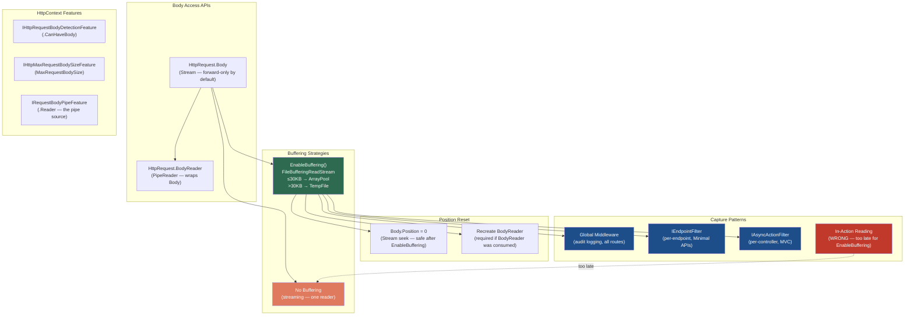
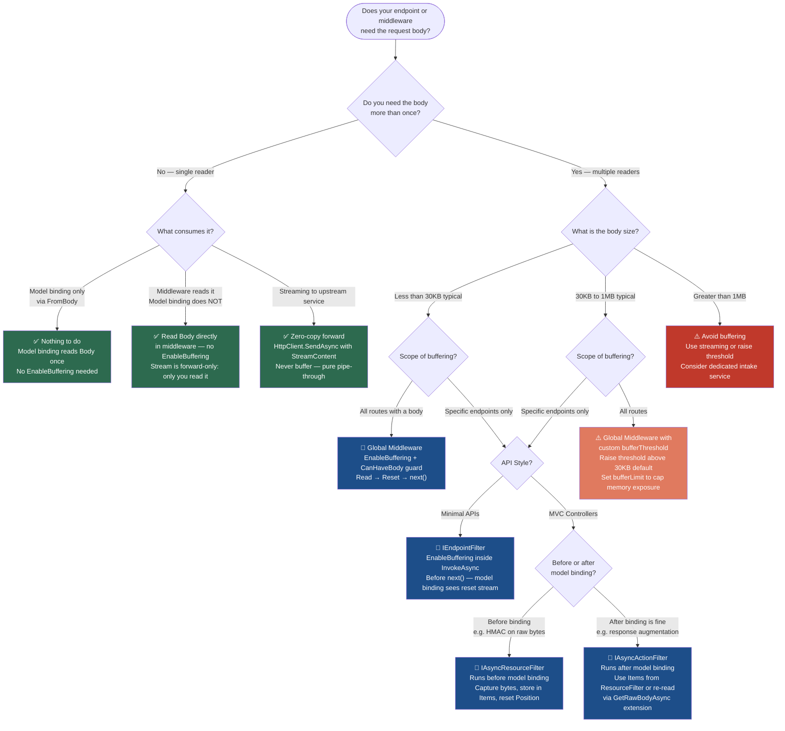

# 4.130 — Request Body Reading Patterns: EnableBuffering and Raw Body Access

---

## PART 0 — Navigation & Context

### Where This Topic Lives

```
ASP.NET Core Mastery
│
├── E. Middleware Pipeline          (4.049–4.063)
├── F. Routing System               (4.064–4.077)
│
└── I. HTTP Fundamentals            (4.123–4.133)
    ├── 4.123  HttpContext Deep Dive
    ├── 4.124  HttpRequest: Reading Request Data
    ├── 4.125  HttpResponse: Writing Response Data
    ├── 4.126  Cookies and SameSite Policy
    ├── 4.127  HTTP/2: Multiplexing and Kestrel
    ├── 4.128  Sessions: ISession and Distributed Session
    ├── 4.129  HTTP/3 and QUIC
    ├── 4.130  ◄ Request Body Reading Patterns: EnableBuffering  ◄ YOU ARE HERE
    ├── 4.131  WebSockets Manual API
    ├── 4.132  Server-Sent Events Manual
    └── 4.133  HTTP Connection Features
```

### What You Need Before This

- [[4.049 — The Middleware Pipeline: Request Delegation Chain]] — the body must be captured in middleware; the `next()` chain determines what runs before and after your code
- [[4.100 — Model Binding: Sources, Order, and the Binding Algorithm]] — model binding reads `Request.Body` exactly once; knowing this is why the problem exists
- [[4.124 — HttpRequest: Reading URL, Headers, Query, Cookies, and Body]] — `HttpRequest.Body` (Stream) and `HttpRequest.BodyReader` (PipeReader) are the two access APIs
- [[4.050 — Writing Middleware: IMiddleware vs Convention-Based]] — raw body capture lives in middleware; lifetime and DI scope rules apply

### What This Unlocks After

- [[4.120 — Binding Large Payloads: Streaming Body Without Buffering]] — the contrast pattern; streaming avoids the buffering cost entirely
- [[4.112 — Input Formatters: Deserializing Non-JSON Request Bodies]] — custom input formatters read from the same body stream; buffering affects formatter behavior
- [[4.349 — Multipart Streaming Upload: Without Buffering the Entire Body]] — the expert alternative; zero-copy multipart parsing that never calls EnableBuffering

### Why This Topic Matters at Scale

Every webhook receiver, HMAC signature verifier, and compliance audit logger in a production ASP.NET Core API must solve the same problem: ASP.NET Core's request body is a forward-only network pipe — read it in middleware, and model binding in your endpoint gets nothing; let model binding run first, and your middleware cannot audit or verify it. Getting this ordering wrong produces silent 400s and failed signature checks that only appear in production under live traffic.

---

## PART 1 — The Core Mental Model

### The Fundamental Rule

> **ASP.NET Core's `HttpRequest.Body` is a forward-only network pipe; bytes consumed by any reader are gone for all subsequent readers. `Request.EnableBuffering()` replaces that pipe with a seekable `FileBufferingReadStream`, after which any reader can reset the position to 0 and re-read the body. The pipeline consequence is: buffer before the first read, reset before each subsequent read, or exactly one reader wins and all others get an empty stream.**

### The Plain-Language Analogy

Think of the raw request body as a physical ticker tape machine — the tape feeds out once, in one direction, and whoever catches the tape first gets the bytes. After that, the tape is gone. `EnableBuffering()` is like installing a photocopier inline with the tape machine: the first reader gets the tape as before, but the machine secretly makes a copy on disk or in memory. The copy is seekable — you can rewind it to the start and hand it to the next reader. After both readers are done, the copy is discarded. The trick is that the photocopier must be installed _before_ the tape starts feeding — calling `EnableBuffering()` after the tape has already run captures nothing. The concurrent request safety holds because each HTTP request has its own independent tape machine and its own photocopy; there is no shared state across requests.

### The Taxonomy Diagram



---

## PART 2 — Deep Mechanics

### 2.1 — The Forward-Only Network Pipe Problem

The request body arrives from Kestrel as a `PipeReader` — a `System.IO.Pipelines` abstraction designed for zero-copy network I/O. By design, the pipe is forward-only: once bytes are consumed and `AdvanceTo()` is called, those bytes are released back to the transport layer. There is no rewind.

**Pipeline Position:**

```
──► ExceptionHandler ──► HTTPS ──► StaticFiles ──► [YOUR BODY MIDDLEWARE] ──► Routing ──► Auth ──► Endpoints
                                                        ↑
                                           EnableBuffering() MUST be here
                                           before any downstream reader
```

If your middleware calls `await next(context)` first, the endpoint's model binding runs, consumes the body, and returns. Your code then runs against an empty stream.

**HTTP wire context:**

```
// HTTP request (approximate):
// POST /webhooks/stripe HTTP/1.1
// Host: api.payments.example.com
// Content-Type: application/json
// Stripe-Signature: t=1700000000,v1=abc123...
// Content-Length: 842
//
// {"id":"evt_1ABC","type":"payment_intent.succeeded","data":{...}}
```

The 842 bytes arrive into Kestrel's socket buffer. ASP.NET Core exposes them through `HttpRequest.Body` and `HttpRequest.BodyReader` — both pointing at the same underlying `IRequestBodyPipeFeature`. The moment any reader calls `ReadAsync()` and `AdvanceTo()`, those bytes are consumed.

**Runtime Cost:** Forward-only reads have `~0 allocations` — bytes stay in the Kestrel buffer until consumed. Buffering costs: `~1 allocation (ArrayPool<byte> lease for ≤30KB)` or `~1 temp file I/O roundtrip (>30KB)`.

### 2.2 — EnableBuffering: FileBufferingReadStream Architecture

`Request.EnableBuffering()` is an extension method in `Microsoft.AspNetCore.Http.Extensions`. Internally it creates a `FileBufferingReadStream` from `Microsoft.AspNetCore.WebUtilities`:

**ASP.NET Core internally (approximate — `HttpRequestRewindExtensions.cs`):**

```csharp
// ASP.NET Core internally (approximate):
public static void EnableBuffering(this HttpRequest request, int bufferThreshold, long bufferLimit)
{
    if (request.Body.CanSeek)
    {
        // Already seekable — idempotent, safe to call multiple times
        return;
    }

    // Wraps the original forward-only pipe body
    request.Body = new FileBufferingReadStream(
        inner: request.Body,
        memoryThreshold: bufferThreshold,   // Default: 30,720 bytes (30KB)
        bufferLimit: bufferLimit,           // Default: null (no limit)
        tempFileDirectoryAccessor: AspNetCoreTempDirectory.TempDirectoryFactory
    );
    // NOTE: BodyReader is NOT explicitly replaced here.
    // Accessing BodyReader after this creates a new StreamPipeReader wrapping the new Body.
}
```

**The threshold contract:**

|Body Size|Storage|Allocation|Notes|
|---|---|---|---|
|≤ 30KB (default)|`ArrayPool<byte>` backed `MemoryStream`|`~1 pool lease`|Zero disk I/O|
|> 30KB|Temp file via `Path.GetTempPath()`|`~1 file create + 2 stream I/O`|Disk latency|
|> bufferLimit|`InvalidDataException` thrown|—|Guards against OOM|

**Overloads:**

```csharp
// Default: 30KB threshold, no size limit
request.EnableBuffering();

// Custom threshold — stay in memory up to 1MB before temp file
request.EnableBuffering(bufferThreshold: 1_048_576);

// Both threshold and absolute size cap — throws if body exceeds 5MB
request.EnableBuffering(bufferThreshold: 1_048_576, bufferLimit: 5_242_880);
```

**The FileBufferingReadStream lifecycle:** The temp file (if created) is deleted when the stream is disposed. ASP.NET Core disposes the `HttpContext` at the end of the request, which disposes the body stream, which deletes the temp file. `~0` resource leaks in normal operation.

**Runtime Cost:** `EnableBuffering()` call itself: `~O(1)`, essentially free. The cost is paid at `ReadAsync()` time when bytes are pulled from the network pipe into the buffer.

### 2.3 — Stream API vs PipeReader API: Two Access Paths

After `EnableBuffering()`, you can read via either API. They are not symmetric in behavior after a read.

**Stream API (simpler, preferred for body re-reads):**

```csharp
context.Request.EnableBuffering();

// Read #1 — raw body capture in middleware
using var reader = new StreamReader(
    context.Request.Body,
    encoding: Encoding.UTF8,
    detectEncodingFromByteOrderMarks: false,
    bufferSize: 4096,
    leaveOpen: true); // ← CRITICAL: prevents StreamReader from disposing the stream

var rawBody = await reader.ReadToEndAsync(context.RequestAborted);
context.Request.Body.Position = 0; // ← Reset for next reader

await next(context); // model binding reads from position 0 → succeeds

// Read #2 — available here too (after endpoint, for logging)
context.Request.Body.Position = 0;
using var reader2 = new StreamReader(context.Request.Body, leaveOpen: true);
var bodyAgain = await reader2.ReadToEndAsync(); // full body again
```

**PipeReader API (higher performance, but resetting is more complex):**

```csharp
context.Request.EnableBuffering();

// Read via BodyReader (PipeReader)
while (true)
{
    var result = await context.Request.BodyReader.ReadAsync(context.RequestAborted);
    var buffer = result.Buffer;

    // Process buffer — e.g., HMAC over all segments
    foreach (var segment in buffer)
    {
        hmac.TransformBlock(segment.Span);
    }

    context.Request.BodyReader.AdvanceTo(buffer.End); // marks bytes as consumed

    if (result.IsCompleted) break;
}

// ⚠️ After BodyReader.AdvanceTo(buffer.End), the PipeReader's internal state
// is advanced. The PipeReader does NOT auto-reset when you seek the underlying stream.
// Reset via the Stream API for model binding:
context.Request.Body.Position = 0;

// Model binding uses Body (Stream), not BodyReader, so this works.
// Do NOT use BodyReader again without recreating it.
await next(context);
```

> [!WARNING] **Do not mix BodyReader reads with Body re-reads in the same flow.** After calling `BodyReader.AdvanceTo(buffer.End)`, the PipeReader's consumed position is advanced. Setting `Body.Position = 0` resets the underlying stream but the PipeReader does not know about the seek. Subsequent reads via `BodyReader` can return stale or empty results. Use `Body` (Stream) for any re-reads after a `BodyReader` pass.

**ASP.NET Core internally (approximate — BodyReader creation):**

```csharp
// DefaultHttpRequest.cs (approximate):
public override PipeReader BodyReader
{
    get
    {
        if (!HttpContext.Features.IsFeatureSet<IRequestBodyPipeFeature>())
        {
            // Creates StreamPipeReader wrapping the current Body at access time
            _requestBodyPipeFeature = new RequestBodyPipeFeature(HttpContext);
            HttpContext.Features.Set<IRequestBodyPipeFeature>(_requestBodyPipeFeature);
        }
        return HttpContext.Features.Get<IRequestBodyPipeFeature>()!.Reader;
    }
}
```

If you call `EnableBuffering()` before ever accessing `BodyReader`, the `BodyReader` will wrap the new buffered `Body`. If you access `BodyReader` before calling `EnableBuffering()`, it wraps the original forward-only body.

> [!IMPORTANT] Call `EnableBuffering()` before any access to `BodyReader` for predictable behavior. The order of calls in middleware matters.

**Runtime Cost:** Stream API: `~1 string allocation` (for `ReadToEndAsync` result). PipeReader API: `~0 extra allocations` (works on buffer segments without copying).

### 2.4 — Pipeline Position: When to Buffer in the Middleware Chain

The placement of body-reading middleware determines what else gets access to the body.

**Scenario A — Global audit logging (all POST/PUT/PATCH routes):**

```
──► ExceptionHandler
──► HSTS
──► StaticFiles
──► [BodyAuditMiddleware]    ← EnableBuffering() + log + reset + next()
──► UseRouting
──► UseAuthentication
──► UseAuthorization
──► Endpoints (model binding reads from position 0)
```

__Scenario B — Per-endpoint webhook verification (only /webhooks/_ routes):_*

```
──► ExceptionHandler
──► HSTS
──► StaticFiles
──► UseRouting              ← routing resolves endpoint metadata
──► UseAuthentication
──► UseAuthorization
──► [WebhookSignatureFilter] ← IEndpointFilter — runs per-endpoint before binding
──► Endpoint (model binding reads from position 0)
```

> [!NOTE] Scenario B is preferred for webhook verification because only webhook endpoints pay the buffering cost. Global middleware in Scenario A buffers every POST to the application, including large file uploads and form submissions where you almost certainly do not want the entire body in memory.

**Failure mode — middleware registered after routing but before the endpoint, without position reset:**

```
// HTTP consequence (wrong path):
// POST /api/orders HTTP/1.1
// ... body ...
//
// HTTP/1.1 400 Bad Request
// Content-Type: application/problem+json
//
// {"type":"...","title":"One or more validation errors occurred.",
//  "errors":{"$":["A non-empty request body is required."]}}
//
// Reason: middleware read the body but didn't reset Position = 0.
// Model binding reads from the end of the stream → empty body → deserialization fails.
```

**Runtime Cost:** Middleware position cost: `O(1)` for registration. The wrong order produces `O(n)` debugging time.

### 2.5 — IHttpRequestBodyDetectionFeature and Body Availability

Not all HTTP methods are expected to have bodies. Reading `Request.Body` on a GET request is not harmful (it will be empty), but buffering it wastes work. ASP.NET Core provides `IHttpRequestBodyDetectionFeature` for this check:

```csharp
// ASP.NET Core internally (approximate):
// IHttpRequestBodyDetectionFeature.CanHaveBody:
//   true  → POST, PUT, PATCH (and others with Content-Length > 0 or Transfer-Encoding: chunked)
//   false → GET, HEAD, DELETE, OPTIONS (unless Content-Length is set — unusual but valid per spec)

var bodyDetection = context.Features.Get<IHttpRequestBodyDetectionFeature>();
bool canHaveBody = bodyDetection?.CanHaveBody ?? false;

if (canHaveBody)
{
    context.Request.EnableBuffering();
    // ... read and process
}
```

> [!TIP] Always guard `EnableBuffering()` with `CanHaveBody` in a global middleware. Buffering GET requests is wasteful and produces confusing diagnostics ("why is there a temp file for a GET?").

Also relevant: `IHttpMaxRequestBodySizeFeature` lets you read or override the per-request body size limit at runtime:

```csharp
var sizeFeature = context.Features.Get<IHttpMaxRequestBodySizeFeature>();
if (sizeFeature != null && !sizeFeature.IsReadOnly)
{
    sizeFeature.MaxRequestBodySize = 10 * 1024 * 1024; // 10MB for this request
}
```

**Runtime Cost:** Feature lookup: `O(1)` dictionary lookup on the features collection.

---

## PART 3 — Production Code Patterns

### Pattern 1 — The Stripe Webhook Signature Verifier Middleware

The canonical use case: Stripe sends a `Stripe-Signature` header. The expected signature is an HMAC-SHA256 of the raw body bytes. Model binding deserializes those same bytes to C# objects. Both operations need the body, but HMAC must run first on the unmodified byte stream.

```csharp
// Domain: Payment API — Stripe webhook signature verification
// Registered before UseRouting so it runs for all /webhooks/* paths.
// Buffers only those routes.

public class StripeWebhookVerificationMiddleware : IMiddleware
{
    private readonly IStripeWebhookSettings _settings;
    private readonly ILogger<StripeWebhookVerificationMiddleware> _logger;

    public StripeWebhookVerificationMiddleware(
        IStripeWebhookSettings settings,
        ILogger<StripeWebhookVerificationMiddleware> logger)
    {
        _settings = settings;
        _logger = logger;
    }

    public async Task InvokeAsync(HttpContext context, RequestDelegate next)
    {
        // Only intercept webhook routes — avoid buffering every POST in the application
        if (!context.Request.Path.StartsWithSegments("/webhooks/stripe",
            StringComparison.OrdinalIgnoreCase))
        {
            await next(context);
            return;
        }

        // Must buffer BEFORE any read — the original body is forward-only
        context.Request.EnableBuffering();

        // Read raw bytes for HMAC — leaveOpen: true is non-negotiable
        using var ms = new MemoryStream();
        await context.Request.Body.CopyToAsync(ms, context.RequestAborted);
        var rawBodyBytes = ms.ToArray();

        // Reset position BEFORE calling next() — model binding needs position 0
        context.Request.Body.Position = 0;

        var signatureHeader = context.Request.Headers["Stripe-Signature"].ToString();

        if (!VerifyStripeHmac(rawBodyBytes, signatureHeader, _settings.WebhookSecret))
        {
            _logger.LogWarning(
                "Stripe signature verification failed for request {TraceId}",
                context.TraceIdentifier);

            // Short-circuit — never reaches the endpoint
            context.Response.StatusCode = StatusCodes.Status400BadRequest;
            await context.Response.WriteAsync("Invalid webhook signature", context.RequestAborted);
            return;
        }

        // Body at position 0 — model binding in the endpoint will deserialize normally
        await next(context);
    }

    private static bool VerifyStripeHmac(byte[] body, string signatureHeader, string secret)
    {
        // Parse "t=timestamp,v1=signature" from Stripe-Signature header
        // Compute HMAC-SHA256 of $"{timestamp}.{rawBody}" with webhook secret
        // Compare computed vs header signature using CryptographicOperations.FixedTimeEquals
        var parts = signatureHeader.Split(',');
        var timestamp = parts.FirstOrDefault(p => p.StartsWith("t="))?.Substring(2) ?? string.Empty;
        var expectedSig = parts.FirstOrDefault(p => p.StartsWith("v1="))?.Substring(3) ?? string.Empty;

        using var hmac = new HMACSHA256(Encoding.UTF8.GetBytes(secret));
        var payload = Encoding.UTF8.GetBytes($"{timestamp}.{Encoding.UTF8.GetString(body)}");
        var computedBytes = hmac.ComputeHash(payload);
        var computed = Convert.ToHexString(computedBytes).ToLowerInvariant();

        return CryptographicOperations.FixedTimeEquals(
            Encoding.UTF8.GetBytes(computed),
            Encoding.UTF8.GetBytes(expectedSig));
    }
}
```

```http
// HTTP request (approximate):
// POST /webhooks/stripe HTTP/1.1
// Stripe-Signature: t=1700000000,v1=abc123def456...
// Content-Type: application/json
//
// {"id":"evt_1ABC","type":"payment_intent.succeeded",...}

// HTTP response (signature valid):
// HTTP/1.1 200 OK  ← endpoint handled normally with bound StripeEvent object

// HTTP response (signature invalid):
// HTTP/1.1 400 Bad Request
// Invalid webhook signature
```

---

### Pattern 2 — The GitHub Webhook Signature Filter (Per-Endpoint IEndpointFilter)

When only specific endpoints need body verification, an `IEndpointFilter` is cleaner than global middleware — no path-matching logic, no unnecessary allocations on unrelated routes.

```csharp
// Domain: DevOps integration API — GitHub webhook HMAC-SHA256 verification
// Applied per-endpoint via .AddEndpointFilter<GitHubWebhookFilter>()
// This is the preferred pattern for endpoint-specific body capture.

public sealed class GitHubWebhookFilter : IEndpointFilter
{
    private readonly IGitHubWebhookSettings _settings;

    public GitHubWebhookFilter(IGitHubWebhookSettings settings)
        => _settings = settings;

    public async ValueTask<object?> InvokeAsync(
        EndpointFilterInvocationContext context,
        EndpointFilterDelegate next)
    {
        var httpContext = context.HttpContext;

        // Buffer the body — IEndpointFilter runs before model binding executes the parameters
        httpContext.Request.EnableBuffering();

        using var ms = new MemoryStream();
        await httpContext.Request.Body.CopyToAsync(ms, httpContext.RequestAborted);
        var bodyBytes = ms.ToArray();

        // Reset for [FromBody] binding that follows
        httpContext.Request.Body.Position = 0;

        var signatureHeader = httpContext.Request.Headers["X-Hub-Signature-256"].ToString();
        const string prefix = "sha256=";

        if (!signatureHeader.StartsWith(prefix, StringComparison.OrdinalIgnoreCase))
            return TypedResults.BadRequest("Missing X-Hub-Signature-256 header");

        var expectedHex = signatureHeader[prefix.Length..];
        using var hmac = new HMACSHA256(Encoding.UTF8.GetBytes(_settings.WebhookSecret));
        var computedBytes = hmac.ComputeHash(bodyBytes);
        var computedHex = Convert.ToHexString(computedBytes).ToLowerInvariant();

        if (!CryptographicOperations.FixedTimeEquals(
            Encoding.UTF8.GetBytes(computedHex),
            Encoding.UTF8.GetBytes(expectedHex)))
        {
            return TypedResults.BadRequest("Invalid webhook signature");
        }

        return await next(context);
    }
}

// Registration:
app.MapPost("/webhooks/github", async (
    [FromBody] GitHubPushEvent pushEvent,
    [FromServices] IPipelineOrchestrationService orchestration) =>
{
    await orchestration.TriggerBuildAsync(pushEvent.Repository.FullName, pushEvent.Ref);
    return TypedResults.Ok();
})
.AddEndpointFilter<GitHubWebhookFilter>()
.RequireAuthorization("InternalOnly")
.WithName("GitHubWebhookReceiver");
```

---

### Pattern 3 — The Compliance Audit Body Logger

Regulatory environments (PCI-DSS, HIPAA adjacent logging tiers) require logging request payloads for sensitive operations. This must be selective — log order mutations, not health checks; log payment submissions, not GET reads.

```csharp
// Domain: Financial services — audit log for order mutation endpoints
// Strategy: selective buffering via IHttpRequestBodyDetectionFeature + route check

public class OrderAuditLoggingMiddleware : IMiddleware
{
    private readonly IOrderAuditStore _auditStore;
    private const int MaxAuditBodyBytes = 65_536; // 64KB cap — prevents audit log flooding

    public OrderAuditLoggingMiddleware(IOrderAuditStore auditStore)
        => _auditStore = auditStore;

    public async Task InvokeAsync(HttpContext context, RequestDelegate next)
    {
        var canHaveBody = context.Features.Get<IHttpRequestBodyDetectionFeature>()?.CanHaveBody
                          ?? false;
        var isAuditRoute = context.Request.Path.StartsWithSegments("/api/orders",
            StringComparison.OrdinalIgnoreCase);

        if (!canHaveBody || !isAuditRoute)
        {
            await next(context);
            return;
        }

        // Buffer with a hard cap — audit logger never accepts payloads > 64KB
        context.Request.EnableBuffering(
            bufferThreshold: 32_768,     // 32KB stays in memory
            bufferLimit: MaxAuditBodyBytes);

        // Capture before endpoint execution
        using var reader = new StreamReader(
            context.Request.Body,
            Encoding.UTF8,
            detectEncodingFromByteOrderMarks: false,
            leaveOpen: true); // ← DO NOT OMIT — disposing reader disposes the stream

        var rawBody = await reader.ReadToEndAsync(context.RequestAborted);

        // Reset position BEFORE next() — model binding gets the full body
        context.Request.Body.Position = 0;

        var correlationId = context.TraceIdentifier;
        var userId = context.User.FindFirstValue(ClaimTypes.NameIdentifier) ?? "anonymous";

        await next(context); // endpoint executes, response status is now set

        // Log after endpoint — we now know the response status code
        await _auditStore.RecordAsync(new OrderAuditEntry(
            CorrelationId: correlationId,
            UserId: userId,
            Method: context.Request.Method,
            Path: context.Request.Path,
            RequestBody: rawBody,
            ResponseStatus: context.Response.StatusCode,
            Timestamp: DateTimeOffset.UtcNow));
    }
}
```

> [!IMPORTANT] The `bufferLimit` parameter on `EnableBuffering` is the correct safety valve for audit loggers. Without it, a malicious or misconfigured client sending a 500MB body will consume 500MB of memory per request. Always set a cap in compliance-logging middleware.

---

### Pattern 4 — The GetRawBodyAsync Utility Extension

A reusable extension method for reading the raw body as either string or bytes, handling the enable/reset lifecycle internally. Suitable for ad-hoc use in action filters or utility middleware.

```csharp
// Domain: Logistics API — shared utility across multiple webhook and audit use cases

public static class HttpRequestBodyExtensions
{
    /// <summary>
    /// Reads the raw request body as a string. Calls EnableBuffering() if not already seekable
    /// and resets the stream position before AND after reading.
    /// Safe to call multiple times on the same request.
    /// </summary>
    public static async Task<string> GetRawBodyStringAsync(
        this HttpRequest request,
        Encoding? encoding = null,
        CancellationToken cancellationToken = default)
    {
        // Idempotent: second call is a no-op if already seekable
        if (!request.Body.CanSeek)
        {
            request.EnableBuffering();
        }

        // Always seek to 0 — this method is designed for repeated calls
        request.Body.Position = 0;

        using var reader = new StreamReader(
            request.Body,
            encoding ?? Encoding.UTF8,
            detectEncodingFromByteOrderMarks: false,
            leaveOpen: true); // ← Required: we do not own the stream lifetime

        var body = await reader.ReadToEndAsync(cancellationToken);

        // Reset again so any subsequent reader (model binding, another middleware) starts from 0
        request.Body.Position = 0;

        return body;
    }

    /// <summary>
    /// Reads the raw request body as bytes. Preferred for HMAC verification
    /// because it avoids string encoding assumptions.
    /// </summary>
    public static async Task<byte[]> GetRawBodyBytesAsync(
        this HttpRequest request,
        CancellationToken cancellationToken = default)
    {
        if (!request.Body.CanSeek)
        {
            request.EnableBuffering();
        }

        request.Body.Position = 0;

        using var ms = new MemoryStream();
        await request.Body.CopyToAsync(ms, cancellationToken);

        request.Body.Position = 0;

        return ms.ToArray();
    }
}

// Usage in an IAsyncActionFilter (MVC):
public class ShipmentWebhookSignatureFilter : IAsyncActionFilter
{
    public async Task OnActionExecutionAsync(
        ActionExecutingContext context,
        ActionExecutionDelegate next)
    {
        // EnableBuffering before model binding completes — filter runs before action parameters bound
        // (Resource filters run earlier; action filters run after binding — buffer in resource filter
        //  if you need bytes before binding. Here we use the extension which handles both.)
        var rawBytes = await context.HttpContext.Request.GetRawBodyBytesAsync(
            context.HttpContext.RequestAborted);

        if (!VerifyShipmentHubSignature(rawBytes, context.HttpContext.Request.Headers["X-ShipHub-Sig"]))
        {
            context.Result = new BadRequestObjectResult("Invalid shipment hub signature");
            return;
        }
        // Position is already reset by the extension — model binding proceeds normally
        await next();
    }
}
```

---

### Pattern 5 — Body Size Guard Middleware

Before buffering, enforce a per-endpoint size policy to prevent OOM from malicious or oversized payloads.

```csharp
// Domain: Healthcare records API — body size enforcement before any buffering
// Prevents IEnumerable<byte[]> OOM from large payload attacks

public class RequestBodySizeGuardMiddleware : IMiddleware
{
    private const long DefaultMaxBytes = 10 * 1024 * 1024; // 10MB global default
    private readonly ILogger<RequestBodySizeGuardMiddleware> _logger;

    public RequestBodySizeGuardMiddleware(ILogger<RequestBodySizeGuardMiddleware> logger)
        => _logger = logger;

    public async Task InvokeAsync(HttpContext context, RequestDelegate next)
    {
        var bodyDetection = context.Features.Get<IHttpRequestBodyDetectionFeature>();
        if (bodyDetection?.CanHaveBody != true)
        {
            await next(context);
            return;
        }

        // Read endpoint metadata to find per-route override if any
        var endpoint = context.GetEndpoint();
        var sizePolicy = endpoint?.Metadata.GetMetadata<RequestBodySizePolicyAttribute>();
        var maxBytes = sizePolicy?.MaxBytes ?? DefaultMaxBytes;

        // Use IHttpMaxRequestBodySizeFeature to enforce at Kestrel level if writable
        var sizeFeature = context.Features.Get<IHttpMaxRequestBodySizeFeature>();
        if (sizeFeature != null && !sizeFeature.IsReadOnly)
        {
            sizeFeature.MaxRequestBodySize = maxBytes;
        }

        // Check Content-Length early for fast rejection without reading the body
        if (context.Request.ContentLength.HasValue && context.Request.ContentLength > maxBytes)
        {
            _logger.LogWarning(
                "Request body size {Size} exceeds limit {Limit} for path {Path}",
                context.Request.ContentLength, maxBytes, context.Request.Path);

            context.Response.StatusCode = StatusCodes.Status413RequestEntityTooLarge;
            await context.Response.WriteAsync("Request body too large", context.RequestAborted);
            return;
        }

        await next(context);
    }
}

// Attribute for per-endpoint override:
[AttributeUsage(AttributeTargets.Method | AttributeTargets.Class)]
public sealed class RequestBodySizePolicyAttribute : Attribute
{
    public long MaxBytes { get; }
    public RequestBodySizePolicyAttribute(long maxBytes) => MaxBytes = maxBytes;
}

// Usage on a bulk import endpoint that legitimately accepts large payloads:
[HttpPost("bulk-import")]
[RequestBodySizePolicy(maxBytes: 50 * 1024 * 1024)] // 50MB for bulk
public async Task<IActionResult> BulkImportPatientRecords(...)
{ ... }
```

---

### Pattern 6 — The Resource Filter Body Capture (Before Model Binding in MVC)

`IAsyncActionFilter` runs after model binding. If you need raw bytes before binding (e.g., to verify HMAC before the model binder deserializes), use an `IAsyncResourceFilter`, which runs before model binding.

```csharp
// Domain: Payment API — resource filter ensures body is captured before MVC model binding
// IAsyncResourceFilter is the correct filter stage for pre-binding body capture in MVC

public class PaymentWebhookBodyCaptureFilter : IAsyncResourceFilter
{
    public async Task OnResourceExecutionAsync(
        ResourceExecutingContext context,
        ResourceExecutionDelegate next)
    {
        // Resource filter runs BEFORE model binding — correct stage for body capture
        var httpContext = context.HttpContext;

        if (httpContext.Request.ContentType?.Contains("application/json",
            StringComparison.OrdinalIgnoreCase) == true)
        {
            // Buffer here — model binding will re-read from position 0
            httpContext.Request.EnableBuffering();

            using var ms = new MemoryStream();
            await httpContext.Request.Body.CopyToAsync(ms, httpContext.RequestAborted);

            // Store bytes in Items for downstream access within this request
            httpContext.Items["RawRequestBody"] = ms.ToArray();

            // Reset — model binding reads from position 0 normally
            httpContext.Request.Body.Position = 0;
        }

        await next();
    }
}

// In the controller action, access the pre-captured bytes from Items:
[HttpPost("process")]
public async Task<IActionResult> ProcessPayment([FromBody] PaymentRequest request)
{
    // Body already bound via model binding (position was reset by the filter)
    // Raw bytes available for HMAC or audit without re-reading
    if (HttpContext.Items["RawRequestBody"] is byte[] rawBytes)
    {
        await _auditService.LogRawPayloadAsync(rawBytes, HttpContext.TraceIdentifier);
    }

    return Ok(await _paymentService.ProcessAsync(request));
}
```

---

## PART 4 — Gotchas & Anti-Patterns

### Gotcha 1: Reading Body in Middleware Without EnableBuffering — Silent 400 on Model Binding

Experienced engineers write audit logging or logging middleware that reads the body for diagnostics, then forget that model binding is now racing on an empty stream. The 400 appears in production, the middleware logging shows the body was captured — but the endpoint action never ran.

```csharp
// ⚠️ WRONG — reads the body in middleware but never enables buffering
app.Use(async (context, next) =>
{
    // Body is forward-only. This read consumes the bytes.
    using var reader = new StreamReader(context.Request.Body);
    var body = await reader.ReadToEndAsync();
    _logger.LogInformation("Incoming body: {Body}", body);

    await next(context); // too late — body bytes are gone from the pipe
});

app.MapPost("/api/orders", ([FromBody] CreateOrderRequest req) => TypedResults.Ok(req));
```

```
// HTTP consequence (wrong path):
// POST /api/orders HTTP/1.1
// Content-Type: application/json
// {"productId": "SKU-42", "quantity": 3}
//
// HTTP/1.1 400 Bad Request
// Content-Type: application/problem+json
// {"errors":{"$":["A non-empty request body is required."]}}
// OR: req is null in the action (if not [ApiController])
```

```csharp
// ✅ CORRECT — EnableBuffering first, then read, then reset
app.Use(async (context, next) =>
{
    var canHaveBody = context.Features.Get<IHttpRequestBodyDetectionFeature>()?.CanHaveBody ?? false;
    if (canHaveBody)
    {
        context.Request.EnableBuffering();

        using var reader = new StreamReader(context.Request.Body, leaveOpen: true);
        var body = await reader.ReadToEndAsync(context.RequestAborted);
        _logger.LogInformation("Incoming body: {Body}", body);

        context.Request.Body.Position = 0; // ← model binding reads from 0
    }

    await next(context);
});
```

```
// HTTP consequence (correct path):
// HTTP/1.1 201 Created — model binding succeeded, order was created
```

// WHY: `EnableBuffering()` replaces the forward-only pipe with a seekable `FileBufferingReadStream`. Without it, `StreamReader.ReadToEndAsync()` consumes all bytes from the network buffer. Setting `Body.Position = 0` after reading returns the seekable stream to the start so model binding reads a full body.

---

### Gotcha 2: Enabling Buffering but Forgetting to Reset Position — Same Symptom as Gotcha 1

This is more common than Gotcha 1 because the engineer knows about EnableBuffering but skips the reset. The symptom is identical — a 400 on model binding — but with EnableBuffering present the cause is harder to spot.

```csharp
// ⚠️ WRONG — EnableBuffering called but Position never reset
app.Use(async (context, next) =>
{
    context.Request.EnableBuffering(); // ✅ this part is correct

    using var reader = new StreamReader(context.Request.Body, leaveOpen: true);
    var body = await reader.ReadToEndAsync(context.RequestAborted);
    // ... log body ...

    // ← MISSING: context.Request.Body.Position = 0;

    await next(context); // model binding reads from position = end of stream → empty body
});
```

```
// HTTP consequence (wrong path):
// Same 400 as Gotcha 1 — the body was buffered but the stream cursor is at the end.
```

```csharp
// ✅ CORRECT
context.Request.EnableBuffering();
using var reader = new StreamReader(context.Request.Body, leaveOpen: true);
var body = await reader.ReadToEndAsync(context.RequestAborted);
context.Request.Body.Position = 0; // ← the mandatory reset
await next(context);
```

```
// HTTP consequence (correct path):
// Model binding reads from position 0 → full body → endpoint receives bound object.
```

// WHY: `StreamReader.ReadToEndAsync()` advances the underlying stream's `Position` to the end. `FileBufferingReadStream.Position` is a standard seekable-stream property. After reading, `Position` equals `Length`. `Body.Position = 0` is a `Seek(0, SeekOrigin.Begin)` on the buffered stream — cheap, `O(1)`.

---

### Gotcha 3: Calling EnableBuffering After the Endpoint Has Already Executed — Too Late, No Bytes

Post-execution middleware that tries to capture the body for logging places `await next(context)` at the top, which runs the entire downstream pipeline including model binding, then tries to read the body.

```csharp
// ⚠️ WRONG — EnableBuffering after next() — body already consumed by model binding
app.Use(async (context, next) =>
{
    await next(context); // entire pipeline runs — model binding consumed the body

    // Attempting to buffer and read AFTER the fact
    context.Request.EnableBuffering();
    using var reader = new StreamReader(context.Request.Body, leaveOpen: true);
    var body = await reader.ReadToEndAsync(); // body will be empty string ""
    _auditLogger.LogRequest(body); // logs nothing useful
});
```

```
// HTTP consequence (wrong path):
// Endpoint executes correctly (200 OK), but audit log entry contains an empty string for body.
// No HTTP error. Silent data loss in audit trail.
```

```csharp
// ✅ CORRECT — buffer and capture BEFORE calling next()
app.Use(async (context, next) =>
{
    var canHaveBody = context.Features.Get<IHttpRequestBodyDetectionFeature>()?.CanHaveBody ?? false;
    if (canHaveBody)
    {
        context.Request.EnableBuffering();
        using var reader = new StreamReader(context.Request.Body, leaveOpen: true);
        var capturedBody = await reader.ReadToEndAsync(context.RequestAborted);

        context.Request.Body.Position = 0; // reset before next()

        await next(context); // now runs with body captured

        // Log AFTER the endpoint — response status is now available
        _auditLogger.LogRequest(capturedBody, context.Response.StatusCode);
    }
    else
    {
        await next(context);
    }
});
```

```
// HTTP consequence (correct path):
// Endpoint executes correctly. Audit log contains the full request body and the response status code.
```

// WHY: `EnableBuffering()` wraps the current state of `Request.Body`. After `next()` returns, model binding has already consumed all bytes from the original forward-only pipe. `EnableBuffering()` at this point wraps an empty (or fully-consumed) stream. The bytes that travelled over the network are gone — there is no way to recover them without having buffered earlier.

---

### Gotcha 4: Missing `leaveOpen: true` on StreamReader — Stream Disposed Mid-Request

`StreamReader` defaults to disposing its underlying stream when the reader is disposed. Disposing `Request.Body` mid-request is catastrophic — subsequent middleware or the endpoint cannot write a response body because the connection context is corrupted.

```csharp
// ⚠️ WRONG — StreamReader disposes Request.Body when it goes out of scope
app.Use(async (context, next) =>
{
    context.Request.EnableBuffering();

    using var reader = new StreamReader(context.Request.Body); // leaveOpen defaults to false
    var body = await reader.ReadToEndAsync();

    // ← reader is disposed here, which disposes Request.Body

    context.Request.Body.Position = 0; // ObjectDisposedException — stream is already disposed

    await next(context); // further reads from Request.Body throw
});
```

```
// HTTP consequence (wrong path):
// System.ObjectDisposedException: Cannot access a disposed object.
// OR: model binding throws / returns null silently depending on ASP.NET Core version.
// Kestrel may reset the connection, producing a TCP RST to the client.
```

```csharp
// ✅ CORRECT — leaveOpen: true prevents StreamReader from disposing the stream
context.Request.EnableBuffering();

using var reader = new StreamReader(
    context.Request.Body,
    Encoding.UTF8,
    detectEncodingFromByteOrderMarks: false,
    bufferSize: 4096,
    leaveOpen: true); // ← ASP.NET Core owns the Body stream lifetime, not you

var body = await reader.ReadToEndAsync(context.RequestAborted);
context.Request.Body.Position = 0;

await next(context); // Body is still alive and seekable
```

```
// HTTP consequence (correct path):
// No exception. Model binding reads normally from position 0.
```

// WHY: `StreamReader(stream, leaveOpen: false)` calls `stream.Dispose()` in its `Dispose()` method. ASP.NET Core's `HttpContext` lifetime owns `Request.Body` and disposes it at request end. You are a tenant of the body stream, not the owner. The `leaveOpen: true` constructor overload was added precisely for this scenario.

---

### Gotcha 5: Global Buffering Middleware on File Upload Endpoints — Memory Exhaustion

A well-intentioned global audit logging middleware that calls `EnableBuffering()` on every request will buffer entire file uploads into memory (or temp files). A 100MB file upload with 50 concurrent requests = 5GB of buffered data.

```csharp
// ⚠️ WRONG — global middleware buffers everything, including large file uploads
app.Use(async (context, next) =>
{
    context.Request.EnableBuffering(); // ← buffers /api/documents/upload (100MB payloads)
    // ... log body ...
    context.Request.Body.Position = 0;
    await next(context);
});

app.MapPost("/api/documents/upload", async ([FromForm] IFormFile file) => ...);
app.MapPost("/api/orders", async ([FromBody] CreateOrderRequest req) => ...);
```

```
// HTTP consequence (wrong path):
// At 50 concurrent 100MB uploads: 5GB in memory or temp files simultaneously.
// Process memory spike → GC pressure → P99 latency spike → OutOfMemoryException.
// The /api/orders endpoint is also buffered unnecessarily (small bodies, but wasted allocations).
```

```csharp
// ✅ CORRECT — buffer only JSON mutation routes; skip file upload and form routes
app.Use(async (context, next) =>
{
    var canHaveBody = context.Features.Get<IHttpRequestBodyDetectionFeature>()?.CanHaveBody ?? false;
    var contentType = context.Request.ContentType ?? string.Empty;
    var isJsonBody = contentType.Contains("application/json", StringComparison.OrdinalIgnoreCase);
    var isAuditRoute = context.Request.Path.StartsWithSegments("/api/orders") ||
                       context.Request.Path.StartsWithSegments("/api/payments");

    if (canHaveBody && isJsonBody && isAuditRoute)
    {
        // Only JSON mutation routes on known audit paths — not file uploads
        context.Request.EnableBuffering(
            bufferThreshold: 32_768,   // 32KB in memory
            bufferLimit: 1_048_576);   // 1MB absolute cap — reject larger payloads here

        using var reader = new StreamReader(context.Request.Body, leaveOpen: true);
        var body = await reader.ReadToEndAsync(context.RequestAborted);
        context.Request.Body.Position = 0;
        await _auditStore.RecordRequestBodyAsync(body, context.TraceIdentifier);
    }

    await next(context);
});
```

```
// HTTP consequence (correct path):
// File uploads stream directly to storage without touching EnableBuffering.
// JSON order/payment endpoints are buffered with a 1MB cap.
// Memory profile is flat and predictable.
```

// WHY: `IFormFile` and multipart form data go through `IFormFeature`, which has its own internal buffering separate from `Request.Body`. But calling `EnableBuffering()` before `IFormFeature` reads still causes the entire raw multipart body to be buffered into `FileBufferingReadStream` first, then re-parsed. For large uploads this doubles the I/O cost and memory footprint.

---

## PART 5 — Performance Implications

### 5.1 — Request Pipeline Characteristics Table

|Scenario|Buffering Strategy|Allocations Per Request|Approx Latency Impact|Recommendation|
|---|---|---|---|---|
|JSON webhook (< 30KB), HMAC verify|`EnableBuffering()` default|`~1 ArrayPool lease + 1 string`|+0.1–0.3ms|✅ Correct — stays in memory|
|JSON webhook (30KB–1MB), HMAC verify|`EnableBuffering(threshold, limit)`|`~1 temp file + 2 stream I/O`|+2–10ms (disk)|⚠️ Prefer raising threshold or using binary comparison without string|
|Large file upload (> 5MB), no audit|`No buffering` / streaming|`~0 extra`|Baseline|✅ Never call EnableBuffering|
|Global audit logging (all JSON routes)|`EnableBuffering()` on every request|`~1 pool lease per request`|+0.1ms/req|⚠️ Acceptable for low throughput; problematic at > 5k req/s|
|GET/HEAD/OPTIONS|`No buffering` (CanHaveBody = false)|`~0`|Baseline|✅ Guard with CanHaveBody check|
|Multi-middleware reading the same body|`EnableBuffering()` once, seek to 0 each|`~1 pool lease total`|Minimal|✅ EnableBuffering is idempotent|
|Body read in action method (no EnableBuffering)|N/A|N/A|N/A|❌ Wrong approach — body consumed by model binding|
|PipeReader approach (binary HMAC, no string)|`EnableBuffering()` + `BodyReader`|`~0 string allocs`|+0.05ms|✅ For high-throughput binary verification|
|`bufferLimit` exceeded|`InvalidDataException` caught + 413|`~0`|Immediate rejection|✅ Fast fail before expensive processing|

### 5.2 — BenchmarkDotNet Comparison

```csharp
using BenchmarkDotNet.Attributes;
using BenchmarkDotNet.Running;
using Microsoft.AspNetCore.Http;
using Microsoft.AspNetCore.Http.Features;
using System.Text;

// Simulates the per-request cost of different body reading strategies
// Run with: dotnet run -c Release

[MemoryDiagnoser]
[ShortRunJob]
public class RequestBodyReadingBenchmarks
{
    private byte[] _jsonPayload = null!;

    [GlobalSetup]
    public void Setup()
    {
        // Simulate a typical JSON order payload (~800 bytes)
        _jsonPayload = Encoding.UTF8.GetBytes(
            """{"orderId":"ORD-12345","customerId":"CUST-98765","items":[{"productId":"SKU-001","qty":3,"unitPrice":29.99},{"productId":"SKU-002","qty":1,"unitPrice":149.00}],"shippingAddress":{"line1":"123 Main St","city":"Cairo","country":"EG"}}""");
    }

    private HttpContext CreateContext()
    {
        var context = new DefaultHttpContext();
        context.Request.Body = new MemoryStream(_jsonPayload.ToArray());
        context.Request.ContentLength = _jsonPayload.Length;
        context.Request.ContentType = "application/json";
        return context;
    }

    [Benchmark(Baseline = true)]
    public async Task<string> StreamingRead_NoBuffer()
    {
        // ⚠️ ONE SHOT: after this, body is consumed. No model binding possible.
        var ctx = CreateContext();
        using var reader = new StreamReader(ctx.Request.Body);
        return await reader.ReadToEndAsync();
    }

    [Benchmark]
    public async Task<string> EnableBuffering_StreamReader()
    {
        // Typical audit logging pattern: buffer, read, reset
        var ctx = CreateContext();
        ctx.Request.EnableBuffering();

        using var reader = new StreamReader(ctx.Request.Body, leaveOpen: true);
        var body = await reader.ReadToEndAsync();
        ctx.Request.Body.Position = 0;
        return body;
    }

    [Benchmark]
    public async Task<byte[]> EnableBuffering_MemoryStream_Bytes()
    {
        // Binary HMAC verification pattern: buffer, copy to byte[], reset
        var ctx = CreateContext();
        ctx.Request.EnableBuffering();

        using var ms = new MemoryStream();
        await ctx.Request.Body.CopyToAsync(ms);
        ctx.Request.Body.Position = 0;
        return ms.ToArray();
    }

    [Benchmark]
    public async Task<bool> EnableBuffering_PipeReader_HMAC()
    {
        // Optimal binary path: PipeReader segments, no string allocation
        var ctx = CreateContext();
        ctx.Request.EnableBuffering();

        using var hmac = new System.Security.Cryptography.HMACSHA256(new byte[32]);
        var complete = false;

        while (!complete)
        {
            var result = await ctx.Request.BodyReader.ReadAsync();
            foreach (var segment in result.Buffer)
            {
                hmac.TransformBlock(segment.Span.ToArray(), 0, segment.Length, null, 0);
            }
            ctx.Request.BodyReader.AdvanceTo(result.Buffer.End);
            complete = result.IsCompleted;
        }

        hmac.TransformFinalBlock(Array.Empty<byte>(), 0, 0);
        ctx.Request.Body.Position = 0;
        return hmac.Hash?.Length == 32;
    }
}

// Expected output (approximate, .NET 8, x64, Release):
// | Method                          | Mean      | Alloc   |
// |-------------------------------- |----------:|--------:|
// | StreamingRead_NoBuffer          |  2.1 μs   |  1.2 KB |
// | EnableBuffering_StreamReader    |  3.8 μs   |  2.1 KB | ← +1 ArrayPool lease for buffer
// | EnableBuffering_MemoryStream    |  4.2 μs   |  2.8 KB | ← +1 MemoryStream + byte[] copy
// | EnableBuffering_PipeReader_HMAC |  3.1 μs   |  1.8 KB | ← Fewer string allocs but segment copies
//
// Real-world profiling: use dotnet-trace collect --providers Microsoft-AspNetCore-Server-Kestrel
// to see body I/O overhead in production. For HTTP profiling, MiniProfiler.AspNetCore
// shows request body handling time per route.
```

### 5.3 — When to Care / When to Ignore

**When this costs you:**

- **High-throughput APIs (>5k req/s) with global body buffering:** At 5k req/s with 800-byte payloads, each `EnableBuffering()` call creates one `ArrayPool<byte>` lease and one `StreamReader`. At scale this adds measurable GC pressure. Profile with `dotnet-counters monitor --counters System.Runtime[gen-2-gc-count]`.
- **Any endpoint that accepts >30KB bodies in buffered middleware:** The threshold flip to a temp file adds disk I/O. A payment batch API accepting 50KB payloads at 1k req/s will generate 1k temp file create/delete cycles per second.
- **Middleware that buffers before `Content-Length` check:** Downloading the full body before rejecting oversized payloads wastes bandwidth and memory. Check `Content-Length` first; reject early if known to exceed the limit.
- **File upload proxies with `EnableBuffering()`:** Entire file ends up in memory or temp file before being forwarded upstream. Use `HttpClient.SendAsync` with `StreamContent(Request.Body)` instead — zero-copy forwarding.

**When this doesn't matter:**

- **Internal admin APIs (<100 req/min):** The per-request overhead is negligible at low throughput.
- **Development and staging environments:** Buffering all bodies for diagnostics is acceptable when traffic is low.
- **Small JSON payloads (<1KB) on non-critical paths:** The allocation is well within GC threshold.
- **One-time batch operations or background data ingestion jobs:** Throughput is not the constraint; correctness of body capture is.

---

## PART 6 — Interview Arsenal

### A. The Question Bank

---

**Question 1: Why can't you read `HttpRequest.Body` twice in ASP.NET Core without special handling?**

**Average Answer:** "Because `Request.Body` is a stream, and streams are forward-only — once you read them, you can't go back."

**Why That's Insufficient:** It names the concept but doesn't explain the pipeline consequence — that model binding becomes the invisible second reader and silently fails.

> **Great Answer:** "The underlying reason is that `Request.Body` is backed by a `PipeReader` from Kestrel's socket buffer — a `System.IO.Pipelines` abstraction optimized for zero-copy network I/O. The design is intentional: bytes are consumed once and released back to the transport layer. The problem in production appears when middleware reads the body for HMAC signature verification or audit logging, and then the endpoint's model binding tries to read the same body — it gets an empty stream and returns null or throws a 400. The fix is `Request.EnableBuffering()`, which replaces the forward-only pipe with a `FileBufferingReadStream`: seekable, with a 30KB in-memory threshold before spilling to a temp file. After reading in middleware, you reset `Body.Position = 0`, and model binding reads from the beginning as if the middleware never touched it. The cost is one `ArrayPool` lease per request for small bodies — worth it for security-critical paths like webhooks, but a pattern I'd gate behind a `CanHaveBody` check and a route filter to avoid buffering every GET request in the application."

---

**Question 2: Where in the ASP.NET Core middleware pipeline should you call `EnableBuffering()`, and why does the position matter?**

**Average Answer:** "Early in the pipeline, before model binding reads the body."

**Why That's Insufficient:** Correct but vague — doesn't connect to the pipeline execution model or explain the failure mode when placed incorrectly.

> **Great Answer:** "The rule is: `EnableBuffering()` must be called before the first read of the body, and since the pipeline is synchronous in execution order, that means before `await next(context)` in any middleware that precedes model binding. In practice, I register body-capture middleware between `UseStaticFiles` and `UseRouting`. The pipeline position matters because `UseRouting` resolves the endpoint, and the endpoint execution (where model binding happens) occurs at `UseEndpoints` at the end of the chain. By the time `await next(context)` returns from inside my middleware, the entire downstream pipeline has run — including model binding. Calling `EnableBuffering()` after `await next(context)` is useless; the bytes are gone. For per-endpoint body capture — specifically webhook signature verification — I prefer `IEndpointFilter` in Minimal APIs, which runs after routing resolves the endpoint but before model binding executes the parameters. This lets me avoid buffering on routes that don't need it."

---

**Question 3: What does the buffer threshold parameter on `EnableBuffering()` control, and what happens when the body exceeds it?**

**Average Answer:** "It controls how much memory to use."

**Why That's Insufficient:** Confuses threshold with hard limit; misses the temp-file spill behavior and the separate `bufferLimit` parameter.

> **Great Answer:** "The threshold controls the in-memory ceiling before the buffer spills to disk — it's not a rejection limit. Below the threshold (default 30KB), the body stays in a `MemoryStream` backed by `ArrayPool<byte>` — zero disk I/O. Above it, ASP.NET Core creates a temp file in `Path.GetTempPath()` and streams the body there. This is fine for occasional large payloads but becomes a problem for high-throughput APIs — at 1k req/s with 50KB bodies you're creating and deleting 1k temp files per second. There's a separate `bufferLimit` parameter: `EnableBuffering(threshold, limit)`. If the body exceeds `bufferLimit`, an `InvalidDataException` is thrown, which you catch in your middleware and convert to a 413. I always set a `bufferLimit` in compliance logging middleware — without it, a single 500MB webhook payload would exhaust memory. In containerized deployments I also verify that the temp directory is writable, because `Path.GetTempPath()` in some container configurations points to a read-only layer."

---

### B. The Trick Questions

**Trick 1: "What happens if you call `Request.EnableBuffering()` twice on the same request?"**

Trap: engineers assume double-buffering or double-wrapping causes a bug.

Correct answer: `EnableBuffering()` checks `Request.Body.CanSeek` first. If the body is already seekable (was already buffered), the method is a no-op and returns immediately. Calling it twice is safe and is the intended behavior for utility extension methods that don't know if buffering was already requested upstream.

---

**Trick 2: "You call `EnableBuffering()`, read the body via `BodyReader` (PipeReader), advance to the end, then set `Body.Position = 0`. Will model binding work?"**

Trap: engineers assume that resetting `Body.Position` also resets the `BodyReader`.

Correct answer: `Body.Position = 0` resets the underlying `FileBufferingReadStream` to the beginning, which model binding (reading via `Body`) will see correctly. However, the `BodyReader` (`PipeReader`) has its own internal consumed/examined position that is NOT reset by seeking the stream. The PipeReader wraps the stream via `StreamPipeReader`, and its buffer state is independent. Subsequent reads via `BodyReader` may return empty or incomplete results. After a `BodyReader` pass, use `Body` (Stream) directly for subsequent reads — do not use `BodyReader` again without recreating it.

---

**Trick 3: "In an `IAsyncActionFilter`, can you call `EnableBuffering()` and then read the raw body before model binding runs?"**

Trap: engineers assume action filters run before model binding.

Correct answer: `IAsyncActionFilter` runs after model binding. By the time `OnActionExecutionAsync` is entered, the action parameters are already bound — the body is consumed. To capture raw bytes before model binding in MVC, use `IAsyncResourceFilter`, which runs earlier in the MVC filter pipeline before model binding is attempted. Alternatively, use middleware, which is always before all MVC filters.

---

**Trick 4: "What is the HTTP consequence if you forget `leaveOpen: true` on `StreamReader` wrapping `Request.Body`?"**

Trap: engineers think `leaveOpen` is a micro-optimization or stylistic choice.

Correct answer: When the `StreamReader` is disposed (end of `using` block), it calls `Dispose()` on `Request.Body`. The `FileBufferingReadStream` is now disposed. Any subsequent code that accesses `Request.Body` — including model binding — throws `ObjectDisposedException`. In .NET 8, this can manifest as a 500 with an unhandled exception from deep in the MVC pipeline, or as a reset TCP connection if Kestrel detects the disposed stream before writing the response.

---

**Trick 5: "A Stripe webhook verification middleware on a high-traffic payment API is causing P99 latency spikes. What is the most likely cause?"**

Correct answer: Stripe webhook payloads for complex events can exceed 30KB, causing `EnableBuffering()` to spill to a temp file. On high-throughput payment APIs processing thousands of events per second, this creates a temp-file create/read/delete cycle per request at peak load — significant disk I/O. Solutions: (1) raise the threshold to 256KB or 1MB to keep most payloads in memory, (2) read via `PipeReader` directly and compute HMAC on buffer segments without string conversion, (3) move webhook receiving to a dedicated microservice with its own I/O profile and keep the main payment API's body handling streaming.

---

### C. Red Flags to Avoid

1. **"I read the body in the action method and then call `EnableBuffering()`"** — Model binding already consumed the body by the time the action method executes. `EnableBuffering()` is too late. Scored down for not knowing the execution order.
    
2. **"I always call `EnableBuffering()` at the top of every middleware"** — Shows no understanding of the cost or the selectivity required. Buffering every GET, HEAD, and OPTIONS request is wasteful. Scored down for cargo-cult usage.
    
3. **"EnableBuffering buffers the body entirely in memory"** — Wrong. It uses a threshold (30KB default) and spills to a temp file above that. Scored down for not knowing the implementation.
    
4. **"I can re-read the body by creating a new `StreamReader`"** — A new `StreamReader` reads from the current stream position, not from the beginning. Without `Body.Position = 0`, a new reader reads an empty stream. Scored down for confusing reader creation with stream seeking.
    
5. **"I use `Request.Body.ReadToEnd()` (synchronous)"** — `Stream.ReadToEnd()` does not exist on all streams; `ReadToEndAsync()` is the async equivalent via `StreamReader`. Calling synchronous I/O in ASP.NET Core middleware blocks a thread pool thread and degrades throughput. Scored down for blocking async I/O.
    
6. **"`IAsyncActionFilter` lets me capture the body before model binding"** — False; action filters run after model binding. Demonstrates confusion between the MVC filter execution order and the broader middleware pipeline. Scored down for a fundamental filter pipeline misunderstanding.
    
7. **"Forgetting `leaveOpen: true` on `StreamReader` is just a memory leak"** — It's not a leak; it's a premature disposal that causes `ObjectDisposedException` on `Request.Body` for all subsequent readers. Scored down for understating a production-breaking bug.
    

---

## PART 7 — Decision Framework



---

## PART 8 — Self-Check

### A. Conceptual Questions

1. What is the underlying network-layer reason that `HttpRequest.Body` can only be read once by default?
2. What is the difference between the `bufferThreshold` and `bufferLimit` parameters of `EnableBuffering()`? What is the HTTP consequence when `bufferLimit` is exceeded?
3. Why must `StreamReader` wrapping `Request.Body` always use `leaveOpen: true`? What breaks if you omit it?
4. What happens to the HTTP request when middleware reads `Request.Body` without calling `EnableBuffering()`, and model binding subsequently tries to bind a `[FromBody]` parameter?
5. What is the execution order difference between `IAsyncResourceFilter` and `IAsyncActionFilter` with respect to model binding, and which should you use if you need raw bytes before the model is bound?
6. If `EnableBuffering()` is called after `await next(context)` returns inside middleware, can you still read the original body bytes? Why or why not?
7. What does `IHttpRequestBodyDetectionFeature.CanHaveBody` return for a GET request, and why should you check it before calling `EnableBuffering()`?
8. How does `FileBufferingReadStream` handle bodies larger than the threshold? What does this mean for containerized deployments where `/tmp` might be a read-only layer?
9. What is the difference in terms of position state management when you use `Request.BodyReader` (PipeReader) versus `Request.Body` (Stream) to read the body after `EnableBuffering()`?
10. If two separate middlewares both call `EnableBuffering()` on the same request, what happens on the second call? Is there any risk of double-buffering?

### B. Code Puzzles

---

**Puzzle 1 — What does the model binding receive?**

```csharp
app.Use(async (context, next) =>
{
    using var reader = new StreamReader(context.Request.Body);
    var rawBody = await reader.ReadToEndAsync();
    _logger.LogInformation("Body captured: {Body}", rawBody);
    await next(context);
});

app.MapPost("/api/payments", ([FromBody] ProcessPaymentRequest request) =>
{
    return TypedResults.Ok(new { request.Amount, request.Currency });
});
```

A `POST /api/payments` arrives with body `{"amount":150.00,"currency":"USD"}`.

What does the endpoint handler receive for `request`?

<details> <summary>Answer</summary>

**Result:** `request` is `null` (Minimal API with nullable parameter) or the endpoint returns `400 Bad Request` with `{"errors":{"$":["A non-empty request body is required."]}}` depending on configuration.

**Pipeline behavior:**

1. The middleware reads the full body via `StreamReader`. The bytes travel from Kestrel's socket buffer through the forward-only pipe. After `ReadToEndAsync()`, the stream position is at the end, and the underlying pipe has been fully consumed.
2. `await next(context)` runs. Model binding attempts to deserialize `[FromBody] ProcessPaymentRequest`. It reads from `HttpRequest.Body`, which is now a fully-consumed forward-only stream — it returns 0 bytes.
3. `System.Text.Json` receives an empty stream → throws a deserialization exception → model binding returns null or triggers a 400.

**Fix:** Add `context.Request.EnableBuffering()` before the read and `context.Request.Body.Position = 0` after, and use `leaveOpen: true` on the `StreamReader`.

</details>

---

**Puzzle 2 — Will model binding succeed?**

```csharp
app.Use(async (context, next) =>
{
    context.Request.EnableBuffering();

    using var reader = new StreamReader(context.Request.Body, leaveOpen: true);
    var rawBody = await reader.ReadToEndAsync();

    // Position NOT reset here

    await next(context);
});

app.MapPost("/api/orders", ([FromBody] CreateOrderRequest req) =>
    TypedResults.Created($"/api/orders/{req.OrderId}", req));
```

`POST /api/orders` with `{"orderId":"ORD-99","productId":"SKU-01"}`.

What is the HTTP response?

<details> <summary>Answer</summary>

**Result:** `400 Bad Request` — same symptom as Puzzle 1, despite `EnableBuffering()` being present.

**Pipeline behavior:**

1. `EnableBuffering()` wraps the body with `FileBufferingReadStream` — now seekable. ✅
2. `StreamReader.ReadToEndAsync()` reads all bytes. `FileBufferingReadStream.Position` is now at the end (e.g., 42 bytes — the length of the body). ⚠️
3. `StreamReader` is disposed. `leaveOpen: true` prevents stream disposal. ✅
4. `await next(context)` runs. Model binding reads from `Body`, which is at position 42/42 — empty read. Body is `null` or throws.

**Fix:** `context.Request.Body.Position = 0;` between the `using` block and `await next(context)`.

**Root cause:** The most common `EnableBuffering` bug. Developers know to enable buffering but miss the position reset.

</details>

---

**Puzzle 3 — How many times is the body actually read, and what does each reader see?**

```csharp
app.Use(async (context, next) =>
{
    context.Request.EnableBuffering();

    // Reader A
    using var readerA = new StreamReader(context.Request.Body, leaveOpen: true);
    var bodyA = await readerA.ReadToEndAsync();
    context.Request.Body.Position = 0;

    await next(context); // endpoint runs — model binding is Reader B

    // Reader C — post-execution
    context.Request.Body.Position = 0;
    using var readerC = new StreamReader(context.Request.Body, leaveOpen: true);
    var bodyC = await readerC.ReadToEndAsync();
});

app.MapPost("/api/invoices", ([FromBody] InvoiceRequest req) =>
    TypedResults.Ok(req));
```

What does `bodyA` contain? What does model binding receive? What does `bodyC` contain?

<details> <summary>Answer</summary>

All three readers see the full, correct body.

- `bodyA`: Full JSON body string. Read from position 0, stream advanced to end.
- Position reset to 0 before `next()`.
- **Model binding (Reader B)**: Reads from position 0 → full body → binds `InvoiceRequest` correctly. Stream position advances to end.
- Position reset to 0 after `next()` returns.
- `bodyC`: Full JSON body string again. Third read from position 0.

**HTTP response:** `200 OK` with the bound `InvoiceRequest` serialized as JSON.

**Lesson:** `EnableBuffering()` turns the body into a rewindable resource. Any number of readers can access the full body as long as each resets `Position = 0` before reading. The `FileBufferingReadStream` is not consumed by reads — `AdvanceTo()` is only a PipeReader concept.

</details>

---

**Puzzle 4 — What is the HTTP response? Where is the bug?**

```csharp
public class WebhookVerificationFilter : IEndpointFilter
{
    public async ValueTask<object?> InvokeAsync(
        EndpointFilterInvocationContext ctx,
        EndpointFilterDelegate next)
    {
        var httpContext = ctx.HttpContext;

        // Read body BEFORE enabling buffering
        using var ms = new MemoryStream();
        await httpContext.Request.Body.CopyToAsync(ms);
        var bodyBytes = ms.ToArray();

        httpContext.Request.EnableBuffering(); // called AFTER the body has been fully consumed

        // ... HMAC verification on bodyBytes ...

        httpContext.Request.Body.Position = 0; // seeks the now-empty buffered stream

        return await next(ctx); // model binding
    }
}
```

`POST /webhooks/orders` with body `{"orderId":"W-123"}`.

What does model binding receive?

<details> <summary>Answer</summary>

**Result:** Model binding receives an empty body → `null` parameter or `400 Bad Request`.

**Bug:** `EnableBuffering()` is called after `CopyToAsync()` has already consumed the original forward-only body. By the time `EnableBuffering()` runs, `Request.Body` is a fully-consumed network pipe. `EnableBuffering()` wraps this empty (or already-at-end) stream in `FileBufferingReadStream`. Setting `Position = 0` seeks the buffered stream to position 0, but there are no bytes to read — the bytes were consumed by `CopyToAsync` before buffering was set up.

**Fix:** Call `httpContext.Request.EnableBuffering()` as the very first line in `InvokeAsync`, before any read.

</details>

---

**Puzzle 5 — The `leaveOpen` disaster (5-puzzle rule: most common topic misunderstanding)**

```csharp
app.Use(async (context, next) =>
{
    context.Request.EnableBuffering();

    // Reads the body — appears correct
    using var reader = new StreamReader(context.Request.Body); // note: leaveOpen not set

    var body = await reader.ReadToEndAsync();
    // reader is disposed here — StreamReader disposes Request.Body

    context.Request.Body.Position = 0; // what happens here?

    await next(context); // what happens during model binding?
});
```

What exception is thrown, and at which line?

<details> <summary>Answer</summary>

**Exception at `context.Request.Body.Position = 0`:**

```
System.ObjectDisposedException: Cannot access a disposed object.
Object name: 'FileBufferingReadStream'.
```

**Why:** `StreamReader(stream)` with no `leaveOpen` argument defaults to `leaveOpen: false`. When the `using` block disposes the `StreamReader`, the `StreamReader` calls `Dispose()` on the underlying `FileBufferingReadStream`. The body stream is now disposed.

**Line-by-line:**

1. `EnableBuffering()` — wraps body in `FileBufferingReadStream`. ✅
2. `new StreamReader(context.Request.Body)` — `leaveOpen` defaults to `false`. ⚠️
3. `ReadToEndAsync()` — reads body. ✅
4. End of `using` block — `StreamReader.Dispose()` → calls `FileBufferingReadStream.Dispose()`. Body stream is now disposed. ❌
5. `context.Request.Body.Position = 0` — `ObjectDisposedException`. 💥

**HTTP consequence:** Unhandled `ObjectDisposedException` propagates up the middleware chain. If `UseExceptionHandler` is registered, the client receives a `500 Internal Server Error`. If not, Kestrel may close the TCP connection abruptly.

**Fix:** `new StreamReader(context.Request.Body, leaveOpen: true)`.

</details>

---

## PART 9 — Connections & Resources

### A. Related Topics Table

|Topic|Why It Connects|
|---|---|
|[[4.049 — The Middleware Pipeline: Request Delegation Chain]]|The pipeline execution order determines when `EnableBuffering()` must be called relative to `await next(context)` — the core timing constraint|
|[[4.050 — Writing Middleware: IMiddleware vs Convention-Based]]|`IMiddleware` lifecycle (resolved per-request, Scoped) is the correct approach for body-reading middleware that depends on Scoped audit services|
|[[4.100 — Model Binding: Sources, Order, and the Binding Algorithm]]|Model binding is the invisible second reader of `Request.Body`; the entire `EnableBuffering` pattern exists to let both coexist|
|[[4.123 — HttpContext Deep Dive: Features, Items, and Request Lifetime]]|`IHttpRequestBodyDetectionFeature`, `IHttpMaxRequestBodySizeFeature`, and `IRequestBodyPipeFeature` are the three HttpContext features that govern body reading|
|[[4.124 — HttpRequest: Reading URL, Headers, Query, Cookies, and Body]]|`HttpRequest.Body` (Stream) and `HttpRequest.BodyReader` (PipeReader) are the two APIs; their position state diverges after `BodyReader.AdvanceTo()`|
|[[4.120 — Binding Large Payloads: Streaming Body Without Buffering]]|The contrast pattern: when the body is only read once and is large, streaming avoids the entire `EnableBuffering` cost and the temp-file bottleneck|
|[[4.112 — Input Formatters: Deserializing Non-JSON Request Bodies]]|Custom `IInputFormatter` implementations read from `Request.Body`; if upstream middleware buffers and resets the body, formatters behave correctly|
|[[4.288 — Filter Pipeline: Six Filter Types and Execution Order]]|`IAsyncResourceFilter` (before model binding) vs `IAsyncActionFilter` (after model binding) — the distinction determines which filter stage to use for raw body capture|
|[[4.211 — Data Protection API: IDataProtector]]|Webhook HMAC verification is the request body equivalent of Data Protection — both protect message integrity using keyed cryptographic operations|
|[[2.37 — Span<T> and Memory<T>: Zero-Allocation Buffer Handling]]|`PipeReader` works with `ReadOnlySequence<byte>` and `ReadOnlySpan<byte>`; understanding these types is prerequisite for the zero-allocation HMAC path|
|[[3.05 — Tracking and No-Tracking Queries]]|Unrelated domain but same reasoning: EF Core tracks by default (cost you may not need); ASP.NET Core buffers by default only when you opt in — both patterns require explicit opt-in for the expensive behavior|

### B. Books

|Book|Chapters|Why These Chapters|
|---|---|---|
|_ASP.NET Core in Action, 3rd Ed._ — Andrew Lock|Ch. 13 (Reading Request Body), Ch. 17 (Middleware deep-dive)|Lock covers `EnableBuffering` and the body lifecycle in production context; Middleware chapter shows correct placement|
|_Pro ASP.NET Core 8_ — Adam Freeman|Ch. 20 (HTTP Pipeline), Ch. 28 (Request Handling)|Freeman covers `HttpRequest.Body` internals and the stream API in depth with examples|
|_Designing Distributed Systems_ — Brendan Burns|Ch. 5 (Event-Driven Systems)|Webhook processing (the primary use case for raw body reading) requires understanding event-driven reliability — signature verification is the trust boundary|

### C. Essential Articles & Docs

- **Microsoft Docs — `HttpRequest.EnableBuffering`:** https://learn.microsoft.com/en-us/aspnet/core/fundamentals/middleware/request-decompression — related pipeline discussion; the `EnableBuffering` API is documented as part of the WebUtilities package
- **ASP.NET Core GitHub — `HttpRequestRewindExtensions.cs`:** https://github.com/dotnet/aspnetcore/blob/main/src/Http/Http/src/Extensions/HttpRequestRewindExtensions.cs — the source; read `EnableBuffering` implementation and `FileBufferingReadStream` wrapping directly
- **ASP.NET Core GitHub — `FileBufferingReadStream.cs`:** https://github.com/dotnet/aspnetcore/blob/main/src/Http/WebUtilities/src/FileBufferingReadStream.cs — the threshold/temp-file implementation; essential for understanding the 30KB boundary behavior
- **Andrew Lock — "Reading request bodies efficiently":** https://andrewlock.net/reading-request-bodies-in-aspnetcore/ — the definitive community post on `EnableBuffering` pitfalls, `leaveOpen`, and the PipeReader interaction
- **David Fowler (ASP.NET Core architect) — System.IO.Pipelines overview:** https://devblogs.microsoft.com/dotnet/system-io-pipelines-high-performance-io-in-net/ — explains the PipeReader model that underlies `Request.BodyReader` and why forward-only is the correct default
- **Stripe Webhook Documentation — Signature Verification:** https://stripe.com/docs/webhooks/signatures — the canonical production use case; explains why raw bytes (not deserialized JSON) must be used for HMAC computation

---

> [!NOTE] **Template Meta-Note — What Each Part Does**
> 
> - **Part 0 — Navigation:** Domain hierarchy position, prerequisites, what this unlocks, one-sentence production significance
> - **Part 1 — Core Mental Model:** One precise fundamental rule + plain-language analogy + complete Mermaid taxonomy
> - **Part 2 — Deep Mechanics:** Pipeline internals with positions, HTTP wire format, framework source behavior, failure modes, runtime costs, edge cases
> - **Part 3 — Production Code:** 5-7 named patterns with domain context, anti-patterns, HTTP consequences, production-ready code
> - **Part 4 — Gotchas:** 5 production bugs with wrong→HTTP consequence→correct→HTTP consequence→why explanation
> - **Part 5 — Performance:** Pipeline characteristics table + runnable BenchmarkDotNet + when to care / when to ignore
> - **Part 6 — Interview Arsenal:** Question bank with average/great answers + trick questions + red flags to avoid
> - **Part 7 — Decision Framework:** Mermaid flowchart answering "when do I use which approach" with color-coded outcomes
> - **Part 8 — Self-Check:** 10 conceptual questions + 5 code puzzles with collapsed answers asking "what status code?" and "where is the bug?"
> - **Part 9 — Connections:** Wiki-linked related topics table with specific dependency reasons + books with chapter references + essential articles