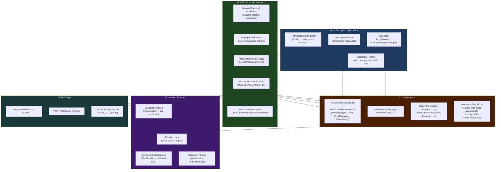

# 4.131 — WebSockets Manual: Low-Level WebSocket API Without SignalR

---

## PART 0 — Navigation & Context

### Where This Topic Lives

```
ASP.NET Core Mastery
│
├── I. HTTP Fundamentals           (4.123–4.133)
│   ├── 4.123 — HttpContext Deep Dive                    ◄ you need this
│   ├── 4.124 — HttpRequest: Reading Request Data        ◄ you need this
│   ├── 4.125 — HttpResponse: Writing Response Data      ◄ you need this
│   ├── 4.127 — HTTP/2: Multiplexing and Kestrel
│   ├── 4.130 — Request Body Reading Patterns
│   ├── 4.131 — WebSockets Manual                        ◄ YOU ARE HERE
│   ├── 4.132 — Server-Sent Events Manual
│   └── 4.133 — HTTP Connection Features
│
├── E. Middleware Pipeline          (4.049–4.063)
│   └── 4.049 — The Middleware Pipeline                  ◄ you need this
│
└── Q. SignalR & Real-Time          (4.219–4.230)
    ├── 4.219 — SignalR Architecture        ◄ what's built on top of this
    ├── 4.221 — SignalR Transports          ◄ how SignalR wraps WebSockets
    └── 4.223 — SignalR Auth (JWT + WS)     ◄ the auth problem this topic introduces
```

### What You Need Before This

- **[[4.049 — The Middleware Pipeline: Request Delegation Chain]]** — WebSocket handling lives inside a middleware; you must understand how `next()` delegation and short-circuiting work before implementing a WebSocket upgrade
- **[[4.123 — HttpContext Deep Dive]]** — the WebSocket is obtained from `HttpContext`; you need to understand `HttpContext.Features` and the request/response lifetime model
- **[[4.125 — HttpResponse: Writing Status, Headers, Cookies, and Streaming Body]]** — a WebSocket upgrade is an HTTP 101 response; understanding how `HttpResponse` commits is essential to understanding what `AcceptWebSocketAsync()` does to the HTTP pipeline

### What This Unlocks After

- **[[4.219 — SignalR Architecture]]** — SignalR's preferred transport is WebSockets; understanding the raw protocol makes SignalR's abstraction layer legible
- **[[4.221 — SignalR Transports]]** — SignalR's WebSocket transport is a thin layer over exactly what this note teaches
- **[[4.223 — SignalR Authentication: JWT in WebSocket Connection Upgrade]]** — the authentication problem (JWT in query string, no `Authorization` header on the upgrade) applies to raw WebSockets and SignalR equally
- **[[4.132 — Server-Sent Events Manual]]** — the alternative when you only need server→client push without bidirectional messaging

### Why This Matters at Scale

In production, the raw WebSocket API is the substrate you reach for when SignalR's abstraction adds overhead you cannot afford — custom binary protocols for trading systems, IoT device telemetry at sub-millisecond latency, or protocol bridges where the wire format is dictated by an external standard. Knowing the raw API also makes SignalR bugs debuggable, because every SignalR connection issue bottoms out in a WebSocket frame, a `CancellationToken`, or a missed `CloseAsync` call.

---

## PART 1 — The Core Mental Model

### The Fundamental Rule

> **A WebSocket connection begins as a standard HTTP/1.1 request (the "upgrade handshake"), and once `AcceptWebSocketAsync()` is called, ASP.NET Core permanently hands ownership of the TCP connection to your code — the HTTP pipeline is suspended indefinitely, the `HttpContext` lifetime is held open for the duration of the socket, and your code is solely responsible for reading, writing, and cleanly closing the connection before returning. The practical consequence is that a WebSocket handler is a long-running, stateful, cooperative loop that blocks one thread-pool task for its entire lifetime, and any unhandled exception or failure to call `CloseAsync()` leaks the TCP connection until a timeout fires.**

### The Plain-Language Analogy

Think of the HTTP request pipeline as a hotel front desk. Every normal HTTP request is a guest who walks up, makes a request ("I'd like room service"), gets a response, and leaves. The pipeline processes them one at a time and moves on.

A WebSocket upgrade is like a guest who walks up to the front desk and says, "I'd like to move in long-term." The front desk (the HTTP layer) processes the check-in paperwork (the 101 handshake), hands the guest a key (the `WebSocket` object), and then steps aside — the guest now has permanent access to the room (the TCP connection) and communicates directly with the hotel's systems (your message loop). The front desk does not serve other guests on that connection while this guest is checked in. The guest is responsible for checking out properly (`CloseAsync`) when done. If the guest walks out without checking out (unhandled exception, no close handshake), the room is locked until the hotel's housekeeping runs (TCP timeout, 2–4 hours by default) — the connection is leaked.

This analogy holds for the concurrent-request case: each WebSocket is its own guest on their own TCP connection. One guest misbehaving (infinite loop, no close handshake) does not block other guests, but does consume a connection and a task from the thread pool for its duration.

### The Taxonomy Diagram



---

## PART 2 — Deep Mechanics

### 2.1 — The HTTP Upgrade Handshake: What Actually Happens on the Wire

WebSocket is not a separate protocol — it starts as HTTP/1.1 and upgrades the TCP connection. Understanding the handshake explains every constraint of the API.

**Pipeline position:**

```
──► ExceptionHandler ──► HSTS ──► StaticFiles ──► UseWebSockets ──► Routing ──► Auth ──► [Your Handler]
                                                        │
                                          Inspects Upgrade header
                                          Sets IHttpUpgradeFeature
                                          Allows AcceptWebSocketAsync()
```

`UseWebSockets()` does not upgrade any connection itself. It installs `IHttpUpgradeFeature` on the `HttpContext.Features` collection and configures keep-alive ping intervals. The actual upgrade happens when your code calls `AcceptWebSocketAsync()`.

**HTTP wire format — the upgrade exchange:**

```
// Client → Server (HTTP request):
GET /ws/market-feed HTTP/1.1
Host: api.exchange.com
Upgrade: websocket
Connection: Upgrade
Sec-WebSocket-Key: dGhlIHNhbXBsZSBub25jZQ==
Sec-WebSocket-Version: 13
Sec-WebSocket-Protocol: market-data-v2   ← optional subprotocol negotiation
Origin: https://trading.example.com

// Server → Client (HTTP 101 response):
HTTP/1.1 101 Switching Protocols
Upgrade: websocket
Connection: Upgrade
Sec-WebSocket-Accept: s3pPLMBiTxaQ9kYGzzhZRbK+xOo=   ← SHA-1 of Key + magic GUID
Sec-WebSocket-Protocol: market-data-v2                 ← subprotocol confirmed

// After this response, the TCP socket is no longer HTTP — it is WebSocket frames
```

**ASP.NET Core internally (approximate):**

```csharp
// WebSocketMiddleware / HttpContext.WebSockets.AcceptWebSocketAsync:
public Task<WebSocket> AcceptWebSocketAsync(string? subProtocol)
{
    // 1. Validates Upgrade/Connection/Sec-WebSocket-Key/Version headers
    // 2. Computes Sec-WebSocket-Accept = Base64(SHA1(Key + "258EAFA5-..."))
    // 3. Writes HTTP 101 response via IHttpUpgradeFeature.UpgradeAsync()
    //    → This COMMITS the response (HttpResponse.HasStarted = true)
    //    → The HTTP pipeline is now suspended; the TCP socket is raw bytes
    // 4. Returns a WebSocket instance backed by the raw socket stream
    // Source: Microsoft.AspNetCore.WebSockets / WebSocketMiddleware.cs
    //         Calls IHttpUpgradeFeature.UpgradeAsync() → returns Stream
    //         Wraps Stream in ManagedWebSocket (System.Net.WebSockets)
}
```

**Runtime cost:** The upgrade itself: ~3 allocations (response headers, SHA-1 computation, `WebSocket` wrapper object). After that, the connection is held open for its entire lifetime. Each `ReceiveAsync`/`SendAsync` call: ~0–1 allocations depending on buffer ownership (see Part 2.3).

> [!IMPORTANT] **WebSockets require HTTP/1.1.** HTTP/2 does not support the `Upgrade` mechanism. If a client connects over HTTP/2 (which modern browsers prefer), the WebSocket upgrade will fail with a `426 Upgrade Required` response unless you force HTTP/1.1. Kestrel handles this transparently for browsers via ALPN negotiation — but reverse proxies (nginx, YARP) must be explicitly configured to pass through WebSocket upgrades.

---

### 2.2 — The `WebSocket` Object: State Machine and Thread-Safety Contract

Once you have the `WebSocket` object from `AcceptWebSocketAsync()`, you are operating a state machine and must respect its invariants.

**WebSocket state machine:**

```
                    AcceptWebSocketAsync()
                           │
                           ▼
                        [ Open ]
                      /         \
            ReceiveAsync()    SendAsync()
             returns          succeeds
             MessageType.Close
                  │
                  ▼
           [ CloseReceived ]          ←── Client sent Close frame
                  │
        CloseAsync() or CloseOutputAsync()
                  │
                  ▼
             [ Closed ]               ←── Full close handshake complete

            [Aborted]  ←── Exception / CancellationToken fired / network error
                           WebSocket is unusable; call Dispose()
```

**Thread-safety rules — the ones that cause silent data corruption:**

The `WebSocket` class is **NOT thread-safe for concurrent sends or concurrent receives**. The rules are:

- Only one `ReceiveAsync` may be in flight at a time
- Only one `SendAsync` may be in flight at a time
- `ReceiveAsync` and `SendAsync` may run concurrently with each other (receive loop + send path are independent)
- If you need to send from multiple threads, you must serialize with a `SemaphoreSlim` or `Channel<T>` (see Pattern 3)

**ASP.NET Core internally:**

```csharp
// ManagedWebSocket (System.Net.WebSockets.ManagedWebSocket):
// Internally has separate locks for send and receive paths.
// But: it throws InvalidOperationException if you call ReceiveAsync
// while another ReceiveAsync is already in progress:
// "There is already one outstanding 'ReceiveAsync' call for this WebSocket instance."
// This is the bug you get when the receive loop is not properly sequential.
```

**`WebSocketReceiveResult` — reading the return value correctly:**

```csharp
// Every ReceiveAsync call returns WebSocketReceiveResult:
// .MessageType  — Text, Binary, or Close
// .Count        — bytes actually written into your buffer this call
// .EndOfMessage — true if this is the last fragment of the message
// .CloseStatus  — populated when MessageType == Close
// .CloseStatusDescription — human-readable close reason

// CRITICAL: .Count may be LESS than buffer.Length
// A single logical WebSocket message may span multiple ReceiveAsync calls
// You must loop until EndOfMessage == true to receive a complete message
```

---

### 2.3 — The Receive Loop: Correct Frame Reassembly

The most common bug in manual WebSocket code is a receive loop that doesn't handle fragmented messages. RFC 6455 allows senders to split a logical message across multiple frames.

**Pipeline position:**

```
[After AcceptWebSocketAsync]
   │
   ▼
Application code owns the socket exclusively
   │
   ├── Receive loop (your async while loop)
   │     └── ReceiveAsync() blocks until bytes arrive
   │           ├── Fragment arrives → append to buffer, check EndOfMessage
   │           └── Complete message → process, reset buffer
   │
   └── Send path (may run concurrently with receive loop)
         └── SendAsync() writes frame to socket
```

**Correct receive loop with fragment reassembly:**

```csharp
// Pipeline position: inside WebSocket handler, after AcceptWebSocketAsync
// Runtime cost: ~0 allocations per receive when using ArrayPool<byte>

private static async Task ReceiveMessagesAsync(
    WebSocket webSocket,
    Func<ReadOnlyMemory<byte>, WebSocketMessageType, Task> onMessage,
    CancellationToken cancellationToken)
{
    // ✅ CORRECT: Use ArrayPool to avoid per-message heap allocation
    // Size: 4KB is reasonable; increase for large binary payloads
    var buffer = ArrayPool<byte>.Shared.Rent(4096);
    var messageBuffer = new List<byte>(); // accumulates fragments

    try
    {
        while (webSocket.State == WebSocketState.Open)
        {
            WebSocketReceiveResult result;
            try
            {
                result = await webSocket.ReceiveAsync(
                    new ArraySegment<byte>(buffer),
                    cancellationToken);
            }
            catch (OperationCanceledException)
            {
                // CancellationToken fired: app shutdown or request abort
                // Attempt graceful close before returning
                break;
            }
            catch (WebSocketException ex) when (
                ex.WebSocketErrorCode == WebSocketError.ConnectionClosedPrematurely)
            {
                // Client disconnected without sending a Close frame (browser tab closed)
                // Not an error worth logging at Warning — treat as normal disconnection
                return;
            }

            if (result.MessageType == WebSocketMessageType.Close)
            {
                // Client initiated Close handshake — must echo close frame back
                // CloseAsync sends our Close frame and waits for acknowledgement
                await webSocket.CloseAsync(
                    result.CloseStatus ?? WebSocketCloseStatus.NormalClosure,
                    result.CloseStatusDescription ?? "Connection closed",
                    CancellationToken.None); // don't use request CT — we MUST send close
                return;
            }

            // Accumulate fragment into message buffer
            messageBuffer.AddRange(buffer[..result.Count]);

            if (result.EndOfMessage)
            {
                // Complete message assembled
                await onMessage(
                    messageBuffer.ToArray(), // ← 1 allocation per complete message
                    result.MessageType);
                messageBuffer.Clear();
            }
            // If !result.EndOfMessage: continue loop to receive next fragment
        }
    }
    finally
    {
        ArrayPool<byte>.Shared.Return(buffer);
    }
}
```

> [!WARNING] The `messageBuffer.AddRange` + `ToArray()` pattern above is intentionally readable. In a production high-throughput system, replace `List<byte>` with a `System.IO.Pipelines.PipeWriter` or a resizable `ArrayBufferWriter<byte>` — see Part 2.5 for the zero-allocation approach.

**Runtime cost:** Per `ReceiveAsync` call: ~0 allocations (buffer rented from pool). Per complete message: ~1 allocation (the `byte[]` from `ToArray()`). Fragment reassembly: O(message size) memory.

---

### 2.4 — The Send Path: Thread-Safety and Backpressure

Sending is straightforward when there is exactly one sender. The complexity emerges when multiple concurrent tasks need to write — a timer sending heartbeats, event handlers pushing updates, and the receive loop sending acknowledgements all simultaneously.

**Pipeline position:**

```
[Multiple producers want to write]
Producer 1 (event handler) ─────┐
Producer 2 (heartbeat timer) ───┼──► SemaphoreSlim(1,1) ──► WebSocket.SendAsync
Producer 3 (ack from recv loop) ┘
```

**Correct concurrent send with serialization:**

```csharp
// ⚠️ WRONG: concurrent SendAsync — throws InvalidOperationException or corrupts frame
var task1 = webSocket.SendAsync(message1, WebSocketMessageType.Text, true, ct);
var task2 = webSocket.SendAsync(message2, WebSocketMessageType.Text, true, ct);
await Task.WhenAll(task1, task2); // RACE CONDITION

// ✅ CORRECT: serialized send via SemaphoreSlim
private readonly SemaphoreSlim _sendLock = new SemaphoreSlim(1, 1);

private async Task SendMessageAsync(
    WebSocket webSocket,
    ReadOnlyMemory<byte> message,
    WebSocketMessageType messageType,
    CancellationToken cancellationToken)
{
    await _sendLock.WaitAsync(cancellationToken);
    try
    {
        // Runtime cost: 0 allocations — ReadOnlyMemory<byte> is a struct
        await webSocket.SendAsync(
            message,
            messageType,
            endOfMessage: true, // single-frame message; set false for fragmented
            cancellationToken);
    }
    finally
    {
        _sendLock.Release();
    }
}

// HTTP wire format (text message sent to client):
// [WebSocket Frame]
// FIN=1, opcode=0x1 (Text), MASK=0 (server→client not masked)
// Payload length: <n bytes>
// Payload: <UTF-8 encoded text>
```

**The `Channel<T>` pattern for backpressure (preferred for high-throughput):**

```csharp
// A bounded channel provides backpressure: if the client is slow to receive,
// the channel blocks producers rather than queuing unbounded messages
private readonly Channel<(ReadOnlyMemory<byte> Data, WebSocketMessageType Type)> _sendChannel
    = Channel.CreateBounded<(ReadOnlyMemory<byte>, WebSocketMessageType)>(
        new BoundedChannelOptions(capacity: 256)
        {
            FullMode = BoundedChannelFullMode.Wait, // backpressure: blocks producer
            SingleReader = true,  // only the send loop reads
            SingleWriter = false  // multiple producers may write
        });

// Send loop (runs as background Task during WebSocket lifetime):
private async Task RunSendLoopAsync(WebSocket webSocket, CancellationToken ct)
{
    await foreach (var (data, type) in _sendChannel.Reader.ReadAllAsync(ct))
    {
        if (webSocket.State != WebSocketState.Open) break;
        await webSocket.SendAsync(data, type, endOfMessage: true, ct);
    }
}
```

**Runtime cost:** `Channel<T>` bounded: O(1) enqueue/dequeue (lock-free for single-reader). `SemaphoreSlim`: ~0 allocations in the uncontended fast path (ValueTask). Contended path: ~1 allocation for the async state machine.

---

### 2.5 — The Close Handshake: Why Getting This Wrong Leaks Connections

The WebSocket close handshake is a two-message exchange. Getting it wrong is the #1 cause of connection leaks in production WebSocket services.

**Close handshake state diagram:**

```
Initiator (either side)                    Receiver
      │                                       │
      │── Close Frame (status, reason) ──────►│
      │                                       │  Must send Close frame back
      │◄─ Close Frame (echo) ────────────────│
      │                                       │
      │  Both sides close TCP                 │
      │  (or Kestrel does after timeout)       │
```

**ASP.NET Core offers two close methods — use the right one:**

```csharp
// CloseAsync: sends Close frame AND waits for the echo Close frame from the other side
// Use when YOUR code is initiating the close
await webSocket.CloseAsync(
    WebSocketCloseStatus.NormalClosure,
    "Session ended by server",
    CancellationToken.None); // Never use request CT here — must complete the handshake

// CloseOutputAsync: sends Close frame but does NOT wait for echo
// Use when responding to a Close frame received from the other side
// (You already received their Close; just send yours back)
await webSocket.CloseOutputAsync(
    WebSocketCloseStatus.NormalClosure,
    "Acknowledged",
    CancellationToken.None);
```

> [!DANGER] **Never pass `cancellationToken` to `CloseAsync()` or `CloseOutputAsync()` if it might already be cancelled.** The close handshake must complete to avoid connection leaks. Use `CancellationToken.None` with a separate timeout if needed. A common production bug: the request CancellationToken is cancelled (app shutdown), the close code runs, but `CloseAsync(cancellationToken)` immediately throws `OperationCanceledException` — and the connection is never closed cleanly.

**Close status codes (RFC 6455):**

|Code|Name|When to Use|
|---|---|---|
|1000|NormalClosure|Planned, expected close|
|1001|EndpointUnavailable|Server shutting down|
|1002|ProtocolError|Protocol violation by client|
|1003|InvalidMessageType|Wrong message type received|
|1007|InvalidPayloadData|Non-UTF-8 in Text message|
|1008|PolicyViolation|Authentication/authorization failure|
|1009|MessageTooBig|Received message exceeds size limit|
|1011|InternalServerError|Server error (generic)|

**Failure mode diagram:**

```
Scenario 1: Client disconnects (tab closed) without Close frame
  → ReceiveAsync throws WebSocketException (ConnectionClosedPrematurely)
  → State transitions to Aborted
  → Do NOT call CloseAsync on Aborted socket (throws ObjectDisposedException)
  → Just return from handler; Kestrel reclaims connection

Scenario 2: Server closes before client acknowledges
  → CloseAsync sends Close frame, waits up to CloseTimeout (default: 5s)
  → If client doesn't echo within timeout: WebSocketException
  → State: Aborted
  → Connection is released; Kestrel reclaims TCP socket

Scenario 3: CancellationToken fires during receive loop
  → ReceiveAsync throws OperationCanceledException
  → socket.State may still be Open (token fired, no close frame sent yet)
  → Must attempt CloseAsync(CancellationToken.None) with timeout
  → If CloseAsync also fails: socket.Abort() to force-release resources
```

**The safe teardown pattern:**

```csharp
// This finally block belongs in your top-level WebSocket handler
finally
{
    if (webSocket.State == WebSocketState.Open ||
        webSocket.State == WebSocketState.CloseReceived)
    {
        try
        {
            using var closeCts = new CancellationTokenSource(TimeSpan.FromSeconds(3));
            await webSocket.CloseAsync(
                WebSocketCloseStatus.EndpointUnavailable,
                "Server shutting down",
                closeCts.Token);
        }
        catch (Exception ex) when (ex is OperationCanceledException or WebSocketException)
        {
            // Force-abort if clean close timed out or failed
            webSocket.Abort();
        }
    }
    webSocket.Dispose();
}
```

---

### 2.6 — UseWebSockets Middleware: Configuration and Registration

**Pipeline position:**

```
──► ExceptionHandler ──► HSTS ──► StaticFiles ──► [UseWebSockets] ──► Routing ──► Auth ──► Endpoints
                                                          │
                                        Must be BEFORE UseRouting if using
                                        MapGet/MapPost for WebSocket endpoints.
                                        Auth middleware still applies after routing.
```

```csharp
// Program.cs — WebSocket middleware configuration
builder.Services.AddWebSockets(options =>
{
    // KeepAliveInterval: how often Kestrel sends Ping frames to detect dead connections
    // Default: 2 minutes. Set lower for faster dead-peer detection.
    options.KeepAliveInterval = TimeSpan.FromSeconds(30);

    // KeepAliveTimeout (.NET 8+): how long to wait for Pong response before closing
    // Default: 8 seconds. If no Pong received, connection is marked Aborted.
    options.KeepAliveTimeout = TimeSpan.FromSeconds(8);

    // AllowedOrigins: CORS-like origin restriction for WebSocket upgrade requests
    // Empty = allow all origins. In production, always restrict this.
    options.AllowedOrigins.Add("https://trading.example.com");
    options.AllowedOrigins.Add("https://admin.trading.example.com");
});

app.UseWebSockets(); // Must be before UseRouting for endpoint-based routing
app.UseRouting();
app.UseAuthentication();
app.UseAuthorization();
```

**ASP.NET Core internally (approximate):**

```csharp
// WebSocketMiddleware.InvokeAsync:
public async Task InvokeAsync(HttpContext context)
{
    if (context.WebSockets.IsWebSocketRequest)
    {
        // Validates Origin header against AllowedOrigins (if configured)
        // Sets IHttpUpgradeFeature on Features collection
        // Enables context.WebSockets.AcceptWebSocketAsync()
    }
    await _next(context);
    // If AcceptWebSocketAsync was called: this never completes until the
    // WebSocket handler returns (HttpContext lifetime is held open)
}
```

> [!NOTE] `context.WebSockets.IsWebSocketRequest` is true if the request has `Upgrade: websocket`, `Connection: Upgrade`, `Sec-WebSocket-Version: 13`, and a valid `Sec-WebSocket-Key` header. A request missing any of these headers returns false — you must return 400 to the client.

---

### 2.7 — Authentication on WebSocket Connections

WebSocket upgrade requests are HTTP requests and run through the authentication middleware. However, the standard `Authorization: Bearer <token>` header pattern breaks in browsers because the browser's `WebSocket` constructor does not allow setting custom headers.

**The browser limitation:**

```javascript
// Browser WebSocket API — headers NOT settable:
const ws = new WebSocket('wss://api.exchange.com/ws/feed');
// Cannot add: Authorization: Bearer <token>

// Workaround 1: Token in query string (visible in logs — security trade-off)
const ws = new WebSocket('wss://api.exchange.com/ws/feed?access_token=' + token);

// Workaround 2: Cookie authentication (preferred for browser clients)
// The browser automatically sends cookies including HttpOnly ones on WS upgrade
const ws = new WebSocket('wss://api.exchange.com/ws/feed');
// → Cookie: auth_session=eyJ... sent automatically
```

**How to authenticate query-string JWTs in ASP.NET Core:**

```csharp
// In JwtBearer configuration — add the query string token extraction
builder.Services.AddAuthentication(JwtBearerDefaults.AuthenticationScheme)
    .AddJwtBearer(options =>
    {
        options.Events = new JwtBearerEvents
        {
            OnMessageReceived = context =>
            {
                // Extract token from query string for WebSocket connections
                var accessToken = context.Request.Query["access_token"];
                var path = context.HttpContext.Request.Path;

                if (!string.IsNullOrEmpty(accessToken) &&
                    path.StartsWithSegments("/ws"))
                {
                    context.Token = accessToken;
                }
                return Task.CompletedTask;
            }
        };
        // ... standard JWT validation parameters
    });

// HTTP wire format (browser WebSocket upgrade with query-string token):
// GET /ws/market-feed?access_token=eyJhbGci... HTTP/1.1
// Upgrade: websocket
// Connection: Upgrade
// Sec-WebSocket-Key: dGhlIHNhbXBsZSBub25jZQ==
// Sec-WebSocket-Version: 13
//
// ⚠️ WARNING: Token in query string appears in:
//   - Access logs (nginx, Kestrel HTTP logging)
//   - Browser history
//   - Referrer headers
// Mitigate: short-lived tokens (30–60 seconds) issued specifically for WS upgrade
```

**Runtime cost of authentication on WebSocket upgrade:** Same as any HTTP request — JWT validation runs once at upgrade time (`~2–5ms` including JWKS fetch if cached). After the handshake, no re-authentication occurs for the lifetime of the connection (typically hours).

---

## PART 3 — Production Code Patterns

### Pattern 1: The Market Data Feed WebSocket Endpoint (Minimal API)

```csharp
// Domain: financial trading platform — real-time market data streaming to browser clients
// Pattern: server-push with client subscription messages

app.MapGet("/ws/market-feed/{symbol}", async (
    string symbol,
    HttpContext context,
    MarketDataService marketData,
    ILogger<Program> logger,
    CancellationToken requestAborted) =>
{
    // Guard: reject non-WebSocket requests before upgrade
    if (!context.WebSockets.IsWebSocketRequest)
    {
        context.Response.StatusCode = StatusCodes.Status400BadRequest;
        await context.Response.WriteAsync("WebSocket connection required");
        return;
    }

    // Symbol validation before accepting — return 400 before upgrade if invalid
    if (!marketData.IsValidSymbol(symbol))
    {
        context.Response.StatusCode = StatusCodes.Status404NotFound;
        return;
    }

    // ✅ AcceptWebSocketAsync commits HTTP 101; pipeline is now suspended
    using var webSocket = await context.WebSockets.AcceptWebSocketAsync(
        subProtocol: "market-data-v2"); // must match client's Sec-WebSocket-Protocol

    logger.LogInformation(
        "WebSocket connected: symbol={Symbol}, user={UserId}",
        symbol,
        context.User.FindFirst("sub")?.Value ?? "anonymous");

    // Linked token: fires on app shutdown OR client disconnect
    using var cts = CancellationTokenSource.CreateLinkedTokenSource(
        requestAborted,
        context.RequestAborted);

    try
    {
        await RunMarketFeedAsync(webSocket, symbol, marketData, cts.Token);
    }
    catch (OperationCanceledException)
    {
        logger.LogInformation("Market feed WebSocket cancelled: {Symbol}", symbol);
    }
    catch (Exception ex)
    {
        logger.LogError(ex, "Market feed WebSocket error: {Symbol}", symbol);
    }
    finally
    {
        // ✅ Always attempt clean close regardless of exception
        await CloseWebSocketSafelyAsync(webSocket, logger);
    }
})
.RequireAuthorization("TradingAccess");

private static async Task RunMarketFeedAsync(
    WebSocket webSocket,
    string symbol,
    MarketDataService marketData,
    CancellationToken ct)
{
    // Concurrent: receive loop (handles client messages) +
    //             send loop (pushes market data updates)
    var receiveTask = HandleClientMessagesAsync(webSocket, ct);
    var sendTask = PushMarketUpdatesAsync(webSocket, symbol, marketData, ct);

    // Wait for either to complete (client disconnect or cancellation)
    await Task.WhenAny(receiveTask, sendTask);
    ct.ThrowIfCancellationRequested();
}

// HTTP wire format (connection established):
// HTTP/1.1 101 Switching Protocols
// Upgrade: websocket
// Connection: Upgrade
// Sec-WebSocket-Accept: <computed>
// Sec-WebSocket-Protocol: market-data-v2
```

---

### Pattern 2: The IoT Device Command WebSocket Handler (Convention-Based Middleware)

```csharp
// Domain: IoT logistics tracking — persistent connections from scanner devices
// Pattern: bidirectional messaging with binary protocol frames

public class IoTDeviceWebSocketMiddleware
{
    private readonly RequestDelegate _next;
    private readonly ILogger<IoTDeviceWebSocketMiddleware> _logger;

    // ✅ Singleton-safe: no per-request state in constructor
    public IoTDeviceWebSocketMiddleware(
        RequestDelegate next,
        ILogger<IoTDeviceWebSocketMiddleware> logger)
    {
        _next = next;
        _logger = logger;
    }

    public async Task InvokeAsync(HttpContext context, IDeviceRegistry registry)
    {
        // Only intercept WebSocket requests to /ws/device/*
        if (!context.Request.Path.StartsWithSegments("/ws/device") ||
            !context.WebSockets.IsWebSocketRequest)
        {
            await _next(context);
            return; // short-circuit for non-matching requests
        }

        var deviceId = context.Request.Path.Value!.Split('/').Last();

        // Validate device authentication from query string (devices can't set headers)
        var deviceToken = context.Request.Query["device_token"].ToString();
        if (!await registry.ValidateDeviceTokenAsync(deviceId, deviceToken))
        {
            context.Response.StatusCode = StatusCodes.Status401Unauthorized;
            return;
        }

        using var webSocket = await context.WebSockets.AcceptWebSocketAsync(
            subProtocol: "iot-command-v1");

        var session = await registry.RegisterDeviceSessionAsync(deviceId, webSocket);

        _logger.LogInformation(
            "IoT device connected: {DeviceId} from {RemoteIp}",
            deviceId,
            context.Connection.RemoteIpAddress);

        try
        {
            await ProcessDeviceSessionAsync(webSocket, session, context.RequestAborted);
        }
        finally
        {
            await registry.UnregisterDeviceSessionAsync(deviceId);
            await CloseWebSocketSafelyAsync(webSocket, _logger);
        }
    }

    private async Task ProcessDeviceSessionAsync(
        WebSocket webSocket,
        DeviceSession session,
        CancellationToken ct)
    {
        // Rent a 16KB buffer — adequate for IoT binary frames
        var buffer = ArrayPool<byte>.Shared.Rent(16384);
        try
        {
            while (webSocket.State == WebSocketState.Open && !ct.IsCancellationRequested)
            {
                var result = await webSocket.ReceiveAsync(
                    new ArraySegment<byte>(buffer), ct);

                if (result.MessageType == WebSocketMessageType.Close) break;
                if (result.MessageType != WebSocketMessageType.Binary)
                {
                    // Protocol violation: IoT devices must send binary frames
                    await webSocket.CloseAsync(
                        WebSocketCloseStatus.InvalidMessageType,
                        "Binary frames required",
                        CancellationToken.None);
                    return;
                }

                // Process binary frame — result.Count bytes in buffer[..result.Count]
                await session.ProcessCommandAsync(buffer[..result.Count], ct);
            }
        }
        finally
        {
            ArrayPool<byte>.Shared.Return(buffer);
        }
    }
}

// Registration in Program.cs:
app.UseWebSockets(new WebSocketOptions { KeepAliveInterval = TimeSpan.FromSeconds(15) });
app.UseMiddleware<IoTDeviceWebSocketMiddleware>();
```

---

### Pattern 3: The Broadcast Hub (Multiple Clients, Thread-Safe Send)

```csharp
// Domain: order management system — broadcast order status updates to connected staff clients
// Pattern: fan-out broadcast with concurrent-safe send

public class OrderStatusBroadcaster : IOrderStatusBroadcaster, IDisposable
{
    // Thread-safe collection of active connections
    private readonly ConcurrentDictionary<string, ConnectedClient> _clients = new();
    private readonly ILogger<OrderStatusBroadcaster> _logger;

    public OrderStatusBroadcaster(ILogger<OrderStatusBroadcaster> logger)
        => _logger = logger;

    public async Task AddClientAsync(string connectionId, WebSocket webSocket)
    {
        var client = new ConnectedClient(connectionId, webSocket);
        _clients.TryAdd(connectionId, client);

        try
        {
            // Block here for the lifetime of the connection
            await client.RunReceiveLoopAsync();
        }
        finally
        {
            _clients.TryRemove(connectionId, out _);
            client.Dispose();
        }
    }

    // Called by order processing service — fires from any thread
    public async Task BroadcastOrderUpdateAsync(
        OrderStatusUpdate update,
        CancellationToken ct)
    {
        var json = JsonSerializer.SerializeToUtf8Bytes(update);
        var memory = new ReadOnlyMemory<byte>(json);

        var tasks = _clients.Values
            .Where(c => c.IsOpen)
            .Select(c => c.SendAsync(memory, WebSocketMessageType.Text, ct));

        await Task.WhenAll(tasks);
    }

    private sealed class ConnectedClient : IDisposable
    {
        private readonly WebSocket _ws;
        private readonly SemaphoreSlim _sendLock = new(1, 1);
        public string Id { get; }
        public bool IsOpen => _ws.State == WebSocketState.Open;

        public ConnectedClient(string id, WebSocket ws) { Id = id; _ws = ws; }

        // ✅ Send serialized with SemaphoreSlim — safe from concurrent BroadcastAsync calls
        public async Task SendAsync(
            ReadOnlyMemory<byte> data,
            WebSocketMessageType type,
            CancellationToken ct)
        {
            if (!IsOpen) return;
            await _sendLock.WaitAsync(ct);
            try
            {
                if (!IsOpen) return; // re-check under lock
                await _ws.SendAsync(data, type, endOfMessage: true, ct);
            }
            catch (WebSocketException)
            {
                // Client disconnected during send — non-fatal for broadcaster
            }
            finally
            {
                _sendLock.Release();
            }
        }

        public async Task RunReceiveLoopAsync()
        {
            var buffer = ArrayPool<byte>.Shared.Rent(4096);
            try
            {
                while (_ws.State == WebSocketState.Open)
                {
                    var result = await _ws.ReceiveAsync(
                        new ArraySegment<byte>(buffer),
                        CancellationToken.None);

                    if (result.MessageType == WebSocketMessageType.Close)
                    {
                        await _ws.CloseOutputAsync(
                            WebSocketCloseStatus.NormalClosure,
                            "Closing",
                            CancellationToken.None);
                        break;
                    }
                    // Clients send no meaningful messages — just drain the receive buffer
                }
            }
            catch (WebSocketException) { /* client disconnected */ }
            finally
            {
                ArrayPool<byte>.Shared.Return(buffer);
            }
        }

        public void Dispose()
        {
            _sendLock.Dispose();
            _ws.Dispose();
        }
    }

    public void Dispose() { /* _clients entries are disposed in RunReceiveLoopAsync */ }
}
```

---

### Pattern 4: The Graceful Shutdown Handler for WebSocket Connections

```csharp
// Domain: any WebSocket service — orderly shutdown during deployment/restart
// Ensures all active WebSocket connections are closed cleanly before process exits

public class WebSocketConnectionTracker : IHostedService
{
    private readonly ConcurrentBag<WebSocket> _activeSockets = new();
    private readonly ILogger<WebSocketConnectionTracker> _logger;

    public WebSocketConnectionTracker(ILogger<WebSocketConnectionTracker> logger)
        => _logger = logger;

    public void Track(WebSocket ws) => _activeSockets.Add(ws);
    public void Untrack(WebSocket ws) => _activeSockets.TryTake(out _); // simplification

    // Called by IHostApplicationLifetime.ApplicationStopping
    public async Task StopAsync(CancellationToken cancellationToken)
    {
        _logger.LogInformation(
            "Closing {Count} active WebSocket connections for graceful shutdown",
            _activeSockets.Count);

        var closeTasks = _activeSockets
            .Where(ws => ws.State == WebSocketState.Open)
            .Select(async ws =>
            {
                try
                {
                    using var cts = new CancellationTokenSource(TimeSpan.FromSeconds(5));
                    await ws.CloseAsync(
                        WebSocketCloseStatus.EndpointUnavailable,
                        "Server restarting",
                        cts.Token); // own timeout — NOT the hosting CT which may be expired
                }
                catch (Exception ex)
                {
                    _logger.LogWarning(ex, "Failed to close WebSocket cleanly during shutdown");
                    ws.Abort();
                }
            });

        await Task.WhenAll(closeTasks);
    }

    public Task StartAsync(CancellationToken cancellationToken) => Task.CompletedTask;
}

// HTTP wire format (server-initiated close during shutdown):
// [WebSocket Frame to client]
// FIN=1, opcode=0x8 (Close), payload: status=1001 "Server restarting"
//
// [Client echoes Close frame back]
// FIN=1, opcode=0x8, payload: status=1000 "Normal Closure"
```

---

### Pattern 5: The Zero-Allocation Receive Loop with System.IO.Pipelines

```csharp
// Domain: high-throughput trading system — receive large binary message streams
// Pattern: System.IO.Pipelines for zero-allocation frame reassembly

public static async Task ReceiveWithPipelinesAsync(
    WebSocket webSocket,
    Func<ReadOnlySequence<byte>, WebSocketMessageType, Task> onMessage,
    CancellationToken ct)
{
    // PipeWriter backed by pooled memory — zero allocation per write
    var pipe = new Pipe(new PipeOptions(
        minimumSegmentSize: 4096,
        pauseWriterThreshold: 65536, // backpressure: pause if client sends faster than we process
        resumeWriterThreshold: 32768));

    // Concurrently: fill pipe from WebSocket receive + drain pipe to message processor
    await Task.WhenAll(
        FillPipeAsync(webSocket, pipe.Writer, ct),
        DrainPipeAsync(pipe.Reader, onMessage, ct));
}

private static async Task FillPipeAsync(
    WebSocket webSocket, PipeWriter writer, CancellationToken ct)
{
    while (webSocket.State == WebSocketState.Open)
    {
        // GetMemory requests a pooled buffer segment — 0 allocations
        var memory = writer.GetMemory(4096);
        WebSocketReceiveResult result;
        try
        {
            result = await webSocket.ReceiveAsync(memory, ct);
        }
        catch (OperationCanceledException) { break; }

        if (result.MessageType == WebSocketMessageType.Close) break;

        // Advance tells the pipe how many bytes were written
        writer.Advance(result.Count);

        // Flush makes bytes available to the reader
        var flushResult = await writer.FlushAsync(ct);
        if (flushResult.IsCompleted) break;
    }
    await writer.CompleteAsync();
}

private static async Task DrainPipeAsync(
    PipeReader reader,
    Func<ReadOnlySequence<byte>, WebSocketMessageType, Task> onMessage,
    CancellationToken ct)
{
    while (true)
    {
        var result = await reader.ReadAsync(ct);
        var buffer = result.Buffer;

        // Process all complete messages in the buffer
        // (application-level framing determines message boundaries)
        while (TryReadMessage(ref buffer, out var message, out var type))
            await onMessage(message, type);

        reader.AdvanceTo(buffer.Start, buffer.End);
        if (result.IsCompleted) break;
    }
    await reader.CompleteAsync();
}

// Runtime cost: 0 allocations per received byte in the hot path
// Memory: pool-managed segments, returned to ArrayPool after processing
```

---

### Pattern 6: The WebSocket Proxy/Bridge (Protocol Adapter)

```csharp
// Domain: logistics API gateway — proxy WebSocket connections to a legacy TCP service
// Pattern: bidirectional proxying between two WebSocket connections

app.MapGet("/ws/proxy/{upstreamId}", async (
    string upstreamId,
    HttpContext context,
    UpstreamWebSocketFactory factory,
    CancellationToken ct) =>
{
    if (!context.WebSockets.IsWebSocketRequest)
    {
        context.Response.StatusCode = 400;
        return;
    }

    // Accept client connection
    using var clientSocket = await context.WebSockets.AcceptWebSocketAsync();

    // Connect to upstream
    using var upstreamClient = new ClientWebSocket();
    await upstreamClient.ConnectAsync(
        new Uri($"wss://upstream.internal/feed/{upstreamId}"),
        ct);

    // Proxy frames in both directions concurrently
    await Task.WhenAll(
        ProxyDirectionAsync(clientSocket, upstreamClient, "client→upstream", ct),
        ProxyDirectionAsync(upstreamClient, clientSocket, "upstream→client", ct));
})
.RequireAuthorization();

private static async Task ProxyDirectionAsync(
    WebSocket source, WebSocket destination,
    string direction, CancellationToken ct)
{
    var buffer = ArrayPool<byte>.Shared.Rent(8192);
    try
    {
        while (source.State == WebSocketState.Open &&
               destination.State == WebSocketState.Open)
        {
            var result = await source.ReceiveAsync(
                new ArraySegment<byte>(buffer), ct);

            if (result.MessageType == WebSocketMessageType.Close)
            {
                await destination.CloseAsync(
                    result.CloseStatus ?? WebSocketCloseStatus.NormalClosure,
                    result.CloseStatusDescription,
                    CancellationToken.None);
                break;
            }

            await destination.SendAsync(
                new ArraySegment<byte>(buffer, 0, result.Count),
                result.MessageType,
                result.EndOfMessage,
                ct);
        }
    }
    catch (WebSocketException) { /* connection dropped — normal */ }
    finally
    {
        ArrayPool<byte>.Shared.Return(buffer);
    }
}
```

---

## PART 4 — Gotchas & Anti-Patterns

### Gotcha 1: Using the Request CancellationToken for CloseAsync Leaks Connections on Shutdown

Experienced engineers correctly propagate `CancellationToken` throughout async code. In WebSocket handlers, passing `context.RequestAborted` to `CloseAsync()` is correct for normal operation — but on app shutdown, `RequestAborted` is already cancelled when your cleanup code runs, causing `CloseAsync` to throw immediately without sending the Close frame.

```csharp
// ⚠️ WRONG CODE
app.MapGet("/ws/feed", async (HttpContext context, CancellationToken ct) =>
{
    using var ws = await context.WebSockets.AcceptWebSocketAsync();
    try
    {
        await RunFeedLoopAsync(ws, ct);
    }
    finally
    {
        // ct may already be cancelled on app shutdown — CloseAsync throws immediately
        await ws.CloseAsync(WebSocketCloseStatus.NormalClosure, "Done", ct); // ← WRONG
    }
});

// HTTP consequence (wrong path):
// On app shutdown: ct is cancelled → CloseAsync(ct) throws OperationCanceledException
//   before sending Close frame → client receives abrupt TCP close without WebSocket close
//   → Client's WebSocket.onclose fires with code 1006 (Abnormal Closure)
//   → Client reconnects unnecessarily → connection leak during rolling deploy
```

```csharp
// ✅ CORRECT CODE
app.MapGet("/ws/feed", async (HttpContext context, CancellationToken ct) =>
{
    using var ws = await context.WebSockets.AcceptWebSocketAsync();
    try
    {
        await RunFeedLoopAsync(ws, ct);
    }
    finally
    {
        if (ws.State == WebSocketState.Open)
        {
            try
            {
                // Own timeout: never depends on already-cancelled external token
                using var closeCts = new CancellationTokenSource(TimeSpan.FromSeconds(3));
                await ws.CloseAsync(
                    WebSocketCloseStatus.EndpointUnavailable,
                    "Server shutting down",
                    closeCts.Token); // ← independent timeout
            }
            catch
            {
                ws.Abort(); // force-release on any close failure
            }
        }
    }
});

// HTTP consequence (correct path):
// App shutdown: CloseAsync sends Close frame within 3 seconds
// Client receives: onclose with code 1001 (EndpointUnavailable) — triggers reconnect logic
// Kestrel waits for Close before releasing TCP socket
```

**WHY:** `CancellationToken` propagation is correct during normal operation. During shutdown, the hosting infrastructure cancels the request token before your finally block runs. `CloseAsync` with an already-cancelled token throws before writing anything to the wire. Always use an independent short-duration `CancellationTokenSource` for close operations.

---

### Gotcha 2: Not Draining the Receive Buffer After Sending Close Causes Protocol Errors

Many engineers think "I sent a Close frame, I'm done." But RFC 6455 §7.1.2 requires the initiating side to continue reading until it receives the echoed Close frame. Skipping the drain causes the client to see a TCP close while still waiting for the Close frame echo — manifesting as `1006 Abnormal Closure` on the client.

```csharp
// ⚠️ WRONG CODE
private async Task StopClientAsync(WebSocket ws)
{
    await ws.CloseOutputAsync(
        WebSocketCloseStatus.NormalClosure, "Done",
        CancellationToken.None);
    // ← immediately return without draining
    // ws.Dispose() is called by caller — TCP closes before client echoes
}

// HTTP consequence (wrong path):
// Server sends Close frame → immediately disposes socket → TCP FIN/RST
// Client was sending data at the same moment → receives TCP error
// Client browser: WebSocket.onclose fires with code=1006 (no clean close received)
// Production impact: reconnect storms if many clients hit this simultaneously
```

```csharp
// ✅ CORRECT CODE
private async Task StopClientAsync(WebSocket ws)
{
    // CloseAsync (not CloseOutputAsync) handles the full protocol exchange:
    // 1. Sends our Close frame
    // 2. Drains incoming frames until client's Close echo arrives
    // 3. Returns only after bidirectional close handshake completes
    using var cts = new CancellationTokenSource(TimeSpan.FromSeconds(5));
    try
    {
        await ws.CloseAsync(
            WebSocketCloseStatus.NormalClosure, "Done", cts.Token);
    }
    catch (Exception ex) when (ex is OperationCanceledException or WebSocketException)
    {
        ws.Abort(); // drain timed out or failed — force release
    }
}

// HTTP consequence (correct path):
// Server sends Close frame → drains remaining client frames → receives Close echo
// Client: WebSocket.onclose fires with code=1000 (Normal Closure)
// Client reconnect logic: recognises intentional close, may not reconnect
```

**WHY:** `CloseOutputAsync` sends our Close frame but does not read the client's echo. `CloseAsync` does both. RFC 6455 §7.1.2 requires the initiating closer to read until it receives the Close response. Some clients (especially mobile apps with strict battery-saving logic) rely on the clean close to know when to stop reconnecting.

---

### Gotcha 3: Concurrent `SendAsync` Calls Corrupt WebSocket Frames Silently

Two async operations both reaching `SendAsync` simultaneously doesn't always throw — on some .NET versions and some timing conditions, the result is silently corrupted WebSocket frames that the client's JSON parser rejects with no obvious server-side error.

```csharp
// ⚠️ WRONG CODE — fires and forgets two sends simultaneously
private async Task BroadcastToClientAsync(WebSocket ws, string msg1, string msg2)
{
    var bytes1 = Encoding.UTF8.GetBytes(msg1);
    var bytes2 = Encoding.UTF8.GetBytes(msg2);

    // Both begin immediately — race condition on the internal send lock
    await Task.WhenAll(
        ws.SendAsync(bytes1, WebSocketMessageType.Text, true, CancellationToken.None),
        ws.SendAsync(bytes2, WebSocketMessageType.Text, true, CancellationToken.None));
}

// HTTP consequence (wrong path):
// Either: InvalidOperationException "There is already one outstanding 'SendAsync' call"
// Or (worse): Interleaved frame bytes delivered to client
//   → Client JSON parser throws SyntaxException for garbled frame
//   → Client closes connection with code=1007 (Invalid Payload)
//   → No server-side exception — the bug appears only at the client
```

```csharp
// ✅ CORRECT CODE — single SemaphoreSlim serializes all sends
private readonly SemaphoreSlim _sendLock = new SemaphoreSlim(1, 1);

private async Task BroadcastToClientAsync(WebSocket ws, string msg1, string msg2)
{
    var bytes1 = Encoding.UTF8.GetBytes(msg1);
    var bytes2 = Encoding.UTF8.GetBytes(msg2);

    await _sendLock.WaitAsync();
    try { await ws.SendAsync(bytes1, WebSocketMessageType.Text, true, default); }
    finally { _sendLock.Release(); }

    await _sendLock.WaitAsync();
    try { await ws.SendAsync(bytes2, WebSocketMessageType.Text, true, default); }
    finally { _sendLock.Release(); }
}

// HTTP consequence (correct path):
// Client receives two separate, complete WebSocket text frames
// Frame 1: {msg1 payload}
// Frame 2: {msg2 payload}
// Client JSON parser processes each independently — no corruption
```

**WHY:** `WebSocket.SendAsync` internally writes the frame header and payload in two separate calls to the underlying stream. A concurrent send interleaves a second frame header and payload between them. The resulting byte stream is invalid per RFC 6455. `SemaphoreSlim(1,1)` ensures only one `SendAsync` is in flight at a time with near-zero overhead in the uncontended case.

---

### Gotcha 4: Accepting a WebSocket Inside an MVC Action Method Holds the Thread Indefinitely

Convention-based MVC (Controller actions) was not designed for long-running connections. Calling `AcceptWebSocketAsync()` inside a controller action holds that HTTP request open — and the entire MVC filter pipeline — for the lifetime of the WebSocket. The action never "returns" until the socket closes. This works, but it bypasses MVC's response pipeline and generates a misleading `200 OK` in routing logs even though no HTTP response was ever sent.

```csharp
// ⚠️ WRONG — WebSocket in MVC action (technically works but semantically wrong)
[ApiController]
[Route("api")]
public class TradesController : ControllerBase
{
    [HttpGet("ws/trades")]
    public async Task GetTradesWebSocket()
    {
        // This works but: the MVC action result pipeline runs AFTER your method returns
        // MVC tries to serialize the void return as a 200 — never happens for open sockets
        // Filter pipeline is held open for hours/days
        // [Authorize], [ActionFilter] run fine, but result filters are never invoked
        var ws = await HttpContext.WebSockets.AcceptWebSocketAsync();
        await RunTradesFeedAsync(ws, CancellationToken.None);
        // Method returns here only when socket closes — MVC then attempts result handling
    }
}

// HTTP consequence (wrong path):
// MVC logs: 200 GET /api/ws/trades in Xms — but X is hours, not milliseconds
// Middleware that expects the pipeline to complete in <30s may time out
// IAsyncResultFilter.OnResultExecutionAsync is never invoked during the session
```

```csharp
// ✅ CORRECT — WebSocket in Minimal API (designed for this)
app.MapGet("/ws/trades", async (HttpContext context, CancellationToken ct) =>
{
    if (!context.WebSockets.IsWebSocketRequest) return Results.BadRequest();
    using var ws = await context.WebSockets.AcceptWebSocketAsync();
    await RunTradesFeedAsync(ws, ct);
    return Results.Empty; // Never actually executed by the framework during ws lifetime
})
.RequireAuthorization("TradesAccess");

// HTTP consequence (correct path):
// Request pipeline suspends at AcceptWebSocketAsync
// Auth middleware ran before Accept — HttpContext.User is populated
// No MVC result pipeline to confuse; Minimal API is designed for this pattern
```

**WHY:** Minimal APIs (`app.MapGet`) are designed to handle the long-running connection model correctly. MVC controllers were designed for short request-response cycles. Both technically work, but Minimal APIs don't carry the filter pipeline overhead, don't produce misleading log metrics, and align with the programming model the ASP.NET Core team designed for WebSocket endpoints.

---

### Gotcha 5: Not Checking `WebSocketState` Before Operations After a Network Error Causes Double-Exception Cascades

When the underlying network drops (mobile client moves between wifi and cell), `ReceiveAsync` throws `WebSocketException` and transitions state to `Aborted`. Engineers who then attempt cleanup operations (`CloseAsync`, another `ReceiveAsync`) on the aborted socket get a second exception inside their catch block — which masks the original error in logs and can leave connection tracking in an inconsistent state.

```csharp
// ⚠️ WRONG CODE
private async Task HandleConnectionAsync(WebSocket ws, CancellationToken ct)
{
    var buffer = new byte[4096];
    try
    {
        while (true)
        {
            var result = await ws.ReceiveAsync(buffer, ct); // throws WebSocketException
            // ... process
        }
    }
    catch (WebSocketException ex)
    {
        logger.LogWarning("WebSocket error: {Error}", ex.Message);
        // BUG: ws.State is now Aborted — CloseAsync throws ObjectDisposedException
        await ws.CloseAsync(WebSocketCloseStatus.InternalServerError, "Error", ct);
        // ^ Second exception masks the original; connection tracking not cleaned up
    }
}

// HTTP consequence (wrong path):
// Log shows two exceptions: the WebSocketException + ObjectDisposedException
// Connection registry never receives the "disconnected" signal
// Connection count metrics show permanently connected sockets
```

```csharp
// ✅ CORRECT CODE
private async Task HandleConnectionAsync(WebSocket ws, string clientId,
    IConnectionRegistry registry, CancellationToken ct)
{
    var buffer = ArrayPool<byte>.Shared.Rent(4096);
    try
    {
        while (ws.State == WebSocketState.Open)
        {
            WebSocketReceiveResult result;
            try
            {
                result = await ws.ReceiveAsync(new ArraySegment<byte>(buffer), ct);
            }
            catch (WebSocketException ex) when (
                ex.WebSocketErrorCode == WebSocketError.ConnectionClosedPrematurely)
            {
                logger.LogInformation(
                    "Client {ClientId} disconnected abruptly (network drop)", clientId);
                return; // ← State is Aborted; no close needed; just return
            }
            catch (OperationCanceledException)
            {
                // Cancellation — fall through to finally for graceful close
                break;
            }

            if (result.MessageType == WebSocketMessageType.Close)
            {
                // Client-initiated close — echo and return
                await ws.CloseOutputAsync(
                    result.CloseStatus ?? WebSocketCloseStatus.NormalClosure,
                    null, CancellationToken.None);
                return;
            }
            // ... process result
        }
    }
    finally
    {
        ArrayPool<byte>.Shared.Return(buffer);
        registry.Remove(clientId); // ✅ Always runs, regardless of exit path

        // Only attempt close if socket is still in a closeable state
        if (ws.State == WebSocketState.Open)
        {
            using var cts = new CancellationTokenSource(TimeSpan.FromSeconds(2));
            try { await ws.CloseAsync(WebSocketCloseStatus.NormalClosure, null, cts.Token); }
            catch { ws.Abort(); }
        }
    }
}

// HTTP consequence (correct path):
// Network drop: single log entry, registry cleanup, no secondary exception
// Clean disconnect: Close handshake completes, registry cleanup, 1000 close code to client
```

**WHY:** `WebSocketState` is the source of truth for what operations are legal. `Aborted` means the underlying stream is gone — no I/O operations are possible. Always check state before attempting close operations. The `finally` block is the correct place for connection registry cleanup because it runs on all exit paths: normal close, network error, cancellation, and exception.

---

## PART 5 — Performance Implications

### 5.1 — Request Pipeline Characteristics Table

|Scenario|Connection Cost|Allocations Per Message|Memory Per Connection|Recommendation|
|---|---|---|---|---|
|Basic `ReceiveAsync` with `new byte[4096]`|1 TCP socket, 1 task|~2 per message (buffer + result)|4KB+|Development/low-traffic only|
|`ReceiveAsync` with `ArrayPool<byte>.Rent(4096)`|1 TCP socket, 1 task|~0 (pool) per call|Pool-managed|Production baseline|
|`System.IO.Pipelines` receive loop|1 TCP socket, 1 task|0 in hot path|Pool segments|High-throughput (>1k msg/s)|
|`SemaphoreSlim` concurrent send guard|+1 semaphore object|~0 uncontended|40 bytes|Always use for multi-sender|
|`Channel<T>` bounded send queue (cap=256)|+1 channel, 1 send task|~0 enqueue/dequeue|Queue capacity × message size|When producers may outpace consumer|
|`ConcurrentDictionary` connection registry (1k clients)|Dictionary overhead|~0 lookup|~200KB dictionary|For broadcast hubs ≤10k clients|
|`ConcurrentDictionary` + broadcast (1k clients)|N send tasks|N × 0 send allocs|Per-connection|Use batching for >1k clients|
|Ping/Pong via `KeepAliveInterval` (Kestrel-managed)|0 application-side|0 application-side|0 application-side|Always enable; set 30s interval|
|WebSocket accept + full handshake|HTTP 101 response|~3 for handshake|Lifetime of socket|One-time cost; negligible|
|`CloseAsync` with drain|1 round-trip frame exchange|~1|Negligible|Always call on graceful stop|

### 5.2 — BenchmarkDotNet Code

```csharp
using BenchmarkDotNet.Attributes;
using BenchmarkDotNet.Running;
using System.Buffers;
using System.Net.WebSockets;

[MemoryDiagnoser]
[SimpleJob]
public class WebSocketReceiveBenchmark
{
    // Simulate the three common receive buffer strategies

    private static readonly byte[] _mockPayload = new byte[512]; // typical JSON message

    /// Naive: new byte[] per receive call — heap allocation every time
    [Benchmark(Baseline = true)]
    public async Task<int> ReceiveWithNewBuffer()
    {
        var buffer = new byte[4096]; // ← 1 heap allocation per message
        // In real usage: await webSocket.ReceiveAsync(buffer, ct)
        // Simulating buffer allocation cost only:
        await Task.Yield();
        return buffer.Length;
    }

    /// Optimised: ArrayPool<byte> — zero heap allocation per receive
    [Benchmark]
    public async Task<int> ReceiveWithPooledBuffer()
    {
        var buffer = ArrayPool<byte>.Shared.Rent(4096); // ← pool — 0 heap allocation
        try
        {
            await Task.Yield();
            return buffer.Length;
        }
        finally
        {
            ArrayPool<byte>.Shared.Return(buffer);
        }
    }

    /// Optimal: PipeWriter.GetMemory() — uses pipe's internal pool
    [Benchmark]
    public async Task<int> ReceiveWithPipeWriter()
    {
        var pipe = new System.IO.Pipelines.Pipe();
        var memory = pipe.Writer.GetMemory(4096); // ← pipe's pooled memory, 0 alloc
        pipe.Writer.Advance(512);
        await pipe.Writer.FlushAsync();
        await pipe.Reader.CompleteAsync();
        await pipe.Writer.CompleteAsync();
        return memory.Length;
    }
}

// Expected output (approximate, .NET 8, x64):
// | Method                    | Mean     | Error   | StdDev  | Allocated |
// |-------------------------- |---------:|--------:|--------:|----------:|
// | ReceiveWithNewBuffer      | 315 ns   | 3.1 ns  | 2.9 ns  | 4096 B    |
// | ReceiveWithPooledBuffer   | 124 ns   | 1.2 ns  | 1.1 ns  | 0 B       |
// | ReceiveWithPipeWriter     | 89 ns    | 0.9 ns  | 0.8 ns  | 0 B       |
//
// At 50,000 messages/second per connection and 100 connections:
// NewBuffer: 50k × 100 × 4096B = ~20GB/s GC pressure
// PooledBuffer: ~0 GC pressure
// PipeWriter: ~0 GC pressure + better cache locality
```

> [!TIP] For real WebSocket profiling: use `dotnet-counters monitor --counters System.Net.Sockets` to observe `incoming-connections-established` and `bytes-received`. Use `dotnet-trace collect --providers Microsoft-AspNetCore-Server-Kestrel` to trace per-connection I/O. For connection count and message rate metrics, emit custom counters via `System.Diagnostics.Metrics` and export to Prometheus (see [[4.301 — Metrics in .NET 8+]]).

### 5.3 — When to Care / When to Ignore

**When this costs you:**

- **IoT or trading platforms with >1k concurrent WebSocket connections:** Each connection holds a task and memory. At 10k connections, `new byte[4096]` per receive = 40MB of heap pressure before GC. Switch to `ArrayPool`.
- **High message frequency (>1k msg/s per connection):** Message deserialization and object allocation dominate. Use `System.Text.Json` source generators and `PipeWriter` to eliminate allocations in the hot path.
- **Broadcast hubs with >500 clients:** `Task.WhenAll` with 500 `SendAsync` calls creates 500 task objects. For very large fan-outs, partition clients into groups and serialize sends within groups rather than parallelizing all 500.
- **Graceful shutdown with many connections:** `CloseAsync` with a 5-second timeout × 500 connections = potentially 2,500 seconds if sequential. Parallelize close operations with `Task.WhenAll`.

**When this doesn't matter:**

- **Admin/monitoring dashboards** with <20 concurrent connections and low message rates — developer ergonomics matter more than allocation counts.
- **Short-lived WebSocket sessions** (< 30 seconds, e.g. file upload progress feedback) — the one-time connection overhead dominates; micro-optimisation of the receive loop yields no measurable benefit.
- **Internal service-to-service WebSocket channels** — typically a handful of long-lived connections with modest message rates; correctness (clean close, error handling) is more important than allocation elimination.

---

## PART 6 — Interview Arsenal

### A. The Question Bank

---

**Question 1:** "Walk me through what happens between the browser calling `new WebSocket('wss://...')` and your ASP.NET Core endpoint receiving the first message."

**Average Answer:** The browser sends an HTTP upgrade request, the server responds with 101, and then you have a WebSocket connection.

**Why That's Insufficient:** It skips what happens inside ASP.NET Core — specifically what `UseWebSockets()` does, what `AcceptWebSocketAsync()` does to the HTTP pipeline, and how the `HttpContext` lifetime is affected.

> **Great Answer:** The browser sends a standard HTTP/1.1 GET request with `Upgrade: websocket`, `Connection: Upgrade`, a randomly generated `Sec-WebSocket-Key`, and version 13. On the server side, `UseWebSockets()` middleware recognises the upgrade headers and sets `IHttpUpgradeFeature` on the `HttpContext.Features` collection — at this point nothing is committed yet. The request continues through routing, authentication, and authorization just like any HTTP request. My handler calls `context.WebSockets.AcceptWebSocketAsync()`, which is where the HTTP 101 response is written — computing the `Sec-WebSocket-Accept` SHA-1 hash and flushing headers to the socket. After that point, `HttpResponse.HasStarted` is true, the HTTP pipeline is suspended but not complete, and my handler owns the raw TCP connection via the `WebSocket` object. The `HttpContext` lifetime is held open for the duration — meaning any scoped DI services injected into the handler remain alive until my handler returns. The first message only arrives after I call `ReceiveAsync()`, which blocks until the client sends a WebSocket frame.

---

**Question 2:** "What's the difference between `WebSocket.CloseAsync()` and `WebSocket.CloseOutputAsync()`, and when would you use each?"

**Average Answer:** One waits for acknowledgement and one doesn't.

**Why That's Insufficient:** Doesn't explain the RFC 6455 close handshake protocol, doesn't say which situation calls for which method, and doesn't mention the drain requirement.

> **Great Answer:** The WebSocket close handshake is a two-frame exchange per RFC 6455. `CloseAsync` handles the full exchange: it sends our Close frame and then continues reading from the socket until it receives the echoed Close frame from the other side — then it returns. `CloseOutputAsync` only sends our Close frame and returns immediately without reading the echo. The rule is: use `CloseAsync` when your code is _initiating_ the close — your code needs to drain incoming frames until the client echoes back. Use `CloseOutputAsync` when you've already _received_ the client's Close frame (i.e., `ReceiveAsync` returned `MessageType.Close`) — you've already read their side, so you just send your half back. The production gotcha is using `CloseAsync` with the request `CancellationToken`, which may already be cancelled during app shutdown. When it's cancelled, `CloseAsync` throws before sending anything — the client gets a TCP close without a WebSocket Close frame, sees `1006 Abnormal Closure`, and typically triggers an immediate reconnect. I always use an independent short-duration `CancellationTokenSource` with a 3–5 second timeout for close operations.

---

**Question 3:** "You have a WebSocket handler where 100 concurrent tasks may need to send messages. How do you handle this safely?"

**Average Answer:** Use a lock or mutex around `SendAsync`.

**Why That's Insufficient:** Doesn't name the specific types, doesn't explain why `WebSocket.SendAsync` is not thread-safe, doesn't discuss the `Channel<T>` backpressure alternative, and doesn't mention the allocation implications of different approaches.

> **Great Answer:** `WebSocket.SendAsync` is not safe for concurrent calls — two concurrent sends interleave the WebSocket frame headers and payloads, producing corrupted frames that the client's parser rejects with a `1007 Invalid Payload` close. The simplest correct solution is `SemaphoreSlim(1,1)`: each sender acquires the semaphore, calls `SendAsync`, releases. This works well when contention is low. The problem is that under high contention, 100 tasks waiting on the semaphore queue up without backpressure — if the client is slow to receive, the queue grows unbounded. For production systems where message producers are faster than the client can consume, I use a bounded `Channel<T>` with `BoundedChannelFullMode.Wait`: producers write messages to the channel (and block if the channel is full — providing backpressure), and a single dedicated send loop drains the channel and calls `SendAsync` sequentially. This gives you serialised sends, bounded memory, and backpressure to producers, all with near-zero allocations in the hot path because `Channel<T>` is lock-free for the single-reader case.

---

**Question 4:** "Why can't you use `Authorization: Bearer <token>` with browser WebSocket connections, and how do you handle authentication?"

**Average Answer:** Browsers don't support custom headers on WebSocket connections, so you put the token in the query string.

**Why That's Insufficient:** Doesn't mention the security implications of query-string tokens (logs, referrer), doesn't explain the `OnMessageReceived` event hook, and doesn't compare the cookie alternative.

> **Great Answer:** The browser's native `WebSocket` constructor only allows you to specify the URL and optionally a list of subprotocols — there's no way to add custom headers like `Authorization`. The most common workaround is passing the JWT as a query parameter: `wss://api.example.com/ws/feed?access_token=eyJ...`. In ASP.NET Core, I hook `JwtBearerEvents.OnMessageReceived` to extract the token from the query string for requests to the WebSocket path and set `context.Token` — after that, normal JWT validation runs. The security trade-off is significant: the token appears in Kestrel access logs, nginx logs, browser history, and potentially referrer headers. I mitigate this by issuing short-lived one-time tokens (30–60 seconds) specifically for the WebSocket upgrade — the upgrade handshake uses the token, and after that the connection is authenticated for its lifetime. The cleaner solution for browser clients is cookie authentication: the browser automatically includes `HttpOnly` cookies in the WebSocket upgrade request, so no token exposure. I've used the cookie approach in e-commerce trading dashboards where token leakage in logs was unacceptable.

---

### B. The Trick Questions

**Trick 1:** "Can you accept a WebSocket connection on HTTP/2?"

_The trap:_ Students who know HTTP/2 multiplexing might think WebSockets would work even better over HTTP/2. The answer is no — and the reason is specific.

_Correct answer:_ Standard WebSocket (`RFC 6455`) relies on the `HTTP/1.1 101 Switching Protocols` upgrade mechanism, which does not exist in HTTP/2. HTTP/2 connections are multiplexed and don't support per-stream protocol upgrades. RFC 8441 ("Bootstrapping WebSockets with HTTP/2") defines a different mechanism using `CONNECT` with `:protocol = websocket`, but this is not the standard `UseWebSockets()` / `AcceptWebSocketAsync()` API. Kestrel will fall back to HTTP/1.1 for WebSocket upgrade requests when the client negotiates HTTP/1.1 via ALPN. If a client forces HTTP/2 with no HTTP/1.1 fallback, the WebSocket upgrade will fail.

---

**Trick 2:** "If you call `await ws.ReceiveAsync(buffer, ct)` and it returns with `result.EndOfMessage == false`, what must you do?"

_The trap:_ Many engineers write a receive loop that processes a message every time `ReceiveAsync` returns. They forget that a single logical message can span multiple `ReceiveAsync` calls.

_Correct answer:_ You must call `ReceiveAsync` again (and again) until you receive a result where `EndOfMessage == true`. Only at that point is the complete logical message assembled. Ignoring `EndOfMessage` and processing partial results as complete messages is a subtle fragmentation bug that only manifests with large messages or slow networks where the sender fragments the payload.

---

**Trick 3:** "What happens to the ASP.NET Core DI scope when a WebSocket connection stays open for 4 hours?"

_The trap:_ Candidates know scoped services live per-request, but may not realise what "per-request" means for a long-lived WebSocket connection.

_Correct answer:_ The HTTP request's DI scope (created by the `UseRouting`/endpoint infrastructure) remains open for the entire WebSocket session. Any scoped service injected into the Minimal API handler delegate lives for 4 hours — which is a problem if it holds database connections, `DbContext` instances, or other resources expected to be short-lived. In practice, you should resolve scoped services before accepting the WebSocket (or in the handler for the duration), or use `IServiceScopeFactory` to create child scopes for discrete operations within the session (e.g., create a new scope for each message that requires a database query).

---

**Trick 4:** "You receive a `WebSocketException` with `WebSocketErrorCode.ConnectionClosedPrematurely` inside your receive loop. Should you call `CloseAsync` before returning?"

_The trap:_ The instinct is to always clean up with `CloseAsync`. Doing so on a `ConnectionClosedPrematurely` exception is a bug.

_Correct answer:_ No. `ConnectionClosedPrematurely` means the underlying TCP connection is already gone — the client closed the socket without sending a WebSocket Close frame (browser tab closed, network dropout, process killed). At this point, `WebSocket.State` is `Aborted`. Calling `CloseAsync` on an `Aborted` socket throws `ObjectDisposedException` or `WebSocketException`, which cascades into a double-exception situation that obscures the original error in logs. The correct response is to log the disconnection at `Information` level (it's not an error — it's normal) and return from the handler, allowing the `finally` block to clean up connection tracking.

---

**Trick 5:** "A WebSocket client sends a message while the server is calling `CloseOutputAsync`. What happens?"

_The trap:_ Candidates assume the close is immediate. RFC 6455 allows the other side to continue sending data after receiving a Close frame.

_Correct answer:_ RFC 6455 §7.1.2 specifies that after sending a Close frame, the peer that sent it must continue reading the socket until it receives the echoed Close frame. Data frames received after sending Close must be ignored (they may have been in-flight). If you use `CloseOutputAsync` (which sends Close but doesn't drain), you're relying on your receive loop — still running concurrently — to drain those final frames. If you've already exited your receive loop before calling `CloseOutputAsync`, those frames may cause the client's `CloseAsync` to time out waiting for the TCP close. This is why the receive loop should run until it sees `MessageType.Close`, and only then call `CloseOutputAsync` to complete the handshake.

---

### C. Red Flags to Avoid

1. **"You can use WebSockets over HTTP/2."** — Factually wrong for the standard `RFC 6455` / `AcceptWebSocketAsync()` mechanism. Shows a gap in protocol knowledge.
    
2. **"I just call `CloseAsync` in the finally block using the request CancellationToken."** — The request token is cancelled during app shutdown before your finally block runs. This causes `CloseAsync` to throw without sending a Close frame, producing `1006` on the client. Shows you haven't thought through graceful shutdown.
    
3. **"WebSocket.SendAsync is thread-safe."** — It is not. Concurrent sends corrupt frames. If you say this, the interviewer knows you haven't debugged a concurrent-send bug in production.
    
4. **"I just use `new byte[4096]` for the receive buffer."** — Technically correct but reveals ignorance of `ArrayPool<byte>`. At scale, this is 4KB of GC pressure per message. Mentioning `ArrayPool` signals you think about production at >1k msg/s.
    
5. **"When `ReceiveAsync` returns, the message is complete."** — Wrong. `EndOfMessage` may be `false` — the message is fragmented. This mistake produces subtle data corruption bugs that only appear with large messages.
    
6. **"I put the WebSocket handler in an MVC controller — it's cleaner."** — This works, but it's semantically wrong (MVC is for request-response cycles), generates misleading metrics (200 response after hours), and bypasses the designed-for-purpose Minimal API model. Shows a lack of awareness about the tool's design intent.
    
7. **"To authenticate WebSocket connections, I set the `Authorization` header in JavaScript."** — The browser's `WebSocket` constructor does not allow setting custom headers. This tells the interviewer you haven't actually shipped browser-facing WebSocket authentication.
    
8. **"I don't need to check `WebSocket.State` — if `ReceiveAsync` succeeded, the socket is open."** — State can be `CloseReceived` or `Aborted` even after a "successful" receive (Close frame received = technically a success). Not checking state before subsequent operations causes `ObjectDisposedException` on the Aborted path.
    

---

## PART 7 — Decision Framework

```mermaid
flowchart TD
    START([Need real-time server-client communication]) --> Q1{Is bidirectional\nmessaging required?}

    Q1 -->|Yes — client sends AND receives| Q2{Do you control both ends?}
    Q1 -->|No — server push only| D_SSE["Use Server-Sent Events\n[[4.132 — SSE Manual]] or SignalR\nSimpler, HTTP/2 compatible\nNo keep-alive complexity"]

    Q2 -->|Yes — internal service-to-service| Q3{Volume and latency?}
    Q2 -->|No — browser clients| Q4{Team size / abstraction need?}

    Q3 -->|High throughput, custom binary protocol| D_RAW_BINARY["Raw WebSocket + PipeReader\nDefine your own framing\nArrayPool for zero-alloc\nPattern 5 in this note"]
    Q3 -->|Moderate — JSON messages| Q5{Broadcast or point-to-point?}

    Q4 -->|Small team, wants Hub abstraction| D_SIGNALR["Use SignalR\n[[4.219 — SignalR Architecture]]\nHub model, auto-reconnect\nScale-out via Redis backplane"]
    Q4 -->|Large team or protocol constraints| Q5

    Q5 -->|Point-to-point (1 client, 1 server)| D_SIMPLE["Raw WebSocket\nSimple receive loop\nSemaphoreSlim for sends\nPattern 1 or 2 in this note"]
    Q5 -->|Broadcast (1 server, N clients)| Q6{How many clients?}

    Q6 -->|< 500 concurrent| D_BROADCAST_SIMPLE["ConcurrentDictionary + Task.WhenAll\nPattern 3 in this note\nSemaphoreSlim per client"]
    Q6 -->|> 500 concurrent| D_BROADCAST_LARGE["Consider SignalR + Redis backplane\nOR partition clients into groups\nOR use a message broker\n(Redis Pub/Sub, Azure Service Bus)"]

    Q1 -->|Unsure| Q7{Is HTTP/2 required?}
    Q7 -->|Yes| D_SSE
    Q7 -->|No, HTTP/1.1 acceptable| Q1

    style D_SSE fill:#1e4620,color:#fff
    style D_RAW_BINARY fill:#4a2000,color:#fff
    style D_SIGNALR fill:#0d3b6e,color:#fff
    style D_SIMPLE fill:#4a2000,color:#fff
    style D_BROADCAST_SIMPLE fill:#4a2000,color:#fff
    style D_BROADCAST_LARGE fill:#0d3b6e,color:#fff
```

---

## PART 8 — Self-Check

### A. Conceptual Questions

1. What HTTP status code is returned to the client when `AcceptWebSocketAsync()` is called, and what effect does this have on `HttpResponse.HasStarted`?
    
2. Why do WebSocket connections require HTTP/1.1? What happens if a client connects over HTTP/2 and attempts a WebSocket upgrade?
    
3. What is the difference between `WebSocketMessageType.Text` and `WebSocketMessageType.Binary` at the protocol level? What constraint does `Text` impose on the payload?
    
4. You call `ReceiveAsync` and get back `result.EndOfMessage == false`. What does this mean, and what must you do before processing the message?
    
5. What is `WebSocketState.Aborted`? Name two events that cause a socket to transition to `Aborted`. What operations are safe to perform on an `Aborted` socket?
    
6. Explain the security trade-off when passing a JWT in the WebSocket URL query string. How would you mitigate the risk without switching to cookie authentication?
    
7. A scoped `DbContext` is injected into a Minimal API WebSocket handler. The WebSocket connection stays open for 6 hours. What problem does this cause, and how do you fix it?
    
8. What does `UseWebSockets(options)` configure vs what does `AcceptWebSocketAsync()` do? Could you call `AcceptWebSocketAsync()` without registering `UseWebSockets()`?
    
9. Explain the role of `WebSocketOptions.KeepAliveInterval`. What happens when a client goes silent for longer than this interval? What controls how long Kestrel waits for a Pong response?
    
10. You have a broadcast hub sending to 1,000 WebSocket clients. Client #47 is on a slow 3G mobile connection and is consuming messages much slower than they're being produced. What happens to your server's memory if you do not handle backpressure, and how does a bounded `Channel<T>` solve this?
    

---

### B. Code Puzzles

**Puzzle 1 — What is the HTTP status code?**

```csharp
app.MapGet("/ws/data", async (HttpContext context) =>
{
    var ws = await context.WebSockets.AcceptWebSocketAsync();
    context.Response.StatusCode = 404; // Line A
    await ws.CloseAsync(WebSocketCloseStatus.NormalClosure, "done", CancellationToken.None);
});
```

What status code does the client's HTTP response show?

<details> <summary>Answer</summary>

**101 Switching Protocols.** `AcceptWebSocketAsync()` writes the HTTP 101 response and flushes headers — `HttpResponse.HasStarted` is `true` before Line A executes. Line A throws `InvalidOperationException: Headers are read-only, response has already started`. The exception propagates up through the endpoint and is caught by `UseExceptionHandler` — but since `HasStarted` is already `true`, the exception handler cannot write a 500. The connection is aborted. The client sees `HTTP/1.1 101 Switching Protocols` (the WebSocket upgrade succeeded) and then the connection closes abruptly — the client's `onclose` fires with code `1006` (Abnormal Closure).

The lesson: all response status modifications must happen **before** `AcceptWebSocketAsync()`. Rejections (401, 403, 400) must be written before accepting.

</details>

---

**Puzzle 2 — Where is the bug?**

```csharp
app.MapGet("/ws/orders", async (HttpContext context) =>
{
    if (!context.WebSockets.IsWebSocketRequest)
    {
        context.Response.StatusCode = 400;
        return;
    }

    var ws = await context.WebSockets.AcceptWebSocketAsync();
    var buffer = new byte[4096];

    while (ws.State == WebSocketState.Open)
    {
        var result = await ws.ReceiveAsync(buffer, context.RequestAborted);

        if (result.MessageType == WebSocketMessageType.Text)
        {
            var message = Encoding.UTF8.GetString(buffer, 0, result.Count);
            await ProcessOrderMessageAsync(message);
        }
    }

    await ws.CloseAsync(
        WebSocketCloseStatus.NormalClosure, "done", context.RequestAborted);
});
```

Name all bugs. There are three.

<details> <summary>Answer</summary>

**Bug 1 — Does not handle `MessageType.Close`:** When the client sends a Close frame, `ReceiveAsync` returns `result.MessageType == WebSocketMessageType.Close`. The loop continues (`ws.State` is still `CloseReceived`, not `Closed`) and calls `ReceiveAsync` again — which throws `WebSocketException` because the socket is in `CloseReceived` state. The correct response is to call `CloseOutputAsync` and return when `MessageType.Close` is received.

**Bug 2 — Does not handle fragmented messages (`EndOfMessage`):** The receive loop processes `buffer[..result.Count]` as a complete message every time `ReceiveAsync` returns. If the client sends a large message that spans multiple WebSocket frames, `result.EndOfMessage` will be `false` for all but the last frame. Each partial frame is passed to `ProcessOrderMessageAsync` as if it were a complete message — producing invalid JSON/order data. Must accumulate fragments until `result.EndOfMessage == true`.

**Bug 3 — `CloseAsync` uses `context.RequestAborted` which may be cancelled on shutdown:** During application shutdown, `context.RequestAborted` is cancelled. `CloseAsync` with a cancelled token throws `OperationCanceledException` immediately without sending the Close frame. The client receives TCP close without a WebSocket Close frame → `1006 Abnormal Closure`. Use an independent `CancellationTokenSource` with a 3–5 second timeout.

</details>

---

**Puzzle 3 — What does the client observe?**

```csharp
app.MapGet("/ws/feed", async (HttpContext context) =>
{
    var ws = await context.WebSockets.AcceptWebSocketAsync();

    var sendTask = Task.Run(async () =>
    {
        for (int i = 0; i < 5; i++)
        {
            var msg = Encoding.UTF8.GetBytes($"update-{i}");
            await ws.SendAsync(msg, WebSocketMessageType.Text, true, CancellationToken.None);
        }
    });

    var sendTask2 = Task.Run(async () =>
    {
        for (int i = 0; i < 5; i++)
        {
            var msg = Encoding.UTF8.GetBytes($"heartbeat-{i}");
            await ws.SendAsync(msg, WebSocketMessageType.Text, true, CancellationToken.None);
        }
    });

    await Task.WhenAll(sendTask, sendTask2);
    await ws.CloseAsync(WebSocketCloseStatus.NormalClosure, "done", CancellationToken.None);
});
```

What does the client receive, and is there a bug?

<details> <summary>Answer</summary>

**Yes, there is a critical concurrency bug.** `sendTask` and `sendTask2` both call `WebSocket.SendAsync` concurrently. `WebSocket` is not thread-safe for concurrent sends. One of three things happens:

**Most likely:** `InvalidOperationException: There is already one outstanding 'SendAsync' call for this WebSocket instance` — one task wins, the other throws, `Task.WhenAll` propagates the exception, the handler crashes, and the connection is aborted. Client sees `1006`.

**Less likely (race timing):** Interleaved WebSocket frame bytes — `sendTask` writes the frame header for `update-0`, `sendTask2` writes the frame header for `heartbeat-0` in the middle, and the resulting byte stream is invalid WebSocket framing. Client's parser throws, closes with `1007`.

**The fix:** Serialise sends with `SemaphoreSlim(1,1)` or a `Channel<T>` and single writer task. The client should receive all 10 messages (`update-0` through `update-4`, `heartbeat-0` through `heartbeat-4`) in some interleaved but non-corrupted order.

</details>

---

**Puzzle 4 — What is the production failure mode?**

```csharp
// Deployed with 500 concurrent WebSocket connections
// Message size: ~2KB JSON
// Message rate: 200 msg/s per connection

var buffer = new byte[4096]; // shared across...wait, no — it's declared inside the loop

while (ws.State == WebSocketState.Open)
{
    var buffer = new byte[4096]; // declared INSIDE the loop
    var result = await ws.ReceiveAsync(buffer, ct);
    await ProcessAsync(buffer[..result.Count]);
}
```

What is the production failure, and how severe is it?

<details> <summary>Answer</summary>

**Heap pressure and GC pauses.** `new byte[4096]` inside the loop allocates 4KB of heap memory for every received message, and the previous buffer becomes eligible for GC immediately after `ProcessAsync` completes.

At 200 msg/s × 500 connections = 100,000 messages/second × 4KB = **~400MB/second of heap allocation**. This feeds directly into Gen 0 GC pressure. With the default GC settings on a 64-bit server process, this will trigger multiple Gen 0 collections per second and periodic Gen 1/Gen 2 collections. The Gen 2 collections cause stop-the-world pauses — typically 10–100ms each — during which all 500 connections experience stalls. At high message rates, this manifests as periodic P99 latency spikes that correlate with GC events (visible in dotnet-counters: `gc-heap-size` oscillating, `gen-0-gc-count` very high).

**Fix:** `var buffer = ArrayPool<byte>.Shared.Rent(4096)` before the loop, `ArrayPool<byte>.Shared.Return(buffer)` in a finally block after the loop. This drops heap allocation to 0 for the receive buffer, eliminating this source of GC pressure entirely.

Severity: High — at 100k msg/s this is a service-affecting GC configuration, typically noticed as inexplicable periodic latency spikes in production monitoring.

</details>

---

**Puzzle 5 — The most common real-world production bug: the authentication gap**

```csharp
// Auth is configured with JWT Bearer
builder.Services.AddAuthentication(JwtBearerDefaults.AuthenticationScheme)
    .AddJwtBearer(/* standard config, no OnMessageReceived hook */);

app.UseAuthentication();
app.UseAuthorization();

app.MapGet("/ws/orders", async (HttpContext context) =>
{
    if (!context.WebSockets.IsWebSocketRequest) { context.Response.StatusCode = 400; return; }
    var ws = await context.WebSockets.AcceptWebSocketAsync();
    // ... handler
})
.RequireAuthorization(); // ← authorization required
```

A JavaScript client connects with:

```javascript
const ws = new WebSocket('wss://api.example.com/ws/orders?access_token=eyJ...');
```

What HTTP response does the client receive, and why?

<details> <summary>Answer</summary>

**HTTP/1.1 401 Unauthorized.**

The WebSocket upgrade request arrives as a standard HTTP GET. The authentication middleware runs and calls `JwtBearerHandler.HandleAuthenticateAsync()`. The handler looks for the token in the `Authorization: Bearer <token>` header — which the browser did not (and cannot) set. The `access_token` query parameter is present but the JWT Bearer handler does not look there by default. Authentication fails. `HttpContext.User` remains unauthenticated. The authorization middleware evaluates `.RequireAuthorization()`, finds the user is not authenticated, and issues a Challenge — producing `401 Unauthorized`. The WebSocket upgrade is never accepted.

**The fix:** Add `OnMessageReceived` to the JWT Bearer events:

```csharp
.AddJwtBearer(options =>
{
    options.Events = new JwtBearerEvents
    {
        OnMessageReceived = ctx =>
        {
            var token = ctx.Request.Query["access_token"];
            if (!string.IsNullOrEmpty(token) &&
                ctx.Request.Path.StartsWithSegments("/ws"))
            {
                ctx.Token = token;
            }
            return Task.CompletedTask;
        }
    };
});
```

This is the most common real-world WebSocket authentication bug because it works fine for REST API endpoints (which use the `Authorization` header correctly) but silently fails for all WebSocket connections from browser clients.

</details>

---

## PART 9 — Connections & Resources

### A. Related Topics Table

|Topic|Why It Connects|
|---|---|
|[[4.049 — The Middleware Pipeline: Request Delegation Chain]]|`UseWebSockets()` is a middleware that must be registered before `UseRouting()`; after `AcceptWebSocketAsync()`, the pipeline is suspended — not terminated — until the WebSocket closes|
|[[4.123 — HttpContext Deep Dive: Features, Items, and Request Lifetime]]|The WebSocket is obtained from `HttpContext.WebSockets` (backed by `IHttpUpgradeFeature`); the `HttpContext` lifetime is held open for the entire WebSocket session, keeping scoped DI services alive|
|[[4.125 — HttpResponse: Writing Status, Headers, Cookies, and Streaming Body]]|`AcceptWebSocketAsync()` calls `HttpResponse.StartAsync()` internally — committing the HTTP 101 response; after this, `HasStarted` is `true` and status/headers cannot be modified|
|[[4.132 — Server-Sent Events Manual: Streaming Without SignalR]]|SSE is the alternative when only server→client push is needed; HTTP/2 compatible; simpler programming model with no close handshake or bidirectional message loop|
|[[4.133 — HTTP Connection Features: IHttpConnectionFeature and Raw Access]]|`IHttpUpgradeFeature` (used by WebSocket middleware) is one of the connection features; understanding the features collection explains how the upgrade works at the infrastructure level|
|[[4.134 — Authentication Architecture: Schemes, Handlers, and the Middleware]]|WebSocket upgrade requests run through `UseAuthentication()` like any HTTP request; the `OnMessageReceived` event in JWT Bearer is specifically designed for the WebSocket query-string token pattern|
|[[4.219 — SignalR Architecture: Hubs, Connections, and Transport Negotiation]]|SignalR's WebSocket transport is a thin wrapper over exactly the raw WebSocket API covered here; SignalR adds Hub abstraction, automatic reconnect, group management, and scale-out|
|[[4.221 — SignalR Transports: WebSockets, SSE, and Long Polling Negotiation]]|SignalR negotiates which transport to use; understanding raw WebSockets explains why SignalR falls back to SSE or long polling when WebSocket connections fail|
|[[4.223 — SignalR Authentication: JWT in WebSocket Connection Upgrade]]|The JWT query-string authentication problem applies identically to raw WebSockets and SignalR; the `OnMessageReceived` fix is the same in both cases|
|[[4.234 — Queued Background Tasks: Channel<T>-Based Producer/Consumer]]|The `Channel<T>` backpressure pattern for WebSocket send serialisation is the same producer/consumer pattern as the background task queue|
|[[4.125 — HttpResponse: Writing Status, Headers, Cookies, and Streaming Body]]|Understanding `HasStarted` and the commit boundary is prerequisite; the WebSocket upgrade is the most dramatic example of `HasStarted` becoming `true` (the entire HTTP pipeline suspends)|

### B. Books

|Book|Chapters|Why These Chapters|
|---|---|---|
|_ASP.NET Core in Action_ (3rd ed.) — Andrew Lock|Ch. 22 (Real-time apps with WebSockets)|Covers the complete receive loop pattern, close handshake, and integration with ASP.NET Core middleware registration|
|_Pro ASP.NET Core 7_ — Adam Freeman|Ch. 20 (Using WebSockets)|Shows the full endpoint setup, middleware registration, and multi-client broadcast patterns with concrete code examples|
|_Designing Distributed Systems_ — Brendan Burns|Ch. 5 (Replicated Load-Balanced Services)|Context for understanding when WebSocket connection stickiness / affinity requirements arise and how they interact with horizontal scaling|

### C. Essential Articles & Docs

- **Microsoft Docs — WebSockets support in ASP.NET Core:** https://learn.microsoft.com/en-us/aspnet/core/fundamentals/websockets — the authoritative reference for `UseWebSockets`, `AcceptWebSocketAsync`, and all configuration options
- **RFC 6455 — The WebSocket Protocol:** https://datatracker.ietf.org/doc/html/rfc6455 — §1 (overview), §4 (handshake), §5 (framing), §7 (closing) are the four sections every engineer should read
- **David Fowler — GitHub/aspnetcore WebSocket samples:** https://github.com/dotnet/aspnetcore/tree/main/src/Middleware/WebSockets/samples — official reference implementation showing the receive loop, close handling, and echo server patterns
- **Andrew Lock — "WebSockets in ASP.NET Core":** https://andrewlock.net — detailed walkthrough of the upgrade mechanism and the authentication-via-query-string pattern with the `OnMessageReceived` hook
- **Microsoft Docs — System.Net.WebSockets.WebSocket:** https://learn.microsoft.com/en-us/dotnet/api/system.net.websockets.websocket — API reference for all state transitions, methods, and thread-safety constraints

---

> [!NOTE] **Template Meta-Note — What Each Part Is For**
> 
> - **Part 0 — Navigation:** Orients you in the domain hierarchy; tells you what to read before and after
> - **Part 1 — Core Mental Model:** One anchoring rule + analogy + full taxonomy diagram; read this first if you only have 5 minutes
> - **Part 2 — Deep Mechanics:** What ASP.NET Core is _actually_ doing — pipeline positions, HTTP wire formats, source behaviour, failure modes, cost labels
> - **Part 3 — Production Code Patterns:** 6 named, domain-specific patterns with anti-patterns, correct versions, and HTTP wire effects
> - **Part 4 — Gotchas:** The 5 bugs that experienced engineers make; wrong code → HTTP consequence → correct code → why
> - **Part 5 — Performance:** Pipeline cost table + runnable benchmark + when the numbers actually matter
> - **Part 6 — Interview Arsenal:** Question bank with average vs great answers; trick questions; red flags that score you down
> - **Part 7 — Decision Framework:** Mermaid flowchart for "which approach do I use?" — raw WebSocket vs SignalR vs SSE vs broadcast pattern
> - **Part 8 — Self-Check:** 10 conceptual questions + 5 code puzzles with collapsed answers; use to test yourself before an interview
> - **Part 9 — Connections:** Wiki links to related topics with specific reasons + books + essential articles; no filler references