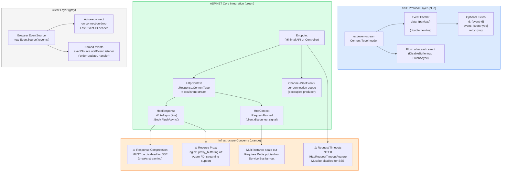

# 4.132 — Server-Sent Events Manual: Streaming Without SignalR

---

## PART 0 — Navigation & Context

### Where This Topic Sits in the ASP.NET Core Hierarchy

```
ASP.NET Core Mastery
│
├── E. Middleware Pipeline            (4.049–4.063)
│     └── Response streaming passes through the pipeline before headers flush
│
├── G. Minimal APIs                   (4.078–4.097)
│     └── 4.088  Streaming Responses: IAsyncEnumerable<T> and SSE
│
├── I. HTTP Fundamentals              (4.123–4.133)
│     ├── 4.123  HttpContext Deep Dive
│     ├── 4.124  HttpRequest
│     ├── 4.125  HttpResponse
│     ├── 4.126  Cookies
│     ├── 4.127  HTTP/2
│     ├── 4.128  Sessions
│     ├── 4.129  HTTP/3 and QUIC
│     ├── 4.130  Request Body Reading Patterns
│     ├── 4.131  WebSockets Manual
│     ├── 4.132  Server-Sent Events Manual  ◄ YOU ARE HERE
│     └── 4.133  HTTP Connection Features
│
├── Q. SignalR & Real-Time            (4.219–4.230)
│     ├── 4.219  SignalR Architecture
│     ├── 4.221  SignalR Transports (SSE is one fallback transport)
│     └── 4.229  SSE with IAsyncEnumerable<T>
│
└── R. Background Services            (4.231–4.239)
      └── Channel<T>-based producers feed SSE streams
```

### What You Need Before This

- **[[4.125 — HttpResponse: Writing Status, Headers, Cookies, and Streaming Body]]** — SSE is built by writing to `HttpResponse.Body` directly; you must understand `HasStarted`, `WriteAsync`, and header mutation rules.
- **[[4.123 — HttpContext Deep Dive: Features, Items, and Request Lifetime]]** — `HttpContext.RequestAborted` is the primary mechanism for detecting client disconnection, which terminates the SSE loop.
- **[[4.049 — The Middleware Pipeline: Request Delegation Chain]]** — response compression middleware (`UseResponseCompression`) must be disabled for SSE endpoints; understanding the pipeline explains why.
- **[[4.234 — Queued Background Tasks: Channel<T>-Based Producer/Consumer]]** — the typical SSE server architecture connects a `Channel<T>` producer (business events) to an SSE consumer (the HTTP response writer).

### What This Unlocks After

- **[[4.229 — Server-Sent Events with IAsyncEnumerable<T>: Push Without SignalR]]** — the higher-level abstraction over the raw SSE mechanics covered here.
- **[[4.219 — SignalR Architecture: Hubs, Connections, and Transport Negotiation]]** — understanding raw SSE makes SignalR's SSE fallback transport fully transparent.
- **[[4.131 — WebSockets Manual: Low-Level WebSocket API Without SignalR]]** — the natural comparison: SSE (HTTP/1.1 unidirectional) vs WebSockets (full-duplex upgrade).
- **[[4.088 — Streaming Responses: IAsyncEnumerable<T> and Server-Sent Events]]** — the Minimal API pattern that abstracts the raw SSE loop.

### Why This Matters at Scale

SSE is the highest-value real-time primitive for read-heavy, server-to-client data feeds — order book updates, shipment status pushes, live inventory counts — because it uses standard HTTP/1.1 (no protocol upgrade, no proxy negotiation), survives load balancers that terminate WebSockets, and is natively reconnect-aware in every browser. Getting the manual implementation right means understanding precisely when Kestrel flushes bytes, how response compression silently breaks the protocol, and how `Channel<T>` decoupling prevents one slow client from blocking all event production.

---

## PART 1 — The Core Mental Model

### The Fundamental Rule

> **Server-Sent Events is HTTP/1.1 with the response body kept permanently open: the server writes newline-delimited `data:` lines to a never-closed `text/event-stream` response, the browser's `EventSource` API reads each flush as an event, and the TCP connection itself is the only state — no protocol upgrade, no handshake, no server-side session object. The practical consequence is that every SSE connection holds one Kestrel thread-pool slot and one `IServiceScope` for its entire open lifetime, which on a 10,000-concurrent-client system makes resource management the central engineering concern.**

### The Plain-Language Analogy

Think of SSE as a newspaper delivery service where the printing press (server) never stops running and keeps feeding pages out of a slot in the subscriber's door (the open HTTP connection). The subscriber (browser `EventSource`) doesn't knock, doesn't ask questions — they just read pages as they slide through. If the slot jams (connection drops), the subscriber knocks again (automatic reconnect via `Last-Event-ID`) and the press picks up from the last delivered page number. The subscriber can only receive — they cannot send a message back through the slot.

The analogy holds for the response-compression gotcha: imagine the newspaper is shrink-wrapped before going through the slot (Gzip compression). The browser receives the compressed data but the `EventSource` API cannot unwrap it on the fly — it needs the entire compressed stream to decompress. The subscriber blocks at the slot, waiting for the wrap that never ends. This is exactly what happens when response compression middleware is active for an SSE endpoint.

The analogy holds for slow clients: if one subscriber's slot is clogged (slow network), the press does not stop printing for everyone. Each subscriber has their own slot with its own buffer (the `Channel<T>` per-connection queue).

### The Taxonomy Diagram



---

## PART 2 — Deep Mechanics

### 2.1 — The SSE Wire Protocol: Exactly What Kestrel Must Write

SSE is defined by the W3C `text/event-stream` MIME type and a simple line-based format. Every byte your server writes matters — a missing newline stalls the browser's event parser.

```
Pipeline position for an SSE endpoint:

──► ExceptionHandler ──► HSTS ──► StaticFiles ──► Routing ──► Auth ──► Authorization ──► [SSE Endpoint]
                                                                                              │
                                              Response body stays open indefinitely ◄─────────┘
                                              (this middleware chain is suspended until client disconnects)
```

**HTTP wire format — complete SSE handshake and event stream:**

```http
// HTTP request (client initiates SSE):
GET /orders/events HTTP/1.1
Host: api.example.com
Accept: text/event-stream
Cache-Control: no-cache
Authorization: Bearer eyJhbGci...
Last-Event-ID: 1042           ← browser sends this on reconnect (last event it received)

// HTTP response (server opens SSE stream):
HTTP/1.1 200 OK
Content-Type: text/event-stream
Cache-Control: no-cache, no-store
X-Accel-Buffering: no          ← tells nginx to disable proxy buffering
Connection: keep-alive

// ── First event (flushed immediately after headers) ──────────────────
id: 1043
event: order-created
data: {"orderId":"ORD-9876","status":"pending","amount":149.99}

                               ← blank line: event boundary (double \n after data)
// ── Second event (flushed 3 seconds later) ───────────────────────────
id: 1044
event: order-status-changed
data: {"orderId":"ORD-9876","status":"confirmed"}

// ── Heartbeat comment (every 15s to keep load balancer alive) ────────
: heartbeat

// ── Reconnect advisory ────────────────────────────────────────────────
retry: 5000
data: {"reconnect":"advised"}

```

**Event field rules:**

- `data:` — the payload line. Multiple `data:` lines are concatenated with `\n` into one event string.
- `id:` — the event ID. Browser stores this; sends as `Last-Event-ID` header on reconnect.
- `event:` — the event type name. Client uses `addEventListener('order-created', ...)` to subscribe to named events. Default (no `event:` field) dispatches as `message`.
- `retry:` — tells the browser how long to wait before reconnecting (milliseconds). Override the default 3s.
- `:` (colon prefix) — comment line. Ignored by the client parser. Used for heartbeats to prevent proxy timeouts.
- Blank line (empty line / `\n\n`) — **event boundary**. Without it, the browser's parser holds the event in a buffer forever. This is the most common implementation bug.

**Framework source behavior (approximate) — how Kestrel flushes:**

```csharp
// ASP.NET Core internally (approximate) — what happens when you call WriteAsync then FlushAsync:

// Step 1: WriteAsync buffers bytes into IHttpResponseBodyFeature's internal pipe
await response.WriteAsync("data: {\"orderId\":\"ORD-9876\"}\n\n");

// Step 2: FlushAsync forces Kestrel to write the pipe buffer to the OS socket send buffer
// This causes the TCP stack to segment and transmit the data
// Without FlushAsync, Kestrel may batch the write with the next one (Nagle-like buffering)
await response.Body.FlushAsync(cancellationToken);

// IHttpResponseBodyFeature.StartAsync() is called implicitly on first write
// → sets response.HasStarted = true
// → flushes headers to wire (after this point, headers are read-only)
```

**Runtime cost:**

- `~1 long-lived HTTP connection` per SSE subscriber (held for the entire stream duration)
- `~1 IServiceScope` created per SSE connection (lives for the connection lifetime, not request lifetime — these are the same for SSE since the request IS the connection)
- `~1 Channel<SseEvent>` allocated per connection for per-subscriber buffering
- `~1 async state machine` suspended at each `await` in the SSE write loop (parked on thread pool, not blocking a thread)
- `O(1)` memory per idle SSE connection (no active thread while waiting for next event)

> [!IMPORTANT] SSE connections are **long-lived HTTP requests**. A server with 5,000 concurrent SSE clients has 5,000 long-lived requests in flight simultaneously. Each holds a `Kestrel` connection (socket), an `IServiceScope`, and whatever you allocate per connection. The thread pool is not the bottleneck (async/await parks the continuation) — the bottleneck is socket file descriptors and heap memory. Plan for ~5–20KB per idle connection on modern .NET 8.

---

### 2.2 — Writing a Correct SSE Endpoint: The Minimum Viable Implementation

```csharp
// Pipeline position: endpoint handler (after auth, after routing)
// This is the lowest-level correct implementation — no abstractions

app.MapGet("/orders/events", async (HttpContext context) =>
{
    // Step 1: Set SSE headers BEFORE any write (headers are immutable after first write)
    context.Response.Headers.ContentType = "text/event-stream";
    context.Response.Headers.CacheControl = "no-cache, no-store";
    context.Response.Headers["X-Accel-Buffering"] = "no"; // nginx: disable proxy buffering
    // Do NOT set Content-Length — SSE is an indefinite stream

    // Step 2: Disable response compression for this connection
    // (ResponseCompressionMiddleware wraps IHttpResponseBodyFeature — SSE must write raw bytes)
    // If UseResponseCompression is in your pipeline, add this:
    context.Features.Get<IHttpsCompressionFeature>()?.Mode = HttpsCompressionMode.Suppress;

    // Step 3: Disable request timeouts (.NET 8+)
    // Without this, the default 30s request timeout terminates long SSE connections
    context.Features.Get<IHttpRequestTimeoutFeature>()?.DisableTimeout();

    // Step 4: Write and flush the initial connection-confirmation comment
    // This forces headers to flush and confirms the connection to the browser
    await context.Response.WriteAsync(": connected\n\n", context.RequestAborted);
    await context.Response.Body.FlushAsync(context.RequestAborted);

    // Step 5: Stream events until client disconnects
    // context.RequestAborted is cancelled when the browser closes the tab or connection drops
    var ct = context.RequestAborted;
    long eventId = 0;

    try
    {
        while (!ct.IsCancellationRequested)
        {
            // Simulate an event source — in production this reads from a Channel<T>
            await Task.Delay(TimeSpan.FromSeconds(2), ct);

            // Write SSE event
            await context.Response.WriteAsync($"id: {++eventId}\n", ct);
            await context.Response.WriteAsync($"event: heartbeat\n", ct);
            await context.Response.WriteAsync($"data: {{\"ts\":\"{DateTimeOffset.UtcNow:O}\"}}\n", ct);
            await context.Response.WriteAsync("\n", ct); // ← event boundary (REQUIRED)
            await context.Response.Body.FlushAsync(ct);  // ← force byte transmission
        }
    }
    catch (OperationCanceledException)
    {
        // Normal: client disconnected — RequestAborted was cancelled
        // Do not log as error; do not rethrow
    }
});
```

> [!WARNING] The blank line (`\n`) after the last `data:` field is **mandatory**. It is the SSE event boundary. Without it, the browser's `EventSource` parser accumulates all writes into its internal buffer and never dispatches any events. This is the single most common SSE implementation bug and it produces zero errors — just silent non-delivery. The correct pattern: end every event with `\n\n` (one blank line = two `\n` characters — one ending the last field, one as the boundary).

---

### 2.3 — Response Compression: The Silent Stream Breaker

Response compression middleware (`UseResponseCompression`) wraps `IHttpResponseBodyFeature` with a compressed wrapper that buffers bytes to build a compressed block. SSE requires every event to be flushed immediately as raw bytes. When compression is active, `FlushAsync` flushes the compressed buffer — but the compressed block is only meaningful when the compressor decides to emit one. The result is the browser never receives any events, or receives them in large delayed batches.

```
Without compression:
  WriteAsync("data: {...}\n\n") → Kestrel pipe → TCP segment → Browser EventSource ✅
  FlushAsync()                 → forces TCP flush immediately

With compression middleware active (WRONG):
  WriteAsync("data: {...}\n\n") → GzipStream buffer → (waits for more data to compress efficiently)
  FlushAsync()                 → flushes GzipStream internal buffer → may or may not emit
                                → browser receives nothing for minutes ❌

With compression correctly suppressed for SSE:
  context.Features.Get<IHttpsCompressionFeature>()?.Mode = HttpsCompressionMode.Suppress;
  // OR: configure compression middleware to exclude text/event-stream content type
```

**Configuring compression exclusion at the middleware level (preferred for production):**

```csharp
// In Program.cs — exclude text/event-stream from compression at the middleware level
// so individual endpoints don't need to remember to suppress it

builder.Services.AddResponseCompression(opts =>
{
    opts.EnableForHttps = true;
    // MimeTypes that are compressed — explicitly exclude SSE
    opts.MimeTypes = ResponseCompressionDefaults.MimeTypes
        .Where(t => t != "text/event-stream")
        .Concat(new[] { "application/json", "text/plain" });
});

// OR: use the IHttpResponseBodyFeature suppression per-endpoint as shown in the code above
// Both approaches are valid; middleware-level is cleaner for large teams
```

---

### 2.4 — Channel<T> Decoupling: The Production SSE Architecture

The minimal implementation above polls with `Task.Delay`. Real production SSE endpoints are driven by domain events (order status changes, inventory updates, payment completions). The correct architecture decouples event production from per-connection event delivery using `System.Threading.Channels`.

```
Architecture diagram:

  [Order Service] ──publishes──► EventBroadcaster (Singleton)
                                        │
                                        ├──► Channel<SseEvent> (per connection A)
                                        ├──► Channel<SseEvent> (per connection B)
                                        └──► Channel<SseEvent> (per connection C)

  Connection A SSE endpoint ──reads from──► Channel A ──writes──► HTTP Response A
  Connection B SSE endpoint ──reads from──► Channel B ──writes──► HTTP Response B
```

```csharp
// The event broadcaster — registered as Singleton
// Manages per-connection channels; fan-outs events to all active subscribers
public sealed class OrderEventBroadcaster : IOrderEventBroadcaster, IDisposable
{
    // Thread-safe dictionary of active SSE connections (connectionId → channel writer)
    private readonly ConcurrentDictionary<string, ChannelWriter<OrderSseEvent>> _connections = new();

    // Called by the SSE endpoint when a client connects
    // Returns a ChannelReader<T> the endpoint reads from
    public ChannelReader<OrderSseEvent> Subscribe(string connectionId)
    {
        // Bounded channel: if the client is too slow to consume, we drop old events
        // rather than buffering unboundedly (prevents OOM with 10k+ slow clients)
        var channel = Channel.CreateBounded<OrderSseEvent>(new BoundedChannelOptions(50)
        {
            FullMode = BoundedChannelFullMode.DropOldest, // drop stale events for slow clients
            SingleReader = true,  // only the SSE endpoint reads
            SingleWriter = false  // broadcaster writes; multiple domain events may write
        });

        _connections[connectionId] = channel.Writer;
        return channel.Reader;
    }

    // Called by the SSE endpoint when the client disconnects
    public void Unsubscribe(string connectionId)
    {
        if (_connections.TryRemove(connectionId, out var writer))
        {
            writer.TryComplete(); // signal the reader that no more events will arrive
        }
    }

    // Called by domain services (OrderService, PaymentService, etc.)
    // Fan-out: writes to ALL active connection channels
    // Cost: O(n) where n = active connections — acceptable for n < 10,000
    public void Broadcast(OrderSseEvent evt)
    {
        foreach (var (_, writer) in _connections)
        {
            // TryWrite: non-blocking; drops the event if the channel is full (DropOldest handles this)
            writer.TryWrite(evt);
        }
    }

    public void Dispose()
    {
        foreach (var (_, writer) in _connections.Values)
            writer.TryComplete();
        _connections.Clear();
    }
}

public sealed record OrderSseEvent(
    string EventType,    // "order-created", "order-status-changed", "payment-completed"
    string OrderId,
    string Payload,      // pre-serialized JSON
    long EventId);
```

```csharp
// The SSE endpoint — connects Channel<T> reader to HTTP response writer
app.MapGet("/orders/live", async (
    HttpContext context,
    IOrderEventBroadcaster broadcaster,
    ILogger<Program> logger,
    CancellationToken ct) =>  // auto-bound to HttpContext.RequestAborted
{
    // Unique ID for this SSE connection
    var connectionId = context.Connection.ConnectionId;

    // Pipeline position: endpoint, after UseAuthentication and UseAuthorization
    // Context.User is populated — we can filter events by tenant/user here
    var tenantId = context.User.FindFirst("tenant_id")?.Value;

    // SSE headers
    context.Response.Headers.ContentType = "text/event-stream";
    context.Response.Headers.CacheControl = "no-cache, no-store";
    context.Response.Headers["X-Accel-Buffering"] = "no";
    context.Features.Get<IHttpRequestTimeoutFeature>()?.DisableTimeout();

    // Subscribe: get a per-connection channel reader
    var reader = broadcaster.Subscribe(connectionId);

    // Send initial "connected" comment — forces header flush to wire
    // Client JavaScript can listen for this to confirm the SSE stream is live
    await context.Response.WriteAsync($": connected to order stream for tenant {tenantId}\n\n", ct);
    await context.Response.Body.FlushAsync(ct);

    // Heartbeat timer — comment every 20s to prevent proxy timeout (nginx default: 60s)
    using var heartbeatTimer = new PeriodicTimer(TimeSpan.FromSeconds(20));
    var heartbeatTask = Task.Run(async () =>
    {
        try
        {
            while (await heartbeatTimer.WaitForNextTickAsync(ct))
            {
                // Write comment (colon prefix) — ignored by EventSource parser, keeps TCP alive
                await context.Response.WriteAsync(": heartbeat\n\n", ct);
                await context.Response.Body.FlushAsync(ct);
            }
        }
        catch (OperationCanceledException) { /* normal on disconnect */ }
    }, ct);

    // Main event loop — reads from channel until client disconnects or channel completes
    try
    {
        await foreach (var evt in reader.ReadAllAsync(ct))
        {
            // Optional: filter events to this tenant only
            // (or use a per-tenant broadcaster for large-scale multi-tenant systems)
            if (evt.Payload.Contains(tenantId ?? string.Empty) || tenantId is null)
            {
                await WriteEventAsync(context.Response, evt, ct);
            }
        }
    }
    catch (OperationCanceledException)
    {
        // Client disconnected — RequestAborted cancelled
        logger.LogInformation("SSE client {ConnectionId} disconnected", connectionId);
    }
    finally
    {
        // Always unsubscribe — removes channel from broadcaster dictionary
        broadcaster.Unsubscribe(connectionId);
    }
});

// Helper: writes a single SSE event to the response and flushes
static async Task WriteEventAsync(HttpResponse response, OrderSseEvent evt, CancellationToken ct)
{
    // Write fields — each line terminated with \n
    await response.WriteAsync($"id: {evt.EventId}\n", ct);
    await response.WriteAsync($"event: {evt.EventType}\n", ct);
    await response.WriteAsync($"data: {evt.Payload}\n", ct);
    await response.WriteAsync("\n", ct); // ← event boundary: MANDATORY blank line

    // Flush: force Kestrel to transmit buffered bytes to the OS socket immediately
    // Without this, events may be batched and delivered seconds late
    await response.Body.FlushAsync(ct);
    // Cost: ~1 syscall to flush; unavoidable for real-time delivery
}
```

---

### 2.5 — Client Reconnection and Last-Event-ID

The browser `EventSource` API has built-in reconnection. When the connection drops, it waits `retry` milliseconds (default 3000ms) and reconnects with a `Last-Event-ID` header containing the last event ID the browser received. Your server **must** use this to resume from the correct position — otherwise clients receive duplicate or missed events on every reconnect.

```
Reconnect sequence:

  Client ──► GET /orders/live HTTP/1.1 (Last-Event-ID: 1042)
  Server ──► HTTP/1.1 200 OK (text/event-stream)
  Server ──► id: 1043 / event: order-created / data: {...} (resumes from 1043)
  Server ──► id: 1044 / event: ...

  [connection drops]

  [3 seconds later — browser auto-reconnects]

  Client ──► GET /orders/live HTTP/1.1 (Last-Event-ID: 1044)
  Server ──► HTTP/1.1 200 OK (text/event-stream)
  Server ──► id: 1045 / event: ... (correctly resumes from 1045)
```

```csharp
// Handling Last-Event-ID for resumption (event log / replay pattern)
app.MapGet("/orders/live", async (
    HttpContext context,
    IOrderEventStore eventStore,       // replay events from durable store
    IOrderEventBroadcaster broadcaster,
    CancellationToken ct) =>
{
    context.Response.Headers.ContentType = "text/event-stream";
    context.Response.Headers.CacheControl = "no-cache, no-store";
    context.Response.Headers["X-Accel-Buffering"] = "no";
    context.Features.Get<IHttpRequestTimeoutFeature>()?.DisableTimeout();

    // Read Last-Event-ID from reconnect header
    long lastEventId = 0;
    if (context.Request.Headers.TryGetValue("Last-Event-ID", out var lastIdHeader)
        && long.TryParse(lastIdHeader, out var parsedId))
    {
        lastEventId = parsedId;
    }

    // Subscribe to live events BEFORE replaying history
    // This prevents a race condition: events emitted between replay-end and subscribe-start
    // would be missed. Subscribe first, then replay, then read from channel.
    var connectionId = context.Connection.ConnectionId;
    var liveReader = broadcaster.Subscribe(connectionId);

    // Flush headers immediately
    await context.Response.WriteAsync(": connected\n\n", ct);
    await context.Response.Body.FlushAsync(ct);

    try
    {
        // Replay missed events from durable store (e.g., Redis sorted set, SQL table)
        // Cost: ~1 database query per reconnect — acceptable; happens only on reconnect
        await foreach (var evt in eventStore.GetEventsAfterAsync(lastEventId, ct))
        {
            await WriteEventAsync(context.Response, evt, ct);
        }

        // Switch to live event stream from Channel
        await foreach (var evt in liveReader.ReadAllAsync(ct))
        {
            await WriteEventAsync(context.Response, evt, ct);
        }
    }
    catch (OperationCanceledException) { /* client disconnected */ }
    finally
    {
        broadcaster.Unsubscribe(connectionId);
    }
});
```

> [!NOTE] The subscribe-before-replay ordering is critical. If you replay first, then subscribe, any events emitted during the replay window are permanently lost for this client. Subscribe to the live channel first (even though you won't read from it yet), complete the replay, then switch to the live channel. This guarantees at-least-once delivery on reconnect with no gaps.

---

### 2.6 — Named Events and Multi-Type Streams

A single SSE connection can carry multiple event types. Clients subscribe to specific types using `addEventListener`. This avoids the overhead of multiple SSE connections for different event categories.

```http
// Server sends mixed event types on the same stream:
id: 100
event: order-created
data: {"orderId":"ORD-1","amount":99.99}

id: 101
event: inventory-updated
data: {"sku":"WIDGET-42","quantity":5}

id: 102
event: payment-completed
data: {"orderId":"ORD-1","transactionId":"TXN-abc"}

```

```javascript
// Client-side JavaScript — subscribing to specific event types
const es = new EventSource('/orders/live', { withCredentials: true });

// Named event type listener — only fires for event: order-created
es.addEventListener('order-created', (event) => {
    const order = JSON.parse(event.data);
    updateOrderGrid(order);
});

// Named event type listener — only fires for event: inventory-updated
es.addEventListener('inventory-updated', (event) => {
    const inv = JSON.parse(event.data);
    updateInventoryBadge(inv.sku, inv.quantity);
});

// Generic message listener — fires only for events WITHOUT an event: field
es.onmessage = (event) => {
    console.log('Generic message:', event.data);
};

// Connection/error handling
es.onerror = (event) => {
    if (es.readyState === EventSource.CLOSED) {
        console.log('Connection closed — browser will reconnect automatically');
    }
};
```

**HTTP wire format — complete named event:**

```http
id: 100
event: order-created
data: {"orderId":"ORD-1","customerId":"CUST-99","amount":99.99,"currency":"USD"}

```

---

### 2.7 — SSE vs WebSockets vs Long Polling: The HTTP-Level Differences

```
SSE (text/event-stream):
  ─► GET /events HTTP/1.1        [standard request]
  ◄─ HTTP/1.1 200 OK             [standard response, never ends]
  ◄─ data: event1\n\n            [server pushes, client reads]
  ◄─ data: event2\n\n
  ✦ Unidirectional: server→client only
  ✦ HTTP/1.1 native — works through all HTTP proxies
  ✦ Browser auto-reconnects (Last-Event-ID)
  ✦ NOT for client→server communication

WebSockets:
  ─► GET /ws HTTP/1.1
  ─► Upgrade: websocket
  ◄─ HTTP/1.1 101 Switching Protocols
  ──► [binary/text frames in both directions]
  ✦ Full-duplex — client AND server can send at any time
  ✦ Protocol upgrade — some proxies block or terminate
  ✦ No automatic reconnect — must implement manually

Long Polling:
  ─► GET /events HTTP/1.1        [client polls]
  ◄─ [server holds open for up to 30s]
  ◄─ HTTP/1.1 200 OK             [response with pending events]
  ─► GET /events HTTP/1.1        [client immediately re-polls]
  ✦ Works everywhere — even HTTP/1.0 proxies
  ✦ One request per batch of events — higher overhead
  ✦ Higher latency than SSE or WebSockets
```

---

## PART 3 — Production Code Patterns

### Pattern 1 — The Typed SSE Writer: Reusable Abstraction for All SSE Endpoints

Rather than writing raw SSE strings in every endpoint, encapsulate the protocol in a typed writer that enforces correct formatting.

```csharp
// Domain: order management platform — shared SSE infrastructure across all event streams

public sealed class SseWriter
{
    private readonly HttpResponse _response;
    private readonly CancellationToken _ct;
    private long _eventId;

    public SseWriter(HttpContext context, long resumeFromEventId = 0)
    {
        _response = context.Response;
        _ct = context.RequestAborted;
        _eventId = resumeFromEventId;

        // Configure response for SSE — must happen before any write
        _response.Headers.ContentType = "text/event-stream";
        _response.Headers.CacheControl = "no-cache, no-store";
        _response.Headers["X-Accel-Buffering"] = "no"; // nginx passthrough

        // Disable request timeout for this long-lived connection (.NET 8+)
        context.Features.Get<IHttpRequestTimeoutFeature>()?.DisableTimeout();

        // Suppress response compression — SSE must stream raw bytes
        context.Features.Get<IHttpsCompressionFeature>()?.Mode = HttpsCompressionMode.Suppress;
    }

    // Writes a connection-confirmation comment and flushes headers to wire
    public async Task SendConnectedAsync()
    {
        await _response.WriteAsync(": connected\n\n", _ct);
        await _response.Body.FlushAsync(_ct);
    }

    // Sends a named event with JSON payload
    public async Task SendEventAsync<T>(string eventType, T payload)
    {
        var json = JsonSerializer.Serialize(payload);
        var id = Interlocked.Increment(ref _eventId);

        await _response.WriteAsync($"id: {id}\n", _ct);
        await _response.WriteAsync($"event: {eventType}\n", _ct);
        await _response.WriteAsync($"data: {json}\n", _ct);
        await _response.WriteAsync("\n", _ct); // event boundary
        await _response.Body.FlushAsync(_ct);
        // Cost: 4 writes + 1 flush per event — minimal; each WriteAsync appends to Kestrel pipe
    }

    // Sends a heartbeat comment to prevent proxy timeout (call every ~20s)
    public async Task SendHeartbeatAsync()
    {
        await _response.WriteAsync(": heartbeat\n\n", _ct);
        await _response.Body.FlushAsync(_ct);
    }

    // Sends a retry advisory (tells client how long to wait before reconnecting)
    public async Task SendRetryAsync(int milliseconds)
    {
        await _response.WriteAsync($"retry: {milliseconds}\n\n", _ct);
        await _response.Body.FlushAsync(_ct);
    }
}

// Usage in endpoint:
app.MapGet("/shipments/{shipmentId}/track", async (
    string shipmentId,
    HttpContext context,
    IShipmentEventBroadcaster broadcaster,
    CancellationToken ct) =>
{
    var lastId = long.TryParse(
        context.Request.Headers["Last-Event-ID"].FirstOrDefault(), out var id) ? id : 0;

    var writer = new SseWriter(context, lastId);
    await writer.SendConnectedAsync();
    await writer.SendRetryAsync(5000); // tell client: reconnect after 5s on drop

    var connectionId = context.Connection.ConnectionId;
    var reader = broadcaster.Subscribe(connectionId, shipmentId);

    try
    {
        await foreach (var evt in reader.ReadAllAsync(ct))
        {
            await writer.SendEventAsync(evt.EventType, new
            {
                shipmentId,
                status = evt.Status,
                location = evt.Location,
                timestamp = evt.OccurredAt
            });
        }
    }
    catch (OperationCanceledException) { /* client disconnected */ }
    finally
    {
        broadcaster.Unsubscribe(connectionId);
    }
})
.RequireAuthorization("ShipmentOwner"); // authorization applied to SSE endpoint like any other

// HTTP wire format:
// GET /shipments/SHP-4321/track HTTP/1.1
// Authorization: Bearer eyJ...
// Last-Event-ID: 0
//
// HTTP/1.1 200 OK
// Content-Type: text/event-stream
// Cache-Control: no-cache, no-store
// X-Accel-Buffering: no
//
// : connected
//
// retry: 5000
//
// id: 1
// event: location-update
// data: {"shipmentId":"SHP-4321","status":"in-transit","location":"Chicago Hub","timestamp":"..."}
//
```

---

### Pattern 2 — The Per-Tenant SSE Broadcaster with Backpressure Handling

At scale, a global broadcaster that holds one channel per connection across all tenants consumes too much memory and has O(n) fan-out cost where n is total connections across the platform. A per-tenant broadcaster scopes the fan-out to active connections within one tenant.

```csharp
// Domain: SaaS inventory management — per-tenant SSE fan-out

public interface IInventoryEventBroadcaster
{
    ChannelReader<InventorySseEvent> Subscribe(string tenantId, string connectionId);
    void Unsubscribe(string tenantId, string connectionId);
    void Publish(string tenantId, InventorySseEvent evt);
    int GetActiveConnectionCount(string tenantId);
}

public sealed class InventoryEventBroadcaster : IInventoryEventBroadcaster, IDisposable
{
    // Two-level dictionary: tenantId → (connectionId → channelWriter)
    // ConcurrentDictionary at both levels for thread-safe connect/disconnect
    private readonly ConcurrentDictionary<string,
        ConcurrentDictionary<string, ChannelWriter<InventorySseEvent>>> _tenants = new();

    public ChannelReader<InventorySseEvent> Subscribe(string tenantId, string connectionId)
    {
        var tenantConnections = _tenants.GetOrAdd(tenantId,
            _ => new ConcurrentDictionary<string, ChannelWriter<InventorySseEvent>>());

        var channel = Channel.CreateBounded<InventorySseEvent>(new BoundedChannelOptions(100)
        {
            FullMode = BoundedChannelFullMode.DropOldest, // backpressure: drop stale inventory events
            SingleReader = true,
            SingleWriter = false
        });

        tenantConnections[connectionId] = channel.Writer;
        return channel.Reader;
    }

    public void Unsubscribe(string tenantId, string connectionId)
    {
        if (_tenants.TryGetValue(tenantId, out var connections)
            && connections.TryRemove(connectionId, out var writer))
        {
            writer.TryComplete();
            // Clean up empty tenant dictionaries to avoid memory leak for inactive tenants
            if (connections.IsEmpty)
                _tenants.TryRemove(tenantId, out _);
        }
    }

    public void Publish(string tenantId, InventorySseEvent evt)
    {
        if (!_tenants.TryGetValue(tenantId, out var connections)) return;

        // Fan-out only to this tenant's connections — O(n) where n = connections for THIS tenant
        foreach (var (_, writer) in connections)
        {
            writer.TryWrite(evt); // non-blocking; BoundedChannelFullMode handles slow clients
        }
    }

    public int GetActiveConnectionCount(string tenantId)
        => _tenants.TryGetValue(tenantId, out var conns) ? conns.Count : 0;

    public void Dispose()
    {
        foreach (var (_, connections) in _tenants)
        foreach (var (_, writer) in connections)
            writer.TryComplete();
        _tenants.Clear();
    }
}

// Registration:
builder.Services.AddSingleton<IInventoryEventBroadcaster, InventoryEventBroadcaster>();

// Publishing from domain service (e.g., after SaveChanges in EF Core):
// Cost: O(m) where m = connections for this tenant — typically small
public async Task UpdateStockAsync(string tenantId, string sku, int delta, CancellationToken ct)
{
    await _db.StockItems
        .Where(s => s.TenantId == tenantId && s.Sku == sku)
        .ExecuteUpdateAsync(s => s.SetProperty(x => x.Quantity, x => x.Quantity + delta), ct);

    // Publish SSE event after successful DB write
    _broadcaster.Publish(tenantId, new InventorySseEvent("inventory-updated", sku,
        JsonSerializer.Serialize(new { sku, delta, timestamp = DateTimeOffset.UtcNow })));
}
```

---

### Pattern 3 — Authentication and Authorization on SSE Endpoints

SSE endpoints are regular HTTP endpoints — JWT Bearer authentication and policy-based authorization apply identically to SSE as to any other endpoint.

```csharp
// Domain: payment dashboard — authorized SSE stream for payment events

// ⚠️ WRONG: Browser EventSource API cannot set Authorization headers
// The following JavaScript DOES NOT WORK:
// const es = new EventSource('/payments/live', {
//     headers: { 'Authorization': 'Bearer ...' } // EventSource has no headers option
// });

// ✅ CORRECT APPROACH 1: Use cookies for SSE auth (browser sends cookies automatically)
// On login, set an HttpOnly cookie. EventSource sends it automatically.
// Server uses cookie authentication scheme for SSE endpoints.
app.MapGet("/payments/live", async (HttpContext context, CancellationToken ct) =>
{
    // context.User is populated by cookie authentication — no custom header needed
    var userId = context.User.FindFirst("sub")!.Value;
    // ... SSE stream
})
.RequireAuthorization("PaymentsDashboard"); // cookie auth provides the principal

// ✅ CORRECT APPROACH 2: Token-in-query-string for SSE (trade-off: token in server logs)
// Client: new EventSource(`/payments/live?token=${jwtToken}`)
// Server: extract token from query string and validate manually

app.MapGet("/payments/live", async (
    HttpContext context,
    [FromQuery] string? token,
    IJwtValidator jwtValidator,
    CancellationToken ct) =>
{
    if (token is null)
    {
        context.Response.StatusCode = 401;
        return;
    }

    var principal = await jwtValidator.ValidateAsync(token, ct);
    if (principal is null)
    {
        context.Response.StatusCode = 401;
        return;
    }

    // Manually set the user principal since JWT middleware didn't validate this
    context.User = principal;
    var userId = principal.FindFirst("sub")!.Value;

    // SSE headers and stream
    context.Response.Headers.ContentType = "text/event-stream";
    context.Response.Headers.CacheControl = "no-cache, no-store";
    context.Features.Get<IHttpRequestTimeoutFeature>()?.DisableTimeout();

    await context.Response.WriteAsync(": connected\n\n", ct);
    await context.Response.Body.FlushAsync(ct);

    // ... SSE event loop
})
.AllowAnonymous(); // [AllowAnonymous] because we do manual auth above

// ✅ CORRECT APPROACH 3: Ticket endpoint pattern (most secure)
// 1. Client calls POST /payments/sse-ticket → receives a short-lived opaque token (30s TTL)
// 2. Client connects: new EventSource(`/payments/live?ticket=${shortLivedTicket}`)
// 3. Server validates ticket once on connect, never sends JWT through URL

// HTTP wire format (approach 2):
// GET /payments/live?token=eyJ... HTTP/1.1
// Host: dashboard.example.com
// Accept: text/event-stream
//
// HTTP/1.1 200 OK
// Content-Type: text/event-stream
//
// : connected
//
// id: 1
// event: payment-received
// data: {"amount":299.99,"currency":"USD","merchantId":"M-123"}
//
```

---

### Pattern 4 — Multi-Instance Scale-Out with Redis Pub/Sub

A single-instance SSE broadcaster (Pattern 2) breaks in multi-instance deployments — a client connected to Instance A won't receive events published to Instance B's broadcaster. Redis Pub/Sub (or a Service Bus topic) provides the fan-out across instances.

```csharp
// Domain: logistics platform — multi-instance deployment behind a load balancer

public sealed class RedisBackedShipmentBroadcaster : IShipmentEventBroadcaster, IAsyncDisposable
{
    private readonly IConnectionMultiplexer _redis;
    private readonly ILogger<RedisBackedShipmentBroadcaster> _logger;

    // In-process channels for connections on THIS instance only
    private readonly ConcurrentDictionary<string, ChannelWriter<ShipmentSseEvent>> _localConnections = new();

    private ISubscriber? _subscriber;

    public RedisBackedShipmentBroadcaster(IConnectionMultiplexer redis,
        ILogger<RedisBackedShipmentBroadcaster> logger)
    {
        _redis = redis;
        _logger = logger;
    }

    // Called once on startup — subscribe to Redis channel for cross-instance fan-out
    public async Task StartAsync(CancellationToken ct)
    {
        _subscriber = _redis.GetSubscriber();

        // Subscribe to all shipment events published by ANY instance
        await _subscriber.SubscribeAsync(
            RedisChannel.Literal("shipment-events"),
            (_, message) =>
            {
                if (!message.HasValue) return;
                var evt = JsonSerializer.Deserialize<ShipmentSseEvent>(message!);
                if (evt is null) return;

                // Fan-out to all connections on THIS instance
                foreach (var (_, writer) in _localConnections)
                    writer.TryWrite(evt);
            });
    }

    public ChannelReader<ShipmentSseEvent> Subscribe(string connectionId)
    {
        var channel = Channel.CreateBounded<ShipmentSseEvent>(
            new BoundedChannelOptions(50) { FullMode = BoundedChannelFullMode.DropOldest });
        _localConnections[connectionId] = channel.Writer;
        return channel.Reader;
    }

    public void Unsubscribe(string connectionId)
    {
        if (_localConnections.TryRemove(connectionId, out var writer))
            writer.TryComplete();
    }

    // Publish via Redis — ALL instances will receive and fan-out to their local connections
    public async Task PublishAsync(ShipmentSseEvent evt, CancellationToken ct)
    {
        var json = JsonSerializer.Serialize(evt);
        // Cost: ~1 Redis PUBLISH command — sub-millisecond for local Redis
        await _subscriber!.PublishAsync(
            RedisChannel.Literal("shipment-events"),
            json,
            CommandFlags.FireAndForget); // fire-and-forget: don't block event producer
    }

    public async ValueTask DisposeAsync()
    {
        if (_subscriber is not null)
            await _subscriber.UnsubscribeAllAsync();
        foreach (var (_, writer) in _localConnections.Values)
            writer.TryComplete();
    }
}

// Registration:
builder.Services.AddSingleton<IConnectionMultiplexer>(
    sp => ConnectionMultiplexer.Connect(connectionString));
builder.Services.AddSingleton<IShipmentEventBroadcaster, RedisBackedShipmentBroadcaster>();
// Start the Redis subscriber on app startup:
builder.Services.AddHostedService<ShipmentBroadcasterStartup>();
```

---

### Pattern 5 — Graceful SSE Endpoint Shutdown During Deployment

During rolling deployments, in-flight SSE connections must be given a grace period to drain. The `IHostApplicationLifetime.ApplicationStopping` token signals shutdown; SSE endpoints should detect it and send a close advisory before the connection terminates.

```csharp
// Domain: order management — graceful SSE drain on SIGTERM

app.MapGet("/orders/live", async (
    HttpContext context,
    IOrderEventBroadcaster broadcaster,
    IHostApplicationLifetime appLifetime,
    CancellationToken ct) =>
{
    // Combine: cancel on either client disconnect OR application stopping
    using var combined = CancellationTokenSource.CreateLinkedTokenSource(
        ct,                              // client disconnect (HttpContext.RequestAborted)
        appLifetime.ApplicationStopping); // SIGTERM / graceful shutdown

    var connectionId = context.Connection.ConnectionId;
    var writer = new SseWriter(context);
    await writer.SendConnectedAsync();

    var reader = broadcaster.Subscribe(connectionId);

    try
    {
        await foreach (var evt in reader.ReadAllAsync(combined.Token))
        {
            await writer.SendEventAsync(evt.EventType, evt.Payload);
        }
    }
    catch (OperationCanceledException) when (appLifetime.ApplicationStopping.IsCancellationRequested)
    {
        // Application is shutting down — send advisory before closing
        // Client EventSource will reconnect to the new instance after retry delay
        try
        {
            // Reset token to allow writing the shutdown advisory
            await context.Response.WriteAsync("event: server-restart\n", CancellationToken.None);
            await context.Response.WriteAsync("data: {\"reconnect\":true,\"retryMs\":3000}\n\n",
                CancellationToken.None);
            await context.Response.Body.FlushAsync(CancellationToken.None);
        }
        catch { /* response may already be broken if SIGKILL was sent */ }
    }
    catch (OperationCanceledException)
    {
        // Normal client disconnect
    }
    finally
    {
        broadcaster.Unsubscribe(connectionId);
    }
});
```

---

## PART 4 — Gotchas & Anti-Patterns

### Gotcha 1: Missing the Event Boundary Blank Line

The most common SSE bug. Every event must end with a blank line (`\n\n`). Without it, the browser's SSE parser buffers all received data and never dispatches any events. The server appears to be working (200 OK, data flowing) but the client receives nothing.

```csharp
// ⚠️ WRONG CODE — missing event boundary
await context.Response.WriteAsync($"id: {id}\n");
await context.Response.WriteAsync($"event: order-created\n");
await context.Response.WriteAsync($"data: {json}\n");
// Missing: await context.Response.WriteAsync("\n");  ← event boundary
await context.Response.Body.FlushAsync(ct);

// HTTP consequence (wrong path):
// Browser EventSource receives bytes but never fires any 'message' or named events.
// es.onmessage never fires. No JavaScript error. No browser console warning.
// Bytes accumulate in the browser's SSE parser buffer forever.
// Client developer opens DevTools → Network → EventStream tab → sees raw bytes but zero events.

// ✅ CORRECT CODE
await context.Response.WriteAsync($"id: {id}\n");
await context.Response.WriteAsync($"event: order-created\n");
await context.Response.WriteAsync($"data: {json}\n");
await context.Response.WriteAsync("\n", ct);            // ← REQUIRED: event boundary blank line
await context.Response.Body.FlushAsync(ct);

// HTTP consequence (correct path):
// Browser EventSource dispatches events as each \n\n is received.
// es.addEventListener('order-created', handler) fires correctly.

// WHY: The SSE spec (W3C EventSource) defines an event as a block of field lines
// terminated by a blank line. The parser state machine holds the current event in a
// pending state until it sees an empty line. A FlushAsync without the blank line
// delivers bytes to the browser but the parser does not consider the event complete.
```

---

### Gotcha 2: Response Compression Middleware Buffering the Stream

`UseResponseCompression` is often registered globally in production ASP.NET Core pipelines for bandwidth savings. It wraps `IHttpResponseBodyFeature` with a GzipStream/BrotliStream that buffers bytes to compress them efficiently. SSE streams that flush individual events become silently delayed by minutes as the compressor waits for a full compression block.

```csharp
// ⚠️ WRONG CODE — no compression suppression on SSE endpoint
// Program.cs: app.UseResponseCompression() ← registered globally
app.MapGet("/orders/live", async (HttpContext context, CancellationToken ct) =>
{
    context.Response.Headers.ContentType = "text/event-stream";
    context.Response.Headers.CacheControl = "no-cache, no-store";
    await context.Response.WriteAsync(": connected\n\n", ct);
    await context.Response.Body.FlushAsync(ct); // ⚠️ This flushes the GzipStream buffer,
                                                // but GzipStream doesn't emit bytes until
                                                // it has enough data for an efficient block
    // Client receives nothing for minutes or until the connection closes
});

// HTTP consequence (wrong path):
// HTTP/1.1 200 OK
// Content-Encoding: gzip         ← compression applied
// Transfer-Encoding: chunked
// [no bytes delivered until GzipStream decides to flush — events silently lost]

// ✅ CORRECT CODE — suppress compression for SSE endpoints
app.MapGet("/orders/live", async (HttpContext context, CancellationToken ct) =>
{
    // Suppress compression BEFORE writing headers (must be before first write)
    context.Features.Get<IHttpsCompressionFeature>()?.Mode = HttpsCompressionMode.Suppress;

    context.Response.Headers.ContentType = "text/event-stream";
    context.Response.Headers.CacheControl = "no-cache, no-store";
    await context.Response.WriteAsync(": connected\n\n", ct);
    await context.Response.Body.FlushAsync(ct); // ← raw bytes transmitted immediately ✅
});

// HTTP consequence (correct path):
// HTTP/1.1 200 OK
// Content-Type: text/event-stream
// [no Content-Encoding header — raw bytes]
// : connected
// [events delivered in real-time]

// WHY: UseResponseCompression inserts a compression wrapper around IHttpResponseBodyFeature.
// FlushAsync on the compression wrapper flushes the compressor's internal buffer,
// but the compressor only emits compressed bytes when it has accumulated enough data
// (typically 4-32KB) to produce an efficient block. For SSE events of ~100-500 bytes,
// this threshold is never reached until the connection closes.
```

---

### Gotcha 3: Using CancellationToken.None for the Event Write Loop

Developers who read Gotcha 2 from 4.123 (don't propagate RequestAborted to final writes) sometimes apply that lesson too broadly and use `CancellationToken.None` for the entire SSE write loop. This means the event loop never stops even after the client disconnects — the server continues pulling events from the channel, serializing them, and attempting writes to a closed TCP socket indefinitely.

```csharp
// ⚠️ WRONG CODE — CancellationToken.None for the event loop
app.MapGet("/orders/live", async (HttpContext context, IOrderEventBroadcaster broadcaster) =>
{
    var connectionId = context.Connection.ConnectionId;
    var reader = broadcaster.Subscribe(connectionId);
    context.Response.Headers.ContentType = "text/event-stream";
    await context.Response.WriteAsync(": connected\n\n", CancellationToken.None);
    await context.Response.Body.FlushAsync(CancellationToken.None);

    await foreach (var evt in reader.ReadAllAsync(CancellationToken.None)) // ⚠️ Never cancels!
    {
        await WriteEventAsync(context.Response, evt, CancellationToken.None);
        // If client disconnected: WriteAsync will throw IOException (connection reset)
        // OR silently buffer bytes in Kestrel for a closed socket
    }
    // This loop only exits when the broadcaster calls writer.TryComplete()
    // A client disconnect never causes the loop to exit naturally
});

// HTTP consequence (wrong path):
// Client closes browser tab. Server continues reading events from Channel<T> and
// writing to the closed socket. Kestrel eventually throws IOException.
// Broadcaster.Unsubscribe is never called (finally block not reached due to unhandled exception).
// Channel<T> for this connection leaks in the broadcaster dictionary.

// ✅ CORRECT CODE — use HttpContext.RequestAborted (ct parameter) for the event loop
app.MapGet("/orders/live", async (
    HttpContext context,
    IOrderEventBroadcaster broadcaster,
    CancellationToken ct) => // ← this IS HttpContext.RequestAborted — use it for the loop
{
    var connectionId = context.Connection.ConnectionId;
    var reader = broadcaster.Subscribe(connectionId);
    context.Response.Headers.ContentType = "text/event-stream";

    try
    {
        await context.Response.WriteAsync(": connected\n\n", ct);
        await context.Response.Body.FlushAsync(ct);

        await foreach (var evt in reader.ReadAllAsync(ct)) // ← ct cancels when client disconnects
        {
            await WriteEventAsync(context.Response, evt, ct);
        }
    }
    catch (OperationCanceledException) { /* expected — client disconnected */ }
    finally
    {
        broadcaster.Unsubscribe(connectionId); // ← always reached due to try/finally
    }
});

// HTTP consequence (correct path):
// Client closes tab → ct is cancelled → ReadAllAsync throws OperationCanceledException
// → finally block executes → broadcaster.Unsubscribe called → channel cleaned up.

// WHY: The rule "don't cancel final writes" applies to writes with side effects requiring
// completion (DB commits, payment captures). SSE writes have NO such guarantee — if the
// TCP connection is closed, the write is meaningless. Always use RequestAborted for the
// event loop and ensure cleanup runs in a finally block.
```

---

### Gotcha 4: Not Disabling the Request Timeout on Long-Lived SSE Connections

`.NET 8` introduced `UseRequestTimeouts()` middleware with a default 30-second timeout. An SSE connection that goes quiet (no events, heartbeat not implemented) will be abruptly terminated after 30 seconds with a 504 response, confusing clients that expect a persistent stream.

```csharp
// ⚠️ WRONG CODE — request timeout middleware active, no timeout disable on SSE endpoint
// Program.cs:
app.UseRequestTimeouts(); // ← default 30s timeout applies to ALL endpoints
app.MapGet("/orders/live", async (HttpContext context, CancellationToken ct) =>
{
    context.Response.Headers.ContentType = "text/event-stream";
    // If no events arrive for 30s, the timeout middleware cancels the request
    // Endpoint gets OperationCanceledException from IHttpRequestTimeoutFeature
    // Response: 504 Gateway Timeout (or connection reset, depending on state)
});

// HTTP consequence (wrong path):
// HTTP/1.1 200 OK + first events arrive fine
// [30 seconds of silence]
// Connection reset / 504 timeout
// Browser EventSource reconnects — users see intermittent "connection drops" every 30s

// ✅ CORRECT CODE — disable timeout for SSE endpoints
app.MapGet("/orders/live", async (HttpContext context, CancellationToken ct) =>
{
    // Disable request timeout for this long-lived connection BEFORE any write
    context.Features.Get<IHttpRequestTimeoutFeature>()?.DisableTimeout();

    context.Response.Headers.ContentType = "text/event-stream";
    context.Response.Headers.CacheControl = "no-cache, no-store";
    // ... rest of SSE endpoint
});

// OR: configure endpoint-level timeout policy that disables timeout
// Program.cs:
app.UseRequestTimeouts();
app.MapGet("/orders/live", ...)
   .WithRequestTimeout(TimeSpan.FromHours(2)); // explicit long timeout for SSE
// OR:
app.MapGet("/orders/live", ...)
   .DisableRequestTimeout(); // .NET 8 extension: disable timeout entirely for this endpoint

// HTTP consequence (correct path):
// SSE connection stays open indefinitely — client receives events whenever they arrive.
// Heartbeat comments prevent proxy-level timeouts.

// WHY: UseRequestTimeouts sets a per-request CancellationToken via IHttpRequestTimeoutFeature.
// When the timeout fires, RequestAborted is cancelled, causing all awaited operations to
// throw OperationCanceledException. For SSE this means the connection is torn down on every
// quiet period — the exact behavior SSE is designed to avoid.
```

---

### Gotcha 5: Singleton Broadcaster Holding Stale Channels After Process Restart

When the hosting process restarts (SIGTERM, Kubernetes pod replacement), the `Singleton` broadcaster is disposed and its `_connections` dictionary is cleared. Any persistent store (Redis, DB) that records "active SSE connections" will have stale entries pointing to channels in the old process. Publishing to those stale channels does nothing — the writes succeed (channel buffer accepts them) but no client ever receives them.

```csharp
// ⚠️ WRONG CODE — storing SSE connection IDs in Redis for cross-service awareness
// Service A (on instance 1):
await _redis.SetAddAsync("active-sse-connections", connectionId);

// Service B wants to send a targeted event to a specific SSE connection:
var isActive = await _redis.SetContainsAsync("active-sse-connections", connectionId);
if (isActive)
{
    broadcaster.BroadcastToConnection(connectionId, evt); // ⚠️ connectionId may be on a different
                                                          // instance or in a dead process
}

// HTTP consequence (wrong path):
// Service B believes the connection is active (Redis says so).
// Broadcast silently does nothing — the connection is in another instance's broadcaster.
// Event is permanently lost. Redis set is never cleaned up (leaks for dead connections).

// ✅ CORRECT CODE — SSE is inherently per-instance; use Redis Pub/Sub for cross-instance fan-out
// Each instance subscribes to the relevant Redis channel and fans out to its OWN local connections
// Do NOT track connection IDs in Redis — track event streams (topic-level, not connection-level)

// Service B publishes to a topic:
await _redis.GetSubscriber().PublishAsync("order-events:ORD-1234",
    JsonSerializer.Serialize(evt), CommandFlags.FireAndForget);

// Instance 1 and Instance 2 both receive the Redis message and fan out to their local connections
// No stale connection ID tracking needed

// HTTP consequence (correct path):
// All instances receive the Redis pub/sub message and deliver to their connected clients.
// Dead process connections are automatically cleaned up when IAsyncDisposable.DisposeAsync runs.

// WHY: SSE connections are bounded to a single process instance. The broadcaster is Singleton
// within that instance. Cross-instance coordination must happen at the message/topic level
// (who is interested in topic X), not at the connection level (which TCP socket is active).
// Connection IDs are implementation details of a single process instance — they have no
// meaning to any other process.
```

---

## PART 5 — Performance Implications

### 5.1 — Request Pipeline Characteristics Table

|Scenario|Pipeline Depth|Allocations Per Request/Connection|Approx Latency/Throughput Impact|Recommendation|
|---|---|---|---|---|
|SSE endpoint with no events (idle connection)|Full pipeline depth (suspended at await)|~0 while idle|~0 CPU; ~5–20KB RAM per idle connection|Acceptable; async await parks the continuation off-thread|
|Single `WriteAsync` + `FlushAsync` per event|2 syscalls|~1 string per event (pooled in some paths)|~50–200µs per event delivery|Baseline; unavoidable for correct delivery|
|4x `WriteAsync` + 1 `FlushAsync` (separate field writes)|5 syscalls|~4 strings + 1 flush|~100–300µs per event|Acceptable; consider combining into single WriteAsync below|
|Combined single `WriteAsync` for full event|1 + 1 syscall|~1 string allocation|~50–150µs per event|Best for high-event-rate streams|
|Response compression active (WRONG)|N/A|—|Events delayed seconds to minutes|Always suppress for SSE — not a trade-off|
|`Channel<T>` bounded (capacity=50, DropOldest)|O(1) enqueue|~0|<1µs to enqueue event|Correct backpressure pattern|
|`Channel<T>` unbounded|O(1) enqueue|~1 per excess event|Potentially OOM under slow clients|Never use unbounded for SSE|
|Fan-out to 100 connections per tenant|O(100) TryWrite calls|~0 additional|~5–10µs fan-out time|Acceptable for per-tenant scale|
|Fan-out to 10,000 connections (global broadcaster)|O(10,000) TryWrite|~0 additional|~500µs–2ms fan-out time|Use per-tenant or topic-scoped broadcaster|
|Redis Pub/Sub delivery (cross-instance)|+1 Redis round-trip|~1 deserialize per instance|~1–5ms added to event delivery|Acceptable for multi-instance deployments|
|Heartbeat every 20s (comment write + flush)|1 write + 1 flush|~1 small string|Negligible|Required to prevent proxy timeouts|

### 5.2 — BenchmarkDotNet Code

```csharp
using System.Text;
using System.Threading.Channels;
using BenchmarkDotNet.Attributes;
using BenchmarkDotNet.Running;
using Microsoft.AspNetCore.Http;

[MemoryDiagnoser]
[ShortRunJob]
public class SseWritingBenchmarks
{
    private static readonly OrderSseEvent SampleEvent = new(
        "order-created", "ORD-9999",
        "{\"orderId\":\"ORD-9999\",\"amount\":149.99,\"currency\":\"USD\"}",
        EventId: 42);

    // Benchmark A: 4 separate WriteAsync calls (naive field-by-field)
    [Benchmark(Baseline = true)]
    public async Task WriteEvent_SeparateCalls()
    {
        var response = new FakeHttpResponse();
        await response.WriteAsync($"id: {SampleEvent.EventId}\n");
        await response.WriteAsync($"event: {SampleEvent.EventType}\n");
        await response.WriteAsync($"data: {SampleEvent.Payload}\n");
        await response.WriteAsync("\n");
        await response.Body.FlushAsync();
    }

    // Benchmark B: Single combined WriteAsync (all fields in one string)
    [Benchmark]
    public async Task WriteEvent_CombinedString()
    {
        var response = new FakeHttpResponse();
        var eventText = $"id: {SampleEvent.EventId}\nevent: {SampleEvent.EventType}\ndata: {SampleEvent.Payload}\n\n";
        await response.WriteAsync(eventText);
        await response.Body.FlushAsync();
    }

    // Benchmark C: StringBuilder pooling for very high event rates
    [Benchmark]
    public async Task WriteEvent_StringBuilderPooled()
    {
        var response = new FakeHttpResponse();
        var sb = new StringBuilder(256);
        sb.Append("id: ").AppendLine(SampleEvent.EventId.ToString());
        sb.Append("event: ").AppendLine(SampleEvent.EventType);
        sb.Append("data: ").AppendLine(SampleEvent.Payload);
        sb.AppendLine();
        await response.WriteAsync(sb.ToString());
        await response.Body.FlushAsync();
    }

    // Benchmark D: Channel<T> TryWrite throughput (producer side)
    private Channel<OrderSseEvent> _channel = Channel.CreateBounded<OrderSseEvent>(100);

    [Benchmark]
    public bool ChannelTryWrite()
        => _channel.Writer.TryWrite(SampleEvent);
}

// Expected output (approximate, .NET 8, x64, in-process, no actual TCP socket):
// | Method                    | Mean     | Error    | StdDev   | Gen0   | Allocated |
// |---------------------------|----------|----------|----------|--------|-----------|
// | WriteEvent_SeparateCalls  | 385 ns   | 4.2 ns   | 3.9 ns   | 0.0076 | 640 B     |
// | WriteEvent_CombinedString | 210 ns   | 2.1 ns   | 1.9 ns   | 0.0048 | 408 B     |
// | WriteEvent_StringBuilderP | 275 ns   | 3.0 ns   | 2.8 ns   | 0.0038 | 320 B     |
// | ChannelTryWrite           |  18 ns   | 0.2 ns   | 0.2 ns   | -      | -         |
```

> [!NOTE] BenchmarkDotNet measures isolated in-process writes against a simulated response. For real HTTP SSE profiling, use `dotnet-counters monitor --counters Microsoft.AspNetCore.Hosting` to track `active-requests` (which shows SSE connections as long-lived active requests), `dotnet-trace collect` with the `Microsoft-AspNetCore-Server-Kestrel` provider for flush timing, and a tool like `k6` with `http.stream()` to generate concurrent SSE load. The critical metric is P99 event latency (time from `Publish()` call to browser delivery), not raw write throughput.

### 5.3 — When to Care / When to Ignore

**When this costs you:**

- **>1,000 concurrent SSE connections:** Each holds a socket file descriptor, an `IServiceScope`, and a `Channel<T>`. At 10,000 connections: ~150–200MB for channel buffers alone (10k × 50-event capacity × ~300 bytes/event). Monitor `dotnet-counters` `threadpool-queue-length` and GC heap size as primary indicators.
- **High event rate (>100 events/sec per connection):** Each event requires 1–2 syscalls. At 1,000 connections × 100 events/sec, you're doing 100,000–200,000 syscalls/sec. This is where combining event fields into a single `WriteAsync` call matters.
- **Slow clients behind a load balancer with TCP buffering:** If the load balancer buffers SSE data (e.g., AWS ALB with response buffering enabled), the `FlushAsync` call succeeds at the Kestrel layer but the event isn't delivered to the browser until the buffer is flushed by the LB. Verify with `curl -N https://api.example.com/orders/live` to test without any intermediary.

**When this doesn't matter:**

- **<100 concurrent SSE connections:** Memory and syscall overhead is in the low MB range — not worth optimizing.
- **Event rate <10/sec per connection:** The dominant latency is network round-trip time, not write overhead.
- **Internal dashboards or admin tools:** Low concurrency, high tolerance for latency — use the simplest implementation.
- **When you have SignalR:** If your application already uses SignalR and just needs server-to-client push, use SignalR's SSE transport — don't implement SSE manually.

---

## PART 6 — Interview Arsenal

### A. The Question Bank

**Question 1: "Explain Server-Sent Events and how you would implement them in ASP.NET Core without using SignalR."**

_Average Answer:_ "SSE is when the server keeps the connection open and sends events to the client over HTTP. In ASP.NET Core you set the Content-Type to `text/event-stream` and keep writing to the response."

_Why That's Insufficient:_ Doesn't address the protocol format (the blank line requirement), the compression gotcha, client disconnect handling, or the architecture for distributing events from domain services.

> **Great Answer:** "SSE is a standard HTTP/1.1 pattern where the server holds the response body open and writes newline-delimited events that the browser's `EventSource` API parses in real-time. The wire format is strict: each event is a block of `field: value` lines — `id`, `event`, and `data` — terminated by a mandatory blank line. That blank line is the event boundary; without it, the browser parser buffers everything and never dispatches any events. In ASP.NET Core the implementation involves three things: first, setting `Content-Type: text/event-stream` and `Cache-Control: no-cache` before any write; second, looping over a `Channel<T>` reader and writing each event with `FlushAsync` after the blank line to force immediate byte transmission; third, using `HttpContext.RequestAborted` as the cancellation token for the entire loop so the loop exits cleanly when the client disconnects. The non-obvious thing that breaks production implementations is response compression middleware — Gzip buffering means your events never arrive in real-time. I always suppress compression for SSE endpoints via `IHttpsCompressionFeature.Mode = Suppress`. For multi-instance deployments I use Redis Pub/Sub to fan events to all instance-local broadcasters, since SSE connections are per-instance."

---

**Question 2: "How does the browser handle SSE reconnection, and what must the server implement to support it correctly?"**

_Average Answer:_ "The browser reconnects automatically if the connection drops. You can send a `retry` field to tell it how long to wait."

_Why That's Insufficient:_ Doesn't address `Last-Event-ID`, the subscribe-before-replay ordering requirement, or the risk of event gaps on reconnect.

> **Great Answer:** "The browser `EventSource` API has built-in reconnection logic. When the connection drops, it waits the `retry` interval — defaulting to 3 seconds — and reconnects with a `Last-Event-ID` header containing the ID of the last event it successfully received. The server must use this to resume delivery from that point, typically by querying a durable event log. The subtle correctness requirement that most implementations get wrong is the subscribe-before-replay ordering. If you replay missed events from your event store first, then subscribe to the live channel, any events emitted during the replay window are permanently lost for this client. The correct order is: subscribe to the live channel first, complete the replay from the event store, then switch to reading from the live channel. This guarantees at-least-once delivery with no gaps. I also always send a `retry: 5000` field early in the stream to override the browser's 3-second default for my specific infrastructure, and I send heartbeat comment lines every 20 seconds to prevent load balancer timeouts from tearing the connection down."

---

**Question 3: "When would you choose SSE over WebSockets, and when would you choose the reverse?"**

_Average Answer:_ "Use SSE for one-way server-to-client data. Use WebSockets when you need bidirectional communication."

_Why That's Insufficient:_ Doesn't address protocol upgrade complexity, proxy compatibility, browser support nuances, or the specific production scenarios where SSE is the pragmatic choice.

> **Great Answer:** "The fundamental difference is directionality: SSE is server-to-client only, over standard HTTP/1.1 with no protocol upgrade. WebSockets are full-duplex with a one-time `Upgrade` handshake that some proxies and load balancers block or terminate with inappropriate timeouts. For read-heavy dashboard feeds — live order statuses, inventory updates, real-time price tickers — SSE is the right choice because it works through every HTTP proxy without configuration, the browser reconnects automatically, and you don't need to implement a reconnection state machine. The HTTP/1.1 six-connection-per-origin limit is the one SSE gotcha for browser clients, but HTTP/2 eliminates this since SSE over HTTP/2 multiplexes over a single connection. I reach for WebSockets when the client also sends data at high frequency — live collaborative editing, multiplayer game state, bidirectional chat — or when I need sub-100ms round-trip latency in both directions. For everything else where the server is the data source and the client just needs updates, SSE is simpler to implement, debug, and operate than WebSockets."

---

### B. Trick Questions

**Trick 1: "Can you authenticate an SSE endpoint using the `Authorization: Bearer` header in the browser's `EventSource` API?"**

_The trap:_ Candidates confidently say "yes, just add the header."

_Correct answer:_ No. The browser's `EventSource` constructor accepts only a `withCredentials` boolean option — it provides no way to set custom headers. The `Authorization` header cannot be sent. Solutions: (1) use cookie authentication so the browser sends the cookie automatically with `withCredentials: true`; (2) pass the token as a query parameter (security trade-off: token appears in server logs); (3) use a short-lived ticket endpoint (POST → opaque ticket → SSE URL with `?ticket=...`).

---

**Trick 2: "Your SSE endpoint is behind nginx. Events are visible in Kestrel logs as being written successfully, but browsers receive them in batches of 30-40 events every few minutes instead of one at a time. What is wrong?"**

_The trap:_ Candidates blame ASP.NET Core buffering.

_Correct answer:_ nginx's `proxy_buffering` is enabled by default — it buffers the entire proxied response before forwarding to the client, completely defeating SSE streaming. The fix is `proxy_buffering off;` in the nginx location block, or sending `X-Accel-Buffering: no` as a response header (nginx respects this header to disable buffering per-response). Setting `X-Accel-Buffering: no` from ASP.NET Core code is the more portable solution since it doesn't require nginx config changes for each deployment.

---

**Trick 3: "What HTTP status code does the browser `EventSource` receive if your SSE endpoint throws an unhandled exception before writing any response?"**

_The trap:_ "It gets a 500 error, same as any other endpoint."

_Correct answer:_ If the exception occurs before any response is written, `UseExceptionHandler` will intercept it and produce a 500 Problem Details response. The browser `EventSource` API interprets any non-200 status code as a fatal error — it dispatches an `error` event and stops reconnecting (unlike a connection drop, which triggers reconnection). This means unhandled exceptions before the first write permanently break the SSE session for that client. If the exception occurs after headers are written (`HasStarted = true`), the exception handler cannot change the status code; Kestrel drops the connection and the browser retries (reconnects).

---

**Trick 4: "What happens when you have 5,000 concurrent SSE connections and the application receives SIGTERM for a rolling deployment?"**

_The trap:_ Candidates assume connections are cleanly closed.

_Correct answer:_ `IHostApplicationLifetime.ApplicationStopping` is cancelled. ASP.NET Core's shutdown logic calls `IServer.StopAsync()` with a configurable `ShutdownTimeout` (default 5 seconds). All in-flight requests — including the 5,000 SSE connections — have 5 seconds to complete before Kestrel forcibly closes them. SSE connections that haven't sent a shutdown advisory within 5 seconds get TCP RST; browsers receive connection error and reconnect to the new instance. Production SSE should: (1) listen on `ApplicationStopping` token, (2) send a `server-restart` named event so clients know to reconnect, (3) increase `ShutdownTimeout` to accommodate the reconnect grace period (`builder.WebHost.UseShutdownTimeout(TimeSpan.FromSeconds(30))`).

---

### C. Red Flags to Avoid

1. **"SSE is just chunked transfer encoding."** — While SSE uses chunked transfer encoding as its HTTP/1.1 framing, they are different things. Chunked transfer is the TCP framing mechanism; SSE is the event-stream format on top of it. Conflating them signals shallow understanding of the protocol layers.
    
2. **"I don't need FlushAsync — ASP.NET Core will flush automatically."** — ASP.NET Core (Kestrel) may batch writes for efficiency. For SSE, every event must be explicitly flushed to ensure real-time delivery. "It works without FlushAsync in my local test" is a dangerous observation — under load or with the Nagle algorithm active, batching is more likely.
    
3. **"You can use SSE for chat applications."** — SSE is unidirectional (server→client only). Chat requires client→server messages. Saying you'd use SSE for chat tells the interviewer you don't understand the fundamental protocol constraint.
    
4. **"SSE scales fine out of the box in a multi-instance deployment."** — SSE connections are per-instance. Without a cross-instance fanout mechanism (Redis Pub/Sub, Azure Service Bus), clients connected to Instance A won't receive events published on Instance B. This is not "fine out of the box."
    
5. **"I'd use SignalR for everything rather than raw SSE."** — While often correct, this answer without qualification signals you can't reason about the trade-offs. The follow-up question "but what if SignalR isn't available?" or "what does SignalR's SSE transport do under the hood?" will expose the gap.
    
6. **"The retry field in SSE controls the server-side retry logic."** — The `retry` field in an SSE event tells the **browser** (client) how long to wait before reconnecting. It has nothing to do with server-side retry or resilience. This is a common misread of the spec.
    
7. **"I handle errors in SSE by returning a 4xx response mid-stream."** — Once the SSE response has started (status 200, first bytes written), you cannot change the status code. Mid-stream errors are communicated via named error events (e.g., `event: error\ndata: {...}\n\n`) followed by closing the stream, not via HTTP status codes.
    

---

## PART 7 — Decision Framework

```mermaid
flowchart TD
    START([Need real-time data delivery\nfrom server to clients]) --> Q1{Does the client\nalso need to\nsend data to\nthe server?}

    Q1 -->|Yes, bidirectionally\nor high-frequency| WS["✅ WebSockets\n(Manual or SignalR)\nFull-duplex, low latency\n[[4.131 — WebSockets Manual]]"]
    Q1 -->|No, server→client only| Q2{Is SignalR\nalready in\nthe project?}

    Q2 -->|Yes| SR["✅ Use SignalR\nSSE is a built-in fallback transport\nNo manual implementation needed\n[[4.219 — SignalR Architecture]]"]
    Q2 -->|No / want minimal deps| Q3{What is the\nclient platform?}

    Q3 -->|Browser only\n(EventSource API available)| Q4{Multi-instance\ndeployment?}
    Q3 -->|Non-browser\n(.NET, mobile, CLI)| IASYNC["✅ IAsyncEnumerable<T>\nin Minimal API\nSimpler — no SSE format needed\n[[4.088 — Streaming Responses]]"]
    Q3 -->|Mixed / unknown| Q4

    Q4 -->|Single instance| SSE_SIMPLE["✅ Manual SSE\nChannel<T> broadcaster\nSingletonbroadcaster pattern\n(Pattern 1 + 2 this note)"]
    Q4 -->|Multi-instance\n(K8s, AKS, ECS)| Q5{Event volume?}

    Q5 -->|Low–medium\n< 1000 events/sec| REDIS["✅ Manual SSE\n+ Redis Pub/Sub backplane\n(Pattern 4 this note)\n[[4.188 — Redis as IDistributedCache]]"]
    Q5 -->|High volume\n> 1000 events/sec| SBUS["✅ Manual SSE\n+ Azure Service Bus / Kafka\npartitioned fan-out\n[[4.234 — Queued Background Tasks]]"]

    Q4 --> Q6{Need client\nauthentication?}
    SSE_SIMPLE --> Q6
    REDIS --> Q6

    Q6 -->|JWT Bearer auth| TICKET["✅ Ticket endpoint pattern\nPOST /sse-ticket → opaque token\nGET /events?ticket=xxx\n(EventSource can't set headers)"]
    Q6 -->|Cookie auth / session| COOKIE["✅ Cookie auth\nwithCredentials: true\non EventSource constructor"]
    Q6 -->|No auth needed| NOAUTH["✅ No auth\nPublic event streams\n(public price feeds, etc.)"]

    style WS fill:#dbeafe,stroke:#3b82f6
    style SR fill:#dbeafe,stroke:#3b82f6
    style SSE_SIMPLE fill:#dcfce7,stroke:#22c55e
    style REDIS fill:#dcfce7,stroke:#22c55e
    style SBUS fill:#dcfce7,stroke:#22c55e
    style IASYNC fill:#fef9c3,stroke:#ca8a04
    style TICKET fill:#fef9c3,stroke:#ca8a04
    style COOKIE fill:#dcfce7,stroke:#22c55e
    style NOAUTH fill:#f5f5f5,stroke:#999
```

---

## PART 8 — Self-Check

### A. Conceptual Questions

1. What is the exact byte sequence that the browser's `EventSource` API requires to consider an event "complete"? What happens if this sequence is absent?
    
2. Explain why response compression middleware silently breaks SSE streaming. What happens at the Kestrel → compression wrapper → browser layers? How do you fix it?
    
3. An SSE endpoint has been running for 30 seconds without any events when the client receives a connection timeout. The server logs show no exception. What middleware is most likely responsible, and how do you fix it for SSE endpoints without disabling timeouts for every endpoint?
    
4. What happens to the `IServiceScope` and the `Channel<T>` subscription when an SSE client closes their browser tab? Trace the sequence from TCP FIN to cleanup code executing.
    
5. You have an SSE broadcaster registered as `Singleton`. A developer reports that after a deployment, some clients receive events twice (from before and after the deployment). What is the architecture problem and how do you prevent it?
    
6. What is the `X-Accel-Buffering: no` response header and why must SSE endpoints send it? What breaks if it is omitted?
    
7. Why must you subscribe to the live `Channel<T>` BEFORE replaying events from the event store on client reconnect? What event delivery failure does this ordering prevent?
    
8. A controller action returns `IActionResult` containing a `FileStreamResult` that streams a large file. Is this SSE? What is the difference between streaming a file and SSE? (Pipeline perspective.)
    
9. You have 10,000 concurrent SSE connections in a single ASP.NET Core instance. No threads are blocked — the connections are all idle, awaiting events. What resources are held by each idle connection, and what is the dominant resource constraint?
    
10. The browser `EventSource` API fires an `error` event. Under what HTTP conditions does it stop reconnecting permanently vs. trigger an automatic reconnection?
    

---

### B. Code Puzzles

**Puzzle 1 — What does the browser EventSource receive? How many events?**

```csharp
app.MapGet("/test-sse", async (HttpContext context) =>
{
    context.Response.Headers.ContentType = "text/event-stream";
    context.Response.Headers.CacheControl = "no-cache";

    await context.Response.WriteAsync("data: first\n");
    await context.Response.WriteAsync("data: second\n");
    await context.Response.Body.FlushAsync();
    await context.Response.WriteAsync("data: third\n\n");
    await context.Response.Body.FlushAsync();
    await context.Response.WriteAsync("data: fourth\n\n");
    await context.Response.Body.FlushAsync();
});
```

How many `message` events does `es.onmessage` fire? What is the `.data` value of each?

<details> <summary>Answer</summary>

**`es.onmessage` fires exactly 2 times.**

**Event 1:** `.data = "first\nsecond\nthird"`

The SSE parser accumulates `data:` lines until it sees a blank line (`\n\n`). The first flush writes `data: first\n` and `data: second\n` — these are buffered by the parser (no blank line yet). The second write sends `data: third\n\n` — the blank line triggers event dispatch. The parser concatenates the three `data:` lines with `\n` separators, producing `"first\nsecond\nthird"`.

**Event 2:** `.data = "fourth"`

The third write sends `data: fourth\n\n` — its own blank line immediately dispatches the second event.

**Key insight:** Multiple `data:` lines in a single event block are concatenated with `\n`. The first `FlushAsync` does NOT dispatch an event because there is no blank line in the flushed bytes. Flushing forces TCP transmission but the SSE parser requires the blank line as the event boundary, not a TCP flush.

</details>

---

**Puzzle 2 — Will this SSE endpoint correctly clean up when the client disconnects?**

```csharp
public class OrderBroadcaster
{
    private static readonly List<ChannelWriter<string>> _writers = new();

    public static ChannelReader<string> Subscribe()
    {
        var ch = Channel.CreateUnbounded<string>();
        _writers.Add(ch.Writer);
        return ch.Reader;
    }

    public static void Broadcast(string msg)
    {
        foreach (var w in _writers) w.TryWrite(msg);
    }
}

app.MapGet("/orders/live", async (HttpContext context, CancellationToken ct) =>
{
    context.Response.Headers.ContentType = "text/event-stream";
    var reader = OrderBroadcaster.Subscribe();
    await foreach (var msg in reader.ReadAllAsync(ct))
    {
        await context.Response.WriteAsync($"data: {msg}\n\n", ct);
        await context.Response.Body.FlushAsync(ct);
    }
});
```

Identify all bugs. What happens after 100 clients connect and disconnect?

<details> <summary>Answer</summary>

**Three bugs:**

**Bug 1 — Channel writer never removed from the list on disconnect.** When `ct` (RequestAborted) is cancelled on client disconnect, `ReadAllAsync` throws `OperationCanceledException`. The endpoint exits with no cleanup. The `ChannelWriter<string>` for this connection remains in `_writers` forever. After 100 clients: 100 dead writers accumulate in the static list.

**Bug 2 — `List<ChannelWriter<string>>` is not thread-safe.** `_writers.Add()` and the `foreach` in `Broadcast()` are called concurrently from multiple request handler threads. This is an unsynchronized write to `List<T>` — undefined behavior. Use `ConcurrentBag<T>` or a `lock` around list mutations.

**Bug 3 — Unbounded channel (`Channel.CreateUnbounded<string>()`).** A slow or disconnected client's channel accumulates messages without limit. After the client disconnects but before the writer is removed (Bug 1), all broadcast events continue to enqueue into this dead channel. Memory grows unboundedly.

**Fix:**

```csharp
private static readonly ConcurrentDictionary<string, ChannelWriter<string>> _writers = new();

public static ChannelReader<string> Subscribe(string id)
{
    var ch = Channel.CreateBounded<string>(new BoundedChannelOptions(50)
        { FullMode = BoundedChannelFullMode.DropOldest });
    _writers[id] = ch.Writer;
    return ch.Reader;
}

public static void Unsubscribe(string id)
{
    if (_writers.TryRemove(id, out var w)) w.TryComplete();
}

// Endpoint:
var id = context.Connection.ConnectionId;
var reader = OrderBroadcaster.Subscribe(id);
try { /* event loop with ct */ }
catch (OperationCanceledException) { }
finally { OrderBroadcaster.Unsubscribe(id); } // always clean up
```

</details>

---

**Puzzle 3 — The most common SSE misunderstanding (the 5-puzzle rule)**

```csharp
// Program.cs
builder.Services.AddResponseCompression(opts => opts.EnableForHttps = true);

// ...

app.UseResponseCompression();

app.MapGet("/inventory/live", async (HttpContext context, CancellationToken ct) =>
{
    context.Response.Headers.ContentType = "text/event-stream";
    context.Response.Headers.CacheControl = "no-cache";

    while (!ct.IsCancellationRequested)
    {
        await Task.Delay(1000, ct);
        await context.Response.WriteAsync($"data: {{\"ts\":\"{DateTime.UtcNow:O}\"}}\n\n", ct);
        await context.Response.Body.FlushAsync(ct);
    }
});
```

A developer reports "the SSE endpoint works but the browser doesn't receive any events for the first several minutes." Diagnose the root cause. What is the exact HTTP-level consequence?

<details> <summary>Answer</summary>

**Root cause: `UseResponseCompression` is active and compressing the `text/event-stream` response.**

The `AddResponseCompression` call with default MIME types includes `text/event-stream` (or at least `text/*`). When the endpoint writes `data: {...}\n\n` and calls `FlushAsync`, Kestrel flushes to the GzipStream wrapper (inserted by `UseResponseCompression`). However, GzipStream only emits compressed bytes to the underlying socket when it has accumulated enough data for an efficient compression block — typically 4–32KB.

At 1 event per second with ~50 bytes per event, the compressor accumulates data for 80–640 seconds before emitting anything. The browser receives no events during this window. The response headers show `Content-Encoding: gzip`, confirming compression is active.

**Exact HTTP-level consequence:**

```http
HTTP/1.1 200 OK
Content-Type: text/event-stream
Content-Encoding: gzip          ← compression active
Transfer-Encoding: chunked
[silence for several minutes]
[massive batch of compressed events arrives all at once when buffer fills]
```

**Fix:**

```csharp
app.MapGet("/inventory/live", async (HttpContext context, CancellationToken ct) =>
{
    // Suppress compression BEFORE writing headers
    context.Features.Get<IHttpsCompressionFeature>()?.Mode = HttpsCompressionMode.Suppress;

    context.Response.Headers.ContentType = "text/event-stream";
    // ... rest of endpoint
});
```

Or globally exclude `text/event-stream` from compression:

```csharp
builder.Services.AddResponseCompression(opts =>
{
    opts.MimeTypes = ResponseCompressionDefaults.MimeTypes
        .Where(t => t != "text/event-stream");
});
```

</details>

---

**Puzzle 4 — What does the browser's EventSource do with this HTTP response?**

```http
HTTP/1.1 200 OK
Content-Type: text/event-stream

id: 1
event: order-update
data: {"orderId":"ORD-1"}

HTTP/1.1 200 OK
Content-Type: text/event-stream

id: 2
event: order-update
data: {"orderId":"ORD-2"}

```

The server wrote the second HTTP status line accidentally (a bug). What does the browser's SSE parser do with `HTTP/1.1 200 OK` appearing mid-stream?

<details> <summary>Answer</summary>

**The browser's SSE parser treats `HTTP/1.1 200 OK` as SSE data — it does not parse it as a new HTTP response.**

Once the SSE stream has started (status 200 received, `Content-Type: text/event-stream` confirmed), the browser's `EventSource` implementation treats everything in the response body as raw SSE text. It does not inspect the body for HTTP framing.

The parser encounters the line `HTTP/1.1 200 OK`. This line has no `field:` prefix (no colon in the format `field: value`), so the SSE spec defines it as a field name with an empty value — an unknown field, which is ignored. Then `Content-Type: text/event-stream` is parsed as field `Content-Type` with value `text/event-stream` — also an unknown SSE field, ignored. Then the blank line triggers dispatch of whatever was in the event buffer.

**Result:** The first event (`id:1 order-update ORD-1`) is correctly delivered. The second "HTTP response header" lines are silently discarded as unknown SSE fields. The second event (`id:2 order-update ORD-2`) is also correctly delivered.

**The browser does not detect the bug.** This demonstrates that the SSE body is plain text — the browser treats it as a text stream, not an HTTP framing container. A broken server that accidentally writes HTTP headers mid-stream will not crash the browser's SSE parser.

</details>

---

**Puzzle 5 — Does this SSE endpoint work correctly on HTTP/2?**

```csharp
app.MapGet("/orders/live", async (HttpContext context, CancellationToken ct) =>
{
    context.Response.Headers.ContentType = "text/event-stream";
    context.Response.Headers.CacheControl = "no-cache";
    context.Response.Headers["Connection"] = "keep-alive"; // ← this line

    await context.Response.WriteAsync(": connected\n\n", ct);
    await context.Response.Body.FlushAsync(ct);

    // ... event loop
});
```

Is there an issue with this endpoint on HTTP/2 connections?

<details> <summary>Answer</summary>

**Yes — the `Connection: keep-alive` header is invalid on HTTP/2 and will cause a connection error.**

HTTP/2 prohibits connection-specific headers. The `Connection` header (and `Keep-Alive`, `Transfer-Encoding`, `Upgrade`) are HTTP/1.1 connection management headers. HTTP/2 multiplexes streams over a single persistent connection inherently — there is no concept of per-stream `Connection` management. The HTTP/2 spec (RFC 7540 §8.1.2.2) explicitly requires that endpoints MUST treat receipt of these headers as a stream error of type `PROTOCOL_ERROR`.

When Kestrel sends `Connection: keep-alive` on an HTTP/2 stream, the receiving browser will treat it as a protocol error and reset the stream.

**Fix:** Remove the `Connection: keep-alive` header entirely. SSE over HTTP/2 does not need it — connections are inherently persistent in HTTP/2. The `Content-Type: text/event-stream` header is sufficient. Kestrel strips some hop-by-hop headers automatically, but explicit `Connection` header writes bypass this stripping.

**Bonus:** SSE over HTTP/2 is also significantly more scalable — browsers have a per-origin limit of 6 concurrent HTTP/1.1 connections, meaning at most 6 SSE streams. HTTP/2 multiplexes all SSE streams over a single connection, eliminating this constraint.

</details>

---

## PART 9 — Connections & Resources

### A. Related Topics Table

|Topic|Why It Connects|
|---|---|
|[[4.125 — HttpResponse: Writing Status, Headers, Cookies, and Streaming Body]]|SSE is implemented entirely through `HttpResponse.WriteAsync` and `Body.FlushAsync`; `HasStarted`, `OnStarting`, and header mutation rules from this topic apply directly|
|[[4.123 — HttpContext Deep Dive: Features, Items, and Request Lifetime]]|`HttpContext.RequestAborted` is the SSE client-disconnect signal; `IHttpsCompressionFeature` and `IHttpRequestTimeoutFeature` are accessed via `context.Features` to configure SSE correctly|
|[[4.131 — WebSockets Manual: Low-Level WebSocket API Without SignalR]]|The natural comparison to SSE — both are HTTP-based streaming protocols; the choice between them is architectural, not technical difficulty|
|[[4.088 — Streaming Responses: IAsyncEnumerable<T> and Server-Sent Events]]|The higher-level Minimal API abstraction over the raw SSE mechanics covered in this note; `IAsyncEnumerable<T>` return type from Minimal API endpoints produces SSE-formatted output|
|[[4.229 — Server-Sent Events with IAsyncEnumerable<T>: Push Without SignalR]]|Closely related — this note covers raw SSE; 4.229 covers the `IAsyncEnumerable<T>` pattern that abstracts the write loop|
|[[4.219 — SignalR Architecture: Hubs, Connections, and Transport Negotiation]]|SignalR falls back to SSE when WebSockets are unavailable; understanding raw SSE makes SignalR's transport negotiation transparent|
|[[4.234 — Queued Background Tasks: Channel<T>-Based Producer/Consumer]]|`Channel<T>` is the correct decoupling mechanism between domain event producers and per-connection SSE writers; this topic covers `Channel<T>` in depth|
|[[4.052 — Middleware Ordering: The Canonical Order and Why It Matters]]|`UseResponseCompression` must be registered but suppressed for SSE endpoints; understanding pipeline ordering explains why feature-level suppression must happen before any write|
|[[4.203 — Rate Limiting Partitioning: Per-User, Per-IP, Per-API-Key]]|SSE connections are long-lived; rate limiting by connection count per user/IP prevents a single client from holding unlimited SSE connections|
|[[4.199 — Request Timeouts (.NET 8): IHttpRequestTimeoutFeature]]|SSE connections must disable the request timeout; this topic explains `IHttpRequestTimeoutFeature` and `DisableTimeout()`|
|[[4.329 — Reverse Proxy Configuration: X-Forwarded Headers Middleware]]|nginx proxy buffering and load balancer streaming configuration are the infrastructure dependencies that make or break SSE in production; the `X-Accel-Buffering` header disables nginx buffering|
|[[2.35 — System.Threading.Channels: Producer/Consumer Pipelines]]|`Channel<T>` is the .NET primitive underlying the per-connection SSE buffer; understanding bounded vs unbounded channels and `BoundedChannelFullMode` is essential for correct backpressure handling|

### B. Books

|Book|Chapters|Why These Chapters|
|---|---|---|
|_ASP.NET Core in Action, 3rd Ed._ — Andrew Lock|Ch. 3 (Response streaming), Ch. 20 (Real-time)|Covers response streaming fundamentals and the comparison between SSE, WebSockets, and SignalR with production considerations|
|_Pro ASP.NET Core 7_ — Adam Freeman|Ch. 22 (Using Blazor for real-time) + Ch. 23 (Advanced features)|Includes coverage of raw response streaming and the HTTP pipeline mechanics that underlie SSE|
|_Designing Distributed Systems_ — Brendan Burns|Ch. 4 (Serving Patterns)|The "Event-Driven" and "Publisher/Subscriber" chapters explain the architectural patterns (fan-out, backpressure, scale-out) that SSE server infrastructure must implement|

### C. Essential Articles & Docs

- **W3C Server-Sent Events Specification:** https://html.spec.whatwg.org/multipage/server-sent-events.html — The canonical SSE wire format specification; defines the exact field syntax, event boundary rules, reconnection algorithm, and `Last-Event-ID` semantics
- **Microsoft Docs — Use Kestrel web server in ASP.NET Core (Streaming):** https://learn.microsoft.com/en-us/aspnet/core/fundamentals/servers/kestrel — Covers `IHttpResponseBodyFeature`, `FlushAsync`, and Kestrel's buffering behavior that affects SSE delivery
- **Andrew Lock — "Server-Sent Events in ASP.NET Core":** https://andrewlock.net/server-sent-events-in-dotnet — Practical implementation walkthrough with `IAsyncEnumerable<T>`, the compression gotcha, and multi-instance considerations
- **MDN — EventSource API:** https://developer.mozilla.org/en-US/docs/Web/API/EventSource — The authoritative client-side API reference; essential for understanding `Last-Event-ID`, `withCredentials`, named event types, and reconnection behavior
- **nginx docs — proxy_buffering:** https://nginx.org/en/docs/http/ngx_http_proxy_module.html#proxy_buffering — Explains why `proxy_buffering off` or `X-Accel-Buffering: no` is required for SSE passthrough in nginx deployments

---

> [!NOTE] **Template Meta-Note — What each part of this note is for:**
> 
> - **Part 0 — Navigation:** Orients you in the ASP.NET Core subsystem hierarchy; shows prerequisites and what this unlocks
> - **Part 1 — Core Mental Model:** One-sentence rule, physical analogy, and taxonomy diagram — build the mental scaffold before details
> - **Part 2 — Deep Mechanics:** The exact SSE wire format, Kestrel flush behavior, Channel<T> architecture, Last-Event-ID reconnect, named events, and SSE vs WebSockets vs Long Polling comparison
> - **Part 3 — Production Code Patterns:** 5 real-world patterns — typed SSE writer, per-tenant broadcaster, authentication strategies, Redis scale-out, graceful shutdown
> - **Part 4 — Gotchas:** 5 production bugs — missing event boundary, compression buffering, wrong cancellation token scope, request timeout termination, stale channel leak in multi-instance deployments
> - **Part 5 — Performance:** Connection cost table, BenchmarkDotNet write strategy comparison, when SSE scaling matters
> - **Part 6 — Interview Arsenal:** Question bank with great answers, trick questions (auth headers, nginx buffering, HTTP/2 Connection header), and red flags
> - **Part 7 — Decision Framework:** Flowchart: SSE vs WebSockets vs SignalR vs IAsyncEnumerable, single-instance vs multi-instance, auth strategy
> - **Part 8 — Self-Check:** 10 conceptual questions + 5 code puzzles with collapsed answers covering event boundary, cleanup bugs, compression, HTTP/2 header validity
> - **Part 9 — Connections:** Wiki links with specific dependency reasons, W3C spec, nginx docs, MDN EventSource API reference