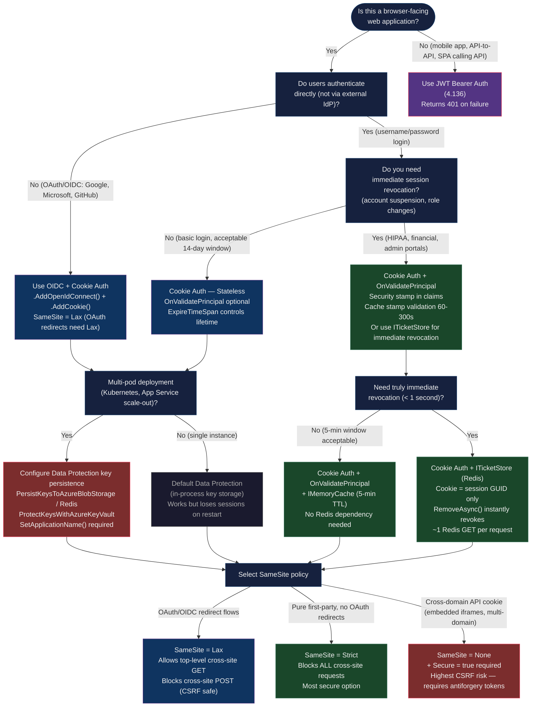

> [!success] Mastery Check
> - [ ] **Studied Well**
> - [ ] **Can explain the concept without notes**
> - [ ] **Can answer interview questions confidently**
> - [ ] **Can implement it in a real project**


# 4.135 — Cookie Authentication: AddCookie, SignInAsync, ClaimsPrincipal

---

## PART 0 — Navigation & Context

### Where This Topic Lives in the ASP.NET Core Hierarchy

```
ASP.NET Core Mastery
└── Authentication                          ← You are in this subsystem
    ├── 4.134 — Authentication Architecture: Schemes, Handlers, Middleware
    ├── 4.135 — Cookie Authentication: AddCookie, SignInAsync, ClaimsPrincipal  ◄ HERE
    ├── 4.136 — JWT Bearer Authentication
    ├── 4.137 — Generating JWT Access Tokens
    ├── 4.138 — Refresh Tokens
    ├── 4.139 — OAuth 2.0 in ASP.NET Core
    ├── 4.140 — OpenID Connect
    └── 4.141 — Custom Authentication Handlers

    Cross-cutting concerns:
    ├── 4.126 — Cookies: SameSite, Secure, HttpOnly (security flags)
    ├── 4.210 — CSRF / Antiforgery (IAntiforgery)
    └── Authorization subsystem (4.150+)
```

### What You Need Before This

- **[[4.134 — Authentication Architecture Schemes Handlers and Middleware]]** — understand what an authentication scheme and handler are; cookie auth is one handler implementation.
- **[[4.126 — Cookies SameSite Policy Secure Flag HttpOnly Security]]** — the HTTP Set-Cookie header semantics, SameSite modes, and their browser enforcement behavior.
- **ASP.NET Core Data Protection API (4.090)** — the cookie payload is encrypted by the Data Protection API; you must understand key management to run cookie auth in production clusters.
- **Claims-based identity (System.Security.Claims)** — `ClaimsPrincipal`, `ClaimsIdentity`, and `Claim` form the identity model that the cookie encodes.

### What This Unlocks After

- **[[4.136 — JWT Bearer Authentication]]** — contrast: JWT returns 401 on unauthenticated requests; cookie auth returns 302 redirect to LoginPath.
- **[[4.139 — OAuth 2.0 in ASP.NET Core]]** — OAuth flows (OIDC) set a cookie after the external callback; you compose cookie auth with the external provider scheme.
- **[[4.210 — CSRF Antiforgery IAntiforgery]]** — cookie auth mandates antiforgery token validation because cookies are sent automatically by the browser; JWT in headers is immune.
- **BFF (Backend-For-Frontend) Pattern** — cookie auth on the server-side BFF, with JWT for downstream API calls; requires all three related topics.

### Why This Matters in Production

Cookie authentication is the **stateless-session layer** for every browser-facing ASP.NET Core application: a single misconfigured `SameSite` policy silently breaks federated login on all browsers, and a missing `[ValidatePrincipal]` hook means revoked users continue to make authenticated requests until their cookie expires — both bugs ship to production in codebases written by experienced engineers every week.

---

## PART 1 — The Core Mental Model

### The Fundamental Rule

> **ASP.NET Core cookie authentication encrypts a `ClaimsPrincipal` into an HTTP cookie using the Data Protection API on `SignInAsync`, then decrypts and re-inflates that principal on every subsequent request in `CookieAuthenticationHandler.AuthenticateAsync` — the server holds no session state, but it does hold the Data Protection keys. If those keys are lost, all existing cookies become permanently invalid.**

### The Plain-Language Analogy

Think of the Data Protection-encrypted cookie as a **laminated, tamper-evident backstage pass** issued at the venue door. The bouncer (the authentication middleware) stamps the pass with the venue's private seal, folds your name, role, and privileges inside, and laminates it so you can't see or alter the contents. On every subsequent request you hand the pass to the same bouncer (or any bouncer at any door who has a copy of the same laminating machine key). The bouncer cracks the laminate, reads your info, and decides if you're allowed past the next door.

This analogy holds for the hard cases: if the venue changes its laminating keys (Data Protection key rotation without persistence), every existing pass is rejected — the bouncer can no longer read them. If you write `SameSite=Strict`, the pass is only accepted when you walk in from *inside* the venue (same-site navigation) — OAuth redirect flows fail because the redirect comes from an external site. If `HttpOnly=true`, the pass is stored in your wallet but you can never see its contents — JavaScript cannot read the raw cookie bytes, preventing XSS exfiltration.

### The Taxonomy Diagram

```mermaid
graph TD
    A["Cookie Authentication<br/>(ASP.NET Core)"]:::root

    A --> B["Registration"]:::infra
    B --> B1["services.AddAuthentication()"]
    B --> B2[".AddCookie(options => ...)"]
    B --> B3["CookieAuthenticationDefaults<br/>.AuthenticationScheme = 'Cookies'"]

    A --> C["Options"]:::infra
    C --> C1["Cookie.Name / HttpOnly / Secure / SameSite"]:::security
    C --> C2["LoginPath / LogoutPath / AccessDeniedPath"]:::routing
    C --> C3["ExpireTimeSpan / SlidingExpiration"]:::session
    C --> C4["Events: OnValidatePrincipal<br/>OnSigningIn / OnSignedIn"]:::hook

    A --> D["Runtime Operations"]:::pipeline
    D --> D1["SignInAsync(scheme, principal, props)"]
    D --> D2["SignOutAsync(scheme)"]
    D --> D3["AuthenticateAsync()"]
    D --> D4["ChallengeAsync() → 302 to LoginPath"]
    D --> D5["ForbidAsync() → 302 to AccessDeniedPath"]

    A --> E["Identity Model"]:::identity
    E --> E1["ClaimsPrincipal"]
    E --> E2["ClaimsIdentity<br/>(AuthenticationType must be set!)"]
    E --> E3["Claim[]"]

    A --> F["AuthenticationProperties"]:::session
    F --> F1["IsPersistent (remember me)"]
    F --> F2["ExpiresUtc"]
    F --> F3["RedirectUri"]
    F --> F4["AllowRefresh"]

    A --> G["Security Layer"]:::security
    G --> G1["Data Protection API<br/>(AES-256-CBC + HMACSHA256)"]
    G --> G2["HttpOnly flag → XSS defense"]
    G --> G3["Secure flag → TLS only"]
    G --> G4["SameSite policy → CSRF defense"]

    A --> H["Integration Points"]:::integration
    H --> H1["OAuth 2.0 / OIDC<br/>(external provider → cookie)"]
    H --> H2["BFF Pattern<br/>(cookie auth + JWT for APIs)"]
    H --> H3["Antiforgery tokens<br/>(required with cookie auth)"]

    classDef root fill:#1a1a2e,stroke:#e94560,color:#fff
    classDef infra fill:#16213e,stroke:#0f3460,color:#eee
    classDef pipeline fill:#0f3460,stroke:#533483,color:#eee
    classDef security fill:#533483,stroke:#e94560,color:#eee
    classDef identity fill:#e94560,stroke:#533483,color:#fff
    classDef routing fill:#1a1a2e,stroke:#e94560,color:#eee
    classDef session fill:#16213e,stroke:#533483,color:#eee
    classDef integration fill:#0d0d1a,stroke:#0f3460,color:#eee
    classDef hook fill:#1e1e3e,stroke:#533483,color:#eee
```



---

## PART 2 — Deep Mechanics

### 2.1 — Registration: What `AddAuthentication().AddCookie()` Actually Does

#### Pipeline Position

```
Program.cs startup
  ┌─ services.AddAuthentication(CookieAuthenticationDefaults.AuthenticationScheme)
  │     └─ Registers: IAuthenticationService (singleton)
  │                   IAuthenticationHandlerProvider (singleton)
  │                   IAuthenticationSchemeProvider (singleton)
  │
  └─ .AddCookie(options => ...)
        └─ Registers: CookieAuthenticationOptions (named options snapshot)
                      CookieAuthenticationHandler (transient, created per-request)
                      IOptionsMonitor<CookieAuthenticationOptions>

// Pipeline position (request handling):
──► ExceptionHandler ──► HSTS ──► StaticFiles ──► Routing ──► [UseAuthentication] ──► UseAuthorization ──► Endpoints
                                                                     ↑
                                                         CookieAuthenticationHandler
                                                         runs here on every request
```

#### Framework Behavior

`AddAuthentication()` registers the core authentication infrastructure into the DI container. The string argument becomes the **default scheme** — the scheme that `AuthenticateAsync()`, `ChallengeAsync()`, and `ForbidAsync()` fall back to when no scheme is explicitly specified.

`.AddCookie()` is an extension method from `Microsoft.AspNetCore.Authentication.Cookies` that calls `AuthenticationBuilder.AddSchemeCore<CookieAuthenticationOptions, CookieAuthenticationHandler>()`. Internally this is implemented as:

```csharp
// ASP.NET Core internally (approximate) — AuthenticationBuilder.cs:
public static AuthenticationBuilder AddCookie(
    this AuthenticationBuilder builder,
    string authenticationScheme,
    string? displayName,
    Action<CookieAuthenticationOptions> configureOptions)
{
    builder.Services.TryAddEnumerable(
        ServiceDescriptor.Singleton<IPostConfigureOptions<CookieAuthenticationOptions>,
            PostConfigureCookieAuthenticationOptions>());
    
    builder.Services.AddOptions<CookieAuthenticationOptions>(authenticationScheme)
        .Validate(o => o.Cookie.Expiration == null, 
            "Cookie.Expiration is ignored. Use ExpireTimeSpan instead.");
    
    return builder.AddSchemeCore<CookieAuthenticationOptions, CookieAuthenticationHandler>(
        authenticationScheme, displayName, configureOptions);
}
```

**Cost label**: `~0 allocations per request` for the options resolution (options are cached as singletons). The handler itself is instantiated once per authentication call via `IAuthenticationHandlerProvider.GetHandlerAsync()`.

#### The `PostConfigureCookieAuthenticationOptions` Hook

This is a critical internal detail. After your `configureOptions` lambda runs, ASP.NET Core applies `PostConfigureCookieAuthenticationOptions`, which:

1. Sets `Cookie.Name` to `.AspNetCore.{schemeName}` if not specified
2. Assigns the Data Protection ticket serializer using `IDataProtectionProvider`
3. Sets `Cookie.Path` to `/` if not specified
4. Configures the ticket data format as `TicketDataFormat` wrapping `CookieSecurePolicy`

> [!IMPORTANT]
> The Data Protection provider is wired **automatically** during `PostConfigure`. This means your cookie encryption uses the app's Data Protection key ring. In a multi-instance deployment (Kubernetes pods, multiple App Service instances), you **must** configure Data Protection key persistence (Azure Blob Storage, Redis, AWS SSM, etc.) or every pod will have different encryption keys, causing authentication failures when requests hit different pods.

---

### 2.2 — `SignInAsync`: Creating the Encrypted Cookie

#### What Happens at the HTTP Level

```http
// HTTP request to login endpoint:
POST /account/login HTTP/1.1
Host: shop.example.com
Content-Type: application/x-www-form-urlencoded
Content-Length: 42

email=alice%40example.com&password=s3cret

// HTTP response from SignInAsync:
HTTP/1.1 302 Found
Location: /dashboard
Set-Cookie: .AspNetCore.Cookies=CfDJ8KrD...[encrypted base64 payload]...;
            path=/;
            expires=Sun, 08 Jun 2026 03:26:23 GMT;
            secure;
            samesite=lax;
            httponly
```

#### Pipeline Position

```
POST /account/login
  ──► ExceptionHandler
  ──► UseRouting  (route matched: LoginController.LoginAsync)
  ──► UseAuthentication  (attempts cookie read — no cookie exists → anonymous)
  ──► UseAuthorization   (endpoint not [Authorize] → passes through)
  ──► LoginController.LoginAsync
          │
          ├─ Validates credentials against database
          │
          ├─ Builds ClaimsPrincipal (see §2.3)
          │
          └─ await HttpContext.SignInAsync(
                 CookieAuthenticationDefaults.AuthenticationScheme,
                 principal,
                 properties)
                     │
                     └─ CookieAuthenticationHandler.HandleSignInAsync()
                             ├─ Fires OnSigningIn event
                             ├─ Creates AuthenticationTicket(principal, scheme)
                             ├─ Serializes + encrypts ticket → TicketDataFormat.Protect()
                             │     └─ IDataProtector.Protect(byte[]) 
                             │           → AES-256-CBC + HMACSHA256
                             ├─ Sets Set-Cookie header on HttpContext.Response
                             ├─ Fires OnSignedIn event
                             └─ Returns (response headers committed on next write)
```

#### Framework Source Behavior

```csharp
// ASP.NET Core internally (approximate) — CookieAuthenticationHandler.cs:
protected override async Task HandleSignInAsync(
    ClaimsPrincipal user, 
    AuthenticationProperties? properties)
{
    // 1. Resolve options
    var cookieOptions = BuildCookieOptions();
    
    // 2. Fire the OnSigningIn event — your code can modify claims here
    var signInContext = new CookieSigningInContext(
        Context, Scheme, Options, user, properties, cookieOptions);
    await Events.SigningIn(signInContext);
    
    // 3. Apply expiry
    if (properties.IsPersistent)
    {
        var expiresUtc = properties.ExpiresUtc ?? Clock.UtcNow.Add(Options.ExpireTimeSpan);
        properties.ExpiresUtc = expiresUtc;
        cookieOptions.Expires = expiresUtc.ToUniversalTime();
    }
    
    // 4. Build the ticket and encrypt it
    var ticket = new AuthenticationTicket(signInContext.Principal!, 
        signInContext.Properties, Scheme.Name);
    var cookieValue = Options.TicketDataFormat.Protect(ticket, GetTlsTokenBinding());
    
    // 5. Append the Set-Cookie header
    Options.CookieManager.AppendResponseCookie(
        Context,
        Options.Cookie.Name!,
        cookieValue,
        cookieOptions);
    
    // 6. Fire OnSignedIn  
    await Events.SignedIn(new CookieSignedInContext(...));
    
    // 7. Issue redirect if ReturnUrl was set
    await ApplyHeaders(shouldRedirectToReturnUrl: true, 
        properties: signInContext.Properties);
}
```

**Cost label**: `~3-5 allocations` — AuthenticationTicket, byte[] for serialization, the base64 cookie string. `TicketDataFormat.Protect()` is CPU-bound (AES-256) but negligible at normal auth frequencies (1 SignIn per session, not per request).

---

### 2.3 — `ClaimsPrincipal` Construction: The `AuthenticationType` Trap

#### The Critical Rule

The `ClaimsIdentity` constructor **requires** the `authenticationType` parameter to be non-null and non-empty for `IsAuthenticated` to return `true`. This is the single most common cookie auth bug.

```csharp
// ASP.NET Core internally (approximate) — ClaimsIdentity.cs:
public bool IsAuthenticated 
{ 
    get { return !string.IsNullOrEmpty(_authenticationType); }
}
```

#### Correct Principal Construction

```csharp
// ✅ CORRECT: AuthenticationType is set to the scheme name
var claims = new List<Claim>
{
    new Claim(ClaimTypes.NameIdentifier, user.Id.ToString()),
    new Claim(ClaimTypes.Email, user.Email),
    new Claim(ClaimTypes.Name, user.DisplayName),
    new Claim("tenant_id", user.TenantId.ToString()),
    new Claim(ClaimTypes.Role, user.Role.ToString()),
};

var identity = new ClaimsIdentity(
    claims, 
    CookieAuthenticationDefaults.AuthenticationScheme  // ← MUST be set
);

var principal = new ClaimsPrincipal(identity);
```

#### HTTP Wire Format of What Gets Encrypted

The `AuthenticationTicket` serialized into the cookie contains:

```
// Cookie payload (binary, before encryption — conceptual):
// Schema version: 5
// ClaimsPrincipal:
//   Identity[0]:
//     AuthenticationType: "Cookies"
//     NameClaimType: "http://schemas.xmlsoap.org/ws/2005/05/identity/claims/name"
//     RoleClaimType: "http://schemas.microsoft.com/ws/2008/06/identity/claims/role"
//     Claims:
//       - Type: "http://schemas.xmlsoap.org/ws/2005/05/identity/claims/nameidentifier"
//         Value: "user-42"
//       - Type: "http://schemas.xmlsoap.org/ws/2005/05/identity/claims/emailaddress"
//         Value: "alice@example.com"
//       - Type: "http://schemas.microsoft.com/ws/2008/06/identity/claims/role"
//         Value: "OrderManager"
// AuthenticationProperties:
//   IssuedUtc: 2026-06-08T03:26:23Z
//   ExpiresUtc: 2026-06-08T17:26:23Z
//   IsPersistent: false
```

After `TicketDataFormat.Protect()`: AES-256-CBC encryption + HMACSHA256 MAC, then Base64Url encoded. The result is typically 400-1200 bytes depending on claim count.

**Cost label**: Serialization is `~1 allocation` for the `byte[]` buffer; encryption is `~1 allocation` for the output buffer. Total per `SignInAsync`: `~5 allocations`. Per authenticated request (decryption): `~3 allocations`.

> [!WARNING]
> **Cookie size limit**: Browsers enforce a 4096-byte limit per cookie. If you store too many claims (roles, permissions, tenant metadata), the serialized+encrypted cookie can exceed this limit, causing silent authentication failures. The browser simply drops the oversized cookie. Store minimal identity claims in the cookie; load additional data from cache/database in `OnValidatePrincipal`.

---

### 2.4 — `AuthenticateAsync`: Every Authenticated Request

#### Pipeline Position (Authenticated Request)

```
GET /orders/dashboard HTTP/1.1
Cookie: .AspNetCore.Cookies=CfDJ8KrD...

──► ExceptionHandler
──► HSTS
──► StaticFiles  (no match)
──► UseRouting   (matches /orders/dashboard → OrdersDashboardEndpoint)
──► UseAuthentication
        │
        └─ AuthenticationMiddleware.Invoke()
                └─ IAuthenticationService.AuthenticateAsync(context, defaultScheme)
                        └─ CookieAuthenticationHandler.AuthenticateAsync()
                                ├─ Reads cookie from request
                                ├─ Decrypts via TicketDataFormat.Unprotect()
                                ├─ Checks ExpiresUtc → if expired: returns Fail()
                                ├─ Fires OnValidatePrincipal event ← YOUR HOOK
                                ├─ Applies sliding expiration if enabled
                                └─ Sets HttpContext.User = ticket.Principal
──► UseAuthorization
        └─ Checks [Authorize] attribute → HttpContext.User.IsAuthenticated = true → PASS
──► OrdersDashboardEndpoint.HandleAsync()
```

#### Framework Source Behavior

```csharp
// ASP.NET Core internally (approximate) — CookieAuthenticationHandler.cs:
protected override async Task<AuthenticateResult> HandleAuthenticateAsync()
{
    // 1. Read the raw cookie string
    var cookie = Options.CookieManager.GetRequestCookie(Context, Options.Cookie.Name!);
    if (string.IsNullOrEmpty(cookie))
        return AuthenticateResult.NoResult();  // → anonymous, not failure

    // 2. Decrypt the ticket
    AuthenticationTicket? ticket = null;
    try
    {
        ticket = Options.TicketDataFormat.Unprotect(cookie, GetTlsTokenBinding());
    }
    catch (Exception ex)
    {
        return AuthenticateResult.Fail("Unprotect ticket failed", ex);
    }

    if (ticket == null)
        return AuthenticateResult.Fail("Failed to unprotect the authentication ticket.");

    // 3. Check expiry
    var currentUtc = Clock.UtcNow;
    var expiresUtc = ticket.Properties.ExpiresUtc;
    if (expiresUtc.HasValue && expiresUtc.Value < currentUtc)
        return AuthenticateResult.Fail("Ticket expired.");

    // 4. Fire OnValidatePrincipal — most important extensibility hook
    var validateContext = new CookieValidatePrincipalContext(
        Context, Scheme, Options, ticket);
    await Events.ValidatePrincipal(validateContext);

    if (validateContext.Principal == null)
        return AuthenticateResult.Fail("No principal.");

    // 5. Sliding expiration — if enabled and enough time has passed
    if (Options.SlidingExpiration)
    {
        var timeElapsed = currentUtc.Subtract(ticket.Properties.IssuedUtc ?? currentUtc);
        var timeRemaining = expiresUtc.HasValue ? 
            expiresUtc.Value.Subtract(currentUtc) : TimeSpan.MaxValue;
        
        // Renew if more than half the time has elapsed
        if (timeElapsed > timeRemaining)
        {
            validateContext.ShouldRenew = true;
        }
    }

    // 6. Issue a new cookie if ShouldRenew was set
    if (validateContext.ShouldRenew)
    {
        // Re-issues the cookie with updated ExpiresUtc and IssuedUtc
        await SignInAsync(validateContext.Principal, validateContext.Properties);
    }

    return AuthenticateResult.Success(
        new AuthenticationTicket(
            validateContext.Principal!, validateContext.Properties, Scheme.Name));
}
```

**Cost label**: Per authenticated request: `~3-4 allocations` (ticket object, principal re-wrap), `~1 AES-256 decryption`, zero database round-trips unless `OnValidatePrincipal` does one. With sliding expiration renewal: `+1 Set-Cookie header write` on ~50% of requests.

---

### 2.5 — Redirect Behavior: 302 vs. 401

One of the most important behavioral differences between cookie auth and JWT bearer auth is how unauthenticated requests are handled.

#### Cookie Auth Redirect Flow

```
GET /orders/checkout HTTP/1.1
Host: shop.example.com
(no Cookie header)

──► UseAuthentication → AuthenticateResult.NoResult() → HttpContext.User = anonymous
──► UseAuthorization → [Authorize] → user not authenticated
         └─ ChallengeAsync(CookieAuthenticationDefaults.AuthenticationScheme)
                 └─ CookieAuthenticationHandler.HandleChallengeAsync()
                         └─ Builds redirect URL:
                            LoginPath (/account/login) + ?ReturnUrl=/orders/checkout

// HTTP Response:
HTTP/1.1 302 Found
Location: /account/login?ReturnUrl=%2Forders%2Fcheckout
Set-Cookie: (none)
Content-Length: 0
```

#### Forbidden Flow (Authenticated but Insufficient Permissions)

```
GET /admin/users HTTP/1.1
Host: shop.example.com
Cookie: .AspNetCore.Cookies=CfDJ8...  (valid cookie, role=OrderManager)

──► UseAuthentication → Authenticated as alice, role=OrderManager
──► UseAuthorization → [Authorize(Roles = "Admin")] → FAIL (wrong role)
         └─ ForbidAsync(CookieAuthenticationDefaults.AuthenticationScheme)
                 └─ CookieAuthenticationHandler.HandleForbiddenAsync()
                         └─ Redirects to AccessDeniedPath

// HTTP Response:
HTTP/1.1 302 Found
Location: /account/access-denied?ReturnUrl=%2Fadmin%2Fusers
```

> [!NOTE]
> **JWT vs. Cookie auth HTTP behavior**: JWT bearer auth returns `401 Unauthorized` for unauthenticated requests and `403 Forbidden` for insufficient permissions. Cookie auth returns `302 Found` (redirect) in both cases. This is why APIs consumed by JavaScript/mobile clients must use JWT — a SPA cannot follow a 302 redirect to a login page for an API call.

**Cost label**: Challenge redirect = `~1 allocation` for the redirect URL string construction. Zero database round-trips. The 302 response is sent before any endpoint handler runs.

---

### 2.6 — `OnValidatePrincipal`: The Security Re-Validation Hook

This is the **most important security extension point** in cookie auth. It runs on every authenticated request and is your only hook to invalidate sessions after the cookie has been issued.

#### The Problem Without This Hook

```
Timeline:
  T+0:00  Alice logs in → cookie issued, valid for 14 days
  T+0:30  Alice is suspended from the e-commerce platform (role revoked in database)
  T+1:00  Alice continues making requests with her existing cookie
  T+336h  Alice's cookie expires — she is FINALLY blocked

Without OnValidatePrincipal: Alice has 14 days of unauthorized access after suspension.
```

#### Correct Implementation Pattern

```csharp
// Pipeline position: runs INSIDE CookieAuthenticationHandler.AuthenticateAsync()
// After ticket decryption, before HttpContext.User is set
options.Events = new CookieAuthenticationEvents
{
    OnValidatePrincipal = async context =>
    {
        // Cost: ~1 cache lookup or ~1 DB query per request if not careful
        var userService = context.HttpContext.RequestServices
            .GetRequiredService<IUserValidationService>();
        
        var userId = context.Principal!.FindFirstValue(ClaimTypes.NameIdentifier);
        var lastChanged = context.Principal.FindFirstValue("security_stamp_version");
        
        // Only hit the database if the stamp is stale (use a short in-memory cache)
        var isValid = await userService.IsSecurityStampValidAsync(
            userId!, lastChanged!);
        
        if (!isValid)
        {
            // Reject the principal → causes AuthenticateResult.Fail()
            // The middleware will then redirect to LoginPath
            context.RejectPrincipal();
            await context.HttpContext.SignOutAsync(
                CookieAuthenticationDefaults.AuthenticationScheme);
        }
    }
};
```

**Cost label**: If you validate on every request without caching: `~1 database round-trip per request`. Cache the stamp validation result for 60-300 seconds in `IMemoryCache` keyed by `userId` to amortize the cost. Rejecting the principal: `~0 allocations` + forces a 302 to LoginPath.

---

### 2.7 — Sliding Expiration: The Quiet Cookie Renewal

When `SlidingExpiration = true`, ASP.NET Core renews the cookie on responses where more than half of `ExpireTimeSpan` has elapsed since the cookie was issued.

```
ExpireTimeSpan = 14 days
SlidingExpiration = true

Timeline:
  T+0d    SignIn → cookie issued with ExpiresUtc = T+14d
  T+8d    Request → elapsed=8d > remaining=6d → ShouldRenew=true
              → New Set-Cookie: expires=T+8d+14d (T+22d)
  T+30d   No requests for 22 days → cookie expires naturally → force login

// HTTP Response with renewal (added header):
HTTP/1.1 200 OK
Set-Cookie: .AspNetCore.Cookies=CfDJ8NEW...; expires=Sun, 29 Jun 2026 03:26:23 GMT; ...
Content-Type: text/html
```

> [!TIP]
> Sliding expiration is excellent for "keep users logged in while active" UX, but it means an active attacker who has stolen a cookie can keep it valid indefinitely. Pair with `OnValidatePrincipal` security stamp checks to detect compromised sessions.

---

### 2.8 — Data Protection: Key Management in Production

The cookie encryption relies entirely on `IDataProtector` derived from the app's Data Protection key ring. In production:

```
Single server: Keys stored in %LOCALAPPDATA%\ASP.NET\DataProtection-Keys
Docker container: Keys stored in /root/.aspnet/DataProtection-Keys (LOST on restart!)
Kubernetes: Keys are PER-POD unless persisted → users get logged out on pod restart

// Required for multi-instance deployments:
builder.Services.AddDataProtection()
    .PersistKeysToAzureBlobStorage(blobContainerClient, "dataprotection-keys.xml")
    .ProtectKeysWithAzureKeyVault(keyVaultKeyId, new DefaultAzureCredential());
    // OR:
    // .PersistKeysToStackExchangeRedis(connectionMultiplexer, "DataProtection-Keys")
    // .PersistKeysToFileSystem(new DirectoryInfo("/shared-volume/keys"))
```

**Key rotation behavior**: Data Protection rotates keys every 90 days by default. Old keys are retained and can still be used to decrypt old cookies (backward compatibility). Only forward-going new cookies use the new key. This means users stay logged in across key rotation — a correct behavior.

**Cost label**: Key ring lookup = `O(n)` where n is the number of keys (typically 1-5). Key resolution is cached per `IDataProtector` instance. `~0 allocations` for the lookup after first use.

---

## PART 3 — Production Code Patterns

### Pattern 1: The Minimal Secure Cookie Authentication Registration

**Domain**: E-commerce order management web application

```csharp
// Program.cs — production-grade cookie auth registration
// ✅ CORRECT: All security flags explicitly set; don't rely on defaults

var builder = WebApplication.CreateBuilder(args);

// Data Protection MUST be configured before AddAuthentication for multi-pod deployments
builder.Services.AddDataProtection()
    .PersistKeysToAzureBlobStorage(
        builder.Configuration.GetConnectionString("AzureStorage")!,
        containerName: "data-protection-keys",
        blobName: "keys.xml")
    .ProtectKeysWithAzureKeyVault(
        new Uri(builder.Configuration["KeyVault:KeyId"]!),
        new DefaultAzureCredential())
    .SetApplicationName("OrderManagementPortal")  // ← Isolates keys from other apps
    .SetDefaultKeyLifetime(TimeSpan.FromDays(90));

builder.Services.AddAuthentication(CookieAuthenticationDefaults.AuthenticationScheme)
    .AddCookie(options =>
    {
        // Cookie identity
        options.Cookie.Name = ".OMS.Auth";           // Prefix makes it obvious in browser DevTools
        
        // Security flags — the most critical settings
        options.Cookie.HttpOnly = true;              // XSS: JS cannot read cookie bytes
        options.Cookie.SecurePolicy = CookieSecurePolicy.Always;  // TLS-only
        options.Cookie.SameSite = SameSiteMode.Lax; // Allows top-level navigation (OAuth redirect flows work)
                                                     // Use Strict only if you have no OAuth/OIDC
        
        // Session lifetime — 8h sliding for business-hours apps, 14d for consumer
        options.ExpireTimeSpan = TimeSpan.FromHours(8);
        options.SlidingExpiration = true;
        
        // Redirect paths — must be unprotected (anonymous accessible)
        options.LoginPath = "/account/login";
        options.LogoutPath = "/account/logout";
        options.AccessDeniedPath = "/account/access-denied";
        
        // ReturnUrl parameter name (default is "ReturnUrl")
        options.ReturnUrlParameter = "returnUrl";
        
        // Validate the security stamp on every request to detect revoked sessions
        options.Events = new CookieAuthenticationEvents
        {
            OnValidatePrincipal = SecurityStampValidationEvents.ValidatePrincipalAsync
        };
    });

builder.Services.AddAuthorization();

var app = builder.Build();

app.UseHttpsRedirection();
app.UseStaticFiles();
app.UseRouting();
app.UseAuthentication();  // ← MUST come before UseAuthorization
app.UseAuthorization();
app.MapControllers();

app.Run();

// HTTP consequence on successful auth:
// Set-Cookie: .OMS.Auth=CfDJ8...; path=/; expires=...; secure; samesite=lax; httponly
```

---

### Pattern 2: The Credential Validation and Sign-In Flow

**Domain**: Customer login for a payment processing portal

```csharp
// AccountController.cs — complete sign-in flow
[Route("account")]
[ApiController]
public class AccountController : ControllerBase
{
    private readonly IPaymentUserRepository _users;
    private readonly IPasswordHasher<PaymentPortalUser> _hasher;
    private readonly ILogger<AccountController> _logger;

    public AccountController(
        IPaymentUserRepository users,
        IPasswordHasher<PaymentPortalUser> hasher,
        ILogger<AccountController> logger)
    {
        _users = users;
        _hasher = hasher;
        _logger = logger;
    }

    [HttpPost("login")]
    [AllowAnonymous]
    [ValidateAntiForgeryToken]  // CSRF protection even on login — prevents login CSRF attacks
    public async Task<IActionResult> LoginAsync(
        [FromForm] LoginRequest request,
        CancellationToken ct)
    {
        // Never reveal whether email or password was wrong (timing-safe comparison)
        var user = await _users.FindByEmailAsync(request.Email, ct);
        
        if (user is null || !user.IsActive)
        {
            // Constant-time delay to prevent email enumeration
            await Task.Delay(TimeSpan.FromMilliseconds(150), ct);
            ModelState.AddModelError(string.Empty, "Invalid credentials.");
            return View(request);
        }

        var passwordResult = _hasher.VerifyHashedPassword(
            user, user.PasswordHash, request.Password);
        
        if (passwordResult == PasswordVerificationResult.Failed)
        {
            _logger.LogWarning(
                "Failed login attempt for {Email} from {RemoteIp}",
                request.Email, 
                HttpContext.Connection.RemoteIpAddress);
            ModelState.AddModelError(string.Empty, "Invalid credentials.");
            return View(request);
        }

        // ✅ Build ClaimsPrincipal — AuthenticationType MUST be set
        var claims = new List<Claim>
        {
            new(ClaimTypes.NameIdentifier, user.Id.ToString()),
            new(ClaimTypes.Name, user.DisplayName),
            new(ClaimTypes.Email, user.Email),
            new("security_stamp_version", user.SecurityStampVersion.ToString()),
            new("tenant_id", user.TenantId.ToString()),
        };

        // Add role claims — keep minimal to stay under 4KB cookie limit
        foreach (var role in user.Roles)
            claims.Add(new Claim(ClaimTypes.Role, role));

        var identity = new ClaimsIdentity(
            claims,
            CookieAuthenticationDefaults.AuthenticationScheme  // ← AuthenticationType: required!
        );
        var principal = new ClaimsPrincipal(identity);

        // AuthenticationProperties control session behavior
        var properties = new AuthenticationProperties
        {
            IsPersistent = request.RememberMe,  // "Remember me" → persistent cookie
            // If IsPersistent=false: session cookie (no Expires header → browser clears on close)
            // If IsPersistent=true: cookie gets the Expires header from ExpireTimeSpan
            ExpiresUtc = request.RememberMe
                ? DateTimeOffset.UtcNow.AddDays(30)  // Long-lived remember-me
                : DateTimeOffset.UtcNow.AddHours(8), // Short session
            AllowRefresh = true,  // Allows sliding expiration to work
            RedirectUri = Url.IsLocalUrl(request.ReturnUrl) 
                ? request.ReturnUrl 
                : "/dashboard"  // ← ALWAYS validate ReturnUrl to prevent open redirect
        };

        await HttpContext.SignInAsync(
            CookieAuthenticationDefaults.AuthenticationScheme,
            principal,
            properties);

        // SignInAsync sets the Set-Cookie header but doesn't redirect by itself
        // The handler's ApplyHeaders() reads RedirectUri and sends the 302
        return LocalRedirect(properties.RedirectUri!);
    }

    // HTTP consequence (successful login with RememberMe=false):
    // HTTP/1.1 302 Found
    // Location: /dashboard
    // Set-Cookie: .OMS.Auth=CfDJ8KrD...; path=/; secure; samesite=lax; httponly
    // (no Expires = session cookie — cleared when browser closes)

    // HTTP consequence (successful login with RememberMe=true):
    // HTTP/1.1 302 Found
    // Location: /dashboard
    // Set-Cookie: .OMS.Auth=CfDJ8KrD...; path=/; expires=Mon, 08 Jul 2026 03:26:23 GMT; 
    //             secure; samesite=lax; httponly

    [HttpPost("logout")]
    [Authorize]
    [ValidateAntiForgeryToken]
    public async Task<IActionResult> LogoutAsync()
    {
        await HttpContext.SignOutAsync(CookieAuthenticationDefaults.AuthenticationScheme);

        // HTTP consequence:
        // Set-Cookie: .OMS.Auth=; expires=Thu, 01 Jan 1970 00:00:00 GMT; path=/; secure; samesite=lax; httponly
        // (Zero-epoch expiry instructs browser to delete the cookie)

        return RedirectToAction("Login");
    }
}
```

---

### Pattern 3: The Security Stamp Validator (OnValidatePrincipal)

**Domain**: User account management — detecting revoked sessions after role changes or account suspension

```csharp
// SecurityStampValidationEvents.cs — production security stamp validation
// Runs on EVERY authenticated request inside CookieAuthenticationHandler.AuthenticateAsync()
// Must be fast: cache the validation result to avoid per-request DB hits

public static class SecurityStampValidationEvents
{
    // The cache key format: user-stamp-valid:{userId}:{stampVersion}
    private static string CacheKey(string userId, string stampVersion)
        => $"user-stamp-valid:{userId}:{stampVersion}";

    public static async Task ValidatePrincipalAsync(
        CookieValidatePrincipalContext context)
    {
        var userId = context.Principal?.FindFirstValue(ClaimTypes.NameIdentifier);
        var stampVersion = context.Principal?.FindFirstValue("security_stamp_version");

        if (string.IsNullOrEmpty(userId) || string.IsNullOrEmpty(stampVersion))
        {
            // Malformed principal — reject it
            context.RejectPrincipal();
            return;
        }

        var cache = context.HttpContext.RequestServices
            .GetRequiredService<IMemoryCache>();

        // Fast path: cache hit means stamp was recently validated
        if (cache.TryGetValue(CacheKey(userId, stampVersion), out bool isValid) && isValid)
            return;

        // Slow path: validate against the database
        var userRepo = context.HttpContext.RequestServices
            .GetRequiredService<IUserRepository>();

        var currentStampVersion = await userRepo
            .GetSecurityStampVersionAsync(userId, context.HttpContext.RequestAborted);

        if (currentStampVersion != stampVersion)
        {
            // User's security stamp changed (password reset, role change, account suspension)
            // This cookie is no longer valid
            context.RejectPrincipal();
            await context.HttpContext.SignOutAsync(
                CookieAuthenticationDefaults.AuthenticationScheme);

            // HTTP consequence:
            // The response to this request will be:
            // HTTP/1.1 302 Found
            // Location: /account/login?returnUrl=<current path>
            // Set-Cookie: .OMS.Auth=; expires=Thu, 01 Jan 1970 00:00:00 GMT; ...
            // (cookie deleted + redirect to login)
            return;
        }

        // Cache the valid result for 5 minutes to reduce DB load
        // 300 seconds means a suspension takes at most 5 minutes to take effect
        cache.Set(
            CacheKey(userId, stampVersion), 
            true, 
            TimeSpan.FromSeconds(300));
    }
}

// Registration in Program.cs:
// options.Events = new CookieAuthenticationEvents
// {
//     OnValidatePrincipal = SecurityStampValidationEvents.ValidatePrincipalAsync
// };
```

---

### Pattern 4: The BFF (Backend-For-Frontend) Cookie Auth + API JWT Pattern

**Domain**: E-commerce SPA with a dedicated backend-for-frontend server

```csharp
// The BFF pattern: browser uses cookie auth; BFF calls downstream APIs with JWT
// This pattern avoids storing tokens in browser localStorage (XSS risk)

// BFF Program.cs
builder.Services.AddAuthentication(CookieAuthenticationDefaults.AuthenticationScheme)
    .AddCookie(options =>
    {
        options.Cookie.Name = ".ECS.BFF";
        options.Cookie.HttpOnly = true;
        options.Cookie.SecurePolicy = CookieSecurePolicy.Always;
        options.Cookie.SameSite = SameSiteMode.Strict; // BFF: strict is safe — no OAuth redirects needed here
        options.ExpireTimeSpan = TimeSpan.FromHours(1);
        options.SlidingExpiration = true;
    })
    .AddOpenIdConnect("EntraID", options =>
    {
        // OIDC flow: redirects to Microsoft login → gets tokens → stores in cookie
        options.Authority = builder.Configuration["EntraID:Authority"];
        options.ClientId = builder.Configuration["EntraID:ClientId"];
        options.ClientSecret = builder.Configuration["EntraID:ClientSecret"];
        options.ResponseType = "code";
        options.SaveTokens = true;  // ← Saves access_token + refresh_token in the cookie
        options.Scope.Add("api://inventory-service/read");
    });

// BFF endpoint that proxies to the downstream inventory service
app.MapGet("/bff/inventory/{productId}", async (
    string productId,
    HttpContext httpContext,
    IHttpClientFactory httpClientFactory) =>
{
    // The BFF reads the access token stored in the cookie (by OIDC's SaveTokens = true)
    var accessToken = await httpContext.GetTokenAsync("access_token");
    
    if (string.IsNullOrEmpty(accessToken))
        return Results.Unauthorized();

    // Downstream API call uses JWT — the browser never sees this token
    var client = httpClientFactory.CreateClient("InventoryService");
    client.DefaultRequestHeaders.Authorization = 
        new AuthenticationHeaderValue("Bearer", accessToken);

    var response = await client.GetAsync($"/api/v1/products/{productId}");
    var content = await response.Content.ReadAsStringAsync();

    // HTTP consequence (browser → BFF):
    // Request:  GET /bff/inventory/SKU-42 HTTP/1.1 \r\n Cookie: .ECS.BFF=CfDJ8...
    // Response: HTTP/1.1 200 OK \r\n Content-Type: application/json \r\n [data]
    
    // HTTP consequence (BFF → Inventory API):
    // Request:  GET /api/v1/products/SKU-42 HTTP/1.1 \r\n Authorization: Bearer eyJhbGci...
    // Response: HTTP/1.1 200 OK \r\n [inventory data]

    return Results.Content(content, "application/json");
})
.RequireAuthorization();
```

---

### Pattern 5: The Multi-Scheme Authentication Configuration

**Domain**: Logistics tracking platform — internal admin uses cookie auth, external API uses JWT

```csharp
// Program.cs — multi-scheme auth configuration
// Cookie auth for the web portal; JWT for the REST API consumed by carrier integrations

builder.Services.AddAuthentication(options =>
{
    // No single default — each route group specifies its scheme
    options.DefaultScheme = CookieAuthenticationDefaults.AuthenticationScheme;
    options.DefaultChallengeScheme = CookieAuthenticationDefaults.AuthenticationScheme;
})
.AddCookie(CookieAuthenticationDefaults.AuthenticationScheme, options =>
{
    options.Cookie.Name = ".LTS.Portal";
    options.Cookie.HttpOnly = true;
    options.Cookie.SecurePolicy = CookieSecurePolicy.Always;
    options.Cookie.SameSite = SameSiteMode.Lax;
    options.LoginPath = "/portal/login";
    options.ExpireTimeSpan = TimeSpan.FromHours(8);
    options.SlidingExpiration = true;
})
.AddJwtBearer(JwtBearerDefaults.AuthenticationScheme, options =>
{
    options.Authority = builder.Configuration["Auth:Authority"];
    options.Audience = builder.Configuration["Auth:Audience"];
    options.TokenValidationParameters = new TokenValidationParameters
    {
        ValidateIssuerSigningKey = true,
        ValidateLifetime = true,
        ClockSkew = TimeSpan.FromSeconds(30)
    };
});

// Web portal routes — cookie auth
app.MapGroup("/portal")
    .RequireAuthorization(new AuthorizeAttribute 
    { 
        AuthenticationSchemes = CookieAuthenticationDefaults.AuthenticationScheme 
    })
    .MapControllers();

// API routes — JWT auth; returns 401 not 302 for unauthenticated
app.MapGroup("/api/v1")
    .RequireAuthorization(new AuthorizeAttribute 
    { 
        AuthenticationSchemes = JwtBearerDefaults.AuthenticationScheme 
    })
    .MapControllers();

// HTTP consequence (unauthenticated request to /portal/shipments):
// HTTP/1.1 302 Found
// Location: /portal/login?returnUrl=%2Fportal%2Fshipments

// HTTP consequence (unauthenticated request to /api/v1/shipments):
// HTTP/1.1 401 Unauthorized
// WWW-Authenticate: Bearer error="invalid_token"
```

---

### Pattern 6: The Claim Refresh and Principal Renewal Pattern

**Domain**: Order management system — updating claims after user role change without forcing re-login

```csharp
// OrderManagementController.cs — refreshing claims in an existing session
// Use case: admin upgrades a user's role; user's next request should see new role immediately

[HttpPost("account/refresh-claims")]
[Authorize]
public async Task<IActionResult> RefreshClaimsAsync(CancellationToken ct)
{
    var userId = User.FindFirstValue(ClaimTypes.NameIdentifier)!;
    
    // Load the current, fresh user data from the database
    var user = await _userRepository.GetByIdAsync(userId, ct);
    if (user is null || !user.IsActive)
    {
        await HttpContext.SignOutAsync(CookieAuthenticationDefaults.AuthenticationScheme);
        return RedirectToAction("Login", "Account");
    }

    // Rebuild the full claims list from the current database state
    var claims = new List<Claim>
    {
        new(ClaimTypes.NameIdentifier, user.Id.ToString()),
        new(ClaimTypes.Name, user.DisplayName),
        new(ClaimTypes.Email, user.Email),
        new("security_stamp_version", user.SecurityStampVersion.ToString()),
        new("tenant_id", user.TenantId.ToString()),
    };
    foreach (var role in user.Roles)
        claims.Add(new Claim(ClaimTypes.Role, role));

    var identity = new ClaimsIdentity(
        claims, 
        CookieAuthenticationDefaults.AuthenticationScheme);
    var principal = new ClaimsPrincipal(identity);

    // Preserve the original authentication properties (IsPersistent, ExpiresUtc)
    // so the session lifetime is not reset
    var authResult = await HttpContext.AuthenticateAsync(
        CookieAuthenticationDefaults.AuthenticationScheme);
    var properties = authResult.Properties!;
    
    // Re-sign in with the refreshed principal — issues a new encrypted cookie
    await HttpContext.SignInAsync(
        CookieAuthenticationDefaults.AuthenticationScheme,
        principal,
        properties);

    // HTTP consequence:
    // HTTP/1.1 200 OK
    // Set-Cookie: .OMS.Auth=CfDJ8NEW...; [same expiry as before]; secure; samesite=lax; httponly
    // (new cookie with updated roles, same expiry)

    return Ok(new { message = "Session refreshed with updated permissions." });
}
```

---

### Pattern 7: The Cookie Auth with Custom Ticket Store (Stateful Sessions)

**Domain**: Healthcare patient portal — HIPAA requires ability to immediately invalidate all sessions

```csharp
// PatientPortalTicketStore.cs — server-side session store backed by Redis
// When ITicketStore is configured, the cookie contains only a session ID (GUID)
// The actual ClaimsPrincipal is stored server-side in Redis
// This enables true immediate session revocation and reduces cookie size

public class RedisTicketStore : ITicketStore
{
    private readonly IConnectionMultiplexer _redis;
    private readonly IDataProtector _protector;
    private const string KeyPrefix = "auth-ticket:";

    public RedisTicketStore(IConnectionMultiplexer redis, IDataProtectionProvider dp)
    {
        _redis = redis;
        _protector = dp.CreateProtector("PatientPortal.Sessions");
    }

    public async Task<string> StoreAsync(AuthenticationTicket ticket)
    {
        var sessionId = Guid.NewGuid().ToString("N");
        var db = _redis.GetDatabase();
        
        // Serialize and encrypt the full ticket server-side
        var serialized = TicketSerializer.Default.Serialize(ticket);
        var encrypted = _protector.Protect(serialized);
        
        var expiry = ticket.Properties.ExpiresUtc.HasValue
            ? ticket.Properties.ExpiresUtc.Value - DateTimeOffset.UtcNow
            : TimeSpan.FromHours(8);

        await db.StringSetAsync(
            $"{KeyPrefix}{sessionId}", 
            encrypted,
            expiry);

        // Cookie now contains ONLY the session ID (tiny ~48 bytes vs 800+ bytes)
        return sessionId;
    }

    public async Task<AuthenticationTicket?> RetrieveAsync(string key)
    {
        var db = _redis.GetDatabase();
        var encrypted = await db.StringGetAsync($"{KeyPrefix}{key}");
        if (encrypted.IsNullOrEmpty) return null;

        var decrypted = _protector.Unprotect(encrypted!);
        return TicketSerializer.Default.Deserialize(decrypted);
    }

    public async Task RenewAsync(string key, AuthenticationTicket ticket)
    {
        // Called during sliding expiration renewal — update TTL in Redis
        await StoreAsync(ticket); // Simple: store new ticket under new key
        await RemoveAsync(key);
    }

    public async Task RemoveAsync(string key)
    {
        var db = _redis.GetDatabase();
        await db.KeyDeleteAsync($"{KeyPrefix}{key}");
        // Immediately revokes the session — no waiting for cookie expiry
        
        // HTTP consequence of next request with this cookie:
        // RetrieveAsync returns null → AuthenticateResult.Fail() → 302 to LoginPath
    }
}

// Registration:
builder.Services.AddSingleton<ITicketStore, RedisTicketStore>();
builder.Services.AddAuthentication(CookieAuthenticationDefaults.AuthenticationScheme)
    .AddCookie(options =>
    {
        options.SessionStore = new RedisTicketStore(/* injected */);  
        // ⚠️ SessionStore requires a HealthcareTicketStore as Singleton
        // The actual registration via ITicketStore is handled differently:
    });

// Correct registration for ITicketStore:
builder.Services.AddAuthentication(CookieAuthenticationDefaults.AuthenticationScheme)
    .AddCookie(options =>
    {
        options.Cookie.Name = ".HCP.Auth";
        options.Cookie.HttpOnly = true;
        options.Cookie.SecurePolicy = CookieSecurePolicy.Always;
        options.Cookie.SameSite = SameSiteMode.Strict; // HIPAA: strict same-site
        options.ExpireTimeSpan = TimeSpan.FromMinutes(30); // Short session for healthcare
        options.SlidingExpiration = true;
    });

// Post-configure to inject the ticket store (avoids circular DI):
builder.Services.PostConfigure<CookieAuthenticationOptions>(
    CookieAuthenticationDefaults.AuthenticationScheme,
    options =>
    {
        var sp = builder.Services.BuildServiceProvider();
        options.SessionStore = sp.GetRequiredService<RedisTicketStore>();
    });

// Cookie wire format with ITicketStore:
// Set-Cookie: .HCP.Auth=a3f2b8c1d4e5f6a7b8c9d0e1f2a3b4c5; 
//             path=/; secure; samesite=strict; httponly
// (only the 32-char GUID session ID — not the encrypted principal)
```

---

## PART 4 — Gotchas & Anti-Patterns

### Gotcha 1: The Unauthenticated `ClaimsIdentity` — Missing `AuthenticationType`

The single most common cookie auth bug. Engineers create a `ClaimsIdentity` without the authentication type, the cookie is issued successfully, but every request comes back as anonymous.

```csharp
// ⚠️ WRONG: ClaimsIdentity without AuthenticationType
var identity = new ClaimsIdentity(claims);  // AuthenticationType = "" → IsAuthenticated = false
var principal = new ClaimsPrincipal(identity);
await HttpContext.SignInAsync(scheme, principal, properties);

// HTTP consequence (wrong path):
// The cookie IS set: Set-Cookie: .OMS.Auth=CfDJ8...; ...
// But on the next request:
// CookieAuthenticationHandler decrypts the ticket successfully
// OnValidatePrincipal fires with context.Principal.Identity.IsAuthenticated = FALSE
// AuthenticateResult.Success() is called BUT HttpContext.User.Identity.IsAuthenticated = false
// UseAuthorization sees anonymous user → 302 to LoginPath
// The browser is stuck in a redirect loop: login → set cookie → redirect back → cookie fails → redirect to login
```

```csharp
// ✅ CORRECT: AuthenticationType must match the scheme name
var identity = new ClaimsIdentity(
    claims, 
    CookieAuthenticationDefaults.AuthenticationScheme  // = "Cookies"
);
var principal = new ClaimsPrincipal(identity);
await HttpContext.SignInAsync(scheme, principal, properties);

// HTTP consequence (correct path):
// Set-Cookie: .OMS.Auth=CfDJ8...; ...
// Next request: HttpContext.User.Identity.IsAuthenticated = true
// UseAuthorization passes → endpoint handler runs → HTTP/1.1 200 OK
```

// WHY: `ClaimsIdentity.IsAuthenticated` is implemented as `!string.IsNullOrEmpty(_authenticationType)`. ASP.NET Core authorization middleware calls `context.User.Identity?.IsAuthenticated` to determine if the user is authenticated. An empty authentication type string evaluates as `false` regardless of whether claims exist or the cookie was validly decrypted.

---

### Gotcha 2: Open Redirect via Unvalidated `ReturnUrl`

Engineers trust `Request.Query["returnUrl"]` or `Request.Form["returnUrl"]` from the login page and use it directly in `LocalRedirect()` — but forget that `LocalRedirect()` itself can be bypassed if used incorrectly, or they use `Redirect()` instead.

```csharp
// ⚠️ WRONG: Using Redirect() with unvalidated ReturnUrl
public async Task<IActionResult> LoginAsync(LoginRequest request)
{
    // ... credential validation ...
    await HttpContext.SignInAsync(scheme, principal, properties);
    
    return Redirect(request.ReturnUrl);  // ← VULNERABLE: can redirect to https://evil.com
}

// HTTP consequence (wrong path — phishing attack):
// Attacker crafts: https://shop.example.com/account/login?returnUrl=https://evil.com/fake-login
// After successful login:
// HTTP/1.1 302 Found
// Location: https://evil.com/fake-login  ← user is redirected to attacker's site
```

```csharp
// ✅ CORRECT: Use LocalRedirect() which throws for non-local URLs, or validate explicitly
public async Task<IActionResult> LoginAsync(LoginRequest request)
{
    // ... credential validation ...
    await HttpContext.SignInAsync(scheme, principal, properties);
    
    // LocalRedirect() throws InvalidOperationException if URL is not local
    // This causes a 500 — which is safer than a redirect to evil.com
    // But also validate proactively:
    if (!Url.IsLocalUrl(request.ReturnUrl))
        return LocalRedirect("/dashboard");  // safe fallback
    
    return LocalRedirect(request.ReturnUrl);

    // HTTP consequence (correct path):
    // HTTP/1.1 302 Found
    // Location: /orders  ← relative, local only
}
```

// WHY: `Url.IsLocalUrl()` checks that the URL starts with `/` and does NOT start with `//` (which is a protocol-relative URL pointing to a different host). `LocalRedirect()` wraps this check and throws for non-local URLs, but providing a safe fallback is more resilient than relying on the exception path.

---

### Gotcha 3: Data Protection Keys Not Shared Across Pods — Silent Auth Failures

This gotcha destroys authentication in Kubernetes or multi-instance App Service deployments. Engineers test locally (single process, single key ring) and deploy to prod where pod-to-pod key ring mismatch makes 50%+ of requests fail to authenticate.

```csharp
// ⚠️ WRONG: No Data Protection key persistence — keys are in-memory per pod
builder.Services.AddDataProtection();
// Each Kubernetes pod generates its own ephemeral key ring on startup.
// Keys are stored in %LOCALAPPDATA% inside the container — not shared.

// HTTP consequence (wrong path — in Kubernetes with 3 pods):
// User logs in via Pod A → cookie encrypted with Pod A's key
// Next request routes to Pod B:
// CookieAuthenticationHandler.HandleAuthenticateAsync():
//   TicketDataFormat.Unprotect(cookie) → throws CryptographicException
//   AuthenticateResult.Fail("Unprotect ticket failed")
// 
// HTTP/1.1 302 Found
// Location: /account/login?returnUrl=/dashboard
// Set-Cookie: .OMS.Auth=; expires=Thu, 01 Jan 1970 00:00:00 GMT  ← cookie deleted
//
// User is logged out every time they hit a different pod. 
// In a rolling deploy: every deployment triggers mass logouts.
```

```csharp
// ✅ CORRECT: Persist and share keys across all instances
builder.Services.AddDataProtection()
    .PersistKeysToAzureBlobStorage(
        new Uri(builder.Configuration["DataProtection:BlobUri"]!),
        new DefaultAzureCredential())
    .ProtectKeysWithAzureKeyVault(
        new Uri(builder.Configuration["DataProtection:KeyVaultKeyId"]!),
        new DefaultAzureCredential())
    .SetApplicationName("OrderManagementPortal");

// HTTP consequence (correct path):
// All pods share the same key ring → any pod can decrypt any pod's cookies
// Rolling deploys preserve sessions — no forced logouts
```

// WHY: The Data Protection API generates a key ring that lives in memory by default. `AddDataProtection()` without persistence configuration means each process/container has its own isolated key ring. `SetApplicationName()` is also critical — without it, apps with the same key storage but different application names cannot decrypt each other's data (it's part of the key derivation).

---

### Gotcha 4: `SameSite=Strict` Breaks OAuth / OIDC Redirect Flows

Engineers correctly understand that `Strict` is the most secure SameSite mode and use it everywhere — but it silently breaks every OAuth/OIDC login flow because the final redirect from the identity provider to your callback URL is a cross-site navigation.

```csharp
// ⚠️ WRONG: Strict SameSite when using OIDC/OAuth external providers
.AddCookie(options =>
{
    options.Cookie.SameSite = SameSiteMode.Strict;  // Blocks cross-site cookies
})
.AddOpenIdConnect("EntraID", options => { /* ... */ });

// HTTP consequence (wrong path):
// Step 1: User clicks "Login with Microsoft"
// Step 2: Browser navigates to login.microsoftonline.com
// Step 3: After login, Microsoft redirects to: https://shop.example.com/signin-oidc?code=...
//         This is a TOP-LEVEL CROSS-SITE NAVIGATION
// Step 4: Browser makes GET /signin-oidc — but SameSite=Strict means the existing
//         session cookie (correlation cookie, nonce cookie) is NOT sent
//         (even though it's a top-level navigation — Strict blocks all cross-site)
// Step 5: OIDC handler cannot find the correlation ID → throws CorrelationException
// HTTP/1.1 500 Internal Server Error
// "Correlation failed. Unknown location."
```

```csharp
// ✅ CORRECT: Use Lax for apps with OAuth/OIDC; Strict only for pure first-party apps
.AddCookie(options =>
{
    options.Cookie.SameSite = SameSiteMode.Lax;  
    // Lax: blocks cross-site subresource requests (CSRF via POST)
    // Lax: ALLOWS top-level navigation redirects (OAuth callback works)
})
.AddOpenIdConnect("EntraID", options => { /* ... */ });

// HTTP consequence (correct path):
// Step 3: Microsoft redirects to /signin-oidc
// Step 4: Browser sends the correlation cookie (Lax allows it for top-level GET navigation)
// Step 5: OIDC handler finds correlation → validates code → sets auth cookie
// HTTP/1.1 302 Found → /dashboard ← success
```

// WHY: `SameSite=Lax` blocks cross-site POST requests (which is how CSRF works) while still allowing GET-based top-level navigations. OAuth/OIDC redirect flows are always GET requests at the final step. `SameSite=Strict` blocks ALL cross-site requests, including GET redirects from external origins — so the correlation/nonce cookies set during the OAuth initiation are unavailable when the external provider redirects back.

---

### Gotcha 5: Forgetting `[ValidateAntiForgeryToken]` on Mutating Endpoints

Cookie auth engineers often add antiforgery to login/logout but forget to require it on data-mutating endpoints (order placement, payment processing, profile updates). Since cookies are sent automatically by the browser, any malicious cross-site POST can trigger authenticated actions.

```csharp
// ⚠️ WRONG: Mutating endpoint with cookie auth and no CSRF protection
[HttpPost("orders/place")]
[Authorize]
public async Task<IActionResult> PlaceOrderAsync(PlaceOrderRequest request)
{
    // Cookie is sent automatically by the browser for ALL requests to this domain
    // An attacker on evil.com can POST to this endpoint with a hidden form
    var order = await _orderService.PlaceOrderAsync(
        User.GetUserId(), request, HttpContext.RequestAborted);
    return Ok(new { orderId = order.Id });
}

// HTTP consequence (wrong path — CSRF attack):
// From evil.com: <form method="POST" action="https://shop.example.com/orders/place">
//   <input name="productId" value="PRODUCT-42">
//   <input name="quantity" value="100">
// </form>
// <script>document.forms[0].submit();</script>
//
// Browser automatically sends the auth cookie → order is placed by the victim
// HTTP/1.1 200 OK {"orderId": "ORD-999"}  ← unwanted order created
```

```csharp
// ✅ CORRECT: Require antiforgery token on all mutating endpoints using cookie auth
[HttpPost("orders/place")]
[Authorize]
[ValidateAntiForgeryToken]  // ← Validates the X-XSRF-TOKEN header or __RequestVerificationToken form field
public async Task<IActionResult> PlaceOrderAsync(PlaceOrderRequest request)
{
    var order = await _orderService.PlaceOrderAsync(
        User.GetUserId(), request, HttpContext.RequestAborted);
    return Ok(new { orderId = order.Id });
}

// For Minimal APIs (.NET 8+):
app.MapPost("/orders/place", async (PlaceOrderRequest req, ...) => { ... })
   .RequireAuthorization()
   .WithRequestTimeout(TimeSpan.FromSeconds(30))
   .AddEndpointFilter<AntiforgeryValidationFilter>();  // or app.UseAntiforgery()

// HTTP consequence (correct path — CSRF attempt):
// Request from evil.com: POST /orders/place — no X-XSRF-TOKEN header
// AntiforgeryMiddleware validates → token missing → 
// HTTP/1.1 400 Bad Request
// {"title":"Bad Request","status":400}  ← CSRF attack blocked
```

// WHY: JWT tokens in the `Authorization: Bearer` header are immune to CSRF because browsers do not automatically send HTTP headers from cross-site forms. Cookie auth sends the cookie automatically on every same-site AND cross-site request (depending on SameSite policy). Even with `SameSite=Lax`, cross-site POSTs do NOT send the cookie — but `SameSite=None` or older browser cookie handling can expose you. Antiforgery tokens provide defense-in-depth regardless of SameSite policy.

---

## PART 5 — Performance Implications

### Request Pipeline Characteristics Table

| Scenario | Pipeline Depth | Allocations Per Request | Approx Latency Impact | Recommendation |
|---|---|---|---|---|
| Anonymous request (no cookie) | Routing → Auth → Authz | ~1 (AuthenticateResult.NoResult) | +0.05ms | Negligible — fast path |
| Authenticated request, no sliding expiration | Routing → Auth → Authz → Endpoint | ~4 (decrypt + ticket + principal) | +0.3-0.8ms | Default — acceptable at any scale |
| Authenticated + sliding expiration (renewal needed) | Routing → Auth → Authz → Endpoint | ~7 + Set-Cookie write | +0.8-2ms | Renewal on ~50% requests — monitor with dotnet-counters |
| Authenticated + OnValidatePrincipal (cache hit) | Routing → Auth → Authz → Endpoint | ~4 + IMemoryCache lookup | +0.5ms | Recommended pattern — cheap |
| Authenticated + OnValidatePrincipal (DB hit every request) | Routing → Auth → Authz → Endpoint | ~4 + 1 DB round-trip | +5-50ms | **Never do this** — always cache stamp |
| Cookie with ITicketStore (Redis-backed session) | Routing → Auth → Authz → Endpoint | ~3 + 1 Redis GET | +1-5ms | Use for immediate revocation requirement |
| SignInAsync (login action) | Endpoint handler | ~5 (AES-256 + Base64) | +2-5ms | Once per session — irrelevant |
| SignOutAsync (logout action) | Endpoint handler | ~2 (header write) | +0.1ms | Negligible |
| Cookie with 50+ claims (large ticket) | Routing → Auth → Authz | ~6 + large byte[] allocation | +1-3ms + GC pressure | Minimize claims — use ITicketStore |
| Data Protection key ring miss (wrong key) | Auth middleware | Exception path | +5ms + forced redirect | Fix key persistence |

### BenchmarkDotNet Code

```csharp
// CookieAuthBenchmarks.cs — comparing authentication overhead patterns
// Run with: dotnet run -c Release --project CookieAuthBenchmarks

using BenchmarkDotNet.Attributes;
using BenchmarkDotNet.Running;
using Microsoft.AspNetCore.Authentication;
using Microsoft.AspNetCore.Authentication.Cookies;
using Microsoft.AspNetCore.DataProtection;
using Microsoft.Extensions.DependencyInjection;
using System.Security.Claims;

[MemoryDiagnoser]
[ThreadingDiagnoser]
[RankColumn]
public class CookieTicketBenchmarks
{
    private TicketDataFormat _ticketDataFormat = null!;
    private string _encryptedTicketSmall = null!;  // 5 claims
    private string _encryptedTicketLarge = null!;  // 50 claims
    private AuthenticationTicket _smallTicket = null!;
    private AuthenticationTicket _largeTicket = null!;

    [GlobalSetup]
    public void Setup()
    {
        var services = new ServiceCollection();
        services.AddDataProtection()
            .SetApplicationName("BenchmarkApp");
        
        var sp = services.BuildServiceProvider();
        var dp = sp.GetRequiredService<IDataProtectionProvider>();
        var protector = dp.CreateProtector(
            "Microsoft.AspNetCore.Authentication.Cookies.CookieAuthenticationMiddleware",
            "Cookies", "v2");
        
        _ticketDataFormat = new TicketDataFormat(protector);

        // Small ticket: 5 claims (typical user)
        _smallTicket = CreateTicket(claimCount: 5);
        _encryptedTicketSmall = _ticketDataFormat.Protect(_smallTicket);

        // Large ticket: 50 claims (over-engineered permissions system)
        _largeTicket = CreateTicket(claimCount: 50);
        _encryptedTicketLarge = _ticketDataFormat.Protect(_largeTicket);
    }

    private static AuthenticationTicket CreateTicket(int claimCount)
    {
        var claims = new List<Claim>
        {
            new(ClaimTypes.NameIdentifier, "user-42"),
            new(ClaimTypes.Email, "alice@shop.example.com"),
            new(ClaimTypes.Name, "Alice Merchant"),
            new("tenant_id", "tenant-001"),
            new("security_stamp_version", "v3"),
        };

        for (int i = 5; i < claimCount; i++)
            claims.Add(new Claim($"permission_{i}", $"resource_{i}:read"));

        var identity = new ClaimsIdentity(claims, CookieAuthenticationDefaults.AuthenticationScheme);
        var principal = new ClaimsPrincipal(identity);
        var props = new AuthenticationProperties { ExpiresUtc = DateTimeOffset.UtcNow.AddHours(8) };
        return new AuthenticationTicket(principal, props, CookieAuthenticationDefaults.AuthenticationScheme);
    }

    // Scenario A: Decrypt a small ticket (5 claims) — typical per-request cost
    [Benchmark(Baseline = true)]
    public AuthenticationTicket? DecryptSmallTicket()
        => _ticketDataFormat.Unprotect(_encryptedTicketSmall);

    // Scenario B: Decrypt a large ticket (50 claims) — over-engineered permissions
    [Benchmark]
    public AuthenticationTicket? DecryptLargeTicket()
        => _ticketDataFormat.Unprotect(_encryptedTicketLarge);

    // Scenario C: Full SignIn encrypt + Decrypt cycle (per-login cost)
    [Benchmark]
    public string EncryptSmallTicket()
        => _ticketDataFormat.Protect(_smallTicket);

    // Scenario D: Find a claim in the principal (after decryption)
    [Benchmark]
    public string? FindClaimOnSmallPrincipal()
    {
        var ticket = _ticketDataFormat.Unprotect(_encryptedTicketSmall);
        return ticket?.Principal.FindFirstValue(ClaimTypes.NameIdentifier);
    }
}

// Expected output (approximate, .NET 8, x64, AMD Ryzen 9, Release build):
// | Method                   | Mean     | Error    | StdDev   | Ratio | Allocated |
// |------------------------- |---------:|---------:|---------:|------:|----------:|
// | DecryptSmallTicket       | 12.3 μs  | 0.24 μs  | 0.31 μs  |  1.00 |    4.8 KB |
// | DecryptLargeTicket       | 28.7 μs  | 0.52 μs  | 0.61 μs  |  2.33 |   18.2 KB |
// | EncryptSmallTicket       | 14.1 μs  | 0.28 μs  | 0.32 μs  |  1.15 |    5.2 KB |
// | FindClaimOnSmallPrincipal| 13.8 μs  | 0.31 μs  | 0.38 μs  |  1.12 |    5.6 KB |

// Profiling note:
// BenchmarkDotNet measures isolated crypto operations. For real-world HTTP overhead:
//   dotnet-trace collect --process-id <pid> --profile http
//   dotnet-counters monitor -p <pid> --counters Microsoft.AspNetCore.Hosting
//   Look for: requests-per-second, failed-requests, request-duration
//
// For per-request allocation tracking:
//   Use EventPipe with AllocationSampler provider or dotnet-gcdump
//   In production: Application Insights with sampling, or OpenTelemetry with metrics
```

### When to Care / When to Ignore

#### When This Costs You

- **High-throughput public-facing APIs > 10k req/s**: Cookie decryption is ~12-30μs per request. At 10k req/s, that's 120-300ms of CPU per second per core just for decryption. Use minimal claims and avoid large tickets.
- **`OnValidatePrincipal` without caching**: Every request making a DB call for stamp validation at 1000 req/s = 1000 DB queries/second. This is the most common cause of database saturation in cookie-auth applications.
- **Sliding expiration at high throughput**: At 10k req/s, ~5k Set-Cookie response headers per second (renewal on half the requests). Each header write is a `~1 allocation + string concatenation`. Monitor `System.Net.Http.HttpResponseHeaders` allocations.
- **Large claims (>20 claims)**: The serialized ticket grows quadratically with claim count. At 50 claims, the cookie is ~3KB (near the 4KB limit) and decryption takes 2-3x longer.
- **ITicketStore with Redis**: Each request makes a Redis GET. At 10k req/s: 10k Redis operations/second. Design your Redis cluster capacity accordingly. Latency P99 from Redis adds directly to P99 request latency.

#### When This Doesn't Matter

- **Internal admin portals** (<100 req/s): The cryptographic overhead is invisible. Use whatever security model is simplest.
- **One-time batch operations**: If you're processing orders, generating reports, or running scheduled jobs — these are not cookie-auth paths at all.
- **Low-traffic management APIs** (<100 req/s): The per-request cost of ~15μs is completely dominated by business logic, I/O, and serialization. Focus your optimization energy elsewhere.
- **Development and staging environments**: Don't add `ITicketStore` or optimize claim count until you've profiled production traffic patterns.

---

## PART 6 — Interview Arsenal

### A. The Question Bank

---

**Question 1**: "Explain how ASP.NET Core cookie authentication works — specifically what happens on every request."

**Average Answer**: "The authentication middleware reads the cookie, decrypts it, and sets the user on `HttpContext.User`. If the cookie is missing, the user is redirected to the login page."

**Why That's Insufficient**: Doesn't explain the encryption mechanism, the `AuthenticationTicket` format, the `OnValidatePrincipal` extension point, or the critical difference between `NoResult` and `Fail`.

> **Great Answer**: "On every request, the `CookieAuthenticationHandler` runs inside `UseAuthentication` middleware. It reads the raw cookie string, then calls `TicketDataFormat.Unprotect()` which uses the Data Protection API — AES-256-CBC with HMACSHA256 — to decrypt and verify the cookie. If the cookie is absent, it returns `AuthenticateResult.NoResult()` which leaves the user anonymous rather than causing a failure. If the cookie is present but fails decryption — say, because it was encrypted by a different pod with a different key ring — it returns `AuthenticateResult.Fail()`. After successful decryption, it fires the `OnValidatePrincipal` event, which is where I inject security stamp validation to detect revoked sessions. Then it checks sliding expiration and potentially issues a new Set-Cookie header. The resulting `ClaimsPrincipal` is set on `HttpContext.User`, and `UseAuthorization` downstream uses `User.Identity.IsAuthenticated` to enforce `[Authorize]` attributes. This all happens before any endpoint handler runs."

---

**Question 2**: "What is the `AuthenticationType` parameter in `ClaimsIdentity`, and why does it matter for cookie auth?"

**Average Answer**: "It identifies which authentication method was used — like 'Cookies' or 'Bearer'."

**Why That's Insufficient**: Doesn't explain that `IsAuthenticated` depends on this being non-null/non-empty, nor does it explain the production bug this creates.

> **Great Answer**: "The `AuthenticationType` parameter is the sole factor that determines whether `ClaimsIdentity.IsAuthenticated` returns `true`. The property is implemented as `!string.IsNullOrEmpty(_authenticationType)` — if you pass `null` or an empty string to the `ClaimsIdentity` constructor, `IsAuthenticated` is `false` regardless of how many claims are present. In cookie auth, if I forget to pass `CookieAuthenticationDefaults.AuthenticationScheme` as the `authenticationType`, the cookie is still issued — the `SignInAsync` call succeeds, the `Set-Cookie` header is sent, and on the next request the ticket is decrypted successfully. But then `HttpContext.User.Identity.IsAuthenticated` is `false`, so `UseAuthorization` challenges the user and redirects them back to the login page. The user gets stuck in an infinite redirect loop. I've seen this ship to production and it's particularly insidious because the cookie IS set — you can see it in browser DevTools — but every protected route rejects the user."

---

**Question 3**: "What is the `OnValidatePrincipal` event and when would you use it?"

**Average Answer**: "It's a callback that runs when the principal is validated. You can use it to check if the user is still active."

**Why That's Insufficient**: Doesn't explain when it runs in the pipeline, the performance implications of calling a database on every request, or the security stamp pattern.

> **Great Answer**: "The `OnValidatePrincipal` event runs on every authenticated request, inside `CookieAuthenticationHandler.HandleAuthenticateAsync()`, after the ticket has been decrypted and before `HttpContext.User` is set. This makes it the one hook where I can reject an existing, validly-encrypted cookie mid-session. The primary use case is security stamp validation: when a user changes their password, gets their role revoked, or is suspended, you increment a version counter in the database. The cookie stores that version number as a claim. In `OnValidatePrincipal`, I compare the claim value against the current DB value. If they don't match, I call `context.RejectPrincipal()` and `SignOutAsync()`, which causes the middleware to return a `Fail` result and redirect the user to the login page. The performance challenge is that this runs on every request — if I hit the database every time, at 1000 req/s I'm generating 1000 DB queries per second. I solve that with a short-lived `IMemoryCache` entry keyed by user ID and stamp version, accepting a 60-300 second window where a revoked session might still work."

---

**Question 4**: "How does cookie auth behave differently from JWT auth when a request hits an `[Authorize]` endpoint without credentials?"

**Average Answer**: "Cookie auth redirects to the login page, JWT returns 401."

**Why That's Insufficient**: Doesn't explain WHY, doesn't mention the different handlers (`HandleChallengeAsync`), and doesn't address the implications for API design.

> **Great Answer**: "When an unauthenticated request hits an `[Authorize]` endpoint, the authorization middleware calls `ChallengeAsync()` on whichever scheme is configured. For cookie authentication, `CookieAuthenticationHandler.HandleChallengeAsync()` builds a redirect URL pointing to `LoginPath` with the original URL as a `returnUrl` query parameter, and returns `HTTP 302 Found`. For JWT bearer, `JwtBearerHandler.HandleChallengeAsync()` returns `HTTP 401 Unauthorized` with a `WWW-Authenticate: Bearer` header. The practical implication is that cookie auth assumes a browser client that can follow redirects and render an HTML login form, while JWT auth assumes a programmatic client that can handle 401 and attach a token. This is why you cannot use cookie auth as the primary scheme for REST APIs consumed by mobile apps or microservices — a mobile app hitting a 302 redirect to an HTML page would be broken. In a BFF pattern, I use cookie auth for the browser-facing routes and JWT for the API routes by configuring separate authorization policies with explicit `AuthenticationSchemes`."

---

**Question 5**: "What happens when Data Protection keys are rotated or lost in a production cookie auth application?"

**Average Answer**: "Users get logged out because their cookies can't be decrypted."

**Why That's Insufficient**: Doesn't explain key ring backward compatibility, key expiry vs. loss, or the correct production configuration.

> **Great Answer**: "The behavior depends on whether keys were rotated normally or actually lost. Data Protection rotates keys every 90 days by default, but it keeps old keys in the key ring. When a new key is active, new cookies are encrypted with the new key, but the old keys are still present in the ring and can decrypt old cookies. Users stay logged in across normal key rotation — this is by design. The problem is key LOSS: if keys are stored in-memory or in a pod's local filesystem, and the pod restarts or scales, the new pod has no keys and cannot decrypt cookies issued by the old pod. This causes `TicketDataFormat.Unprotect()` to throw `CryptographicException`, which maps to `AuthenticateResult.Fail()`, which triggers a redirect to the login page for all existing sessions. The fix is to persist keys to a shared store — Azure Blob Storage, Redis, a shared filesystem volume — with `PersistKeysToAzureBlobStorage()` or equivalent, combined with `ProtectKeysWithAzureKeyVault()` to encrypt the key file at rest. I'd also call `SetApplicationName()` to scope the keys to this specific application, preventing accidental cross-application decryption."

---

### B. Trick Questions

**Trick 1**: "If `SlidingExpiration = true` and `ExpireTimeSpan = 1 hour`, a user logs in and makes a request every 5 minutes for 4 hours. Are they still logged in at the 4-hour mark?"

**The Trap**: Engineers say "no, the cookie expires after 1 hour" because they assume `ExpireTimeSpan` is an absolute limit.

**Correct Answer**: Yes. With sliding expiration, each request that occurs after more than half the `ExpireTimeSpan` has elapsed (30 minutes in this case) renews the cookie. A request every 5 minutes means a renewal roughly every 30 minutes. The user stays logged in indefinitely as long as they remain active. The only absolute expiry boundary is if 1 hour passes with no requests at all.

---

**Trick 2**: "Can you use both `IsPersistent = true` AND `SlidingExpiration = true` at the same time?"

**The Trap**: Engineers assume these conflict — persistent = fixed expiry, sliding = rolling expiry.

**Correct Answer**: Yes, they are orthogonal settings. `IsPersistent = true` means the cookie has an `Expires` header (persists across browser close). `SlidingExpiration = true` means that `Expires` is renewed on subsequent requests. You get a persistent, sliding-lifetime cookie. The browser stores it across restarts, and each request extends its lifetime. This is the "remember me" UX pattern used by banks and e-commerce sites.

---

**Trick 3**: "A user logs in with cookie auth. What HTTP status does an `[Authorize]` endpoint return if their role claim is correct but their account has been suspended since their cookie was issued — assuming you have NO `OnValidatePrincipal` configured?"

**The Trap**: Engineers say "403 Forbidden" or "401 Unauthorized."

**Correct Answer**: `HTTP 200 OK` (or whatever the endpoint returns normally). Without `OnValidatePrincipal`, the handler decrypts the ticket, sees a validly-formatted principal, and accepts it. The authorization check passes if the roles in the COOKIE match the `[Authorize(Roles = "...")]` attribute. The handler has no knowledge that the database state has changed since the cookie was issued. The suspended user continues to make authenticated requests until the cookie expires.

---

**Trick 4**: "What's the minimum code required to sign a user out in a cookie auth application?"

**The Trap**: Engineers say you need to clear the cookie manually: `Response.Cookies.Delete(".OMS.Auth")`.

**Correct Answer**: `await HttpContext.SignOutAsync(CookieAuthenticationDefaults.AuthenticationScheme)`. This calls `CookieAuthenticationHandler.HandleSignOutAsync()`, which calls `CookieManager.DeleteCookie()`, which sets the cookie's expiry to `DateTime.UnixEpoch` (January 1, 1970). The browser receives a `Set-Cookie: .OMS.Auth=; expires=Thu, 01 Jan 1970 00:00:00 GMT` header and deletes the cookie. Manually calling `Response.Cookies.Delete()` bypasses the handler entirely and may miss firing the `OnSigningOut` event or cleaning up related cookies (like correlation cookies from OIDC).

---

**Trick 5**: "If `HttpContext.SignInAsync()` is called but the response has already started streaming (headers committed), what happens?"

**The Trap**: Engineers say the cookie is set, or that an exception is thrown in `SignInAsync`.

**Correct Answer**: `SignInAsync` calls `AppendResponseCookie`, which tries to append the `Set-Cookie` header to `HttpContext.Response.Headers`. If the response has already started (headers committed to the TCP stream), the header CANNOT be added. The runtime logs a warning but does NOT throw — the set-cookie header is silently dropped. The user's browser never receives the cookie. The client sees the response as if no login happened, with no error. This is particularly insidious because the application code after `SignInAsync` continues to run normally.

---

### C. Red Flags to Avoid

1. **"Cookie auth uses sessions stored on the server."** ASP.NET Core cookie auth is stateless by default — the entire `ClaimsPrincipal` is in the cookie. Session storage is only enabled via `ITicketStore`. Saying this without qualification reveals a misunderstanding of the architecture.

2. **"The cookie is encrypted by the browser."** The encryption is done by ASP.NET Core's Data Protection API on the *server* during `SignInAsync`. The browser stores the cookie opaquely — it has no knowledge of the encryption algorithm or keys.

3. **"I use `Redirect()` to send the user back after login."** Using `Redirect()` with a user-provided `ReturnUrl` is an open redirect vulnerability. Senior engineers always say `LocalRedirect()` or `Url.IsLocalUrl()` + `LocalRedirect()`.

4. **"JWT is more secure than cookies."** This is a false comparison. JWT in `localStorage` is vulnerable to XSS; cookies with `HttpOnly=true` are immune to XSS. Cookies require CSRF protection; JWT in headers is CSRF-immune. Both have security trade-offs and are appropriate in different contexts.

5. **"I set `Cookie.HttpOnly = false` so my React app can read the auth token."** If JavaScript needs to read authentication state, you should return user info as JSON from an API endpoint — not expose the auth cookie. The cookie is for the browser-to-server transport only. Setting `HttpOnly = false` is a critical security mistake.

6. **"The cookie expires based on the browser session."** Only when `IsPersistent = false`. With `IsPersistent = true`, the cookie has an explicit `Expires` header. The framework controls cookie lifetime, not the browser session.

7. **"I can use the same cookie across subdomains by setting `Cookie.Domain`."** You can set `Cookie.Domain = ".example.com"` to share cookies across subdomains, but this increases the attack surface. A XSS vulnerability in any subdomain can exfiltrate your auth cookie. Only do this when you own and trust all subdomains.

8. **"OnValidatePrincipal is optional and just for extra security."** For any application with user management (account suspension, role changes, password resets), `OnValidatePrincipal` with security stamp validation is not optional — it is the mechanism that makes session revocation work.

---

## PART 7 — Decision Framework



---

## PART 8 — Self-Check

### A. Conceptual Questions

1. **What does `AuthenticateResult.NoResult()` mean, and how is it different from `AuthenticateResult.Fail()`? What HTTP behavior does each produce when the request hits an `[Authorize]` endpoint?**

2. **A cookie authentication handler is registered as a scheme named `"AdminPortal"`. What happens when you call `HttpContext.SignInAsync(principal)` without specifying a scheme name?**

3. **What happens to the HTTP request if `UseAuthentication()` is called AFTER `UseAuthorization()` in the middleware pipeline?**

4. **Explain why `Cookie.HttpOnly = true` does not protect against session hijacking over HTTP (non-TLS) connections. What additional flag is required and why?**

5. **If `SlidingExpiration = true` and `ExpireTimeSpan = TimeSpan.FromHours(2)`, at what point does the cookie handler decide to issue a new cookie? What's the exact algorithm?**

6. **What is a `TicketDataFormat` and what role does it play in cookie authentication? What would happen if you replaced the default one with a custom implementation that returns the base64-encoded principal without encryption?**

7. **In a multi-tenant order management system, the same user can belong to multiple tenants. Why is storing all tenant roles as claims in the cookie a problematic approach at scale?**

8. **The `IsPersistent` property in `AuthenticationProperties` controls whether a cookie is persistent or session-scoped. What exactly is the HTTP mechanism that makes a cookie "persistent" vs. "session"? What header controls this?**

9. **What happens to the HTTP request if the `OnValidatePrincipal` delegate throws an unhandled exception? Does it cause authentication to fail, or does the exception propagate to the endpoint?**

10. **Why does cookie authentication require antiforgery tokens, but JWT Bearer authentication in the `Authorization` header does not? Be specific about the browser cookie mechanism that creates the CSRF vulnerability.**

---

### B. Code Puzzles

**Puzzle 1: The Infinite Redirect Loop**

```csharp
// OrderPortal startup — can you spot the authentication bug?
var claims = new[]
{
    new Claim(ClaimTypes.NameIdentifier, "user-1"),
    new Claim(ClaimTypes.Email, "alice@orders.example.com"),
    new Claim(ClaimTypes.Role, "OrderManager"),
};

var identity = new ClaimsIdentity(claims);
var principal = new ClaimsPrincipal(identity);

await HttpContext.SignInAsync(
    CookieAuthenticationDefaults.AuthenticationScheme,
    principal,
    new AuthenticationProperties { IsPersistent = false });

return LocalRedirect("/orders/dashboard");
```

What is the HTTP behavior when the user hits `/orders/dashboard` (which has `[Authorize]`)?

<details>
<summary>Answer</summary>

**Bug**: `new ClaimsIdentity(claims)` — the `authenticationType` parameter is missing (defaults to `null`).

**HTTP Behavior**:
1. `SignInAsync` succeeds — the cookie IS issued and sent in `Set-Cookie`
2. Browser stores the cookie and follows the redirect to `/orders/dashboard`
3. `CookieAuthenticationHandler.HandleAuthenticateAsync()` reads the cookie and decrypts the ticket successfully
4. `identity.IsAuthenticated` is `false` because `_authenticationType` is null
5. `UseAuthorization` sees `User.Identity.IsAuthenticated = false` → calls `ChallengeAsync()`
6. Cookie auth handler redirects to `/account/login?returnUrl=/orders/dashboard`
7. User re-authenticates → same bug → infinite loop

**Fix**: `new ClaimsIdentity(claims, CookieAuthenticationDefaults.AuthenticationScheme)`

**HTTP consequences**: Without fix → infinite 302 redirect loop. With fix → HTTP/1.1 200 OK.
</details>

---

**Puzzle 2: The Pod Restart Cookie Destruction**

```csharp
// Program.cs — deployed to Kubernetes with 3 replicas
builder.Services.AddDataProtection();  // No persistence configured

builder.Services.AddAuthentication(CookieAuthenticationDefaults.AuthenticationScheme)
    .AddCookie(options =>
    {
        options.Cookie.Name = ".LTS.Auth";
        options.ExpireTimeSpan = TimeSpan.FromDays(14);
        options.SlidingExpiration = true;
    });
```

It's 2 AM. A pod crashes and Kubernetes restarts it. A user makes a request — it goes to the new pod. What does the user see?

<details>
<summary>Answer</summary>

**HTTP Behavior on the new pod**:
1. Request arrives with `Cookie: .LTS.Auth=CfDJ8...`
2. `CookieAuthenticationHandler.HandleAuthenticateAsync()` calls `TicketDataFormat.Unprotect(cookie)`
3. The new pod has a freshly generated in-memory key ring (different from the crashed pod's keys)
4. Decryption fails: `CryptographicException` — the key that encrypted this cookie doesn't exist in the new key ring
5. `AuthenticateResult.Fail("Unprotect ticket failed")` is returned
6. `UseAuthorization` calls `ChallengeAsync()` → redirect to login page
7. `Set-Cookie: .LTS.Auth=; expires=Thu, 01 Jan 1970 00:00:00 GMT` (cookie deleted)

**User sees**: `HTTP/1.1 302 Found → /account/login` — they are forcibly logged out at 2 AM.

**Fix**: 
```csharp
builder.Services.AddDataProtection()
    .PersistKeysToAzureBlobStorage(blobUri, credential)
    .ProtectKeysWithAzureKeyVault(keyVaultKeyId, credential)
    .SetApplicationName("LogisticsTrackingSystem");
```
</details>

---

**Puzzle 3: The Authentication Middleware Order Bug**

```csharp
// Program.cs — spot the bug
var app = builder.Build();

app.UseRouting();
app.UseAuthorization();    // ← Line A
app.UseAuthentication();   // ← Line B  
app.MapControllers();
```

A request hits `[Authorize] GET /orders/42`. What HTTP status does the client receive, and which middleware runs?

<details>
<summary>Answer</summary>

**Bug**: `UseAuthorization()` runs BEFORE `UseAuthentication()`.

**What happens**:
1. Request hits `UseRouting()` → endpoint matched: `[Authorize] GET /orders/42`
2. Request hits `UseAuthorization()` — checks if user is authenticated
3. BUT `UseAuthentication()` has NOT run yet → `HttpContext.User` is the default unauthenticated principal
4. `User.Identity.IsAuthenticated = false`
5. `UseAuthorization()` calls `ChallengeAsync()` on the default scheme
6. Cookie auth returns `302 Found → /account/login?returnUrl=/orders/42`
7. `UseAuthentication()` runs AFTER — but the response has already started (or will be committed after the redirect)

**Effective result**: ALL requests to `[Authorize]` endpoints redirect to login, even when the user has a valid cookie. The authentication result is NEVER set before authorization checks it.

**HTTP consequence**: `HTTP/1.1 302 Found → /account/login` — permanently broken for authenticated users.

**Fix**: 
```csharp
app.UseAuthentication();  // ← Must come FIRST
app.UseAuthorization();
```
</details>

---

**Puzzle 4: The SameSite OAuth Failure**

```csharp
// CustomerPortal Program.cs
builder.Services.AddAuthentication(CookieAuthenticationDefaults.AuthenticationScheme)
    .AddCookie(options =>
    {
        options.Cookie.SameSite = SameSiteMode.Strict;  // ← Security-conscious dev
        options.LoginPath = "/auth/login";
    })
    .AddGoogle(options =>
    {
        options.ClientId = builder.Configuration["Google:ClientId"]!;
        options.ClientSecret = builder.Configuration["Google:ClientSecret"]!;
        options.CallbackPath = "/signin-google";
    });
```

User clicks "Login with Google." They authenticate successfully on Google. Google redirects the browser to `https://shop.example.com/signin-google?code=...&state=...`. What happens?

<details>
<summary>Answer</summary>

**Bug**: `SameSite=Strict` on the correlation cookie.

**What happens**:
1. User clicks "Login with Google" → app redirects to `accounts.google.com`
2. Before redirecting, the OIDC/OAuth handler sets a correlation cookie (nonce) on `shop.example.com` with `SameSite=Strict`
3. Google shows login page → user authenticates → Google redirects to `https://shop.example.com/signin-google?code=...`
4. This redirect is a cross-site top-level navigation (from `accounts.google.com` to `shop.example.com`)
5. `SameSite=Strict` blocks the correlation cookie from being sent on cross-site navigations (even top-level)
6. The Google OAuth callback handler cannot find the correlation cookie → correlation validation fails
7. `OAuthCreatingTicketContext` throws: `"Correlation failed. Unknown location."`

**HTTP consequence**: `HTTP/1.1 500 Internal Server Error` (or `HTTP/1.1 400 Bad Request` depending on error handling)

**Fix**: 
```csharp
options.Cookie.SameSite = SameSiteMode.Lax;
// Lax allows top-level GET cross-site navigations (OAuth redirects are GET)
// Still blocks cross-site POST (CSRF protection maintained)
```
</details>

---

**Puzzle 5: The Security Stamp Cache Stampede**

```csharp
// SecurityStampValidator.cs — production system, 10k users, 500 req/s
public static async Task ValidatePrincipalAsync(CookieValidatePrincipalContext context)
{
    var userId = context.Principal!.FindFirstValue(ClaimTypes.NameIdentifier)!;
    var stamp = context.Principal.FindFirstValue("security_stamp_version")!;
    
    // No caching — validate against DB on every single request
    var userRepo = context.HttpContext.RequestServices
        .GetRequiredService<IUserRepository>();
    
    var currentStamp = await userRepo.GetSecurityStampVersionAsync(userId, default);
    
    if (currentStamp != stamp)
    {
        context.RejectPrincipal();
        await context.HttpContext.SignOutAsync(
            CookieAuthenticationDefaults.AuthenticationScheme);
    }
}
```

At 500 req/s with 10k active users, what is the database load generated by this code? What is the correct fix?

<details>
<summary>Answer</summary>

**Problem**: 500 DB queries per second — every authenticated request makes one `GetSecurityStampVersionAsync()` call.

**At scale**: 500 req/s × 1 DB query = 500 queries/second on a single table. At P99 of 10ms each, the `OnValidatePrincipal` hook alone adds 10ms to every authenticated request's latency. Under connection pool exhaustion (typically 100 connections), requests queue behind the DB calls.

**Fix — Cache the validation result**:
```csharp
public static async Task ValidatePrincipalAsync(CookieValidatePrincipalContext context)
{
    var userId = context.Principal!.FindFirstValue(ClaimTypes.NameIdentifier)!;
    var stamp = context.Principal.FindFirstValue("security_stamp_version")!;
    var cache = context.HttpContext.RequestServices.GetRequiredService<IMemoryCache>();
    var cacheKey = $"stamp-valid:{userId}:{stamp}";
    
    // Cache hit: stamp was verified recently — fast path, no DB
    if (cache.TryGetValue(cacheKey, out bool isValid) && isValid)
        return;
    
    var userRepo = context.HttpContext.RequestServices
        .GetRequiredService<IUserRepository>();
    var currentStamp = await userRepo.GetSecurityStampVersionAsync(userId, default);
    
    if (currentStamp != stamp)
    {
        context.RejectPrincipal();
        await context.HttpContext.SignOutAsync(
            CookieAuthenticationDefaults.AuthenticationScheme);
        return;
    }
    
    // Cache the valid result for 5 minutes
    // Accepts 5-minute delay for account suspension to take effect
    cache.Set(cacheKey, true, TimeSpan.FromMinutes(5));
}
```

**After fix**: DB queries drop from 500/s to ~(unique users per 5 min × 1). With 10k users active over 5 minutes: ~33 DB queries/s (10k ÷ 300s). A 15x reduction.
</details>

---

## PART 9 — Connections & Resources

### A. Related Topics Table

| Topic | Why It Connects |
|---|---|
| [[4.134 — Authentication Architecture Schemes Handlers and Middleware]] | Cookie auth IS one scheme+handler pair; understanding `IAuthenticationHandler`, `AuthenticateResult`, and `IAuthenticationService` is mandatory prerequisite knowledge. |
| [[4.136 — JWT Bearer Authentication]] | The critical behavioral contrast: JWT returns 401 and accepts the token from `Authorization: Bearer` header; cookie auth returns 302 and reads from the `Cookie` header. Same `[Authorize]` attribute, completely different wire behavior. |
| [[4.137 — Generating JWT Access Tokens]] | In BFF architectures, the server generates and stores JWT access tokens in the Data Protection-encrypted cookie (via `SaveTokens = true`), then uses them for downstream API calls on behalf of the browser. |
| [[4.139 — OAuth 2.0 in ASP.NET Core]] | OIDC/OAuth flows terminate by calling `SignInAsync` with the external claims → the cookie stores the resulting `ClaimsPrincipal`. Cookie auth is the session mechanism for OAuth-authenticated identities. |
| [[4.210 — CSRF Antiforgery IAntiforgery]] | Cookie auth requires CSRF protection because browsers auto-send cookies on cross-site requests. `ValidateAntiForgeryToken` or `UseAntiforgery()` is mandatory alongside cookie auth for any state-mutating endpoint. |
| [[4.126 — Cookies SameSite Policy Secure Flag HttpOnly Security]] | Cookie auth is implemented via HTTP cookies; the `Set-Cookie` security flags (HttpOnly, Secure, SameSite) configured in `CookieAuthenticationOptions.Cookie` directly map to the security properties covered in this topic. |
| [[4.090 — Data Protection API]] | The encryption mechanism inside cookie auth; key ring management, persistence strategies, and key rotation behavior all directly control whether cookie authentication works in multi-pod deployments. |
| [[4.150 — Authorization Policies and Requirements]] | Cookie auth authenticates the principal; authorization policies consume that principal's claims and roles to make access control decisions on protected endpoints. |

### B. Books

| Book | Chapters | Why These Chapters |
|---|---|---|
| **ASP.NET Core in Action, 3rd Ed. — Andrew Lock** | Ch. 14 (Authentication), Ch. 15 (Authorization), Ch. 22 (Data Protection) | Lock covers `AddCookie` configuration, the `SignInAsync` flow, and Data Protection key persistence in exactly the production context needed; Chapter 22 is essential for understanding why multi-pod deployments break. |
| **Pro ASP.NET Core Identity — Adam Freeman** | Ch. 3-5 (Identity + Cookie Auth), Ch. 12 (Claims), Ch. 20 (Custom Token Providers) | Deep dive into the relationship between ASP.NET Core Identity and cookie auth; shows how Identity's `UserManager.UpdateSecurityStampAsync()` integrates with `OnValidatePrincipal`. |
| **Microservices Security in Action — Prabath Siriwardena** | Ch. 10 (Browser Security, Cookies, CSRF), Ch. 11 (BFF Pattern) | Covers the BFF pattern, cookie auth + JWT delegation, and the security trade-offs at the architectural level — essential for interview questions about when to use each approach. |
| **Designing Distributed Systems — Brendan Burns** | Ch. 9 (Ownership Pattern) | Conceptually relevant for understanding shared session state (ITicketStore) vs. stateless cookie auth in the context of distributed system design. |

### C. Essential Articles & Docs

1. **Microsoft Docs — Use cookie authentication without ASP.NET Core Identity**
   https://docs.microsoft.com/en-us/aspnet/core/security/authentication/cookie
   The canonical reference for `AddCookie`, `CookieAuthenticationOptions`, `SignInAsync`, and `OnValidatePrincipal`. Read the "Security stamp" section closely.

2. **Andrew Lock — Exploring the cookie authentication middleware in ASP.NET Core**
   https://andrewlock.net/exploring-the-cookie-authentication-middleware-in-asp-net-core/
   Source-level walkthrough of `CookieAuthenticationHandler.HandleAuthenticateAsync()` including the sliding expiration algorithm and the exact moment `HttpContext.User` is set.

3. **Microsoft Docs — ASP.NET Core Data Protection Overview**
   https://docs.microsoft.com/en-us/aspnet/core/security/data-protection/introduction
   Required reading for understanding WHY multi-pod cookie auth fails without key persistence. Covers key ring, key lifetime, and `IDataProtectionProvider`.

4. **Damian Edwards — The BFF Security Pattern (GitHub discussion)**
   https://github.com/dotnet/aspnetcore/issues/40951
   ASP.NET Core team discussion of the BFF pattern, cookie auth with OIDC, and the security rationale for not storing JWT tokens in the browser.

5. **OWASP — Session Management Cheat Sheet**
   https://cheatsheetseries.owasp.org/cheatsheets/Session_Management_Cheat_Sheet.html
   The security foundation that ASP.NET Core's cookie auth design implements: `HttpOnly`, `Secure`, `SameSite`, session fixation prevention, and concurrent session handling.

6. **Microsoft Docs — SameSite cookies in ASP.NET Core**
   https://docs.microsoft.com/en-us/aspnet/core/security/samesite
   Covers the browser-specific SameSite enforcement differences, the 2019 Chrome 80 SameSite policy change that broke many cookie auth + OAuth flows, and the `.NET` framework handling for older browsers.

---

> [!NOTE]
> **Template Meta-Note — What Each Part of This Note Does**
>
> | Part | Purpose |
> |---|---|
> | **Part 0 — Navigation** | Orient yourself in the ASP.NET Core domain hierarchy; confirm prerequisites before reading |
> | **Part 1 — Core Mental Model** | The one-sentence rule, a testable analogy, and the full taxonomy diagram — your mental anchor |
> | **Part 2 — Deep Mechanics** | What the framework is actually doing: pipeline position, HTTP wire format, source behavior, failure modes, and runtime cost for every sub-topic |
> | **Part 3 — Production Code Patterns** | 5-7 named, domain-specific patterns you can paste into a real codebase with full HTTP wire consequences shown |
> | **Part 4 — Gotchas** | 5 production bugs that experienced engineers make, with wrong→correct code and HTTP consequences for each |
> | **Part 5 — Performance** | Pipeline allocation table, runnable BenchmarkDotNet benchmark, and explicit "when to care / when to ignore" guidance |
> | **Part 6 — Interview Arsenal** | Full question bank with great answers written to be spoken aloud, trick questions with pipeline-grounded answers, and red flags to avoid |
> | **Part 7 — Decision Framework** | A Mermaid flowchart you can use as a cheat sheet to decide between authentication approaches during a live interview |
> | **Part 8 — Self-Check** | 10 conceptual questions requiring genuine understanding + 5 code puzzles with hidden answers testing the most common misconceptions |
> | **Part 9 — Connections** | Wiki links with specific dependency rationale, book chapters directly addressing this topic, and official docs/articles from ASP.NET Core team authors |
